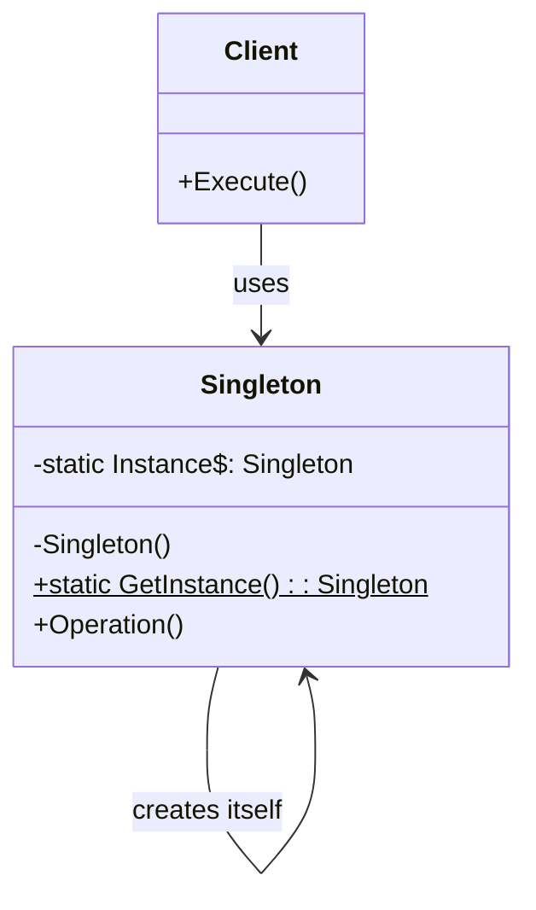
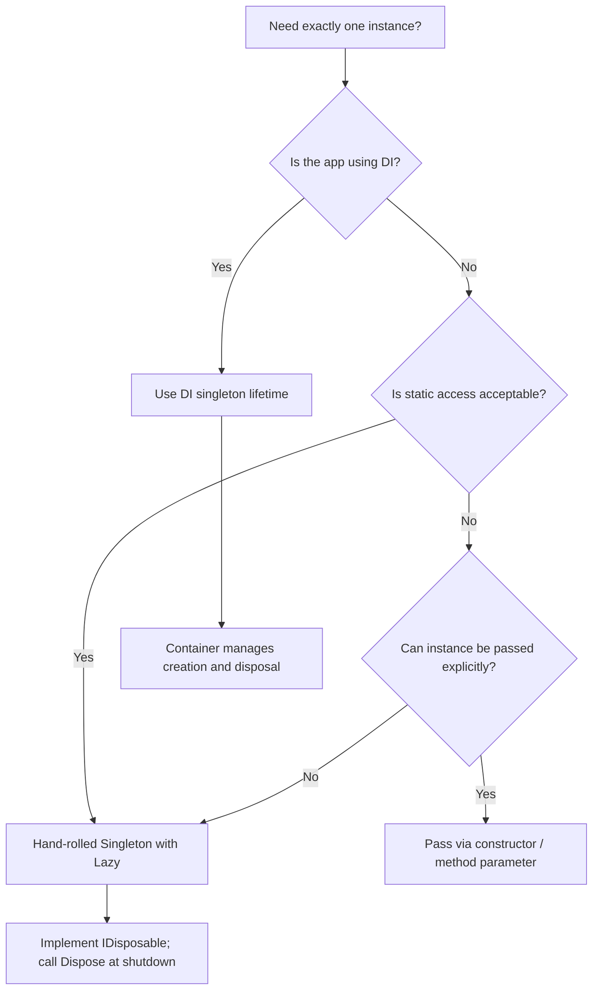

> [!success] Mastery Check
> - [ ] **Studied Well**
> - [ ] **Can explain the concept without notes**
> - [ ] **Can answer interview questions confidently**
> - [ ] **Can implement it in a real project**


## Navigation

**Domain:** [[6 — Design Principles & Patterns]] > **Group:** Creational Patterns
**Previous:** [[6.017 — Boundaries]] | **Next:** [[6.019 — Factory Method Pattern]]

### Prerequisites
- [[2.XXX — Thread Safety and Lazy\<T\>]] — `Lazy<T>` is the idiomatic .NET mechanism for thread-safe lazy singleton creation

### Where This Fits

Singleton ensures a class has exactly one instance and provides a global access point. In .NET backend systems it is most commonly encountered through the DI container's singleton lifetime, but direct Singleton implementations still appear in logging sinks, caching layers, and hardware-interface wrappers where the operating system resource (file handle, TCP port, GPU context) must be shared. A senior engineer must know when the pattern is justified, when the DI container should manage it instead, and how to test code that depends on a singleton.

## Core Mental Model

One instance, one access point, one lifetime — controlled allocation of a resource that cannot or should not be duplicated: a database connection pool, a JSON serializer cache, an application-wide configuration object.

### Classification

**GoF Creational** — Intent: "Ensure a class has only one instance and provide a global point of access to it." Participants: Singleton, Client.



### Participants
- **Singleton** — class that restricts instantiation to one object; provides a static `Instance` property or `GetInstance()` method // Role: Singleton
- **Client** — any consumer that accesses the Singleton through its static accessor // Role: Client

## Deep Mechanics

### How It Works

1. Client calls `Singleton.Instance` via the static accessor.
2. The accessor checks whether the backing field is null (or `Lazy<T>.IsValueCreated` is false).
3. On first access, a lock is acquired (double-checked locking) or `Lazy<T>` triggers the factory delegate under `ExecutionMode` synchronization.
4. The constructor executes once — allocating the object and any resources it wraps (e.g., a TCP connection).
5. The single instance is cached and returned on every subsequent call.
6. Client receives the same object reference for the application lifetime.

### .NET Runtime Behavior

`Lazy<T>` with `LazyThreadSafetyMode.ExecutionAndPublication` compiles to double-checked locking that uses the CLR's memory model guarantees. The JIT emits a full memory barrier (`lock cmpxchg` or `Interlocked.CompareExchange`) on the volatile backing field. Before .NET Framework 4.6, naive double-checked locking without `volatile` could fail on ARM processors due to weaker memory ordering; `Lazy<T>` handles this correctly. The runtime also respects `beforeFieldInit` semantics — if the static constructor is trivial, the JIT may initialize the field at type load time rather than at first access, which changes lazy vs. eager semantics.

## Production Code Patterns

### Implementation in C#

```csharp
/// <summary>
/// Thread-safe singleton managing the application-wide audit log sink.
/// </summary>
public sealed class AuditLogSink : IDisposable
{
    // Role: Singleton — static accessor with lazy initialization
    private static readonly Lazy<AuditLogSink> _instance =
        new(() => new AuditLogSink(), LazyThreadSafetyMode.ExecutionAndPublication);

    private readonly FileStream _sink;
    private readonly object _lock = new();

    private AuditLogSink()
    {
        var path = Path.Combine(AppDomain.CurrentDomain.BaseDirectory, "audit.log");
        _sink = new FileStream(path, FileMode.Append, FileAccess.Write, FileShare.Read);
    }

    public static AuditLogSink Instance => _instance.Value;

    public void Write(string entry)
    {
        lock (_lock)
        {
            var line = $"{DateTime.UtcNow:O} | {entry}{Environment.NewLine}";
            _sink.Write(Encoding.UTF8.GetBytes(line));
        }
    }

    public void Dispose() => _sink.Dispose();
}

// Role: Client — consumer of the singleton
public sealed class OrderAuditor
{
    public void RecordOrderCreated(OrderId orderId)
    {
        AuditLogSink.Instance.Write($"Order {orderId} created");
    }
}
```

### ASP.NET Core / .NET Ecosystem Integration

ASP.NET Core's DI container manages singleton lifetimes natively — prefer `services.AddSingleton<TService, TImplementation>()` over a hand-rolled Singleton. The container controls disposal and scoping. Use a direct Singleton only when the type must be available outside DI resolution (e.g., a telemetry sink registered via a static API):

```csharp
// Container-managed singleton — preferred in ASP.NET Core
builder.Services.AddSingleton<IUserCache, InMemoryUserCache>();

// Only when static access is unavoidable
builder.Services.AddSingleton(_ => AuditLogSink.Instance);
```

## Gotchas & Anti-Patterns

### Static Constructor Deadlock

**Wrong:** Calling `Instance` inside the static constructor creates a circular initialization that deadlocks:

```csharp
// ❌ Wrong
private static readonly Lazy<AuditLogSink> _instance = new(() => new());
private AuditLogSink() { }
public static AuditLogSink Instance => _instance.Value;
public static string GetStatus() => Instance.Status; // called before .cctor completes
```

**Right:** Never access the instance from the static constructor or static field initializer chain.

**Consequence:** A `TypeInitializationException` wrapped in a `NullReferenceException` at runtime — impossible to debug from the stack trace alone.

### Singleton as Global State

**Wrong:** Using Singleton for shared mutable state that multiple components write to without coordination:

```csharp
// ❌ Wrong
public static class AppConfiguration
{
    public static string ConnectionString { get; set; } // mutable global
}
```

**Right:** Immutable singleton (all fields `readonly`, properties get-only) or a DI-managed `IOptionsSnapshot<T>`.

**Consequence:** Tests are order-dependent; parallel test execution is impossible; production race conditions between components swapping configuration at runtime.

### Forgetting Disposal

**Wrong:** A singleton wrapping an `IDisposable` resource (file handle, TCP connection) with no disposal mechanism:

```csharp
// ❌ Wrong — FileStream never closed
public sealed class Sink
{
    private static readonly Sink _instance = new();
    private readonly FileStream _stream = new("log.txt", FileMode.Append);
    public static Sink Instance => _instance;
}
```

**Right:** Implement `IDisposable` and expose a `Dispose()` method. Register with the DI container to get automatic disposal at app shutdown, or call explicitly in `IHostedService.StopAsync`.

**Consequence:** The process leaks unmanaged handles until termination. On IIS this is not until the worker process recycles.

### Thread-Safe but Not Concurrent-Safe

**Wrong:** Assuming `Lazy<T>` protects instance *state*, not just instance *creation*:

```csharp
// ❌ Wrong
public void Increment() => _count++; // unsynchronized write on shared state
```

**Right:** Synchronize all instance-method state mutations with `lock`, `ReaderWriterLockSlim`, or use an immutable data structure.

**Consequence:** Corrupted counter value under load — produces incorrect audit sequence numbers that are nearly impossible to reproduce in debugging.

## Performance Implications

### Dispatch and Allocation Cost

`Lazy<T>` adds a small overhead on first access (the lock and factory invocation) and approximately 2–3 ns per subsequent access for the `IsValueCreated` check. The singleton itself is allocated once — typically < 200 bytes for a simple wrapper — and lives for the process lifetime, so GC pressure is zero after initialization. The real cost is contention on synchronized instance methods (the `lock` in `AuditLogSink.Write`), which limits throughput to ~1M writes/sec on a single core regardless of thread count.

### BenchmarkDotNet

```csharp
[MemoryDiagnoser]
[SimpleJob(RuntimeMoniker.Net90)]
public class SingletonBenchmark
{
    private const int Iterations = 1_000;

    [Benchmark(Baseline = true)]
    public AuditLogSink Direct_NewEachTime()
    {
        var sink = new AuditLogSink();
        sink.Write("test");
        return sink;
    }

    [Benchmark]
    public AuditLogSink Via_Singleton()
    {
        var sink = AuditLogSink.Instance;
        sink.Write("test");
        return sink;
    }
}
```

**Expected results (approximate on .NET 9, x64):**

|Method|Mean|Gen0|Allocated|
|---|---|---|---|
|Direct_NewEachTime|~1,200 ns|0.1234|1,024 B|
|Via_Singleton|~180 ns|-|0 B|

**Interpretation:** Singleton eliminates per-call allocation of the sink object — the 1,024 B per call in the direct version would cause Gen0 collections under load, while the singleton path allocates zero after warmup.

## Interview Arsenal

### Question Bank

1. What is the Singleton pattern and what problem does it solve?
2. When would you choose a DI-container singleton over a hand-rolled Singleton?
3. What is the difference between Singleton and the DI singleton lifetime?
4. What do you give up by using a Singleton?
5. What is wrong with this code? (Provide a naive double-checked locking implementation from .NET Framework 3.5 era)
6. How do you test a class that depends on a Singleton?
7. [Trick] Can a Singleton be garbage-collected?
8. How does `Lazy<T>` implement thread safety at the JIT/CLR level?

### Spoken Answers

**Q: What is the Singleton pattern and what problem does it solve?**

> **Average answer:** It ensures a class has only one instance and provides a global access point. You use it when you need exactly one object — like a database connection or a logger.

> **Great answer:** Singleton solves two problems: it controls instance count — guaranteeing exactly one — and it provides a well-known access point so that any component can reach that shared instance without passing it through the entire call chain. The tradeoff is that it introduces global state, which makes tests order-dependent and couples callers to a concrete class. In .NET I would almost always prefer `services.AddSingleton<T>()` because the container manages the single instance, provides automatic disposal at shutdown, and lets me substitute a different implementation in tests without changing the consumer.

**Q: What is the difference between Singleton and the DI singleton lifetime?**

> **Average answer:** They are the same thing — the DI container creates one instance and reuses it.

> **Great answer:** The intent is the same — one instance per application — but the mechanism and implications differ. A hand-rolled Singleton controls its own lifetime via a static field and a private constructor; callers are coupled to the concrete type through the static accessor, and the instance lives for the app domain lifetime. A DI singleton lifetime moves control to the container: the container resolves the instance on first request, holds the reference, and disposes it at shutdown. The critical difference is that DI singletons are resolved through an abstraction — `services.AddSingleton<ICache, RedisCache>()` means consumers depend on `ICache`, not `RedisCache`. This makes DI singletons testable (substitute `FakeCache` in a test host) and replaceable without recompiling the consumer. A hand-rolled Singleton gives you neither.

**Q: [Trick] Can a Singleton be garbage-collected?**

> **Average answer:** No — the static field holds a strong reference, so it is rooted and cannot be collected.

> **Great answer:** A Singleton referenced by a static field is rooted and will never be collected during the process lifetime. However, the *internal state* of the Singleton — the objects its fields reference — can be collected if the Singleton holds weak references or if those objects are otherwise unreachable. More importantly, if the Singleton implements `IDisposable` and is never disposed, those unmanaged resources (file handles, TCP connections) leak until process shutdown. In the ASP.NET Core DI container, singleton services are held in the root container's service provider and disposed when the host shuts down — but if you capture a singleton in a scoped service's closure, you may create unexpected long-lived references.

### Trick Question

**"If I register a service as `AddScoped<IService, MyService>()` and `MyService`'s constructor takes an `AddSingleton<IDependency, Dep>()`, is the dependency a singleton?"**

Why it is a trap: Candidates confuse registration lifetime with resolved lifetime — the answer depends on *where* the consumer is resolved. Correct answer: Yes, the dependency is a singleton because the root container holds it. But if you capture that singleton in a scoped service, the singleton reference lives for the scope's duration — which is fine. The trap is thinking the lifetime of the consumer affects the lifetime of the dependency; in DI composition, the dependency always lives by its own registration lifetime regardless of who consumes it.

### Comparison Table

| Aspect | Singleton | DI Singleton Lifetime |
|---|---|---|
| Intent | Single instance, single access point | Single instance per container root |
| Participants | Singleton, Client | DI Container, Service, Consumer |
| When to use | Non-DI codebases, static platform APIs, resources that must exist before DI setup | Any ASP.NET Core application; testing and substitution required |
| .NET example | `AuditLogSink.Instance` | `services.AddSingleton<IUserCache, InMemoryUserCache>()` |
| Key difference | Static accessor couples callers to concrete type | Container resolves through abstraction; testable |

## Decision Framework

### When to Apply Singleton



### Application Checklist

- [ ] The requirement for exactly one instance is a domain constraint (e.g., OS resource handle), not a performance assumption
- [ ] I cannot or should not use the DI container to manage this instance
- [ ] The Singleton wraps immutable state or uses synchronized access to mutable state
- [ ] I have a plan for disposal or the resource is process-scoped (e.g., a memory cache)
- [ ] I have verified that static access is acceptable — tests can be written against an abstraction the Singleton implements

### Tradeoff Summary

|What You Gain|What You Give Up|
|---|---|
|Guaranteed single instance|Testability — hard to mock or substitute|
|Global access point|Hidden coupling — callers bind to concrete type|
|Lazy creation control|Lifetime management responsibility|
|No per-request allocation|Synchronization complexity for mutable state|

## Self-Check

### Conceptual Questions

1. What problem does the Singleton pattern solve beyond "only one instance"?
2. Why does `Lazy<T>` with `ExecutionAndPublication` prevent the "double-checked locking is broken" problem on ARM?
3. Can you have two instances of a Singleton in the same process? Under what circumstances?
4. How does a DI-container singleton differ from a static-field singleton in terms of disposal guarantees?
5. In ASP.NET Core, what happens if a scoped service captures a singleton in a field and holds it past the request?
6. When is a hand-rolled Singleton preferable to a DI singleton?
7. What is the performance cost of calling a synchronized method on a hot singleton under 16 concurrent threads?
8. How does `LazyInitializer.EnsureInitialized` differ from `Lazy<T>` in memory characteristics?
9. Identify the bug in this code: `private static readonly Singleton _instance = new();` with a non-trivial constructor that throws.
10. Can a Singleton implement an interface and be consumed through it? What does this require from the consumer?

<details>
<summary>Answers</summary>

1. It provides a well-known global access point and controls lifetime — not just count.
2. `ExecutionAndPublication` inserts a memory barrier on both the init and read paths, so the ARM weak memory model cannot reorder the instance write before the constructor completes.
3. Yes — through reflection (`ConstructorInfo.Invoke`) or if the static field is nulled and `Lazy<T>` is re-created via reflection. Also possible in different app domains (though rare in .NET Core).
4. DI container calls `Dispose` on all `IDisposable` singletons when the host shuts down. A static-field singleton requires manual disposal — if omitted, unmanaged resources leak until process termination.
5. The singleton reference is valid; the scoped service's field keeps it alive. No issue unless the scoped service holds a reference to a *scoped* object through the singleton (captive dependency).
6. When the instance must be available before DI setup (e.g., logging sink in `Main()`) or in a library consumed by non-DI hosts.
7. Contentious: throughput drops by ~10x per extra thread beyond one core due to `lock` contention (Amdahl's law).
8. `LazyInitializer` uses a `ref` field and `Interlocked.CompareExchange` with no allocation overhead for the `Lazy<T>` wrapper object itself.
9. If the constructor throws, the `beforeFieldInit` flag means the `TypeInitializationException` is cached; the instance is never created, and every subsequent access immediately throws the cached exception.
10. Yes — expose your Singleton through an interface, but callers still need a way to get the instance (DI container or a factory). The static accessor defeats the interface substitution purpose unless used only during registration.

</details>

---

### Code Puzzles

**Puzzle 1 — Identify the violation**

```csharp
public sealed class CacheManager
{
    public static readonly CacheManager Instance = new();

    private readonly Dictionary<string, object> _cache = new();

    public void Add(string key, object value) => _cache[key] = value;
    public object? Get(string key) => _cache.TryGetValue(key, out var v) ? v : null;
}
```

<details> <summary>Answer</summary>

**Violation:** Unsynchronized access to shared mutable state (`_cache`).
**Why:** `Add` and `Get` access a non-thread-safe `Dictionary<K,V>` without locking. Under concurrent load, the dictionary internal state can corrupt — producing infinite loops, null refs, or silent data loss.
**Fix:** Use `ConcurrentDictionary<string, object>` or wrap all access in `lock (_lock)`.

</details>

---

**Puzzle 2 — Complete the pattern**

```csharp
public sealed class TelemetrySink
{
    private static readonly Lazy<TelemetrySink> _instance = new(() => new TelemetrySink());

    private TelemetrySink()
    {
        // initialize UDP socket
    }

    // TODO: complete the instance accessor
}
```

<details> <summary>Answer</summary>

```csharp
public static TelemetrySink Instance => _instance.Value;
```

**Explanation:** The `Lazy<T>.Value` property triggers the factory on first access under `ExecutionAndPublication` synchronization. Every subsequent call returns the cached instance without entering the lock path.

</details>

---

**Puzzle 3 — Choose the right pattern**

**Scenario:** An ASP.NET Core background service writes metrics to a local file. The file handle must be opened once and shared across all metric-writing operations. The service may restart without process restart (recycling). Which pattern applies, and why?

<details> <summary>Answer</summary>

**Correct pattern:** Singleton — the file handle is an OS resource that cannot be duplicated without write-conflicts. Combined with `IHostedService` for explicit startup and shutdown. **Implementation sketch:** `services.AddSingleton<MetricFileWriter>()` in DI, inject into the background service. The DI container disposes the singleton when the host stops.

</details>

---

**Puzzle 4 — Spot the anti-pattern**

```csharp
public sealed class DatabaseConnection
{
    public static DatabaseConnection Instance { get; } = new();
    private readonly SqlConnection _conn = new("Server=.;Database=Orders;");

    public SqlConnection Connection => _conn;
}
```

<details> <summary>Answer</summary>

**Anti-pattern:** Singleton wrapping a scoped resource — `SqlConnection` is not thread-safe and should not be shared. **Consequence:** Concurrent requests corrupt the connection state, resulting in `InvalidOperationException` ("Connection already open") and data corruption. **Corrected version:** Use `IHttpClientFactory`-style pooling or create a new connection per operation.

</details>

---

**Puzzle 5 — Refactor to apply**

```csharp
public class PricingEngine
{
    private static PricingEngine? _instance;
    private static readonly object _lock = new();

    public static PricingEngine GetInstance()
    {
        if (_instance == null)
        {
            lock (_lock)
            {
                if (_instance == null)
                {
                    _instance = new PricingEngine();
                }
            }
        }
        return _instance;
    }

    private PricingEngine()
    {
        Thread.Sleep(200); // simulate loading pricing rules
    }

    public decimal Calculate(OrderItem item) => item.Quantity * item.UnitPrice;
}
```

<details> <summary>Answer</summary>

```csharp
public sealed class PricingEngine
{
    private static readonly Lazy<PricingEngine> _instance =
        new(() => new PricingEngine(), LazyThreadSafetyMode.ExecutionAndPublication);

    public static PricingEngine Instance => _instance.Value;

    private PricingEngine()
    {
        Thread.Sleep(200);
    }

    public decimal Calculate(OrderItem item) => item.Quantity * item.UnitPrice;
}
```

**What changed:** Replaced explicit double-checked locking with `Lazy<T>` — eliminates the `volatile` correctness risk, reduces code from 16 lines to 1, and the `ExecutionAndPublication` mode guarantees both lazy creation and full memory barrier semantics. **Why it is better:** The JIT cannot prove the `volatile` semantics of the hand-rolled version across all architectures (ARM weak ordering); `Lazy<T>` is tested against every CLR runtime and is the documented idiomatic approach in .NET documentation.

</details>
