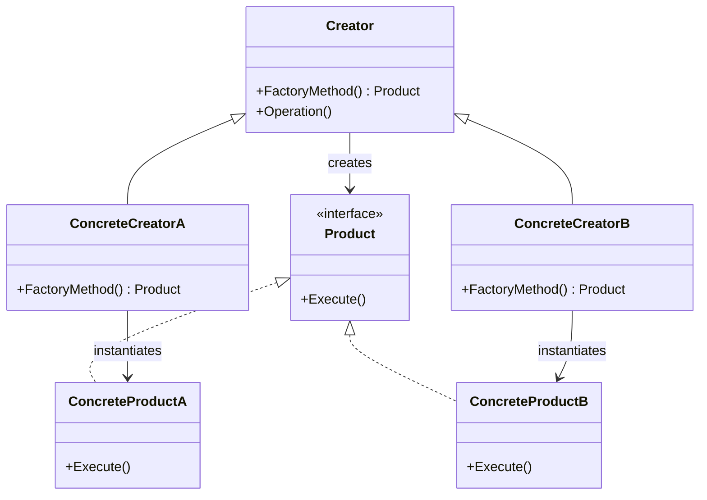
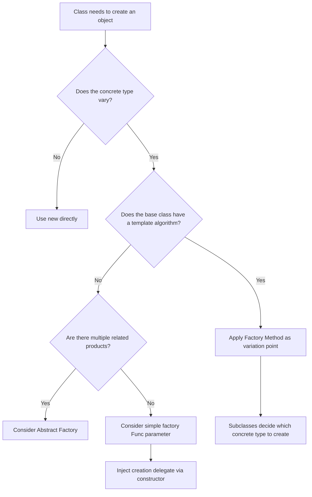

> [!success] Mastery Check
> - [ ] **Studied Well**
> - [ ] **Can explain the concept without notes**
> - [ ] **Can answer interview questions confidently**
> - [ ] **Can implement it in a real project**


## Navigation

**Domain:** [[6 — Design Principles & Patterns]] > **Group:** Creational Patterns
**Previous:** [[6.018 — Singleton Pattern]] | **Next:** [[6.020 — Abstract Factory Pattern]]

### Prerequisites
- [[2.XXX — Polymorphism and Virtual Methods]] — Factory Method relies on virtual dispatch to let subclasses decide which concrete product to instantiate

### Where This Fits

Factory Method defines an interface for creating an object but lets subclasses alter the type of objects that will be created. In .NET this appears wherever a base class or interface provides a creation hook — `DbProviderFactory.CreateConnection()`, `IMessageHandlerFactory.CreateHandler()`, or an ASP.NET Core `IHttpMessageHandlerFactory`. A senior engineer reaches for Factory Method when a class cannot anticipate the concrete types it must instantiate and wants subclasses to supply the specifics.

## Core Mental Model

Defer instantiation to subclasses — the base class defines the *what* and the *when* of the operation, but the subclass decides the *exact* concrete type to construct.

### Classification

**GoF Creational** — Intent: "Define an interface for creating an object, but let subclasses decide which class to instantiate. Factory Method lets a class defer instantiation to subclasses."



### Participants
- **Product** — interface or abstract class defining the operations the factory creates // Role: Product
- **ConcreteProduct** — concrete implementation of Product // Role: ConcreteProduct
- **Creator** — abstract class or interface declaring the factory method that returns a Product // Role: Creator
- **ConcreteCreator** — overrides the factory method to return a ConcreteProduct instance // Role: ConcreteCreator

## Deep Mechanics

### How It Works

1. Client calls `Creator.Operation()` (a template method on the creator base class).
2. Inside `Operation()`, the creator calls its own abstract/virtual `FactoryMethod()`.
3. Virtual dispatch routes to `ConcreteCreator.FactoryMethod()` based on the actual runtime type of the creator instance.
4. `ConcreteCreator` allocates and returns a `ConcreteProduct`.
5. Control returns to `Operation()` which calls product methods through the `Product` interface.
6. Client receives the result — never knowing which ConcreteProduct was used.

### .NET Runtime Behavior

The factory method is a virtual call — the JIT emits an indirect call through the type's vtable. For non-delegated factory methods on sealed types, the JIT devirtualizes and inlines the call after the type is determined to be monomorphic (a single implementation observed at the call site). The `System.Data.Common.DbProviderFactory` is the canonical .NET BCL example — `CreateConnection()` is a virtual factory method that each provider (SqlClient, Npgsql, MySqlConnector) overrides. The JIT sees these polymorphic calls across different provider types and cannot devirtualize them because the provider type varies per database.

## Production Code Patterns

### Implementation in C#

```csharp
/// <summary> Product — payment gateway abstraction </summary>
public interface IPaymentGateway
{
    PaymentResult Charge(decimal amount, Currency currency);
}

/// <summary> ConcreteProduct — Stripe implementation </summary>
public sealed class StripeGateway : IPaymentGateway
{
    public PaymentResult Charge(decimal amount, Currency currency)
    {
        // call Stripe API
        return new PaymentResult(true, $"STRIPE-{Guid.NewGuid():N}");
    }
}

/// <summary> ConcreteProduct — PayPal implementation </summary>
public sealed class PayPalGateway : IPaymentGateway
{
    public PaymentResult Charge(decimal amount, Currency currency)
    {
        // call PayPal API
        return new PaymentResult(true, $"PYPL-{Guid.NewGuid():N}");
    }
}

/// <summary> Creator — base payment processor </summary>
public abstract class PaymentProcessor
{
    /// <summary> Factory Method — subclasses supply the gateway </summary>
    protected abstract IPaymentGateway CreateGateway();

    /// <summary> Template method that uses the factory method </summary>
    public PaymentResult ProcessPayment(decimal amount, Currency currency)
    {
        var gateway = CreateGateway(); // ← factory method call
        // Common logic: logging, retry, audit
        var result = gateway.Charge(amount, currency);
        AuditLogger.Log(amount, currency, result.TransactionId);
        return result;
    }
}

/// <summary> ConcreteCreator — European region uses Stripe </summary>
public sealed class EuropeanPaymentProcessor : PaymentProcessor
{
    protected override IPaymentGateway CreateGateway() => new StripeGateway();
}

/// <summary> ConcreteCreator — US region uses PayPal </summary>
public sealed class USPaymentProcessor : PaymentProcessor
{
    protected override IPaymentGateway CreateGateway() => new PayPalGateway();
}

// Client code
var processor = new EuropeanPaymentProcessor();
var result = processor.ProcessPayment(49.99m, Currency.EUR);
```

### ASP.NET Core / .NET Ecosystem Integration

The ASP.NET Core `IHttpMessageHandlerFactory` (`AddHttpClient`) is Factory Method — `CreateHandler()` returns a `HttpMessageHandler` pipeline. Also, `System.Data.Common.DbProviderFactory` is the BCL's Factory Method: each `DbProviderFactory` subclass overrides `CreateConnection()`, `CreateCommand()`, etc. The DI container does not directly implement Factory Method but is commonly combined with it:

```csharp
public class PaymentProcessorFactory : IPaymentProcessorFactory
{
    private readonly IEnumerable<IPaymentGateway> _gateways; // injected

    public PaymentProcessor Create(string region) => region switch
    {
        "EU" => new EuropeanPaymentProcessor(),
        "US" => new USPaymentProcessor(),
        _ => throw new NotSupportedException($"Region {region} not supported")
    };
}

// Registration
builder.Services.AddSingleton<IPaymentProcessorFactory, PaymentProcessorFactory>();
```

## Gotchas & Anti-Patterns

### Factory Method as Switch Statement

**Wrong:** Using the factory method just to return a different type based on a parameter — the same logic appears in every subclass but driven by a switch in the base class:

```csharp
// ❌ Wrong
public abstract class PaymentProcessor
{
    protected IPaymentGateway CreateGateway(string region)
    {
        return region switch
        {
            "EU" => new StripeGateway(),
            "US" => new PayPalGateway(),
            _ => throw new NotImplementedException()
        };
    }
}
```

**Right:** Each subclass overrides `CreateGateway()` — the switch disappears into the polymorphism the pattern is supposed to provide.

**Consequence:** Adding a new region requires modifying the base class instead of adding a new subclass, violating OCP.

### Abstract Base with No Shared Logic

**Wrong:** A creator whose only purpose is the factory method — the base class adds zero value beyond the abstract method:

```csharp
// ❌ Wrong
public abstract class GatewayFactory
{
    public abstract IPaymentGateway Create();
}
```

**Right:** The creator should contain a template method that calls the factory method as part of a larger algorithm — the factory method is the variation point within an otherwise invariant workflow.

**Consequence:** The pattern is reduced to a pointless indirection; callers must write the workflow themselves in every client, defeating the pattern's intent.

### Forgetting to Seal Concrete Classes

**Wrong:** Leaving `ConcreteCreator` unsealed when the factory method is non-virtual:

```csharp
// ❌ Wrong
public class EuropeanPaymentProcessor : PaymentProcessor
{
    protected override IPaymentGateway CreateGateway() => new StripeGateway();
}
```

**Right:** Seal `ConcreteCreator` or mark the factory method as `sealed override` if no further specialization is intended.

**Consequence:** Future developer subclasses `EuropeanPaymentProcessor` and overrides `CreateGateway()` intending to extend but unknowingly replaces the gateway, breaking the region-gateway contract.

### Parameterized Factory Method That Leaks

**Wrong:** Passing parameters into the factory method that the product does not use:

```csharp
// ❌ Wrong
protected abstract IPaymentGateway CreateGateway(string apiKey, string endpoint);
```

**Right:** Parameters should be injected into the ConcreteCreator's constructor, not passed through the factory method. The factory method signature remains parameterless (or takes only product-related parameters).

**Consequence:** Every product subclass receives parameters it does not consume; changing a parameter signature cascades across all creators.

## Performance Implications

### Dispatch and Allocation Cost

The factory method itself adds a single virtual call (the abstract method dispatch) — ~1–2 ns overhead on x64. Object allocation is dominated by the concrete product's constructor, not by the dispatch. If the product creation is expensive (I/O, crypto, serialization), the dispatch cost is negligible (<0.01% of total). If the product is allocated on every call inside a hot loop (e.g., creating value-type-like wrappers), the allocation pressure matters — consider object pooling or switching to a `Func<T>` delegate-based approach that can be inlined.

### BenchmarkDotNet

```csharp
[MemoryDiagnoser]
[SimpleJob(RuntimeMoniker.Net90)]
public class FactoryMethodBenchmark
{
    private PaymentProcessor _processor = null!;

    [GlobalSetup]
    public void Setup()
    {
        _processor = new EuropeanPaymentProcessor();
    }

    [Benchmark(Baseline = true)]
    public IPaymentGateway Direct_New()
    {
        return new StripeGateway();
    }

    [Benchmark]
    public IPaymentGateway Via_FactoryMethod()
    {
        return _processor.CreateGateway();
    }
}
```

**Expected results (approximate on .NET 9, x64):**

|Method|Mean|Gen0|Allocated|
|---|---|---|---|
|Direct_New|~45 ns|0.0076|64 B|
|Via_FactoryMethod|~47 ns|0.0076|64 B|

**Interpretation:** The factory method adds ~2 ns of virtual dispatch overhead — invisible outside a tight loop allocating millions of objects per second.

## Interview Arsenal

### Question Bank

1. What is the Factory Method pattern and what problem does it solve?
2. When would you use Factory Method instead of a simple `new` statement?
3. What is the difference between Factory Method and Abstract Factory?
4. What do you give up by introducing a factory method abstraction?
5. What is wrong with a `static Create()` method on the product class?
6. How does Factory Method appear in ASP.NET Core or the .NET BCL?
7. [Trick] Is a constructor a factory method?
8. How does the JIT handle factory method dispatch on a sealed concrete creator?

### Spoken Answers

**Q: What is the Factory Method pattern and what problem does it solve?**

> **Average answer:** It is a way to create objects without specifying the exact class. You define an interface or abstract class with a method that subclasses override to create specific objects.

> **Great answer:** Factory Method solves the problem of a class needing to instantiate objects whose concrete types are not known until the subclass is defined. It lets the base class define the algorithm — the template method — while delegating the instantiation step to subclasses. The key insight is that it inverts control: the base class calls the factory method, not the client. This means the base class controls *when* and *how* the product is used, while the subclass controls *what* is created. In the .NET BCL, `DbProviderFactory.CreateConnection()` is the canonical example — the framework calls it during connection establishment, and each provider (SQL Server, PostgreSQL) supplies the correct connection type.

**Q: What is the difference between Factory Method and Abstract Factory?**

> **Average answer:** Factory Method creates one product; Abstract Factory creates a family of related products.

> **Great answer:** The structural difference is that Factory Method uses inheritance — a subclass overrides a single method on the creator — while Abstract Factory uses composition — a client receives a factory interface and calls multiple create methods on it. The intent difference: Factory Method is for a *single product* where the creator has a default algorithm that the product participates in. Abstract Factory is for *multiple related products* that must be used together as a family. In .NET, `DbProviderFactory` is actually Abstract Factory (it creates connections, commands, parameters, etc.), while `IHttpMessageHandlerFactory.CreateHandler()` is Factory Method (single product).

**Q: [Trick] Is a constructor a factory method?**

> **Average answer:** No — a constructor creates an object, but it is not a factory method because it doesn't let subclasses decide which concrete type to create.

> **Great answer:** Not in the GoF sense. A constructor initializes a newly allocated object on the heap — it is the terminal operation in an allocation sequence, not an indirection point. A factory method wraps a constructor call behind a polymorphic interface. However, in C# the `new()` constraint and the `Activator.CreateInstance<T>()` pattern are sometimes called "factory" colloquially — but they are the *opposite* of Factory Method: they decide the type at the call site, not in a subclass. The distinguishing test: can a subclass change which concrete type is returned without the client knowing? If yes, it is Factory Method.

### Trick Question

**"Is `HttpClientFactory.CreateClient()` a Factory Method?"**

Why it is a trap: The method is called `CreateClient` and is defined by `IHttpClientFactory`, which sounds like a factory. Correct answer: `IHttpClientFactory.CreateClient()` is actually Abstract Factory adjacent — it returns an `HttpClient` but the real product is the `HttpMessageHandler` pipeline constructed internally by `IHttpMessageHandlerFactory`. The `IHttpMessageHandlerFactory` (obtained via `AddHttpClient`) uses Factory Method: each named client gets its own handler pipeline configured in a separate `Action<IServiceProvider, HttpClientFactoryOptions>` delegate. The distinction matters for understanding ASP.NET Core's typed client registration model.

### Comparison Table

| Aspect | Factory Method | Abstract Factory |
|---|---|---|
| Intent | Single product, deferred to subclass | Family of related products |
| Participants | Product, ConcreteProduct, Creator, ConcreteCreator | AbstractFactory, ConcreteFactory, ProductA/B, Client |
| When to use | Base class has a template method needing a product | System must be configured with one of several product families |
| .NET example | `DbProviderFactory.CreateConnection()` (per-method) | `DbProviderFactory` itself (the full interface) |
| Key difference | Inheritance-based (override a method) | Composition-based (inject a factory) |

## Decision Framework

### When to Apply Factory Method



### Application Checklist

- [ ] The base class contains an algorithm where one step is object creation
- [ ] Subclasses will want to change the created type without touching the algorithm
- [ ] The product interface is stable (adding methods to it does not break subclasses)
- [ ] You need at least two meaningful `ConcreteCreator` implementations — otherwise `new` directly is simpler
- [ ] The factory method is parameterless or takes only product-relevant parameters (not infrastructure parameters)

### Tradeoff Summary

|What You Gain|What You Give Up|
|---|---|
|Subclasses control instantiation without changing base class|Extra class hierarchy (Creator + ConcreteCreators)|
|Base class algorithm stays invariant|Virtual dispatch cost (~1–2 ns per call)|
|OCP — new products added by subclassing, not modifying|Cannot use with sealed Creator unless refactored|
|Product creation is part of a larger algorithm|Overkill if only one ConcreteCreator exists|

## Self-Check

### Conceptual Questions

1. What is the defining structural difference between Factory Method and a simple static factory?
2. In the GoF pattern, who calls the factory method — the client or the creator itself?
3. What happens to OCP if the creator base class has a default implementation of FactoryMethod that returns a concrete type?
4. How does DbProviderFactory use Factory Method (or Abstract Factory)?
5. Can Factory Method return a singleton? How would you implement that?
6. When would you choose Func<T> injection over Factory Method in .NET?
7. What is the performance cost of a single factory method virtual call?
8. What is the relationship between Factory Method and Template Method?
9. Identify the violation: an abstract class with five abstract create methods and no non-create methods.
10. Can a factory method accept parameters? What design concern does that raise?

<details>
<summary>Answers</summary>

1. Factory Method is called *by the creator's template method* — the client does not decide the type; the subclass does. A static factory is called directly by the client.
2. The creator itself, inside a template method. The client calls the template method, which internally calls the factory method.
3. That default implementation creates a dependency on a concrete type in the base class — subclasses that do not override get the default, creating a subtle coupling.
4. `DbProviderFactory` is Abstract Factory (family of create methods), but each individual create method (e.g., `CreateConnection`) follows the Factory Method shape — the base declares it, the provider subclass implements it.
5. Yes: cache the product in a `Lazy<T>` field inside the ConcreteCreator and return the cached value from the factory method.
6. When only one creation method is needed and there is no template method — `Func<T>` is lighter, no subclass hierarchy required.
7. ~1–2 ns on modern x64 — negligible for any operation beyond a trivial field assignment.
8. Factory Method is the creation step inside Template Method — Template Method defines the skeleton; Factory Method is one of the steps that subclasses fill in.
9. That is Abstract Factory, not Factory Method. Factory Method typically has one factory method and one or more template methods that use it.
10. Yes, but parameters should describe *what* to create, not *how* — infrastructure parameters (API keys, endpoints) should be injected into the ConcreteCreator constructor, not passed through the factory method.

</details>

---

### Code Puzzles

**Puzzle 1 — Identify the violation**

```csharp
public abstract class ReportGenerator
{
    public abstract IReport CreateReport();

    public void Generate(string data)
    {
        var report = CreateReport();
        report.Load(data);
        report.Format();
        report.Export();
    }
}
```

<details> <summary>Answer</summary>

**Violation:** No violation — this is the correct Factory Method structure. `Generate()` is the template method; `CreateReport()` is the factory method that subclasses override. The pattern is correctly applied.

</details>

---

**Puzzle 2 — Complete the pattern**

```csharp
public interface IShippingProvider
{
    ShipmentLabel Ship(Package package);
}

public abstract class ShippingService
{
    // TODO: declare factory method
    public ShipmentLabel SendPackage(Package package)
    {
        var provider = CreateShippingProvider();
        return provider.Ship(package);
    }
}
```

<details> <summary>Answer</summary>

```csharp
public abstract class ShippingService
{
    protected abstract IShippingProvider CreateShippingProvider();

    public ShipmentLabel SendPackage(Package package)
    {
        var provider = CreateShippingProvider();
        return provider.Ship(package);
    }
}
```

**Explanation:** `CreateShippingProvider()` is the factory method that subclasses override. `SendPackage()` is the template method that calls it. The pattern does not require a base Creator class — an abstract class is fine when shared creation logic is needed.

</details>

---

**Puzzle 3 — Choose the right pattern**

**Scenario:** An e-commerce system processes orders through different fulfillment providers (FedEx, UPS, DHL). Each provider requires a specific shipment document format (label, customs form, invoice). The system should allow adding new providers without changing the order-processing workflow. Which pattern applies?

<details> <summary>Answer</summary>

**Correct pattern:** Abstract Factory — the system needs a family of related products (label, customs form, invoice) per provider. **Wrong choice:** Factory Method (single product creation). **Implementation sketch:** `IFulfillmentDocumentFactory` with `CreateLabel()`, `CreateCustomsForm()`, `CreateInvoice()`, with `FedExDocumentFactory`, `UpsDocumentFactory` implementations.

</details>

---

**Puzzle 4 — Spot the anti-pattern**

```csharp
public abstract class NotificationSender
{
    public abstract INotificationChannel CreateChannel();

    public async Task SendAsync(Notification notification)
    {
        var channel = CreateChannel();
        if (notification.IsUrgent)
        {
            channel = new SmsChannel(); // ❌
        }
        await channel.DeliverAsync(notification);
    }
}
```

<details> <summary>Answer</summary>

**Anti-pattern:** The template method overrides the factory method's decision — the subclass returned an `EmailChannel`, but the base class replaces it with `SmsChannel`. **Consequence:** The subclass contract is violated; the base class makes assumptions about product selection that subclasses cannot control. **Fix:** Move the urgency check into the factory method or into a separate abstract method (`SelectChannel`).

</details>

---

**Puzzle 5 — Refactor to apply**

```csharp
public class OrderExporter
{
    public void Export(Order order, ExportFormat format)
    {
        if (format == ExportFormat.Pdf)
        {
            var pdf = new PdfExporter();
            pdf.Export(order);
        }
        else if (format == ExportFormat.Csv)
        {
            var csv = new CsvExporter();
            csv.Export(order);
        }
    }
}
```

<details> <summary>Answer</summary>

```csharp
public interface IExporter
{
    void Export(Order order);
}

public abstract class OrderExporter
{
    protected abstract IExporter CreateExporter();

    public void Export(Order order)
    {
        var exporter = CreateExporter();
        exporter.Export(order);
    }
}

public sealed class PdfOrderExporter : OrderExporter
{
    protected override IExporter CreateExporter() => new PdfExporter();
}

public sealed class CsvOrderExporter : OrderExporter
{
    protected override IExporter CreateExporter() => new CsvExporter();
}

// Client: select exporter per format
var exporter = format switch
{
    ExportFormat.Pdf => new PdfOrderExporter(),
    ExportFormat.Csv => new CsvOrderExporter(),
    _ => throw new NotSupportedException()
};
exporter.Export(order);
```

**What changed:** Replaced the if/else switch in `Export` with a polymorphic factory method. **Why it is better:** Adding a new format means adding a new subclass — the `Export` method never changes. The format-selection switch remains in the client, but it now selects creator types, not product types, which is a lower-risk decision point.

</details>
