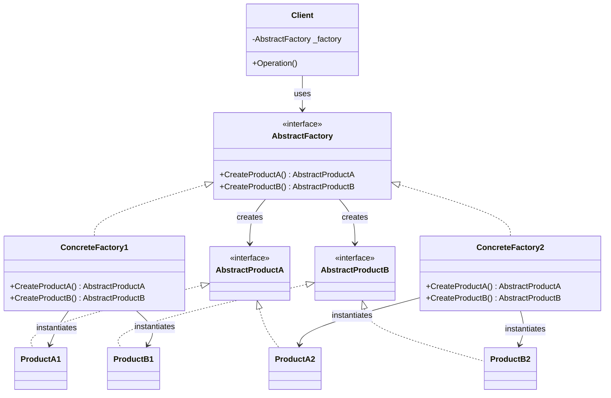
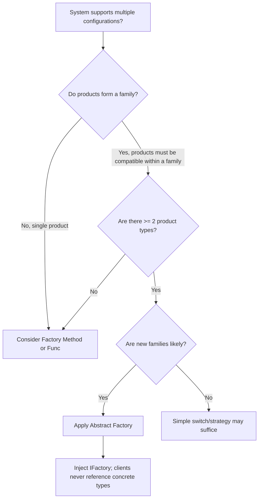

> [!success] Mastery Check
> - [ ] **Studied Well**
> - [ ] **Can explain the concept without notes**
> - [ ] **Can answer interview questions confidently**
> - [ ] **Can implement it in a real project**


## Navigation

**Domain:** [[6 — Design Principles & Patterns]] > **Group:** Creational Patterns
**Previous:** [[6.019 — Factory Method Pattern]] | **Next:** [[6.021 — Builder Pattern]]

### Prerequisites
- [[6.019 — Factory Method Pattern]] — Abstract Factory is often composed of Factory Methods; understanding the single-product case is prerequisite to understanding the product-family case

### Where This Fits

Abstract Factory provides an interface for creating families of related or dependent objects without specifying their concrete classes. In .NET this appears wherever a system must support multiple configurations of a subsystem — `DbProviderFactory` creates ADO.NET objects for different databases, an `IMonitoringStackFactory` could create a metrics client, a tracing client, and a logging sink together. A senior engineer reaches for Abstract Factory when a component must work with one of several product families (e.g., SQL vs. NoSQL storage, Stripe vs. PayPal checkout, AWS vs. Azure infrastructure) and the products within each family must be used together.

## Core Mental Model

One factory interface, multiple factory implementations — each factory produces an entire suite of compatible products. The client receives a factory and uses it to create products, never knowing which concrete product family it has, ensuring products from different families are never mixed.

### Classification

**GoF Creational** — Intent: "Provide an interface for creating families of related or dependent objects without specifying their concrete classes."



### Participants
- **AbstractFactory** — interface declaring creation methods for each abstract product type // Role: AbstractFactory
- **ConcreteFactory** — implements AbstractFactory; creates a specific family of concrete products // Role: ConcreteFactory
- **AbstractProductA / AbstractProductB** — interfaces for distinct product types in the family // Role: AbstractProduct
- **ProductA1 / ProductA2 / ProductB1 / ProductB2** — concrete implementations of the abstract products // Role: ConcreteProduct
- **Client** — uses only AbstractFactory and AbstractProduct interfaces // Role: Client

## Deep Mechanics

### How It Works

1. Client is initialized with an `AbstractFactory` instance (injected via constructor or configuration).
2. Client calls `factory.CreateProductA()` and `factory.CreateProductB()` to obtain the products it needs.
3. Virtual dispatch routes each create call to the `ConcreteFactory` implementation.
4. The concrete factory allocates the corresponding `ConcreteProductA` and `ConcreteProductB` — which are designed to be compatible with each other.
5. Client operates on products only through their `AbstractProduct` interfaces, never referencing concrete types.
6. To switch families, a different `ConcreteFactory` is injected — no client code changes.

### .NET Runtime Behavior

Abstract Factory adds one level of interface dispatch per product creation. Each `CreateXxx()` call is an interface method dispatch (the JIT loads the method pointer from the interface's vtable slot). For hot paths where products are created in a loop, the JIT may devirtualize if the factory type is monomorphic at the call site (e.g., a sealed factory assigned to a local). `DbProviderFactory` in ADO.NET is the canonical .NET BCL example — `DbProviderFactories.GetFactory(providerInvariantName)` returns a `DbProviderFactory` that is the Abstract Factory, and each call to `CreateConnection()`, `CreateCommand()`, `CreateParameter()` creates individual product objects. The JIT cannot devirtualize these because the factory type changes per connection string.

## Production Code Patterns

### Implementation in C#

```csharp
/// <summary> AbstractProductA — payment gateway abstraction </summary>
public interface IPaymentGateway
{
    PaymentResult Charge(decimal amount, Currency currency);
}

/// <summary> AbstractProductB — receipt provider abstraction </summary>
public interface IReceiptProvider
{
    Receipt GenerateReceipt(Order order, PaymentResult payment);
}

/// <summary> AbstractFactory — payment system factory </summary>
public interface IPaymentSystemFactory
{
    IPaymentGateway CreateGateway();      // Role: AbstractProductA factory method
    IReceiptProvider CreateReceiptProvider(); // Role: AbstractProductB factory method
}

// ─── Concrete Factory 1: Stripe ───────────────────────────────────────

/// <summary> ConcreteProductA </summary>
public sealed class StripeGateway : IPaymentGateway
{
    public PaymentResult Charge(decimal amount, Currency currency) =>
        new(true, $"STRIPE-{Guid.NewGuid():N}");
}

/// <summary> ConcreteProductB </summary>
public sealed class StripeReceiptProvider : IReceiptProvider
{
    public Receipt GenerateReceipt(Order order, PaymentResult payment) =>
        new Receipt(order.Id, payment.TransactionId, "Stripe");
}

/// <summary> ConcreteFactory1 </summary>
public sealed class StripePaymentFactory : IPaymentSystemFactory
{
    public IPaymentGateway CreateGateway() => new StripeGateway();
    public IReceiptProvider CreateReceiptProvider() => new StripeReceiptProvider();
}

// ─── Concrete Factory 2: PayPal ───────────────────────────────────────

public sealed class PayPalGateway : IPaymentGateway
{
    public PaymentResult Charge(decimal amount, Currency currency) =>
        new(true, $"PYPL-{Guid.NewGuid():N}");
}

public sealed class PayPalReceiptProvider : IReceiptProvider
{
    public Receipt GenerateReceipt(Order order, PaymentResult payment) =>
        new Receipt(order.Id, payment.TransactionId, "PayPal");
}

public sealed class PayPalPaymentFactory : IPaymentSystemFactory
{
    public IPaymentGateway CreateGateway() => new PayPalGateway();
    public IReceiptProvider CreateReceiptProvider() => new PayPalReceiptProvider();
}

// ─── Client ───────────────────────────────────────────────────────────

/// <summary> Role: Client — depends only on abstractions </summary>
public sealed class CheckoutService
{
    private readonly IPaymentSystemFactory _factory; // Role: AbstractFactory injected

    public CheckoutService(IPaymentSystemFactory factory)
    {
        _factory = factory;
    }

    public CheckoutResult ProcessOrder(Order order)
    {
        var gateway = _factory.CreateGateway();
        var receiptProvider = _factory.CreateReceiptProvider();

        var payment = gateway.Charge(order.Total, order.Currency);
        var receipt = receiptProvider.GenerateReceipt(order, payment);
        return new CheckoutResult(receipt, payment);
    }
}
```

### ASP.NET Core / .NET Ecosystem Integration

The .NET BCL's `System.Data.Common.DbProviderFactory` is the canonical Abstract Factory. Each database provider exposes a singleton factory: `SqlClientFactory.Instance`, `NpgsqlFactory.Instance`, `MySqlConnectorFactory.Instance`. The `DbProviderFactories.GetFactory()` method returns the correct factory based on the provider invariant name.

```csharp
// Switching database providers via Abstract Factory
var factory = DbProviderFactories.GetFactory("Npgsql");
await using var connection = factory.CreateConnection();
connection!.ConnectionString = connectionString;

await using var command = factory.CreateCommand();
command!.Connection = connection;
command.CommandText = "SELECT * FROM Orders";
```

Registration in ASP.NET Core when using Abstract Factory:

```csharp
builder.Services.AddSingleton<IPaymentSystemFactory, StripePaymentFactory>();
// Or switch based on configuration:
var factory = config["PaymentProvider"] == "Stripe"
    ? new StripePaymentFactory()
    : new PayPalPaymentFactory();
builder.Services.AddSingleton<IPaymentSystemFactory>(factory);
```

## Gotchas & Anti-Patterns

### Abstract Factory with Only One Product

**Wrong:** Defining an Abstract Factory when the factory creates only one product type — this is a Factory Method, not Abstract Factory:

```csharp
// ❌ Wrong
public interface IGatewayFactory
{
    IPaymentGateway Create();
}
```

**Right:** Use Factory Method (if the creator has a template method) or inject `Func<IPaymentGateway>` directly.

**Consequence:** The extra abstraction layer (the factory interface) adds indirection without providing the "family constraint" that justifies Abstract Factory.

### Mixing Product Families at Runtime

**Wrong:** Creating products from different concrete factories in the same context:

```csharp
// ❌ Wrong
var stripeFactory = new StripePaymentFactory();
var paypalFactory = new PayPalPaymentFactory();
var gateway = stripeFactory.CreateGateway();
var receipt = paypalFactory.CreateReceiptProvider(); // mixed family!
```

**Right:** The client always uses a single factory instance; the factory interface contract guarantees family compatibility.

**Consequence:** Inconsistent product family — receipts reference "PayPal" while the charge went through Stripe. In database terms, mixing `SqlClient` commands with `Oracle` connections causes runtime type mismatches.

### Adding Products to the Interface

**Wrong:** Adding a new creation method to `AbstractFactory` breaks all existing concrete factories:

```csharp
// ❌ Wrong — adding CreateRefundProvider() breaks all implementations
public interface IPaymentSystemFactory
{
    IPaymentGateway CreateGateway();
    IReceiptProvider CreateReceiptProvider();
    IRefundProvider CreateRefundProvider(); // new — breaks existing factories
}
```

**Right:** Use the Interface Segregation Principle — define a new `IRefundProviderFactory` that clients opt into, or use an abstract base class with virtual (non-breaking) defaults.

**Consequence:** Every `ConcreteFactory` must implement the new method, even if it does not support refunds. This forces stub implementations that throw `NotSupportedException` — a code smell.

### Abstract Factory as Service Locator

**Wrong:** Using the factory to return arbitrary services unrelated to the product family:

```csharp
// ❌ Wrong
public interface IServiceFactory
{
    IPaymentGateway CreatePaymentGateway();
    IEmailService CreateEmailService();
    IAuditLogger CreateAuditLogger(); // unrelated product
}
```

**Right:** One factory per product family. Email service and audit logger are separate concerns and should have separate abstractions.

**Consequence:** The factory becomes a god object that grows indefinitely, and clients that need only one product must depend on the entire factory.

## Performance Implications

### Dispatch and Allocation Cost

Each `CreateXxx()` call performs one interface dispatch (~1–2 ns) plus allocation of the concrete product. The factory instance is typically a singleton (no per-call allocation). The dominant cost is the product constructor, not the dispatch. For `DbProviderFactory` the product creation involves I/O (opening a connection), so the dispatch cost is negligible. In hot loops creating small objects (e.g., `DbParameter` objects in bulk insert), the combined dispatch + allocation can produce GC pressure — consider pooling or reusing product instances.

### BenchmarkDotNet

```csharp
[MemoryDiagnoser]
[SimpleJob(RuntimeMoniker.Net90)]
public class AbstractFactoryBenchmark
{
    private IPaymentSystemFactory _factory = null!;

    [GlobalSetup]
    public void Setup()
    {
        _factory = new StripePaymentFactory();
    }

    [Benchmark(Baseline = true)]
    public (IPaymentGateway, IReceiptProvider) Direct_New()
    {
        return (new StripeGateway(), new StripeReceiptProvider());
    }

    [Benchmark]
    public (IPaymentGateway, IReceiptProvider) Via_AbstractFactory()
    {
        return (_factory.CreateGateway(), _factory.CreateReceiptProvider());
    }
}
```

**Expected results (approximate on .NET 9, x64):**

|Method|Mean|Gen0|Allocated|
|---|---|---|---|
|Direct_New|~90 ns|0.0153|128 B|
|Via_AbstractFactory|~94 ns|0.0153|128 B|

**Interpretation:** The factory adds ~4 ns of interface dispatch (two calls) — invisible for any realistic operation. The allocation cost is identical because the same concrete types are created.

## Interview Arsenal

### Question Bank

1. What is Abstract Factory and what differentiates it from Factory Method?
2. When would you choose Abstract Factory over injecting individual `Func<T>` delegates?
3. What is the difference between Abstract Factory and Factory Method?
4. What do you give up by introducing Abstract Factory?
5. What happens when you add a new product type to the Abstract Factory interface?
6. How does `DbProviderFactory` demonstrate Abstract Factory in .NET?
7. [Trick] Can Abstract Factory return singletons?
8. How does Abstract Factory relate to the Open/Closed Principle?

### Spoken Answers

**Q: What is Abstract Factory and what differentiates it from Factory Method?**

> **Average answer:** Abstract Factory creates families of related objects. Factory Method creates one object. Abstract Factory has multiple creation methods.

> **Great answer:** The fundamental difference is structural: Abstract Factory uses *composition* — the client receives a factory object and calls its create methods — while Factory Method uses *inheritance* — a subclass overrides a single create method on the creator. The intent difference follows: Abstract Factory solves the problem of *product family consistency* — ensuring that all objects created together are compatible (e.g., Stripe gateway + Stripe receipt provider). Factory Method solves the problem of *deferred instantiation* — letting a subclass decide the concrete type for a single product that participates in the creator's algorithm. In .NET, `DbProviderFactory` is Abstract Factory: `CreateConnection()`, `CreateCommand()`, `CreateParameter()` all produce objects from the same database provider family.

**Q: What is the difference between Abstract Factory and Factory Method?**

> **Average answer:** Abstract Factory has many methods; Factory Method has one.

> **Great answer:** See above. The one-sentence distinction: Factory Method is inheritance-based and creates one product; Abstract Factory is composition-based and creates a family of products. In practice, Abstract Factory is often implemented as a collection of Factory Methods — each `CreateXxx()` method on the factory is a Factory Method. The key structural clue: if the creation logic lives in a base class override, it is Factory Method; if it lives in a separate object that the client holds, it is Abstract Factory.

**Q: [Trick] Can Abstract Factory return singletons?**

> **Average answer:** No — a factory creates new objects; a singleton returns the same object.

> **Great answer:** Yes — a ConcreteFactory can return the same cached instance from every `CreateXxx()` call. For example, if the payment gateway implementation is stateless and thread-safe, the factory can return a cached singleton. This is a valid optimization within the pattern — the Abstract Factory contract says "returns an IPaymentGateway," not "returns a new IPaymentGateway every call." The `DbProviderFactory` pattern in .NET does this: `SqlClientFactory.Instance` is a singleton, and its `CreateConnection()` creates a *new* `SqlConnection` each call, but `CreatePermission()` might return a cached instance. The contract is on the return type, not on the creation semantics.

### Trick Question

**"Is `IHostBuilder` an Abstract Factory?"**

Why it is a trap: `IHostBuilder.Build()` creates a host, and `ConfigureServices` configures services — it looks like object creation. Correct answer: `IHostBuilder` is a **Builder**, not Abstract Factory. The Builder pattern constructs a complex object step by step (ConfigureWebHost, ConfigureServices, UseEnvironment), while Abstract Factory returns product families atomically. The `IHostBuilder` analogy for Abstract Factory would be if there were multiple complete host configurations returned as a unit (e.g., `IDevelopmentHostFactory.CreateHost()` vs. `IProductionHostFactory.CreateHost()`) rather than building incrementally.

### Comparison Table

| Aspect | Abstract Factory | Factory Method |
|---|---|---|
| Intent | Create families of related products | Create a single product, deferred to subclass |
| Participants | AbstractFactory, ConcreteFactory, multiple AbstractProducts, Client | Product, ConcreteProduct, Creator, ConcreteCreator |
| When to use | System must work with one of several product families | Base class has an algorithm needing a product that subclasses supply |
| .NET example | `DbProviderFactory` (SqlClient, Npgsql, MySql) | `DbProviderFactory.CreateConnection()` (a single method) |
| Key difference | Composition — factory is injected | Inheritance — factory is overridden |

## Decision Framework

### When to Apply Abstract Factory



### Application Checklist

- [ ] The system supports at least two concrete families (e.g., Stripe and PayPal)
- [ ] Each family includes at least two product types that must be used together
- [ ] Products from different families are incompatible or undesirable to mix
- [ ] The factory interface is stable — adding product types is a breaking change tracked consciously
- [ ] Clients accept the factory through constructor injection, not by resolving it themselves

### Tradeoff Summary

|What You Gain|What You Give Up|
|---|---|
|Family consistency — products from the same supplier are used together|Adding a product type breaks all factories (ISP violation risk)|
|Complete family substitution by swapping one factory|More interfaces and classes than simple `new`|
|Client code is decoupled from concrete product types|Extra indirection per creation (interface dispatch)|
|Configuration-driven family selection (one switch at startup)|Overkill for a single product line — use Factory Method instead|

## Self-Check

### Conceptual Questions

1. What is the defining characteristic that makes a factory an "Abstract Factory" rather than a simple factory?
2. How does the client guarantee product family consistency?
3. What happens to existing ConcreteFactories when you add a new product to AbstractFactory?
4. How does `DbProviderFactory` handle the family-consistency requirement?
5. Can a ConcreteFactory decide at runtime which concrete product to create (e.g., based on configuration)?
6. When would you use Abstract Factory over the DI container's ability to resolve individual services?
7. What is the relationship between Abstract Factory and Dependency Inversion Principle?
8. How does Abstract Factory differ from the Strategy pattern?
9. Identify the anti-pattern: an AbstractFactory with 12 creation methods where most ConcreteFactories throw NotImplementedException for half of them.
10. Can Abstract Factory be combined with Prototype?

<details>
<summary>Answers</summary>

1. Abstract Factory creates a *family* of related products through a *composition-based* interface (injected into the client), not an inheritance-based single product.
2. The client receives a single `AbstractFactory` reference and calls all create methods on it — it never mixes factories.
3. Every ConcreteFactory must implement the new method — this is a breaking change (solved by interface default methods in C# 8+ or a separate interface).
4. `DbProviderFactories.GetFactory()` returns the appropriate factory for the provider invariant name; all subsequent create calls go through that single factory instance, guaranteeing family consistency.
5. Yes — `CreateXxx()` can inspect configuration, but that factory should still return products from the family it represents.
6. When the products are *related* and must be consistent — the DI container resolves each service independently without enforcing family constraints.
7. Abstract Factory is an application of DIP: both abstract factories and abstract products are interfaces owned by the client layer; concrete implementations live in separate modules.
8. Strategy selects an algorithm; Abstract Factory selects a product family. They solve different problems but are often combined (a Strategy can be created by an Abstract Factory).
9. Interface Segregation Principle violation — the factory is too broad. Split into smaller factory interfaces per product subfamily.
10. Yes — a ConcreteFactory can clone a prototype instance instead of constructing from scratch, combining creation with cloning for performance.

</details>

---

### Code Puzzles

**Puzzle 1 — Identify the violation**

```csharp
public class CheckoutService
{
    private readonly StripeGateway _gateway = new();
    private readonly StripeReceiptProvider _receipt = new();

    public CheckoutResult ProcessOrder(Order order) { /* ... */ }
}
```

<details> <summary>Answer</summary>

**Violation:** CheckoutService is coupled to concrete Stripe types. Switching to PayPal requires modifying CheckoutService. **Fix:** Inject `IPaymentSystemFactory` and operate through `IPaymentGateway` / `IReceiptProvider` interfaces.

</details>

---

**Puzzle 2 — Complete the pattern**

```csharp
public interface IStorageFactory
{
    IBlobStore CreateBlobStore();
    IQueue CreateQueue();
    // TODO: missing product type
}
```

<details> <summary>Answer</summary>

The third product type depends on the domain. For cloud storage, add `IRelationalDatabase CreateDatabase();` to complete the family (blob + queue + database = cloud storage family). The concrete factories — `AzureStorageFactory`, `AwsStorageFactory` — then implement all three methods with Azure-specific and AWS-specific types.

</details>

---

**Puzzle 3 — Choose the right pattern**

**Scenario:** A reporting system must support multiple output formats (PDF, Excel, HTML). Each format requires a report layout engine, a data formatter, and an export pipeline that are specific to that format and incompatible across formats. Which pattern applies?

<details> <summary>Answer</summary>

**Correct pattern:** Abstract Factory — `IReportFactory` with `CreateLayoutEngine()`, `CreateDataFormatter()`, `CreateExportPipeline()`. **Wrong choice:** Factory Method (single product). **Implementation sketch:** `PdfReportFactory`, `ExcelReportFactory`, `HtmlReportFactory` each return the matching family of objects.

</details>

---

**Puzzle 4 — Spot the anti-pattern**

```csharp
public interface IPersistenceFactory
{
    IUserRepository CreateUserRepository();
    IOrderRepository CreateOrderRepository();
    IProductRepository CreateProductRepository();
    IAuditLogRepository CreateAuditLogRepository();
    INotificationRepository CreateNotificationRepository();
}
```

<details> <summary>Answer</summary>

**Anti-pattern:** The factory has grown into a repository locator — five products that are unrelated families. **Consequence:** Adding a new repository type breaks all implementations; clients depend on the entire factory when they need only one repository. **Fix:** Split into `IUserRepository`, `IOrderRepository`, etc., each injected independently per ISP.

</details>

---

**Puzzle 5 — Refactor to apply**

```csharp
public class ReportService
{
    public Report GeneratePdfReport(DataSet data)
    {
        var layout = new PdfLayoutEngine();
        var formatter = new PdfDataFormatter();
        var pipeline = new PdfExportPipeline();
        return pipeline.Export(layout.Format(formatter.Format(data)));
    }

    public Report GenerateExcelReport(DataSet data)
    {
        var layout = new ExcelLayoutEngine();
        var formatter = new ExcelDataFormatter();
        var pipeline = new ExcelExportPipeline();
        return pipeline.Export(layout.Format(formatter.Format(data)));
    }
}
```

<details> <summary>Answer</summary>

```csharp
public interface IReportFactory
{
    ILayoutEngine CreateLayoutEngine();
    IDataFormatter CreateDataFormatter();
    IExportPipeline CreateExportPipeline();
}

public sealed class ReportService
{
    private readonly IReportFactory _factory;

    public ReportService(IReportFactory factory) => _factory = factory;

    public Report GenerateReport(DataSet data)
    {
        var layout = _factory.CreateLayoutEngine();
        var formatter = _factory.CreateDataFormatter();
        var pipeline = _factory.CreateExportPipeline();
        return pipeline.Export(layout.Format(formatter.Format(data)));
    }
}
```

**What changed:** Extracted three product interfaces and one factory interface; removed per-format methods. **Why it is better:** Adding HTML format means adding `HtmlReportFactory` — the `ReportService` class never changes. The factory interface enforces that layout, formatter, and pipeline come from the same format family.

</details>
