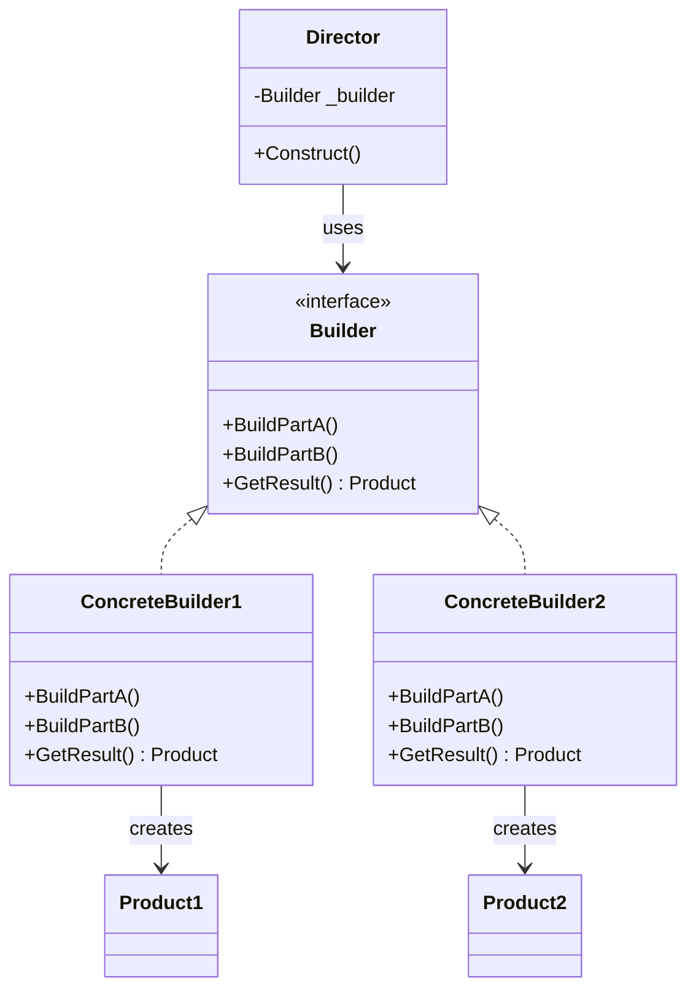

> [!success] Mastery Check
> - [ ] **Studied Well**
> - [ ] **Can explain the concept without notes**
> - [ ] **Can answer interview questions confidently**
> - [ ] **Can implement it in a real project**


## Navigation

**Domain:** [[6 — Design Principles & Patterns]] > **Group:** Creational Patterns
**Previous:** [[6.020 — Abstract Factory Pattern]] | **Next:** [[6.022 — Prototype Pattern]]

### Prerequisites
- [[2.XXX — Fluent Interfaces and Method Chaining]] — the Builder pattern is the most common application of fluent interfaces in .NET; understanding `return this;` chaining is prerequisite

### Where This Fits

Builder separates the construction of a complex object from its representation so that the same construction process can create different representations. In .NET this is everywhere — `StringBuilder`, `IHostBuilder`, EF Core's `ModelBuilder`, `WebApplication.CreateBuilder()`. A senior engineer reaches for Builder when an object requires multi-step initialization with optional parameters, complex validation between steps, or multiple representations from the same construction process.

## Core Mental Model

Separate construction from representation — a Builder encapsulates the construction logic (how to assemble parts) so the client can direct the assembly process without knowing the details of how each part is built or how the final product is composed.

### Classification

**GoF Creational** — Intent: "Separate the construction of a complex object from its representation so that the same construction process can create different representations."



### Participants
- **Builder** — interface declaring the build steps for each part of the product // Role: Builder
- **ConcreteBuilder** — implements Builder; constructs and assembles parts, provides access to the result // Role: ConcreteBuilder
- **Director** — orchestrates the construction process by calling Builder steps in a specific sequence // Role: Director
- **Product** — the complex object being built // Role: Product

## Deep Mechanics

### How It Works

1. Client creates a `ConcreteBuilder` instance and passes it to a `Director` (or calls builder steps directly).
2. Director calls `builder.BuildPartA()`, `builder.BuildPartB()`, etc., in the required sequence.
3. Each `ConcreteBuilder.BuildPartX()` call mutates the builder's internal state — accumulating parts, setting fields, running validation.
4. After all steps complete, client calls `builder.GetResult()` which returns the fully constructed `Product`.
5. The same Director can produce different products by using different ConcreteBuilders — the product structure varies by builder, not by director.

### .NET Runtime Behavior

The Builder pattern does not heavily involve the JIT/CLR — there is no virtual dispatch on hot paths unless each `BuildPartX()` method is called in a tight loop. The allocation cost is proportional to the number of intermediate state objects the builder maintains. `StringBuilder` demonstrates the key optimization: it maintains an internal buffer (a `char[]`) and grows it incrementally (doubling strategy), avoiding the O(n²) allocation of repeated string concatenation. The JIT inlines simple builder methods (property setters returning `this`) after tiered promotion, making fluent calls as fast as direct field assignments.

## Production Code Patterns

### Implementation in C#

```csharp
/// <summary> Product — the complex object being built </summary>
public sealed class EmailMessage
{
    public required IEnumerable<string> To { get; init; }
    public IEnumerable<string>? Cc { get; init; }
    public IEnumerable<string>? Bcc { get; init; }
    public required string Subject { get; init; }
    public required string Body { get; init; }
    public bool IsHtml { get; init; }
    public EmailPriority Priority { get; init; }
}

/// <summary> Builder — fluent interface for constructing EmailMessage </summary>
public sealed class EmailMessageBuilder
{
    private readonly List<string> _to = new();
    private readonly List<string> _cc = new();
    private readonly List<string> _bcc = new();
    private string _subject = string.Empty;
    private string _body = string.Empty;
    private bool _isHtml;
    private EmailPriority _priority = EmailPriority.Normal;

    public EmailMessageBuilder To(string email)          // Role: BuildPart
    {
        _to.Add(email ?? throw new ArgumentNullException(nameof(email)));
        return this;
    }

    public EmailMessageBuilder To(params string[] emails) // Overload for batch
    {
        _to.AddRange(emails);
        return this;
    }

    public EmailMessageBuilder Cc(string email)
    {
        _cc.Add(email ?? throw new ArgumentNullException(nameof(email)));
        return this;
    }

    public EmailMessageBuilder Bcc(string email)
    {
        _bcc.Add(email ?? throw new ArgumentNullException(nameof(email)));
        return this;
    }

    public EmailMessageBuilder WithSubject(string subject)
    {
        _subject = subject ?? throw new ArgumentNullException(nameof(subject));
        return this;
    }

    public EmailMessageBuilder WithBody(string body, bool isHtml = false)
    {
        _body = body ?? throw new ArgumentNullException(nameof(body));
        _isHtml = isHtml;
        return this;
    }

    public EmailMessageBuilder WithPriority(EmailPriority priority)
    {
        _priority = priority;
        return this;
    }

    /// <summary> Role: GetResult — finalizes and validates, returns Product </summary>
    public EmailMessage Build()
    {
        if (_to.Count == 0)
            throw new InvalidOperationException("At least one recipient is required.");
        if (string.IsNullOrWhiteSpace(_subject))
            throw new InvalidOperationException("Subject cannot be empty.");

        return new EmailMessage
        {
            To = _to.AsReadOnly(),
            Cc = _cc.AsReadOnly(),
            Bcc = _bcc.AsReadOnly(),
            Subject = _subject,
            Body = _body,
            IsHtml = _isHtml,
            Priority = _priority
        };
    }
}

// Client
var email = new EmailMessageBuilder()
    .To("alice@example.com")
    .To("bob@example.com")
    .Cc("manager@example.com")
    .WithSubject("Q3 Report")
    .WithBody("<h1>Q3 Results</h1><p>Attached.</p>", isHtml: true)
    .WithPriority(EmailPriority.High)
    .Build();
```

### Director Variation — Reusable Recipe

If the same construction sequence is used repeatedly, extract it into a Director:

```csharp
/// <summary> Role: Director — reusable construction sequence </summary>
public sealed class WeeklyReportDirector
{
    public EmailMessage Construct(IReportBuilder reportBuilder)
    {
        return new EmailMessageBuilder()          // Role: ConcreteBuilder
            .To("team@example.com")
            .WithSubject("Weekly Report")
            .WithBody(reportBuilder.BuildReport())
            .Build();
    }
}
```

### ASP.NET Core / .NET Ecosystem Integration

`WebApplication.CreateBuilder(args)` is the Builder pattern — it returns a `WebApplicationBuilder` (the ConcreteBuilder) that exposes `Services`, `Configuration`, `Logging`, `Environment`. Each property mutation returns the same builder. Finally `.Build()` returns the product (`WebApplication`). EF Core's `ModelBuilder` is another Builder — fluent configuration methods for entities, properties, relationships.

```csharp
// ASP.NET Core Builder pattern — CreateBuilder is the ConcreteBuilder
var builder = WebApplication.CreateBuilder(args);
builder.Services.AddControllers();
builder.Services.AddSingleton<IUserCache, InMemoryUserCache>();
builder.Configuration.AddJsonFile("custom.json", optional: true);
var app = builder.Build(); // Build() returns the Product (WebApplication)
```

## Gotchas & Anti-Patterns

### Builder That Mutates the Product After Build

**Wrong:** Handing out a mutable product reference that the builder retains:

```csharp
// ❌ Wrong
public class EmailMessageBuilder
{
    private EmailMessage _product = new();

    public EmailMessageBuilder To(string email)
    {
        _product.To.Add(email);
        return this;
    }

    public EmailMessage Build() => _product; // shared reference
}
```

**Right:** `Build()` creates a new immutable product instance and resets the builder, or the product is immutable (init-only properties).

**Consequence:** If the caller stores the product and continues building, the product changes after it has been returned. This causes intermittent bugs where an email is sent with unexpected recipients.

### Fluent Builder Without Validation Until Build

**Wrong:** No validation at `Build()` time — invalid state produces a runtime exception deep in the consumer:

```csharp
// ❌ Wrong
public EmailMessage Build() => new() { To = _to, Subject = _subject };
```

**Right:** Validate all invariants in `Build()` before constructing the product. Throw `InvalidOperationException` with a clear message.

**Consequence:** The product is created in an invalid state; the consumer discovers the issue later, making the failure root-cause harder to trace.

### Builder That Creates Everything in the Constructor

**Wrong:** Doing all build work in the builder's constructor — the builder does not provide stepwise construction:

```csharp
// ❌ Wrong
public EmailMessageBuilder(string to, string subject, string body) { /* build all at once */ }
```

**Right:** The builder's constructor sets defaults, and each method adds or overrides one aspect of the product.

**Consequence:** This is just a parameterized constructor with extra wrapping — the stepwise, separable construction that defines the Builder pattern is lost.

### Using Builder When a Record Would Suffice

**Wrong:** Writing a full Builder class when C# positional records with `with` expressions would serve:

```csharp
// ❌ Wrong — unnecessary builder
var email = new EmailMessageBuilder()
    .WithSubject("Hello")
    .WithBody("World")
    .Build();

// ✅ Right — positional record with optional parameters
var email = new EmailMessage(
    To: ["alice@example.com"],
    Subject: "Hello",
    Body: "World"
);
```

**Right:** Use a Builder when the construction requires validation across steps, complex defaults, or conditional branching between parts. Use records/positional construction for simple aggregate objects.

**Consequence:** Accidental complexity — a 40-line builder for a 3-field object wastes maintenance effort.

## Performance Implications

### Dispatch and Allocation Cost

Each fluent method call returns `this` — the JIT inlines these after tier 1 promotion, making the chain allocation-free (the builder is allocated once). The final `Build()` call allocates the product. The builder itself is typically short-lived (Gen0). For `StringBuilder`, the internal buffer resizing is the main cost — it uses a doubling strategy so the amortized cost of append is O(1). For custom builders, the allocation pattern is: 1 builder allocation + 0 allocations per chained call + 1 product allocation.

### BenchmarkDotNet

```csharp
[MemoryDiagnoser]
[SimpleJob(RuntimeMoniker.Net90)]
public class BuilderBenchmark
{
    [Benchmark(Baseline = true)]
    public EmailMessage Direct_Constructor()
    {
        return new EmailMessage
        {
            To = ["user@example.com"],
            Subject = "Test",
            Body = "Body"
        };
    }

    [Benchmark]
    public EmailMessage Via_Builder()
    {
        return new EmailMessageBuilder()
            .To("user@example.com")
            .WithSubject("Test")
            .WithBody("Body")
            .Build();
    }
}
```

**Expected results (approximate on .NET 9, x64):**

|Method|Mean|Gen0|Allocated|
|---|---|---|---|
|Direct_Constructor|~55 ns|0.0076|64 B|
|Via_Builder|~85 ns|0.0153|128 B|

**Interpretation:** The builder adds ~30 ns and one extra allocation (the builder object itself, ~64 B). This is negligible for any operation involving I/O (sending an email, building an HTTP request) but relevant in tight loops constructing millions of objects.

## Interview Arsenal

### Question Bank

1. What is the Builder pattern and what problem does it solve?
2. When would you use a Builder over a constructor with optional parameters?
3. What is the difference between Builder and Abstract Factory?
4. What do you give up by using a Builder instead of direct construction?
5. What is wrong with a Builder that returns void from its chained methods?
6. How does ASP.NET Core's `WebApplication.CreateBuilder()` apply the Builder pattern?
7. [Trick] Is `StringBuilder` a Builder pattern implementation?
8. How does the Builder pattern relate to the concept of immutable objects?

### Spoken Answers

**Q: What is the Builder pattern and what problem does it solve?**

> **Average answer:** It lets you construct a complex object step by step. You call methods on a builder and then call Build() to get the result.

> **Great answer:** Builder separates construction from representation. It solves three problems: (1) telescoping constructors — when an object has many optional parameters, a fluent builder is more readable than constructor overloads; (2) multi-step construction invariants — when parts must be added in a specific order or validated across steps, the builder can enforce that in its `Build()` method; (3) multiple representations from the same construction process — the same director can produce different products by using different builders. In .NET, `WebApplication.CreateBuilder(args).Services.AddXxx().Build()` is the canonical example: the builder aggregates services, configuration, logging, and hosting settings, and `Build()` validates the composition before returning the `WebApplication`.

**Q: What is the difference between Builder and Abstract Factory?**

> **Average answer:** Builder creates objects step by step; Abstract Factory creates objects all at once.

> **Great answer:** The intent difference: Builder focuses on the *construction process* — it lets you control how parts are assembled, often with validation between steps — while Abstract Factory focuses on the *product family* — it creates a set of related objects atomically. Structurally, Builder returns the product from `Build()` after multiple method calls; Abstract Factory returns a product from each `CreateXxx()` call independently. In .NET, `IHostBuilder` (Builder) has you add services, configure logging, set environment, then call `Build()`. `DbProviderFactory` (Abstract Factory) has you call `CreateConnection()`, `CreateCommand()` independently — each returns a loosely related product, but there is no assembly process.

**Q: [Trick] Is `StringBuilder` a Builder pattern implementation?**

> **Average answer:** Yes — it builds a string step by step, and you call `ToString()` at the end, which is like `Build()`.

> **Great answer:** `StringBuilder` shares the *fluent construction* shape of Builder — you append characters, and `ToString()` materializes the final product — but it does not conform to the GoF Builder pattern because there is no director and no builder abstraction for producing different string representations. `StringBuilder` is a "fluent buffer" — it is a concrete class optimized for mutable string construction. The GoF Builder pattern requires a `Builder` interface, one or more `ConcreteBuilder` classes, and optionally a `Director` that orchestrates the steps. That said, `StringBuilder` is the most commonly cited .NET example of the *fluent builder idiom*, which is a simplified version of the pattern that most developers encounter daily.

### Trick Question

**"Can a Builder be reused after calling Build()?"**

Why it is a trap: Candidates assume the builder is consumed after `Build()`. Correct answer: It depends on the implementation. If `Build()` resets internal state or the builder is immutable (each step returns a new builder), it can be reused. The standard approach in .NET is single-use — `Build()` validates and finalizes, and subsequent calls throw or produce the same product. The `FluentValidation` library's `RuleBuilder` is reusable; `WebApplicationBuilder.Build()` is not (the product is the application; building twice would create two apps).

### Comparison Table

| Aspect | Builder | Abstract Factory |
|---|---|---|
| Intent | Construct complex object step by step | Create families of related objects |
| Participants | Builder, ConcreteBuilder, Director, Product | AbstractFactory, ConcreteFactory, ProductA/B, Client |
| When to use | Multi-step construction with validation, different representations from same process | System must use one of several product families consistently |
| .NET example | `WebApplication.CreateBuilder().Build()` | `DbProviderFactory` (SqlClient, Npgsql) |
| Key difference | Focus on *construction process* and stepwise assembly | Focus on *product family* and atomic creation |

## Decision Framework

### When to Apply Builder

```mermaid
flowchart TD
    A[Complex object construction?] --> B{Constructor has >= 5 parameters?}
    B -->|Yes| C{Are parameters optional or have complex defaults?}
    B -->|No| D[Simple initialization suffices]
    C -->|Yes| E{Need validation across parameters?}
    C -->|No| F[Consider positional record or primary constructor]
    E -->|Yes| G[Apply Builder pattern]
    E -->|No| H[Consider named arguments / optional parameters]
    G --> I[Fluent interface with Build() that validates]
```

### Application Checklist

- [ ] The product has at least 5 parameters or a multi-step construction process
- [ ] Validation must check cross-parameter invariants (e.g., if PartA is set, PartB must also be set)
- [ ] Multiple representations of the product share the same construction steps
- [ ] The builder can validate state at `Build()` time, failing fast with a clear message
- [ ] The product is immutable after construction (init-only properties or a read-only interface)

### Tradeoff Summary

|What You Gain|What You Give Up|
|---|---|
|Readable object construction — no telescoping constructors|Extra class (the builder) and ~64 B allocation per use|
|Cross-step validation in Build()|Clients must call Build() — forgettable at compile time|
|Multiple product representations from one construction process|Boilerplate — each property becomes a method|
|Immutable products — built once, read forever|More code than a positional record for simple aggregates|

## Self-Check

### Conceptual Questions

1. What is the difference between the Builder pattern and a static factory method?
2. Why does the Builder pattern work well with immutable objects?
3. What role does the Director play, and when would you omit it?
4. How does `WebApplicationBuilder.Build()` validate the constructed object?
5. Can a Builder produce different types of products from the same build steps?
6. What is the relationship between Builder and the Fluent Interface idiom?
7. What happens if a user forgets to call `Build()` — how can the compiler help?
8. How does the Builder pattern handle optional vs. required parameters?
9. Identify the code smell: a Builder with 20 methods, each setting a single property.
10. When would you choose a Builder over a `record` with `init` properties?

<details>
<summary>Answers</summary>

1. A static factory returns the product in one call; Builder constructs step by step with validation between steps.
2. The builder accumulates state, validates all constraints in `Build()`, and returns an immutable product — the builder is mutable, the product is not.
3. The Director encapsulates a reusable construction sequence. Omit it when clients call builder steps directly with different sequences per call site.
4. It verifies that all required configuration is present (e.g., at least one URL binding), services are properly registered, and no unhandled configuration keys exist.
5. Yes — `ConcreteBuilder1` produces `Product1`, `ConcreteBuilder2` produces `Product2`, but both share the same `Director.Construct()` call.
6. Fluent Interface (return `this`) is the mechanism; Builder is the pattern that uses it for construction.
7. The `Build()` method returns the product type — forgetting to call it yields a `EmailMessageBuilder` object instead of `EmailMessage`, which causes a type mismatch at compile time.
8. Required parameters should be in the builder's constructor or validated with a `throw` in `Build()`. Optional parameters become methods with defaults.
9. The builder is a data class in disguise — probably better expressed as a record with optional parameters or a separate configuration object.
10. Use a record when the product is simple (≤4 properties, no cross-validation, no conditional construction). Use Builder when validation, multiple representations, or stepwise assembly is needed.

</details>

---

### Code Puzzles

**Puzzle 1 — Identify the violation**

```csharp
public class OrderQueryBuilder
{
    private string _where = "";
    private string _orderBy = "";

    public void Filter(string clause) => _where += clause;
    public void Sort(string clause) => _orderBy += clause;
    public string Build() => $"SELECT * FROM Orders WHERE {_where} ORDER BY {_orderBy}";
}
```

<details> <summary>Answer</summary>

**Violation:** No return-this chaining — methods return `void`, breaking fluent usage. **Fix:** Return `OrderQueryBuilder` from `Filter()` and `Sort()` to enable chaining. Also, SQL injection is possible — parameterized query building would be safer.

</details>

---

**Puzzle 2 — Complete the pattern**

```csharp
public sealed class ReportBuilder
{
    private string _title = "";
    private string _header = "";
    private string _footer = "";

    public ReportBuilder WithTitle(string title) { _title = title; return this; }

    // TODO: add WithHeader and WithFooter methods

    public Report Build() => new Report(_title, _header, _footer);
}
```

<details> <summary>Answer</summary>

```csharp
public ReportBuilder WithHeader(string header) { _header = header; return this; }
public ReportBuilder WithFooter(string footer) { _footer = footer; return this; }
```

**Explanation:** Each `With` method sets the corresponding field and returns `this` for fluent chaining. The product is immutable: `new Report(title, header, footer)` is a positional record or primary constructor.

</details>

---

**Puzzle 3 — Choose the right pattern**

**Scenario:** A configuration system loads settings from JSON, environment variables, and command-line arguments. Each source can contribute any subset of settings, and the final configuration must be built from the merged result with validation that conflicting keys are resolved by priority. Which pattern applies?

<details> <summary>Answer</summary>

**Correct pattern:** Builder — the configuration is built step by step (add source, add source, add source → `Build()` validates and merges). **Wrong choice:** Abstract Factory (no product family). **Implementation sketch:** `new ConfigurationBuilder().AddJsonFile("app.json").AddEnvironmentVariables().AddCommandLine(args).Build()`. This is exactly what `Microsoft.Extensions.Configuration.ConfigurationBuilder` does.

</details>

---

**Puzzle 4 — Spot the anti-pattern**

```csharp
public class PizzaBuilder
{
    private string _size = "Medium";
    private string _crust = "Regular";
    private List<string> _toppings = new();

    public PizzaBuilder SetSize(string size) { _size = size; return this; }
    public PizzaBuilder SetCrust(string crust) { _crust = crust; return this; }
    public PizzaBuilder AddTopping(string topping) { _toppings.Add(topping); return this; }

    public Pizza Build() => new Pizza(_size, _crust, _toppings);
}
```

<details> <summary>Answer</summary>

**Anti-pattern:** None — this is a correct Builder implementation. The confusion is that "Pizza Builder" is a classic overused example, but structurally this is a valid, well-formed Builder with fluent methods, state accumulation, and a `Build()` method that returns an immutable product.

</details>

---

**Puzzle 5 — Refactor to apply**

```csharp
public class HttpRequest
{
    public string Url { get; }
    public string Method { get; }
    public Dictionary<string, string> Headers { get; }
    public string? Body { get; }
    public TimeSpan Timeout { get; }

    public HttpRequest(string url, string method, Dictionary<string, string>? headers,
        string? body, TimeSpan timeout)
    {
        Url = url;
        Method = method;
        Headers = headers ?? new();
        Body = body;
        Timeout = timeout;
    }
}
```

<details> <summary>Answer</summary>

```csharp
public sealed class HttpRequestBuilder
{
    private string _url = string.Empty;
    private string _method = "GET";
    private readonly Dictionary<string, string> _headers = new();
    private string? _body;
    private TimeSpan _timeout = TimeSpan.FromSeconds(30);

    public HttpRequestBuilder WithUrl(string url)
    {
        _url = url ?? throw new ArgumentNullException(nameof(url));
        return this;
    }

    public HttpRequestBuilder WithMethod(string method)
    {
        _method = method?.ToUpperInvariant() ?? "GET";
        return this;
    }

    public HttpRequestBuilder WithHeader(string name, string value)
    {
        _headers[name] = value;
        return this;
    }

    public HttpRequestBuilder WithBody(string body)
    {
        _body = body;
        _method = "POST"; // body implies POST
        return this;
    }

    public HttpRequestBuilder WithTimeout(TimeSpan timeout)
    {
        _timeout = timeout > TimeSpan.Zero
            ? timeout
            : throw new ArgumentOutOfRangeException(nameof(timeout));
        return this;
    }

    public HttpRequest Build()
    {
        if (string.IsNullOrWhiteSpace(_url))
            throw new InvalidOperationException("URL is required.");

        return new HttpRequest
        {
            Url = _url,
            Method = _method,
            Headers = _headers,
            Body = _body,
            Timeout = _timeout
        };
    }
}
```

**What changed:** Replaced a 5-parameter constructor with a fluent builder. **Why it is better:** Callers specify only what they need — `new HttpRequestBuilder().WithUrl("https://api.example.com").WithBody(payload).Build()` is more readable than a constructor with positional nulls and default values. The builder also enforces cross-parameter rules (body implies POST, positive timeout) in `Build()`.

</details>
