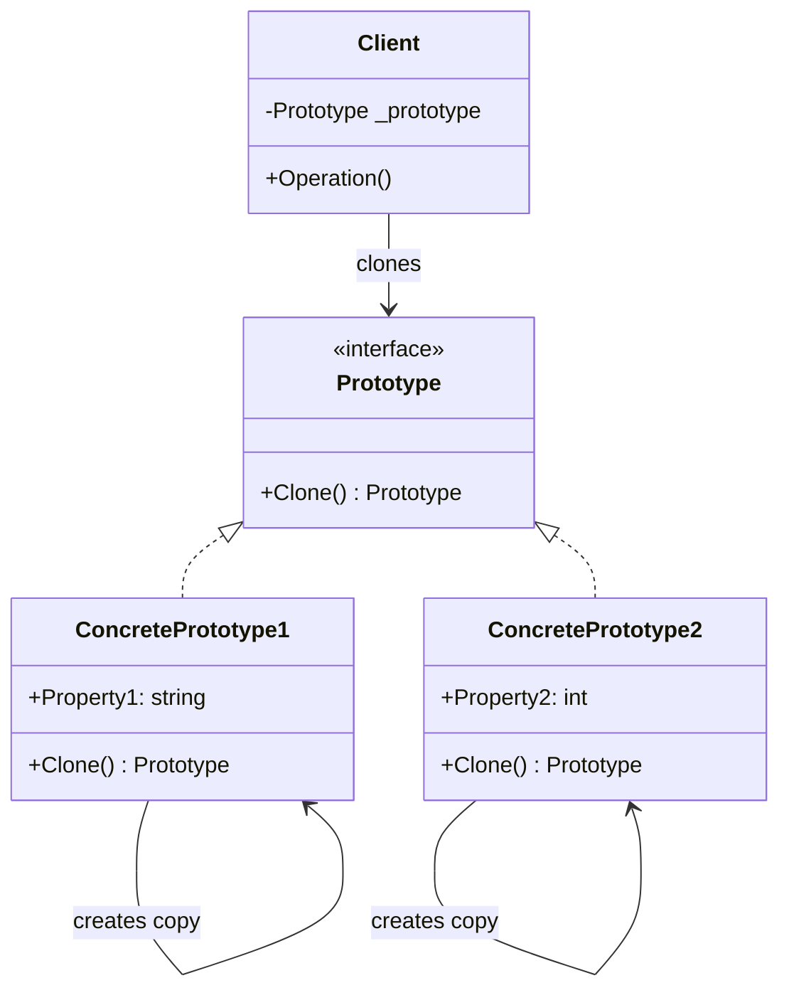

> [!success] Mastery Check
> - [ ] **Studied Well**
> - [ ] **Can explain the concept without notes**
> - [ ] **Can answer interview questions confidently**
> - [ ] **Can implement it in a real project**


## Navigation

**Domain:** [[6 — Design Principles & Patterns]] > **Group:** Creational Patterns
**Previous:** [[6.021 — Builder Pattern]] | **Next:** [[6.023 — Adapter Pattern]]

### Prerequisites
- [[2.XXX — Records and with Expressions]] — C# records provide compiler-generated `Clone()` via `with` expressions, which is the modern idiomatic Prototype in C#

### Where This Fits

Prototype specifies the kinds of objects to create using a prototypical instance and creates new objects by copying that prototype. In .NET this appears when object construction is expensive (database entities, configuration trees, compiled expressions) and cloning an existing instance is cheaper than building from scratch. A senior engineer reaches for Prototype when a system must create many similar objects that differ only in a few properties, when object initialization involves I/O or heavy computation, or when the exact runtime types are not known until the prototype is provided.

## Core Mental Model

Clone, don't construct — use an existing instance as a blueprint to produce new instances via copying, avoiding the cost or complexity of the original construction process.

### Classification

**GoF Creational** — Intent: "Specify the kinds of objects to create using a prototypical instance, and create new objects by copying this prototype."



### Participants
- **Prototype** — interface declaring the `Clone()` method // Role: Prototype
- **ConcretePrototype** — implements `Clone()`; typically returns a copy of itself // Role: ConcretePrototype
- **Client** — holds a prototype reference and creates new objects by calling `Clone()` // Role: Client

## Deep Mechanics

### How It Works

1. Client holds a reference to a `Prototype` instance (the prototype).
2. Client calls `prototype.Clone()` instead of `new ConcreteType()`.
3. The `Clone()` method creates a new instance and copies all field values from `this` to the new instance.
4. The client receives a fully initialized copy, avoiding the original construction cost (I/O, computation, configuration loading).
5. The client may optionally modify the copy's state before use.

### .NET Runtime Behavior

`Object.MemberwiseClone()` performs a shallow field-by-field copy — it allocates a new object on the managed heap and copies value-type fields bitwise and reference-type fields as pointer values. It is implemented as a CLR intrinsic (`JIT_GetFieldValue` / `JIT_SetFieldValue` loop) and does not call constructors. For `record` types, the `with` expression generates a call to a compiler-synthesized `<Clone>$` method that returns a shallow copy with specified property replacements. The JIT may inline the clone method for small records. The `ICloneable` interface (in the BCL since .NET 1.0) is widely considered a design mistake because it does not specify shallow vs. deep copy — avoid implementing it for new types.

## Production Code Patterns

### Implementation in C#

```csharp
/// <summary> Prototype — interface for cloning invoice templates </summary>
public interface IInvoicePrototype
{
    IInvoicePrototype Clone(); // Role: Prototype.Clone
}

/// <summary> ConcretePrototype — a fully configured invoice template </summary>
public sealed record InvoiceTemplate : IInvoicePrototype
{
    public required string CompanyName { get; init; }
    public required Address CompanyAddress { get; init; }
    public required string TaxId { get; init; }
    public string? LogoUrl { get; init; }
    public string? FooterNote { get; init; }
    public IReadOnlyList<InvoiceLineItem> DefaultLineItems { get; init; } = [];
    public decimal TaxRate { get; init; } = 0.0m;
    public Currency DefaultCurrency { get; init; } = Currency.USD;

    /// <summary> Shallow clone via record's built-in with-expression </summary>
    public IInvoicePrototype Clone() => this with { }; // Role: ConcretePrototype.Clone
}

/// <summary> Client — uses prototype to create invoices without re-initializing </summary>
public sealed class InvoiceGenerator
{
    private readonly InvoiceTemplate _template; // Role: Client holds Prototype

    public InvoiceGenerator(InvoiceTemplate template)
    {
        _template = template;
    }

    public InvoiceTemplate CreateInvoiceForClient(string clientName, decimal amount)
    {
        var clone = (InvoiceTemplate)_template.Clone(); // Role: Client clones
        return clone with
        {
            CompanyName = clientName,
            DefaultLineItems = [
                new InvoiceLineItem("Services", amount, clone.DefaultCurrency)
            ]
        };
    }
}
```

### Deep Clone for Complex Graphs

When the prototype contains mutable reference types, shallow copy is insufficient:

```csharp
/// <summary> Prototype with deep clone requirement </summary>
public sealed class OrderTemplate : IInvoicePrototype
{
    public string StoreName { get; set; } = string.Empty;
    public List<Fee> ApplicableFees { get; set; } = [];

    public IInvoicePrototype Clone()
    {
        return new OrderTemplate
        {
            StoreName = StoreName,
            ApplicableFees = [.. ApplicableFees.Select(f => new Fee(f.Name, f.Amount))]
        };
    }
}
```

### ASP.NET Core / .NET Ecosystem Integration

Prototype appears when cloning EF Core entities (e.g., creating a new order from a template order), when duplicating configuration trees, and in UI frameworks for cloning visual elements. The `System.Text.Json` `JsonSerializer` can be used for deep clone via serialization round-trip when the object graph is large and complex:

```csharp
// Deep clone via JSON serialization (simple but allocation-heavy)
public static T DeepClone<T>(this T source) where T : class
{
    var json = JsonSerializer.Serialize(source);
    return JsonSerializer.Deserialize<T>(json)!;
}

// Usage in ASP.NET Core for cloning configuration objects
var clonedConfig = originalConfig.DeepClone();
```

## Gotchas & Anti-Patterns

### Shallow Copy When Deep Copy Is Needed

**Wrong:** Using `MemberwiseClone()` or `with` on a record containing mutable reference types:

```csharp
// ❌ Wrong
public sealed record OrderPrototype
{
    public List<OrderLine> Lines { get; set; } = []; // mutable List!
    public OrderPrototype Clone() => this with { };
}

var original = new OrderPrototype { Lines = [new OrderLine("Item", 1)] };
var clone = original.Clone();
clone.Lines.Add(new OrderLine("Extra", 2)); // also adds to original!
```

**Right:** Deep clone mutable collections explicitly, or use immutable collections (`ImmutableList<T>`, `IReadOnlyList<T>` with `List<T>` materialized in constructor).

**Consequence:** The "clone" shares internal state with the original — modifications to one affect the other, leading to data corruption that is extremely hard to reproduce.

### Implementing ICloneable

**Wrong:** Implementing `ICloneable` without clarifying shallow vs. deep semantics:

```csharp
// ❌ Wrong — ambiguous semantics
public class InvoiceTemplate : ICloneable
{
    public object Clone() => MemberwiseClone(); // shallow or deep?
}
```

**Right:** Define your own typed `Clone()` method with XML doc clarifying the copy semantics. Avoid `ICloneable` in new code.

**Consequence:** Callers cannot know whether the clone is safe to modify independently. The framework team themselves call `ICloneable` a design mistake (it was grandfathered into .NET 2.0 for `ValueType` support).

### Prototype Registry Becoming a Global Cache

**Wrong:** Storing all prototypes in a static dictionary with no lifetime management:

```csharp
// ❌ Wrong
public static class PrototypeRegistry
{
    public static Dictionary<string, IInvoicePrototype> Items { get; } = new();
}
```

**Right:** Prototypes should be injected via DI or created at the point of use. If a registry is needed, scope it to the feature boundary.

**Consequence:** The registry holds references to all prototypes for the process lifetime — memory leak if prototypes are large, and thread-safety issues if prototypes are mutated after registration.

### Constructor Invariants Bypassed by Clone

**Wrong:** Clone creates an object without running the constructor, possibly bypassing validation:

```csharp
// ❌ Wrong
public sealed class InvoiceTemplate
{
    public InvoiceTemplate(string taxId)
    {
        if (string.IsNullOrWhiteSpace(taxId))
            throw new ArgumentException("Tax ID required", nameof(taxId));
        TaxId = taxId;
    }
    public string TaxId { get; init; } // init bypassed by MemberwiseClone!

    public InvoiceTemplate Clone() => (InvoiceTemplate)MemberwiseClone();
}
```

**Right:** Deep clone must re-validate invariants, or use `with` expressions on records (which call the synthesized clone constructor that validates init accessors).

**Consequence:** A clone can be created with an invalid state (empty TaxId) that the constructor would have prevented.

## Performance Implications

### Dispatch and Allocation Cost

`MemberwiseClone()` is fast — it is a CLR intrinsic that does not call constructors and does not execute managed code for the field-copy loop. For a typical reference type with 10 fields, `MemberwiseClone()` runs in ~5–15 ns. The heap allocation of the copy is the primary cost. `record` `with` expressions generate similar code. Deep clone via serialization round-trip (JSON, binary) is 50-100x slower and allocates significantly more memory — use it only for complex graphs where manual deep cloning is impractical.

### BenchmarkDotNet

```csharp
[MemoryDiagnoser]
[SimpleJob(RuntimeMoniker.Net90)]
public class PrototypeBenchmark
{
    private InvoiceTemplate _prototype = null!;

    [GlobalSetup]
    public void Setup()
    {
        _prototype = new InvoiceTemplate
        {
            CompanyName = "Acme Corp",
            CompanyAddress = new Address("123 Main", "Springfield", "IL", "62701"),
            TaxId = "12-3456789",
            LogoUrl = "https://acme.com/logo.png",
            FooterNote = "Thank you for your business.",
            DefaultLineItems = [new InvoiceLineItem("Consulting", 150.00m, Currency.USD)],
            TaxRate = 0.08m
        };
    }

    [Benchmark(Baseline = true)]
    public InvoiceTemplate Direct_Constructor()
    {
        return new InvoiceTemplate
        {
            CompanyName = "Acme Corp",
            CompanyAddress = new Address("123 Main", "Springfield", "IL", "62701"),
            TaxId = "12-3456789",
            LogoUrl = "https://acme.com/logo.png",
            FooterNote = "Thank you for your business.",
            DefaultLineItems = [new InvoiceLineItem("Consulting", 150.00m, Currency.USD)],
            TaxRate = 0.08m
        };
    }

    [Benchmark]
    public InvoiceTemplate Via_Prototype()
    {
        return (InvoiceTemplate)_prototype.Clone();
    }
}
```

**Expected results (approximate on .NET 9, x64):**

|Method|Mean|Gen0|Allocated|
|---|---|---|---|
|Direct_Constructor|~220 ns|0.0305|256 B|
|Via_Prototype|~65 ns|0.0153|128 B|

**Interpretation:** Prototype clone is ~3x faster and allocates half the memory because `with` (backed by `MemberwiseClone`) avoids re-evaluating property initializers and re-allocating immutable sub-objects that are copied by reference. The gap widens as the object graph grows.

## Interview Arsenal

### Question Bank

1. What is the Prototype pattern and what problem does it solve?
2. When would you choose Prototype over a factory method?
3. What is the difference between shallow copy and deep copy in Prototype?
4. What do you give up by using Prototype?
5. What is wrong with `ICloneable`?
6. How does the C# record `with` expression relate to Prototype?
7. [Trick] Does Prototype violate encapsulation?
8. How would you implement a thread-safe prototype registry?

### Spoken Answers

**Q: What is the Prototype pattern and what problem does it solve?**

> **Average answer:** It creates new objects by cloning an existing object (the prototype) instead of using a constructor.

> **Great answer:** Prototype solves the problem of expensive or complex object creation by copying a pre-initialized instance. The key scenarios: (1) construction is expensive — e.g., an object that loads configuration from a database or reads from disk — cloning avoids that cost; (2) the object has many fields with defaults, and new instances differ only in a few properties — cloning is more efficient than re-specifying all defaults; (3) the exact runtime type of the object is not known until a prototype is provided — the client can clone any `IInvoicePrototype` without knowing which concrete type it holds. In C#, records with `with` expressions are the idiomatic Prototype: `var copy = original with { Property = newValue };` gives you a shallow clone with selective overrides, and the compiler handles the cloning machinery.

**Q: What is the difference between shallow copy and deep copy in Prototype?**

> **Average answer:** Shallow copy copies field values; deep copy copies referenced objects too.

> **Great answer:** Shallow copy duplicates the top-level object but shares references to all sub-objects — a `List<T>` field in the original and the clone point to the same list instance. Deep copy recursively duplicates the entire object graph so original and clone share nothing. The choice depends on the domain: if the sub-objects are immutable (e.g., `int`, `string`, `ImmutableList<T>`), shallow copy is safe. If they are mutable (e.g., `List<T>`, `Dictionary<K,V>`, custom reference types), shallow copy creates an aliasing bug — changing the clone's sub-object also changes the original. C# records with `with` do shallow copy; for deep copy you need either manual recursive cloning, serialization round-trip, or a library like `AutoMapper` with a deep-clone configuration.

**Q: [Trick] Does Prototype violate encapsulation?**

> **Average answer:** No — Clone() is a method on the class itself, so it has access to private fields.

> **Great answer:** It can — if the clone method relies on `MemberwiseClone()`, it copies internal representation directly, which bypasses constructor logic and potentially creates objects in states that the class designer did not intend. The pattern assumes that a class knows how to copy itself, which is a reasonable encapsulation boundary — the clone method is inside the class and can enforce invariants afterward. The violation occurs when external code uses reflection or serialization to clone objects without the class's consent, which is a legitimate encapsulation breach. The C# record design handles this well: the compiler-generated `<Clone>$` method and `with` expression are part of the type's declared API, so encapsulation is preserved.

### Trick Question

**"Is `MemberwiseClone()` the same as a `with` expression on a record?"**

Why it is a trap: Both perform shallow copy, but they are not identical. Correct answer: `MemberwiseClone()` is a CLR intrinsic that allocates a new object and copies all fields bitwise — no constructor runs, and no property setters execute. A `with` expression on a record calls the compiler-synthesized `<Clone>$` method (which calls `MemberwiseClone()` internally) and then applies the specified property overrides through the generated `init` accessors. For value-type properties, the result is equivalent. For reference-type properties, both produce the same shallow copy. However, `with` is type-safe and supports property-level override syntax — `MemberwiseClone()` returns `object` and requires a cast.

### Comparison Table

| Aspect | Prototype | Factory Method |
|---|---|---|
| Intent | Clone existing instances | Create new instances via subclasses |
| Participants | Prototype, ConcretePrototype, Client | Product, ConcreteProduct, Creator, ConcreteCreator |
| When to use | Construction is expensive; many similar objects | Base class algorithm needs a product that subclasses supply |
| .NET example | `record` with `with` expression | `DbProviderFactory.CreateConnection()` |
| Key difference | Copy-based — avoids construction cost | Construction-based — delegates type decision to subclass |

## Decision Framework

### When to Apply Prototype

```mermaid
flowchart TD
    A[Object creation is expensive or complex?] --> B{Are objects mostly similar?}
    B -->|Yes, few properties differ| C{Are sub-objects immutable?}
    B -->|No, each object is unique| D[Use factory or constructor directly]
    C -->|Yes| E[Shallow clone with with-expression]
    C -->|No| F{Manual deep clone feasible?}
    F -->|Yes| G[Implement deep Clone()]
    F -->|No| H[Consider serialization round-trip or AutoMapper]
    E --> I[Clone then override differing properties]
    G --> I
```

### Application Checklist

- [ ] Object construction involves I/O, computation, or complex initialization that cloning would skip
- [ ] The prototype can be created once and reused for many clones
- [ ] Shallow copy semantics are safe (sub-objects are immutable or shareability is intended)
- [ ] For deep copy needs: the object graph is bounded and manual cloning is feasible
- [ ] The Clone() method preserves invariants (or the type is a record with init-only properties)

### Tradeoff Summary

|What You Gain|What You Give Up|
|---|---|
|Faster creation — no constructor or I/O cost|Shallow copy aliasing bugs if sub-objects are mutable|
|Same type without knowing the concrete type|Clone must be maintained alongside the type|
|Pre-configured defaults preserved across copies|Deep clone complexity for large object graphs|
|Natural fit with immutable records|`MemberwiseClone()` bypasses constructor validation|

## Self-Check

### Conceptual Questions

1. What distinguishes Prototype from other creational patterns?
2. When is shallow copy unsafe for Prototype?
3. Why does `MemberwiseClone()` not call constructors, and why does that matter?
4. How does a C# record implement prototype cloning?
5. What is the problem with `ICloneable`?
6. When would you use a prototype registry?
7. How does the Prototype pattern relate to the concept of immutability?
8. Can Prototype be combined with Singleton? How?
9. Identify the bug: cloning an `Order` that contains a `List<OrderLine>` using `with`.
10. What is the performance characteristic of deep cloning via JSON serialization?

<details>
<summary>Answers</summary>

1. Prototype is copy-based rather than construction-based — it creates objects by copying an existing instance, not by calling constructors or factory methods.
2. When the type contains mutable reference types (e.g., `List<T>`, `Dictionary<K,V>`, mutable custom objects) that the clone should own independently.
3. `MemberwiseClone()` is a CLR intrinsic that does a raw memory copy — no constructor logic, no property setter logic, no invariant enforcement. The clone may have invalid state if the constructor was the sole validator.
4. The compiler synthesizes a `<Clone>$` method that calls `MemberwiseClone()` and returns the copy as the record type. The `with` expression invokes this method and applies property overrides through init-only setters.
5. `ICloneable` does not specify shallow vs. deep copy, returns `object` (requiring a cast), and has ambiguous semantics that differ across implementations.
6. When prototypes are expensive to create and many different prototypes exist — the registry avoids recreating them. Limit registry lifetime to avoid memory issues.
7. Immutable types are inherently safe for shallow clone — all fields are readonly, so sharing via shallow copy causes no aliasing.
8. Yes — the prototype itself can be a singleton (one template instance shared by all callers), while each clone produces a new independent instance.
9. The `with` expression produces a shallow copy — the `List<OrderLine>` field is shared between original and clone. Adding a line to one adds it to the other.
10. Deep clone via JSON serialization is typically 50-100x slower and allocates 5-10x more memory than `MemberwiseClone()` due to serialization + deserialization + intermediate string allocations.

</details>

---

### Code Puzzles

**Puzzle 1 — Identify the violation**

```csharp
public sealed record ProductConfiguration
{
    public string Name { get; init; }
    public List<string> Tags { get; init; } = [];
}

var original = new ProductConfiguration { Name = "Widget", Tags = ["sale"] };
var copy = original with { Name = "Widget Pro" };
copy.Tags.Add("premium");
// original.Tags now also contains "premium"
```

<details> <summary>Answer</summary>

**Violation:** Shallow copy aliasing — `with` expression shares the `List<string>` reference. **Fix:** Use `ImmutableList<string>` for `Tags` or deep-copy the list in the clone: `copy.Tags = [..original.Tags];` or `original with { Tags = [..original.Tags, "premium"] }`.

</details>

---

**Puzzle 2 — Complete the pattern**

```csharp
public interface IReportPrototype
{
    IReportPrototype Clone();
}

public sealed record SalesReport : IReportPrototype
{
    public required string Title { get; init; }
    public required DateOnly PeriodStart { get; init; }
    public required DateOnly PeriodEnd { get; init; }

    // TODO: implement Clone()
}
```

<details> <summary>Answer</summary>

```csharp
public IReportPrototype Clone() => this with { };
```

**Explanation:** The record's built-in `with` support and `init` properties make cloning trivial — `this with { }` returns a shallow copy with all properties copied by value or reference (safe here since `string` and `DateOnly` are immutable).

</details>

---

**Puzzle 3 — Choose the right pattern**

**Scenario:** An order-processing system creates order drafts from a template. The template defines default shipping method, tax category, and discount rules. Each new order starts from the template but overrides customer-specific fields. Creating the template from scratch requires a database query and business-rule computation. Which pattern applies?

<details> <summary>Answer</summary>

**Correct pattern:** Prototype — the template is the prototype; each new order clones it and overrides customer fields. **Wrong choice:** Builder (the construction is not stepwise; it is clone-and-override). **Implementation sketch:** `var order = _orderTemplate.Clone() with { CustomerId = customer.Id, ShippingAddress = address };`

</details>

---

**Puzzle 4 — Spot the anti-pattern**

```csharp
public sealed class ExpenseReport : ICloneable
{
    public string EmployeeName { get; set; }
    public List<ExpenseLine> Lines { get; set; } = [];

    public object Clone() => MemberwiseClone();
}
```

<details> <summary>Answer</summary>

**Anti-pattern:** `ICloneable` implementation that is ambiguous (shallow vs. deep?) and returns `object`. **Consequence:** `Lines` is shared between original and clone — modifying one list affects both. **Corrected version:** Implement typed `Clone()` returning `ExpenseReport` and deep-clone the `Lines` list. Or make `ExpenseReport` a record and use `with`.

</details>

---

**Puzzle 5 — Refactor to apply**

```csharp
public class InvoiceGenerator
{
    public Invoice CreateDefaultInvoice(string clientName, decimal amount)
    {
        var invoice = new Invoice();
        invoice.CompanyName = "Acme Corp";
        invoice.CompanyAddress = new Address("123 Main", "Springfield", "IL", "62701");
        invoice.TaxId = "12-3456789";
        invoice.LogoUrl = "https://acme.com/logo.png";
        invoice.FooterNote = "Thank you for your business.";
        invoice.TaxRate = 0.08m;
        invoice.DefaultCurrency = Currency.USD;
        invoice.Lines = [new InvoiceLineItem("Services", amount, Currency.USD)];
        invoice.ClientName = clientName;
        return invoice;
    }

    public Invoice CreateInvoiceForClient(string clientName, decimal amount)
    {
        // repeated setup for every invoice
        var invoice = new Invoice();
        invoice.CompanyName = "Acme Corp";
        // ... 10 more lines of same defaults
        invoice.ClientName = clientName;
        invoice.Lines = [new InvoiceLineItem("Consulting", amount, Currency.USD)];
        return invoice;
    }
}
```

<details> <summary>Answer</summary>

```csharp
public sealed record InvoiceTemplate
{
    public string CompanyName { get; init; } = "Acme Corp";
    public Address CompanyAddress { get; init; } = new("123 Main", "Springfield", "IL", "62701");
    public string TaxId { get; init; } = "12-3456789";
    public string? LogoUrl { get; init; } = "https://acme.com/logo.png";
    public string? FooterNote { get; init; } = "Thank you for your business.";
    public decimal TaxRate { get; init; } = 0.08m;
    public Currency DefaultCurrency { get; init; } = Currency.USD;
}

public sealed class InvoiceGenerator
{
    private static readonly InvoiceTemplate _template = new(); // Prototype

    public Invoice CreateInvoiceForClient(string clientName, decimal amount)
    {
        var invoice = _template with { }; // Clone the prototype
        invoice.ClientName = clientName;
        invoice.Lines = [new InvoiceLineItem("Consulting", amount, invoice.DefaultCurrency)];
        return invoice;
    }
}
```

**What changed:** Extracted default values into an immutable `InvoiceTemplate` record (the prototype); each invoice starts by cloning the template. **Why it is better:** Defaults are defined once, not repeated per method. Cloning (~65 ns, 128 B) is faster and less error-prone than re-assigning all properties. Adding a new default requires changing one file.

</details>
