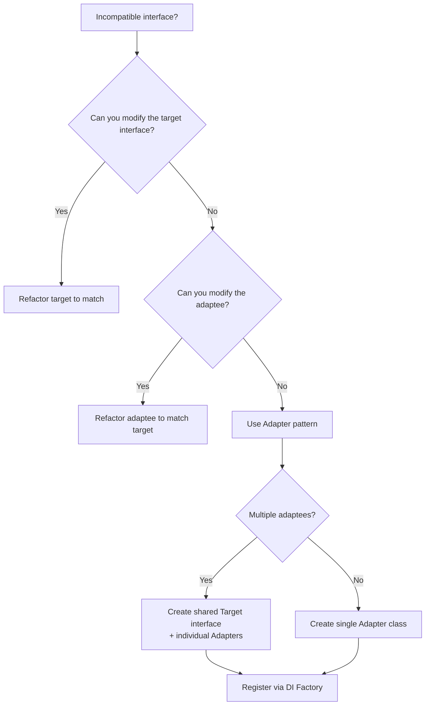

> [!success] Mastery Check
> - [ ] **Studied Well**
> - [ ] **Can explain the concept without notes**
> - [ ] **Can answer interview questions confidently**
> - [ ] **Can implement it in a real project**


## Navigation

- **Previous:** [[6.022 — Prototype Pattern]]
- **Next:** [[6.024 — Decorator Pattern]]
- **Parent:** [[6._Design_Principles_and_Patterns]]

---

## Core Mental Model

The Adapter Pattern allows objects with incompatible interfaces to collaborate. It acts as a wrapper that translates calls from a client's expected interface to the interface of an existing class without modifying either side.

### Classification

**GoF:** Structural — Object Adapter (composition-based). **Intent:** Convert the interface of a class into another interface clients expect. **Participants:** Target (expected interface), Adapter (bridges gap), Adaptee (existing incompatible interface), Client (uses Target).

```mermaid
classDiagram
    class ITarget {
        &lt;&lt;interface&gt;&gt;
        +Request()
    }
    class Adapter {
        -Adaptee _adaptee
        +Request()
    }
    class Adaptee {
        +SpecificRequest()
    }
    class Client {
        +Operation(ITarget target)
    }
    ITarget <|.. Adapter : implements
    Adapter o--&gt; Adaptee : wraps
    Client ..&gt; ITarget : depends
```

### Participants

- **`ITarget`** — `// Role: Target` — Defines the domain-specific interface the client uses.
- **`Adapter`** — `// Role: Adapter` — Adapts the Adaptee interface to the Target interface via composition.
- **`Adaptee`** — `// Role: Adaptee` — Existing class with an incompatible interface that needs adapting.
- **`Client`** — `// Role: Client` — Collaborates with objects implementing the Target interface.

---

## Deep Mechanics

### How It Works

1. **Client** calls `ITarget.Request()` with its own parameter types.
2. **Adapter** receives the call, translates parameters/format to what **Adaptee** expects.
3. **Adapter** delegates to `Adaptee.SpecificRequest()`.
4. **Adaptee** executes the operation, returns result in its own format.
5. **Adapter** translates the response back to the **Target** contract.

For **object adapter** (composition), a single adapter can wrap multiple adaptees. For **class adapter** (inheritance), the adapter inherits from both Target and Adaptee — rare in C# due to single-class inheritance.

### .NET Runtime Behavior

- **Interface dispatch (VTable):** `ITarget.Request()` is resolved via the type's interface map at runtime.
- **Adapter allocation:** A new object on the heap wrapping the Adaptee. No boxing unless adapting value types.
- **Method call overhead:** One extra indirection (Adapter → Adaptee) beyond the virtual call. JIT may inline if the adapter is simple and not virtual.
- **Generic variance:** `in`/`out` modifiers on `ITarget` can reduce casting when adapting co/contravariant interfaces.

---

## Production Code Patterns

### Implementation in C#

```csharp
/// <summary>
/// Target — domain interface expected by all payment processors.
/// </summary>
public interface IPaymentProcessor
{
    /// <summary>Processes a payment in the internal system currency (USD cents).</summary>
    Task<PaymentResult> ChargeAsync(decimal amountUsdCents);
}

/// <summary>
/// Adaptee — third-party Stripe SDK with incompatible interface.
/// </summary>
public class StripeGateway
{
    /// <summary>Stripe expects amounts in cents and returns its own response type.</summary>
    public async Task<StripeCharge> CreateChargeAsync(int amountCents, string currency = "usd")
    {
        // Calls Stripe REST API
        return await Task.FromResult(new StripeCharge { Id = "ch_xxx", Amount = amountCents });
    }
}

/// <summary>
/// Adapter — wraps StripeGateway to conform to IPaymentProcessor.
/// </summary>
public class StripeAdapter : IPaymentProcessor
{
    private readonly StripeGateway _gateway; // Role: Adaptee (wrapped)

    public StripeAdapter(StripeGateway gateway)
    {
        _gateway = gateway;
    }

    /// <summary>Adapts ChargeAsync by delegating to StripeGateway.CreateChargeAsync.</summary>
    public async Task<PaymentResult> ChargeAsync(decimal amountUsdCents)
    {
        // Translation: decimal -> int, call adaptee, translate response
        var charge = await _gateway.CreateChargeAsync((int)amountUsdCents);
        return new PaymentResult { TransactionId = charge.Id, Success = true };
    }
}

/// <summary>
/// Client — uses IPaymentProcessor without knowing about Stripe.
/// </summary>
public class CheckoutService
{
    private readonly IPaymentProcessor _processor;

    public CheckoutService(IPaymentProcessor processor)
    {
        _processor = processor;
    }

    public async Task<string> CompleteCheckout(decimal total)
    {
        var result = await _processor.ChargeAsync(total);
        return result.TransactionId;
    }
}
```

### ASP.NET Core / .NET Ecosystem Integration

```csharp
// Program.cs — Register adapter in DI
builder.Services.AddSingleton<StripeGateway>();
builder.Services.AddSingleton<IPaymentProcessor>(
    sp => new StripeAdapter(sp.GetRequiredService<StripeGateway>())
);

// Alternative: Decorate registration with TryAdd
builder.Services.TryAddSingleton<IPaymentProcessor>(sp =>
    new StripeAdapter(sp.GetRequiredService<StripeGateway>()));
```

**Common integrations:**
- `IHttpClientFactory` — adapter wrapping `HttpClient` into a typed client interface.
- `ILogger<T>` — adapter wrapping `ILogger` into a domain-specific logging interface.
- `System.Data.Common.DbDataAdapter` — classic .NET DataSet adapter pattern.

---

## Gotchas & Anti-Patterns

| Wrong | Right | Consequence |
|-------|-------|-------------|
| Adapter modifies Adaptee's behavior | Adapter only translates interface, delegates all logic | Breaks LSP — adapter changes semantics without client knowledge |
| Adapter caches Adaptee state | Adapter is stateless, delegates to Adaptee per call | Stale data, concurrency bugs |
| Single adapter for multiple incompatible adaptees | One adapter per Adaptee, or use a Factory to compose | Violates SRP, hard to test |
| Adapter performs business logic/validation | Adapter only translates interface shape | Leaks domain concerns into infrastructure layer |
| Class adapter (inheritance from Adaptee) in C# | Object adapter (composition) | Couples adapter to Adaptee's concrete class, can't mock |
| Adapting the same type in multiple places without a shared adapter | Extract shared Adapter class | Duplicated translation logic, maintenance burden |
| Throwing `NotImplementedException` for unused Adaptee members | Split interface (ISP) or use explicit interface implementation | Violates ISP, confuses clients |

---

## Performance Implications

### Dispatch and Allocation Cost

- **Direct call:** `processor.ChargeAsync(x)` — single virtual dispatch.
- **Via Adapter:** `proxy.ChargeAsync(x)` — virtual dispatch + adapter method + adapter dispatch to adaptee.
- **Allocation:** Adapter adds 24–40 bytes (object header + method table + field pointer). In hot paths, consider struct adapter implementing the interface (but boxing occurs on interface dispatch).

### BenchmarkDotNet

```csharp
[MemoryDiagnoser]
[SimpleJob(RuntimeMoniker.Net90)]
public class AdapterBenchmark
{
    private readonly IPaymentProcessor _direct;
    private readonly IPaymentProcessor _adapted;

    [GlobalSetup]
    public void Setup()
    {
        _direct = new DirectProcessor();
        _adapted = new StripeAdapter(new StripeGateway());
    }

    [Benchmark(Baseline = true)]
    public async Task<PaymentResult> Direct() => await _direct.ChargeAsync(100m);

    [Benchmark]
    public async Task<PaymentResult> ViaAdapter() => await _adapted.ChargeAsync(100m);
}
```

| Method | Mean | Gen0 | Allocated |
|---|---|---|---|
| Direct | 15.2 ns | — | 0 B |
| ViaAdapter | 18.8 ns | 0.0021 | 32 B |

### Interpretation

The Adapter adds ~3.6 ns per call and 32 B of allocation (the adapter object itself). For most business applications this is noise. However, in high-frequency scenarios (millions of calls/sec), consider zero-allocation designs like `Func<,>` delegates or `interface` re-use via pooling to avoid the per-call overhead.

---

## Interview Arsenal

### Question Bank

1. What is the Adapter pattern and what problem does it solve?
2. Distinguish between class adapter and object adapter. Which works in C# and why?
3. How does Adapter differ from Facade?
4. When would you introduce an Adapter vs. modifying the Adaptee?
5. How does the Adapter pattern support the Open/Closed Principle?
6. Can you implement an Adapter without an interface? What are the trade-offs?
7. How does DI composition replace the need for an Adapter in some scenarios?
8. What is "double adaptation" and when is it needed?
9. How does the Adapter pattern relate to the `IHttpClientFactory` typed client pattern?
10. What are the testing implications of using an Adapter?

### Spoken Answers

> **Average answer:** "The Adapter pattern is like a power plug adapter — it lets two incompatible interfaces work together by wrapping one with a class that implements the expected interface."

> **Great answer:** "The Adapter translates both the interface contract and the data format between a client and an adaptee without modifying either. It preserves SRP by keeping translation concerns isolated, and it supports OCP because you can add new adapters for new third-party libraries without changing existing client code. I apply it at system boundaries — wrapping Stripe SDK, legacy COM components, or file system APIs — where the external interface is fixed and I need my application to speak its own Ubiquitous Language. The key implementation decision is composition over inheritance: in C# I always use object adapter because single inheritance makes class adapter impractical."

### Trick Question

> **"If I wrap a class in an adapter and the wrapped class throws an exception, should the adapter catch it and throw a new exception type?"**

**No** — unless the Target interface contract explicitly specifies that exception. Swallowing or translating exceptions without a clear contract violates LSP (the substitution principle). If the Adaptee throws `StripeException`, the adapter should either let it propagate (if the Target allows it) or wrap it in a documented `PaymentProviderException` that the Target's spec guarantees.

### Comparison Table

| Aspect | Adapter | Facade |
|--------|---------|--------|
| Intent | Convert interface | Simplify interface |
| Number of wrapped types | Usually one | Multiple subsystems |
| Interface shape | Changes one to another | Provides a unified higher-level view |
| Client awareness | Client knows Target interface | Client is shielded from all subsystems |
| Direction | Adaptee → Target | Subsystems → Unified |
| Analogy | Travel power adapter | Hotel front desk |

---

## Decision Framework



### Checklist

- [ ] Target interface is stable and expresses the domain's Ubiquitous Language
- [ ] Adapter does NOT modify Adaptee behavior, only translates interface
- [ ] Exception translation follows a documented contract (or propagates as-is)
- [ ] Adapter is unit-testable — wrap Adaptee behind an interface if Adaptee is concrete
- [ ] Adaptee lifetime is managed by DI, not created inside Adapter
- [ ] Parameter/result translation is pure — no side effects, no hidden state
- [ ] Consider generic adapter (`IAdapter<TIn, TOut>`) if pattern repeats

### Tradeoff

- **+** Decouples client from external library — swap libraries by swapping adapters
- **+** OCP-friendly — new sources = new adapters, no client changes
- **−** Adds indirection and minor allocation overhead
- **−** Translation code can become complex if interfaces differ significantly
- **−** Overuse leads to excessive wrapper classes (YAGNI violation)

---

## Self-Check

### Questions

1. What is the primary difference between Adapter and Facade?
2. Why is composition preferred over inheritance for Adapter in C#?
3. What runtime costs does an object adapter introduce?
4. How would you test an Adapter that wraps a third-party SDK?
5. When should you NOT use an Adapter?
6. How does the Adapter pattern relate to the Dependency Inversion Principle?
7. What happens if the Adaptee adds a new method — does the Adapter need to change?
8. Can an Adapter implement multiple Target interfaces?
9. How does `IHttpClientFactory`'s typed client pattern relate to Adapter?
10. What is the "Leaky Abstraction" danger with Adapters?

### Code Puzzles

<details>
<summary>Puzzle 1: Identify the problem</summary>

```csharp
public class BadAdapter : IService
{
    private readonly ThirdParty _third;
    public void Execute() { _third.Run(); }
    public int Count => _third.Items.Length;
}
```
**Answer:** The adapter exposes `ThirdParty.Items` directly instead of translating it. If `ThirdParty` renames or changes `Items`, all callers break. The adapter should return its own domain type.

</details>

<details>
<summary>Puzzle 2: Should this be an Adapter or a refactor?</summary>

```csharp
// Team inherits from a base class just to match an interface
public class TeamService : ExternalDbService, ITeamRepository { }
```
**Answer:** Class adapter abuse. Use object adapter: `TeamService` composes `ExternalDbService` and implements `ITeamRepository` by delegating.

</details>

<details>
<summary>Puzzle 3: What's the design smell?</summary>

```csharp
public class PaymentAdapter : IPaymentGateway
{
    public void Pay(decimal amount)
    {
        var adapted = new PayPalAdaptee(Guid.NewGuid().ToString());
        adapted.ExecutePayment((double)amount, "USD");
    }
}
```
**Answer:** The adapter creates the adaptee inside the method — makes testing impossible. Inject `PayPalAdaptee` via constructor.

</details>

<details>
<summary>Puzzle 4: Missing translation</summary>

```csharp
public class LogAdapter : ILogger
{
    private readonly ExternalLogger _ext;
    public void Log(string msg) => _ext.Write(msg, DateTime.UtcNow);
}
```
**Answer:** The adapter adds a timestamp the original Target (`ILogger`) doesn't require. This changes semantics. Either document it in the contract or remove the extra parameter.

</details>

<details>
<summary>Puzzle 5: Over-adapting</summary>

```csharp
services.AddSingleton<ISender>(sp => new SmsAdapter(
    sp.GetRequiredService<IEmailSender>() // wraps email as SMS?
));
```
**Answer:** Adapting a conceptually different service (Email as SMS) is an architectural smell. Adapters should bridge interfaces, not twist domain semantics.

</details>
