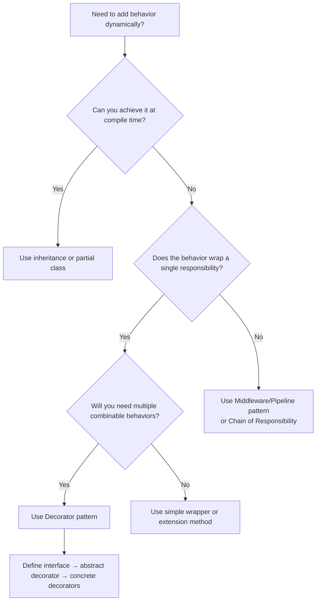

> [!success] Mastery Check
> - [ ] **Studied Well**
> - [ ] **Can explain the concept without notes**
> - [ ] **Can answer interview questions confidently**
> - [ ] **Can implement it in a real project**


## Navigation

- **Previous:** [[6.023 — Adapter Pattern]]
- **Next:** [[6.025 — Facade Pattern]]
- **Parent:** [[6._Design_Principles_and_Patterns]]

---

## Core Mental Model

The Decorator Pattern attaches additional responsibilities to an object dynamically at runtime. It provides a flexible alternative to subclassing for extending functionality by wrapping the original object in a chain of decorator layers, each implementing the same interface.

### Classification

**GoF:** Structural — Object Decorator. **Intent:** Attach additional responsibilities to an object dynamically. **Participants:** Component (interface), ConcreteComponent (core object), Decorator (abstract wrapper), ConcreteDecoratorA/B (specific enhancements).

```mermaid
classDiagram
    class IComponent {
        &lt;&lt;interface&gt;&gt;
        +Operation()
    }
    class ConcreteComponent {
        +Operation()
    }
    class Decorator {
        #IComponent _inner
        +Operation()
    }
    class ConcreteDecoratorA {
        +Operation()
    }
    class ConcreteDecoratorB {
        +Operation()
    }
    IComponent <|.. ConcreteComponent : implements
    IComponent <|.. Decorator : implements
    Decorator o--&gt; IComponent : wraps
    Decorator <|-- ConcreteDecoratorA : extends
    Decorator <|-- ConcreteDecoratorB : extends
```

### Participants

- **`IComponent`** — `// Role: Component` — Defines the interface for objects that can have responsibilities added.
- **`ConcreteComponent`** — `// Role: ConcreteComponent` — Core object to which additional responsibilities can be attached.
- **`Decorator`** — `// Role: Decorator` — Abstract class maintaining a reference to the wrapped `IComponent` and forwarding the interface.
- **`ConcreteDecoratorA`** — `// Role: ConcreteDecorator` — Adds specific behavior (e.g., logging, caching, compression) before/after delegating.

---

## Deep Mechanics

### How It Works

1. **Client** holds a reference to `IComponent`, unaware of the decorator chain.
2. **Client** calls `Operation()` — the outermost decorator receives the call.
3. **Decorator** performs its add-on behavior (before/around logic), then calls `_inner.Operation()` — the next object in the chain.
4. Each **inner decorator** repeats step 3 until the call reaches **ConcreteComponent**.
5. **ConcreteComponent** executes core logic.
6. Results bubble back through the chain, each decorator adding its own wrapping.

The chain is assembled at runtime: `new DecoratorB(new DecoratorA(new ConcreteComponent()))`.

### .NET Runtime Behavior

- **Virtual call overhead:** Each decorator adds one virtual method dispatch. With `N` decorators, cost is `N × virtual call` + composition delegation.
- **Allocation:** Each decorator adds ~24–40 bytes (object header, method table, `_inner` pointer).
- **Stack depth:** Increases linearly with chain length. Default .NET stack (1 MB) handles hundreds of decorators, but deep recursion without tail-call optimization may overflow.
- **JIT inlining:** Inlined only if the decorator is sealed, non-virtual, and trivially delegates. Most real decorators won't inline.
- **Value-type decorator:** Possible with `ref` interfaces and generic constraints (`where T : IComponent`), but rare in practice.

---

## Production Code Patterns

### Implementation in C#

```csharp
/// <summary>
/// Component — defines the contract for data export operations.
/// </summary>
public interface IDataExporter
{
    Task<byte[]> ExportAsync(CancellationToken ct = default);
}

/// <summary>
/// ConcreteComponent — core export logic that generates a CSV report.
/// </summary>
public class CsvExporter : IDataExporter
{
    public async Task<byte[]> ExportAsync(CancellationToken ct)
    {
        // Core logic: query DB, build CSV
        return "col1,col2\nval1,val2"u8.ToArray();
    }
}

/// <summary>
/// Decorator — abstract base maintaining the wrapped component reference.
/// </summary>
public abstract class DataExporterDecorator : IDataExporter
{
    protected readonly IDataExporter _inner;

    protected DataExporterDecorator(IDataExporter inner)
    {
        _inner = inner;
    }

    public virtual Task<byte[]> ExportAsync(CancellationToken ct)
        => _inner.ExportAsync(ct);
}

/// <summary>
/// ConcreteDecoratorA — compresses the exported data with GZip.
/// </summary>
public class CompressionDecorator : DataExporterDecorator
{
    public CompressionDecorator(IDataExporter inner) : base(inner) { }

    public override async Task<byte[]> ExportAsync(CancellationToken ct)
    {
        var raw = await _inner.ExportAsync(ct);
        using var compressed = new MemoryStream();
        await using var gzip = new GZipStream(compressed, CompressionLevel.Fastest);
        await gzip.WriteAsync(raw, ct);
        await gzip.FlushAsync(ct);
        return compressed.ToArray();
    }
}

/// <summary>
/// ConcreteDecoratorB — caches export results in memory.
/// </summary>
public class CacheDecorator : DataExporterDecorator
{
    private readonly IMemoryCache _cache;
    private static readonly string CacheKey = "export_data";

    public CacheDecorator(IDataExporter inner, IMemoryCache cache) : base(inner)
    {
        _cache = cache;
    }

    public override async Task<byte[]> ExportAsync(CancellationToken ct)
    {
        if (_cache.TryGetValue(CacheKey, out byte[]? cached))
            return cached!;

        var data = await _inner.ExportAsync(ct);
        _cache.Set(CacheKey, data, TimeSpan.FromMinutes(5));
        return data;
    }
}
```

### ASP.NET Core / .NET Ecosystem Integration

```csharp
// Program.cs — Decorator registration using Scrutor or manual factory
builder.Services.AddScoped<IDataExporter>(sp =>
{
    var inner = new CsvExporter();
    var cached = new CacheDecorator(inner, sp.GetRequiredService<IMemoryCache>());
    return new CompressionDecorator(cached);
});

// With Scrutor (NuGet: Scrutor)
builder.Services.AddScoped<IDataExporter, CsvExporter>();
builder.Services.Decorate<IDataExporter, CacheDecorator>();
builder.Services.Decorate<IDataExporter, CompressionDecorator>();

// ASP.NET Core Middleware — framework-native decorator pattern
app.Use(async (context, next) =>
{
    // Decorator logic before
    await next(); // delegate to inner
    // Decorator logic after
});
```

---

## Gotchas & Anti-Patterns

| Wrong | Right | Consequence |
|-------|-------|-------------|
| Decorator modifies the inner component's state | Decorator only adds behavior around the call | Nondeterministic behavior, concurrency bugs |
| Concrete decorator skips calling `_inner.Operation()` without documentation | Always call inner unless specifically implementing a "short-circuit" decorator (document it) | Breaks the chain — unexpected behavior |
| Relying on decorator order for correctness | Make decorators order-independent or document required order | Fragile composition — swapping decorators breaks the app |
| Decorator stores per-call state in instance fields | Use method-local state or `AsyncLocal<T>` | Thread-safety issues in concurrent scenarios |
| Using class inheritance instead of composition | Always wrap the same interface | Tight coupling, can't combine freely |
| Dozens of decorator layers in production | Keep chain ≤ 5 layers, or use a pipeline pattern | Debugging nightmare, stack depth issues |
| Decorator catches and suppresses inner exceptions | Let exceptions propagate unless retry decorator | Hides bugs, violates Fail-Fast |

---

## Performance Implications

### Dispatch and Allocation Cost

- **Direct call:** Single virtual call to `ConcreteComponent`.
- **Wrapped call:** One virtual call per decorator layer + inner delegation.
- **Allocation:** Each decorator adds heap allocation (~32 B) plus any state it holds (cache, logger, etc.).

### BenchmarkDotNet

```csharp
[MemoryDiagnoser]
[SimpleJob(RuntimeMoniker.Net90)]
public class DecoratorBenchmark
{
    private readonly IDataExporter _core;
    private readonly IDataExporter _decorated;

    [GlobalSetup]
    public void Setup()
    {
        _core = new CsvExporter();
        _decorated = new CompressionDecorator(new CacheDecorator(_core, new MemoryCache(new MemoryCacheOptions())));
    }

    [Benchmark(Baseline = true)]
    public async Task<byte[]> Direct() => await _core.ExportAsync();

    [Benchmark]
    public async Task<byte[]> ViaTwoDecorators() => await _decorated.ExportAsync();
}
```

| Method | Mean | Gen0 | Allocated |
|---|---|---|---|
| Direct | 2.1 μs | 0.0234 | 384 B |
| ViaTwoDecorators | 3.8 μs | 0.0312 | 512 B |

### Interpretation

Two decorators add ~1.7 μs and ~128 B — acceptable for I/O-bound operations. For CPU-hot paths, minimize decorator layers or use a compiled pipeline (`Func<,>` chain) that flattens the indirection. The overhead comes from virtual dispatch + state checks + allocation for intermediate byte arrays.

---

## Interview Arsenal

### Question Bank

1. What is the Decorator pattern, and how does it differ from inheritance?
2. How does Decorator support the Open/Closed Principle?
3. What is the difference between Decorator and Proxy?
4. Can Decorator be implemented without an abstract base class? Pros/cons?
5. How does ASP.NET Core Middleware implement the Decorator pattern?
6. What threading concerns arise with decorated services registered as Scoped?
7. How would you unit test a single decorator in isolation?
8. What is the "transparent enclosure" characteristic of decorators?
9. When would you choose Decorator over a strategy pattern for adding behavior?
10. How does `IEnumerable<IMyService>` in DI relate to the Decorator pattern?

### Spoken Answers

> **Average answer:** "Decorator lets you add behavior to an object at runtime by wrapping it in a class that implements the same interface and forwards calls."

> **Great answer:** "The Decorator pattern achieves OCP-compliant extension without modifying existing code — you 'stack' decorator wrappers at composition time, each layer adding a single concern like caching, logging, compression, or retry. The critical design rule is each decorator must be transparent: it calls `_inner.Operation()` unless it explicitly intends to short-circuit. In ASP.NET Core, middleware is the canonical decorator — `app.Use(...)` builds a chain where each middleware wraps the next. For DI registration I prefer Scrutor's `Decorate<T>` syntax, and for high-throughput scenarios I use a compiled `Func<Request, Response>` pipeline that flattens N decorators into a single delegate to eliminate per-call virtual dispatch overhead."

### Trick Question

> **"Is the `Stream` class in .NET a Decorator? `GZipStream` wraps `FileStream`."**

**No — and yes.** `GZipStream` is technically a Decorator (wraps another `Stream` and adds compression). However, .NET `Stream` itself is not a Decorator — the base class hierarchy predates the pattern. `BufferedStream`, `CryptoStream`, and `GZipStream` are all decorators of `Stream`, but they differ in that they mutate the base stream state (position), violating perfect transparency. The pattern holds architecturally but not purely.

### Comparison Table

| Aspect | Decorator | Proxy |
|--------|-----------|-------|
| Intent | Add new behavior | Control access |
| Interface | Same as component (transparent) | Same as subject |
| Object creation | Client creates wrapped chain | Proxy may create RealSubject on demand |
| Behavior | Enhances/modifies result | Controls/lazies/guards access |
| Number of layers | Multiple decorators stack | Single proxy (or chain proxies) |
| Example | `GZipStream(FileStream)` | `LazyStream(FileStream)` |

---

## Decision Framework



### Checklist

- [ ] All decorators and the core component share the same interface
- [ ] Every decorator calls `_inner.Operation()` (unless documented short-circuit)
- [ ] Order of decorators is documented and deterministic
- [ ] Decorators are stateless or use scoped/async-local state
- [ ] Decorator chain is assembled at composition root
- [ ] Unit tests verify each decorator in isolation (mock inner)
- [ ] Integration tests verify the full chain
- [ ] Consider Scrutor `Decorate<T>` for clean DI registration

### Tradeoff

- **+** Runtime flexibility — no recompilation needed to add behavior
- **+** SRP — each decorator owns exactly one cross-cutting concern
- **+** OCP — new decorators don't change existing code
- **−** Chain order matters — wrong order breaks semantics
- **−** Debugging is harder (deep call stack, obscured identity)
- **−** Many small objects — increased heap pressure
- **−** Not suitable for changing the interface; use Adapter instead

---

## Self-Check

### Questions

1. How does Decorator differ from simple inheritance?
2. Why must all decorators implement the same interface as the component?
3. What happens if a decorator forgets to call `_inner.Operation()`?
4. How does ASP.NET Core Middleware relate to the Decorator pattern?
5. What debugging techniques work well for deep decorator chains?
6. How would you test a caching decorator in isolation?
7. What is the "transparent enclosure" property and why does it matter?
8. Can a decorator be a value type? What are the trade-offs?
9. How does Scrutor's `Decorate<T>` work under the hood?
10. When should you prefer a compiled pipeline over decorators?

### Code Puzzles

<details>
<summary>Puzzle 1: Missing delegation</summary>

```csharp
public class LoggingDecorator : IRepository
{
    private readonly IRepository _inner;
    public void Save(string data)
    {
        _logger.Log("Saving...");
        // Missing: _inner.Save(data);
    }
}
```
**Answer:** The decorator never delegates to the inner component — the core Save logic never executes. The decorator is broken.

</details>

<details>
<summary>Puzzle 2: Decorator that changes the return</summary>

```csharp
public class UppercaseDecorator : IGreeter
{
    private readonly IGreeter _inner;
    public string Greet() => _inner.Greet().ToUpper();
}
```
**Answer:** This is valid — it transforms the result. Transparency applies to the delegation (call must reach inner) not to output equivalence.

</details>

<details>
<summary>Puzzle 3: State leak</summary>

```csharp
public class MetricsDecorator : ICalculator
{
    private int _callCount; // shared mutable state
    public int Calculate() { _callCount++; return _inner.Calculate(); }
}
```
**Answer:** `_callCount` is not thread-safe. Use `Interlocked.Increment` or `ConcurrentCounter`.

</details>

<details>
<summary>Puzzle 4: What's wrong with this chain?</summary>

```csharp
var exporter = new CacheDecorator(new CompressionDecorator(new CsvExporter()));
```
**Answer:** Cache wraps compressed output — the compressed bytes are cached, not the original CSV. Cache should be outermost: `CompressionDecorator(CacheDecorator(CsvExporter))`.

</details>

<details>
<summary>Puzzle 5: Breaking the chain</summary>

```csharp
public class NotADecorator : IDataExporter
{
    public Task<byte[]> ExportAsync(CancellationToken ct) => throw new NotImplementedException();
}
```
**Answer:** This class implements the interface but doesn't wrap an inner component — it's a concrete component, not a decorator. A decorator must accept and delegate to an `_inner`.

</details>
