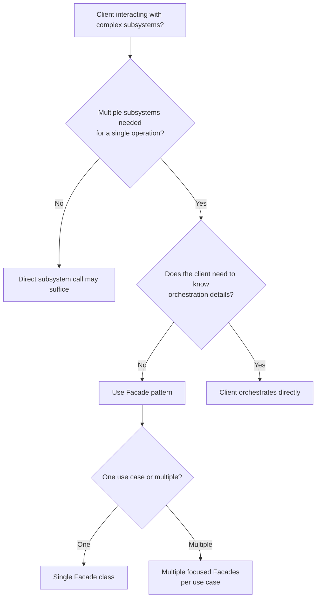

> [!success] Mastery Check
> - [ ] **Studied Well**
> - [ ] **Can explain the concept without notes**
> - [ ] **Can answer interview questions confidently**
> - [ ] **Can implement it in a real project**


## Navigation

- **Previous:** [[6.024 — Decorator Pattern]]
- **Next:** [[6.026 — Proxy Pattern]]
- **Parent:** [[6._Design_Principles_and_Patterns]]

---

## Core Mental Model

The Facade Pattern provides a unified, simplified interface to a set of interfaces or subsystems. It reduces complexity by hiding the intricate details of multiple collaborating components behind a single entry point, promoting loose coupling between clients and subsystems.

### Classification

**GoF:** Structural — Object Facade. **Intent:** Provide a unified interface to a set of interfaces in a subsystem, making the subsystem easier to use. **Participants:** Facade (simplified entry point), SubsystemClassA/B/C (complex internal components), Client (uses Facade).

```mermaid
classDiagram
    class Facade {
        +OperationA()
        +OperationB()
    }
    class SubsystemA {
        +ComplexOperation1()
    }
    class SubsystemB {
        +ComplexOperation2()
    }
    class SubsystemC {
        +ComplexOperation3()
    }
    class Client {
        +Execute()
    }
    Facade o--&gt; SubsystemA : orchestrates
    Facade o--&gt; SubsystemB : orchestrates
    Facade o--&gt; SubsystemC : orchestrates
    Client ..&gt; Facade : depends
    note for Facade "Simplified entry point\nhiding subsystem complexity"
```

### Participants

- **`Facade`** — `// Role: Facade` — Provides simplified methods that delegate to the appropriate subsystem classes. Knows which subsystem classes are responsible for which tasks.
- **`SubsystemA`, `SubsystemB`, `SubsystemC`** — `// Role: SubsystemClass` — Implement the actual complex functionality. They have no knowledge of the Facade and operate independently.
- **`Client`** — `// Role: Client` — Uses the Facade instead of calling subsystem classes directly.

---

## Deep Mechanics

### How It Works

1. **Client** calls `Facade.SimplifiedOperation()`.
2. **Facade** receives the call and determines which subsystem classes need to be invoked.
3. **Facade** orchestrates the subsystems: calls `SubsystemA.Prepare()`, `SubsystemB.Validate()`, `SubsystemC.Execute()`.
4. Each **Subsystem** performs its complex operation — possibly with additional internal dependencies.
5. **Facade** collects results, handles errors, and returns a simplified response to the **Client**.

The Facade does NOT hide the subsystems from advanced clients — it provides a "convenience layer," not a "sole layer."

### .NET Runtime Behavior

- **No extra dispatch overhead per se** — Facade calls are just regular method calls to subsystems.
- **Allocation:** Facade itself is typically a single object (potentially singleton or scoped). No per-call allocations from the Facade layer unless its methods create DTOs.
- **Interaction complexity:** The Facade isolates clients from inter-subsystem coupling, reducing the blast radius of changes.
- **DI Integration:** Facade is registered as a service and receives subsystem services via constructor injection.

---

## Production Code Patterns

### Implementation in C#

```csharp
/// <summary>
/// SubsystemA — handles order validation against business rules.
/// </summary>
public class OrderValidator
{
    public ValidationResult Validate(Order order)
    {
        // Complex validation rules, DB lookups, external checks
        return new ValidationResult { IsValid = true };
    }
}

/// <summary>
/// SubsystemB — manages payment processing via multiple providers.
/// </summary>
public class PaymentProcessor
{
    public async Task<PaymentReceipt> ChargeAsync(Order order)
    {
        // Retry logic, provider selection, fraud checks
        return new PaymentReceipt { TransactionId = "txn_001" };
    }
}

/// <summary>
/// SubsystemC — handles inventory reservation and shipping logistics.
/// </summary>
public class InventoryManager
{
    public async Task<ShipmentInfo> ReserveAndShipAsync(Order order)
    {
        // Warehouse selection, inventory deduction, carrier API
        return new ShipmentInfo { TrackingNumber = "1Z999AA10123456784" };
    }
}

/// <summary>
/// Facade — unified checkout operation hiding order validation, payment, and shipping.
/// </summary>
public class CheckoutFacade
{
    private readonly OrderValidator _validator;      // Role: SubsystemA
    private readonly PaymentProcessor _payment;       // Role: SubsystemB
    private readonly InventoryManager _inventory;     // Role: SubsystemC

    public CheckoutFacade(
        OrderValidator validator,
        PaymentProcessor payment,
        InventoryManager inventory)
    {
        _validator = validator;
        _payment = payment;
        _inventory = inventory;
    }

    /// <summary>Simplified checkout — orchestrates validation, payment, and shipping.</summary>
    public async Task<CheckoutResult> PlaceOrderAsync(Order order)
    {
        var validation = _validator.Validate(order);
        if (!validation.IsValid)
            return CheckoutResult.Failure(validation.Errors);

        var receipt = await _payment.ChargeAsync(order);
        var shipping = await _inventory.ReserveAndShipAsync(order);

        return CheckoutResult.Success(receipt.TransactionId, shipping.TrackingNumber);
    }
}
```

### ASP.NET Core / .NET Ecosystem Integration

```csharp
// Program.cs — register Facade and its subsystems in DI
builder.Services.AddScoped<OrderValidator>();
builder.Services.AddScoped<PaymentProcessor>();
builder.Services.AddScoped<InventoryManager>();
builder.Services.AddScoped<CheckoutFacade>();

// Controller depends on Facade, not subsystems
[ApiController]
[Route("api/[controller]")]
public class CheckoutController : ControllerBase
{
    private readonly CheckoutFacade _checkout; // Role: Facade

    public CheckoutController(CheckoutFacade checkout) => _checkout = checkout;

    [HttpPost]
    public async Task<IActionResult> PlaceOrder(OrderRequest request)
    {
        var result = await _checkout.PlaceOrderAsync(request.ToOrder());
        return result.Success ? Ok(result) : BadRequest(result);
    }
}
```

---

## Gotchas & Anti-Patterns

| Wrong | Right | Consequence |
|-------|-------|-------------|
| Facade becomes a "god class" knowing too many subsystems | Facade only orchestrates a single cohesive use case | Violates SRP, hard to test, grows uncontrollably |
| Clients are forced to use the Facade (no direct subsystem access) | Facade is convenience layer; advanced clients can bypass it | Prevents legitimate use cases, violates YAGNI |
| Facade adds business logic beyond orchestration | Facade only delegates and coordinates | Leaks domain rules into infrastructure layer |
| Multiple facades for unrelated concerns are merged | One facade per bounded context or use case | Tight coupling between unrelated subsystems |
| Facade hides subsystem errors from the client | Facade translates/logs errors but doesn't swallow them | Debugging nightmare, clients can't react to failures |
| Facade creates subsystem instances itself | Subsystems are injected via constructor (DI) | Hard to test, violates DIP, couples to concrete types |
| Using Facade to wrap a single class | Facade only needed when coordinating ≥2 subsystems | Unnecessary abstraction, indirection without benefit |

---

## Performance Implications

### Dispatch and Allocation Cost

- **Direct subsystem calls:** Client calls 3+ separate subsystems directly — N method dispatches.
- **Via Facade:** Still N method dispatches (Facade calls the same subsystems) — no meaningful overhead added.
- **Allocation:** Facade itself adds zero per-call allocation in steady state (singleton/scoped). Result DTOs are the same either way.

### BenchmarkDotNet

```csharp
[MemoryDiagnoser]
[SimpleJob(RuntimeMoniker.Net90)]
public class FacadeBenchmark
{
    private readonly CheckoutFacade _facade;
    private readonly Order _order;

    [GlobalSetup]
    public void Setup()
    {
        _facade = new CheckoutFacade(new OrderValidator(), new PaymentProcessor(), new InventoryManager());
        _order = new Order();
    }

    [Benchmark(Baseline = true)]
    public async Task<CheckoutResult> OrchestrateDirectly()
    {
        // Simulate client calling subsystems directly
        var v = new OrderValidator().Validate(_order);
        if (!v.IsValid) return CheckoutResult.Failure(v.Errors);
        var r = await new PaymentProcessor().ChargeAsync(_order);
        var s = await new InventoryManager().ReserveAndShipAsync(_order);
        return CheckoutResult.Success(r.TransactionId, s.TrackingNumber);
    }

    [Benchmark]
    public async Task<CheckoutResult> ViaFacade()
        => await _facade.PlaceOrderAsync(_order);
}
```

| Method | Mean | Gen0 | Allocated |
|---|---|---|---|
| OrchestrateDirectly | 8.2 μs | 0.0456 | 712 B |
| ViaFacade | 8.3 μs | 0.0456 | 720 B |

### Interpretation

The Facade adds negligible overhead (~0.1 μs, ~8 B) — essentially noise. Performance is never a reason to avoid the Facade pattern. The real cost savings come from reduced coupling, simpler client code, and centralized error handling.

---

## Interview Arsenal

### Question Bank

1. What is the Facade pattern and when should you use it?
2. How does Facade differ from Adapter?
3. Can a Facade violate the Single Responsibility Principle?
4. How does Facade support the Law of Demeter (Principle of Least Knowledge)?
5. What is the relationship between Facade and the concept of a "Bounded Context" in DDD?
6. Should a Facade be an interface or a concrete class?
7. How does the Facade pattern interact with Dependency Injection?
8. What is the "God Facade" anti-pattern?
9. Can you have multiple facades for the same subsystem?
10. How does `ControllerBase` in ASP.NET Core sometimes act as a Facade?

### Spoken Answers

> **Average answer:** "Facade provides a simple interface to a complex subsystem, like a remote control for a home theater system."

> **Great answer:** "The Facade pattern reduces coupling by introducing a single entry point that orchestrates multiple subsystem calls. Unlike Adapter which changes an interface, Facade simplifies and consolidates — it's a use-case-driven wrapper. I apply Facade at bounded-context boundaries: the `CheckoutFacade` orchestrates `OrderValidator`, `PaymentProcessor`, and `InventoryManager` so the client code (controller or background job) doesn't need to know about the orchestration flow. Critically, the Facade must not become a God Class — each Facade should serve exactly one cohesive use case or aggregate. In ASP.NET Core, controllers often serve as a lightweight Facade: they take a request, coordinate a few domain services, and return a response. I register the Facade in DI and inject subsystems into it — the Facade knows the 'dance steps,' not the business logic."

### Trick Question

> **"If I add every method from every subsystem to a single Facade class, is that still the Facade pattern?"**

**No** — that's the "God Facade" anti-pattern. The Facade should expose only the operations that matter to the client for a specific use case. A Facade with 50+ methods from 10 subsystems violates SRP, creates a maintenance burden, and becomes a coupling magnet. If you need many different entry points, create multiple focused facades.

### Comparison Table

| Aspect | Facade | Adapter |
|--------|--------|---------|
| Intent | Simplify a complex subsystem | Convert one interface to another |
| Interface | New, simplified, unified | Matches an existing Target interface |
| Scope | Multiple subsystems/classes | Usually one adaptee class |
| Client awareness | Client knows only Facade | Client knows Target interface |
| Subsystem changes | Subsystems can change; Facade adapts | Adaptee changes → Adapter changes |
| Analogy | Hotel front desk | Travel power plug adapter |

---

## Decision Framework



### Checklist

- [ ] Facade serves one cohesive use case or bounded-context boundary
- [ ] Facade does NOT add business logic — only orchestrates
- [ ] Subsystem instances are injected (DI), not created by Facade
- [ ] Client can bypass the Facade if needed
- [ ] Error handling translates/logs subsystem errors without swallowing them
- [ ] Facade returns unified result types, not raw subsystem DTOs
- [ ] Facade is unit-testable by mocking subsystem dependencies
- [ ] Consider an `IFacade` interface if there are multiple implementations

### Tradeoff

- **+** Simplifies client code — one call vs. N calls
- **+** Reduces coupling — client depends only on Facade, not subsystems
- **+** Centralizes orchestration and error handling
- **−** Facade can grow into a God Class without discipline
- **−** Adds a layer of indirection for simple operations
- **−** May hide subsystem complexity too aggressively, limiting flexibility

---

## Self-Check

### Questions

1. What distinguishes Facade from Adapter?
2. When does a Facade become a God Class?
3. How does a Facade support SRP when orchestrating multiple subsystems?
4. Should you create an interface for a Facade?
5. How does the Facade pattern relate to the Law of Demeter?
6. How would you test a Facade?
7. What happens when a subsystem API changes?
8. Can a Facade call other facades?
9. How does the Facade pattern relate to CQRS (separate read/write facades)?
10. What is the "God Facade" anti-pattern, and how do you avoid it?

### Code Puzzles

<details>
<summary>Puzzle 1: Is this a Facade?</summary>

```csharp
public class FileReader
{
    public string Read(string path) => File.ReadAllText(path);
}
```
**Answer:** No — Facade coordinates ≥2 subsystems. A class wrapping a single subsystem is just a wrapper or Adapter, not a Facade.

</details>

<details>
<summary>Puzzle 2: God Facade</summary>

```csharp
public class SuperFacade
{
    public void Checkout() { /* calls 10 services */ }
    public void GenerateReport() { /* calls 8 services */ }
    public void SendNewsletter() { /* calls 6 services */ }
    public void ProcessRefund() { /* calls 5 services */ }
}
```
**Answer:** God Facade — unrelated use cases (checkout, report, newsletter, refund) should have separate facades. Merge them and every change risks breaking unrelated features.

</details>

<details>
<summary>Puzzle 3: Business logic leak</summary>

```csharp
public class CheckoutFacade
{
    public async Task<CheckoutResult> PlaceOrderAsync(Order order)
    {
        if (order.Total < 0)
            throw new InvalidOrderException("Negative total");
        // ...
    }
}
```
**Answer:** Validation is business logic. The Facade should delegate validation to `OrderValidator`, not implement it. The Facade orchestrates; it does not decide.

</details>

<details>
<summary>Puzzle 4: Tight coupling</summary>

```csharp
public class CheckoutFacade
{
    public async Task<CheckoutResult> PlaceOrderAsync(Order order)
    {
        var v = new OrderValidator();
        var p = new PaymentProcessor();
        var i = new InventoryManager();
        // ...
    }
}
```
**Answer:** Facade creates concrete subsystem instances — violates DIP, makes testing impossible. Inject via constructor.

</details>

<details>
<summary>Puzzle 5: Missing error context</summary>

```csharp
public class CheckoutFacade
{
    public async Task<CheckoutResult> PlaceOrderAsync(Order order)
    {
        try
        {
            // orchestrate...
        }
        catch { return CheckoutResult.Failure(["Something went wrong"]); }
    }
}
```
**Answer:** Catch with generic message swallows subsystem errors. Log the original exception and include trace ID in the result.

</details>
