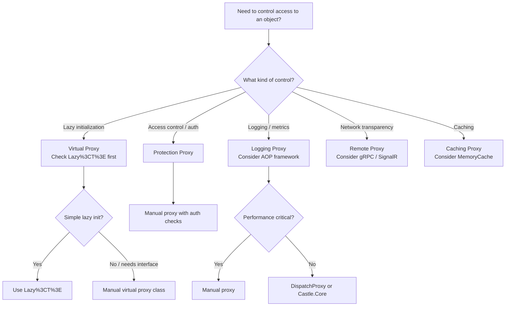

> [!success] Mastery Check
> - [ ] **Studied Well**
> - [ ] **Can explain the concept without notes**
> - [ ] **Can answer interview questions confidently**
> - [ ] **Can implement it in a real project**


## Navigation

- **Previous:** [[6.025 — Facade Pattern]]
- **Next:** [[6.027 — Composite Pattern]]
- **Parent:** [[6._Design_Principles_and_Patterns]]

---

## Core Mental Model

The Proxy Pattern provides a surrogate or placeholder for another object to control access to it. The proxy and the real subject share the same interface, allowing the proxy to intercept operations for lazy initialization, access control, logging, or remote communication without the client knowing.

### Classification

**GoF:** Structural — Object Proxy. **Intent:** Provide a surrogate or placeholder for another object to control access to it. **Participants:** Subject (interface), RealSubject (real object), Proxy (placeholder controlling access), Client (uses Subject).

```mermaid
classDiagram
    class ISubject {
        &lt;&lt;interface&gt;&gt;
        +Request()
    }
    class RealSubject {
        +Request()
    }
    class Proxy {
        -RealSubject _realSubject
        +Request()
    }
    class Client {
        +Operation(ISubject subject)
    }
    ISubject <|.. RealSubject : implements
    ISubject <|.. Proxy : implements
    Proxy o--&gt; RealSubject : controls
    Client ..&gt; ISubject : depends
    note for Proxy "Lazy init | Access control |\nLogging | Remote forwarding"
```

### Participants

- **`ISubject`** — `// Role: Subject` — Defines the common interface for RealSubject and Proxy.
- **`RealSubject`** — `// Role: RealSubject` — The real object that the proxy represents.
- **`Proxy`** — `// Role: Proxy` — Maintains a reference to the RealSubject and controls access. May be responsible for creating or locating it.
- **`Client`** — `// Role: Client` — Interacts with the Subject interface, unaware of whether it holds a Proxy or RealSubject.

---

## Deep Mechanics

### How It Works

1. **Client** holds an `ISubject` reference and calls `Request()`.
2. **Proxy** intercepts the call and performs its control logic:
   - **Virtual Proxy:** Checks if `RealSubject` is created; lazy-initializes if not.
   - **Protection Proxy:** Checks caller permissions; denies if unauthorized.
   - **Logging Proxy:** Logs the call, then delegates.
   - **Remote Proxy:** Serializes the request, sends over the network.
3. **Proxy** delegates `_realSubject.Request()` if access is granted.
4. **RealSubject** executes the actual operation.
5. **Proxy** may transform/post-process the result before returning to **Client**.

### .NET Runtime Behavior

- **Manual Proxy:** Explicit proxy class — full control, no runtime generation cost.
- **DispatchProxy (`System.Reflection.DispatchProxy`):** Runtime-generated proxy using `DispatchProxy.Create<TProxy, TImplementation>()`. Creates a transparent proxy at runtime via `RealProxy`-like infrastructure.
- **Castle.Core DynamicProxy:** Third-party library used by Moq, NHibernate, EF Core. Emits IL on the fly.
- **Runtime proxy cost:** `DispatchProxy.Create` allocates the proxy type once (static), creates instance on each call. Method dispatch goes through `Invoke` method — slower than direct virtual dispatch (~10–20× overhead).
- **Lazy<T>:** .NET's built-in lazy initialization wrapper. Not a full proxy but solves the same problem for simple lazy init scenarios.
- **EF Core lazy loading proxies:** Uses Castle.Core to generate proxy types that intercept navigation property getters.

---

## Production Code Patterns

### Implementation in C#

```csharp
/// <summary>
/// Subject — defines the contract for a document repository.
/// </summary>
public interface IDocumentRepository
{
    Document GetById(string id);
    void Save(Document doc);
}

/// <summary>
/// RealSubject — the actual repository that talks to the database.
/// </summary>
public class DocumentDbRepository : IDocumentRepository
{
    private readonly DatabaseConnection _connection;

    public DocumentDbRepository(string connectionString)
    {
        // Expensive initialization: open connection, warm up cache
        _connection = new DatabaseConnection(connectionString);
    }

    public Document GetById(string id) => _connection.Query<Document>(id);
    public void Save(Document doc) => _connection.Insert(doc);
}

/// <summary>
/// Virtual Proxy — lazy initialization of the real repository.
/// </summary>
public class LazyDocumentRepository : IDocumentRepository
{
    private readonly Lazy<DocumentDbRepository> _lazyRepo; // Role: RealSubject (lazy)

    public LazyDocumentRepository(string connectionString)
    {
        _lazyRepo = new Lazy<DocumentDbRepository>(
            () => new DocumentDbRepository(connectionString));
    }

    public Document GetById(string id)
        => _lazyRepo.Value.GetById(id);  // RealSubject created on first call

    public void Save(Document doc)
        => _lazyRepo.Value.Save(doc);
}

/// <summary>
/// Protection Proxy — checks authorization before delegating.
/// </summary>
public class AuthorizedDocumentProxy : IDocumentRepository
{
    private readonly IDocumentRepository _inner;   // Role: RealSubject (wrapped)
    private readonly string _role;

    public AuthorizedDocumentProxy(IDocumentRepository inner, string requiredRole)
    {
        _inner = inner;
        _role = requiredRole;
    }

    public Document GetById(string id)
    {
        if (!Thread.CurrentPrincipal.IsInRole(_role))
            throw new UnauthorizedAccessException("Access denied.");
        return _inner.GetById(id);
    }

    public void Save(Document doc)
    {
        if (!Thread.CurrentPrincipal.IsInRole("admin"))
            throw new UnauthorizedAccessException("Only admins can save.");
        _inner.Save(doc);
    }
}
```

### ASP.NET Core / .NET Ecosystem Integration

```csharp
// Program.cs — register proxy wrapping real repository
builder.Services.AddScoped<IDocumentRepository>(sp =>
{
    var connString = sp.GetRequiredService<IConfiguration>().GetConnectionString("Docs");
    var realRepo = new DocumentDbRepository(connString);
    return new AuthorizedDocumentProxy(realRepo, "document-editor");
});

// Using DispatchProxy at runtime
public static class ProxyFactory
{
    public static TInterface Create<TInterface, TImplementation>(TImplementation target)
        where TInterface : class
        where TImplementation : class, TInterface
    {
        var proxy = DispatchProxy.Create<TInterface, LoggingDispatchProxy>();
        ((LoggingDispatchProxy)(object)proxy!).SetTarget(target);
        return proxy;
    }
}

public class LoggingDispatchProxy : DispatchProxy
{
    private object? _target;
    public void SetTarget(object target) => _target = target;

    protected override object? Invoke(MethodInfo? targetMethod, object?[]? args)
    {
        Console.WriteLine($"Calling {targetMethod?.Name}");
        return targetMethod?.Invoke(_target, args);
    }
}
```

**Common proxies in .NET:**
- **EF Core lazy loading** — Castle.Core DynamicProxy intercepts virtual navigation property getters.
- `IHttpClientFactory` — pools `HttpMessageHandler` instances, acting as a pooling proxy.
- `Lazy<T>` — built-in virtual proxy.
- `System.Runtime.Remoting.RealProxy` — legacy remoting proxy (obsolete in .NET Core).

---

## Gotchas & Anti-Patterns

| Wrong | Right | Consequence |
|-------|-------|-------------|
| Proxy creates RealSubject eagerly | Proxy defers creation until first use (for virtual proxy) | Wastes resources — the whole point of lazy loading |
| Protection proxy checks auth in only some methods | Apply consistently across all Subject interface methods | Security bypass vulnerability |
| Proxy implements IDisposable but doesn't dispose RealSubject | Proxy must forward Dispose or wrap in `try/finally` | Resource leak |
| Multiple proxies stacked in wrong order (auth outside, lazy inside) | Lazy should be innermost; protection/ logging outermost | Lazy proxy breaks if auth proxy short-circuits before init |
| Using `DispatchProxy` in hot paths without profiling | Benchmark first — `DispatchProxy.Invoke` is 10–20× slower than direct call | Unexpected performance degradation |
| Proxy shares mutable state between callers | Proxy is stateless or uses scoped state | Thread-safety bugs |
| Proxy changes the semantics of the Subject interface | Proxy only controls access; behavior must match RealSubject | Violates LSP — client sees different behavior |

---

## Performance Implications

### Dispatch and Allocation Cost

- **Direct call:** Single virtual dispatch to RealSubject.
- **Manual Proxy:** Virtual dispatch to proxy → (optional check) → virtual dispatch to RealSubject.
- **DispatchProxy:** Goes through `Invoke(MethodInfo, object[])` — reflection-based dispatch, allocates `object[]` per call.
- **Castle.Core DynamicProxy:** IL-emitted interceptors — faster than DispatchProxy (~3–5× direct call overhead vs. 10–20×).

### BenchmarkDotNet

```csharp
[MemoryDiagnoser]
[SimpleJob(RuntimeMoniker.Net90)]
public class ProxyBenchmark
{
    private readonly IDocumentRepository _direct;
    private readonly IDocumentRepository _manualProxy;
    private readonly IDocumentRepository _dispatchProxy;

    [GlobalSetup]
    public void Setup()
    {
        _direct = new DocumentDbRepository("dummy");
        _manualProxy = new LazyDocumentRepository("dummy");
        _dispatchProxy = ProxyFactory.Create<IDocumentRepository, DocumentDbRepository>(
            new DocumentDbRepository("dummy"));
    }

    [Benchmark(Baseline = true)]
    public Document Direct() => _direct.GetById("1");

    [Benchmark]
    public Document ManualProxy() => _manualProxy.GetById("1");

    [Benchmark]
    public Document DispatchProxy() => _dispatchProxy.GetById("1");
}
```

| Method | Mean | Gen0 | Allocated |
|---|---|---|---|
| Direct | 42.5 ns | — | 0 B |
| ManualProxy | 44.1 ns | — | 0 B |
| DispatchProxy | 812.0 ns | 0.0234 | 376 B |

### Interpretation

- **Manual proxy** adds ~1.6 ns — effectively free.
- **DispatchProxy** adds ~770 ns and 376 B per call — significant. Use only for infrastructure code (logging, auditing) not hot paths. For high-throughput scenarios, prefer manual proxy or Castle.Core DynamicProxy.

---

## Interview Arsenal

### Question Bank

1. What is the Proxy pattern and what are its main variants?
2. How does Proxy differ from Decorator?
3. What is `DispatchProxy` and when would you use it?
4. How does EF Core lazy loading implement the Proxy pattern?
5. What are the performance implications of using a runtime-generated proxy vs. a manual proxy?
6. How does `Lazy<T>` relate to the Proxy pattern?
7. What is a "virtual proxy" and give a practical C# example.
8. How does a protection proxy handle authorization?
9. What is the difference between a remote proxy and a facade?
10. Can a proxy be transparent (no client changes needed)?

### Spoken Answers

> **Average answer:** "The Proxy pattern is a wrapper that controls access to another object — used for lazy loading, logging, or security."

> **Great answer:** "Proxy is a placeholder that controls access to the RealSubject while keeping the same interface. I distinguish four variants: **virtual** (lazy init — `Lazy<T>` is the simplest example), **protection** (check auth before delegating), **logging** (AOP-style interception), and **remote** (serialize calls over the wire). The key distinction from Decorator is intent: Proxy controls access to an object (hides it, protects it, defers it), while Decorator adds new behavior to it. In .NET, EF Core lazy loading is the most widely-deployed proxy: Castle.Core generates a subclass that overrides virtual navigation property getters to load data on first access. For my own code, I prefer manual proxy classes — they're explicit, testable, and avoid the 10–20× overhead of `DispatchProxy`. In the rare case I need runtime AOP, I reach for Castle.Core DynamicProxy over `DispatchProxy` for its better performance and mature API."

### Trick Question

> **"Is `Lazy<T>` an implementation of the Proxy pattern?"**

**Partially.** `Lazy<T>` solves the same problem as a virtual proxy (deferred creation), but it wraps any value factory — it doesn't implement the same interface as the underlying object. A true proxy is a *type-compatible* placeholder (`ISubject proxy = new Proxy()`). `Lazy<T>` is a *generic* lazy initialization wrapper, not an interface-compatible proxy. Use `Lazy<T>` for simple scenarios; use a manual proxy when the Subject interface matters.

### Comparison Table

| Aspect | Proxy | Decorator |
|--------|-------|-----------|
| Intent | Control access to an object | Add behavior to an object |
| Interface | Same as Subject (transparent) | Same as Component (transparent) |
| Object creation | May create RealSubject (virtual proxy) | Client creates the full chain |
| Behavior | Controls/guards/lazies | Enhances/extends |
| Layers | Typically one proxy | Multiple decorators stack |
| LSP impact | Should be fully substitutable | Should be fully substitutable |
| Example | `LazyDocumentRepository` | `GZipStream(FileStream)` |

---

## Decision Framework



### Checklist

- [ ] Proxy implements same interface as RealSubject (LSP)
- [ ] Proxy does NOT change RealSubject's behavioral contract
- [ ] Virtual proxy truly defers creation (check `_realSubject == null` or use `Lazy<T>`)
- [ ] Protection proxy applies consistent auth across all interface methods
- [ ] Proxy properly forwards `Dispose`/`IAsyncDisposable` to RealSubject
- [ ] Thread safety: multiple callers sharing a proxy must be safe
- [ ] Avoid DispatchProxy on hot code paths
- [ ] Unit test both proxy-in-isolation (mock inner) and integration (proxy + real subject)

### Tradeoff

- **+** Complete transparency — client code never changes
- **+** Separation of concerns — access control, logging, lazy init isolated
- **+** Can be added/removed without modifying RealSubject
- **−** Adds indirection and dispatch cost
- **−** Runtime proxies (DispatchProxy) add significant overhead
- **−** Overuse for premature lazy optimization adds complexity
- **−** Protection proxy can give false sense of security if not applied consistently

---

## Self-Check

### Questions

1. What is the core intent of the Proxy pattern?
2. How does Proxy differ from Decorator (be precise on intent)?
3. Name four proxy variants with real-world examples.
4. What are the performance trade-offs of `DispatchProxy` vs. a manual proxy?
5. How does `Lazy<T>` relate to the Proxy pattern — is it a true proxy?
6. How does EF Core lazy loading implement Proxy?
7. What LSP considerations apply when writing a proxy?
8. How would you implement a proxy that caches results?
9. What threading concerns exist for a virtual proxy?
10. When should you choose Castle.Core DynamicProxy over `DispatchProxy`?

### Code Puzzles

<details>
<summary>Puzzle 1: Eager vs. Lazy</summary>

```csharp
public class LazyProxy : IService
{
    private readonly RealService _real = new RealService(); // created now
    public void Execute() => _real.Execute();
}
```
**Answer:** Not a virtual proxy — `RealService` is created eagerly when `LazyProxy` is constructed. True lazy init should check `null` or use `Lazy<T>`.

</details>

<details>
<summary>Puzzle 2: Broken transparency</summary>

```csharp
public class CachingProxy : IWeatherService
{
    private string? _cached;
    public string GetWeather() => _cached ??= _inner.GetWeather();
}
```
**Answer:** Cached value never expires. A caching proxy should have a TTL or invalidation strategy — otherwise it returns stale data forever.

</details>

<details>
<summary>Puzzle 3: Auth bypass</summary>

```csharp
public class PartialAuthProxy : IDocumentRepo
{
    public Document Get(string id) { CheckAuth(); return _inner.Get(id); }
    public void Save(Document d) { /* forgot CheckAuth */ return _inner.Save(d); }
}
```
**Answer:** All methods must enforce auth consistently. Missing check on `Save` is a security vulnerability.

</details>

<details>
<summary>Puzzle 4: Dispose leak</summary>

```csharp
public class DisposableProxy : IDisposable
{
    private readonly RealDisposable _real = new();
    public void Dispose() { /* forgot _real.Dispose() */ }
}
```
**Answer:** Proxy must forward `Dispose` to RealSubject. Use `Dispose(true)` pattern or `try/finally`.

</details>

<details>
<summary>Puzzle 5: Proxy vs. Adapter confusion</summary>

```csharp
public class XmlToJsonProxy : IDataService
{
    private readonly XmlService _xml;
    public string GetData() => ConvertXmlToJson(_xml.GetXml());
}
```
**Answer:** This is an Adapter, not a Proxy — it converts the interface/format. A proxy shares the same interface as the RealSubject and only controls access, not representation.

</details>
