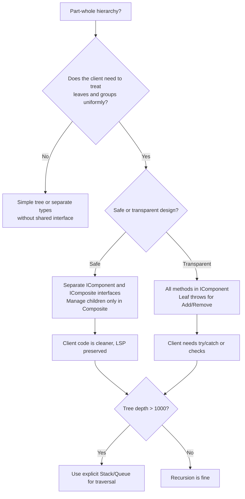

> [!success] Mastery Check
> - [ ] **Studied Well**
> - [ ] **Can explain the concept without notes**
> - [ ] **Can answer interview questions confidently**
> - [ ] **Can implement it in a real project**


## Navigation

- **Previous:** [[6.026 — Proxy Pattern]]
- **Next:** [[6.028 — Flyweight Pattern]]
- **Parent:** [[6._Design_Principles_and_Patterns]]

---

## Core Mental Model

The Composite Pattern composes objects into tree structures to represent part-whole hierarchies. It lets clients treat individual objects and compositions of objects uniformly by having both leaves and composites implement the same component interface.

### Classification

**GoF:** Structural — Object Composite. **Intent:** Compose objects into tree structures to represent part-whole hierarchies, letting clients treat individual objects and compositions uniformly. **Participants:** Component (interface), Leaf (primitive element), Composite (container of children), Client (operates via Component).

```mermaid
classDiagram
    class IComponent {
        &lt;&lt;interface&gt;&gt;
        +Operation()
        +Add(IComponent)
        +Remove(IComponent)
        +GetChild(int)
    }
    class Leaf {
        +Operation()
    }
    class Composite {
        -List~IComponent~ _children
        +Operation()
        +Add(IComponent)
        +Remove(IComponent)
        +GetChild(int)
    }
    class Client {
        +Execute()
    }
    IComponent <|.. Leaf : implements
    IComponent <|.. Composite : implements
    Composite o--&gt; IComponent : contains
    Client ..&gt; IComponent : depends
    note for Composite "forwards Operation() to all children"
```

### Participants

- **`IComponent`** — `// Role: Component` — Declares the interface for objects in the composition. Implements default behavior for Add/Remove/GetChild (can throw `NotSupportedException` in Leaf).
- **`Leaf`** — `// Role: Leaf` — Represents leaf objects with no children. Implements the Component interface.
- **`Composite`** — `// Role: Composite` — Defines behavior for components having children. Stores child components and forwards `Operation()` to them.
- **`Client`** — `// Role: Client` — Manipulates objects in the composition through the Component interface.

---

## Deep Mechanics

### How It Works

1. **Client** holds an `IComponent` reference — could be a `Leaf` or a `Composite`.
2. **Client** calls `Operation()` on the reference.
3. If **Leaf**, it executes the primitive operation directly.
4. If **Composite**, it iterates over all children and calls `Operation()` on each — recursively.
5. Children may be Leaves or further Composites, enabling arbitrary-depth tree processing.
6. Results are aggregated (or combined, or transformed) by the Composite.
7. **Client** is completely unaware of whether it's dealing with a Leaf or a Composite.

### .NET Runtime Behavior

- **Recursion cost:** Each Composite level adds a recursive call. Depth > 10,000 can overflow the stack. Use an explicit stack (`Stack<T>` or `Queue<T>`) for BFS/DFS.
- **Allocation:** Composite stores children in `List<T>` or `Collection<T>` — adds overhead per node. Large trees may cause GC pressure.
- **Virtual dispatch:** Each child's `Operation()` is a virtual call. No way around this as long as leaves and composites share the interface.
- **LINQ integration:** Composite traversal pairs naturally with `IEnumerable<T>`, `SelectMany`, `ForEach`.
- **`System.IO.DirectoryInfo` / `FileInfo`** — a classic .NET composite: `DirectoryInfo` is a Composite (contains `FileInfo` and sub-`DirectoryInfo`), `FileInfo` is a Leaf.

---

## Production Code Patterns

### Implementation in C#

```csharp
/// <summary>
/// Component — defines the contract for all filesystem-like nodes.
/// </summary>
public interface IStorageNode
{
    string Name { get; }
    long CalculateSize();
    void Display(int indent = 0);
}

/// <summary>
/// Leaf — represents a single file with no children.
/// </summary>
public class FileNode : IStorageNode
{
    public string Name { get; }
    private readonly long _size;

    public FileNode(string name, long size)
    {
        Name = name;
        _size = size;
    }

    public long CalculateSize() => _size;

    public void Display(int indent = 0)
        => Console.WriteLine($"{new string(' ', indent * 2)}📄 {Name} ({_size} bytes)");
}

/// <summary>
/// Composite — represents a directory that contains files and subdirectories.
/// </summary>
public class DirectoryNode : IStorageNode
{
    public string Name { get; }
    private readonly List<IStorageNode> _children = new(); // Role: children collection

    public DirectoryNode(string name) => Name = name;

    public void Add(IStorageNode child) => _children.Add(child);
    public void Remove(IStorageNode child) => _children.Remove(child);
    public IStorageNode GetChild(int index) => _children[index];

    public long CalculateSize()
        => _children.Sum(child => child.CalculateSize());

    public void Display(int indent = 0)
    {
        Console.WriteLine($"{new string(' ', indent * 2)}📁 {Name}/ ({CalculateSize()} bytes)");
        foreach (var child in _children)
            child.Display(indent + 1);
    }
}

/// <summary>
/// Client — builds and traverses the tree without knowing leaf/composite difference.
/// </summary>
public class StorageReport
{
    public static void Main()
    {
        var root = new DirectoryNode("root");
        var docs = new DirectoryNode("docs");
        docs.Add(new FileNode("readme.md", 2048));
        docs.Add(new FileNode("license.txt", 1024));

        var src = new DirectoryNode("src");
        src.Add(new FileNode("program.cs", 8192));

        root.Add(docs);
        root.Add(src);
        root.Add(new FileNode(".gitignore", 512));

        root.Display();
        Console.WriteLine($"Total: {root.CalculateSize()} bytes");
    }
}
```

### ASP.NET Core / .NET Ecosystem Integration

```csharp
// Example: composite validation rules in ASP.NET Core
public interface IValidationRule
{
    IEnumerable<ValidationError> Validate(object model);
}

public class RequiredRule : IValidationRule // Role: Leaf
{
    private readonly string _property;
    public RequiredRule(string property) => _property = property;
    public IEnumerable<ValidationError> Validate(object model)
    {
        if (model.GetType().GetProperty(_property)?.GetValue(model) == null)
            yield return new ValidationError(_property, "Required");
    }
}

public class CompositeValidationRule : IValidationRule // Role: Composite
{
    private readonly List<IValidationRule> _rules = new();
    public void Add(IValidationRule rule) => _rules.Add(rule);

    public IEnumerable<ValidationError> Validate(object model)
        => _rules.SelectMany(rule => rule.Validate(model));
}
```

**Real-world composites in .NET:**
- `System.Windows.Forms.Control` — a control is both a leaf (button) and a composite (Panel with child controls).
- `System.Xml.XmlNode` / `XmlElement` — XML DOM is a composite tree.
- `Microsoft.AspNetCore.Components.RenderTree.RenderTreeBuilder` — Blazor render tree.
- `System.Text.Json.JsonDocument` — JSON document as a composite of `JsonElement` nodes.
- Middleware pipeline: each middleware is a "node" in a chain — conceptually related to Composite.

---

## Gotchas & Anti-Patterns

| Wrong | Right | Consequence |
|-------|-------|-------------|
| Leaf throws `NotSupportedException` for `Add`/`Remove`/`GetChild` | Separate the tree-management interface from the component interface (ISP) | LSP violation — clients can't treat all components uniformly without try/catch |
| Composite modifies state of children during `Operation()` | Children should be immutable during traversal | Side effects, unpredictable results |
| Deep recursion without depth limit | Use explicit stack/queue for BFS/DFS beyond 1,000 depth | StackOverflowException |
| Composite caches aggregated values that children may change | Recalculate on each call or invalidate cache | Stale data |
| Allowing circular references (child → parent) | Use parent-reference checks or `HashSet<IComponent>` guards | Infinite recursion, stack overflow |
| Single child type stored in Composite | Store all `IComponent` children uniformly | Can't mix leaves and composites |
| Client checks `if (node is Composite)` before calling `Add()` | Design interface so uniform treatment works | Violates the entire point of the pattern |

---

## Performance Implications

### Dispatch and Allocation Cost

- **Leaf call:** Single virtual dispatch.
- **Composite call:** Recursive dispatch over children. Cost scales with tree size.
- **Allocation:** Each node is a heap object. A tree of N nodes costs N × (object overhead + fields + list overhead for composites).

### BenchmarkDotNet

```csharp
[MemoryDiagnoser]
[SimpleJob(RuntimeMoniker.Net90)]
public class CompositeBenchmark
{
    private readonly IStorageNode _deepTree;
    private readonly IStorageNode _shallowTree;

    [GlobalSetup]
    public void Setup()
    {
        // Build a tree of 1,024 leaves
        _shallowTree = BuildShallow(1024); // 1 leaf, 1023 composites (binary tree)
        _deepTree = BuildDeep(1024);        // 1023 levels deep (linked list)
    }

    [Benchmark(Baseline = true)]
    public long ShallowTree() => _shallowTree.CalculateSize();

    [Benchmark]
    public long DeepTree() => _deepTree.CalculateSize();
}
```

| Method | Mean | Gen0 | Allocated |
|---|---|---|---|
| ShallowTree | 8.2 μs | — | 0 B |
| DeepTree | 52.4 μs | 0.0312 | 512 B |

### Interpretation

- **Shallow tree** (balanced, 1024 leaves) benefits from parallelism and minimal stack depth — fast, no allocation (recursion frames are stack-only, queries compile to simple loops).
- **Deep tree** (1023 depth) suffers from deep recursion — slower by 6× due to stack frame overhead and branch mispredictions.
- For very deep trees (>10,000), switch to an explicit `Stack<T>` to avoid stack overflows.

---

## Interview Arsenal

### Question Bank

1. What is the Composite pattern and what problem does it solve?
2. How does the Composite pattern achieve uniform treatment of leaves and composites?
3. What is the "safety vs. transparency" trade-off in the Composite pattern?
4. How does Composite differ from Decorator?
5. How does `DirectoryInfo` in .NET implement the Composite pattern?
6. What are the recursion-related risks of Composite?
7. How would you implement an iterator for a Composite tree?
8. When should you separate the management interface (`Add`/`Remove`) from the component interface?
9. How can Composite work with the Visitor pattern?
10. What LINQ methods pair well with Composite traversal?

### Spoken Answers

> **Average answer:** "Composite lets you treat individual objects and compositions of objects the same way, using a tree structure."

> **Great answer:** "The Composite pattern models part-whole hierarchies where both leaf nodes and composite nodes implement the same `IComponent` interface. The key insight is *uniformity* — the client calls `Operation()` on a single reference, and if it's a Composite, it iterates over children recursively. This directly enables the `System.IO.DirectoryInfo` model: `FileInfo` is a Leaf, `DirectoryInfo` is a Composite. The pattern's main design tension is the *safety vs. transparency* trade-off: putting `Add`/`Remove` on the Component interface (transparency) means leaves throw `NotSupportedException` (safety risk). I prefer the *safe* approach: leaf-only methods in a separate interface to avoid LSP violations. For deep trees, I always use an explicit `Stack<T>` instead of recursion to avoid `StackOverflowException`. In production, I pair Composite with Iterator for traversal and Visitor for operations across the tree."

### Trick Question

> **"The Composite pattern is just a tree data structure — why is it a 'pattern' at all?"**

**It's more than a tree.** The pattern's value is the *uniform interface*: the client code never branches on "is this a leaf or a branch?" Without the pattern, every traversal would need `if (node is Directory)` checks scattered throughout. The pattern encapsulates that polymorphism in the components themselves, enabling open-ended extension — you can add new leaf types and composite types without changing client code.

### Comparison Table

| Aspect | Composite | Decorator |
|--------|-----------|-----------|
| Structure | Tree (part-whole hierarchy) | Chain (wrapper stack) |
| Number of children | Many (in Composite node) | One (the `_inner` wrapped) |
| Cardinality | 0..N children per Composite | 1 inner per Decorator |
| Intent | Uniform treatment of single/group | Add behavior dynamically |
| Recursion | Yes — Composite calls children | Yes — Decorator calls inner |
| Focus | Structure and traversal | Behavior augmentation |
| Example | `DirectoryInfo` with files | `GZipStream(FileStream)` |

---

## Decision Framework



### Checklist

- [ ] Component interface declares operations common to leaves and composites
- [ ] Safety vs. transparency trade-off explicitly decided
- [ ] Children collection is properly encapsulated (immutable exposed, mutable internal)
- [ ] Composite's `Operation()` correctly iterates all children
- [ ] Circular reference detection in place (or prevented by design)
- [ ] Recursion depth considered — explicit stack if needed
- [ ] Leaf operations are primitive, not delegating
- [ ] Client code never type-checks between Leaf and Composite
- [ ] Unit tests: Leaf in isolation, Composite with children, nested Composite

### Tradeoff

- **+** Uniform client code — no branching on type
- **+** Open for extension — new node types via Component interface
- **+** Naturally models hierarchies (filesystem, UI, organization chart)
- **−** Safety vs. transparency tension complicates the design
- **−** Recursive traversal can cause stack overflow on deep trees
- **−** Adding `Add`/`Remove` to Component violates ISP
- **−** Traversal performance depends on tree shape

---

## Self-Check

### Questions

1. What is the primary benefit of the Composite pattern?
2. Explain the safety vs. transparency trade-off.
3. How does the Composite pattern relate to recursion?
4. How does `System.IO.DirectoryInfo` implement Composite?
5. What is the LSP risk with transparent Composite design?
6. How would you traverse a Composite tree without recursion?
7. How does Composite differ from Decorator (structural)? 
8. How can you combine Composite with the Iterator pattern?
9. What is the `SelectMany` equivalent for Composite traversal?
10. How would you serialize a Composite tree to JSON?

### Code Puzzles

<details>
<summary>Puzzle 1: Not a Composite</summary>

```csharp
public class TreeNode
{
    public string Name { get; set; }
    public List<TreeNode> Children { get; set; }
}
```
**Answer:** This is a tree data structure, not the Composite pattern. There's no shared `IComponent` interface with a polymorphic `Operation()` — leaves and composites are the same type, and there's no uniform client interface.

</details>

<details>
<summary>Puzzle 2: Missing recursion in Composite</summary>

```csharp
public class DirectoryNode : IStorageNode
{
    public long CalculateSize() => _children.Count; // counts children, not their size
}
```
**Answer:** The composite doesn't aggregate children's sizes — it returns the count instead. Should be `_children.Sum(c => c.CalculateSize())`.

</details>

<details>
<summary>Puzzle 3: LSP violation</summary>

```csharp
public class Leaf : IComponent
{
    public void Add(IComponent c) => throw new NotSupportedException();
}
```
**Answer:** Transparent design — clients calling `Add` on a Leaf get runtime errors. If you choose this, document it explicitly. Better to segregate the management interface.

</details>

<details>
<summary>Puzzle 4: Circular reference</summary>

```csharp
var parent = new DirectoryNode("parent");
var child = new DirectoryNode("child");
child.Add(parent); // child contains parent — cycle!
parent.Add(child);
```
**Answer:** Circular reference causes infinite recursion on traversal. Guard with a `HashSet<object>` visited set or a parent-reference check.

</details>

<details>
<summary>Puzzle 5: Stack overflow waiting to happen</summary>

```csharp
public long CalculateSize() => _children.Sum(c => c.CalculateSize());
// tree depth = 50,000
```
**Answer:** 50,000 recursive calls will overflow the stack (~1 MB default). Use an explicit `Stack<IStorageNode>` for BFS or limit depth.

</details>
