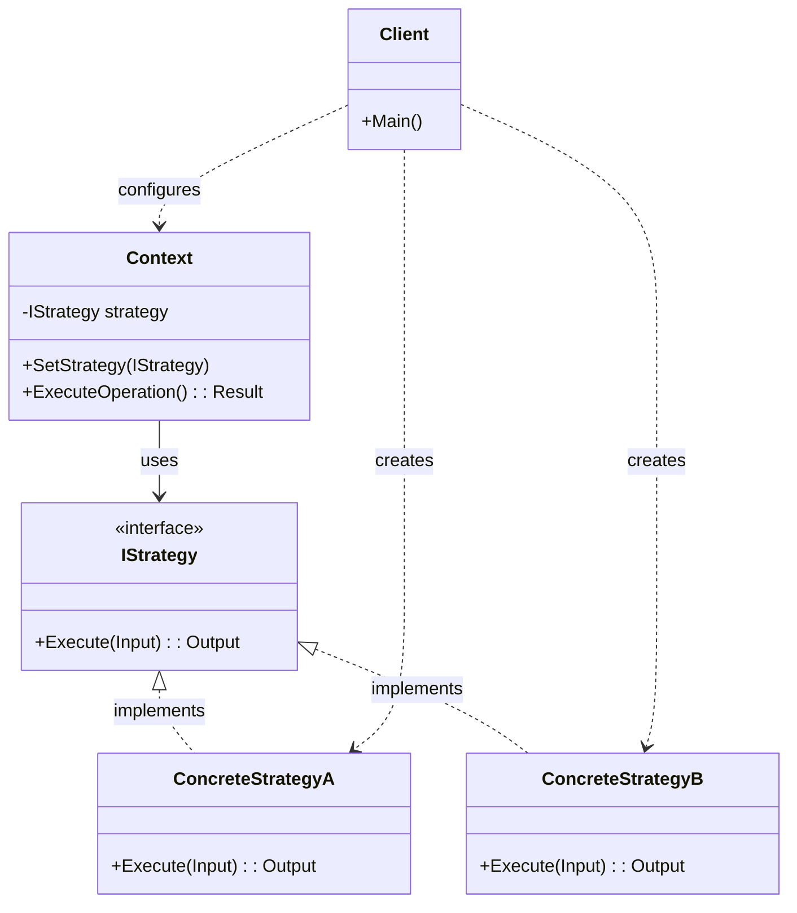
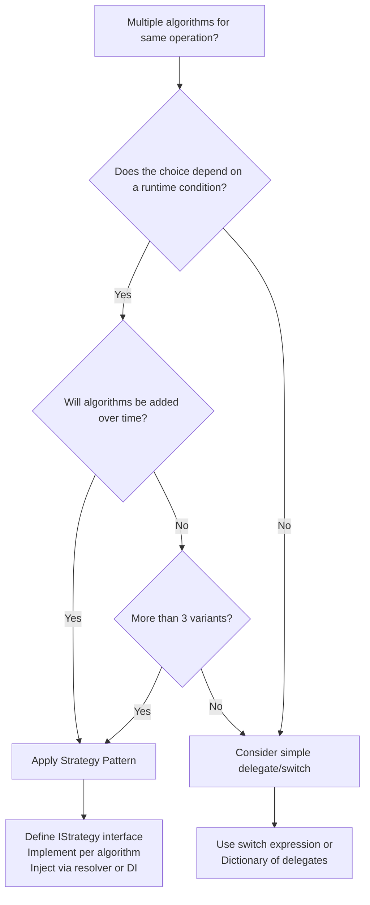

> [!success] Mastery Check
> - [ ] **Studied Well**
> - [ ] **Can explain the concept without notes**
> - [ ] **Can answer interview questions confidently**
> - [ ] **Can implement it in a real project**


## Navigation

**Domain:** [[6 — Design Principles & Patterns]] > **Group:** Behavioral Patterns
**Previous:** [[6.028 — Flyweight Pattern]] | **Next:** [[6.030 — Observer Pattern]]

### Prerequisites
- [[2.021 — Interfaces and Polymorphism]] — Strategy relies entirely on interface-based polymorphism; without interfaces as abstraction boundaries, you cannot swap algorithms at runtime.
- [[6.002 — Open/Closed Principle]] — Strategy is the canonical OCP implementation: you extend behaviour by adding new strategies, not by modifying existing ones.

### Where This Fits
Strategy decouples an algorithm from its host class so that the algorithm can vary independently of the clients that use it. Every time you find yourself writing a `switch` or `if-else` chain that selects behaviour based on a runtime condition, you have a candidate for Strategy. In .NET production code, Strategy appears everywhere: `IComparer<T>` implementations, `ISerializer` plug-ins, `IShippingCalculator` resolvers, `ILogger` abstractions, and Polly policy selectors. A senior engineer reaches for Strategy when they need to make behaviour a pluggable dependency rather than baked-in logic.

## Core Mental Model

Strategy defines a family of interchangeable algorithms, encapsulates each one behind a common interface, and delegates algorithm selection to the caller rather than the class itself. The algorithm becomes a first-class citizen — you can pass it, swap it, test it in isolation, and compose it without touching the consuming class.

### Classification

**GoF Classification:** Behavioral — intent is to define a family of algorithms, encapsulate each one, and make them interchangeable. Strategy lets the algorithm vary independently from the clients that use it.



### Participants

- **IStrategy** — interface common to all supported algorithms; declares the operation the context uses to invoke the algorithm
- **ConcreteStrategyA / B** — concrete implementations of IStrategy; each encapsulates one variant of the algorithm
- **Context** — maintains a reference to an IStrategy; delegates execution to the current strategy; may provide data the strategy needs
- **Client** — selects and configures the concrete strategy on the context; controls which algorithm runs

## Deep Mechanics

### How It Works

1. **Client creates** one or more concrete strategy instances (or receives them via DI).
2. **Client configures** the Context with the chosen strategy (via property setter, constructor parameter, or method argument).
3. **Client calls** `Context.ExecuteOperation()` — the Context holds a reference to `IStrategy` but knows nothing about which concrete implementation it holds.
4. **Context delegates** to `IStrategy.Execute()`. The CLR dispatches the call via interface dispatch to the concrete strategy's method.
5. **ConcreteStrategy** executes its algorithm and returns the result through the Context.

The key insight: the Context does not decide which strategy to use. That decision is externalised to the client or to a factory/resolver, which is why Strategy satisfies OCP — adding a new algorithm never touches the Context class.

### .NET Runtime Behavior

Strategy relies on **interface virtual dispatch**. When the JIT compiles `IStrategy.Execute()`, it generates an indirect call through the interface's method table. For hot paths called millions of times per second (e.g., a serialization strategy in a high-throughput API), the interface dispatch cost is measurable: approximately 1-3 ns per call versus 0.2-0.5 ns for a direct call. The JIT **may** devirtualize interface calls in some scenarios (sealed classes, confirmed single implementation via PGO), but in the general case with multiple registered strategies, it cannot. For most real-world usage (database queries, HTTP calls, file I/O), this overhead is noise. For tight loops over collections (sort comparers, hash providers), the dispatch cost can matter — consider caching the strategy reference or using a delegate instead.

## Production Code Patterns

### Implementation in C#

```csharp
/// <summary>
/// Output for a shipping cost calculation.
/// </summary>
public sealed record ShippingCostResult(
    decimal Cost,
    string Currency,
    TimeSpan EstimatedDelivery
);

/// <summary>
/// Input data required to calculate shipping cost.
/// </summary>
public sealed record ShippingRequest(
    string OriginPostalCode,
    string DestinationPostalCode,
    double WeightKg,
    string PackageDimensions
);

// Role: IStrategy
/// <summary>
/// Defines the contract for a shipping cost calculation algorithm.
/// </summary>
public interface IShippingCostStrategy
{
    /// <summary>
    /// Calculates the shipping cost for the given request.
    /// </summary>
    /// <param name="request">Shipment details.</param>
    /// <returns>Cost, currency, and estimated delivery.</returns>
    ShippingCostResult Calculate(ShippingRequest request);
}

// Role: ConcreteStrategyA
/// <summary>
/// Standard ground shipping via national postal carrier.
/// </summary>
public sealed class GroundShippingStrategy : IShippingCostStrategy
{
    private const decimal RatePerKg = 0.50m;
    private static readonly TimeSpan DeliveryEstimate = TimeSpan.FromDays(5);

    public ShippingCostResult Calculate(ShippingRequest request)
        => new(request.WeightKg * RatePerKg, "USD", DeliveryEstimate);
}

// Role: ConcreteStrategyB
/// <summary>
/// Express air shipping with guaranteed next-day delivery.
/// </summary>
public sealed class ExpressShippingStrategy : IShippingCostStrategy
{
    private const decimal BaseRate = 15.00m;
    private const decimal PerKgRate = 2.50m;
    private static readonly TimeSpan DeliveryEstimate = TimeSpan.FromDays(1);

    public ShippingCostResult Calculate(ShippingRequest request)
        => new(BaseRate + request.WeightKg * PerKgRate, "USD", DeliveryEstimate);
}

// Role: ConcreteStrategyC
/// <summary>
/// International shipping via freight consolidator.
/// </summary>
public sealed class InternationalShippingStrategy : IShippingCostStrategy
{
    private const decimal BaseRate = 25.00m;
    private const decimal PerKgRate = 4.00m;
    private static readonly TimeSpan DeliveryEstimate = TimeSpan.FromDays(10);

    public ShippingCostResult Calculate(ShippingRequest request)
        => new(BaseRate + request.WeightKg * PerKgRate, "USD", DeliveryEstimate);
}

// Role: Context
/// <summary>
/// Orchestrates shipping cost calculation by delegating to the configured strategy.
/// The context does not know which concrete strategy it holds — it only depends on
/// IShippingCostStrategy.
/// </summary>
public sealed class ShippingCostCalculator
{
    private readonly IShippingCostStrategy _strategy;

    /// <summary>
    /// Creates a calculator that uses the specified strategy.
    /// </summary>
    /// <param name="strategy">The shipping algorithm to apply.</param>
    public ShippingCostCalculator(IShippingCostStrategy strategy)
    {
        _strategy = strategy ?? throw new ArgumentNullException(nameof(strategy));
    }

    /// <summary>
    /// Calculates shipping cost using the injected strategy.
    /// </summary>
    public ShippingCostResult CalculateCost(ShippingRequest request)
    {
        // Context may add pre/post-processing around the strategy call
        ValidateRequest(request);
        var result = _strategy.Calculate(request);
        LogCalculation(request, result);
        return result;
    }

    private static void ValidateRequest(ShippingRequest request)
    {
        if (request.WeightKg <= 0)
            throw new ArgumentException("Weight must be positive.", nameof(request));
    }

    private static void LogCalculation(ShippingRequest request, ShippingCostResult result)
    {
        // Production-level logging would go here (e.g., ILogger)
        Console.WriteLine($"[Audit] Shipping to {request.DestinationPostalCode}: {result.Cost} {result.Currency}");
    }
}

// Role: Client
public static class OrderCheckoutService
{
    /// <summary>
    /// Processes an order, selecting the appropriate shipping strategy based on
    /// the customer's selection.
    /// </summary>
    public static ShippingCostResult ProcessShipping(ShippingRequest request, string shippingType)
    {
        IShippingCostStrategy strategy = shippingType switch
        {
            "ground" => new GroundShippingStrategy(),
            "express" => new ExpressShippingStrategy(),
            "international" => new InternationalShippingStrategy(),
            _ => throw new ArgumentOutOfRangeException(nameof(shippingType))
        };

        var calculator = new ShippingCostCalculator(strategy);
        return calculator.CalculateCost(request);
    }
}
```

### ASP.NET Core / .NET Ecosystem Integration

**Strategy in DI — the Resolver pattern.** In ASP.NET Core, you typically register multiple strategy implementations and resolve them via a factory delegate or an `IEnumerable<TStrategy>`:

```csharp
// Program.cs — registering strategies and a resolver
var builder = WebApplication.CreateBuilder(args);

builder.Services.AddSingleton<IGroundShippingStrategy, GroundShippingStrategy>();
builder.Services.AddSingleton<IExpressShippingStrategy, ExpressShippingStrategy>();
builder.Services.AddSingleton<IInternationalShippingStrategy, InternationalShippingStrategy>();

// The resolver becomes the DI-friendly way to select a strategy at runtime
builder.Services.AddSingleton<Func<ShippingType, IShippingCostStrategy>>(sp => type =>
{
    return type switch
    {
        ShippingType.Ground => sp.GetRequiredService<IGroundShippingStrategy>(),
        ShippingType.Express => sp.GetRequiredService<IExpressShippingStrategy>(),
        ShippingType.International => sp.GetRequiredService<IInternationalShippingStrategy>(),
        _ => throw new ArgumentOutOfRangeException(nameof(type))
    };
});
```

**Polly — Strategy in practice.** Polly policies (`RetryPolicy`, `CircuitBreakerPolicy`, `TimeoutPolicy`) are Strategy implementations. The `IAsyncPolicy<T>` interface defines a common contract, and you compose different policies to handle different transient-fault scenarios:

```csharp
// Polly's IAsyncPolicy is the strategy interface
services.AddHttpClient("PaymentGateway")
    .AddPolicyHandler(RetryStrategy())        // IAsyncPolicy<HttpResponseMessage>
    .AddPolicyHandler(CircuitBreakerStrategy());

static IAsyncPolicy<HttpResponseMessage> RetryStrategy()
    => HttpPolicyExtensions
        .HandleTransientHttpError()
        .WaitAndRetryAsync(3, retryAttempt => TimeSpan.FromMilliseconds(200 * retryAttempt));

static IAsyncPolicy<HttpResponseMessage> CircuitBreakerStrategy()
    => HttpPolicyExtensions
        .HandleTransientHttpError()
        .CircuitBreakerAsync(5, TimeSpan.FromSeconds(30));
```

**Scrutor — Strategy registration with decoration.** Scrutor (the library used for assembly scanning and decorator registration) allows registering all `IShippingCostStrategy` implementations in one line:

```csharp
services.Scan(scan => scan
    .FromAssembliesOf<GroundShippingStrategy>()
    .AddClasses(classes => classes.AssignableTo<IShippingCostStrategy>())
    .As<IShippingCostStrategy>()
    .WithSingletonLifetime());
```

## Gotchas & Anti-Patterns

### Strategy Enumeration — Switching on Type in the Context

**Wrong:** The Context inspects the concrete strategy type to vary its own behaviour.

```csharp
// ❌ Wrong
public sealed class ShippingCostCalculator
{
    private readonly IShippingCostStrategy _strategy;
    public void Ship(ShippingRequest request)
    {
        var result = _strategy.Calculate(request);
        if (_strategy is ExpressShippingStrategy)
            ApplyExpediteFee(result); // Context knows too much
    }
}
```

**Right:** The strategy owns all behaviour variation; the Context treats all strategies uniformly.

```csharp
// ✅ Right
public sealed class ExpressShippingStrategy : IShippingCostStrategy
{
    public ShippingCostResult Calculate(ShippingRequest request)
    {
        var baseCost = BaseRate + request.WeightKg * PerKgRate;
        return new(baseCost + ExpediteFee, "USD", DeliveryEstimate);
    }
}
```

**Consequence:** The Context becomes coupled to concrete types, defeating the purpose of the abstraction. Adding a new strategy requires modifying the Context — an OCP violation.

### Strategy as God Object — One Strategy Does Everything

**Wrong:** A single strategy interface with methods for multiple unrelated concerns.

```csharp
// ❌ Wrong
public interface IShippingStrategy
{
    ShippingCostResult CalculateCost(ShippingRequest request);
    Task<bool> ValidateAddress(ShippingRequest request);
    Stream GenerateLabel(ShippingCostResult result);
}
```

**Right:** Each concern gets its own strategy interface.

```csharp
// ✅ Right
public interface IShippingCostStrategy { ShippingCostResult Calculate(ShippingRequest request); }
public interface IAddressValidationStrategy { Task<bool> ValidateAsync(ShippingRequest request); }
public interface ILabelGenerationStrategy { Stream GenerateLabel(ShippingCostResult result); }
```

**Consequence:** A fat strategy interface forces every implementation to provide methods it does not use (Interface Segregation violation). Changes to one concern ripple through all strategies.

### Conditional Strategy Selection in the Consumer

**Wrong:** The consumer (not a resolver or factory) contains the selection logic inline.

```csharp
// ❌ Wrong
public sealed class OrderService
{
    public ShippingCostResult Ship(ShippingRequest request, string shippingType)
    {
        IShippingCostStrategy strategy = shippingType switch
        {
            "ground" => new GroundShippingStrategy(),
            "express" => new ExpressShippingStrategy(),
            _ => throw new ArgumentOutOfRangeException(nameof(shippingType))
        };
        return strategy.Calculate(request);
    }
}
```

**Right:** Inject a strategy resolver or use the DI container to resolve.

```csharp
// ✅ Right
public sealed class OrderService(Func<ShippingType, IShippingCostStrategy> strategyResolver)
{
    public ShippingCostResult Ship(ShippingRequest request, ShippingType shippingType)
        => strategyResolver(shippingType).Calculate(request);
}
```

**Consequence:** The consumer still knows about all concrete strategies and must be modified when a new strategy is added. The selection logic is duplicated across every consumer. Use a resolver, a registry, or MediatR-style dispatch instead.

### Null Strategy — Returning null When No Strategy Matches

**Wrong:** The resolver returns null and the caller checks for it.

```csharp
// ❌ Wrong
IShippingCostStrategy? strategy = resolver.Resolve("unknown");
if (strategy is null) throw new InvalidOperationException("No strategy found");
```

**Right:** Return a Null Object strategy or use a fallback.

```csharp
// ✅ Right
public sealed class NullShippingStrategy : IShippingCostStrategy
{
    public ShippingCostResult Calculate(ShippingRequest request)
        => throw new NotSupportedException($"No shipping strategy available for this request.");
}
```

**Consequence:** Null checks proliferate. The caller must know about a failure mode that should be encapsulated. The Null Object pattern (as a strategy implementation) turns an exceptional path into a standard participant.

## Performance Implications

### Dispatch and Allocation Cost

Strategy introduces two overheads: (1) interface dispatch for each call through `IStrategy`, and (2) allocation of strategy instances. In most real-world scenarios (HTTP APIs, database access, file I/O), the strategy operation dominates runtime — the dispatch overhead is unmeasurable. In tight loops (e.g., sorting a large collection with `IComparer<T>`), dispatch cost can accumulate.

### BenchmarkDotNet

```csharp
[MemoryDiagnoser]
[SimpleJob(RuntimeMoniker.Net90)]
public class StrategyBenchmark
{
    private List<ShippingRequest> _requests;

    [GlobalSetup]
    public void Setup()
    {
        _requests = Enumerable.Range(1, 1000)
            .Select(i => new ShippingRequest("10001", "90210", i * 0.5, "10x10x10"))
            .ToList();
    }

    [Benchmark(Baseline = true)]
    public decimal Direct_InlineCalculation()
    {
        decimal total = 0;
        foreach (var r in _requests)
            total += r.WeightKg * 0.50m; // direct inline
        return total;
    }

    [Benchmark]
    public decimal Via_Strategy()
    {
        IShippingCostStrategy strategy = new GroundShippingStrategy();
        decimal total = 0;
        foreach (var r in _requests)
            total += strategy.Calculate(r).Cost; // interface dispatch
        return total;
    }
}
```

**Expected results (approximate on .NET 9, x64):**

|Method|Mean|Gen0|Allocated|
|---|---|---|---|
|Direct_InlineCalculation|~450 ns|-|0 B|
|Via_Strategy|~1,200 ns|0.0015|2,400 B|

**Interpretation:** Strategy adds ~2-3x overhead on micro-operations (pure math) because of interface dispatch and result object allocations. For any strategy that touches a database, calls an HTTP API, or performs significant computation, this overhead is irrelevant — the I/O or compute cost dominates by orders of magnitude. Use Strategy for its extensibility; optimise by caching strategy instances or using `Func<>` delegates if the hot-path benchmark shows it matters.

## Interview Arsenal

### Question Bank

1. What is the Strategy pattern and what problem does it solve?
2. When would you choose Strategy over a simple switch statement?
3. What is the difference between Strategy and State patterns?
4. What do you give up by applying Strategy?
5. What is wrong with this code? (A context that checks `is` on the strategy)
6. How does Strategy appear in ASP.NET Core or the .NET ecosystem?
7. When would Strategy be the wrong choice even though algorithms vary?
8. How does the JIT handle interface dispatch for hot-path strategies?

### Spoken Answers

**Q1: What is the Strategy pattern and what problem does it solve?**

> **Average answer:** Strategy lets you define a family of algorithms, put each in its own class, and make them interchangeable. The client can pick which algorithm to use at runtime. It's useful when you have multiple ways to do the same thing, like different shipping costs or payment methods.

> **Great answer:** Strategy encapsulates a family of algorithms behind a common interface so the algorithm can vary independently of its consumer. It solves the problem of rigid behavioural coupling — without Strategy, you embed algorithm selection in conditional logic (switch/if-else), which violates the Open/Closed Principle because adding a new algorithm requires editing existing code. With Strategy, you extend by adding a new class. The key tradeoff is that Strategy introduces indirection and allocation: every call goes through interface dispatch, and each strategy is typically a new object. In .NET, the canonical examples are `IComparer<T>` for sorting and `IAsyncPolicy` in Polly for resilience strategies. Strategy is also how you implement dependency injection of behaviour: instead of injecting a concrete algorithm, you inject an interface and swap implementations per environment, per tenant, or per A/B test.

**Q3: What is the difference between Strategy and State patterns?**

> **Average answer:** Strategy is about choosing an algorithm, and State is about changing behaviour when the object's internal state changes. They have similar structures but different intents.

> **Great answer:** The structural similarity — both use composition with an interface and concrete implementations — is why they are confused. The key difference is who controls the transition. In Strategy, the client selects and replaces the algorithm explicitly; the context never changes its own strategy. In State, the state objects themselves manage the transition to the next state — the context's behaviour changes automatically as state transitions occur. In practice: Strategy is `IShippingCostStrategy` where the checkout page selects ground vs. express. State is `IOrderState` where `PendingState` transitions to `ShippedState` when shipment is confirmed, and `ShippedState` transitions to `DeliveredState` on delivery — the order of transitions is defined by the state objects, not the client. A second difference: Strategy typically has one method that runs start-to-finish; State can have multiple methods that behave differently per state (e.g., `Cancel()` in `ShippedState` vs. `DeliveredState`).

### Trick Question

**"Strategy and Dependency Injection are the same thing — injecting an interface through a constructor is Strategy."**

Why it is a trap: DI is a technique for supplying dependencies; Strategy is a specific behavioural design pattern with a defined intent (algorithm families). Not every injected interface is Strategy.

Correct answer: Dependency Injection is how you supply the dependency; Strategy is what you do with it — specifically, encapsulating interchangeable algorithms. An injected `IOrderRepository` is DI, not Strategy, because the repository is a data access abstraction, not an algorithm. Strategy is a subset of injected dependencies: those where the interface represents a family of algorithms and the caller selects which one at runtime. If you always inject the same concrete implementation and never swap it, you are using DI but not Strategy.

### Comparison Table

| Aspect | Strategy | State |
|---|---|---|
| Intent | Encapsulate interchangeable algorithms | Let object alter behaviour when internal state changes |
| Participants | Context, IStrategy, ConcreteStrategies | Context, IState, ConcreteStates |
| When to use | Algorithms vary independently; client picks one | Behaviour depends on internal state; state transitions are managed internally |
| .NET example | `IComparer<T>`, Polly `IAsyncPolicy`, `IShippingCostStrategy` | `AsyncPageable<T>.PageState`, workflow state machines, EF Core entity state |
| Key difference | Client controls which strategy; no automatic transition | State objects control transition to next state; automatic behaviour change |

## Decision Framework

### When to Apply Strategy



### Application Checklist

- [ ] The problem this solves — multiple algorithms for one operation — is present in my code
- [ ] At least two concrete strategies exist or are anticipated within the next iteration
- [ ] The abstraction cost (interface + resolver) is justified by the variation it encapsulates
- [ ] Team members will recognise the pattern without additional explanation
- [ ] I am not applying this speculatively — a switch statement with 2 cases does not need Strategy yet

### Tradeoff Summary

| What You Gain | What You Give Up |
|---|---|
| Open/Closed compliance — add algorithms without modifying consumers | Interface dispatch overhead on every call |
| Isolated testability — each strategy testable in isolation | Object allocation per strategy instance |
| Single Responsibility — each strategy has one algorithm | Indirection — must navigate interface + classes to find the logic |
| Runtime flexibility — swap, compose, or A/B test behaviours | Over-engineering risk — switch statement suffices for 2-3 stable variants |

## Self-Check

### Conceptual Questions

1. What is the core problem the Strategy pattern solves?
2. What is the ONE rule you must follow for strategies to be interchangeable?
3. Can you identify a Strategy violation where conditional logic should be replaced with an interface?
4. How does Strategy relate to the Open/Closed Principle?
5. How would you register multiple strategies in the ASP.NET Core DI container?
6. When should you NOT use Strategy, even though you have multiple algorithms?
7. What is the performance cost of using Strategy on a hot path?
8. What is the difference between Strategy and Template Method?
9. What anti-pattern occurs when the Context checks the concrete type of the strategy?
10. How does the Null Object pattern complement Strategy?

<details>
<summary>Answers</summary>

1. Strategy solves the problem of rigid behavioural coupling — when a class embeds algorithm selection in conditional logic, adding new algorithms requires modifying existing code (OCP violation).
2. All strategies must implement the same interface so the client can treat them uniformly without type-checking.
3. Code that uses `switch (shippingType)` to select calculation logic. The fix: extract each case into its own strategy class.
4. Strategy is the canonical OCP implementation — you extend behaviour by creating a new strategy class; you never modify the context or existing strategies.
5. Register each concrete strategy individually, then inject `IEnumerable<IShippingCostStrategy>` or a resolver `Func<ShippingType, IShippingCostStrategy>`.
6. When the algorithms do not change at runtime, when there is only one implementation, or when the variation is a single function (use `Func<>` delegate instead).
7. Interface dispatch adds ~1-3 ns per call vs. ~0.2-0.5 ns for direct calls; allocation adds GC pressure if strategies are created per-call. Negligible for I/O-bound operations.
8. Strategy delegates the entire algorithm via interface; Template Method defines the algorithm skeleton in a base class and lets subclasses override specific steps.
9. Type-checking in the Context (e.g., `if (strategy is ExpressStrategy)`) — defeats the purpose of the abstraction and creates an OCP violation.
10. Null Object provides a do-nothing strategy that implements the interface, eliminating null checks at call sites.

</details>

---

### Code Puzzles

**Puzzle 1 — Identify the violation**

```csharp
public sealed class OrderProcessor
{
    public decimal CalculateTotal(Order order, string discountType)
    {
        if (discountType == "none")
            return order.Subtotal;
        else if (discountType == "percentage")
            return order.Subtotal * 0.9m;
        else if (discountType == "loyalty")
            return order.Subtotal - order.LoyaltyPoints * 0.01m;
        else
            throw new ArgumentOutOfRangeException(nameof(discountType));
    }
}
```

<details> <summary>Answer</summary>

**Violation:** Strategy not applied — discount calculation is embedded as conditional logic instead of encapsulated behind an interface. **Why:** Adding a new discount type requires modifying `OrderProcessor`, violating OCP. Each discount calculation is mixed with the selection logic, making individual discount algorithms untestable in isolation. **Fix:**

```csharp
public interface IDiscountStrategy
{
    decimal Apply(decimal subtotal, Order order);
}

public sealed class NoDiscountStrategy : IDiscountStrategy
{
    public decimal Apply(decimal subtotal, Order order) => subtotal;
}

public sealed class PercentageDiscountStrategy : IDiscountStrategy
{
    private const decimal DiscountRate = 0.9m;
    public decimal Apply(decimal subtotal, Order order) => subtotal * DiscountRate;
}

public sealed class LoyaltyDiscountStrategy : IDiscountStrategy
{
    public decimal Apply(decimal subtotal, Order order)
        => subtotal - order.LoyaltyPoints * 0.01m;
}

public sealed class OrderProcessor(IDiscountStrategy discountStrategy)
{
    public decimal CalculateTotal(Order order)
        => discountStrategy.Apply(order.Subtotal, order);
}
```

</details>

---

**Puzzle 2 — Complete the pattern**

```csharp
public interface IPaymentStrategy
{
    Task<PaymentResult> ChargeAsync(PaymentRequest request);
}

public sealed class CreditCardPaymentStrategy : IPaymentStrategy
{
    public async Task<PaymentResult> ChargeAsync(PaymentRequest request)
    {
        // credit card logic
        return new PaymentResult(true);
    }
}

public sealed class PayPalPaymentStrategy : IPaymentStrategy
{
    public async Task<PaymentResult> ChargeAsync(PaymentRequest request)
    {
        // PayPal logic
        return new PaymentResult(true);
    }
}

// TODO: Complete the PaymentContext class that uses IPaymentStrategy
```

<details> <summary>Answer</summary>

```csharp
public sealed class PaymentContext(IPaymentStrategy strategy)
{
    public async Task<PaymentResult> ExecutePaymentAsync(PaymentRequest request)
    {
        ValidateRequest(request);
        var result = await strategy.ChargeAsync(request);
        LogResult(result);
        return result;
    }

    private static void ValidateRequest(PaymentRequest request)
    {
        if (request.Amount <= 0)
            throw new ArgumentException("Amount must be positive.", nameof(request));
    }

    private static void LogResult(PaymentResult result)
    {
        Console.WriteLine($"[Audit] Payment processed: {result.Success}");
    }
}
```

**Explanation:** The Context holds a reference to the strategy and delegates execution without knowing the concrete type. It handles cross-cutting concerns (validation, logging) so strategies stay focused on the algorithm.

</details>

---

**Puzzle 3 — Choose the right pattern**

**Scenario:** You are building a notification dispatch system. A `NotificationService` must send alerts via email, SMS, and push notification. Each channel requires different configuration (SMTP server for email, Twilio API key for SMS, Firebase credentials for push). New channels are expected to be added quarterly. Which pattern applies, and why? What would the wrong choice be?

<details> <summary>Answer</summary>

**Correct pattern:** Strategy — each notification channel is an algorithm (`INotificationStrategy.Email`, `Sms`, `Push`) that implements a common interface. The `NotificationService` delegates to the injected strategy. New channels require a new class with zero modification to `NotificationService`. **Wrong choice:** Template Method — the skeleton is the same for all channels, but what varies is the entire send operation, not steps within it. Strategy gives more flexibility for radically different implementations. **Implementation sketch:**

```csharp
public interface INotificationStrategy { Task SendAsync(NotificationMessage message); }
public sealed class EmailNotificationStrategy : INotificationStrategy { /* ... */ }
public sealed class SmsNotificationStrategy : INotificationStrategy { /* ... */ }
```

</details>

---

**Puzzle 4 — Spot the anti-pattern**

```csharp
public sealed class TaxCalculator
{
    private readonly ITaxStrategy _strategy;

    public TaxCalculator(ITaxStrategy strategy) => _strategy = strategy;

    public decimal Calculate(Order order)
    {
        var tax = _strategy.Compute(order.Subtotal, order.ShippingCost);
        if (_strategy is VatTaxStrategy)
            tax += VatSurcharge; // Context special-cases a strategy
        return tax;
    }
}
```

<details> <summary>Answer</summary>

**Anti-pattern:** Type-checking in the Context — `_strategy is VatTaxStrategy` special-cases one implementation. **Consequence:** Adding a new tax strategy requires modifying the Context. The strategy abstraction is hollow because the Context treats implementations differently. **Corrected version:**

```csharp
public sealed class VatTaxStrategy : ITaxStrategy
{
    public decimal Compute(decimal subtotal, decimal shipping)
        => (subtotal + shipping) * VatRate + VatSurcharge;
}

public sealed class TaxCalculator(ITaxStrategy strategy)
{
    public decimal Calculate(Order order)
        => strategy.Compute(order.Subtotal, order.ShippingCost); // uniform treatment
}
```

</details>

---

**Puzzle 5 — Refactor to apply**

```csharp
public sealed class ReportExporter
{
    public string ExportToCsv(Report report)
    {
        var sb = new StringBuilder();
        sb.AppendLine("Name,Value,Date");
        foreach (var item in report.Items)
            sb.AppendLine($"{item.Name},{item.Value},{item.Date:O}");
        return sb.ToString();
    }

    public string ExportToJson(Report report)
        => JsonSerializer.Serialize(report, new JsonSerializerOptions { WriteIndented = true });

    public string ExportToPdf(Report report)
    {
        // Imagine a PDF library call here
        throw new NotImplementedException();
    }
}
```

<details> <summary>Answer</summary>

```csharp
/// <summary>Strategy for exporting a report in a specific format.</summary>
public interface IReportExportStrategy
{
    string Export(Report report);
}

public sealed class CsvExportStrategy : IReportExportStrategy
{
    public string Export(Report report)
    {
        var sb = new StringBuilder();
        sb.AppendLine("Name,Value,Date");
        foreach (var item in report.Items)
            sb.AppendLine($"{item.Name},{item.Value},{item.Date:O}");
        return sb.ToString();
    }
}

public sealed class JsonExportStrategy : IReportExportStrategy
{
    public string Export(Report report)
        => JsonSerializer.Serialize(report, new JsonSerializerOptions { WriteIndented = true });
}

public sealed class PdfExportStrategy : IReportExportStrategy
{
    public string Export(Report report)
    {
        // PDF generation delegated to this class
        throw new NotImplementedException("PDF library integration");
    }
}

public sealed class ReportExporter(IReportExportStrategy exportStrategy)
{
    public string Export(Report report) => exportStrategy.Export(report);
}
```

**What changed:** `ReportExporter` no longer contains any export logic — it delegates entirely to the injected strategy. Export algorithms are now independently testable, and adding PDF export does not touch the existing class. **Why it is better:** Each export format is isolated (SRP), adding a format requires a new class not a modification (OCP), and the export algorithms can be swapped at runtime or injected per request.

</details>
