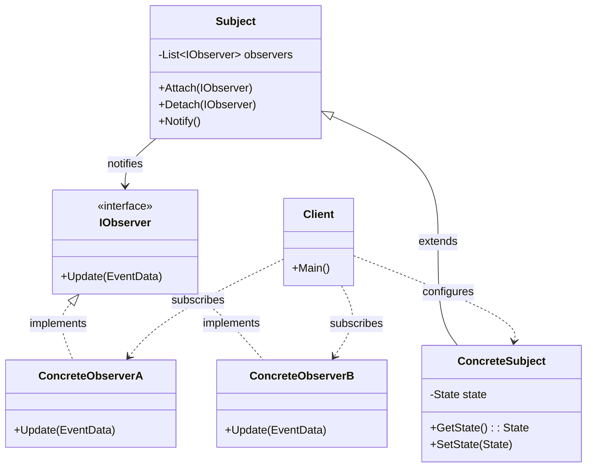
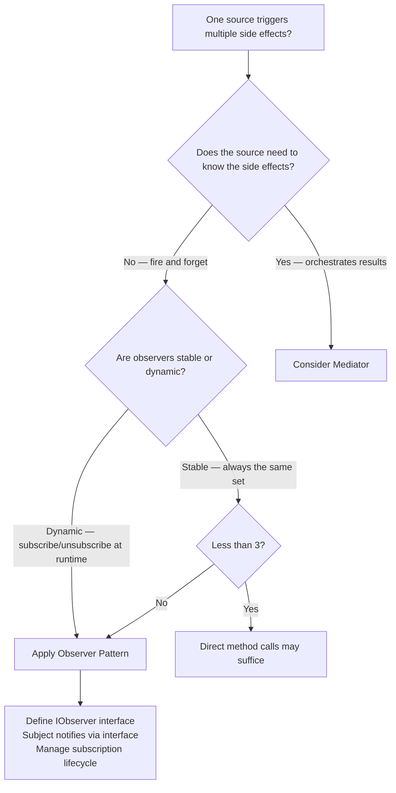

> [!success] Mastery Check
> - [ ] **Studied Well**
> - [ ] **Can explain the concept without notes**
> - [ ] **Can answer interview questions confidently**
> - [ ] **Can implement it in a real project**


## Navigation

**Domain:** [[6 — Design Principles & Patterns]] > **Group:** Behavioral Patterns
**Previous:** [[6.029 — Strategy Pattern]] | **Next:** [[6.031 — Command Pattern]]

### Prerequisites
- [[2.022 — Events, Delegates, and IObservable]] — Observer is built into C# via the `event` keyword and `IObservable<T>`/`IObserver<T>` interfaces; understanding these mechanisms is required before implementing the pattern.
- [[6.035 — Mediator Pattern]] — Observer and Mediator solve similar problems (pub/sub communication) with different architectural tradeoffs; understanding both is essential for choosing between them.

### Where This Fits
Observer establishes a one-to-many dependency between objects so that when one object changes state, all its dependents are notified automatically. This is the publish-subscribe model at its simplest — no message broker, no routing, no persistence. In .NET, Observer appears in two forms: the language-native `event` keyword (multicast delegates) and the framework-provided `IObservable<T>`/`IObserver<T>` interfaces (reactive streams). A senior engineer reaches for Observer when a domain event needs to trigger multiple side effects without the publisher knowing about the subscribers — UI updates after a data change, audit logging after a state transition, or cache invalidation after a write operation.

## Core Mental Model

Observer defines a subscription mechanism where one object (the subject) maintains a list of its dependents (observers) and notifies them automatically of any state changes, typically by calling one of their methods. The subject knows nothing about the observers except that they implement a common interface — this decoupling allows observers to be added, removed, or replaced at runtime without modifying the subject.

### Classification

**GoF Classification:** Behavioral — intent is to define a one-to-many dependency between objects so that when one object changes state, all its dependents are notified and updated automatically.



### Participants

- **Subject** — knows its observers (0..n); provides interface for attaching and detaching observer objects
- **ConcreteSubject** — stores state of interest to observers; sends notification when state changes
- **IObserver** — interface for objects that should be notified of changes in a subject
- **ConcreteObserverA / B** — implements the observer interface; stores reference to subject or subject data to keep itself consistent

## Deep Mechanics

### How It Works

1. **Client creates** a ConcreteSubject and one or more ConcreteObservers.
2. **Client subscribes** each observer by calling `Subject.Attach(observer)`. The subject stores the observer reference (usually in a list).
3. **Client or system** triggers a state change on the subject (e.g., `order.Pay()` changes `Order.Status`).
4. **ConcreteSubject** calls `Notify()` internally, which iterates through the observer list and calls `IObserver.Update(data)` on each.
5. **Each ConcreteObserver** receives the notification and updates itself — queries the subject for data, processes the event data, or triggers side effects.

The critical design rule: the subject never knows what the observers do with the notification. Observers might update a UI, write a log, invalidate a cache, or call an external API — the subject is blind to these concerns.

### .NET Runtime Behavior

**C# `event` — the language-native Observer.** When you declare `public event EventHandler<OrderShippedEvent> OrderShipped`, the C# compiler generates a multicast delegate (`MulticastDelegate`) that maintains an invocation list. Raising the event calls each subscriber's handler sequentially on the same thread. Key runtime characteristics:
- **Synchronous, in-order invocation** — subscribers are called in the order they were added; a slow or throwing subscriber blocks all subsequent subscribers.
- **No async awareness** — `async void` handlers are fire-and-forget; exceptions in `async void` handlers crash the process.
- **Thread safety** — the delegate invocation list is immutable once assigned; compound assignment (`+=` / `-=`) creates a new delegate instance, making it safe under contention (but you can miss a notification between read and assignment).

**`IObservable<T>` / `IObserver<T>` — the reactive streams approach.** These interfaces, part of the Reactive Extensions (Rx.NET) library, provide a push-based data flow model with backpressure awareness. The runtime does not provide a default implementation — you must implement or use a library (e.g., `System.Reactive`). Key differences from `event`:
- **Composable** — LINQ-style operators (`Where`, `Select`, `Buffer`, `Throttle`) on the observable sequence.
- **Completion and error signals** — `OnCompleted()` and `OnError()` formalise stream lifecycle.
- **Unsubscribe via disposable** — `Subscribe()` returns `IDisposable`; disposing unsubscribes.

## Production Code Patterns

### Implementation in C#

```csharp
/// <summary>Event data for an order status change.</summary>
public sealed record OrderStatusChangedEvent(
    Guid OrderId,
    OrderStatus OldStatus,
    OrderStatus NewStatus,
    DateTime Timestamp
);

// Role: Subject
/// <summary>
/// Maintains a list of observers and notifies them when order status changes.
/// The subject does not know what observers do with the notification.
/// </summary>
public sealed class OrderSubject
{
    private readonly List<IOrderObserver> _observers = new();
    private OrderStatus _status;

    /// <summary>Current order status.</summary>
    public OrderStatus Status => _status;

    /// <summary>Subscribes an observer to status change notifications.</summary>
    public IDisposable Attach(IOrderObserver observer)
    {
        _observers.Add(observer);
        return new Unsubscriber(() => Detach(observer));
    }

    /// <summary>Unsubscribes an observer.</summary>
    public void Detach(IOrderObserver observer) => _observers.Remove(observer);

    /// <summary>Updates status and notifies all observers.</summary>
    public void UpdateStatus(OrderStatus newStatus)
    {
        var oldStatus = _status;
        _status = newStatus;
        Notify(new OrderStatusChangedEvent(
            Guid.NewGuid(), oldStatus, newStatus, DateTime.UtcNow));
    }

    private void Notify(OrderStatusChangedEvent evt)
    {
        // Snapshot the list to avoid enumeration-modification issues
        foreach (var observer in _observers.ToArray())
            observer.OnStatusChanged(evt);
    }

    /// <summary>Helper to manage unsubscription via IDisposable.</summary>
    private sealed record Unsubscriber(Action Unsubscribe) : IDisposable
    {
        public void Dispose() => Unsubscribe();
    }
}

// Role: IObserver
/// <summary>
/// Defines the notification contract for objects interested in order status changes.
/// </summary>
public interface IOrderObserver
{
    /// <summary>Called when the order status changes.</summary>
    void OnStatusChanged(OrderStatusChangedEvent evt);
}

// Role: ConcreteObserverA
/// <summary>
/// Logs every order status change to the audit trail.
/// </summary>
public sealed class AuditLoggerObserver : IOrderObserver
{
    private readonly IAuditLogRepository _auditLog;

    public AuditLoggerObserver(IAuditLogRepository auditLog)
        => _auditLog = auditLog;

    public void OnStatusChanged(OrderStatusChangedEvent evt)
    {
        _auditLog.Write(new AuditEntry(
            $"Order {evt.OrderId}: {evt.OldStatus} -> {evt.NewStatus}",
            evt.Timestamp));
    }
}

// Role: ConcreteObserverB
/// <summary>
/// Invalidates cached order data when an order is fulfilled.
/// </summary>
public sealed class CacheInvalidationObserver : IOrderObserver
{
    private readonly IDistributedCache _cache;

    public CacheInvalidationObserver(IDistributedCache cache)
        => _cache = cache;

    public void OnStatusChanged(OrderStatusChangedEvent evt)
    {
        if (evt.NewStatus is OrderStatus.Shipped or OrderStatus.Delivered)
        {
            var cacheKey = $"order:{evt.OrderId}";
            _cache.Remove(cacheKey);
        }
    }
}

// Role: ConcreteObserverC
/// <summary>
/// Sends email notifications for specific order transitions.
/// </summary>
public sealed class EmailNotificationObserver : IOrderObserver
{
    private readonly IEmailDispatcher _email;

    public EmailNotificationObserver(IEmailDispatcher email)
        => _email = email;

    public void OnStatusChanged(OrderStatusChangedEvent evt)
    {
        if (evt.NewStatus == OrderStatus.Shipped)
            _email.SendAsync(new OrderShippedEmail(evt.OrderId));
    }
}
```

### ASP.NET Core / .NET Ecosystem Integration

**`IObservable<T>` in ASP.NET Core.** SignalR uses `IObservable<T>` for streaming data to clients. Server-side methods can return `IObservable<T>` to push a stream of data over a persistent connection:

```csharp
public class OrderStreamHub : Hub
{
    public IObservable<OrderStatusChangedEvent> StreamOrderStatus(Guid orderId)
    {
        // Return an observable that pushes status changes to the connected client
        return Observable.Interval(TimeSpan.FromSeconds(1))
            .Select(_ => new OrderStatusChangedEvent(
                orderId, OrderStatus.Pending, OrderStatus.Processing, DateTime.UtcNow));
    }
}
```

**IHostedService — background observer coordinator.** Combine Observer with a background service to manage event subscriptions:

```csharp
// Registers observers and connects them to the subject at application startup
public sealed class OrderEventSubscriberService : IHostedService
{
    private readonly OrderSubject _subject;
    private readonly IEnumerable<IOrderObserver> _observers;
    private readonly List<IDisposable> _subscriptions = new();

    public OrderEventSubscriberService(OrderSubject subject, IEnumerable<IOrderObserver> observers)
    {
        _subject = subject;
        _observers = observers;
    }

    public Task StartAsync(CancellationToken cancellationToken)
    {
        foreach (var observer in _observers)
            _subscriptions.Add(_subject.Attach(observer));
        return Task.CompletedTask;
    }

    public Task StopAsync(CancellationToken cancellationToken)
    {
        foreach (var sub in _subscriptions)
            sub.Dispose();
        _subscriptions.Clear();
        return Task.CompletedTask;
    }
}

// Registration in Program.cs
builder.Services.AddSingleton<OrderSubject>();
builder.Services.AddSingleton<IOrderObserver, AuditLoggerObserver>();
builder.Services.AddSingleton<IOrderObserver, CacheInvalidationObserver>();
builder.Services.AddSingleton<IOrderObserver, EmailNotificationObserver>();
builder.Services.AddHostedService<OrderEventSubscriberService>();
```

**MediatR — Observer via notifications.** MediatR's `INotification` / `INotificationHandler<T>` implements the Observer pattern (with Mediator coordination):

```csharp
public sealed record OrderShippedNotification(Guid OrderId) : INotification;

// Multiple handlers — each is an observer
public sealed class AuditLogHandler(IAuditLogRepository auditLog)
    : INotificationHandler<OrderShippedNotification>
{
    public Task Handle(OrderShippedNotification notification, CancellationToken ct)
    {
        auditLog.Write(new AuditEntry($"Order shipped: {notification.OrderId}", DateTime.UtcNow));
        return Task.CompletedTask;
    }
}

public sealed class CacheInvalidationHandler(IDistributedCache cache)
    : INotificationHandler<OrderShippedNotification>
{
    public Task Handle(OrderShippedNotification notification, CancellationToken ct)
    {
        cache.Remove($"order:{notification.OrderId}");
        return Task.CompletedTask;
    }
}
```

## Gotchas & Anti-Patterns

### Async Void in Event Handlers

**Wrong:** Subscribing with `async void` to an event.

```csharp
// ❌ Wrong
orderSubject.StatusChanged += async (sender, args) =>
{
    await emailDispatcher.SendAsync(new OrderShippedEmail(args.OrderId));
};
```

**Right:** Convert the event to a `Func<..., Task>`-based mechanism or use `IObservable<T>`.

```csharp
// ✅ Right — use async event pattern with EventHandler<TaskEventArgs>
public delegate Task AsyncEventHandler<TEventArgs>(object? sender, TEventArgs args);
```

**Consequence:** `async void` exceptions crash the process. The caller cannot await the handler, so unhandled exceptions terminate the application. The event publisher also cannot know when the async operation completes.

### Observer List Mutation During Notification

**Wrong:** Modifying the observer list while iterating it.

```csharp
// ❌ Wrong
public void Notify(OrderStatusChangedEvent evt)
{
    foreach (var observer in _observers) // InvalidOperationException if modified
        observer.OnStatusChanged(evt);
}
```

**Right:** Snapshot the list before iterating.

```csharp
// ✅ Right
public void Notify(OrderStatusChangedEvent evt)
{
    foreach (var observer in _observers.ToArray())
        observer.OnStatusChanged(evt);
}
```

**Consequence:** `InvalidOperationException: Collection was modified` at runtime. The snapshot approach ensures safe enumeration even if an observer unsubscribes during notification.

### Exception in One Observer Breaks All Others

**Wrong:** Letting an observer exception propagate to the subject.

```csharp
// ❌ Wrong
public void Notify(OrderStatusChangedEvent evt)
{
    foreach (var observer in _observers.ToArray())
        observer.OnStatusChanged(evt); // exception stops the loop
}
```

**Right:** Wrap each observer call in a try-catch.

```csharp
// ✅ Right
public void Notify(OrderStatusChangedEvent evt)
{
    foreach (var observer in _observers.ToArray())
    {
        try { observer.OnStatusChanged(evt); }
        catch (Exception ex)
        {
            // Log and continue — one observer failure must not block others
            logger.LogError(ex, "Observer {ObserverType} failed", observer.GetType().Name);
        }
    }
}
```

**Consequence:** A fault in one observer (cache timeouts, email API failures) silences all other observers. In production, a downstream failure becomes a cascading failure.

### Memory Leaks from Unsubscribed Observers

**Wrong:** Attaching an observer to a long-lived subject without detaching.

```csharp
// ❌ Wrong — short-lived UI page subscribes to long-lived OrderSubject
public sealed class OrderPage : IDisposable
{
    public OrderPage(OrderSubject subject)
    {
        subject.Attach(this); // never detached; page stays referenced
    }
}
```

**Right:** Implement `IDisposable` to detach, or use weak-event pattern.

```csharp
// ✅ Right — use the IDisposable returned by Attach
public sealed class OrderPage : IDisposable
{
    private readonly IDisposable _subscription;

    public OrderPage(OrderSubject subject)
    {
        _subscription = subject.Attach(this);
    }

    public void Dispose() => _subscription.Dispose();
}
```

**Consequence:** The subject holds strong references to all observers, creating a GC root that prevents short-lived objects from being collected. Over time, every short-lived subscriber becomes a memory leak.

## Performance Implications

### Dispatch and Allocation Cost

Observer introduces per-notification overhead proportional to the number of subscribed observers. Each notification triggers: (1) snapshot allocation (if using `ToArray()`), (2) N interface dispatches (one per observer), and (3) observer-specific processing. For a small number of observers (2-5) in a typical business application, this is negligible. For high-frequency notifications (1000+ events/sec with 100+ observers), the iteration and dispatch overhead becomes significant — consider batching, event aggregation, or using channels.

### BenchmarkDotNet

```csharp
[MemoryDiagnoser]
[SimpleJob(RuntimeMoniker.Net90)]
public class ObserverBenchmark
{
    private OrderSubject _subject;
    private List<IOrderObserver> _observers;

    [GlobalSetup]
    public void Setup()
    {
        _subject = new OrderSubject();
        _observers = Enumerable.Range(0, 10)
            .Select<int, IOrderObserver>(_ => new AuditLoggerObserver(new InMemoryAuditLog()))
            .ToList();
        foreach (var o in _observers)
            _subject.Attach(o);
    }

    [Benchmark(Baseline = true)]
    public void Direct_MethodCall()
    {
        var evt = new OrderStatusChangedEvent(Guid.NewGuid(), OrderStatus.Pending, OrderStatus.Processing, DateTime.UtcNow);
        foreach (var o in _observers)
            o.OnStatusChanged(evt);
    }

    [Benchmark]
    public void Via_ObserverPattern()
    {
        _subject.UpdateStatus(OrderStatus.Processing);
        _subject.UpdateStatus(OrderStatus.Pending); // reset for benchmark
    }
}
```

**Expected results (approximate on .NET 9, x64):**

|Method|Mean|Gen0|Allocated|
|---|---|---|---|
|Direct_MethodCall|~350 ns|0.0009|~200 B|
|Via_ObserverPattern|~550 ns|0.0018|~400 B|

**Interpretation:** The observer pattern adds ~60% overhead due to the notification loop, snapshot allocation (`ToArray()`), and event data creation. At typical business-event frequencies (tens to hundreds per second), this is irrelevant. At signal-processing or real-time data rates (10k+ events/sec), consider pooling event data objects and avoiding per-notification allocations.

## Interview Arsenal

### Question Bank

1. What is the Observer pattern and what problem does it solve?
2. When would you use Observer vs. a direct method call?
3. What is the difference between Observer and the Mediator pattern?
4. What are the memory implications of Observer in a long-lived .NET application?
5. What is wrong with using `async void` as an event handler?
6. How does Observer appear in ASP.NET Core or MediatR?
7. How do you handle unsubscription to prevent memory leaks?
8. What is the difference between `event` and `IObservable<T>`?

### Spoken Answers

**Q1: What is the Observer pattern and what problem does it solve?**

> **Average answer:** Observer lets one object notify many others when its state changes. The observers are registered with the subject and get updated automatically. It's used for things like event handling and UI updates.

> **Great answer:** Observer solves the problem of one-to-many dependency without coupling. The subject maintains a list of observers that implement a common interface, and notifies them when its state changes — the subject knows nothing about the observers except that interface. This decoupling means you can add, remove, or replace observers without touching the subject. In .NET, this appears in three forms: C# `event` (language-native, synchronous, multicast delegates), `IObservable<T>`/`IObserver<T>` (reactive push-based streams with completion/error signals), and MediatR `INotification` handlers (Observer with Mediator coordination). The key production challenge is managing the observer lifecycle — failing to unsubscribe from a long-lived subject causes memory leaks because the subject holds strong references to observers.

**Q3: What is the difference between Observer and the Mediator pattern?**

> **Average answer:** Observer is direct pub/sub — the subject talks to observers directly. Mediator puts a central object between them to coordinate communication.

> **Great answer:** The architectural difference is coupling topology. In Observer, observers register directly with the subject — the subject maintains an observer list and notifies them. This creates a star topology: the subject knows about all observers (even if only through the interface). In Mediator, colleagues communicate through a mediator object — no colleague knows about any other colleague. Mediator decouples the peers from each other, while Observer decouples the subject from the observers' concrete types but not from the observers themselves. The tradeoff: Observer is simpler and has lower latency (direct notification), but the subject bears the cost of maintaining the observer list and iterating it. Mediator adds indirection but centralises coordination logic (ordering, filtering, error handling). In .NET, MediatR with `INotification` is actually an Observer pattern coordinated through a Mediator — MediatR acts as the mediator, and `INotificationHandler<T>` implementations are observers.

### Trick Question

**"The `event` keyword in C# implements the Observer pattern perfectly — you never need to write a custom observer implementation."**

Why it is a trap: C# `event` implements the Observer *pattern* structurally but lacks features needed for production Observer scenarios — async support, error isolation, lifecycle management, and backpressure.

Correct answer: The `event` keyword implements the *multicast delegate* mechanism, which has the same structural shape as Observer (publisher + subscribers). However, `event` has well-known limitations: handlers execute synchronously and sequentially, one throwing handler blocks all others (no error isolation), `async void` handlers can crash the process, and there is no built-in backpressure or unsubscribing lifecycle beyond `-=`. For production scenarios that need error isolation, async handlers, or reactive processing, use `IObservable<T>` (Rx.NET) or MediatR `INotification` handlers instead. The `event` keyword is best for simple, synchronous notification where all subscribers are trusted and local.

### Comparison Table

| Aspect | Observer | Mediator |
|---|---|---|
| Intent | One-to-many notification without coupling | Centralise complex communication between many objects |
| Participants | Subject, IObserver, ConcreteObservers | Mediator, ConcreteMediator, Colleagues |
| When to use | A single source triggers multiple side effects; direct notification is acceptable | Many objects interact in complex ways; want to decouple peers from each other |
| .NET example | C# `event`, `IObservable<T>`, MediatR `INotificationHandler<T>` | MediatR pipeline, ASP.NET Core Controller/View coordination, SignalR hub |
| Key difference | Subject knows observers exist; direct notification | Colleagues do not know each other; mediator routes messages |

## Decision Framework

### When to Apply Observer



### Application Checklist

- [ ] A single event triggers multiple independent side effects (logging, cache, email, metrics)
- [ ] The publisher should not know which subscribers exist or what they do
- [ ] Subscribers need to be added or removed at runtime without changing the publisher
- [ ] The notification sequence must not be blocked by a slow or failing subscriber (error isolation required)
- [ ] Subscription lifecycle is managed — subscribers detach when they are disposed

### Tradeoff Summary

| What You Gain | What You Give Up |
|---|---|
| Decoupled notification — publisher never knows subscriber types | No guaranteed delivery or ordering across observers |
| Dynamic subscription management — add/remove at runtime | Potential memory leaks from dangling subscriptions |
| Open/Closed — add side effects without modifying source | Synchronous notification — one slow observer blocks all |
| Testability — each observer testable in isolation | No built-in async support in basic event mechanism |

## Self-Check

### Conceptual Questions

1. What is the primary coupling problem that Observer solves?
2. What is the minimum knowledge a subject must have about its observers?
3. Can you identify the Observer pattern in a .NET codebase that uses `event`?
4. What is the difference between Observer and the Mediator pattern?
5. How would you implement Observer using `IObservable<T>` in .NET?
6. When should you NOT use Observer, even though you have multiple side effects?
7. What is the performance implication of having 100+ observers on one subject?
8. What is the difference between Observer and Strategy?
9. What happens when an observer throws an exception during notification?
10. How does MediatR's `INotification` implement Observer?

<details>
<summary>Answers</summary>

1. Observer decouples the subject from the concrete types of its dependents — the subject knows only about an observer interface, not the implementing classes.
2. The subject needs only the observer interface and the ability to iterate/notify them. It must not know their concrete types or what they do with the notification.
3. Any code that subscribes to an event via `+=` and implements an event handler method is using the Observer pattern at the language level.
4. Observer has direct notification (subject calls observers); Mediator centralises communication through an intermediary so colleagues do not know each other.
5. Create an `IObservable<T>` implementation that manages a list of `IObserver<T>` subscribers, calling `OnNext()` on each when data arrives.
6. When the publisher needs to collect results from subscribers, when ordering guarantees are required, or when subscribers produce side effects that must complete before the publisher continues.
7. The subject iterates all observers sequentially — with 100+ observers, notification latency grows linearly. Consider batching or channel-based fan-out.
8. Observer is about notification of state change; Strategy is about selection of an algorithm. Different intents despite similar structural shape.
9. By default, the exception propagates and blocks remaining observers. Production code must wrap each observer call in try-catch to isolate failures.
10. MediatR dispatches `INotification` to all registered `INotificationHandler<T>` implementations — each handler is an observer, MediatR itself is the mediator.

</details>

---

### Code Puzzles

**Puzzle 1 — Identify the violation**

```csharp
public sealed class OrderService
{
    private readonly EmailDispatcher _email;
    private readonly AuditLogger _audit;
    private readonly CacheManager _cache;

    public void ShipOrder(Guid orderId)
    {
        // shipping logic...
        _email.SendOrderShippedEmail(orderId);
        _audit.Log($"Order {orderId} shipped");
        _cache.InvalidateOrderCache(orderId);
    }
}
```

<details> <summary>Answer</summary>

**Violation:** Observer not applied — `OrderService` directly calls three unrelated side effects after shipping, coupling the shipping logic to specific infrastructure services. **Why:** Adding a new side effect (push notification, webhook call) requires modifying `OrderService`. Side effects cannot be added, removed, or tested independently. **Fix:**

```csharp
public interface IOrderShippedObserver { Task OnOrderShipped(Guid orderId); }
public sealed class EmailNotificationObserver(IEmailDispatcher email) : IOrderShippedObserver { /* ... */ }
public sealed class AuditLogObserver(IAuditLogRepository log) : IOrderShippedObserver { /* ... */ }
public sealed class CacheInvalidationObserver(IDistributedCache cache) : IOrderShippedObserver { /* ... */ }

public sealed class OrderService(IEnumerable<IOrderShippedObserver> observers)
{
    public async Task ShipOrderAsync(Guid orderId)
    {
        // shipping logic...
        foreach (var observer in observers)
            await observer.OnOrderShipped(orderId);
    }
}
```

</details>

---

**Puzzle 2 — Complete the pattern**

```csharp
public interface IPriceChangeObserver
{
    void OnPriceChanged(string symbol, decimal oldPrice, decimal newPrice);
}

public sealed class PriceSubject
{
    private readonly List<IPriceChangeObserver> _observers = new();
    private decimal _currentPrice;

    public void Attach(IPriceChangeObserver observer) => _observers.Add(observer);
    public void Detach(IPriceChangeObserver observer) => _observers.Remove(observer);

    public void UpdatePrice(decimal newPrice)
    {
        var oldPrice = _currentPrice;
        _currentPrice = newPrice;
        // TODO: notify observers
    }
}
```

<details> <summary>Answer</summary>

```csharp
public void UpdatePrice(decimal newPrice)
{
    var oldPrice = _currentPrice;
    _currentPrice = newPrice;
    Notify("AAPL", oldPrice, newPrice);
}

private void Notify(string symbol, decimal oldPrice, decimal newPrice)
{
    foreach (var observer in _observers.ToArray())
    {
        try { observer.OnPriceChanged(symbol, oldPrice, newPrice); }
        catch (Exception ex)
        {
            Console.WriteLine($"Observer failed: {ex.Message}");
        }
    }
}
```

**Explanation:** The notification loops over a snapshot (`ToArray()`) to prevent modification exceptions, and each observer is wrapped in try-catch for error isolation.

</details>

---

**Puzzle 3 — Choose the right pattern**

**Scenario:** A trading platform needs to notify multiple systems when a trade is executed: the portfolio service recalculates holdings, the risk service checks exposure limits, the notification service sends a confirmation email, and the audit service logs the trade. New downstream systems are added quarterly. Which pattern applies, and why?

<details> <summary>Answer</summary>

**Correct pattern:** Observer — each downstream system is an independent observer of trade execution events. The trade execution service publishes via an `ITradeObserver` interface without knowing which or how many observers exist. **Wrong choice:** Mediator — Mediator would be appropriate if the systems needed to coordinate with each other or if execution depended on results from downstream systems. Here, the notifications are fire-and-forget side effects. **Implementation sketch:**

```csharp
public interface ITradeObserver { Task OnTradeExecuted(TradeEvent evt); }
public sealed class PortfolioRecalculationObserver : ITradeObserver { /* ... */ }
public sealed class RiskCheckObserver : ITradeObserver { /* ... */ }
public sealed class TradeExecutor(IEnumerable<ITradeObserver> observers) { /* ... */ }
```

</details>

---

**Puzzle 4 — Spot the anti-pattern**

```csharp
public sealed class DocumentPublisher
{
    public event EventHandler<DocumentSavedEventArgs>? DocumentSaved;

    public void Save(Document doc)
    {
        // save logic...
        OnDocumentSaved(doc);
    }

    private void OnDocumentSaved(Document doc)
    {
        DocumentSaved?.Invoke(this, new DocumentSavedEventArgs(doc));
    }
}

// Consumer subscribes with async void
public sealed class SearchIndexUpdater
{
    public SearchIndexUpdater(DocumentPublisher publisher)
    {
        publisher.DocumentSaved += async (sender, args) =>
        {
            await UpdateSearchIndexAsync(args.Document);
        };
    }

    private async Task UpdateSearchIndexAsync(Document doc) { /* ... */ }
}
```

<details> <summary>Answer</summary>

**Anti-pattern:** `async void` event handler. **Consequence:** If `UpdateSearchIndexAsync` throws, the exception terminates the process. The publisher cannot await completion. **Corrected version:** Replace `event` with a custom async handler infrastructure:

```csharp
public delegate Task AsyncEventHandler<T>(object? sender, T args);

public sealed class DocumentPublisher
{
    private readonly List<AsyncEventHandler<DocumentSavedEventArgs>> _handlers = new();
    public event AsyncEventHandler<DocumentSavedEventArgs>? DocumentSaved
    {
        add => _handlers.Add(value);
        remove => _handlers.Remove(value);
    }

    public async Task SaveAsync(Document doc)
    {
        // save logic...
        foreach (var handler in _handlers.ToArray())
            await handler(this, new DocumentSavedEventArgs(doc));
    }
}
```

</details>

---

**Puzzle 5 — Refactor to apply**

```csharp
public sealed class UserRegistrationService
{
    private readonly EmailService _email;
    private readonly WelcomeEmailBuilder _welcomeBuilder;
    private readonly MetricsTracker _metrics;
    private readonly AuditTrail _audit;
    private readonly ReferralProgramService _referral;

    public async Task RegisterUser(RegistrationRequest request)
    {
        var user = new User(request.Email, request.Name);
        await _userRepository.SaveAsync(user);
        await _email.SendAsync(_welcomeBuilder.Build(user));
        _metrics.TrackRegistration(user.Id);
        _audit.Log($"User registered: {user.Id}");
        await _referral.ProcessReferralAsync(user, request.ReferralCode);
    }
}
```

<details> <summary>Answer</summary>

```csharp
public interface IUserRegisteredObserver
{
    Task OnUserRegisteredAsync(User user, string? referralCode);
}

public sealed class WelcomeEmailObserver(EmailService email, WelcomeEmailBuilder builder)
    : IUserRegisteredObserver
{
    public async Task OnUserRegisteredAsync(User user, string? referralCode)
        => await email.SendAsync(builder.Build(user));
}

public sealed class MetricsObserver(MetricsTracker metrics)
    : IUserRegisteredObserver
{
    public Task OnUserRegisteredAsync(User user, string? referralCode)
    {
        metrics.TrackRegistration(user.Id);
        return Task.CompletedTask;
    }
}

public sealed class AuditObserver(AuditTrail audit)
    : IUserRegisteredObserver
{
    public Task OnUserRegisteredAsync(User user, string? referralCode)
    {
        audit.Log($"User registered: {user.Id}");
        return Task.CompletedTask;
    }
}

public sealed class ReferralObserver(ReferralProgramService referral)
    : IUserRegisteredObserver
{
    public async Task OnUserRegisteredAsync(User user, string? referralCode)
        => await referral.ProcessReferralAsync(user, referralCode);
}

public sealed class UserRegistrationService(IEnumerable<IUserRegisteredObserver> observers)
{
    public async Task RegisterUser(RegistrationRequest request)
    {
        var user = new User(request.Email, request.Name);
        await _userRepository.SaveAsync(user);
        foreach (var observer in observers)
            await observer.OnUserRegisteredAsync(user, request.ReferralCode);
    }
}
```

**What changed:** `UserRegistrationService` no longer knows about email, metrics, audit, or referral concerns. It publishes a "user registered" event, and each observer handles one side effect independently. **Why it is better:** Adding a new post-registration action (SMS verification, CRM sync, data export) requires a new observer class — zero modifications to `UserRegistrationService`. Each observer is independently testable. Observers can be conditionally registered per environment.

</details>
