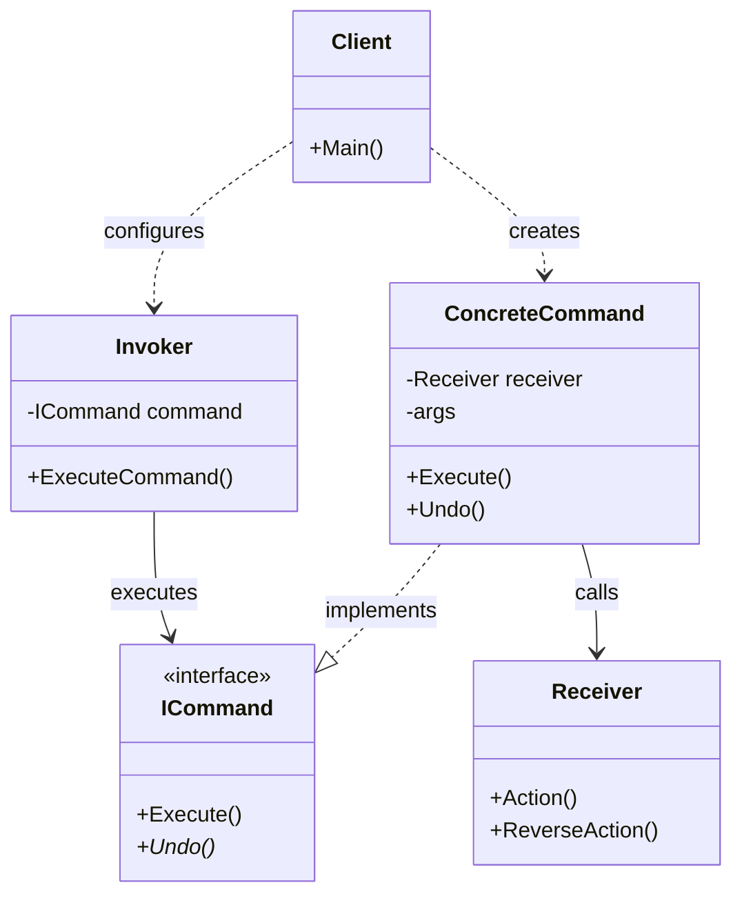
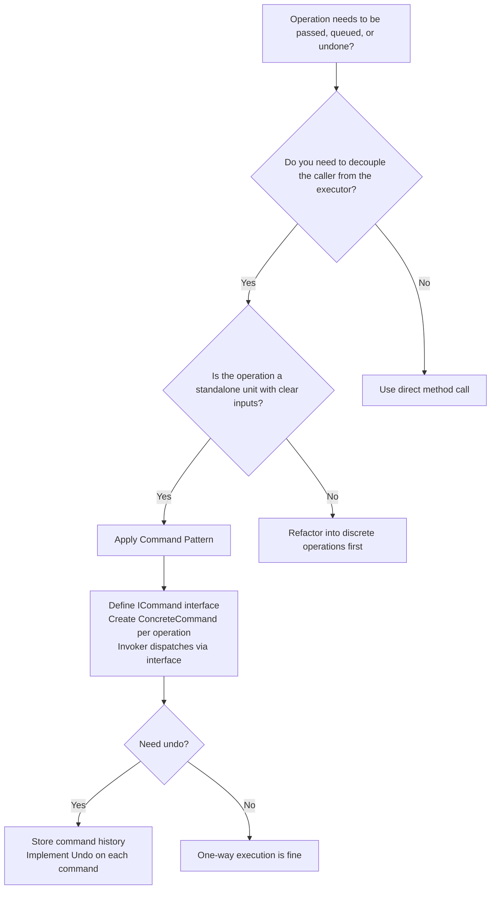

> [!success] Mastery Check
> - [ ] **Studied Well**
> - [ ] **Can explain the concept without notes**
> - [ ] **Can answer interview questions confidently**
> - [ ] **Can implement it in a real project**


## Navigation

**Domain:** [[6 — Design Principles & Patterns]] > **Group:** Behavioral Patterns
**Previous:** [[6.030 — Observer Pattern]] | **Next:** [[6.032 — Chain of Responsibility Pattern]]

### Prerequisites
- [[2.023 — Action and Func Delegates]] — Command encapsulates an operation as an object; understanding delegates helps distinguish Command from simple delegate-based callbacks.
- [[4.055 — MediatR IRequest and IRequestHandler]] — MediatR is the canonical .NET Command pattern implementation; familiarity with its pipeline is essential for production usage.

### Where This Fits
Command turns a request into a standalone object that contains all the information needed to perform the operation. This decouples the object that invokes the operation from the object that knows how to execute it. In .NET, Command appears in MediatR (`IRequest<TResponse>`), in `Task<T>` (an operation waiting to execute), in undo/redo systems, and in background job queues (Hangfire, Quartz.NET). A senior engineer uses Command when they need to parameterise operations, queue them for later execution, support undo, or log the operation history — all without the invoker knowing what the operation does.

## Core Mental Model

Command encapsulates a request as an object, thereby letting you parameterise clients with different requests, queue or log requests, and support undoable operations. The invoker calls `Execute()` on the command interface without knowing which concrete command it holds — the command object itself knows which receiver to invoke and what arguments to pass.

### Classification

**GoF Classification:** Behavioral — intent is to encapsulate a request as an object, thereby letting you parameterise clients with different requests, queue or log requests, and support undoable operations.



### Participants

- **ICommand** — interface that declares the `Execute()` operation (and optionally `Undo()`)
- **ConcreteCommand** — defines a binding between a Receiver and an action; implements `Execute()` by invoking the corresponding operation(s) on Receiver
- **Receiver** — knows how to perform the actual work; the command delegates to it
- **Invoker** — asks the command to carry out the request; does not know about the concrete command
- **Client** — creates a ConcreteCommand, sets its Receiver, and associates it with an Invoker

## Deep Mechanics

### How It Works

1. **Client creates** a ConcreteCommand, passing the Receiver and any arguments.
2. **Client configures** the Invoker with the ConcreteCommand (or a queue of commands).
3. **Invoker calls** `ICommand.Execute()` — the Invoker has no knowledge of what the command does.
4. **ConcreteCommand** calls `Receiver.Action(args)` — the command binds the receiver and the action together.
5. **If undo is needed** — the Invoker (or a history stack) calls `ICommand.Undo()`, which invokes `Receiver.ReverseAction(args)`.

The key insight: the Invoker and the Receiver have no direct relationship. The Command sits between them as a complete description of an operation — what to do, who to do it to, and how to reverse it.

### .NET Runtime Behavior

**Command as a delegate — `Action` and `Func`.** The simplest form of Command in .NET is a delegate: `Action` encapsulates an operation, `Func<T>` encapsulates an operation that returns a value. The JIT treats delegates as callable objects — they carry the target method and optional target instance. Calling a delegate involves a virtual call-like dispatch (through the delegate's `Invoke` method). For most use cases (one command executed once), this cost is irrelevant. For high-throughput command dispatch (thousands per second), delegate invocation adds ~1-2 ns versus a direct call.

**`Task` and `ValueTask` — async Command.** In .NET, `Task<T>` is a Command that represents an asynchronous operation. It encapsulates the operation and allows the invoker to compose, queue, or await it. The compiler transforms `async` methods into state machines (value types that implement `IAsyncStateMachine`), which are the runtime representation of the async command.

**MediatR's pipeline — Command + Mediator + Chain of Responsibility.** MediatR combines Command (request objects), Mediator (dispatch to handlers), and Chain of Responsibility (pipeline behaviours). Each request is a Command object; the pipeline behaviours wrap the execution cross-cuttingly.

## Production Code Patterns

### Implementation in C#

```csharp
/// <summary>Represents a financial transaction that can be executed and undone.</summary>
public sealed record TransferFundsArgs(
    Guid FromAccountId,
    Guid ToAccountId,
    decimal Amount,
    string Currency
);

// Role: ICommand
/// <summary>Defines an operation that can be executed and optionally undone.</summary>
public interface IFinancialCommand
{
    /// <summary>Executes the command.</summary>
    Task ExecuteAsync();

    /// <summary>Reverses the command, restoring the previous state.</summary>
    Task UndoAsync();
}

// Role: Receiver
/// <summary>
/// The ledger system that knows how to move money between accounts.
/// The command delegates to this receiver.
/// </summary>
public sealed class AccountLedger
{
    public async Task DebitAsync(Guid accountId, decimal amount, string currency)
    {
        // Validates balance, records debit transaction
        await Task.Delay(10); // simulate DB write
        Console.WriteLine($"Debited {amount} {currency} from account {accountId}");
    }

    public async Task CreditAsync(Guid accountId, decimal amount, string currency)
    {
        await Task.Delay(10);
        Console.WriteLine($"Credited {amount} {currency} to account {accountId}");
    }
}

// Role: ConcreteCommand
/// <summary>
/// Encapsulates a funds-transfer operation. Knows which receiver to call
/// and what arguments to pass. Supports undo by reversing the debit/credit.
/// </summary>
public sealed class TransferFundsCommand : IFinancialCommand
{
    private readonly AccountLedger _ledger;
    private readonly TransferFundsArgs _args;
    private bool _executed;

    public TransferFundsCommand(AccountLedger ledger, TransferFundsArgs args)
    {
        _ledger = ledger;
        _args = args;
    }

    public async Task ExecuteAsync()
    {
        await _ledger.DebitAsync(_args.FromAccountId, _args.Amount, _args.Currency);
        await _ledger.CreditAsync(_args.ToAccountId, _args.Amount, _args.Currency);
        _executed = true;
    }

    public async Task UndoAsync()
    {
        if (!_executed)
            throw new InvalidOperationException("Cannot undo a command that has not been executed.");
        // Reverse: debit from destination, credit back to source
        await _ledger.DebitAsync(_args.ToAccountId, _args.Amount, _args.Currency);
        await _ledger.CreditAsync(_args.FromAccountId, _args.Amount, _args.Currency);
        _executed = false;
    }
}

// Role: Invoker
/// <summary>
/// Executes commands and maintains a history for undo support.
/// The invoker does not know what specific command it is executing.
/// </summary>
public sealed class CommandInvoker
{
    private readonly Stack<IFinancialCommand> _history = new();

    public async Task ExecuteAsync(IFinancialCommand command)
    {
        await command.ExecuteAsync();
        _history.Push(command);
    }

    public async Task UndoLastAsync()
    {
        if (_history.Count == 0)
            throw new InvalidOperationException("No commands to undo.");
        var command = _history.Pop();
        await command.UndoAsync();
    }
}

// Role: Client
public static class FundsTransferService
{
    public static async Task TransferAsync(
        AccountLedger ledger,
        TransferFundsArgs args,
        CommandInvoker invoker)
    {
        var command = new TransferFundsCommand(ledger, args);
        await invoker.ExecuteAsync(command);
    }
}
```

### ASP.NET Core / .NET Ecosystem Integration

**MediatR — the de facto .NET Command implementation.** MediatR's `IRequest<TResponse>` is the command, and `IRequestHandler<TRequest, TResponse>` is the handler (Receiver + ConcreteCommand combined). Pipeline behaviours add cross-cutting concerns:

```csharp
// Command (request)
public sealed record TransferFundsCommand(
    Guid FromAccountId,
    Guid ToAccountId,
    decimal Amount
) : IRequest<TransferResult>;

// Handler (Receiver + ConcreteCommand)
public sealed class TransferFundsHandler(AccountLedger ledger, ILogger<TransferFundsHandler> logger)
    : IRequestHandler<TransferFundsCommand, TransferResult>
{
    public async Task<TransferResult> Handle(TransferFundsCommand request, CancellationToken ct)
    {
        logger.LogInformation("Transferring {Amount} from {From} to {To}",
            request.Amount, request.FromAccountId, request.ToAccountId);
        await ledger.DebitAsync(request.FromAccountId, request.Amount, "USD");
        await ledger.CreditAsync(request.ToAccountId, request.Amount, "USD");
        return new TransferResult(true);
    }
}

// Pipeline behaviour (cross-cutting — logging, validation, transaction)
public sealed class TransactionBehavior<TRequest, TResponse>(
    IUnitOfWork unitOfWork
) : IPipelineBehavior<TRequest, TResponse>
    where TRequest : IRequest<TResponse>
{
    public async Task<TResponse> Handle(
        TRequest request,
        RequestHandlerDelegate<TResponse> next,
        CancellationToken ct)
    {
        await unitOfWork.BeginTransactionAsync();
        try
        {
            var response = await next();
            await unitOfWork.CommitAsync();
            return response;
        }
        catch
        {
            await unitOfWork.RollbackAsync();
            throw;
        }
    }
}

// Registration
services.AddMediatR(cfg =>
{
    cfg.RegisterServicesFromAssemblyContaining<TransferFundsHandler>();
    cfg.AddBehavior(typeof(IPipelineBehavior<,>), typeof(TransactionBehavior<,>));
});
```

**Background job queues — Command as a serialisable unit.** Hangfire and Quartz.NET treat commands as serialisable objects that can be queued, persisted, and executed later:

```csharp
// Hangfire — Command is a method call serialised as a job
public sealed class SendEmailJob
{
    public async Task ExecuteAsync(Guid userId, string template)
    {
        // the job logic — executed when the background worker picks it up
    }
}

// Enqueue the command
BackgroundJob.Enqueue<SendEmailJob>(job => job.ExecuteAsync(userId, "welcome"));
```

## Gotchas & Anti-Patterns

### Command That Does Too Much

**Wrong:** The ConcreteCommand directly implements the operation logic instead of delegating to a Receiver.

```csharp
// ❌ Wrong
public sealed class TransferFundsCommand(ILedgerRepository repo) : IFinancialCommand
{
    public async Task ExecuteAsync()
    {
        // Command directly queries DB, validates balance, updates accounts
        var fromAccount = await repo.GetByIdAsync(_fromId);
        var toAccount = await repo.GetByIdAsync(_toId);
        // ... 30 lines of business logic
    }
}
```

**Right:** The Command delegates to a Receiver that owns the business logic.

```csharp
// ✅ Right
public sealed class TransferFundsCommand(AccountLedger ledger, TransferFundsArgs args) : IFinancialCommand
{
    public async Task ExecuteAsync()
    {
        await ledger.DebitAsync(args.FromAccountId, args.Amount, args.Currency);
        await ledger.CreditAsync(args.ToAccountId, args.Amount, args.Currency);
    }
}
```

**Consequence:** The Command ceases to be a thin encapsulation of an operation and becomes a God object with business logic, data access, and orchestration. Command becomes untestable without full infrastructure, and undo behaviour becomes impossible to implement correctly because the command has side effects beyond the receiver.

### Receiver Leaking Through the Command

**Wrong:** The Invoker calls methods on the Receiver directly after executing the command.

```csharp
// ❌ Wrong
await invoker.ExecuteAsync(command);
var balance = ledger.GetBalance(args.FromAccountId); // invoker knows about receiver
```

**Right:** The Command returns a result that encapsulates any data the Invoker needs.

```csharp
// ✅ Right
public interface IFinancialCommand<TResult> { Task<TResult> ExecuteAsync(); }
```

**Consequence:** The Invoker becomes coupled to the Receiver, defeating the decoupling purpose of Command. Every new receiver type requires changes in the Invoker.

### No Undo Support or Poor Undo

**Wrong:** Implementing `Undo()` as a brand-new operation without reversing the original.

```csharp
// ❌ Wrong
public async Task UndoAsync()
{
    await _ledger.CreditAsync(_fromId, _amount, "USD"); // just credits; doesn't reverse debit
}
```

**Right:** Undo precisely reverses the executed operations.

```csharp
// ✅ Right
public async Task UndoAsync()
{
    await _ledger.CreditAsync(_args.FromAccountId, _args.Amount, _args.Currency);
    await _ledger.DebitAsync(_args.ToAccountId, _args.Amount, _args.Currency);
}
```

**Consequence:** Undo leaves the system in an inconsistent state. The command does not truly encapsulate "the operation plus its reversal."

### Command as a DTO — Missing Behaviour

**Wrong:** Treating the Command as a simple data transfer object with no execution method.

```csharp
// ❌ Wrong
public sealed class TransferFundsCommand
{
    public Guid FromAccountId { get; set; }
    public Guid ToAccountId { get; set; }
    public decimal Amount { get; set; }
}
// Handler is elsewhere with no clear relationship
```

**Right:** The Command carries the operation's identity; a handler executes it.

```csharp
// ✅ Right — MediatR-style: command + handler pair
public sealed record TransferFundsCommand(Guid FromAccountId, Guid ToAccountId, decimal Amount)
    : IRequest<TransferResult>;
```

**Consequence:** Without a handler-binding mechanism (MediatR, a command dispatcher), the command is just a DTO. The code must manually dispatch by type-checking, which recreates the switch-statement problem the pattern was meant to solve.

## Performance Implications

### Dispatch and Allocation Cost

Command introduces per-command allocation (the command object) and per-execution dispatch overhead. In most business applications (orders, transfers, notifications), this is negligible because the operation itself dominates — database writes, HTTP calls, message bus sends. In high-throughput scenarios (10,000+ commands/sec), the allocation pressure becomes measurable. Use `ValueTask`-based commands, object pooling for command objects, or struct-based commands (with `ICommand` via constrained generic dispatch) to mitigate.

### BenchmarkDotNet

```csharp
[MemoryDiagnoser]
[SimpleJob(RuntimeMoniker.Net90)]
public class CommandBenchmark
{
    private AccountLedger _ledger;
    private TransferFundsArgs _args;
    private CommandInvoker _invoker;

    [GlobalSetup]
    public void Setup()
    {
        _ledger = new AccountLedger();
        _args = new TransferFundsArgs(Guid.NewGuid(), Guid.NewGuid(), 100m, "USD");
        _invoker = new CommandInvoker();
    }

    [Benchmark(Baseline = true)]
    public async Task Direct_Operation()
    {
        await _ledger.DebitAsync(_args.FromAccountId, _args.Amount, _args.Currency);
        await _ledger.CreditAsync(_args.ToAccountId, _args.Amount, _args.Currency);
    }

    [Benchmark]
    public async Task Via_CommandPattern()
    {
        var cmd = new TransferFundsCommand(_ledger, _args);
        await _invoker.ExecuteAsync(cmd);
    }
}
```

**Expected results (approximate on .NET 9, x64):**

|Method|Mean|Gen0|Allocated|
|---|---|---|---|
|Direct_Operation|~22,000 ns|0.0020|~400 B|
|Via_CommandPattern|~22,500 ns|0.0035|~700 B|

**Interpretation:** Command adds roughly 2-3% overhead in both time and allocations, which is irrelevant for any command that performs I/O. The cost comes from the Command and Invoker objects, which are negligible compared to the database transaction the command wraps.

## Interview Arsenal

### Question Bank

1. What is the Command pattern and what problem does it solve?
2. When would you use Command vs. a simple method call?
3. What is the difference between Command and Strategy patterns?
4. What do you gain and lose by using Command?
5. How does undo work with Command, and what makes it difficult in practice?
6. How does Command appear in MediatR, Hangfire, or the .NET ecosystem?
7. When should you NOT use Command, even though you have operations to encapsulate?
8. How would you implement a command dispatcher in a high-throughput system?

### Spoken Answers

**Q1: What is the Command pattern and what problem does it solve?**

> **Average answer:** Command turns a request into an object so you can pass it around, queue it, or log it. It has an Execute method that does the work. It's useful for undo systems and job queues.

> **Great answer:** Command encapsulates all the information needed to perform an operation into a single object — the operation to execute, the receiver that performs it, and the arguments it needs. This decouples the invoker from the receiver and makes the operation a first-class citizen. You can parameterise invokers with commands, queue commands for later execution, log command history, support undo by storing a stack of executed commands, and compose commands into macro operations. In .NET, MediatR's `IRequest<T>` is the canonical Command implementation — each request object is a command, and each `IRequestHandler<TRequest, TResponse>` is the handler that executes it. The key architectural benefit is that every operation crossing a boundary (controller → handler, UI → domain) becomes a self-contained object that can be validated, serialised, logged, and audited independently.

**Q3: What is the difference between Command and Strategy patterns?**

> **Average answer:** Command encapsulates an operation, and Strategy encapsulates an algorithm. They look similar but do different things.

> **Great answer:** Both encapsulate behaviour, but the intent and usage differ. Command encapsulates a *request* — a specific operation with specific arguments directed at a specific receiver. The invoker does not know what the command does; it just calls `Execute()`. Strategy encapsulates an *algorithm* — a family of interchangeable approaches to a computation. The context delegates to a strategy, and the client selects which strategy to use. The practical difference: Command is about *what* to do (transfer funds, send email, update record), and Strategy is about *how* to do something (calculate shipping cost, serialize data, authenticate users). Commands typically have one concrete implementation per operation and are often queued, logged, or undone. Strategies have multiple implementations of the same operation and are swapped at runtime. In .NET: MediatR `IRequest` is Command; Polly `IAsyncPolicy` is Strategy.

### Trick Question

**"A command should be a simple DTO with properties — the handler that processes it is the real command."**

Why it is a trap: It conflates the command object with the handler and ignores the GoF definition where the command object itself carries the execution method.

Correct answer: In the classic GoF Command pattern, the command object IS the execution unit — it has an `Execute()` method and knows which receiver to call. In MediatR's interpretation, the Command is the DTO (the request) and the handler is separate. Both are valid: MediatR's approach allows commands to be serialised and sent over the wire (since the execution logic is on the handler side), while the classic approach keeps execution and data together. The important thing is understanding the tradeoff: separate handlers enable command serialisation and cross-cutting pipelines; combined objects keep the command self-contained at the cost of serialisability.

### Comparison Table

| Aspect | Command | Strategy |
|---|---|---|
| Intent | Encapsulate a request as an object | Encapsulate interchangeable algorithms |
| Participants | ICommand, ConcreteCommand, Receiver, Invoker | IStrategy, ConcreteStrategies, Context |
| When to use | Need to parameterise, queue, log, or undo operations | Need to swap algorithms at runtime |
| .NET example | MediatR `IRequest<T>`, Hangfire jobs, `Task<T>` | Polly `IAsyncPolicy`, `IComparer<T>`, `ISerializer` |
| Key difference | Command: what to do (specific operation + receiver) | Strategy: how to do it (algorithm family) |

## Decision Framework

### When to Apply Command



### Application Checklist

- [ ] The operation needs to be queued, logged, or executed asynchronously
- [ ] The invoker should not know the specifics of the operation it triggers
- [ ] Undo or compensation logic is required for some operations
- [ ] Operations cross a serialisation boundary (API, queue, database)
- [ ] Each operation is a discrete, self-contained unit with clear inputs

### Tradeoff Summary

| What You Gain | What You Give Up |
|---|---|
| Full decoupling of invoker and receiver | One extra class per operation |
| Reifiable operations — queue, log, serialise, audit | Consequence: class explosion in large systems |
| Undo / compensation built into each command | Undo is difficult for non-idempotent or irreversible operations |
| Cross-cutting pipeline potential (validation, logging, tx) | Indirect execution — harder to trace the call path |

## Self-Check

### Conceptual Questions

1. What three pieces of information does a Command object encapsulate?
2. What problem does Command solve that a simple method call does not?
3. Can you identify where Command would replace a switch statement?
4. How does Command relate to the Mediator pattern?
5. How does MediatR implement Command in .NET?
6. When should you NOT use Command?
7. What is the performance cost of using Command in a high-throughput system?
8. What is the difference between Command and Strategy?
9. What anti-pattern occurs when a Command directly implements business logic instead of delegating to a Receiver?
10. How do background job libraries (Hangfire, Quartz) use Command?

<details>
<summary>Answers</summary>

1. The command encapsulates: (1) the receiver object that performs the work, (2) the operation to invoke on the receiver, and (3) the arguments for the operation.
2. Command makes the operation a reifiable object — it can be passed as a parameter, queued, logged, serialised, and undone. A method call is ephemeral.
3. A method that switches on an operation type to call different logic: each case becomes a separate Command class.
4. Command defines the operation object; Mediator coordinates how commands are dispatched to handlers. MediatR combines both.
5. MediatR uses `IRequest<TResponse>` as the command, `IRequestHandler<TRequest, TResponse>` as the handler, and pipeline behaviours as cross-cutting wrappers.
6. When the operation is simple, synchronous, and does not benefit from queuing, logging, or undo — use a direct method call or delegate.
7. Command adds per-command allocation (~200-400 B) and indirect dispatch (~1-2% overhead). Irrelevant for I/O-bound operations; measurable only at 10k+ commands/sec.
8. Command encapsulates a specific operation with a specific receiver; Strategy encapsulates an interchangeable algorithm where the client selects the approach.
9. The "Fat Command" anti-pattern — the command directly queries databases, calls services, etc., instead of delegating to a Receiver that owns the domain logic.
10. Background job libraries treat a method reference (or serialised command) as a unit of work. Hangfire serialises the type, method, and arguments into a persistent job store; the worker deserialises and executes the command.

</details>

---

### Code Puzzles

**Puzzle 1 — Identify the violation**

```csharp
public sealed class DocumentService
{
    public void Save(Document doc) { /* save to DB */ }
    public void Print(Document doc) { /* send to printer */ }
    public void Email(Document doc, string recipient) { /* send email */ }
}
// Caller switches on operation type
public void ExecuteOperation(string opType, Document doc)
{
    var service = new DocumentService();
    switch (opType)
    {
        case "save": service.Save(doc); break;
        case "print": service.Print(doc); break;
        case "email": service.Email(doc, "someone@example.com"); break;
    }
}
```

<details> <summary>Answer</summary>

**Violation:** Command not applied — operations are hard-coded in a switch, the invoker knows both the receiver and the operation, and adding a new operation modifies existing code. **Why:** The switch couples the invoker to every possible operation. Operations cannot be queued, logged, parameterised, or undone. **Fix:**

```csharp
public interface IDocumentCommand { Task ExecuteAsync(); }
public sealed class SaveDocumentCommand(Document doc, DocumentRepository repo) : IDocumentCommand { /* ... */ }
public sealed class PrintDocumentCommand(Document doc, IPrinter printer) : IDocumentCommand { /* ... */ }
public sealed class EmailDocumentCommand(Document doc, string recipient, IEmailDispatcher email) : IDocumentCommand { /* ... */ }
public sealed class DocumentInvoker { public async Task ExecuteAsync(IDocumentCommand cmd) => await cmd.ExecuteAsync(); }
```

</details>

---

**Puzzle 2 — Complete the pattern**

```csharp
public interface ICommand
{
    void Execute();
}

public sealed class PlaceOrderCommand : ICommand
{
    private readonly OrderRepository _repo;
    private readonly Order _order;

    public PlaceOrderCommand(OrderRepository repo, Order order)
    {
        _repo = repo;
        _order = order;
    }

    public void Execute()
    {
        _repo.Save(_order);
        // What's missing for undo?
    }
}

// TODO: Complete the undo support
```

<details> <summary>Answer</summary>

```csharp
public interface ICommand
{
    void Execute();
    void Undo();
}

public sealed class PlaceOrderCommand : ICommand
{
    private readonly OrderRepository _repo;
    private readonly Order _order;
    private bool _executed;

    public PlaceOrderCommand(OrderRepository repo, Order order)
    {
        _repo = repo;
        _order = order;
    }

    public void Execute()
    {
        _repo.Save(_order);
        _executed = true;
    }

    public void Undo()
    {
        if (!_executed)
            throw new InvalidOperationException("Cannot undo before execution.");
        _repo.Delete(_order.Id);
        _executed = false;
    }
}
```

**Explanation:** Undo requires tracking whether the command was executed and implementing the exact reverse operation. For a save, the reverse is a delete. For a transfer, the reverse is the opposite transfer.

</details>

---

**Puzzle 3 — Choose the right pattern**

**Scenario:** You are building a text editor. Users can type, delete, cut, copy, paste. Each action must be undoable (Ctrl+Z) and redoable (Ctrl+Y). Actions are initiated from menu items, keyboard shortcuts, and toolbar buttons — each UI element triggers the same operation. Which pattern applies?

<details> <summary>Answer</summary>

**Correct pattern:** Command — each editor action is a command object (`InsertTextCommand`, `DeleteTextCommand`, `PasteCommand`) with `Execute()` and `Undo()` methods. A `CommandHistory` stack manages undo; a redo stack stores undone commands. **Wrong choice:** Strategy — Strategy is for interchangeable algorithms, not for parameterising and queuing operations. **Implementation sketch:**

```csharp
public interface IEditorCommand { void Execute(); void Undo(); }
public sealed class InsertTextCommand(TextBuffer buffer, string text) : IEditorCommand { /* ... */ }
public sealed class CommandHistory { private readonly Stack<IEditorCommand> _undoStack = new(); /* ... */ }
```

</details>

---

**Puzzle 4 — Spot the anti-pattern**

```csharp
public sealed class CommandDispatcher
{
    public async Task DispatchAsync(object command)
    {
        if (command is TransferFundsCommand transfer)
        {
            var ledger = new AccountLedger();
            await ledger.DebitAsync(transfer.FromAccountId, transfer.Amount, "USD");
            await ledger.CreditAsync(transfer.ToAccountId, transfer.Amount, "USD");
        }
        else if (command is SendEmailCommand email)
        {
            var sender = new EmailSender();
            await sender.SendAsync(email.To, email.Subject, email.Body);
        }
        // every new command requires a new else-if
    }
}
```

<details> <summary>Answer</summary>

**Anti-pattern:** Manual type-dispatch in the invoker — the Command pattern's purpose is to avoid exactly this switch/if-else structure. **Consequence:** Adding a new command requires modifying the dispatcher — an OCP violation. The invoker knows about every command type and every receiver. **Corrected version:**

```csharp
public interface ICommand { Task ExecuteAsync(); }

public sealed class TransferFundsCommand(AccountLedger ledger, TransferFundsArgs args) : ICommand
{
    public async Task ExecuteAsync()
    {
        await ledger.DebitAsync(args.FromAccountId, args.Amount, "USD");
        await ledger.CreditAsync(args.ToAccountId, args.Amount, "USD");
    }
}

public sealed class CommandInvoker
{
    public async Task ExecuteAsync(ICommand command) => await command.ExecuteAsync();
}
```

</details>

---

**Puzzle 5 — Refactor to apply**

```csharp
public sealed class OrderController : ControllerBase
{
    private readonly IOrderRepository _repo;
    private readonly IEmailService _email;
    private readonly IInventoryClient _inventory;
    private readonly IMetricsTracker _metrics;

    [HttpPost]
    public async Task<IActionResult> SubmitOrder(SubmitOrderRequest request)
    {
        var order = new Order(request.CustomerId, request.Items);
        await _repo.SaveAsync(order);
        await _inventory.ReserveAsync(order.Id, order.Items);
        await _email.SendConfirmationAsync(order.Id, request.CustomerId);
        _metrics.RecordOrderSubmitted(order.Id);
        return Ok(order.Id);
    }
}
```

<details> <summary>Answer</summary>

```csharp
// Command
public sealed record SubmitOrderCommand(Guid CustomerId, List<OrderItem> Items)
    : IRequest<Guid>;

// Handler
public sealed class SubmitOrderHandler(
    IOrderRepository repo,
    IInventoryClient inventory,
    IEmailService email,
    IMetricsTracker metrics
) : IRequestHandler<SubmitOrderCommand, Guid>
{
    public async Task<Guid> Handle(SubmitOrderCommand request, CancellationToken ct)
    {
        var order = new Order(request.CustomerId, request.Items);
        await repo.SaveAsync(order);
        await inventory.ReserveAsync(order.Id, order.Items);
        await email.SendConfirmationAsync(order.Id, request.CustomerId);
        metrics.RecordOrderSubmitted(order.Id);
        return order.Id;
    }
}

// Controller
[ApiController]
public class OrderController(IMediator mediator) : ControllerBase
{
    [HttpPost]
    public async Task<IActionResult> SubmitOrder(SubmitOrderRequest request)
    {
        var command = new SubmitOrderCommand(request.CustomerId, request.Items);
        var orderId = await mediator.Send(command);
        return Ok(orderId);
    }
}
```

**What changed:** The controller's multiple service dependencies were collapsed into a single `IMediator` dependency. The command becomes the input, and the handler owns all orchestration logic. **Why it is better:** The controller has one responsibility (HTTP binding). The command can be validated by FluentValidation via MediatR pipeline. Cross-cutting concerns (transactions, logging, metrics) can be added as pipeline behaviours without touching either the controller or the handler. The operation is now a self-contained object that can be queued, logged, and reused across endpoints.

</details>
