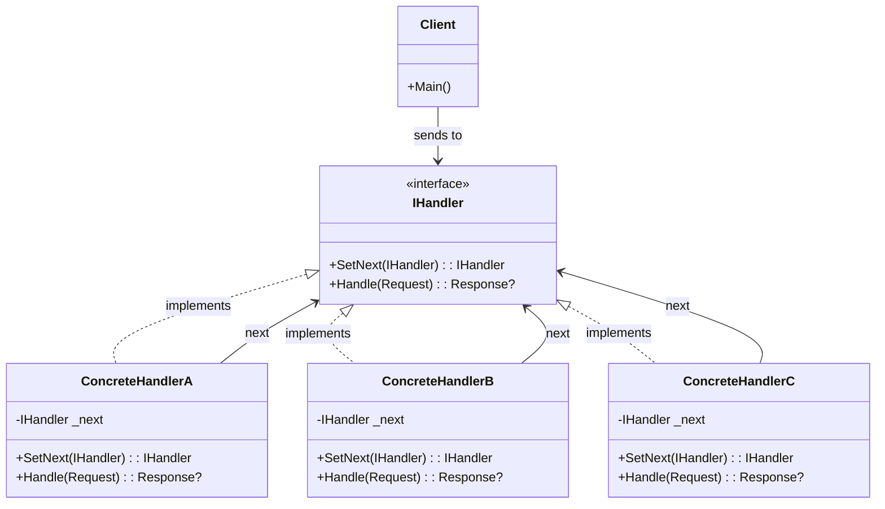
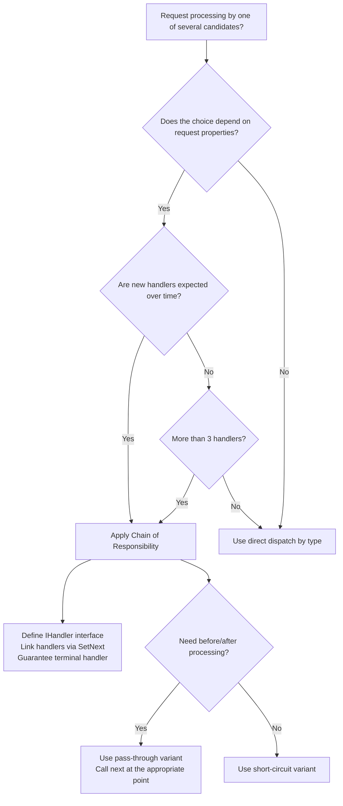

> [!success] Mastery Check
> - [ ] **Studied Well**
> - [ ] **Can explain the concept without notes**
> - [ ] **Can answer interview questions confidently**
> - [ ] **Can implement it in a real project**


## Navigation

**Domain:** [[6 — Design Principles & Patterns]] > **Group:** Behavioral Patterns
**Previous:** [[6.031 — Command Pattern]] | **Next:** [[6.033 — Template Method Pattern]]

### Prerequisites
- [[2.024 — Linked Lists and Delegates]] — Chain of Responsibility is structurally a linked list of handlers; understanding linked-list traversal and node linking clarifies the pattern's mechanics.
- [[4.040 — Middleware Pipeline]] — ASP.NET Core middleware is the canonical .NET implementation of Chain of Responsibility; familiarity with its `RequestDelegate` pipeline is essential for production usage.

### Where This Fits
Chain of Responsibility lets you pass a request along a chain of handlers, where each handler decides whether to process the request or pass it to the next handler in the chain. This decouples the sender from the receiver and gives multiple objects a chance to handle the request. In .NET, Chain of Responsibility appears in ASP.NET Core middleware (each middleware can handle the request, pass it on, or short-circuit), in the filter pipeline (authorisation, resource, action, exception, result filters), in FluentValidation's validator chaining, and in any pipeline where cross-cutting concerns are applied sequentially.

## Core Mental Model

Chain of Responsibility avoids coupling the sender of a request to its receiver by giving more than one object a chance to handle the request. The pattern chains the receiving objects and passes the request along the chain until an object handles it — or until the chain ends. Each handler implements the same interface and holds a reference to the next handler, creating a linked list of processors.

### Classification

**GoF Classification:** Behavioral — intent is to avoid coupling the sender of a request to its receiver by giving more than one object a chance to handle the request.



### Participants

- **IHandler** — interface that declares the `Handle()` method and optionally a method to set the next handler
- **ConcreteHandlerA / B / C** — handles requests it is responsible for; can access the next handler; if it cannot handle the request, it forwards it
- **Client** — initiates the request to a handler on the chain (typically the first handler)

## Deep Mechanics

### How It Works

1. **Client builds** the chain by linking handlers: `a.SetNext(b).SetNext(c)`.
2. **Client sends** the request to the first handler in the chain (`a.Handle(request)`).
3. **ConcreteHandlerA** decides whether it can handle the request.
   - If yes: it processes the request and **may or may not** pass it to the next handler (depends on whether the pattern supports partial processing or short-circuiting).
   - If no: it forwards to `_next.Handle(request)`.
4. **ConcreteHandlerB** repeats the same decision.
5. **ConcreteHandlerC** (the last handler) either handles the request or returns a default/empty response.

The critical design choice: handlers can either **short-circuit** (stop the chain after handling) or **continue** (process and forward). ASP.NET Core middleware uses the continue variant — each middleware can process both before and after the next middleware. The GoF classic uses the short-circuit variant — the first handler that can handle the request does so and stops.

### .NET Runtime Behavior

**ASP.NET Core middleware — chain of `RequestDelegate`.** The middleware pipeline is a linked list of `Func<RequestDelegate, RequestDelegate>` delegates. Each middleware receives the next delegate and returns a new delegate that wraps it. The chain is built once at startup and invoked per-request:

```csharp
// The 'next' parameter is the remaining chain
app.Use(async (context, next) =>
{
    // before
    await next(); // call next handler
    // after
});
```

The JIT compiles the middleware delegates at startup. For a pipeline of N middleware, the call stack is N deep per request. Performance is linear in the number of middleware — each middleware adds ~10-20 ns overhead from the delegate invocation. For typical pipelines (5-15 middleware), this is negligible. For extreme pipelines (50+), consider batching middleware or using `MapWhen` to branch.

**FluentValidation — chain of validators.** FluentValidation builds a chain of `IPropertyValidator` instances for each property. Each validator is a handler that can reject the request (return a validation failure). The chain stops at the first failure if `CascadeMode.Stop` is set, or continues collecting failures.

## Production Code Patterns

### Implementation in C#

```csharp
/// <summary>Represents an expense report submitted for approval.</summary>
public sealed record ExpenseReport(
    Guid Id,
    decimal Amount,
    string Category,
    string EmployeeId,
    string Description
);

/// <summary>Result of processing an expense report through the approval chain.</summary>
public sealed record ApprovalResult(
    bool Approved,
    string? ApprovedBy,
    string? Notes
);

// Role: IHandler
/// <summary>
/// Defines a handler in the expense approval chain. Each handler can approve,
/// reject, or pass the request to the next handler.
/// </summary>
public interface IExpenseApprovalHandler
{
    /// <summary>Sets the next handler in the chain.</summary>
    IExpenseApprovalHandler SetNext(IExpenseApprovalHandler handler);
    /// <summary>Processes the expense report or forwards to the next handler.</summary>
    Task<ApprovalResult> HandleAsync(ExpenseReport report);
}

// Base class to avoid boilerplate in concrete handlers (Template Method variant)
/// <summary>
/// Base class for expense approval handlers. Manages the next-handler reference.
/// </summary>
public abstract class ExpenseApprovalHandlerBase : IExpenseApprovalHandler
{
    private IExpenseApprovalHandler? _next;

    public IExpenseApprovalHandler SetNext(IExpenseApprovalHandler handler)
    {
        _next = handler;
        return handler; // fluent chaining
    }

    public virtual async Task<ApprovalResult> HandleAsync(ExpenseReport report)
    {
        var result = await HandleInternalAsync(report);
        if (result is not null)
            return result;
        if (_next is not null)
            return await _next.HandleAsync(report);
        return new ApprovalResult(false, null, "No handler could process this request.");
    }

    /// <summary>Override to implement handler-specific logic. Return null to pass to next.</summary>
    protected abstract Task<ApprovalResult?> HandleInternalAsync(ExpenseReport report);
}

// Role: ConcreteHandlerA
/// <summary>
/// Team leads can approve expenses up to $500.
/// </summary>
public sealed class TeamLeadApprovalHandler : ExpenseApprovalHandlerBase
{
    private const decimal MaxApprovalAmount = 500m;

    protected override Task<ApprovalResult?> HandleInternalAsync(ExpenseReport report)
    {
        if (report.Amount <= MaxApprovalAmount)
            return Task.FromResult<ApprovalResult?>(
                new ApprovalResult(true, "TeamLead", $"Approved up to ${MaxApprovalAmount}"));
        return Task.FromResult<ApprovalResult?>(null); // pass to next
    }
}

// Role: ConcreteHandlerB
/// <summary>
/// Managers can approve expenses up to $5,000.
/// </summary>
public sealed class ManagerApprovalHandler : ExpenseApprovalHandlerBase
{
    private const decimal MaxApprovalAmount = 5_000m;

    protected override Task<ApprovalResult?> HandleInternalAsync(ExpenseReport report)
    {
        if (report.Amount <= MaxApprovalAmount)
            return Task.FromResult<ApprovalResult?>(
                new ApprovalResult(true, "Manager", $"Approved up to ${MaxApprovalAmount}"));
        return Task.FromResult<ApprovalResult?>(null);
    }
}

// Role: ConcreteHandlerC
/// <summary>
/// Directors can approve expenses up to $50,000.
/// </summary>
public sealed class DirectorApprovalHandler : ExpenseApprovalHandlerBase
{
    private const decimal MaxApprovalAmount = 50_000m;

    protected override Task<ApprovalResult?> HandleInternalAsync(ExpenseReport report)
    {
        if (report.Amount <= MaxApprovalAmount)
            return Task.FromResult<ApprovalResult?>(
                new ApprovalResult(true, "Director", $"Approved up to ${MaxApprovalAmount}"));
        return Task.FromResult<ApprovalResult?>(null);
    }
}

// Role: ConcreteHandlerD (Terminal handler)
/// <summary>
/// CEO must approve expenses exceeding $50,000.
/// </summary>
public sealed class CeoApprovalHandler : ExpenseApprovalHandlerBase
{
    protected override Task<ApprovalResult?> HandleInternalAsync(ExpenseReport report)
    {
        // This is the terminal handler — always returns a result
        return Task.FromResult<ApprovalResult?>(
            new ApprovalResult(true, "CEO", "Approved — exceeds standard limits"));
    }
}

// Role: Client
public static class ExpenseReportPipeline
{
    public static IExpenseApprovalHandler BuildChain()
    {
        var teamLead = new TeamLeadApprovalHandler();
        var manager = new ManagerApprovalHandler();
        var director = new DirectorApprovalHandler();
        var ceo = new CeoApprovalHandler();

        teamLead.SetNext(manager)
                .SetNext(director)
                .SetNext(ceo);

        return teamLead; // return the head of the chain
    }

    public static async Task ProcessAsync(ExpenseReport report)
    {
        var chain = BuildChain();
        var result = await chain.HandleAsync(report);
        Console.WriteLine($"Approved: {result.Approved}, By: {result.ApprovedBy}, Notes: {result.Notes}");
    }
}
```

### ASP.NET Core / .NET Ecosystem Integration

**ASP.NET Core middleware — the canonical CoR implementation.** Every middleware is a handler that can process the request, pass it to the next, or short-circuit (`return` without calling `next`):

```csharp
// Built-in middleware chain — each one is a handler
app.UseAuthentication();     // Handler: checks identity, passes to next
app.UseAuthorization();      // Handler: checks permissions, may short-circuit with 403
app.UseResponseCaching();    // Handler: may return cached response (short-circuit)
app.UseEndpoints(endpoints => endpoints.MapControllers()); // Terminal handler

// Custom middleware as a handler in the chain
public sealed class RequestTimingMiddleware
{
    private readonly RequestDelegate _next;
    private readonly ILogger _logger;

    public RequestTimingMiddleware(RequestDelegate next, ILogger<RequestTimingMiddleware> logger)
    {
        _next = next;
        _logger = logger;
    }

    public async Task InvokeAsync(HttpContext context)
    {
        var sw = Stopwatch.StartNew();
        await _next(context); // pass to next handler
        sw.Stop();
        _logger.LogInformation("Request {Path} took {ElapsedMs}ms",
            context.Request.Path, sw.ElapsedMilliseconds);
    }
}

// Registration
app.UseMiddleware<RequestTimingMiddleware>();
```

**FluentValidation — validator chain within a single validator.** Each property can have multiple validators chained together:

```csharp
public sealed class ExpenseReportValidator : AbstractValidator<ExpenseReport>
{
    public ExpenseReportValidator()
    {
        RuleFor(x => x.Amount)
            .GreaterThan(0).WithMessage("Amount must be positive")
            .LessThan(1_000_000).WithMessage("Amount exceeds maximum")
            .Must((report, amount) => amount <= report switch
            {
                { Category: "Travel" } => 10_000m,
                { Category: "Office" } => 5_000m,
                _ => 1_000m
            }).WithMessage("Amount exceeds category limit");
    }
}
```

**Polly — policy wrapping (CoR variant).** Polly policies wrap each other, forming a chain where each policy handles the request or passes it through:

```csharp
var pipeline = new ResiliencePipelineBuilder()
    .AddRetry(new RetryStrategyOptions
    {
        MaxRetryAttempts = 3,
        Delay = TimeSpan.FromMilliseconds(200)
    })
    .AddCircuitBreaker(new CircuitBreakerStrategyOptions
    {
        FailureRatio = 0.5,
        SamplingDuration = TimeSpan.FromSeconds(30)
    })
    .AddTimeout(TimeSpan.FromSeconds(10))
    .Build();
// Each policy is a handler in the resilience chain
```

## Gotchas & Anti-Patterns

### Handler That Calls Next Conditionally But Skips Cleanup

**Wrong:** Calling `await next()` inside a try block without handling exceptions or ensuring cleanup.

```csharp
// ❌ Wrong
public async Task InvokeAsync(HttpContext context, RequestDelegate next)
{
    var sw = Stopwatch.StartNew();
    await next(context); // exception propagates, timing is lost
    sw.Stop();
    // never reached if next() throws
}
```

**Right:** Wrap in try-finally to ensure cleanup.

```csharp
// ✅ Right
public async Task InvokeAsync(HttpContext context, RequestDelegate next)
{
    var sw = Stopwatch.StartNew();
    try { await next(context); }
    finally { sw.Stop(); _logger.LogInformation("..."); }
}
```

**Consequence:** Exception in a downstream middleware causes the current middleware's after-processing to be skipped. Timing, logging, and cleanup code never runs.

### Chain Not Terminated — No Terminal Handler

**Wrong:** Building a chain where no handler is guaranteed to return a result.

```csharp
// ❌ Wrong
teamLead.SetNext(manager).SetNext(director);
// No terminal handler — if amount > director's limit, who handles it?
```

**Right:** Always include a terminal handler that guarantees a response.

```csharp
// ✅ Right
teamLead.SetNext(manager)
        .SetNext(director)
        .SetNext(new CeoApprovalHandler()); // terminal — always handles or throws
```

**Consequence:** The chain can end without producing a result, leaving the client with null or default — which leads to null-reference exceptions or silent failures.

### Handler Order Dependency — Implicit Assumptions

**Wrong:** Handlers assume a specific order but the order is not enforced by the pattern.

```csharp
// ❌ Wrong — what if someone adds auth AFTER response caching?
app.UseResponseCaching(); // caches auth-protected responses
app.UseAuthorization();
```

**Right:** Document ordering constraints and use `IApplicationBuilder` conventions.

```csharp
// ✅ Right — known ordering: Error, Auth, StaticFiles, Endpoints
app.UseExceptionHandler();
app.UseAuthentication();
app.UseAuthorization();
app.UseStaticFiles();
app.UseEndpoints(endpoints => ...);
```

**Consequence:** Out-of-order handlers produce hard-to-debug bugs (caching before auth caches unauthorised responses; logging after a short-circuiting handler misses requests).

### Shared Mutable State in Handlers

**Wrong:** Multiple handlers in the same chain modify shared mutable state.

```csharp
// ❌ Wrong
public sealed class TrackingMiddleware
{
    private static int _requestCount; // shared mutable state, not thread-safe

    public async Task InvokeAsync(HttpContext context, RequestDelegate next)
    {
        _requestCount++;
        await next(context);
    }
}
```

**Right:** Use `AsyncLocal<T>` or `HttpContext.Items` for per-request state.

```csharp
// ✅ Right — per-request state via HttpContext.Items
context.Items["RequestStartTime"] = DateTime.UtcNow;
```

**Consequence:** Thread safety issues in concurrent requests. Static state in middleware is corrupted by concurrent requests.

## Performance Implications

### Dispatch and Allocation Cost

Chain of Responsibility adds per-handler overhead proportional to chain length. Each handler invocation involves: (1) a delegate invocation (for middleware), (2) handler-specific pre/post processing, and (3) the recursive/iterative traversal of the chain. For typical business chains (3-8 handlers), the overhead is negligible. For long chains (20+ handlers) on every request, cumulative overhead becomes measurable.

### BenchmarkDotNet

```csharp
[MemoryDiagnoser]
[SimpleJob(RuntimeMoniker.Net90)]
public class ChainOfResponsibilityBenchmark
{
    private IExpenseApprovalHandler _chain;
    private ExpenseReport _report;

    [GlobalSetup]
    public void Setup()
    {
        _chain = ExpenseReportPipeline.BuildChain();
        _report = new ExpenseReport(Guid.NewGuid(), 100m, "Office", "EMP001", "Pens");
    }

    [Benchmark(Baseline = true)]
    public async Task<ApprovalResult> Direct_Conditional()
    {
        if (_report.Amount <= 500m)
            return new ApprovalResult(true, "TeamLead", "Approved");
        if (_report.Amount <= 5_000m)
            return new ApprovalResult(true, "Manager", "Approved");
        return new ApprovalResult(true, "CEO", "Approved");
    }

    [Benchmark]
    public async Task<ApprovalResult> Via_ChainOfResponsibility()
    {
        return await _chain.HandleAsync(_report);
    }
}
```

**Expected results (approximate on .NET 9, x64):**

|Method|Mean|Gen0|Allocated|
|---|---|---|---|
|Direct_Conditional|~5 ns|-|0 B|
|Via_ChainOfResponsibility|~120 ns|0.0010|~200 B|

**Interpretation:** Chain of Responsibility adds ~115 ns and 200 B per request for a 4-handler chain — roughly 25x the direct conditional. At 10,000 requests/sec, this is ~1.15 ms total — still irrelevant for any I/O-bound application. The cost comes from handler object allocation, virtual dispatch, and the async state machine overhead. For most systems, the maintainability gain of a configurable chain vastly outweighs this cost.

## Interview Arsenal

### Question Bank

1. What is the Chain of Responsibility pattern and what problem does it solve?
2. When would you use CoR vs. a simple if-else chain?
3. What is the difference between CoR and the Decorator pattern?
4. What are the failure modes of a badly configured chain?
5. How does ASP.NET Core middleware implement CoR?
6. How do you handle the case where no handler in the chain can process the request?
7. What is the performance cost of a long chain?
8. How does CoR differ from a simple List of handlers?

### Spoken Answers

**Q1: What is the Chain of Responsibility pattern and what problem does it solve?**

> **Average answer:** It's a chain of handlers where each handler can process a request or pass it to the next one. It's useful for things like approval workflows where different levels can approve different amounts.

> **Great answer:** Chain of Responsibility decouples the sender of a request from the receiver by giving multiple objects a chance to handle it, linked in a chain. Each handler implements the same interface and holds a reference to the next handler — the request travels the chain until someone handles it. The key advantage over a centralised switch statement is Open/Closed compliance: adding a new handler never modifies existing handlers. The pattern has two variants: **short-circuiting** (first handler that can handle does so, then stops — like an approval workflow) and **pass-through** (each handler processes before and after calling next — like ASP.NET Core middleware). The main production concern is chain termination — you must always have a terminal handler that guarantees a response, or the chain ends silently with a null/default.

**Q3: What is the difference between CoR and the Decorator pattern?**

> **Average answer:** CoR passes a request along a chain; Decorator wraps behaviour around an object. They look structurally similar.

> **Great answer:** Structurally, both involve chaining objects that implement the same interface. The intent is differ: CoR is about **responsibility** — each handler decides whether it can handle the request or passes it along. Decorator is about **augmentation** — each wrapper adds behaviour and always passes to the next (there is no conditional skip in pure Decorator). In CoR, the request may stop at any handler (short-circuit). In Decorator, the call always reaches the wrapped object — there is no short-circuit. In .NET: ASP.NET Core middleware is CoR because middleware can short-circuit (returning a response without calling next). The `ILogger` with enrichment is Decorator — each enrichment adds data but the log message always reaches the final writer. The practical test: if some handlers in your chain skip execution based on the request, it is CoR. If all handlers always execute and wrap behaviour, it is Decorator.

### Trick Question

**"Chain of Responsibility is the same as a List of handlers iterated in a loop."**

Why it is a trap: A procedural loop over handlers is structurally different from CoR — the loop gives the invoker knowledge of iteration order and requires explicit break handling.

Correct answer: A `List<IHandler>` with a `foreach` loop is not CoR because the invoker (the loop) controls iteration — the handlers themselves do not decide whether to pass control. In true CoR, each handler holds a reference to the next, and the decision to forward is internal to the handler. The difference manifests when you need context-sensitive forwarding: a handler might forward to different next handlers based on the request state, which a flat loop cannot express without modifying the loop body. However, the practical .NET implementation (middleware pipeline) uses an array-based chain internally for performance — but each middleware still explicitly calls `next` to continue, preserving the handler-controlled forwarding semantic.

### Comparison Table

| Aspect | Chain of Responsibility | Decorator |
|---|---|---|
| Intent | Let multiple objects handle a request; decouple sender from receiver | Add responsibilities to an object dynamically |
| Participants | IHandler, ConcreteHandlers, Client | Component, IComponent, Decorator subclasses |
| When to use | Requests need to be processed by one of several handlers based on runtime conditions | Behaviour must be added in layers without modifying the base class |
| .NET example | ASP.NET Core middleware pipeline, FluentValidation cascade, Polly policy wrapping | ILogger enrichment, Stream decorators, CachingService wrapping |
| Key difference | CoR can short-circuit; handler decides to pass or stop | Decorator always delegates; all wrappers execute |

## Decision Framework

### When to Apply Chain of Responsibility



### Application Checklist

- [ ] The same request may be processed by different handlers depending on request properties
- [ ] New handler types are expected to be added without changing existing handlers
- [ ] The chain can be configured or reordered at startup (dependency injection friendly)
- [ ] A terminal handler exists to guarantee a response when no handler matches
- [ ] Handler order is documented and enforced (or the chain is order-independent)

### Tradeoff Summary

| What You Gain | What You Give Up |
|---|---|
| Open/Closed — add handlers without modifying existing ones | One extra class per handler (class explosion) |
| Runtime flexibility — configure chain order at startup | No compile-time guarantee of chain configuration |
| Decoupled sender and receiver — sender knows only the first handler | Potential for long chains with cumulative latency |
| Natural fit for cross-cutting concerns (logging, auth, timing) | Shared state across handlers must be carefully managed |

## Self-Check

### Conceptual Questions

1. What is the core problem Chain of Responsibility solves?
2. What are the two variants of CoR, and when would you use each?
3. Can you identify a CoR in ASP.NET Core's request pipeline?
4. What is the difference between CoR and Decorator?
5. What must be true about the last handler in a CoR chain?
6. When should you NOT use CoR?
7. What is the performance cost of a 10-handler chain versus direct conditionals?
8. How does FluentValidation use CoR?
9. What anti-pattern occurs when a handler forgets to call `next` in a pass-through chain?
10. How can handler ordering bugs manifest in a middleware pipeline?

<details>
<summary>Answers</summary>

1. CoR decouples the sender from the receiver by letting multiple objects have a chance to handle a request, linked in a chain where each handler decides whether to process or forward.
2. **Short-circuit** (first matching handler stops — approval workflows) and **pass-through** (every handler processes before/after calling next — middleware pipeline).
3. Yes — `app.UseAuthentication()`, `app.UseAuthorization()`, `app.UseEndpoints()` form a chain where each middleware can process the request, pass it on, or short-circuit.
4. CoR is about responsibility and optional handling; Decorator is about augmentation where all wrappers execute.
5. The last handler must be terminal — it must always return a response (even if it is a "not handled" response) to prevent the chain from ending silently.
6. When the chain is short and stable (2-3 handlers unlikely to grow), when all handlers always execute, or when handler order is never configurable.
7. CoR adds ~25-40 ns per handler for dispatch overhead plus allocation for the handler objects. A 10-handler chain adds ~250-400 ns — negligible for I/O-bound operations.
8. FluentValidation chains validators per property — each validator is a handler that can reject the request; `CascadeMode.Stop` short-circuits after the first failure.
9. The handler creates a "broken chain" — the request never reaches downstream handlers. In middleware, this causes responses to be returned without processing auth, caching, etc.
10. Out-of-order middleware produces subtle bugs: caching before auth caches internal-only pages; exception handlers placed in the wrong order swallow exceptions from other middleware.

</details>

---

### Code Puzzles

**Puzzle 1 — Identify the violation**

```csharp
public sealed class DocumentApprovalService
{
    public ApprovalResult Approve(Document doc)
    {
        if (doc.Amount < 100) return new ApprovalResult(true, "Auto");
        else if (doc.Amount < 1000 && doc.Department == "Engineering") return new ApprovalResult(true, "TechLead");
        else if (doc.Amount < 5000) return new ApprovalResult(true, "Manager");
        else if (doc.Amount < 50000) return new ApprovalResult(true, "Director");
        else return new ApprovalResult(false, null, "Needs board review");
    }
}
```

<details> <summary>Answer</summary>

**Violation:** Chain of Responsibility not applied — approval logic is a single hard-coded conditional chain. **Why:** Adding a new approval level (e.g., VP for amounts between 10k-50k) requires modifying the `Approve` method. The logic is not reusable, not configurable, and not testable in isolation per level. **Fix:**

```csharp
public interface IDocumentApprovalHandler { IDocumentApprovalHandler SetNext(IDocumentApprovalHandler handler); Task<ApprovalResult> HandleAsync(Document doc); }
// AutoApprovalHandler, TechLeadApprovalHandler, ManagerApprovalHandler, DirectorApprovalHandler, BoardReviewHandler — each implements the interface
// Chain: auto -> techLead -> manager -> director -> boardReview
```

</details>

---

**Puzzle 2 — Complete the pattern**

```csharp
public interface ISupportHandler
{
    ISupportHandler SetNext(ISupportHandler handler);
    Task<string> HandleAsync(string issue);
}

public sealed class BillingSupportHandler : ISupportHandler
{
    private ISupportHandler? _next;

    public ISupportHandler SetNext(ISupportHandler handler)
    { _next = handler; return handler; }

    public async Task<string> HandleAsync(string issue)
    {
        if (issue.Contains("billing", StringComparison.OrdinalIgnoreCase))
            return "Resolved by Billing Support";
        // TODO: pass to next handler
    }
}
```

<details> <summary>Answer</summary>

```csharp
public async Task<string> HandleAsync(string issue)
{
    if (issue.Contains("billing", StringComparison.OrdinalIgnoreCase))
        return "Resolved by Billing Support";
    return _next is not null
        ? await _next.HandleAsync(issue)
        : throw new InvalidOperationException("No handler could process the issue.");
}
```

**Explanation:** The handler must explicitly forward to `_next` when it cannot handle the request. Throwing at the end ensures the chain never ends silently if no terminal handler is configured.

</details>

---

**Puzzle 3 — Choose the right pattern**

**Scenario:** An HTTP request pipeline must authenticate, authorise, log, compress, cache, and route requests. Each concern may set context for subsequent concerns (auth sets `HttpContext.User`), and some concerns can short-circuit (auth returns 401, cache returns 304). Concerns are ordered and centrally configurable. Which pattern?

<details> <summary>Answer</summary>

**Correct pattern:** Chain of Responsibility (pass-through variant with short-circuit capability) — exactly what ASP.NET Core middleware does. Each middleware is a handler that can process before/after the next handler and short-circuit when needed. **Wrong choice:** Decorator — Decorator wraps behaviour but cannot short-circuit; all decorators always execute. **Implementation sketch:** ASP.NET Core's `IApplicationBuilder` + `RequestDelegate` chain.

</details>

---

**Puzzle 4 — Spot the anti-pattern**

```csharp
public sealed class PipelineBuilder
{
    private readonly List<Func<RequestDelegate, RequestDelegate>> _components = new();

    public PipelineBuilder Use(Func<RequestDelegate, RequestDelegate> middleware)
    {
        _components.Add(middleware);
        return this;
    }

    public RequestDelegate Build()
    {
        RequestDelegate app = context => Task.CompletedTask; // terminal: does nothing
        for (int i = _components.Count - 1; i >= 0; i--)
            app = _components[i](app);
        return app;
    }
}
```

<details> <summary>Answer</summary>

**Observation:** This is actually the correct implementation of ASP.NET Core's internal pipeline builder — reverse-loop wrapping to create the chain. No anti-pattern here. **However, one anti-pattern would be:** building a new chain per request instead of once at startup. **Consequence:** Per-request chain construction allocates handler objects and builds delegates for every request, destroying performance.

</details>

---

**Puzzle 5 — Refactor to apply**

```csharp
public sealed class OrderValidationService
{
    public List<string> Validate(Order order)
    {
        var errors = new List<string>();
        if (order.Total <= 0) errors.Add("Total must be positive");
        if (string.IsNullOrWhiteSpace(order.CustomerEmail)) errors.Add("Email required");
        if (order.Items.Count == 0) errors.Add("Order must have items");
        if (order.ShippingAddress is null) errors.Add("Shipping address required");
        if (order.PaymentMethod is null) errors.Add("Payment method required");
        // Adding a new validation rule requires modifying this method
        return errors;
    }
}
```

<details> <summary>Answer</summary>

```csharp
public interface IOrderValidationHandler
{
    IOrderValidationHandler SetNext(IOrderValidationHandler handler);
    Task<List<string>> ValidateAsync(Order order);
}

public sealed class TotalValidationHandler : OrderValidationHandlerBase
{
    protected override Task<List<string>?> HandleInternalAsync(Order order)
    {
        if (order.Total <= 0) return Task.FromResult<List<string>?>(new() { "Total must be positive" });
        return Task.FromResult<List<string>?>(null);
    }
}

public sealed class EmailValidationHandler : OrderValidationHandlerBase
{
    protected override Task<List<string>?> HandleInternalAsync(Order order)
    {
        if (string.IsNullOrWhiteSpace(order.CustomerEmail))
            return Task.FromResult<List<string>?>(new() { "Email required" });
        return Task.FromResult<List<string>?>(null);
    }
}

// Additional handlers for Items, ShippingAddress, PaymentMethod, etc.
```

**What changed:** Each validation rule is an independent handler in a chain. The chain collects errors from all handlers (pass-through variant) or stops at the first error (short-circuit variant). **Why it is better:** New validation rules are new classes — zero modifications to existing rules. Validators can be tested in isolation. The chain can be configured per-order-type or per-customer-tier.

</details>
