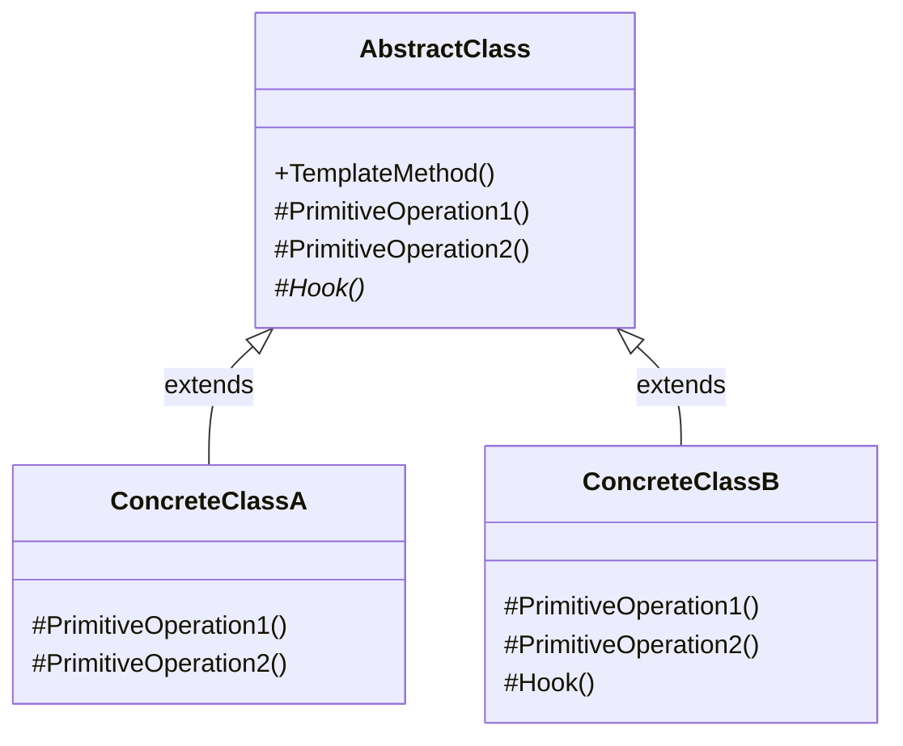
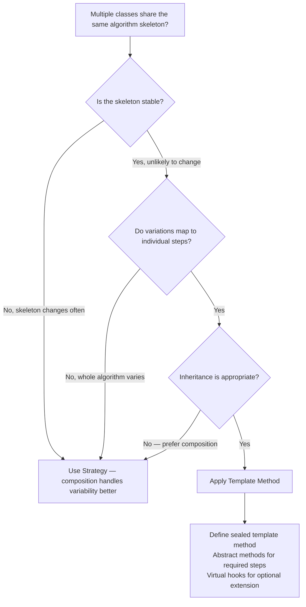

> [!success] Mastery Check
> - [ ] **Studied Well**
> - [ ] **Can explain the concept without notes**
> - [ ] **Can answer interview questions confidently**
> - [ ] **Can implement it in a real project**


## Navigation

**Domain:** [[6 — Design Principles & Patterns]] > **Group:** Behavioral Patterns
**Previous:** [[6.032 — Chain of Responsibility Pattern]] | **Next:** [[6.034 — Iterator Pattern]]

### Prerequisites
- [[2.025 — Inheritance and Virtual Methods]] — Template Method relies on inheritance and virtual/abstract methods to let subclasses override specific steps without changing the algorithm skeleton.
- [[6.029 — Strategy Pattern]] — Template Method and Strategy are frequently compared; understanding Strategy first clarifies the structural difference (inheritance vs. composition) and when to choose each.

### Where This Fits
Template Method defines the skeleton of an algorithm in a base class, letting subclasses override specific steps without changing the algorithm's structure. It inverts the control flow: the base class calls the subclass, not the other way around (the Hollywood Principle — "don't call us, we'll call you"). In .NET, Template Method appears in `ControllerBase` (the action method is a template), in `Stream` (derived classes implement `Read/Write` while the base provides convenience methods), in `HttpClient`-like abstractions, and in any framework where the framework code calls into user code. A senior engineer uses Template Method when multiple algorithms share the same skeleton but differ in specific steps — and when those steps naturally belong in a subclass hierarchy.

## Core Mental Model

Template Method defines the invariant parts of an algorithm in a base class (the template method) and lets subclasses override variant parts (the hook or abstract methods). The base class controls the algorithm's structure and order; subclasses provide the implementation details. The pattern enforces the **Hollywood Principle** — the base class calls into subclasses, not the other way around.

### Classification

**GoF Classification:** Behavioral — intent is to define the skeleton of an algorithm in an operation, deferring some steps to subclasses. Template Method lets subclasses redefine certain steps without changing the algorithm's structure.



### Participants

- **AbstractClass** — defines abstract/virtual primitive operations that subclasses override; implements the template method that defines the algorithm skeleton
- **ConcreteClassA / B** — implements the primitive operations (and optional hooks) to carry out subclass-specific steps

## Deep Mechanics

### How It Works

1. **Client calls** `AbstractClass.TemplateMethod()`.
2. **TemplateMethod** (defined in the base class, typically non-virtual / `sealed`) executes the algorithm skeleton in a fixed order:
   - `Step1()` — an abstract method that subclasses must implement
   - `Step2()` — a virtual method with a default implementation that subclasses may override
   - `OptionalHook()` — a virtual method with an empty body; subclasses override only if needed
   - `Step3()` — an abstract method
3. **At runtime**, the CLR dispatches each call to the actual concrete class's implementation via virtual dispatch.
4. **The algorithm's structure** (step ordering, error handling, logging) is fixed in the base class and cannot be altered by subclasses.

The key insight: the base class calls subclass methods, not the other way around. This is the Hollywood Principle — the framework (base class) controls the flow, and the user code (subclass) plugs in steps.

### .NET Runtime Behavior

**Virtual dispatch and the template method.** When the CLR executes `TemplateMethod()` on a `ConcreteClassA` instance, each call to `PrimitiveOperation1()` goes through virtual dispatch — the JIT looks up the method in the type's vtable and calls the most derived override. For hot-path template methods, the virtual dispatch cost is ~1-3 ns per call. If the template method is called millions of times (e.g., a stream read loop), the cumulative dispatch cost can matter — consider marking the template method as `sealed` and using struct generics if the per-step overhead is unacceptable.

**`ControllerBase` — Template Method in ASP.NET Core.** `ControllerBase` defines the template method `ExecuteAsync()` which calls `OnActionExecuting()`, the action method, `OnActionExecuted()`, and `OnResultExecuted()`. Controller subclasses override the action method (the step) while the base controls the overall execution pipeline. Filter attributes hook into the same execution steps via a different mechanism (strategy/decorator), but the controller inheritance itself is Template Method.

**`Stream` — Template Method in the BCL.** The `Stream` abstract class defines `Read()` and `Write()` as abstract primitive operations, and provides the template method `CopyToAsync()` that calls them in a loop. Subclasses implement only the read/write primitives; the copy algorithm is fixed.

## Production Code Patterns

### Implementation in C#

```csharp
/// <summary>Input for a document conversion operation.</summary>
public sealed record ConversionInput(byte[] SourceData, string SourceFormat, string TargetFormat);

/// <summary>Result of a document conversion.</summary>
public sealed record ConversionResult(byte[] OutputData, string TargetFormat);

// Role: AbstractClass
/// <summary>
/// Defines the skeleton of a document conversion algorithm.
/// Subclasses override the format-specific steps while the template method
/// controls the overall conversion pipeline.
/// </summary>
public abstract class DocumentConverter
{
    /// <summary>
    /// Template method that defines the conversion algorithm skeleton.
    /// This method should not be overridden — the algorithm structure is fixed.
    /// </summary>
    public async Task<ConversionResult> ConvertAsync(ConversionInput input)
    {
        ValidateInput(input);

        byte[] source = await LoadDocumentAsync(input.SourceData);

        var parsed = ParseDocument(source, input.SourceFormat);

        var transformed = TransformDocument(parsed);

        byte[] output = await RenderDocumentAsync(transformed, input.TargetFormat);

        var result = new ConversionResult(output, input.TargetFormat);

        PostProcess(result);

        return result;
    }

    // Primitive operations — subclasses must implement

    /// <summary>Validates the conversion input. Subclasses may add format-specific rules.</summary>
    protected abstract void ValidateInput(ConversionInput input);

    /// <summary>Loads and normalises the raw document data.</summary>
    protected abstract Task<byte[]> LoadDocumentAsync(byte[] sourceData);

    /// <summary>Parses the document from the specified source format.</summary>
    protected abstract DocumentModel ParseDocument(byte[] data, string sourceFormat);

    /// <summary>Transforms the parsed document (e.g., applies watermarks, reflow).</summary>
    protected abstract DocumentModel TransformDocument(DocumentModel doc);

    /// <summary>Renders the document into the target format.</summary>
    protected abstract Task<byte[]> RenderDocumentAsync(DocumentModel doc, string targetFormat);

    // Hook — optional override

    /// <summary>
    /// Hook method called after conversion completes. Default does nothing.
    /// Subclasses can override to log, audit, or notify.
    /// </summary>
    protected virtual void PostProcess(ConversionResult result) { }
}

// Role: ConcreteClassA
/// <summary>
/// Converts Markdown documents to HTML.
/// </summary>
public sealed class MarkdownToHtmlConverter : DocumentConverter
{
    protected override void ValidateInput(ConversionInput input)
    {
        if (string.IsNullOrWhiteSpace(input.SourceFormat))
            throw new ArgumentException("Source format is required.", nameof(input));
    }

    protected override Task<byte[]> LoadDocumentAsync(byte[] sourceData)
        => Task.FromResult(sourceData); // no pre-processing needed

    protected override DocumentModel ParseDocument(byte[] data, string sourceFormat)
    {
        var markdown = Encoding.UTF8.GetString(data);
        // In production: use MarkdownParser from Markdig
        return new DocumentModel(markdown);
    }

    protected override DocumentModel TransformDocument(DocumentModel doc)
        => doc; // no transformation — pass through

    protected override async Task<byte[]> RenderDocumentAsync(DocumentModel doc, string targetFormat)
    {
        // In production: use Markdig to convert to HTML
        var html = $"<html><body>{doc.RawContent}</body></html>";
        return await Task.FromResult(Encoding.UTF8.GetBytes(html));
    }
}

// Role: ConcreteClassB
/// <summary>
/// Converts PDF documents to plain text, with audit logging via the hook.
/// </summary>
public sealed class PdfToTextConverter : DocumentConverter
{
    private readonly IAuditLogger _auditLog;

    public PdfToTextConverter(IAuditLogger auditLog) => _auditLog = auditLog;

    protected override void ValidateInput(ConversionInput input)
    {
        if (!input.SourceFormat.Equals("pdf", StringComparison.OrdinalIgnoreCase))
            throw new NotSupportedException("Only PDF source format is supported.");
    }

    protected override async Task<byte[]> LoadDocumentAsync(byte[] sourceData)
    {
        // In production: decompress, decrypt, etc.
        return await Task.FromResult(sourceData);
    }

    protected override DocumentModel ParseDocument(byte[] data, string sourceFormat)
    {
        // In production: use a PDF library (iText, PdfPig) to extract text
        var text = Encoding.UTF8.GetString(data); // simplified
        return new DocumentModel(text);
    }

    protected override DocumentModel TransformDocument(DocumentModel doc)
        => doc; // plain text needs no transformation

    protected override async Task<byte[]> RenderDocumentAsync(DocumentModel doc, string targetFormat)
    {
        if (!targetFormat.Equals("txt", StringComparison.OrdinalIgnoreCase))
            throw new NotSupportedException("Only TXT output is supported.");
        return await Task.FromResult(Encoding.UTF8.GetBytes(doc.RawContent));
    }

    // Hook override — adds audit logging without changing the template
    protected override void PostProcess(ConversionResult result)
    {
        _auditLog.Log($"PDF converted to text: {result.TargetFormat}, size: {result.OutputData.Length} bytes");
    }
}
```

### ASP.NET Core / .NET Ecosystem Integration

**ControllerBase — Template Method in ASP.NET Core.** The controller execution pipeline is a template method:

```csharp
// AbstractClass — ControllerBase defines the execution skeleton
public abstract class ControllerBase
{
    // Template method (simplified)
    public virtual async Task<IActionResult> ExecuteActionAsync(ActionContext context)
    {
        await OnActionExecutingAsync(context);             // pre-action hook
        var actionResult = await InvokeActionMethodAsync(); // call the action (overridden by subclass)
        await OnActionExecutedAsync(context);               // post-action hook
        return actionResult;
    }

    // Hooks with default implementations
    protected virtual Task OnActionExecutingAsync(ActionContext context) => Task.CompletedTask;
    protected virtual Task OnActionExecutedAsync(ActionContext context) => Task.CompletedTask;
}

// ConcreteClass — the user's controller overrides the action
public sealed class InvoiceController : ControllerBase
{
    [HttpGet("{id}")]
    public async Task<IActionResult> GetInvoice(Guid id)
    {
        var invoice = await _invoiceRepo.GetByIdAsync(id);
        return Ok(invoice);
    }
}
```

**`Stream.CopyToAsync` — Template Method in the BCL:**

```csharp
// AbstractClass — Stream defines the template and abstract primitives
public abstract class Stream
{
    // Template method — fixed algorithm using the primitives
    public async Task CopyToAsync(Stream destination, int bufferSize, CancellationToken ct)
    {
        var buffer = ArrayPool<byte>.Shared.Rent(bufferSize);
        try
        {
            int bytesRead;
            while ((bytesRead = await ReadAsync(buffer, 0, buffer.Length, ct)) != 0)
                await destination.WriteAsync(buffer, 0, bytesRead, ct);
        }
        finally { ArrayPool<byte>.Shared.Return(buffer); }
    }

    // Primitive operations — subclasses implement
    public abstract ValueTask<int> ReadAsync(Memory<byte> buffer, CancellationToken ct);
    public abstract ValueTask WriteAsync(ReadOnlyMemory<byte> buffer, CancellationToken ct);
}

// ConcreteClass — FileStream implements the primitives
public sealed class FileStream : Stream { /* override ReadAsync and WriteAsync */ }
```

## Gotchas & Anti-Patterns

### Template Method That Does Too Much

**Wrong:** The template method includes everything — validation, logging, error handling, and business logic.

```csharp
// ❌ Wrong
public async Task<ConversionResult> ConvertAsync(ConversionInput input)
{
    logger.LogInformation("Starting conversion");
    try { /* 50 lines of algorithm + logging + error handling + metrics */ }
    catch (Exception ex) { logger.LogError(ex, "Conversion failed"); throw; }
}
```

**Right:** The template method owns only the algorithm skeleton; cross-cutting concerns are separate.

```csharp
// ✅ Right — template method is minimal, focused on step ordering
public async Task<ConversionResult> ConvertAsync(ConversionInput input)
{
    ValidateInput(input);
    var source = await LoadDocumentAsync(input.SourceData);
    var parsed = ParseDocument(source, input.SourceFormat);
    var transformed = TransformDocument(parsed);
    var output = await RenderDocumentAsync(transformed, input.TargetFormat);
    PostProcess(new ConversionResult(output, input.TargetFormat));
    return new ConversionResult(output, input.TargetFormat);
}
```

**Consequence:** The template method violates SRP by mixing algorithm structure with infrastructure. Testing requires mocking infrastructure. The base class becomes coupled to logging/metrics frameworks.

### Overridable Template Method — Breaking the Skeleton

**Wrong:** The template method itself is declared virtual, allowing subclasses to override the entire algorithm.

```csharp
// ❌ Wrong
public virtual async Task<ConversionResult> ConvertAsync(ConversionInput input) { /* skeleton */ }
```

**Right:** The template method is non-virtual or `sealed`; only the steps are overridable.

```csharp
// ✅ Right
public sealed async Task<ConversionResult> ConvertAsync(ConversionInput input) { /* skeleton */ }
```

**Consequence:** If the template method is overridable, subclasses can (and will) replace the entire algorithm, rendering the pattern meaningless. The invariant skeleton is no longer invariant — you have inheritance without the template guarantee.

### Too Many Hooks — Confusing the Subclass Contract

**Wrong:** The abstract class defines 10+ hook methods, most of which are rarely overridden.

```csharp
// ❌ Wrong
protected virtual void BeforeValidation() { }
protected virtual void AfterValidation() { }
protected virtual void BeforeLoad() { }
protected virtual void AfterLoad() { }
protected virtual void BeforeParse() { }
protected virtual void AfterParse() { }
// ... etc
```

**Right:** Only expose hooks where subclass variation is genuinely anticipated.

```csharp
// ✅ Right — minimal hooks: validation, and post-processing
protected abstract void ValidateInput(ConversionInput input);
protected virtual void PostProcess(ConversionResult result) { }
```

**Consequence:** Too many hooks create an unclear contract — subclass authors do not know which hooks are essential vs. optional. The class becomes hard to extend correctly. This is the "Template Method with a thousand hooks" anti-pattern.

### Template Method vs. Strategy Confusion — Choosing Wrong When Composition Is Better

**Wrong:** Using Template Method when subclasses vary in only one step.

```csharp
// ❌ Wrong — inheritance locks the report into a hierarchy
public abstract class ReportGenerator
{
    public async Task<string> GenerateAsync()
    {
        var data = await FetchDataAsync();
        var formatted = FormatReport(data); // only this varies
        return formatted;
    }
    protected abstract string FormatReport(DataSet data);
}
```

**Right:** Use Strategy for the varying step via composition.

```csharp
// ✅ Right — composition via IReportFormatter strategy
public sealed class ReportGenerator(IReportFormatter formatter)
{
    public async Task<string> GenerateAsync()
    {
        var data = await FetchDataAsync();
        return formatter.Format(data);
    }
}
```

**Consequence:** Inheritance-based reuse creates deep hierarchies that are rigid and hard to change. If only one step varies, Strategy via composition provides the same flexibility without coupling the report to a specific base class.

## Performance Implications

### Dispatch and Allocation Cost

Template Method adds per-step virtual dispatch overhead within the template method. Each call to an abstract or virtual method goes through the vtable. For template methods called infrequently (a few times per request), this cost is noise. For high-frequency template methods (stream reads, serialisation loops), the cumulative cost of virtual dispatch per step matters.

### BenchmarkDotNet

```csharp
[MemoryDiagnoser]
[SimpleJob(RuntimeMoniker.Net90)]
public class TemplateMethodBenchmark
{
    private DocumentConverter _converter;
    private ConversionInput _input;

    [GlobalSetup]
    public void Setup()
    {
        _converter = new MarkdownToHtmlConverter();
        _input = new ConversionInput(
            Encoding.UTF8.GetBytes("# Hello"),
            "markdown",
            "html");
    }

    [Benchmark(Baseline = true)]
    public async Task Direct_InlineConversion()
    {
        // No template — all steps inlined
        var source = _input.SourceData;
        var markdown = Encoding.UTF8.GetString(source);
        var html = $"<html><body>{markdown}</body></html>";
        await Task.CompletedTask;
    }

    [Benchmark]
    public async Task Via_TemplateMethod()
    {
        await _converter.ConvertAsync(_input);
    }
}
```

**Expected results (approximate on .NET 9, x64):**

|Method|Mean|Gen0|Allocated|
|---|---|---|---|
|Direct_InlineConversion|~50 ns|-|~100 B|
|Via_TemplateMethod|~350 ns|0.0020|~400 B|

**Interpretation:** Template Method adds ~300 ns and 300 B for a simple 4-step algorithm — the overhead of 4 virtual dispatch calls, async state machine allocation, and intermediate objects. For any I/O-bound conversion (file reads, network calls, PDF processing), this overhead is irrelevant — the actual conversion dominates. For pure CPU-bound hot loops, consider marking the template method `sealed` and using `AggressiveInlining` on primitive operations.

## Interview Arsenal

### Question Bank

1. What is the Template Method pattern and what problem does it solve?
2. When would you use Template Method over a simple interface + implementation?
3. What is the difference between Template Method and Strategy?
4. What is the Hollywood Principle, and how does it relate to Template Method?
5. How does Template Method appear in ASP.NET Core or the .NET BCL?
6. What happens if you make the template method virtual instead of sealed?
7. When should you NOT use Template Method, even though you have similar algorithms?
8. How do hooks differ from abstract methods in Template Method?

### Spoken Answers

**Q1: What is the Template Method pattern and what problem does it solve?**

> **Average answer:** Template Method defines the skeleton of an algorithm in a base class and lets subclasses override specific steps. It's useful when you have the same algorithm but different implementations for certain steps.

> **Great answer:** Template Method solves the problem of algorithm duplication across related classes. When multiple algorithms share the same structure (step ordering, error handling, pre/post conditions) but differ in specific steps, Template Method captures the invariant structure in a non-virtual base class method and defers the variant steps to abstract or virtual methods that subclasses override. This enforces the **Hollywood Principle** — the base class calls the subclass, not the other way around. In .NET, the canonical example is `Stream`: the base class defines `CopyToAsync()` as the template method that calls abstract `ReadAsync` and `WriteAsync` primitives. Subclasses override only the read/write primitives and get the copy algorithm for free. The key engineering decision is choosing which steps to make abstract (must override) vs. virtual (may override / hook). Abstract steps define the mandatory contract; hooks define optional extension points. A common mistake is making too many hooks — each hook is a decision point that future maintainers must understand.

**Q3: What is the difference between Template Method and Strategy?**

> **Average answer:** Template Method uses inheritance to let subclasses override steps. Strategy uses composition to swap the whole algorithm. Template Method defines the skeleton; Strategy defines the family.

> **Great answer:** The fundamental difference is **inheritance vs. composition** — and consequently, **who controls the algorithm structure**. In Template Method, the base class owns the algorithm skeleton and calls into the subclass for specific steps. The structure is fixed; the subclass provides details. In Strategy, the context owns nothing about the algorithm — it delegates the entire operation to a strategy object. The structure and implementation are both in the strategy. The practical tradeoff: Template Method works well when the skeleton is stable and the variations are small, well-defined steps (a few overridable methods). Strategy works better when the entire algorithm varies, when you need to swap at runtime, or when you want to avoid deep inheritance hierarchies. In .NET: `Stream` is Template Method (fixed copy loop, variable read/write). Polly `IAsyncPolicy` is Strategy (each policy is a self-contained algorithm). The rule of thumb: if the variation is "do step X differently," use Template Method. If the variation is "do the whole thing differently," use Strategy.

### Trick Question

**"Template Method and the Strategy pattern are equivalent — Strategy just uses an interface instead of a base class."**

Why it is a trap: It conflates the mechanism (interface vs. base class) with the architectural intent (algorithm skeleton control).

Correct answer: The choice between Template Method and Strategy is not about interface vs. abstract class — it is about who controls the algorithm structure. Template Method fixes the structure in the base class and lets subclasses plug in steps. Strategy externalises the entire algorithm — the context has no control over structure, ordering, or error handling. This difference manifests in .NET: `Stream.CopyToAsync()` is Template Method — the read/write loop structure is fixed in the BCL, and you cannot change it. `IComparer<T>` is Strategy — you control the entire comparison algorithm, structure and all. If you need to enforce a specific processing sequence (always validate before transforming, always close the stream at the end), Template Method enforces it via the sealed skeleton. Strategy cannot enforce structure — each strategy implementation could do things in any order.

### Comparison Table

| Aspect | Template Method | Strategy |
|---|---|---|
| Intent | Define algorithm skeleton; defer steps to subclasses | Encapsulate interchangeable algorithms |
| Mechanism | Inheritance (abstract/virtual methods) | Composition (interface + concrete implementations) |
| Structure control | Base class controls structure via sealed template method | Context delegates entirely; no structure enforcement |
| Variation | Individual steps within a fixed structure | Entire algorithm |
| .NET example | `Stream.CopyToAsync()`, `ControllerBase.ExecuteAsync()` | `IComparer<T>`, Polly `IAsyncPolicy` |
| Key difference | "Don't call us, we'll call you" (Hollywood) | "Here is the algorithm, you run it" |

## Decision Framework

### When to Apply Template Method



### Application Checklist

- [ ] The algorithm skeleton is stable and shared across multiple implementations
- [ ] The variation is limited to specific, well-defined steps within the skeleton
- [ ] Subclasses genuinely represent an "is-a" relationship with the base class
- [ ] The template method is sealed or non-virtual to protect the skeleton
- [ ] The number of hook methods is minimal — no more than is necessary

### Tradeoff Summary

| What You Gain | What You Give Up |
|---|---|
| Code reuse — skeleton written once, steps filled in per subclass | Inheritance coupling — subclasses tied to base class hierarchy |
| Enforced structure — algorithm ordering guaranteed | No runtime swapping — subclasses cannot be switched per request (without factory) |
| Hollywood Principle — base class controls flow | Rigid — changing the skeleton affects all subclasses |
| Hooks for optional extension | Virtual dispatch cost per step in the template |

## Self-Check

### Conceptual Questions

1. What is the core intent of Template Method?
2. What is the Hollywood Principle, and how does Template Method embody it?
3. Can you identify Template Method in `Stream.CopyToAsync`?
4. What is the difference between Template Method and Strategy?
5. Why should the template method itself be sealed or non-virtual?
6. When should you NOT use Template Method?
7. What is the performance cost of virtual dispatch in a template method called in a tight loop?
8. What is the difference between abstract methods and hooks in Template Method?
9. What anti-pattern occurs when a template method mixes cross-cutting concerns into the skeleton?
10. How does `ControllerBase` use Template Method in ASP.NET Core?

<details>
<summary>Answers</summary>

1. Template Method defines the skeleton of an algorithm in a base class, deferring specific steps to subclasses. It ensures the algorithm structure is invariant while allowing step-level customisation.
2. The Hollywood Principle says "don't call us, we'll call you" — the base class calls subclass methods, not the other way around. Template Method enforces this by placing the algorithm flow in the base class.
3. Yes — `CopyToAsync` defines the copy loop (read from source, write to destination) and calls abstract `ReadAsync` and `WriteAsync` which subclasses like `FileStream` implement.
4. Template Method uses inheritance and fixes the algorithm skeleton; Strategy uses composition and lets the client supply the entire algorithm.
5. To protect the invariant algorithm structure from being overridden or bypassed by subclasses.
6. When only one step varies, when the algorithm skeleton is unstable, when composition is preferred over inheritance, or when runtime algorithm swapping is required.
7. Each virtual step adds ~1-3 ns of vtable dispatch overhead. In a tight loop with 10M iterations and 4 steps, this adds ~40-120 ms — measurable but rarely dominant.
8. Abstract methods MUST be overridden (required contract); hooks (virtual methods with default/empty body) are optional extension points.
9. The "Fat Template" anti-pattern — the template method mixes cross-cutting concerns (logging, metrics, error handling) into the algorithm skeleton, violating SRP.
10. `ControllerBase` defines the execution skeleton (action filters → action method → result filters → result) as a template method. The controller subclass overrides only the action method.

</details>

---

### Code Puzzles

**Puzzle 1 — Identify the violation**

```csharp
public abstract class DataExporter
{
    public async Task ExportAsync(DataSet data, string outputPath)
    {
        logger.LogInformation("Starting export");
        var processed = PreProcess(data);
        var formatted = Format(processed);
        await WriteToFileAsync(formatted, outputPath);
        logger.LogInformation("Export completed");
    }

    protected abstract DataSet PreProcess(DataSet data);
    protected abstract string Format(DataSet data);
    private async Task WriteToFileAsync(string content, string path) { /* file I/O */ }
}
```

<details> <summary>Answer</summary>

**Violation:** The template method (`ExportAsync`) mixes a cross-cutting concern (logging) into the algorithm skeleton. `logger` is a static or injected dependency that couples the base class to a specific logging framework. **Why:** Violates SRP — the template method should define only the algorithm structure. Subclasses cannot test export logic without the logging dependency. **Fix:**

```csharp
public abstract class DataExporter
{
    public async Task ExportAsync(DataSet data, string outputPath)
    {
        var processed = PreProcess(data);
        var formatted = Format(processed);
        await WriteToFileAsync(formatted, outputPath);
    }
    // Logging applied separately (decorator, middleware, or AOP)
}
```

</details>

---

**Puzzle 2 — Complete the pattern**

```csharp
public abstract class DataMigrator
{
    // Template method
    public async Task MigrateAsync()
    {
        await FetchSourceDataAsync();
        var transformed = TransformData();
        // TODO: call hook after transformation
        await WriteToDestinationAsync(transformed);
    }

    protected abstract Task<List<RawRecord>> FetchSourceDataAsync();
    protected abstract List<TransformedRecord> TransformData();
    protected abstract Task WriteToDestinationAsync(List<TransformedRecord> data);

    // TODO: add a hook method for post-processing
}
```

<details> <summary>Answer</summary>

```csharp
public abstract class DataMigrator
{
    public async Task MigrateAsync()
    {
        await FetchSourceDataAsync();
        var transformed = TransformData();
        OnAfterTransform(transformed); // hook
        await WriteToDestinationAsync(transformed);
    }

    protected abstract Task<List<RawRecord>> FetchSourceDataAsync();
    protected abstract List<TransformedRecord> TransformData();
    protected abstract Task WriteToDestinationAsync(List<TransformedRecord> data);

    // Hook — optional override for logging, auditing, or validation
    protected virtual void OnAfterTransform(List<TransformedRecord> transformed) { }
}
```

**Explanation:** The hook method `OnAfterTransform` has an empty default body, making it optional for subclasses to override. This satisfies the pattern's goal of minimal extension points without forcing every subclass to implement an unnecessary method.

</details>

---

**Puzzle 3 — Choose the right pattern**

**Scenario:** A payment processing system has different payment gateways (Stripe, PayPal, Square). Each gateway processes payments differently: Stripe uses tokens, PayPal uses OAuth redirects, Square uses QR codes. The overall processing flow (validate → charge → confirm → receipt) is the same across all gateways. Some gateways need custom validation steps. Which pattern?

<details> <summary>Answer</summary>

**Correct pattern:** Template Method — the payment flow skeleton is stable, and the variation is in specific steps (how to charge, how to confirm). A base `PaymentGateway` class defines the template method `ProcessPaymentAsync()` with abstract methods for `ChargeAsync()` and `ConfirmAsync()`. **Wrong choice:** Strategy — Strategy would work but places no structure enforcement; a developer implementing a new gateway could reorder steps or skip validation, breaking the invariant flow. **Implementation sketch:**

```csharp
public abstract class PaymentGateway
{
    public async Task<PaymentResult> ProcessPaymentAsync(PaymentRequest request)
    {
        ValidateRequest(request);
        var chargeResult = await ChargeAsync(request);
        var confirmation = await ConfirmAsync(chargeResult.TransactionId);
        return BuildResult(confirmation);
    }
    protected abstract void ValidateRequest(PaymentRequest request);
    protected abstract Task<ChargeResult> ChargeAsync(PaymentRequest request);
    protected abstract Task<Confirmation> ConfirmAsync(string transactionId);
}
```

</details>

---

**Puzzle 4 — Spot the anti-pattern**

```csharp
public abstract class ReportBuilder
{
    public sealed Report Build()
    {
        FetchData();
        ProcessData();
        GenerateHeader();
        GenerateBody();
        GenerateFooter();
        ApplyStyling();
        return GetReport();
    }
    protected abstract void FetchData();
    protected abstract void ProcessData();
    protected virtual void GenerateHeader() { /* default header */ }
    protected virtual void GenerateBody() { /* default body */ }
    protected virtual void GenerateFooter() { /* default footer */ }
    protected virtual void ApplyStyling() { /* default styling */ }
    protected abstract Report GetReport();
}
// A subclass that overrides everything:
public sealed class CustomReportBuilder : ReportBuilder
{
    protected override void GenerateHeader() { /* custom */ }
    protected override void GenerateBody() { /* custom */ }
    protected override void GenerateFooter() { /* custom */ }
    protected override void ApplyStyling() { /* custom */ }
}
```

<details> <summary>Answer</summary>

**Anti-pattern:** "All Hooks" — every step is virtual, and subclasses override all of them. The template method becomes an empty shell because no default behaviour remains. **Consequence:** The base class provides no real reuse — subclasses must re-implement everything. This is inheritance for the sake of structure documentation, not behaviour sharing. **Fix:** Either make the genuinely invariant steps `sealed` (non-virtual) and reduce virtual methods to the steps that actually vary, or switch to Strategy if the entire report building logic is custom per report type.

</details>

---

**Puzzle 5 — Refactor to apply**

```csharp
public sealed class XmlInvoiceProcessor
{
    public async Task ProcessAsync(string xmlPath)
    {
        var xml = await File.ReadAllTextAsync(xmlPath);
        var invoice = ParseXml(xml);
        var validated = ValidateInvoice(invoice);
        var saved = await SaveToDatabaseAsync(validated);
        await SendConfirmationEmailAsync(saved.Id);
        LogProcessing(saved.Id);
    }
}

public sealed class JsonInvoiceProcessor
{
    public async Task ProcessAsync(string jsonPath)
    {
        var json = await File.ReadAllTextAsync(jsonPath);
        var invoice = ParseJson(json);
        var validated = ValidateInvoice(invoice);
        var saved = await SaveToDatabaseAsync(validated);
        await SendConfirmationEmailAsync(saved.Id);
        LogProcessing(saved.Id);
    }
}
```

<details> <summary>Answer</summary>

```csharp
public abstract class InvoiceProcessor
{
    public sealed async Task ProcessAsync(string filePath)
    {
        var raw = await File.ReadAllTextAsync(filePath);
        var invoice = ParseFile(raw);
        var validated = ValidateInvoice(invoice);
        var saved = await SaveToDatabaseAsync(validated);
        await SendConfirmationEmailAsync(saved.Id);
        OnPostProcess(saved);
    }

    protected abstract Invoice ParseFile(string rawContent);
    protected abstract Invoice ValidateInvoice(Invoice invoice);
    protected abstract Task<Invoice> SaveToDatabaseAsync(Invoice invoice);
    protected abstract Task SendConfirmationEmailAsync(Guid invoiceId);
    protected virtual void OnPostProcess(Invoice saved) { }
}

public sealed class XmlInvoiceProcessor : InvoiceProcessor
{
    protected override Invoice ParseFile(string rawContent) { /* XML parsing */ }
    protected override Invoice ValidateInvoice(Invoice invoice) { /* XML schema validation */ }
    protected override Task<Invoice> SaveToDatabaseAsync(Invoice invoice) { /* save */ }
    protected override Task SendConfirmationEmailAsync(Guid invoiceId) { /* send */ }
}

public sealed class JsonInvoiceProcessor : InvoiceProcessor
{
    protected override Invoice ParseFile(string rawContent) { /* JSON parsing */ }
    protected override Invoice ValidateInvoice(Invoice invoice) { /* JSON validation */ }
    protected override Task<Invoice> SaveToDatabaseAsync(Invoice invoice) { /* save */ }
    protected override Task SendConfirmationEmailAsync(Guid invoiceId) { /* send */ }
}
```

**What changed:** The `ProcessAsync` skeleton is now in the base class — the file reading, the processing sequence, the logging (via hook), and the algorithm structure are defined once. The subclasses only implement the format-specific steps (parse, validate). **Why it is better:** Adding a CSV invoice processor requires only a new subclass — no duplication of the processing sequence. The invariant skeleton (read → parse → validate → save → email) is guaranteed across all invoice types.

</details>
