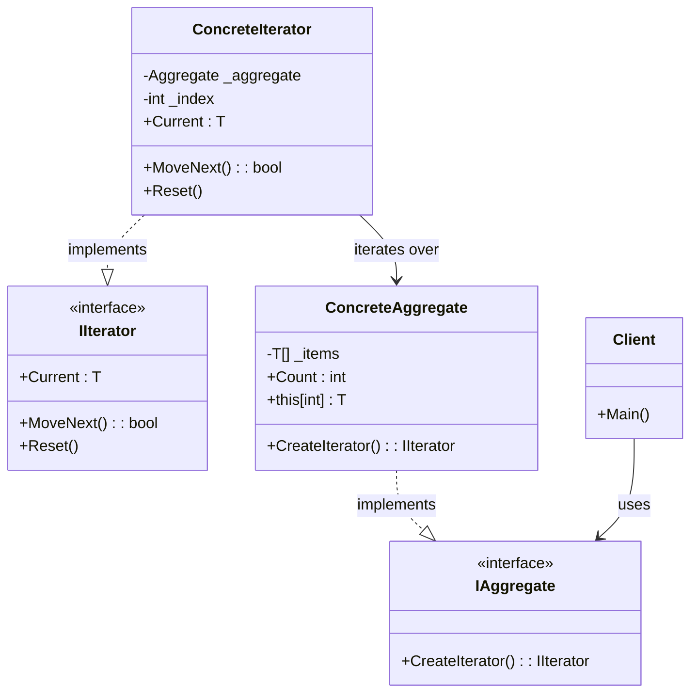
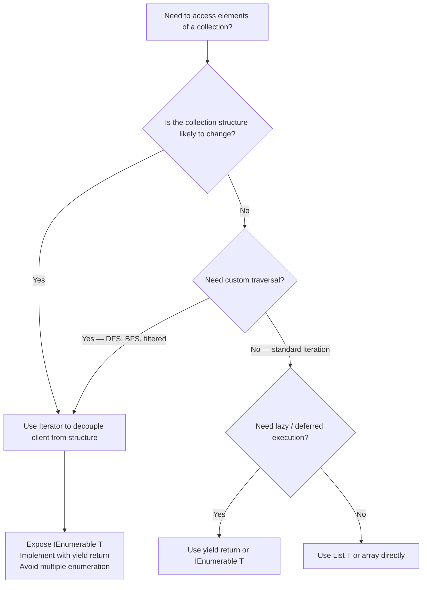

> [!success] Mastery Check
> - [ ] **Studied Well**
> - [ ] **Can explain the concept without notes**
> - [ ] **Can answer interview questions confidently**
> - [ ] **Can implement it in a real project**


## Navigation

**Domain:** [[6 — Design Principles & Patterns]] > **Group:** Behavioral Patterns
**Previous:** [[6.033 — Template Method Pattern]] | **Next:** [[6.035 — Mediator Pattern]]

### Prerequisites
- [[2.026 — IEnumerable T and yield return]] — C# `IEnumerable<T>` and `yield return` are the language-native Iterator implementation; understanding how the compiler transforms `yield` into a state machine is essential for working with iterators.
- [[6.027 — Composite Pattern]] — Iterator is the traversal strategy for Composite structures; they are often used together, and Iterator's value increases when traversing complex hierarchies.

### Where This Fits
Iterator provides a way to access the elements of an aggregate object sequentially without exposing its underlying representation (array, list, tree, database cursor). In .NET, Iterator is built into the language: `foreach` compiles to `IEnumerable<T>` / `IEnumerator<T>` usage, `yield return` generates an iterator state machine automatically, and LINQ is a query language built on top of the iterator pattern. A senior engineer uses Iterator whenever they need to traverse a collection without coupling to its storage format — or when they need to implement custom traversal logic (lazy evaluation, infinite sequences, tree traversal) that standard collections do not support.

## Core Mental Model

Iterator separates the traversal of a collection from the collection itself. The iterator object encapsulates the state of the iteration (current position, remaining elements) and provides a standard interface (`Current`, `MoveNext()`, `Reset()`) so that clients can iterate without knowing whether the collection is an array, a linked list, a database result set, or a generated sequence.

### Classification

**GoF Classification:** Behavioral — intent is to provide a way to access the elements of an aggregate object sequentially without exposing its underlying representation.



### Participants

- **IIterator** — interface that defines `MoveNext()`, `Current`, and optionally `Reset()` for traversal
- **ConcreteIterator** — implements the iterator interface; tracks the current position in the aggregate's traversal
- **IAggregate** — interface that defines `CreateIterator()` to produce an iterator
- **ConcreteAggregate** — implements the aggregate interface; returns an appropriate ConcreteIterator
- **Client** — accesses the aggregate's elements via the iterator, without knowing the underlying structure

## Deep Mechanics

### How It Works

1. **Client obtains** an iterator by calling `aggregate.CreateIterator()` (or in C#, by using `foreach` which calls `GetEnumerator()`).
2. **Client enters a loop**: while `iterator.MoveNext()` returns `true`, the client reads `iterator.Current`.
3. **MoveNext() advances** the internal state of the iterator (cursor position) and returns `false` when the traversal is complete.
4. **Current returns** the element at the current position.
5. **When the loop ends** (or the client disposes of the iterator), resources are released.

The .NET `foreach` loop compiles to exactly this pattern: it calls `GetEnumerator()` on the collection, enters a `try-finally` block, and calls `Dispose()` on the enumerator in the `finally`.

### .NET Runtime Behavior

**`yield return` — compiler-generated state machine.** When you write an iterator method with `yield return`, the C# compiler generates a **struct** (value type) that implements `IEnumerable<T>` and `IEnumerator<T>`. This struct contains:
- A **state machine** with states: `-2` (before first), `0` (running), `1` (suspended/yielded), `-1` (finished)
- The **current value** field
- The **local variables** of the method (hoisted to fields)
- The **promise of an IEnumerator<T>** for future calls

Key runtime implications:
- **Zero allocation on first `MoveNext()`** — if the struct implements `IEnumerator<T>` directly, and the caller uses `foreach` with the concrete type, there is no boxing allocation.
- **Boxing allocation if used as `IEnumerable<T>`** — if the struct is cast to the interface, it boxes, allocating on the heap.
- **State machine overhead** — each `MoveNext()` call processes the state switch, which adds ~5-10 ns overhead per element.

**`IAsyncEnumerable<T>` — the async iterator.** .NET Core 3.0+ introduced async iterators, which are compiled into a similar state machine that returns `ValueTask<bool>` from `MoveNextAsync()`. The state machine manages the async state across `await` points within the iterator.

**LINQ — Iterator as the foundation.** Every LINQ operator (Select, Where, Aggregate) returns an `IEnumerable<T>` — i.e., an iterator. The composition of LINQ operators creates a chain of iterators, where each `MoveNext()` call propagates through the chain lazily. This is why LINQ queries are deferred — calling `Where()` does not iterate; it returns a new iterator.

## Production Code Patterns

### Implementation in C#

```csharp
/// <summary>Represents a node in a hierarchical category tree.</summary>
public sealed record CategoryNode(
    string Id,
    string Name,
    IReadOnlyList<CategoryNode> Children
);

// Role: IIterator — using .NET's built-in IEnumerator<T>
// (No need to define a custom iterator interface in .NET; IEnumerable<T> / IEnumerator<T> is the standard.)

// Role: ConcreteAggregate
/// <summary>
/// A category tree that supports depth-first and breadth-first traversal via custom iterators.
/// </summary>
public sealed class CategoryTree
{
    private readonly CategoryNode _root;

    public CategoryTree(CategoryNode root) => _root = root;

    /// <summary>Returns an enumerable for depth-first traversal.</summary>
    public IEnumerable<CategoryNode> TraverseDepthFirst()
        => DepthFirstIterator(_root);

    /// <summary>Returns an enumerable for breadth-first traversal.</summary>
    public IEnumerable<CategoryNode> TraverseBreadthFirst()
        => BreadthFirstIterator(_root);

    // Role: ConcreteIterator (yield return — compiler-generated)
    private static IEnumerable<CategoryNode> DepthFirstIterator(CategoryNode root)
    {
        yield return root;
        foreach (var child in root.Children)
        foreach (var descendant in DepthFirstIterator(child))
            yield return descendant;
    }

    private static IEnumerable<CategoryNode> BreadthFirstIterator(CategoryNode root)
    {
        var queue = new Queue<CategoryNode>();
        queue.Enqueue(root);
        while (queue.Count > 0)
        {
            var current = queue.Dequeue();
            yield return current;
            foreach (var child in current.Children)
                queue.Enqueue(child);
        }
    }

    /// <summary>Standard flat-category iterator via IEnumerable<T>.</summary>
    public IEnumerator<CategoryNode> GetEnumerator()
        => DepthFirstIterator(_root).GetEnumerator();
}

// Role: Client
public static class CategoryRenderer
{
    public static void RenderHierarchy(CategoryTree tree)
    {
        foreach (var node in tree.TraverseDepthFirst())
        {
            Console.WriteLine($"{node.Name} ({node.Id})");
        }
    }
}
```

### ASP.NET Core / .NET Ecosystem Integration

**IEnumerable<T> — the universal .NET Iterator.** Every `foreach` loop in C# uses Iterator. Every LINQ query is a chain of iterators. Every time you iterate over `List<T>`, `T[]`, `Dictionary<K,V>`, `HashSet<T>`, or `IQueryable<T>`, you are using Iterator.

```csharp
// Standard Iterator usage in ASP.NET Core
[ApiController]
public class OrderController(ApplicationDbContext db) : ControllerBase
{
    [HttpGet("stream")]
    public async IAsyncEnumerable<OrderSummary> StreamOrders(
        [FromQuery] int batchSize = 100,
        [EnumeratorCancellation] CancellationToken ct = default)
    {
        await foreach (var order in db.Orders
            .AsNoTracking()
            .AsAsyncEnumerable()
            .WithCancellation(ct))
        {
            yield return new OrderSummary(order.Id, order.Total, order.Status);
        }
    }
}
```

**Entity Framework Core — Iterator in query providers.** `IQueryable<T>` is both an Aggregate (creates iterators via `GetEnumerator()`) and an Iterator combinator (all operators return `IQueryable<T>`). When you call `ToListAsync()`, EF Core executes the query and returns an iterator over the results. `AsAsyncEnumerable()` returns an `IAsyncEnumerable<T>` for streaming results without loading the entire set into memory:

```csharp
// Streaming 1M records without loading into memory
public async IAsyncEnumerable<Invoice> StreamInvoicesAsync(
    ApplicationDbContext db,
    [EnumeratorCancellation] CancellationToken ct)
{
    await foreach (var invoice in db.Invoices
        .AsNoTracking()
        .Where(i => i.Status == InvoiceStatus.Pending)
        .AsAsyncEnumerable()
        .WithCancellation(ct))
    {
        yield return invoice;
    }
}
```

**System.Text.Json — Utf8JsonReader as an iterator.** `Utf8JsonReader` is a forward-only iterator over JSON tokens. It provides `Read()` (MoveNext) and `TokenType` (Current) — the classic Iterator pattern but as a ref struct.

## Gotchas & Anti-Patterns

### Multiple Enumeration

**Wrong:** Enumerating the same `IEnumerable<T>` multiple times when it represents a deferred operation.

```csharp
// ❌ Wrong
var query = db.Orders.Where(o => o.Status == "Pending");
var count = query.Count();    // first enumeration — executes SQL
var list = query.ToList();    // second enumeration — executes SQL again
```

**Right:** Materialise the query if you need to iterate multiple times.

```csharp
// ✅ Right
var list = db.Orders.Where(o => o.Status == "Pending").ToList();
var count = list.Count; // in-memory
```

**Consequence:** Deferred execution causes the operation (database query, file read, network call) to execute once per enumeration. For `IQueryable<T>`, this means N round trips. For `yield return` iterators backed by I/O, this can cause data corruption or severe performance degradation.

### Side Effects in GetEnumerator or MoveNext

**Wrong:** An iterator method that has side effects (logging, mutation) at enumeration time.

```csharp
// ❌ Wrong
public IEnumerable<Order> GetPendingOrders()
{
    Log("Fetching pending orders"); // side effect at enumeration
    foreach (var order in _orders.Where(o => o.Status == "Pending"))
        yield return order;
}
```

**Right:** Keep iterators pure — defer side effects to the caller.

```csharp
// ✅ Right
public IEnumerable<Order> GetPendingOrders()
    => _orders.Where(o => o.Status == "Pending");
```

**Consequence:** Side effects in iterators violate the Principle of Least Surprise — the caller gets a side effect simply by calling `GetEnumerator()` (which does not materialise anything) rather than at `MoveNext()` time. Debugging "who logged this message" becomes confusing.

### Iterator That Never Terminates

**Wrong:** An iterator with no termination condition.

```csharp
// ❌ Wrong
public IEnumerable<int> InfiniteSequence()
{
    int i = 0;
    while (true) yield return i++; // no exit condition
}
```

**Right:** Document that the sequence is infinite or provide a termination mechanism.

```csharp
// ✅ Right — documented infinite sequence with Take()
/// <summary>Generates an infinite sequence of natural numbers. Use .Take(n) to limit.</summary>
public IEnumerable<int> NaturalNumbers()
{
    int i = 0;
    while (true) yield return i++;
}
```

**Consequence:** The caller's `foreach` loop never exits. The iterator consumes CPU indefinitely. .NET provides no built-in "iterator timeout" — the runtime will not interrupt the enumeration.

### Mutating the Collection During Enumeration

**Wrong:** Modifying the underlying collection while iterating.

```csharp
// ❌ Wrong
foreach (var item in _items)
{
    if (item.IsExpired)
        _items.Remove(item); // InvalidOperationException
}
```

**Right:** Iterate over a copy or collect items to remove then remove after.

```csharp
// ✅ Right
var expired = _items.Where(i => i.IsExpired).ToList();
_items.RemoveAll(i => expired.Contains(i));
```

**Consequence:** `InvalidOperationException: Collection was modified; enumeration may not execute` — the collection's version counter detects modification during enumeration.

## Performance Implications

### Dispatch and Allocation Cost

Iterators in .NET are highly optimised. The `yield return` state machine is a struct, avoiding allocation when used with the concrete type. The primary costs are: (1) the state switch per `MoveNext()` (~5-10 ns), (2) boxing if the struct is used via the `IEnumerable<T>` interface, and (3) per-element allocation if the iterator yields reference types (though that is the data, not the iterator itself).

### BenchmarkDotNet

```csharp
[MemoryDiagnoser]
[SimpleJob(RuntimeMoniker.Net90)]
public class IteratorBenchmark
{
    private List<int> _list;

    [GlobalSetup]
    public void Setup()
    {
        _list = Enumerable.Range(0, 1000).ToList();
    }

    [Benchmark(Baseline = true)]
    public int ForLoop()
    {
        int sum = 0;
        for (int i = 0; i < _list.Count; i++)
            sum += _list[i];
        return sum;
    }

    [Benchmark]
    public int ForeachOverList()
    {
        int sum = 0;
        foreach (var item in _list)
            sum += item;
        return sum;
    }

    [Benchmark]
    public int ForeachOverYield()
    {
        int sum = 0;
        foreach (var item as YieldItems())
            sum += item;
        return sum;
    }

    private IEnumerable<int> YieldItems()
    {
        for (int i = 0; i < 1000; i++)
            yield return _list[i];
    }
}
```

**Expected results (approximate on .NET 9, x64):**

|Method|Mean|Gen0|Allocated|
|---|---|---|---|
|ForLoop|~250 ns|-|0 B|
|ForeachOverList|~280 ns|-|0 B|
|ForeachOverYield|~900 ns|0.0010|~200 B|

**Interpretation:** `foreach` over a `List<T>` is nearly as fast as a `for` loop because the JIT recognises `List<T>.Enumerator` (a struct) and inlines the enumeration. `yield return` adds ~3x overhead due to the state machine switching per element. For collections up to millions of elements, this is still fast (< 1 ms). Use `yield return` for its expressiveness and deferred execution; optimise to `for` loops only if benchmarks show iterator overhead on proven hot paths.

## Interview Arsenal

### Question Bank

1. What is the Iterator pattern and what problem does it solve?
2. How does `foreach` compile in C#?
3. What is the difference between Iterator and the Composite pattern?
4. How does `yield return` work at the compiler and runtime level?
5. What is the performance implication of multiple enumeration of `IEnumerable<T>`?
6. How does LINQ use the Iterator pattern?
7. When should you use `IAsyncEnumerable<T>` vs. `IEnumerable<T>`?
8. What is the difference between `IEnumerable<T>` and `IEnumerator<T>`?

### Spoken Answers

**Q1: What is the Iterator pattern and what problem does it solve?**

> **Average answer:** Iterator lets you loop through a collection without knowing how it's stored. It provides `MoveNext()` and `Current` to access elements. C# has `foreach` for this.

> **Great answer:** Iterator separates the traversal behaviour from the aggregate structure so that clients can access elements sequentially without coupling to the underlying representation — whether that is an array, linked list, tree, database cursor, or generated sequence. The pattern has two interfaces: the **aggregate** (`IEnumerable<T>`) which creates an iterator, and the **iterator** (`IEnumerator<T>`) which holds the traversal state. In .NET, this is built into the language: `foreach` compiles to a try-finally block that calls `GetEnumerator()`, loops on `MoveNext()`/`Current`, and calls `Dispose()` on the enumerator. The `yield return` keyword lets the compiler generate the iterator state machine automatically, handling all the state transition logic. The critical .NET-specific insight is that `yield return` generates a **struct** iterator to avoid heap allocation when used directly, but casting it to `IEnumerable<T>` boxes it. LINQ is the most powerful Iterator example in .NET — every LINQ operator returns an iterator, enabling lazy, composable, deferred query execution.

**Q3: What is the difference between Iterator and the Composite pattern?**

> **Average answer:** Iterator traverses elements; Composite represents tree structures. They are different patterns.

> **Great answer:** They are complementary, not competing. Composite creates a tree structure where individual objects and compositions are treated uniformly. Iterator provides a way to traverse that tree without exposing its internal structure. The two patterns are often used together: a Composite tree's `GetEnumerator()` implementation can return an Iterator that performs depth-first or breadth-first traversal. In .NET, `System.IO.DirectoryInfo` demonstrates this — it is a Composite (directories contain files and subdirectories) that supports `GetFiles()` which returns an enumerable (Iterator). Without Iterator, clients would need to write recursive traversal logic for every Composite structure. Without Composite, Iterator would only traverse flat collections.

### Trick Question

**"`foreach` always boxes the enumerator."**

Why it is a trap: For most collection types, the compiler detects that the enumerator is a struct and uses it directly without boxing.

Correct answer: The C# compiler checks whether the collection's `GetEnumerator()` returns a type that implements `IDisposable`. If it does, `foreach` calls `Dispose()` directly on the concrete type — no boxing. For `List<T>`, `GetEnumerator()` returns `List<T>.Enumerator` (a struct). The compiler generates code that uses this struct directly: the struct is stored in a local, `MoveNext()` is called via constrained call (not interface dispatch), and if it is a struct, `Dispose()` is called on the struct without boxing. Boxing only occurs if the collection only exposes `IEnumerable<T>` and the concrete enumerator is a reference type or if you explicitly cast to `IEnumerable<T>`. This optimisation is why `List<T>` performs comparably to arrays in `foreach` loops.

### Comparison Table

| Aspect | Iterator | Composite |
|---|---|---|
| Intent | Access elements sequentially without exposing representation | Compose objects into tree structures to represent part-whole hierarchies |
| Participants | IIterator, ConcreteIterator, IAggregate, ConcreteAggregate | Component, Leaf, Composite |
| When to use | Need uniform traversal across different collection types | Need to treat individual objects and compositions uniformly |
| .NET example | `IEnumerable<T>`, `IEnumerator<T>`, `yield return` | `System.Windows.Forms.Control`, `DirectoryInfo` |
| Key difference | Iterator is about traversal; Composite is about structure. They are used together — Iterator traverses Composite. |

## Decision Framework

### When to Apply Iterator



### Application Checklist

- [ ] Clients should access elements without knowing the underlying collection structure
- [ ] Multiple traversal algorithms are needed (forward, reverse, depth-first, breadth-first)
- [ ] Lazy / deferred execution is required — elements should be produced on demand
- [ ] The iterator should be disposable (release resources when enumeration completes)
- [ ] The underlying collection may change over time without affecting clients

### Tradeoff Summary

| What You Gain | What You Give Up |
|---|---|
| Decoupled traversal — client does not know collection structure | State machine overhead per-element (~5-10 ns) |
| Lazy / deferred execution — produce elements on demand | Single-pass forward-only by default (unless buffering) |
| Composability — LINQ operators work on any IEnumerable<T> | Deferred execution causes surprises (multiple enumeration) |
| Compiler support — `yield return` generates the state machine | Debugging state machines is harder than imperative code |

## Self-Check

### Conceptual Questions

1. What is the core purpose of the Iterator pattern?
2. How does `IEnumerable<T>` differ from `IEnumerator<T>`?
3. Can you explain how `yield return` generates a state machine?
4. What is the difference between Iterator and Composite?
5. Why does iterating a `List<T>` with `foreach` perform similarly to a `for` loop?
6. When should you use `IAsyncEnumerable<T>`?
7. What is the danger of multiple enumeration of an `IEnumerable<T>` backed by a database query?
8. What causes `InvalidOperationException: Collection was modified` during enumeration?
9. How does LINQ use the Iterator pattern?
10. What is the difference between an iterator method and a method that returns a `List<T>`?

<details>
<summary>Answers</summary>

1. Iterator provides a way to access elements of an aggregate sequentially without exposing the aggregate's underlying representation.
2. `IEnumerable<T>` represents an aggregate that can produce an iterator (`GetEnumerator()`). `IEnumerator<T>` is the iterator itself — it holds the traversal state (`Current`, `MoveNext()`, `Dispose()`).
3. The C# compiler transforms the method into a struct with a state machine (states: before, running, suspended, finished). Local variables become fields. Each `yield return` sets `Current` and returns `true`; the next `MoveNext()` resumes after the `yield`.
4. Iterator is about traversal; Composite is about structure. They are used together — Iterator traverses Composite trees.
5. Because `List<T>.Enumerator` is a struct. The compiler uses it directly without boxing, and the JIT can inline the `MoveNext()` and `Current` calls.
6. When the sequence involves asynchronous operations (DB queries, HTTP calls, file reads) and you want to stream elements without blocking.
7. Each enumeration executes the database query again — causing N round trips instead of one. This can degrade performance and produce inconsistent results if data changes between enumerations.
8. The collection tracks a version counter incremented on every modification. The enumerator checks the version on each `MoveNext()` and throws if it changed.
9. Every LINQ operator (Select, Where, OrderBy) returns a new `IEnumerable<T>` iterator. Composition chains iterators: `Where(Select(source))` creates a nested iterator structure.
10. An iterator method (with `yield return`) returns an `IEnumerable<T>` that executes lazily — elements are produced on demand. A method returning `List<T>` materialises all elements eagerly.

</details>

---

### Code Puzzles

**Puzzle 1 — Identify the violation**

```csharp
public IEnumerable<Customer> GetVipCustomers()
{
    var customers = _repo.GetAll(); // IQueryable<Customer>
    return customers.Where(c => c.TotalSpent > 10000);
}
// Called as:
var vipList = GetVipCustomers().ToList(); // works fine
var vipCount = GetVipCustomers().Count(); // second query!
```

<details> <summary>Answer</summary>

**Violation:** Multiple enumeration of an `IEnumerable<T>` backed by a database query — each call to `GetVipCustomers()` returns a new `IQueryable` that executes a separate SQL query when enumerated. **Why:** The caller expects a cheap property but gets two database round trips. If the data changes between enumerations, the results are inconsistent. **Fix:** Materialise once:

```csharp
public List<Customer> GetVipCustomers()
    => _repo.GetAll().Where(c => c.TotalSpent > 10000).ToList();
```

</details>

---

**Puzzle 2 — Complete the pattern**

```csharp
// Implement a custom iterator that produces Fibonacci numbers up to n
public IEnumerable<long> Fibonacci(int maxValue)
{
    // TODO: implement using yield return
}
```

<details> <summary>Answer</summary>

```csharp
public IEnumerable<long> Fibonacci(int maxValue)
{
    long prev = 0, current = 1;
    while (prev <= maxValue)
    {
        yield return prev;
        (prev, current) = (current, prev + current);
    }
}
```

**Explanation:** The `yield return` statement produces each Fibonacci number on demand. The state machine preserves `prev` and `current` between `MoveNext()` calls. The sequence terminates when the next value exceeds `maxValue`.

</details>

---

**Puzzle 3 — Choose the right pattern**

**Scenario:** You have a `TreeNode<T>` class that represents a hierarchical data structure (org chart, category tree, menu). Clients need to traverse the tree in different orders (depth-first, breadth-first, reverse depth-first) without knowing the tree's internal storage. Which pattern?

<details> <summary>Answer</summary>

**Correct pattern:** Iterator — implement `IEnumerable<TreeNode<T>>` on the tree and provide different iterator methods for each traversal strategy. The tree (Composite structure) exposes iterators that encapsulate the traversal logic. **Wrong choice:** Composite alone — Composite handles the structure but provides no traversal abstraction. **Implementation sketch:**

```csharp
public sealed class TreeNode<T>
{
    public T Data { get; }
    public IReadOnlyList<TreeNode<T>> Children { get; }

    public IEnumerable<TreeNode<T>> TraverseBreadthFirst()
    {
        var queue = new Queue<TreeNode<T>>();
        queue.Enqueue(this);
        while (queue.Count > 0)
        {
            var node = queue.Dequeue();
            yield return node;
            foreach (var child in node.Children)
                queue.Enqueue(child);
        }
    }
}
```

</details>

---

**Puzzle 4 — Spot the anti-pattern**

```csharp
public IEnumerable<string> ReadLines(string path)
{
    using var reader = new StreamReader(path);
    string? line;
    while ((line = reader.ReadLine()) is not null)
        yield return line;
}
```

<details> <summary>Answer</summary>

**Observation:** This is actually the CORRECT pattern for streaming file lines. The `using` ensures the file handle is closed when the iterator is disposed (either through `foreach` disposing the enumerator, or when the GC collects it). **There is an anti-pattern, though:** not enumerating the result to completion — if the caller breaks out of the `foreach` early, `Dispose()` is called (via `finally` block), which closes the stream. This is correct behaviour. The real anti-pattern would be calling `.ToList()` on this and reading the entire file into memory when streaming would suffice.

</details>

---

**Puzzle 5 — Refactor to apply**

```csharp
public sealed class TreeNode
{
    public string Name { get; set; }
    public List<TreeNode> Children { get; set; }
}

public static List<TreeNode> FlattenDepthFirst(TreeNode root)
{
    var result = new List<TreeNode>();
    var stack = new Stack<TreeNode>();
    stack.Push(root);
    while (stack.Count > 0)
    {
        var node = stack.Pop();
        result.Add(node);
        for (int i = node.Children.Count - 1; i >= 0; i--)
            stack.Push(node.Children[i]);
    }
    return result;
}
```

<details> <summary>Answer</summary>

```csharp
public static IEnumerable<TreeNode> TraverseDepthFirst(TreeNode root)
{
    var stack = new Stack<TreeNode>();
    stack.Push(root);
    while (stack.Count > 0)
    {
        var node = stack.Pop();
        yield return node;
        for (int i = node.Children.Count - 1; i >= 0; i--)
            stack.Push(node.Children[i]);
    }
}
```

**What changed:** The method returns `IEnumerable<TreeNode>` instead of `List<TreeNode>`, using `yield return` for lazy, deferred traversal. **Why it is better:** The caller controls how much of the tree to traverse — they can use `.Take(5)` to get only the first 5 nodes, or `Any()` to check if any node matches a condition, without traversing the entire tree. The iteration is lazy — no intermediate list allocation. The tree traversal is decoupled from the collection of results.

</details>
