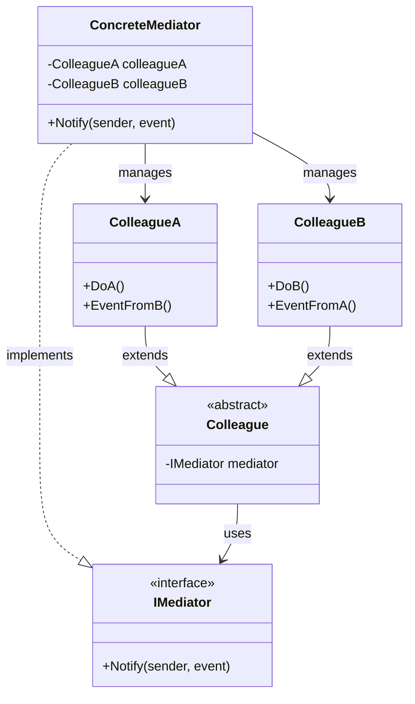
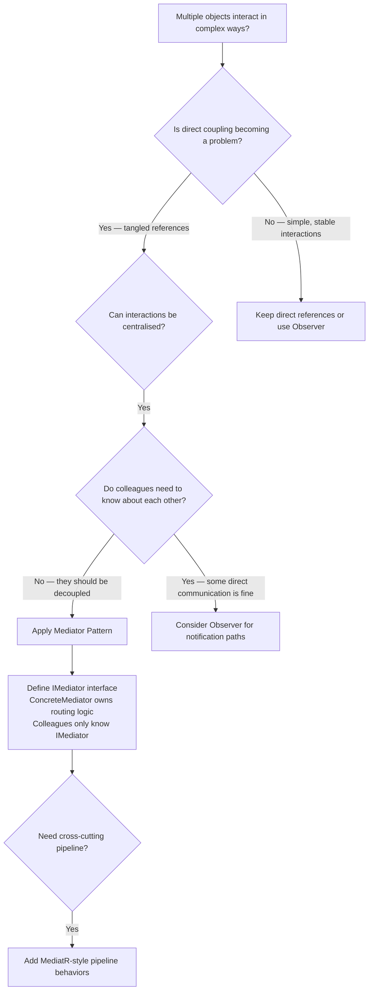

> [!success] Mastery Check
> - [ ] **Studied Well**
> - [ ] **Can explain the concept without notes**
> - [ ] **Can answer interview questions confidently**
> - [ ] **Can implement it in a real project**


## Navigation

**Domain:** [[6 — Design Principles & Patterns]] > **Group:** Behavioral Patterns
**Previous:** [[6.034 — Iterator Pattern]] | **Next:** [[6.036 — State Pattern]]

### Prerequisites
- [[2.021 — Interfaces and Polymorphism]] — Mediator relies on polymorphic dispatch to route requests from colleagues through the mediator; understanding interface-based abstraction is required.
- [[4.055 — MediatR Pipeline Behaviors]] — MediatR is the canonical .NET Mediator implementation; its pipeline behaviour mechanism is essential production knowledge for senior engineers.

### Where This Fits
Mediator centralises communication between multiple objects (colleagues) into a single mediator object, preventing colleagues from referring to each other explicitly. It reduces coupling by replacing many-to-many interactions with one-to-many (colleagues → mediator). In .NET, Mediator appears in MediatR (the dominant implementation), in SignalR hubs (clients communicate through the hub), in MVC's Controller/View coordination, and in any system where complex inter-object communication must be decoupled and centralised. A senior engineer chooses Mediator when the communication topology between objects becomes tangled — the "spaghetti" of object references — and needs to be replaced with a controlled, centralised routing layer.

## Core Mental Model

Mediator defines an object that encapsulates how a set of objects interact. It promotes loose coupling by keeping objects from referring to each other explicitly, and it lets you vary their interaction independently. Colleagues send messages to the mediator; the mediator knows which colleague should receive each message and routes accordingly.

### Classification

**GoF Classification:** Behavioral — intent is to define an object that encapsulates how a set of objects interact. Mediator promotes loose coupling by keeping objects from referring to each other explicitly, and it lets you vary their interaction independently.



### Participants

- **IMediator** — interface defining communication protocol between colleagues
- **ConcreteMediator** — implements mediator; knows and coordinates colleague objects; routes messages between them
- **Colleague** — abstract class (or interface) that each colleague implements; holds a reference to the mediator
- **ColleagueA / B** — concrete colleagues; communicate only through the mediator, never directly

## Deep Mechanics

### How It Works

1. **ConcreteMediator is created** with references to all colleague objects (or colleagues register with it).
2. **ColleagueA** needs to communicate — instead of calling ColleagueB directly, it calls `_mediator.Notify(this, eventArgs)`.
3. **ConcreteMediator.Notify()** determines the event type and sender, then decides which colleague(s) to notify and in what order.
4. **ConcreteMediator calls** the appropriate method(s) on ColleagueB (or both A and B, or neither).
5. **Colleagues never hold** references to each other — only to the mediator.

The critical design difference from Observer: in Mediator, the mediator knows about all colleagues and coordinates their interaction. In Observer, the subject knows about observers directly (through the observer list).

### .NET Runtime Behavior

**MediatR — the de facto .NET Mediator.** MediatR implements the Mediator pattern using C# generics and reflection. Key runtime behaviours:
- **Request/response** (`IRequest<TResponse>`) — mediator dispatches to a single handler using generic type matching. The pipeline resolves `IRequestHandler<TRequest, TResponse>` from the DI container.
- **Notification** (`INotification`) — mediator dispatches to all registered `INotificationHandler<TNotification>` handlers (multicast, like Observer coordinated through Mediator).
- **Pipeline behaviors** — registered via `IPipelineBehavior<TRequest, TResponse>`, these wrap handler execution in a chain (Combined Mediator + Chain of Responsibility).

The dispatch mechanism: MediatR uses `IServiceProvider` to resolve handlers. For every `Send(TRequest)`, it resolves `IRequestHandler<TRequest, TResponse>` from the container and invokes it through the pipeline behavior chain. The resolution cost is a single DI lookup per request — fast (~50-100 ns) but allocation-heavy if handlers are transient.

**SignalR Hubs — Mediator for real-time communication.** Each client connects to a Hub; the Hub acts as the mediator, routing messages between connected clients. Clients never hold direct references to other clients — they send messages through the Hub, which broadcasts to the appropriate recipients.

## Production Code Patterns

### Implementation in C#

```csharp
/// <summary>Types of aircraft status events.</summary>
public enum AircraftEvent { LandingRequest, TakeoffRequest, RunwayClear, Emergency }

/// <summary>Event data for air traffic communications.</summary>
public sealed record AirTrafficEvent(
    string AircraftId,
    AircraftEvent EventType,
    string Message
);

// Role: IMediator
/// <summary>Interface for the air traffic control mediator.</summary>
public interface IAirTrafficMediator
{
    /// <summary>Called by an aircraft to send a message to the tower.</summary>
    Task NotifyAsync(Aircraft sender, AirTrafficEvent evt);
    /// <summary>Registers an aircraft with the mediator.</summary>
    void Register(Aircraft aircraft);
}

// Role: Colleague (abstract base)
/// <summary>
/// Base class for aircraft that communicate through the mediator.
/// Aircraft never talk to each other directly — they only talk to the tower.
/// </summary>
public abstract class Aircraft
{
    protected IAirTrafficMediator Mediator { get; }
    public string Id { get; }

    protected Aircraft(string id, IAirTrafficMediator mediator)
    {
        Id = id;
        Mediator = mediator;
    }

    /// <summary>Receives a message from the mediator (from another aircraft or the tower).</summary>
    public abstract Task ReceiveAsync(AirTrafficEvent evt);

    /// <summary>Requests landing through the mediator.</summary>
    public async Task RequestLandingAsync()
        => await Mediator.NotifyAsync(this, new AirTrafficEvent(Id, AircraftEvent.LandingRequest, "Requesting landing"));

    /// <summary>Requests takeoff through the mediator.</summary>
    public async Task RequestTakeoffAsync()
        => await Mediator.NotifyAsync(this, new AirTrafficEvent(Id, AircraftEvent.TakeoffRequest, "Requesting takeoff"));
}

// Role: ColleagueA
/// <summary>
/// Commercial airliner — participates in coordinated landing/takeoff sequencing.
/// </summary>
public sealed class CommercialAircraft : Aircraft
{
    public CommercialAircraft(string id, IAirTrafficMediator mediator) : base(id, mediator) { }

    public override async Task ReceiveAsync(AirTrafficEvent evt)
    {
        Console.WriteLine($"[{Id}] Received: {evt.Message}");
        if (evt.EventType == AircraftEvent.RunwayClear)
            await PerformLandingAsync();
    }

    private Task PerformLandingAsync()
    {
        Console.WriteLine($"[{Id}] Performing landing sequence");
        return Task.CompletedTask;
    }
}

// Role: ColleagueB
/// <summary>
/// Private aircraft — needs different runway clearance handling.
/// </summary>
public sealed class PrivateAircraft : Aircraft
{
    public PrivateAircraft(string id, IAirTrafficMediator mediator) : base(id, mediator) { }

    public override async Task ReceiveAsync(AirTrafficEvent evt)
    {
        Console.WriteLine($"[{Id}] Received: {evt.Message}");
        if (evt.EventType == AircraftEvent.RunwayClear)
            Console.WriteLine($"[{Id}] Taxiing to runway");
    }
}

// Role: ConcreteMediator
/// <summary>
/// Air traffic control tower — the mediator that coordinates all aircraft communication.
/// Knows about all aircraft and enforces landing/takeoff protocol.
/// </summary>
public sealed class AirTrafficControlTower : IAirTrafficMediator
{
    private readonly List<Aircraft> _aircraft = new();
    private readonly ILogger<AirTrafficControlTower> _logger;
    private bool _runwayOccupied;

    public AirTrafficControlTower(ILogger<AirTrafficControlTower> logger) => _logger = logger;

    public void Register(Aircraft aircraft)
    {
        _aircraft.Add(aircraft);
        _logger.LogInformation("Aircraft {Id} registered with tower", aircraft.Id);
    }

    public async Task NotifyAsync(Aircraft sender, AirTrafficEvent evt)
    {
        _logger.LogInformation("Tower received {Event} from {Id}", evt.EventType, sender.Id);

        switch (evt.EventType)
        {
            case AircraftEvent.LandingRequest:
                await HandleLandingRequestAsync(sender);
                break;
            case AircraftEvent.TakeoffRequest:
                await HandleTakeoffRequestAsync(sender);
                break;
            case AircraftEvent.Emergency:
                await HandleEmergencyAsync(sender);
                break;
        }
    }

    private async Task HandleLandingRequestAsync(Aircraft sender)
    {
        if (_runwayOccupied)
        {
            _logger.LogWarning("Runway occupied — {Id} must circle", sender.Id);
            await sender.ReceiveAsync(new AirTrafficEvent("Tower", AircraftEvent.RunwayClear, "Hold — runway occupied"));
            return;
        }

        _runwayOccupied = true;
        await sender.ReceiveAsync(new AirTrafficEvent("Tower", AircraftEvent.RunwayClear, "Cleared for landing"));

        // Notify other aircraft that runway is occupied
        foreach (var aircraft in _aircraft.Where(a => a.Id != sender.Id))
            await aircraft.ReceiveAsync(new AirTrafficEvent("Tower", AircraftEvent.RunwayClear, $"Runway in use by {sender.Id}"));

        // Simulate landing completion
        await Task.Delay(500);
        _runwayOccupied = false;
    }

    private async Task HandleTakeoffRequestAsync(Aircraft sender) { /* similar logic */ }
    private async Task HandleEmergencyAsync(Aircraft sender) { /* give priority */ }
}
```

### ASP.NET Core / .NET Ecosystem Integration

**MediatR — the standard .NET Mediator.** MediatR is installed via NuGet and registered in `Program.cs`:

```csharp
// Program.cs
builder.Services.AddMediatR(cfg =>
{
    cfg.RegisterServicesFromAssemblyContaining<Program>();
    cfg.AddBehavior(typeof(IPipelineBehavior<,>), typeof(LoggingBehavior<,>));
    cfg.AddBehavior(typeof(IPipelineBehavior<,>), typeof(ValidationBehavior<,>));
});

// Request (Command or Query)
public sealed record GetOrderQuery(Guid OrderId) : IRequest<OrderDto>;

// Handler
public sealed class GetOrderQueryHandler(IOrderRepository repo)
    : IRequestHandler<GetOrderQuery, OrderDto>
{
    public async Task<OrderDto> Handle(GetOrderQuery request, CancellationToken ct)
    {
        var order = await repo.GetByIdAsync(request.OrderId, ct);
        return order is null
            ? throw new NotFoundException($"Order {request.OrderId} not found")
            : new OrderDto(order.Id, order.Total, order.Status);
    }
}

// Pipeline behaviour (cross-cutting)
public sealed class LoggingBehavior<TRequest, TResponse>(
    ILogger<LoggingBehavior<TRequest, TResponse>> logger
) : IPipelineBehavior<TRequest, TResponse>
    where TRequest : IRequest<TResponse>
{
    public async Task<TResponse> Handle(
        TRequest request,
        RequestHandlerDelegate<TResponse> next,
        CancellationToken ct)
    {
        logger.LogInformation("Handling {Request}", typeof(TRequest).Name);
        var response = await next();
        logger.LogInformation("Handled {Request}", typeof(TRequest).Name);
        return response;
    }
}
```

**SignalR Hub — real-time mediator:**

```csharp
public sealed class ChatHub : Hub
{
    // Mediator receives messages from clients and broadcasts
    public async Task SendMessage(string user, string message)
    {
        // Mediator decides who receives: broadcast to all connected clients
        await Clients.All.SendAsync("ReceiveMessage", user, message);
    }

    public async Task SendPrivateMessage(string user, string message, string targetUserId)
    {
        // Mediator routes to specific client
        await Clients.User(targetUserId).SendAsync("ReceivePrivateMessage", user, message);
    }
}
```

## Gotchas & Anti-Patterns

### Mediator as God Object

**Wrong:** Putting all inter-object communication logic into a single, monolithic mediator class.

```csharp
// ❌ Wrong
public sealed class GodMediator
{
    public async Task NotifyAsync(object sender, object evt)
    {
        if (evt is OrderPlacedEvent) { /* 100 lines */ }
        else if (evt is PaymentReceivedEvent) { /* 100 lines */ }
        else if (evt is InvoiceGeneratedEvent) { /* 100 lines */ }
        // 20 more event types
    }
}
```

**Right:** Break the mediator into focused modules or use MediatR's per-request handlers.

```csharp
// ✅ Right — each request type gets its own handler
public sealed record OrderPlacedEvent(Guid OrderId) : INotification;
public sealed class OrderPlacedHandler(IEmailService email, IAuditLogger audit)
    : INotificationHandler<OrderPlacedEvent> { /* focused logic */ }
```

**Consequence:** The mediator violates SRP and becomes a God class — every new interaction requires modifying the mediator. The pattern's benefit (centralised routing) becomes its liability (centralised complexity).

### Colleagues Holding Direct References Despite the Mediator

**Wrong:** Colleagues bypass the mediator and call each other directly for "simple" cases.

```csharp
// ❌ Wrong
public sealed class CheckoutService
{
    private readonly PaymentService _payment; // direct reference — bypasses mediator
    private readonly IMediator _mediator;     // used for other things
}
```

**Right:** All inter-colleague communication goes through the mediator.

```csharp
// ✅ Right
public sealed class CheckoutService(IMediator mediator)
{
    public async Task CheckoutAsync(Order order)
    {
        await mediator.Send(new ProcessPaymentCommand(order));
        await mediator.Publish(new OrderPlacedNotification(order.Id));
    }
}
```

**Consequence:** Inconsistent communication topology — some interactions go through the mediator, others are direct. The mediator's benefits (decoupling, centralised coordination, testability) are lost for the directly-coupled paths. Over time, the system degrades back into spaghetti.

### Mediator Used Where Simple Observer Would Suffice

**Wrong:** Using a full Mediator for a simple one-to-many notification.

```csharp
// ❌ Wrong — MediatR for a simple log-on-save
await mediator.Publish(new OrderSavedNotification(order.Id));
// Handler 1: audit log
// Handler 2: cache invalidation
// Handler 3: email (unrelated)
```

**Right:** Use Observer (C# event) when the notification is simple and local.

```csharp
// ✅ Right — event for local notification
public event EventHandler<OrderSavedEventArgs>? OrderSaved;
OrderSaved?.Invoke(this, new OrderSavedEventArgs(order));
```

**Consequence:** Adding MediatR for simple notifications introduces unnecessary complexity: handler discovery, DI registration, pipeline behaviours. The Mediator pattern is appropriate when routing logic (who gets what) is non-trivial — not for simple broadcast.

### Not Disposing MediatR Scoped Dependencies

**Wrong:** Capturing scoped services in singletons registered as pipeline behaviors.

```csharp
// ❌ Wrong — DbContext captured as singleton
services.AddSingleton<IPipelineBehavior<,>, TransactionBehavior<,>>(); // singleton
// TransactionBehavior captures DbContext from constructor — scoped -> singleton
```

**Right:** Use scoped lifetime for behaviors that depend on scoped services.

```csharp
// ✅ Right
services.AddScoped(typeof(IPipelineBehavior<,>), typeof(TransactionBehavior<,>));
```

**Consequence:** `DbContext` (or any scoped service) is captured by a singleton behavior, becoming a captive dependency — the same `DbContext` instance is reused across requests, causing stale data and concurrency issues.

## Performance Implications

### Dispatch and Allocation Cost

Mediator adds per-request overhead for: (1) handler resolution from DI container, (2) pipeline behaviour chain construction, and (3) the dispatch itself. For MediatR, each `Send()` resolves the handler and pipeline behaviours from the DI container, which involves service enumeration and delegate construction.

### BenchmarkDotNet

```csharp
[MemoryDiagnoser]
[SimpleJob(RuntimeMoniker.Net90)]
public class MediatorBenchmark
{
    private IMediator _mediator;
    private IOrderRepository _repo;

    [GlobalSetup]
    public void Setup()
    {
        var services = new ServiceCollection();
        services.AddMediatR(cfg => cfg.RegisterServicesFromAssemblyContaining<Program>());
        services.AddSingleton<IOrderRepository>(new InMemoryOrderRepository());
        var provider = services.BuildServiceProvider();
        _mediator = provider.GetRequiredService<IMediator>();
        _repo = provider.GetRequiredService<IOrderRepository>();
    }

    [Benchmark(Baseline = true)]
    public async Task<OrderDto?> Direct_RepositoryCall()
    {
        return await _repo.GetByIdAsync(Guid.NewGuid());
    }

    [Benchmark]
    public async Task<OrderDto?> Via_Mediator()
    {
        return await _mediator.Send(new GetOrderQuery(Guid.NewGuid()));
    }
}
```

**Expected results (approximate on .NET 9, x64):**

|Method|Mean|Gen0|Allocated|
|---|---|---|---|
|Direct_RepositoryCall|~1,200 ns|0.0010|~200 B|
|Via_Mediator|~3,500 ns|0.0050|~1,200 B|

**Interpretation:** MediatR adds ~2,300 ns and ~1 KB per request — roughly 3x the direct call. This overhead comes from DI resolution of the handler, pipeline behaviour chain invocation, and allocation of request/response DTO wrappers. For typical web API endpoints (10-100 ms total), this is irrelevant. For high-throughput command processing (10k+ commands/sec), the overhead can accumulate — consider caching handler registrations or direct dispatch for hot paths.

## Interview Arsenal

### Question Bank

1. What is the Mediator pattern and what problem does it solve?
2. When would you use Mediator vs. direct object references?
3. What is the difference between Mediator and Observer patterns?
4. What is the main disadvantage of using Mediator?
5. How does MediatR implement the Mediator pattern in .NET?
6. How do MediatR pipeline behaviours relate to Chain of Responsibility?
7. When should you NOT use Mediator, even with many interacting objects?
8. How does SignalR implement the Mediator pattern?

### Spoken Answers

**Q1: What is the Mediator pattern and what problem does it solve?**

> **Average answer:** Mediator centralises communication between objects so they don't have to reference each other directly. It helps reduce coupling in complex systems.

> **Great answer:** Mediator solves the problem of many-to-many object coupling by centralising interaction logic into a single mediator object. Without Mediator, each object in a complex system must hold references to every other object it communicates with — creating a web of dependencies that is hard to maintain, test, and reason about. With Mediator, colleagues only know the mediator, and the mediator encapsulates the routing, ordering, and coordination logic. The tradeoff is that while Mediator reduces coupling between colleagues, it concentrates complexity in the mediator — which can become a God object if not structured carefully. In .NET, MediatR is the canonical implementation: `IRequest<T>` / `IRequestHandler<TRequest, TResponse>` for request/response (Command/Query), and `INotification` / `INotificationHandler<TNotification>` for pub/sub notifications. MediatR adds pipeline behaviours (Chain of Responsibility) for cross-cutting concerns like validation, logging, and transactions, all routed through the mediator.

**Q3: What is the difference between Mediator and Observer patterns?**

> **Average answer:** Observer is pub/sub where the subject notifies observers directly. Mediator centralises all communication through one object.

> **Great answer:** The architectural difference is **who knows whom**. In Observer, the subject maintains a list of observers and notifies them directly — the subject knows about the observers (even if only through the interface). Observers know the subject. It is a direct peer-to-peer notification model. In Mediator, colleagues do not know about each other at all — they only know the mediator. The mediator knows about all colleagues and routes messages between them. This means: Observer is simpler and lower-latency (direct call), but the subject carries the routing logic (who to notify). Mediator adds indirection but centralises the routing, making it easier to change interaction protocols without modifying colleagues. In .NET, MediatR's `INotification` blurs the line: MediatR is the mediator, and each `INotificationHandler<T>` is an observer. The notification is sent to the mediator, which routes to all handlers. This is technically Mediator coordinating Observer — the best of both patterns.

### Trick Question

**"Mediator and Dependency Injection solve the same problem — injecting a service through a constructor is using the Mediator pattern."**

Why it is a trap: DI provides dependencies; Mediator orchestrates interactions. They operate at different levels of abstraction.

Correct answer: Dependency Injection supplies objects with their dependencies — an `IOrderRepository` injected into an `OrderService` is DI, not Mediator. Mediator is about **orchestration**: the mediator decides which colleague should process a message, in what order, and with what coordination. DI is the mechanism that supplies the mediator to its colleagues, but the pattern's value is in the routing logic, not in how the mediator is obtained. A correct statement: "DI enables Mediator by allowing the mediator to be injected into colleagues, but Mediator's value is the centralised routing logic, not the injection mechanism."

### Comparison Table

| Aspect | Mediator | Observer |
|---|---|---|
| Intent | Centralise complex communication between objects | Define one-to-many dependency for notification |
| Participants | Mediator, ConcreteMediator, Colleagues | Subject, IObserver, ConcreteObservers |
| Coupling | Colleagues know only mediator; mediator knows all colleagues | Subject knows observers (via interface); observers know subject |
| Routing | Mediator controls who receives messages | Subject notifies all observers uniformly |
| .NET example | MediatR `IRequest<T>` / `INotification`, SignalR Hub | C# `event`, `IObservable<T>`, MediatR `INotificationHandler<T>` |
| Key difference | Mediator centralises; observers are passive recipients. Mediator can coordinate complex multi-colleague interactions. | Observer is simpler broadcast; no central coordination. |

## Decision Framework

### When to Apply Mediator



### Application Checklist

- [ ] Multiple objects interact in ways that create tangled, hard-to-maintain reference graphs
- [ ] Colleagues should be reusable with different coordination logic
- [ ] The interaction protocol (who talks to whom, in what order) is subject to change
- [ ] Cross-cutting concerns (validation, logging, transactions) need to wrap inter-object communication
- [ ] I am not introducing Mediator for simple one-to-one or one-to-many notification (Observer suffices)

### Tradeoff Summary

| What You Gain | What You Give Up |
|---|---|
| Decoupled colleagues — no direct references between them | Centralised mediator becomes a single point of complexity |
| Centralised coordination — change interaction protocol in one place | Indirection — harder to trace message flow through the mediator |
| Cross-cutting pipeline — validation, logging, tx wrapped around messages | Performance overhead from DI resolution and pipeline dispatch |
| Testability — colleagues testable in isolation with mocked mediator | Over-engineering risk — YAGNI: Mediator for simple interactions adds unnecessary ceremony |

## Self-Check

### Conceptual Questions

1. What problem does the Mediator pattern solve?
2. How does Mediator achieve loose coupling between colleagues?
3. Can you identify the Mediator pattern in a SignalR hub?
4. What is the difference between Mediator and Observer?
5. How does MediatR implement the Mediator pattern?
6. When should you NOT use Mediator?
7. What is the main risk of using Mediator (the anti-pattern)?
8. How do MediatR pipeline behaviours extend the Mediator pattern?
9. What is the performance cost of using MediatR vs. direct calls?
10. How does Mediator relate to the Command pattern?

<details>
<summary>Answers</summary>

1. Mediator prevents many-to-many coupling between interacting objects by centralising communication through a single mediator object.
2. Colleagues hold a reference only to the mediator interface — not to other colleagues. The mediator knows all colleagues and routes messages accordingly.
3. Yes — `Hub<T>` is the mediator; connected clients are colleagues. Clients send messages to the hub, which broadcasts to appropriate recipients.
4. Observer is direct notification (subject → observers); Mediator is centralised routing (colleagues → mediator → colleagues). Mediator colleagues do not know each other; observers know the subject.
5. MediatR uses `IMediator.Send()` for request/response (single handler per request type) and `IMediator.Publish()` for notifications (multiple handlers). Handlers are resolved via DI.
6. When interactions are simple and stable, when there are only 2-3 interacting objects, or when colleagues do not mind holding direct references.
7. The Mediator God Object — putting all routing logic into a single monolithic class that violates SRP and grows without bound.
8. Pipeline behaviours implement Chain of Responsibility around handler execution, adding cross-cutting concerns (logging, validation, tx) without modifying handlers or the mediator.
9. MediatR adds ~2,300 ns and ~1 KB per request vs. a direct repository call. Irrelevant for typical API endpoints but measurable at high throughput.
10. Command defines the request object (`IRequest<TResponse>`); Mediator routes it to the correct handler. They are complementary — MediatR combines both.

</details>

---

### Code Puzzles

**Puzzle 1 — Identify the violation**

```csharp
public sealed class OrderService
{
    private readonly PaymentService _payment;
    private readonly InventoryService _inventory;
    private readonly NotificationService _notification;

    public async Task PlaceOrderAsync(Order order)
    {
        await _payment.ProcessPaymentAsync(order);
        await _inventory.ReserveItemsAsync(order.Items);
        await _notification.SendOrderConfirmationAsync(order);
    }
}
```

<details> <summary>Answer</summary>

**Violation:** Tangled direct references — `OrderService` directly calls three services, creating coupling. If the payment process changes (e.g., need to also notify CRM and audit), `OrderService` must be modified. **Why:** The interaction logic is scattered within `OrderService` rather than centralised. Each service must be known by `OrderService`, making it a God class for orchestration. **Fix:**

```csharp
public sealed record PlaceOrderCommand(Order Order) : IRequest<bool>;
public sealed class PlaceOrderHandler(IMediator mediator) : IRequestHandler<PlaceOrderCommand, bool>
{
    public async Task<bool> Handle(PlaceOrderCommand request, CancellationToken ct)
    {
        await mediator.Send(new ProcessPaymentCommand(request.Order));
        await mediator.Send(new ReserveInventoryCommand(request.Order.Items));
        await mediator.Publish(new OrderPlacedNotification(request.Order.Id));
        return true;
    }
}
```

</details>

---

**Puzzle 2 — Complete the pattern**

```csharp
public interface IChatMediator
{
    Task SendMessageAsync(User sender, string message);
    void Register(User user);
}

public abstract class User
{
    protected IChatMediator Mediator { get; }
    public string Name { get; }

    protected User(string name, IChatMediator mediator)
    {
        Name = name;
        Mediator = mediator;
    }

    public abstract Task ReceiveMessageAsync(string from, string message);
    public Task SendMessageAsync(string message) => Mediator.SendMessageAsync(this, message);
}

public sealed class ChatUser : User
{
    public ChatUser(string name, IChatMediator mediator) : base(name, mediator) { }
    public override Task ReceiveMessageAsync(string from, string message) { /* ... */ return Task.CompletedTask; }
}

// TODO: Implement the ConcreteMediator — ChatRoom
```

<details> <summary>Answer</summary>

```csharp
public sealed class ChatRoom : IChatMediator
{
    private readonly List<User> _users = new();

    public void Register(User user) => _users.Add(user);

    public async Task SendMessageAsync(User sender, string message)
    {
        foreach (var user in _users.Where(u => u.Name != sender.Name))
            await user.ReceiveMessageAsync(sender.Name, message);
    }
}
```

**Explanation:** `ChatRoom` is the concrete mediator — it knows all users and broadcasts messages to everyone except the sender. Users never hold references to each other; all communication goes through the chat room.

</details>

---

**Puzzle 3 — Choose the right pattern**

**Scenario:** A flight booking system has many subsystems that need to coordinate: payment, inventory, pricing, customer notifications, and loyalty points. When a booking is made, all subsystems must be updated in a specific order. New subsystems are added quarterly. The interaction rules are complex and change frequently. Which pattern?

<details> <summary>Answer</summary>

**Correct pattern:** Mediator — centralise the booking coordination logic in a `BookingMediator` that routes commands to each subsystem in the correct order. **Wrong choice:** Observer — Observer would have the booking subject notify each subsystem directly, but the subject would then contain the ordering and coordination logic, violating SRP. **Implementation sketch:**

```csharp
public sealed record BookFlightCommand(FlightBooking Booking) : IRequest<BookingResult>;
public sealed class BookFlightHandler(IMediator mediator) : IRequestHandler<BookFlightCommand, BookingResult>
{
    public async Task<BookingResult> Handle(BookFlightCommand request, CancellationToken ct)
    {
        var payment = await mediator.Send(new ProcessPaymentCommand(request.Booking));
        var inventory = await mediator.Send(new ReserveSeatCommand(request.Booking));
        await mediator.Publish(new BookingConfirmedNotification(request.Booking.Id));
        return new BookingResult(true);
    }
}
```

</details>

---

**Puzzle 4 — Spot the anti-pattern**

```csharp
public sealed class ApplicationMediator : IMediator
{
    private readonly PaymentService _payment;
    private readonly InventoryService _inventory;
    private readonly NotificationService _notification;
    private readonly AuditService _audit;
    private readonly PricingService _pricing;
    private readonly ShippingService _shipping;
    private readonly LoyaltyService _loyalty;
    // 12 more dependencies...

    public async Task<TResponse> Send<TResponse>(IRequest<TResponse> request)
    {
        if (request is ProcessPaymentCommand cmd) { /* 30 lines */ }
        else if (request is ReserveInventoryCommand cmd) { /* 30 lines */ }
        // 25 more branches
    }
}
```

<details> <summary>Answer</summary>

**Anti-pattern:** Mediator God Object — the mediator knows about every service and contains all routing logic in one class. **Consequence:** The mediator violates SRP massively. Every new interaction requires modifying this class. It becomes untestable (requires mocking 15+ services). **Fix:** Use MediatR, where each request type has its own handler class — the mediator dispatches to handlers but does not contain the routing logic itself.

</details>

---

**Puzzle 5 — Refactor to apply**

```csharp
public sealed class BookingOrchestrator
{
    private readonly PaymentGateway _payment;
    private readonly SeatReservationService _seats;
    private readonly LoyaltyPointsService _loyalty;
    private readonly EmailDispatcher _email;
    private readonly AuditLogger _audit;
    private readonly InvoiceGenerator _invoice;

    public async Task<BookingResult> BookFlightAsync(BookingRequest request)
    {
        _audit.Log($"Booking started: {request.FlightId}");
        var payment = await _payment.ChargeAsync(request.CustomerId, request.Price);
        if (!payment.Success) return new BookingResult(false, "Payment failed");
        var seat = await _seats.ReserveAsync(request.FlightId, request.SeatClass);
        if (!seat.Success) { await _payment.RefundAsync(payment.TransactionId); return new BookingResult(false, "No seats"); }
        await _loyalty.AccruePointsAsync(request.CustomerId, request.Price);
        await _invoice.GenerateAsync(payment.TransactionId, request);
        await _email.SendConfirmationAsync(request.CustomerId, request.FlightId);
        _audit.Log($"Booking completed: {request.FlightId}");
        return new BookingResult(true, "Booked");
    }
}
```

<details> <summary>Answer</summary>

```csharp
// Commands
public sealed record ProcessPaymentCommand(Guid CustomerId, decimal Price) : IRequest<PaymentResult>;
public sealed record ReserveSeatCommand(Guid FlightId, string SeatClass) : IRequest<SeatResult>;
public sealed record AccrueLoyaltyPointsCommand(Guid CustomerId, decimal Amount) : IRequest;
public sealed record GenerateInvoiceCommand(Guid TransactionId, BookingRequest Request) : IRequest;
public sealed record SendBookingConfirmationCommand(Guid CustomerId, Guid FlightId) : IRequest;

// Notification
public sealed record BookingStartedNotification(Guid FlightId) : INotification;
public sealed record BookingCompletedNotification(Guid FlightId) : INotification;

// Orchestrator
public sealed class BookFlightHandler(IMediator mediator) : IRequestHandler<BookFlightCommand, BookingResult>
{
    public async Task<BookingResult> Handle(BookFlightCommand request, CancellationToken ct)
    {
        await mediator.Publish(new BookingStartedNotification(request.Booking.FlightId));
        var payment = await mediator.Send(new ProcessPaymentCommand(request.Booking.CustomerId, request.Booking.Price));
        if (!payment.Success) return new BookingResult(false, "Payment failed");
        var seat = await mediator.Send(new ReserveSeatCommand(request.Booking.FlightId, request.Booking.SeatClass));
        if (!seat.Success) { await mediator.Send(new RefundPaymentCommand(payment.TransactionId)); return new BookingResult(false, "No seats"); }
        await mediator.Send(new AccrueLoyaltyPointsCommand(request.Booking.CustomerId, request.Booking.Price));
        await mediator.Send(new GenerateInvoiceCommand(payment.TransactionId, request.Booking));
        await mediator.Send(new SendBookingConfirmationCommand(request.Booking.CustomerId, request.Booking.FlightId));
        await mediator.Publish(new BookingCompletedNotification(request.Booking.FlightId));
        return new BookingResult(true, "Booked");
    }
}
```

**What changed:** The orchestrator's six service dependencies were replaced with `IMediator`. Each operation is a separate command handled by its own handler. **Why it is better:** Adding a new post-booking action (SMS notification, CRM sync) requires a new handler and a new `mediator.Send()` call — no new dependencies injected into the orchestrator. Each handler is independently testable. Error compensation is explicit (refund on seat failure). Cross-cutting concerns (logging, transactions, validation) can be added as pipeline behaviours without touching the handler.

</details>
