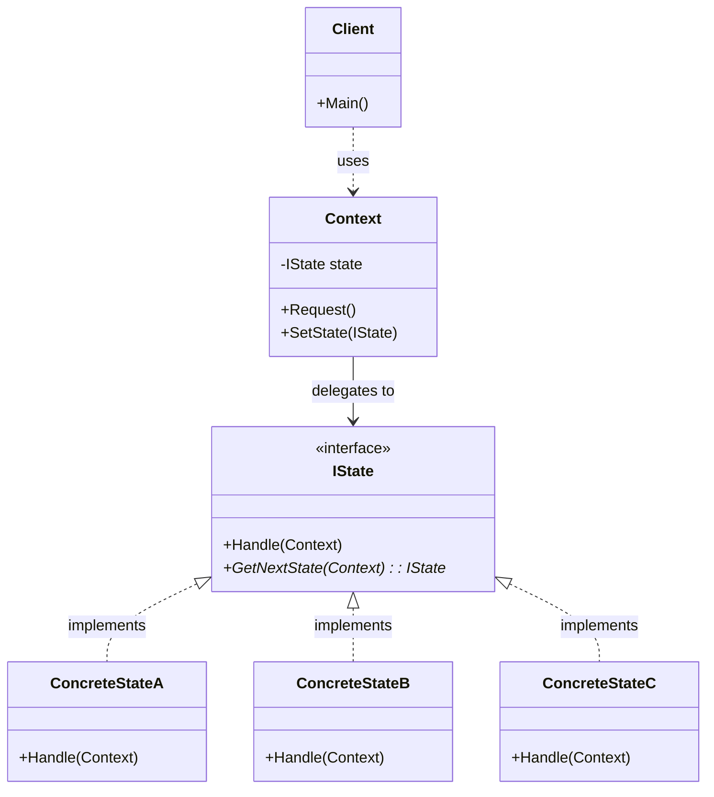
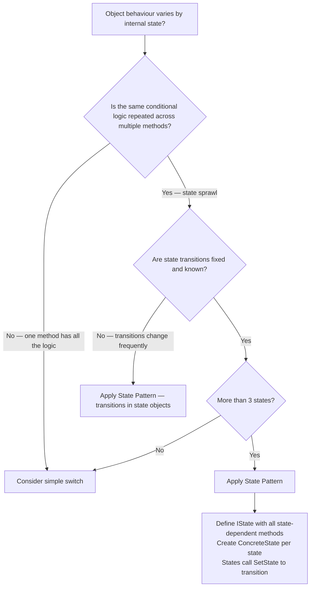

> [!success] Mastery Check
> - [ ] **Studied Well**
> - [ ] **Can explain the concept without notes**
> - [ ] **Can answer interview questions confidently**
> - [ ] **Can implement it in a real project**


## Navigation

**Domain:** [[6 — Design Principles & Patterns]] > **Group:** Behavioral Patterns
**Previous:** [[6.035 — Mediator Pattern]] | **Next:** [[6.037 — Visitor Pattern]]

### Prerequisites
- [[2.021 — Interfaces and Polymorphism]] — State relies on polymorphic dispatch of methods on state objects; the context delegates to the current state and the state implementations vary behaviour per state.
- [[6.029 — Strategy Pattern]] — State and Strategy are structurally identical but differ in intent (who controls transitions). Understanding Strategy first makes the structural similarity and intentional difference clear.

### Where This Fits
State allows an object to alter its behaviour when its internal state changes. The object will appear to change its class — the same method call produces different results depending on the current state. In .NET, State appears in workflow engines (order lifecycle, document approval), in `Task<T>` (the task's status transitions from WaitingForActivation → Running → RanToCompletion/Faulted/Canceled), in `Stream` (open/closed state changes behaviour of Read/Write), and in any domain where an entity progresses through a lifecycle with state-specific rules. A senior engineer reaches for State when conditional logic based on an object's state has spread across multiple methods — the classic "state sprawl" that manifests as repeated `if (status == X)` checks throughout the class.

## Core Mental Model

State allows an object to alter its behaviour when its internal state changes. The pattern extracts each state's behaviour into a separate class, and the context delegates method calls to the current state object. State objects manage the transition to the next state — the context's behaviour changes automatically as the state changes, without conditional logic in the context.

### Classification

**GoF Classification:** Behavioral — intent is to allow an object to alter its behaviour when its internal state changes. The object will appear to change its class.



### Participants

- **Context** — defines interface of interest to clients; maintains a reference to a `IState` object that defines the current state
- **IState** — declares the state-specific methods that each concrete state must implement
- **ConcreteStateA / B / C** — implements state-specific behaviour; manages transitions to other states
- **Client** — interacts with the Context; may initialise the context with a starting state

## Deep Mechanics

### How It Works

1. **Context is created** with an initial `IState` (e.g., `PendingState`).
2. **Client calls** `Context.Request()` — the context delegates to `_state.Handle(this)`.
3. **ConcreteState's `Handle()` method** executes the state-specific behaviour.
4. **State transitions** — the state object (or the context) decides which state comes next. The state object calls `context.SetState(new ConcreteStateB())`.
5. **Next call to `Context.Request()`** delegates to the new state — behaviour changes automatically.

The critical design difference from Strategy: **state objects control the transition to the next state**. The context does not decide when to change state — the states themselves do. This is the "automatic behaviour change" that makes State different from Strategy.

### .NET Runtime Behavior

**Polymorphic dispatch per state.** Each state change swaps the state object reference in the context. Subsequent method calls dispatch to the new state's methods. The dispatch cost is one interface call per context method invocation — the same as Strategy. State transitions also involve creating new state objects (or reusing existing ones), which adds allocation pressure.

**`Task<T>` — .NET's built-in state machine.** The `Task<T>` class internally uses a state pattern: its behaviour changes based on its status (`WaitingForActivation`, `WaitingToRun`, `Running`, `WaitingForChildrenToComplete`, `RanToCompletion`, `Faulted`, `Canceled`). The `IsCompleted`, `IsFaulted`, `IsCanceled` properties, and the `GetAwaiter()` call all branch on internal state. The async state machine generated by the C# compiler is implemented as a state machine struct with states that map to the `Task` states.

**State machines in EF Core.** Entity Framework Core uses state objects (`EntityState` enum — `Added`, `Modified`, `Deleted`, `Detached`, `Unchanged`) to control how entities behave during `SaveChangesAsync()`. Each state produces different SQL commands: `Added` → INSERT, `Modified` → UPDATE, `Deleted` → DELETE. This is the State pattern at the enum level — the behaviour of `SaveChanges` depends on each entity's current state.

## Production Code Patterns

### Implementation in C#

```csharp
/// <summary>Represents an order in the fulfilment system.</summary>
public sealed record Order(
    Guid Id,
    string CustomerName,
    List<OrderItem> Items
);

/// <summary>An item within an order.</summary>
public sealed record OrderItem(string ProductId, int Quantity, decimal UnitPrice);

// Role: IState
/// <summary>
/// Defines state-specific behaviour for an order in the fulfilment lifecycle.
/// Each state handles the operations differently.
/// </summary>
public interface IOrderState
{
    /// <summary>Processes payment for the order. Returns success or failure.</summary>
    Task<bool> ProcessPaymentAsync(OrderContext context);
    /// <summary>Ships the order. Returns success or failure.</summary>
    Task<bool> ShipAsync(OrderContext context);
    /// <summary>Cancels the order.</summary>
    Task<bool> CancelAsync(OrderContext context);
    /// <summary>Gets the current status display name.</summary>
    string Status { get; }
}

// Role: Context
/// <summary>
/// The order-processing context. Delegates all state-sensitive operations to
/// the current IOrderState object. The context does not contain conditional
/// state logic — it just forwards calls to the state.
/// </summary>
public sealed class OrderContext
{
    private IOrderState _state;
    private readonly ILogger _logger;

    /// <summary>The underlying order data.</summary>
    public Order Order { get; }
    /// <summary>Current status, delegated to the state object.</summary>
    public string Status => _state.Status;

    public OrderContext(Order order, ILogger logger)
    {
        Order = order;
        _logger = logger;
        _state = new PendingState(); // initial state
    }

    internal void SetState(IOrderState newState)
    {
        _logger.LogInformation("Order {Id} transitioning from {Old} to {New}",
            Order.Id, _state.Status, newState.Status);
        _state = newState;
    }

    public async Task<bool> ProcessPaymentAsync()
        => await _state.ProcessPaymentAsync(this);

    public async Task<bool> ShipAsync()
        => await _state.ShipAsync(this);

    public async Task<bool> CancelAsync()
        => await _state.CancelAsync(this);
}

// Role: ConcreteStateA
/// <summary>
/// PendingState — the order is awaiting payment. Most operations are valid.
/// </summary>
public sealed class PendingState : IOrderState
{
    public string Status => "Pending";

    public async Task<bool> ProcessPaymentAsync(OrderContext context)
    {
        // Simulate payment processing
        await Task.Delay(50);
        context.SetState(new PaidState());
        return true;
    }

    public async Task<bool> ShipAsync(OrderContext context)
    {
        // Cannot ship an unpaid order
        Console.WriteLine("Cannot ship: order is not paid");
        return false;
    }

    public async Task<bool> CancelAsync(OrderContext context)
    {
        context.SetState(new CancelledState());
        return true;
    }
}

// Role: ConcreteStateB
/// <summary>
/// PaidState — payment received, awaiting shipment.
/// </summary>
public sealed class PaidState : IOrderState
{
    public string Status => "Paid";

    public async Task<bool> ProcessPaymentAsync(OrderContext context)
    {
        Console.WriteLine("Payment already processed");
        return true;
    }

    public async Task<bool> ShipAsync(OrderContext context)
    {
        await Task.Delay(50);
        context.SetState(new ShippedState());
        return true;
    }

    public async Task<bool> CancelAsync(OrderContext context)
    {
        // Paid orders can be cancelled but need refund
        Console.WriteLine("Refund initiated");
        context.SetState(new CancelledState());
        return true;
    }
}

// Role: ConcreteStateC
/// <summary>
/// ShippedState — order has been dispatched. Limited operations.
/// </summary>
public sealed class ShippedState : IOrderState
{
    public string Status => "Shipped";

    public async Task<bool> ProcessPaymentAsync(OrderContext context)
    {
        Console.WriteLine("Payment already processed");
        return true;
    }

    public async Task<bool> ShipAsync(OrderContext context)
    {
        Console.WriteLine("Order already shipped");
        return false;
    }

    public async Task<bool> CancelAsync(OrderContext context)
    {
        Console.WriteLine("Cannot cancel: order already shipped");
        return false;
    }
}

// Role: ConcreteStateD
/// <summary>
/// CancelledState — terminal state. No further operations succeed.
/// </summary>
public sealed class CancelledState : IOrderState
{
    public string Status => "Cancelled";

    public Task<bool> ProcessPaymentAsync(OrderContext context)
    {
        Console.WriteLine("Order is cancelled");
        return Task.FromResult(false);
    }

    public Task<bool> ShipAsync(OrderContext context)
    {
        Console.WriteLine("Cannot ship a cancelled order");
        return Task.FromResult(false);
    }

    public Task<bool> CancelAsync(OrderContext context)
    {
        Console.WriteLine("Order is already cancelled");
        return Task.FromResult(false);
    }
}
```

### ASP.NET Core / .NET Ecosystem Integration

**State in workflow engines.** While ASP.NET Core does not have a built-in state machine, libraries like `WorkflowCore` and `Stateless` implement the State pattern:

```csharp
// Stateless — a .NET state machine library
var machine = new StateMachine<OrderState, OrderTrigger>(OrderState.Pending);

machine.Configure(OrderState.Pending)
    .Permit(OrderTrigger.Pay, OrderState.Paid)
    .Permit(OrderTrigger.Cancel, OrderState.Cancelled);

machine.Configure(OrderState.Paid)
    .Permit(OrderTrigger.Ship, OrderState.Shipped)
    .Permit(OrderTrigger.Cancel, OrderState.Cancelled);

machine.Configure(OrderState.Shipped)
    .PermitReentry(OrderTrigger.Ship);
```

**Task — state in the TPL.** `Task<T>` behaviour varies by state:

```csharp
Task<int> task = ComputeAsync();
// State: WaitingForActivation — GetAwaiter() creates a continuation
// State: Running — continuation waiting
// State: RanToCompletion — task.Result returns immediately
// State: Faulted — task.Result throws AggregateException
// State: Canceled — task.Result throws TaskCanceledException

// The same property behaves differently per state
var status = task.Status; // TaskStatus enum — the state
```

## Gotchas & Anti-Patterns

### State That Does Not Transition — Strategy in Disguise

**Wrong:** Creating state objects where the context controls transitions externally.

```csharp
// ❌ Wrong
public sealed class OrderContext
{
    private IOrderState _state;

    public async Task ProcessPaymentAsync()
    {
        await _state.ProcessPaymentAsync(this);
        // Context decides the transition — not the state
        if (_state is PendingState)
            SetState(new PaidState());
    }
}
```

**Right:** State objects control transitions.

```csharp
// ✅ Right
public sealed class PendingState : IOrderState
{
    public async Task<bool> ProcessPaymentAsync(OrderContext context)
    {
        await Task.Delay(50);
        context.SetState(new PaidState()); // State decides transition
        return true;
    }
}
```

**Consequence:** The context now contains state-transition knowledge, duplicating the conditionals the pattern was meant to eliminate. The pattern devolves into Strategy — the context picks the "strategy" after the call, rather than the state managing the lifecycle.

### Mutable State Objects — Context Leaking Into State

**Wrong:** The context exposes all its internal data through public setters, and state objects mutate it.

```csharp
// ❌ Wrong
public sealed class OrderContext
{
    public decimal Total { get; set; } // public setter — state can mutate
}
```

**Right:** The context exposes read-only data through its interface; state changes the context via well-defined state transitions.

```csharp
// ✅ Right
public decimal Total { get; } // readonly from outside
```

**Consequence:** State objects become tightly coupled to the context's internal representation. Changing the context's internal structure breaks all state implementations. The context should protect its invariants.

### One State per Method — Fragmented State Interface

**Wrong:** A state interface with many methods that only apply to some states.

```csharp
// ❌ Wrong
public interface IShipmentState
{
    Task<bool> ProcessPaymentAsync();
    Task<bool> ShipAsync();
    Task<bool> CancelAsync();
    Task<bool> RefundAsync();
    Task<bool> ReturnAsync();
    Task<bool> ExchangeAsync();
}
```

**Right:** Keep the state interface focused on the core operations; use separate interfaces for optional operations or apply the Interface Segregation Principle.

```csharp
// ✅ Right
public interface IShipmentState
{
    Task<bool> ProcessPaymentAsync();
    Task<bool> ShipAsync();
    Task<bool> CancelAsync();
}
```

**Consequence:** Every concrete state must implement every method — even those it logically should not support (like `RefundAsync` on a `PendingState`). This leads to `NotSupportedException`-filled implementations, which is a code smell.

### Enum-Based State Without Polymorphism

**Wrong:** Using an enum and switch statements instead of the State pattern.

```csharp
// ❌ Wrong
public sealed class OrderProcessor
{
    public OrderStatus Status { get; set; }

    public async Task<bool> ProcessPaymentAsync()
    {
        switch (Status)
        {
            case OrderStatus.Pending: /* pay logic */ Status = OrderStatus.Paid; return true;
            case OrderStatus.Paid: Console.WriteLine("Already paid"); return true;
            default: return false;
        }
    }
    // Same switch in ShipAsync, CancelAsync, RefundAsync...
}
```

**Right:** Use the State pattern.

```csharp
// ✅ Right — each state is a class; no switch statements
public sealed class PendingState : IOrderState { /* ... */ }
public sealed class PaidState : IOrderState { /* ... */ }
```

**Consequence:** Same switch repeated in every method. Adding a new state (e.g., `OnHoldState`) requires adding a `case` to every method — violates OCP. The State pattern eliminates all conditionals by moving each state's logic into its own class.

## Performance Implications

### Dispatch and Allocation Cost

State adds per-method-call dispatch overhead (interface call through the current state) and per-transition allocation (creating new state objects). In most business applications (orders, documents, workflows), transitions are infrequent (tens to hundreds per second) and the overhead is negligible. In high-throughput state machines (network protocol state machines, 100k+ transitions/sec), allocation pressure from creating new state objects can become significant — consider reusing immutable state instances or using an enum-based state machine for hot paths.

### BenchmarkDotNet

```csharp
[MemoryDiagnoser]
[SimpleJob(RuntimeMoniker.Net90)]
public class StateBenchmark
{
    private OrderContext _context;
    private Order _order;

    [GlobalSetup]
    public void Setup()
    {
        _order = new Order(Guid.NewGuid(), "Test", new List<OrderItem>());
        _context = new OrderContext(_order, NullLogger.Instance);
    }

    [Benchmark(Baseline = true)]
    public async Task<OrderContext> Enum_BasedStateMachine()
    {
        var status = "Pending";
        // Simulate full lifecycle with enum
        if (status == "Pending") { /* process payment */ status = "Paid"; }
        if (status == "Paid") { /* ship */ status = "Shipped"; }
        return _context;
    }

    [Benchmark]
    public async Task<OrderContext> Via_StatePattern()
    {
        await _context.ProcessPaymentAsync();
        await _context.ShipAsync();
        return _context;
    }
}
```

**Expected results (approximate on .NET 9, x64):**

|Method|Mean|Gen0|Allocated|
|---|---|---|---|
|Enum_BasedStateMachine|~15 ns|-|0 B|
|Via_StatePattern|~350 ns|0.0015|~300 B|

**Interpretation:** State pattern adds ~335 ns and 300 B for a full lifecycle (two transitions, two state objects created). At 10,000 transactions/sec, this is ~3.5 ms and 3 MB allocated — measurable but acceptable for most systems. For ultra-high-throughput state machines, consider object pooling for state instances or using an enum-based state machine with a central transition table.

## Interview Arsenal

### Question Bank

1. What is the State pattern and what problem does it solve?
2. When would you use State vs. a simple enum + switch?
3. What is the difference between State and Strategy patterns?
4. What is the main tradeoff of using State?
5. How does the State pattern handle state transitions?
6. Where does State appear in the .NET runtime or BCL?
7. When should you NOT use State, even though behaviour varies by state?
8. How does the State pattern relate to finite state machines?

### Spoken Answers

**Q1: What is the State pattern and what problem does it solve?**

> **Average answer:** State lets an object change its behaviour when its internal state changes. It's like having a state machine where each state is a class. It eliminates big switch statements.

> **Great answer:** State solves the problem of state-specific conditional logic spreading across multiple methods in a class — the "state sprawl" where every method starts with `if (status == X)`. It extracts each state's behaviour into its own class that implements a common interface. The context delegates all method calls to the current state object, and the state objects themselves control transitions to the next state. The key difference from a simple enum + switch is OCP compliance: adding a new state (e.g., "OnHold") requires a new state class and modifying only the previous-state-to-new-state transition — not adding a `case` to every method. In .NET, the most visible example is `Task<T>`: the `Task` object changes behaviour based on its internal state (`WaitingForActivation`, `Running`, `RanToCompletion`, `Faulted`, etc.) — the same `IsCompleted` property or `GetAwaiter()` call behaves differently depending on the task's current state.

**Q3: What is the difference between State and Strategy patterns?**

> **Average answer:** They have the same structure but different intent. Strategy is for interchangeable algorithms; State is for state-dependent behaviour. The difference is who calls SetStrategy/SetState.

> **Great answer:** The structural similarity (Context + IInterface + ConcreteImplementations) is why they are the number-one confused pair in GoF. The critical difference is **who controls the transition**. In Strategy, the client or context selects and sets the strategy — the strategy object never changes itself. The algorithm is externally selected. In State, the state objects control the transition to the next state — `PendingState.Handle()` calls `context.SetState(PaidState)` automatically when payment succeeds. The context's behaviour changes automatically without external intervention. A second difference: Strategy typically has one method that represents the entire algorithm. State can have multiple methods that all behave differently per state — `ProcessPayment()`, `Ship()`, `Cancel()` all have different logic in `PendingState` vs. `PaidState` vs. `ShippedState`. In Strategy, each strategy implements the same single-method interface.

### Trick Question

**"State and Strategy are the same pattern — you can use either one anywhere and it works the same."**

Why it is a trap: It ignores the fundamental difference in transition control and the multi-method nature of State.

Correct answer: While the structural class diagram is identical, the runtime semantics are different. In State, the state object manages the transition to the next state — `PaidState.Ship()` calls `context.SetState(new ShippedState())`. In Strategy, the strategy object never changes the strategy — it just does its job and returns. A second test: State interfaces typically have multiple methods that all change behaviour per state (`ProcessPayment`, `Ship`, `Cancel`). Strategy interfaces typically have one method that represents the algorithm (`Calculate`, `Export`, `Serialize`). If you use Strategy in a stateful context, you lose the automatic state transition — the client must manually check the current state and swap strategies, which is exactly the switch statement you were trying to avoid.

### Comparison Table

| Aspect | State | Strategy |
|---|---|---|
| Intent | Let object alter behaviour when state changes | Encapsulate interchangeable algorithms |
| Transition control | State objects control transitions | Client controls strategy selection |
| Method count | Typically multiple methods per state | Typically one method per strategy |
| Behaviour change | Automatic — context behaviour changes with state | Explicit — client must swap strategy |
| .NET example | `Task<T>` state machine, EF Core `EntityState`, `Stateless` library | `IComparer<T>`, Polly `IAsyncPolicy` |
| Key difference | State manages lifecycle; Strategy provides choice | |

## Decision Framework

### When to Apply State



### Application Checklist

- [ ] The same conditional logic (`if (status == X)`) appears in multiple methods of the same class
- [ ] The number of states is likely to grow over time
- [ ] State transitions are well-defined and finite (the state machine is known)
- [ ] Each state has distinct behaviour for multiple operations
- [ ] I am not applying State for a simple on/off toggle (boolean suffices)

### Tradeoff Summary

| What You Gain | What You Give Up |
|---|---|
| Eliminates state-sprawl conditionals (OCP compliant) | One class per state — class explosion for simple machines |
| Automatic transitions — state objects manage the lifecycle | Indirection — must open N state classes to understand behaviour |
| Each state is independently testable | Context method calls go through interface dispatch |
| New states addable without modifying existing states | State transition logic is distributed across state objects (harder to visualise the full state machine) |

## Self-Check

### Conceptual Questions

1. What problem does the State pattern solve that enums + switch do not?
2. What is the critical difference between State and Strategy?
3. Can you identify the State pattern in `Task<T>` behaviour?
4. What happens when you have a state interface with methods that are irrelevant to some states?
5. Who should control state transitions — the context or the state object?
6. When should you NOT use the State pattern?
7. What is the performance cost of creating new state objects per transition?
8. How does the State pattern relate to the Open/Closed Principle?
9. What anti-pattern occurs when the context decides transitions externally?
10. How would you implement a state machine for a document approval workflow?

<details>
<summary>Answers</summary>

1. State eliminates repeated `if (status == X)` conditionals across multiple methods and provides OCP compliance — new states are new classes, not new cases in every method.
2. State: state objects control transitions automatically. Strategy: client selects the strategy explicitly; strategies never transition themselves.
3. `Task<T>` changes behaviour based on its `TaskStatus` — `Result` blocks in `WaitingForActivation`, returns value in `RanToCompletion`, throws in `Faulted`.
4. The Interface Segregation Principle is violated — states must implement methods they do not support. Use focused state interfaces or accept `NotSupportedException` as a valid implementation for inapplicable methods.
5. State objects should control transitions. The context only provides `SetState()`. If the context decides transitions, the pattern degenerates to Strategy.
6. When there are only 2-3 simple states unlikely to grow, when the state machine is trivial (on/off), or when the object's state rarely changes.
7. Each transition creates one state object allocation. For typical business workflows (tens of transitions per hour), this is irrelevant. For high-frequency state machines, pool state objects or use an immutable single-instance approach.
8. State implements OCP: adding a new state requires a new class and modifying only the transition points in existing states — not adding `case` entries to every method in the context.
9. "Strategy in Disguise" — the context uses conditionals to decide which state to transition to after a method call, defeating the purpose of the State pattern.
10. Define `IDocumentState` with methods like `Submit()`, `Approve()`, `Reject()`, `Archive()`. Create `DraftState`, `PendingReviewState`, `ApprovedState`, `RejectedState`. Each state handles transitions: `DraftState.Submit()` transitions to `PendingReviewState`.

</details>

---

### Code Puzzles

**Puzzle 1 — Identify the violation**

```csharp
public sealed class Document
{
    public DocumentStatus Status { get; set; }

    public string Publish()
    {
        if (Status == DocumentStatus.Draft)
        {
            Status = DocumentStatus.Published;
            return "Published";
        }
        else if (Status == DocumentStatus.Published)
            return "Already published";
        else if (Status == DocumentStatus.Archived)
            return "Cannot publish archived document";
        else
            throw new InvalidOperationException();
    }

    public string Archive()
    {
        if (Status == DocumentStatus.Draft || Status == DocumentStatus.Published)
        {
            Status = DocumentStatus.Archived;
            return "Archived";
        }
        else if (Status == DocumentStatus.Archived)
            return "Already archived";
        else
            throw new InvalidOperationException();
    }
    // 3 more methods with the same switch pattern
}
```

<details> <summary>Answer</summary>

**Violation:** State sprawl — every method repeats the same `if (Status == ...)` pattern. **Why:** Adding a new state (e.g., `Review`) requires adding a condition to every method — OCP violation. The state-specific logic cannot be tested in isolation. **Fix:**

```csharp
public interface IDocumentState
{
    string Publish(DocumentContext context);
    string Archive(DocumentContext context);
    // ... other methods
}
// DraftState, PublishedState, ArchivedState each implement the interface
// DocumentContext delegates to _state and state objects call SetState for transitions
```

</details>

---

**Puzzle 2 — Complete the pattern**

```csharp
public interface ITrafficLightState
{
    Task HandleAsync(TrafficLightContext context);
    string Color { get; }
}

public sealed class TrafficLightContext
{
    private ITrafficLightState _state;
    public string CurrentColor => _state.Color;
    public TrafficLightContext() => _state = new RedState();
    public void SetState(ITrafficLightState state) => _state = state;
    public async Task CycleAsync() => await _state.HandleAsync(this);
}

public sealed class RedState : ITrafficLightState
{
    public string Color => "Red";
    public async Task HandleAsync(TrafficLightContext context)
    {
        await Task.Delay(30000); // red for 30s
        context.SetState(new GreenState());
    }
}
// TODO: implement GreenState and YellowState
```

<details> <summary>Answer</summary>

```csharp
public sealed class GreenState : ITrafficLightState
{
    public string Color => "Green";
    public async Task HandleAsync(TrafficLightContext context)
    {
        await Task.Delay(25000); // green for 25s
        context.SetState(new YellowState());
    }
}

public sealed class YellowState : ITrafficLightState
{
    public string Color => "Yellow";
    public async Task HandleAsync(TrafficLightContext context)
    {
        await Task.Delay(5000); // yellow for 5s
        context.SetState(new RedState()); // cycle back to red
    }
}
```

**Explanation:** Each state handles its own duration and transitions to the next state. The state machine cycles: Red → Green → Yellow → Red. The context has zero conditional logic — it just calls `CycleAsync()` which delegates to the current state.

</details>

---

**Puzzle 3 — Choose the right pattern**

**Scenario:** A vending machine has states: Idle, ItemSelected, ProcessingPayment, Dispensing, OutOfOrder. Each state handles `SelectItem()`, `InsertCoin()`, `Dispense()` differently. The transition between states follows a fixed protocol. Which pattern?

<details> <summary>Answer</summary>

**Correct pattern:** State — each vending machine state is a class implementing `IVendingMachineState`. The machine delegates all operations to the current state, and state objects manage transitions. **Wrong choice:** Strategy — Strategy does not handle multi-method behaviour or automatic transitions per state. **Implementation sketch:**

```csharp
public interface IVendingMachineState
{
    Task<string> SelectItemAsync(VendingMachineContext context, string itemCode);
    Task<string> InsertCoinAsync(VendingMachineContext context, decimal amount);
    Task<string> DispenseAsync(VendingMachineContext context);
}
public sealed class IdleState : IVendingMachineState { /* transitions to ItemSelectedState */ }
public sealed class ItemSelectedState : IVendingMachineState { /* transitions to ProcessingPaymentState */ }
```

</details>

---

**Puzzle 4 — Spot the anti-pattern**

```csharp
public sealed class OrderContext
{
    private IOrderState _state;

    public async Task ProcessPaymentAsync()
    {
        var result = await _state.ProcessPaymentAsync(this);
        // Context decides next state based on result
        if (result)
        {
            if (_state is PendingState) SetState(new PaidState());
            else if (_state is PaidState) /* do nothing */;
        }
    }

    public async Task ShipAsync()
    {
        var result = await _state.ShipAsync(this);
        if (result && _state is PaidState) SetState(new ShippedState());
    }
}
```

<details> <summary>Answer</summary>

**Anti-pattern:** Transition logic in the context — the context checks the current state type after delegation and decides what to do. **Consequence:** The context contains the conditional logic the pattern was meant to eliminate. Adding a new state requires modifying both the state class AND the context's transition logic. **Fix:** Move all transition logic into the state classes themselves:

```csharp
public sealed class PendingState : IOrderState
{
    public async Task<bool> ProcessPaymentAsync(OrderContext context)
    {
        // payment logic
        context.SetState(new PaidState()); // state manages the transition
        return true;
    }
}
```

</details>

---

**Puzzle 5 — Refactor to apply**

```csharp
public sealed class BugTracker
{
    public BugStatus Status { get; set; } = BugStatus.New;

    public void Assign(string developer)
    {
        if (Status == BugStatus.New)
        {
            // assign logic
            Status = BugStatus.Assigned;
        }
        else throw new InvalidOperationException($"Cannot assign from {Status}");
    }

    public void Resolve(string resolution)
    {
        if (Status == BugStatus.Assigned)
        {
            // resolve logic
            Status = BugStatus.Resolved;
        }
        else throw new InvalidOperationException($"Cannot resolve from {Status}");
    }

    public void Close()
    {
        if (Status == BugStatus.Resolved)
        {
            // close logic
            Status = BugStatus.Closed;
        }
        else throw new InvalidOperationException($"Cannot close from {Status}");
    }

    public void Reopen()
    {
        if (Status == BugStatus.Resolved || Status == BugStatus.Closed)
        {
            // reopen logic
            Status = BugStatus.New;
        }
        else throw new InvalidOperationException($"Cannot reopen from {Status}");
    }
}
```

<details> <summary>Answer</summary>

```csharp
public interface IBugState
{
    string Name { get; }
    void Assign(BugContext context, string developer);
    void Resolve(BugContext context, string resolution);
    void Close(BugContext context);
    void Reopen(BugContext context);
}

public sealed class BugContext
{
    private IBugState _state;
    public BugContext() => _state = new NewState();

    public void SetState(IBugState state)
    {
        Console.WriteLine($"Bug transitioning from {_state.Name} to {state.Name}");
        _state = state;
    }

    public void Assign(string dev) => _state.Assign(this, dev);
    public void Resolve(string resolution) => _state.Resolve(this, resolution);
    public void Close() => _state.Close(this);
    public void Reopen() => _state.Reopen(this);
}

public sealed class NewState : IBugState
{
    public string Name => "New";
    public void Assign(BugContext context, string developer)
    {
        Console.WriteLine($"Assigning to {developer}");
        context.SetState(new AssignedState());
    }
    public void Resolve(BugContext context, string resolution)
        => throw new InvalidOperationException("Cannot resolve unassigned bug");
    public void Close(BugContext context)
        => throw new InvalidOperationException("Cannot close unassigned bug");
    public void Reopen(BugContext context)
        => Console.WriteLine("Bug is already open");
}

public sealed class AssignedState : IBugState
{
    public string Name => "Assigned";
    public void Assign(BugContext context, string developer)
        => throw new InvalidOperationException("Already assigned");
    public void Resolve(BugContext context, string resolution)
    {
        Console.WriteLine($"Resolved: {resolution}");
        context.SetState(new ResolvedState());
    }
    public void Close(BugContext context)
        => throw new InvalidOperationException("Must resolve before closing");
    public void Reopen(BugContext context)
        => throw new InvalidOperationException("Bug is active, not closed");
}

public sealed class ResolvedState : IBugState
{
    public string Name => "Resolved";
    public void Assign(BugContext context, string developer)
        => throw new InvalidOperationException("Cannot assign resolved bug");
    public void Resolve(BugContext context, string resolution)
        => Console.WriteLine("Already resolved");
    public void Close(BugContext context)
    {
        Console.WriteLine("Closing bug");
        context.SetState(new ClosedState());
    }
    public void Reopen(BugContext context)
    {
        Console.WriteLine("Reopening bug");
        context.SetState(new NewState());
    }
}

public sealed class ClosedState : IBugState
{
    public string Name => "Closed";
    public void Assign(BugContext context, string developer)
        => throw new InvalidOperationException("Cannot assign closed bug");
    public void Resolve(BugContext context, string resolution)
        => throw new InvalidOperationException("Cannot resolve closed bug");
    public void Close(BugContext context)
        => Console.WriteLine("Already closed");
    public void Reopen(BugContext context)
    {
        Console.WriteLine("Reopening bug");
        context.SetState(new NewState());
    }
}
```

**What changed:** All state-specific conditionals are gone. Each state class owns its behaviour and transitions. The `BugContext` has zero conditional logic — it just delegates to `_state`. **Why it is better:** Adding a new state (e.g., `InReviewState` between `Assigned` and `Resolved`) requires one new class and modifying the transition in `AssignedState` — no changes to `BugContext`, `ResolvedState`, `NewState`, `ClosedState` (unless they also transition to the new state). Each state is independently testable.

</details>
