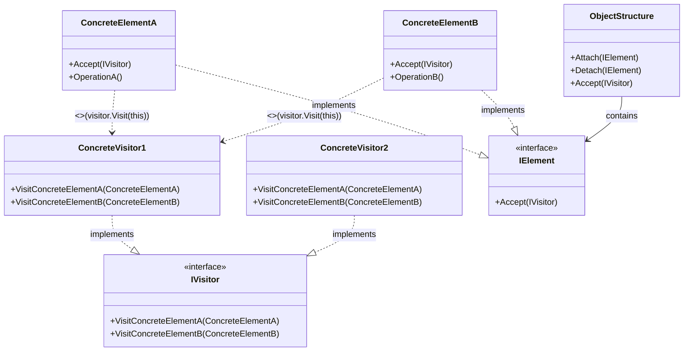
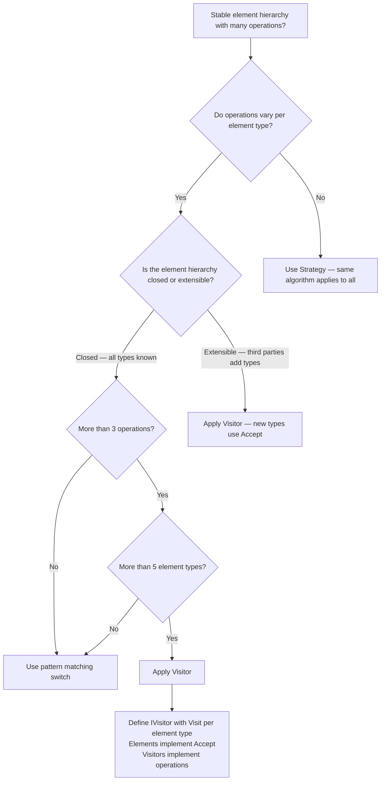

> [!success] Mastery Check
> - [ ] **Studied Well**
> - [ ] **Can explain the concept without notes**
> - [ ] **Can answer interview questions confidently**
> - [ ] **Can implement it in a real project**


## Navigation

**Domain:** [[6 — Design Principles & Patterns]] > **Group:** Behavioral Patterns
**Previous:** [[6.036 — State Pattern]] | **Next:** [[6.038 — Code Smell Catalog — Bloaters]]

### Prerequisites
- [[2.027 — Pattern Matching and Switch Expressions]] — C# pattern matching (`switch` expressions, `is` patterns, type patterns) provides a language-native alternative to Visitor for closed type hierarchies; understanding both is essential for choosing between them.
- [[6.027 — Composite Pattern]] — Visitor is most useful when traversing Composite structures; the two patterns are often used together.

### Where This Fits
Visitor lets you define a new operation on a set of object classes without changing the classes themselves. It separates the algorithm from the object structure by placing the algorithm in a visitor object that "visits" each element. In .NET, Visitor appears in expression tree traversal (`ExpressionVisitor`), in `JsonSerializer` (the serializer visits the object graph), in compiler code analysis (Roslyn syntax tree visitors), and in any scenario where you need to add operations to a stable class hierarchy without modifying the classes. A senior engineer uses Visitor when the object structure is stable (few new element types) but the operations on it are frequently added — the exact inverse of the typical OCP scenario.

## Core Mental Model

Visitor represents an operation to be performed on the elements of an object structure. It lets you define a new operation without changing the classes of the elements on which it operates. The pattern uses **double dispatch** — the operation executed depends on both the type of the visitor and the type of the element being visited.

### Classification

**GoF Classification:** Behavioral — intent is to represent an operation to be performed on the elements of an object structure. Visitor lets you define a new operation without changing the classes of the elements on which it operates.



### Participants

- **IVisitor** — interface declaring `Visit` operations for each concrete element type in the object structure
- **ConcreteVisitor1 / 2** — implements each `Visit` operation to define the algorithm for that element type
- **IElement** — interface declaring `Accept(IVisitor)` that takes a visitor as an argument
- **ConcreteElementA / B** — implements `Accept` by calling the visitor's appropriate `Visit` method (`visitor.Visit(this)`)
- **ObjectStructure** — can enumerate its elements; may provide a high-level `Accept` method

## Deep Mechanics

### How It Works

1. **Client creates** a ConcreteVisitor (e.g., `ExportVisitor`).
2. **Client calls** `objectStructure.Accept(visitor)` which iterates through its elements.
3. **Each element calls** `visitor.Visit(this)` — note that `this` is the concrete element type, not the `IElement` interface.
4. **The CLR resolves** the `Visit` method based on the **compile-time type** of `this` — which is the concrete element's type (because `Accept` is defined in the concrete class, not called through the interface).
5. **The visitor executes** the algorithm specific to that element type.

This is **double dispatch**: the first dispatch is `element.Accept(visitor)` (resolves to concrete element), and the second is `visitor.Visit(concreteElement)` (resolves to the correct overload for that element type). C# usually uses single dispatch (virtual method dispatch on one type). Visitor accomplishes double dispatch through this two-call pattern.

### .NET Runtime Behavior

**Double dispatch via virtual methods.** When `ConcreteElementA.Accept(visitor)` calls `visitor.Visit(this)`, the C# compiler resolves the overload at compile time based on the static type of `this`. Since `this` is typed as `ConcreteElementA` inside its own class, the compiler calls `Visit(ConcreteElementA)` — not `Visit(IElement)`. The CLR then dispatches the virtual method call to `ConcreteVisitor.Visit(ConcreteElementA)`. This is the key trick that makes Visitor work in statically typed languages.

**ExpressionVisitor — Visitor in the .NET BCL.** `System.Linq.Expressions.ExpressionVisitor` is the standard .NET Visitor for expression trees. It has `Visit` methods for each expression type (`VisitBinary`, `VisitConstant`, `VisitMethodCall`, etc.):

```csharp
public sealed class ParameterReplacer : ExpressionVisitor
{
    private readonly ParameterExpression _oldParam;
    private readonly Expression _newExpr;

    public ParameterReplacer(ParameterExpression oldParam, Expression newExpr)
    {
        _oldParam = oldParam;
        _newExpr = newExpr;
    }

    protected override Expression VisitParameter(ParameterExpression node)
        => node == _oldParam ? _newExpr : base.VisitParameter(node);
}
```

**C# pattern matching — alternative to Visitor.** In modern C#, you can often replace Visitor with a switch expression using type patterns:

```csharp
// Instead of a Visitor class:
string Describe(Shape shape) => shape switch
{
    Circle c => $"Circle with radius {c.Radius}",
    Rectangle r => $"Rectangle {r.Width}x{r.Height}",
    Triangle t => $"Triangle with sides {t.SideA}, {t.SideB}, {t.SideC}",
    _ => "Unknown shape"
};
```

This avoids the boilerplate of double dispatch when the element hierarchy is closed. Use Visitor when you want to keep the option of adding new operations without adding classes to the hierarchy, or when the hierarchy is defined in third-party code.

## Production Code Patterns

### Implementation in C#

```csharp
/// <summary>Types of financial instruments.</summary>
public abstract record FinancialInstrument(string Ticker, decimal MarketPrice);

public sealed record Stock(string Ticker, decimal MarketPrice, int SharesOutstanding)
    : FinancialInstrument(Ticker, MarketPrice);

public sealed record Bond(string Ticker, decimal MarketPrice, decimal CouponRate, DateTime MaturityDate)
    : FinancialInstrument(Ticker, MarketPrice);

public sealed record Option(string Ticker, decimal MarketPrice, decimal StrikePrice, DateTime ExpiryDate)
    : FinancialInstrument(Ticker, MarketPrice);

// Role: IVisitor
/// <summary>
/// Defines visit operations for each type of financial instrument.
/// Each visitor implements a specific analysis or reporting algorithm.
/// </summary>
public interface IFinancialInstrumentVisitor<out T>
{
    /// <summary>Visits a Stock instrument.</summary>
    T VisitStock(Stock stock);
    /// <summary>Visits a Bond instrument.</summary>
    T VisitBond(Bond bond);
    /// <summary>Visits an Option instrument.</summary>
    T VisitOption(Option option);
}

// Role: IElement
/// <summary>
/// Interface for all financial instruments that can accept a visitor.
/// </summary>
public interface IInstrumentVisitable
{
    /// <summary>Accepts a visitor and returns the result.</summary>
    T Accept<T>(IFinancialInstrumentVisitor<T> visitor);
}

// Role: ConcreteElementA
public sealed record Stock(string Ticker, decimal MarketPrice, int SharesOutstanding)
    : FinancialInstrument(Ticker, MarketPrice), IInstrumentVisitable
{
    public T Accept<T>(IFinancialInstrumentVisitor<T> visitor)
        => visitor.VisitStock(this); // double dispatch: passes concrete type
}

// Role: ConcreteElementB
public sealed record Bond(string Ticker, decimal MarketPrice, decimal CouponRate, DateTime MaturityDate)
    : FinancialInstrument(Ticker, MarketPrice), IInstrumentVisitable
{
    public T Accept<T>(IFinancialInstrumentVisitor<T> visitor)
        => visitor.VisitBond(this);
}

// Role: ConcreteElementC
public sealed record Option(string Ticker, decimal MarketPrice, decimal StrikePrice, DateTime ExpiryDate)
    : FinancialInstrument(Ticker, MarketPrice), IInstrumentVisitable
{
    public T Accept<T>(IFinancialInstrumentVisitor<T> visitor)
        => visitor.VisitOption(this);
}

// Role: ConcreteVisitor1
/// <summary>
/// Computes the risk-adjusted value of each instrument type.
/// </summary>
public sealed class RiskAdjustedValueVisitor : IFinancialInstrumentVisitor<decimal>
{
    private const decimal EquityRiskFactor = 1.2m;
    private const decimal BondRiskFactor = 0.3m;
    private const decimal OptionRiskFactor = 2.0m;

    public decimal VisitStock(Stock stock)
        => stock.MarketPrice * EquityRiskFactor;

    public decimal VisitBond(Bond bond)
        => bond.MarketPrice - (bond.MarketPrice * bond.CouponRate * BondRiskFactor);

    public decimal VisitOption(Option option)
    {
        var intrinsicValue = Math.Max(0, option.MarketPrice - option.StrikePrice);
        return intrinsicValue * OptionRiskFactor;
    }
}

// Role: ConcreteVisitor2
/// <summary>
/// Generates a human-readable report for each instrument type.
/// </summary>
public sealed class InstrumentReportVisitor : IFinancialInstrumentVisitor<string>
{
    public string VisitStock(Stock stock)
        => $"[STOCK] {stock.Ticker}: ${stock.MarketPrice:F2} | Shares: {stock.SharesOutstanding:N0}";

    public string VisitBond(Bond bond)
        => $"[BOND] {bond.Ticker}: ${bond.MarketPrice:F2} | Coupon: {bond.CouponRate:P2} | Matures: {bond.MaturityDate:d}";

    public string VisitOption(Option option)
    {
        var moneyness = option.MarketPrice >= option.StrikePrice ? "ITM" : "OTM";
        return $"[OPTION] {option.Ticker}: ${option.MarketPrice:F2} | Strike: ${option.StrikePrice:F2} | {moneyness}";
    }
}

// Role: ObjectStructure
/// <summary>
/// A portfolio of financial instruments that can accept visitors.
/// </summary>
public sealed class Portfolio
{
    private readonly List<IInstrumentVisitable> _instruments = new();

    public void Add(IInstrumentVisitable instrument) => _instruments.Add(instrument);

    /// <summary>Applies a visitor to all instruments in the portfolio.</summary>
    public List<T> AcceptAll<T>(IFinancialInstrumentVisitor<T> visitor)
        => _instruments.Select(i => i.Accept(visitor)).ToList();
}
```

### ASP.NET Core / .NET Ecosystem Integration

**ExpressionVisitor — Visitor in the BCL.** The `System.Linq.Expressions.ExpressionVisitor` class is the canonical .NET Visitor. It visits every node in an expression tree, allowing you to inspect or transform expressions:

```csharp
public sealed class EfCoreQueryOptimizer : ExpressionVisitor
{
    // Visits specific expression types and transforms them for EF Core
    protected override Expression VisitBinary(BinaryExpression node)
    {
        if (node.NodeType == ExpressionType.Equal &&
            node.Left is MemberExpression member &&
            node.Right is ConstantExpression constant)
        {
            // Transform equality check for EF Core translation
        }
        return base.VisitBinary(node);
    }

    protected override Expression VisitMethodCall(MethodCallExpression node)
    {
        if (node.Method.Name == "Where" && node.Method.DeclaringType == typeof(Enumerable))
        {
            // Replace Enumerable.Where with Queryable.Where for EF Core
        }
        return base.VisitMethodCall(node);
    }
}
```

**Roslyn SyntaxVisitor — Visitor for C# code analysis:** The Roslyn compiler API uses Visitor extensively. `CSharpSyntaxVisitor<TResult>` has `Visit` methods for every syntax node type:

```csharp
public sealed class MethodFinder : CSharpSyntaxWalker
{
    private readonly string _methodName;

    public MethodFinder(string methodName) => _methodName = methodName;

    public override void VisitMethodDeclaration(MethodDeclarationSyntax node)
    {
        if (node.Identifier.Text == _methodName)
        {
            Console.WriteLine($"Found method {_methodName} at line {node.GetLocation().GetLineSpan()}");
        }
        base.VisitMethodDeclaration(node);
    }
}
```

**C# pattern matching as a Visitor alternative.** For closed type hierarchies, pattern matching can replace Visitor:

```csharp
// Pattern matching alternative to the Visitor above
public static decimal ComputeRisk(FinancialInstrument instrument)
    => instrument switch
    {
        Stock s => s.MarketPrice * 1.2m,
        Bond b => b.MarketPrice - (b.MarketPrice * b.CouponRate * 0.3m),
        Option o => Math.Max(0, o.MarketPrice - o.StrikePrice) * 2.0m,
        _ => throw new ArgumentOutOfRangeException(nameof(instrument))
    };
```

## Gotchas & Anti-Patterns

### Adding New Element Types Requires Changing All Visitors

**Wrong:** Adding a new element type (e.g., `Future`) requires modifying every existing visitor.

```csharp
// ❌ Wrong — adding Future forces all visitors to implement VisitFuture
public interface IFinancialInstrumentVisitor<T>
{
    T VisitStock(Stock stock);
    T VisitBond(Bond bond);
    T VisitOption(Option option);
    T VisitFuture(Future future); // new method — breaks all existing visitors
}
```

**Right:** Use Visitor only when the element hierarchy is stable. If element types change frequently, use pattern matching instead.

```csharp
// ✅ Right — pattern matching handles new types with a default case
decimal ComputeRisk(FinancialInstrument instrument) => instrument switch
{
    Stock s => s.MarketPrice * 1.2m,
    Bond b => b.MarketPrice - (b.MarketPrice * b.CouponRate * 0.3m),
    Option o => Math.Max(0, o.MarketPrice - o.StrikePrice) * 2.0m,
    Future f => f.Price * 1.5m, // just add a case
    _ => throw new ArgumentOutOfRangeException(nameof(instrument))
};
```

**Consequence:** Visitor suffers from the "element hierarchy change" problem — the exact inverse of OCP. Adding a new element type breaks every existing visitor. This is why Visitor is appropriate only when the element hierarchy is stable and operations change frequently.

### Using Visitor When a Simple Switch Would Suffice

**Wrong:** Implementing Visitor for 2-3 element types with 1-2 operations.

```csharp
// ❌ Wrong — too much boilerplate for a simple operation
public interface IShapeVisitor<T> { T VisitCircle(Circle c); T VisitRectangle(Rectangle r); }
public interface IShapeVisitable { T Accept<T>(IShapeVisitor<T> visitor); }
// ... 6 boilerplate files
```

**Right:** Use a switch expression for simple cases.

```csharp
// ✅ Right
decimal ComputeArea(Shape shape) => shape switch
{
    Circle c => Math.PI * c.Radius * c.Radius,
    Rectangle r => r.Width * r.Height,
    _ => throw new ArgumentOutOfRangeException(nameof(shape))
};
```

**Consequence:** Visitor introduces significant boilerplate (IVisitor interface, IElement interface, Accept in each element, ConcreteVisitor class) that is only justified when you have many operations to add to a stable element hierarchy.

### Forgetting the Double Dispatch Trick

**Wrong:** Calling `element.Accept(visitor)` through the `IElement` interface (which works) but implementing `Accept` incorrectly by passing the interface type.

```csharp
// ❌ Wrong — single dispatch only
public void Accept(IVisitor visitor) => visitor.Visit((IElement)this);
// Now the visitor's Visit(IElement) is called, not Visit(ConcreteElementA)
```

**Right:** `Accept` must pass the concrete type to the visitor.

```csharp
// ✅ Right — double dispatch
public void Accept(IVisitor visitor) => visitor.Visit(this); // this is typed as ConcreteElementA
```

**Consequence:** Without the concrete type in the visitor call, the visitor receives the `IElement` interface and cannot distinguish between element types. The visitor must then use `if (element is ConcreteElementA)` — defeating the purpose of the pattern.

### Visitor That Accumulates State Incorrectly

**Wrong:** A visitor that accumulates mutable state across visits without resetting.

```csharp
// ❌ Wrong
public sealed class TotalValueVisitor : IVisitor
{
    public decimal Total { get; private set; } // mutable, not reset between visits
    public void Visit(Stock s) => Total += s.MarketPrice;
    public void Visit(Bond b) => Total += b.MarketPrice;
}
```

**Right:** Return the accumulated result or take a clear accumulator parameter.

```csharp
// ✅ Right — visitor returns result per element, accumulation is the caller's responsibility
public sealed class ValueVisitor : IFinancialInstrumentVisitor<decimal>
{
    public decimal VisitStock(Stock s) => s.MarketPrice;
    public decimal VisitBond(Bond b) => b.MarketPrice;
    public decimal VisitOption(Option o) => o.MarketPrice;
}
// Accumulation: portfolio.AcceptAll(visitor).Sum()
```

**Consequence:** Reusing the visitor across multiple object structures gives incorrect accumulated values because the internal state was not reset. This is especially dangerous in multi-threaded scenarios.

## Performance Implications

### Dispatch and Allocation Cost

Visitor involves two virtual dispatch calls per element: `Accept()` and `Visit()`. For a structure of N elements and one visitor, this is 2N virtual dispatch calls. In addition, each visitor object adds allocation overhead. For typical object graphs (hundreds to thousands of elements), this is negligible. For massive graphs (millions of elements in expression tree compilation), the overhead can be significant — consider using a `switch` expression (which compiles to a type-checking chain) for hot paths.

### BenchmarkDotNet

```csharp
[MemoryDiagnoser]
[SimpleJob(RuntimeMoniker.Net90)]
public class VisitorBenchmark
{
    private List<IInstrumentVisitable> _portfolio;
    private RiskAdjustedValueVisitor _visitor;

    [GlobalSetup]
    public void Setup()
    {
        _portfolio = Enumerable.Range(0, 1000)
            .Select<int, IInstrumentVisitable>(i => i % 3 switch
            {
                0 => new Stock($"STK{i}", 100m + i, 1_000_000),
                1 => new Bond($"BND{i}", 100m + i, 0.05m, DateTime.Now.AddYears(5)),
                _ => new Option($"OPT{i}", 100m + i, 110m, DateTime.Now.AddMonths(3))
            }).ToList();
        _visitor = new RiskAdjustedValueVisitor();
    }

    [Benchmark(Baseline = true)]
    public List<decimal> PatternMatching_Switch()
    {
        return _portfolio.Select(i => i switch
        {
            Stock s => s.MarketPrice * 1.2m,
            Bond b => b.MarketPrice - (b.MarketPrice * b.CouponRate * 0.3m),
            Option o => Math.Max(0, o.MarketPrice - o.StrikePrice) * 2.0m,
            _ => throw new ArgumentOutOfRangeException()
        }).ToList();
    }

    [Benchmark]
    public List<decimal> Visitor_Pattern()
    {
        return _portfolio.Select(i => i.Accept(_visitor)).ToList();
    }
}
```

**Expected results (approximate on .NET 9, x64):**

|Method|Mean|Gen0|Allocated|
|---|---|---|---|
|PatternMatching_Switch|~8,000 ns|0.0300|~8 KB|
|Visitor_Pattern|~12,000 ns|0.0400|~10 KB|

**Interpretation:** Visitor adds ~50% overhead over pattern matching for 1,000 elements due to the double dispatch. At element-level granularity, each element costs ~12 ns via pattern matching vs. ~12 ns via visitor — barely measurable per element. For most business scenarios (portfolio analysis, document processing), this overhead is irrelevant. For compiler-scale processing (millions of syntax nodes), pattern matching may be significantly faster if the JIT can optimise the type-checking chain.

## Interview Arsenal

### Question Bank

1. What is the Visitor pattern and what problem does it solve?
2. What is double dispatch and why does Visitor need it?
3. What is the difference between Visitor and Strategy patterns?
4. When is Visitor the wrong choice, even when you need to add operations?
5. How does C# pattern matching provide an alternative to Visitor?
6. Where does Visitor appear in the .NET BCL?
7. What happens when you add a new element type to a hierarchy that uses Visitor?
8. How does ExpressionVisitor use the Visitor pattern in .NET?

### Spoken Answers

**Q1: What is the Visitor pattern and what problem does it solve?**

> **Average answer:** Visitor lets you add new operations to a class hierarchy without changing the classes. The visitor object visits each element and performs the operation. It uses double dispatch.

> **Great answer:** Visitor solves the problem of adding new operations to a stable class hierarchy without modifying the classes themselves. It achieves this through **double dispatch** — two virtual calls: `element.Accept(visitor)` dispatches to the correct element type, and then `visitor.Visit(this)` (where `this` has the concrete type) dispatches to the correct overload for that element. This works because inside `ConcreteElementA.Accept()`, the type of `this` is `ConcreteElementA`, so the compiler resolves `visitor.Visit(ConcreteElementA)` — not `visitor.Visit(IElement)`. The tradeoff is that Visitor makes it easy to add new operations (new visitor class) but hard to add new element types (must update every visitor). This is the inverse of the typical OCP scenario. In .NET, the canonical example is `ExpressionVisitor` in `System.Linq.Expressions` — you can traverse and transform expression trees without modifying the expression node classes. Roslyn's `CSharpSyntaxVisitor` is another major example, with `Visit` methods for every syntax node type in the C# grammar.

**Q3: What is the difference between Visitor and Strategy patterns?**

> **Average answer:** Strategy encapsulates algorithms; Visitor encapsulates operations on a class hierarchy. They are different patterns with different purposes.

> **Great answer:** The key difference is **what varies** and **the scope**. Strategy encapsulates a single algorithm that applies to one type — the strategy receives an input of a known type and produces an output. The variation is in how the algorithm works. Visitor encapsulates an operation that applies to **multiple types** in a hierarchy — the visitor has a separate method for each type, and the operation varies per type. In Strategy, you swap the algorithm externally (client picks it). In Visitor, you pass the visitor to the element and the element decides which visitor method to call via double dispatch. A practical test: if your operation needs to behave differently based on the runtime type of the input, and you have many different operations to apply, Visitor might fit. If you have one operation with different implementations for the same type, use Strategy. In .NET: `IComparer<T>` is Strategy — one type, many comparison algorithms. `ExpressionVisitor` is Visitor — many expression node types, one traversal operation.

### Trick Question

**"C# pattern matching with a switch expression is a perfect replacement for Visitor — you never need the Visitor pattern in modern C#."**

Why it is a trap: Pattern matching works perfectly for closed hierarchies (all types known at compile time), but Visitor allows third-party or dynamically discovered types to participate.

Correct answer: For closed hierarchies where all element types are known at compile time, pattern matching IS a simpler alternative to Visitor — it requires less boilerplate and performs similarly. However, Visitor supports **open hierarchies**: if element types can be added in third-party assemblies, those assemblies can implement `IElement` and their `Accept()` will call the visitor's `Visit` method for their type. Pattern matching cannot handle a type it does not know about at compile time. Additionally, Visitor supports **accumulating context** across visits more naturally — a visitor object holds state across the traversal of an object graph. Pattern matching in a `switch` requires the accumulator to be external. The rule of thumb: if you control the entire element hierarchy and it is unlikely to grow, use pattern matching. If the hierarchy is extensible by third parties (plugin scenarios, framework extensibility), use Visitor.

### Comparison Table

| Aspect | Visitor | Strategy |
|---|---|---|
| Intent | Represent an operation on elements of an object structure | Encapsulate interchangeable algorithms |
| Scope | Multiple element types (one method per type) | Single type (one method per strategy) |
| Dispatch | Double dispatch (element + visitor) | Single dispatch (interface call) |
| Variation adds | New visitor class = new operation | New strategy class = new algorithm |
| Cost of change | Easy to add operations; hard to add element types | Easy to add algorithms; same type always |
| .NET example | `ExpressionVisitor`, Roslyn `CSharpSyntaxVisitor` | `IComparer<T>`, Polly `IAsyncPolicy` |
| Key difference | Visitor operates on many types; Strategy operates on one | |

## Decision Framework

### When to Apply Visitor



### Application Checklist

- [ ] The element hierarchy is stable — new element types are rarely added
- [ ] Multiple unrelated operations need to be applied to the hierarchy
- [ ] The hierarchy is defined in a library that third parties extend (plugin/extensibility scenario)
- [ ] The double dispatch mechanism is understood and correctly implemented
- [ ] There are enough element types and operations that pattern matching would become unwieldy (rule of thumb: >4 types AND >3 operations)

### Tradeoff Summary

| What You Gain | What You Give Up |
|---|---|
| Operations separated from element classes — no modification to elements | Adding a new element type breaks all visitors |
| Each operation is a cohesive class (SRP) | Boilerplate: IVisitor, IElement, Accept per element |
| Double dispatch enables type-safe operation per element | More complex than pattern matching for simple cases |
| Visitor can hold accumulated state across traversal | Visitors with mutable state are not thread-safe across concurrent traversals |

## Self-Check

### Conceptual Questions

1. What problem does the Visitor pattern solve?
2. What is double dispatch and why does Visitor require it?
3. How does C# achieve double dispatch in Visitor?
4. What is the difference between Visitor and Strategy?
5. When is it easier to add a new operation in Visitor?
6. When is it harder to add a new element type in Visitor?
7. How does C# pattern matching provide an alternative to Visitor?
8. What happens if an element's `Accept` method calls `visitor.Visit((IElement)this)` instead of `visitor.Visit(this)`?
9. Where does Visitor appear in the .NET BCL?
10. When should you choose pattern matching over Visitor?

<details>
<summary>Answers</summary>

1. Visitor lets you define new operations on a class hierarchy without modifying the classes, by placing the operations in visitor objects that use double dispatch.
2. Double dispatch is the ability to invoke a method that depends on the runtime types of TWO objects (the element and the visitor). Normal OOP languages only support single dispatch (the runtime type of one object).
3. C# achieves double dispatch through the `Accept` pattern: `ConcreteElement.Accept(visitor)` calls `visitor.Visit(this)`. Inside the concrete element's method, `this` is typed as the concrete type, so the compiler resolves the correct overload.
4. Visitor operates on multiple element types (one method per type); Strategy operates on a single type with one algorithm per strategy class.
5. Adding a new operation = creating a new visitor class that implements `IVisitor`. No existing code needs to change.
6. Adding a new element type = adding a new `Visit` method to the `IVisitor` interface and implementing it in every existing visitor. This breaks OCP for the element hierarchy.
7. Pattern matching with `switch` expressions can replace Visitor for closed hierarchies: `shape switch { Circle c => ..., Rectangle r => ... }` eliminates the double dispatch boilerplate.
8. The visitor's `Visit(IElement)` method is called instead of `Visit(ConcreteElement)`. The visitor loses type-specific information and must use `is` or `switch` internally to distinguish types.
9. `System.Linq.Expressions.ExpressionVisitor` (expression tree traversal) and Roslyn's `CSharpSyntaxVisitor` (C# code analysis).
10. Choose pattern matching when the element hierarchy is closed (all types known at compile time), the hierarchy is small (<5 types), or the number of operations is small (<3). Choose Visitor when the hierarchy is extensible by third parties or when you have many operations on many types.

</details>

---

### Code Puzzles

**Puzzle 1 — Identify the violation**

```csharp
public interface IShape
{
    double Accept(IVisitor visitor);
}

public class Circle : IShape
{
    public double Radius { get; set; }
    public double Accept(IVisitor visitor) => visitor.Visit((IShape)this); // ❌
}

public interface IVisitor
{
    double Visit(IShape shape); // single Visit method — how to distinguish types?
}
```

<details> <summary>Answer</summary>

**Violation:** Missing double dispatch — `Accept` casts `this` to `IShape`, so the visitor always receives `IShape` and cannot determine the concrete type. The `IVisitor` has only one `Visit(IShape)` method instead of overloads per type. **Why:** The visitor must use `if (shape is Circle)` to distinguish types, defeating the purpose of the pattern. **Fix:**

```csharp
public interface IShapeVisitor<T>
{
    T VisitCircle(Circle circle);
    T VisitRectangle(Rectangle rectangle);
}

public class Circle : IShapeVisitable
{
    public double Radius { get; set; }
    public T Accept<T>(IShapeVisitor<T> visitor) => visitor.VisitCircle(this); // double dispatch
}
```

</details>

---

**Puzzle 2 — Complete the pattern**

```csharp
public interface IEmployeeVisitor<T>
{
    T VisitDeveloper(Developer dev);
    T VisitManager(Manager mgr);
    // TODO: add VisitIntern
}

public interface IEmployeeVisitable
{
    T Accept<T>(IEmployeeVisitor<T> visitor);
}

public sealed record Developer(string Name, decimal Salary, string ProgrammingLanguage)
    : IEmployeeVisitable
{
    public T Accept<T>(IEmployeeVisitor<T> visitor) => visitor.VisitDeveloper(this);
}

public sealed record Manager(string Name, decimal Salary, int DirectReports)
    : IEmployeeVisitable
{
    public T Accept<T>(IEmployeeVisitor<T> visitor) => visitor.VisitManager(this);
}

// TODO: add Intern type that implements IEmployeeVisitable and supports visitors
```

<details> <summary>Answer</summary>

```csharp
// Step 1: Add VisitIntern to the visitor interface
public interface IEmployeeVisitor<T>
{
    T VisitDeveloper(Developer dev);
    T VisitManager(Manager mgr);
    T VisitIntern(Intern intern);
}

// Step 2: Create the Intern record
public sealed record Intern(string Name, decimal Stipend, string University)
    : IEmployeeVisitable
{
    public T Accept<T>(IEmployeeVisitor<T> visitor) => visitor.VisitIntern(this);
}

// Step 3: Update all concrete visitors to implement VisitIntern
public sealed class PayrollVisitor : IEmployeeVisitor<decimal>
{
    public decimal VisitDeveloper(Developer dev) => dev.Salary;
    public decimal VisitManager(Manager mgr) => mgr.Salary;
    public decimal VisitIntern(Intern intern) => intern.Stipend; // new method
}
```

**Explanation:** Adding a new element type (`Intern`) requires: (1) adding a new method to the visitor interface, (2) implementing `IEmployeeVisitable` on the new type with `Accept` calling the correct overload, and (3) updating every existing visitor to implement the new method. This is the cost of using Visitor — adding element types is expensive.

</details>

---

**Puzzle 3 — Choose the right pattern**

**Scenario:** You have a stable hierarchy of 8 document types (Invoice, Report, Contract, Letter, Memo, Proposal, InvoiceTemplate, Receipt). You need to add 6 new operations (ExportToPdf, ExportToHtml, ComputeWordCount, AnalyzeSentiment, Encrypt, GeneratePreview). The document types almost never change, but new export formats are added every quarter. Which pattern?

<details> <summary>Answer</summary>

**Correct pattern:** Visitor — the element hierarchy is stable (8 types, rarely changes), and many operations need to be added over time (6+ operations). Each operation becomes a visitor class. Adding a new export format requires a new visitor class — no changes to document types. **Wrong choice:** Pattern matching — pattern matching works but the switch expression would become large (8 arms × 6 operations = 48 arms spread across 6 methods), and each new operation is a new method somewhere, not a cohesive class. **Implementation sketch:**

```csharp
public interface IDocumentVisitor<T> { T VisitInvoice(Invoice doc); T VisitReport(Report doc); /* ... 6 more */ }
public sealed class PdfExportVisitor : IDocumentVisitor<byte[]> { /* export logic per type */ }
public sealed class HtmlExportVisitor : IDocumentVisitor<byte[]> { /* export logic per type */ }
```

</details>

---

**Puzzle 4 — Spot the anti-pattern**

```csharp
public sealed class ShapeCalculationVisitor : IShapeVisitor<double>
{
    public double TotalArea { get; private set; }
    public int ShapeCount { get; private set; }

    public double VisitCircle(Circle c)
    {
        TotalArea += Math.PI * c.Radius * c.Radius;
        ShapeCount++;
        return TotalArea;
    }

    public double VisitRectangle(Rectangle r)
    {
        TotalArea += r.Width * r.Height;
        ShapeCount++;
        return TotalArea;
    }
}

// Used as:
var visitor = new ShapeCalculationVisitor();
foreach (var shape in shapes) shape.Accept(visitor);
var area = visitor.TotalArea; // depends on visit order and repeated calls
```

<details> <summary>Answer</summary>

**Anti-pattern:** Mutable visitor with side effects — the visitor accumulates `TotalArea` but also returns a value whose meaning changes after each visit. **Consequence:** If `AcceptAll` is called twice, the second call doubles the total. Multi-threaded use corrupts the state. The return value of `Visit` is mixed (sometimes `TotalArea` after visit X, sometimes not). **Fix:** Make visitor methods pure — return the element's contribution and let the caller accumulate:

```csharp
public sealed class AreaVisitor : IShapeVisitor<double>
{
    public double VisitCircle(Circle c) => Math.PI * c.Radius * c.Radius;
    public double VisitRectangle(Rectangle r) => r.Width * r.Height;
}
// Usage: var totalArea = shapes.Select(s => s.Accept(areaVisitor)).Sum();
```

</details>

---

**Puzzle 5 — Refactor to apply**

```csharp
// Multiple switch expressions spread across different methods
public static class ShapeOperations
{
    public static double GetArea(Shape shape) => shape switch
    {
        Circle c => Math.PI * c.Radius * c.Radius,
        Rectangle r => r.Width * r.Height,
        Triangle t => 0.5 * t.Base * t.Height,
        _ => throw new ArgumentOutOfRangeException(nameof(shape))
    };

    public static string Describe(Shape shape) => shape switch
    {
        Circle c => $"Circle: radius {c.Radius}",
        Rectangle r => $"Rectangle: {r.Width}x{r.Height}",
        Triangle t => $"Triangle: base {t.Base}, height {t.Height}",
        _ => throw new ArgumentOutOfRangeException(nameof(shape))
    };

    public static string Serialize(Shape shape) => shape switch
    {
        Circle c => $"<circle r=\"{c.Radius}\"/>",
        Rectangle r => $"<rect w=\"{r.Width}\" h=\"{r.Height}\"/>",
        Triangle t => $"<triangle b=\"{t.Base}\" h=\"{t.Height}\"/>",
        _ => throw new ArgumentOutOfRangeException(nameof(shape))
    };
}
```

<details> <summary>Answer</summary>

```csharp
// Visitor approach — each operation is a cohesive class
public interface IShapeVisitor<T>
{
    T VisitCircle(Circle circle);
    T VisitRectangle(Rectangle rect);
    T VisitTriangle(Triangle triangle);
}

public interface IShapeVisitable
{
    T Accept<T>(IShapeVisitor<T> visitor);
}

public sealed record Circle(double Radius) : IShapeVisitable
{
    public T Accept<T>(IShapeVisitor<T> visitor) => visitor.VisitCircle(this);
}

public sealed record Rectangle(double Width, double Height) : IShapeVisitable
{
    public T Accept<T>(IShapeVisitor<T> visitor) => visitor.VisitRectangle(this);
}

public sealed record Triangle(double Base, double Height) : IShapeVisitable
{
    public T Accept<T>(IShapeVisitor<T> visitor) => visitor.VisitTriangle(this);
}

// Concrete visitors — each is a cohesive class
public sealed class AreaVisitor : IShapeVisitor<double>
{
    public double VisitCircle(Circle c) => Math.PI * c.Radius * c.Radius;
    public double VisitRectangle(Rectangle r) => r.Width * r.Height;
    public double VisitTriangle(Triangle t) => 0.5 * t.Base * t.Height;
}

public sealed class DescribeVisitor : IShapeVisitor<string>
{
    public string VisitCircle(Circle c) => $"Circle: radius {c.Radius}";
    public string VisitRectangle(Rectangle r) => $"Rectangle: {r.Width}x{r.Height}";
    public string VisitTriangle(Triangle t) => $"Triangle: base {t.Base}, height {t.Height}";
}

public sealed class SerializeVisitor : IShapeVisitor<string>
{
    public string VisitCircle(Circle c) => $"<circle r=\"{c.Radius}\"/>";
    public string VisitRectangle(Rectangle r) => $"<rect w=\"{r.Width}\" h=\"{r.Height}\"/>";
    public string VisitTriangle(Triangle t) => $"<triangle b=\"{t.Base}\" h=\"{t.Height}\"/>";
}
```

**What changed:** Each shape operation moved from a static method with a switch expression to a dedicated visitor class. The switch expressions are still present but now distributed across visitor classes — one class per operation. **Why it is better:** Adding a new operation (e.g., `RenderSvgVisitor`) requires a new class — no modification to existing code (OCP). Adding a new shape type (e.g., `Ellipse`) requires adding a method to the visitor interface and implementing it in every visitor — the tradeoff is explicit. Each operation is independently testable and cohesive. The visitor pattern makes the operations first-class citizens of the design.

</details>
