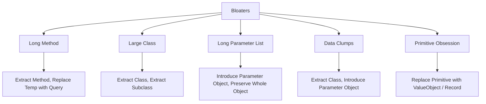
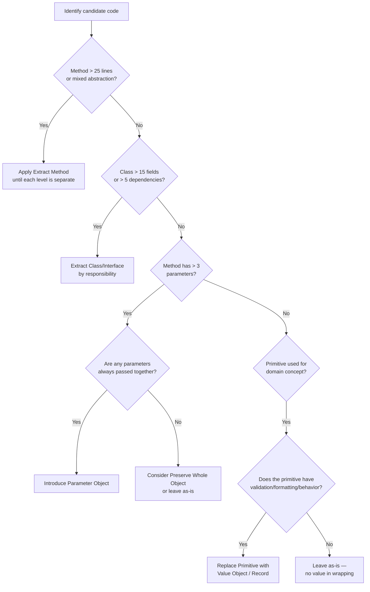

> [!success] Mastery Check
> - [ ] **Studied Well**
> - [ ] **Can explain the concept without notes**
> - [ ] **Can answer interview questions confidently**
> - [ ] **Can implement it in a real project**


## Navigation
**Domain:** [[6 — Design Principles & Patterns]] > **Group:** Refactoring
**Previous:** [[6.037 — Visitor]] | **Next:** [[6.039 — Couplers]]
### Prerequisites
- [[6.001 — Single Responsibility Principle]] — every bloater is an SRP violation at the method, class, or parameter level.
### Where This Fits
Bloaters are code elements — methods, classes, parameter lists, and data structures — that have grown beyond their optimal size, making them hard to reason about, test, and change. This catalog covers the five most common bloating smells in .NET codebases: Long Method, Large Class, Long Parameter List, Data Clumps, and Primitive Obsession. A senior engineer must be able to spot these in code review and apply the composing-methods and moving-features refactorings that deflate them.

---

## Core Mental Model
Bloaters are accumulative debt. Each new feature adds "just one more" parameter, field, or line of logic until the method or class becomes a bottleneck where defects cluster, merge conflicts spike, and no single developer fully understands the code.

### Dimensions


1. **Long Method** — A method exceeding 20–30 lines where every line is at the same level of abstraction, making it impossible to grasp in one screen.
2. **Large Class** — A class with >15–20 fields or methods, especially when it references more than 5–6 dependencies, violating SRP.
3. **Long Parameter List** — A method with >3 parameters, especially when many share prefixes or are structurally related.
4. **Data Clumps** — The same group of data items appearing together across multiple methods or classes (e.g., `street`, `city`, `zip` always passed together).
5. **Primitive Obsession** — Using `string`, `int`, `decimal`, or `Guid` to represent domain concepts that have their own behavior, validation, or formatting rules.

---

## Deep Mechanics
### How It Works

**Long Method:** The most subjective yet most critical smell. A method is "long" when it operates at multiple levels of abstraction — mixing high-level intent with low-level implementation details. Extract Method is the primary cure: each extracted method should capture one level of abstraction, and the original method should read as a table of contents.

**Large Class:** A class that has too many instance variables, too many dependencies injected, or too many unrelated behaviors. The classic signal: you can't describe the class in one sentence without using "and". Extract Class, Extract Interface, and Extract Subclass are the refactorings.

**Long Parameter List:** Parameters that should be grouped into objects. The smell is strongest when parameters are always passed together (a Data Clump) or when they share a common prefix like `customerName`, `customerEmail`, `customerPhone`.

**Data Clumps:** The same 3+ data items appear as parameters, fields, or local variables across multiple methods. Extract Class or Introduce Parameter Object collapses the clump into a single abstraction.

**Primitive Obsession:** Using primitives for domain concepts. A `string Email` is a primitive; an `EmailAddress` value object with a validation constructor is a domain concept. The cost is scattered validation logic, formatting code, and parsing checks duplicated across the codebase.

### Why It Matters at Scale
In a 500K+ LOC codebase, a single 300-line method is referenced by 20+ callers. Every bug fix requires reading 300 lines to understand context. Every merge conflicts because multiple devs touched different parts of the same method. Large classes cause constructor injection bloat — a class with 12 dependencies suggests it should be 3 classes.

---

## Production Code Patterns
### Implementation in C#

**Long Method — Before:**
```csharp
// ❌ Before: 150-line method with mixed abstraction levels
public async Task<OrderConfirmation> ProcessOrderAsync(Order order)
{
    // Validate order
    if (order == null) throw new ArgumentNullException(nameof(order));
    if (order.Items.Count == 0) throw new InvalidOperationException("Empty order");
    foreach (var item in order.Items)
    {
        if (item.Quantity <= 0) throw new InvalidOperationException("Invalid quantity");
        if (item.Price < 0) throw new InvalidOperationException("Negative price");
        var available = await _inventoryRepo.GetStockAsync(item.Sku);
        if (available < item.Quantity)
            throw new InvalidOperationException($"Insufficient stock for {item.Sku}");
    }

    // Apply discounts
    decimal discount = 0;
    if (order.CouponCode != null)
    {
        var coupon = await _couponRepo.GetByCodeAsync(order.CouponCode);
        if (coupon.ExpiresAt < DateTime.UtcNow)
            throw new InvalidOperationException("Coupon expired");
        if (coupon.MinOrderAmount > order.Items.Sum(i => i.Price * i.Quantity))
            throw new InvalidOperationException("Minimum not met");
        discount = order.CouponCode switch
        {
            "SAVE10" => order.Items.Sum(i => i.Price * i.Quantity) * 0.10m,
            "SAVE20" => order.Items.Sum(i => i.Price * i.Quantity) * 0.20m,
            _ => 0m
        };
    }

    // Calculate totals
    var subtotal = order.Items.Sum(i => i.Price * i.Quantity);
    var tax = subtotal * 0.08m;
    var shipping = order.ShippingMethod switch
    {
        "Standard" => 5.99m,
        "Express" => 14.99m,
        _ => 9.99m
    };
    var total = subtotal - discount + tax + shipping;

    // Process payment
    var paymentResult = await _paymentGateway.ChargeAsync(
        order.PaymentToken, total, order.Currency);
    if (!paymentResult.Success)
        throw new PaymentFailedException(paymentResult.ErrorMessage);

    // Build confirmation
    var confirmation = new OrderConfirmation
    {
        OrderId = Guid.NewGuid(),
        Subtotal = subtotal,
        Discount = discount,
        Tax = tax,
        Shipping = shipping,
        Total = total,
        PaymentTransactionId = paymentResult.TransactionId
    };

    await _orderRepo.SaveAsync(confirmation);
    await _emailDispatcher.SendOrderConfirmationAsync(order.CustomerEmail, confirmation);
    return confirmation;
}
```

**Long Method — After:**
```csharp
// ✅ After: Decomposed into single-level methods
public async Task<OrderConfirmation> ProcessOrderAsync(Order order)
{
    await ValidateOrderAsync(order);
    var discount = await CalculateDiscountAsync(order);
    var totals = CalculateTotals(order, discount);
    var payment = await ProcessPaymentAsync(order.PaymentToken, totals.Total, order.Currency);
    var confirmation = BuildConfirmation(order, totals, payment);
    await _orderRepo.SaveAsync(confirmation);
    await _emailDispatcher.SendOrderConfirmationAsync(order.CustomerEmail, confirmation);
    return confirmation;
}

private async Task ValidateOrderAsync(Order order)
{
    ArgumentNullException.ThrowIfNull(order);
    if (order.Items.Count == 0)
        throw new InvalidOperationException("Order must contain at least one item.");
    foreach (var item in order.Items)
    {
        if (item.Quantity <= 0)
            throw new InvalidOperationException($"Item {item.Sku} has invalid quantity.");
        var available = await _inventoryRepo.GetStockAsync(item.Sku);
        if (available < item.Quantity)
            throw new InvalidOperationException($"Insufficient stock for {item.Sku}.");
    }
}

private async Task<decimal> CalculateDiscountAsync(Order order)
{
    if (order.CouponCode is null) return 0m;
    var coupon = await _couponRepo.GetByCodeAsync(order.CouponCode);
    if (coupon.ExpiresAt < DateTime.UtcNow)
        throw new InvalidOperationException("Coupon has expired.");
    var subtotal = order.Items.Sum(i => i.Price * i.Quantity);
    if (coupon.MinOrderAmount > subtotal)
        throw new InvalidOperationException("Minimum order amount not met.");
    return coupon.Apply(subtotal);
}

private static OrderTotals CalculateTotals(Order order, decimal discount)
{
    var subtotal = order.Items.Sum(i => i.Price * i.Quantity);
    var tax = Math.Round(subtotal * 0.08m, 2);
    var shipping = ShippingCalculator.Estimate(order.ShippingMethod);
    return new OrderTotals(subtotal, discount, tax, shipping);
}
```

**Large Class — Before:**
```csharp
// ❌ Before: 25+ fields, 8 dependencies, handles orders + invoices + customers
public class OrderService
{
    private readonly IOrderRepository _orderRepo;
    private readonly IInvoiceRepository _invoiceRepo;
    private readonly ICustomerRepository _customerRepo;
    private readonly IInventoryRepository _inventoryRepo;
    private readonly IPaymentGateway _paymentGateway;
    private readonly IEmailDispatcher _emailDispatcher;
    private readonly ICouponRepository _couponRepo;
    private readonly IShippingCalculator _shippingCalculator;
    private readonly IAuditLogger _auditLogger;

    public async Task<OrderConfirmation> ProcessOrderAsync(Order order) { /* ... */ }
    public async Task<Invoice> GenerateInvoiceAsync(Guid orderId) { /* ... */ }
    public async Task<Customer> UpdateCustomerProfileAsync(CustomerProfile profile) { /* ... */ }
    public async Task<bool> CheckInventoryAsync(string sku, int quantity) { /* ... */ }
    public async Task SendMarketingEmailAsync(Guid customerId, string template) { /* ... */ }
}
```

**Large Class — After:**
```csharp
// ✅ After: SRP-compliant classes extracted
public class OrderProcessingService
{
    private readonly IOrderRepository _orderRepo;
    private readonly IInventoryRepository _inventoryRepo;

    public async Task<OrderConfirmation> ProcessOrderAsync(Order order) { /* ... */ }
}

public class InvoiceGenerator
{
    private readonly IInvoiceRepository _invoiceRepo;

    public async Task<Invoice> GenerateInvoiceAsync(Guid orderId) { /* ... */ }
}

public class CustomerProfileService
{
    private readonly ICustomerRepository _customerRepo;

    public async Task<Customer> UpdateCustomerProfileAsync(CustomerProfile profile) { /* ... */ }
}
```

**Long Parameter List — Before:**
```csharp
// ❌ Before: 7 parameters, many are related
public async Task<Shipment> CreateShipmentAsync(
    string street, string city, string state, string zip,
    string carrier, string serviceLevel, bool isSignatureRequired)
```

**Long Parameter List — After:**
```csharp
// ✅ After: Parameter objects group related data
public record Address(string Street, string City, string State, string Zip);
public record ShippingPreferences(string Carrier, string ServiceLevel, bool SignatureRequired);

public async Task<Shipment> CreateShipmentAsync(
    Address destination, ShippingPreferences preferences)
```

**Data Clumps — Before:**
```csharp
// ❌ Before: (startDate, endDate) appears in 12 methods
public async Task<List<Order>> GetOrdersByDateAsync(DateTime startDate, DateTime endDate) { /* ... */ }
public async Task<Report> GenerateReportAsync(DateTime startDate, DateTime endDate) { /* ... */ }
public async Task<decimal> CalculateRevenueAsync(DateTime startDate, DateTime endDate) { /* ... */ }
```

**Data Clumps — After:**
```csharp
// ✅ After: Extracted into a single abstraction
public readonly record struct DateRange(DateTime Start, DateTime End)
{
    public bool Contains(DateTime date) => date >= Start && date <= End;
    public int TotalDays => (End - Start).Days + 1;
}

public async Task<List<Order>> GetOrdersByDateAsync(DateRange range) { /* ... */ }
public async Task<Report> GenerateReportAsync(DateRange range) { /* ... */ }
public async Task<decimal> CalculateRevenueAsync(DateRange range) { /* ... */ }
```

**Primitive Obsession — Before:**
```csharp
// ❌ Before: string for email, no validation guarantee
public class Customer
{
    public string Email { get; set; }  // Is it validated? Format? Normalized?
}
```

**Primitive Obsession — After:**
```csharp
// ✅ After: Value object ensures validity on construction
public readonly record struct EmailAddress
{
    public string Value { get; }

    public EmailAddress(string value)
    {
        if (string.IsNullOrWhiteSpace(value))
            throw new ArgumentException("Email cannot be empty.", nameof(value));
        if (!value.Contains('@') || !value.Contains('.'))
            throw new ArgumentException("Invalid email format.", nameof(value));
        Value = value.ToLowerInvariant().Trim();
    }

    public override string ToString() => Value;
}

public class Customer
{
    public EmailAddress Email { get; init; }
}
```

### ASP.NET Core / .NET Ecosystem Integration

**Long Method in Controllers:** Action methods exceeding 30 lines that mix validation, mapping, business logic, and response formatting. The fix: move business logic to application services, keep controllers thin.

```csharp
// ❌ Bloated controller action
[HttpPost]
public async Task<IActionResult> CreateOrder(OrderRequest request)
{
    if (request == null) return BadRequest();
    // 40+ lines of validation, mapping, processing, email sending...
}

// ✅ Thin controller
[HttpPost]
public async Task<IActionResult> CreateOrder(OrderRequest request, [FromServices] IOrderProcessingService service)
{
    var result = await service.ProcessAsync(request);
    return result.ToActionResult();
}
```

**Primitive Obsession in EF Core:** Using `string` for IDs, status codes, or enums when `ValueConverter` could map value objects to database columns.

```csharp
// ✅ EF Core ValueConverter for value object
public class EmailAddressConverter : ValueConverter<EmailAddress, string>
{
    public EmailAddressConverter()
        : base(email => email.Value, value => new EmailAddress(value)) { }
}

// In DbContext
protected override void ConfigureConventions(ModelConfigurationBuilder configurationBuilder)
{
    configurationBuilder.Properties<EmailAddress>().HaveConversion<EmailAddressConverter>();
}
```

**Long Parameter List in MediatR:** Handlers with many injected services suggest the handler does too much. The cure: split into multiple handlers or use pipeline behaviors for cross-cutting concerns.

---

## Gotchas & Anti-Patterns
### Extracting Too Aggressively

**Wrong:** Extracting every 3-line block into its own method, creating a class with 80 private methods.
**Right:** Extract at natural abstraction boundaries — when the extracted code answers a single question or performs a single transformation. The original method should read as a table of contents with 3–7 steps.
**Consequence:** Over-extraction inflates class surface area and makes the primary flow harder to follow. Navigate the balance between "too long" and "too many tiny methods."

### Parameter Object Over-Use

**Wrong:** Creating a parameter object for every method with 2+ parameters, even when the parameters are unrelated (e.g., `(string connectionString, int timeoutSeconds)` — unrelated and unlikely to travel together).
**Right:** Introduce a parameter object only when parameters are conceptually related (a data clump) or when the same group appears across multiple method signatures.
**Consequence:** Wrapping unrelated parameters into an object just moves the complexity; it doesn't reduce it. You now have a class to maintain and a new type for future developers to learn.

### Primitive Wrapping Without Behavior

**Wrong:** Wrapping `string CustomerId` in a `CustomerId` record that stores a `string` and does nothing else — a wrapper with zero value.
**Right:** A value object should enforce validation, provide formatting, implement equality, and encapsulate behavior (e.g., `EmailAddress` validates format, `Money` handles currency conversion).
**Consequence:** Empty wrappers bloat the codebase without returning value. The primitive smell is not about the type being a `string`; it's about scattered validation and formatting logic. If the primitive has none of that, leave it as a primitive.

### Large Class via DI Constructor Bloat

**Wrong:** A class with 8+ constructor parameters that are each used for entirely unrelated purposes.
**Right:** Split into multiple services. Use facade or aggregation services only when orchestration is the actual responsibility.
**Consequence:** A class with 10+ dependencies is untestable — every test setup requires mocking 10 interfaces. It also signals that the class violates SRP: it does too many things.

### Confusing Long Method with Complex Algorithm

**Wrong:** Refactoring a naturally complex algorithm (e.g., a cryptographic routine) into 15 tiny methods, making the overall logic harder to follow.
**Right:** Long methods are allowed when the algorithm is inherently sequential and operates at a single level of abstraction. Complex algorithms benefit from well-named local variables and comments, not decomposition into meaningless helpers.
**Consequence:** Forcing Extract Method on inherently sequential code destroys locality. A developer needs to mentally reassemble the scattered pieces to understand the algorithm.

### Data Clump When Data Is Incidental

**Wrong:** Extracting a `PageInfo` object just because `skip` and `take` appear together in two methods.
**Right:** Create the clump object only when the group has invariant meaning (e.g., `Address`, `DateRange`, `Money`) — meaning the fields are always used together and the group has its own behavior.
**Consequence:** Incidental clump extraction creates artificial abstractions that don't map to the domain, confusing future developers who need to understand why `skip` and `take` are bundled.

---

## Performance Implications
### Maintenance Cost Model
| Scenario | Defect Probability | Change Impact | Onboarding Cost |
|---|---|---|---|
| Long method extracted to 3–5 small methods | Low | Isolated | Low |
| Long method left at 150+ lines | High | Cascading — one change breaks unrelated flow | High |
| Large class with 8+ dependencies | High | High — fear of touching it | High |
| Large class decomposed into single-responsibility services | Low | Isolated | Low |
| Primitives replaced with validated value objects | Low | Local | Low |
| Primitives used throughout (>100 occurrences) | High — invalid state propagates | High — validation scattered everywhere | High |

**No benchmark data:** Bloat has no measurable runtime performance cost. The cost is entirely in maintenance velocity, defect density, and developer cognitive load. A 150-line method takes ~3x longer to review than 3 × 50-line methods because the reviewer must hold more context.

---

## Interview Arsenal
### Question Bank
1. "How do you identify a Long Method in production code?"
2. "When would you NOT extract a long method?"
3. "What is the relationship between Large Class and SRP?"
4. "Describe a real refactoring where you extracted a class from a blob. What was the trigger and the outcome?"
5. "What is Primitive Obsession and when is it harmful?"
6. "How do Data Clumps differ from Long Parameter Lists?"
7. "What is the 'wrong' way to fix Primitive Obsession?"
8. "How does Long Parameter List appear in ASP.NET Core action methods and how would you fix it?"

### Spoken Answers

> **Q1: How do you identify a Long Method in production code?**
>
> **Average answer:** A method is long when it has more than 20 lines. You identify it by counting lines.
>
> **Great answer:** Line count is a heuristic, not a rule. A method is long when it operates at multiple levels of abstraction — mixing high-level policy (e.g., "validate the order") with low-level implementation (e.g., "parse the date string using this format"). I identify long methods in code review by looking for methods where I need to scroll to understand them, where there are multiple `foreach` and `if` blocks vertically stacked, or where the method name uses "and" (e.g., `ValidateAndProcessAndNotify`). In .NET I also look at constructor parameter counts: if a service constructor has 6+ parameters, the class is likely bloated and its methods are probably long.

> **Q3: What is the relationship between Large Class and SRP?**
>
> **Average answer:** A large class violates SRP because it has too many responsibilities.
>
> **Great answer:** More precisely, a large class is the *structural manifestation* of an SRP violation. SRP says "a class should have one reason to change." A large class — one with 20+ fields, 8+ dependencies, or methods that operate on different subsets of those fields — inherently has multiple reasons to change. For example, an `OrderService` that validates orders, generates invoices, sends emails, and updates inventory changes whenever any of those rules evolve. The refactoring path is Extract Class: each extracted class gets one set of related fields, one dependency subset, and one change reason. After extraction, the original class becomes an orchestrator or is eliminated entirely.

### Trick Question
**"Is a 50-line method always a Long Method that needs extraction?"**
Why it is a trap: it conflates line count with abstraction-level mixing. Correct answer: Not necessarily. A 50-line method that operates at a single level of abstraction — for example, a data transformation pipeline where each step is clearly named and the flow reads sequentially — is fine. The problem is not line count alone; it's the presence of multiple levels of abstraction within the same method. A 15-line method that mixes high-level business logic and bit-level parsing is worse than a 50-line method that reads as a clear narrative.

### Comparison Table
| Aspect | Bloaters | Couplers |
|---|---|---|
| Intent | Identify code that has grown too large | Identify code that is too tightly coupled |
| Smells covered | Long Method, Large Class, Long Parameter List, Data Clumps, Primitive Obsession | Feature Envy, Inappropriate Intimacy, Message Chains, Middle Man, Switch Statements |
| When to use | During code review or when a change feels disproportionately hard | During code review or when a change in one class forces changes in many others |
| .NET example | ASP.NET Core controller with 150-line action method | Service that accesses `order.Customer.Address.City` (Message Chain) |
| Key difference | Focuses on *size* — methods, classes, parameters that are too big | Focuses on *coupling* — how classes interact and depend on each other |

---

## Decision Framework



### Application Checklist
- [ ] Can each method be described in one sentence without "and" or "then"?
- [ ] Does each class have a single clear responsibility and a name that reflects it?
- [ ] Are all related parameters grouped into parameter objects or value objects?
- [ ] Do any 3+ fields appear together across multiple method signatures or classes?
- [ ] Are domain concepts (email, money, date range, phone, currency) represented as types with validation and behavior?
- [ ] Would a new team member understand the high-level flow of a method without reading every line?

### Tradeoff Summary
| What You Gain | What You Give Up |
|---|---|
| Each method is understandable in one screen | More files and methods to navigate |
| Classes have clear responsibilities | More abstractions to learn |
| Parameters are self-documenting via types | Parameter object definitions add indirection |
| Domain rules are encapsulated in value objects | Slightly more allocation for value object instances |
| Lower merge conflict probability | Refactoring effort upfront |

---

## Self-Check
### Conceptual Questions
1. What is the single best heuristic for identifying a Long Method?
2. Why is a class with 10 constructor dependencies almost certainly a Large Class?
3. How do you distinguish a valid Data Clump from an incidental grouping?
4. What is the minimum viable behavior a value object should have to justify replacing a primitive?
5. How does Primitive Obsession contribute to the DRY violation?
6. When is a 200-line method acceptable in production code?
7. What is the first refactoring you apply to a Large Class?
8. How does Long Parameter List affect testability?
9. What is Preserve Whole Object and why is it an alternative to Introduce Parameter Object?
10. How do all five bloat smells trace back to SRP violations?

<details>
<summary>Answers</summary>

1. A method that operates at multiple levels of abstraction — mixing high-level intent with low-level implementation.
2. Each dependency represents a distinct concern; 10 dependencies means 10 reasons to change, which is 9 too many for SRP.
3. A valid Data Clump has invariant grouping semantics — the fields always appear together, have a shared conceptual meaning, and the group exhibits its own behavior (e.g., `Address`, `DateRange`). Incidental groupings change together by coincidence, not by domain structure.
4. Validation on construction, equality based on value, and at least one behavior that would otherwise be duplicated across callers (formatting, comparison, conversion).
5. Primitive Obsession forces every caller to duplicate validation and formatting logic for the primitive, violating DRY across the codebase.
6. When the method represents an inherently sequential algorithm (cryptographic hash, data serialization) where extraction would destroy locality without improving clarity.
7. Identify the subset of fields and methods that change together for a single reason, then Extract Class on that subset.
8. Long parameter lists require test callers to supply irrelevant arguments, making tests noisy and brittle. Parameter objects reduce test setup to constructing the relevant object.
9. Preserve Whole Object means passing an existing object (instead of extracting its fields) when the callee only needs a few properties — the caller avoids extracting individual fields.
10. Every bloater represents accumulated responsibility: Long Method does too many things, Large Class encapsulates too many concepts, Long Parameter List passes too many concerns, Data Clumps indicate an unextracted concept, Primitive Obsession pushes behavior to the wrong abstraction — all SRP violations.
</details>

### Code Puzzles

**Puzzle 1 — Identify the bloat smells:**
```csharp
public bool UpdateCustomer(int id, string firstName, string lastName, string email,
    string phone, string street, string city, string state, string zip,
    string cardNumber, string cardExpiry, string cardCvv)
{
    // 40 lines of validation and update logic
}
```

<details>
<summary>Answer</summary>

**Smells:** Long Parameter List (12 parameters), Long Method (implied), Primitive Obsession (email, phone, address components, credit card data as raw strings), Data Clumps (street/city/state/zip form an Address clump; cardNumber/cardExpiry/cardCvv form a PaymentMethod clump). **Fix:** Introduce `Address`, `PaymentMethod`, and `CustomerProfile` parameter objects; move validation into those objects; extract the method into smaller validation + update steps.
</details>

---

**Puzzle 2 — Which smell is this and how do you fix it?**
```csharp
public class ReportGenerator
{
    private readonly DatabaseConnection _db;
    private readonly IEmailSender _email;
    private readonly IPdfConverter _pdf;
    private readonly IAzureStorage _storage;
    private readonly IAuditLogger _audit;
    private readonly ICache _cache;
    private readonly IConfiguration _config;
    private readonly IMetricsCollector _metrics;

    public byte[] GenerateQuarterlyReport(int year, int quarter) { /* 80 lines */ }
    public byte[] GenerateAnnualReport(int year) { /* 80 lines */ }
    public byte[] GenerateMonthlyReport(int year, int month) { /* 80 lines */ }
    public void EmailReport(byte[] report, string recipient) { /* ... */ }
    public void UploadToStorage(byte[] report, string blobName) { /* ... */ }
}
```

<details>
<summary>Answer</summary>

**Smell:** Large Class — 8 dependencies and 5+ unrelated responsibilities (report generation, emailing, PDF conversion, cloud storage, auditing, caching, configuration, metrics). **Fix:** Extract `ReportCompiler` (generation logic, depends on `_db` and `_cache`), `ReportDeliveryService` (email + storage, depends on `_email` and `_storage`), and `ReportMetricsCollector` (depends on `_metrics` and `_audit`). Each class gets a single responsibility and 1–3 dependencies.
</details>

---

**Puzzle 3 — Refactor this Data Clump:**
```csharp
public async Task<List<Order>> SearchOrdersAsync(string status, DateTime from, DateTime to) { /* ... */ }
public async Task<int> CountOrdersAsync(string status, DateTime from, DateTime to) { /* ... */ }
public async Task<decimal> TotalValueAsync(string status, DateTime from, DateTime to) { /* ... */ }
```

<details>
<summary>Answer</summary>

**Refactoring:** Introduce `OrderFilter` parameter object:
```csharp
public readonly record struct OrderFilter(string? Status, DateRange DateRange);

public async Task<List<Order>> SearchOrdersAsync(OrderFilter filter) { /* ... */ }
public async Task<int> CountOrdersAsync(OrderFilter filter) { /* ... */ }
public async Task<decimal> TotalValueAsync(OrderFilter filter) { /* ... */ }
```
**What changed:** Three parameters collapsed into one domain-revealing object. New filters (e.g., `CustomerId`) are added in one place. All three methods now have consistent signatures.
</details>

---

**Puzzle 4 — Identify Primitive Obsession:**
```csharp
public class Product
{
    public string Name { get; set; }
    public decimal Price { get; set; }
    public string Currency { get; set; }
    public string Weight { get; set; }
}
```

<details>
<summary>Answer</summary>

**Smells:** `Currency` as `string` — can be "USD", "usd", "US", or any invalid code. `Weight` as `string` — can be "1kg", "1000g", "2.2lbs" with no consistency. **Fix:**
```csharp
public readonly record struct Money(decimal Amount, CurrencyCode Currency);
public readonly record struct Weight(decimal Value, WeightUnit Unit);
public class Product
{
    public string Name { get; set; }
    public Money Price { get; init; }
    public Weight ShippingWeight { get; init; }
}
```
**Benefit:** Invalid currency codes are rejected at construction. Weight arithmetic (kg vs lb conversion) is encapsulated in the `Weight` type.
</details>

---

**Puzzle 5 — Apply the right fix to this Long Parameter List:**
```csharp
public async Task<Shipment> CreateShipmentAsync(
    Guid orderId, string street, string city, string state,
    string zip, string country, string carrier, string service,
    decimal insuredValue, bool signatureRequired, string instructions)
```

<details>
<summary>Answer</summary>

**Refactoring:** Group into parameter objects:
```csharp
public record Address(string Street, string City, string State, string Zip, string Country);
public record ShippingOptions(string Carrier, string Service, bool SignatureRequired, string? Instructions);

public async Task<Shipment> CreateShipmentAsync(
    Guid orderId, Address destination, decimal insuredValue, ShippingOptions options)
```
**What changed:** 11 parameters → 4. Related concepts (`Address`, `ShippingOptions`) are extracted into reusable types. New shipping fields (e.g., `SaturdayDelivery`) are added in one place without changing the method signature.
</details>
