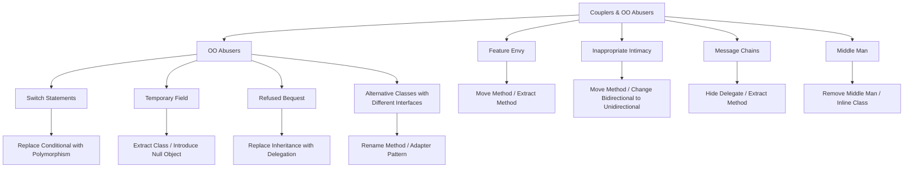
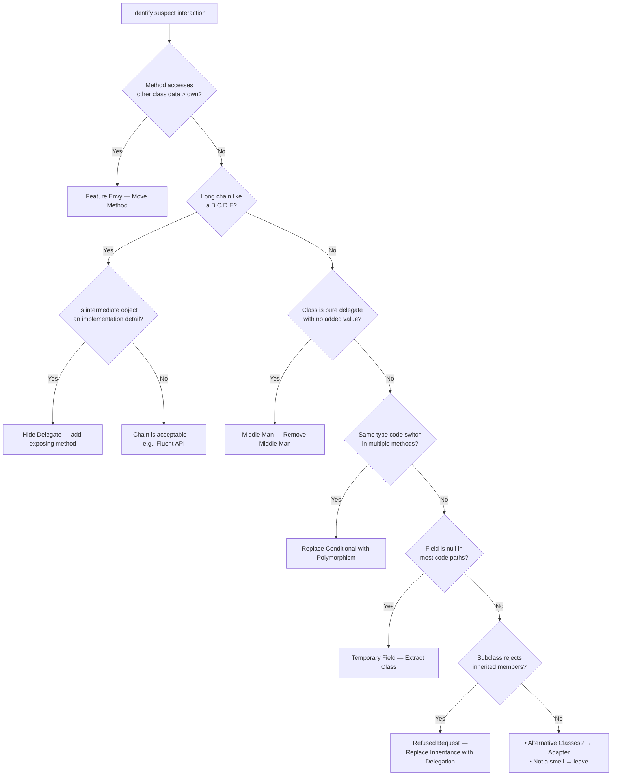

> [!success] Mastery Check
> - [ ] **Studied Well**
> - [ ] **Can explain the concept without notes**
> - [ ] **Can answer interview questions confidently**
> - [ ] **Can implement it in a real project**


## Navigation
**Domain:** [[6 — Design Principles & Patterns]] > **Group:** Refactoring
**Previous:** [[6.038 — Bloaters]] | **Next:** [[6.040 — Change Preventers]]
### Prerequisites
- [[6.001 — Single Responsibility Principle]] — coupler smells are SRP violations at the dependency-layout level.
### Where This Fits
Coupler smells occur when classes are too interdependent or when object-oriented mechanisms are misused, making a codebase rigid and change-resistant. This catalog covers Feature Envy, Inappropriate Intimacy, Message Chains, Middle Man, Switch Statements, Temporary Field, Refused Bequest, and Alternative Classes with Different Interfaces. Recognizing these smells during code review allows a senior engineer to apply moving-features refactorings, extract proper abstractions, and restore modularity.

---

## Core Mental Model
Couplers violate the principle that classes should talk to their immediate neighbors, not reach through them. Every time class A traverses `a.B.C.D` or class B exposes its internals to class C, the dependency graph becomes harder to change. OO Abusers misuse inheritance, polymorphism, or encapsulation — replacing what should be a strategy or composition with a brittle type code switch or a leaky subclass relationship.

### Dimensions


1. **Feature Envy** — A method that spends more time manipulating another class's data than its own; the method wants to live on the class it envies.
2. **Inappropriate Intimacy** — Two classes that know too much about each other's private details, often through bidirectional relationships or extensive getter chains.
3. **Message Chains** — Code that navigates through a long chain of objects: `a.GetB().GetC().GetD()`. Each intermediary is a middle man for the traversal.
4. **Middle Man** — A class that does nothing but delegate to another class. Every method on the class just calls the same method on a dependency.
5. **Switch Statements** — A `switch`, `if-else if` chain, or `switch expression` that tests for the same type code or enum in multiple places, signaling missing polymorphism.
6. **Temporary Field** — A field that is only set in some code paths, often left null or in an invalid state in others. The field should be extracted into its own class.
7. **Refused Bequest** — A subclass that inherits methods and data it does not need. The inheritance hierarchy is wrong; delegation is preferred.
8. **Alternative Classes with Different Interfaces** — Two classes that do the same thing but expose different method signatures, forcing callers to know which class to use and how.

---

## Deep Mechanics
### How It Works

**Feature Envy:** The classic sign: a method makes more calls to `other.Something` than to `this.Something` or local fields. The method should be moved to the class whose data it primarily uses. Exception: methods that operate on multiple objects (e.g., `CalculateTotal(Order order, TaxTable taxTable)`) are acceptable — they belong on neither exclusively.

**Inappropriate Intimacy:** Classes that expose too many internals via public getters, or that hold bidirectional references. The fix: change bidirectional to unidirectional, extract the shared part into a third class, or use Move Method to reduce cross-class access.

**Message Chains:** `order.Customer.Address.City` — the client depends on `Order`, `Customer`, `Address`, and the `City` property type. If `Address` changes its structure, every chain breaks. The fix: Hide Delegate (add `order.GetCustomerCity()`) or Extract Method on the chain.

**Middle Man:** A class where 80%+ of methods just call the same method on a dependency. Often created when a developer over-encapsulates or wraps a dependency "just in case." The fix: Remove Middle Man — let callers talk to the dependency directly, or Inline Class if the middle man has no independent behavior.

**Switch Statements:** The canonical OO abuser. A `switch` on `order.Type` scattered across `CalculateShipping`, `GenerateInvoice`, `ValidateOrder`. Each new order type requires editing every switch. The fix: Replace Conditional with Polymorphism — extract each branch into its own class implementing a common interface.

**Temporary Field:** A field that is `null` for most of an object's lifecycle, only set for specific operations. The field often appears only in some constructor overloads. The fix: Extract Class to create a separate object for the operation that needs the field, or Introduce Null Object to provide a no-op default.

**Refused Bequest:** A subclass inherits a base class's methods but overrides many to throw `NotSupportedException` or do nothing. The hierarchy is wrong — the subclass does not truly "is-a" the base. The fix: Replace Inheritance with Delegation, or push the unwanted methods down to sibling classes.

**Alternative Classes with Different Interfaces:** Two classes that both serialize data, but one has `Serialize(Stream s)` and the other has `WriteToFile(string path)`. Callers must conditionally branch to choose the right one. The fix: unify interfaces via an Adapter or rename methods to match.

### Why It Matters at Scale
In a 500K+ LOC codebase with 30+ developers, Feature Envy causes merge conflicts because a method lives on the wrong class — two teams modify different sections of the same long method. Message Chains create "shotgun surgery" coupling: changing an `Address` property breaks 200+ call sites. Switch Statements mean every new feature requires touching 5+ files. Temporary Fields cause NullReferenceExceptions in production that are hard to reproduce because the field is only invalid in specific code paths.

---

## Production Code Patterns
### Implementation in C#

**Feature Envy — Before:**
```csharp
// ❌ Before: OrderService envies Order and Customer data
public class OrderService
{
    public decimal CalculateLoyaltyDiscount(Order order)
    {
        var totalSpent = _orderRepo.GetTotalSpent(order.CustomerId);
        var customerTier = order.Customer.Tier;     // envying Customer
        var orderTotal = order.Items.Sum(i => i.Price * i.Quantity); // envying Order
        return customerTier switch
        {
            CustomerTier.Gold => orderTotal * 0.15m,
            CustomerTier.Silver => orderTotal * 0.10m,
            _ => 0m
        };
    }
}
```

**Feature Envy — After:**
```csharp
// ✅ After: Methods moved to the classes whose data they use
public class Order
{
    public decimal Subtotal => Items.Sum(i => i.Price * i.Quantity);

    public decimal CalculateLoyaltyDiscount(ITierPolicy tierPolicy) =>
        tierPolicy.ApplyDiscount(Subtotal);
}

public class Customer
{
    public CustomerTier Tier { get; init; }
    public decimal TotalLifetimeSpend { get; set; }
}
```

**Message Chains — Before:**
```csharp
// ❌ Before: Deep navigation chain
var city = order.Customer.ShippingAddress.City;
var taxRate = _taxService.GetRate(order.Customer.ShippingAddress.Zip);
```

**Message Chains — After:**
```csharp
// ✅ After: Hide Delegate — Order exposes a helper method
public class Order
{
    public string GetShippingCity() => Customer.ShippingAddress.City;
    public string GetShippingZip() => Customer.ShippingAddress.Zip;
}

var city = order.GetShippingCity();
var taxRate = _taxService.GetRate(order.GetShippingZip());
```

**Middle Man — Before:**
```csharp
// ❌ Before: CurrentUserService is a pure delegator — a middle man
public class CurrentUserService
{
    private readonly IHttpContextAccessor _httpContextAccessor;

    public Guid GetUserId() => _httpContextAccessor.HttpContext.User.GetUserId();
    public string GetUserEmail() => _httpContextAccessor.HttpContext.User.GetUserEmail();
    public string GetUserName() => _httpContextAccessor.HttpContext.User.GetUserName();
    public IList<string> GetRoles() => _httpContextAccessor.HttpContext.User.GetRoles();
}
```

**Middle Man — After:**
```csharp
// ✅ After: Removed middle man, caller uses the dependency directly
// Or, if the wrapper adds value (testability, abstraction), keep it
// but recognize it's not a middle man if it adds cross-cutting behavior.
public interface ICurrentUserService
{
    Guid UserId { get; }
    string? Email { get; }
    IReadOnlyList<string> Roles { get; }
}

public class CurrentUserService : ICurrentUserService
{
    private readonly ClaimsPrincipal _user;
    public CurrentUserService(IHttpContextAccessor accessor) => _user = accessor.HttpContext.User;
    public Guid UserId => _user.GetUserId();
    public string? Email => _user.FindFirst(ClaimTypes.Email)?.Value;
    public IReadOnlyList<string> Roles => _user.FindAll(ClaimTypes.Role).Select(c => c.Value).ToList().AsReadOnly();
}
// Still delegates, but adds value: decouples callers from HttpContext,
// provides a testable seam, centralizes claim parsing.
```

**Switch Statements — Before:**
```csharp
// ❌ Before: Switch on order type scattered across the codebase
public decimal CalculateShipping(Order order)
{
    return order.Type switch
    {
        OrderType.Physical => 5.99m + order.Items.Sum(i => i.Weight * 0.5m),
        OrderType.Digital => 0m,
        OrderType.Subscription => 0m,
        _ => throw new ArgumentOutOfRangeException()
    };
}

public string GenerateInvoice(Order order)
{
    return order.Type switch
    {
        OrderType.Physical => $"Shipping: {CalculateShipping(order)}",
        OrderType.Digital => "No shipping — instant delivery",
        OrderType.Subscription => $"Recurring: {order.RecurringAmount}/mo",
        _ => throw new ArgumentOutOfRangeException()
    };
}
```

**Switch Statements — After:**
```csharp
// ✅ After: Replace Conditional with Polymorphism
public interface IOrderTypeHandler
{
    decimal CalculateShipping(Order order);
    string GenerateInvoice(Order order);
}

public class PhysicalOrderHandler : IOrderTypeHandler
{
    public decimal CalculateShipping(Order order) =>
        5.99m + order.Items.Sum(i => i.Weight * 0.5m);

    public string GenerateInvoice(Order order) =>
        $"Shipping: {CalculateShipping(order)}";
}

public class DigitalOrderHandler : IOrderTypeHandler
{
    public decimal CalculateShipping(Order _) => 0m;
    public string GenerateInvoice(Order _) => "No shipping — instant delivery";
}
```

**Temporary Field — Before:**
```csharp
// ❌ Before: _discount is only set when ApplyCoupon is called
public class OrderProcessor
{
    private decimal? _discount;  // Temporary field — null in most code paths

    public async Task ProcessAsync(Order order)
    {
        await ValidateAsync(order);
        await ChargePaymentAsync(order);
        // _discount is null here if no coupon was applied
    }

    public void ApplyCoupon(Coupon coupon)
    {
        _discount = coupon.Calculate(Subtotal);
    }
}
```

**Temporary Field — After:**
```csharp
// ✅ After: Extract discount logic into its own class
public class DiscountCalculator
{
    public decimal? CalculateDiscount(Coupon? coupon, decimal subtotal) =>
        coupon?.Calculate(subtotal);
}

public class OrderProcessor
{
    private readonly DiscountCalculator _discountCalculator;

    public async Task ProcessAsync(Order order, Coupon? coupon)
    {
        var discount = _discountCalculator.CalculateDiscount(coupon, order.Subtotal);
        await ValidateAsync(order);
        await ChargePaymentAsync(order, discount);
    }
}
```

**Refused Bequest — Before:**
```csharp
// ❌ Before: InMemoryReportRepository inherits from ReportRepository but
// refuses the database-related methods
public abstract class ReportRepository
{
    public abstract Task<Report> GetByIdAsync(Guid id);
    public abstract Task SaveAsync(Report report);
    public abstract Task<IReadOnlyList<Report>> QueryAsync(ReportFilter filter);
}

public class InMemoryReportRepository : ReportRepository
{
    private readonly List<Report> _reports = new();

    public override Task<Report> GetByIdAsync(Guid id) =>
        Task.FromResult(_reports.FirstOrDefault(r => r.Id == id));

    public override Task SaveAsync(Report report)
    {
        _reports.Add(report);
        return Task.CompletedTask;
    }

    public override Task<IReadOnlyList<Report>> QueryAsync(ReportFilter filter) =>
        throw new NotSupportedException("In-memory repo does not support queries.");
}
```

**Refused Bequest — After:**
```csharp
// ✅ After: Replace Inheritance with Delegation — smaller interfaces
public interface IReportReader
{
    Task<Report?> GetByIdAsync(Guid id);
}

public interface IReportWriter
{
    Task SaveAsync(Report report);
}

public class InMemoryReportStore : IReportReader, IReportWriter
{
    private readonly List<Report> _reports = new();

    public Task<Report?> GetByIdAsync(Guid id) =>
        Task.FromResult(_reports.FirstOrDefault(r => r.Id == id));

    public Task SaveAsync(Report report)
    {
        _reports.Add(report);
        return Task.CompletedTask;
    }
}
```

**Alternative Classes — Before:**
```csharp
// ❌ Before: Two serializers with different interfaces
public class XmlReportWriter
{
    public void Serialize(Stream stream, Report report) { /* ... */ }
}

public class JsonReportExporter
{
    public string ExportToJson(Report report) { /* ... */ }
}
```

**Alternative Classes — After:**
```csharp
// ✅ After: Unified interface via Adapter pattern
public interface IReportSerializer
{
    void Serialize(Stream stream, Report report);
}

public class JsonReportSerializer : IReportSerializer
{
    public void Serialize(Stream stream, Report report)
    {
        var json = JsonSerializer.Serialize(report);
        var writer = new StreamWriter(stream);
        writer.Write(json);
        writer.Flush();
    }
}
```

### ASP.NET Core / .NET Ecosystem Integration

**Feature Envy in Controllers:** Action methods that access `request.User.Claims`, `order.Customer.Address`, and `product.Inventory` — the controller envies multiple domain objects. The fix: move business logic to application services.

**Message Chains in EF Core:** `context.Orders.First(o => o.Id == id).Customer.Address.City` — navigation property chains create coupling to the entire entity graph. The fix: `Include` with projection or add domain methods that hide the traversal.

**Middle Man via Repository Pattern:** The classic debate. A generic `IRepository<T>` that passes through to `DbSet<T>` is a middle man unless it adds value (caching, auditing, read-only variants, unit of work scope).

```csharp
// ❌ Middle Man repository — pure pass-through
public class OrderRepository : IOrderRepository
{
    private readonly AppDbContext _db;
    public OrderRepository(AppDbContext db) => _db = db;

    public Task<Order?> GetByIdAsync(Guid id) => _db.Orders.FindAsync(id).AsTask();
    public Task<List<Order>> GetAllAsync() => _db.Orders.ToListAsync();
    public void Add(Order order) => _db.Orders.Add(order);
    public void Remove(Order order) => _db.Orders.Remove(order);
}

// ✅ Repository that adds value — adds caching, spec pattern, or auditing
public class CachedOrderRepository : IOrderRepository
{
    private readonly AppDbContext _db;
    private readonly IMemoryCache _cache;

    public async Task<Order?> GetByIdAsync(Guid id) =>
        await _cache.GetOrCreateAsync($"order-{id}", e => _db.Orders.FindAsync(id));
}
```

**Switch Statements in Pipeline Behaviors:** MediatR pipeline behaviors that switch on `request.GetType()` to apply different logging, validation, or metrics per request type — better solved via generic behaviors or strategy-per-handler.

---

## Gotchas & Anti-Patterns
### Feature Envy in DTO Mapping

**Wrong:** Placing mapping logic in the controller (the controller envies the domain object's structure).
**Right:** Use AutoMapper profiles or explicit mapping methods on the DTO class.
**Consequence:** Controllers that know the internal structure of every domain object are fragile — changing a domain property forces changes across every controller that maps it.

### Message Chain vs. Law of Demeter Clarity

**Wrong:** Blindly following Law of Demeter to the point where `order.GetCustomerCity()` exists but `order.Customer.Address.City` was perfectly fine in a view model.
**Right:** Apply Hide Delegate when the chain crosses architectural boundaries (domain → infrastructure) or when the intermediate objects are implementation details. In a view model assembly, chains are acceptable.
**Consequence:** Over-applying Hide Delegate creates middle man methods that add zero value, making the codebase harder to navigate.

### Switch Statements When the Type Set Is Fixed

**Wrong:** Replacing a single `switch` statement on a closed enum (e.g., `DayOfWeek`) with polymorphism when the types are known and never change.
**Right:** Pattern matching / switch expressions on closed sets are fine. Polymorphism is justified when new variants are frequently added or when each variant has different behavior across multiple operations.
**Consequence:** Premature polymorphism for a fixed set introduces needless abstraction overhead — factories, interfaces, registrations — for no maintenance benefit.

### Temporary Field Confused with Lazy Initialization

**Wrong:** Flagging every lazily-initialized field as a Temporary Field smell.
**Right:** A Temporary Field is a field that is `null` or in an invalid state *unexpectedly* — not a field that is intentionally lazily loaded. A `_httpClient` that is created on first use is not a Temporary Field; a `_discount` that is `null` except when `ApplyCoupon` is called first is.
**Consequence:** Misdiagnosing lazy initialization as a Temporary Field leads to unnecessary Extract Class refactorings on a valid lazy-load pattern.

### Refused Bequest via the "Is-A" Test

**Wrong:** Creating a `PermanentEmployee` and `ContractorEmployee` subclass hierarchy where `ContractorEmployee` does not get benefits, sick leave, or pension — and throws for those methods.
**Right:** Prefer composition over inheritance. Use a `CompensationStrategy` and `BenefitsStrategy` that are composed into an `Employee` class rather than forced through inheritance.
**Consequence:** Deep inheritance hierarchies with refused bequest violate LSP — the subclass cannot be substituted for the base without runtime exceptions.

### Alternative Classes When One Should Wrap the Other

**Wrong:** Creating an `IReportExporter` interface with two independent implementations when one is just a configuration variant of the other (e.g., XML vs JSON export).
**Right:** If the structural difference is just output format, use a single `ReportSerializer` with a strategy parameter or configuration option.
**Consequence:** Interface proliferation — every two-class variation gets an interface and a factory, bloating the codebase with abstractions that add no behavioral value.

---

## Performance Implications
### Maintenance Cost Model
| Scenario | Defect Probability | Change Impact | Onboarding Cost |
|---|---|---|---|
| Feature Envy corrected via Move Method | Low | Isolated | Low |
| Feature Envy left in wrong class | High | Cascading — multiple teams modify same method | High |
| Switch Statements → Polymorphism | Low | Isolated (new type = new class) | Medium |
| Switch Statements scattered across codebase | High | Every new variant touches 5+ files | High |
| Message Chains hidden via Hide Delegate | Low | Localized to the delegate method | Low |
| Message Chains exposed directly | High | Deep chain breaks on intermediate change | High |
| Middle Man removed | Low | Isolated | Medium |
| Middle Man retained (pure pass-through) | Low | Low | High (confusion) |

**No benchmark data:** Coupler smells affect maintenance cost, not runtime performance. The cost of a Message Chain is measured in PR review time and merge conflicts, not CPU cycles. A single Feature Envy method modified by 2 teams causes ~1 merge conflict per month.

---

## Interview Arsenal
### Question Bank
1. "What is Feature Envy and how do you fix it?"
2. "What is the difference between a Middle Man and a legitimate Facade?"
3. "How does the Switch Statement smell relate to the Open/Closed Principle?"
4. "Describe a production incident caused by Inappropriate Intimacy or a Message Chain."
5. "What is Refused Bequest and how does it relate to LSP?"
6. "When would you leave a Switch Statement in place instead of replacing it with polymorphism?"
7. "How do Alternative Classes with Different Interfaces relate to the Adapter pattern?"
8. "What is Temporary Field and how does it lead to null reference exceptions?"

### Spoken Answers

> **Q1: What is Feature Envy and how do you fix it?**
>
> **Average answer:** Feature Envy is when a method uses more data from another class than its own. You fix it by moving the method to the class that has the data.
>
> **Great answer:** Feature Envy is a structural sign that the method is on the wrong class — the method "envies" the data of another class and would rather live there. I identify it during code review by checking whether the method makes more calls to parameters or returned objects than to its own fields. The primary fix is Move Method, but sometimes Extract Method first to isolate the envious part. However, not every cross-class data use is envy — methods that coordinate multiple objects (like a `CheckoutService` that uses `Order`, `Payment`, and `Inventory`) are orchestrators and belong on the orchestrator. In .NET, Feature Envy often appears in services that receive domain objects and access their internals; the refactoring moves the logic into domain methods, aligning with domain-driven design.

> **Q3: How does the Switch Statement smell relate to the Open/Closed Principle?**
>
> **Average answer:** Switch statements violate OCP because you have to modify the switch to add a new type.
>
> **Great answer:** Precisely — a switch on a type code violates OCP because adding a new type requires opening every switch statement that tests that type code. Replace Conditional with Polymorphism closes the codebase against new types: each new variant becomes a new class implementing the common interface, leaving existing handlers untouched. However, there is a nuance: C# switch expressions with exhaustive pattern matching (in C# 9+) that cover a closed enum are *not* OCP violations if the enum itself follows OCP (i.e., new constants are added rarely and the switch is in a single method). The smell is genuinely pernicious when the same type code switch appears in *multiple* methods — each change requires modifying every method, which is the exact symptom of an OCP violation.

### Trick Question
**"Is a Middle Man always a bad smell that should be removed?"**
Why it is a trap: it assumes all delegation is waste, ignoring cross-cutting value. Correct answer: A Middle Man is a bad smell only when it adds no value beyond delegation. If the middle man provides testability (abstracting `HttpContext` for unit tests), cross-cutting behavior (auditing, logging, caching), or a stability boundary (wrapping a volatile third-party SDK), it is a legitimate Facade or Adapter, not a Middle Man. The difference is whether the wrapper exists for the caller's convenience or because it introduces new behavior. In .NET, `IHttpClientFactory` is not a middle man even though it delegates — it adds connection pooling, lifecycle management, and resilience policies.

### Comparison Table
| Aspect | Couplers & OO Abusers | Bloaters |
|---|---|---|
| Intent | Identify excessive coupling and OO mechanism misuse | Identify code that has grown too large |
| Smells covered | Feature Envy, Inappropriate Intimacy, Message Chains, Middle Man, Switch Statements, Temporary Field, Refused Bequest, Alternative Classes | Long Method, Large Class, Long Parameter List, Data Clumps, Primitive Obsession |
| When to use | When changing one class forces changes in unrelated classes | When a method or class is hard to understand in one screen |
| .NET example | `order.Customer.Address.City` (Message Chain) | Controller with 150-line action method |
| Key difference | Focuses on *coupling structure* between classes | Focuses on *size* and *abstraction level* within a single unit |

---

## Decision Framework



### Application Checklist
- [ ] Does every method primarily use its own class's data?
- [ ] Can I remove any navigation chain by adding a helper method on the root object?
- [ ] Does every wrapper/wrapper add non-trivial value beyond delegation?
- [ ] Are switch statements on the same type code limited to one location?
- [ ] Are all fields valid for the entire lifetime of their containing object?
- [ ] Does every subclass truly "is-a" its base (LSP-compliant)?
- [ ] Do equivalent classes expose the same method signatures to callers?

### Tradeoff Summary
| What You Gain | What You Give Up |
|---|---|
| Classes are self-contained and understandable | More methods on each class (Hide Delegate adds surface area) |
| Hidden navigation chains reduce coupling | Calling code loses direct access to deep objects |
| Polymorphism eliminates repetitive switches | More classes and interface registrations |
| Each subclass is a true LSP substitute | Composition replaces inheritance; more delegation code |
| No null-prone temporary fields | More classes (each temporary field gets its own class) |

---

## Self-Check
### Conceptual Questions
1. What is the single best heuristic for identifying Feature Envy in a method?
2. How does Hide Delegate solve Message Chains, and what is the cost?
3. What distinguishes a legitimate Facade from a Middle Man?
4. Why is a `switch` statement on the same type code across multiple methods a violation of OCP?
5. What is the relationship between Temporary Field and null reference exceptions?
6. How does Refused Bequest violate the Liskov Substitution Principle?
7. When should you NOT replace a Switch Statement with polymorphism?
8. Why is `IRepository<T>` considered a Middle Man by some architects?
9. What is the relationship between Alternative Classes and the Adapter pattern?
10. How does Inappropriate Intimacy differ from Feature Envy?

<details>
<summary>Answers</summary>

1. Count the method's calls: if it calls `other.Something` more than `this.Something` or its own fields, it envies `other`.
2. Hide Delegate adds a method on the root object that encapsulates the navigation chain, reducing coupling but increasing the root object's method count.
3. A Facade simplifies or coordinates a subsystem; a Middle Man adds zero behavior beyond pass-through delegation.
4. Each new type requires opening every switch statement across the codebase — the definition of "not closed for modification."
5. A Temporary Field is null in most code paths, making null reference exceptions likely when a caller does not set it first.
6. A subclass that throws `NotSupportedException` for inherited methods cannot be substituted for its base without runtime failure — an LSP violation.
7. When the type set is closed and never changes (e.g., `DayOfWeek`), or when the switch handles an enum with 2–3 values that rarely change and appears in only one method.
8. `IRepository<T>` often mirrors `DbSet<T>` exactly, adding no new behavior — a pure delegator that exists only because "we might change ORMs" (Speculative Generality).
9. Alternative Classes with Same Interface means unify via Rename Method; when you cannot change the class, wrap it with an Adapter to match the expected interface.
10. Feature Envy is one-way (class A wants class B's data); Inappropriate Intimacy is bidirectional or involves exposing private internals between classes.
</details>

### Code Puzzles

**Puzzle 1 — Identify the smell:**
```csharp
public decimal CalculateSalary(Employee employee)
{
    var baseRate = employee.Role.BaseRate;
    var hours = _timesheetRepo.GetHours(employee.Id);
    var taxBracket = employee.TaxInfo.Bracket;
    var deductions = employee.Benefits.Deductions;
    return baseRate * hours * taxBracket.Multiplier - deductions;
}
```

<details>
<summary>Answer</summary>

**Smell:** Feature Envy — `CalculateSalary` accesses `employee.Role`, `employee.TaxInfo`, `employee.Benefits`, and an external repo, but is not on the `Employee` class. **Fix:** Move the method to `Employee`:
```csharp
public class Employee
{
    public decimal CalculateSalary(ITimesheetRepo repo) =>
        Role.BaseRate * repo.GetHours(Id) * TaxInfo.Bracket.Multiplier - Benefits.Deductions;
}
```
</details>

---

**Puzzle 2 — Fix the Message Chain:**
```csharp
var region = context.Orders
    .First(o => o.Id == orderId)
    .Warehouse
    .Address
    .Region;
```

<details>
<summary>Answer</summary>

**Fix:** Add `GetRegion()` on `Order`:
```csharp
public class Order
{
    public string GetWarehouseRegion() => Warehouse?.Address?.Region ?? "Unknown";
}
```
**Alternative:** Use EF Core projection to avoid navigating the graph:
```csharp
var region = await context.Orders
    .Where(o => o.Id == orderId)
    .Select(o => o.Warehouse.Address.Region)
    .FirstOrDefaultAsync();
```
Projection avoids loading the entire entity graph but still couples the query to the entity structure. Hide Delegate is preferred for domain logic; projection is preferred for read-only queries.
</details>

---

**Puzzle 3 — Is this a Middle Man?**
```csharp
public class MetricsService
{
    private readonly IMetricsClient _client;
    public MetricsService(IMetricsClient client) => _client = client;

    public void TrackEvent(string name) => _client.TrackEvent(name);
    public void TrackMetric(string name, double value) => _client.TrackMetric(name, value);
    public void TrackException(Exception ex) => _client.TrackException(ex);
    public void Flush() => _client.Flush();
}
```

<details>
<summary>Answer</summary>

**Verdict:** Could be a Middle Man if `MetricsService` adds nothing beyond pass-through. **Defense:** If `MetricsService` wraps an `IMetricsClient` from an external SDK (Application Insights, DataDog) to provide a stable interface that insulates callers from SDK changes, it's a legitimate Facade/Adapter, not a Middle Man. The value is the abstraction boundary, not the delegation.
</details>

---

**Puzzle 4 — Fix the Switch Statement smell:**
```csharp
public string GetNotificationMessage(Notification notification)
{
    return notification.Type switch
    {
        NotificationType.Email => $"Email to {notification.Recipient}: {notification.Body}",
        NotificationType.Sms => $"SMS to {notification.Recipient}: {notification.Body}",
        NotificationType.Push => $"Push to device {notification.DeviceId}: {notification.Title}",
        _ => throw new ArgumentOutOfRangeException()
    };
}

public bool RequiresConfirmation(Notification notification)
{
    return notification.Type switch
    {
        NotificationType.Email => true,
        NotificationType.Sms => false,
        NotificationType.Push => true,
        _ => throw new ArgumentOutOfRangeException()
    };
}
```

<details>
<summary>Answer</summary>

**Fix:** Replace Conditional with Polymorphism:
```csharp
public interface INotificationFormatter
{
    string GetMessage(Notification notification);
    bool RequiresConfirmation { get; }
}

public class EmailNotificationFormatter : INotificationFormatter
{
    public string GetMessage(Notification notification) =>
        $"Email to {notification.Recipient}: {notification.Body}";
    public bool RequiresConfirmation => true;
}
```
Each new notification type adds one class without touching existing handlers.
</details>

---

**Puzzle 5 — Identify and fix the smell:**
```csharp
public class Rectangle
{
    public virtual double Width { get; set; }
    public virtual double Height { get; set; }
    public double Area() => Width * Height;
}

public class Square : Rectangle
{
    public override double Width
    {
        set { base.Width = base.Height = value; }
    }
    public override double Height
    {
        set { base.Width = base.Height = value; }
    }
}
```

<details>
<summary>Answer</summary>

**Smell:** Refused Bequest — `Square` inherits from `Rectangle` but violates LSP (setting `Width` changes `Height`). A `Square` is not substitutable for a `Rectangle`. **Fix:** Replace inheritance with a shared interface:
```csharp
public interface IShape { double Area(); }
public readonly record struct Rectangle(double Width, double Height) : IShape
{
    public double Area() => Width * Height;
}
public readonly record struct Square(double Side) : IShape
{
    public double Area() => Side * Side;
}
```
Now both implement `IShape` without a problematic hierarchy.
</details>
