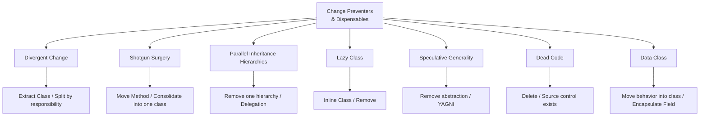
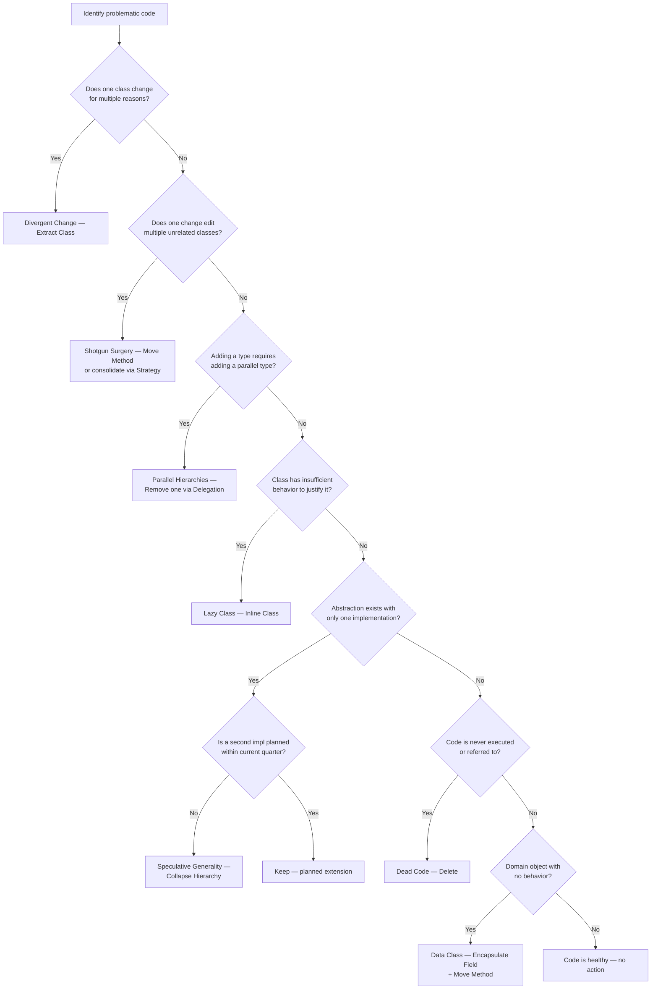

> [!success] Mastery Check
> - [ ] **Studied Well**
> - [ ] **Can explain the concept without notes**
> - [ ] **Can answer interview questions confidently**
> - [ ] **Can implement it in a real project**


## Navigation
**Domain:** [[6 — Design Principles & Patterns]] > **Group:** Refactoring
**Previous:** [[6.039 — Couplers]] | **Next:** [[6.041 — Composing Methods]]
### Prerequisites
- [[6.002 — Open/Closed Principle]] — Divergent Change and Shotgun Surgery are OCP violations in symptom form.
### Where This Fits
Change Preventers are smells that make a codebase resistant to modification — changing one thing forces changes in many places (Shotgun Surgery) or a single class must be changed for multiple reasons (Divergent Change). Dispensables are code elements that provide no value and should be removed: Lazy Class, Speculative Generality, Dead Code, and Data Class. Together these smells indicate a codebase where maintenance velocity has degraded because the code carries dead weight or is structured to amplify the impact of every change.

---

## Core Mental Model
Change Preventers and Dispensables measure the friction of evolution. In a healthy codebase, a single business requirement change touches exactly one class (if it concerns a single responsibility) or at most one class per bounded context. When a change touches 5 unrelated classes (Shotgun Surgery) or one class changes for 5 unrelated reasons (Divergent Change), the code structure fights every feature. Dispensables — code that is unused, purely speculative, or vacuous — increase the surface area that must be understood, searched, and maintained without providing offsetting value.

### Dimensions


1. **Divergent Change** — A single class that changes for multiple different reasons. The opposite of Single Responsibility Principle: the class has too many responsibilities, so any change hits it.
2. **Shotgun Surgery** — A single change that forces edits across many classes. The opposite of Divergent Change: the change reason is one, but its code is spread across many classes.
3. **Parallel Inheritance Hierarchies** — Adding a class to one hierarchy forces creating a corresponding class in another hierarchy (e.g., adding `PhysicalProduct` requires adding `PhysicalProductRepository`, `PhysicalProductValidator`).
4. **Lazy Class** — A class that does too little to justify its existence. Often a leftover from refactoring or speculation.
5. **Speculative Generality** — Abstractions, interfaces, base classes, or parameters built "just in case" they are needed. YAGNI violated.
6. **Dead Code** — Code that is never executed — unreachable branches, commented-out blocks, unused methods, unused parameters.
7. **Data Class** — A class with public fields or auto-properties and no behavior — a dumb data holder that forces behavior into external services.

---

## Deep Mechanics
### How It Works

**Divergent Change:** Signal: When reviewing the version history of a file, the commit messages describe *different* concerns — "fixed tax calculation," "changed email template," "updated validation rules." Each concern should drive changes to a different class. Fix: Extract Class per concern.

**Shotgun Surgery:** Signal: To add a new report type, you edit `ReportController`, `ReportService`, `ReportRepository`, `ReportValidator`, and `ReportMapper`. Fix: Move Method to consolidate or use convention-based registration to reduce touch points.

**Parallel Inheritance Hierarchies:** Signal: Every time you add `PremiumUser`, you must add `PremiumUserRepository`, `PremiumUserValidator`, `PremiumUserConverter`. The hierarchies are coupled. Fix: Remove one hierarchy via reflection, convention, or delegation; or use a composition approach where a single `User` class takes a `UserType` strategy.

**Lazy Class:** Signal: A class with 1–2 methods that could live elsewhere, or a class that was extracted during refactoring but never grew into its own responsibility. Fix: Inline Class — move its members to the single class that uses it.

**Speculative Generality:** Signal: `ISomething` with one implementation; base classes with one subclass; parameters named `type` or `kind` that always pass the same value. Fix: Collapse Hierarchy, Inline Class, or Remove Parameter.

**Dead Code:** Signal: Methods not called, parameters always passed the same value, `if (false)` blocks, commented-out code, unused `using` directives. Fix: Delete — source control preserves history.

**Data Class:** Signal: A class with public getters and setters and zero methods beyond property accessors. Behavior that operates on this data lives in external services. Fix: Encapsulate Field, then Move Method to bring related behavior into the data class.

### Why It Matters at Scale
In a team of 25+ developers, Shotgun Surgery creates merge conflicts on every cross-cutting change — 5 files modified per commit means 5x probability of conflict with another developer's branch. Divergent Change makes code review slow because the reviewer must understand multiple unrelated changes in a single PR. Dead Code and Speculative Generality inflate the codebase by 20–30%, making searches slower, build times longer, and onboarding more overwhelming. Data Classes that are manipulated by 10+ services cannot be refactored — any change to the data structure forces changes across all those services.

---

## Production Code Patterns
### Implementation in C#

**Divergent Change — Before:**
```csharp
// ❌ Before: OrderService changes for tax rules, email templates, validation,
// inventory logic, and payment processing
public class OrderService
{
    public async Task<OrderConfirmation> ProcessOrderAsync(Order order)
    {
        await ValidateOrder(order);
        var tax = CalculateTax(order);
        var discount = await ApplyDiscounts(order);
        var total = order.Subtotal - discount + tax;
        var payment = await ProcessPayment(order, total);
        await UpdateInventory(order);
        await SendConfirmationEmail(order, total);
        return new OrderConfirmation { /* ... */ };
    }

    private async Task ValidateOrder(Order order) { /* tax rules */ }
    private decimal CalculateTax(Order order) { /* tax rules */ }
    private async Task<decimal> ApplyDiscounts(Order order) { /* promotion rules */ }
    private async Task<PaymentResult> ProcessPayment(Order order, decimal total) { /* payment */ }
    private async Task UpdateInventory(Order order) { /* inventory */ }
    private async Task SendConfirmationEmail(Order order, decimal total) { /* email */ }
}
```

**Divergent Change — After:**
```csharp
// ✅ After: Each responsibility extracted into its own service
public class OrderService
{
    private readonly ITaxCalculator _taxCalculator;
    private readonly IDiscountService _discountService;
    private readonly IPaymentProcessor _paymentProcessor;
    private readonly IInventoryManager _inventoryManager;
    private readonly INotificationService _notificationService;

    public async Task<OrderConfirmation> ProcessOrderAsync(Order order)
    {
        var tax = _taxCalculator.Calculate(order);
        var discount = await _discountService.ApplyBestDiscountAsync(order);
        var total = order.Subtotal - discount + tax;
        var payment = await _paymentProcessor.ChargeAsync(order, total);
        await _inventoryManager.ReserveItemsAsync(order.Items);
        await _notificationService.SendOrderConfirmationAsync(order.CustomerEmail, total);
        return new OrderConfirmation(order.Id, total, payment.TransactionId);
    }
}

// Now tax rule changes only affect TaxCalculator
public class TaxCalculator : ITaxCalculator { /* ... */ }
// Email template changes only affect NotificationService
public class NotificationService : INotificationService { /* ... */ }
```

**Shotgun Surgery — Before:**
```csharp
// ❌ Before: Adding a new shipping method requires changes across 4 classes
public class OrderController
{
    public async Task<IActionResult> Ship(Guid orderId, string method)
    {
        if (method == "Standard") { /* ... */ }
        else if (method == "Express") { /* ... */ }
    }
}

public class ShippingService
{
    public decimal CalculateShipping(string method)
    {
        return method switch
        {
            "Standard" => 5.99m,
            "Express" => 14.99m,
            _ => 9.99m
        };
    }
}

public class ShippingValidator
{
    public bool IsValidMethod(string method) =>
        method is "Standard" or "Express" or "Overnight";
}
```

**Shotgun Surgery — After:**
```csharp
// ✅ After: Strategy pattern consolidates shipping logic
public interface IShippingStrategy
{
    string MethodName { get; }
    decimal CalculateCost(Order order);
    bool IsEligible(Order order);
}

public class StandardShippingStrategy : IShippingStrategy
{
    public string MethodName => "Standard";
    public decimal CalculateCost(Order _) => 5.99m;
    public bool IsEligible(Order _) => true;
}

public class ExpressShippingStrategy : IShippingStrategy
{
    public string MethodName => "Express";
    public decimal CalculateCost(Order _) => 14.99m;
    public bool IsEligible(Order order) => order.Subtotal > 50m;
}

// Registration
services.AddScoped<IShippingStrategy, StandardShippingStrategy>();
services.AddScoped<IShippingStrategy, ExpressShippingStrategy>();

// Single dispatch point
public class ShippingService
{
    private readonly IEnumerable<IShippingStrategy> _strategies;
    public decimal CalculateCost(Order order, string method) =>
        _strategies.First(s => s.MethodName == method).CalculateCost(order);
}
```

**Parallel Inheritance Hierarchies — Before:**
```csharp
// ❌ Before: Adding ProductType requires adding parallel types everywhere
public abstract class Product { }
public class PhysicalProduct : Product { }
public class DigitalProduct : Product { }

public abstract class ProductRepository { }
public class PhysicalProductRepository : ProductRepository { }
public class DigitalProductRepository : ProductRepository { }

public abstract class ProductValidator { }
public class PhysicalProductValidator : ProductValidator { }
public class DigitalProductValidator : ProductValidator { }
```

**Parallel Inheritance Hierarchies — After:**
```csharp
// ✅ After: Remove parallel hierarchy via strategy pattern
public class Product
{
    public ProductType Type { get; init; }
    public IReadOnlyList<IProductHandler> Handlers => _handlers;
}

public interface IProductHandler
{
    bool CanHandle(Product product);
    Task SaveAsync(Product product, IRepository repo);
    ValidationResult Validate(Product product);
}
```

**Lazy Class — Before:**
```csharp
// ❌ Before: LazyClass — a single method that just delegates
public class OrderExportService
{
    public byte[] ExportToExcel(Order order) =>
        new ExcelExporter().Export(order);
}
```

**Lazy Class — After:**
```csharp
// ✅ After: Inlined — callers use ExcelExporter directly
// or if OrderExportService had only one method, merge into the caller.
```

**Speculative Generality — Before:**
```csharp
// ❌ Before: Interface and two implementations "just in case,"
// but only one is ever used
public interface INotificationSender
{
    Task SendAsync(string message);
}

public class EmailNotificationSender : INotificationSender
{
    public async Task SendAsync(string message) { /* email logic */ }
}

// Implementation #2 never written. Interface used in one place.
```

**Speculative Generality — After:**
```csharp
// ✅ After: Collapse — remove the interface until a second implementation exists
public class EmailNotificationSender
{
    public async Task SendAsync(string message) { /* email logic */ }
}
```

**Dead Code — Before:**
```csharp
// ❌ Before: Unused method, commented-out block, unused parameter
public async Task<Order> GetOrderAsync(Guid id, bool includeDetails = false) // includeDetails never used
{
    // var oldLogic = ... ; // commented out 2 years ago
    return await _db.Orders.FindAsync(id);
}
```

**Dead Code — After:**
```csharp
// ✅ After: Deleted — source control preserves history
public async Task<Order?> GetOrderAsync(Guid id) =>
    await _db.Orders.FindAsync(id);
```

**Data Class — Before:**
```csharp
// ❌ Before: Pure data holder — no behavior
public class Invoice
{
    public Guid Id { get; set; }
    public Guid OrderId { get; set; }
    public decimal Subtotal { get; set; }
    public decimal TaxRate { get; set; }
    public decimal TaxAmount => Subtotal * TaxRate;
    public decimal Total => Subtotal + TaxAmount;
    public DateTime CreatedAt { get; set; }
    public bool IsPaid { get; set; }
}

// Behavior scattered in services:
public class InvoiceService
{
    public bool IsOverdue(Invoice invoice) =>
        !invoice.IsPaid && DateTime.UtcNow > invoice.CreatedAt.AddDays(30);
}
```

**Data Class — After:**
```csharp
// ✅ After: Behavior moved into the class
public class Invoice
{
    public Guid Id { get; init; }
    public Guid OrderId { get; init; }
    public decimal Subtotal { get; init; }
    public decimal TaxRate { get; init; }
    public decimal TaxAmount => Subtotal * TaxRate;
    public decimal Total => Subtotal + TaxAmount;
    public DateTime CreatedAt { get; init; }
    public bool IsPaid { get; private set; }

    public bool IsOverdue() => !IsPaid && DateTime.UtcNow > CreatedAt.AddDays(30);

    public void MarkAsPaid()
    {
        if (IsPaid) throw new InvalidOperationException("Invoice is already paid.");
        IsPaid = true;
    }
}
```

### ASP.NET Core / .NET Ecosystem Integration

**Divergent Change in Controllers:** A single `OrdersController` handling CRUD, reporting, export, and admin actions. Every feature request changes this file. Fix: split into `OrdersCommandController`, `OrdersQueryController`, `OrdersExportController`.

**Shotgun Surgery in Endpoint Definitions:** Adding a new API endpoint requires editing `Program.cs`, adding a DTO, creating a handler, registering a validator, and adding a mapper profile. Fix: use `Minimal APIs` with Carter or FastEndpoints to keep endpoint logic co-located, or use MediatR with auto-registration.

**Speculative Generality in DI Registration:** Registering interfaces for every service "in case we need to swap implementations" when there is exactly one implementation and no planned second. YAGNI. Remove the interface until needed.

**Dead Code via Middleware:** Middleware registered but never executed because the pipeline order prevents it from running. Remove it.

**Data Class in DTOs:** Request/response DTOs are data classes by nature — that is acceptable. The smell is when *domain objects* are data classes with behavior in external services. Distinguish DTOs from domain entities.

---

## Gotchas & Anti-Patterns
### Divergent Change vs. Shotgun Surgery Confusion

**Wrong:** Using the terms interchangeably or failing to distinguish the direction of the problem.
**Right:** Divergent Change = one class changes for many reasons (too many responsibilities). Shotgun Surgery = one change requires editing many classes (responsibility spread too thin). They are opposites.
**Consequence:** Applying the wrong fix — extracting a class for Shotgun Surgery (spreads it further) or consolidating for Divergent Change (creates a larger blob). Divergent Change is fixed by Extract Class; Shotgun Surgery by Move Method to consolidate.

### Speculative Generality as "Good Design"

**Wrong:** Defending `ISomething` with one implementation by saying "we might need a mock" or "we might switch providers."
**Right:** Create the interface when the second concrete implementation is planned or when the interface genuinely defines a contract (e.g., `IHttpClientFactory`). For a single implementation, mock the concrete class directly or use a mocking framework that works with concrete types.
**Consequence:** Interfaces with one implementation double the file count and navigation cost for zero behavioral benefit. Every developer must open two files to understand a single implementation.

### Dead Code Defended by "It Might Be Used"

**Wrong:** Keeping an unused method "because a customer might need it someday" or because "removing it is risky."
**Right:** Delete unused code. Source control preserves history. If it is needed later, it can be restored. Dead code increases search noise, build time, and the probability of confusion during debugging.
**Consequence:** Developers searching for how a feature works find the dead code and waste time understanding it. At scale, 20–30% of a codebase can be dead code.

### Lazy Class from Over-Extraction

**Wrong:** Extracting classes during refactoring but never giving them enough responsibility to justify their existence (e.g., `OrderValidationService` that has one method with 3 lines).
**Right:** Inline the lazy class back into its sole caller. The class should have enough unique behavior to justify its existence as a separate abstraction.
**Consequence:** Lazy Classes increase the number of files a developer must open to understand a flow, making navigation harder without adding clarity.

### Data Class with Public Setters

**Wrong:** Domain entity with `{ get; set; }` on every property, allowing any service to put it in an invalid state.
**Right:** Encapsulate fields — use `{ get; init; }` for immutable properties and methods for state-changing operations that enforce invariants.
**Consequence:** Data Classes with public setters cannot enforce their own invariants. A service that calls `invoice.Total = -50` corrupts the domain. All callers must be audited for correctness — which they won't be.

---

## Performance Implications
### Maintenance Cost Model
| Scenario | Defect Probability | Change Impact | Onboarding Cost |
|---|---|---|---|
| Divergent Change addressed via Extract Class | Low | Isolated | Low |
| Divergent Change left in monolithic class | High — one change introduces typo in unrelated area | High — fear of touching it | High |
| Shotgun Surgery consolidated via Strategy | Low | Isolated to one registration | Medium |
| Shotgun Surgery across 5+ classes per feature | High — one of 5 changes will be missed | High — every feature touches 5 files | High |
| Speculative Generality removed | Low | None (interface was unused) | Low |
| Speculative Generality retained | Low (no runtime impact) | Low | Medium — more files to navigate |
| Dead Code deleted | None | None (was not executing) | Lower — less code to search |
| Dead Code accumulated (20%+ of codebase) | Medium — developer uses dead code as reference | Low (not executed) | High — "is this used?" decisions |

**No benchmark data:** Change Preventers and Dispensables affect cognitive load and change velocity, not runtime. The cost of Shotgun Surgery is measurable in "files changed per commit" — a healthy commit touches 1–3 files; a Shotgun Surgery commit touches 5–10.

---

## Interview Arsenal
### Question Bank
1. "What is the difference between Divergent Change and Shotgun Surgery?"
2. "How do Parallel Inheritance Hierarchies arise and how do you eliminate them?"
3. "Describe Speculative Generality and its relationship to YAGNI."
4. "When is a Data Class acceptable in production code?"
5. "How would you convince a teammate to delete dead code they wrote?"
6. "What is the relationship between Lazy Class and the refactoring Inline Class?"
7. "How does Shotgun Surgery manifest in ASP.NET Core applications?"
8. "How do you distinguish a healthy abstraction from Speculative Generality?"

### Spoken Answers

> **Q1: What is the difference between Divergent Change and Shotgun Surgery?**
>
> **Average answer:** Divergent Change is when one class changes for many reasons; Shotgun Surgery is when one change affects many classes.
>
> **Great answer:** They are symmetrical opposites. Divergent Change means the class has multiple responsibilities — every new feature hits the same file. The fix is Extract Class: each responsibility gets its own class. Shotgun Surgery means a single responsibility is spread across multiple classes — every feature requires editing all of them. The fix is Move Method or Consolidate: gather the scattered logic into one class or use convention-based registration so the framework discovers the implementations automatically. In .NET, Shotgun Surgery often appears when adding a new enum value requires editing a switch in a service, a validation method, a mapping profile, and a test — a problem solved by Replace Conditional with Polymorphism, which keeps each variant's logic in its own class.

> **Q3: Describe Speculative Generality and its relationship to YAGNI.**
>
> **Average answer:** Speculative Generality is adding abstractions you don't need yet. YAGNI says don't add things you don't need.
>
> **Great answer:** Speculative Generality is the artifact of violating YAGNI — building an interface, base class, or parameter for a use case that has not materialized. The classic example in .NET is `IRepository<T>` with one implementation, created "in case we switch ORMs" — a switch that virtually never happens. The cost is not just the extra files: every developer navigating the codebase must understand why the abstraction exists. If there is no second implementation planned within the current quarter, the abstraction is speculative. The exception is public API surface: if you ship a library, you need abstractions from day one because removing them later is a breaking change. But in an internal application, add the interface when the second implementation is on the backlog.

### Trick Question
**"Is a Data Class always a smell that must be refactored?"**
Why it is a trap: it conflates DTOs with domain objects. Correct answer: No — Data Class is a smell only when the class represents a *domain concept* that has behavior but stores it in external services. Data Transfer Objects (DTOs), API request/response models, and configuration POCOs are explicitly designed as data holders with no behavior. Those are not smells. The smell is when an `Order` or `Invoice` domain entity has `{ get; set; }` properties and zero methods, and every service that needs to calculate totals, check validity, or format output duplicates that logic. The boundary: if the class crosses a process boundary (API, file, message queue), it is expected to be a data class; if it lives in the domain layer, it should have behavior.

### Comparison Table
| Aspect | Change Preventers & Dispensables | Couplers |
|---|---|---|
| Intent | Identify code that resists change or carries dead weight | Identify code that is too tightly coupled |
| Smells covered | Divergent Change, Shotgun Surgery, Parallel Inheritance Hierarchies, Lazy Class, Speculative Generality, Dead Code, Data Class | Feature Envy, Intimacy, Message Chains, Middle Man, Switch Statements |
| When to use | When adding a feature requires unusually many file changes | When the dependency graph is hard to reason about |
| .NET example | `IRepository<T>` with one implementation (Speculative Generality) | `order.Customer.Address.City` (Message Chain) |
| Key difference | Focuses on *change impact* and *dead weight* | Focuses on *how classes connect* |

---

## Decision Framework



### Application Checklist
- [ ] Can I describe each class's responsibility in one sentence?
- [ ] Does adding a new feature type require editing only one file (plus registration)?
- [ ] Are there any interfaces/abstract classes with a single implementation?
- [ ] Is there any code path that cannot be reached?
- [ ] Are there any commented-out code blocks with a date >3 months ago?
- [ ] Do domain entities have behavior, not just property accessors?
- [ ] Does every class in the codebase pull its weight?

### Tradeoff Summary
| What You Gain | What You Give Up |
|---|---|
| Features require fewer file changes | Consolidating forced responsibilities into one class increases its size |
| Dead code removed = less search noise | Deletion has a trivial cognitive cost ("where did that go?") |
| No speculative abstractions = leaner codebase | Removing an abstraction means a bigger concrete class |
| Data classes become behavioral domain objects | Domain objects become more complex |
| Parallel hierarchies collapse into flexible strategies | Strategy registration adds indirection |

---

## Self-Check
### Conceptual Questions
1. What is the structural opposite of Divergent Change?
2. How does Shotgun Surgery relate to the Open/Closed Principle?
3. Why is `IRepository<T>` with a single implementation a candidate for Speculative Generality?
4. What is the difference between a DTO (acceptable Data Class) and a domain Data Class (smell)?
5. How would you detect Dead Code in a .NET codebase programmatically?
6. What is the refactoring that undoes a Lazy Class?
7. How do Parallel Inheritance Hierarchies start, and what prevents them?
8. Why is Speculative Generality more harmful than Dead Code?
9. How does a Data Class violate Tell, Don't Ask?
10. What commit-signal indicates Divergent Change in a codebase?

<details>
<summary>Answers</summary>

1. Shotgun Surgery — one change hits many classes (Divergent Change = many reasons hit one class).
2. Shotgun Surgery is OCP violated: adding a new variant requires modifying multiple existing classes instead of extending with a new one.
3. It exists "in case" the ORM changes — a scenario that virtually never happens in practice, making it speculative.
4. DTOs cross process boundaries and intentionally carry no behavior; domain Data Classes live in the domain but have no behavior, forcing behavior into services.
5. Use Roslyn analyzers, code coverage reports, ReSharper "Find Usages," or `dotnet list --unused` references.
6. Inline Class — merge the lazy class's members into its sole caller.
7. They start when a developer creates a new class hierarchy that mirrors an existing one out of habit; prevent by using strategy/composition instead of parallel hierarchies.
8. Dead Code is invisible — it doesn't affect navigation (once you learn to ignore it). Speculative Generality is visible — it adds abstractions every developer must understand.
9. Data Classes force callers to ask for data and then compute externally, violating "tell objects what to do, don't ask for their data."
10. A single file appearing in commit messages about unrelated concerns (tax, email, shipping, etc.) — each commit changes the file for a different reason.
</details>

### Code Puzzles

**Puzzle 1 — Identify the change preventer:**
```csharp
public class EmployeeService
{
    public async Task<Employee> HireAsync(EmployeeDto dto) { /* hiring logic */ }
    public async Task TerminateAsync(Guid employeeId) { /* termination & offboarding */ }
    public async Task UpdatePayRateAsync(Guid employeeId, decimal rate) { /* payroll */ }
    public async Task<byte[]> GeneratePaySlipAsync(Guid employeeId) { /* payslip PDF */ }
    public async Task AssignBenefitsAsync(Guid employeeId, BenefitsPlan plan) { /* benefits */ }
}
```

<details>
<summary>Answer</summary>

**Smell:** Divergent Change — `EmployeeService` changes for hiring rules, termination procedures, payroll updates, payslip formatting, and benefits administration — 5 unrelated reasons. **Fix:** Extract into `HiringService`, `OffboardingService`, `PayrollService`, `PaySlipGenerator`, `BenefitsService`.
</details>

---

**Puzzle 2 — Fix the Shotgun Surgery:**
Adding a new report type (`QuarterlyReport`) requires editing `ReportController`, `ReportingService`, `ReportRepository`, `ReportValidator`, and `ReportMapper`.

<details>
<summary>Answer</summary>

**Fix:** Use a strategy pattern or convention-based registration. Each report type implements `IReportHandler` and registers itself:
```csharp
public interface IReportHandler
{
    string ReportType { get; }
    Task<Report> GenerateAsync(ReportRequest request);
    ValidationResult Validate(ReportRequest request);
}

// Each report type is one class — adding a new type adds one file and one registration.
services.AddScoped<IReportHandler, QuarterlyReportHandler>();
```
Now adding `AnnualReportHandler` requires editing zero existing files (registration can be done via Scrutor or source generators).
</details>

---

**Puzzle 3 — Identify the dispensable:**
```csharp
public interface IPriceCalculator
{
    decimal Calculate(Order order);
}

public class PriceCalculator : IPriceCalculator
{
    public decimal Calculate(Order order) => order.Subtotal - order.Discount + order.Tax;
}

// Used in exactly one place:
services.AddScoped<IPriceCalculator, PriceCalculator>();
```

<details>
<summary>Answer</summary>

**Smell:** Speculative Generality — interface with one implementation and no planned second. **Fix:** Remove the interface and use the concrete class directly:
```csharp
services.AddScoped<PriceCalculator>();
```
If a future strategy variation is needed, add the interface then.
</details>

---

**Puzzle 4 — Refactor this Data Class:**
```csharp
public class ShoppingCart
{
    public Guid Id { get; set; }
    public List<CartItem> Items { get; set; } = new();
    public decimal DiscountCode { get; set; }
    public DateTime CreatedAt { get; set; }
}

// In a service:
public class CartService
{
    public decimal CalculateTotal(ShoppingCart cart) =>
        cart.Items.Sum(i => i.Price * i.Quantity) - cart.DiscountCode;

    public bool IsExpired(ShoppingCart cart) =>
        DateTime.UtcNow > cart.CreatedAt.AddHours(24);
}
```

<details>
<summary>Answer</summary>

**Fix:** Move behavior into `ShoppingCart`:
```csharp
public class ShoppingCart
{
    public Guid Id { get; init; }
    public List<CartItem> Items { get; private set; } = new();
    public decimal DiscountAmount { get; private set; }
    public DateTime CreatedAt { get; init; }

    public decimal CalculateTotal() =>
        Items.Sum(i => i.Price * i.Quantity) - DiscountAmount;

    public bool IsExpired() => DateTime.UtcNow > CreatedAt.AddHours(24);

    public void AddItem(CartItem item) => Items.Add(item);

    public void ApplyDiscount(decimal amount)
    {
        if (amount < 0) throw new ArgumentException("Discount cannot be negative.");
        DiscountAmount = amount;
    }
}
```
Now callers can call `cart.CalculateTotal()` and `cart.IsExpired()` instead of duplicating that logic.
</details>

---

**Puzzle 5 — Find the dead code and fix:**
```csharp
public async Task<Order> GetOrderAsync(Guid orderId, bool includeHistory = false)
{
    var order = await _db.Orders.FindAsync(orderId);
    // if (includeHistory) -- never implemented
    // {
    //     order.History = await _db.OrderHistories
    //         .Where(h => h.OrderId == orderId).ToListAsync();
    // }
    return order;
}
```

<details>
<summary>Answer</summary>

**Fix:** Remove the dead parameter and commented block:
```csharp
public async Task<Order?> GetOrderAsync(Guid orderId) =>
    await _db.Orders.FindAsync(orderId);
```
If the history feature is needed later, implement it properly with a separate endpoint or include clause — not a boolean flag. Source control preserves the commented code.
</details>
