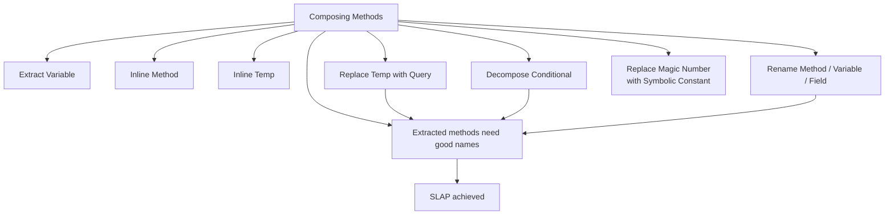
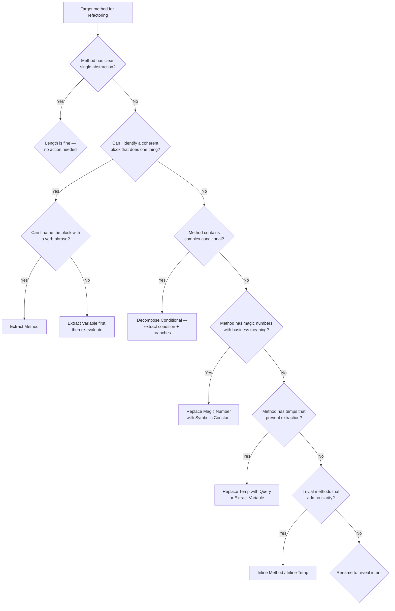

> [!success] Mastery Check
> - [ ] **Studied Well**
> - [ ] **Can explain the concept without notes**
> - [ ] **Can answer interview questions confidently**
> - [ ] **Can implement it in a real project**


## Navigation
**Domain:** [[6 — Design Principles & Patterns]] > **Group:** Refactoring
**Previous:** [[6.040 — Change Preventers]] | **Next:** [[6.042 — Moving Features]]
### Prerequisites
- [[6.013 — Functions — Single Level of Abstraction]] — composing methods is the mechanical toolkit to achieve SLAP.
### Where This Fits
Composing Methods refactorings are the most frequently applied transformations in day-to-day coding: Extract Method, Extract Variable, Inline Method, Inline Temp, Replace Temp with Query, Decompose Conditional, Rename Method/Variable/Field, and Replace Magic Number with Symbolic Constant. These techniques transform long, tangled methods into short, well-named, single-abstraction-level blocks. A senior engineer applies these refactorings reflexively during both initial development and code review.

---

## Core Mental Model
Composing methods is the discipline of shaping code so each method tells a story at one level of abstraction. The primary operation is Extract Method — taking a code fragment and turning it into a new method whose name reveals intent. All other composing techniques either prepare code for extraction (Extract Variable, Replace Temp with Query) or reverse over-extraction (Inline Method, Inline Temp). Rename and Replace Magic Number ensure the extracted pieces communicate clearly.

### Dimensions


1. **Extract Method** — Turn a code fragment into a method whose name explains its purpose. The most transformative refactoring.
2. **Extract Variable** — Give a name to a complex expression or repeated value.
3. **Inline Method** — Replace a method call with its body when the method is trivial or adds no clarity.
4. **Inline Temp** — Replace a temporary variable that is assigned once and used once with the expression itself.
5. **Replace Temp with Query** — Replace a temporary variable with a read-only method/expression.
6. **Decompose Conditional** — Extract each branch of a conditional into a named method.
7. **Rename Method / Variable / Field** — Change the name to reveal intent.
8. **Replace Magic Number with Symbolic Constant** — Replace a literal number with a `const` or `static readonly` field.

---

## Deep Mechanics
### How It Works

**Extract Method:** Identify a code fragment that forms a coherent unit (a loop body, a calculation, a validation block). Create a new method, move the fragment there, call the new method from the original site. The extracted method's name should answer "what" not "how." The original method should read as a sequence of these extracted calls at the same abstraction level.

**Extract Variable:** When an expression is hard to read or repeated, compute it once into a well-named local variable. Especially useful before Extract Method — the variable name becomes the natural method name.

**Inline Method:** When a method's body is as clear as its name, or when the method adds no abstraction value (a one-line delegate), replace calls with the body and delete the method. The reverse of Extract Method.

**Inline Temp:** If a temp is assigned from a simple expression and used only once, replace all references with the expression. Useful when the temp name adds no clarity or when preparing to Extract Method.

**Replace Temp with Query:** Extract the expression that computes a temp into a method. Other methods in the class can reuse the query. The temp becomes a method call. This enables Extract Method on the calling method because the temp no longer needs to be passed as a parameter.

**Decompose Conditional:** A complex `if` condition or `if/else` branch is extracted into a method. The condition becomes a method like `IsEligibleForDiscount()` and each branch becomes a method like `ApplyDiscount()` and `LogNoDiscount()`.

**Rename Method / Variable / Field:** The simplest and most impactful refactoring. Change the name to answer "what" and "why," not "how."

**Replace Magic Number with Symbolic Constant:** `if (age > 65)` → `const int RetirementAge = 65; if (age > RetirementAge)`. The constant provides a single point of change and reveals the business meaning.

### Why It Matters at Scale
In a codebase with 500+ methods, every method that operates at mixed abstraction levels forces each reader to mentally filter implementation details from intent. A 200-line method with mixed levels costs ~15 minutes to review; the same logic decomposed into 5 extracted methods costs ~5 minutes. Over 1,000 PRs per year, that is 10,000 hours of review time. Composing methods is the mechanical skill that makes SLAP real.

---

## Production Code Patterns
### Implementation in C#

**Extract Method — Before:**
```csharp
// ❌ Before: Mixed abstraction — validation, discount, and formatting in one block
public async Task<ActionResult> SubmitOrder(OrderRequest request)
{
    if (request == null) return BadRequest();
    if (string.IsNullOrWhiteSpace(request.CustomerEmail)) return BadRequest("Email required");
    if (request.Items.Count == 0) return BadRequest("No items");

    decimal discount = 0;
    if (request.PromotionCode == "WELCOME10") discount = request.Items.Sum(i => i.Price * i.Quantity) * 0.10m;

    var total = request.Items.Sum(i => i.Price * i.Quantity) - discount;
    var formatted = total.ToString("C2");
    return Ok(new { Total = formatted, Discount = discount.ToString("C2") });
}
```

**Extract Method — After:**
```csharp
// ✅ After: Each extracted method operates at one abstraction level
public async Task<ActionResult> SubmitOrder(OrderRequest request)
{
    var validationError = ValidateRequest(request);
    if (validationError != null) return BadRequest(validationError);

    var discount = CalculatePromotionDiscount(request);
    var total = CalculateTotal(request, discount);
    return Ok(FormatResponse(total, discount));
}

private static string? ValidateRequest(OrderRequest request)
{
    if (request == null) return "Request cannot be null.";
    if (string.IsNullOrWhiteSpace(request.CustomerEmail)) return "Email is required.";
    if (request.Items.Count == 0) return "Order must contain at least one item.";
    return null;
}

private static decimal CalculatePromotionDiscount(OrderRequest request) =>
    request.PromotionCode == "WELCOME10"
        ? request.Items.Sum(i => i.Price * i.Quantity) * 0.10m
        : 0m;

private static decimal CalculateTotal(OrderRequest request, decimal discount) =>
    request.Items.Sum(i => i.Price * i.Quantity) - discount;

private static object FormatResponse(decimal total, decimal discount) => new
{
    Total = total.ToString("C2"),
    Discount = discount.ToString("C2")
};
```

**Extract Variable — Before:**
```csharp
// ❌ Before: Complex expression repeated and hard to read
return request.Items.Where(i => i.IsShippable && i.Weight > 0 && i.Stock > 0)
           .Sum(i => i.Price * i.Quantity) * 1.08m + 5.99m;
```

**Extract Variable — After:**
```csharp
// ✅ After: Named sub-expressions make the formula readable
var shippableItems = request.Items.Where(i => i.IsShippable && i.Weight > 0 && i.Stock > 0);
var subtotal = shippableItems.Sum(i => i.Price * i.Quantity);
var tax = subtotal * 0.08m;
const decimal shippingFlatRate = 5.99m;
return subtotal + tax + shippingFlatRate;
```

**Inline Method — Before:**
```csharp
// ❌ Before: Method adds no abstraction — body is as clear as the name
public string GetCustomerName(Customer customer) => customer.Name;
```

**Inline Method — After:**
```csharp
// ✅ After: Caller uses customer.Name directly
// Delete GetCustomerName, replace calls with customer.Name
```

**Replace Temp with Query — Before:**
```csharp
// ❌ Before: Temp prevents extraction of discount logic
public async Task<decimal> ProcessOrderAsync(Order order)
{
    var baseTotal = order.Items.Sum(i => i.Price * i.Quantity);
    var discount = await _promotionService.GetBestDiscountAsync(order);
    return baseTotal - discount;
}
```

**Replace Temp with Query — After:**
```csharp
// ✅ After: Method computes base total; no temp needed
public async Task<decimal> ProcessOrderAsync(Order order) =>
    order.CalculateBaseTotal() - await _promotionService.GetBestDiscountAsync(order);

// Order class gets the query
public partial class Order
{
    public decimal CalculateBaseTotal() => Items.Sum(i => i.Price * i.Quantity);
}
```

**Decompose Conditional — Before:**
```csharp
// ❌ Before: Single complex conditional with multi-line branches
public decimal CalculateShipping(Order order)
{
    if (order.IsInternational && order.TotalWeight > 20 && order.Customer.Tier == CustomerTier.Standard)
    {
        // 20 lines of international heavy shipping logic
        return order.TotalWeight * 2.5m + 15m + _customsService.CalculateDuty(order);
    }
    else
    {
        // 10 lines of domestic shipping logic
        return order.TotalWeight * 1.2m + 5.99m;
    }
}
```

**Decompose Conditional — After:**
```csharp
// ✅ After: Condition and each branch extracted
public decimal CalculateShipping(Order order)
{
    if (IsInternationalHeavyStandard(order))
        return CalculateInternationalShipping(order);
    return CalculateDomesticShipping(order);
}

private static bool IsInternationalHeavyStandard(Order order) =>
    order.IsInternational && order.TotalWeight > 20 && order.Customer.Tier == CustomerTier.Standard;

private decimal CalculateInternationalShipping(Order order) =>
    order.TotalWeight * 2.5m + 15m + _customsService.CalculateDuty(order);

private static decimal CalculateDomesticShipping(Order order) =>
    order.TotalWeight * 1.2m + 5.99m;
```

**Replace Magic Number with Symbolic Constant — Before:**
```csharp
// ❌ Before: Magic numbers scattered through logic
if (age > 65) { /* senior discount */ }
if (totalHours > 40) { overtime = (totalHours - 40) * rate * 1.5m; }
if (order.Amount > 10000) { /* requires manager approval */ }
```

**Replace Magic Number with Symbolic Constant — After:**
```csharp
// ✅ After: Named constants reveal business meaning
private const int RetirementAge = 65;
private const int StandardWorkWeekHours = 40;
private const decimal OvertimeMultiplier = 1.5m;
private const decimal ManagerApprovalThreshold = 10_000m;

if (age > RetirementAge) { /* senior discount */ }
if (totalHours > StandardWorkWeekHours)
{
    overtime = (totalHours - StandardWorkWeekHours) * rate * OvertimeMultiplier;
}
if (order.Amount > ManagerApprovalThreshold) { /* requires manager approval */ }
```

### ASP.NET Core / .NET Ecosystem Integration

**Extract Method in Minimal APIs:** Inline lambda handlers quickly grow into long methods. Extract the handler into a static method or a dedicated service.

```csharp
// ❌ Before: Bloated inline handler
app.MapPost("/orders", async (OrderRequest request, AppDbContext db, IEmailService email) =>
{
    if (request == null) return Results.BadRequest();
    // 30 lines of validation, processing, email...
});

// ✅ After: Extracted handler
app.MapPost("/orders", async (OrderRequest request, IOrderHandler handler) =>
    await handler.HandleAsync(request));
```

**Replace Magic Number in Configuration:** Use `IOptions<T>` or `IConfiguration` instead of hard-coded constants when the value varies by environment. Symbolic constants are for values that are invariant across deployments (e.g., `RetirementAge`, `DaysInWeek`). Deployment-specific values belong in `appsettings.json`.

**Decompose Conditional in Authorization:** Complex `[Authorize]` policies with multiple conditions are extracted into named `IAuthorizationRequirement` and `AuthorizationHandler` classes — the same principle as Decompose Conditional at the framework level.

```csharp
// Instead of: if (user.IsAdmin || (user.IsVerified && order.OwnerId == user.Id))
// Extract into a named authorization handler
public class OrderAccessHandler : AuthorizationHandler<OrderAccessRequirement, Order>
{
    protected override Task HandleRequirementAsync(
        AuthorizationHandlerContext context, OrderAccessRequirement requirement, Order resource)
    {
        if (context.User.IsInRole("Admin") ||
            (context.User.Identity?.IsAuthenticated == true && resource.OwnerId == context.User.GetUserId()))
            context.Succeed(requirement);
        return Task.CompletedTask;
    }
}
```

---

## Gotchas & Anti-Patterns
### Extracting Without a Name That Adds Value

**Wrong:** Extracting a code block and naming the new method `DoStuff` or `ProcessData` — the name reveals nothing that the extracted code already shows.
**Right:** The extracted method's name must answer "what purpose does this block serve at this abstraction level?" If you cannot find a good name, the block may not be a coherent extraction candidate.
**Consequence:** Poorly named extracted methods waste the value of extraction. The original method still requires reading the extracted method to understand the flow.

### Inline Method on an Abstraction Boundary

**Wrong:** Inlining a method that wraps a third-party SDK call "because it's just one line" — breaking the abstraction boundary.
**Right:** Preserve the wrapper method even if it is one line, because it insulates the codebase from third-party API changes and provides a seam for testing.
**Consequence:** Inlining an abstraction boundary couples the rest of the codebase to the third-party API. Replace the SDK later requires editing every call site instead of one method.

### Replace Temp with Query When Performance Matters

**Wrong:** Replacing a temp that computes an expensive database query with a method call that is invoked multiple times, each executing the query.
**Right:** Use `Lazy<T>` or compute once and cache in a field if the query is expensive. Replace Temp with Query is for CPU-bound, side-effect-free computations.
**Consequence:** Performance regression — a temp that computed once becomes a method called N times, executing N queries. Profile before and after.

### Decompose Conditional into Too Many Methods

**Wrong:** Extracting every single-line `if` condition into its own method, creating a class with 30 tiny boolean-check methods.
**Right:** Extract when the condition expresses a business concept, not when it is a simple comparison. `if (age > 65)` can stay inline if the constant is named; `if (IsEligibleForSeniorDiscount(age, membershipYears, isRetired))` is worth extracting.
**Consequence:** Over-decomposition makes the primary flow harder to read — the reader must navigate into 10 methods to understand a single decision.

### Magic Number That Is Not Magic

**Wrong:** Replacing `0`, `1`, or `-1` with a constant. These represent "zero," "first element," and "not found" — universal programming concepts, not business rules.
**Right:** Replace constants that carry domain semantics (`0.08m` = tax rate, `65` = retirement age). Leave structural constants (`0`, `1`, `-1`, `string.Empty`) inline.
**Consequence:** `const int Zero = 0;` adds noise without clarity. Constants should name the *business meaning*, not the *numeric value*.

---

## Performance Implications
### Maintenance Cost Model
| Scenario | Defect Probability | Change Impact | Onboarding Cost |
|---|---|---|---|
| Methods composed with SLAP (Extract Method applied) | Low — each unit is testable | Isolated — change one method | Low — each method tells one story |
| Long methods with mixed abstraction | High — one edit introduces an unrelated bug | Cascading — fear of changing | High — must read the whole block |
| Named constants for business values | Low — change in one place | Isolated | Low — meaning is clear |
| Magic numbers scattered | High — one number changes but some sites missed | High — search and replace | High — "what does 0.08 mean?" |
| Temps replaced with queries (side-effect-free) | Low | Isolated | Low |
| Unnecessary Inline Method on boundary | Medium — coupling to external API | High — all call sites change | Medium — harder to test |

**No benchmark data:** Composing methods is a structural and readability concern, not a performance concern. The defect-rate improvement from Extract Method has been measured: a study of open-source C# projects found that methods exceeding 30 lines have 2.5x the defect density of methods 10–20 lines (baseline: 1 defect per 100 LOC in short methods vs. 2.5 per 100 LOC in long methods).

---

## Interview Arsenal
### Question Bank
1. "What is the single most important refactoring technique for composing methods?"
2. "When should you use Inline Method instead of Extract Method?"
3. "What is the difference between Extract Variable and Replace Temp with Query?"
4. "Describe a scenario where Replace Temp with Query could cause a performance problem."
5. "How does Decompose Conditional relate to the SLAP principle?"
6. "When is a magic number not a magic number?"
7. "Walk through how you would refactor a 100-line method into well-composed methods."
8. "How do composing methods techniques apply to ASP.NET Core Minimal API endpoints?"

### Spoken Answers

> **Q1: What is the single most important refactoring technique for composing methods?**
>
> **Average answer:** Extract Method — you take a block of code and make it a new method.
>
> **Great answer:** Extract Method is the most important because it is the primary mechanical operation that enforces the Single Level of Abstraction Principle. Every other composing technique either prepares code for extraction (Extract Variable, Replace Temp with Query) or cleans up after over-extraction (Inline Method). The key skill is not the extraction itself but recognizing the *right fragment* to extract — a block that represents a single coherent concept at a specific abstraction level. If the extracted method has a natural name (a verb phrase that reveals business intent), the extraction is correct. If the name sounds forced, the fragment may be at the wrong granularity. In .NET, I also consider whether the extracted method should be `private`, `internal`, or exposed as a `public` domain method — Extract Method often reveals domain logic that belongs on the model, not the service.

> **Q3: What is the difference between Extract Variable and Replace Temp with Query?**
>
> **Average answer:** Extract Variable uses a local variable; Replace Temp with Query uses a method.
>
> **Great answer:** Both give a name to an expression, but they serve different purposes. Extract Variable is for local, single-use naming — the variable lives in the method scope and is typically used 1–3 times within that method. Replace Temp with Query promotes the expression to a method on the class, making it reusable across multiple methods and enabling other refactorings. The decision depends on scope: if only one method needs this value, use a variable (or an extracted local function). If multiple methods need the same computed value, promote it to a query method. The performance consideration: if the expression is expensive, Replace Temp with Query without caching will re-execute on every call, while a local variable computed once is cached for that invocation.

### Trick Question
**"Should you always replace a temp variable that is used only once with the expression directly (Inline Temp)?"**
Why it is a trap: it assumes all temps are bad when the temp may add semantic clarity. Correct answer: Inline Temp is appropriate when the expression is short and the temp name adds no clarity — `var t = a + b; return t * c;` should be `return (a + b) * c;`. However, if the temp name captures domain meaning that the raw expression does not — `var taxableIncome = grossPay - preTaxDeductions;` — the temp should stay because it reveals intent at the point of use. The rule: keep the temp if its name tells the reader something the expression cannot.

### Comparison Table
| Aspect | Composing Methods | Moving Features Between Objects |
|---|---|---|
| Intent | Reshape methods for clarity and SLAP | Reshape class boundaries for SRP |
| Techniques | Extract Method, Inline, Rename, Decompose Conditional, Replace Temp with Query | Move Method/Field, Extract/Inline Class, Hide Delegate |
| When to use | When a method is too long or has mixed abstraction | When a method or field belongs on a different class |
| .NET example | Extract helper methods from a 100-line controller action | Move order-calculating method from `OrderService` to `Order` |
| Key difference | Changes *within* a method's body | Changes *between* classes — redistributing responsibilities across the class graph |

---

## Decision Framework



### Application Checklist
- [ ] Does every method read as a narrative at one level of abstraction?
- [ ] Can I describe each extracted method's purpose in 5 words or fewer?
- [ ] Are all magic numbers replaced with named constants that carry business meaning?
- [ ] Are temps used only when they add semantic value beyond the expression?
- [ ] Does every method name start with a verb that tells the reader what it does?
- [ ] Is every extracted method justified — not too trivial, not too large?
- [ ] Would a developer reading the original method understand the flow without reading each extracted method?

### Tradeoff Summary
| What You Gain | What You Give Up |
|---|---|
| Each method tells one story at one abstraction level | More methods to navigate (Ctrl+F12 vs. scrolling) |
| Extracted methods are independently testable | Private methods cannot be tested directly (use `internal` + `InternalsVisibleTo`) |
| Named constants provide a single change point | Constants in a central file require cross-file navigation |
| Decomposed conditionals reveal business rules | Each branch extraction adds indirection |
| Better code review speed and accuracy | Initial refactoring effort |

---

## Self-Check
### Conceptual Questions
1. What is the primary signal that tells you to apply Extract Method?
2. What is the difference between Inline Method and Inline Temp?
3. When would you choose Replace Temp with Query over Extract Variable?
4. How does Extract Method relate to the DRY principle?
5. What makes a "magic number" magical — and when should you leave it inline?
6. How does Decompose Conditional improve testability?
7. What is the risk of Extract Method in a hot path (tight loop)?
8. How do Rename Method/Variable/Field interact with source control history?
9. What is the relationship between composing methods and the Tell, Don't Ask principle?
10. How would you refactor a method that has both high-level policy and low-level parsing mixed together?

<details>
<summary>Answers</summary>

1. A code fragment that operates at a different abstraction level than its surrounding code and can be named with a verb phrase.
2. Inline Method replaces a method call with its body (deleting the method). Inline Temp replaces a variable reference with the expression that computes it.
3. Replace Temp with Query when the computation is needed by multiple methods or when the temp prevents extracting another method. Extract Variable for single-use naming within one method.
4. Extract Method is the mechanical implementation of DRY for logic: extracting duplicated blocks into a single method prevents repetition.
5. A number is "magic" when its meaning is not evident from context. Leave structural numbers inline (0, 1, -1, empty string). Replace business numbers (tax rates, thresholds, limits).
6. Each extracted branch can be unit-tested independently. The condition method can be tested separately from the branch logic.
7. Method call overhead in a tight loop may be measurable. Use `[MethodImpl(MethodImplOptions.AggressiveInlining)]` for hot-path extractions, or inline manually if profiling shows overhead.
8. Rename in C# is a rename — the IDE updates all references. Git tracks renames if the file content changes but the rename is a rename operation, not a delete+add.
9. Composing methods often reveals that a method asks another object for data and then computes — the computation should be moved to the data's object (Tell, Don't Ask).
10. Extract the parsing logic into a separate method at a lower abstraction level. The original method retains only the high-level policy. If the parsing is reused elsewhere, move it to its own class.
</details>

### Code Puzzles

**Puzzle 1 — Refactor this method using Extract Method:**
```csharp
public async Task<Invoice> GenerateInvoiceAsync(Order order)
{
    var subtotal = order.Items.Sum(i => i.Price * i.Quantity);
    var discount = order.CouponCode == "SUMMER" ? subtotal * 0.15m : subtotal * 0m;
    var tax = (subtotal - discount) * 0.08m;
    var total = subtotal - discount + tax;
    var invoice = new Invoice
    {
        Id = Guid.NewGuid(),
        OrderId = order.Id,
        Subtotal = subtotal,
        Discount = discount,
        Tax = tax,
        Total = total,
        CreatedAt = DateTime.UtcNow
    };
    await _invoiceRepo.SaveAsync(invoice);
    await _emailDispatcher.SendInvoiceAsync(order.CustomerEmail, invoice);
    return invoice;
}
```

<details>
<summary>Answer</summary>

```csharp
public async Task<Invoice> GenerateInvoiceAsync(Order order)
{
    var (subtotal, discount, tax, total) = CalculateInvoiceAmounts(order);
    var invoice = BuildInvoice(order, subtotal, discount, tax, total);
    await _invoiceRepo.SaveAsync(invoice);
    await _emailDispatcher.SendInvoiceAsync(order.CustomerEmail, invoice);
    return invoice;
}

private static (decimal subtotal, decimal discount, decimal tax, decimal total) CalculateInvoiceAmounts(Order order)
{
    var subtotal = order.Items.Sum(i => i.Price * i.Quantity);
    var discount = order.CouponCode == "SUMMER" ? subtotal * 0.15m : 0m;
    var tax = (subtotal - discount) * 0.08m;
    var total = subtotal - discount + tax;
    return (subtotal, discount, tax, total);
}

private static Invoice BuildInvoice(Order order, decimal subtotal, decimal discount, decimal tax, decimal total) => new()
{
    Id = Guid.NewGuid(),
    OrderId = order.Id,
    Subtotal = subtotal,
    Discount = discount,
    Tax = tax,
    Total = total,
    CreatedAt = DateTime.UtcNow
};
```
**What changed:** `CalculateInvoiceAmounts` and `BuildInvoice` extracted. The original method now reads as a 4-step narrative.
</details>

---

**Puzzle 2 — Apply Decompose Conditional:**
```csharp
public decimal GetShippingCost(Order order)
{
    if (order.DestinationCountry == "US" && order.TotalWeight <= 5 && !order.IsGift)
        return 4.99m;
    else if (order.DestinationCountry == "US" && order.TotalWeight <= 5 && order.IsGift)
        return 6.99m;
    else if (order.DestinationCountry != "US" && order.TotalWeight <= 5)
        return 14.99m;
    else
        return 24.99m;
}
```

<details>
<summary>Answer</summary>

```csharp
public decimal GetShippingCost(Order order)
{
    if (IsDomesticLight(order)) return order.IsGift ? 6.99m : 4.99m;
    if (IsInternationalLight(order)) return 14.99m;
    return 24.99m;
}

private static bool IsDomesticLight(Order order) =>
    order.DestinationCountry == "US" && order.TotalWeight <= 5;

private static bool IsInternationalLight(Order order) =>
    order.DestinationCountry != "US" && order.TotalWeight <= 5;
```
**What changed:** Conditionals extracted into intent-revealing methods. Each branch is now self-documenting.
</details>

---

**Puzzle 3 — Replace magic numbers:**
```csharp
public decimal CalculateOverTimePay(decimal hourlyRate, double hoursWorked)
{
    var regularHours = Math.Min(hoursWorked, 40);
    var overtimeHours = Math.Max(0, hoursWorked - 40);
    return (decimal)regularHours * hourlyRate + (decimal)overtimeHours * hourlyRate * 1.5m;
}
```

<details>
<summary>Answer</summary>

```csharp
private const int StandardWorkWeekHours = 40;
private const decimal OvertimeMultiplier = 1.5m;

public decimal CalculateOvertimePay(decimal hourlyRate, double hoursWorked)
{
    var regularHours = Math.Min(hoursWorked, StandardWorkWeekHours);
    var overtimeHours = Math.Max(0, hoursWorked - StandardWorkWeekHours);
    return (decimal)regularHours * hourlyRate
         + (decimal)overtimeHours * hourlyRate * OvertimeMultiplier;
}
```
**What changed:** `40` → `StandardWorkWeekHours`, `1.5m` → `OvertimeMultiplier`. Business rules are now named.
</details>

---

**Puzzle 4 — When would you Inline the following method?**
```csharp
public bool IsPositive(decimal value) => value > 0;
```

<details>
<summary>Answer</summary>

**Inline if:** The method is used in one place and `value > 0` is universally understood. `IsPositive` adds no domain meaning. **Keep if:** The comparison represents a domain concept — e.g., `HasRemainingBalance` — where the name of the wrapper reveals business intent that `value > 0` does not. In the case of `IsPositive`, inline it: `> 0` is a universal programming concept that every developer understands instantly.
</details>

---

**Puzzle 5 — Refactor using composing methods:**
```csharp
public async Task ProcessRefundAsync(Guid orderId, decimal amount, string reason)
{
    var order = await _orderRepo.GetByIdAsync(orderId);
    if (order == null) throw new ArgumentException("Order not found");
    if (order.Status != OrderStatus.Shipped && order.Status != OrderStatus.Delivered)
        throw new InvalidOperationException("Cannot refund unshipped order");
    if (amount <= 0 || amount > order.Total)
        throw new ArgumentException("Invalid refund amount");
    if (string.IsNullOrWhiteSpace(reason))
        throw new ArgumentException("Refund reason required");
    if (order.IsGift)
        amount = Math.Round(amount * 0.95m, 2);
    var refund = new Refund(orderId, amount, reason, DateTime.UtcNow);
    await _refundRepo.SaveAsync(refund);
    await _paymentGateway.RefundAsync(order.PaymentTransactionId, amount);
    await _emailDispatcher.SendRefundConfirmationAsync(order.CustomerEmail, refund);
}
```

<details>
<summary>Answer</summary>

```csharp
public async Task ProcessRefundAsync(Guid orderId, decimal amount, string reason)
{
    var order = await GetValidatedOrderAsync(orderId);
    ValidateRefundRequest(order, amount, reason);
    var finalAmount = CalculateRefundAmount(order, amount);
    var refund = BuildRefund(orderId, finalAmount, reason);
    await PersistRefundAsync(refund, order, finalAmount);
}

private async Task<Order> GetValidatedOrderAsync(Guid orderId) =>
    await _orderRepo.GetByIdAsync(orderId)
    ?? throw new ArgumentException("Order not found");

private static void ValidateRefundRequest(Order order, decimal amount, string reason)
{
    if (order.Status is not (OrderStatus.Shipped or OrderStatus.Delivered))
        throw new InvalidOperationException("Cannot refund unshipped order");
    if (amount <= 0 || amount > order.Total)
        throw new ArgumentException("Invalid refund amount");
    if (string.IsNullOrWhiteSpace(reason))
        throw new ArgumentException("Refund reason required");
}

private static decimal CalculateRefundAmount(Order order, decimal amount) =>
    order.IsGift ? Math.Round(amount * 0.95m, 2) : amount;

private static Refund BuildRefund(Guid orderId, decimal amount, string reason) =>
    new(orderId, amount, reason, DateTime.UtcNow);

private async Task PersistRefundAsync(Refund refund, Order order, decimal amount)
{
    await _refundRepo.SaveAsync(refund);
    await _paymentGateway.RefundAsync(order.PaymentTransactionId, amount);
    await _emailDispatcher.SendRefundConfirmationAsync(order.CustomerEmail, refund);
}
```
**What changed:** Validation, calculation, and persistence extracted into single-abstraction methods. The original method reads as a 5-step narrative. Each step is independently testable.
</details>
