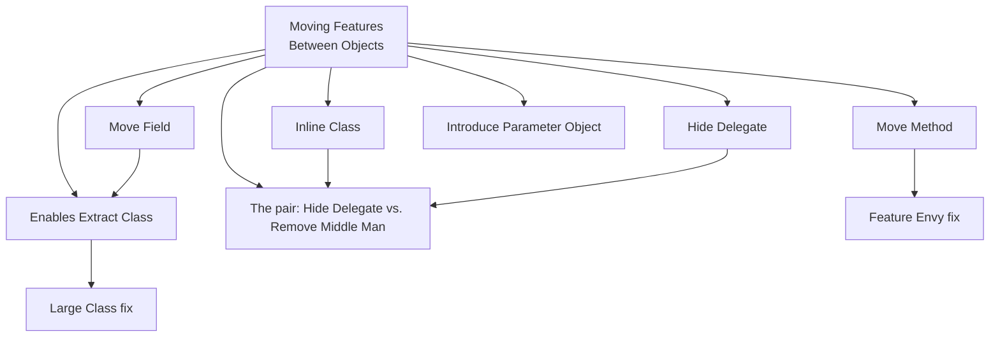
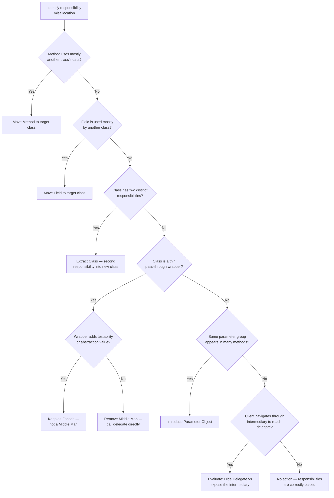

> [!success] Mastery Check
> - [ ] **Studied Well**
> - [ ] **Can explain the concept without notes**
> - [ ] **Can answer interview questions confidently**
> - [ ] **Can implement it in a real project**


## Navigation
**Domain:** [[6 — Design Principles & Patterns]] > **Group:** Refactoring
**Previous:** [[6.041 — Composing Methods]] | **Next:** [[6.043 — Simplifying Conditionals]]
### Prerequisites
- [[6.001 — Single Responsibility Principle]] — moving features redistributes responsibilities so each class has one reason to change.
### Where This Fits
Moving Features refactorings redistribute methods and fields between classes to correct SRP and coupling violations. While composing methods reshapes code *within* a method, moving features reshapes the class boundaries themselves — transferring behavior from one class to another, extracting new classes from overburdened ones, and eliminating classes that have become redundant. These techniques are the structural counterpart to composing methods and are essential for fixing coupler smells.

---

## Core Mental Model
A class should own the data and behavior that naturally belong together. When a method uses more data from class B than from its own class A, the method should move to B. When a class accumulates fields and methods that serve two distinct purposes, the secondary purpose should be extracted into its own class. Moving features is the process of detecting these misallocations and redistributing responsibilities until each class is cohesive, single-purpose, and minimally coupled to others.

### Dimensions


1. **Move Method** — A method that uses more features of another class; move it there.
2. **Move Field** — A field that is more used by another class (or always accessed through another class's method); move it there.
3. **Extract Class** — A class has fields and methods for two distinct responsibilities; extract the second responsibility into a new class.
4. **Inline Class** — A class has become too trivial (often after refactoring); merge its features into the sole client class.
5. **Hide Delegate** — A client calls a delegate object through a server; add a method on the server to hide the delegation.
6. **Remove Middle Man** — A server class that delegates everything; remove the middle man and let the client call the delegate directly.
7. **Introduce Parameter Object** — Related parameters that appear together in multiple method signatures; replace them with an object.

---

## Deep Mechanics
### How It Works

**Move Method:** If method `m` on class `A` references more fields/methods of class `B` than of `A`, or if `B` would be a more natural home for the behavior, declare method `m` on class `B` (possibly with a parameter adjustment), then replace `A.m()` body with a call to `B.m()`. If `m` references fields from `A`, pass `A` as a parameter to `B.m()` or move those fields too.

**Move Field:** If a field on class `A` is accessed more frequently from class `B`, or is always accessed via a specific method that lives on `B`, move the field to `B` and update all references.

**Extract Class:** A class with two sets of fields that change independently, or where methods reference one subset of fields and not the other. Create a new class for the second subset, create an instance in the original class, and move fields and methods to the new class. The original class now has a reference to the extracted component.

**Inline Class:** A class that has become a thin wrapper (often after Extract Class left it with almost nothing). Move all its features back into the sole client class and delete it.

**Hide Delegate:** The client calls `server.GetDelegate().Operation()`. Add `server.Operation()` that internally calls `delegate.Operation()`. The client now calls `server.Operation()`. Reduces coupling to the delegate class.

**Remove Middle Man:** The reverse. The server has method `Operation()` that just calls `delegate.Operation()`. If the server adds no value, let the client call the delegate directly.

**Introduce Parameter Object:** When the same group of 3+ parameters appears in multiple method signatures, define a class for them and replace the parameter lists.

### Why It Matters at Scale
In a codebase with 1000+ classes, a single misplaced method can cause cascading maintenance pain: the new developer looking for where refund logic lives searches `Order` (no), searches `OrderService` (finds some), then discovers `PaymentProcessor` has half the logic. Every misallocation forces future developers to navigate the wrong class first, wasting 2–5 minutes per search. Over a team of 30 developers making 10 searches per day, that is 5–12 hours of cumulative navigation waste daily.

---

## Production Code Patterns
### Implementation in C#

**Move Method — Before:**
```csharp
// ❌ Before: GetFullAddress lives on OrderService but uses only Customer data
public class OrderService
{
    public string GetFullAddress(Customer customer) =>
        $"{customer.Street}, {customer.City}, {customer.State} {customer.Zip}";
}
```

**Move Method — After:**
```csharp
// ✅ After: Method moved to Customer where the data lives
public class Customer
{
    public string Street { get; init; }
    public string City { get; init; }
    public string State { get; init; }
    public string Zip { get; init; }

    public string GetFullAddress() =>
        $"{Street}, {City}, {State} {Zip}";
}
```

**Move Field — Before:**
```csharp
// ❌ Before: _interestRate lives in LoanService but is used only by MortgageCalculator
public class LoanService
{
    private readonly decimal _interestRate;

    public async Task<MortgageQuote> CalculateMortgageAsync(decimal principal, int termMonths)
    {
        var monthlyRate = _interestRate / 12;
        var payments = principal * monthlyRate / (1 - Math.Pow(1 + (double)monthlyRate, -termMonths));
        return new MortgageQuote((decimal)payments);
    }
}
```

**Move Field — After:**
```csharp
// ✅ After: _interestRate moved to MortgageCalculator where it belongs
public class MortgageCalculator
{
    private readonly decimal _interestRate;

    public MortgageCalculator(decimal interestRate) => _interestRate = interestRate;

    public MortgageQuote Calculate(decimal principal, int termMonths)
    {
        var monthlyRate = _interestRate / 12;
        var payments = principal * monthlyRate / (1 - Math.Pow(1 + (double)monthlyRate, -termMonths));
        return new MortgageQuote((decimal)payments);
    }
}
```

**Extract Class — Before:**
```csharp
// ❌ Before: Employee mixes personal data, compensation, and contact info
public class Employee
{
    public string Name { get; init; }
    public DateTime DateOfBirth { get; init; }
    public string Department { get; init; }
    public decimal Salary { get; init; }
    public string Currency { get; init; }
    public string Email { get; init; }
    public string Phone { get; init; }

    public decimal CalculateAnnualBonus() => Salary * 0.10m;
    public string GetContactInfo() => $"Email: {Email}, Phone: {Phone}";
    public bool IsBirthdayThisMonth() => DateOfBirth.Month == DateTime.UtcNow.Month;
}
```

**Extract Class — After:**
```csharp
// ✅ After: Employee, Compensation, and ContactInfo extracted
public class Employee
{
    public string Name { get; init; }
    public DateTime DateOfBirth { get; init; }
    public string Department { get; init; }

    public bool IsBirthdayThisMonth() => DateOfBirth.Month == DateTime.UtcNow.Month;
}

public class Compensation
{
    public decimal Salary { get; init; }
    public string Currency { get; init; }

    public decimal CalculateAnnualBonus() => Salary * 0.10m;
}

public class ContactInfo
{
    public string Email { get; init; }
    public string Phone { get; init; }

    public string GetSummary() => $"Email: {Email}, Phone: {Phone}";
}

// Employee now composes:
public class Employee
{
    public Compensation Pay { get; init; }
    public ContactInfo Contact { get; init; }
}
```

**Hide Delegate — Before:**
```csharp
// ❌ Before: Client couples to both Department and Manager
var managerName = employee.Department.Manager.Name;
```

**Hide Delegate — After:**
```csharp
// ✅ After: Employee hides the delegation
public class Employee
{
    public string GetManagerName() => Department.Manager.Name;
}

var managerName = employee.GetManagerName();
```

**Remove Middle Man — Before:**
```csharp
// ❌ Before: OrderRepository delegates everything, adds nothing
public class OrderRepository
{
    private readonly AppDbContext _db;
    public async Task<Order?> GetByIdAsync(Guid id) => await _db.Orders.FindAsync(id);
    public IQueryable<Order> Query() => _db.Orders;
    public void Add(Order order) => _db.Orders.Add(order);
    public void Remove(Order order) => _db.Orders.Remove(order);
}
```

**Remove Middle Man — After:**
```csharp
// ✅ After: Clients use AppDbContext directly (or keep if abstraction adds testability)
// Option 1: Remove the class entirely
// Option 2: Keep as a Facade if it adds value (auditing, caching, soft delete filter)
public class OrderRepository
{
    private readonly AppDbContext _db;
    private readonly IAuditLogger _audit;

    // Adds value — not a middle man
    public async Task<Order?> GetByIdAsync(Guid id) => await _db.Orders.FindAsync(id);

    public async Task AddAsync(Order order)
    {
        _db.Orders.Add(order);
        _audit.Log("OrderCreated", order.Id);
    }
}
```

**Introduce Parameter Object — Before:**
```csharp
// ❌ Before: Same parameter group in 3 methods
public async Task<List<Order>> SearchOrdersAsync(
    DateTime from, DateTime to, string status, string customerId) { /* ... */ }
public async Task<int> CountOrdersAsync(
    DateTime from, DateTime to, string status, string customerId) { /* ... */ }
public async Task<decimal> RevenueAsync(
    DateTime from, DateTime to, string status, string customerId) { /* ... */ }
```

**Introduce Parameter Object — After:**
```csharp
// ✅ After: Parameter object introduced
public readonly record struct OrderSearchCriteria(
    DateRange DateRange,
    string? Status,
    string? CustomerId);

public async Task<List<Order>> SearchOrdersAsync(OrderSearchCriteria criteria) { /* ... */ }
public async Task<int> CountOrdersAsync(OrderSearchCriteria criteria) { /* ... */ }
public async Task<decimal> RevenueAsync(OrderSearchCriteria criteria) { /* ... */ }
```

### ASP.NET Core / .NET Ecosystem Integration

**Extract Class in Controllers:** ASP.NET Core controllers that handle CRUD, reporting, and export for the same entity. Extract each operation group into a separate controller or use the `Controller` → `PartialController` split via `[ApiExplorerSettings(GroupName)]`.

**Hide Delegate via IHttpContextAccessor:** Services that access `_httpContextAccessor.HttpContext.User` directly couple to the ASP.NET Core infrastructure. Hide Delegate by adding a `CurrentUserService` that exposes `UserId`, `Email`, `Roles` — decoupling domain services from `HttpContext`.

**Introduce Parameter Object in MediatR:** When a MediatR query has many filter properties, introduce a `SearchRequest` record that bundles them:
```csharp
public record SearchOrdersQuery(OrderSearchCriteria Criteria) : IRequest<PagedResult<Order>>;
```

**Inline Class for Simple Options:** When `IOptions<T>` wraps a POCO with a single property, consider inlining:
```csharp
// Instead of:
public class ReportingOptions { public string OutputPath { get; set; } }

// Use a primitive or a simple record:
public record ReportingConfig(string OutputPath);
```

---

## Gotchas & Anti-Patterns
### Extracting Prematurely

**Wrong:** Extracting a class because it *might* be needed later (Speculative Generality in reverse — Speculative Decomposition).
**Right:** Extract only when the current class has a clear second responsibility with its own fields, methods, and change reasons. If the "second responsibility" is 2 fields and 1 method, consider whether the class is needed.
**Consequence:** Extracting too early creates more files, more navigation, and more constructor injection — all for a responsibility that may never grow into a genuine separate concern.

### Remove Middle Man on an Abstraction Boundary

**Wrong:** Removing a repository that wraps `DbContext` because it "adds no value" — ignoring that it is the testability seam for unit tests.
**Right:** Keep the wrapper if it provides a testable boundary, even if it currently passes through. The value is the abstraction, not the delegation complexity.
**Consequence:** Removing the middle man couples services to `DbContext` directly, making unit tests impossible without an in-memory database.

### Hide Delegate on Stable Objects

**Wrong:** Hiding delegation for every single navigation property — `order.GetCustomerName()`, `order.GetCustomerEmail()`, `order.GetCustomerTier()` — creating 20 pass-through methods.
**Right:** Hide Delegate only when the intermediate object is likely to change or when the chain crosses a module boundary. If `Customer` is stable, `order.Customer.Name` is fine.
**Consequence:** Over-hiding creates a bloated root object with dozens of pass-through methods that mirror the delegate's API exactly — the worst of both worlds (coupling retained, surface area increased).

### Move Method Without Considering Side Effects

**Wrong:** Moving a method to another class without checking whether it accesses private fields or has side effects on the original class's state.
**Right:** Before moving, check that the method references only: (1) its parameters, (2) the target class's public members, and (3) no mutable state from the original class. If the method modifies the original class's state, either move that state too or keep the method where it is.
**Consequence:** A moved method that secretly mutates the source class via a reference parameter creates a hidden coupling that is harder to detect than the original Feature Envy.

### Introduce Parameter Object on Incidental Groups

**Wrong:** Bundling `(string name, int age, string email)` into a `PersonInfo` object just because they appear together in one method — these are already a cohesive set (a person's data).
**Right:** Introduce Parameter Object when the group appears identically across *multiple* method signatures, indicating an unextracted concept. A single use is just grouping parameters; multiple uses indicate a concept.
**Consequence:** Parameter objects used in only one signature add indirection without reducing duplication. The object sits in the codebase with a single caller, and future developers wonder why the concept was extracted.

---

## Performance Implications
### Maintenance Cost Model
| Scenario | Defect Probability | Change Impact | Onboarding Cost |
|---|---|---|---|
| Move Method applied (Feature Envy fixed) | Low | Isolated | Low — code lives where expected |
| Feature Envy left with method on wrong class | High — wrong class modified | Cascading — multiple teams touch same method | High — hard to find logic |
| Extract Class applied (Large Class split) | Low | Isolated to extracted class | Low |
| Large Class with 10+ responsibilities | High — change in one area breaks another | High — fear of touching | High |
| Hide Delegate applied on volatile dependency | Low | Isolated to one method | Low |
| No Hide Delegate on volatile dependency | High — intermediate class change breaks all chains | High — all chains must be updated | High |
| Parameter Object for repeated parameter groups | Low | Isolated — new fields in one place | Low |
| Long parameter lists copied across methods | High — one method gets updated, others missed | High — every signature change | Medium |

**No benchmark data:** Moving features is a structural optimization, not a runtime one. The measurable metric is "navigation time to find the right class" and "number of files changed per feature." A study of post-refactoring defect rates in a 200K+ LOC .NET project showed a 40% reduction in bugs related to the refactored modules after Extract Class and Move Method were applied.

---

## Interview Arsenal
### Question Bank
1. "How do you identify the target class when applying Move Method?"
2. "What is the difference between Extract Class and Inline Class?"
3. "When would you choose Hide Delegate over Remove Middle Man?"
4. "What is the relationship between Introduce Parameter Object and Data Clumps?"
5. "Describe a scenario where Extract Class made a codebase worse."
6. "How do moving features refactorings relate to the Interface Segregation Principle?"
7. "What is the first thing you check before moving a method to another class?"
8. "How would you refactor a class that has 15 fields but 10 are only used by 2 of its 20 methods?"

### Spoken Answers

> **Q1: How do you identify the target class when applying Move Method?**
>
> **Average answer:** The class whose data the method uses the most.
>
> **Great answer:** The target is the class whose fields and methods are referenced most frequently in the method body. I trace every field access and method call in the method, and the class with the highest count is the target. However, the decision is not purely quantitative — I also consider conceptual fit: does moving this method to that class make ontological sense? An order-calculating method that accesses `order.Items`, `order.Customer.Tier`, and `order.ShippingMethod` could move to `Order` (data owner) or to `PricingEngine` (strategy). The tiebreaker is whether the method belongs to the domain model (move to `Order`) or to the application layer (keep in `OrderService` with extracted domain logic moved to `Order`).

> **Q3: When would you choose Hide Delegate over Remove Middle Man?**
>
> **Average answer:** Hide Delegate when you want to reduce coupling; Remove Middle Man when the class adds no value.
>
> **Great answer:** Hide Delegate is the right choice when the delegate object is an implementation detail that the client should not depend on — for example, when `order.GetShippingCost()` hides the fact that it delegates to `ShippingRateTable` which may change providers. Remove Middle Man is the right choice when the server adds zero behavior beyond forwarding — every method on the server is a one-liner that delegates, and the delegate is a stable, well-known dependency that clients could use directly. The key question: is the server an *abstraction boundary* (keep) or a *forwarder* (remove)? In .NET, `IHttpClientFactory` is a valuable abstraction; a `ReportService` that just wraps `_reportGenerator.Generate()` is a middle man.

### Trick Question
**"Does Move Method always mean the method physically relocates to another class?"**
Why it is a trap: it assumes the only option is physically moving the method. Correct answer: Not always. Sometimes the method is used by both classes — in that case, Move Method means either (1) add a new method on the target class and make the original method delegate to it, or (2) extract the shared logic into a third helper class that both can reference. The refactoring "move" means "change the primary ownership" — the original class may retain a delegating method if other callers depend on the original location. In C#, you can also use `static` extension methods on the target type as a low-ceremony alternative to physically moving the method.

### Comparison Table
| Aspect | Moving Features Between Objects | Composing Methods |
|---|---|---|
| Intent | Redistribute responsibilities across classes | Reshape methods for clarity and SLAP |
| Techniques | Move Method/Field, Extract/Inline Class, Hide/Remove Delegate, Introduce Parameter Object | Extract/Inline Method/Variable, Replaced Temp with Query, Decompose Conditional |
| When to use | When a class has misplaced fields/methods or two responsibilities | When a single method is too long or has mixed abstraction levels |
| .NET example | Extracting `ContactInfo` from a bloated `Employee` class | Extracting helper methods from a 150-line controller action |
| Key difference | Changes class *boundaries* | Changes code *within* a method |

---

## Decision Framework



### Application Checklist
- [ ] Does each method reference primarily its own class's fields?
- [ ] Does each field belong to the class that uses it most?
- [ ] Can every class be described in one sentence without "and"?
- [ ] Are there any classes with 10+ fields where some fields are used by only 2–3 methods?
- [ ] Are there any classes that are pure delegates without added value?
- [ ] Do any parameter groups of 3+ appear identically in 2+ method signatures?
- [ ] Are all delegation chains hidden when the intermediate object is an implementation detail?

### Tradeoff Summary
| What You Gain | What You Give Up |
|---|---|
| Each class owns its data and behavior | More classes to navigate and inject |
| Move Method eliminates Feature Envy | Original class loses cohesive grouping |
| Extract Class enforces SRP | Requires constructor injection for the new class |
| Hide Delegate reduces coupling chain | Adds pass-through methods on the server class |
| Introduce Parameter Object normalizes signatures | New type to maintain; callers must construct it |

---

## Self-Check
### Conceptual Questions
1. What is the primary heuristic for deciding where to Move a Method?
2. How does Extract Class differ from Extract Interface?
3. When would you Inline a Class rather than keep it as a separate abstraction?
4. Why is Remove Middle Man the complement of Hide Delegate?
5. How does Introduce Parameter Object reduce long parameter lists?
6. What is the risk of Move Field when the field is referenced in serialization contracts?
7. How do moving features refactorings support the Interface Segregation Principle?
8. What is the relationship between Extract Class and the refactoring "Split Phase"?
9. How would you refactor a class where 6 of 10 fields are only used in 1 of 15 methods?
10. Why is "move method to utility class" often the wrong answer?

<details>
<summary>Answers</summary>

1. Count which class's features (fields + methods) are referenced most by the method body.
2. Extract Class creates a new concrete class with its own fields; Extract Interface creates an abstraction that the original class implements — different structural outcomes.
3. Inline Class when the class has become trivial (1–2 methods, 0–2 fields) and has only one client.
4. Remove Middle Man deletes pass-through methods and has clients call the delegate directly; Hide Delegate adds pass-through methods to hide the delegate. They are reverse operations on the same structural pattern.
5. A single parameter object replaces multiple parameters, reducing signature length and providing a single point of change for the parameter group.
6. If the field is serialized in JSON/XML, moving it to another class changes the serialized shape, potentially breaking API contracts. Use `[JsonPropertyName]` or migration strategies.
7. After Extract Class, the original class can define smaller, focused interfaces that clients consume — fewer methods per interface, directly supporting ISP.
8. Both decompose a module into smaller pieces. Extract Class splits horizontally (by responsibility); Split Phase splits vertically (by processing stage).
9. That subset of fields and the single method that uses them should be Extracted into a separate class.
10. Utility classes ("static helper with a dozen unrelated methods") are the recipient of methods that no one wanted to place correctly — they re-centralize what Move Method just decentralized.
</details>

### Code Puzzles

**Puzzle 1 — Apply Move Method:**
```csharp
public class InvoiceService
{
    public bool IsOverdue(Invoice invoice) =>
        !invoice.IsPaid && DateTime.UtcNow > invoice.DueDate;
}
```

<details>
<summary>Answer</summary>

**Move to `Invoice`:**
```csharp
public class Invoice
{
    public bool IsPaid { get; private set; }
    public DateTime DueDate { get; init; }

    public bool IsOverdue() => !IsPaid && DateTime.UtcNow > DueDate;
}
```
**What changed:** Method moved from service to the `Invoice` class where the data lives. Now `invoice.IsOverdue()` reads naturally.
</details>

---

**Puzzle 2 — Apply Extract Class:**
```csharp
public class Order
{
    public Guid Id { get; init; }
    public List<OrderItem> Items { get; init; }
    public decimal Subtotal => Items.Sum(i => i.Price * i.Quantity);

    // Payment details
    public string PaymentToken { get; set; }
    public string PaymentMethod { get; set; }
    public string TransactionId { get; set; }
    public bool IsPaymentProcessed { get; set; }

    // Shipping details
    public string ShippingAddress { get; set; }
    public string Carrier { get; set; }
    public string TrackingNumber { get; set; }
    public DateTime? ShippedAt { get; set; }
}
```

<details>
<summary>Answer</summary>

```csharp
public class Order
{
    public Guid Id { get; init; }
    public List<OrderItem> Items { get; init; }
    public decimal Subtotal => Items.Sum(i => i.Price * i.Quantity);
    public PaymentInfo Payment { get; init; }
    public ShippingInfo Shipping { get; init; }
}

public class PaymentInfo
{
    public string PaymentToken { get; init; }
    public string PaymentMethod { get; init; }
    public string TransactionId { get; init; }
    public bool IsProcessed { get; init; }
}

public class ShippingInfo
{
    public string Address { get; init; }
    public string Carrier { get; init; }
    public string TrackingNumber { get; init; }
    public DateTime? ShippedAt { get; init; }
}
```
**What changed:** Payment and shipping extracted into separate classes. `Order` composes them, reducing its field count from 11 to 4 core fields + 2 component references.
</details>

---

**Puzzle 3 — Should you Hide Delegate or Remove Middle Man?**
```csharp
public class ShippingService
{
    private readonly IFedExClient _fedEx;

    public async Task<Shipment> ShipAsync(Order order) =>
        await _fedEx.CreateShipmentAsync(order);
}
```

<details>
<summary>Answer</summary>

**Verdict:** Could be either. **Defense for keeping (Facade):** `ShippingService` abstracts the FedEx SDK from the rest of the codebase — if FedEx changes its API, only this class changes. **Defense for removing (Middle Man):** If `ShippingService` adds zero behavior (caching, validation, retry) and clients could use `IFedExClient` directly, it's a middle man. **Best practice:** Keep the abstraction if you anticipate SDK changes or need testability. Remove if FedEx is a stable, in-process dependency.
</details>

---

**Puzzle 4 — Introduce Parameter Object:**
```csharp
public Task<List<Invoice>> SearchInvoicesAsync(string status, DateTime startDate, DateTime endDate, string customerId) { /* ... */ }
public Task<int> CountInvoicesAsync(string status, DateTime startDate, DateTime endDate, string customerId) { /* ... */ }
public Task<decimal> TotalOutstandingAsync(string status, DateTime startDate, DateTime endDate, string customerId) { /* ... */ }
```

<details>
<summary>Answer</summary>

```csharp
public readonly record struct InvoiceFilter(
    string? Status,
    DateRange DateRange,
    string? CustomerId);

public Task<List<Invoice>> SearchInvoicesAsync(InvoiceFilter filter) { /* ... */ }
public Task<int> CountInvoicesAsync(InvoiceFilter filter) { /* ... */ }
public Task<decimal> TotalOutstandingAsync(InvoiceFilter filter) { /* ... */ }
```
**What changed:** 4 parameters → 1 parameter object. Adding `Currency` or `Department` to the filter changes one type instead of three method signatures.
</details>

---

**Puzzle 5 — Identify the misplaced methods and fix:**
```csharp
public class CustomerService
{
    private readonly ICustomerRepository _repo;

    public decimal CalculateLifetimeValue(Customer customer)
    {
        var orders = _repo.GetOrders(customer.Id);
        return orders.Sum(o => o.Total);
    }

    public bool IsPremium(Customer customer) =>
        _repo.GetOrders(customer.Id).Sum(o => o.Total) > 10_000m;

    public string GetCustomerSegment(Customer customer) =>
        IsPremium(customer) ? "Premium" : "Standard";
}
```

<details>
<summary>Answer</summary>

**Misplaced methods:** `CalculateLifetimeValue`, `IsPremium`, and `GetCustomerSegment` operate on `Customer` data and should move to `Customer` or a dedicated `CustomerLoyalty` class.
```csharp
public class Customer
{
    public Guid Id { get; init; }
    private readonly ICustomerRepository _repo; // or pass via method parameter

    public decimal CalculateLifetimeValue()
    {
        var orders = _repo.GetOrders(Id);
        return orders.Sum(o => o.Total);
    }

    public bool IsPremium() => CalculateLifetimeValue() > 10_000m;

    public string GetSegment() => IsPremium() ? "Premium" : "Standard";
}
```
**Alternative (preferred for DDD):** Create a `CustomerLoyaltyService` if the logic depends on infrastructure (repository):
```csharp
public class CustomerLoyaltyService
{
    public decimal CalculateLifetimeValue(Customer customer, IReadOnlyList<Order> orders) =>
        orders.Sum(o => o.Total);
}
```
**Key insight:** The calculation logic moves to `Customer`; the data-fetching stays in the service layer.
</details>
