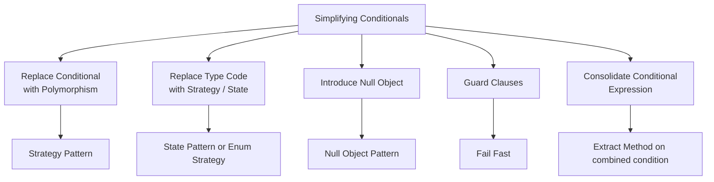
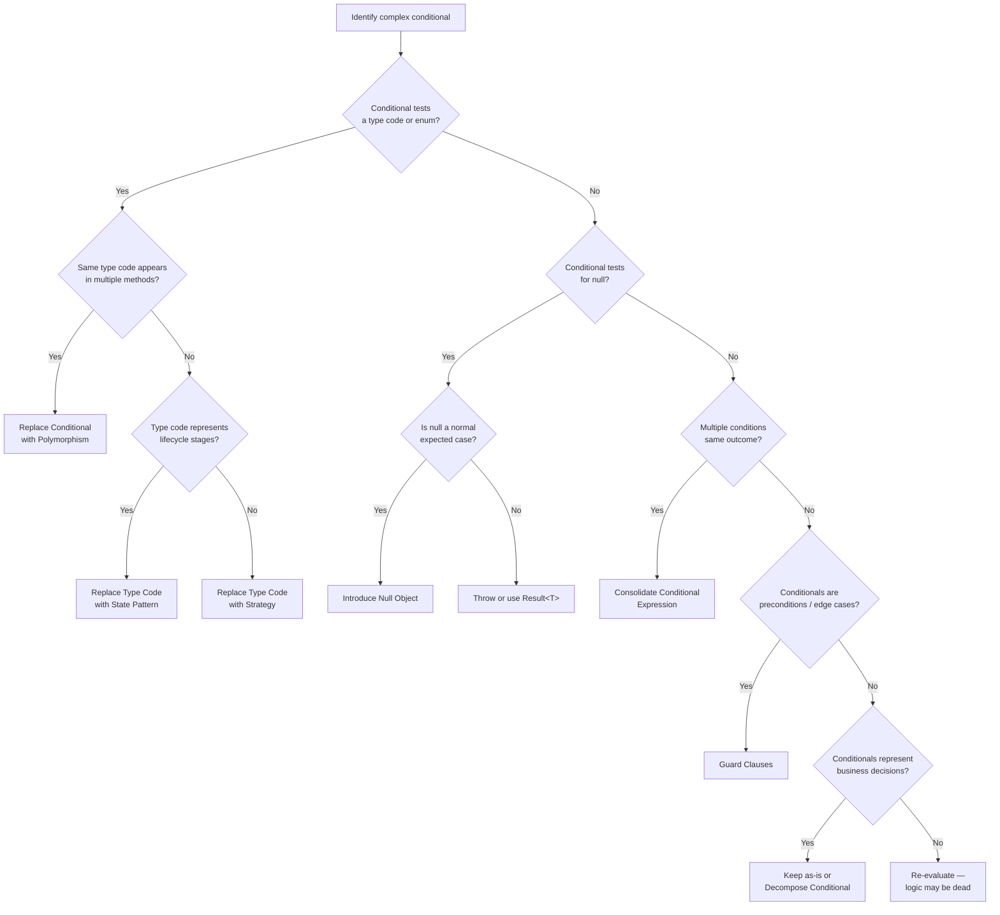

> [!success] Mastery Check
> - [ ] **Studied Well**
> - [ ] **Can explain the concept without notes**
> - [ ] **Can answer interview questions confidently**
> - [ ] **Can implement it in a real project**


## Navigation
**Domain:** [[6 — Design Principles & Patterns]] > **Group:** Refactoring
**Previous:** [[6.042 — Moving Features]] | **Next:** none
### Prerequisites
- [[6.029 — Strategy Pattern]] — Replace Conditional with Polymorphism produces a Strategy hierarchy.
### Where This Fits
Complex conditionals are the single largest source of defects in production code — every `if-else if-else` chain is a branch where the wrong path can be taken. This note covers five techniques that simplify conditionals: Replace Conditional with Polymorphism, Replace Type Code with Strategy/State, Introduce Null Object, Guard Clauses, and Consolidate Conditional Expression. Together they transform nested, scattered, or type-based conditionals into clear, extensible, and testable structures.

---

## Core Mental Model
Conditionals reveal a design that has not yet been fully abstracted. Every `switch` on a type code indicates a missing Strategy or State pattern. Every null check scattered across 10 methods indicates a missing Null Object. Every deeply nested `if` indicates a missing Guard Clause or early return. The goal is not to eliminate conditionals — it is to ensure that each conditional expresses a genuine business decision rather than compensating for a missing abstraction.

### Dimensions


1. **Replace Conditional with Polymorphism** — A `switch`/`if-else` on a type code is replaced by an interface with polymorphic implementations.
2. **Replace Type Code with Strategy/State** — An enum field controls behavior; replace with a strategy object (behavior varies by algorithm) or a state object (behavior varies by lifecycle).
3. **Introduce Null Object** — Replace repeated `if (x == null)` checks with a null-safe object that implements the same interface with no-op behavior.
4. **Guard Clauses** — Replace nested `if` blocks with early returns at the top of the method for exceptional/edge cases.
5. **Consolidate Conditional Expression** — Multiple conditions that lead to the same outcome are combined into a single expression or method.

---

## Deep Mechanics
### How It Works

**Replace Conditional with Polymorphism:** Identify a switch on a type code that appears in multiple methods. Create an interface with the varying behavior as methods. Create one implementation per switch branch. Replace the switch with a call to the appropriate implementation, selected via a factory or DI. Now adding a new variant requires adding a new class — no existing code is modified.

**Replace Type Code with Strategy/State:** If the type code selects an algorithm (e.g., shipping method), use Strategy. If the type code represents a lifecycle stage (e.g., order status: New → Paid → Shipped → Delivered), use State. Strategy is set from outside; State transitions from within.

**Introduce Null Object:** Instead of returning `null` from a method that may not find a result, return a Null Object — a concrete implementation of the expected interface where every method returns a safe default (0, empty, false). Eliminates all null checks at call sites.

**Guard Clauses:** The main logic of a method should not be indented 5 levels deep. Extract each precondition into a guard clause at the top of the method with an early return. The happy path reads linearly after the guards.

**Consolidate Conditional Expression:** Multiple `if` conditions that all result in the same action are combined with `||` or extracted into a method that makes the combined condition readable.

### Why It Matters at Scale
In a 500K+ LOC codebase, a single switch statement that appears in 5 methods means every new enum value requires 5 edits across the codebase — each edit is an opportunity for a copy-paste error or a forgotten branch. Null checks scattered across 50 call sites mean every refactoring of the return type must update 50 locations. Deeply nested conditionals make code review slow — each nesting level adds a dimension of possible state that the reviewer must mentally model. These defects compound: studies show that cyclomatic complexity >15 correlates to 3x the defect density of complexity <5.

---

## Production Code Patterns
### Implementation in C#

**Replace Conditional with Polymorphism — Before:**
```csharp
// ❌ Before: Switch on order type in multiple methods
public decimal CalculateShipping(Order order)
{
    return order.Type switch
    {
        OrderType.Physical => 5.99m + order.Items.Sum(i => i.Weight * 0.5m),
        OrderType.Digital => 0m,
        OrderType.Subscription => 0m,
        _ => throw new ArgumentOutOfRangeException()
    };
}

public string GenerateInvoice(Order order)
{
    return order.Type switch
    {
        OrderType.Physical => $"Items: {string.Join(", ", order.Items.Select(i => i.Name))}",
        OrderType.Digital => "Digital download link: ...",
        OrderType.Subscription => $"Recurring payment: {order.RecurringAmount:C}/month",
        _ => throw new ArgumentOutOfRangeException()
    };
}
```

**Replace Conditional with Polymorphism — After:**
```csharp
// ✅ After: Polymorphic order handlers
public interface IOrderHandler
{
    decimal CalculateShipping(Order order);
    string GenerateInvoice(Order order);
}

public class PhysicalOrderHandler : IOrderHandler
{
    public decimal CalculateShipping(Order order) =>
        5.99m + order.Items.Sum(i => i.Weight * 0.5m);

    public string GenerateInvoice(Order order) =>
        $"Items: {string.Join(", ", order.Items.Select(i => i.Name))}";
}

public class DigitalOrderHandler : IOrderHandler
{
    public decimal CalculateShipping(Order _) => 0m;

    public string GenerateInvoice(Order _) => "Digital download link: ...";
}

public class SubscriptionOrderHandler : IOrderHandler
{
    public decimal CalculateShipping(Order _) => 0m;

    public string GenerateInvoice(Order order) =>
        $"Recurring payment: {order.RecurringAmount:C}/month";
}

// Selection via DI or factory
services.AddKeyedScoped<IOrderHandler, PhysicalOrderHandler>(OrderType.Physical);
services.AddKeyedScoped<IOrderHandler, DigitalOrderHandler>(OrderType.Digital);
services.AddKeyedScoped<IOrderHandler, SubscriptionOrderHandler>(OrderType.Subscription);
```

**Replace Type Code with State — Before:**
```csharp
// ❌ Before: Order status as enum with scattered if/switch on transitions
public enum OrderStatus { New, Paid, Shipped, Delivered, Cancelled }

public class Order
{
    public OrderStatus Status { get; set; }

    public void Pay()
    {
        if (Status != OrderStatus.New)
            throw new InvalidOperationException("Only new orders can be paid.");
        Status = OrderStatus.Paid;
    }

    public void Ship()
    {
        if (Status != OrderStatus.Paid)
            throw new InvalidOperationException("Only paid orders can be shipped.");
        Status = OrderStatus.Shipped;
    }
}
```

**Replace Type Code with State — After:**
```csharp
// ✅ After: State pattern encapsulates transition rules
public abstract class OrderState
{
    public abstract OrderState Pay();
    public abstract OrderState Ship();
    public abstract OrderState Cancel();
}

public class NewOrderState : OrderState
{
    public override OrderState Pay() => new PaidOrderState();
    public override OrderState Ship() => throw new InvalidOperationException("Cannot ship unpaid order.");
    public override OrderState Cancel() => new CancelledOrderState();
}

public class PaidOrderState : OrderState
{
    public override OrderState Pay() => throw new InvalidOperationException("Already paid.");
    public override OrderState Ship() => new ShippedOrderState();
    public override OrderState Cancel() => new CancelledOrderState();
}

public class Order
{
    public OrderState State { get; private set; } = new NewOrderState();

    public void Pay() => State = State.Pay();
    public void Ship() => State = State.Ship();
    public void Cancel() => State = State.Cancel();
}
```

**Introduce Null Object — Before:**
```csharp
// ❌ Before: Null checks scattered everywhere
public async Task<ActionResult> GetCustomer(Guid id)
{
    var customer = await _repo.GetByIdAsync(id);
    if (customer == null)
        return NotFound();

    var discount = customer.IsPremium ? 0.10m : 0m;
    var displayName = customer.Name;
    return Ok(new { displayName, discount });
}
```

**Introduce Null Object — After:**
```csharp
// ✅ After: Null Object eliminates checks
public interface ICustomer
{
    string Name { get; }
    bool IsPremium { get; }
    decimal DiscountRate { get; }
}

public class Customer : ICustomer
{
    public string Name { get; init; }
    public bool IsPremium { get; init; }
    public decimal DiscountRate => IsPremium ? 0.10m : 0m;
}

public class NullCustomer : ICustomer
{
    public string Name => "Unknown";
    public bool IsPremium => false;
    public decimal DiscountRate => 0m;
}

// Repository returns NullCustomer instead of null
public async Task<ICustomer> GetByIdAsync(Guid id) =>
    await _db.Customers.FindAsync(id) ?? (ICustomer)new NullCustomer();

// Controller no longer needs null check
public async Task<ActionResult> GetCustomer(Guid id)
{
    var customer = await _repo.GetByIdAsync(id);
    return Ok(new { customer.Name, Discount = customer.DiscountRate });
}
```

**Guard Clauses — Before:**
```csharp
// ❌ Before: Deep nesting hides happy path
public async Task<ActionResult> SubmitOrder(OrderRequest request)
{
    if (request != null)
    {
        if (!string.IsNullOrWhiteSpace(request.CustomerEmail))
        {
            if (request.Items.Count > 0)
            {
                var order = await _service.ProcessAsync(request);
                return Ok(order);
            }
            return BadRequest("No items in order.");
        }
        return BadRequest("Email is required.");
    }
    return BadRequest("Request is null.");
}
```

**Guard Clauses — After:**
```csharp
// ✅ After: Guard clauses flatten the structure
public async Task<ActionResult> SubmitOrder(OrderRequest request)
{
    if (request == null) return BadRequest("Request is null.");
    if (string.IsNullOrWhiteSpace(request.CustomerEmail)) return BadRequest("Email is required.");
    if (request.Items.Count == 0) return BadRequest("No items in order.");

    var order = await _service.ProcessAsync(request);
    return Ok(order);
}
```

**Consolidate Conditional Expression — Before:**
```csharp
// ❌ Before: Three separate conditions with the same result
if (order.IsInternational) { return ApplyComplexShipping(order); }
if (order.TotalWeight > 50) { return ApplyComplexShipping(order); }
if (order.Customer.Tier == CustomerTier.Standard && order.Items.Any(i => i.IsHazardous)) { return ApplyComplexShipping(order); }
```

**Consolidate Conditional Expression — After:**
```csharp
// ✅ After: Combined into one method
if (RequiresComplexShipping(order)) return ApplyComplexShipping(order);

private static bool RequiresComplexShipping(Order order) =>
    order.IsInternational ||
    order.TotalWeight > 50 ||
    (order.Customer.Tier == CustomerTier.Standard && order.Items.Any(i => i.IsHazardous));
```

### ASP.NET Core / .NET Ecosystem Integration

**Replace Conditional with Polymorphism in Authorization:** Instead of `if (user.IsAdmin || user.HasClaim("order.approve"))`, use multiple `IAuthorizationHandler` implementations per policy.

**Guard Clauses in Middleware:** Middleware `InvokeAsync` methods use guard clauses for path matching, authentication checks, and short-circuiting:

```csharp
public async Task InvokeAsync(HttpContext context, RequestDelegate next)
{
    if (!context.Request.Path.StartsWithSegments("/api/admin"))
    {
        await next(context);
        return;
    }

    if (!context.User.Identity?.IsAuthenticated == true)
    {
        context.Response.StatusCode = 401;
        return;
    }

    // Admin logic...
}
```

**Introduce Null Object with `??` and `Maybe`:** C# 8 nullable reference types combined with `??` operator reduce the need for Null Object in simple cases. Null Object is still valuable when the default behavior is non-trivial (logging, event publishing) or when the null object is used in many places.

**Replace Type Code with Strategy in Pipeline Behaviors:** MediatR pipeline behaviors that switch on `request` type to apply different validation can be replaced with polymorphic `IValidator<T>` instances.

---

## Gotchas & Anti-Patterns
### Replacing a Conditional That Rarely Changes

**Wrong:** Replacing a 2-branch `if-else` on a stable enum that has not changed in 2 years with a Strategy interface, a factory, and two implementation classes.
**Right:** A conditional on a rarely-changing value is fine. Reserve Replace Conditional with Polymorphism for type codes that: (1) appear in multiple methods, (2) have a new variant added at least once per quarter, or (3) each branch has significantly different logic across multiple operations.
**Consequence:** Premature polymorphism adds abstraction overhead without reducing change cost. The 2-line `if` becomes 5 files and a DI registration.

### Null Object When null Is an Error

**Wrong:** Returning a Null Customer from a repository when the customer ID is known to be valid and a null result always indicates a data corruption bug.
**Right:** Null Object is for cases where "not found" is a normal, expected result — not an error. If null indicates a bug or an invariant violation, throw or use `Result<T>` to communicate the failure.
**Consequence:** Null Object silently swallows errors that should be loud. A null customer in a payment processing context should not result in `"Name": "Unknown"` on a receipt — it should crash.

### Guard Clauses That Become the Entire Method

**Wrong:** Extracting every bit of logic into a guard clause until the method is 5 guards and a single line of actual work — the guards are the method.
**Right:** Guard clauses handle edge cases and preconditions. If the "main logic" is 1 line and the guards are 10 lines, the method should be named after the guards or the guards should be consolidated.
**Consequence:** A method where 80% of lines are guards is a method that should either be renamed to reflect the validation it performs, or the validation should be extracted into a separate `Validate` method.

### Consolidating Conditionals That Have Different Intents

**Wrong:** Combining `if (user == null || order == null || !order.IsActive)` into a single condition when each requires a *different* error message or recovery path.
**Right:** Consolidate only when all conditions lead to the *exact same outcome* (same return value, same action). If each condition requires a different response, keep them separate with individual guard clauses.
**Consequence:** Consolidated conditionals with different intents lose the specific error context. The caller gets "Invalid request" instead of "User not found" or "Order is inactive."

### State Pattern When Enum + Switch Is Sufficient

**Wrong:** Implementing full State pattern for a 3-state lifecycle that never changes and where transitions are purely linear (A → B → C).
**Right:** A simple enum with a `CurrentState` property and `if` checks in transition methods is acceptable when the state machine is simple, stable, and well-understood.
**Consequence:** Full State pattern for a linear 3-state machine adds 5+ classes, an abstract base, and factory logic for a problem that a 12-line enum + switch would solve.

---

## Performance Implications
### Maintenance Cost Model
| Scenario | Defect Probability | Change Impact | Onboarding Cost |
|---|---|---|---|
| Polymorphism replaces scattered switches | Low (new variant = new class) | Isolated | Low — one class per variant |
| Switch statements left in 5+ methods | High — one switch missed on update | High — every new variant touches 5 methods | High |
| Null Object eliminates null checks | Low (no null path to forget) | Isolated | Low |
| Null checks scattered in 20+ places | High — one check missed causes NRE | High — every API change updates 20 sites | High |
| Guard clauses flatten 5-level nesting | Low — linear happy path | Isolated | Low |
| Deeply nested conditionals | High — one branch path untested | High — fear of adding new branch | High |
| Consolidated conditionals | Low — business rule in one method | Isolated | Low |
| Duplicated conditions across methods | High — one condition updated, others missed | High — all copies must be found | High |

**No benchmark data:** Performance impact of polymorphism vs. conditionals: virtual dispatch is ~1–2 ns per call more expensive than a direct call. For the vast majority of business applications (thousands of calls per second), this is immeasurable. The exception is tight loops with millions of iterations — in those cases, if the branch is predictable, a conditional will outperform polymorphism. Profile before optimizing.

---

## Interview Arsenal
### Question Bank
1. "What is the relationship between Replace Conditional with Polymorphism and the Open/Closed Principle?"
2. "When would you use Replace Type Code with Strategy vs. State?"
3. "What is the downside of introducing a Null Object?"
4. "How do Guard Clauses relate to the Fail Fast principle?"
5. "When should you Consolidate Conditional Expression vs. keep conditions separate?"
6. "Describe a production bug caused by a missing polymorphic abstraction."
7. "How would you refactor a 10-branch switch statement that appears in 6 methods across 3 classes?"
8. "What is the relationship between Introduce Null Object and the Nullable Reference Types feature in C# 8+?"

### Spoken Answers

> **Q1: What is the relationship between Replace Conditional with Polymorphism and the Open/Closed Principle?**
>
> **Average answer:** Polymorphism makes code open for extension and closed for modification.
>
> **Great answer:** More precisely, Replace Conditional with Polymorphism is the refactoring path to achieve OCP compliance for type-based behavior. When a switch on a type code appears in multiple methods, the codebase is open for modification (every new type requires editing all switches) and closed for extension (you cannot add behavior without changing existing code). Polymorphism inverts this: adding a new type means adding a new class (extension) without touching any existing handler (closed for modification). In .NET, this is often implemented via DI with keyed services or `IEnumerable<T>` strategy registration — adding a new handler requires exactly one new file and one registration line.

> **Q3: What is the downside of introducing a Null Object?**
>
> **Average answer:** It can hide bugs by silently accepting null when it should fail.
>
> **Great answer:** The primary downside is semantic mismatch: Null Object makes sense when "no result" is a normal, expected case — like `FindCustomer` returning "guest" for anonymous users. It is harmful when "no result" indicates a violation (like a corrupted database row or a programming error) — the Null Object will silently propagate defaults that look like valid data, leading to secondary failures that are hard to debug. The secondary downside is that Null Object adds a new class per abstraction, which can bloat the codebase if applied to every interface. The decision framework: if the consuming code has meaningful default behavior (empty list, zero, "unknown"), Null Object is appropriate. If the consuming code should never receive null, use a `Result<T>` type that communicates the failure explicitly.

### Trick Question
**"Should you always replace deeply nested conditionals with Guard Clauses?"**
Why it is a trap: Guard Clauses work for preconditions but not for complex business branching. Correct answer: Guard Clauses are for edge cases, preconditions, and invalid states — they should return early. The *main* branching logic of the method (e.g., "if international, calculate customs; else calculate domestic") should NOT be converted to Guard Clauses — those are genuine business decisions that should remain as conditionals or be replaced with polymorphism. Applying Guard Clauses to everything results in a method where the first 20 lines are "guards" that actually constitute the core logic, defeating the purpose. The rule: guards exit early for exceptional paths; the remaining structure handles the happy-path business logic.

### Comparison Table
| Aspect | Simplifying Conditionals | Composing Methods |
|---|---|---|
| Intent | Replace complex branch logic with polymorphism, null objects, and guard clauses | Reshape methods for readability and SLAP |
| Techniques | Replace Conditional with Polymorphism, Introduce Null Object, Guard Clauses, Consolidate Conditional Expression | Extract Method, Extract Variable, Inline, Replace Temp with Query, Decompose Conditional |
| When to use | When conditionals scatter changes across classes or create deep nesting | When methods are long or mix abstraction levels |
| .NET example | `IAuthorizationHandler` for polymorphic authorization policies | Extracting helper methods from a minimal API handler |
| Key difference | Eliminates or restructures *branching logic* | Restructures *linear code* within a method |

---

## Decision Framework



### Application Checklist
- [ ] Is every switch/if-else on a type code limited to a single location or eliminated via polymorphism?
- [ ] Are null checks replaced with Null Objects where "no result" is a normal case?
- [ ] Are all preconditions and edge cases handled by Guard Clauses at the top of each method?
- [ ] Are duplicate conditions that lead to the same outcome consolidated into one expression?
- [ ] Does the business decision logic remain readable as conditionals (not hidden in unnecessary polymorphism)?
- [ ] Can I add a new variant without modifying any existing type-handling class?
- [ ] Is the state machine simple enough for an enum, or complex enough for the State pattern?

### Tradeoff Summary
| What You Gain | What You Give Up |
|---|---|
| New variants add a class, not modify existing code | More classes and interface registrations |
| Null objects eliminate scattered null checks | New class per abstraction; risk of silent failure |
| Guard clauses flatten nesting; happy path is linear | Over-used guards bury the actual business logic |
| Consolidated conditions reveal business rules | Error specificity lost if conditions have different recovery paths |
| State pattern enforces valid transitions at compile time | 5+ classes for what an enum + 3 conditionals could handle |

---

## Self-Check
### Conceptual Questions
1. What is the primary symptom that tells you to apply Replace Conditional with Polymorphism?
2. How do you decide between Strategy and State when replacing a type code?
3. When does a Null Object hide a bug instead of preventing one?
4. What is the relationship between Guard Clauses and cyclomatic complexity?
5. How does Consolidate Conditional Expression improve DRY compliance?
6. What is the difference between Decompose Conditional (Composing Methods) and Replace Conditional with Polymorphism?
7. Why might you keep a switch statement even when polymorphism is available?
8. How does Introduce Null Object interact with C# 8 nullable reference types?
9. What is the "Arrow Anti-Pattern" and how do Guard Clauses fix it?
10. How would you refactor a method where the main business logic is wrapped in 4 levels of `if` nesting?

<details>
<summary>Answers</summary>

1. The same type code or enum is tested in multiple methods across the codebase.
2. Strategy if the behavior varies by algorithm chosen from outside (e.g., shipping method). State if behavior varies by lifecycle stage that transitions from within (e.g., order status).
3. When null represents a corruption or programming error, not a normal absence. The Null Object will masquerade as valid data and cause downstream failures.
4. Guard Clauses reduce cyclomatic complexity by eliminating nesting — each early return removes one level of indentation and one branch path.
5. It moves the repeated condition into a single method, so changing the condition updates one place.
6. Decompose Conditional extracts condition + branches into methods within the same class. Replace Conditional with Polymorphism moves the branches into separate classes entirely.
7. When the switch has 2–3 variants that rarely change and appears in only one method — polymorphism would add abstraction overhead without reducing maintenance cost.
8. Nullable reference types (`T?`) tell the compiler a value can be null but still require runtime checks. Null Object eliminates the need for the check by ensuring the value is never null. They solve the same problem at different levels: NRT at the compile/contract level, Null Object at the object/pattern level.
9. The "Arrow Anti-Pattern" is deeply nested conditionals that spread code horizontally across the screen. Guard Clauses turn the arrow into a linear sequence by returning early for edge cases.
10. Extract the guard conditions into Guard Clauses (exceptional cases), then evaluate the remaining branching logic: if it tests a type code, apply Replace Conditional with Polymorphism; if it represents complex business decisions, apply Decompose Conditional.
</details>

### Code Puzzles

**Puzzle 1 — Refactor this conditional with Guard Clauses:**
```csharp
public async Task<ActionResult> CancelOrder(Guid orderId)
{
    ActionResult result;
    var order = await _repo.GetByIdAsync(orderId);
    if (order != null)
    {
        if (order.Status == OrderStatus.Shipped)
        {
            result = BadRequest("Cannot cancel shipped order.");
        }
        else if (order.Status == OrderStatus.Delivered)
        {
            result = BadRequest("Cannot cancel delivered order.");
        }
        else
        {
            order.Status = OrderStatus.Cancelled;
            await _repo.SaveAsync(order);
            result = Ok();
        }
    }
    else
    {
        result = NotFound();
    }
    return result;
}
```

<details>
<summary>Answer</summary>

```csharp
public async Task<ActionResult> CancelOrder(Guid orderId)
{
    var order = await _repo.GetByIdAsync(orderId);
    if (order == null) return NotFound();
    if (order.Status == OrderStatus.Shipped) return BadRequest("Cannot cancel shipped order.");
    if (order.Status == OrderStatus.Delivered) return BadRequest("Cannot cancel delivered order.");

    order.Status = OrderStatus.Cancelled;
    await _repo.SaveAsync(order);
    return Ok();
}
```
**What changed:** 4 levels of nesting → 3 guard clauses + linear happy path.
</details>

---

**Puzzle 2 — Apply Replace Conditional with Polymorphism:**
```csharp
public decimal CalculatePayout(Employee employee)
{
    return employee.Role switch
    {
        "Manager" => employee.Salary + employee.Bonus,
        "Sales" => employee.Salary + employee.Commission,
        "Contractor" => employee.HourlyRate * employee.HoursWorked,
        _ => throw new ArgumentOutOfRangeException()
    };
}

public string GeneratePayStub(Employee employee)
{
    return employee.Role switch
    {
        "Manager" => $"Salary: {employee.Salary:C}, Bonus: {employee.Bonus:C}",
        "Sales" => $"Salary: {employee.Salary:C}, Commission: {employee.Commission:C}",
        "Contractor" => $"Rate: {employee.HourlyRate:C}/hr, Hours: {employee.HoursWorked}",
        _ => throw new ArgumentOutOfRangeException()
    };
}
```

<details>
<summary>Answer</summary>

```csharp
public interface IPayCalculator
{
    decimal CalculatePayout(Employee employee);
    string GeneratePayStub(Employee employee);
}

public class ManagerPayCalculator : IPayCalculator
{
    public decimal CalculatePayout(Employee e) => e.Salary + e.Bonus;
    public string GeneratePayStub(Employee e) => $"Salary: {e.Salary:C}, Bonus: {e.Bonus:C}";
}

public class SalesPayCalculator : IPayCalculator
{
    public decimal CalculatePayout(Employee e) => e.Salary + e.Commission;
    public string GeneratePayStub(Employee e) => $"Salary: {e.Salary:C}, Commission: {e.Commission:C}";
}

public class ContractorPayCalculator : IPayCalculator
{
    public decimal CalculatePayout(Employee e) => e.HourlyRate * e.HoursWorked;
    public string GeneratePayStub(Employee e) => $"Rate: {e.HourlyRate:C}/hr, Hours: {e.HoursWorked}";
}

// Selection: employee.SetPayCalculator(factory.Create(employee.Role));
// Or via DI: services.AddKeyedScoped<IPayCalculator, ManagerPayCalculator>("Manager");
```
**What changed:** Switch removed from both methods. Adding `Intern` pay type adds one class without modifying existing code.
</details>

---

**Puzzle 3 — Apply Introduce Null Object:**
```csharp
public async Task<ActionResult> GetDiscount(Guid customerId)
{
    var customer = await _repo.GetByIdAsync(customerId);
    if (customer == null) return NotFound();

    var discount = customer.IsVip ? 0.20m : 0.05m;
    var name = customer.Name;
    return Ok(new { name, discount });
}
```

<details>
<summary>Answer</summary>

```csharp
// With Null Object returned from repository
public async Task<ActionResult> GetDiscount(Guid customerId)
{
    var customer = await _repo.GetByIdAsync(customerId);
    return Ok(new { customer.Name, Discount = customer.DiscountRate });
}

// NullCustomer (in repository):
public class NullCustomer : ICustomer
{
    public string Name => "Guest";
    public bool IsVip => false;
    public decimal DiscountRate => 0m;
}
```
**What changed:** The null check and conditional discount logic are eliminated. The controller assumes a valid `ICustomer` is always returned.
</details>

---

**Puzzle 4 — Consolidate Conditional Expression:**
```csharp
if (order.IsRush) { ApplyRushHandling(order); }
else if (order.Items.Any(i => i.IsPerishable)) { ApplyRushHandling(order); }
else if (order.Customer.Tier == CustomerTier.Premium) { ApplyRushHandling(order); }
else { ApplyStandardHandling(order); }
```

<details>
<summary>Answer</summary>

```csharp
if (RequiresRushHandling(order))
{
    ApplyRushHandling(order);
}
else
{
    ApplyStandardHandling(order);
}

private static bool RequiresRushHandling(Order order) =>
    order.IsRush || order.Items.Any(i => i.IsPerishable) || order.Customer.Tier == CustomerTier.Premium;
```
**What changed:** Three separate conditions consolidated into a single method that reveals the business rule: "rush handling is applied for rush orders, perishable items, or premium customers."
</details>

---

**Puzzle 5 — Replace Type Code with State:**
```csharp
public class Document
{
    public string Status { get; set; } // "Draft", "Review", "Published"

    public void Submit()
    {
        if (Status != "Draft")
            throw new InvalidOperationException("Only drafts can be submitted.");
        Status = "Review";
    }

    public void Approve()
    {
        if (Status != "Review")
            throw new InvalidOperationException("Only documents in review can be approved.");
        Status = "Published";
    }

    public void Reject()
    {
        if (Status != "Review")
            throw new InvalidOperationException("Only documents in review can be rejected.");
        Status = "Draft";
    }
}
```

<details>
<summary>Answer</summary>

```csharp
public abstract class DocumentState
{
    public abstract DocumentState Submit();
    public abstract DocumentState Approve();
    public abstract DocumentState Reject();
}

public class DraftState : DocumentState
{
    public override DocumentState Submit() => new ReviewState();
    public override DocumentState Approve() => throw new InvalidOperationException("Cannot approve a draft.");
    public override DocumentState Reject() => throw new InvalidOperationException("Cannot reject a draft.");
}

public class ReviewState : DocumentState
{
    public override DocumentState Submit() => throw new InvalidOperationException("Already in review.");
    public override DocumentState Approve() => new PublishedState();
    public override DocumentState Reject() => new DraftState();
}

public class PublishedState : DocumentState
{
    public override DocumentState Submit() => throw new InvalidOperationException("Already published.");
    public override DocumentState Approve() => throw new InvalidOperationException("Already published.");
    public override DocumentState Reject() => throw new InvalidOperationException("Already published.");
}

public class Document
{
    public DocumentState State { get; private set; } = new DraftState();

    public void Submit() => State = State.Submit();
    public void Approve() => State = State.Approve();
    public void Reject() => State = State.Reject();
}
```
**What changed:** Enum + conditionals → State pattern. Invalid transitions throw at the state level. Adding an `Archived` state adds one class without modifying `Document`.
</details>
