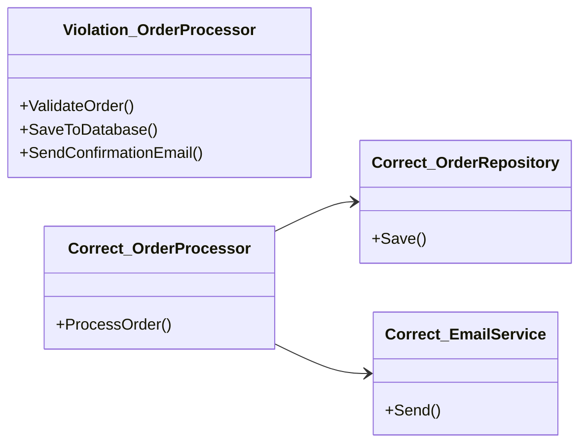
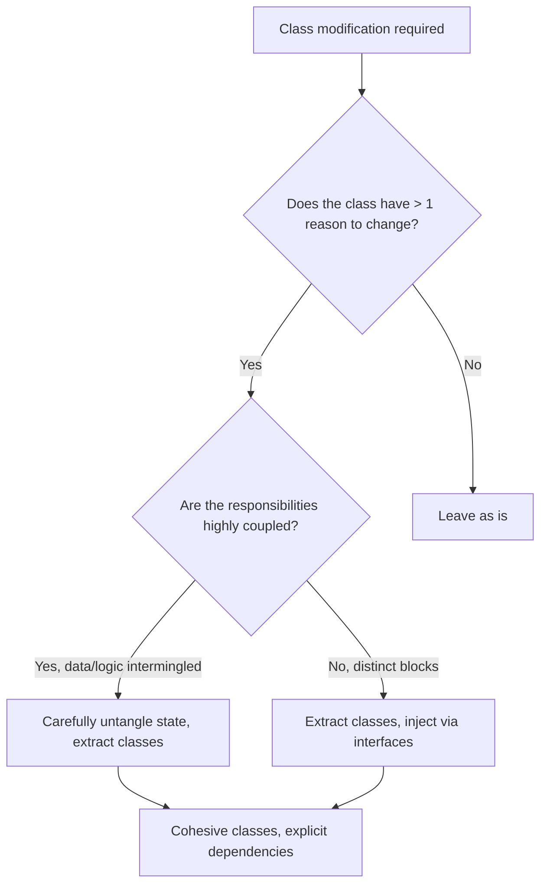

## Navigation

**Domain:** [[6 — Design Principles & Patterns]] > **Group:** SOLID Principles
**Previous:** None | **Next:** [[6.002 — Open/Closed Principle]]

### Prerequisites
- [[2.XXX — Classes and Structs]] — foundational understanding of C# types and boundaries is required to understand responsibility allocation.

### Where This Fits
The Single Responsibility Principle (SRP) is the foundational rule of modular software design. It dictates that every module, class, or function should have responsibility over a single part of the software's functionality, and that responsibility should be entirely encapsulated by the class. In a .NET codebase, a senior engineer will constantly apply SRP when deciding where new code belongs, when extracting services during refactoring, and when setting up the Dependency Injection (DI) container. It is the primary defense against the "Large Class" and "God Object" code smells that plague long-lived enterprise applications.

## Core Mental Model

A class should have one, and only one, reason to change. It is not merely about doing one thing; it is about cohesion of responsibilities. If a change to the database schema forces you to modify business logic, or a change to the UI formatting forces you to update a data access class, SRP is violated. SRP prevents tight coupling between disparate system concerns and enables independent testing, reuse, and parallel development by different teams.

### Classification

**Principle Family:** SOLID Principles (The 'S' in SOLID). SRP is the foundational boundary-defining principle. It relates closely to the Interface Segregation Principle (ISP), which applies a similar boundary concept to interfaces, and the Open/Closed Principle (OCP), which relies on well-defined responsibilities to allow extension.



### Dimensions

- **Responsibility** — a reason to change (e.g., persistence, formatting, validation).
- **Cohesion** — the degree to which the elements inside a class belong together.
- **Coupling** — the degree of interdependence between software modules.

## Deep Mechanics

### How It Works

SRP is implemented by identifying the distinct axes of change in a system and isolating them. 

**Before-state (Violation):** A class `ReportGenerator` fetches data from SQL, applies business logic to calculate totals, and formats the output as a PDF. The class has three reasons to change: database schema updates, business rule changes, and presentation requirement changes. Structurally, it has high coupling to `System.Data.SqlClient`, core domain models, and a PDF generation library.

**After-state (Correct):** The class is split into `ReportRepository` (fetches data), `ReportCalculator` (applies business rules), and `PdfReportFormatter` (handles presentation). A coordinating class, `ReportService`, orchestrates these single-responsibility components. At the module boundary level, the persistence concerns, business logic, and presentation concerns are entirely segregated. Changes to PDF formatting no longer require recompiling or testing the data access logic.

### .NET Runtime Behavior

While SRP is a design-time principle, it has implications for the .NET runtime and memory management:

- **Garbage Collection:** Smaller, single-responsibility classes often mean shorter-lived objects that are quickly collected in Gen0, rather than long-lived God objects that survive into Gen2 and cause GC pressure.
- **JIT Compilation:** Methods in large, multi-responsibility classes may take longer to JIT compile, and large classes can pollute the CPU instruction cache. Smaller classes promote better method inlining and cache locality.
- **Dependency Injection:** SRP naturally leads to constructor injection of dependencies. In .NET, the `Microsoft.Extensions.DependencyInjection` container is highly optimized for resolving deep object graphs of small, single-purpose services quickly.

## Production Code Patterns

### Implementation in C#

```csharp
using System;
using System.Data.SqlClient;
using System.Net.Mail;

// ❌ Violation
// This class has three reasons to change: business logic, database, and email.
public class OrderProcessorViolation
{
    public void ProcessOrder(Order order)
    {
        // 1. Business Logic
        if (order.TotalAmount <= 0) throw new InvalidOperationException("Invalid total.");

        // 2. Data Access
        using (var connection = new SqlConnection("ConnectionString"))
        {
            connection.Open();
            var command = new SqlCommand("INSERT INTO Orders...", connection);
            command.ExecuteNonQuery();
        }

        // 3. Notification
        var client = new SmtpClient("smtp.mail.com");
        client.Send(new MailMessage("sales@company.com", order.CustomerEmail, "Order Processed", "Thank you."));
    }
}

// ✅ Correct
// Responsibilities are segregated into distinct interfaces and classes.

public interface IOrderValidator
{
    void Validate(Order order);
}

public interface IOrderRepository
{
    void Save(Order order);
}

public interface INotificationService
{
    void SendOrderConfirmation(Order order);
}

// Coordinate the workflow, but delegate the specific responsibilities.
public class OrderProcessor
{
    private readonly IOrderValidator _validator;
    private readonly IOrderRepository _repository;
    private readonly INotificationService _notificationService;

    public OrderProcessor(
        IOrderValidator validator, 
        IOrderRepository repository, 
        INotificationService notificationService)
    {
        _validator = validator;
        _repository = repository;
        _notificationService = notificationService;
    }

    public void Process(Order order)
    {
        _validator.Validate(order);
        _repository.Save(order);
        _notificationService.SendOrderConfirmation(order);
    }
}
```

### ASP.NET Core / .NET Ecosystem Integration

SRP is pervasive throughout ASP.NET Core. The framework is built on small, composable, single-responsibility abstractions:

- **Middleware Pipeline:** Each middleware component has one responsibility (e.g., `AuthenticationMiddleware` only handles identity, `ExceptionHandlerMiddleware` only catches errors).
- **ASP.NET Core MVC:** Controllers handle HTTP routing and parameter binding, Views handle HTML rendering, and Models represent data.
- **IHttpClientFactory:** Separates the responsibility of managing HTTP connection pooling and lifetime from the business logic making the actual HTTP requests.

```csharp
// Wiring SRP-compliant services into the ASP.NET Core DI container
public void ConfigureServices(IServiceCollection services)
{
    services.AddTransient<IOrderValidator, DefaultOrderValidator>();
    services.AddScoped<IOrderRepository, SqlOrderRepository>();
    services.AddTransient<INotificationService, SmtpNotificationService>();
    services.AddScoped<OrderProcessor>();
}
```

## Gotchas & Anti-Patterns

### The God Object

**Wrong:** Creating a single `UserService` that handles user registration, password hashing, database saving, sending welcome emails, generating JWT tokens, and logging.

```csharp
// ❌ Wrong
public class UserService 
{
    public string RegisterAndReturnToken(User user, string password) { ... }
}
```

**Right:** Extracting specific responsibilities.

```csharp
// ✅ Right
public class UserRegistrationService { ... }
public class PasswordHasher { ... }
public class TokenGenerator { ... }
```

**Consequence:** The God object becomes a merge conflict magnet. Every developer modifies it. Testing it requires mocking half the system.

### The Illusion of SRP (Anemic Domain Model)

**Wrong:** Taking SRP to such an extreme that classes have no behavior, only properties, and all logic is dumped into "Service" or "Manager" classes. This violates encapsulation.

```csharp
// ❌ Wrong
public class Employee { public decimal Salary { get; set; } }
public class SalaryCalculator { public void GiveRaise(Employee e) { e.Salary *= 1.1m; } }
```

**Right:** Keeping data and the behavior that immediately operates on it together.

```csharp
// ✅ Right
public class Employee 
{ 
    public decimal Salary { get; private set; } 
    public void GiveRaise(decimal percentage) { Salary *= (1 + percentage); }
}
```

**Consequence:** Business rules are scattered across the codebase instead of encapsulated within the domain objects, leading to duplication and inconsistent state.

### The Micro-Class Fragmentation

**Wrong:** Creating a class for every single method, resulting in hundreds of tiny classes (`UpdateUserEmailService`, `UpdateUserPhoneService`, `UpdateUserAddressService`).

**Right:** Grouping highly cohesive behaviors that change for the same reason into a single class (e.g., `UserProfileUpdater`).

**Consequence:** The codebase suffers from "class explosion," making navigation and cognitive load worse. Abstraction overhead outweighs the structural benefit.

### The Swiss Army Utility Class

**Wrong:** Throwing unrelated static methods into a `CommonUtils` or `Helpers` class.

```csharp
// ❌ Wrong
public static class Helpers
{
    public static string FormatDate(DateTime date) { ... }
    public static void SaveToLog(string msg) { ... }
    public static string HashString(string input) { ... }
}
```

**Right:** Organizing utility methods into specific, cohesive classes (e.g., `DateFormatter`, `CryptographyHelper`).

**Consequence:** The `Helpers` class becomes a dumping ground with infinite reasons to change and high coupling to multiple distinct domains.

## Performance Implications

### Maintenance Cost Model

While extracting classes introduces a minimal abstraction overhead (virtual dispatch via interfaces and extra heap allocations for dependency injection), the primary cost/benefit of SRP is measured in maintenance metrics.

| Metric | Monolithic Class (SRP Violated) | Segregated Classes (SRP Followed) |
|---|---|---|
| **Defect Probability** | High. Changes to one feature inadvertently break unrelated features due to shared state. | Low. Changes are localized to the specific responsibility. |
| **Change Impact** | Broad. Requires recompilation and retesting of large portions of the system. | Narrow. Only the changed component and its direct dependents are affected. |
| **Onboarding Cost** | High. New engineers must decipher a 3,000-line class to make a 2-line change. | Low. Names are intention-revealing and boundaries are clear. |
| **Testability** | Poor. Setup requires massive mock graphs and complex state initialization. | Excellent. Small classes with specific dependencies are trivial to unit test. |

The negligible runtime cost of interface dispatch in .NET is overwhelmingly justified by the dramatic reduction in maintenance costs, defect rates, and developer cognitive load at scale.

## Interview Arsenal

### Question Bank

1. What is the Single Responsibility Principle?
2. How do you identify if a class violates SRP?
3. What is the difference between SRP and the Interface Segregation Principle (ISP)?
4. Does SRP mean a class should only have one method?
5. What are the common code smells that indicate an SRP violation?
6. How does ASP.NET Core Dependency Injection encourage SRP?
7. [Trick] If an `Employee` class has `CalculatePay()` and `SaveToDatabase()`, does it violate SRP? Why?
8. How does adhering to SRP affect the memory profile and Garbage Collection in a .NET application?

### Spoken Answers

**Q: What is the Single Responsibility Principle?**

> **Average answer:** It means a class should only do one thing. If a class does logging and database access, it should be split into two classes.

> **Great answer:** SRP states that a class should have one, and only one, reason to change. It's about cohesion and defining boundaries. Instead of thinking about "doing one thing," I look at axes of change. If the database schema changes, and the presentation formatting changes, and both require modifying the same class, SRP is violated. Extracting those responsibilities isolates the impact of future changes.

**Q: What is the difference between SRP and the Interface Segregation Principle (ISP)?**

> **Average answer:** SRP is for classes doing one thing, and ISP is for interfaces doing one thing.

> **Great answer:** They are highly complementary but operate at different boundaries. SRP focuses on the implementation and its reasons to change — protecting the class itself from churn. ISP focuses on the client consuming an abstraction — ensuring that a client isn't forced to depend on methods it doesn't use. You often apply ISP to an interface that resulted from an SRP refactoring, ensuring the public contract is as cohesive as the implementation.

### Trick Question

**"If a class has only one method, does it automatically satisfy SRP?"**

Why it is a trap: It equates "number of methods" with "number of responsibilities."
Correct answer: No. A single method can still have multiple reasons to change. For example, a single `ProcessOrder()` method that validates the order, connects to SQL to save it, and sends an SMTP email has three distinct responsibilities and reasons to change, despite being only one method. SRP is about cohesion of concerns, not method count.

### Comparison Table

| Aspect | Single Responsibility Principle (SRP) | Interface Segregation Principle (ISP) |
|---|---|---|
| Intent | Ensure a class has only one reason to change | Ensure clients aren't forced to depend on unused methods |
| Participants | Class implementation, internal state | Interface contract, calling clients |
| When to use | When a class becomes bloated or changes frequently for unrelated reasons | When clients are implementing methods they leave empty or throw `NotImplementedException` |
| .NET example | Extracting `ILogger` from business logic | `ICollection<T>` vs `IReadOnlyCollection<T>` |
| Key difference | Focuses on implementation cohesion | Focuses on consumer coupling |

## Decision Framework

### When to Apply SRP



### Application Checklist

- [ ] The class has a single, clearly definable purpose.
- [ ] Changes to infrastructure (DB, UI, API) do not require changing core business logic.
- [ ] The class name is specific and lacks words like `Manager`, `Processor`, `Helper`, or `Utility`.
- [ ] Unit tests for the class require mocking only a few, highly relevant dependencies.
- [ ] I am not applying this speculatively (YAGNI check) — the variation is real.

### Tradeoff Summary

| What You Gain | What You Give Up |
|---|---|
| High testability and isolation | Centralized "read top-to-bottom" procedural flow |
| Reduced merge conflicts | Fewer classes; codebase file count increases |
| Easily composable components | Initial cognitive load of tracking object graphs |

## Self-Check

### Conceptual Questions

1. State the Single Responsibility Principle in one sentence.
2. Why is "reason to change" a better heuristic than "does one thing"?
3. What is a "God Object"?
4. How do SRP and OCP (Open/Closed Principle) relate?
5. How does the Facade pattern relate to SRP?
6. When should you explicitly NOT split a class, even if it does a few different things?
7. How does SRP affect unit testing?
8. Contrast SRP with the concept of an Anemic Domain Model.
9. Name three code smells that indicate an SRP violation.
10. How does ASP.NET Core's middleware pipeline demonstrate SRP?

<details>
<summary>Answers</summary>

1. A class should have one, and only one, reason to change.
2. "Does one thing" is highly subjective. "Reason to change" forces you to look at the external forces (business, technical, presentation) acting on the code.
3. A massive class that knows too much or does too much, serving as the central coordinator for the entire application and holding a multitude of responsibilities.
4. SRP defines the boundaries that OCP relies upon. You cannot effectively leave a class closed for modification if it handles multiple shifting responsibilities.
5. A Facade can provide a single, unified interface to a set of cohesive classes that each adhere to SRP, hiding the complexity of the object graph.
6. When the behaviors are highly cohesive, change together, and splitting them would result in shotgun surgery or exposing private state unnecessarily.
7. It makes unit testing drastically easier by isolating behaviors, reducing the number of mocks required, and narrowing the scope of assertions.
8. SRP means isolating reasons to change, not stripping classes of all behavior. Anemic Domain Models violate encapsulation by moving all behavior out of domain objects, which is a misapplication of SRP.
9. Large Class, Divergent Change, and Data Clumps.
10. Each middleware component in the pipeline performs exactly one discrete task (e.g., routing, exception handling, authentication) and delegates to the next.

</details>

---

### Code Puzzles

**Puzzle 1 — Identify the violation**

```csharp
public class EmployeeRecord
{
    public string Name { get; set; }
    public decimal BaseSalary { get; set; }

    public decimal CalculateTax()
    {
        return BaseSalary * 0.2m;
    }

    public void PrintPayslip()
    {
        Console.WriteLine($"Name: {Name}, Net: {BaseSalary - CalculateTax()}");
    }
}
```

<details> <summary>Answer</summary>

**Violation:** SRP is broken. The class handles data holding, tax calculation logic, and presentation formatting.
**Why:** Changes to tax law and changes to the UI/printer format will both require changing this class.
**Fix:** Extract `TaxCalculator` and `PayslipPrinter` classes. Keep `EmployeeRecord` focused on domain state.

</details>

---

**Puzzle 2 — Complete the pattern**

```csharp
public class DocumentService
{
    // TODO: complete the injection to adhere to SRP
    
    public void ExportDocument(Document doc)
    {
        var rawData = _formatter.Format(doc);
        _storage.Save(rawData);
    }
}
```

<details> <summary>Answer</summary>

```csharp
public class DocumentService
{
    private readonly IDocumentFormatter _formatter;
    private readonly IStorageProvider _storage;

    public DocumentService(IDocumentFormatter formatter, IStorageProvider storage)
    {
        _formatter = formatter;
        _storage = storage;
    }
    
    public void ExportDocument(Document doc)
    {
        var rawData = _formatter.Format(doc);
        _storage.Save(rawData);
    }
}
```

**Explanation:** By injecting `IDocumentFormatter` and `IStorageProvider`, `DocumentService` coordinates the workflow but delegates the specific responsibilities of formatting and storage to specialized classes, adhering to SRP.

</details>

---

**Puzzle 3 — Choose the right pattern**

**Scenario:** Your web API has a `ReportController`. Currently, the `GenerateReport` action parses the HTTP request, fetches data using Entity Framework Core, loops through the data to aggregate sums, and formats the output into a CSV string before returning it. The controller is 400 lines long. Which principle applies, and why? What would the wrong choice be?

<details> <summary>Answer</summary>

**Correct pattern:** Single Responsibility Principle — The controller has too many reasons to change (routing, data access, business logic, formatting).
**Wrong choice:** Applying a Design Pattern like Strategy or Decorator immediately. You must first segregate the responsibilities into discrete classes (e.g., `ReportRepository`, `ReportAggregator`, `CsvFormatter`) before applying structural patterns.
**Implementation sketch:**
```csharp
public class ReportController : ControllerBase
{
    public IActionResult GenerateReport(int id, [FromServices] IReportGenerationService service)
    {
        var csv = service.GenerateCsvReport(id);
        return File(Encoding.UTF8.GetBytes(csv), "text/csv", "report.csv");
    }
}
```

</details>

---

**Puzzle 4 — Spot the anti-pattern**

```csharp
public class InvoiceManager
{
    public void DeleteInvoice(int id)
    {
        // 1. Delete from DB
        Db.Execute("DELETE FROM Invoices WHERE Id = @id", new { id });
        
        // 2. Log it
        File.AppendAllText("log.txt", $"Deleted {id} at {DateTime.Now}");
    }
}
```

<details> <summary>Answer</summary>

**Anti-pattern:** The God Object / Divergent Change. The manager handles direct database access and direct file I/O logging.
**Consequence:** Hard to test without a real database and file system. Changes to logging framework break business logic.
**Corrected version:**

```csharp
public class InvoiceManager
{
    private readonly IInvoiceRepository _repository;
    private readonly ILogger<InvoiceManager> _logger;

    public InvoiceManager(IInvoiceRepository repository, ILogger<InvoiceManager> logger)
    {
        _repository = repository;
        _logger = logger;
    }

    public void DeleteInvoice(int id)
    {
        _repository.Delete(id);
        _logger.LogInformation("Deleted invoice {Id}", id);
    }
}
```

</details>

---

**Puzzle 5 — Refactor to apply**

```csharp
public class PaymentGateway
{
    public bool ProcessCreditCard(string number, decimal amount)
    {
        if (string.IsNullOrEmpty(number) || number.Length != 16)
        {
            throw new ArgumentException("Invalid card number");
        }

        // Call to external API
        var result = ExternalApi.Charge(number, amount);
        return result.Success;
    }
}
```

<details> <summary>Answer</summary>

```csharp
public class CreditCardValidator
{
    public bool IsValid(string number) => !string.IsNullOrEmpty(number) && number.Length == 16;
}

public class PaymentGateway
{
    private readonly ICreditCardValidator _validator;
    private readonly IExternalPaymentApi _api;

    public PaymentGateway(ICreditCardValidator validator, IExternalPaymentApi api)
    {
        _validator = validator;
        _api = api;
    }

    public bool ProcessCreditCard(string number, decimal amount)
    {
        if (!_validator.IsValid(number)) throw new ArgumentException("Invalid card");
        return _api.Charge(number, amount).Success;
    }
}
```

**What changed:** Validation logic and external API communication were extracted into separate, injected dependencies.
**Why it is better:** You can now test the `PaymentGateway` logic independently of the external API and the validation rules. Validation rules can be reused elsewhere.

</details>
