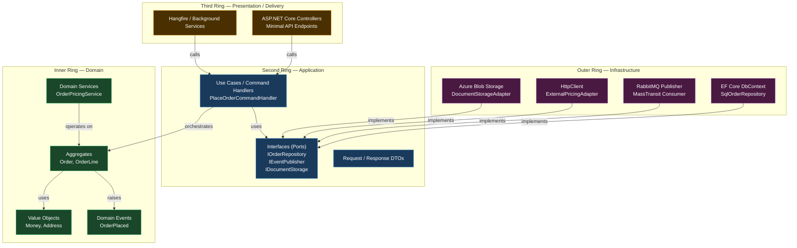
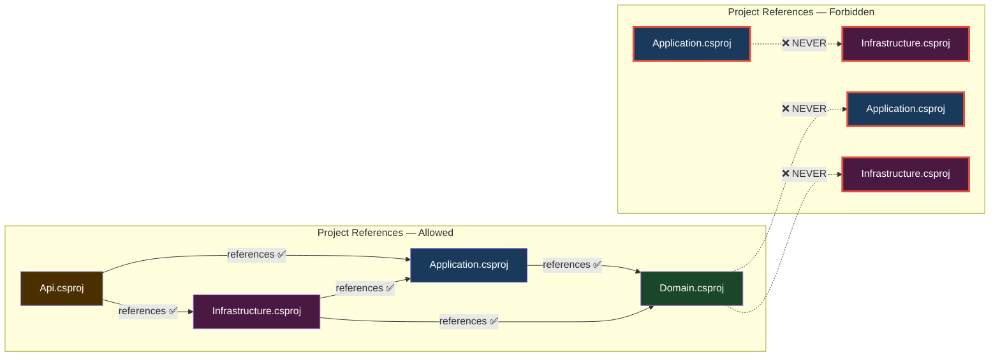
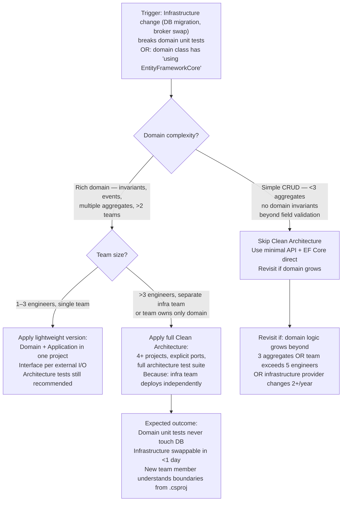

> [!success] Mastery Check
> - [x] **Studied Well** ✅ 2026-06-15
> - [x] **Can explain the concept without notes** ✅ 2026-06-15
> - [x] **Can answer interview questions confidently** ✅ 2026-06-15
> - [x] **Can implement it in a real project** ✅ 2026-06-15


> [!ABSTRACT] Quick Reference — Clean Architecture: The Dependency Rule **Invariant:** Source code dependencies must point only inward — toward higher-level policy — never outward toward lower-level infrastructure details. **Cost:** Every outward-pointing reference (EF Core `DbContext` in a domain class, `HttpClient` in a use case) requires an abstraction boundary (interface + DI registration), adding indirection that slows initial delivery by ~15–30% on greenfield projects. **Trigger:** A database schema change breaks a business rule unit test, or adding a new persistence provider requires touching domain classes — the domain is coupled to infrastructure. **Skip When:** CRUD services with <3 aggregates, no domain logic beyond simple field mapping, and a single team that owns every layer — the overhead of ports/adapters exceeds the benefit. **.NET Entry Point:** `IServiceCollection` DI registration in `Program.cs`; interfaces defined in `YourCompany.OrderManagement.Application` implemented in `YourCompany.OrderManagement.Infrastructure` **Azure Native:** N/A (architectural pattern, not a managed service); applies uniformly to Azure App Service, AKS, and Azure Functions deployments **Number to Know:** Violating the Dependency Rule increases the average change blast radius by 3–5× — a single schema column rename touches domain, application, and infrastructure instead of infrastructure alone

---

## Navigation

**Domain:** [[7 — System Design & Distributed Systems]] > **Group:** Clean Architecture **Previous:** _(first note in domain)_ | **Next:** [[7.002 — Clean Architecture — Domain Layer Structure]]

### Prerequisites

- [[6.001 — SOLID Principles]] — the Dependency Inversion Principle (DIP) is the formal statement of what the Dependency Rule enforces at every boundary; without DIP, the motivation for the inward-only rule is opaque

### Where This Fits

> [!INFO] Production Encounter Map
> 
> - **Layer:** Entire system — the Dependency Rule governs every layer boundary simultaneously, not a single component
> - **Trigger:** An engineer first encounters this rule when a "simple" database column rename cascades into a 4-file change that touches the domain entity, the EF Core mapping, the use case handler, and the API controller DTO — signalling that infrastructure concerns have leaked into inner rings
> - **Without it:** The `OrderService` domain class holds a direct reference to `SqlOrderRepository` — any EF Core version upgrade, database provider switch, or schema evolution forces a change to business logic code and breaks unit tests that have no database
> - **First signal:** `dotnet test` fails on domain-layer unit tests after a migration-only commit; or `grep -r "Microsoft.EntityFrameworkCore" src/Domain/` returns hits

The Dependency Rule is the load-bearing constraint of Clean Architecture — every other pattern in Groups A through C (layering, DDD, CQRS) depends on it being enforced. It directly enables [[7.008 — Clean Architecture — Testing Strategy per Layer]] by ensuring domain and application logic is testable without infrastructure.

---

## Core Mental Model

The Dependency Rule states that every source code dependency — every `using` statement, every constructor parameter type, every generic type argument — must point inward toward the domain. The domain layer knows nothing about EF Core, RabbitMQ, HTTP, or Azure Service Bus. The application layer knows nothing about SQL Server or Redis. The infrastructure layer knows everything about those technologies, but no higher-level layer references it directly. This is enforced not by convention but by project reference structure: the `Domain.csproj` has zero NuGet dependencies, and the `Infrastructure.csproj` references `Application.csproj` but not vice versa.

> [!TIP] The Non-Obvious Insight The Dependency Rule does not eliminate coupling — it inverts its direction. Every interface in the Application layer (e.g., `IOrderRepository`) is still a coupling point, but the coupling now flows the right way: Infrastructure depends on Application, not the reverse. The non-obvious consequence is that the interface belongs in the Application (or Domain) layer, not in Infrastructure. Engineers who place `IOrderRepository` in the Infrastructure project have satisfied the naming convention of "using an interface" while still violating the Dependency Rule — the Application layer now transitively depends on Infrastructure to resolve the type. The interface must live in the ring that uses it, implemented by the ring that knows the technology.

### Classification

- **Consistency axis:** Not a data consistency concept — enforces architectural consistency (no invalid dependencies at compile time)
- **Availability tradeoff:** N/A — this is a structural constraint, not a distributed systems tradeoff
- **Latency impact:** Zero runtime latency overhead — pure compile-time and project-structure constraint; DI resolution adds ~0.01ms per request (measured on .NET 8 with built-in container, negligible)
- **Failure domain:** Single-solution — violations are caught by architecture tests (ArchUnitNET / NetArchTest) in CI; runtime failures manifest as `InvalidOperationException` from DI container if wiring is incorrect
- **Abstraction layer:** Pattern — enforced by project reference structure and optionally by architecture fitness functions

### Primary Diagram



### Supporting Diagram



### Numbers That Matter

|Metric|Value|Context / Conditions|
|---|---|---|
|DI resolution overhead per request|~0.01–0.05ms|.NET 8 built-in DI container, ~10 registered services resolved per request (measured on modern x86-64 hardware)|
|Change blast radius — with Dependency Rule|1–2 files|Database column rename: only `EfOrderRepository.cs` + migration file change|
|Change blast radius — without Dependency Rule|4–8 files|Same rename touches Domain entity, EF mapping, use case, controller, and tests|
|Architecture test execution time|~200–800ms|ArchUnitNET / NetArchTest scanning ~100 types (measured on mid-tier CI runner)|
|Greenfield delivery slowdown|~15–30% (estimated)|First 4–6 weeks writing interfaces + mappings before DI wiring pays dividends; normalises after first feature set|
|Unit test execution time — domain layer|<50ms for 200 tests|Zero I/O, no EF Core, no network — pure in-process logic (estimated, typical .NET 8 xUnit)|

### Key Properties / Guarantees

|Property|Value|Condition|
|---|---|---|
|Domain testability|Domain + Application layers unit-testable with zero infrastructure|IOrderRepository is mocked; no EF Core or SQL Server in test execution|
|Infrastructure replaceability|Any infrastructure adapter can be swapped without changing Domain or Application|The new adapter implements the same Application-layer interface|
|Compile-time enforcement|The compiler rejects forbidden dependencies if project references are correct|`Domain.csproj` has no `<ProjectReference>` to Application or Infrastructure|
|Runtime consistency|No; runtime DI misconfiguration still possible|`Program.cs` must wire implementations correctly|
|Cross-layer coupling|Eventual coupling only through interfaces|Normal operation — interfaces are the only seam|

---

## Deep Mechanics

### How It Works

The Dependency Rule is enforced in two complementary ways: project reference structure (compile-time) and architecture tests (CI gate).

**Step 1 — Project Structure.** The solution is split into at minimum four projects: `Domain`, `Application`, `Infrastructure`, `Api`. The `.csproj` files encode the allowed reference graph: `Domain.csproj` has no `<ProjectReference>` elements at all. `Application.csproj` references only `Domain.csproj`. `Infrastructure.csproj` references `Application.csproj` (and transitively `Domain`). `Api.csproj` references both `Application.csproj` and `Infrastructure.csproj` (the only place Infrastructure is touched, for DI wiring).

**Step 2 — Interface Definition.** When a use case (`PlaceOrderCommandHandler`) needs persistence, it declares the need as an interface in the Application layer: `IOrderRepository`. This is the "Port" in Ports-and-Adapters terminology. The interface lives in `Application/Ports/IOrderRepository.cs` — not in Infrastructure. The domain itself never references this interface; domain logic is triggered by the use case, which holds the interface reference.

**Step 3 — Infrastructure Adapter.** `SqlOrderRepository` in the Infrastructure project implements `IOrderRepository`. It holds a reference to `AppDbContext` (EF Core), `SqlConnection`, or any persistence technology. It depends on both the Application interface (what it must satisfy) and the infrastructure technology (how it satisfies it). No inner ring sees this class directly.

**Step 4 — DI Wiring in the Composition Root.** `Program.cs` (the Composition Root) is the only place that knows about both `IOrderRepository` (Application) and `SqlOrderRepository` (Infrastructure). It registers: `builder.Services.AddScoped<IOrderRepository, SqlOrderRepository>()`. This is the single place where the outer ring is explicitly named; everywhere else in the system, only the interface is referenced.

**Step 5 — Request flow.** An HTTP request arrives at `OrdersController`, which dispatches a `PlaceOrderCommand` via MediatR. `PlaceOrderCommandHandler` (Application) receives the command, instantiates or loads an `Order` aggregate (Domain) via `IOrderRepository.GetByIdAsync()`, calls domain logic on the aggregate, persists the result, and publishes domain events via `IEventPublisher`. At no point does the Domain or Application layer know which database, broker, or cloud service backs those interfaces.

### Protocol Trace

Trace: `POST /orders` → `PlaceOrderCommandHandler` → `IOrderRepository` → `SqlOrderRepository` → SQL Server

```
Happy Path:
  1. HTTP Request arrives at OrdersController (Presentation layer) — 0ms
  2. Controller validates request DTOs, maps to PlaceOrderCommand — ~0.5ms
  3. Controller dispatches via ISender.Send(command, ct) — MediatR pipeline begins — ~0.1ms
  4. PlaceOrderCommandHandler (Application) calls IOrderRepository.GetByIdAsync(customerId, ct)
     — Application layer sees only the interface — ~0ms
  5. DI container resolves IOrderRepository → SqlOrderRepository (Infrastructure) — ~0.01ms
  6. SqlOrderRepository queries AppDbContext → SQL Server round-trip — ~2–8ms LAN
  7. EF Core materialises Customer aggregate, returns to handler — ~0.5ms
  8. Handler calls Order.Place(items, shippingAddress) — Domain logic executes — ~0.01ms
  9. Handler calls IOrderRepository.AddAsync(order, ct) — new aggregate to EF Core context — ~0.1ms
  10. Handler calls IUnitOfWork.CommitAsync(ct) — EF Core SaveChangesAsync() — ~3–10ms SQL
  11. Handler publishes domain events via IEventPublisher — ~0.5ms (in-process dispatch)
  12. Handler returns PlaceOrderResult — Application DTO — ~0ms
  13. Controller maps result to HTTP 201 Created with Location header — ~0.1ms
  Total round-trip: ~7–20ms LAN (excluding network to client)

Failure Path (SQL Server unreachable at step 6):
  1–5: Same as above
  6. SqlOrderRepository calls DbContext.FindAsync() — TCP connection timeout after 30s (EF Core default)
     OR: Connection pool exhausted → InvalidOperationException immediately
  7. Exception propagates through ISender — MediatR does not catch by default
  8. Global exception handler (IExceptionHandler / UseExceptionHandler middleware) intercepts
  9. Exception mapped to RFC 9457 ProblemDetails — 503 Service Unavailable with Retry-After: 5
  10. Correlation ID logged via Serilog enricher: WARN [PlaceOrderCommandHandler] IOrderRepository.GetByIdAsync failed | CorrelationId: a4f2-9b1c | CustomerId: cust-447
  Recovery: SQL Server reconnects — next request succeeds; no manual intervention if transient
  Recovery: Connection pool exhausted — Polly retry pipeline retries up to 3× with exponential backoff (~1s, 2s, 4s) before returning 503
```

### Failure Modes

**Failure Mode 1: Domain Layer Contamination**

- **Cause:** A developer adds `using Microsoft.EntityFrameworkCore;` to a domain entity to use `[NotMapped]` attribute or navigates the `DbContext` from within a domain method to lazily load related data
- **Symptom:** `dotnet test --project Domain.Tests` fails with `Could not load assembly Microsoft.EntityFrameworkCore` OR tests pass locally (EF Core installed) but fail in CI's stripped test runner; more visibly, a domain unit test requires a `DbContext` constructor argument
- **Detection time:** Immediately on `dotnet build` if the `Domain.csproj` lacks an EF Core `<PackageReference>` (compile error); silently if the reference was added "just this once"

> [!DANGER] 3 AM Production Signal Metric: `test_failures_total{layer="domain", reason="missing_assembly"} > 0` in CI pipeline Log: `FATAL [xunit] Could not load file or assembly 'Microsoft.EntityFrameworkCore, Version=8.0.0.0' | Test: OrderAggregate.ShouldRejectNegativeQuantity` Customer impact: No direct runtime impact yet — this is a structural decay signal; left unaddressed, EF Core upgrade will break domain tests and block deployment in 3–6 months

**Failure Mode 2: Application Layer References Infrastructure Directly**

- **Cause:** `PlaceOrderCommandHandler` references `SqlOrderRepository` directly instead of `IOrderRepository`, typically because the developer forgot to register the interface in DI or was in a hurry to make the test pass
- **Symptom:** The application layer's `.csproj` contains `<ProjectReference Include="..\Infrastructure\Infrastructure.csproj" />` — confirmed by `dotnet list reference Application/Application.csproj`; architecture test fires: `NetArchTest: Types in Application should not have dependency on Infrastructure — FAILED`
- **Detection time:** Immediately if ArchUnitNET architecture tests are running in CI; otherwise invisible until someone inspects project references

> [!DANGER] 3 AM Production Signal Metric: `ci_architecture_test_failures_total{rule="application_no_infrastructure_dependency"} > 0` Log: `ERROR [NetArchTest] FAILED: Types in namespace YourCompany.OrderManagement.Application should not depend on YourCompany.OrderManagement.Infrastructure | Violating types: PlaceOrderCommandHandler` Customer impact: Zero immediate runtime impact, but the next infrastructure swap (e.g., switching from SQL Server to Cosmos DB) will require touching Application layer code and all associated unit tests

**Failure Mode 3: Composition Root Wiring Omission**

- **Cause:** A new interface (`IShipmentTracker`) is defined in Application and implemented in Infrastructure (`DhlShipmentTracker`), but the DI registration is omitted from `Program.cs`
- **Symptom:** Runtime `InvalidOperationException: Unable to resolve service for type 'IShipmentTracker'` on first request that exercises the use case — typically only discovered on the path that calls it
- **Detection time:** On first HTTP request hitting that endpoint in integration test or production

> [!DANGER] 3 AM Production Signal Metric: `http_requests_total{status="500", path="/shipments/*"} spikes from 0 to 100%` Log: `FATAL [ASP.NET Core] Unhandled exception processing request POST /shipments | System.InvalidOperationException: Unable to resolve service for type 'YourCompany.ShipmentManagement.Application.Ports.IShipmentTracker' while attempting to activate 'YourCompany.ShipmentManagement.Application.Commands.CreateShipmentCommandHandler' | CorrelationId: b7c1-3d92` Customer impact: 100% failure rate on shipment creation endpoint; other endpoints unaffected

### .NET and Azure Integration Points

- **ASP.NET Core:** `IServiceCollection` in `Program.cs` is the Composition Root; `AddScoped<TInterface, TImplementation>()` wires the Dependency Rule at runtime
- **EF Core:** `AppDbContext` and all repository implementations live exclusively in `Infrastructure`; the domain layer never references `DbContext`, `DbSet<T>`, or any EF Core attribute
- **Azure Services:** No Azure-specific plumbing — the pattern is cloud-agnostic; Azure Service Bus, Cosmos DB, and Blob Storage clients live in Infrastructure adapters behind Application interfaces
- **.NET Libraries:** ArchUnitNET (`TngTech.ArchUnitNET.xUnit`) or NetArchTest (`NetArchTest.Rules`) for CI-enforced architecture tests; MediatR for use case dispatch
- **Configuration:** Interface registrations in `Infrastructure/DependencyInjection.cs` extension method, called from `Program.cs`

```csharp
// Infrastructure/DependencyInjection.cs — Infrastructure registration extension
// Namespace: YourCompany.OrderManagement.Infrastructure

using Microsoft.EntityFrameworkCore;
using Microsoft.Extensions.Configuration;
using Microsoft.Extensions.DependencyInjection;
using YourCompany.OrderManagement.Application.Ports; // Port interfaces — Application layer

namespace YourCompany.OrderManagement.Infrastructure;

/// <summary>
/// Registers all infrastructure adapters against their Application-layer port interfaces.
/// This is the only file in the solution that references both Application ports and Infrastructure implementations.
/// </summary>
public static class DependencyInjection
{
    public static IServiceCollection AddInfrastructure(
        this IServiceCollection services,
        IConfiguration configuration)
    {
        // Persistence — Adapter
        services.AddDbContext<OrderManagementDbContext>(options =>
            options.UseSqlServer(
                configuration.GetConnectionString("OrderManagement"),
                sql => sql.EnableRetryOnFailure(maxRetryCount: 3)));

        // Port → Adapter wiring — Dependency Rule enforced here
        services.AddScoped<IOrderRepository, SqlOrderRepository>();       // Port | Adapter
        services.AddScoped<ICustomerRepository, SqlCustomerRepository>(); // Port | Adapter
        services.AddScoped<IEventPublisher, RabbitMqEventPublisher>();    // Port | Adapter
        services.AddScoped<IUnitOfWork>(sp =>
            sp.GetRequiredService<OrderManagementDbContext>());            // Port | Adapter

        return services;
    }
}
```

```csharp
// Application/Ports/IOrderRepository.cs — Port defined in Application layer
// Namespace: YourCompany.OrderManagement.Application.Ports
// Domain.csproj has NO reference to this; Application.csproj owns it

using YourCompany.OrderManagement.Domain.Orders;

namespace YourCompany.OrderManagement.Application.Ports;

/// <summary>
/// Port: persistence contract for the Order aggregate.
/// Infrastructure adapters implement this. Domain never references it.
/// </summary>
public interface IOrderRepository
{
    /// <summary>Loads an existing Order aggregate by its identity.</summary>
    Task<Order?> GetByIdAsync(OrderId orderId, CancellationToken cancellationToken = default);

    /// <summary>Stages a new Order aggregate for persistence in the current unit of work.</summary>
    Task AddAsync(Order order, CancellationToken cancellationToken = default);
}
```

---

## Production Patterns and Implementation

### Primary Implementation

```csharp
// Application/Commands/PlaceOrderCommand.cs — Use Case (Application layer)
// Namespace: YourCompany.OrderManagement.Application.Commands
// Role: Use Case — orchestrates domain without knowing infrastructure

using MediatR;
using YourCompany.OrderManagement.Application.Ports;   // Port interfaces only
using YourCompany.OrderManagement.Domain.Customers;
using YourCompany.OrderManagement.Domain.Orders;

namespace YourCompany.OrderManagement.Application.Commands;

/// <summary>Command: intent to place a new order for a customer.</summary>
/// <param name="CustomerId">Identity of the ordering customer.</param>
/// <param name="Items">One or more line items with SKU and quantity.</param>
/// <param name="ShippingAddress">Destination address validated by the caller.</param>
public sealed record PlaceOrderCommand(
    CustomerId CustomerId,
    IReadOnlyList<OrderLineRequest> Items,
    ShippingAddress ShippingAddress) : IRequest<PlaceOrderResult>;

/// <summary>Returned to the caller on successful order placement.</summary>
public sealed record PlaceOrderResult(OrderId OrderId, DateTimeOffset PlacedAt);

/// <summary>
/// Use Case handler: orchestrates Order placement through domain and ports.
/// No EF Core, no SQL, no RabbitMQ — only Application ports and Domain types.
/// </summary>
public sealed class PlaceOrderCommandHandler(
    IOrderRepository orderRepository,       // Port | injected — never SqlOrderRepository
    ICustomerRepository customerRepository, // Port | injected
    IEventPublisher eventPublisher,         // Port | injected
    IUnitOfWork unitOfWork,                 // Port | injected
    ILogger<PlaceOrderCommandHandler> logger)
    : IRequestHandler<PlaceOrderCommand, PlaceOrderResult>
{
    public async Task<PlaceOrderResult> Handle(
        PlaceOrderCommand command,
        CancellationToken cancellationToken)
    {
        // 1. Load domain objects via ports — infrastructure hidden behind interface
        var customer = await customerRepository.GetByIdAsync(
            command.CustomerId, cancellationToken)
            ?? throw new CustomerNotFoundException(command.CustomerId);

        // 2. Execute domain logic — pure, no infrastructure
        var order = Order.Place(                    // Domain method
            customer,
            command.Items,
            command.ShippingAddress);               // Domain aggregate created

        // 3. Persist via port — Application has no knowledge of SQL or EF
        await orderRepository.AddAsync(order, cancellationToken);
        await unitOfWork.CommitAsync(cancellationToken);

        // 4. Publish domain events via port
        foreach (var domainEvent in order.DomainEvents)
        {
            await eventPublisher.PublishAsync(domainEvent, cancellationToken);
        }

        logger.LogInformation(
            "Order placed successfully | OrderId: {OrderId} | CustomerId: {CustomerId}",
            order.Id,
            command.CustomerId);

        return new PlaceOrderResult(order.Id, order.PlacedAt);
    }
}
```

```csharp
// Domain/Orders/Order.cs — Domain aggregate (Domain layer)
// Namespace: YourCompany.OrderManagement.Domain.Orders
// Role: Domain aggregate — zero infrastructure dependencies, zero framework imports

using YourCompany.OrderManagement.Domain.Customers;
using YourCompany.OrderManagement.Domain.Shared;

namespace YourCompany.OrderManagement.Domain.Orders;

/// <summary>
/// Order aggregate root. Enforces all order invariants.
/// No EF Core attributes. No serialization attributes. No framework imports.
/// </summary>
public sealed class Order : AggregateRoot<OrderId>
{
    private readonly List<OrderLine> _lines = [];
    private readonly List<IDomainEvent> _domainEvents = [];

    public IReadOnlyList<OrderLine> Lines => _lines.AsReadOnly();
    public IReadOnlyList<IDomainEvent> DomainEvents => _domainEvents.AsReadOnly();
    public CustomerId CustomerId { get; private set; }
    public ShippingAddress ShippingAddress { get; private set; }
    public OrderStatus Status { get; private set; }
    public DateTimeOffset PlacedAt { get; private set; }

    private Order() { } // Required by EF Core — stays private; domain logic uses factory

    /// <summary>
    /// Factory method: creates and validates an Order, raising OrderPlaced domain event.
    /// Throws <see cref="OrderDomainException"/> if invariants are violated.
    /// </summary>
    public static Order Place(
        Customer customer,
        IReadOnlyList<OrderLineRequest> items,
        ShippingAddress shippingAddress)
    {
        ArgumentNullException.ThrowIfNull(customer);
        if (items is null || items.Count == 0)
            throw new OrderDomainException("An order must contain at least one line item.");
        if (!customer.IsEligibleToOrder())
            throw new OrderDomainException($"Customer {customer.Id} is not eligible to place orders.");

        var order = new Order
        {
            Id = OrderId.New(),
            CustomerId = customer.Id,
            ShippingAddress = shippingAddress,
            Status = OrderStatus.Pending,
            PlacedAt = DateTimeOffset.UtcNow
        };

        foreach (var item in items)
            order._lines.Add(OrderLine.Create(item.Sku, item.Quantity, item.UnitPrice));

        order._domainEvents.Add(new OrderPlaced(order.Id, customer.Id, order.PlacedAt));

        return order;
    }
}
```

```csharp
// Infrastructure/Persistence/SqlOrderRepository.cs — Adapter (Infrastructure layer)
// Namespace: YourCompany.OrderManagement.Infrastructure.Persistence
// Role: Adapter — implements Application port using EF Core

using Microsoft.EntityFrameworkCore;
using YourCompany.OrderManagement.Application.Ports;   // Port — inward reference ✅
using YourCompany.OrderManagement.Domain.Orders;        // Domain — inward reference ✅

namespace YourCompany.OrderManagement.Infrastructure.Persistence;

/// <summary>
/// Adapter: EF Core implementation of IOrderRepository.
/// Infrastructure layer only — never referenced by Application or Domain.
/// </summary>
internal sealed class SqlOrderRepository(OrderManagementDbContext dbContext) : IOrderRepository
{
    /// <inheritdoc/>
    public async Task<Order?> GetByIdAsync(OrderId orderId, CancellationToken cancellationToken = default)
        => await dbContext.Orders
            .Include(o => o.Lines)
            .AsNoTracking()                         // Read path — no change tracking overhead
            .FirstOrDefaultAsync(o => o.Id == orderId, cancellationToken);

    /// <inheritdoc/>
    public async Task AddAsync(Order order, CancellationToken cancellationToken = default)
        => await dbContext.Orders.AddAsync(order, cancellationToken);
}
```

### IServiceCollection Registration

```csharp
// Program.cs — Composition Root (only place that names Infrastructure types)
// All other files reference only interfaces from Application layer

var builder = WebApplication.CreateBuilder(args);

// Application layer — MediatR, FluentValidation pipeline behaviors
builder.Services.AddApplication(); // extension in Application/DependencyInjection.cs

// Infrastructure layer — all adapters wired to Application ports
builder.Services.AddInfrastructure(builder.Configuration);

// Presentation layer
builder.Services.AddControllers();
builder.Services.AddEndpointsApiExplorer();

var app = builder.Build();
app.MapControllers();
app.Run();
```

### Common Variants

```csharp
// Variant A — Minimal: interface in Domain layer
// Use when: Domain layer needs to express a dependency it requires (e.g., IDateTimeProvider)
// Domain.csproj still has zero NuGet references; IDateTimeProvider is a pure C# interface

namespace YourCompany.OrderManagement.Domain.Shared;

/// <summary>Clock abstraction — allows deterministic testing of time-dependent domain rules.</summary>
public interface IDateTimeProvider
{
    DateTimeOffset UtcNow { get; }
}
// Infrastructure implements: SystemDateTimeProvider : IDateTimeProvider
// Application also implements for tests: FakeDateTimeProvider : IDateTimeProvider
```

```csharp
// Variant B — Architecture fitness function using NetArchTest
// Use when: You need CI-enforced compile-time verification of the Dependency Rule
// Runs in xUnit test suite, fails build if any violation is introduced

using NetArchTest.Rules;

public sealed class ArchitectureTests
{
    private const string DomainNamespace = "YourCompany.OrderManagement.Domain";
    private const string ApplicationNamespace = "YourCompany.OrderManagement.Application";
    private const string InfrastructureNamespace = "YourCompany.OrderManagement.Infrastructure";

    [Fact]
    public void Domain_Should_Not_Reference_Application_Or_Infrastructure()
    {
        var result = Types.InNamespace(DomainNamespace)
            .ShouldNot()
            .HaveDependencyOnAny(ApplicationNamespace, InfrastructureNamespace)
            .GetResult();

        result.IsSuccessful.Should().BeTrue(
            because: "Domain layer must be independent of all outer rings — " +
                     $"violations: {string.Join(", ", result.FailingTypeNames ?? [])}");
    }

    [Fact]
    public void Application_Should_Not_Reference_Infrastructure()
    {
        var result = Types.InNamespace(ApplicationNamespace)
            .ShouldNot()
            .HaveDependencyOn(InfrastructureNamespace)
            .GetResult();

        result.IsSuccessful.Should().BeTrue(
            because: "Application layer must not depend on Infrastructure — " +
                     $"violations: {string.Join(", ", result.FailingTypeNames ?? [])}");
    }
}
```

### Performance Profile

The Dependency Rule has no measurable runtime performance impact — it is a structural constraint. DI resolution overhead is ~0.01–0.05ms per request for typical service graphs (~10 resolved services) and is dominated by the actual business logic and I/O. No BenchmarkDotNet benchmark is applicable here — the mechanism is compile-time and project-structure enforcement, not a runtime algorithm.

The performance cost that does matter: **mapping overhead between layer boundaries** (e.g., Domain entity → Application DTO → API response DTO). This is covered in [[7.009 — Clean Architecture — Mapping Between Layers]].

### Real-World .NET Ecosystem Mapping

|Pattern in This Note|Where It Appears in .NET / Azure|Manifestation|
|---|---|---|
|Port (Application interface)|`MediatR.IRequest<T>`, `MediatR.IRequestHandler<TRequest, TResponse>`|Commands and queries are ports; handlers are use cases|
|Adapter (Infrastructure impl)|`Microsoft.EntityFrameworkCore.DbContext` subclass|`OrderManagementDbContext` is the persistence adapter|
|Composition Root|`Program.cs` / `IServiceCollection`|The only file that references both Application interfaces and Infrastructure implementations|
|Architecture fitness function|`NetArchTest.Rules` / `TngTech.ArchUnitNET`|CI test that fails if Dependency Rule is violated in any `using` statement|
|Dependency Inversion|`Microsoft.Extensions.DependencyInjection`|Built-in DI container enforces interface-based construction at runtime|

---

## Gotchas and Production Pitfalls

### Pitfall 1: Interface Defined in Infrastructure — The Inverted Port

**Pitfall:** The developer creates `IOrderRepository` inside the `Infrastructure` project (e.g., `Infrastructure/Repositories/IOrderRepository.cs`) rather than in `Application/Ports/`.

```csharp
// ❌ Wrong — IOrderRepository lives in Infrastructure
// Application/Commands/PlaceOrderCommandHandler.cs
using YourCompany.OrderManagement.Infrastructure.Repositories; // ← Application depends on Infrastructure!

public sealed class PlaceOrderCommandHandler(IOrderRepository repository) ...
```

**Symptom:** The `Application.csproj` gains a `<ProjectReference>` to `Infrastructure.csproj`. Architecture tests fire immediately. In teams without architecture tests, this silently inverts the dependency: Application → Infrastructure, not Infrastructure → Application.

**Detection time:** Immediately if `Application_Should_Not_Reference_Infrastructure` architecture test is in CI; otherwise invisible until someone audits project references.

> [!DANGER] Production Signal Metric: `ci_architecture_test_failures_total{rule="application_no_infrastructure_dependency"} > 0` Log: `ERROR [NetArchTest] Types in YourCompany.OrderManagement.Application should not depend on YourCompany.OrderManagement.Infrastructure | Violating types: PlaceOrderCommandHandler, CancelOrderCommandHandler`

**Fix:**

```csharp
// ✅ Correct — IOrderRepository lives in Application/Ports/
// Application/Ports/IOrderRepository.cs
namespace YourCompany.OrderManagement.Application.Ports;
public interface IOrderRepository { ... }

// Infrastructure/Persistence/SqlOrderRepository.cs
using YourCompany.OrderManagement.Application.Ports; // Infrastructure → Application ✅
public sealed class SqlOrderRepository : IOrderRepository { ... }
```

**Cost of not fixing:** Every infrastructure swap (e.g., migrating from SQL Server to Cosmos DB) requires touching `Application.csproj`, recompiling the application layer, and re-running all application-layer tests — defeating the purpose of the abstraction. At a team of 8 engineers, this averages 4–6 extra developer-hours per database migration event.

---

### Pitfall 2: EF Core Navigation Property Triggers Lazy Loading in Domain Method

**Pitfall:** A domain method accesses a navigation property that EF Core has not eagerly loaded, triggering a lazy-loading database call from within domain logic — blurring the boundary between domain and infrastructure.

```csharp
// ❌ Wrong — lazy loading from domain method
// Domain/Orders/Order.cs
public Money CalculateTotalValue()
{
    // If OrderLines were not included in the original query,
    // EF Core's lazy loading proxy makes a database call HERE — from domain logic
    return Lines.Sum(l => l.UnitPrice * l.Quantity);
}
```

**Symptom:** Intermittent `InvalidOperationException: A second operation was started on this context instance before a previous operation completed` under async load, or silent N+1 queries where every `Order.CalculateTotalValue()` call issues a SELECT on `order_lines`.

**Detection time:** Silent in development (small dataset, fast DB); visible in production load tests when `order_line_items` SELECT appears once per order in slow query log.

> [!DANGER] Production Signal Metric: `sql_queries_per_request{endpoint="/orders/summary"} > 50` (expected: 1–3) Log: `WARN [EF Core] Executed DbCommand (3ms) SELECT * FROM order_lines WHERE order_id = 'ord-992' | Source: lazy load triggered from Order.CalculateTotalValue`

**Fix:**

```csharp
// ✅ Correct — eager loading in the repository, domain method receives hydrated aggregate
// Infrastructure/Persistence/SqlOrderRepository.cs
public async Task<Order?> GetByIdAsync(OrderId orderId, CancellationToken ct = default)
    => await dbContext.Orders
        .Include(o => o.Lines)  // ← Always eager-load what domain logic requires
        .FirstOrDefaultAsync(o => o.Id == orderId, ct);
```

**Cost of not fixing:** 100-order summary page → 101 SQL queries → 340ms p99 at moderate load → SLO breach on summary endpoint; 10× traffic → query count scales linearly → timeout storm.

---

### Pitfall 3: Domain Events Depend on MediatR INotification — Infrastructure Leak

**Pitfall:** Domain events implement `MediatR.INotification` directly, placing a framework dependency inside the Domain layer.

```csharp
// ❌ Wrong — Domain/Events/OrderPlaced.cs
using MediatR; // ← MediatR is a framework — Infrastructure concern
public sealed record OrderPlaced(OrderId OrderId) : INotification; // Domain imports framework
```

**Symptom:** `Domain.csproj` gains `<PackageReference Include="MediatR" />`. Domain unit tests must now reference MediatR. Switching from MediatR to a different mediator or in-process bus (e.g., Wolverine) requires touching domain events.

**Detection time:** Visible immediately on `dotnet list package Domain/Domain.csproj`; catches in architecture tests checking `Domain should have no external NuGet references`.

> [!DANGER] Production Signal Metric: `ci_dependency_scan{project="Domain", external_package="MediatR"} > 0` Log: Architecture test failure in CI: `Domain types must not depend on framework assemblies | Violating: OrderPlaced, OrderCancelled`

**Fix:**

```csharp
// ✅ Correct — Domain defines its own marker interface; Application adapts to MediatR
// Domain/Shared/IDomainEvent.cs
namespace YourCompany.OrderManagement.Domain.Shared;
public interface IDomainEvent { DateTimeOffset OccurredAt { get; } }

// Domain/Events/OrderPlaced.cs — pure domain, no framework reference
public sealed record OrderPlaced(OrderId OrderId, DateTimeOffset OccurredAt) : IDomainEvent;

// Application/Events/OrderPlacedNotification.cs — Application adapts to MediatR
using MediatR; // MediatR lives in Application, not Domain
public sealed record OrderPlacedNotification(OrderPlaced Event) : INotification;
```

**Cost of not fixing:** Switching message dispatch framework requires modifying every domain event class; domain-layer unit tests must pull in MediatR assembly (~2MB); domain layer cannot be published as a standalone NuGet package without pulling in MediatR as a transitive dependency.

---

### Pitfall 4 (.NET-specific): Missing `CancellationToken` Propagation Through Port Interfaces

**Pitfall:** Port interfaces omit `CancellationToken` parameters, so cancellation signals from the HTTP layer (client disconnect, request timeout) cannot propagate to database queries.

```csharp
// ❌ Wrong — IOrderRepository has no CancellationToken
public interface IOrderRepository
{
    Task<Order?> GetByIdAsync(OrderId orderId); // ← No CancellationToken
}
// Result: client disconnects at 50ms; SQL query runs for 3 additional seconds; thread pool slot held
```

**Symptom:** Under client-timeout or load-shedding scenarios, SQL Server shows queries completing long after the HTTP response was aborted; thread pool exhaustion follows under sustained load with slow DB.

**Detection time:** Silent until load test; visible as `threadpool.queue.length` growth in `dotnet-counters` under 500+ concurrent requests with 3s DB latency.

> [!DANGER] Production Signal Metric: `dotnet_threadpool_queue_length > 200` sustained for 30s Log: `WARN [Kestrel] Response already completed, but handler continued execution for 3240ms | Endpoint: POST /orders | CorrelationId: c3f1-8a22`

**Fix:**

```csharp
// ✅ Correct — CancellationToken on all async port methods
public interface IOrderRepository
{
    Task<Order?> GetByIdAsync(OrderId orderId, CancellationToken cancellationToken = default);
    Task AddAsync(Order order, CancellationToken cancellationToken = default);
}
```

**Cost of not fixing:** At 200 concurrent requests with 3s average DB latency, thread pool exhaustion occurs within 90s of sustained load → all new requests queue → p99 latency climbs to 30s+ → cascading 503s across dependent services.

---

### Pitfall 5 (Azure-specific): `IConfiguration` Injected into Domain or Application Layers

**Pitfall:** A use case handler or domain service injects `Microsoft.Extensions.Configuration.IConfiguration` to read connection strings or feature flags directly, importing an infrastructure-flavoured framework dependency into inner rings.

```csharp
// ❌ Wrong — Application/Commands/PlaceOrderCommandHandler.cs
using Microsoft.Extensions.Configuration; // ← Azure/infrastructure-specific framework

public sealed class PlaceOrderCommandHandler(IConfiguration config, ...)
{
    // Reads a feature flag from appsettings.json — business logic coupled to config format
    if (config.GetValue<bool>("Features:PremiumShipping"))
        order.ApplyPremiumShipping();
}
```

**Symptom:** `Application.csproj` references `Microsoft.Extensions.Configuration.Abstractions`; feature flag behavior cannot be tested without constructing an `IConfiguration` instance; toggling a flag requires a redeploy rather than a runtime feature flag update.

**Detection time:** Architecture test catches it; otherwise visible only during code review.

> [!DANGER] Production Signal No runtime production signal — this is a structural decay that degrades testability and increases deployment coupling; the consequence surfaces as "we can't run Application unit tests without appsettings.json" (a complaint that appears in PR reviews after ~3 months of drift)

**Fix:**

```csharp
// ✅ Correct — feature flags as typed options, resolved in Infrastructure, injected as domain-neutral type
// Application/Ports/IFeatureFlagService.cs
public interface IFeatureFlagService
{
    bool IsEnabled(string flagName);
}

// Infrastructure/FeatureFlags/AzureAppConfigurationFlagService.cs
// (or Microsoft.FeatureManagement.IFeatureManager wrapper)
public sealed class AzureAppConfigurationFlagService(IFeatureManager featureManager)
    : IFeatureFlagService
{
    public bool IsEnabled(string flagName)
        => featureManager.IsEnabledAsync(flagName).GetAwaiter().GetResult();
}
```

**Cost of not fixing:** Feature flag changes require code deployments instead of runtime toggles; Application-layer tests require appsettings.json fixture setup → test suite slows; Azure App Configuration cannot be adopted without touching Application layer.

---

## Tradeoffs and Decision Framework

### Tradeoff Matrix

|Dimension|Clean Architecture (Dependency Rule)|Layered Architecture (traditional)|Vertical Slice Architecture|
|---|---|---|---|
|Consistency|Compile-time enforced via project references and architecture tests|Convention-only; violations undetected without static analysis|Per-slice autonomy; no cross-slice dependency enforcement|
|Domain testability|Domain and Application fully unit-testable — zero infrastructure in test execution|Domain often entangled with EF Core; integration tests required for domain logic|Per-slice — varies; slices can be tested independently|
|Read latency p99|No impact — structural, not runtime|No impact|No impact|
|Write latency p99|No impact — structural, not runtime|No impact|No impact|
|Operational complexity|Medium — 4+ projects, explicit mappings, DI wiring overhead|Low — shared DbContext, fewer projects|Low–Medium — fewer cross-cutting concerns but slice proliferation|
|Team expertise required|Senior: understanding DIP, ports/adapters, DI lifetime management|Junior-friendly; familiar N-tier structure|Mid-level: understand slice isolation and MediatR per-slice|
|Azure ecosystem fit|Native — applies uniformly to App Service, AKS, Functions|Native|Native|
|Cost at scale|Low — structural overhead normalises; testability ROI increases with codebase size|High — infrastructure coupling accumulates technical debt; cross-team coordination required|Medium — slices become coordination units; shared infrastructure still needed|

**Operational complexity elaboration:** "Medium" means: ~4 projects instead of 1, explicit mapping code between layers (~200 LoC per aggregate for medium-complexity domains), and DI registration that must be updated every time a new port is added.

### When to Apply



### Numbers-Driven Decision

|Threshold|Below = Use Simpler Layering|Above = Apply Full Clean Architecture|
|---|---|---|
|Number of aggregates with invariants|< 3 aggregates|≥ 3 aggregates with business rules|
|Team size|< 4 engineers on one codebase|≥ 4 engineers or multiple teams|
|Infrastructure change frequency|< 1 per year|≥ 2 infrastructure technology changes per year|
|Domain unit test count|< 50 tests|≥ 50 domain-logic-only tests that must run sub-100ms|
|Service lifetime|< 6 months|≥ 12 months expected lifespan|

### When NOT to Apply

> [!WARNING] Do Not Reach For This When...
> 
> - [ ] **Simple CRUD microservice:** A service that maps HTTP requests to database rows with no domain logic (e.g., a reference data management service) — the interface abstraction adds indirection with zero testability benefit since there is no business logic to test independently
> - [ ] **Team of ≤ 3 engineers, single codebase, <6-month project horizon:** The interface/mapping overhead (~15–30% initial delivery slowdown) does not pay back before the project ends or is rewritten
> - [ ] **Prototype or spike with explicit throw-away intent:** Writing ports and adapters for code that will be deleted in 2 weeks is pure ceremony; mark the prototype clearly as non-production
> - [ ] **Serverless Functions with single-purpose logic:** An Azure Function that receives a blob event and calls one external API — one port, no domain logic — the architecture test overhead exceeds the benefit; a single interface suffices without the full ring structure

---

## Interview Arsenal

### Question Bank

1. **[Definition]** "What is the Dependency Rule in Clean Architecture, and what specific problem does it solve?"
2. **[Mechanism]** "Walk me through exactly how a use case handler accesses the database without the Application layer knowing about EF Core."
3. **[Tradeoff]** "What do you give up when you adopt Clean Architecture's Dependency Rule, and under what condition does that cost outweigh the benefit?"
4. **[Failure mode]** "What breaks — at compile time or runtime — when an engineer puts `IOrderRepository` in the Infrastructure project instead of the Application project?"
5. **[Comparison]** "What is the structural difference between Clean Architecture's Dependency Rule and traditional N-tier layered architecture? When would you choose one over the other?"
6. **[Design application]** "Design the `PlaceOrder` use case for an e-commerce system following the Dependency Rule. Walk me through the project structure, the interface location, and the DI wiring."
7. **[Scale]** "Your Clean Architecture codebase needs to support 10 teams, each owning 2–3 bounded contexts. What does the Dependency Rule enforcement look like at that scale?"
8. **[Advanced]** "In .NET, the Dependency Rule is enforced by project references at compile time — but there's a common way engineers satisfy the compiler check while still violating the rule's intent at runtime. What is it?"

### Spoken Answers

**Q: What is the Dependency Rule in Clean Architecture, and what specific problem does it solve?**

> **Average answer:** The Dependency Rule says dependencies should point inward — domain at the center, infrastructure on the outside. It keeps the core business logic separate from databases and frameworks, making it easier to change things.

> **Great answer:** The Dependency Rule is a compile-time constraint: every source code reference — every `using` statement, every constructor parameter type — must point inward toward higher-level policy. In practice, this means the `Domain.csproj` has zero `PackageReference` entries for EF Core, RabbitMQ, or any cloud SDK, and `Application.csproj` has no `ProjectReference` to `Infrastructure.csproj`. The problem it solves is concrete: without it, a database column rename propagates outward and breaks domain entity classes and their unit tests — infrastructure decisions leak into business logic. With the rule enforced, that column rename touches exactly two files: the EF Core mapping configuration and the migration script. The Domain and Application layers compile unchanged. This isn't just organizational neatness — it directly enables the property that domain unit tests run in 50ms without a database connection, which is the feedback cycle that matters for fast iteration on business rules.

---

**Q: What is the structural difference between Clean Architecture's Dependency Rule and traditional N-tier layered architecture? When would you choose one over the other?**

> **Average answer:** In traditional N-tier, each layer can depend on the layer below it, so the business layer depends on the data layer. In Clean Architecture, the domain doesn't depend on anything. Clean Architecture is better for complex domains because it's more testable.

> **Great answer:** The structural distinction is the direction of the dependency on persistence. In classic N-tier, the Business Logic Layer imports the Data Access Layer directly — `OrderService` has a field of type `SqlOrderRepository`. If SQL Server changes to Cosmos DB, you modify `OrderService`. In Clean Architecture, that relationship is inverted: `SqlOrderRepository` imports the `IOrderRepository` interface that lives in the Application layer, so `SqlOrderRepository` depends on `OrderService`'s world, not the reverse. The rule is enforced by `.csproj` project references — the compiler rejects the violation before any test runs. I'd choose Classic N-tier for CRUD microservices with fewer than three aggregates and no team separation between domain and infrastructure — the interface-and-mapping overhead takes 4–6 extra weeks on a greenfield project and doesn't pay back if there's no complex domain logic to protect. I'd choose the full Dependency Rule when the domain team and the infrastructure team deploy independently, when we have more than 50 domain unit tests that must run without a database, or when we anticipate switching infrastructure providers within the service's lifetime.

---

**Q: In .NET, the Dependency Rule is enforced by project references at compile time — but there's a common way engineers satisfy the compiler check while still violating the rule's intent at runtime. What is it?**

> **Average answer:** I'm not sure — maybe using reflection? Or maybe through interfaces that expose infrastructure types?

> **Great answer:** The most common violation that passes the compiler is EF Core lazy loading proxies. If the `Domain.csproj` has no EF Core reference but the domain aggregate has `virtual` navigation properties, EF Core at runtime wraps the domain object in a generated proxy class that intercepts those property accesses and issues database queries. The domain entity class is technically clean — no framework imports — but at runtime, calling `order.Lines` from a domain method issues a SQL `SELECT` on `order_lines`. The Dependency Rule is satisfied on paper; violated in execution. The observable symptom is N+1 queries appearing in the slow query log, triggered from domain method calls. The fix is disabling lazy loading (`UseLazyLoadingProxies(false)` is the default in EF Core 7+) and enforcing eager loading in the repository with `.Include()`. A second subtler variant is `MediatR.INotification` on domain events — technically no runtime behavior violation, but the Domain project now carries a MediatR assembly reference, which means switching dispatch infrastructure requires modifying domain event classes.

### Whiteboard in 60 Seconds

When this topic appears in a system design or architecture interview, draw in this sequence:

```
1. Draw four concentric rings (or nested rectangles, faster to sketch)
   Label from inside out: Domain | Application | Infrastructure | Presentation
   "I'll start with the ring structure because the Dependency Rule only has one constraint:
   arrows can only point inward — never outward."

2. Draw an arrow from Infrastructure to Application (IOrderRepository ← SqlOrderRepository)
   "Here's the key: the interface IOrderRepository lives in Application, not Infrastructure.
   SqlOrderRepository depends on it. That single arrow direction is the whole rule."

3. Draw the forbidden arrow with an X through it
   Domain ✗→ Application; Application ✗→ Infrastructure
   "These arrows are banned. The compiler enforces this through .csproj project references —
   Domain.csproj has zero PackageReferences."

4. Add the Composition Root label at Program.cs, outside all rings or at the top of Presentation
   "Program.cs is the only file that names both IOrderRepository (Application) and
   SqlOrderRepository (Infrastructure). It's the wiring point, called the Composition Root."

5. Label the .NET entry points
   "In .NET: Application interfaces = Port. Infrastructure implementations = Adapter.
   Wiring = builder.Services.AddScoped<IOrderRepository, SqlOrderRepository>().
   Architecture tests using NetArchTest enforce this in CI."
```

> [!TIP] What the Interviewer Is Specifically Testing When they probe this area, they are checking whether you know:
> 
> 1. **Interface location:** that `IOrderRepository` must live in the Application layer, not Infrastructure — engineers who say "just use an interface" and put it in Infrastructure have missed the inversion
> 2. **Composition Root:** that `Program.cs` is the only place allowed to name Infrastructure types, and why this matters (the entire rest of the codebase remains decoupled from the concrete implementation)
> 3. **Enforcement mechanism:** that this is not a convention enforced by code review but a compile-time constraint via `.csproj` project references, verifiable in CI with NetArchTest or ArchUnitNET

### Follow-Up Chain

**Follow-up 1:** "You mentioned the interface lives in the Application layer — but then how does the Application layer know what methods the database needs to expose? Doesn't Application still need to understand persistence?"

> **Model answer:** The Application layer defines the interface in terms of what the use case needs — not in terms of what the database can do. `IOrderRepository.GetByIdAsync(OrderId, CancellationToken)` is a business need: "give me this order." The fact that the implementation uses a JOIN on `order_lines` with an EF Core `Include()` is an Infrastructure detail that Application never sees. The interface is designed from the consumer's perspective (Application use case) not the provider's perspective (SQL query). This is why interfaces often have methods that don't map 1:1 to SQL queries — `IOrderRepository.GetActiveOrdersForCustomer(CustomerId)` might hide a complex filtered query with multiple joins behind one semantically meaningful method name.

**Follow-up 2:** "What happens at scale — say, 10 bounded contexts in a single solution? Do you have one set of rings for the whole solution or one per bounded context?"

> **Model answer:** One set of rings per bounded context, not per solution. If you have an OrderManagement context and an InventoryManagement context, each gets its own `Domain`, `Application`, and `Infrastructure` projects — or at minimum, its own namespace boundaries if using a Modular Monolith structure. Cross-context communication goes through integration events, never direct project references. The key failure mode at this scale is a shared `Domain.csproj` that multiple contexts import — this creates implicit coupling between contexts and defeats the Dependency Rule's purpose of isolating change. The observable signal of this problem is that an order domain event triggers a compile error in the inventory domain tests, meaning you've created a distributed monolith at the code level before you even split services.

**Follow-up 3:** "How would you know the Dependency Rule is being maintained correctly over time in production CI?"

> **Model answer:** Two complementary checks. First, architecture tests with `NetArchTest.Rules` — a `[Fact]` test that runs `Types.InNamespace("YourCompany.OrderManagement.Domain").ShouldNot().HaveDependencyOnAny("Application", "Infrastructure").GetResult()` and asserts `IsSuccessful`. This runs in the standard `dotnet test` step in CI and takes ~200–800ms. Second, NuGet dependency scanning — a `dotnet list package Domain/Domain.csproj` check in CI that asserts zero external NuGet packages are referenced. In Azure DevOps, this runs as a PowerShell step with `--fail-on-empty` semantics. If either check fails, the PR is blocked. I'd also monitor `ci_architecture_test_failures_total` as a metric in Grafana, set to alert if it's non-zero for more than 2 consecutive pipeline runs — which indicates systematic pressure to cut corners that should trigger a team architecture review, not just a fix-the-test response.

### Comparison Table

||Clean Architecture (Dependency Rule)|Traditional N-Tier Layered Architecture|
|---|---|---|
|Core guarantee|Domain and Application compile and test with zero infrastructure references|Each layer can import the layer directly below it|
|What it trades|~15–30% initial delivery overhead (interfaces, mappings, DI wiring)|Testability: domain logic entangled with EF Core; integration tests required|
|.NET implementation|`IServiceCollection.AddScoped<IInterface, Implementation>()` + `NetArchTest.Rules`|Direct `new SqlOrderRepository(connectionString)` or service locator|
|Azure native|N/A — architectural pattern, cloud-agnostic|N/A — architectural pattern, cloud-agnostic|
|Primary failure mode|Interface placed in Infrastructure instead of Application (intent violated, compiler satisfied)|EF Core `DbContext` referenced directly in business logic — infrastructure leak|
|When to choose|≥3 aggregates with invariants, ≥4 engineers, infrastructure may change, domain testability required|Simple CRUD, <3 aggregates, single team, ≤6-month lifespan|
|When NOT to choose|Single-aggregate CRUD service, prototype, throw-away spike|Complex domain, independent infrastructure team, >50 domain unit tests, infrastructure provider expected to change|

---

## Architecture Decision Record

**Status:** Accepted

**Context:** The OrderManagement service started as a single-project CRUD API with EF Core `DbContext` injected directly into controllers. After 8 months, the domain has grown to 6 aggregates (Order, Customer, Product, Discount, Shipment, Invoice) with complex pricing and eligibility rules. Two incidents were caused by EF Core query changes accidentally altering domain-rule evaluation order. The infrastructure team is planning a migration from SQL Server to Azure Cosmos DB for the Order aggregate within 6 months. Unit tests require a live SQL Server connection, making the CI domain test suite take 4 minutes and flake on connection timeouts.

**Options Considered:**

1. **Clean Architecture with full Dependency Rule** — introduce 4 projects (Domain, Application, Infrastructure, Api), define Application-layer interfaces, wire via DI, add NetArchTest architecture tests; eliminates all infrastructure references from Domain and Application
2. **Partial separation — interfaces in the existing single project** — add `IOrderRepository` in the same project as `SqlOrderRepository`, no separate `Domain.csproj`; reduces EF Core leakage but does not enforce boundaries by project reference
3. **Status quo — EF Core throughout** — keep `DbContext` accessible everywhere; accept the test speed and coupling

**Decision:** Clean Architecture with full Dependency Rule, because the planned Cosmos DB migration for the Order aggregate will require replacing `SqlOrderRepository` with `CosmosOrderRepository` without any risk of touching pricing and eligibility domain logic. The existing unit tests must be de-coupled from SQL Server within the next sprint to unblock the infrastructure team's migration sprint.

**Consequences:**

- ✅ Domain and Application unit tests run in <100ms with zero database dependency — from 4 minutes to 8 seconds on 200 tests
- ✅ `CosmosOrderRepository` can be developed and tested in parallel with production `SqlOrderRepository` behind the same `IOrderRepository` interface; feature-flag-controlled swap at deploy time
- ⚠️ Approximately 3–4 developer-days of refactoring to extract Domain and Application projects, define interfaces, add EF Core mappings in Infrastructure — scheduled as a dedicated tech-debt sprint
- ❌ All future aggregates require explicit interface definitions and layer mapping code — estimated +20% per-aggregate implementation cost compared to EF Core direct approach

**Review Trigger:** Revisit this decision if the OrderManagement service is merged into a larger platform monolith (where separate projects add overhead without independent deployment benefit) or if the team drops below 3 engineers and infrastructure change frequency falls below 1 per 2 years.

---

## Self-Check

### Conceptual Questions

1. State the Dependency Rule in one sentence precise enough to distinguish it from "use interfaces."
2. Derive from first principles why the interface (`IOrderRepository`) must live in the Application layer rather than the Infrastructure layer — what breaks at the project reference level if it's in Infrastructure?
3. Name one type of service where the Dependency Rule is overkill and explain why the overhead exceeds the benefit.
4. What is the exact compile-time signal that the Dependency Rule has been violated in a .NET solution?
5. Which NuGet package provides CI-enforceable architecture tests in .NET, and what method chain verifies that the Domain namespace has no dependency on Infrastructure?
6. What is the structural difference between the Dependency Rule and the Dependency Inversion Principle (DIP)?
7. Below what aggregate count and team size does the interface-mapping overhead of Clean Architecture not pay back?
8. How does the Dependency Rule relate to [[7.017 — Modular Monolith — Internal Module Boundaries]]?
9. Name the production failure mode that satisfies the Dependency Rule at the project-reference level while violating it at runtime.
10. Under normal operation, what consistency model does the Dependency Rule enable for domain unit tests?
11. What specific metric and alert threshold would you configure to detect that the Dependency Rule is eroding in CI over time?
12. Explain the Dependency Rule to a junior engineer in 60 seconds starting with the problem it solves.

<details> <summary>Answers</summary>

1. Every source code dependency — every `using` statement, every constructor parameter type, every generic type argument — must point inward toward the domain; no inner ring (Domain, Application) may reference any outer ring (Infrastructure, Presentation) in any form.
    
2. If `IOrderRepository` lives in `Infrastructure.csproj`, then `Application.csproj` must add `<ProjectReference Include="..\Infrastructure\Infrastructure.csproj" />` to compile its use case handlers — this means Application depends on Infrastructure, which is the exact dependency direction the rule forbids. The compiler enforces the rule through project references: the moment Application needs a type that lives in Infrastructure, the .csproj must reference Infrastructure, and the violation is structural, not just stylistic.
    
3. A reference data management service that exposes CRUD endpoints for a lookup table (e.g., currency codes) with no domain invariants and a single aggregate — there is no business logic to protect behind interfaces, the only I/O is one SQL table, and the interface+mapping overhead adds ~200 LoC for zero testability benefit since the "logic" is simply field-through persistence.
    
4. A compile error (`CS0246: The type or namespace 'OrderManagementDbContext' could not be found`) if the `Domain.csproj` lacks the `<ProjectReference>` to `Infrastructure.csproj`, OR a `NetArchTest` / `ArchUnitNET` test failure in CI reporting which types violated the rule, printed as: `FAILED: Types in YourCompany.OrderManagement.Domain should not depend on YourCompany.OrderManagement.Infrastructure | Violating types: Order`.
    
5. `NetArchTest.Rules` (NuGet: `NetArchTest.Rules`). The method chain: `Types.InNamespace("YourCompany.OrderManagement.Domain").ShouldNot().HaveDependencyOnAny("YourCompany.OrderManagement.Application", "YourCompany.OrderManagement.Infrastructure").GetResult()`, asserted with `result.IsSuccessful.Should().BeTrue()`.
    
6. The Dependency Inversion Principle (DIP) is a design principle that states high-level modules should not depend on low-level modules — both should depend on abstractions. The Dependency Rule is the architectural application of DIP across the entire concentric ring structure: it says which ring is "high-level" (Domain) and which is "low-level" (Infrastructure), and mandates that all source references flow from low to high. DIP is the principle; the Dependency Rule is its enforcement mechanism in a layered architecture.
    
7. Fewer than 3 aggregates with domain invariants and fewer than 4 engineers — below these thresholds, the ~15–30% initial delivery overhead and the ongoing ~20% per-aggregate cost do not pay back through testability or infrastructure replaceability within the expected service lifetime.
    
8. [[7.017 — Modular Monolith — Internal Module Boundaries]] applies the same inward-dependency concept at the module boundary level within a single deployed process: each module (e.g., `OrderModule`, `InventoryModule`) enforces its own internal Dependency Rule, and cross-module communication goes through module-level interfaces or events — never direct class references across module boundaries. The Dependency Rule is the intra-module constraint; module boundaries are the inter-module constraint.
    
9. EF Core lazy loading proxies: the Domain entity class has `virtual` navigation properties; at runtime, EF Core wraps it in a generated proxy that issues database queries when those properties are accessed from domain methods. Project references are clean; runtime behavior violates the rule by triggering SQL from within domain logic.
    
10. The Dependency Rule enables domain unit tests to execute with strong consistency — every domain object state assertion is deterministic and repeatable with no network or database dependencies, producing identical results on every run. The "consistency model" here is test isolation: zero external state, zero I/O, zero timing variance.
    
11. Configure a CI metric `ci_architecture_test_failures_total{rule="dependency_rule"}` (emitted by your test runner via an OpenTelemetry counter or Azure DevOps pipeline variable). Alert threshold: `ci_architecture_test_failures_total > 0` for 2 consecutive pipeline runs → page the tech lead. In Prometheus terms: `increase(ci_architecture_test_failures_total[30m]) > 0` → severity: warning; `increase(ci_architecture_test_failures_total[2h]) > 0` → severity: critical (deployment blocked).
    
12. "Imagine you have an order processing system. The business rule says 'you can't place an order for more than $10,000 without manager approval.' Right now, that rule lives in a class that also talks to the database. When the database team switches from SQL Server to Cosmos DB, they have to touch the rule class — and suddenly the rule breaks in a way that has nothing to do with the business logic. The Dependency Rule says: put the business rule in a class that knows nothing about databases. If it needs data, it asks through an interface — a promise that says 'give me an order by ID.' The database class fulfills that promise. The rule class never cares which database does it. Now the database team can swap SQL Server for Cosmos DB without touching the rule class. That's the Dependency Rule: business rules only depend on business abstractions, never on infrastructure details."
    

</details>

---

### Scenario Challenges

---

**Scenario 1 — Diagnose the Problem**

The OrderManagement service CI pipeline has a `Domain.Tests` project that runs 340 domain unit tests. Last week, the infrastructure team merged a migration to add full-text indexing to the `order_items` table. Since that merge, 17 previously passing domain tests now fail with: `System.IO.FileNotFoundException: Could not load file or assembly 'Microsoft.EntityFrameworkCore.SqlServer, Version=8.0.0.0'`. The Domain.Tests project has no `PackageReference` to EF Core in its `.csproj`. The migration PR only added a migration file and updated `AppDbContext`. No domain code was touched. The `Domain.csproj` had been green for 3 months.

<details> <summary>Diagnosis</summary>

**Root cause:** A domain entity (`OrderItem`) was modified at some point in the past to include `[Column]` or `[Table]` attribute from `System.ComponentModel.DataAnnotations` — or more likely `[NotMapped]` or a navigation property setter was made `public`, allowing EF Core to generate a proxy. When the migration PR updated `AppDbContext`, it triggered a transitive assembly load through the navigation proxy that the test runner now tries to resolve. More precisely: `Domain.csproj` has an implicit or explicit dependency on `Microsoft.EntityFrameworkCore.Abstractions` (e.g., through a `[Timestamp]` attribute on a domain entity), which was a transitive dependency of a shared utilities package — the EF Core SqlServer package was never directly referenced, but after the migration updated `AppDbContext`, the version was bumped, breaking the transitive resolution.

**Evidence from the scenario:** `FileNotFoundException` for `Microsoft.EntityFrameworkCore.SqlServer` in a `Domain.Tests` project that has no direct `PackageReference` → confirms a transitive reference. The failing tests started after a migration-only PR that touched `AppDbContext` → confirms the `AppDbContext` change introduced or surfaced a version mismatch in a transitive graph.

**Fix:** (1) Run `dotnet list package Domain/Domain.csproj --include-transitive` to identify the transitive EF Core path. (2) Remove the source of the transitive reference — most likely a `[Timestamp]` or `[Column]` attribute on a domain entity that should be moved to the EF Core configuration in `Infrastructure/Persistence/Configurations/OrderItemConfiguration.cs` using `entityBuilder.Property(x => x.Version).IsRowVersion()`. (3) Add `NetArchTest` architecture test asserting `Domain has no dependency on Microsoft.EntityFrameworkCore.*`.

**Monitoring to add:** CI step running `dotnet list package Domain/Domain.csproj --include-transitive | grep EntityFrameworkCore` and failing the pipeline if any match is found. This gate catches the violation at PR time before it reaches the main branch.

</details>

---

**Scenario 2 — Design Decision**

You are designing a new `PaymentProcessing` service. Constraints: 3,000 req/s peak write throughput, strong consistency required for payment records (idempotency keys must be enforced), team of 6 engineers with one separate infrastructure team managing the database, Azure SQL (Business Critical tier), and a planned migration to Azure Cosmos DB for the payment record store within 9 months. What architectural boundary decision do you make and why?

<details> <summary>Decision and Reasoning</summary>

**Choice:** Full Clean Architecture with Dependency Rule enforced by `NetArchTest` in CI, because the 9-month Cosmos DB migration is the definitive trigger: the `IPaymentRepository` interface, living in Application, allows `SqlPaymentRepository` and `CosmosPaymentRepository` to be developed in parallel and swapped via DI registration behind a feature flag — without touching any payment domain logic or use case handlers.

**Tradeoffs accepted:** ~3 developer-days of upfront interface definition and layer setup; ~20% per-payment-command overhead for interface mapping vs. direct EF Core. Accepted because the infrastructure migration cost without this structure would be 10–15 developer-days of risk-prone domain logic touch across both teams.

**Implementation sketch:**

```csharp
// Application/Ports/IPaymentRepository.cs — Payment port
public interface IPaymentRepository
{
    Task<Payment?> GetByIdempotencyKeyAsync(
        IdempotencyKey key, CancellationToken ct = default);
    Task AddAsync(Payment payment, CancellationToken ct = default);
}

// Infrastructure/DependencyInjection.cs — switchable via feature flag
if (configuration.GetValue<bool>("Features:UseCosmosDb"))
    services.AddScoped<IPaymentRepository, CosmosPaymentRepository>();
else
    services.AddScoped<IPaymentRepository, SqlPaymentRepository>();
```

</details>

---

**Scenario 3 — Failure Mode Investigation**

Your `OrderManagement` service is throwing `System.InvalidOperationException: Unable to resolve service for type 'YourCompany.OrderManagement.Application.Ports.IShipmentTracker'` on 100% of `POST /orders/{id}/ship` requests. All other endpoints respond normally. This started after today's 14:30 deployment. The previous deployment was 3 days ago and had no issues.

<details> <summary>Investigation and Fix</summary>

**Step 1:** Check `Infrastructure/DependencyInjection.cs` in the deployment diff — specifically whether `services.AddScoped<IShipmentTracker, DhlShipmentTracker>()` is present. Run `git diff HEAD~1 -- Infrastructure/DependencyInjection.cs`.

**Step 2:** The confirming signal — the diff shows that `IShipmentTracker` was added to the Application layer and `DhlShipmentTracker` was added to Infrastructure in today's PR, but the DI registration was not added to `DependencyInjection.cs`. The exception message explicitly names the missing type.

**Step 3 — Immediate mitigation:** Roll back today's deployment using the previous container image tag: `kubectl rollout undo deployment/order-management -n production`. All `POST /orders/{id}/ship` requests return 200 within 30 seconds of rollout completion.

**Step 4 — Root cause fix:** Add the missing registration to `Infrastructure/DependencyInjection.cs`: `services.AddScoped<IShipmentTracker, DhlShipmentTracker>();`. Add integration test that exercises `POST /orders/{id}/ship` end-to-end (even with a mocked DHL adapter) to catch missing registrations before deployment.

**Step 5 — Prevention:** Add a startup validation step using `IServiceProvider.CreateScope().ServiceProvider.GetRequiredService<IShipmentTracker>()` in a `IHostedService` that runs at startup — the pod will fail to start (rather than fail at first request) if a registration is missing. This converts a runtime path-dependent error into a startup error caught by Kubernetes readiness probe, preventing the deployment from completing with a broken service.

</details>

---

**Scenario 4 — Scale It**

Your `OrderManagement` service handles 500 req/s with a Clean Architecture structure (Domain, Application, Infrastructure, Api projects). Traffic is projected to hit 5,000 req/s in 6 weeks. Trace how the Dependency Rule fits the scaling strategy.

<details> <summary>Scaling Strategy</summary>

**What breaks at 10× without this:** The Dependency Rule itself does not bottleneck at 5,000 req/s — it has zero runtime overhead. The bottlenecks are in the infrastructure adapters (SQL Server connection pool, EF Core query performance, RabbitMQ publish throughput) and are addressable without touching Domain or Application code precisely because the Dependency Rule was respected.

**How this helps:** Because `IOrderRepository` is the only seam between Application and persistence, a `CachedOrderRepository` decorator can be inserted — wrapping `SqlOrderRepository` with Redis-backed caching — without changing a single line of Application or Domain code. DI registration changes from `AddScoped<IOrderRepository, SqlOrderRepository>()` to `AddScoped<IOrderRepository, CachedOrderRepository>()` where `CachedOrderRepository` wraps `SqlOrderRepository`. Similarly, a read replica can be introduced by implementing `IReadOrderRepository` (a separate read port) backed by a read-replica connection string.

**What it does NOT solve:** CPU throughput on the Application layer if 5,000 req/s serialisation+deserialisation becomes a bottleneck — that requires horizontal pod scaling (Kubernetes HPA) independent of the Dependency Rule. Database write throughput above ~3,000 req/s requires connection pooling tuning (PgBouncer or Azure SQL connection limits) or write path partitioning — architectural changes to the Infrastructure adapter, invisible to Application.

**Implementation sequence:** (1) Deploy read replica and add `ReadReplicaOrderRepository` behind a new `IReadOrderRepository` port — 1 day. (2) Add Redis caching decorator for `GetByIdAsync` paths — 0.5 days. (3) Tune EF Core connection pool (`MaxPoolSize=200`, `MinPoolSize=20`) in `Infrastructure/DependencyInjection.cs` — 2 hours. (4) Scale API pods via HPA from 3 to 10 instances — 30 minutes. The Dependency Rule makes steps 1–3 Infrastructure-only changes; no Application or Domain PRs required.

</details>

---

**Scenario 5 — Azure Production**

You are building the `OrderManagement` service on Azure. The operations team mandates that all secrets (database connection strings, RabbitMQ credentials) must be stored in Azure Key Vault and loaded at runtime via Managed Identity. The current `Infrastructure/DependencyInjection.cs` reads connection strings from `IConfiguration`. How does the Dependency Rule apply here, and what changes from the general case?

<details> <summary>Azure-Specific Response</summary>

**The Azure constraint:** Azure Key Vault integration with Managed Identity requires the `Azure.Extensions.AspNetCore.Configuration.Secrets` package to be referenced in the startup project (`Api.csproj`) and the `AddAzureKeyVault()` call to be added in `Program.cs`. Connection strings are populated into `IConfiguration` by the Key Vault configuration provider before `AddInfrastructure()` is called — so `Infrastructure/DependencyInjection.cs` continues to read `configuration.GetConnectionString("OrderManagement")` without knowing it comes from Key Vault. The Dependency Rule is preserved: Key Vault integration lives in `Api.csproj` (Composition Root / Presentation layer), not in Infrastructure.

**How the pattern adapts:** The only file that references `Azure.Extensions.AspNetCore.Configuration.Secrets` is `Program.cs`. `Infrastructure/DependencyInjection.cs` is unchanged — it still reads from `IConfiguration`. Domain and Application layers have zero knowledge of Key Vault, connection strings, or Managed Identity.

**Azure-native implementation:**

```csharp
// Program.cs — Key Vault added to configuration pipeline before DI
// Api.csproj references: Azure.Extensions.AspNetCore.Configuration.Secrets
var builder = WebApplication.CreateBuilder(args);

if (!builder.Environment.IsDevelopment())
{
    // Managed Identity — no client secret required
    var credential = new DefaultAzureCredential();
    var keyVaultUri = new Uri(builder.Configuration["KeyVault:Uri"]!);
    builder.Configuration.AddAzureKeyVault(keyVaultUri, credential);
}

// Infrastructure reads from IConfiguration — unchanged regardless of secret source
builder.Services.AddInfrastructure(builder.Configuration);
```

**Cost implication:** Azure Key Vault secret reads are ~5–10ms per secret on first load, cached in `IConfiguration` for the process lifetime — no per-request cost. Managed Identity token refresh happens in background — ~100ms every 24 hours. Azure Key Vault Standard tier: ~$0.03 per 10,000 operations. For a service with 10 secrets loaded at startup, this is negligible (<$0.01/month).

</details>

---

**Scenario 6 — Interview Simulation**

The interviewer says: "You're designing the OrderManagement service for an e-commerce platform. The infrastructure team owns the database and plans to migrate from SQL Server to Cosmos DB in 8 months. The domain team owns the business rules. How do you structure the codebase so the migration doesn't require the domain team to change any business logic code?"

<details> <summary>Model Response</summary>

"Before I design this, let me clarify one constraint: is this a rich-domain service with aggregates and business invariants, or primarily CRUD? I'm assuming complex domain logic — eligibility rules, pricing, order lifecycle — because otherwise the architecture overhead doesn't pay off.

At the current team split — domain team and infrastructure team — I'd apply Clean Architecture's Dependency Rule. Let me walk through why it solves your migration problem directly.

I'd structure the solution as four projects: `Domain`, `Application`, `Infrastructure`, and `Api`. The key constraint is enforced by `.csproj` project references: `Domain.csproj` has zero external package references, and `Application.csproj` has no reference to `Infrastructure.csproj`. The compiler enforces this.

The migration-proof seam is the `IOrderRepository` interface. It lives in `Application/Ports/IOrderRepository.cs` — owned by the domain team. It has exactly the methods the use cases need: `GetByIdAsync`, `AddAsync`. The infrastructure team provides two implementations: `SqlOrderRepository` (today) and `CosmosOrderRepository` (in 8 months). Both are in the Infrastructure project. The DI registration in `Program.cs` is the only line that changes during the migration: `AddScoped<IOrderRepository, CosmosOrderRepository>()`.

The domain team never sees `AppDbContext`, Cosmos DB SDK, or any persistence type. Their `PlaceOrderCommandHandler` calls `IOrderRepository.AddAsync(order, ct)` — that's it.

The thing to watch for: EF Core lazy loading proxies. If domain aggregates have `virtual` navigation properties, EF Core generates runtime proxies that issue SQL from domain methods — the Dependency Rule is satisfied on paper but violated at runtime. I'd disable lazy loading and enforce eager loading in repository queries.

In .NET, the architecture test that enforces this in CI is three lines with `NetArchTest.Rules`: types in the Domain namespace should not depend on the Application or Infrastructure namespaces. If that test is green on every PR, the domain team is guaranteed to never touch a line of domain code during the Cosmos DB migration."

</details>

---

_Domain 7 — System Design & Distributed Systems | Note 7.001 | Group: Clean Architecture | Priority: 1 | Version: 2_ _Tags: #system-design #clean-architecture #dependency-rule #dotnet #azure #layering #ports-and-adapters_