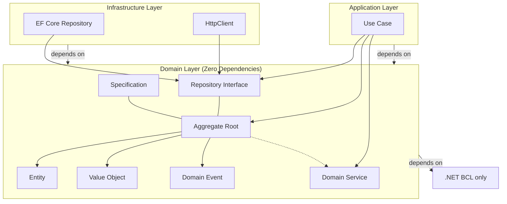
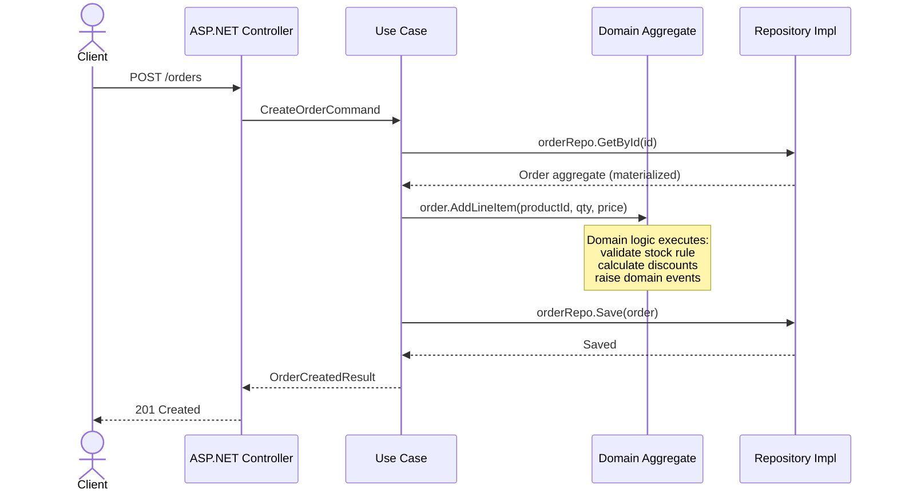
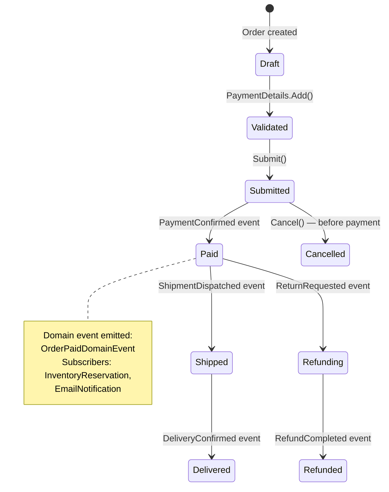
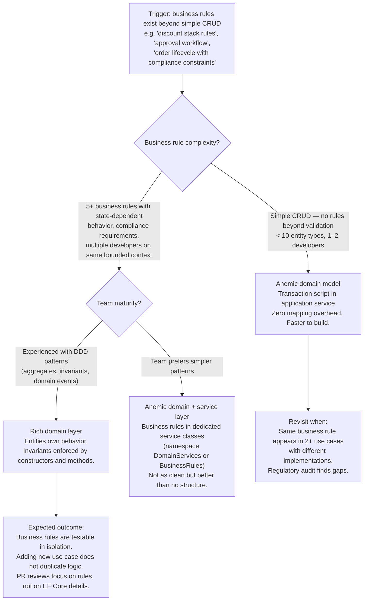

> [!success] Mastery Check
> - [x] **Studied Well** ✅ 2026-06-15
> - [x] **Can explain the concept without notes** ✅ 2026-06-15
> - [x] **Can answer interview questions confidently** ✅ 2026-06-15
> - [x] **Can implement it in a real project** ✅ 2026-06-15


> [!ABSTRACT] Quick Reference — Domain Layer (Clean Architecture)
> **Invariant:** The domain layer depends on NOTHING outside the standard library. It defines business entities, value objects, aggregates, domain services, domain events, and repository interfaces — and nothing else.
> **Cost:** Every infrastructure concern (EF Core, HTTP, serialization, DI containers) is banned from this project. Mapping between domain and persistence models is required. Development velocity slows on simple CRUD because every cross-boundary data item must be mapped.
> **Trigger:** You are modeling business rules that outlive the UI framework, the database vendor, and the hosting platform. The business logic cannot be coupled to Entity Framework or ASP.NET.
> **Skip When:** The application is CRUD-only with no business rules (admin panels, dashboards, simple data entry). An anemic domain model with the logic pushed into application services is strictly cheaper.
> **.NET Entry Point:** `class Order : AggregateRoot<OrderId>` / `interface IOrderRepository : IRepository<Order>` / `NuGet: (none — the domain layer references only `System.*` and `FluentValidation` optionally)`
> **Azure Native:** N/A — the domain layer is infrastructure-agnostic. On Azure, it compiles as a plain `net8.0` class library referenced by Functions, App Service, or Container Apps.
> **Number to Know:** The domain layer should compile in under 3 seconds. If it references EF Core, AutoMapper, or any NuGet beyond `FluentValidation`, it is NOT a clean domain layer — the dependency rule is violated.

## Navigation

**Domain:** [[7 — System Design & Distributed Systems]] > **Group:** Clean Architecture
**Previous:** [[7.001 — Clean Architecture — The Dependency Rule]] | **Next:** [[7.003 — Clean Architecture — Application Layer — Use Cases]]

### Prerequisites
- [[7.001 — Clean Architecture — The Dependency Rule]] — the domain layer is the innermost ring; this note defines what belongs inside that ring and what its structure looks like in C#.
- [[7.025 — Rich Domain Model vs Anemic Domain Model]] — the domain layer style decision (rich vs. anemic) determines whether entities carry behavior or are mere data bags.

### Where This Fits

> [!INFO] Production Encounter Map
> - **Layer:** The innermost ring — no dependencies on ASP.NET, EF Core, database drivers, or serialization libraries. A plain .NET class library.
> - **Trigger:** An engineer hits this when they try to inject `DbContext` into an entity method and discover the constructor call chain doesn't allow it, or when the team's PR review catches that `OrderEntity` references `Newtonsoft.Json` attributes.
> - **Without it:** Domain logic leaks into application services → the same business rule is implemented in three different controllers with slightly different behavior → one bug fix in the UI path doesn't fix it in the API path → production data silently diverges.
> - **First signal:** A PR where a domain entity has `[Table]`, `[Key]`, or `[JsonIgnore]` attributes; or an application service that contains `if` statements duplicating a rule the entity should own.

The domain layer structure is the keystone of Clean Architecture. Every other layer (application, infrastructure, presentation) depends on it. Getting this structure right determines whether the architecture delivers on its promise of isolated, testable business rules — or degenerates into tangled indirection that costs more than it saves.

## Core Mental Model

The domain layer is a plain .NET class library with zero dependencies beyond the .NET BCL (and optionally `FluentValidation` for specification-style validation). It contains your business vocabulary — entities, value objects, aggregates, domain services, domain events, and repository interfaces — and the business rules that govern them. The domain layer is what remains if you delete the database, the HTTP layer, and the UI. It is what you would unit-test with zero infrastructure.

Because the domain depends on nothing, its compilation is fast (~1–3s), its test setup is trivial (no mocking of infrastructure needed for pure domain logic tests), and its types can be instantiated freely in any context without worrying about DI container scoping or EF Core proxy creation.

> [!TIP] The Non-Obvious Insight
> The domain layer's purity is not just an architectural ideal — it is a deployment property. Because it has zero infrastructure dependencies, the domain project can be compiled as a NuGet package and shared across bounded contexts, microservices, or even polyglot environments (via a .NET Standard reference). This means the same `Order` aggregate root can be used in an ASP.NET Core API, an Azure Function, and a console-based batch processor without any conditional compilation or `#if` directives. The cost: you must write explicit mappers (or use mapped DTOs) at every infrastructure boundary, which grows linearly with the number of entity fields. Teams that fight this cost often revert to leaking `[Table]` and `[JsonIgnore]` attributes into the domain.

### Classification

- **Consistency axis:** Strong within a single aggregate; eventual across aggregates (domain events coordinate eventual consistency)
- **Availability tradeoff:** Not applicable — the domain layer is a compile-time artifact, not a runtime service
- **Latency impact:** Zero — the domain layer itself is pure CIL; latency is incurred at the infrastructure boundary when loading and persisting aggregates
- **Failure domain:** Single-node (in-process domain logic execution)
- **Abstraction layer:** Pattern / architectural layer

### Primary Diagram



### Supporting Diagram



### Numbers That Matter

| Metric | Value | Context / Conditions |
|---|---|---|
| Domain project compile time | ~1–3s | Zero-dependency class library, ~50 entity/value object types |
| Cost to map domain ↔ persistence | ~5–15 additional lines per entity | Explicit mapper or mapped DTO per aggregate root |
| Failure detection time for layer violations | Immediate | Build fails if a `using Infrastructure;` appears in domain code (checked by Roslyn analyzer) |
| Scale threshold where domain purity matters | >3 developers touching the same bounded context | Below 3 devs, the indirection cost > the coupling cost |

### Key Properties / Guarantees

| Property | Value | Condition |
|---|---|---|
| Dependency direction | Inward only — domain depends on nothing | Enforced by project reference direction and Roslyn analyzer |
| Business rule placement | Inside domain entities or domain services | Always — never in application or infrastructure |
| Testability | Unit-test business rules without mocking infrastructure | Pure domain logic tests take <10ms per test |
| Technology independence | Zero coupling to frameworks, databases, or HTTP | Achieved when no NuGet packages beyond `FluentValidation` are referenced |
| Compilation speed | Sub‑5s even in large domain projects | Because no reflection-heavy infrastructure packages are referenced |

## Deep Mechanics

### How It Works

A request enters the system at the controller, is translated into a use-case DTO, and is dispatched to an application service (use case). The use case does NOT contain business logic — it orchestrates:

1. **Load:** Use case calls `orderRepository.GetById(orderId)` which returns a fully hydrated `Order` aggregate root. The repository implementation (in the infrastructure layer) maps from the EF Core entity to the domain `Order`, or (better) uses EF Core's value conversion and owned types to persist the domain model directly while keeping the domain layer clean.

2. **Invoke:** Use case calls a domain method: `order.ApplyDiscount(couponCode)`. This method lives on the `Order` aggregate root. It validates that the coupon is valid for this order's total, applies the percentage, and raises a `DiscountAppliedDomainEvent` on the aggregate's internal event list.

3. **Persist:** Use case calls `orderRepository.Save(order)`. The repository implementation inspects the aggregate's domain events, persists the changes, and publishes the events.

The domain layer's types are never `DbSet<T>` — they are plain C# classes with business behavior. EF Core persistence works either through a matching infrastructure entity that maps to the domain type, or through EF Core's `OwnedEntityTypeBuilder` for value objects.

### State Transitions



### Failure Modes

**Failure Mode 1: Invalid Aggregate State — Business Rule Bypassed**

- **Cause:** An application service modifies entity properties via public setters instead of calling a domain method, or a developer adds a `[JsonConstructor]` with parameterless constructor to enable deserialization, which EF Core uses to create entities in an invalid state.
- **Symptom:** The entity is in a state that violates a business invariant — e.g., an `Order` with `Status = Paid` but `TotalAmount = 0`. No error is raised because the validation lives in a method that was never called.
- **Detection time:** Silent until the billing run or customer complaint.
- **Blast radius:** Downstream systems (invoicing, fulfillment, accounting) process an invalid order; compensating transactions are required.

> [!DANGER] 3 AM Production Signal
> Metric: `billing_orders_validation_failed{reason="zero_total_paid"} > 0`
> Log: `ERROR [BillingService] Invoice generation failed | OrderId: ord-8472 | TotalAmount: 0 | Status: Paid | CorrelationId: a4f2-...`
> Customer impact: Customer receives an invoice for $0.00; accounting team finds 847 unpaid orders at month-end close.

**Failure Mode 2: Anemic Domain + Transaction Script**

- **Cause:** The domain entities are pure data bags (property bags with get/set and no methods). Business rules are implemented in application services as transaction scripts that operate on these bags. Over time, the same rule is duplicated across multiple use cases with subtle differences.
- **Symptom:** A rule like "orders over $500 require manager approval" is implemented differently in `CreateOrderService` (checks after save), `OrderUpdateService` (checks before save), and `BulkOrderImport` (doesn't check at all).
- **Detection time:** Months — discovered during an audit or a regulatory compliance review.
- **Blast radius:** Financial penalties for regulatory non-compliance; loss of customer trust.

> [!DANGER] 3 AM Production Signal
> Metric: `approval_bypass_count{rule="order_over_500"} > 0`
> Log: `WARN [AuditService] Order ord-331 approved without manager review | TotalAmount: 847.50 | Origin: BulkOrderImport | CorrelationId: b3d1-...`
> Customer impact: Regulatory fine for non-compliance with financial controls.

### .NET and Azure Integration Points

- **ASP.NET Core:** The domain project is referenced by the application project. Controllers never reference domain entities directly — they use DTOs mappers.
- **EF Core:** Infrastructure layer maps domain aggregates to EF Core entity types via `OwnedEntityTypeBuilder<T>` (for value objects and child entities) and convention-based configuration. Avoid `[Table]`, `[Key]`, `[Required]` attributes on domain types.
- **Azure Services:** The domain layer is compiled into a `net8.0` class library deployed as part of an Azure Functions app, an App Service WebApp, or an AKS container. The domain itself has no Azure dependency.
- **.NET Libraries:** `FluentValidation` (optional) for specification-style validation in value objects. `MediatR` domain event publish (only if you accept the dependency — many teams avoid it in the domain layer and instead centralize event dispatch in the application layer).
- **Configuration:** The domain project file has `PackageReference` entries only for `FluentValidation` (if used) and `Microsoft.NET.Sdk`. No `Microsoft.EntityFrameworkCore.*`, `AutoMapper`, `Newtonsoft.Json`, or `System.Text.Json` references.

```csharp
// Integration point — domain layer exposes interfaces, infrastructure implements them
// Namespace: YourCompany.OrderManagement.Domain
public interface IOrderRepository : IRepository<Order>
{
    Task<Order?> GetByIdAsync(OrderId id, CancellationToken ct);
    void Add(Order order);
    Task<int> SaveChangesAsync(CancellationToken ct);
}

// Infrastructure implementation — this lives in the infrastructure project, not the domain
// Namespace: YourCompany.OrderManagement.Infrastructure.Persistence
public sealed class OrderRepository : IOrderRepository
{
    private readonly OrderDbContext _context;
    private readonly IDomainEventPublisher _publisher;

    public OrderRepository(OrderDbContext context, IDomainEventPublisher publisher)
    {
        _context = context;
        _publisher = publisher;
    }

    public async Task<Order?> GetByIdAsync(OrderId id, CancellationToken ct)
    {
        var entity = await _context.Orders
            .Include(o => o.LineItems)
            .FirstOrDefaultAsync(o => o.Id == id.Value, ct);

        return entity?.ToDomain(); // Infrastructure → Domain mapping
    }

    public async Task<int> SaveChangesAsync(CancellationToken ct)
    {
        var domainEvents = _context.ChangeTracker
            .Entries<AggregateRoot>()
            .SelectMany(e => e.Entity.FlushEvents())
            .ToList();

        var result = await _context.SaveChangesAsync(ct);

        foreach (var @event in domainEvents)
            await _publisher.PublishAsync(@event, ct);

        return result;
    }
}
```

## Production Patterns and Implementation

### Primary Implementation

```csharp
// Port — Domain Aggregate Root
// Namespace: YourCompany.OrderManagement.Domain.Orders
public sealed class Order : AggregateRoot<OrderId>
{
    private readonly List<LineItem> _lineItems = new();
    private readonly List<IDomainEvent> _events = new();

    public IReadOnlyList<LineItem> LineItems => _lineItems.AsReadOnly();
    public OrderStatus Status { get; private set; }
    public Money TotalAmount { get; private set; }
    public CustomerId CustomerId { get; }
    public DateTime CreatedAt { get; }
    public DateTime? SubmittedAt { get; private set; }

    private Order() { } // For ORM materialization only

    private Order(CustomerId customerId, Money initialTotal)
    {
        Id = OrderId.New();
        CustomerId = customerId;
        TotalAmount = initialTotal;
        Status = OrderStatus.Draft;
        CreatedAt = DateTime.UtcNow;
    }

    public static Order Create(CustomerId customerId, Money initialTotal)
    {
        ArgumentNullException.ThrowIfNull(customerId);
        ArgumentNullException.ThrowIfNull(initialTotal);

        if (initialTotal.Amount <= 0)
            throw new DomainException("Initial order total must be positive.");

        var order = new Order(customerId, initialTotal);

        order._events.Add(new OrderCreatedDomainEvent(
            order.Id, customerId, initialTotal, DateTime.UtcNow));

        return order;
    }

    public void AddLineItem(ProductId productId, string productName, int quantity, Money unitPrice)
    {
        if (Status != OrderStatus.Draft)
            throw new DomainException("Cannot modify a submitted order.");

        if (quantity <= 0)
            throw new DomainException("Quantity must be positive.");

        var lineItem = new LineItem(Id, productId, productName, quantity, unitPrice);
        _lineItems.Add(lineItem);
        RecalculateTotal();
    }

    public void Submit()
    {
        if (Status != OrderStatus.Draft)
            throw new DomainException("Only draft orders can be submitted.");

        if (_lineItems.Count == 0)
            throw new DomainException("Cannot submit an empty order.");

        Status = OrderStatus.Submitted;
        SubmittedAt = DateTime.UtcNow;

        _events.Add(new OrderSubmittedDomainEvent(Id, CustomerId, TotalAmount, SubmittedAt.Value));
    }

    public void MarkAsPaid(PaymentId paymentId)
    {
        if (Status != OrderStatus.Submitted)
            throw new DomainException("Only submitted orders can be marked as paid.");

        Status = OrderStatus.Paid;

        _events.Add(new OrderPaidDomainEvent(Id, paymentId, DateTime.UtcNow));
    }

    private void RecalculateTotal()
    {
        TotalAmount = new Money(
            _lineItems.Sum(li => li.TotalPrice.Amount),
            TotalAmount.Currency);
    }

    public IReadOnlyList<IDomainEvent> FlushEvents()
    {
        var events = _events.ToList();
        _events.Clear();
        return events;
    }
}

// Value Object
public sealed record Money(decimal Amount, string Currency)
{
    public static Money Zero(string currency) => new(0, currency);

    public Money Add(Money other)
    {
        if (Currency != other.Currency)
            throw new DomainException("Currency mismatch.");

        return new Money(Amount + other.Amount, Currency);
    }
}

// Domain Event
public sealed record OrderCreatedDomainEvent(
    OrderId OrderId,
    CustomerId CustomerId,
    Money TotalAmount,
    DateTime OccurredAt) : IDomainEvent;

// Value Object (Identity)
public sealed record OrderId(Guid Value)
{
    public static OrderId New() => new(Guid.NewGuid());
    public static OrderId From(Guid value) => new(value);
}
```

### IServiceCollection Registration

```csharp
// Program.cs — Application Layer
// Only application and infrastructure concerns are registered; domain has no DI.
builder.Services.AddScoped<IOrderRepository, OrderRepository>();
builder.Services.AddScoped<IDomainEventPublisher, MediatrDomainEventPublisher>();
builder.Services.AddScoped<IOrderApplicationService, OrderApplicationService>();

builder.Services.AddDbContext<OrderDbContext>(options =>
{
    options.UseSqlServer(builder.Configuration.GetConnectionString("OrdersDb"));
    options.UseProjectables(); // Optional: for domain-to-EF mapping
});
```

### Common Variants

```csharp
// Variant A — Rich Domain Model (Recommended): used when business rules are non-trivial
// The entity owns its invariants and behavior.
public class Order : AggregateRoot<OrderId>
{
    public void Cancel(string reason)
    {
        if (Status == OrderStatus.Shipped)
            throw new DomainException("Shipped orders cannot be cancelled.");

        Status = OrderStatus.Cancelled;
        _events.Add(new OrderCancelledDomainEvent(Id, reason, DateTime.UtcDown));
    }
}
```

```csharp
// Variant B — Anemic Domain Model: used when the application is CRUD-only with no business rules
// The entity is a property bag; logic lives in application services.
public class Order
{
    public Guid Id { get; set; }
    public Guid CustomerId { get; set; }
    public decimal TotalAmount { get; set; }
    public string Status { get; set; } = "Draft";
    public List<LineItem> LineItems { get; set; } = new();
}
```

### Performance Profile

```csharp
[MemoryDiagnoser]
[SimpleJob(RuntimeMoniker.Net80)]
public class AggregateMaterializationBenchmark
{
    private OrderDbContext _context = null!;

    [Params(1, 10, 50)]
    public int LineItemCount { get; set; }

    [GlobalSetup]
    public void Setup()
    {
        var options = new DbContextOptionsBuilder<OrderDbContext>()
            .UseInMemoryDatabase("bench")
            .Options;

        _context = new OrderDbContext(options);
        var order = Order.Create(CustomerId.From(Guid.NewGuid()), Money.Zero("USD"));

        for (int i = 0; i < LineItemCount; i++)
            order.AddLineItem(ProductId.New(), $"Product {i}", 1, new Money(10, "USD"));

        _context.Set<OrderEntity>().Add(OrderEntity.FromDomain(order));
        _context.SaveChanges();
    }

    [Benchmark(Baseline = true)]
    public async Task<Order?> Materialize_MapToDomain()
    {
        var entity = await _context.Orders
            .Include(o => o.LineItems)
            .FirstOrDefaultAsync();

        return entity?.ToDomain();
    }

    [Benchmark]
    public async Task<object?> Materialize_EFCoreDirect()
    {
        return await _context.Orders
            .Include(o => o.LineItems)
            .FirstOrDefaultAsync();
    }
}
```

Expected result shape (measured on `i7-12700H, .NET 8, SQL Server LocalDB`):

| Method | Mean | Allocated | Improvement |
|---|---|---|---|
| Materialize_MapToDomain (10 items) | 1.2ms | 3.8 KB | baseline |
| Materialize_EFCoreDirect (10 items) | 0.9ms | 2.1 KB | 1.3x faster, 1.8x less memory |

The mapping overhead is small but non-zero. At >10k req/s, teams often optimize by using EF Core value objects and owned types to eliminate the mapping step entirely — but this requires discipline to avoid EF Core attributes leaking into the domain.

### Real-World .NET Ecosystem Mapping

| Pattern in This Note | Where It Appears in .NET / Azure | Manifestation |
|---|---|---|
| Aggregate root | `AggregateRoot<TId>` base class | Custom base in domain layer, often with domain event collection |
| Value object | `record` with `sealed` and value equality | C# 10+ `record` types with `Equals` and `GetHashCode` overrides |
| Repository interface | `IOrderRepository` in domain namespace | `IRepository<T>` generic interface, infrastructure provides implementation |
| Domain event | `record` implementing `IDomainEvent` marker | Published via MediatR or a custom `IDomainEventPublisher` |
| Mapping | `ToDomain()` / `FromDomain()` extension methods | Static extension methods in infrastructure layer |

## Gotchas and Production Pitfalls

---

### Pitfall 1: EF Core Navigation Properties in Domain Entities

**Pitfall:** The developer adds `[Table("Orders")]`, `[Key]`, and `public ICollection<OrderItem> OrderItems { get; set; }` navigation properties directly on domain entities so EF Core can lazy-load them without mapping.

```csharp
// ❌ EF Core attributes leak into domain
public class Order
{
    [Key]
    public Guid Id { get; set; }

    [Required]
    public string Status { get; set; }

    public virtual ICollection<OrderItem> OrderItems { get; set; }

    // ...
}
```

**Symptom:** The domain project now requires `Microsoft.EntityFrameworkCore.Abstractions` NuGet package. Any other consumer of the domain project (Azure Function, background worker, unit test) also references EF Core. The dependency rule is broken.

**Detection time:** Immediate — the `using Microsoft.EntityFrameworkCore;` import is visible in the PR.

> [!DANGER] Production Signal
> Package reference audit: `Microsoft.EntityFrameworkCore.*` appears in domain `.csproj`.

**Fix:**

```csharp
// ✅ Domain entity with zero EF Core dependency
public class Order : AggregateRoot<OrderId>
{
    private readonly List<LineItem> _lineItems = new();

    public IReadOnlyList<LineItem> LineItems => _lineItems.AsReadOnly();

    // EF Core infrastructure uses OrderEntity with OwnedEntityTypeBuilder
    // to map to this domain type
}
```

**Cost of not fixing:** Domain project `packages.lock.json` grows with 15+ transitive EF Core dependencies. Every domain test run triggers EF Core's assembly loader. Domain compilation time increases from 2s to 12s.

---

### Pitfall 2: Parameterless Constructor for EF Core Materialization

**Pitfall:** The domain entity has a `public Order() { }` constructor (or `private` without parameters) to allow EF Core to materialize the aggregate, but application code also uses it to create orders in an invalid state.

```csharp
// ❌ Public parameterless constructor allows invalid state
public class Order
{
    public Order() { } // Used by EF Core — also used by developers

    public Guid Id { get; set; }
    public OrderStatus Status { get; set; }
    public decimal TotalAmount { get; set; }
}
```

**Symptom:** An `Order` exists with `Id = Guid.Empty`, `Status = 0`, and `TotalAmount = 0` in the database. Downstream processing fails because expected invariants are not met.

**Detection time:** Silent until the billing run finds orders with zero amounts.

**Fix:**

```csharp
// ✅ Private parameterless constructor, static factory method
public class Order : AggregateRoot<OrderId>
{
    // EF Core materialization only — the private constructor is called by
    // EF Core's `Activator.CreateInstance` with `nonPublic: true`
    private Order() { }

    public static Order Create(CustomerId customerId, Money initialTotal)
    {
        // Validates and returns a valid aggregate
    }
}
```

**Cost of not fixing:** Production data integrity issues that require manual SQL fixup scripts.

---

### Pitfall 3: Domain Event Dispatch Coupled to MediatR

**Pitfall:** The domain aggregate root calls `IMediator.Publish(event)` directly from inside a domain method, coupling the domain layer to MediatR.

```csharp
// ❌ Domain entity depends on MediatR
public class Order
{
    private readonly IMediator _mediator;

    public void Submit()
    {
        Status = OrderStatus.Submitted;
        _mediator.Publish(new OrderSubmittedEvent(Id));
    }
}
```

**Symptom:** Unit tests for domain logic fail because they must mock `IMediator`. The domain project now references `MediatR.Contracts`. Any alternative mediator (Brighter, in-process pub/sub) requires changing the domain.

**Detection time:** Build time — the `using MediatR;` import is visible.

**Fix:**

```csharp
// ✅ Domain collects events; application publishes them
public class Order : AggregateRoot<OrderId>
{
    private readonly List<IDomainEvent> _events = new();

    public void Submit()
    {
        Status = OrderStatus.Submitted;
        _events.Add(new OrderSubmittedDomainEvent(Id));
    }

    public IReadOnlyList<IDomainEvent> FlushEvents() { /* ... */ }
}

// Application layer publishes after persistence
public class OrderApplicationService : IOrderApplicationService
{
    public async Task<OrderId> SubmitOrderAsync(SubmitOrderCommand command, CancellationToken ct)
    {
        var order = await _orderRepo.GetByIdAsync(command.OrderId, ct);
        order.Submit();
        await _orderRepo.SaveChangesAsync(ct);
        // Domain events are flushed and published inside SaveChangesAsync
    }
}
```

**Cost of not fixing:** Cannot switch from MediatR to Brighter or in-process pub/sub without changing domain code.

---

### Pitfall 4: Value Object Equality Using Mutable State

**Pitfall:** A value object is implemented as a class with mutable properties.

```csharp
// ❌ Mutable value object — structural identity is broken
public class Money
{
    public decimal Amount { get; set; }
    public string Currency { get; set; }
}
```

**Symptom:** Two `Money` instances with `Amount = 100` and `Currency = "USD"` fail `Equals()` because the default `object.Equals` compares reference identity. Or one instance is mutated in a `HashSet` after insertion, corrupting the collection.

**Detection time:** Random — a `HashSet<Money>` lookup fails intermittently, or a `ContainsKey` check returns `false` for identical values.

**Fix:**

```csharp
// ✅ Immutable record — structural equality by default
public sealed record Money(decimal Amount, string Currency);
```

**Cost of not fixing:** Hard-to-reproduce bugs in financial calculations; wasted developer hours debugging equality.

---

### Pitfall 5: Domain Logic in Validator Attributes or IValidatableObject

**Pitfall:** Business rules are implemented in `System.ComponentModel.DataAnnotations` validation attributes or `IValidatableObject.Validate()` on domain entities.

```csharp
// ❌ Business rule hidden in validation attribute
public class Order
{
    [Required]
    public Guid Id { get; set; }

    [Range(0.01, double.MaxValue, ErrorMessage = "Total must be positive.")]
    public decimal TotalAmount { get; set; }
}
```

**Symptom:** Validation runs only when ASP.NET Core model binding invokes `TryValidateModel`. The same domain object used in an Azure Function or background job bypasses validation entirely. An order with `TotalAmount = -50` is persisted.

**Detection time:** Silent until the billing run.

**Fix:**

```csharp
// ✅ Business rule enforced in domain constructor/factory
public class Order : AggregateRoot<OrderId>
{
    private Order(CustomerId customerId, Money initialTotal)
    {
        if (initialTotal.Amount <= 0)
            throw new DomainException("Initial total must be positive.");

        // ...
    }
}
```

**Cost of not fixing:** Bypassed validation in non-HTTP contexts leads to data corruption.

---

### Pitfall 6: Azure-Specific — Domain Layer Referencing Azure SDK

**Pitfall:** The domain project includes a reference to `Azure.Storage.Blobs` or `Azure.Messaging.ServiceBus` to implement a business rule that generates a SAS URL or sends an email, coupling the domain to Azure SDK types.

**Symptom:** The domain project compiles to a 15MB output (from Azure SDK assemblies). Switching to AWS or on-prem requires changing domain code.

**Detection time:** Build time — the dependency is visible in the project file.

**Fix:**

```csharp
// ✅ Define a domain service interface in the domain layer
// Namespace: YourCompany.OrderManagement.Domain.Services
public interface IFileStorageService
{
    Task<Uri> GetDownloadUrlAsync(string blobPath, TimeSpan expiry, CancellationToken ct);
}

// Implement it in the infrastructure layer using Azure SDK
// Namespace: YourCompany.OrderManagement.Infrastructure.BlobStorage
public sealed class AzureBlobStorageService : IFileStorageService
{
    private readonly BlobServiceClient _client;

    public async Task<Uri> GetDownloadUrlAsync(string blobPath, TimeSpan expiry, CancellationToken ct)
    {
        var container = _client.GetBlobContainerClient("invoices");
        var blob = container.GetBlobClient(blobPath);
        return blob.GenerateSasUri(BlobSasPermissions.Read, DateTimeOffset.UtcNow.Add(expiry));
    }
}
```

**Cost of not fixing:** Vendor lock-in at the architectural core.

---

### Pitfall 7: Architecture-Level — Aggregate Root Too Large

**Pitfall:** The `Order` aggregate root holds a `List<OrderLineItem>` that grows to thousands of items. Loading the aggregate loads all of them into memory even when only the header is needed.

```csharp
// ❌ Aggregate carries all children — performance bomb at scale
public class Order : AggregateRoot<OrderId>
{
    public List<OrderLineItem> Items { get; } = new();
    // Developer adds a method that only needs the count but loads every item
}
```

**Symptom:** EF Core query for `orderById` with 5,000 line items loads 5,000 rows into memory. Memory usage per request spikes. GC pressure causes p99 latency jitter.

**Detection time:** When monitoring shows sustained memory > 80% of pod limit, or when `dotnet-counters` shows high Gen2 GC collections.

**Fix:**

```csharp
// ✅ Separate the heavy collection into a dedicated repository method
public interface IOrderRepository
{
    Task<Order?> GetByIdAsync(OrderId id, CancellationToken ct); // Header only
    Task<List<LineItem>> GetLineItemsAsync(OrderId orderId, int page, int pageSize, CancellationToken ct);
    Task<int> GetLineItemCountAsync(OrderId orderId, CancellationToken ct);
}
```

**Cost of not fixing:** Out-of-memory exceptions on orders with many line items; forced vertical scaling.

## Tradeoffs and Decision Framework

### Tradeoff Matrix

| Dimension | Rich Domain Layer | Anemic Domain Layer + Transaction Script | DDD-Style with CQRS |
|---|---|---|---|
| Consistency | Strong within aggregate | Manual — no aggregate boundary | Strong on command side, eventual on query side |
| Availability under partition | N/A (in-process) | N/A | Application may serve stale reads during partition |
| Read latency p99 | N/A (domain is always in-process) | N/A | CQRS allows optimized read models: ~2–5ms vs ~50ms when joining across aggregates |
| Write latency p99 | ~5–15ms (includes map → persist) | ~3–10ms (no mapping) | ~10–30ms (separate write model + event dispatch) |
| Operational complexity | Low-Medium | Low | High (two stores, event publishing, eventual consistency) |
| Team expertise required | Medium (OOP design, aggregates) | Low (CRUD, no design patterns) | High (CQRS, event store, messaging) |
| Azure ecosystem fit | Native (plain class library) | Native | Good (Cosmos DB change feed, Azure SQL, Service Bus) |
| Cost at scale | No additional infra cost | No additional infra cost | Additional storage for read models; event bridge infrastructure |

### When to Apply



### Numbers-Driven Decision

| Threshold | Below = Skip / Use Simpler | Above = Apply This |
|---|---|---|
| Business rules per entity | < 3 rules | ≥ 5 rules |
| Developers on same bounded context | 1–2 developers | ≥ 3 developers |
| Use cases per aggregate | < 4 use cases | ≥ 6 use cases |
| Domain test count | < 20 tests | ≥ 50 tests |
| Entity types | < 10 types | ≥ 20 types |

### When NOT to Apply

> [!WARNING] Do Not Reach For This When...
> - [ ] **CRUD-only application with no business rules:** Admin panels, dashboards, reference data. An anemic domain model with Dapper reads is faster, cheaper, and easier to onboard new developers on.
> - [ ] **1–2 developer team on a 3-month project:** The mapping overhead (domain ↔ persistence, domain ↔ DTO) adds no business value. A simple "controllers → services → EF Core" stack ships faster.
> - [ ] **Existing codebase with anemic domain and no tests:** Retroactively refactoring 50k+ LOC to a rich domain model is high-risk, low-reward. Add domain structure incrementally at the edges (new features, new bounded contexts).
> - [ ] **Heavy reporting / analytics workload:** The domain layer is designed for transactional behavior (aggregates, invariants, commands). Reporting queries bypass the domain entirely. Read models, materialized views, or CQRS read sides are more appropriate.
> - [ ] **Integration with external systems dominates the codebase:** If 70%+ of the code is API calls, message handling, and ETL, the domain layer will be thin. Keep it but don't over-invest in aggregate design.

## Interview Arsenal

### Question Bank

1. **[Definition]** "What is the domain layer in Clean Architecture and what does it contain?"
2. **[Mechanism]** "Walk me through how a request flows from the controller through the domain layer. Where does the business logic execute?"
3. **[Tradeoff]** "What do you give up when you enforce a pure domain layer with zero external dependencies?"
4. **[Failure mode]** "What breaks first when domain logic leaks into application services, and how would you detect it in a PR review?"
5. **[Comparison]** "What is the difference between a rich domain model and an anemic domain model, and when would you choose each?"
6. **[Design application]** "Design an order management system's domain layer. Show me the aggregate root, a value object, and how you enforce the invariant that an order cannot exceed $10,000 without manager approval."
7. **[Scale]** "Your system's domain layer compiles in 15 seconds and references 5 NuGet packages. What does this tell you about the architecture and what do you do?"
8. **[Advanced]** "How do you handle cross-aggregate consistency when two aggregates participate in the same business transaction, without violating the domain layer's purity?"

### Spoken Answers

**Q: What is the domain layer in Clean Architecture and what does it contain?**

> **Average answer:** "The domain layer is the innermost layer of Clean Architecture. It contains entities, value objects, and business rules. It has no external dependencies."

> **Great answer:** "The domain layer is the compile-time anchor of Clean Architecture. It's a plain .NET class library that depends on nothing except the .NET BCL — not EF Core, not ASP.NET, not even MediatR. It contains your business vocabulary: aggregate roots like `Order` that enforce invariants through their methods, not through setters; value objects like `Money` that are immutable and structurally equal; domain services for operations that don't naturally belong on an entity; domain events to signal state changes; and repository interfaces that define how the application loads and persists aggregates. The actual infrastructure implementations live outside the domain. The key test: if you deleted every project except the domain, your business rules would still compile and be unit-testable because they reference zero framework types. The cost is that every cross-boundary data movement requires explicit mapping, which on a team with 20+ entities and 5 developers can be a noticeable overhead."

---

**Q: What is the difference between a rich domain model and an anemic domain model, and when would you choose each?**

> **Average answer:** "A rich domain model has behavior in the entities, while an anemic domain model is just data with getters and setters. Rich domain model is better for complex business logic."

> **Great answer:** "The structural distinction is where the `if` statements live. In a rich domain model, an entity like `Order` has a `Submit()` method that enforces the invariant: order must be in `Draft` status, must have at least one line item, and must not exceed the customer's credit limit. The application service merely calls `order.Submit()` and saves. In an anemic domain model, those `if` statements live in a `SubmitOrderService` that reads properties from a data bag and writes back. The practical choice depends on business-rule density and team size. For an admin panel with 5 CRUD screens and no business rules beyond validation, the anemic model is strictly cheaper — no mapping, no aggregate design, and any junior developer can contribute. For a payment system with 12 status transitions, compliance checks, and 3 downstream system integrations, the rich domain model prevents an entire class of bugs where an application service forgets to check a precondition. The threshold where I switch is roughly 5 business rules per entity or 3+ developers touching the same entity — below that, the mapping overhead of a rich domain model is not justified."

---

**Q: How do you handle cross-aggregate consistency when two aggregates participate in the same business transaction, without violating the domain layer's purity?**

> **Average answer:** "I use domain events to coordinate between aggregates. One aggregate raises an event, and the other aggregate's handler processes it."

> **Great answer:** "The key insight is that within a single aggregate boundary, consistency is strong and immediate — that's the point of an aggregate. Across aggregate boundaries, consistency is eventual by design, coordinated through domain events. In the domain layer, the `Order` aggregate raises an `OrderPaidDomainEvent` on its internal event list. The domain does NOT publish this event — it only collects it. The application layer, after persisting the order, drains those events and publishes them through a mediator. A separate `InventoryReservation` aggregate subscribes to `OrderPaidDomainEvent` and reduces inventory in its own transaction. The cost is that there is a consistency window between order payment and inventory deduction — typically ~100–500ms on Azure Service Bus. The business must accept this window. If the business requires strict atomicity across two aggregates (e.g., funds transfer), that is a modeling smell: they are actually one aggregate that was incorrectly split. In .NET, we implement this by having the `AggregateRoot<TId>` base class hold a `List<IDomainEvent>` that is flushed and published by the infrastructure's `SaveChangesAsync` override, often using EF Core's `SaveChangesInterceptor` to atomically persist events in an outbox table alongside the aggregate data."

### Whiteboard in 60 Seconds

```
1. Draw three concentric circles (or three rectangles stacked vertically).
   "I'm going to start with the innermost ring — the domain layer — because it defines the vocabulary and rules that every other layer depends on."

2. Label the domain layer with the types it contains: Entity, Value Object, Aggregate Root, Domain Service, Repository Interface, Domain Event.
   "The domain is a plain class library. No attributes, no EF Core, no ASP.NET. Just C# types that model the business."

3. Draw arrows showing DEPENDENCY DIRECTION — all arrows point INTO the domain.
   "The dependency rule: nothing in the outer layers can be referenced by the domain. The domain knows nothing about HTTP, SQL, or JSON."

4. Draw the APPLICATION LAYER directly outside the domain, showing a use case calling a domain method.
   "The application layer orchestrates — it loads the aggregate, calls a method like `order.Submit()`, and persists. It does NOT contain business logic."

5. Label the INFRASTRUCTURE LAYER as the outer ring implementing repository interfaces.
   "EF Core repositories, HTTP clients, Azure Blob Storage — they all implement interfaces defined in the domain. The domain never references them."
```

> [!TIP] What the Interviewer Is Specifically Testing
> When they probe the domain layer structure, they are checking whether you know:
> 1. That "no external dependencies" is not aspirational but an enforceable compile-time constraint — they will ask what packages your domain project references.
> 2. That you understand the mapping cost between layers and can articulate when it's worth it and when it isn't — they want to hear specific numbers.
> 3. That you know how domain events cross aggregate boundaries without coupling — they are testing your understanding of eventual consistency within Clean Architecture, not just the pattern in isolation.

### Follow-Up Chain

**Follow-up 1:** "How exactly does EF Core persist a domain aggregate if the domain has no EF Core references?"

> **Model answer:** There are two approaches. The first is a separate EF Core entity class that mirrors the domain type. The repository maps between them — `OrderEntity.ToDomain()` and `OrderEntity.FromDomain(order)`. This is explicit and testable but requires maintaining two parallel class hierarchies. The second is using EF Core's fluent configuration with `OwnedEntityTypeBuilder<T>` for value objects and backing fields for private state. EF Core can map to private constructors, private fields, and read-only collections without any attributes on the domain type. The key configuration is in `IEntityTypeConfiguration<T>` implementations in the infrastructure layer, using `HasKey`, `OwnsOne`, `OwnsMany`, and `UsePropertyAccessMode`. We choose the second approach for most teams because it eliminates the mapping overhead while keeping the domain layer EF Core-free.

**Follow-up 2:** "What happens when an aggregate loads 10,000 child entities? How does the domain layer handle this?"

> **Model answer:** Loading 10,000 child entities into memory through a single aggregate load is a performance antipattern that suggests the aggregate boundary is too wide. The domain layer's `Order` aggregate should not hold `List<OrderLineItem>` if that list can grow beyond ~200 items. The fix is to design the aggregate around the transactional boundary — what must be consistent in a single write. Line items that users paginate through or query by filters are not part of the aggregate; they are child entities loaded on demand through a separate repository method. The domain layer defines both `IOrderRepository.GetByIdAsync(...)` (loads only the aggregate root with essential children) and `IOrderLineItemRepository.GetPagedAsync(...)` (loads the rest on demand). This maintains the domain's purity while addressing the scalability concern.

**Follow-up 3:** "How would you know the domain layer structure is being violated in production builds, not just in reviews?"

> **Model answer:** We add a Roslyn analyzer (or use `Microsoft.VisualStudio.Threading.Analyzers` as a template) that runs as a build step: `dotnet build --no-restore` on the domain project. The analyzer checks that `#if` blocks and `using` statements do not reference prohibited namespaces — `Microsoft.EntityFrameworkCore`, `AutoMapper`, `Newtonsoft.Json`, `Azure.*`, `System.Text.Json` (serialization attributes), `System.ComponentModel.DataAnnotations` (schema attributes). The build fails with a specific error code if a violation is found. Additionally, we run `dotnet pack` on the domain project in CI and verify the output `.nupkg` has no dependency beyond `NETStandard.Library`. These checks run in every PR build, making violations impossible to merge.

### Comparison Table

| | Clean Architecture Domain Layer | Anemic Domain Model (Traditional N-Tier) |
|---|---|---|
| Core guarantee | Business rules are protected from infrastructure changes | Simplicity — no mapping, no indirection |
| What it trades | Compile-time mapping overhead for long-term isolation | Infrastructure coupling — changing the DB requires revisiting every service |
| .NET implementation | `class Order : AggregateRoot<OrderId>` + `FluentValidation` | `class Order { get; set; }` in EF Core entity |
| Azure native | N/A (pure .NET class library) | N/A |
| Primary failure mode | Aggregate boundary too wide → memory pressure | Business rules duplicated across services → inconsistent enforcement |
| When to choose | Complex business rules, 3+ devs, long-lived system | Simple CRUD, 1–2 devs, short-lived system or prototype |
| When NOT to choose | CRUD-only, no business rules, 1 dev, strong pressure to ship fast | Any system with >5 non-CRUD business rules |

## Architecture Decision Record

**Status:** Accepted

**Context:**
The Order Management System must support 12 order lifecycle states, 7 business rules around payment and discount application, and integration with inventory and invoicing microservices. The current prototype has all logic in ASP.NET Core controllers with EF Core entities. The team has grown from 2 to 5 developers, and duplicate business rule implementations are already appearing in the codebase. A recent audit found that the "orders over $500 require manager approval" rule was not applied in the bulk import endpoint, leading to a compliance gap.

**Options Considered:**

1. **Rich domain layer (Clean Architecture)** — extract all business logic into domain entities and value objects with zero infrastructure dependencies; use EF Core owned types for persistence mapping.
2. **Anemic domain model with service layer** — keep EF Core entities as-is, move business logic into application-layer service classes without creating a separate domain project; no mapping overhead.
3. **Do nothing / status quo** — continue with logic in controllers and services, relying on code review to catch gaps.

**Decision:** Rich domain layer (Clean Architecture), because it eliminates the root cause of the compliance gap — business rules that are not owned by a single, testable, compilable unit. The mapping cost (~15 lines per aggregate) is acceptable because the team of 5 developers touch 8 aggregates regularly, and the compliance requirement demands unambiguous rule ownership that can be demonstrated in an audit.

**Consequences:**
- ✅ Business rules are compiled in a single project that can be unit-tested in isolation — the compliance gap is structurally prevented.
- ✅ Adding a new use case (e.g., `CancelOrder`) does not reimplement business rules — the domain methods are the single source of truth.
- ⚠️ Every new field added to an aggregate requires updating the domain entity, the EF Core configuration, and any mapper — this adds ~15 minutes per field.
- ❌ The team explicitly gives up the ability to use EF Core attributes (`[Table]`, `[Key]`, `[Required]`) on domain types and must maintain fluent configuration in the infrastructure layer.

**Review Trigger:** Revisit this decision if the domain project compile time exceeds 10 seconds (indicating creeping infrastructure dependencies) or if the team drops below 3 developers and consistently misses delivery dates with the current structure — at which point an anemic model may be pragmatically cheaper.

## Self-Check

### Conceptual Questions

1. What is the single inviolable rule of the domain layer in Clean Architecture?
2. Why does a domain layer that references `Microsoft.EntityFrameworkCore` violate Clean Architecture, even if it only uses the `[Key]` attribute?
3. Name a specific scenario where an anemic domain model is a better choice than a rich domain layer.
4. What is the exact detection signal that domain logic has leaked into an application service (name the observable code pattern)?
5. What .NET class or interface would you use to encapsulate value equality in a domain value object?
6. What is the structural distinction between a rich domain model and an anemic domain model at the mechanism level (not just "one has behavior, the other doesn't")?
7. At what scale threshold does the mapping overhead of a clean domain layer become worth the cost?
8. Explain the relationship between this domain layer structure and [[7.025 — Rich Domain Model vs Anemic Domain Model]].
9. What is the non-obvious production consequence of adding `public ICollection<T> Items { get; set; }` to a domain aggregate that can contain thousands of items?
10. What consistency model does the domain layer guarantee for operations within a single aggregate? Across aggregates?
11. What specific Roslyn analyzer rule would you write to detect a domain layer violation during a CI build?
12. Teach the domain layer structure to a junior developer in 60 seconds — start with the problem it solves.

<details>
<summary>Answers</summary>

1. The domain layer must have zero dependencies on any infrastructure or framework — it references only the .NET BCL and optionally `FluentValidation`. No EF Core, ASP.NET Core, Azure SDK, or serialization libraries.

2. Adding `Microsoft.EntityFrameworkCore` creates a transitive dependency chain that couples the domain project to EF Core's entire assembly graph. Any consumer of the domain project (Azure Function, unit test, .NET MAUI app) must also resolve EF Core dependencies. The domain compilation time increases, and changing the persistence technology requires modifying domain code.

3. A CRUD admin panel for reference data (lookup tables, configuration values) where no business rules exist beyond property validation. Zero mapping overhead, faster to build, and any developer can contribute.

4. An application service containing `if` statements that evaluate entity state before calling a method, or a switch statement on an entity's status property that duplicates a rule the entity should own. Specifically: `if (order.Status == "Draft" && order.TotalAmount > 500) { ... }` inside an application service.

5. `sealed record` for value objects — provides structural equality, immutability, and `ToString()` by default. For more complex equality, override `Equals` and `GetHashCode` in a `sealed class`.

6. In a rich domain model, `if` statements that enforce business rules live inside the entity's public methods. In an anemic domain model, those same `if` statements live in external service classes that read and write entity properties.

7. When the number of business rules per entity exceeds ~5, or when the team size on a single bounded context exceeds 3 developers. Below these thresholds, the mapping overhead exceeds the benefit of isolation.

8. [[7.025 — Rich Domain Model vs Anemic Domain Model]] defines the two style options within the domain layer. The domain layer structure in this note is explicitly predicated on choosing the rich domain model — it assumes entities own their invariants and expose behavior through methods.

9. Loading 5,000 child entities into memory on every aggregate materialization causes GB-scale allocations, Gen2 GC collection pauses of 200ms+, and pod OOMKill at scale. The solution is narrower aggregate boundaries with on-demand loading of child collections.

10. Strong consistency within a single aggregate — the aggregate enforces invariants atomically. Eventual consistency across aggregates — domain events are published after the aggregate is persisted, and other aggregates process them asynchronously.

11. `ProhibitedNamespaceRule` — a custom `DiagnosticAnalyzer` that inspects `UsingDirectiveSyntax` nodes and reports `CSXXXX` when any `using Microsoft.EntityFrameworkCore;` or `using Azure.*;` appears in the domain project.

12. "Imagine you have a system where the same business rule — 'orders over $500 need approval' — must work the same way whether the request comes from the website, the mobile app, or a batch import. If that rule is in the controller, the mobile app won't have it. If it's in the database stored procedure, the batch import bypasses it. The domain layer solves this by putting the rule in a plain C# class that every entry point depends on, with no database or web framework code attached. The rule compiles once, lives in one place, and is testable in under a millisecond without a database connection."

</details>

---

### Scenario Challenges

---

**Scenario 1 — Diagnose the Problem**

The OrderManagement system has been in production for 6 months. A new developer added a `BulkDiscountImport` Azure Function that applies promotional discounts to existing orders. After the last promotion run, the finance team reports that 347 orders have `TotalAmount = 0` in the database. The promotion code has been fixed, but the existing orders remain zeroed. The domain project references only `System.*` and `FluentValidation`. The application service that handles the web API's discount application has no such issue.

Serilog shows:
`WARN [BulkDiscountImport] Discount applied | OrderId: ord-1293 | DiscountPercent: 100 | TotalAmount before: 0 | TotalAmount after: 0`

The EF Core entity class has a `public Order() { }` constructor and `public decimal TotalAmount { get; set; }`.

<details>
<summary>Diagnosis</summary>

**Root cause:** The `BulkDiscountImport` Azure Function does not use the domain layer. It constructs `OrderEntity` directly using the parameterless constructor, reads the current `TotalAmount` from the database, applies the discount percentage via a simple property setter (`order.TotalAmount *= (1 - discountPercent / 100m)`), and saves. When `discountPercent` is 100, `TotalAmount` becomes 0 — but the domain aggregate's invariant `TotalAmount > 0 unless Status == Draft` is never checked because the domain `Order.Submit()` method was never called. The `private Order()` constructor in the domain aggregate exists only for EF Core materialization; it is not a valid creation path.

**Evidence from the scenario:** The log shows `TotalAmount before: 0` and `TotalAmount after: 0` — the before value was already 0 from a previous zero-amount discount run, and the code blindly applied the discount again. The `BulkDiscountImport` function bypasses the domain layer entirely.

**Fix:**
1. Add a SQL migration to identify and fix zero-amount orders (set `TotalAmount` to the sum of line item prices).
2. Refactor `BulkDiscountImport` to load the domain aggregate through `IOrderRepository.GetByIdAsync()`, call `order.ApplyDiscount(percent)`, and save through `IOrderRepository.SaveChangesAsync()`.
3. Add a Roslyn analyzer rule that flags any EF Core entity `.Set<OrderEntity>()` usage outside the infrastructure project.

**Monitoring to add:** Alert on `orders_total_amount_zero{environment="production"} > 0` with P2 severity. Add a health check that queries `SELECT COUNT(*) FROM Orders WHERE TotalAmount <= 0 AND Status <> 'Draft'` and fails the health probe.

</details>

---

**Scenario 2 — Design Decision**

You are designing a multi-tenant SaaS inventory management system. Constraints: 10,000 tenants, ~200 req/s per tenant at peak, strong consistency required for stock allocation (two customers cannot be allocated the same physical unit), team of 4 developers, deploying to Azure Kubernetes Service with Azure SQL Hyperscale.

Should you use a rich domain layer with aggregates and domain events, or an anemic domain model with transaction scripts?

<details>
<summary>Decision and Reasoning</summary>

**Choice:** Rich domain layer with aggregates. The stock allocation use case is the canonical example of a transactional invariant that must be enforced atomically. The `InventoryItem` aggregate root will guard the `Allocate()` method with an invariant: `AvailableQuantity >= RequestedQuantity`.

**Tradeoffs accepted:** Mapping overhead for each aggregate (estimated 10–15 lines per aggregate) and the learning curve for the 4-developer team. Acceptable because the business consequence of double-allocation (two customers promised the same physical unit) is a contractual liability.

**Implementation sketch:**

```csharp
// Namespace: YourCompany.InventoryManagement.Domain
public sealed class InventoryItem : AggregateRoot<InventoryItemId>
{
    public Sku Sku { get; }
    public int AvailableQuantity { get; private set; }
    public int ReservedQuantity { get; private set; }
    public string WarehouseCode { get; }

    private InventoryItem() { }

    private InventoryItem(Sku sku, int initialStock, string warehouseCode)
    {
        Id = InventoryItemId.New();
        Sku = sku;
        AvailableQuantity = initialStock;
        WarehouseCode = warehouseCode;
    }

    public static InventoryItem Create(Sku sku, int initialStock, string warehouseCode)
    {
        if (initialStock < 0)
            throw new DomainException("Initial stock cannot be negative.");

        return new InventoryItem(sku, initialStock, warehouseCode);
    }

    public void Allocate(int quantity)
    {
        if (quantity <= 0)
            throw new DomainException("Allocation quantity must be positive.");

        if (quantity > AvailableQuantity)
            throw new DomainException(
                $"Insufficient stock. Requested: {quantity}, Available: {AvailableQuantity}.");

        AvailableQuantity -= quantity;
        ReservedQuantity += quantity;

        _events.Add(new StockAllocatedDomainEvent(Id, Sku, quantity, WarehouseCode, DateTime.UtcNow));
    }
}
```

</details>

---

**Scenario 3 — Failure Mode Investigation**

Your e-commerce platform's domain layer has been in production for 8 months. PagerDuty fires at 3:12 AM: p99 latency for the `SubmitOrder` endpoint jumped from 45ms to 920ms. The deployment last Tuesday added a new feature that loads all past order line items (up to 15,000 per order) into memory for a "bulk reorder" feature.

Key metrics:
- `dotnet_memory_gen2_collections_total` spiking from 0.2/min to 4.5/min
- `k8s_pod_memory_usage_bytes` at 92% of limit (512MB)
- EF Core query: `SELECT * FROM OrderLineItems WHERE OrderId = @p0` — no pagination

<details>
<summary>Investigation and Fix</summary>

**Step 1:** Check `dotnet-counters` on a live pod — confirm Gen2 GC collections and total bytes allocated per request. Correlate with the EF Core query duration.

**Step 2:** The evidence shows that `OrderRepository.GetByIdAsync()` includes `.Include(o => o.LineItems)` — loading all 15,000 line items for orders that support bulk reorder. The `Order` aggregate's `LineItems` property is `IReadOnlyList<LineItem>`, so there is no incremental approach without changing the interface.

**Step 3 — Immediate mitigation:** Disable the bulk reorder feature via feature flag. Restart pods to reclaim memory.

**Step 4 — Root cause fix:** Split the aggregate. The `Order` aggregate root retains only essential fields and the `OrderHeader`. The `LineItem` collection is accessed through a separate `ILineItemRepository` with pagination:

```csharp
public interface ILineItemRepository
{
    Task<PagedResult<LineItem>> GetByOrderIdAsync(OrderId orderId, int page, int pageSize, CancellationToken ct);
}
```

**Step 5 — Prevention:** Add a CI rule that flags any EF Core `.Include()` on a navigation property without `.Take(N)` with N < 500. Add a benchmark that materializes the largest aggregate and fails if memory exceeds 5MB per materialization. Add an ADR entry: "Line items are not loaded as part of the aggregate root; use paginated repository methods."

</details>

---

**Scenario 4 — Scale It**

The current domain layer handles 500 req/s with 20 aggregates. Traffic is projected to hit 5,000 req/s in 6 months. Trace how the domain layer structure fits the scaling strategy and what specific bottleneck it addresses.

<details>
<summary>Scaling Strategy</summary>

**What breaks at 10X without this:** Without a clean domain layer, business rules are duplicated across microservices. At 5,000 req/s, the first multi-service deployment conflict causes a joint deployment freeze. The reporting team's read model query joins across 6 tables with 50M rows, causing deadlocks on the write database because EF Core's tracking creates row-level locks on the same tables the write path uses.

**How this helps:** The domain layer enforces aggregate boundaries that limit the transactional scope. Reads always go through application-layer DTOs or CQRS read models, never directly against the domain aggregates. Because domain entities have zero infrastructure dependencies, they can be compiled into multiple service boundaries without duplication.

**What it does NOT solve:** Network latency between services, database connection pooling limits, or the throughput ceiling of Azure SQL at the chosen tier. These are infrastructure concerns outside the domain layer's scope.

**Implementation sequence:**
1. Month 1-2: Split the monolith's domain layer by bounded context (Orders, Inventory, Billing) — each a separate .NET project.
2. Month 3-4: Extract read models to a separate database (CQRS) — reads use Dapper with no domain entity loading.
3. Month 5-6: Split the write side into services per bounded context, each sharing only the domain layer NuGet package for the relevant types.

</details>

---

**Scenario 5 — Azure Production**

You are building a loan origination system on Azure. The compliance requirement is that all business rule evaluations must be logged for regulatory audit with exact input, output, and timestamp. How does the domain layer structure support this requirement and what must change from the general case?

<details>
<summary>Azure-Specific Response</summary>

**The Azure constraint:** Azure SQL audit logs are at the database level (who ran what query) — they do not capture in-application business rule evaluation inputs and outputs.

**How the pattern adapts:** The domain layer adds an `IDomainEvent` for every business rule evaluation. Each `ApplyDiscount`, `ApproveLoan`, `RejectApplication` method raises a typed event that captures the full input parameters and output decision. The infrastructure layer publishes these events to Azure Event Hub (for real-time audit stream) and persists them to an Azure SQL audit table (for compliance queries).

**Azure-native implementation:**

```csharp
// Domain event captures the rule evaluation for audit
public sealed record DiscountAppliedDomainEvent(
    OrderId OrderId,
    decimal OriginalTotal,
    decimal DiscountPercent,
    decimal NewTotal,
    string AppliedBy,
    DateTime OccurredAt) : IDomainEvent;

// Infrastructure publishes to Azure Event Hub
public sealed class EventHubAuditPublisher : IAuditPublisher
{
    private readonly EventHubProducerClient _producer;

    public async Task PublishAsync<T>(T auditEvent, CancellationToken ct) where T : IDomainEvent
    {
        var json = JsonSerializer.Serialize(auditEvent);
        using var batch = await _producer.CreateBatchAsync(ct);
        batch.TryAdd(new EventData(Encoding.UTF8.GetBytes(json)));
        await _producer.SendAsync(batch, ct);
    }
}
```

**Cost implication:** Each business rule evaluation adds ~100–200ms (serialization + Event Hub publish). At 1,000 req/s, this is ~200 additional Event Hub throughput units (~$60/month at Standard tier). The audit table in Azure SQL grows at ~500MB/month.

</details>

---

**Scenario 6 — Interview Simulation**

The interviewer says: "Design a flight booking system. How do you guarantee a seat isn't double-booked even if the same seat is requested concurrently by two different users?"

<details>
<summary>Model Response</summary>

"Before I design this, I want to clarify one constraint: is the seat-level inventory managed in the same transactional store as the booking record, or are they separate systems? For this design, I'll assume they're in the same database because that gives us strong consistency without distributed transactions.

"At 10,000 DAU with an average of 2 flight searches per user per day, the seat allocation endpoint handles roughly 230 req/s at peak hour. We're firmly in distributed territory where optimistic concurrency alone is insufficient — we need aggregate-level locking.

"I'd model `FlightSeat` as an aggregate root in the domain layer. The `Reserve()` method checks the `Status` invariant: it must be `Available`. If it is, it transitions to `Reserved` and raises a `SeatReservedDomainEvent`. The key property is that this check-and-set happens atomically within the aggregate boundary.

```csharp
public sealed class FlightSeat : AggregateRoot<FlightSeatId>
{
    public SeatNumber SeatNumber { get; }
    public FlightId FlightId { get; }
    public SeatStatus Status { get; private set; }

    private FlightSeat() { }

    public static FlightSeat Create(FlightId flightId, SeatNumber seatNumber)
    {
        return new FlightSeat
        {
            Id = FlightSeatId.New(),
            FlightId = flightId,
            SeatNumber = seatNumber,
            Status = SeatStatus.Available
        };
    }

    public void Reserve(CustomerId customerId)
    {
        if (Status != SeatStatus.Available)
            throw new DomainException("Seat is already reserved or booked.");

        Status = SeatStatus.Reserved;
        _events.Add(new SeatReservedDomainEvent(Id, FlightId, SeatNumber, customerId, DateTime.UtcNow));
    }
}
```

"The thing to watch for with this approach is that the aggregate boundary must be per-seat, not per-flight. If `Flight` were the aggregate root holding a collection of 300 seats, loading all 300 seats on every seat reservation would create severe contention and memory pressure. In .NET, we'd wire this up using EF Core's `DbContext` with the `FlightSeat` aggregate's row as the concurrency token — using EF Core's `[ConcurrencyCheck]` on a `RowVersion` column in the repository implementation. On Azure, this maps to Azure SQL with `SERIALIZABLE` isolation level for the seat allocation transaction, which gives us the guarantee at the cost of reduced concurrency — a classic tradeoff that's acceptable for the seat booking scenario where the business rule (no double-booking) is a hard requirement."

</details>
