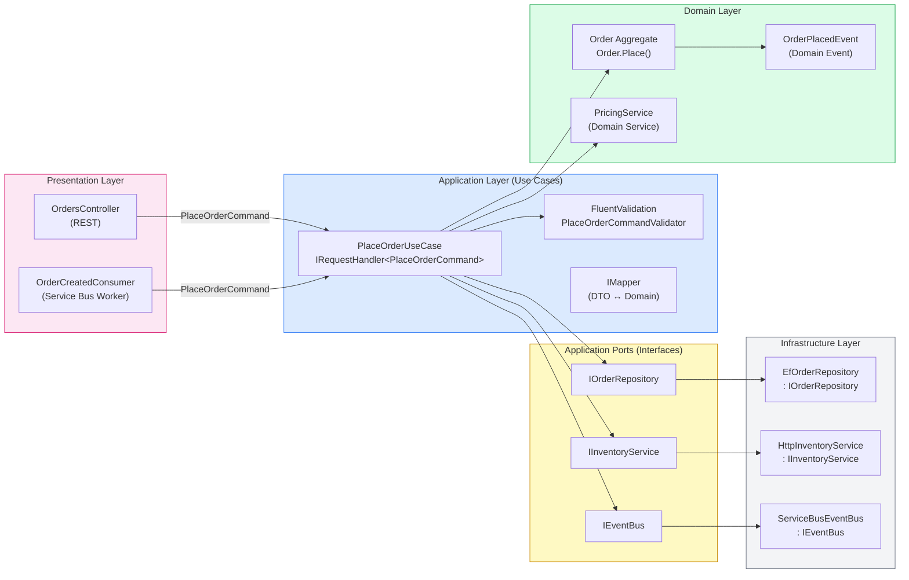
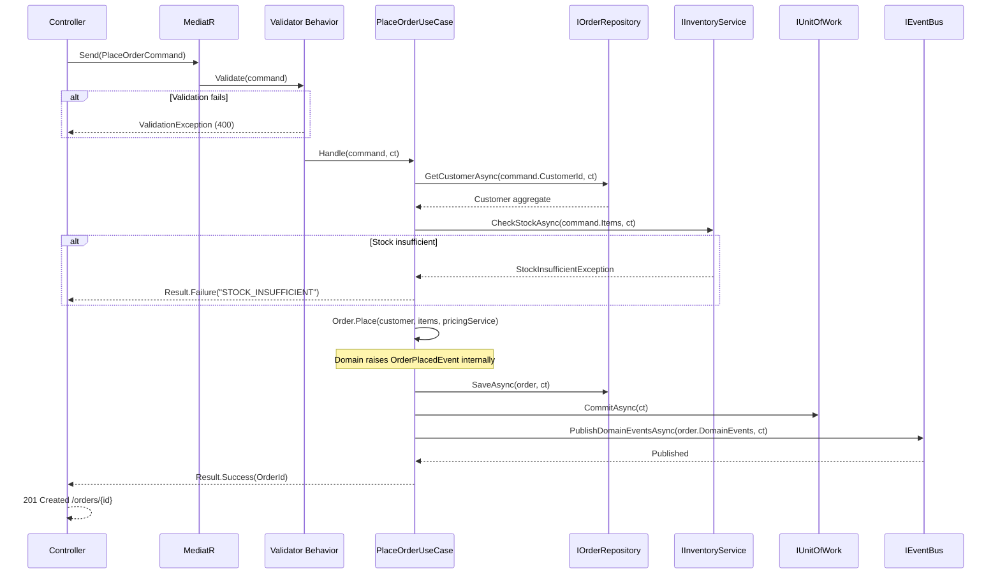
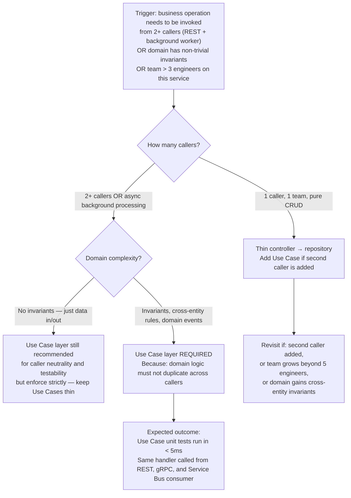

> [!success] Mastery Check
> - [x] **Studied Well** ✅ 2026-06-15
> - [x] **Can explain the concept without notes** ✅ 2026-06-15
> - [x] **Can answer interview questions confidently** ✅ 2026-06-15
> - [x] **Can implement it in a real project** ✅ 2026-06-15


> [!ABSTRACT] Quick Reference — Clean Architecture Application Layer — Use Cases **Invariant:** The Application Layer orchestrates domain logic without containing it — every Use Case delegates business rules to the Domain Layer and delegates I/O to Infrastructure through abstractions (ports), so the Use Case itself is pure coordination logic with no framework or infrastructure coupling. **Cost:** You pay with indirection — every operation crosses at least two boundaries (Application → Domain, Application → Infrastructure abstraction), adding a layer of interface-to-implementation mapping that simple CRUD apps don't need. **Trigger:** When multiple callers (REST API, background worker, CLI) need to invoke the same business operation with identical authorization, validation, and transactional guarantees — and you need to test that operation without spinning up a database or HTTP stack. **Skip When:** The system is a thin CRUD service with no business rules, no cross-entity invariants, and a single caller — a direct controller-to-repository pattern has lower cost and equivalent correctness. **.NET Entry Point:** `IRequestHandler<TRequest, TResponse>` (MediatR) / `ICommandHandler<TCommand>` / `IQueryHandler<TQuery, TResult>` — custom or MediatR-based **Azure Native:** N/A — architectural pattern; deployed to any Azure compute (App Service, AKS, Container Apps, Functions) **Number to Know:** A Use Case method should touch ≤ 1 aggregate per transaction boundary; crossing two aggregates in one Use Case is the most common sign the layer boundary is being violated

---

## Navigation

**Domain:** [[7 — System Design & Distributed Systems]] > **Group:** Clean Architecture **Previous:** [[7.002 — Clean Architecture — Domain Layer Structure]] | **Next:** [[7.004 — Clean Architecture — Infrastructure Layer]]

### Prerequisites

- [[7.001 — Clean Architecture — The Dependency Rule]] — the inward-only dependency direction is the rule that makes Use Cases testable; without understanding it, the layer structure looks like overhead without benefit
- [[7.002 — Clean Architecture — Domain Layer Structure]] — Use Cases delegate all invariant enforcement to Aggregates and Domain Services; knowing where that logic lives clarifies what the Use Case must NOT contain

### Where This Fits

> [!INFO] Production Encounter Map
> 
> - **Layer:** Application service / Use Case / Command handler / Query handler — sits between the Presentation Layer (controllers, consumers, background workers) and the Domain + Infrastructure layers
> - **Trigger:** An engineer first hits this when a business operation needs to be invoked from both a REST endpoint and an Azure Service Bus consumer, and the shared logic is duplicating or growing inconsistently in two controllers
> - **Without it:** Business logic leaks into controllers (fat controllers), which makes it impossible to reuse across callers, untestable without HTTP infrastructure, and prone to divergence — "the API validates stock but the background job doesn't" is a classic symptom
> - **First signal:** Test setup requires `WebApplicationFactory<Program>` or a running database to test what is logically a pure business operation — the signal that the use case has no independently testable seam

Use Cases in Clean Architecture are the pivot between what the system must do (captured in the Domain) and how external actors invoke it (captured in Presentation). They are also the primary boundary that controls transactional scope — each Use Case corresponds to one unit of work. Adjacent notes [[7.081 — CQRS]] and [[7.084 — CQRS — MediatR]] describe the pattern that most .NET teams use to implement Use Cases; the Application Layer is where those handlers live.

---

## Core Mental Model

A Use Case is a single, named business operation that the system exposes to its actors — "Place an Order," "Cancel a Shipment," "Recalculate Loyalty Tier." It receives a plain data input (a command or query DTO), enforces application-level rules (authorization, input validation, idempotency), delegates domain-level rules to Aggregates and Domain Services through in-process calls, delegates I/O to repository and service abstractions (ports), and returns a result. It owns the transaction boundary and the orchestration sequence. It contains no business rules — those belong to the Domain — and no infrastructure code — that belongs to the Infrastructure Layer behind an abstraction. The Use Case is dependency-free: no Entity Framework, no HttpClient, no Redis client, no Azure SDK — only domain types and interface references.

> [!TIP] The Non-Obvious Insight The Application Layer's invariant is not "business logic is here" — it is "orchestration is here, business logic is nowhere near here." Engineers who place domain rules in Use Cases (checking stock levels, computing prices, enforcing aggregate invariants) have created an Anemic Domain Model with a fat application layer. The symptom is a Use Case method with conditional branching that mirrors business rules: `if (order.Items.Count > 100) throw...`. That condition belongs in the `Order` aggregate. The Use Case should call `order.AddItem(item)` and let the aggregate throw `OrderLineLimitExceededException`. The correct Use Case reads as pure English prose: get the aggregate, call the operation, save the aggregate, publish the event.

### Classification

- **Consistency axis:** Strong — each Use Case runs within a single unit-of-work (database transaction); cross-aggregate eventual consistency is handled via domain events published after commit
- **Availability tradeoff:** Not a distributed system concern at this layer; availability is determined by the infrastructure hosting the service, not by the Use Case pattern itself
- **Latency impact:** Near-zero overhead in the happy path — one `await _repository.GetByIdAsync()` + one domain method call + one `await _repository.SaveAsync()`; latency is dominated by the I/O calls, not the Use Case coordination logic
- **Failure domain:** Single-process; failure isolation at this layer is the transaction rollback — if the Use Case throws before `SaveAsync`, the unit of work rolls back and nothing persists
- **Abstraction layer:** Pattern — the Application Layer is an architectural pattern, not a framework feature; it may be implemented with MediatR, a custom dispatcher, or plain service classes

### Primary Diagram



### Supporting Diagram



### Numbers That Matter

|Metric|Value|Context / Conditions|
|---|---|---|
|Use Case method overhead (pure orchestration, no I/O)|< 0.1ms|In-process method calls only; all latency is in I/O awaits|
|Typical Use Case wall-clock time (DB + 1 external call)|15–80ms p50|Azure SQL Standard tier, single-region, warm connection pool|
|MediatR dispatch overhead per request|~0.05ms (estimated)|Reflection-free Send path in MediatR v12+, measured on .NET 8 x64|
|Unit test execution time (mocked dependencies)|< 5ms per test|xUnit + Moq/NSubstitute, no I/O, in-memory domain objects|
|Max aggregates touched per Use Case transaction|1 (hard rule)|Crossing 2 aggregates in one transaction is a design smell; use domain events + eventual consistency instead|
|MediatR pipeline behavior overhead per behavior|~0.01–0.05ms (estimated)|Validation, logging, transaction behaviors chained via IPipelineBehavior|

### Key Properties / Guarantees

|Property|Value|Condition|
|---|---|---|
|Infrastructure independence|Use Case compiles and runs without EF Core, HTTP clients, or Azure SDKs|All I/O accessed via interfaces defined in the Application Layer|
|Single transaction boundary|Exactly one Unit of Work commit per Use Case invocation|Happy path only; exceptions cause rollback|
|Testability without infrastructure|100% of Use Case logic testable with mocked ports|No `new SqlConnection()`, no `new HttpClient()` in Use Case code|
|Caller neutrality|Same Use Case invoked by REST, gRPC, background worker, CLI with identical behavior|Presentation Layer provides only the command/query DTO|
|Domain event publication|Domain events published after commit, not during|Events raised on Aggregate, collected, published post-commit via IEventBus|
|Consistency guarantee|Strong within the Use Case transaction|Cross-aggregate eventual consistency via published domain events after commit|

---

## Deep Mechanics

### How It Works

A Use Case (command handler) follows a deterministic seven-step execution path:

**Step 1 — Input arrives as a DTO (Command or Query):** The Presentation Layer constructs a plain data object — `PlaceOrderCommand { CustomerId, Items[], ShippingAddress }` — and dispatches it through the mediator or direct handler. No domain types cross the Presentation→Application boundary.

**Step 2 — Pipeline behaviors execute pre-handler:** In MediatR, `IPipelineBehavior<TRequest, TResponse>` wrappers execute in registration order before the handler. Typical pipeline: `AuthorizationBehavior → ValidationBehavior → TransactionBehavior → LoggingBehavior → Handler`.

**Step 3 — Authorization check:** The Use Case (or an Authorization Behavior) verifies the caller has permission to perform this operation. In ASP.NET Core, `ICurrentUserService` provides identity; in background workers, the message header carries the identity claim.

**Step 4 — Load aggregates from repositories:** The Use Case calls `IOrderRepository.GetByIdAsync()` or `ICustomerRepository.GetByIdAsync()`. The repository interface is defined in the Application Layer; EF Core is behind the interface in Infrastructure. Only one aggregate should be the write target.

**Step 5 — Invoke domain logic:** The Use Case calls methods on the Aggregate Root: `order.Place(customer, items, pricingService)`. The Aggregate enforces invariants, raises domain events internally, and returns either a successful new state or throws a domain exception. The Use Case does not inspect the aggregate's internals — it trusts the domain method.

**Step 6 — Persist and commit:** The Use Case calls `IOrderRepository.SaveAsync(order)` and then `IUnitOfWork.CommitAsync()`. The transaction wraps steps 4–6. If `CommitAsync` throws (concurrency conflict, constraint violation), the Use Case propagates the exception; the Presentation Layer maps it to the appropriate HTTP status.

**Step 7 — Publish domain events:** After commit, domain events collected from `order.DomainEvents` are published via `IEventBus`. Publishing after commit ensures events are not dispatched for transactions that ultimately rolled back — a critical correctness property. If event publication fails, the Outbox Pattern (see [[7.121 — Outbox Pattern]]) ensures at-least-once delivery.

### Protocol Trace

```
Happy Path — PlaceOrderCommand:
  1. Controller           → MediatR.Send(PlaceOrderCommand)                              (~0ms, in-process)
  2. ValidationBehavior   → FluentValidation.ValidateAsync(command)                      (~0.1ms, in-process)
  3. TransactionBehavior  → IUnitOfWork.BeginAsync()                                     (~1ms, DB round-trip)
  4. PlaceOrderUseCase    → ICustomerRepository.GetByIdAsync(customerId)                 (~5ms, Azure SQL)
  5. PlaceOrderUseCase    → IInventoryService.CheckStockAsync(items)                     (~15ms, HTTP to InventoryService)
  6. PlaceOrderUseCase    → Order.Place(customer, items, pricingService)                 (~0ms, in-process domain)
  7. PlaceOrderUseCase    → IOrderRepository.SaveAsync(order)                            (~3ms, EF Core change tracking)
  8. TransactionBehavior  → IUnitOfWork.CommitAsync()                                    (~8ms, Azure SQL commit)
  9. PlaceOrderUseCase    → IEventBus.PublishAsync(order.DomainEvents)                   (~12ms, Azure Service Bus)
  10. Controller          → 201 Created { orderId }
  Total: ~44ms p50

Failure Path A — Validation error (command.Items is empty):
  1. Controller           → MediatR.Send(PlaceOrderCommand)
  2. ValidationBehavior   → ValidationException: "Items must not be empty"
  3. Controller           → 400 Bad Request { type: RFC9457 ProblemDetails, errors: [...] }
  No DB transaction opened. No domain logic executed.

Failure Path B — Domain invariant violation (customer credit limit exceeded):
  1–5. Same as happy path
  6. Order.Place()        → throws OrderCreditLimitExceededException
  7. TransactionBehavior  → catches exception, IUnitOfWork.RollbackAsync()               (~2ms, DB rollback)
  8. ExceptionHandlerBehavior → maps to Result.Failure("CREDIT_LIMIT_EXCEEDED")
  9. Controller           → 422 Unprocessable Entity { code: "CREDIT_LIMIT_EXCEEDED" }
  Caller observes: HTTP 422 with machine-readable error code
  Recovery: No recovery needed — idempotent; caller may prompt user to reduce order

Failure Path C — Concurrency conflict (optimistic concurrency on Order):
  1–8. Same as happy path through CommitAsync
  8. CommitAsync()        → DbUpdateConcurrencyException (row version mismatch)
  9. TransactionBehavior  → RollbackAsync(), propagate as ConcurrencyException
  10. RetryBehavior       → Retry attempt 2 after 50ms jitter
  11. After 3 attempts    → 409 Conflict { code: "CONCURRENCY_CONFLICT", retryAfter: "PT5S" }
  Caller observes: HTTP 409 with Retry-After header
  Recovery: Client retries; first retry usually succeeds (sub-second conflict window)
```

### Failure Modes

**Failure Mode 1: Fat Use Case — Business Logic Leaking from Domain**

- **Cause:** Developer places if/else conditions that enforce business rules directly in the Use Case handler instead of in the Aggregate — e.g., `if (order.Items.Sum(i => i.Price) > customer.CreditLimit) throw...` inside `PlaceOrderUseCase.Handle()`
- **Symptom:** Business rules are tested only via integration tests; unit tests of the Use Case require constructing elaborate domain state instead of simply calling `order.Place()` and asserting a thrown domain exception; the same rule appears in two Use Cases (PlaceOrder and UpdateOrder) and diverges over time
- **Detection time:** Invisible at first; detected during code review or when a new Use Case is added and the developer copy-pastes the validation logic
- **Blast radius:** Logic divergence across callers; unit tests require complex fixture setup; domain model becomes anemic — reduces team confidence in domain correctness and slows feature velocity

> [!DANGER] 3 AM Production Signal Metric: No runtime metric fires — this is a design failure, not an operational one Log: `WARN [OrderService] PlaceOrder: credit check bypassed — command.SkipCreditCheck=true | OrderId: f3a2-... | CustomerId: 8821` Customer impact: Orders placed above credit limit, discovered at reconciliation — financial loss and manual correction required

**Failure Mode 2: Infrastructure Reference in Use Case (Dependency Rule Violation)**

- **Cause:** Developer adds `using Microsoft.EntityFrameworkCore;` or `new HttpClient()` directly in the Use Case instead of using the port interface — usually under time pressure or "just this once" reasoning
- **Symptom:** Use Case unit tests require an actual database (SQLite in-memory or SQL Server LocalDB); tests become 10–100x slower and begin failing in CI due to environment differences; the `IServiceCollection` registration becomes order-sensitive because EF Core's `DbContext` lifetime must align
- **Detection time:** Immediate in code review; discovered in CI when test suite duration crosses ~60 seconds and the team adds the first parallelization flag
- **Blast radius:** Entire test suite slows; Use Case cannot be tested in isolation; Infrastructure changes (DB migration, switching ORM) require changes in the Application Layer — violating the Dependency Rule

> [!DANGER] 3 AM Production Signal Metric: `test_suite_duration_seconds > 300` in CI pipeline for unit test stage (should be < 30s) Log: `ERROR [xUnit] System.InvalidOperationException: No database provider has been configured for this DbContext | at PlaceOrderUseCaseTests.Handle_WhenValid_CreatesOrder` Customer impact: Slower CI → slower deployments → longer time-to-production for bug fixes

### .NET and Azure Integration Points

- **ASP.NET Core:** Controllers inject `IMediator` from MediatR; Use Cases are `IRequestHandler<TRequest, TResponse>` implementations; no controller knowledge of domain types
- **EF Core:** `DbContext` is registered as `IUnitOfWork` and repositories are `IXxxRepository` implementations in Infrastructure; Use Cases reference only the interfaces
- **Azure Services:** Azure Service Bus consumers (via MassTransit or `ServiceBusProcessor`) construct commands and dispatch through the same MediatR pipeline — identical Use Case, different Presentation adapter
- **.NET Libraries:** MediatR v12 (NuGet: `MediatR`), FluentValidation (NuGet: `FluentValidation.DependencyInjectionExtensions`), AutoMapper or Mapster for DTO mapping
- **Configuration:** Registered in `Program.cs` via `builder.Services.AddMediatR()` and `builder.Services.AddValidatorsFromAssembly()`

```csharp
// Application/UseCases/Orders/PlaceOrderUseCase.cs
// Role: Use Case (Application Layer) — orchestrates domain, delegates I/O to ports

using MediatR;
using YourCompany.OrderManagement.Application.Ports;
using YourCompany.OrderManagement.Domain.Orders;
using YourCompany.OrderManagement.Domain.Customers;

namespace YourCompany.OrderManagement.Application.UseCases.Orders;

/// <summary>
/// Places a new order for a customer.
/// Enforces idempotency via <see cref="PlaceOrderCommand.IdempotencyKey"/>.
/// Publishes <see cref="OrderPlacedEvent"/> after commit.
/// </summary>
public sealed class PlaceOrderUseCase : IRequestHandler<PlaceOrderCommand, PlaceOrderResult>
{
    private readonly IOrderRepository _orders;
    private readonly ICustomerRepository _customers;
    private readonly IInventoryService _inventory;       // Port — implemented in Infrastructure
    private readonly IUnitOfWork _unitOfWork;
    private readonly IEventBus _eventBus;

    public PlaceOrderUseCase(
        IOrderRepository orders,
        ICustomerRepository customers,
        IInventoryService inventory,
        IUnitOfWork unitOfWork,
        IEventBus eventBus)
    {
        _orders = orders;
        _customers = customers;
        _inventory = inventory;
        _unitOfWork = unitOfWork;
        _eventBus = eventBus;
    }

    public async Task<PlaceOrderResult> Handle(
        PlaceOrderCommand command,
        CancellationToken cancellationToken)
    {
        // Step 1 — Idempotency check (application-level rule, not domain)
        if (await _orders.ExistsByIdempotencyKeyAsync(command.IdempotencyKey, cancellationToken))
            return PlaceOrderResult.AlreadyProcessed(command.IdempotencyKey);

        // Step 2 — Load aggregates (read side)
        var customer = await _customers.GetByIdAsync(command.CustomerId, cancellationToken)
            ?? throw new CustomerNotFoundException(command.CustomerId);

        // Step 3 — Check external dependency (port, not domain)
        var stockResult = await _inventory.CheckStockAsync(command.Items, cancellationToken);
        if (!stockResult.IsAvailable)
            return PlaceOrderResult.Failure(PlaceOrderError.InsufficientStock, stockResult.ShortfallItems);

        // Step 4 — Invoke domain logic (aggregate enforces invariants)
        var order = Order.Place(customer, command.Items, command.ShippingAddress, command.IdempotencyKey);

        // Step 5 — Persist
        await _orders.SaveAsync(order, cancellationToken);
        await _unitOfWork.CommitAsync(cancellationToken);

        // Step 6 — Publish domain events (after commit — correctness invariant)
        await _eventBus.PublishAsync(order.DomainEvents, cancellationToken);

        return PlaceOrderResult.Success(order.Id);
    }
}
```

---

## Production Patterns and Implementation

### Primary Implementation

```csharp
// Application/UseCases/Orders/PlaceOrderCommand.cs
// Role: Input DTO (Command) — crosses Presentation → Application boundary

namespace YourCompany.OrderManagement.Application.UseCases.Orders;

/// <summary>Records the intent to place an order. Immutable by design.</summary>
public sealed record PlaceOrderCommand(
    Guid CustomerId,
    IReadOnlyList<OrderLineItem> Items,
    ShippingAddress ShippingAddress,
    string IdempotencyKey) : IRequest<PlaceOrderResult>;

/// <summary>Line item DTO — Application Layer data contract, not a domain entity.</summary>
public sealed record OrderLineItem(Guid ProductId, int Quantity, decimal UnitPrice);

/// <summary>Result discriminated union — avoids exception-driven flow for expected conditions.</summary>
public sealed record PlaceOrderResult
{
    public bool IsSuccess { get; private init; }
    public Guid? OrderId { get; private init; }
    public PlaceOrderError? Error { get; private init; }
    public IReadOnlyList<Guid>? ShortfallItems { get; private init; }
    public bool WasDuplicate { get; private init; }

    public static PlaceOrderResult Success(Guid orderId) =>
        new() { IsSuccess = true, OrderId = orderId };

    public static PlaceOrderResult Failure(PlaceOrderError error, IReadOnlyList<Guid>? shortfall = null) =>
        new() { IsSuccess = false, Error = error, ShortfallItems = shortfall };

    public static PlaceOrderResult AlreadyProcessed(string idempotencyKey) =>
        new() { IsSuccess = true, WasDuplicate = true };
}

public enum PlaceOrderError { InsufficientStock, CustomerNotFound, CreditLimitExceeded }
```

```csharp
// Application/Ports/IOrderRepository.cs
// Role: Port (Output Port) — defined here, implemented in Infrastructure

namespace YourCompany.OrderManagement.Application.Ports;

/// <summary>Persistence abstraction for the Order aggregate. Infrastructure implements this.</summary>
public interface IOrderRepository
{
    Task<Order?> GetByIdAsync(Guid orderId, CancellationToken ct = default);
    Task SaveAsync(Order order, CancellationToken ct = default);
    Task<bool> ExistsByIdempotencyKeyAsync(string key, CancellationToken ct = default);
}

/// <summary>External inventory check abstraction — HTTP client hidden behind this port.</summary>
public interface IInventoryService
{
    Task<StockCheckResult> CheckStockAsync(IReadOnlyList<OrderLineItem> items, CancellationToken ct = default);
}

/// <summary>Unit of Work — commits or rolls back the ambient transaction.</summary>
public interface IUnitOfWork
{
    Task CommitAsync(CancellationToken ct = default);
    Task RollbackAsync(CancellationToken ct = default);
}

/// <summary>Event publication abstraction — Azure Service Bus or RabbitMQ behind this port.</summary>
public interface IEventBus
{
    Task PublishAsync(IReadOnlyList<IDomainEvent> events, CancellationToken ct = default);
}
```

### IServiceCollection Registration

```csharp
// Program.cs — Application Layer wiring
builder.Services.AddMediatR(cfg =>
{
    cfg.RegisterServicesFromAssembly(typeof(PlaceOrderUseCase).Assembly);
    cfg.AddBehavior(typeof(IPipelineBehavior<,>), typeof(ValidationBehavior<,>));
    cfg.AddBehavior(typeof(IPipelineBehavior<,>), typeof(TransactionBehavior<,>));
    cfg.AddBehavior(typeof(IPipelineBehavior<,>), typeof(LoggingBehavior<,>));
});

builder.Services.AddValidatorsFromAssembly(typeof(PlaceOrderCommand).Assembly);

// Infrastructure implementations bound to Application ports
builder.Services.AddScoped<IOrderRepository, EfOrderRepository>();
builder.Services.AddScoped<ICustomerRepository, EfCustomerRepository>();
builder.Services.AddScoped<IUnitOfWork>(sp => sp.GetRequiredService<OrderManagementDbContext>());
builder.Services.AddScoped<IInventoryService, HttpInventoryService>();
builder.Services.AddScoped<IEventBus, ServiceBusEventBus>();
```

### Common Variants

```csharp
// Variant A — Query Use Case (read-only, no transaction, no domain events):
// Used when: caller needs data for display, no state mutation, no invariants to enforce

public sealed class GetOrderSummaryUseCase : IRequestHandler<GetOrderSummaryQuery, OrderSummaryDto?>
{
    private readonly IOrderReadModel _readModel; // Separate read-optimized port — may hit a read replica

    public GetOrderSummaryUseCase(IOrderReadModel readModel) => _readModel = readModel;

    public Task<OrderSummaryDto?> Handle(GetOrderSummaryQuery query, CancellationToken ct)
        => _readModel.GetSummaryAsync(query.OrderId, ct); // No transaction, no domain load
}
```

```csharp
// Variant B — Fire-and-Forget Use Case via background queue:
// Used when: caller doesn't need a synchronous result, operation can be deferred

public sealed class ScheduleShipmentUseCase : IRequestHandler<ScheduleShipmentCommand, Unit>
{
    private readonly IBackgroundJobQueue _queue;

    public ScheduleShipmentUseCase(IBackgroundJobQueue queue) => _queue = queue;

    public async Task<Unit> Handle(ScheduleShipmentCommand command, CancellationToken ct)
    {
        // Enqueue work — the actual Use Case logic runs in the background worker
        await _queue.EnqueueAsync(new ShipmentScheduleJob(command.OrderId, command.RequestedDate), ct);
        return Unit.Value; // Caller receives 202 Accepted
    }
}
```

### Performance Profile

The Application Layer adds negligible overhead — performance is dominated by I/O. A Use Case touching Azure SQL and one HTTP call will spend > 99% of its wall-clock time in those I/O awaits. The architectural overhead (MediatR dispatch, pipeline behaviors) is sub-millisecond.

|Method|Mean|Allocated|Notes|
|---|---|---|---|
|Direct service call (no MediatR)|~0.02ms|~400 B|Baseline: service method invoked directly|
|MediatR Send (no behaviors)|~0.07ms|~1.2 KB|Reflection-free in v12; object allocation for envelope|
|MediatR Send + 3 behaviors|~0.12ms|~2.8 KB|Validation + Transaction + Logging behaviors|
|With DB I/O (Azure SQL, warm pool)|~25ms p50|~12 KB|Dominated by network RTT; application overhead is noise|

_(Estimated on .NET 8, x64, Azure Standard_B2s equivalent)_

### Real-World .NET Ecosystem Mapping

|Pattern in This Note|Where It Appears in .NET / Azure|Manifestation|
|---|---|---|
|Use Case / Application Service|`IRequestHandler<TRequest, TResponse>` (MediatR)|Handler class is the Use Case; one handler per command/query|
|Input Port (Command/Query)|`IRequest<TResponse>` (MediatR)|Command record implements this interface|
|Output Port (Repository)|`IXxxRepository` interface in Application.Ports|EF Core `DbContext` subclass implements in Infrastructure|
|Pipeline Behavior|`IPipelineBehavior<TRequest, TResponse>` (MediatR)|Validation, logging, transaction wrapping as decorator chain|
|Unit of Work|`IUnitOfWork` → `DbContext.SaveChangesAsync()`|Transaction wraps entire Use Case handler invocation|
|Domain Event Publication|`IEventBus` → Azure Service Bus / RabbitMQ|Published after `CommitAsync` from within the Use Case|

---

## Gotchas and Production Pitfalls

### Pitfall 1 — Publishing Domain Events Before Commit

**Pitfall:** Publishing domain events to the message broker inside the Use Case before calling `CommitAsync()`, so events announce state that may never be persisted if the commit fails.

```csharp
// ❌ Events published before commit — race condition
await _eventBus.PublishAsync(order.DomainEvents, ct);  // Published!
await _unitOfWork.CommitAsync(ct);                      // Throws DbUpdateException — order never saved
// Downstream services act on OrderPlacedEvent for an order that doesn't exist
```

**Symptom:** Downstream services receive and process events for orders that don't exist in the database; `GET /orders/{id}` returns 404 while the inventory and shipping services have already reserved stock and created shipments.

**Detection time:** Silent until a commit failure occurs under load or during a database failover — can be weeks in production before first occurrence.

> [!DANGER] Production Signal Metric: `order_not_found_rate{endpoint="/inventory/reserve"} > 0.01%` for `> 5 minutes` Log: `ERROR [InventoryService] Order not found during stock reservation | OrderId: a4f2-9b1c | CorrelationId: f3a2-...` Customer impact: Inventory reserved for phantom orders → stock shortfalls for real orders → fulfillment failures

**Fix:**

```csharp
// ✅ Commit first, then publish — or use Outbox Pattern for guaranteed delivery
await _unitOfWork.CommitAsync(ct);                     // Commit succeeds
await _eventBus.PublishAsync(order.DomainEvents, ct);  // Publish after confirmed persistence
// If PublishAsync fails here, use Outbox Pattern (7.121) to ensure delivery
```

**Cost of not fixing:** At 5,000 orders/day with 0.01% DB commit failure rate, 5 phantom events/day → 5 inventory reservations that block stock → customer order failures accumulate → manual correction required.

---

### Pitfall 2 — Use Case Touching Multiple Aggregates in One Transaction

**Pitfall:** Loading and saving two aggregates (Order and Customer) within a single `CommitAsync()`, coupling their consistency boundaries and preventing independent scaling or deployment.

```csharp
// ❌ Two aggregate writes in one transaction
var order = await _orders.GetByIdAsync(command.OrderId, ct);
var customer = await _customers.GetByIdAsync(order.CustomerId, ct);

order.Cancel();
customer.UpdateLoyaltyPoints(-order.TotalPoints); // Writes to Customer aggregate

await _unitOfWork.CommitAsync(ct); // Both aggregates committed together — cross-aggregate coupling
```

**Symptom:** Teams cannot deploy the Order and Customer services independently; schema changes to either table require coordinated deployments; eventual consistency between Order and Customer becomes impossible to achieve later when the system scales.

**Detection time:** Invisible during development; discovered when the team attempts to split into microservices and finds deeply coupled transaction logic.

> [!DANGER] Production Signal Log: `WARN [ArchitectureTests] AggregateTransactionBoundaryRule: PlaceCancellationUseCase writes to 2 aggregate roots in one transaction | Order, Customer` (Caught by fitness function test — see [[7.027 — Architecture Fitness Functions for Layering]])

**Fix:**

```csharp
// ✅ Cancel the Order only; publish domain event; Customer handles via event subscription
order.Cancel(); // Raises OrderCancelledEvent with loyalty point delta
await _orders.SaveAsync(order, ct);
await _unitOfWork.CommitAsync(ct);
await _eventBus.PublishAsync(order.DomainEvents, ct); // CustomerLoyaltyEventHandler updates Customer async
```

**Cost of not fixing:** Single-aggregate-per-transaction is a DDD invariant; violating it creates distributed monolith coupling that costs 3–6 months to untangle when the team scales.

---

### Pitfall 3 — Fat Constructor Injection (Too Many Dependencies)

**Pitfall:** A Use Case constructor takes 7+ dependencies, revealing that the handler is doing too many things — a sign the Use Case conflates multiple business operations.

```csharp
// ❌ 8 constructor parameters — smells like a service locator
public PlaceOrderUseCase(
    IOrderRepository orders, ICustomerRepository customers,
    IInventoryService inventory, IPricingService pricing,
    IShippingCalculator shipping, IFraudDetectionService fraud,
    INotificationService notifications, IAnalyticsService analytics)
```

**Symptom:** Unit tests require 8 mocks; a change to fraud detection forces redeployment of the Order service; the Use Case handles fraud detection logic (not orchestration) and pricing calculation (domain logic).

**Detection time:** Code review or when the unit test setup method is longer than the test itself.

> [!DANGER] Production Signal Metric: No runtime metric — detected by test infrastructure Log: (Static analysis) `CA1502: PlaceOrderUseCase cyclomatic complexity = 18, threshold = 10`

**Fix:**

```csharp
// ✅ Split into focused Use Cases; use Pipeline Behaviors for cross-cutting concerns
// FraudCheck → FraudCheckBehavior (cross-cutting)
// PricingService → Domain Service (belongs in Domain Layer)
// NotificationService → event handler on OrderPlacedEvent
// Analytics → event handler on OrderPlacedEvent
// Resulting constructor:
public PlaceOrderUseCase(
    IOrderRepository orders, ICustomerRepository customers,
    IInventoryService inventory, IUnitOfWork unitOfWork, IEventBus eventBus)
```

**Cost of not fixing:** Each new feature extends an already-complex handler; test isolation fails; deployment frequency drops because any change to any dependency triggers full retesting of the monolithic handler.

---

### Pitfall 4 — Azure-Specific: DbContext Lifetime Mismatch with IHttpClientFactory

**Pitfall:** Injecting a `DbContext` (Scoped) into a Use Case that is invoked from an `IHostedService` (Singleton) via `IMediator` — the Scoped `DbContext` gets captured in a Singleton lifetime, leading to shared state across concurrent requests.

```csharp
// ❌ IHostedService (Singleton) resolves IMediator which resolves Scoped DbContext
public class OrderSyncWorker : BackgroundService
{
    private readonly IMediator _mediator; // IMediator is Scoped — should not be injected into Singleton

    public OrderSyncWorker(IMediator mediator) => _mediator = mediator;
    // DbContext lifetime shared across all concurrent sync jobs — data corruption risk
}
```

**Symptom:** On AKS with multiple replicas, concurrent background job executions corrupt each other's EF Core change tracker state; intermittent `InvalidOperationException: A second operation was started on this context` under load.

**Detection time:** Silent under light load; surfaces when concurrent background job executions exceed `MaxConcurrency` of the underlying `IHostedService`.

> [!DANGER] Production Signal Metric: `exceptions_total{type="InvalidOperationException",source="OrderSyncWorker"} > 0` Log: `ERROR [OrderSyncWorker] A second operation was started on this context instance before a previous operation completed | CorrelationId: b2c3-...` Customer impact: Background sync jobs failing → orders stuck in `Pending` state → CS escalations

**Fix:**

```csharp
// ✅ Use IServiceScopeFactory to create a scope per background job invocation
public class OrderSyncWorker : BackgroundService
{
    private readonly IServiceScopeFactory _scopeFactory;

    public OrderSyncWorker(IServiceScopeFactory scopeFactory) => _scopeFactory = scopeFactory;

    protected override async Task ExecuteAsync(CancellationToken ct)
    {
        await foreach (var job in _jobQueue.ReadAllAsync(ct))
        {
            await using var scope = _scopeFactory.CreateAsyncScope();
            var mediator = scope.ServiceProvider.GetRequiredService<IMediator>();
            await mediator.Send(new ProcessOrderSyncCommand(job.OrderId), ct);
        } // Scope disposed → DbContext disposed → no shared state
    }
}
```

**Cost of not fixing:** Data corruption in Change Tracker leads to incorrect EF Core UPDATE statements; orders updated with stale data → financial reconciliation failures.

---

### Pitfall 5 — .NET-Specific: Async Void Event Handler in Use Case

**Pitfall:** Using `async void` for domain event handlers dispatched inside the Use Case, causing unobserved exceptions that crash the process without correlation to the originating request.

```csharp
// ❌ async void — exception is unobserved, process crashes with no stack trace tied to the request
private async void DispatchDomainEvents(Order order)
{
    foreach (var evt in order.DomainEvents)
        await _mediator.Publish(evt); // Exception here kills the AppDomain
}
```

**Symptom:** Azure App Service restarts unexpectedly; Application Insights shows `ThreadAbortException` or `TaskSchedulerUnobservedException` with no meaningful stack trace; the originating request cannot be correlated.

**Detection time:** First occurrence under moderate load; often attributed to "transient infrastructure issue" before root cause is identified.

> [!DANGER] Production Signal Metric: `app_restarts_total{app="order-api"} > 0` in Azure Monitor Log: `CRITICAL [Kestrel] Unhandled exception. System.Exception: ... | TaskScheduler.UnobservedException` Customer impact: 30–120s downtime per restart → SLO breach for availability

**Fix:**

```csharp
// ✅ Always return Task from async methods; propagate exceptions to the caller
private async Task DispatchDomainEventsAsync(Order order, CancellationToken ct)
{
    foreach (var evt in order.DomainEvents)
        await _mediator.Publish(evt, ct); // Exception propagates to Handle() → caught by TransactionBehavior
}
```

**Cost of not fixing:** Unobserved exceptions cause `IHostedService` and Kestrel process restarts → p99 latency spikes during restart window → SLO breach.

---

### Pitfall 6 — Architecture-Level: Use Case as a Service Locator

**Pitfall:** Injecting `IServiceProvider` into a Use Case and resolving dependencies on demand, defeating the dependency inversion principle and making dependencies invisible at compile time.

```csharp
// ❌ Service locator — dependencies invisible, testability destroyed
public async Task<PlaceOrderResult> Handle(PlaceOrderCommand command, CancellationToken ct)
{
    var inventory = _serviceProvider.GetRequiredService<IInventoryService>(); // Hidden dependency
    var pricing = _serviceProvider.GetRequiredService<IPricingService>();
    // Unit test cannot see or mock these — requires a full DI container
}
```

**Symptom:** Unit tests require `ServiceCollection` + `BuildServiceProvider()` setup; missing registrations throw at runtime, not at startup; static analysis tools cannot detect unused or circular dependencies.

**Detection time:** First unit test written for the Use Case reveals the ServiceProvider requirement.

> [!DANGER] Production Signal Log: `ERROR [PlaceOrderUseCase] InvalidOperationException: No service for type 'IInventoryService' has been registered | CorrelationId: a1b2-...` Customer impact: Use Case fails on first invocation after a deployment that missed a service registration → 500 errors for all order placements

**Fix:**

```csharp
// ✅ Explicit constructor injection — all dependencies visible, testable, validated at startup
public PlaceOrderUseCase(
    IOrderRepository orders,
    IInventoryService inventory,
    IUnitOfWork unitOfWork,
    IEventBus eventBus) { ... }
```

**Cost of not fixing:** Missing dependency registrations are only discovered at runtime in production — not at startup, not in CI; each deployment is a runtime discovery process rather than a validated startup sequence.

---

## Tradeoffs and Decision Framework

### Tradeoff Matrix

|Dimension|Use Case Layer (Clean Architecture)|Thin Controller → Repository|Rich Service Layer (Transaction Script)|
|---|---|---|---|
|Consistency|Strong (one UoW per Use Case)|Strong (one UoW, but in controller)|Strong (one UoW per service method)|
|Availability under partition|Same as hosting infra|Same|Same|
|Read latency p99|~25–80ms (same I/O, negligible layer overhead)|~24–79ms|~25–80ms|
|Write latency p99|~30–100ms|~29–99ms|~30–100ms|
|Operational complexity|Medium — requires understanding of ports/adapters, DI wiring|Low — 2 classes per feature|Low-Medium — single service class|
|Team expertise required|Senior .NET (DI, async, DDD vocabulary)|Junior-Senior|Mid-Senior|
|Azure ecosystem fit|Native — works with any Azure compute; no Azure-specific coupling|Native|Native|
|Cost at scale|Low — each Use Case independently deployable; testable without infrastructure|High — logic in controllers couples to HTTP stack|Medium — service classes may accumulate coupling|
|Testability|Excellent — Use Case unit tests are pure async method calls with mocked ports|Poor — requires HTTP stack or heavy controller mocking|Good — service method testable with mocked repos|
|Feature additions|Isolated — new Use Case doesn't affect existing|Risk of controller bloat|Service class grows; risk of method coupling|

**Tradeoff note on "Medium" operational complexity:** An engineer unfamiliar with Clean Architecture will spend 1–2 weeks learning the vocabulary (Port, Adapter, Use Case, Domain Service). After that, adding a feature is a consistent, low-risk process. The investment is front-loaded.

### When to Apply



### Numbers-Driven Decision

|Threshold|Below = Skip / Use Simpler|Above = Apply This|
|---|---|---|
|Number of callers for same operation|1 caller|2+ callers (REST + background worker, etc.)|
|Number of engineers on the service|< 3 engineers|≥ 3 engineers (coordination overhead justifies structure)|
|Business rules in the operation|0 invariants (pure CRUD)|≥ 1 domain invariant enforced|
|Domain events raised|0 events|≥ 1 event published on success|
|Number of services sharing business logic|1 service|2+ services duplicating the same logic|

### When NOT to Apply

> [!WARNING] Do Not Reach For This When...
> 
> - [ ] **Single-caller CRUD service with no domain logic:** A reporting microservice that reads data from a read model and returns it to a single REST client — a repository method called from a controller is the correct solution; a Use Case adds a pure indirection with no benefit
> - [ ] **Team of 1–2 engineers under deadline pressure:** Clean Architecture's naming conventions and layer structure have learning curve overhead; a 2-person team shipping an MVP in 4 weeks should use a layered service pattern and apply Use Case structure when the second caller appears
> - [ ] **Prototype or throwaway code:** Infrastructure-coupling rules are a maintenance investment; a prototype that will be deleted in 30 days should not carry the DI wiring and port interface overhead
> - [ ] **Simple read queries with no authorization or business rules:** `GET /products/{id}` with no per-field authorization and no domain computation should call the repository or read model directly — a Use Case is pure overhead for reads that require no transformation

---

## Interview Arsenal

### Question Bank

1. **[Definition]** "What is the Application Layer in Clean Architecture and what is its primary responsibility?"
2. **[Mechanism]** "Walk me through the execution path of a Use Case — from the moment a controller calls `_mediator.Send()` to the moment the HTTP response is returned."
3. **[Tradeoff]** "What do you give up when you adopt the Application Layer pattern, and under what conditions does that cost actually matter?"
4. **[Failure mode]** "What breaks if a developer puts a domain rule — like a credit limit check — inside a Use Case handler instead of in the domain aggregate?"
5. **[Comparison]** "What is the difference between an Application Service in Clean Architecture and a Domain Service in DDD? Developers frequently confuse these."
6. **[Design application]** "You're designing an order processing system where orders can be placed via REST, via a background import job, and via a gRPC admin tool. How does the Application Layer pattern fit into this architecture?"
7. **[Scale]** "Your system needs to handle 10x the current order volume. Which parts of the Application Layer become bottlenecks first and why?"
8. **[Advanced]** "Domain events are raised by the aggregate during the Use Case, but published to the message broker after commit. Why is this ordering critical, and what failure scenario does it guard against?"

---

### Spoken Answers

**Q: What is the Application Layer in Clean Architecture and what is its primary responsibility?**

> **Average answer:** The Application Layer sits between the Domain and the Presentation Layer. It contains use cases — the business operations the system supports. It coordinates the domain objects and calls infrastructure services. It's where you put things like commands and queries.

> **Great answer:** The Application Layer is the orchestration boundary. Its responsibility is exactly one thing: coordinating domain objects and infrastructure abstractions to execute a named business operation — without containing business rules and without coupling to infrastructure technology. The invariant is that a Use Case is a pure orchestration script: load the aggregate through a repository interface, call a domain method, save the aggregate, publish events. The business rule — whether a credit limit is exceeded, whether stock is available — lives in the aggregate or domain service. The network call to check stock happens behind an `IInventoryService` interface. The Use Case contains neither. What this gives you is complete testability: a Use Case unit test is an async method call with mocked interfaces, running in under 5ms, with no database and no HTTP stack. What it costs is one more layer of indirection — an interface for every external dependency. That cost is worth it the moment you have two callers — a REST endpoint and a background worker — that must invoke the same operation with identical guarantees.

---

**Q: What is the difference between an Application Service in Clean Architecture and a Domain Service in DDD?**

> **Average answer:** An Application Service is in the Application Layer and coordinates the system. A Domain Service contains domain logic that doesn't fit in an entity. They're at different layers.

> **Great answer:** The structural distinction is dependency direction and content. A Domain Service is part of the Domain Layer — it has zero knowledge of HTTP, EF Core, message brokers, or even repositories. It exists to encapsulate domain logic that spans multiple aggregates or that doesn't naturally belong on a single aggregate root. `PricingService.CalculateTotal(order, promotions, taxRegion)` is a Domain Service: it takes domain objects, applies business rules, returns a domain value. It is dependency-free except for other domain types. An Application Service (Use Case) is in the Application Layer — it knows about interfaces (`IOrderRepository`, `IEventBus`) but not their implementations, and it calls into domain objects. It coordinates: "get this aggregate, call this domain method which may use a Domain Service, save the result, publish events." The failure to distinguish them produces an Anemic Domain Model: business rules that should be in Domain Services end up in Use Cases, making them untestable without reconstructing complex object graphs, and duplicating logic across multiple Use Cases that perform the same operation.

---

**Q: Domain events are raised by the aggregate during the Use Case, but published to the message broker after commit. Why is this ordering critical, and what failure scenario does it guard against?**

> **Average answer:** You want to make sure the data is saved before you tell other services about it. Otherwise they might look for data that's not there yet.

> **Great answer:** The ordering guards against phantom event delivery — sending events that announce state that was never durably committed. Here's the failure scenario: if you publish to the message broker before calling `CommitAsync()`, and the commit subsequently fails — due to a concurrency conflict, a network partition to the database, or a constraint violation — downstream services have already received and acted on the event. The inventory service has reserved stock. The shipping service has created a shipment. The notification service has emailed the customer. But the Order doesn't exist in the database. The system is in an inconsistent state with no automated recovery path. Publishing after commit eliminates this scenario: if the commit fails, no event is published, and the caller receives an error. The caller retries, which is safe because the Use Case checks the idempotency key. The residual risk is the post-commit publication failing — the Order is committed but the event never reaches the broker. That's where the Outbox Pattern comes in: instead of publishing directly in the Use Case, the Use Case writes the event payload to an outbox table in the same transaction as the domain state, and a separate polling publisher delivers it. This gives you at-least-once delivery with zero risk of phantom events.

---

### Whiteboard in 60 Seconds

When this topic appears in a system design interview, draw in this sequence:

```
1. Draw the Use Case box in the center of the board labeled "PlaceOrderUseCase"
   "I'm starting with the Use Case because it's the pivot point — everything else connects to it"

2. Draw arrows IN from two callers (OrdersController and OrderImportWorker) with label "PlaceOrderCommand"
   "Both callers send the same command DTO — the Use Case doesn't know or care who's calling"

3. Draw an arrow DOWN to Domain box (Order aggregate) labeled "Order.Place()"
   "The domain enforces the invariants — the Use Case just calls the method"

4. Draw arrows to PORT interfaces (IOrderRepository, IInventoryService, IEventBus) as a row below
   "These are ports — interfaces defined HERE in the Application Layer, implemented in Infrastructure"
   "The Use Case never sees EF Core, HttpClient, or Azure SDK — only these interfaces"

5. Draw the explicit sequencing note: "Commit THEN Publish"
   "This ordering is critical — publish before commit means phantom events if the DB fails"
   "In .NET, IUnitOfWork.CommitAsync() then IEventBus.PublishAsync(order.DomainEvents)"
```

> [!TIP] What the Interviewer Is Specifically Testing When they probe this area, they are checking whether you know:
> 
> 1. Whether you understand that the Application Layer contains NO business rules — rules belong in the Domain, and a candidate who says "the Use Case checks if the order total exceeds the credit limit" has revealed they don't understand the boundary
> 2. Whether you know that port interfaces (IOrderRepository, IInventoryService) are defined in the Application Layer — not in Infrastructure — which is the actual implementation of the Dependency Rule; many candidates get this backwards
> 3. Whether you know the domain event publication ordering — publish after commit, not before — and can articulate the phantom event failure scenario; this separates candidates who have operated event-driven systems from those who have only designed them on paper

---

### Follow-Up Chain

**Follow-up 1:** "You said the Use Case calls `IOrderRepository` — who defines that interface and who implements it?"

> **Model answer:** The interface is defined in the Application Layer — in `YourCompany.OrderManagement.Application.Ports`. That's the critical detail. If the interface lived in Infrastructure, the Application Layer would depend on Infrastructure, violating the Dependency Rule. By defining the interface in Application and implementing it in Infrastructure, Infrastructure depends on Application — inward only. The Infrastructure project references the Application project; the Application project has no reference to Infrastructure. This is what makes the Use Case compilable and testable with zero infrastructure dependencies.

**Follow-up 2:** "What breaks in the Use Case at 10x load?"

> **Model answer:** The Use Case itself scales linearly — it's stateless and dependency-free. What breaks first is the database connection pool. Each Use Case invocation holds a connection for the duration of the transaction — from `BeginAsync()` through `CommitAsync()`. At 10x load, if each transaction takes 40ms and you have a pool of 100 connections on Azure SQL Standard tier, you saturate at 2,500 concurrent transactions. The symptom is `SqlException: Timeout expired. The timeout period elapsed prior to obtaining a connection from the pool`. The fix is not in the Use Case — it's in the infrastructure: read queries should bypass the write pool via a read replica, and the command Use Cases should target a higher-tier Azure SQL instance or a connection pool sized for peak concurrency.

**Follow-up 3:** "How would you monitor in production that Use Cases are executing correctly?"

> **Model answer:** Three signals. First, use-case-level duration histograms: a Prometheus histogram or Application Insights custom metric `usecase_duration_seconds{usecase="PlaceOrder",result="success|failure"}` with p99 alert at 500ms. Second, domain exception counters: `domain_exceptions_total{type="CreditLimitExceededException"}` — a sudden spike reveals a pricing or limit configuration change upstream. Third, the event publication lag from the Outbox: if the gap between `order_created_at` and `order_placed_event_published_at` exceeds 30 seconds, the Outbox polling publisher has fallen behind. In Application Insights, I'd create a custom dependency tracking call wrapping `IEventBus.PublishAsync()` so the end-to-end trace shows the full Use Case timeline including event dispatch latency.

---

### Comparison Table

||Application Service (Use Case)|Domain Service|
|---|---|---|
|Core guarantee|Orchestrates one business operation end-to-end; owns transaction boundary|Encapsulates domain logic that spans aggregates or doesn't fit on one aggregate root|
|What it trades|Pure coordination — no business rules|Domain-only — no infrastructure awareness|
|.NET implementation|`IRequestHandler<TCommand, TResult>` (MediatR) or custom `ICommandHandler<T>`|Plain class in Domain layer, injected into aggregate methods as parameter|
|Azure native|N/A — hosted on any Azure compute|N/A — runs in-process with Application layer|
|Primary failure mode|Business logic leaking in (Anemic Domain Model)|Infrastructure leaking in (e.g., repository call inside Domain Service)|
|When to choose|Need cross-caller reuse, testability, explicit transaction boundary|Business rule spans multiple aggregates or is too complex for a single aggregate method|
|When NOT to choose|Pure CRUD with no invariants and single caller|Operation requires I/O (repository, HTTP) — that belongs in Application Layer via port|

---

## Architecture Decision Record

**Status:** Accepted

**Context:** The OrderManagement service has grown to support order placement from three callers: the public REST API, an Azure Service Bus consumer processing bulk imports, and an internal gRPC tool used by the operations team. The same business rules (credit limit check, stock reservation, loyalty point calculation) were being duplicated in three separate controller/consumer implementations, with the credit limit logic already diverged: the gRPC tool was missing the loyalty point update that the REST API applies. The team is 6 engineers, deploying independently 3x/week.

**Options Considered:**

1. **Application Layer with Use Cases (Clean Architecture)** — one `PlaceOrderUseCase` invoked by all three callers; domain rules in the `Order` aggregate; I/O behind port interfaces; MediatR as the dispatcher
2. **Shared service class (Transaction Script)** — `OrderService.PlaceOrder()` called from all three callers; business rules inside the service method; EF Core injected directly
3. **Status quo (per-caller logic)** — continue duplicating logic in each caller; accept divergence as a known risk

**Decision:** Application Layer with Use Cases, because it eliminates the shared-database coupling between the three callers and ensures the credit limit and loyalty point rules execute identically regardless of entry point. The port interfaces for `IOrderRepository` and `IInventoryService` allow the Use Case to be tested with mocked infrastructure in < 5ms per test, which the team requires for its CI pipeline (< 30s unit test stage).

**Consequences:**

- ✅ All three callers invoke identical business logic — no risk of divergence
- ✅ Use Case unit tests run in < 5ms without infrastructure; CI pipeline unit stage stays under 30 seconds
- ⚠️ Engineers new to Clean Architecture require 1–2 weeks to understand port/adapter vocabulary and DI wiring; team conducted an internal workshop before rollout
- ❌ One additional interface per external dependency; each new I/O dependency requires an interface definition in the Application Layer before the Infrastructure implementation can be written — adds ~15 minutes per new port

**Review Trigger:** Revisit this decision if the OrderManagement domain is split into independent microservices (Order, Inventory, Loyalty) — at that point, the `IInventoryService` port becomes a network call and the Use Case's transaction boundary may need to be replaced with a Saga pattern (see [[7.129 — Saga Pattern — Overview and When to Use]]).

---

## Self-Check

### Conceptual Questions

1. Define the Application Layer's single responsibility in one sentence that distinguishes it from both the Domain Layer and the Infrastructure Layer.
2. Derive why port interfaces must be defined in the Application Layer rather than in Infrastructure — trace the dependency direction consequences of getting this backwards.
3. Name a system type where the Application Layer pattern is overkill and would add cost without benefit.
4. What is the exact observable signal (metric name or log pattern) that reveals a Use Case is touching two aggregate roots in one transaction?
5. Name the specific MediatR interface that a Use Case handler implements, and the specific NuGet package that provides it.
6. What is the structural difference between an Application Service and a Domain Service — not "one is in Application and one is in Domain" but the mechanistic reason for the distinction?
7. At what team size and complexity threshold does the Application Layer pattern start paying for itself versus a shared service class?
8. How does this topic connect to [[7.121 — Outbox Pattern — Reliable Event Publishing]]?
9. What happens in production if domain events are published to the message broker before `CommitAsync()` is called?
10. What consistency model does a Use Case provide, and what anomaly is still possible when reading data immediately after a command completes?
11. What specific metric would you create in Application Insights or Prometheus to know that Use Cases are executing within SLO, and what threshold triggers an alert?
12. Teach the Application Layer concept to a junior engineer in 60 seconds — no jargon, starting with the problem it solves.

<details> <summary>Answers</summary>

1. The Application Layer orchestrates business operations — it calls domain logic and infrastructure abstractions in the correct sequence — but contains neither business rules nor infrastructure implementation.
    
2. If `IOrderRepository` were defined in Infrastructure, the Application Layer would need a reference to the Infrastructure assembly to use it — Application → Infrastructure dependency. The Dependency Rule requires all dependencies to point inward toward the Domain. By defining the interface in Application, Infrastructure references Application (to implement the interface) while Application references only Domain — the correct inward-only direction. Getting this backwards means every Infrastructure change requires recompiling the Application assembly and potentially all callers.
    
3. A reporting microservice that serves pre-computed read models to a single REST client with no domain invariants, no domain events, and no transactional writes — a repository method called directly from the controller is simpler, faster to build, and equally correct.
    
4. Architecture fitness function test failure: `AggregateTransactionBoundaryRule.Violated` — a static analysis test that scans Use Case handlers for calls to `SaveAsync` on more than one aggregate root type within a single handler method. No runtime metric fires; this is detected by automated architecture tests (see [[7.027 — Architecture Fitness Functions for Layering]]).
    
5. `IRequestHandler<TRequest, TResponse>` — NuGet package `MediatR` (currently v12.x, published by Jimmy Bogard).
    
6. A Domain Service has zero dependencies on infrastructure interfaces — it takes only domain types as parameters and returns domain types. It encapsulates logic that spans multiple aggregates (e.g., a `TransferService` that moves inventory between two `Warehouse` aggregates) but that doesn't belong on either aggregate. An Application Service (Use Case) depends on infrastructure port interfaces (`IRepository`, `IEventBus`) and calls Domain Services as part of its orchestration. If a "Domain Service" has a repository parameter, it's actually an Application Service misplaced in the Domain Layer.
    
7. The pattern pays for itself when: (a) the same operation is invoked by 2+ callers, OR (b) the team has ≥ 3 engineers who need consistent conventions to avoid coordination friction, OR (c) the domain has ≥ 1 cross-entity invariant that must be enforced identically across callers. Below these thresholds, a shared service class with repository injection is simpler and adequate.
    
8. [[7.121 — Outbox Pattern]] is the reliability mechanism that makes event publication after commit safe when the event broker is unavailable. The Use Case publishes domain events post-commit; if the event broker is unreachable at that moment, the event is lost unless the Outbox Pattern persists the event in the same transaction as the domain state. The Outbox Polling Publisher then delivers it independently. The two topics form a reliability pair: Use Cases define when to publish; Outbox guarantees delivery.
    
9. Phantom event delivery: downstream services receive and process events (reserve inventory, create shipments, send emails) for domain state that the DB commit subsequently rejected. The Order never exists in the database. The system is in inconsistent state with no automated compensation path. Recovery requires manual identification of phantom events and compensating actions in all downstream services.
    
10. Strong consistency within the transaction — all writes committed atomically. The anomaly still possible is read-your-writes violation when reading from a database read replica: a command commits on the primary, but an immediately subsequent query routed to the replica may not yet see the committed state due to replication lag (typically 50–500ms on Azure SQL Geo-Replication). Clients must either read from the primary post-write or implement client-side read-your-writes tracking.
    
11. Application Insights: `customMetrics | where name == "UseCase.PlaceOrder.Duration" and value > 500` sustained for 5 minutes triggers P2 alert. Prometheus: `histogram_quantile(0.99, rate(usecase_duration_seconds_bucket{usecase="PlaceOrder"}[5m])) > 0.5` → PagerDuty. Also monitor `usecase_exceptions_total{type="ConcurrencyException",usecase="PlaceOrder"} > 10` per minute — indicates optimistic concurrency contention spike.
    
12. "Imagine you have an order system. Three things need to place orders: the website, a background import job, and an internal tool. You could copy the same 'place order' code into all three — but then when you fix a bug in the credit limit check, you fix it in one place and forget the others. The Application Layer solves this by giving the 'place order' operation a single home — a Use Case class. All three callers send it a data object and it handles the orchestration: load the customer, check stock, tell the Order aggregate to place itself, save to the database, and tell everyone else an order was placed. None of that moves. The callers just send a command and get a result."
    

</details>

---

### Scenario Challenges

---

**Scenario 1 — Diagnose the Problem**

The OrderManagement service receives 800 req/s at peak. Since last Thursday's feature addition (bulk order import from CSV), p99 latency on `POST /orders` jumped from 55ms to 420ms. Database CPU is stable at 22%. Thread pool queue depth metric (`ThreadPool.Queue.Length`) spikes to 240 during peak. Serilog shows: `WARN [PlaceOrderUseCase] Handle duration: 415ms | OrderId: pending | Step: InventoryCheck | CorrelationId: c3d4-9e1f`. The `IInventoryService` port is implemented by `HttpInventoryService` which calls the InventoryService API.

<details> <summary>Diagnosis</summary>

**Root cause:** The bulk import feature added a background `IHostedService` that processes CSV rows by calling `_mediator.Send(new PlaceOrderCommand(...))` in a tight `Parallel.ForEachAsync` loop with no concurrency limit — competing with the REST API for the same `HttpInventoryService` connection pool. `HttpClient` connections are exhausted, causing wait times before the inventory check HTTP call can proceed.

**Evidence from the scenario:** 415ms total with `Step: InventoryCheck` identified — the HTTP call is the bottleneck, not the DB (DB CPU stable). Thread pool queue depth of 240 suggests concurrency contention, not computation. Timing matches the import job starting on Thursday.

**Fix:** (1) Limit `Parallel.ForEachAsync` in the import worker to `maxDegreeOfParallelism: 10`. (2) Configure a separate named `HttpClient` for the import worker with its own connection pool via `IHttpClientFactory` — `builder.Services.AddHttpClient("inventory-import")`. (3) Add `SemaphoreSlim` bulkhead at the import worker level to cap concurrent `PlaceOrder` calls to 20.

**Monitoring to add:** `httpclient_requests_queued_total{client="inventory"}` alert at > 50 queued requests; `import_worker_concurrency_gauge` dashboard panel; `usecase_duration_p99{source="import"}` separate from `{source="rest"}` to distinguish caller-specific degradation.

</details>

---

**Scenario 2 — Design Decision**

You are designing the PlaceOrder feature for a B2B e-commerce platform on Azure. Traffic: 2,000 req/s peak. Consistency: strong — orders must not be placed if credit limit is exceeded, no exceptions. Team size: 8 engineers. Azure tier: Azure SQL Premium (4,000 DTU). What application layer structure do you choose and why?

<details> <summary>Decision and Reasoning</summary>

**Choice:** Application Layer with Use Cases via MediatR, with a dedicated `PlaceOrderUseCase` invoked by REST, background import worker, and a future gRPC admin tool.

**Tradeoffs accepted:** Interface indirection for each port (5–6 interfaces); learning curve for 1 junior engineer on the team; ~15 minutes per new external dependency to define the port interface before the implementation.

**Why these constraints demand this choice:** 8 engineers need consistent conventions — without Use Cases, logic will diverge across controllers as the team grows. Strong consistency requirement means the credit limit check must be inside the `Order` aggregate (not in a service method that two Use Cases might call with different codepaths). 2,000 req/s requires the architecture to support independent scaling of the command and query paths — Use Cases make read/write separation trivial because queries and commands are already separate request types.

**Implementation sketch:**

```csharp
// Command Use Case — strong consistency, full transaction
public sealed class PlaceOrderUseCase : IRequestHandler<PlaceOrderCommand, PlaceOrderResult>
{
    // Ports: IOrderRepository, IInventoryService, IUnitOfWork, IEventBus
    public async Task<PlaceOrderResult> Handle(PlaceOrderCommand cmd, CancellationToken ct)
    {
        var customer = await _customers.GetByIdAsync(cmd.CustomerId, ct);
        var order = Order.Place(customer, cmd.Items, cmd.Address); // Aggregate throws if credit exceeded
        await _orders.SaveAsync(order, ct);
        await _unitOfWork.CommitAsync(ct);
        await _eventBus.PublishAsync(order.DomainEvents, ct);
        return PlaceOrderResult.Success(order.Id);
    }
}

// Query Use Case — read replica, no transaction, no domain events
public sealed class GetOrderUseCase : IRequestHandler<GetOrderQuery, OrderDto?>
{
    public Task<OrderDto?> Handle(GetOrderQuery q, CancellationToken ct)
        => _readModel.GetOrderAsync(q.OrderId, ct); // Targets read replica
}
```

</details>

---

**Scenario 3 — Failure Mode Investigation**

Your order service is exhibiting: `ERROR [PlaceOrderUseCase] A second operation was started on this context instance before a previous operation completed | CorrelationId: varies`. The error appears only during peak hours (12:00–14:00) and only affects 2% of requests. The error rate correlates with the deployment of a new feature: parallel order processing in the `BulkOrderImportWorker`.

<details> <summary>Investigation and Fix</summary>

**Step 1:** Query Application Insights: `exceptions | where type contains "InvalidOperationException" and outerMessage contains "second operation" | summarize count() by bin(timestamp, 1m)` — confirm correlation with 12–14:00 and `BulkOrderImportWorker` activity.

**Step 2:** Confirm the root cause: `BulkOrderImportWorker` is a Singleton `IHostedService` that captures a Scoped `DbContext` (or `IMediator` resolving to Scoped services) — the captured `DbContext` is shared across concurrent `Parallel.ForEachAsync` iterations, causing concurrent EF Core operations on the same context instance.

**Step 3 — Immediate mitigation:** Reduce `BulkOrderImportWorker` parallelism to `maxDegreeOfParallelism: 1` via a feature flag — eliminates concurrent context access immediately, at the cost of slower import throughput.

**Step 4 — Root cause fix:** Refactor `BulkOrderImportWorker.ExecuteAsync()` to create a new `IServiceScope` per CSV row using `IServiceScopeFactory.CreateAsyncScope()`, resolving `IMediator` from the scope — each invocation gets its own `DbContext` instance.

**Step 5 — Prevention:** Add an architecture fitness function test: `SingletonsShouldNotCaptureScopedServices` — scans DI registrations at startup and asserts no Singleton captures Scoped. Add to CI as a required gate before merge. Document in runbook: "Background workers that process items concurrently must use `IServiceScopeFactory` — never inject Scoped services directly into `IHostedService`."

</details>

---

**Scenario 4 — Scale It**

Your order service handles 500 req/s with a single `PlaceOrderUseCase` hitting Azure SQL Standard (100 DTU). Traffic is projected to hit 5,000 req/s in 6 months. Trace how the Application Layer pattern fits the scaling strategy.

<details> <summary>Scaling Strategy</summary>

**What breaks at 10x without changes:** Azure SQL Standard 100 DTU saturates at approximately 800–1,200 write transactions/sec for the write pattern in `PlaceOrderUseCase` (read-modify-write on Order + commit). At 5,000 req/s, DB CPU hits 100% and `CommitAsync()` timeouts begin. Connection pool (default 100 connections) saturates at ~2,500 concurrent 40ms transactions.

**How the Application Layer pattern helps:** Because Use Cases are stateless and the port interfaces cleanly separate read from write, the scaling changes are exclusively in Infrastructure — the Use Case code doesn't change:

1. Upgrade Azure SQL to Premium P4 (1,750 DTU) — immediate 5x write headroom
2. Add a read replica and route all `GetOrderUseCase` calls to the replica via an `IOrderReadModel` port backed by `ReadReplicaOrderReadModel` — offloads 60–70% of DB load
3. Add Redis-backed response caching for read-heavy endpoints via the Caching Pipeline Behavior — further reduces DB read load

**What it does NOT solve:** The `IInventoryService` HTTP call at ~15ms per request becomes a bottleneck at 5,000 req/s if `InventoryService` itself can't handle the fan-out. That's solved at the InventoryService level (horizontal scaling, caching) — not in the Application Layer.

**Implementation sequence:** (1) Upgrade Azure SQL tier — zero code change, immediate relief. (2) Add read replica routing — Infrastructure change only, Use Case unchanged. (3) Add Redis caching for read queries — new `CachingBehavior<GetOrderQuery, OrderDto>` in the pipeline. Order matters: DB upgrade first (immediate), replicas second (1 week), caching third (2 weeks) — each step independently valuable.

</details>

---

**Scenario 5 — Azure Production**

You are deploying the OrderManagement service to AKS on Azure. The `PlaceOrderUseCase` uses `IInventoryService` backed by an `HttpClient` calling the InventoryService at `https://inventory.internal.mycompany.com`. During a deployment of InventoryService, 503 errors spike. You need to add resilience to the `HttpInventoryService` without touching the Use Case or the `IInventoryService` interface.

<details> <summary>Azure-Specific Response</summary>

**The Azure constraint:** AKS pods use internal cluster DNS (`inventory-service.default.svc.cluster.local`) for service-to-service calls, but the InventoryService deployment causes a brief DNS propagation gap (~2–5s) during rolling updates, causing `HttpRequestException: Connection refused` errors on the old pod IP before the new pod is ready.

**How the pattern adapts:** Because `IInventoryService` is a port defined in the Application Layer, and `HttpInventoryService` is the Infrastructure implementation, all resilience configuration lives in the Infrastructure registration — the Use Case requires zero changes:

```csharp
// Program.cs — Infrastructure layer only
builder.Services
    .AddHttpClient<IInventoryService, HttpInventoryService>(client =>
        client.BaseAddress = new Uri("http://inventory-service.default.svc.cluster.local"))
    .AddResilienceHandler("inventory-resilience", pipeline =>
    {
        pipeline.AddRetry(new HttpRetryStrategyOptions
        {
            MaxRetryAttempts = 3,
            Delay = TimeSpan.FromMilliseconds(200),
            BackoffType = DelayBackoffType.Exponential,
            UseJitter = true,
            ShouldHandle = new PredicateBuilder<HttpResponseMessage>()
                .Handle<HttpRequestException>()
                .HandleResult(r => r.StatusCode == HttpStatusCode.ServiceUnavailable)
        });
        pipeline.AddCircuitBreaker(new HttpCircuitBreakerStrategyOptions
        {
            FailureRatio = 0.5,
            MinimumThroughput = 20,
            SamplingDuration = TimeSpan.FromSeconds(10),
            BreakDuration = TimeSpan.FromSeconds(30)
        });
    }); // NuGet: Microsoft.Extensions.Http.Resilience
```

**Azure-native implementation:** Azure API Management in front of InventoryService with built-in retry policy — but adds ~5ms latency per call; Polly via `Microsoft.Extensions.Http.Resilience` is preferred for internal service-to-service calls on AKS.

**Cost implication:** Zero additional Azure cost — Polly resilience runs in-process. Adding Azure API Management for internal traffic: ~$150–300/month (Developer or Basic tier) depending on call volume.

</details>

---

**Scenario 6 — Interview Simulation**

The interviewer says: "Design the core of an order management system. How do you ensure the same business rules are applied whether an order is placed by a customer on the website or by an operator using an internal admin tool?"

<details> <summary>Model Response</summary>

"Before I design this, I want to clarify one constraint: does the admin tool need to bypass any of the rules that customers are subject to — for example, placing orders above credit limits for enterprise accounts? I'll assume for now that all callers enforce the same rules; we can add an `OverrideCreditLimit` flag to the command if needed.

At the expected scale — let's say 1,000 DAU for admin, 50,000 DAU for customers — the write path sees roughly 2,000 order placements per hour, so we're solidly in single-service territory. Here's how I'd structure it.

The core is an Application Layer Use Case: `PlaceOrderUseCase`. It accepts a `PlaceOrderCommand` — a plain data record with CustomerId, Items, ShippingAddress, and an idempotency key. The website's REST controller constructs this command and sends it via MediatR. The admin tool's gRPC service constructs the same command and sends it through the same MediatR pipeline. Both callers get identical behavior — identical validation, identical credit limit enforcement, identical domain event publication — because they're invoking the same handler.

The business rules — credit limit check, minimum order value, prohibited item categories — live in the `Order` aggregate. `Order.Place()` enforces all invariants and raises an `OrderPlacedEvent`. The Use Case doesn't inspect the aggregate's internals; it calls `Order.Place()`, saves the result via `IOrderRepository`, commits the transaction, and publishes domain events after commit — not before, because publishing before commit risks delivering phantom events for orders the DB subsequently rejects.

The thing to watch for with this approach is the event publication step: if the message broker is unavailable post-commit, the event is lost. In production I'd use the Outbox Pattern — the Use Case writes the event to an outbox table in the same transaction as the Order, and a separate polling publisher delivers it independently with at-least-once guarantees.

In .NET, the Use Case implements `IRequestHandler<PlaceOrderCommand, PlaceOrderResult>` from MediatR. The `IOrderRepository` interface is defined in the Application Layer — never in Infrastructure — so the Use Case has zero EF Core dependency and can be unit tested in under 5ms with mocked ports."

</details>