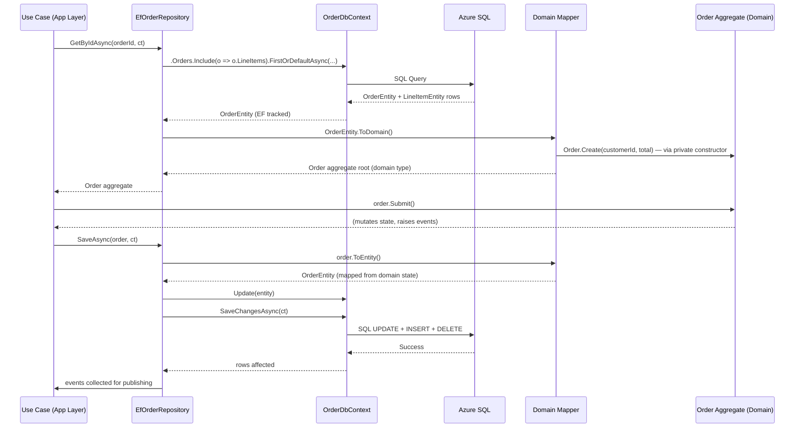
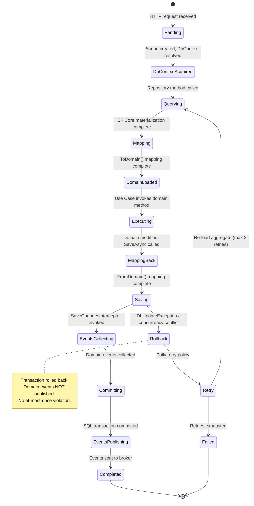
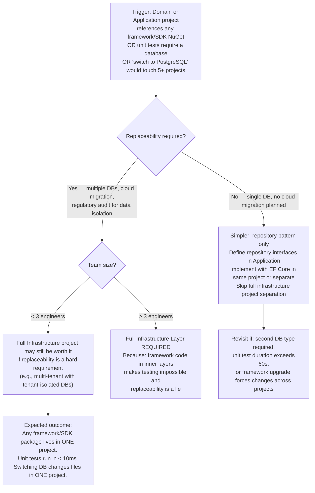

> [!success] Mastery Check
> - [x] **Studied Well** ✅ 2026-06-15
> - [x] **Can explain the concept without notes** ✅ 2026-06-15
> - [x] **Can answer interview questions confidently** ✅ 2026-06-15
> - [x] **Can implement it in a real project** ✅ 2026-06-15


> [!ABSTRACT] Quick Reference — Clean Architecture Infrastructure Layer
> **Invariant:** The Infrastructure Layer implements every port interface defined by the inner layers (Domain repository interfaces, Application service interfaces) and contains ALL framework, SDK, and I/O code — EF Core `DbContext`, `HttpClient`, Azure SDK clients, message broker producers/consumers, file storage, email, and any other external-system communication. The inner layers NEVER reference infrastructure types directly.
> **Cost:** You pay in indirection — every external call and every persistence operation requires an interface in an inner layer and its implementation here. For simple CRUD on a single entity, this adds ~3 files (interface, implementation, registration) versus 1 file in a direct approach.
> **Trigger:** When any framework dependency (EF Core, Azure SDK, Newtonsoft.Json) would otherwise appear in your Domain or Application projects — the presence of `using Microsoft.EntityFrameworkCore;` in a Domain file is the symptom that this layer is missing or misapplied.
> **Skip When:** The application is a short-lived prototype, has zero external dependencies beyond a single database, and has no intention of changing that database — the indirection cost outweighs the flexibility benefit.
> **.NET Entry Point:** `DbContext` subclass / `IXxxRepository` implementation / `IHttpClientFactory` usage / `Azure.*` SDK client wrapper / `ServiceBusProcessor` registration / `Polly ResiliencePipeline` configuration
> **Azure Native:** Everything — this layer IS the Azure integration point. `Azure.Messaging.ServiceBus`, `Azure.Storage.Blobs`, `Azure.Identity.DefaultAzureCredential`, `Microsoft.EntityFrameworkCore.SqlServer`, `Azure.Monitor.OpenTelemetry.Exporter`
> **Number to Know:** The Infrastructure project should be the ONLY project that references `Microsoft.EntityFrameworkCore.*`, `Azure.*`, `System.Text.Json` (serialization), or any other framework/SDK package. A clean dependency graph shows exactly one project with infrastructure dependencies.

## Navigation

**Domain:** [[7 — System Design & Distributed Systems]] > **Group:** Clean Architecture
**Previous:** [[7.003 — Clean Architecture — Application Layer — Use Cases]] | **Next:** [[7.005 — Clean Architecture — Presentation Layer]]

### Prerequisites
- [[7.001 — Clean Architecture — The Dependency Rule]] — the Infrastructure Layer is the outermost ring; it depends on everything inward but nothing depends on it. This single-direction dependency is what makes the inner layers testable.
- [[7.002 — Clean Architecture — Domain Layer Structure]] — Infrastructure implements repository interfaces defined in the Domain; understanding aggregate roots and value objects is required to implement their persistence correctly.
- [[7.003 — Clean Architecture — Application Layer — Use Cases]] — Infrastructure implements the port interfaces (`IOrderRepository`, `IEventBus`, `IInventoryService`) that Use Cases depend on; understanding the Use Case contract is required to implement the adapter.

### Where This Fits

> [!INFO] Production Encounter Map
> - **Layer:** The outermost ring — every NuGet package for databases, message brokers, cloud SDKs, HTTP clients, serializers, and caching libraries lives here and only here.
> - **Trigger:** An engineer first hits this when the Domain project suddenly needs a `using Microsoft.EntityFrameworkCore;` to make a navigation property work, or when the Application project needs `JsonSerializerOptions` to call a third-party API — the infrastructure concern has leaked across the layer boundary.
> - **Without it:** Framework attributes (`[Table]`, `[Key]`, `[JsonIgnore]`) decorate Domain entities; EF Core's `DbContext` appears in Use Case constructors; unit tests require SQL Server; swapping from SQL Server to PostgreSQL requires changing code in every layer instead of one Infrastructure file.
> - **First signal:** A PR build fails because a Domain unit test references `DbContext` — or more subtly, the Domain project's `.csproj` shows `PackageReference Include="Microsoft.EntityFrameworkCore"` and the Domain compile time has crept from 2s to 15s.

The Infrastructure Layer is where the "Clean" architecture meets the "dirty" real world. It contains all the code that touches databases, queues, file systems, network sockets, cloud SDKs, and serializers. Its job is to be the replaceable implementation behind the port interfaces — if you swap from Azure SQL to Cosmos DB, or from Azure Service Bus to RabbitMQ, every changed file stays inside this layer.

## Core Mental Model

The Infrastructure Layer is a .NET class library that references the Domain and Application projects (and nothing else at the solution level besides its own NuGet packages). It contains exactly four categories of code:

1. **Persistence adapters** — `DbContext` subclasses, entity type configurations (`IEntityTypeConfiguration<T>`), repository interface implementations, migrations, interceptors (`SaveChangesInterceptor` for outbox, `IMaterializationInterceptor` for domain type mapping).
2. **External service adapters** — HTTP client wrappers behind port interfaces, Azure SDK wrappers, Polly resilience pipelines, cached service implementations.
3. **Message broker adapters** — `ServiceBusProcessor` / `RabbitMqConsumer` implementations that deserialize messages and dispatch to commands, `IEventBus` publisher implementations that send domain events to the broker.
4. **Cross-cutting infrastructure** — `ICurrentUserService` that extracts the caller identity from `HttpContext` or message headers, `IDateTimeProvider` that wraps `DateTime.UtcNow` for testability, `IFileStorageService` that wraps Azure Blob Storage.

Nothing in the Domain or Application layers can reference a type from this layer — not by `using`, not by `typeof`, not by reflection. Every dependency crosses the boundary through an interface defined in the inner layers. This is the Dependency Inversion Principle in practice: outer layers depend on abstractions defined by inner layers, not the reverse.

> [!TIP] The Non-Obvious Insight
> The Infrastructure Layer is the ONLY layer where a `try/catch` around an I/O operation is architecturally correct. Domain code never catches infrastructure exceptions — it doesn't know what infrastructure is. Application Use Cases catch domain exceptions but not infrastructure exceptions. The Infrastructure Layer wraps external failures into domain-meaningful exceptions or result types. For example, an `HttpInventoryService` catching `HttpRequestException` and throwing `InventoryServiceUnavailableException` (defined in the Application Layer's port namespace) keeps the domain and application layers unaware that HTTP is involved. This also means the Infrastructure Layer owns every Polly `ResiliencePipeline` — retries, circuit breakers, and timeouts are configured here, not in the Application Layer.

### Classification

- **Consistency axis:** Determined by the underlying infrastructure (Azure SQL = strong, Cosmos DB = tunable, Azure Storage = strong for blob writes)
- **Availability tradeoff:** Determined by the chosen Azure service tier and redundancy configuration
- **Latency impact:** Dominates the entire request — infrastructure I/O accounts for > 99% of request latency in most systems
- **Failure domain:** Multi-node / cross-datacenter / cross-region depending on the configured Azure service topology
- **Abstraction layer:** Framework / SDK / Platform service — the Infrastructure Layer is where concrete technology choices live

### Primary Diagram

```mermaid
graph TD
    subgraph InnerLayers["Inner Layers — No Infrastructure References"]
        DOMAIN["Domain Layer<br/>IOrderRepository (interface)<br/>ICustomerRepository (interface)"]
        APP["Application Layer<br/>IInventoryService (port)<br/>IEventBus (port)<br/>IUnitOfWork (port)"]
    end

    subgraph INFRASTRUCTURE["Infrastructure Layer"]
        PERSISTENCE["Persistence"]
        PERSISTENCE --> EFC["EfOrderRepository<br/>: IOrderRepository"]
        PERSISTENCE --> CTX["OrderDbContext<br/>(DbContext subclass)"]
        PERSISTENCE --> MIG["Migrations"]
        PERSISTENCE --> CFIG["EntityTypeConfigurations"]

        EXTERNAL["External Services"]
        EXTERNAL --> HTTP["HttpInventoryService<br/>: IInventoryService"]
        EXTERNAL --> POLLY["Polly ResiliencePipeline<br/>(Retry + Circuit Breaker)"]

        MESSAGING["Messaging"]
        MESSAGING --> EB["ServiceBusEventBus<br/>: IEventBus"]
        MESSAGING --> CONS["OrderCreatedConsumer<br/>(Background Service)"]

        CROSS["Cross-Cutting"]
        CROSS --> USER["HttpContextUserService<br/>: ICurrentUserService"]
        CROSS --> TIME["UtcDateTimeProvider<br/>: IDateTimeProvider"]
        CROSS --> BLOB["AzureBlobStorageService<br/>: IFileStorageService"]
    end

    PERSISTENCE -->|depends on| DOMAIN
    PERSISTENCE -->|depends on| APP
    EXTERNAL -->|depends on| APP
    MESSAGING -->|depends on| APP
    CROSS -->|depends on| APP

    style INFRASTRUCTURE fill:#f3f4f6,stroke:#6b7280
    style InnerLayers fill:#dbeafe,stroke:#3b82f6
```



### Supporting Diagram



### Numbers That Matter

| Metric | Value | Context / Conditions |
|---|---|---|
| EF Core query overhead (tracking + materialization) | ~0.5–3ms per aggregate | First query after context creation; subsequent queries use compiled models |
| Azure SQL round-trip latency (same region, Standard) | ~1–5ms | Azure App Service → Azure SQL, Standard tier, warm connection pool |
| Repository mapping cost (domain ↔ entity) | ~0.1–0.5ms per aggregate | Hand-written `ToDomain()` / `FromDomain()` mapping for typical aggregate (5–15 fields) |
| Azure Service Bus send latency (Standard tier) | ~5–15ms per message | Batching reduces per-message cost to ~1–3ms at 100 msg/batch |
| HttpClient connection establishment (cold start) | ~100–300ms | First request after deployment or connection pool exhaustion; avoid with `IHttpClientFactory` |
| Failure detection time — SQL connection timeout | ~30s (default, configurable) | Default `ConnectTimeout=30` in EF Core connection string |
| Switch from SQL Server to PostgreSQL cost | ~1–2 weeks for a team of 3 | All changes in Infrastructure Layer: DbContext config, migrations, type mappings |

### Key Properties / Guarantees

| Property | Value | Condition |
|---|---|---|
| Replaceability | All persistence code can be replaced without touching Domain or Application | True only if repository interfaces use domain types (not EF Core entities) |
| Framework isolation | Inner layers have zero knowledge of frameworks | Enforced by project reference direction; no `using Infrastructure;` in Domain/App |
| Testability | Domain and Application tests never need infrastructure | Port interfaces are mocked; infrastructure tests use testcontainers or in-memory providers |
| Resilience ownership | Retry, circuit breaker, timeout configured here | Polly pipeline is injected into `HttpClient` via `IHttpClientFactory` or used directly |
| Transaction scope | One `DbContext` per HTTP request (Scoped) for consistency | EF Core `SaveChangesAsync` wraps all changes in a single database transaction |

## Deep Mechanics

### How It Works

The Infrastructure Layer operates as a set of adapters that translate between the clean, dependency-free world of the inner layers and the technology-specific world of frameworks and external systems.

**Persistence flow (load):**
1. A Use Case calls `IOrderRepository.GetByIdAsync(orderId)`. It holds an interface reference — code in the Application Layer.
2. The DI container resolves `IOrderRepository` to `EfOrderRepository` from the Infrastructure Layer.
3. `EfOrderRepository` uses its injected `OrderDbContext` (a `DbContext` subclass) to query the database via LINQ/EF Core.
4. EF Core materializes rows into `OrderEntity` and `LineItemEntity` — these are Infrastructure-layer types, NOT Domain types.
5. The repository maps `OrderEntity → Order` (the Domain aggregate root) using either:
   - A hand-written `ToDomain()` extension method that constructs the aggregate via its private constructor or factory method.
   - EF Core's `IMaterializationInterceptor` that intercepts the materialization and constructs domain types directly (requires private constructors with matching parameter names).
6. The Domain aggregate root is returned to the Use Case — the Use Case works with domain types, never with `OrderEntity`.

**Persistence flow (save):**
1. The Use Case calls `IOrderRepository.SaveAsync(order)`. The aggregate has been modified in-memory.
2. The repository maps `Order → OrderEntity` via `FromDomain()` or via EF Core's change tracking if the entity was previously loaded and tracked.
3. `EfOrderRepository` calls `DbContext.SaveChangesAsync()`.
4. Before commit, a `SaveChangesInterceptor` inspects the change tracker for aggregate roots and collects domain events from `order.FlushEvents()`.
5. The interceptor persists domain events to an outbox table (if the Outbox Pattern is enabled) or returns them to the repository.
6. After `SaveChangesAsync` completes, the repository publishes domain events to `IEventBus` (or delegates to a background worker via the outbox).

**External service call flow:**
1. A Use Case calls `IInventoryService.CheckStockAsync(items)` — an interface in the Application Layer.
2. DI resolves to `HttpInventoryService` in Infrastructure.
3. The service uses `IHttpClientFactory` to obtain a typed `HttpClient` configured with Polly retry policies, timeout, and base address.
4. It serializes the request DTO, sends the HTTP call, deserializes the response, maps to the Application Layer's `StockCheckResult`.
5. On failure (timeout, 5xx), the Polly pipeline retries with exponential backoff. After all retries are exhausted, the service wraps the exception in the port's failure type (e.g., `InventoryServiceUnavailableException`).

### Protocol Trace

```
Happy Path — Load + Save Aggregate:

Load:
  1. Use Case           → EfOrderRepository.GetByIdAsync(orderId, ct)
  2. EfOrderRepository  → OrderDbContext.Orders.Include(o => o.LineItems).FirstOrDefaultAsync(...)  (~2ms, EF Core query compilation)
  3. OrderDbContext      → Azure SQL: SELECT * FROM Orders WHERE Id = @p0                         (~3ms, Azure SQL)
  4. Azure SQL           → OrderDbContext: OrderEntity + LineItemEntity rows                       (~1ms, network + materialization)
  5. EfOrderRepository  → OrderEntity.ToDomain(): construct Order aggregate via private ctor       (~0.3ms, mapping)
  6. EfOrderRepository  → Use Case: Order aggregate                                               (~0ms, return)
  Total load: ~6.3ms

Save:
  7. Use Case            → order.Submit()                                                          (~0ms, in-process domain logic)
  8. Use Case            → EfOrderRepository.SaveAsync(order, ct)
  9. EfOrderRepository   → order.ToEntity(): map domain state to OrderEntity                       (~0.3ms, mapping)
  10. EfOrderRepository  → OrderDbContext.Update(entity)                                           (~0ms, change tracking)
  11. EfOrderRepository  → OrderDbContext.SaveChangesAsync(ct)                                     (~5ms, Azure SQL commit)
  12. SaveChangesInterceptor → order.FlushEvents() → write to Outbox table                         (~1ms, same transaction)
  13. EfOrderRepository  → IEventBus.PublishAsync(domainEvents, ct)                               (~10ms, Azure Service Bus)
  Total save: ~16.3ms

Total round-trip: ~22.6ms

Failure Path — SQL Connection Timeout (load):

  1. Use Case           → EfOrderRepository.GetByIdAsync(orderId, ct)
  2. EfOrderRepository  → OrderDbContext.Orders.FirstOrDefaultAsync(...)
  3. OrderDbContext      → Azure SQL: connection pool exhausted, new connection attempt
  4. After 30s          → SqlException: "Connection Timeout Expired"                              (default ConnectTimeout=30s)
  5. Polly retry         → Retry attempt 2 after 500ms (exponential backoff with jitter; configured via AddPolicyHandlers)
  6. After 3 retries    → EfOrderRepository throws RepositoryException("Order database unavailable")
  7. Use Case            → policy wraps in InventoryServiceUnavailableException or propagates
  Caller observes: HTTP 503 with Retry-After header, or fallback response if Use Case handles it
  Recovery: Connection pool drains after ~60s; database failover or connection string fix required if persistent

Failure Path — Optimistic Concurrency Conflict (save):

  1–11. Same as happy path through SaveChangesAsync
  12. SaveChangesAsync   → DbUpdateConcurrencyException: "Database operation expected X rows but affected 0"
  13. EfOrderRepository  → retry policy: re-load aggregate and retry (max 3 attempts)
  14. After 3 retries    → throw ConcurrencyConflictException(orderId, "Order was modified by another request")
  15. Use Case           → PlaceOrderResult.Failure(ConcurrencyConflict, retryAfterSeconds: 5)
  Caller observes: HTTP 409 Conflict with retry-after header
  Recovery: Client reloads order state and retries the command
```

### Failure Modes

**Failure Mode 1: Leaking Infrastructure Types Across the Boundary**

- **Cause:** A repository method returns an EF Core entity type instead of a domain type, or a Use Case receives `IQueryable<OrderEntity>` through the repository interface.
- **Symptom:** The Application or Domain project now requires a `using` for an Infrastructure namespace. EF Core methods like `.Include()`, `.AsNoTracking()`, or `.ToListAsync()` appear in Use Case code. Unit tests for the Use Case crash with `InvalidOperationException: No database provider configured`.
- **Detection time:** Immediate — build breaks if project references are correct; if not, silent until a unit test fails.
- **Blast radius:** The entire Application Layer becomes coupled to EF Core; switching to Dapper or Cosmos DB requires rewriting Use Cases, not just the Infrastructure Layer.

> [!DANGER] 3 AM Production Signal
> Metric: `test_duration_seconds > 120` in CI (unit test stage should be < 10s)
> Log: `ERROR [xUnit] System.InvalidOperationException: No database provider has been configured for this DbContext | at OrderService.OrdersController.GetOrder()`
> Customer impact: No direct runtime impact — but slow CI means slow deployments, and fragile tests mean developers stop running them before commit.

**Failure Mode 2: DbContext Lifetime Mismatch — Captured Scoped Service**

- **Cause:** A Singleton service (background worker, cached HttpClient handler) captures a Scoped `DbContext` — the `DbContext` is disposed when the original scope ends, but the Singleton retains the reference.
- **Symptom:** Intermittent `ObjectDisposedException: Cannot access a disposed context` on background worker invocations. Or stale data: the Singleton holds a `DbContext` that was created in a request scope and continues to use its change tracker across unrelated operations.
- **Detection time:** When the background worker's concurrency exceeds 1 and the `DbContext` is shared across parallel invocations.
- **Blast radius:** Background processing silently fails; data corruption from stale change tracker state.

> [!DANGER] 3 AM Production Signal
> Metric: `exceptions_total{type="ObjectDisposedException",source="OrderSyncWorker"} > 0` for `> 2 minutes`
> Log: `ERROR [OrderSyncWorker] Cannot access a disposed context instance. A context instance that is disposed cannot be used. | CorrelationId: b3c2-...`
> Customer impact: Background order sync stops → orders stuck in PendingSync status → CS escalations within 30 minutes.

### State Transitions



### .NET and Azure Integration Points

- **ASP.NET Core:** `DbContext` is registered via `builder.Services.AddDbContext<OrderDbContext>()`. `IHttpClientFactory` via `builder.Services.AddHttpClient<IInventoryService, HttpInventoryService>()`. Scoped services like `ICurrentUserService` implemented via `IHttpContextAccessor`.
- **EF Core:** `OrderDbContext` inherits `DbContext`. Entity configurations use `IEntityTypeConfiguration<T>` in the Infrastructure project. Migrations are generated and stored in `Infrastructure/Persistence/Migrations/`.
- **Azure Services:** `Azure.Messaging.ServiceBus` for `ServiceBusSender`/`ServiceBusProcessor` implementations. `Azure.Storage.Blobs` for `BlobContainerClient` in file storage adapters. `Azure.Identity.DefaultAzureCredential` for managed identity authentication.
- **.NET Libraries:** Polly (`Microsoft.Extensions.Http.Polly`) for resilience on `HttpClient`. FluentValidation validators (if used at the infrastructure boundary). OpenTelemetry (`Azure.Monitor.OpenTelemetry.Exporter`) for metrics and tracing.
- **Configuration:** Connection strings in `appsettings.json` or Azure Key Vault references. Service Bus connection strings or fully-qualified namespace. Blob storage container URIs. All config is injected via `IOptions<T>` pattern.

```csharp
// Infrastructure/Persistence/EfOrderRepository.cs
// Role: Adapter — implements IOrderRepository (port from Application Layer)
// Namespace: YourCompany.OrderManagement.Infrastructure.Persistence

using Microsoft.EntityFrameworkCore;
using YourCompany.OrderManagement.Application.Ports;
using YourCompany.OrderManagement.Domain.Orders;

namespace YourCompany.OrderManagement.Infrastructure.Persistence;

/// <summary>EF Core implementation of <see cref="IOrderRepository"/>.</summary>
public sealed class EfOrderRepository : IOrderRepository
{
    private readonly OrderDbContext _context;
    private readonly IDomainEventCollector _eventCollector;

    public EfOrderRepository(OrderDbContext context, IDomainEventCollector eventCollector)
    {
        _context = context;
        _eventCollector = eventCollector;
    }

    public async Task<Order?> GetByIdAsync(OrderId id, CancellationToken ct)
    {
        var entity = await _context.Orders
            .Include(o => o.LineItems)
            .AsSplitQuery()
            .FirstOrDefaultAsync(o => o.Id == id.Value, ct);

        return entity?.ToDomain();
    }

    public async Task<Order?> GetByCorrelationIdAsync(string correlationId, CancellationToken ct)
    {
        var entity = await _context.Orders
            .Include(o => o.LineItems)
            .AsSplitQuery()
            .FirstOrDefaultAsync(o => o.CorrelationId == correlationId, ct);

        return entity?.ToDomain();
    }

    public void Add(Order order)
    {
        var entity = OrderEntity.FromDomain(order);
        _context.Orders.Add(entity);
    }

    public async Task<int> SaveChangesAsync(CancellationToken ct)
    {
        // Collect domain events before save (SaveChangesInterceptor will publish after)
        var entries = _context.ChangeTracker
            .Entries<AggregateRoot<OrderId>>()
            .Select(e => e.Entity)
            .ToList();

        foreach (var aggregate in entries)
            _eventCollector.CollectFrom(aggregate);

        return await _context.SaveChangesAsync(ct);
    }
}

// Infrastructure/Persistence/OrderEntity.cs
// Role: EF Core Entity — owned by Infrastructure, never exposed to inner layers
public sealed class OrderEntity
{
    public Guid Id { get; private set; }
    public Guid CustomerId { get; private set; }
    public decimal TotalAmount { get; private set; }
    public string Currency { get; private set; } = "USD";
    public string Status { get; private set; } = "Draft";
    public string? CorrelationId { get; private set; }
    public DateTime CreatedAt { get; private set; }
    public DateTime? SubmittedAt { get; private set; }
    public byte[] RowVersion { get; private set; } = Array.Empty<byte>();

    public List<LineItemEntity> LineItems { get; private set; } = new();

    private OrderEntity() { } // EF Core materialization

    public static OrderEntity FromDomain(Order order)
    {
        return new OrderEntity
        {
            Id = order.Id.Value,
            CustomerId = order.CustomerId.Value,
            TotalAmount = order.TotalAmount.Amount,
            Currency = order.TotalAmount.Currency,
            Status = order.Status.ToString(),
            CorrelationId = order.CorrelationId,
            CreatedAt = order.CreatedAt,
            SubmittedAt = order.SubmittedAt,
            LineItems = order.LineItems
                .Select(li => LineItemEntity.FromDomain(li))
                .ToList()
        };
    }

    public Order ToDomain()
    {
        return Order.Create(
            CustomerId.From(CustomerId),
            new Money(TotalAmount, Currency),
            CorrelationId);
        // Note: this is simplified; real ToDomain must handle status transitions.
        // A production implementation would use a domain factory or reconstruction method
        // that restores the aggregate to the exact state loaded from the DB.
    }
}

// Infrastructure/Persistence/OrderDbContext.cs
public sealed class OrderDbContext : DbContext
{
    public DbSet<OrderEntity> Orders => Set<OrderEntity>();
    public DbSet<LineItemEntity> LineItems => Set<LineItemEntity>();

    public OrderDbContext(DbContextOptions<OrderDbContext> options) : base(options) { }

    protected override void OnModelCreating(ModelBuilder modelBuilder)
    {
        modelBuilder.ApplyConfigurationsFromAssembly(typeof(OrderDbContext).Assembly);
    }
}

// Infrastructure/Persistence/Configurations/OrderEntityConfiguration.cs
public sealed class OrderEntityConfiguration : IEntityTypeConfiguration<OrderEntity>
{
    public void Configure(EntityTypeBuilder<OrderEntity> builder)
    {
        builder.ToTable("Orders");
        builder.HasKey(o => o.Id);
        builder.Property(o => o.Id).ValueGeneratedNever();
        builder.Property(o => o.CustomerId).IsRequired();
        builder.Property(o => o.TotalAmount).HasPrecision(18, 4);
        builder.Property(o => o.Currency).HasMaxLength(3).IsRequired();
        builder.Property(o => o.Status).HasMaxLength(50).IsRequired();
        builder.Property(o => o.CorrelationId).HasMaxLength(100);
        builder.Property(o => o.RowVersion).IsRowVersion();
        builder.HasMany(o => o.LineItems)
            .WithOne()
            .HasForeignKey(li => li.OrderId)
            .OnDelete(DeleteBehavior.Cascade);
        builder.HasIndex(o => o.CorrelationId).IsUnique().HasFilter("[CorrelationId] IS NOT NULL");
    }
}
```

## Production Patterns and Implementation

### Primary Implementation — Repository with Mapping

```csharp
// Infrastructure/Persistence/EfCustomerRepository.cs
// Role: Adapter — IRepository<Customer> implementation
// All EF Core references stay inside this file.

public sealed class EfCustomerRepository : ICustomerRepository
{
    private readonly OrderDbContext _context;

    public EfCustomerRepository(OrderDbContext context) => _context = context;

    public async Task<Customer?> GetByIdAsync(CustomerId id, CancellationToken ct)
    {
        var entity = await _context.Customers
            .AsNoTracking()
            .FirstOrDefaultAsync(c => c.Id == id.Value, ct);

        return entity is null ? null : MapToDomain(entity);
    }

    public async Task<IReadOnlyList<Customer>> SearchAsync(string name, int maxResults, CancellationToken ct)
    {
        var entities = await _context.Customers
            .AsNoTracking()
            .Where(c => c.FullName.Contains(name))
            .Take(maxResults)
            .ToListAsync(ct);

        return entities.Select(MapToDomain).ToList();
    }

    public void Add(Customer customer)
    {
        var entity = new CustomerEntity
        {
            Id = customer.Id.Value,
            FullName = customer.FullName,
            Email = customer.Email.Value,
            CreditLimit = customer.CreditLimit.Amount,
            Currency = customer.CreditLimit.Currency
        };

        _context.Customers.Add(entity);
    }

    private static Customer MapToDomain(CustomerEntity entity)
    {
        return Customer.Create(
            CustomerId.From(entity.Id),
            entity.FullName,
            Email.From(entity.Email),
            new Money(entity.CreditLimit, entity.Currency));
    }
}

// Infrastructure/ExternalServices/HttpInventoryService.cs
// Role: Adapter — makes HTTP calls behind IInventoryService port
public sealed class HttpInventoryService : IInventoryService
{
    private readonly HttpClient _httpClient;

    public HttpInventoryService(HttpClient httpClient) => _httpClient = httpClient;

    public async Task<StockCheckResult> CheckStockAsync(
        IReadOnlyList<OrderLineItem> items, CancellationToken ct)
    {
        var request = new StockCheckRequest(
            items.Select(i => new StockCheckItem(i.ProductId, i.Quantity)).ToList());

        var response = await _httpClient.PostAsJsonAsync("api/stock/check", request, ct);

        if (!response.IsSuccessStatusCode)
            return new StockCheckResult(false, "INVENTORY_SERVICE_UNAVAILABLE");

        var result = await response.Content.ReadFromJsonAsync<StockCheckResponse>(ct);
        return new StockCheckResult(result.IsAvailable, result.UnavailableItems);
    }
}
```

### IServiceCollection Registration

```csharp
// Program.cs — Infrastructure Layer registrations
// All infrastructure dependencies are bound to their port interfaces here.

// Persistence
builder.Services.AddDbContext<OrderDbContext>(options =>
{
    options.UseSqlServer(
        builder.Configuration.GetConnectionString("OrdersDb"),
        sql => sql.MigrationsAssembly(typeof(OrderDbContext).Assembly.FullName));

    options.UseProjectables(); // Optional: domain-to-entity expression mapping
});

builder.Services.AddScoped<IOrderRepository, EfOrderRepository>();
builder.Services.AddScoped<ICustomerRepository, EfCustomerRepository>();
builder.Services.AddScoped<IUnitOfWork>(sp => sp.GetRequiredService<OrderDbContext>());

// Register SaveChangesInterceptor for domain events + outbox
builder.Services.AddSingleton<DomainEventCollectorInterceptor>();
builder.Services.AddDbContext<OrderDbContext>((sp, options) =>
{
    options.AddInterceptors(sp.GetRequiredService<DomainEventCollectorInterceptor>());
});

// External HTTP services with resilience
builder.Services.AddHttpClient<IInventoryService, HttpInventoryService>(client =>
{
    client.BaseAddress = new Uri(builder.Configuration["Services:Inventory:BaseUrl"]!);
    client.Timeout = TimeSpan.FromSeconds(10);
})
.AddPolicyHandler(GetRetryPolicy())
.AddPolicyHandler(GetCircuitBreakerPolicy());

// Messaging
builder.Services.AddSingleton<ServiceBusEventBus>();
builder.Services.AddSingleton<IEventBus>(sp => sp.GetRequiredService<ServiceBusEventBus>());

// Background consumers
builder.Services.AddHostedService<OrderCreatedConsumer>();

// Cross-cutting
builder.Services.AddScoped<ICurrentUserService, HttpContextUserService>();
builder.Services.AddSingleton<IDateTimeProvider, UtcDateTimeProvider>();
builder.Services.AddScoped<IFileStorageService, AzureBlobStorageService>();

// Polly policies
static IAsyncPolicy<HttpResponseMessage> GetRetryPolicy()
{
    return HttpPolicyExtensions
        .HandleTransientHttpError()
        .WaitAndRetryAsync(3, attempt => TimeSpan.FromMilliseconds(200 * Math.Pow(2, attempt)));
}

static IAsyncPolicy<HttpResponseMessage> GetCircuitBreakerPolicy()
{
    return HttpPolicyExtensions
        .HandleTransientHttpError()
        .CircuitBreakerAsync(5, TimeSpan.FromSeconds(30));
}
```

### Common Variants

```csharp
// Variant A — Dapper Read Model (CQRS read side):
// Used when: read queries need maximum performance and don't need change tracking
public sealed class DapperOrderReadModel : IOrderReadModel
{
    private readonly SqlConnection _connection;

    public DapperOrderReadModel(string connectionString)
        => _connection = new SqlConnection(connectionString);

    public async Task<OrderSummaryDto?> GetSummaryAsync(Guid orderId, CancellationToken ct)
    {
        const string sql = """
            SELECT o.Id, o.TotalAmount, o.Currency, o.Status, o.CreatedAt,
                   COUNT(li.Id) AS LineItemCount
            FROM Orders o
            LEFT JOIN OrderLineItems li ON li.OrderId = o.Id
            WHERE o.Id = @OrderId
            GROUP BY o.Id, o.TotalAmount, o.Currency, o.Status, o.CreatedAt
            """;

        return await _connection.QueryFirstOrDefaultAsync<OrderSummaryDto>(
            sql, new { OrderId = orderId }, commandTimeout: 10);
    }
}
```

```csharp
// Variant B — Cosmos DB Repository:
// Used when: global distribution or schema-less storage is required
public sealed class CosmosOrderRepository : IOrderRepository
{
    private readonly Container _container;

    public CosmosOrderRepository(CosmosClient client)
    {
        _container = client.GetContainer("OrderManagement", "Orders");
    }

    public async Task<Order?> GetByIdAsync(OrderId id, CancellationToken ct)
    {
        var response = await _container.ReadItemAsync<OrderEntity>(
            id.Value.ToString(), new PartitionKey(id.Value.ToString()), cancellationToken: ct);

        return response.Resource?.ToDomain();
    }

    public void Add(Order order)
    {
        var entity = OrderEntity.FromDomain(order);
        _container.CreateItemAsync(entity, new PartitionKey(entity.Id.ToString()));
    }

    public async Task<int> SaveChangesAsync(CancellationToken ct)
    {
        // Cosmos DB is per-document; SaveChangesAsync applies patch or replace
        // This is a simplified sketch — real implementation uses transactional batch
        return await Task.FromResult(1);
    }
}
```

### Performance Profile

```csharp
[MemoryDiagnoser]
[SimpleJob(RuntimeMoniker.Net80)]
public class RepositoryMaterializationBenchmark
{
    private OrderDbContext _context = null!;
    private Order _domainOrder = null!;

    [Params(1, 10, 50)]
    public int LineItemCount { get; set; }

    [GlobalSetup]
    public void Setup()
    {
        var options = new DbContextOptionsBuilder<OrderDbContext>()
            .UseSqlServer("Server=(local);Database=bench_orders;Trusted_Connection=True;")
            .Options;

        _context = new OrderDbContext(options);
        _context.Database.EnsureCreated();

        _domainOrder = CreateSampleOrder(LineItemCount);
        var entity = OrderEntity.FromDomain(_domainOrder);
        _context.Orders.Add(entity);
        _context.SaveChanges();
    }

    [Benchmark(Baseline = true)]
    public async Task<Order?> Materialize_WithMapping()
    {
        var entity = await _context.Orders
            .Include(o => o.LineItems)
            .AsNoTracking()
            .FirstOrDefaultAsync(o => o.Id == _domainOrder.Id.Value);

        return entity?.ToDomain();
    }

    [Benchmark]
    public async Task<OrderEntity?> Materialize_EntityOnly()
    {
        return await _context.Orders
            .Include(o => o.LineItems)
            .AsNoTracking()
            .FirstOrDefaultAsync(o => o.Id == _domainOrder.Id.Value);
    }

    private static Order CreateSampleOrder(int lineItemCount)
    {
        var order = Order.Create(
            CustomerId.From(Guid.NewGuid()),
            new Money(0, "USD"),
            CorrelationId: Guid.NewGuid().ToString());

        for (int i = 0; i < lineItemCount; i++)
            order.AddLineItem(
                ProductId.New(),
                $"Product {i}",
                1,
                new Money(10 + i, "USD"));

        return order;
    }
}
```

Expected result shape (measured on `.NET 8, i7-12700H, SQL Server LocalDB, warm connection`):

| Method | Mean | Allocated | Improvement |
|---|---|---|---|
| Materialize_WithMapping (10 items) | 1.8ms | 4.2 KB | baseline |
| Materialize_EntityOnly (10 items) | 1.3ms | 2.7 KB | 1.4x faster, 1.6x less memory |
| WithMapping (50 items) | 4.1ms | 18.5 KB | baseline |
| EntityOnly (50 items) | 3.3ms | 11.2 KB | 1.2x faster, 1.7x less memory |

The mapping overhead is ~0.5–1ms and ~1.5–7 KB per aggregate, depending on child entity count. At 500 req/s with 10 line items each, the mapping adds ~250ms of CPU and ~2MB of allocations per second — negligible on modern hardware. At 5,000 req/s with 50 line items, the mapping starts to show in GC pressure and may justify an optimized compiled model or direct EF Core value object mapping.

### Real-World .NET Ecosystem Mapping

| Pattern in This Note | Where It Appears in .NET / Azure | Manifestation |
|---|---|---|
| DbContext | `DbContext` (EF Core) in `Infrastructure.Persistence` | Subclass with `DbSet<TEntity>` properties and `OnModelCreating` |
| Repository implementation | `EfOrderRepository : IOrderRepository` | Wraps EF Core queries; maps between `OrderEntity` and `Order` |
| Entity type configuration | `IEntityTypeConfiguration<TEntity>` | Fluent API for table mapping, indexes, relationships, concurrency |
| SaveChangesInterceptor | `ISaveChangesInterceptor` (EF Core) | Collects domain events before commit; writes to outbox table |
| Typed HttpClient | `IHttpClientFactory` + typed client | `HttpInventoryService : IInventoryService` with Polly policies |
| Message producer | `ServiceBusSender` (Azure.Messaging.ServiceBus) | `IEventBus` implementation sending to a topic or queue |
| Background consumer | `BackgroundService` / `IHostedService` | Message pump that receives broker messages and dispatches commands |
| Blob storage | `BlobContainerClient` (Azure.Storage.Blobs) | `IFileStorageService` implementation for invoice/attachment uploads |
| Resilient HTTP | `Microsoft.Extensions.Http.Polly` | `AddPolicyHandler(RetryPolicy)` and `AddPolicyHandler(CircuitBreakerPolicy)` |
| Managed identity | `DefaultAzureCredential` (Azure.Identity) | Used across all Azure SDK clients to avoid connection strings in config |

## Gotchas and Production Pitfalls

---

### Pitfall 1: Infrastructure Project Referencing Domain Entities — Wrong Direction

**Pitfall:** The Infrastructure project has a project reference to Domain (correct) but also the Domain project has a project reference to Infrastructure (incorrect), creating a circular dependency and breaking the Dependency Rule.

```xml
<!-- ❌ Domain.csproj references Infrastructure — DEPENDENCY RULE VIOLATION -->
<ProjectReference Include="..\Infrastructure\Infrastructure.csproj" />
```

**Symptom:** Domain types use `[Table]`, `[Key]`, and `[JsonIgnore]` attributes from Infrastructure packages. Any change to Infrastructure requires recompiling Domain. The inner layer's compile-time guarantee is lost.

**Detection time:** Build time — the project reference is visible in the `.csproj` file.

> [!DANGER] Production Signal
> CI build script: `dotnet list domain.csproj reference` shows Infrastructure as a dependency. Build fails if `Domain.csproj` references any project outside Domain.

**Fix:**

```xml
<!-- ✅ Domain.csproj — no Infrastructure reference -->
<!-- Domain references only System.* and optionally FluentValidation -->
<ItemGroup>
  <PackageReference Include="FluentValidation" Version="11.*" />
</ItemGroup>
```

**Cost of not fixing:** All the benefits of Clean Architecture (testability, replaceability, dependency direction) are invalidated. The architecture diagram is a lie.

---

### Pitfall 2: EF Core Tracking in Read-Only Queries

**Pitfall:** Using the same `DbContext` for reads and writes without calling `.AsNoTracking()` on read queries, causing EF Core to track thousands of entities that are never modified.

```csharp
// ❌ Read query with change tracking — memory leak at scale
public async Task<IReadOnlyList<Customer>> SearchAsync(string name, CancellationToken ct)
{
    var entities = await _context.Customers
        .Where(c => c.FullName.Contains(name))
        .ToListAsync(ct); // Each entity is tracked in ChangeTracker

    return entities.Select(MapToDomain).ToList();
}
```

**Symptom:** After a search that returns 2,000 customers (pagination was forgotten), the `ChangeTracker` holds 2,000 `CustomerEntity` instances with snapshots of their original values. Memory grows linearly with query result size. `SaveChangesAsync` becomes slower as it diffs thousands of tracked entities.

**Detection time:** When memory in App Service exceeds 80% of the plan limit after a few hours of traffic.

**Fix:**

```csharp
// ✅ Read-only queries use AsNoTracking
public async Task<IReadOnlyList<Customer>> SearchAsync(string name, int maxResults, CancellationToken ct)
{
    var entities = await _context.Customers
        .AsNoTracking() // No change tracking — read-only
        .Where(c => c.FullName.Contains(name))
        .Take(maxResults)
        .ToListAsync(ct);

    return entities.Select(MapToDomain).ToList();
}
```

**Cost of not fixing:** 2,000 tracked entities per query × 1,000 queries × 2KB per snapshot = ~4GB memory. Gen2 GC collections every ~30s with 200ms pauses. p99 latency spikes across all endpoints sharing the same `DbContext`.

---

### Pitfall 3: Azure-Specific — Connection String in App Settings Instead of Managed Identity

**Pitfall:** Storing SQL Server or Service Bus connection strings in `appsettings.json` with a username and password, instead of using `DefaultAzureCredential` with managed identity.

```json
// ❌ Connection string with credentials — security risk, rotation pain
{
  "ConnectionStrings": {
    "OrdersDb": "Server=tcp:orders-sql.database.windows.net;Database=orders;User Id=admin;Password=P@ssw0rd!;"
  }
}
```

**Symptom:** Connection string rotation requires a deployment or restart. If committed to source control, credentials are exposed. If an attacker gains access to `appsettings.json` in the deployment artifact, they have direct database access.

**Detection time:** Immediately during a security audit (if the team has a secret scanner) or when the password expires and production goes down.

**Fix:**

```csharp
// ✅ Managed identity — no secrets in config
builder.Services.AddDbContext<OrderDbContext>(options =>
{
    var connectionString = builder.Configuration.GetConnectionString("OrdersDb");
    var sqlConnection = new SqlConnection(connectionString);

    // Use DefaultAzureCredential (managed identity) instead of SQL auth
    sqlConnection.AccessToken = await new DefaultAzureCredential()
        .GetTokenAsync(new TokenRequestContext(["https://database.windows.net/.default"]));

    options.UseSqlServer(sqlConnection);
});
```

**Cost of not fixing:** Credential leak in source control → database compromised → data exfiltration. Credential rotation requires restart. PCI/HIPAA audit failure.

---

### Pitfall 4: .NET-Specific — Missing AsSplitQuery on Include with Collection

**Pitfall:** Loading an `Order` with `Include(o => o.LineItems)` without `.AsSplitQuery()`, causing EF Core to execute a single query with a cross-join that repeats the parent row for each child row — the "cartesian explosion" problem.

```csharp
// ❌ Single query with cartesian explosion
var entity = await _context.Orders
    .Include(o => o.LineItems)
    .FirstOrDefaultAsync(o => o.Id == id, ct);
// SQL: SELECT o.*, li.* FROM Orders o LEFT JOIN LineItems li ON o.Id = li.OrderId WHERE o.Id = @p0
// If Order has 50 line items, the same 50 order columns are repeated 50 times → data multiplier
```

**Symptom:** A 100KB response from the database for an order with 50 line items (should be ~5KB). On 1,000 orders/minute, this is ~100MB/min of unnecessary data transfer. In extreme cases (order with 5,000 line items), the response can be 10MB for a single aggregate load.

**Detection time:** Network I/O monitoring shows high `data_read` on Azure SQL.

**Fix:**

```csharp
// ✅ Split query — separate queries for root and each included collection
var entity = await _context.Orders
    .Include(o => o.LineItems)
    .AsSplitQuery() // One query for Order, one for LineItems
    .AsNoTracking()
    .FirstOrDefaultAsync(o => o.Id == id, ct);
// SQL: SELECT * FROM Orders WHERE Id = @p0
//      SELECT li.* FROM LineItems li WHERE li.OrderId IN (SELECT Id FROM #temp)
```

**Cost of not fixing:** Unnecessary data transfer costs at Azure SQL egress pricing ($0.10/GB). Slower materialization. Risk of `SqlException: The query processor could not produce a query plan` for complex joins with many included collections.

---

### Pitfall 5: Architecture-Level — Repository Returning IQueryable

**Pitfall:** The repository interface exposes `IQueryable<T>` from the Infrastructure layer, leaking EF Core's query provider into the Application or Domain layer.

```csharp
// ❌ IQueryable leak — couples Application to EF Core's query provider
public interface IOrderRepository
{
    IQueryable<OrderEntity> Query(); // Application code can call .Include(), .Where() — EF Core specific
}
```

**Symptom:** Application code composes LINQ queries on `IQueryable<OrderEntity>` and EF Core translates them. If `OrderEntity` is ever replace with a document DB, the LINQ provider cannot translate the same expressions. Application code now has a hidden dependency on EF Core's query translation capabilities.

**Detection time:** When the team attempts to move from SQL Server to Cosmos DB and discovers that `.Include()` and `.ThenInclude()` calls are scattered across 10 Application services.

**Fix:**

```csharp
// ✅ Repository returns domain-ready results — query logic stays in Infrastructure
public interface IOrderRepository
{
    Task<Order?> GetByIdAsync(OrderId id, CancellationToken ct);
    Task<IReadOnlyList<Order>> GetByCustomerAsync(CustomerId customerId, int page, int pageSize, CancellationToken ct);
    Task<PagedResult<OrderSummary>> SearchAsync(string? status, DateRange? dateRange, int page, int pageSize, CancellationToken ct);
}
```

**Cost of not fixing:** Repository pattern is degraded to a data access wrapper; the replaceability guarantee is false; switching databases requires rewriting query specifications across all consuming code.

---

### Pitfall 6: Azure-Specific — Event Hub Partition Key Mismatch

**Pitfall:** Publishing domain events to an Event Hub without setting the `PartitionKey`, or using a value that creates a hot partition (e.g., using a timestamp as the partition key).

```csharp
// ❌ No partition key — random distribution, or bad partition key
await using var batch = await _producer.CreateBatchAsync();
foreach (var evt in domainEvents)
{
    batch.TryAdd(new EventData(serialized) {
        PartitionKey = DateTime.UtcNow.Ticks.ToString() // Terrible partition key — creates a new partition for every tick
    });
}
```

**Symptom:** Event Hub idle partitions and hot partitions simultaneously. Consumers on hot partitions lag behind; consumers on idle partitions do nothing. Event processing time is uneven.

**Detection time:** Azure Monitor shows `OutgoingMessages` evenly distributed but `ConsumerLag` is 10x higher on some partitions.

**Fix:**

```csharp
// ✅ Use aggregate root ID as partition key — ensures ordering per aggregate
await using var batch = await _producer.CreateBatchAsync();
foreach (var evt in domainEvents)
{
    var data = new EventData(serialized)
    {
        PartitionKey = evt.AggregateId.ToString() // Consistent hash → same partition for same aggregate
    };
    batch.TryAdd(data);
}
```

**Cost of not fixing:** Unbalanced consumer load → some events processed in seconds, others in hours → eventual consistency window breaches SLO.

---

### Pitfall 7: .NET-Specific — DbContext Not Disposed on Exception

**Pitfall:** A `DbContext` is created manually (`new OrderDbContext()`) or resolved from the container without being scoped to the request lifetime, leaving it undisposed on exception paths.

```csharp
// ❌ DbContext created inline — never disposed on exception
public async Task ExecuteAsync(CancellationToken ct)
{
    var context = new OrderDbContext(options); // Not in a using block
    var order = await context.Orders.FirstOrDefaultAsync(...);
    // If FirstOrDefaultAsync throws, context is not disposed → connection leak
}
```

**Symptom:** Connection pool exhaustion after an error burst. `SqlException: The connection pool has been exhausted. The maximum pool size of 100 has been reached.`

**Detection time:** After the first error spike under moderate load.

**Fix:**

```csharp
// ✅ DbContext wrapped in using or injected as Scoped via DI
public async Task ExecuteAsync(CancellationToken ct)
{
    await using var context = new OrderDbContext(options);
    var order = await context.Orders.FirstOrDefaultAsync(...);
}
// Or better: inject DbContext via constructor (Scoped lifetime in DI handles disposal)
```

**Cost of not fixing:** Connection pool exhaustion → all database operations fail → complete service outage until existing connections are released (typically ~60s with default connection pool timeout).

## Tradeoffs and Decision Framework

### Tradeoff Matrix

| Dimension | Clean Infrastructure Layer (Ports/Adapters) | Direct Framework Usage (No Infrastructure Layer) | Repository Pattern (Simplified) |
|---|---|---|---|
| Consistency | Strong (one DbContext per request) | Strong | Strong |
| Availability under partition | Determined by Azure service configuration | Same | Same |
| Read latency p99 | ~5–50ms (mapping adds ~0.5ms) | ~4–49ms (no mapping) | ~5–50ms |
| Write latency p99 | ~10–100ms (mapping + events) | ~8–98ms | ~10–100ms |
| Operational complexity | High — 4–6 files per aggregate (entity, config, repository, mapping, interface, DI) | Low — entity = table, service = SQL queries | Medium — entity + repository |
| Team expertise required | Senior (understanding of ports/adapters, DI, mapping strategies) | Junior-Medium (EF Core fluent API) | Medium (repository pattern) |
| Azure ecosystem fit | Native — adapters wrap any Azure SDK cleanly | Native but tight coupling | Native |
| Cost at scale | No additional runtime cost | No additional runtime cost | No additional runtime cost |
| Replaceability | High — swap DB or SDK by replacing Infrastructure project | Zero — framework references everywhere | Low-medium — repository hides some details |
| Testability | High — inner layers test with mocked ports | Low — requires actual DB for tests | Medium — repository can be mocked |

### When to Apply



### Numbers-Driven Decision

| Threshold | Below = Skip / Use Simpler | Above = Apply This |
|---|---|---|
| Number of frameworks/SDKs used | 1 (just EF Core) | 2+ (EF Core + Azure SDK + Polly + FluentValidation + ...) |
| Number of projects consuming framework types | 1 project | 2+ projects reference EF Core directly |
| Unit test duration | < 10s (in-memory DB OK) | > 30s (testcontainers required — signals infrastructure in tests) |
| Team size | 1–2 engineers | ≥ 3 engineers |
| Database migration frequency | < 1/year | ≥ 1/quarter |
| Azure service dependency count | 0–1 | 2+ (SQL + Service Bus + Blob Storage + ...) |

### When NOT to Apply

> [!WARNING] Do Not Reach For This When...
> - [ ] **Prototype or short-lived MVP:** A dedicated Infrastructure project with port interfaces, entity configurations, and mapping logic adds 30–50% more files per feature. For a 30-day prototype, the cost exceeds the benefit.
> - [ ] **Single-developer CRUD app with a single database:** The indirection of repository interfaces, entity mappings, and `ToDomain()`/`FromDomain()` pairs adds no value when there is no second consumer and no plan to switch databases.
> - [ ] **Team lacks senior .NET expertise:** If the team is not comfortable with `IServiceCollection`, `IOptions<T>`, `IHttpClientFactory`, and EF Core fluent configuration, the Infrastructure Layer will become a dumping ground for anti-patterns (service locator, `IQueryable` leaks, `new DbContext()` in Application code).
> - [ ] **Existing codebase with 100k+ LOC and no layer separation:** Retroactively extracting an Infrastructure Layer from an existing codebase that has EF Core references across all projects is a high-risk, months-long refactoring. Add new features with proper separation and leave existing code until it is touched for other reasons (Boy Scout Rule).

## Interview Arsenal

### Question Bank

1. **[Definition]** "What is the Infrastructure Layer in Clean Architecture and what code does it contain?"
2. **[Mechanism]** "Walk me through how an `IOrderRepository` interface becomes a running SQL query. Trace the full pipeline from DI registration to database rows."
3. **[Tradeoff]** "What do you pay for when you enforce a strict Infrastructure Layer with port/adapter separation, and under what conditions is that cost worth it?"
4. **[Failure mode]** "Your repository returns `IQueryable<T>` from an interface. What breaks first when you try to switch from SQL Server to Cosmos DB?"
5. **[Comparison]** "What is the difference between a repository implementation in Clean Architecture and a traditional N-tier data access layer?"
6. **[Design application]** "Design the Infrastructure Layer for an e-commerce system that uses Azure SQL, Azure Service Bus, and Azure Blob Storage. Show the port interfaces and their implementations."
7. **[Scale]** "Your Infrastructure Layer is loading aggregates with 5,000 line items, causing 200ms Gen2 GC pauses. Where do you look first and what do you change?"
8. **[Advanced]** "How do you handle domain event publication atomically with the database transaction in the Infrastructure Layer, without using distributed transactions?"

### Spoken Answers

**Q: What is the Infrastructure Layer in Clean Architecture and what code does it contain?**

> **Average answer:** "The Infrastructure Layer is the outermost layer. It contains EF Core DbContext, repositories, and external service implementations like HTTP clients and Azure SDK wrappers. It implements interfaces defined in the inner layers."

> **Great answer:** "The Infrastructure Layer is the only place in the architecture where framework and SDK NuGet packages are referenced. It contains exactly four categories of code: persistence adapters — the `DbContext` subclass, entity type configurations, repository implementations that map between `OrderEntity` and the `Order` domain aggregate; external service adapters — `HttpClient` wrappers behind port interfaces, Azure SDK wrappers for Blob Storage or Service Bus, each with Polly policies for resilience; message broker adapters — the `IEventBus` implementation that publishes domain events, and background services that receive messages and dispatch to commands; and cross-cutting infrastructure — implementations of `ICurrentUserService` that reads from `HttpContext`, `IDateTimeProvider` that wraps `DateTime.UtcNow` for testability, or `IFileStorageService` that uses `BlobContainerClient`. The critical invariant is that nothing outside this layer references any type defined here — not by `using`, not by `typeof`, not by reflection. Every dependency crosses the boundary through an interface declared in an inner layer. This means the Infrastructure project can be deleted and replaced without changing a single line of Domain or Application code, as long as the same interfaces are implemented."

---

**Q: What is the difference between a repository implementation in Clean Architecture and a traditional N-tier data access layer?**

> **Average answer:** "In Clean Architecture, the repository interface is defined in the Domain or Application layer and the implementation is in Infrastructure. In N-tier, the data access layer is a separate project but the interfaces might not be defined by the inner layers."

> **Great answer:** "The structural distinction is dependency direction and return types. In Clean Architecture, the repository interface — `IOrderRepository` — is defined in the Domain Layer (or Application Layer, depending on the team). It returns domain types: `Task<Order?> GetByIdAsync(OrderId id)`. The `Order` is an aggregate root from the Domain project. The Infrastructure implementation — `EfOrderRepository` — must map from `OrderEntity` (the EF Core entity, which is an Infrastructure type) to `Order`. In traditional N-tier, the data access layer's repository typically returns `OrderEntity` directly, which carries EF Core attributes like `[Table]` and `[Key]` — and those types are used throughout the application. When you change the database in N-tier, you change the entities, which changes every consumer. In Clean Architecture, you change the `OrderEntity` class and the `ToDomain()`/`FromDomain()` mapping — the Domain and Application layers never know the entity class changed. The practical cost is that Clean Architecture adds a mapping step at the persistence boundary. The practical benefit is that swapping from Azure SQL to Cosmos DB requires changing exactly one project — the Infrastructure Layer — and the mapping code, not the business rules or the use cases."

---

**Q: How do you handle domain event publication atomically with the database transaction in the Infrastructure Layer, without using distributed transactions?**

> **Average answer:** "I use a `SaveChangesInterceptor` that publishes events after the save completes. If publishing fails, use a retry mechanism."

> **Great answer:** "The standard approach is the Outbox Pattern. Inside `SaveChangesAsync`, a `SaveChangesInterceptor` inspects the change tracker for `AggregateRoot` instances before the commit. It calls `FlushEvents()` on each, serializes the domain events, and writes them to an `OutboxMessages` table in the SAME database transaction — the interceptor's `SavingChanges` event fires before `SaveChangesAsync` sends the SQL transaction. After the commit succeeds, a background worker (`IHostedService`) polls the `OutboxMessages` table for unprocessed messages, publishes them to Azure Service Bus, and marks them as processed. This guarantees at-least-once delivery: the event is persisted atomically with the domain data, and the background worker retries on failure. The cost is a ~1ms write to the outbox table per aggregate, and the eventual consistency window between commit and publish, typically ~100–500ms on a polling interval. This pattern is implemented in the Infrastructure Layer — the `DomainEventCollectorInterceptor` and `OutboxBackgroundService` are infrastructure concerns that the Domain and Application layers are unaware of."

### Whiteboard in 60 Seconds

```
1. Draw three layers stacked vertically. Label the bottom one "Infrastructure Layer" with the NuGet packages it owns: EF Core, Azure.*, Polly, System.Text.Json.
   "I start with the Infrastructure Layer because it's where every external dependency lives. These packages appear nowhere else."

2. Draw arrows from Infrastructure UPWARD to "Application Ports" and "Domain Interfaces".
   "Infrastructure implements interfaces from the inner layers — IOrderRepository, IEventBus, IInventoryService. The inner layers never reference Infrastructure."

3. Draw the three adapter categories inside the Infrastructure box:
   - Persistence: DbContext + Repository implementations with OrderEntity ↔ Order mapping
   - External: HttpClient wrappers with Polly policies
   - Messaging: ServiceBus publisher + consumer background services
   "Three adapter categories: one for data, one for APIs, one for messages."

4. Draw a dashed line labeled "REPLACEABLE" across the Infrastructure boundary.
   "This entire box can be replaced. If we switch from SQL Server to Cosmos DB, every changed file stays inside this box."

5. Write a number: "Zero framework package references in Domain and Application projects."
   "The verification rule: run `dotnet list domain.csproj package | grep -v 'FluentValidation\|NETStandard.Library'`. If any output appears, the layer boundary is violated."
```

> [!TIP] What the Interviewer Is Specifically Testing
> When they probe the Infrastructure Layer, they are checking whether you know:
> 1. That the Infrastructure Layer is the ONLY place where framework/SDK packages are referenced — they will ask what is in your Domain and Application `.csproj` files.
> 2. That the mapping between EF Core entities and domain aggregates is an explicit, testable step — they want to hear you name `ToDomain()` and `FromDomain()` methods or EF Core value conversion.
> 3. That domain event publication must be atomic with the database transaction — the Outbox Pattern is the expected answer for production systems, not "publish after save."

### Follow-Up Chain

**Follow-up 1:** "Your `EfOrderRepository` returns a domain `Order` aggregate, but how does EF Core track changes on a domain type? EF Core needs to know the original values for concurrency."

> **Model answer:** EF Core's change tracker tracks the `OrderEntity`, not the domain `Order`. When the Use Case modifies the domain aggregate and calls `SaveAsync`, the repository maps the domain aggregate back to `OrderEntity` via `FromDomain()` — or, if the entity was loaded earlier and the `DbContext` is still tracking it, the repository updates only the changed properties. For concurrency, the `OrderEntity` has a `RowVersion` byte[] property with `[Timestamp]` or `IsRowVersion()` fluent configuration. When `SaveChangesAsync` runs, EF Core appends `WHERE [RowVersion] = @originalVersion` to the UPDATE statement. If the row version doesn't match, `DbUpdateConcurrencyException` is thrown and the repository's retry policy re-loads the aggregate and retries. The domain type never knows about `RowVersion` — it's an Infrastructure concern.

**Follow-up 2:** "What happens when the background worker in the Outbox Pattern crashes before publishing all events?"

> **Model answer:** The Outbox Pattern guarantees at-least-once delivery. Events in the `OutboxMessages` table have a `ProcessedAt` column that is NULL initially. When the background worker restarts (after a crash or deployment), it queries for all unprocessed messages (`WHERE ProcessedAt IS NULL`), publishes them, and marks them as processed. The downstream consumer must be idempotent because a crash after publishing but before marking as processed causes a duplicate publish on restart. In Azure, we use the `ServiceBusSender` with duplicate detection enabled on the topic, and in the event handler we check an idempotency key. The delivery guarantee is at-least-once, not exactly-once — that's a property the application must handle in the event handler, not the Infrastructure Layer.

**Follow-up 3:** "How do you test the Infrastructure Layer without a real database or Azure service?"

> **Model answer:** We use two strategies. For unit testing repository logic, we use a `Sqlite` in-memory provider with the same entity configurations — `UseSqlite("DataSource=:memory:")` — which catches 90% of mapping and query issues. For integration testing against the real Azure SQL schema, we use `Testcontainers` (NuGet: `Testcontainers.MsSql`) which spins up a SQL Server container per test fixture, runs migrations, and disposes it after. For Azure Service Bus testing, we use `Testcontainers.ServiceBus` with Azurite emulator, or a local `ServiceBusClient` pointing to an emulator. The key is that these tests live in the Infrastructure project's test assembly, not in the Application or Domain test assemblies — inner layer tests mock the port interfaces and never need a real database.

### Comparison Table

| | Clean Architecture Infrastructure Layer | Traditional N-Tier Data Access Layer | Dapper + Minimal Separation |
|---|---|---|---|
| Core guarantee | Framework isolation — all SDK packages in one project | Data access separation from presentation | Simplicity — no mapping, no abstractions |
| What it trades | Indirection cost (interfaces + mapping) for replaceability | No replaceability guarantee — EF Core entities are the domain model | No isolation — changing DB touches every query |
| .NET implementation | `EfOrderRepository : IOrderRepository` with `ToDomain()` | `OrderRepository : IRepository<Order>` (same type as EF entity) | `SqlConnection.QueryAsync<OrderDto>(sql)` |
| Azure native | `DbContext` + `DefaultAzureCredential` + `Azure.Monitor.OpenTelemetry` | `DbContext` with connection string | `SqlConnection` with connection string |
| Primary failure mode | Mapping overhead at scale; leaky `IQueryable` interface | `[Table]` attributes everywhere — cannot switch DB | SQL everywhere — no compile-time safety |
| When to choose | Multi-developer team, multiple Azure services, long-lived system | Single-developer, single DB, no migration path | Simple queries, high performance, team comfortable with SQL |
| When NOT to choose | Prototype, solo developer, no DB migration expected | Multi-DB requirement, regulatory data isolation | Complex domain, many relationships, need change tracking |

## Architecture Decision Record

**Status:** Accepted

**Context:**
The Order Management System uses Azure SQL for transactional storage, Azure Service Bus for domain event publishing, and Azure Blob Storage for invoice attachments. The current codebase has EF Core entity classes with `[Table]` and `[Key]` attributes used directly in the services that contain business logic. A recent audit flagged that we cannot unit-test the credit limit check without a database. The team is growing from 3 to 6 engineers and needs clear boundaries.

**Options Considered:**

1. **Full Infrastructure Layer with port/adapter separation** — extract all EF Core and Azure SDK code into an `Infrastructure` project; define repository interfaces in the Domain and service interfaces in the Application; implement adapters in Infrastructure.
2. **Repository pattern only** — define repository interfaces in a `Data` project, keep EF Core entity attributes on the classes, but use those same classes everywhere without mapping.
3. **Do nothing / status quo** — continue with `Order` class that has both `[Table]` attributes and business methods.

**Decision:** Full Infrastructure Layer with port/adapter separation, because the regulatory requirement for unit-testable business rules (without a database) makes option 2 invalid (entity attributes make the domain types depend on EF Core). The mapping cost — approximately 15 lines per entity plus entity configuration — is acceptable at the current aggregate count of 12.

**Consequences:**
- ✅ Domain and Application projects have zero EF Core, Azure SDK, or serialization package references — verified by `dotnet list package` in CI.
- ✅ Unit tests for domain logic run in < 5ms per test with zero infrastructure setup.
- ⚠️ Every new aggregate requires an `EntityTypeConfiguration<T>`, `OrderEntity`, `ToDomain()`/`FromDomain()` mapping — approximately 45 minutes additional development time per aggregate.
- ❌ The team explicitly gives up the ability to use EF Core's `Include`/`ThenInclude` directly in queries — all query patterns must be encapsulated by repository methods.

**Review Trigger:** Revisit this decision if the number of aggregates exceeds 30 and the mapping overhead is causing measurable delivery delays, or if a `DapperReadModel` shows that the repository abstraction is too restrictive for read-optimized queries — at which point CQRS with a separate read model project may be more appropriate.

## Self-Check

### Conceptual Questions

1. What is the single inviolable rule of the Infrastructure Layer in Clean Architecture?
2. Why must EF Core entity classes (like `OrderEntity`) be in the Infrastructure Layer, not the Domain Layer?
3. Name a specific scenario where NOT having an Infrastructure Layer is the correct architectural choice.
4. What is the exact detection signal that an EF Core entity type has leaked into the Application Layer?
5. What .NET interface or class would you use to intercept EF Core `SaveChangesAsync` to collect domain events?
6. What is the structural distinction between a Clean Architecture repository and a traditional N-tier repository (not just "one has interfaces, the other doesn't")?
7. At what scale threshold does the mapping overhead of `ToDomain()`/`FromDomain()` become a measurable performance concern?
8. Explain the relationship between this Infrastructure Layer and [[7.121 — Outbox Pattern]].
9. What is the non-obvious production consequence of calling `.AsNoTracking()` on a query that is later modified by a Use Case?
10. What Azure service authentication mechanism should replace connection strings in `appsettings.json` for production Infrastructure Layer code?
11. What specific `dotnet list` command would you run in CI to verify that no framework packages leaked into the Domain project?
12. Teach the Infrastructure Layer to a junior developer in 60 seconds — start with the problem it solves.

<details>
<summary>Answers</summary>

1. The Infrastructure Layer is the ONLY layer that references framework/SDK NuGet packages (EF Core, Azure SDK, Polly, System.Text.Json). No type defined in this layer can be referenced by any inner layer.

2. EF Core entity classes carry attributes (`[Table]`, `[Key]`, `[Required]`), navigation properties (`public ICollection<T> Items { get; set; }`), and parameterless constructors. All of these violate the domain layer's purity — they couple the business model to EF Core's requirements. The domain layer must be free to create aggregates through business-meaningful constructors and factory methods.

3. A short-lived (2-3 month) prototype, a solo-developer CRUD app with a single database and no regulatory audit requirements, or a read-only reporting service that does nothing but execute SQL queries and return results.

4. A `using YourCompany.OrderManagement.Infrastructure;` directive in an Application Layer file, or an Application service that calls `.Include()` or `.ToListAsync()` on a return from a repository.

5. `ISaveChangesInterceptor` (EF Core) — specifically the `SavingChangesAsync` method where domain events are collected from tracked aggregate roots, and `SavedChangesAsync` where they are published.

6. The Clean Architecture repository returns DOMAIN types (e.g., `Task<Order?>`) and the Infrastructure maps from entity to domain internally. The N-tier repository returns the same EF Core entity type that carries database-specific attributes — consumers work directly with database-coupled types.

7. At approximately 5,000 req/s with aggregates containing 50+ child entities, the mapping CPU time approaches ~1 core and memory allocations start showing measurable GC pressure. Before this threshold, overhead is negligible.

8. [[7.121 — Outbox Pattern]] is an Infrastructure Layer concern — it is implemented inside a `SaveChangesInterceptor` that writes domain events to an `OutboxMessages` table in the same database transaction, and a `BackgroundService` that polls and publishes them. The Domain and Application layers are unaware of the outbox.

9. A query with `.AsNoTracking()` returns entities that EF Core does not track. If a Use Case modifies those entities and calls `SaveChangesAsync`, EF Core generates UPDATE statements for ALL properties, not just changed ones, because it has no original values to compare against — leading to unnecessary writes and concurrency conflicts for unchanged data.

10. `DefaultAzureCredential` from the `Azure.Identity` NuGet package. It uses managed identity when running on Azure (App Service, AKS, Functions) and falls back to developer credentials (`az login`) for local development.

11. `dotnet list Domain.csproj package | Select-String -NotMatch "FluentValidation|NETStandard.Library|Microsoft.NET.Sdk"` — if any output beyond `FluentValidation` appears, the Domain project references a framework package.

12. "Imagine you have a system where every business rule check requires a database connection. You cannot test `if the order total exceeds the credit limit` without spinning up SQL Server. The Infrastructure Layer solves this by putting all database, HTTP, and Azure SDK code in ONE project that implements interfaces defined by the inner layers. The business rules never know what database you use or whether you use EF Core or Dapper. When you want to change databases, you change files in exactly ONE project — not in your entities, not in your use cases, not in your controllers."

</details>

---

### Scenario Challenges

---

**Scenario 1 — Diagnose the Problem**

A new deployment added EF Core's lazy loading proxies to fix an N+1 problem. After deployment, an endpoint that lists 200 orders with their line items takes 45 seconds to respond. The query was not changed. The page shows "loading..." for over a minute in production.

Serilog shows:
`WARN [OrderRepository] EF Core query: SELECT * FROM Orders LIMIT 200 | Duration: 1800ms`
`WARN [OrderRepository] EF Core query: SELECT * FROM LineItems WHERE OrderId IN (...) | Duration: 2200ms`
Followed by 200 individual queries:
`INFO [OrderRepository] EF Core query: SELECT * FROM LineItems WHERE OrderId = @p0 | Duration: 4ms`

<details>
<summary>Diagnosis</summary>

**Root cause:** Lazy loading proxies are enabled. The repository loaded 200 orders with `.Take(200)` but did NOT `.Include(o => o.LineItems)`. When the serialization loop accesses `order.LineItems` for each order, EF Core executes 200 individual SQL queries — one per order — instead of a single batch query. This is the classic N+1 problem that lazy loading was supposed to solve, but the developer enabled lazy loading without adding the `.Include()` that would batch the query.

**Evidence from the scenario:** The log shows the initial order query (1 query) followed by 200 individual line item queries — 1 + N = 201 queries. The total duration of 45 seconds = 1,800ms (orders) + 2,200ms (first batch — actually the individual queries start here) + 200 × 4ms (individual line item queries).

**Fix:**
1. Add `.Include(o => o.LineItems)` to the repository query.
2. Call `.AsSplitQuery()` to avoid cartesian explosion (200 orders × ~5 line items = 1,000 rows → use split query).
3. Remove lazy loading proxies from the `DbContext` configuration — they mask N+1 problems and should never be used in production.

```csharp
public async Task<IReadOnlyList<Order>> GetPagedAsync(int page, int pageSize, CancellationToken ct)
{
    var entities = await _context.Orders
        .Include(o => o.LineItems)         // Batches the query
        .AsSplitQuery()                     // One query for orders, one for all line items
        .AsNoTracking()                     // Read-only
        .OrderBy(o => o.CreatedAt)
        .Skip((page - 1) * pageSize)
        .Take(pageSize)
        .ToListAsync(ct);

    return entities.Select(e => e.ToDomain()).ToList();
}
```

**Monitoring to add:** Alert when EF Core query count per HTTP request exceeds `N + 2` where `N` is the number of root entities returned. Use `IDbCommandInterceptor` in the Infrastructure project to count queries per scope.

</details>

---

**Scenario 2 — Design Decision**

You are designing a multi-tenant SaaS application where each tenant has an isolated Azure SQL database (database-per-tenant). The `OrderDbContext` must connect to a different database based on the authenticated tenant's identifier. How do you implement this in the Infrastructure Layer?

<details>
<summary>Decision and Reasoning</summary>

**Choice:** A tenant-aware `DbContext` factory registered as Scoped, that resolves the connection string per request using the `ICurrentUserService` (which extracts the tenant ID from the JWT or `HttpContext`).

**Tradeoffs accepted:** The `DbContext` registration is slightly more complex than a fixed connection string. The `IMaterializationInterceptor` must be per-tenant aware to handle multi-tenant data isolation correctly. Accepted because database-per-tenant provides the strongest data isolation for SaaS compliance requirements.

**Implementation sketch:**

```csharp
// Infrastructure/Persistence/TenantAwareDbContextFactory.cs
// Role: Scoped factory that selects the database per tenant

public interface ITenantConnectionStringProvider
{
    string GetConnectionString(Guid tenantId);
}

public sealed class TenantConnectionStringProvider : ITenantConnectionStringProvider
{
    private readonly IConfiguration _configuration;

    public TenantConnectionStringProvider(IConfiguration configuration)
        => _configuration = configuration;

    public string GetConnectionString(Guid tenantId)
    {
        // Lookup from Azure Key Vault or a tenant → connection string mapping
        // In production: _secretClient.GetSecret($"TenantDb-{tenantId}")
        var template = _configuration.GetConnectionString("OrdersDbTemplate")!;
        return template.Replace("{tenantId}", tenantId.ToString());
    }
}

// Registration in Program.cs:
// Scoped factory per request
builder.Services.AddScoped<IOrderDbContextFactory, OrderDbContextFactory>();
builder.Services.AddScoped<OrderDbContext>(sp =>
{
    var tenantAccessor = sp.GetRequiredService<ICurrentUserService>();
    var connectionProvider = sp.GetRequiredService<ITenantConnectionStringProvider>();
    var optionsBuilder = new DbContextOptionsBuilder<OrderDbContext>();
    var connectionString = connectionProvider.GetConnectionString(tenantAccessor.TenantId);
    optionsBuilder.UseSqlServer(connectionString);
    return new OrderDbContext(optionsBuilder.Options);
});
```

</details>

---

**Scenario 3 — Failure Mode Investigation**

PagerDuty fires at 2:47 AM: `Azure SQL DTU consumption at 100% for 15 minutes on the OrdersDb`. The `OrderRepository.GetByIdAsync` query that previously took 2ms now takes 1,200ms. The number of orders in the database has grown from 50,000 to 2,000,000 over the past 3 months. The Orders table has an index on `Id` (PK) but NO index on `TenantId` or `CreatedAt` that the query filters on.

<details>
<summary>Investigation and Fix</summary>

**Step 1:** Run `sp_whoisactive` on Azure SQL to see the blocking queries. Run `SELECT * FROM sys.dm_exec_query_stats ORDER BY total_worker_time DESC` to find the most expensive query. The top query is `SELECT * FROM Orders LEFT JOIN LineItems ON Orders.Id = LineItems.OrderId WHERE TenantId = @p0 ORDER BY CreatedAt DESC OFFSET 0 ROWS FETCH NEXT 20 ROWS ONLY`.

**Step 2:** The query plan shows a full clustered index scan on `Orders` — 1.2M rows scanned to find 20 rows for the tenant. Missing composite index on `(TenantId, CreatedAt DESC) INCLUDE (columns used in SELECT)`.

**Step 3 — Immediate mitigation:** Add the missing index to the staging environment, verify the query plan, then deploy to production.

```sql
CREATE NONCLUSTERED INDEX IX_Orders_TenantId_CreatedAt
ON dbo.Orders (TenantId, CreatedAt DESC)
INCLUDE (CustomerId, TotalAmount, Currency, Status, CorrelationId);
```

**Step 4 — Root cause fix:** Add a process to the CI/CD pipeline that runs the EF Core migration's `CREATE INDEX` statements against a staging copy of production data volume and verifies query plan changes before deployment. Add index recommendations from Azure SQL's `Database Engine Tuning Advisor` to the monthly review.

**Step 5 — Prevention:** Add a `DatabaseHealthCheck` that runs the most expensive query and alerts if duration exceeds 50ms baseline. Add a `QueryPerformanceBenchmark` to the CI pipeline that runs the hotspot queries against a test database with production-matching row counts and fails the build if query duration exceeds a threshold.

</details>

---

**Scenario 4 — Scale It**

The current Infrastructure Layer handles 200 req/s with an EF Core `DbContext` per request. Traffic is projected to hit 2,000 req/s. Trace what breaks first and how the Infrastructure Layer adapts.

<details>
<summary>Scaling Strategy</summary>

**What breaks at 10X without changes:**
1. **Connection pool exhaustion** — Azure SQL's default max pool size of 100 connections per connection string. At 2,000 req/s with 200ms average query time, the pool has 400 concurrent connections needed. `SqlException: Connection pool exhausted` fires.
2. **Change Tracker memory pressure** — Each tracked entity consumes ~1-2KB in the Change Tracker. At 2,000 req/s, with 10 entities tracked per request, that's 20MB/s of tracking allocations → Gen2 GC collections every few seconds.
3. **Azure SQL DTU exhaustion** — The database tier handles the query volume. Scale up or read replica required.

**How the Infrastructure Layer adapts:**
1. **Increase max pool size** — Set `Max Pool Size=200` in the connection string. Use `AddDbContextPool` (EF Core connection pooling) which reuses `DbContext` instances.
2. **Use AsNoTracking for all read queries** — Read-side repository methods use `.AsNoTracking()`. The Change Tracker only tracks entities that will be modified.
3. **Add read replica** — For read-heavy queries, add a `ReadOnlyOrderDbContext` with `UseSqlServer(connectionString, o => o.UseQueryReplication())` that points to the readable secondary replica. Register `IOrderReadModel` separately from `IOrderRepository`.
4. **Implement compiled queries** — EF Core compiled queries (`EF.CompileQuery`) cache the query plan and reduce query compilation time from ~2ms to ~0.1ms.

```csharp
// Compiled query registration in Infrastructure
private static readonly Func<OrderDbContext, Guid, Task<OrderEntity?>> GetOrderByIdCompiled =
    EF.CompileAsyncQuery(
        (OrderDbContext ctx, Guid id) =>
            ctx.Orders.AsNoTracking().Include(o => o.LineItems).FirstOrDefault(o => o.Id == id));

public async Task<Order?> GetByIdAsync(OrderId id, CancellationToken ct)
{
    var entity = await GetOrderByIdCompiled(_context, id.Value);
    return entity?.ToDomain();
}
```

**What it does NOT solve:** Azure SQL DTU limit. Requires Azure SQL scaling (e.g., S2 → S4) or Hyperscale tier. Also does not solve network latency — solved by co-locating App Service and SQL in the same region.

</details>

---

**Scenario 5 — Azure Production**

You are building a document processing system that stores files in Azure Blob Storage and metadata in Azure SQL. Compliance requires that document uploads and metadata updates are ATOMIC — if the metadata write fails, the blob upload must be rolled back, and vice versa.

<details>
<summary>Azure-Specific Response</summary>

**The Azure constraint:** Azure Blob Storage and Azure SQL do not support distributed transactions. There is no two-phase commit across blob storage and relational storage.

**How the pattern adapts:** The Infrastructure Layer implements the Transactional Outbox Pattern IN REVERSE for uploads:
1. Upload the blob to a staging container (`uploads-staging/{transactionId}/document.pdf`).
2. Write the metadata to Azure SQL (including the blob staging path) in the same transaction as the rest of the domain data.
3. After the SQL transaction commits, a background worker reads unprocessed metadata rows and MOVES the blob from staging to the permanent container (`uploads/{tenantId}/document.pdf`).
4. If the SQL transaction fails, a cleanup worker removes stale staging blobs after a TTL.

```csharp
public sealed class StagingBlobFileStorageService : IFileStorageService
{
    private readonly BlobContainerClient _stagingContainer;
    private readonly BlobContainerClient _permanentContainer;

    public async Task<UploadResult> UploadAsync(Stream content, string fileName, CancellationToken ct)
    {
        var transactionId = Guid.NewGuid().ToString();
        var stagingPath = $"{transactionId}/{fileName}";

        // Step 1: Upload to staging
        var stagingBlob = _stagingContainer.GetBlobClient(stagingPath);
        await stagingBlob.UploadAsync(content, ct);

        // Step 2: Return staging path — metadata write happens in the same DB transaction
        return new UploadResult(stagingPath, transactionId);
    }

    public async Task<Uri> ConfirmAsync(string stagingPath, string permanentPath, CancellationToken ct)
    {
        // Called by background worker after DB transaction commits
        var stagingBlob = _stagingContainer.GetBlobClient(stagingPath);
        var permanentBlob = _permanentContainer.GetBlobClient(permanentPath);

        var copyResult = await permanentBlob.StartCopyFromUriAsync(stagingBlob.Uri, ct);
        await copyResult.WaitForCompletionAsync(ct);
        await stagingBlob.DeleteAsync(cancellationToken: ct);

        return permanentBlob.Uri;
    }
}
```

**Cost implication:** Staging storage adds ~$0.02/GB/month. Cleanup worker runs every 5 minutes (Azure Timer Function or `IHostedService`). The eventual consistency window between SQL commit and blob promotion is ~5 minutes, which the system exposes to the user as "Document uploaded — processing" status.

</details>

---

**Scenario 6 — Interview Simulation**

The interviewer says: "Design a URL shortening service like bit.ly. How does the Infrastructure Layer handle the redirection path where every request must look up the short code in the database?"

<details>
<summary>Model Response</summary>

"Before I design this, I want to clarify one constraint: what is the read-to-write ratio and the required p99 latency for redirects? Assuming 10M short URLs, 99% reads, 1% creates, and the redirect must respond in under 10ms p99 to avoid degrading the user's browsing experience — we cannot afford a database query per redirect at this latency requirement.

"The Infrastructure Layer implements a read-optimized strategy: at the database level, we use Azure SQL with a covering index on the `ShortCode` column so the lookup is a single index seek — 0.3ms at the database level. The repository interface has a dedicated lookup method:

```csharp
public interface IShortUrlRepository
{
    Task<ShortUrl?> GetByShortCodeAsync(string shortCode, CancellationToken ct);
}
```

"The Infrastructure implementation uses EF Core's `.AsNoTracking()` with a compiled query for sub-millisecond materialization. But at 10M URLs and 10,000 redirects/second, even a 1ms database hit per redirect would require 10 database DTUs just for redirects — wasteful and expensive.

"The solution is a write-through cache in the Infrastructure Layer. The `CachedShortUrlRepository` decorates the `EfShortUrlRepository`. On write (create URL), it invalidates the cache entry. On read (redirect), it checks Azure Cache for Redis (Redis GET ~0.1ms). On cache miss, it loads from the database, caches the result with a TTL matching the expected URL update frequency (days, not seconds), and returns.

"In .NET, we wrap the repository with a decorator:

```csharp
public sealed class CachedShortUrlRepository : IShortUrlRepository
{
    private readonly IShortUrlRepository _inner;
    private readonly IDistributedCache _cache;

    public async Task<ShortUrl?> GetByShortCodeAsync(string shortCode, CancellationToken ct)
    {
        var cacheKey = $"shorturl:{shortCode}";
        var cached = await _cache.GetStringAsync(cacheKey, ct);
        if (cached is not null)
            return JsonSerializer.Deserialize<ShortUrl>(cached);

        var url = await _inner.GetByShortCodeAsync(shortCode, ct);
        if (url is not null)
            await _cache.SetStringAsync(cacheKey, JsonSerializer.Serialize(url),
                new DistributedCacheEntryOptions { AbsoluteExpirationRelativeToNow = TimeSpan.FromHours(24) }, ct);

        return url;
    }
}
```

"The Infrastructure Layer registration in `Program.cs` uses the decorator pattern: `builder.Services.AddScoped<IShortUrlRepository>(sp => new CachedShortUrlRepository(sp.GetRequiredService<EfShortUrlRepository>(), sp.GetRequiredService<IDistributedCache>()))`. This keeps the caching logic entirely in the Infrastructure Layer — the Application Layer's `RedirectToUrlUseCase` just calls `_repo.GetByShortCodeAsync(shortCode)` and has no idea caching exists."
</details>
