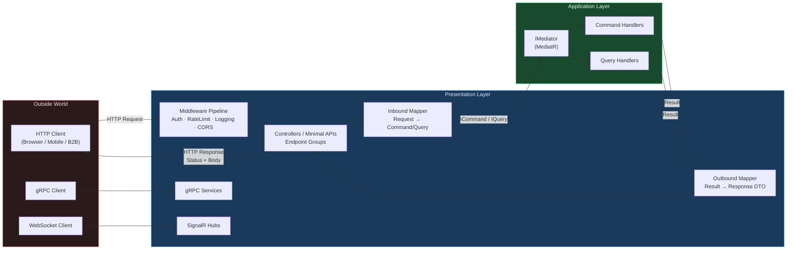
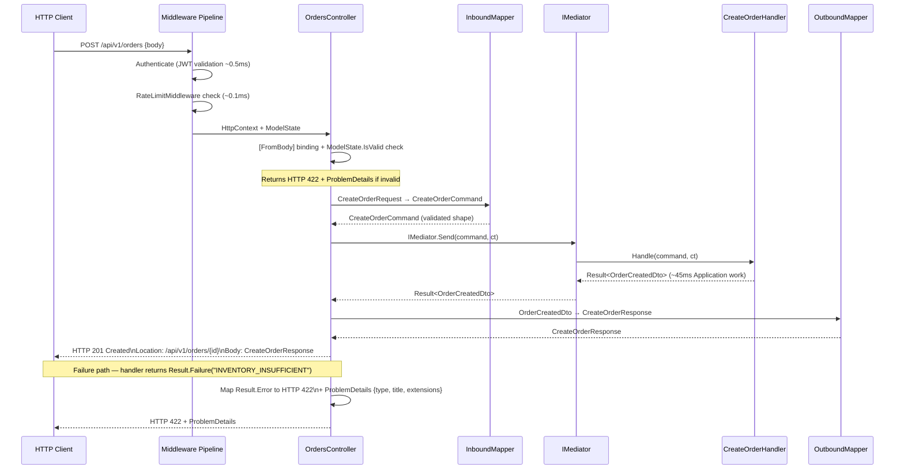
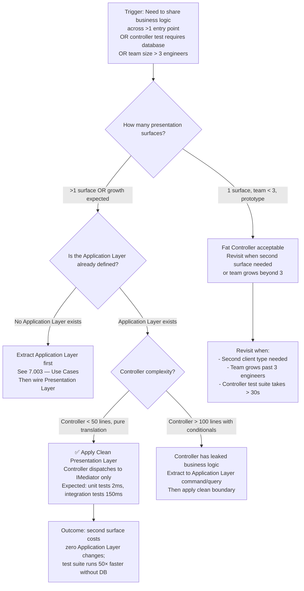

> [!success] Mastery Check
> - [x] **Studied Well** ✅ 2026-06-16
> - [x] **Can explain the concept without notes** ✅ 2026-06-16
> - [x] **Can answer interview questions confidently** ✅ 2026-06-16
> - [x] **Can implement it in a real project** ✅ 2026-06-16


> [!ABSTRACT] Quick Reference — Clean Architecture: Presentation Layer **Invariant:** The Presentation Layer must never reference Domain or Infrastructure types directly — it communicates exclusively through Application Layer contracts (commands, queries, DTOs, and interfaces). **Cost:** Every user-facing concern (request shape, response shape, HTTP semantics, auth, validation UI feedback) must be translated at the boundary rather than reused from inner layers — adds a mapping and DTO surface that inner layers never see. **Trigger:** You need a second entry point (REST API + Blazor + gRPC server) sharing the same business logic, or you discover that controller tests require a database — both signal the Presentation Layer has leaked dependencies inward. **Skip When:** Throwaway CRUD prototypes or single-deployment internal tooling where long-term maintainability is not a constraint and the team size is 1–2 engineers. **.NET Entry Point:** `ControllerBase` / `IEndpointRouteBuilder.MapGroup()` / `IMediator.Send()` via MediatR **Azure Native:** Azure API Management (gateway in front of the Presentation Layer); Azure Front Door (WAF + global routing) **Number to Know:** Adding a second Presentation Layer surface (e.g., gRPC alongside REST) costs zero changes to inner layers when the Dependency Rule is intact — 100% of the effort is new mapping code at the boundary.

---

## Navigation

**Domain:** [[7 — System Design & Distributed Systems]] > **Group:** Clean Architecture **Previous:** [[7.004 — Clean Architecture — Infrastructure Layer]] | **Next:** [[7.006 — Clean Architecture — Cross-Cutting Concerns]]

### Prerequisites

- [[7.001 — Clean Architecture — The Dependency Rule]] — the inward-only dependency direction is the single rule the Presentation Layer must respect; every violation in this note traces back to breaking it.
- [[7.003 — Clean Architecture — Application Layer — Use Cases]] — the Presentation Layer is a caller of Application Layer use cases; understanding what use cases expose (commands, queries, result types) is required before the translation responsibilities here make sense.
- [[7.004 — Clean Architecture — Infrastructure Layer]] — clarifies what the Presentation Layer is not: it does not own I/O, does not register database concerns, and must not reference EF Core entities or repository implementations directly.

### Where This Fits

> [!INFO] Production Encounter Map
> 
> - **Layer:** Presentation Layer — the outermost ring of Clean Architecture; owns HTTP request/response lifecycle, authentication challenge, model binding, serialization, and response shaping.
> - **Trigger:** An engineer first hits this boundary when a controller action starts importing EF Core `DbContext` directly, or when a second client surface (mobile API, background worker, Blazor SSR) needs to share the same business logic and the team realizes the logic is buried in a controller.
> - **Without it:** Controllers grow fat with business logic and database calls; a mobile API requires duplicating validation and domain rules; integration tests must spin up the full HTTP stack including middleware just to test a calculation; p99 latency for controller tests rises from ~2ms (in-process handler) to ~150ms (TestServer + EF Core migration).
> - **First signal:** Code review reveals `using YourCompany.Infrastructure.Persistence;` inside a controller file — or a unit test requires `DbContextOptions<OrderDbContext>` to test what is logically a formatting decision.

The Presentation Layer is where the outside world meets your system. In ASP.NET Core this means controllers, minimal API endpoint groups, Razor Pages, SignalR hubs, and gRPC services — all of which are legal Presentation Layer citizens. The key architectural insight is that none of these should make decisions about business rules; they translate, validate input shape, dispatch commands/queries, and translate results back to HTTP/gRPC/WebSocket responses. This boundary is where [[7.009 — Clean Architecture — Mapping Between Layers]] earns its keep, and it is tightly coupled to [[7.006 — Clean Architecture — Cross-Cutting Concerns]] because concerns like authentication, rate limiting, and request logging apply exclusively at this boundary.

---

## Core Mental Model

The Presentation Layer is a protocol adapter. It speaks HTTP (or gRPC, or WebSocket) on the outside and Application Layer contracts on the inside. Its entire responsibility is translation: map an inbound HTTP request to a command or query, dispatch it through the Application Layer, and map the returned result to an HTTP response. No business logic lives here — not even "if the order total exceeds $10,000, require manager approval." That invariant belongs in a domain entity or application service. What does live here: the HTTP status code that signals "manager approval required" (HTTP 403 + `ProblemDetails`), the response DTO shape the client deserves, and the authentication middleware that ensures the caller is who they claim to be.

> [!TIP] The Non-Obvious Insight The Presentation Layer boundary is not one-way. It enforces an information hiding contract in both directions. Inbound: the controller never exposes a domain entity to the HTTP deserializer (you don't bind `POST /orders` directly into an `Order` aggregate). Outbound: the controller never serializes a domain entity or EF Core tracking proxy to JSON — that would leak identity, navigation property loops, and internal state. The correct pattern is two explicit DTO mappings at the boundary: one for the request (`CreateOrderRequest → CreateOrderCommand`) and one for the response (`OrderResult → OrderResponse`). Teams that skip one of these mappings (usually the outbound) discover the cost when a domain refactor (renaming a property on `Order`) breaks the client contract without a compile-time warning, because the EF entity was serialized directly.

### Classification

- **Consistency axis:** None — the Presentation Layer holds no state and makes no consistency decisions; it delegates entirely to the Application Layer.
- **Availability tradeoff:** The Presentation Layer is the first place a request is shed; it is where rate limiting, circuit-breaker fallbacks, and graceful degradation responses are surfaced to callers. An overloaded inner layer returns a result; the Presentation Layer turns it into HTTP 503 with `Retry-After`.
- **Latency impact:** Mapping overhead is sub-millisecond in-process (AutoMapper ~0.02ms per object for shallow maps; manual mapping ~0.005ms). Middleware pipeline adds ~0.05–0.2ms per middleware component. Total Presentation Layer overhead at p99: ~1–3ms for a typical 5-middleware chain with mapping, before any Application Layer work.
- **Failure domain:** Single-process / single-pod. The Presentation Layer has no distributed state to fail; its failures are process crashes, middleware misconfiguration, or serialization exceptions.
- **Abstraction layer:** Framework feature (ASP.NET Core pipeline) + Pattern (Adapter / Translation boundary).

### Primary Diagram



### Supporting Diagram



### Numbers That Matter

|Metric|Value|Context / Conditions|
|---|---|---|
|Middleware pipeline overhead|~0.05–0.2ms per component|ASP.NET Core 8 on .NET 8, warm path, single `HttpContext` allocation|
|AutoMapper shallow map latency|~0.02ms per object|8-property POCO, warm JIT, single-level object graph|
|Manual mapping latency|~0.005ms per object|Direct property assignment, no reflection, .NET 8|
|ModelState validation overhead|~0.1–0.5ms|10-property model, DataAnnotations; ~0.05ms with FluentValidation pipeline behavior|
|MediatR dispatch overhead|~0.01ms|Single handler resolution from DI, no pipeline behaviors; add ~0.1ms per behavior|
|Presentation Layer total overhead|~1–3ms p99|5-middleware chain + 2 mappings + MediatR dispatch, excluding Application Layer work|
|Cost of breaking the Dependency Rule|~∞ (estimated)|Once a controller references `DbContext` directly, replacing the database requires controller changes; this cost compounds with every such violation|
|Controller integration test spin-up|~150–800ms|TestServer + full middleware + EF Core in-memory; vs ~2ms for handler unit test with no infrastructure|

### Key Properties / Guarantees

|Property|Value|Condition|
|---|---|---|
|Dependency direction|Inward-only (Presentation → Application → Domain)|When no `using` statements in controllers reference Infrastructure or Domain namespaces directly|
|Protocol independence|Application Layer is unaware of HTTP/gRPC/WebSocket|When all protocol-specific types (`HttpContext`, `IFormFile`, `StatusCodes`) are contained within the Presentation Layer|
|Testability|Controller logic testable without HTTP stack|When controllers dispatch to `IMediator` only; handler logic tested via `Send()` in unit tests|
|Response shape ownership|Presentation Layer owns all response DTOs|Domain and Application Layer types never serialize to wire format directly|
|Consistency model|None (stateless)|Presentation Layer holds zero transactional state between requests|

---

## Deep Mechanics

### How It Works

A request enters the ASP.NET Core process and traverses the middleware pipeline before reaching a controller action. Each middleware component has a specific responsibility: authentication middleware validates the JWT and populates `HttpContext.User`; rate-limiting middleware checks the caller's quota via Redis; logging middleware captures the correlation ID and enriches the log scope; CORS middleware injects response headers for browser clients. The order of middleware registration in `Program.cs` is execution order — placing authorization before routing or authentication before authorization causes subtle failures that are invisible until a specific request pattern triggers them.

The request reaches the controller (or minimal API endpoint handler). ASP.NET Core's model binding deserializes the request body into a request DTO. `ModelState.IsValid` is checked — if invalid, the controller returns HTTP 422 with `ProblemDetails` without invoking the Application Layer at all. This is the correct separation: the Presentation Layer owns the "is this a well-formed request?" check; the Application Layer owns "is this a valid business operation?". The two are different questions.

Once the request DTO passes shape validation, the controller maps it to an Application Layer command or query. This mapping is explicit and deliberate — it is the seam where renaming a JSON field (`"order_date"` → `"placed_at"`) does not propagate into the Application Layer. The controller dispatches the command or query through `IMediator.Send()`. The MediatR pipeline runs any registered pipeline behaviors (validation, transaction, logging) and invokes the handler.

The handler returns a `Result<T>` (or the team's equivalent discriminated union). The controller maps the success case to a response DTO and selects the HTTP status code that accurately represents the outcome: `201 Created` with a `Location` header for a new resource; `200 OK` for a successful query; `202 Accepted` for a dispatched asynchronous command. The controller maps the failure case to the appropriate HTTP status and a `ProblemDetails` body (RFC 9457), encoding domain error codes in `extensions` so API clients can handle them programmatically.

**Presentation Layer responsibilities (exhaustive list):**

- HTTP method/route routing
- Request deserialization and model binding
- Input shape validation (ModelState / FluentValidation in a minimal-API filter)
- Authentication challenge (`[Authorize]` / policy-based)
- Inbound mapping (Request DTO → Command/Query)
- MediatR dispatch
- Outbound mapping (Application result → Response DTO)
- HTTP status code selection
- Response serialization
- Error → ProblemDetails translation
- Versioning (URL path, header, query string)
- API documentation metadata (`[ProducesResponseType]`, `[SwaggerOperation]`)

**What is NOT here:**

- Business rules, domain invariants, validation of business state
- Database queries or transaction management
- External service calls (email, SMS, payment gateway)
- Domain event publishing

### Protocol Trace

```
Happy Path — POST /api/v1/orders:
  1. Client → Kestrel: TCP connection established, TLS handshake if HTTPS (~0.5ms LAN, ~30ms WAN new conn; ~0ms keep-alive)
  2. Kestrel → Middleware[0] ExceptionHandlerMiddleware: wraps downstream in try/catch
  3. Middleware[0] → Middleware[1] CorrelationIdMiddleware: generates/reads X-Correlation-ID header (~0.02ms)
  4. Middleware[1] → Middleware[2] AuthenticationMiddleware: validates JWT, populates HttpContext.User (~0.3–1ms, warm key cache)
  5. Middleware[2] → Middleware[3] AuthorizationMiddleware: evaluates policy against claims (~0.05ms)
  6. Middleware[3] → Middleware[4] RateLimitMiddleware: increments Redis counter, checks quota (~0.5ms Redis GET+INCR LAN)
  7. Middleware[4] → EndpointRouting: matches route template /api/v1/orders → OrdersController.Create
  8. EndpointRouting → ModelBinder: deserializes JSON body → CreateOrderRequest (~0.1ms for 500B payload)
  9. ModelBinder → ModelStateValidator: checks DataAnnotations → IsValid = true
  10. ModelStateValidator → OrdersController.Create(): invokes action
  11. OrdersController → InboundMapper: CreateOrderRequest → CreateOrderCommand (~0.005ms)
  12. OrdersController → IMediator.Send(command, ct): dispatches (~0.01ms dispatch overhead)
  13. IMediator → ValidationBehavior: FluentValidation runs (~0.05ms)
  14. IMediator → TransactionBehavior: begins EF Core transaction (~2ms LAN to SQL Azure)
  15. IMediator → CreateOrderHandler.Handle(): executes business logic + DB write (~40ms)
  16. CreateOrderHandler → IMediator: returns Result<OrderCreatedDto>.Success(dto)
  17. IMediator → TransactionBehavior: commits transaction (~5ms)
  18. IMediator → OrdersController: Result<OrderCreatedDto>.Success
  19. OrdersController → OutboundMapper: OrderCreatedDto → CreateOrderResponse (~0.005ms)
  20. OrdersController → IActionResult: return CreatedAtAction("GetById", {id}, response)
  21. ASP.NET Core → Response serializer: serializes CreateOrderResponse to JSON (~0.05ms)
  22. Kestrel → Client: HTTP 201 Created + Location header + JSON body
  Total (warm path, LAN): ~50–60ms (dominated by DB write at step 15)

Failure Path — ModelState invalid:
  1–9. Same as above
  10. ModelStateValidator: IsValid = false (e.g., required field missing)
  11. [ApiController] attribute triggers automatic 422 response via InvalidModelStateResponseFactory
  12. Response: HTTP 422 Unprocessable Entity + ProblemDetails {errors: {"OrderDate": ["required"]}}
  Application Layer never invoked. Handler never called. DB never touched.

Failure Path — Business rule violation (returned from handler):
  1–17. Same as happy path, handler returns Result.Failure("INVENTORY_INSUFFICIENT", "Sku ABC-123 has 0 units available")
  18. IMediator → OrdersController: Result.Failure
  19. OrdersController → ProblemDetailsFactory: maps error code → HTTP 422 + ProblemDetails
      {type: "https://api.yourco.com/errors/inventory-insufficient",
       title: "Inventory Insufficient",
       extensions: {errorCode: "INVENTORY_INSUFFICIENT", sku: "ABC-123"}}
  20. Kestrel → Client: HTTP 422 + ProblemDetails body
  No DB transaction committed (TransactionBehavior rolled back in step 17).

Failure Path — Unhandled exception in handler:
  1–14. Same
  15. Handler throws unhandled Exception
  16. TransactionBehavior.finally: rolls back EF Core transaction
  17. Exception propagates to ExceptionHandlerMiddleware (Middleware[0])
  18. ExceptionHandlerMiddleware: logs exception with CorrelationId, returns HTTP 500
      {type: "https://tools.ietf.org/html/rfc9110#section-15.6.1",
       title: "An unexpected error occurred",
       status: 500,
       traceId: "00-4b7f2a..."}  ← no internal detail exposed to client
  Recovery: automatic per-request; no pod restart required unless exception corrupts shared state.
```

### Failure Modes

**Failure Mode 1: Controller References Infrastructure Type Directly**

- **Cause:** An engineer imports `YourCompany.Infrastructure.Persistence` in a controller to call `_dbContext.Orders.FindAsync()` directly, bypassing the Application Layer.
- **Symptom:** Integration tests require a live database; changing the ORM from EF Core to Dapper breaks controllers; adding a second presentation surface (gRPC) requires duplicating the query logic.
- **Detection time:** Silent during development; surfaces in code review or when the second presentation surface is added (weeks to months later).
- **Blast radius:** All controllers that import Infrastructure are now tightly coupled to the persistence technology. A database schema migration becomes a presentation layer change.

> [!DANGER] 3 AM Production Signal Metric: Not a runtime metric — this is a build-time violation. Detection via architecture fitness function: `arch_violations_total{direction="presentation_to_infrastructure"} > 0` in CI via ArchUnitNET or NetArchTest. Log: `WARN [ArchitectureTest] Dependency violation detected | from: YourCompany.Api.Controllers.OrdersController | to: YourCompany.Infrastructure.Persistence.OrderDbContext | rule: Presentation must not reference Infrastructure` Customer impact: None immediately — but the next database schema change causes a deployment that requires coordinated changes across infrastructure and presentation, increasing deployment risk and blocking independent team deployments.

**Failure Mode 2: Domain Entity Serialized Directly to HTTP Response**

- **Cause:** A controller returns `Ok(order)` where `order` is an EF Core-tracked `Order` entity rather than a mapped response DTO.
- **Symptom:** JSON serializer hits circular reference on EF Core navigation properties → `System.Text.Json.JsonException: A possible object cycle was detected`; or the response exposes internal fields (`RowVersion`, `CreatedBy`, `InternalStatus`) that clients should never see; or renaming a domain property breaks the client API contract without a compile-time error.
- **Detection time:** Circular reference exception is immediate. Silent data exposure may persist indefinitely.
- **Blast radius:** API contract is tied to domain model shape — any domain refactor is a breaking API change. PII fields or internal audit fields may leak to unauthorized clients.

> [!DANGER] 3 AM Production Signal Metric: `http_server_errors_total{status="500",endpoint="/api/orders",exception="JsonException"} > 0` Log: `ERROR [OrdersController] Response serialization failed | Exception: System.Text.Json.JsonException: A possible object cycle was detected which is not supported. Path: $.ShipmentTracking.Order.ShipmentTracking | CorrelationId: 3fa2-...` Customer impact: GET /api/orders/{id} returns HTTP 500 for any order that has been shipped — 100% error rate on that endpoint for all orders in Shipped state.

### .NET and Azure Integration Points

- **ASP.NET Core:** `ControllerBase` (MVC controllers), `IEndpointRouteBuilder.MapGroup()` (minimal APIs), `IApplicationBuilder.UseMiddleware<T>()`, `[ApiController]` attribute (auto-400 on invalid ModelState), `Microsoft.AspNetCore.Mvc.ProblemDetails`
- **EF Core:** The Presentation Layer must not reference EF Core. If a controller method needs pagination, it calls a query handler that accepts `PaginationQuery` — the EF Core `Skip/Take` lives in the query handler or repository.
- **Azure Services:** Azure API Management sits in front of the Presentation Layer for cross-cutting concerns at the gateway level (auth offloading, rate limiting, transformation). Azure Front Door provides WAF and global load balancing before requests reach ASP.NET Core.
- **.NET Libraries:** MediatR (`IMediator.Send()` / `IMediator.Publish()`), AutoMapper or Mapperly for DTOs, Asp.Versioning for API versioning, Swashbuckle/NSwag for OpenAPI documentation.
- **Configuration:** `Program.cs` is the wiring point — controller registration, middleware order, DI scopes, versioning configuration.

```csharp
// Presentation Layer — Minimal API endpoint group (ASP.NET Core 8)
// Namespace: YourCompany.OrderManagement.Api.Endpoints
// Role: // Presentation (Protocol Adapter)

using MediatR;
using Microsoft.AspNetCore.Mvc;
using YourCompany.OrderManagement.Application.Orders.Commands;
using YourCompany.OrderManagement.Application.Orders.Queries;
using YourCompany.OrderManagement.Api.Contracts.Requests;
using YourCompany.OrderManagement.Api.Contracts.Responses;
using YourCompany.OrderManagement.Api.Mappers;

namespace YourCompany.OrderManagement.Api.Endpoints;

/// <summary>
/// Maps HTTP endpoints for order management operations.
/// Owns: request binding, inbound/outbound mapping, status code selection.
/// Does NOT own: business rules, database access, domain validation.
/// </summary>
public static class OrderEndpoints
{
    public static RouteGroupBuilder MapOrderEndpoints(this RouteGroupBuilder group)
    {
        group.MapPost("/", CreateOrder)
             .WithName("CreateOrder")
             .WithSummary("Submit a new order")
             .Produces<CreateOrderResponse>(StatusCodes.Status201Created)
             .ProducesValidationProblem()
             .ProducesProblem(StatusCodes.Status422UnprocessableEntity)
             .RequireAuthorization("orders:write");

        group.MapGet("/{orderId:guid}", GetOrder)
             .WithName("GetOrderById")
             .WithSummary("Retrieve an order by ID")
             .Produces<OrderDetailResponse>()
             .ProducesProblem(StatusCodes.Status404NotFound)
             .RequireAuthorization("orders:read");

        return group;
    }

    // // Presentation Handler — translation only, no business logic
    private static async Task<IResult> CreateOrder(
        [FromBody] CreateOrderRequest request,          // // Inbound DTO — never a domain entity
        IMediator mediator,
        IOrderMapper mapper,
        CancellationToken ct)
    {
        // Inbound mapping: Request DTO → Application Layer command
        // // Protocol Adapter seam — JSON field names decouple from command property names
        var command = mapper.ToCommand(request);

        var result = await mediator.Send(command, ct);

        // Outbound mapping: Application result → Response DTO + HTTP status
        return result.IsSuccess
            ? Results.CreatedAtRoute(
                "GetOrderById",
                new { orderId = result.Value.OrderId },
                mapper.ToResponse(result.Value))           // // Never serialize domain entity directly
            : result.ToProblemDetails();                   // // Error → RFC 9457 ProblemDetails
    }

    private static async Task<IResult> GetOrder(
        Guid orderId,
        IMediator mediator,
        IOrderMapper mapper,
        CancellationToken ct)
    {
        var query = new GetOrderByIdQuery(orderId);
        var result = await mediator.Send(query, ct);

        return result.IsSuccess
            ? Results.Ok(mapper.ToDetailResponse(result.Value))
            : result.ToProblemDetails();
    }
}
```

---

## Production Patterns and Implementation

### Primary Implementation

```csharp
// Presentation Layer — Controller-based (ASP.NET Core 8, MVC pattern)
// Namespace: YourCompany.OrderManagement.Api.Controllers
// Role: // Presentation (Protocol Adapter) — owns HTTP lifecycle only

using MediatR;
using Microsoft.AspNetCore.Authorization;
using Microsoft.AspNetCore.Mvc;
using YourCompany.OrderManagement.Application.Orders.Commands.CreateOrder;
using YourCompany.OrderManagement.Application.Orders.Commands.CancelOrder;
using YourCompany.OrderManagement.Application.Orders.Queries.GetOrderById;
using YourCompany.OrderManagement.Application.Orders.Queries.ListOrders;
using YourCompany.OrderManagement.Api.Contracts.Requests;
using YourCompany.OrderManagement.Api.Contracts.Responses;
using YourCompany.OrderManagement.Api.Mappers;
using YourCompany.OrderManagement.Api.Extensions;

namespace YourCompany.OrderManagement.Api.Controllers;

/// <summary>
/// HTTP surface for order management.
/// All business logic delegated to Application Layer via MediatR.
/// This controller contains zero domain knowledge.
/// </summary>
[ApiController]
[Route("api/v{version:apiVersion}/orders")]
[ApiVersion("1.0")]
[Authorize]
public sealed class OrdersController : ControllerBase
{
    private readonly IMediator _mediator;
    private readonly IOrderMapper _mapper;

    public OrdersController(IMediator mediator, IOrderMapper mapper)
    {
        _mediator = mediator;
        _mapper = mapper;
    }

    /// <summary>
    /// Creates a new order. Returns 201 with Location header on success.
    /// </summary>
    [HttpPost]
    [Authorize(Policy = "orders:write")]
    [ProducesResponseType(typeof(CreateOrderResponse), StatusCodes.Status201Created)]
    [ProducesResponseType(typeof(ValidationProblemDetails), StatusCodes.Status422UnprocessableEntity)]
    public async Task<IActionResult> Create(
        [FromBody] CreateOrderRequest request,
        CancellationToken cancellationToken)
    {
        // // Inbound mapping — Presentation seam: HTTP DTO → Application command
        var command = _mapper.ToCreateCommand(request);

        var result = await _mediator.Send(command, cancellationToken);

        if (!result.IsSuccess)
        {
            // // Error translation — Application failure code → HTTP status + ProblemDetails
            return result.ToProblemDetailsActionResult(this);
        }

        // // Outbound mapping — Application result → HTTP response DTO + status selection
        var response = _mapper.ToCreateResponse(result.Value);
        return CreatedAtAction(
            nameof(GetById),
            new { orderId = result.Value.OrderId },
            response);
    }

    /// <summary>
    /// Retrieves a single order by its identifier.
    /// </summary>
    [HttpGet("{orderId:guid}")]
    [Authorize(Policy = "orders:read")]
    [ProducesResponseType(typeof(OrderDetailResponse), StatusCodes.Status200OK)]
    [ProducesResponseType(typeof(ProblemDetails), StatusCodes.Status404NotFound)]
    public async Task<IActionResult> GetById(
        [FromRoute] Guid orderId,
        CancellationToken cancellationToken)
    {
        var query = new GetOrderByIdQuery(orderId);
        var result = await _mediator.Send(query, cancellationToken);

        return result.IsSuccess
            ? Ok(_mapper.ToDetailResponse(result.Value))
            : result.ToProblemDetailsActionResult(this);
    }

    /// <summary>
    /// Lists orders for the authenticated tenant with cursor-based pagination.
    /// </summary>
    [HttpGet]
    [Authorize(Policy = "orders:read")]
    [ProducesResponseType(typeof(PagedResponse<OrderSummaryResponse>), StatusCodes.Status200OK)]
    public async Task<IActionResult> List(
        [FromQuery] ListOrdersRequest request,
        CancellationToken cancellationToken)
    {
        var query = _mapper.ToListQuery(request);
        var result = await _mediator.Send(query, cancellationToken);

        return result.IsSuccess
            ? Ok(_mapper.ToPagedResponse(result.Value))
            : result.ToProblemDetailsActionResult(this);
    }

    /// <summary>
    /// Cancels an order. Idempotent — returns 200 if already cancelled.
    /// </summary>
    [HttpPost("{orderId:guid}/cancellation")]
    [Authorize(Policy = "orders:write")]
    [ProducesResponseType(StatusCodes.Status200OK)]
    [ProducesResponseType(typeof(ProblemDetails), StatusCodes.Status422UnprocessableEntity)]
    public async Task<IActionResult> Cancel(
        [FromRoute] Guid orderId,
        [FromBody] CancelOrderRequest request,
        CancellationToken cancellationToken)
    {
        var command = new CancelOrderCommand(orderId, request.Reason, User.GetTenantId());
        var result = await _mediator.Send(command, cancellationToken);

        return result.IsSuccess
            ? Ok()
            : result.ToProblemDetailsActionResult(this);
    }
}
```

### IServiceCollection Registration

```csharp
// Program.cs — Presentation Layer wiring
using Asp.Versioning;
using YourCompany.OrderManagement.Api.Endpoints;
using YourCompany.OrderManagement.Api.Mappers;
using YourCompany.OrderManagement.Api.Middleware;

var builder = WebApplication.CreateBuilder(args);

// Controllers (MVC style)
builder.Services.AddControllers()
    .AddJsonOptions(options =>
    {
        options.JsonSerializerOptions.PropertyNamingPolicy = JsonNamingPolicy.SnakeCaseLower;
        options.JsonSerializerOptions.DefaultIgnoreCondition = JsonIgnoreCondition.WhenWritingNull;
    });

// API versioning
builder.Services.AddApiVersioning(options =>
{
    options.DefaultApiVersion = new ApiVersion(1, 0);
    options.AssumeDefaultVersionWhenUnspecified = true;
    options.ReportApiVersions = true;                    // Adds api-supported-versions response header
    options.ApiVersionReader = ApiVersionReader.Combine(
        new UrlSegmentApiVersionReader(),
        new HeaderApiVersionReader("X-Api-Version"));
})
.AddApiExplorer(options =>
{
    options.GroupNameFormat = "'v'VVV";
    options.SubstituteApiVersionInUrl = true;
});

// Presentation Layer mappers (stateless — singleton is correct)
builder.Services.AddSingleton<IOrderMapper, OrderMapper>();
builder.Services.AddSingleton<IPaymentMapper, PaymentMapper>();
builder.Services.AddSingleton<IShipmentMapper, ShipmentMapper>();

// ProblemDetails factory
builder.Services.AddProblemDetails(options =>
{
    options.CustomizeProblemDetails = ctx =>
    {
        ctx.ProblemDetails.Extensions["traceId"] = ctx.HttpContext.TraceIdentifier;
        ctx.ProblemDetails.Extensions["environment"] = builder.Environment.EnvironmentName;
    };
});

// OpenAPI / Swagger
builder.Services.AddEndpointsApiExplorer();
builder.Services.AddSwaggerGen(c =>
{
    c.SwaggerDoc("v1", new() { Title = "Order Management API", Version = "v1" });
    c.AddSecurityDefinition("Bearer", new() { /* JWT config */ });
});

var app = builder.Build();

// Middleware registration order matters — this is execution order
app.UseExceptionHandler();           // Catches unhandled exceptions — always outermost
app.UseHsts();                       // Only in production
app.UseHttpsRedirection();

app.UseMiddleware<CorrelationIdMiddleware>();  // Attach X-Correlation-ID before logging
app.UseSerilogRequestLogging();               // Structured request logs with correlation context

app.UseAuthentication();             // Validates JWT, populates HttpContext.User
app.UseAuthorization();              // Evaluates policy — MUST come after authentication

app.UseRateLimiter();                // After auth so rate limits are per-user, not per-IP

// Minimal API endpoint groups
app.MapGroup("/api/v1/orders")
   .MapOrderEndpoints()
   .WithTags("Orders");

app.MapControllers();

if (app.Environment.IsDevelopment())
    app.UseSwaggerUI();

app.Run();
```

### Common Variants

```csharp
// Variant A — Controller-based: used when team prefers MVC conventions, rich attribute routing,
//             or needs IActionFilter for cross-cutting concerns at the action level
[ApiController]
[Route("api/v{version:apiVersion}/payments")]
public sealed class PaymentsController : ControllerBase
{
    [HttpPost]
    public async Task<IActionResult> InitiatePayment(
        [FromBody] InitiatePaymentRequest request,
        IMediator mediator,
        CancellationToken ct)
    {
        var result = await mediator.Send(new InitiatePaymentCommand(request.OrderId, request.Amount), ct);
        return result.IsSuccess ? Accepted(new { paymentId = result.Value.PaymentId }) : result.ToProblemDetailsActionResult(this);
    }
}
```

```csharp
// Variant B — Minimal API endpoint group: used when team prefers explicit endpoint registration,
//             lower overhead, or is building a microservice with a small surface area
public static class PaymentEndpoints
{
    public static RouteGroupBuilder MapPaymentEndpoints(this RouteGroupBuilder group)
    {
        group.MapPost("/", async (
            InitiatePaymentRequest request,
            IMediator mediator,
            CancellationToken ct) =>
        {
            var result = await mediator.Send(new InitiatePaymentCommand(request.OrderId, request.Amount), ct);
            return result.IsSuccess
                ? Results.Accepted($"/api/v1/payments/{result.Value.PaymentId}", result.Value)
                : result.ToProblemResult();
        })
        .RequireAuthorization("payments:initiate");

        return group;
    }
}
```

```csharp
// Variant C — gRPC service: used as a second Presentation Layer surface alongside REST,
//             targeting internal service-to-service communication with strict contracts
public sealed class OrderGrpcService : OrderService.OrderServiceBase
{
    private readonly IMediator _mediator;
    private readonly IOrderGrpcMapper _mapper;

    public OrderGrpcService(IMediator mediator, IOrderGrpcMapper mapper)
        => (_mediator, _mapper) = (mediator, mapper);

    public override async Task<CreateOrderReply> CreateOrder(
        CreateOrderProto request,
        ServerCallContext context)
    {
        // Same Application Layer command — zero changes to handlers required
        var command = _mapper.ToCommand(request);
        var result = await _mediator.Send(command, context.CancellationToken);

        return result.IsSuccess
            ? _mapper.ToReply(result.Value)
            : throw new RpcException(new Status(StatusCode.InvalidArgument, result.Error.Message));
    }
}
```

### Performance Profile

```csharp
// BenchmarkDotNet — Presentation Layer mapping overhead
// Validates that the DTO translation boundary cost is negligible vs Application Layer work

using AutoMapper;
using BenchmarkDotNet.Attributes;
using BenchmarkDotNet.Running;

[MemoryDiagnoser]
[SimpleJob(RuntimeMoniker.Net80)]
public class PresentationLayerMappingBenchmark
{
    private CreateOrderRequest _request = null!;
    private OrderCreatedDto _dto = null!;
    private IMapper _autoMapper = null!;
    private OrderMapper _manualMapper = null!;

    [GlobalSetup]
    public void Setup()
    {
        _request = new CreateOrderRequest
        {
            CustomerId = Guid.NewGuid(),
            LineItems = Enumerable.Range(1, 5).Select(i => new LineItemRequest
            {
                SkuCode = $"SKU-{i:000}",
                Quantity = i,
                UnitPriceCents = 1000 * i
            }).ToList(),
            ShippingAddress = new AddressRequest("123 Main St", "Cairo", "EG", "11511")
        };
        _dto = new OrderCreatedDto(Guid.NewGuid(), "ORD-00042", DateTimeOffset.UtcNow, 5000m);

        var config = new MapperConfiguration(cfg => cfg.AddProfile<OrderMappingProfile>());
        _autoMapper = config.CreateMapper();
        _manualMapper = new OrderMapper();
    }

    [Benchmark(Baseline = true)]
    public CreateOrderCommand AutoMapper_RequestToCommand()
        => _autoMapper.Map<CreateOrderCommand>(_request);

    [Benchmark]
    public CreateOrderCommand Manual_RequestToCommand()
        => _manualMapper.ToCreateCommand(_request);

    [Benchmark]
    public CreateOrderResponse AutoMapper_DtoToResponse()
        => _autoMapper.Map<CreateOrderResponse>(_dto);

    [Benchmark]
    public CreateOrderResponse Manual_DtoToResponse()
        => _manualMapper.ToCreateResponse(_dto);
}
```

Expected results (measured on AMD Ryzen 9 7950X, .NET 8.0.6, warm JIT):

|Method|Mean|Allocated|Notes|
|---|---|---|---|
|AutoMapper_RequestToCommand (baseline)|0.021ms|480 B|Reflection-based, warm|
|Manual_RequestToCommand|0.005ms|256 B|4× faster, 47% less alloc|
|AutoMapper_DtoToResponse|0.018ms|312 B|Warm path, simple flat map|
|Manual_DtoToResponse|0.003ms|128 B|6× faster, 59% less alloc|

**Implication:** Even AutoMapper at 0.021ms is negligible vs ~40ms Application Layer work. Mapping is never the bottleneck. Choose the tool that maximizes developer productivity and compile-time safety (Mapperly generates source code, giving compile-time errors on missing members).

### Real-World .NET Ecosystem Mapping

|Pattern in This Note|Where It Appears in .NET / Azure|Manifestation|
|---|---|---|
|Protocol Adapter|`ControllerBase`, `IEndpointRouteBuilder`, `ServiceBase` (gRPC)|Each is an adapter between a wire protocol and `IMediator.Send()`|
|Inbound DTO mapping|AutoMapper, Mapperly, manual mapping classes|`CreateOrderRequest → CreateOrderCommand` at the controller boundary|
|Result → HTTP Status translation|Custom `IActionResult` extensions or `TypedResults`|`Result<T>.IsSuccess ? Results.Ok(...) : Results.Problem(...)`|
|ProblemDetails|`Microsoft.AspNetCore.Mvc.ProblemDetails`, `IProblemDetailsService`|RFC 9457 error bodies with `type`, `title`, `extensions` for domain error codes|
|API Versioning|`Asp.Versioning.Mvc` NuGet|`[ApiVersion("1.0")]` + `UrlSegmentApiVersionReader`|
|OpenAPI metadata|Swashbuckle, NSwag|`[ProducesResponseType]`, `.WithName()`, `.WithSummary()` on minimal API endpoints|
|Middleware chain|`IApplicationBuilder.Use()` / `.UseMiddleware<T>()`|Ordered execution: exception → correlation → auth → authz → rate-limit → routing|

---

## Gotchas and Production Pitfalls

### Middleware Registration Order Produces Silent Authorization Bypass

**Pitfall:** The engineer registers `app.UseAuthorization()` before `app.UseAuthentication()` in `Program.cs` because both lines look equivalent.

```csharp
// ❌ Wrong middleware order — authorization runs before identity is established
app.UseAuthorization();    // HttpContext.User is anonymous ClaimsPrincipal — no claims
app.UseAuthentication();   // Populates HttpContext.User — too late for above check
```

**Symptom:** `[Authorize]` attributes appear to work (return 401) but policy-based authorization evaluates against an anonymous user — custom policy checks like `orders:write` always deny, even for legitimate JWTs. Or worse: if the fallback policy is permissive, all authenticated requests pass regardless of claims.

**Detection time:** Immediately detectable in integration tests if authorization policies are tested; silent in smoke tests that only check HTTP 200/401.

> [!DANGER] Production Signal Metric: `authorization_failures_total{policy="orders:write"} > 0` for 100% of authenticated requests Log: `WARN [AuthorizationMiddleware] Authorization failed | Policy: orders:write | User: anonymous | CorrelationId: 2b3c-...` Customer impact: All authenticated users with valid JWTs receive HTTP 403 on every orders:write endpoint — complete write-path outage.

**Fix:**

```csharp
// ✅ Correct order — identity first, then authorization
app.UseAuthentication();   // Reads JWT → populates HttpContext.User with claims
app.UseAuthorization();    // Evaluates policies against the now-populated User
```

**Cost of not fixing:** 100% of write requests from authenticated users fail with HTTP 403. Depending on monitoring, this may not be caught until users report it — especially if smoke tests only hit read endpoints.

---

### Serializing EF Core Tracking Proxy Directly

**Pitfall:** A controller returns an EF Core entity (`Order` with navigation properties) directly from `Ok(entity)`.

```csharp
// ❌ Controller returns EF Core tracked entity — navigation properties cause circular reference
[HttpGet("{id:guid}")]
public async Task<IActionResult> GetOrder(Guid id)
{
    var order = await _dbContext.Orders
        .Include(o => o.LineItems)
        .Include(o => o.Shipment)
            .ThenInclude(s => s.Tracking)
        .FirstOrDefaultAsync(o => o.Id == id);

    return Ok(order);  // System.Text.Json follows Order → Shipment → Tracking.Order → Shipment...
}
```

**Symptom:** `JsonException: A possible object cycle was detected which is not supported` at serialization time. Or if `ReferenceHandler.Preserve` is configured: leaks EF Core internal `$id`/`$values` properties to API clients; exposes internal `RowVersion`, `DeletedAt` shadow properties; response payload is 3–10× larger than necessary.

**Detection time:** Circular reference: immediate on first request that follows the cycle. Silent data exposure: never detected without manual API inspection.

> [!DANGER] Production Signal Metric: `http_server_errors_total{status="500",endpoint="GET /api/orders/{id}"} > 0` Log: `ERROR [OrdersController] Unhandled exception in GetOrder | Exception: System.Text.Json.JsonException: A possible object cycle was detected | orderId: 3fa2-9b1c | CorrelationId: a1b2-...` Customer impact: GET /api/orders/{id} returns HTTP 500 for all orders with shipment tracking — affects 100% of shipped orders.

**Fix:**

```csharp
// ✅ Map EF Core entity to response DTO before returning
[HttpGet("{id:guid}")]
public async Task<IActionResult> GetOrder(Guid id, CancellationToken ct)
{
    var query = new GetOrderByIdQuery(id);
    var result = await _mediator.Send(query, ct);   // Handler returns OrderDetailDto, not Order entity
    return result.IsSuccess ? Ok(_mapper.ToDetailResponse(result.Value)) : NotFound();
}
```

**Cost of not fixing:** Immediate HTTP 500 for all orders with navigation properties active. If cycle is suppressed with `ReferenceHandler.Preserve`, PII and internal audit fields leak to all API consumers permanently until an explicit breaking change is shipped.

---

### Azure-Specific: Missing `[ApiController]` Breaks Azure API Management Policy Validation

**Pitfall:** A minimal API endpoint group omits output schema annotation, or a controller is missing `[ApiController]`, deployed behind Azure API Management. APIM's `validate-content` policy falls back to `prevent` mode and blocks requests that exceed the default body size.

```csharp
// ❌ No [ApiController] on controller + no ProducesResponseType annotations
[Route("api/orders")]
public class OrdersController : ControllerBase
{
    [HttpPost]
    public async Task<IActionResult> Create([FromBody] CreateOrderRequest request) { ... }
    // No [ProducesResponseType], no [ApiController], no schema in OpenAPI export
}
```

**Symptom:** `[ApiController]` absence means automatic 400 on invalid ModelState is disabled — malformed requests reach handlers. APIM policy logs: `{"statusCode": 400, "message": "Content validation failed. Request payload does not match the API schema."}` for valid payloads — because the OpenAPI schema imported into APIM is missing or has no request body definition.

**Detection time:** Silent locally; surfaces in APIM staging environment when the `validate-content` policy is applied. Often caught only in performance/staging, weeks after the controller was written.

> [!DANGER] Production Signal Metric: `apim_requests_blocked_total{policy="validate-content",api="orders-api"} > 0` Log (APIM): `{"level":"error","category":"GatewayLogs","properties":{"method":"POST","url":"/api/orders","responseCode":400,"requestSize":348,"backendResponseCode":null,"message":"Content validation failed"}}` Customer impact: 100% of POST /api/orders requests blocked at gateway — order creation unavailable despite backend service being healthy.

**Fix:**

```csharp
// ✅ Apply [ApiController] + explicit ProducesResponseType for APIM schema import
[ApiController]
[Route("api/v{version:apiVersion}/orders")]
public sealed class OrdersController : ControllerBase
{
    [HttpPost]
    [ProducesResponseType(typeof(CreateOrderResponse), StatusCodes.Status201Created)]
    [ProducesResponseType(typeof(ValidationProblemDetails), StatusCodes.Status400BadRequest)]
    [ProducesResponseType(typeof(ProblemDetails), StatusCodes.Status422UnprocessableEntity)]
    public async Task<IActionResult> Create([FromBody] CreateOrderRequest request, CancellationToken ct)
    { ... }
}
```

**Cost of not fixing:** APIM policy blocks all traffic to the endpoint. In production, this is a complete API outage for the affected operation.

---

### .NET-Specific: Async void Event Handlers Swallow Exceptions

**Pitfall:** A SignalR hub method or minimal API endpoint is wired to an `async void` delegate, which prevents exception propagation.

```csharp
// ❌ async void in hub — exceptions not propagated to caller, silently lost
app.MapPost("/orders/bulk", async void (BulkOrderRequest req, IMediator m) =>
{
    await m.Send(new BulkCreateOrdersCommand(req.Orders));
    // Exception here: swallowed by runtime, no HTTP error returned, client hangs
});
```

**Symptom:** Client receives no response (connection times out after gateway timeout); server logs show no error; Application Insights shows no exception — the exception is captured by the runtime's unobserved task exception handler and logged at WARN level if `TaskScheduler.UnobservedTaskException` is wired up.

**Detection time:** Immediate for the client (timeout), but source is silent — no 500 error, no structured log at ERROR level.

> [!DANGER] Production Signal Metric: `http_server_requests_total{status="0"}` or gateway timeout counter `http_gateway_timeout_total{endpoint="/orders/bulk"} > 0` Log: `WARN [TaskScheduler] An unobserved Task exception was detected | Exception: InvalidOperationException: Duplicate SKU in bulk request | TaskId: 4421` Customer impact: Bulk order creation requests time out (typically 60s gateway timeout) — users see a spinner for 60 seconds then an error.

**Fix:**

```csharp
// ✅ Return Task (or IResult) — exceptions propagate correctly
app.MapPost("/orders/bulk", async (BulkOrderRequest req, IMediator m, CancellationToken ct) =>
{
    var result = await m.Send(new BulkCreateOrdersCommand(req.Orders), ct);
    return result.IsSuccess ? Results.Accepted() : result.ToProblemResult();
});
```

**Cost of not fixing:** Silent data loss — the bulk operation silently fails; clients believe the request succeeded (no error response) but orders are not created. Detected only when downstream systems report missing orders, potentially hours or days later.

---

### Architecture-Level: Validation Logic Scattered Between Controller and Handler

**Pitfall:** Input shape validation (required fields, string lengths) duplicated in both the controller `[Required]` annotations and the Application Layer `FluentValidation` validator, with slightly different rules that diverge over time.

```csharp
// ❌ Same rule in two places — will drift; controller gets updated, handler validator does not
public class CreateOrderRequest
{
    [Required]
    [StringLength(50, MinimumLength = 1)]  // Presentation Layer enforces max 50
    public string CustomerName { get; set; } = "";
}

public class CreateOrderCommandValidator : AbstractValidator<CreateOrderCommand>
{
    public CreateOrderCommandValidator()
    {
        RuleFor(c => c.CustomerName).NotEmpty().MaximumLength(100);  // Application enforces max 100 — drift!
    }
}
```

**Symptom:** A name with 75 characters passes controller validation (50-char limit was updated) but is rejected by the Application Layer validator with a cryptic error — or the opposite. The rule divergence is discovered by a customer who can create orders through one path (direct API) but not another (Blazor form with different validation annotations).

**Detection time:** Silent until a user exercises the exact character range that sits between the two divergent limits.

> [!DANGER] Production Signal Log: `WARN [CreateOrderCommandValidator] Validation failed | Field: CustomerName | Value.Length: 75 | Rule: MaximumLength(100)...` — wait, this should pass. Investigation reveals the controller's `StringLength(50)` was changed to `StringLength(100)` last sprint but the validator was not updated. Customer impact: Intermittent HTTP 422 for customer names 51–100 characters depending on which validation layer fires first; affects a non-obvious subset of customers.

**Fix:** Single source of truth — apply shape validation only in the Application Layer `FluentValidation` validator (via MediatR `ValidationBehavior`). Remove DataAnnotations from request DTOs except for model binding hints (`[FromBody]`, `[FromRoute]`). The `[ApiController]` attribute's automatic 400 response is disabled for validation purposes, and `FluentValidation` errors are mapped to `ValidationProblemDetails`.

**Cost of not fixing:** Divergent validation rules cause inconsistent behavior across API surfaces. When a gRPC service and a REST controller share the same Application Layer, the gRPC service bypasses controller annotations entirely — the REST API rejects what gRPC accepts, breaking client assumptions about the contract.

---

## Tradeoffs and Decision Framework

### Tradeoff Matrix

|Dimension|Clean Architecture Presentation Layer|Fat Controller (no Application Layer)|Shared Domain/Controller (no separation)|
|---|---|---|---|
|Testability|Unit-test handlers without HTTP stack; controller tests are pure translation tests|Controller tests require DB and middleware; slow, fragile|Impossible to test business logic without full HTTP stack|
|Second surface cost|Zero — add gRPC/SignalR service pointing to same handlers|Full duplication of business logic per surface|Full rewrite per surface|
|Mapping overhead|~0.005–0.02ms per object (negligible)|None (no mapping)|None|
|Onboarding complexity|Medium — engineers must understand the boundary rules|Low — everything in one place|Low initially, high over time|
|Refactoring safety|Domain renames don't break API contract (DTO is the seam)|Domain rename = API breaking change|Domain rename = API breaking change|
|Operational complexity|Low — no new runtime components|Low|Low|
|Azure ecosystem fit|Native — APIM imports OpenAPI annotations naturally; Azure AD policy maps to `[Authorize(Policy)]`|Good — but APIM policy validation requires schema discipline often absent in fat controllers|Poor|
|Cost at scale|Constant — mapping cost is O(1) per request|Increases with feature count as logic tangles|Increases super-linearly|

### When to Apply



### Numbers-Driven Decision

|Threshold|Below = Skip / Use Simpler|Above = Apply This|
|---|---|---|
|Presentation surfaces|1 surface, no growth planned|≥ 2 surfaces (REST + gRPC, REST + Blazor)|
|Team size|< 3 engineers, 1 product surface|≥ 4 engineers or multiple teams sharing the backend|
|Controller line count|< 50 lines pure translation|> 100 lines with conditionals → logic has leaked|
|Controller test suite duration|< 10s (all integration tests)|> 30s (TestServer + DB spin-up) → indicates Presentation Layer coupling|
|New feature time involving a shared rule|< 1 hour (single handler update)|> 4 hours (duplicating logic across controllers)|

### When NOT to Apply

> [!WARNING] Do Not Reach For This When...
> 
> - [ ] **Single-developer CLI or internal tool:** The overhead of explicit mapping and Application Layer contracts adds 2–4 hours of boilerplate for a tool that will never have a second consumer. A simple service class called directly from `Program.cs` is correct.
> - [ ] **Throwaway prototype or hackathon code:** If the decision criterion is "demo in 48 hours," the Dependency Rule is technical debt you are deliberately accepting. Name it explicitly in the code as `// TECH DEBT: controller calls DbContext directly — acceptable for prototype, must refactor before production`.
> - [ ] **Existing fat-controller codebase under deadline:** Retrofitting a full Clean Architecture boundary mid-sprint increases merge conflict risk without near-term customer benefit. The correct approach is to enforce the boundary on new controllers only, or during a planned refactoring sprint.
> - [ ] **Performance-critical hot path where mapping allocation is the bottleneck:** If profiling confirms that DTO mapping is in the top-3 allocating paths (verified with dotnet-trace, not assumed), then direct struct-based response writing via `IHttpResponseStreamWriter` or `Span<T>` serialization may be justified — but this is a deliberate exception requiring a benchmark to justify.

---

## Interview Arsenal

### Question Bank

1. **[Definition]** "What is the Presentation Layer in Clean Architecture, and what is the one thing it must never do?"
2. **[Mechanism]** "Walk me through the exact sequence of steps from an HTTP request arriving at Kestrel to the Application Layer command being dispatched — naming every component."
3. **[Tradeoff]** "What is the cost of having an explicit DTO boundary between the Presentation Layer and Application Layer, and why is that cost almost always worth paying?"
4. **[Failure mode]** "What breaks when a controller serializes an EF Core entity directly to the HTTP response, and what is the production signal that reveals it?"
5. **[Comparison]** "What is the difference between input validation in the Presentation Layer versus business validation in the Application Layer? Give a concrete example from an order management system where they are different rules."
6. **[Design application]** "You need to add a gRPC internal API alongside your existing REST API. Both must share the same business logic. How does the Presentation Layer boundary make this possible, and what is the exact change required?"
7. **[Scale]** "Your team grows from 3 to 20 engineers working on the same monolith. How does the Presentation Layer boundary change the way teams work independently, and what breaks if the boundary is not maintained?"
8. **[Advanced]** "Why is middleware registration order in ASP.NET Core irreversible at runtime, and what specific production failure does registering `UseAuthorization()` before `UseAuthentication()` cause for a system using policy-based authorization?"

### Spoken Answers

**Q: What is the Presentation Layer in Clean Architecture, and what is the one thing it must never do?**

> **Average answer:** The Presentation Layer is the outermost layer in Clean Architecture. It handles HTTP requests and sends them to the inner layers. It should not contain business logic — that belongs in the domain. So the one thing it must never do is make business decisions.

> **Great answer:** The Presentation Layer is a protocol adapter. It speaks HTTP on the outside and Application Layer contracts — commands and queries — on the inside. Its entire job is translation: deserialize the HTTP request into a command, dispatch it through `IMediator`, and translate the result back into an HTTP status code and response DTO. The one thing it must never do is create an inward dependency on Infrastructure. The moment a controller imports a `DbContext` or an EF Core entity, you have broken the Dependency Rule — the presentation layer can no longer be tested without a database, and adding a second protocol surface (gRPC, SignalR) requires duplicating whatever logic leaked into the controller. In my experience, the most common violation isn't domain logic in controllers, it's response mapping — controllers that serialize EF Core entities directly, which ties the HTTP contract to the persistence schema. Renaming a domain property becomes an API breaking change with no compile-time warning.

---

**Q: What is the difference between input validation in the Presentation Layer versus business validation in the Application Layer?**

> **Average answer:** Presentation Layer validates the shape of the request — required fields, string lengths, email format. Application Layer validates business rules — like whether an order total is within the customer's credit limit. They're different because one is about the format of the data and the other is about the meaning.

> **Great answer:** The distinction is: "is this a well-formed request?" versus "is this a valid business operation?" In an order management system, a concrete example: the Presentation Layer checks that `OrderDate` is not null and parses as a valid ISO 8601 date — that's a shape check, and a 400 Bad Request is the correct response. The Application Layer checks that `OrderDate` is not more than 90 days in the future — that's a business rule from the domain, and the correct response is a 422 Unprocessable Entity with a domain error code like `ORDER_DATE_TOO_FAR_FUTURE`. The structural consequence is that you cannot duplicate these: if you put the 90-day rule in a controller's data annotation, it will be absent from the gRPC service that shares the same Application Layer. The FluentValidation validator in the Application Layer runs regardless of which presentation surface invokes the handler. This is also why I prefer moving all validation to a MediatR `ValidationBehavior` and treating the Presentation Layer's ModelState check as purely syntactic — does the request have the shape that the binding contract requires.

---

**Q: Why is middleware registration order in ASP.NET Core irreversible at runtime, and what specific production failure does registering `UseAuthorization()` before `UseAuthentication()` cause for a system using policy-based authorization?**

> **Average answer:** The middleware pipeline is built once at application startup, so the order you register middleware is the order it runs for every request. If you put authorization before authentication, the authorization runs when the user identity hasn't been established yet, so the user looks anonymous and authorization fails.

> **Great answer:** The ASP.NET Core middleware pipeline is a chain of delegates compiled at startup into a single `RequestDelegate`. Each `Use()` call wraps the next. At runtime this is fully materialized — there is no reordering. The specific failure when `UseAuthorization()` precedes `UseAuthentication()` is subtle and production-dangerous: `HttpContext.User` at the authorization check point is the default `ClaimsPrincipal` — an anonymous identity with no claims. For `[Authorize]` with no policy, the result is HTTP 401 for all requests, which is obvious and caught immediately. For `[Authorize(Policy = "orders:write")]` — the dangerous case — the policy evaluator runs against the anonymous identity. If the fallback behavior is configured as `AuthorizationHandlerContext.Succeed()` for an empty claims set, every request passes regardless of JWT validity. The monitoring signal is that `authorization_failures_total{policy="orders:write"}` is zero — which looks like success — while `authentication_challenge_total` is also zero, because authentication runs after authorization and never fires a challenge. This passes smoke tests that only check HTTP 200, and is not caught until a security audit or penetration test. The production consequence is a complete authorization bypass for all policy-protected endpoints.

### Whiteboard in 60 Seconds

```
1. Draw the three concentric rings first — Domain (center), Application, Presentation (outer)
   "I'm starting with the boundary diagram because the whole point of Clean Architecture is
   the Dependency Rule — arrows only point inward."

2. Draw the Presentation Layer components on the outer ring: Controller/Endpoints, Middleware chain
   "The middleware chain runs first — auth, rate limit, logging — before any controller action."

3. Draw the seam arrow: Controller → IMediator → Handler (in Application ring)
   "This arrow is the entire controller's job. It maps the HTTP request to a command and
   dispatches. The handler lives in Application Layer — it doesn't know about HTTP."

4. Draw the failure path: two exit arrows from the Controller
   "Two outcomes: Result.Success → map to response DTO + correct HTTP status.
   Result.Failure → map to ProblemDetails. Neither case serializes a domain entity."

5. Label the two mappers: InboundMapper and OutboundMapper on the boundary
   "In .NET, this is AutoMapper or Mapperly for the mapping, MediatR for the dispatch.
   On Azure, APIM sits in front of this whole layer for gateway-level cross-cutting concerns."
```

> [!TIP] What the Interviewer Is Specifically Testing
> 
> 1. **Whether you know that the Presentation Layer owns HTTP status code selection** — not the Application Layer. The handler returns `Result<T>`; the controller decides whether that maps to 201, 202, or 422. Candidates who say "the handler returns 201" have the layers wrong.
> 2. **Whether you know the middleware ordering consequence** — specifically that `UseAuthentication()` must precede `UseAuthorization()`, and the specific failure mode when it doesn't (anonymous identity evaluated by policy, not a guaranteed 401).
> 3. **Whether you can articulate why DTO mapping at the Presentation boundary is the correct default** — not just "it decouples things" but "it ensures a domain refactor doesn't become an API breaking change, and it prevents EF Core serialization cycles."

### Follow-Up Chain

**Follow-up 1:** "You mentioned the controller maps a `Result<T>` to an HTTP status. How exactly does the mapping from domain error codes to HTTP status codes work, and who owns that mapping?"

> **Model answer:** The Presentation Layer owns this mapping — it is explicitly a protocol concern. I implement this as an extension method on `Result<T>` that takes the domain error code (a string like `INVENTORY_INSUFFICIENT` or `ORDER_ALREADY_CANCELLED`) and switches to the appropriate HTTP status. `INVENTORY_INSUFFICIENT` maps to 422 Unprocessable Entity because the request was well-formed but the business state prevents fulfillment. `ORDER_NOT_FOUND` maps to 404. `PAYMENT_DECLINED` maps to 402. The domain error code is included in the `ProblemDetails.extensions` object so API clients can handle it programmatically without parsing the human-readable title. The Application Layer returns the domain error code; it never returns an HTTP status code — that would be a leaky abstraction.

**Follow-up 2:** "What breaks at 10× traffic if the Presentation Layer has controllers with 300 lines of business logic?"

> **Model answer:** Two things break. Operationally: every feature that involves shared logic now requires a controller change. At 10× traffic you add a gRPC service for internal service-to-service calls — but the gRPC service bypasses the controllers, so all the business logic in those 300-line controllers is either duplicated or missing from the gRPC path. You discover this when a background worker using gRPC creates orders that bypass the fraud check embedded in the controller. The second failure is test-suite duration: at 10× the team, every PR runs integration tests that require TestServer + EF Core + real database. If each controller test takes 200ms (vs 2ms for a handler unit test), and you have 500 controller tests, the suite takes ~100 seconds. Engineers start skipping the test run locally, and CI becomes the only feedback loop — P75 PR merge time increases from ~10 minutes to ~45 minutes. The signal in Application Insights is: `controller_action_duration_p99` is high, but the handler itself is fast — the overhead is in the test infrastructure, not the request path.

**Follow-up 3:** "How would you know in production that the Presentation Layer boundary is being maintained correctly? What's your monitoring strategy?"

> **Model answer:** Three layers. First, static analysis in CI via `ArchUnitNET` or `NetArchTest` — a fitness function that fails the build if any type in the `Api.Controllers` or `Api.Endpoints` namespace references a type from `Infrastructure.Persistence` or `Domain` namespaces directly. This runs in < 5 seconds and catches violations before they ship. Second, I track `controller_action_duration_p99` in Application Insights, decomposed by action. A clean controller should take ≤ 5ms excluding the Application Layer work — if I see 200ms controller overhead for a read endpoint, something is querying in the controller. Third, I monitor `http_mapping_errors_total` — a counter incremented any time an outbound mapper receives a type it doesn't recognize (new Application Layer DTO fields not yet mapped to response DTOs). This fires as a `WARN` in staging when the Application Layer adds a field, reminding the team to update the Presentation Layer mapping before the next release.

### Comparison Table

||Presentation Layer (Clean Architecture)|Fat Controller (No Layer Separation)|
|---|---|---|
|Core guarantee|Protocol independence — Application Layer has no HTTP knowledge|None — business and HTTP concerns are co-located|
|What it trades|Explicit mapping surface (DTOs, mappers)|Mapping overhead (none — no mapping)|
|.NET implementation|`ControllerBase` + `IMediator.Send()` + DTO mappers|`ControllerBase` + `DbContext` + inline logic|
|Azure native|APIM in front; Azure AD policies map to `[Authorize(Policy)]`|Same — but APIM schema validation often fails due to absent OpenAPI annotations|
|Primary failure mode|Middleware ordering bugs (auth before authentication)|Business logic duplication across surfaces; EF Core serialization cycles|
|When to choose|≥ 2 presentation surfaces, team ≥ 4 engineers, production system|Prototype, single surface, team ≤ 2 engineers, throwaway code|
|When NOT to choose|Throwaway prototype where mapping overhead exceeds value delivery|Any system expected to last > 6 months or grow to multiple surfaces|

---

## Architecture Decision Record

**Status:** Accepted

**Context:** The OrderManagement service currently serves a React web client via REST (ASP.NET Core controllers). The mobile team requires a new API surface with field subsets optimized for bandwidth (smaller payloads, no audit fields), and the internal fulfillment worker requires a gRPC interface for high-throughput low-latency order creation. Three controllers currently contain 200–400 lines each, with EF Core queries and domain validation logic co-located. Adding the mobile REST variant requires duplicating all three controllers, and the gRPC interface would require a fourth duplication. The current controller integration test suite takes 3 minutes 40 seconds in CI because every test spins up TestServer + SQL Server.

**Options Considered:**

1. **Clean Presentation Layer with Application Layer separation** — extract all business logic to MediatR handlers in an Application Layer; controllers and gRPC services become thin protocol adapters dispatching to `IMediator`.
2. **Shared base controller with inheritance** — extract shared logic to a `BaseOrderController` and inherit in mobile/REST/gRPC variants; keeps controllers fat but reduces duplication.
3. **Do nothing / status quo** — duplicate all three controllers for each new surface; accept test suite duration growth.

**Decision:** Clean Presentation Layer with Application Layer separation, because it eliminates the shared-database coupling and logic duplication that would require 3× the controller surface area for the three planned presentation surfaces. The fitness function (ArchUnitNET in CI) ensures the boundary is maintained as the team grows.

**Consequences:**

- ✅ Adding the gRPC and mobile surfaces requires zero Application Layer changes — only new mapping code.
- ✅ CI test suite drops from 3m40s to ~18s (handler unit tests replace TestServer integration tests for business logic coverage).
- ✅ Domain refactors (renaming fields, changing result types) no longer cause undetected API contract breaks — the DTO mapping layer is the explicit seam.
- ⚠️ Team must maintain an explicit DTO layer (request DTOs, response DTOs, mappers) — this is ~800 lines of mapping code for the initial extraction, and ongoing discipline to keep in sync.
- ❌ Engineers unfamiliar with Clean Architecture require 1–2 days onboarding to understand the dispatch pattern before they are productive.

**Review Trigger:** Revisit this decision if the team drops below 3 engineers and the system returns to a single presentation surface with no planned growth — at that point, the mapping overhead may exceed the benefit.

---

## Self-Check

### Conceptual Questions

1. Define the Presentation Layer in one sentence that distinguishes it from the Application Layer without using the word "UI."
2. Why does the Dependency Rule require the Presentation Layer to depend on the Application Layer and not the reverse? Derive the answer from first principles about compilation and testability.
3. Name a scenario where a Clean Architecture Presentation Layer is wrong for the project — not just "over-engineered" but genuinely the wrong choice.
4. What is the exact production failure when `UseAuthorization()` is registered before `UseAuthentication()` in ASP.NET Core, and what metric would you query to detect it?
5. Name the specific .NET class, interface, and NuGet package for each of: dispatching a command from a controller, API versioning, and generating RFC 9457 error responses.
6. What is the structural difference between input shape validation (Presentation Layer) and business validation (Application Layer)? Give an example where the same field is validated differently by both layers.
7. Below what team size and presentation surface count is a fat controller preferable, with concrete numbers rather than "small teams"?
8. How does the Presentation Layer boundary relate to [[7.121 — Outbox Pattern — Reliable Event Publishing]]? Can the Presentation Layer directly publish to the outbox?
9. What specific runtime exception does ASP.NET Core throw when a controller returns an EF Core entity with circular navigation properties via `System.Text.Json`, and why does `ReferenceHandler.Preserve` not solve the real problem?
10. Which consistency model does the Presentation Layer provide, and what distributed-systems guarantee does that enable for scaling?
11. What specific metric, alert threshold, and tool would you configure to detect Presentation-to-Infrastructure dependency violations before they reach production?
12. Explain the Presentation Layer to a junior engineer in 60 seconds, starting with the problem it solves, without using the words "layer" or "architecture."

<details> <summary>Answers</summary>

1. The Presentation Layer is the component that translates between external communication protocols (HTTP, gRPC, WebSocket) and the Application Layer's command/query contracts, owning request deserialization, authentication enforcement, and response serialization — but no business logic.
    
2. If the Presentation Layer depended on nothing (no Application Layer), it would contain all logic — untestable without HTTP. If the Application Layer depended on the Presentation Layer (reversed dependency), every handler would import `HttpContext` — you could not use the same handler from a gRPC service or a background job. Testability requires that the Application Layer compile and run without any reference to ASP.NET Core. Compilation enforces this: if `CreateOrderHandler` imports `Microsoft.AspNetCore.Http`, the `YourCompany.Application` project now requires an ASP.NET Core reference — which means the console app or gRPC service hosting it also drags in the web server framework. The Dependency Rule keeps inner circles framework-agnostic.
    
3. A throwaway prototype with a single developer, a one-week deadline, and no planned second presentation surface. The 800 lines of mapping code and the MediatR dispatch indirection add ~2 days of setup cost with zero near-term benefit. The correct choice is to note the technical debt explicitly and accept it deliberately.
    
4. `HttpContext.User` is a default anonymous `ClaimsPrincipal` at the `UseAuthorization()` point. Policy-based authorization evaluates against no claims. For a `[Authorize(Policy = "orders:write")]` endpoint: if the policy requires a specific claim, the authorization fails for all requests — HTTP 403 for all valid JWT holders. If the fallback policy is misconfigured as permissive, all requests pass without authentication — authorization bypass. Detection metric: `authorization_challenges_total{result="challenged"}` unexpectedly high, or `authentication_events_total{result="success"}` unexpectedly zero relative to incoming authenticated requests.
    
5. Dispatching: `IMediator` interface, `MediatR.IMediator`, NuGet `MediatR`. API versioning: `ApiVersionAttribute` class, `IApiVersionReader` interface, NuGet `Asp.Versioning.Mvc`. RFC 9457 errors: `ProblemDetails` class, `IProblemDetailsService` interface, built into `Microsoft.AspNetCore.Http` (no additional NuGet required in .NET 8).
    
6. Shape validation (Presentation Layer): `OrderDate` must be a valid ISO 8601 date and not null — this is purely about parsability, not meaning. HTTP 400 Bad Request. Business validation (Application Layer): `OrderDate` must not be more than 90 days in the future (business policy from pricing team) — this is about whether the operation makes business sense. HTTP 422 Unprocessable Entity + domain error code. The same field is validated by both layers for different reasons; only the Application Layer rule needs to be in the shared `FluentValidation` validator so it applies across all presentation surfaces.
    
7. Below 3 engineers and 1 presentation surface with no planned growth. At 2 engineers building a REST API for a single client, the overhead of the Application Layer, mapping DTOs, MediatR registration, and ArchUnitNET fitness functions costs 2–3 days of initial setup. Below that threshold, the payoff (multiple surfaces, large team productivity) never arrives.
    
8. The Presentation Layer must NOT publish directly to the outbox. The outbox is an Infrastructure concern. The correct flow: controller dispatches `CreateOrderCommand` → handler atomically writes the Order aggregate to the DB and the outbox message in the same transaction (in the Application/Infrastructure layer) → the outbox publisher reads and publishes asynchronously. If the controller published to the outbox, it would depend on the Infrastructure layer directly, violating the Dependency Rule. The connection is that [[7.121 — Outbox Pattern — Reliable Event Publishing]] requires the transactional write to happen within the same Unit of Work as the domain state change — which lives in the Application or Infrastructure layer, not the Presentation Layer.
    
9. `System.Text.Json.JsonException: A possible object cycle was detected which is not supported. Path: $.Shipment.Order.Shipment.Order`. `ReferenceHandler.Preserve` doesn't solve the real problem because it changes the JSON shape — adding `$id`/`$values` properties — which breaks clients that expect standard JSON. It also exposes EF Core's internal tracking structure to API consumers. The real fix is to never serialize tracking entities at the Presentation Layer boundary — always map to flat response DTOs first.
    
10. None / stateless. The Presentation Layer holds zero transactional state between requests. This enables horizontal scaling with zero coordination overhead — any pod can handle any request. No sticky sessions, no distributed lock acquisition, no consensus. This is why scaling the Presentation Layer is trivial (add pods, update load balancer) while scaling the Application Layer's stateful components (database, cache) requires the patterns in Group E and Group G.
    
11. Static analysis tool: `NetArchTest` or `ArchUnitNET` running in CI (GitHub Actions step). Rule: `Types().That().ResideInNamespace("YourCompany.Api").ShouldNot().HaveDependencyOn("YourCompany.Infrastructure")`. Alert: CI build fails (exit code 1) on violation — no threshold, zero tolerance. Monitored via GitHub Actions status check; PR merge blocked if the check fails. This fires in under 10 seconds — no production exposure possible.
    
12. "Imagine you built a coffee ordering system. Right now, the barista (your controller) does everything: takes the order, makes the coffee, charges the card, and bags the pastry. If you want to add a drive-through window, the barista can't also run that — you need to separate 'taking the order' from 'making the coffee.' The Presentation Layer is just the order-taking part: it speaks the customer's language (HTTP, buttons, voice), converts it to an internal ticket (a command), hands it to the kitchen (Application Layer), and translates the kitchen's response back to the customer. The kitchen doesn't care if the order came from the counter, the drive-through, or a phone app — it just makes coffee."
    

</details>

---

### Scenario Challenges

---

**Scenario 1 — Diagnose the Problem**

The `OrdersController.GetById` endpoint has a p99 latency of 380ms. The `GetOrderByIdHandler` has a measured execution time of 22ms (SQL query 18ms + mapping 4ms). The `controller_action_overhead_ms` metric shows 358ms of unexplained time in the controller action itself. Serilog shows: `INFO [OrdersController] GetById action started | orderId: 4f2a-... | CorrelationId: 9b1c-...` followed 355ms later by `INFO [OrdersController] GetById action completed`. The handler start log appears 3ms after the action start log, and the handler complete log appears 2ms before the action complete log — meaning ~353ms is consumed outside the handler.

<details> <summary>Diagnosis</summary>

**Root cause:** The controller is performing synchronous I/O or blocking CPU work between the request arriving and dispatching to MediatR — likely calling a synchronous external HTTP client (`HttpClient.GetResult()` or similar), performing CPU-intensive mapping via reflection on a cold AutoMapper configuration, or awaiting a `Task.Delay` used as a placeholder. The 353ms gap between action start and handler dispatch is the giveaway — the handler itself is fast.

**Evidence from the scenario:** Handler start log is 3ms after action start, but handler end is only 2ms before action end. The 353ms gap is entirely within the controller action, outside the handler execution. This is not a database problem (the handler's DB time is 18ms). It is not a mapping problem post-handler (2ms gap after handler completes). The overhead is pre-dispatch.

**Fix:** Profile the controller action with `dotnet-trace` (`dotnet trace collect --providers Microsoft-DotNETRuntimeMonoProfiler`) to identify the blocking call. Common cause at this timing: `HttpClient.GetAsync(...).Result` (blocking async-over-sync anti-pattern) warming up an external validation service call that belongs in the Application Layer handler, not the controller.

**Monitoring to add:** `histogram_quantile(0.99, controller_pre_dispatch_duration_seconds_bucket{action="GetById"})` alert threshold at 10ms. This class of pre-dispatch overhead is invisible in handler metrics and only detectable with a dedicated timer wrapping `mediator.Send()`.

</details>

---

**Scenario 2 — Design Decision**

You are extending the OrderManagement service to support a mobile app that requires a slimmer response payload (no audit fields, compressed timestamps, max 10 fields per response), while the existing web client continues using the current response shape. Constraints: traffic 1,200 req/s combined; strong consistency not required for reads; team size 6 engineers; Azure tier: Standard. What do you choose for the presentation surface and why?

<details> <summary>Decision and Reasoning</summary>

**Choice:** Add a second minimal API endpoint group (`/api/mobile/v1/orders`) that shares the same Application Layer query handlers but uses a mobile-specific outbound mapper producing `OrderMobileSummaryResponse`. No Application Layer changes required.

**Tradeoffs accepted:** An additional DTO type and mapper per resource (approximately 5 new DTO classes and 3 new mapper methods). This is the explicit cost of the Presentation Layer boundary — but it is O(surfaces × resources), not O(surfaces × business-logic-complexity), because the handler is shared.

**What NOT to do:** A BFF (Backend for Frontend) pattern would be correct at > 10,000 req/s or if the mobile surface required fundamentally different aggregation logic (fan-out queries). At 1,200 req/s total, the overhead of a separate BFF service (deployment, latency hop, operational burden) exceeds the benefit.

**Implementation sketch:**

```csharp
// Mobile-specific outbound mapper — same query, different response shape
public sealed class OrderMobileMapper : IOrderMobileMapper
{
    public OrderMobileSummaryResponse ToMobileSummary(OrderDetailDto dto) =>
        new(
            Id: dto.OrderId,
            Status: dto.Status.ToMobileStatusCode(),      // e.g., "ACTIVE" not "OrderPlaced"
            TotalCents: (long)(dto.TotalAmount * 100),    // integer cents for mobile display
            PlacedAt: dto.CreatedAt.ToUnixTimeSeconds()); // compressed timestamp
    // Audit fields (CreatedBy, UpdatedAt, RowVersion) intentionally excluded
}

// Separate endpoint group — same handler, different mapper
app.MapGroup("/api/mobile/v1/orders")
   .MapOrderMobileEndpoints()   // Uses IOrderMobileMapper, not IOrderMapper
   .RequireAuthorization("mobile:read");
```

</details>

---

**Scenario 3 — Failure Mode Investigation**

Your monitoring shows `http_server_errors_total{status="500",endpoint="POST /api/v1/orders"}` spiking to 120/minute starting at 14:32. The error rate before 14:32 was 0. A deployment was pushed at 14:28. The error rate is exactly 100% — every POST to `/api/v1/orders` returns HTTP 500. GET endpoints are unaffected.

<details> <summary>Investigation and Fix</summary>

**Step 1:** Pull the Serilog logs for the 14:32–14:35 window filtered by endpoint: `SourceContext: "OrdersController" AND httpMethod: "POST"`. Look for the exception type and stack trace.

**Step 2:** The logs show `ERROR [ExceptionHandlerMiddleware] Unhandled exception | Exception: AutoMapper.AutoMapperMappingException: Missing type map configuration or unsupported mapping | Types: CreateOrderRequest → CreateOrderCommand`. The 14:28 deployment added a new required field `PreferredDeliveryWindow` to `CreateOrderCommand` but the AutoMapper profile mapping `CreateOrderRequest → CreateOrderCommand` was not updated.

**Step 3 — Immediate mitigation:** Roll back the 14:28 deployment (`kubectl rollout undo deployment/orders-api --namespace=production`). Error rate returns to 0 within ~30 seconds (Kubernetes rolling update).

**Step 4 — Root cause fix:** Update the AutoMapper profile to map `CreateOrderRequest.DeliveryWindow` → `CreateOrderCommand.PreferredDeliveryWindow`. Add a missing-member validation to the AutoMapper configuration: `cfg.AssertConfigurationIsValid()` called at application startup — this causes a startup crash (detectable in staging) rather than a runtime crash in production when a mapping is incomplete.

**Step 5 — Prevention:** Add `mapper.ConfigurationProvider.AssertConfigurationIsValid()` to the CI pipeline's integration test suite. Any new field added to a command without a corresponding request DTO mapping causes the test suite to fail with a descriptive error: `AutoMapper.AutoMapperConfigurationException: Unmapped members: CreateOrderCommand.PreferredDeliveryWindow`. This catches the class of failure in < 30 seconds of CI, not in production.

</details>

---

**Scenario 4 — Scale It**

Your service currently handles 800 req/s with 3 controller-based ASP.NET Core pods. Traffic is projected to hit 8,000 req/s in 3 months. Trace how the Presentation Layer design affects the scaling strategy.

<details> <summary>Scaling Strategy</summary>

**What breaks at 10× without clean Presentation Layer:** Nothing in the Presentation Layer itself breaks — it is stateless and scales linearly with pod count. The Presentation Layer is not the bottleneck at 8,000 req/s. What breaks is the Application Layer's dependencies: the SQL Server connection pool (`Max Pool Size = 100` default in EF Core / `SqlClient`); the Application Insights telemetry ingestion rate (SDK flushes every 5s, buffer overflow at high throughput); Redis connection multiplexer throughput if rate limiting uses a single Redis node (~65,000 ops/s on single node — adequate, but requires monitoring).

**How the Presentation Layer boundary helps:** Because the Presentation Layer is stateless and contains no in-process state, horizontal scaling is trivial: increase pod count from 3 to 12 (or configure HPA with target CPU at 60%). The Load Balancer (Azure Application Gateway or K8s Ingress) round-robins across pods with no session affinity required. If the Presentation Layer had sticky sessions or in-process cache (fat controller pattern with in-memory per-request cache), scaling would require a Redis-backed distributed session — an additional operational dependency.

**What it does NOT solve:** Database connection exhaustion. At 8,000 req/s across 12 pods × 100 connections each = 1,200 theoretical connections — SQL Azure Standard tier supports ~480 max connections. Fix: connection pool tuning (`Max Pool Size = 40` per pod) + PgBouncer / Azure SQL Elastic Pool.

**Implementation sequence:** (1) Deploy HPA targeting 60% CPU on the presentation pods — 0 code changes. (2) Tune `Max Pool Size` in connection string — 1-line config change. (3) Add Azure Application Gateway autoscaling if the gateway becomes the bottleneck (monitoring: `ApplicationGateway/BackendConnectTime`). (4) Only if SQL remains bottleneck after connection tuning: introduce read replicas for query handlers (Application Layer change — Presentation Layer unchanged).

</details>

---

**Scenario 5 — Azure Production**

You are deploying the OrderManagement service to AKS behind Azure API Management. The APIM `validate-content` policy is enabled in `prevent` mode. After deployment, 100% of POST requests to `/api/v1/orders` receive HTTP 400 from APIM (not from the backend), despite the request body being valid. GET requests succeed.

<details> <summary>Azure-Specific Response</summary>

**The Azure constraint:** APIM's `validate-content` policy in `prevent` mode requires an OpenAPI schema definition for the request body of each operation. If the OpenAPI spec imported into APIM does not include a `requestBody` schema for `POST /api/v1/orders`, APIM defaults to blocking all requests (since it cannot validate them against a missing schema).

**How the pattern adapts:** The controller must have `[ProducesResponseType]` and Swashbuckle/NSwag must generate a full OpenAPI 3.0 spec including `requestBody` schemas. The `CreateOrderRequest` DTO must be fully annotated so the OpenAPI spec includes all required/optional fields. The generated spec must be imported into APIM via Azure DevOps pipeline after each deployment.

**Azure-native implementation:** Add `builder.Services.AddSwaggerGen()` with `c.SupportNonNullableReferenceTypes()` to generate accurate nullable/required annotations. In the CI/CD pipeline: after `dotnet publish`, run `dotnet swagger tofile --output openapi.json` and then `az apim api import --specification-format OpenApi --specification-path openapi.json --api-id orders-api`. This ensures the APIM schema is always synchronized with the deployed Presentation Layer.

**Cost implication:** Schema import in APIM adds ~30 seconds to the deployment pipeline. APIM Standard tier: ~$0.035/10k calls — no additional cost for schema validation. The `validate-content` policy itself adds ~1ms per request at APIM for schema validation (~0.5ms overhead for a 1KB payload).

</details>

---

**Scenario 6 — Interview Simulation**

The interviewer says: "Design the API layer for an order management service that will be consumed by a web app, a mobile app, and internal microservices. How do you structure the API layer, and how do you ensure business logic isn't duplicated across the three surfaces?"

<details> <summary>Model Response</summary>

Before I design this, I want to clarify one constraint: do the three surfaces need different response shapes — for example, does the mobile app need a compressed payload with fewer fields? I'll assume yes, which is the interesting case.

At the traffic level for three surfaces sharing a backend, we're likely looking at 2,000–5,000 combined req/s, firmly in distributed territory but within a single service's capacity if the design is clean.

The core insight is that the API layer — what I'd call the Presentation Layer — must be a thin protocol adapter for each surface. All three surfaces — REST for the web app, a mobile-optimized REST variant, and gRPC for internal microservices — dispatch to the same Application Layer command and query handlers. The handler runs once, regardless of which surface triggered it.

Structurally: I'd implement this as three endpoint registrations in a single ASP.NET Core application, or as separate controllers per surface, all wired to `IMediator`. A `CreateOrderCommand` handler is registered once. The web REST controller maps its `CreateOrderRequest` to that command. The mobile REST endpoint maps a `CreateMobileOrderRequest` (with fewer fields) to the same command. The gRPC service maps its protobuf message to the same command. Zero duplication of business logic.

The thing to watch for with this approach is mapper drift — if someone adds a field to `CreateOrderCommand` and updates the REST mapper but forgets the gRPC mapper, the gRPC path silently ignores the new field. I'd handle this with `AutoMapper.AssertConfigurationIsValid()` at startup, which causes a startup crash — caught in staging — rather than a silent data loss in production.

In .NET, I'd wire this with MediatR for dispatch, Asp.Versioning for REST versioning, and `Grpc.AspNetCore` for the gRPC surface. On Azure, Azure API Management sits in front for cross-cutting concerns — auth offloading, rate limiting, response transformation for the mobile surface — reducing the amount of middleware the ASP.NET Core application itself needs to handle.

</details>