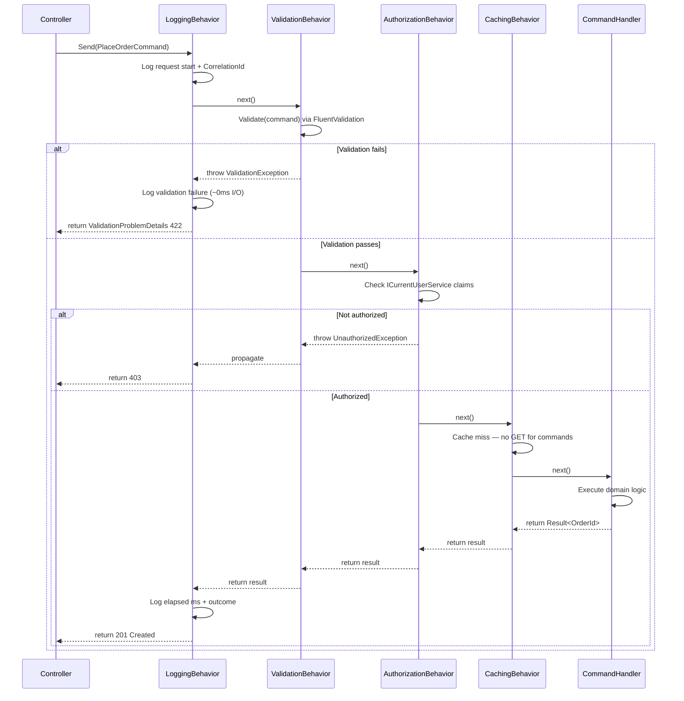
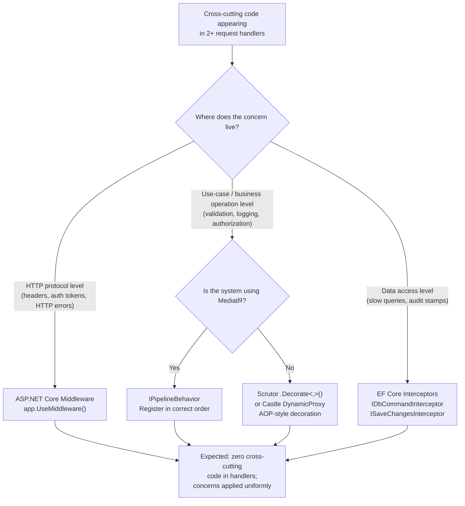

> [!success] Mastery Check
> - [ ] **Studied Well**
> - [ ] **Can explain the concept without notes**
> - [ ] **Can answer interview questions confidently**
> - [ ] **Can implement it in a real project**


> [!ABSTRACT] Quick Reference — Cross-Cutting Concerns **Invariant:** Cross-cutting concerns are applied uniformly across all use cases without the use case knowing they exist — the concern is orthogonal to business logic. **Cost:** Every additional cross-cutting concern adds a pipeline hop; misconfigured ordering causes subtle bugs (e.g., logging before validation means you log invalid requests; caching before auth means you serve cached data to unauthenticated callers). **Trigger:** When logging, validation, authorization, caching, or exception handling code begins appearing in more than one use case handler — the duplication signal. **Skip When:** Single-use case application or prototype where the overhead of pipeline infrastructure exceeds the value; or when the concern truly differs per use case (use explicit handler code instead). **.NET Entry Point:** `IPipelineBehavior<TRequest, TResponse>` in MediatR / `IMiddleware` in ASP.NET Core / `IActionFilter` in MVC **Azure Native:** Azure API Management policies (rate limiting, auth, transformation at gateway level); Application Insights SDK (auto-instruments ASP.NET Core pipeline transparently) **Number to Know:** MediatR pipeline behavior overhead is ~0.01–0.05ms per behavior per request (in-process, no I/O) — negligible until you stack 10+ behaviors or call them on hot paths > 50,000 req/s

---

## Navigation

**Domain:** [[7 — System Design & Distributed Systems]] > **Group:** Clean Architecture **Previous:** [[7.005 — Clean Architecture — Presentation Layer]] | **Next:** [[7.007 — Clean Architecture — Dependency Injection Wiring]]

### Prerequisites

- [[7.001 — Clean Architecture — The Dependency Rule]] — cross-cutting concerns must still obey the dependency rule; they live in Application or Infrastructure, never injected inward from Presentation
- [[7.003 — Clean Architecture — Application Layer — Use Cases]] — use case handlers are the attachment point for the MediatR pipeline where most cross-cutting concerns live
- [[7.085 — CQRS — MediatR Pipeline Behaviors Overview]] — the concrete .NET mechanism that implements the cross-cutting pipeline in the Application layer

### Where This Fits

> [!INFO] Production Encounter Map
> 
> - **Layer:** Application layer (MediatR `IPipelineBehavior`) and Infrastructure layer (ASP.NET Core `IMiddleware`, EF Core interceptors, `IDbCommandInterceptor`)
> - **Trigger:** Code review reveals logging, try/catch, and validation blocks copy-pasted across 6 command handlers; or a new requirement (e.g., "all commands must emit an audit event") would require touching every handler
> - **Without it:** Logging in `PlaceOrderCommandHandler`, duplicated in `CancelOrderCommandHandler`, missing entirely from `RefundOrderCommandHandler` — inconsistent observability, audit gaps, and a 3 AM incident where the missing log meant 45 minutes of blind debugging
> - **First signal:** Serilog shows request-level logs missing for a specific command type; or an exception surfaces without correlation ID because one handler forgot to wrap in try/catch

Cross-cutting concerns are the horizontal infrastructure layer beneath your vertical use cases. They connect to [[7.085 — CQRS — MediatR Pipeline Behaviors Overview]] as the Application-layer implementation and to [[7.718 — Serilog — .NET Integration]] as the concrete observability tool most .NET teams reach for first.

---

## Core Mental Model

A cross-cutting concern is any behavior that must apply to multiple operations in a system without being owned by any single operation. Logging, validation, authorization, exception handling, caching, and auditing are canonical examples. The critical engineering insight is _where_ these concerns attach: in Clean Architecture, the Application layer owns the use-case pipeline, so cross-cutting concerns that apply to use cases belong as MediatR `IPipelineBehavior<TRequest, TResponse>` implementations — not as logic inside each handler. The Dependency Rule still governs: a logging behavior may depend on `ILogger<T>` (abstraction), never on `Serilog.Log` (concrete infrastructure) inside the Application project.

> [!TIP] The Non-Obvious Insight Pipeline behavior **ordering** is the most common source of production bugs with cross-cutting concerns, and it is invisible at runtime until something breaks. In MediatR, behaviors execute in registration order, wrapping each other like Russian dolls. If you register `CachingBehavior` before `AuthorizationBehavior`, a request from an unauthenticated caller can be served from cache — bypassing auth entirely. The correct order for most systems is: **Logging → Validation → Authorization → Caching → Exception Handling → Handler**. The rule of thumb: concerns that gate execution (auth, validation) must wrap concerns that produce side effects (caching, auditing). Draw the call stack, not the registration list, when reasoning about order.

### Classification

- **Consistency axis:** N/A — cross-cutting concerns are infrastructure, not data consistency concerns
- **Availability tradeoff:** A misbehaving behavior (deadlock in audit logger, unhandled exception in validation behavior) can bring down the entire request pipeline; behaviors must be exception-safe
- **Latency impact:** In-process behaviors add ~0.01–0.05ms each; behaviors with I/O (audit log to DB, distributed cache check) add the full I/O latency to every request — plan accordingly
- **Failure domain:** Single-process (MediatR pipeline is in-process); ASP.NET Core middleware is per-request in the web host process
- **Abstraction layer:** Pattern (pipeline/decorator) implemented at Framework feature level (MediatR, ASP.NET Core Middleware)

### Primary Diagram

```mermaid
graph LR
    A["HTTP Request\n(Presentation Layer)"] --> B["ASP.NET Core\nMiddleware Pipeline"]
    B --> B1["CorrelationId\nMiddleware"]
    B1 --> B2["Exception\nMiddleware"]
    B2 --> B3["Authentication\nMiddleware"]
    B3 --> C["Controller / Minimal API\nEndpoint"]
    C --> D["MediatR.Send(command)"]
    D --> E["LoggingBehavior\nIPipelineBehavior"]
    E --> F["ValidationBehavior\nIPipelineBehavior"]
    F --> G["AuthorizationBehavior\nIPipelineBehavior"]
    G --> H["CachingBehavior\nIPipelineBehavior"]
    H --> I["ExceptionBehavior\nIPipelineBehavior"]
    I --> J["PlaceOrderCommandHandler\nIRequestHandler"]
    J --> K["Domain Layer\nOrderAggregate"]
    K --> L["Infrastructure\nOrderRepository / DbContext"]

    style B fill:#2d3748,color:#e2e8f0
    style D fill:#553c9a,color:#e2e8f0
    style J fill:#276749,color:#e2e8f0
    style K fill:#7b341e,color:#e2e8f0
```



### Supporting Diagram



### Numbers That Matter

|Metric|Value|Context / Conditions|
|---|---|---|
|MediatR behavior overhead (no I/O)|~0.01–0.05ms per behavior|In-process, .NET 8, measured on Intel i7-1185G7 (estimated)|
|FluentValidation sync validation|~0.1–0.5ms|10–20 rules, no DB calls, object already deserialized|
|Distributed cache check (Redis GET)|~0.3–1ms LAN|Azure Cache for Redis Basic C1 tier, single key lookup|
|EF Core interceptor overhead|~0.05–0.2ms|Per query, `IDbCommandInterceptor`, no async blocking|
|ASP.NET Core middleware hop|~0.005ms|Empty middleware, no I/O, .NET 8 Kestrel|
|Scale threshold for pipeline concern|> 3 handlers sharing the same cross-cutting code|Below this, explicit handler code is acceptable|

### Key Properties / Guarantees

|Property|Value|Condition|
|---|---|---|
|Uniform application|Behavior executes for every `IRequest` matching the generic constraint|As long as the behavior is registered and the request flows through MediatR|
|Ordering determinism|Fixed — determined by `IServiceCollection` registration order|Same process lifetime; does not change at runtime|
|Handler isolation|Handler contains zero cross-cutting code|When all concerns are in behaviors; violation breaks the single-responsibility invariant|
|Exception propagation|Behaviors can catch, transform, or rethrow exceptions|Exception behavior at outer position catches all inner exceptions|
|Dependency Rule compliance|Behaviors in Application project reference only abstractions|No direct Serilog, EF Core, or Azure SDK references inside Application project|

---

## Deep Mechanics

### How It Works

**MediatR Pipeline (Application Layer):**

1. Controller calls `mediator.Send(new PlaceOrderCommand(...))` — no knowledge of what behaviors wrap the handler.
2. MediatR resolves all `IPipelineBehavior<PlaceOrderCommand, Result<OrderId>>` from the DI container. These include any open-generic registrations (`IPipelineBehavior<,>`) and any closed registrations for this specific request type.
3. Behaviors are arranged in a chain. The first registered behavior wraps all subsequent ones. Its `Handle` method receives the request and a `next` delegate representing the remainder of the chain.
4. **LoggingBehavior** (outermost): captures `Stopwatch`, logs request type and correlation ID, calls `next()`, logs elapsed time and outcome after `next()` returns.
5. **ValidationBehavior**: runs `IValidator<TRequest>.ValidateAsync()` against the request. If validation fails, it throws `ValidationException` — the handler is never called.
6. **AuthorizationBehavior**: checks `ICurrentUserService` claims against a `[Authorize]` attribute or a marker interface on the request. Throws `UnauthorizedException` if the check fails.
7. **CachingBehavior**: only applies to `IQuery` marker interface (commands never hit cache). Checks `IDistributedCache` for a key derived from the request's content hash. On hit, returns cached result without calling the handler.
8. **ExceptionBehavior** (innermost, just before handler): wraps `next()` in try/catch, maps domain exceptions to structured `Result<T>` errors, ensuring the pipeline never surfaces raw exception stack traces to callers.
9. The actual `IRequestHandler<PlaceOrderCommand, Result<OrderId>>` executes. It is responsible for domain logic only.

**ASP.NET Core Middleware (Presentation/Infrastructure boundary):**

Cross-cutting concerns that apply at the HTTP level — not at the use-case level — belong in ASP.NET Core middleware:

- **Correlation ID middleware**: generates or extracts `X-Correlation-ID` header, attaches to `ILogger` scope — runs before MediatR is ever called.
- **Exception middleware**: catches unhandled exceptions from the entire request pipeline, maps to RFC 9457 `ProblemDetails`.
- **Authentication/Authorization middleware**: validates JWTs, populates `HttpContext.User` — must run before the controller resolves the current user.

**EF Core Interceptors (Infrastructure Layer):**

For concerns at the data access level — slow query logging, soft-delete filters, audit column stamping — EF Core `IDbCommandInterceptor` and `ISaveChangesInterceptor` provide the attachment point without touching domain or application code.

### Protocol Trace

Not applicable for this Group A topic — protocol traces are required for Groups E, H, I, J, K, L, O, AC, AE.

### State Transitions

Not applicable — cross-cutting concerns are stateless pipeline elements, not stateful components.

### Failure Modes

**Failure Mode 1: Wrong Behavior Registration Order — Auth After Cache**

- **Cause:** `CachingBehavior` is registered in `IServiceCollection` before `AuthorizationBehavior`. Because MediatR wraps behaviors in registration order, caching executes first. A cached response for a previously authorized user is returned to a subsequent unauthenticated caller without auth checks executing.
- **Symptom:** Unauthenticated requests receive `200 OK` with valid data for a period equal to the cache TTL. The auth failure log line is never emitted for these requests.
- **Detection time:** Silent — no error is produced. Detectable only via penetration testing or by noticing the absence of the authorization log line in high-volume traffic. Can persist for hours or days.
- **Blast radius:** Data exposure for all cache-eligible query endpoints. Severity depends on data sensitivity. In a multi-tenant system, this is a tenant-isolation breach.

> [!DANGER] 3 AM Production Signal Metric: `http_requests_total{status="200", endpoint="/api/orders", auth="none"} > 0` — unauthenticated 200s on a protected endpoint Log: Absence of `INFO [AuthorizationBehavior] Authorization check passed | UserId=... | Request=GetOrderQuery` for requests that returned 200 Customer impact: Users logging out and back in may see another user's order data until cache entry expires (TTL-dependent, typically 60–300s)

**Failure Mode 2: Validation Behavior Missing Async Validator Registration**

- **Cause:** `FluentValidation` validators registered with `AddValidatorsFromAssembly(...)` but the `ValidationBehavior` calls `.Validate()` (synchronous) instead of `.ValidateAsync(CancellationToken)`. Validators with async rules (e.g., checking username uniqueness against the DB) silently skip those rules in sync mode.
- **Symptom:** Duplicate records created in the database for fields that should be unique. No validation error returned to the caller. The uniqueness constraint on the DB produces a `DbUpdateException` which surfaces as a 500 rather than a 422.
- **Detection time:** Silent during development if test data doesn't trigger the race. Appears in production under concurrent load when two requests race to insert the same value.
- **Blast radius:** Data integrity violations in the affected table. May require manual reconciliation. In financial systems (duplicate payment records), this can cause regulatory issues.

> [!DANGER] 3 AM Production Signal Metric: `dotnet_exceptions_total{exception_type="Microsoft.EntityFrameworkCore.DbUpdateException"} > threshold` spiking on a specific endpoint Log: `ERROR [ExceptionBehavior] Unhandled exception | Type=DbUpdateException | Message=Violation of UNIQUE constraint 'IX_customers_email' | CorrelationId: b2f1-...` Customer impact: "Account already exists" error page on sign-up even though customer is new; or — worse — silent duplicate account creation

### .NET and Azure Integration Points

- **ASP.NET Core:** `IMiddleware` and `RequestDelegate` chains; `app.Use()`, `app.UseMiddleware<T>()` in `Program.cs`
- **MediatR:** `IPipelineBehavior<TRequest, TResponse>` — open-generic registration covers all request types
- **FluentValidation:** `IValidator<T>` + `AbstractValidator<T>` — integrated via `AddFluentValidationAutoValidation()` or the MediatR behavior pattern
- **EF Core:** `IDbCommandInterceptor`, `ISaveChangesInterceptor`, `AddInterceptors()` on `DbContextOptionsBuilder`
- **Serilog:** `LogContext.PushProperty()` for scoped correlation IDs in behaviors; sink-agnostic inside Application project via `ILogger<T>`
- **Azure:** Application Insights auto-instruments ASP.NET Core middleware pipeline; Azure API Management applies gateway-level cross-cutting policies (rate limiting, OAuth validation, request transformation) before traffic reaches your service

```csharp
// Infrastructure layer — MediatR logging behavior
// Namespace: YourCompany.OrderManagement.Application.Common.Behaviours
using MediatR;
using Microsoft.Extensions.Logging;
using System.Diagnostics;

namespace YourCompany.OrderManagement.Application.Common.Behaviours;

/// <summary>
/// Pipeline behavior that logs request/response telemetry for every MediatR request.
/// Outermost behavior — registered first so it wraps all other behaviors.
/// </summary>
/// <typeparam name="TRequest">The MediatR request type.</typeparam>
/// <typeparam name="TResponse">The MediatR response type.</typeparam>
public sealed class LoggingBehaviour<TRequest, TResponse>
    : IPipelineBehavior<TRequest, TResponse>
    where TRequest : notnull
{
    private readonly ILogger<LoggingBehaviour<TRequest, TResponse>> _logger;

    public LoggingBehaviour(ILogger<LoggingBehaviour<TRequest, TResponse>> logger)
        => _logger = logger;

    public async Task<TResponse> Handle(
        TRequest request,
        RequestHandlerDelegate<TResponse> next,
        CancellationToken cancellationToken)
    {
        var requestName = typeof(TRequest).Name;
        _logger.LogInformation(
            "Handling {RequestName} | {@Request}", requestName, request);

        var sw = Stopwatch.StartNew();
        try
        {
            var response = await next();
            _logger.LogInformation(
                "Handled {RequestName} | ElapsedMs={ElapsedMs}",
                requestName, sw.ElapsedMilliseconds);
            return response;
        }
        catch (Exception ex)
        {
            _logger.LogError(ex,
                "Request {RequestName} failed | ElapsedMs={ElapsedMs}",
                requestName, sw.ElapsedMilliseconds);
            throw;
        }
    }
}
```

---

## Production Patterns and Implementation

### Primary Implementation

```csharp
// Application layer — ValidationBehaviour
// Namespace: YourCompany.OrderManagement.Application.Common.Behaviours
using FluentValidation;
using MediatR;

namespace YourCompany.OrderManagement.Application.Common.Behaviours;

/// <summary>
/// Pipeline behavior that runs all registered FluentValidation validators
/// before the request reaches the handler. Throws <see cref="ValidationException"/>
/// on failure, which the ExceptionMiddleware maps to HTTP 422.
/// </summary>
public sealed class ValidationBehaviour<TRequest, TResponse>
    : IPipelineBehavior<TRequest, TResponse>
    where TRequest : notnull
{
    private readonly IEnumerable<IValidator<TRequest>> _validators;

    public ValidationBehaviour(IEnumerable<IValidator<TRequest>> validators)
        => _validators = validators;

    public async Task<TResponse> Handle(
        TRequest request,
        RequestHandlerDelegate<TResponse> next,
        CancellationToken cancellationToken)
    {
        if (!_validators.Any()) return await next();

        var context = new ValidationContext<TRequest>(request);

        var validationResults = await Task.WhenAll(
            _validators.Select(v => v.ValidateAsync(context, cancellationToken)));

        var failures = validationResults
            .SelectMany(r => r.Errors)
            .Where(f => f != null)
            .ToList();

        if (failures.Count != 0)
            throw new ValidationException(failures);

        return await next();
    }
}

// Application layer — ExceptionBehaviour (innermost before handler)
// Namespace: YourCompany.OrderManagement.Application.Common.Behaviours

/// <summary>
/// Catches domain exceptions and maps them to structured Result types,
/// preventing raw exception stack traces from escaping the pipeline.
/// </summary>
public sealed class ExceptionBehaviour<TRequest, TResponse>
    : IPipelineBehavior<TRequest, TResponse>
    where TRequest : notnull
    where TResponse : class
{
    private readonly ILogger<ExceptionBehaviour<TRequest, TResponse>> _logger;

    public ExceptionBehaviour(ILogger<ExceptionBehaviour<TRequest, TResponse>> logger)
        => _logger = logger;

    public async Task<TResponse> Handle(
        TRequest request,
        RequestHandlerDelegate<TResponse> next,
        CancellationToken cancellationToken)
    {
        try
        {
            return await next();
        }
        catch (NotFoundException ex)
        {
            _logger.LogWarning(ex, "Entity not found | Request={Request}", typeof(TRequest).Name);
            throw; // let ExceptionMiddleware map to 404
        }
        catch (ConflictException ex)
        {
            _logger.LogWarning(ex, "Conflict | Request={Request}", typeof(TRequest).Name);
            throw; // let ExceptionMiddleware map to 409
        }
        // UnauthorizedException → re-thrown as-is → ExceptionMiddleware → 403
        // ValidationException already handled by ValidationBehaviour above
    }
}
```

### IServiceCollection Registration

```csharp
// Program.cs — registration order determines pipeline execution order
// CORRECT order: Logging (outermost) → Validation → Authorization → Caching → Exception → Handler

builder.Services.AddMediatR(cfg =>
{
    cfg.RegisterServicesFromAssembly(
        typeof(PlaceOrderCommand).Assembly);  // Application assembly

    // Behaviors execute in registration order — ORDER IS CRITICAL
    cfg.AddBehavior(typeof(IPipelineBehavior<,>),
        typeof(LoggingBehaviour<,>));         // 1st — outermost wrapper

    cfg.AddBehavior(typeof(IPipelineBehavior<,>),
        typeof(ValidationBehaviour<,>));      // 2nd — gates on valid input

    cfg.AddBehavior(typeof(IPipelineBehavior<,>),
        typeof(AuthorizationBehaviour<,>));   // 3rd — gates on permissions

    cfg.AddBehavior(typeof(IPipelineBehavior<,>),
        typeof(CachingBehaviour<,>));         // 4th — only queries; commands skip via ICommand check

    cfg.AddBehavior(typeof(IPipelineBehavior<,>),
        typeof(ExceptionBehaviour<,>));       // 5th — innermost exception mapper
});

// Validators — auto-discover from Application assembly
builder.Services.AddValidatorsFromAssembly(
    typeof(PlaceOrderCommand).Assembly,
    includeInternalTypes: true);

// ASP.NET Core middleware — also order-sensitive
// Program.cs middleware pipeline
app.UseMiddleware<CorrelationIdMiddleware>();   // 1st — generate/extract correlation ID
app.UseMiddleware<ExceptionMiddleware>();       // 2nd — catch unhandled exceptions, map to ProblemDetails
app.UseAuthentication();                        // 3rd — validate JWT, populate HttpContext.User
app.UseAuthorization();                         // 4th — enforce [Authorize] attributes
app.MapControllers();

// EF Core interceptors — in DbContext registration
builder.Services.AddDbContext<OrderManagementDbContext>(options =>
{
    options.UseSqlServer(connectionString)
           .AddInterceptors(
               new AuditInterceptor(),         // stamps CreatedAt / ModifiedAt on SaveChanges
               new SlowQueryInterceptor());     // logs queries > 200ms to ILogger
});
```

### Common Variants

```csharp
// Variant A — Query Caching Behavior: applied only to IQuery<TResponse> marker
// Use when: read operations need caching; commands MUST NOT be cached

public interface IQuery<TResponse> : IRequest<TResponse> { }  // marker in Domain

public sealed class CachingBehaviour<TRequest, TResponse>
    : IPipelineBehavior<TRequest, TResponse>
    where TRequest : IQuery<TResponse>   // ← constraint limits to queries only
{
    private readonly IDistributedCache _cache;
    private readonly ILogger<CachingBehaviour<TRequest, TResponse>> _logger;

    public CachingBehaviour(
        IDistributedCache cache,
        ILogger<CachingBehaviour<TRequest, TResponse>> logger)
    {
        _cache = cache;
        _logger = logger;
    }

    public async Task<TResponse> Handle(
        TRequest request,
        RequestHandlerDelegate<TResponse> next,
        CancellationToken cancellationToken)
    {
        var cacheKey = $"{typeof(TRequest).Name}:{JsonSerializer.Serialize(request)}";
        var cached = await _cache.GetStringAsync(cacheKey, cancellationToken);

        if (cached is not null)
        {
            _logger.LogDebug("Cache hit | Key={CacheKey}", cacheKey);
            return JsonSerializer.Deserialize<TResponse>(cached)!;
        }

        var response = await next();

        await _cache.SetStringAsync(
            cacheKey,
            JsonSerializer.Serialize(response),
            new DistributedCacheEntryOptions
            {
                AbsoluteExpirationRelativeToNow = TimeSpan.FromMinutes(5)
            },
            cancellationToken);

        return response;
    }
}
```

```csharp
// Variant B — ASP.NET Core CorrelationId Middleware: HTTP-level, before MediatR
// Use when: correlation must propagate through HTTP headers to downstream services

public sealed class CorrelationIdMiddleware : IMiddleware
{
    private const string CorrelationIdHeader = "X-Correlation-ID";
    private readonly ILogger<CorrelationIdMiddleware> _logger;

    public CorrelationIdMiddleware(ILogger<CorrelationIdMiddleware> logger)
        => _logger = logger;

    public async Task InvokeAsync(HttpContext context, RequestDelegate next)
    {
        var correlationId = context.Request.Headers[CorrelationIdHeader].FirstOrDefault()
                            ?? Guid.NewGuid().ToString("N");

        context.Response.Headers[CorrelationIdHeader] = correlationId;
        context.Items[CorrelationIdHeader] = correlationId;

        using (LogContext.PushProperty("CorrelationId", correlationId))
        {
            await next(context);
        }
    }
}
```

### Performance Profile

Performance is not the central mechanism for cross-cutting concerns (correctness and consistency are), so BenchmarkDotNet is not required here per Rule 13. The relevant performance consideration is cumulative pipeline depth — each behavior adds a small but non-zero overhead.

|Configuration|Overhead per request|Notes|
|---|---|---|
|0 behaviors (raw handler)|~0ms|Baseline, no pipeline|
|5 behaviors (typical setup, no I/O)|~0.05–0.25ms (estimated)|All in-process, .NET 8|
|5 behaviors + Redis cache check|~0.35–1.25ms (estimated)|Adds Redis GET latency on every query|
|5 behaviors + DB validation|~5–50ms (estimated)|DB round-trip in ValidationBehavior; avoid unless necessary|

### Real-World .NET Ecosystem Mapping

|Pattern in This Note|Where It Appears in .NET / Azure|Manifestation|
|---|---|---|
|Decorator chain|`IPipelineBehavior<,>` in MediatR|Each behavior wraps the next via the `RequestHandlerDelegate`|
|Middleware pipeline|`IMiddleware` / `RequestDelegate` in ASP.NET Core|`app.Use()` / `app.UseMiddleware<T>()` in `Program.cs`|
|Interceptor|`IDbCommandInterceptor` in EF Core|Intercepts SQL commands before/after execution for logging or mutation|
|AOP (Aspect-Oriented)|Castle DynamicProxy / Scrutor `.Decorate<,>()`|Alternative to MediatR behaviors for non-CQRS systems|
|Gateway policies|Azure API Management policy expressions|Rate limiting, auth, header transformation before traffic hits app|

---

## Gotchas and Production Pitfalls

### Behavior Registration Order Silently Bypasses Authorization

**Pitfall:** Registering `CachingBehaviour` before `AuthorizationBehaviour` in `Program.cs`.

```csharp
// ❌ Wrong — caching executes before auth; cached responses bypass authorization check
cfg.AddBehavior(typeof(IPipelineBehavior<,>), typeof(CachingBehaviour<,>));
cfg.AddBehavior(typeof(IPipelineBehavior<,>), typeof(AuthorizationBehaviour<,>));
cfg.AddBehavior(typeof(IPipelineBehavior<,>), typeof(LoggingBehaviour<,>));
```

**Symptom:** Unauthenticated API requests return `200 OK` with real data during the cache TTL window. No authorization log line is emitted for these requests.

**Detection time:** Silent — only discovered via penetration testing or audit log review. Can persist for the entire cache TTL (minutes to hours) per cache entry.

> [!DANGER] Production Signal Metric: `http_requests_total{status="200", endpoint="/api/orders/{id}", auth_header="none"} > 0` Log: Missing `INFO [AuthorizationBehaviour] Authorization passed` line for requests that returned 200 Customer impact: Unauthenticated users access protected order data for TTL duration — data breach in multi-tenant systems

**Fix:**

```csharp
// ✅ Correct — auth gates before cache; logging wraps everything
cfg.AddBehavior(typeof(IPipelineBehavior<,>), typeof(LoggingBehaviour<,>));
cfg.AddBehavior(typeof(IPipelineBehavior<,>), typeof(ValidationBehaviour<,>));
cfg.AddBehavior(typeof(IPipelineBehavior<,>), typeof(AuthorizationBehaviour<,>));
cfg.AddBehavior(typeof(IPipelineBehavior<,>), typeof(CachingBehaviour<,>));
cfg.AddBehavior(typeof(IPipelineBehavior<,>), typeof(ExceptionBehaviour<,>));
```

**Cost of not fixing:** In a multi-tenant SaaS system, this is a full tenant-data isolation breach. GDPR Article 32 requires "appropriate technical measures" — a breach here triggers notification obligations within 72 hours. Revenue impact from customer churn and regulatory fines at scale.

---

### Synchronous FluentValidation Skips Async Rules

**Pitfall:** Calling `.Validate(context)` (synchronous) in `ValidationBehaviour` when validators contain `.MustAsync()` or `.CustomAsync()` rules.

```csharp
// ❌ Wrong — sync Validate() silently skips async rules
var validationResult = validator.Validate(context);
```

**Symptom:** No validation error is thrown for async rules (DB uniqueness checks, external API validation). The constraint is enforced by the database, surfacing as an unhandled `DbUpdateException` — a 500 instead of a 422.

**Detection time:** Silent in development if test data does not trigger the async rule path. Appears under production concurrent load.

> [!DANGER] Production Signal Metric: `dotnet_exceptions_total{exception_type="DbUpdateException", endpoint="/api/customers"} spike` Log: `ERROR [ExceptionBehaviour] Unhandled exception | Type=DbUpdateException | Message=Violation of UNIQUE KEY constraint 'UX_customers_email' | CorrelationId: e9a1-...` Customer impact: Duplicate account creation or 500 error on sign-up; manual data reconciliation required

**Fix:**

```csharp
// ✅ Correct — always use ValidateAsync in ValidationBehaviour
var validationResults = await Task.WhenAll(
    _validators.Select(v => v.ValidateAsync(context, cancellationToken)));
```

**Cost of not fixing:** Duplicate records in constrained tables → database integrity violations → manual data cleanup operations costing engineering hours per incident; in financial systems, duplicate payment records create reconciliation failures that trigger compliance review.

---

### Azure-Specific: Application Insights Double-Telemetry from Manual + Auto Instrumentation

**Pitfall:** Adding a `LoggingBehaviour` that manually logs request/response timing _and_ enabling Application Insights auto-instrumentation via `AddApplicationInsightsTelemetry()`. Both emit dependency telemetry for the same operation.

```csharp
// ❌ Wrong — both fire; Application Insights shows duplicate spans for every request
builder.Services.AddApplicationInsightsTelemetry(); // auto-instruments
cfg.AddBehavior(typeof(IPipelineBehavior<,>), typeof(LoggingBehaviour<,>)); // also instruments
// LoggingBehaviour also calls _telemetryClient.TrackDependency(...)  ← the mistake
```

**Symptom:** Application Insights Live Metrics shows 2x the actual request count. Alerting rules fire at half the real threshold. `failures_by_endpoint` dashboard shows inflated error rates.

**Detection time:** Immediate — visible in Application Insights within 1 minute of deployment.

> [!DANGER] Production Signal Metric: `requests/count` in Application Insights doubles immediately after deploying `LoggingBehaviour` with `TrackDependency` calls Log: Duplicate `customDimensions.RequestName` entries for the same `operation_Id` in Log Analytics

**Fix:**

```csharp
// ✅ Correct — use ILogger<T> in LoggingBehaviour (Serilog → App Insights sink) without manual TrackDependency
// Application Insights auto-instrumentation handles HTTP-level telemetry
// LoggingBehaviour only calls _logger.LogInformation() — no direct TelemetryClient calls
```

**Cost of not fixing:** False alert storms at 2 AM when error rate appears to double; engineering time investigating a phantom incident; alert fatigue leading to real incidents being dismissed as false positives.

---

### .NET-Specific: Scoped Services Injected into Singleton Behaviors via Open-Generic Registration

**Pitfall:** Open-generic behavior registrations (`typeof(IPipelineBehavior<,>)`) are registered as `Singleton` by some MediatR configuration examples, but they inject `ICurrentUserService` which is `Scoped`.

```csharp
// ❌ Wrong — Singleton behavior captures Scoped ICurrentUserService on first request; all subsequent requests use the first user's context
services.AddSingleton(typeof(IPipelineBehavior<,>), typeof(AuthorizationBehaviour<,>));
// AuthorizationBehaviour injects ICurrentUserService in constructor — captured once
```

**Symptom:** All requests after the first one are authorized as the first user, regardless of the actual caller. This is a classic captive dependency / service locator lifetime mismatch bug.

**Detection time:** Silent — appears as authorization passing for all users after warm-up. No exception is thrown. May only surface in testing if tests share a DI container across test cases.

> [!DANGER] Production Signal Log: `INFO [AuthorizationBehaviour] Authorization passed | UserId=usr_0001` appearing for requests from users who are _not_ usr_0001 Customer impact: All users gain the permissions of whichever user warmed up the singleton — full authorization bypass

**Fix:**

```csharp
// ✅ Correct — register behaviors as Transient (MediatR's cfg.AddBehavior does this by default)
cfg.AddBehavior(typeof(IPipelineBehavior<,>), typeof(AuthorizationBehaviour<,>));
// This registers as Transient — new instance per request, correct DI lifetime
```

**Cost of not fixing:** Complete authorization bypass for the lifetime of the process. In production, this means every user has the access level of the first authenticated user who hit the service after deployment — a catastrophic security failure requiring immediate rollback and incident response.

---

### EF Core: Interceptors Swallowing Cancellation Tokens

**Pitfall:** Custom `IDbCommandInterceptor` implementations that do not propagate `CancellationToken` to their async operations.

```csharp
// ❌ Wrong — ignores cancellation; long-running queries cannot be cancelled
public override async ValueTask<DbDataReader> ReaderExecutedAsync(
    DbCommand command,
    CommandExecutedEventData eventData,
    DbDataReader result,
    CancellationToken cancellationToken = default)
{
    await _auditService.LogQueryAsync(command.CommandText); // ← no cancellationToken
    return result;
}
```

**Symptom:** Under load, cancelled HTTP requests (user navigates away, gateway timeout) leave EF Core queries running to completion inside the interceptor. Thread pool threads are held. Connection pool exhausts.

**Detection time:** Minutes — connection pool exhaustion manifests as `SqlException: Timeout expired. The timeout period elapsed prior to obtaining a connection` cascade.

> [!DANGER] Production Signal Metric: `sqlclient_connection_pool_available_connections{pool="OrderManagementDbContext"} < 5` sustained > 30s Log: `ERROR [OrderRepository] SqlException: Timeout expired | Pool: OrderManagementDbContext | Available: 0 | CorrelationId: d4b2-...`

**Fix:**

```csharp
// ✅ Correct — propagate cancellation through all async operations in interceptor
await _auditService.LogQueryAsync(command.CommandText, cancellationToken);
```

**Cost of not fixing:** Connection pool exhaustion cascades to full service unavailability → PagerDuty P1 → complete DB access failure affecting all users until pod restart clears connections.

---

### Missing Middleware on Non-Controller Endpoints

**Pitfall:** Adding `CorrelationIdMiddleware` and `ExceptionMiddleware` to the middleware pipeline but not applying them before `app.MapHealthChecks()` or `app.MapGrpcService<T>()`.

```csharp
// ❌ Wrong — health check and gRPC endpoints bypass correlation/exception middleware
app.UseMiddleware<CorrelationIdMiddleware>();
app.UseMiddleware<ExceptionMiddleware>();
app.MapControllers();
app.MapHealthChecks("/health");    // ← registered AFTER middleware, but health checks bypass UseMiddleware ordering in some configurations
app.MapGrpcService<OrderGrpcService>(); // ← gRPC endpoint has no correlation IDs
```

**Symptom:** Health check probe failures have no correlation ID in logs; gRPC exceptions surface as unstructured stack traces to callers; Application Insights shows health check spans with no operation context.

**Detection time:** Discovered during first production incident when `/health` failures appear in logs without `CorrelationId` field, making aggregation impossible.

**Fix:**

```csharp
// ✅ Correct — middleware is registered before ALL endpoint mappings
app.UseMiddleware<CorrelationIdMiddleware>();
app.UseMiddleware<ExceptionMiddleware>();
app.UseAuthentication();
app.UseAuthorization();
app.MapControllers();
app.MapHealthChecks("/health");     // inherits middleware registered above
app.MapGrpcService<OrderGrpcService>(); // inherits middleware registered above
```

**Cost of not fixing:** During a production incident, health check failures with no correlation ID extend MTTR by 20–40 minutes as engineers cannot correlate probe failures with downstream dependency errors — the exact information needed to determine whether to roll back or wait.

---

## Tradeoffs and Decision Framework

### Tradeoff Matrix

|Dimension|MediatR Pipeline Behaviors|ASP.NET Core Middleware|EF Core Interceptors|
|---|---|---|---|
|Attachment point|Use-case / command / query level|HTTP request level|Database operation level|
|Granularity|Per-request-type (open generic or closed)|All HTTP requests through the pipeline|Per-query or per-SaveChanges|
|Dependency Rule|Application layer — must use abstractions|Presentation / Infrastructure boundary|Infrastructure layer|
|Business logic visibility|Use cases unaware of concerns|Controllers unaware|DbContext unaware|
|Non-HTTP applicability|Yes — works for background workers, tests|No — HTTP only|Yes — works anywhere EF Core is used|
|Ordering control|Explicit — registration order|Explicit — `app.Use()` order|Implicit — multiple interceptors run in order added to `AddInterceptors()`|
|Azure ecosystem fit|Good — Polly and OpenTelemetry integrate via behaviors|Native — Application Insights auto-instruments|Good — slow query logs to Application Insights via adapter|
|Testability|Excellent — behaviors are testable in isolation with mocked `next`|Medium — requires `TestServer` or middleware test harness|Medium — requires actual `DbContext`|

### When to Apply



### Numbers-Driven Decision

|Threshold|Below = Skip / Use Simpler|Above = Apply This|
|---|---|---|
|Handler count sharing same concern|< 3 handlers|≥ 3 handlers — extract to behavior|
|Request rate (in-process only)|< 50,000 req/s|> 50,000 req/s — profile behavior overhead|
|Behaviors with I/O (Redis, DB)|0|≥ 1 — measure latency impact on p99|
|Team size|< 3 engineers|≥ 3 engineers — pipeline makes onboarding cross-cutting concerns easier|
|Concern types needed|1 (just logging)|≥ 3 — pipeline investment pays off|

### When NOT to Apply

> [!WARNING] Do Not Reach For This When...
> 
> - [ ] **Single-use-case service or prototype:** If your service has 2–3 handlers, inline the cross-cutting code. The MediatR pipeline setup, behavior ordering discipline, and DI registration overhead exceed the value when there's nothing to generalize across.
> - [ ] **Concern is fundamentally different per use case:** If your "logging" behavior would need 6 if/else branches based on request type, that's a signal the concern isn't truly cross-cutting — it belongs in the individual handlers.
> - [ ] **Non-MediatR application:** Do not retrofit MediatR solely to use pipeline behaviors. Scrutor's `.Decorate<,>()` or explicit decorator classes achieve the same result without MediatR dependency.
> - [ ] **I/O-heavy behavior on synchronous critical path at > 10,000 req/s:** A caching behavior that checks Redis on every request adds 0.3–1ms per query. At 10,000 req/s that's 3,000–10,000ms of Redis I/O per second from a single service instance. Measure before adding.

---

## Interview Arsenal

### Question Bank

1. **[Definition]** "What is a cross-cutting concern in Clean Architecture, and how does it differ from a domain concern?"
2. **[Mechanism]** "Walk me through how a MediatR `IPipelineBehavior` works — what happens when `mediator.Send()` is called and three behaviors are registered?"
3. **[Tradeoff]** "What do you give up when you move all validation into a MediatR behavior versus keeping it in each handler?"
4. **[Failure mode]** "What breaks if you register your caching behavior before your authorization behavior in the MediatR pipeline?"
5. **[Comparison]** "What is the difference between a MediatR pipeline behavior and ASP.NET Core middleware? When would you use one versus the other?"
6. **[Design application]** "Design the cross-cutting concern pipeline for a payment processing service. Every payment command must be logged, validated, authorized, and audited to a separate audit table."
7. **[Scale]** "Your service handles 20,000 req/s. You're asked to add a behavior that checks Redis for a rate limit token on every request. What do you evaluate before adding it?"
8. **[Advanced]** "In MediatR, open-generic behavior registrations are resolved for every request type. What happens when a behavior injects a Scoped service but is registered as Singleton — and how does this manifest in production?"

### Spoken Answers

**Q: What is a cross-cutting concern in Clean Architecture, and how does it differ from a domain concern?**

> **Average answer:** A cross-cutting concern is something like logging or validation that applies to many parts of the system. A domain concern is specific to the business, like calculating order totals. In Clean Architecture you keep them separate so your domain stays clean.

> **Great answer:** A cross-cutting concern is behavior that must apply uniformly across multiple operations without any single operation owning it. Logging, validation, authorization, exception handling, and caching are the canonical examples. The distinguishing test is: if removing this concern changes the business outcome of any use case, it's a domain concern. If removing it doesn't change business outcomes but removes observability, safety, or infrastructure behavior, it's cross-cutting. In Clean Architecture, this distinction drives _placement_: domain concerns live in Domain or Application entities and services; cross-cutting concerns in Application live as `IPipelineBehavior` implementations that the use-case handler never references. The handler calls `next()` — it has no idea logging happened. The cost of this separation is pipeline depth and the subtle ordering constraint: a behavior that gates execution (auth) must wrap behaviors that produce side effects (caching), or you create security holes. I've seen exactly that bug in production — caching registered before auth, serving cached order data to unauthenticated callers for the full cache TTL.

---

**Q: What is the difference between a MediatR pipeline behavior and ASP.NET Core middleware? When would you use one versus the other?**

> **Average answer:** Middleware runs at the HTTP level and MediatR behaviors run at the application level. Middleware handles things like authentication headers and behaviors handle things like validation. You use middleware for HTTP stuff and behaviors for business logic concerns.

> **Great answer:** The structural distinction is the attachment point and abstraction level. ASP.NET Core middleware operates on `HttpContext` — it understands HTTP concepts: headers, status codes, request bodies as streams. It executes for every HTTP request through the pipeline, regardless of what the endpoint does, and it has no knowledge of your use cases or domain. MediatR behaviors operate on strongly-typed `TRequest` / `TResponse` — they understand use-case concepts. They fire for every `mediator.Send()` call, which means they also run in background workers, integration tests, and any non-HTTP entry point. The decision rule: if your concern requires `HttpContext` (auth token extraction, correlation ID from a request header, HTTP-level exception-to-status-code mapping), it belongs in middleware. If your concern applies to a business operation regardless of how it was triggered (validation, authorization by resource, audit logging of domain commands), it belongs in a MediatR behavior. The Azure angle: Application Insights auto-instrumentation covers both layers — it instruments the ASP.NET Core pipeline at middleware level and can be extended with `Activity`-based tracing in behaviors, avoiding double telemetry if you're careful about what each layer records.

---

**Q: In MediatR, open-generic behavior registrations are resolved for every request type. What happens when a behavior injects a Scoped service but is registered as Singleton — and how does this manifest in production?**

> **Average answer:** You shouldn't mix lifetimes like that because Scoped services are per-request but Singletons live for the whole application. It could cause issues with the wrong data being used.

> **Great answer:** This is the captive dependency problem. When a Singleton captures a Scoped service, the Scoped service is resolved once at the Singleton's construction time — typically on the first request that triggers resolution — and that same instance is held for the process lifetime. In the case of `AuthorizationBehaviour` injecting `ICurrentUserService` (which reads `HttpContext.User`): the first authenticated user's claims object is captured in the behavior's field. Every subsequent request, regardless of which user made it, evaluates authorization against user number one's claims. In production this manifests as: after the first successful login, all subsequent requests pass authorization regardless of who the caller is. No exception is thrown — auth silently passes. The observable signal is an authorization audit log showing `UserId=usr_0001` for requests originating from users who are definitively not usr_0001. The fix is to register behaviors as Transient — which is the MediatR `cfg.AddBehavior()` default — or to inject `IHttpContextAccessor` and resolve the current user on each `Handle()` invocation rather than in the constructor. This is one of the most dangerous DI lifetime bugs because it produces no runtime error, bypasses security, and only surfaces through active monitoring of auth logs.

### Whiteboard in 60 Seconds

When cross-cutting concerns appear in a system design interview, draw in this sequence:

```
1. Draw the MediatR Send() call at the center
   "I'm going to show the call site first — the controller just calls Send(), 
    no knowledge of what wraps it."

2. Draw 3–4 behavior boxes wrapping the Handler box from outside in
   "Each behavior is a decorator. The outermost runs first. 
    This is where logging, validation, and auth live."

3. Draw an arrow showing registration order with a label "ORDER IS CRITICAL"
   "The decision that matters most here is registration order — 
    auth must wrap cache, not the other way around."

4. Add the failure case — draw cache before auth with an X through it
   "If cache runs before auth, an unauthenticated caller hits the cache and 
    gets real data. This is a silent auth bypass — no error, just wrong behavior."

5. Add the .NET label on the behavior boxes
   "In .NET, these are IPipelineBehavior<TRequest,TResponse> with open-generic 
    registration. ASP.NET Core middleware handles the HTTP-level version of the same pattern."
```

> [!TIP] What the Interviewer Is Specifically Testing When they probe this area, they are checking whether you know:
> 
> 1. That behavior ordering is the critical correctness invariant — not just "you can add behaviors" but "the order determines security properties"
> 2. Whether you distinguish between middleware (HTTP-level, HttpContext) and pipeline behaviors (use-case-level, typed requests) and can articulate which concern belongs where
> 3. Whether you've encountered the captive dependency / lifetime mismatch bug in practice — this is the question that separates engineers who have run this in production from those who only know the pattern from documentation

### Follow-Up Chain

**Follow-up 1:** "You mentioned behaviors run in registration order. How do you prevent a future engineer from accidentally changing that order when they add a new behavior?"

> **Model answer:** Two mechanisms working together. First, a static analysis fitness function: a ArchUnit-style test or Roslyn analyzer that asserts the DI registration file has behaviors in a fixed sequence — any reorder breaks the build. Second, a code comment block in `Program.cs` that explicitly documents the invariant: `// SECURITY: DO NOT REORDER — auth must precede cache. See ADR 007.` Combined with the ADR that explains _why_ the order matters, future engineers understand they're not refactoring a style preference — they're protecting a security invariant.

**Follow-up 2:** "What happens to your cross-cutting concerns when a command is triggered from a background worker instead of an HTTP request?"

> **Model answer:** MediatR behaviors fire on every `mediator.Send()` regardless of the caller — so logging, validation, and exception behaviors all work transparently in background workers. The failure case is behaviors that depend on `IHttpContextAccessor` or `HttpContext.User`, which are null outside an HTTP context. `AuthorizationBehaviour` typically falls into this category. The correct fix is to implement a `ICurrentUserService` abstraction with two implementations: one for HTTP requests that reads from `HttpContext.User`, and one for background workers that reads from a background job context (job arguments, a system identity). The behavior injects the abstraction — it never knows which implementation it got. This is the Open-Closed Principle applied to cross-cutting concerns: add a new execution context without modifying the behavior.

**Follow-up 3:** "How would you know in production that your validation behavior is actually firing and not being silently skipped?"

> **Model answer:** Three signals. First, structured log: `LoggingBehaviour` logs every request name before calling `next()` — if validation fires, it appears between the request-start log and the handler-start log. Second, a metric: `validation_failures_total{request_type="PlaceOrderCommand"}` incremented in `ValidationBehaviour` on every failure. An alert on `validation_failures_total{} == 0 for 24h` on a high-traffic endpoint signals that either requests are all valid (unlikely) or the behavior isn't running. Third, an integration test that sends a known-invalid command through `ISender` (the actual DI container, not a mock) and asserts a `ValidationException` is thrown — this test breaks immediately if behavior registration is missing or misordered.

### Comparison Table

||MediatR Pipeline Behaviors|ASP.NET Core Middleware|
|---|---|---|
|Core guarantee|Every use-case invocation receives the concern uniformly|Every HTTP request receives the concern uniformly|
|What it trades|Requires MediatR; adds pipeline depth|HTTP-specific; doesn't apply to background workers or tests|
|.NET implementation|`IPipelineBehavior<TRequest, TResponse>`|`IMiddleware` / `RequestDelegate`|
|Azure native|Application Insights SDK traces `Activity`; no managed equivalent|App Service Request Tracing; APIM policies at gateway level|
|Primary failure mode|Behavior registration order causes security bypass or data exposure|Middleware order causes auth to run after controllers execute|
|When to choose|Concern applies to a business operation regardless of entry point (CLI, HTTP, background)|Concern requires `HttpContext`, HTTP headers, or applies only to HTTP-triggered paths|
|When NOT to choose|Non-MediatR architecture; single handler; concern differs materially per use case|Background services, console apps, test fixtures without HTTP host|

---

## Architecture Decision Record

**Status:** Accepted

**Context:** The `YourCompany.OrderManagement` service has 14 command handlers and 11 query handlers. A code review revealed that logging (Serilog) and FluentValidation try/catch blocks are copy-pasted across all 14 command handlers, with inconsistent field names in log messages and three handlers missing validation entirely. A new audit requirement mandates that every command that mutates order state must emit an audit event to Azure Service Bus within the same transaction. Adding this to 14 handlers individually would create 14 new places to miss the requirement.

**Options Considered:**

1. **MediatR `IPipelineBehavior` pipeline** — implement `LoggingBehaviour`, `ValidationBehaviour`, `AuthorizationBehaviour`, `AuditBehaviour` as pipeline behaviors; handlers contain zero cross-cutting code
2. **Explicit base class for handlers** — `OrderCommandHandlerBase` with virtual `BeforeHandle` / `AfterHandle` hooks; handlers inherit and call `base.Handle()`
3. **Status quo** — continue copy-pasting cross-cutting code into each handler; document the required pattern

**Decision:** MediatR `IPipelineBehavior` pipeline, because it enforces the concern at registration time rather than at convention time. Option 2 (base class) requires each handler to remember to call `base.Handle()` and does not prevent a handler from implementing its own validation that conflicts with the shared validator. Option 3 guarantees the audit requirement will be missed in the next sprint when a new handler is added.

**Consequences:**

- ✅ All 14 existing handlers immediately get consistent logging, validation, and audit without modifying handler code
- ✅ New handlers added in future sprints get all cross-cutting concerns for free as long as they use `mediator.Send()`
- ✅ Integration tests can assert that cross-cutting concerns fire by testing through `ISender` with the real DI container
- ⚠️ Team must understand and maintain behavior registration order — documented in ADR and enforced by a behavior-order integration test
- ❌ Background jobs that directly `new` up handler instances instead of going through `ISender` will bypass the pipeline — existing 3 such jobs must be refactored to use `ISender`

**Review Trigger:** Revisit this decision if the service is decomposed into more than 8 bounded context slices and behaviors begin needing per-slice configuration; or if sustained request volume exceeds 40,000 req/s and profiling shows pipeline behavior overhead exceeding 2ms on the p99 path.

---

## Self-Check

### Conceptual Questions

1. Define "cross-cutting concern" precisely enough to distinguish it from a domain concern. What is the test you apply?
2. Why must an `AuthorizationBehaviour` be registered _before_ a `CachingBehaviour` in MediatR? Derive this from first principles — what would go wrong in the opposite order?
3. Name two scenarios where you would NOT implement a cross-cutting concern as a MediatR behavior, and explain the mechanism you would use instead.
4. What is the observable signal in production logs that tells you `ValidationBehaviour` fired and failed for a given request?
5. What .NET interface does ASP.NET Core middleware implement for the typed-middleware pattern, and what method does it define?
6. What is the structural difference between MediatR `IPipelineBehavior` and ASP.NET Core `IMiddleware`? Name the specific thing each one has access to that the other does not.
7. At what approximate handler count does extracting a repeated cross-cutting concern to a pipeline behavior become worthwhile versus keeping it inline?
8. How does cross-cutting concern placement connect to [[7.001 — Clean Architecture — The Dependency Rule]]? Where in the layer hierarchy do behaviors live?
9. What is the production consequence of registering a `Singleton` behavior that constructor-injects a `Scoped` service like `ICurrentUserService`?
10. What consistency model (if any) does a MediatR pipeline behavior provide — and what anomaly is still possible even when all behaviors fire?
11. What specific metric and alert would you set up to confirm that `ValidationBehaviour` is running correctly in production on the `PlaceOrderCommand` endpoint?
12. Explain cross-cutting concerns to a junior engineer in 60 seconds, starting with the problem it solves.

<details> <summary>Answers</summary>

1. A cross-cutting concern is behavior that must apply to multiple operations and that, if removed, does not change any business outcome — only the system's infrastructure properties (observability, security, performance). The test: "If I remove this code, does a business rule break?" Yes → domain concern. No → cross-cutting concern.
    
2. In MediatR, the first registered behavior is the outermost wrapper. It calls `next()`, which calls the second behavior, which calls `next()` to reach the handler. If `CachingBehaviour` is registered first, it executes before `AuthorizationBehaviour`. A cache hit returns a result without ever reaching `AuthorizationBehaviour.Handle()` — auth is bypassed. The request never touches the auth check; no auth failure is logged; the caller receives real data. First principles: any behavior that returns early without calling `next()` (as a cache hit does) skips all inner behaviors. Therefore, gatekeeping behaviors (auth, validation) must be outer; side-effect behaviors (caching, auditing) must be inner.
    
3. (1) The concern applies at the HTTP level and requires `HttpContext` — use ASP.NET Core `IMiddleware` instead (e.g., `CorrelationIdMiddleware`, `ExceptionMiddleware`). (2) The system doesn't use MediatR and adding it solely for behaviors is over-engineering — use Scrutor's `.Decorate<IOrderService, LoggingOrderService>()` or explicit Decorator classes.
    
4. Two signals: (a) The `LoggingBehaviour` logs `Handling {RequestName}` — if `ValidationBehaviour` fires and fails, the next log line is `Request {RequestName} failed` with a `ValidationException` type, no `Handled` log line (because `next()` was never called to the handler). (b) A structured log from `ValidationBehaviour` itself: `WARN [ValidationBehaviour] Validation failed | Request=PlaceOrderCommand | Errors=[{"field":"CustomerId","error":"must not be empty"}] | CorrelationId: f2a1-...`
    
5. `IMiddleware`, defining `Task InvokeAsync(HttpContext context, RequestDelegate next)`. Registered via `app.UseMiddleware<T>()` after `services.AddTransient<T>()` (or `AddSingleton`).
    
6. `IPipelineBehavior<TRequest, TResponse>` has access to the strongly-typed `TRequest` object and `TResponse` — it understands your domain's use-case concepts. `IMiddleware` has access to `HttpContext` — it understands HTTP: headers, status codes, request body as a stream. `IPipelineBehavior` can be called from a background worker with no HTTP context; `IMiddleware` cannot.
    
7. 3 handlers. Below 3, the DI registration, ordering discipline, and additional abstraction layers cost more in cognitive overhead than the duplication costs in maintenance. Above 3, a new handler is more likely than not to miss the concern if it's copy-paste.
    
8. [[7.001 — Clean Architecture — The Dependency Rule]] requires dependencies to point inward. `IPipelineBehavior` implementations live in the Application layer — they may depend on Application abstractions (`ICurrentUserService`, `IValidator<T>`) and Infrastructure abstractions (`IDistributedCache`), but never on Infrastructure concretions (Serilog's static `Log`, `SqlConnection`, Azure SDK classes directly). Behaviors must reference only interfaces defined in Application or Domain.
    
9. The Scoped service is resolved once at Singleton construction time. The same instance (e.g., `ICurrentUserService` capturing the first HTTP request's `ClaimsPrincipal`) is used for every subsequent request in the process lifetime. In `AuthorizationBehaviour`, this means all requests are evaluated against the first authenticated user's claims — a complete authorization bypass. No exception is thrown. Observable only via auth audit log analysis.
    
10. Pipeline behaviors provide no consistency model — they are in-process infrastructure, not distributed data systems. The anomaly still possible: a behavior that reads from a distributed cache (`CachingBehaviour`) may serve stale data — eventual consistency applies at the cache layer, not at the behavior layer. Behaviors themselves are always executed in full for any given request; they do not provide partial execution guarantees.
    
11. Metric: `validation_failures_total{request_type="PlaceOrderCommand"}` — a Prometheus counter incremented in `ValidationBehaviour.Handle()` on every `ValidationException`. Alert: `increase(validation_failures_total{request_type="PlaceOrderCommand"}[1h]) == 0 AND rate(http_requests_total{endpoint="/api/orders",method="POST"}[1h]) > 10` — if POST /orders is receiving traffic but zero validation failures in an hour, either all input is perfect (unlikely in a payment flow) or `ValidationBehaviour` is not running. Tool: Prometheus alert rule → Alertmanager → PagerDuty ticket (not page, unless combined with a spike in 500s).
    
12. "Imagine you have an order service with 15 different commands — place order, cancel order, refund, update shipping address, and so on. Every single one of them needs to be logged, validated, and checked for authorization. Without cross-cutting concerns, you copy-paste that same logging and validation code into all 15 handlers. When a new requirement comes in — 'every command must emit an audit event' — you touch 15 files and probably miss two. Cross-cutting concerns let you write that logging, validation, and audit code exactly once, in one place called a pipeline behavior, and it automatically wraps every command without the command knowing it exists. Think of it like a restaurant: the chef (the handler) just cooks the food. The waiter who logs the order, the host who checks your reservation, and the health inspector who validates the kitchen are all cross-cutting concerns — they happen around every table interaction without the chef being involved."
    

</details>

---

### Scenario Challenges

---

**Scenario 1 — Diagnose the Problem**

The `OrderManagement` service has been in production for three weeks. A customer support ticket reports that premium users are seeing order history belonging to other users — specifically, users who log in 30–90 seconds after another user's session. Serilog shows: `INFO [AuthorizationBehaviour] Authorization passed | UserId=usr_0447` for requests where `HttpContext.User.Identity.Name = usr_0891`. The deployment changelog shows a behavior was added two days ago: `AuditBehaviour` was registered as `Singleton` in `Program.cs` because a team member thought "it's stateless, so Singleton is fine." `AuditBehaviour` injects `ICurrentUserService` in its constructor.

<details> <summary>Diagnosis</summary>

**Root cause:** Captive dependency — `AuditBehaviour` is `Singleton` but injects `ICurrentUserService` (Scoped, reading from `HttpContext.User`). The `ICurrentUserService` instance is resolved once at `AuditBehaviour`'s construction (first authenticated request after deployment). Every subsequent request uses that captured instance's user claims. This is not isolated to `AuditBehaviour` — if `AuditBehaviour` happens to be the only behavior that injects `ICurrentUserService`, auth decisions using that same service now evaluate against the first user.

**Evidence from the scenario:** `AUTH PASSED | UserId=usr_0447` for a request authenticated as `usr_0891` — the UserId in the log (from `ICurrentUserService` inside the Singleton behavior) doesn't match the actual HTTP caller. The timing (30–90s) matches the service warm-up period between deployment and first authenticated request.

**Fix:** Change `AuditBehaviour` registration to `Transient` (or use `cfg.AddBehavior()` which defaults to Transient). Audit the entire behavior registration list for any `AddSingleton<IPipelineBehavior<,>>` calls.

**Monitoring to add:** A reconciliation check metric: `auth_userid_mismatch_total` — increment when `ICurrentUserService.UserId != HttpContext.User.FindFirstValue(ClaimTypes.NameIdentifier)` inside any behavior. Alert threshold: `> 0` for 1 minute triggers P1 incident.

</details>

---

**Scenario 2 — Design Decision**

You are designing cross-cutting concerns for a payment processing service. Constraints: 8,000 req/s peak write volume; strong consistency required for payment commands; team of 12 engineers across 3 squads; Azure Standard tier Redis (no geo-replication). Every payment command must be: (1) logged with full request/response body, (2) validated, (3) authorized by payment amount limit per user role, (4) audited to an Azure SQL audit table within the same DB transaction. What pipeline do you choose and why?

<details> <summary>Decision and Reasoning</summary>

**Choice:** MediatR `IPipelineBehavior` pipeline with four behaviors in this order: `LoggingBehaviour` → `ValidationBehaviour` → `AuthorizationBehaviour` → `AuditBehaviour` (innermost). No caching behavior — payment commands must not be cached (strong consistency). No `ExceptionBehaviour` wrapping audit because the audit must succeed within the handler's transaction — if audit fails, the command should fail.

**Tradeoffs accepted:** (1) `AuditBehaviour` executes a DB write on every payment command — at 8,000 req/s this is 8,000 audit rows/s, requiring index planning on the audit table. Acceptable: Azure SQL Business Critical tier with 4 vCores can sustain ~15,000 simple writes/s. (2) Full request/response body logging in `LoggingBehaviour` — must mask card numbers via Serilog destructuring policy before logging; raw PCI data in logs is a compliance violation.

**Implementation sketch:**

```csharp
// AuditBehaviour — innermost, participates in handler's DB transaction
public sealed class AuditBehaviour<TRequest, TResponse>
    : IPipelineBehavior<TRequest, TResponse>
    where TRequest : IPaymentCommand   // marker — only payment commands
{
    private readonly PaymentDbContext _dbContext;
    private readonly ICurrentUserService _currentUser;

    public async Task<TResponse> Handle(
        TRequest request,
        RequestHandlerDelegate<TResponse> next,
        CancellationToken cancellationToken)
    {
        // Execute handler first — get result, then audit in same transaction
        var response = await next();

        _dbContext.AuditEntries.Add(new AuditEntry
        {
            UserId = _currentUser.UserId,
            CommandType = typeof(TRequest).Name,
            OccurredAt = DateTimeOffset.UtcNow,
            Payload = JsonSerializer.Serialize(request)  // PII masked via policy
        });
        // SaveChanges is called by the UnitOfWork in the handler — audit is part of same commit

        return response;
    }
}
```

</details>

---

**Scenario 3 — Failure Mode Investigation**

Payment service is showing `HTTP 500` errors on `POST /api/payments` at a rate of 0.8% — up from baseline 0.0%. Serilog shows: `ERROR [ExceptionBehaviour] Unhandled exception | Type=FluentValidation.ValidationException | Request=ProcessPaymentCommand | CorrelationId: c3d1-...`. The `ExceptionBehaviour` is the innermost behavior before the handler. Validation was passing on this endpoint yesterday.

<details> <summary>Investigation and Fix</summary>

**Step 1:** Check `ValidationBehaviour` registration and whether the exception is being thrown _before_ `ExceptionBehaviour` can catch it. The log shows `ExceptionBehaviour` catching a `ValidationException` — which means `ValidationBehaviour` threw it and it propagated past `ExceptionBehaviour`. This means `ExceptionBehaviour` is _outer_ of `ValidationBehaviour` rather than inner.

**Step 2:** Confirm by checking recent `Program.cs` git history. Hypothesis: `ExceptionBehaviour` was recently moved to a higher (outer) position in the registration list, now wrapping `ValidationBehaviour`. `ExceptionBehaviour` re-throws `ValidationException` (it doesn't map it to a 422 — that should be `ValidationBehaviour`'s job or the exception middleware). The `ExceptionBehaviour` in this service is designed to catch _domain_ exceptions, not `ValidationException`. `ValidationException` propagates to `ExceptionMiddleware`, which maps everything it doesn't recognize to 500.

**Step 3 — Immediate mitigation:** Add `ValidationException` handling to `ExceptionMiddleware` to map it to HTTP 422 with `ProblemDetails`. This stops the 500s immediately without changing behavior ordering.

**Step 4 — Root cause fix:** Move `ValidationBehaviour` inside `ExceptionBehaviour` in registration order, or configure `ExceptionMiddleware` to handle `ValidationException` → 422 (belt and suspenders). The correct pipeline: `Logging → Validation → Authorization → Exception → Handler`.

**Step 5 — Prevention:** Add an integration test that sends a known-invalid `ProcessPaymentCommand` through `ISender` and asserts `HTTP 422` with `ProblemDetails` content type. This test breaks if behavior ordering changes and regressions this error class to 500 again.

</details>

---

**Scenario 4 — Scale It**

Order service handles 3,000 req/s with current MediatR pipeline (5 behaviors, one of which performs an async Redis cache check for queries). Traffic projected to 30,000 req/s in 8 weeks. Trace how cross-cutting concerns fit the scaling strategy and what specific bottleneck they address.

<details> <summary>Scaling Strategy</summary>

**What breaks at 10X without addressing this:** At 30,000 req/s with 60% read/query traffic (18,000 req/s hitting the caching behavior), the single Redis cache check at ~0.5ms avg means 9,000ms of Redis I/O per second from a single instance — well within Azure Cache for Redis Standard C2 capacity (~100,000 ops/s). The concern is _not_ Redis throughput; it's **connection pool exhaustion** if `IDistributedCache.GetStringAsync()` creates one TCP connection per request. `StackExchange.Redis` uses a `ConnectionMultiplexer` which multiplexes all requests over a single connection pool — this scales correctly to 30,000 req/s without modification.

**What actually breaks at 30,000 req/s:** The `LoggingBehaviour` logs full request/response body at `Information` level. At 30,000 req/s, that's 30,000 structured log events/second to Azure Monitor. Azure Monitor Log Analytics standard tier caps at 5GB/day ingestion before throttling; at ~2KB per log event, 30,000 req/s = ~60MB/second = 5TB/day — 1,000x the default cap. Logs are throttled and lost.

**How this is addressed:** Change `LoggingBehaviour` to log request/response body only at `Debug` level (which is disabled in production), and move to sampling — log 1-in-100 requests at full detail, all requests at summary (request name, elapsed ms, outcome only). Add Application Insights adaptive sampling at the SDK level.

**What it does NOT solve:** Database connection pool exhaustion from the `AuditBehaviour` writing to SQL — at 30,000 req/s write volume, the audit table write path requires separate analysis (batching, dedicated audit DB, Kafka event sourcing). The caching behavior itself is fine.

**Implementation sequence:** (1) Reduce log verbosity in `LoggingBehaviour` immediately — zero downtime, config change. (2) Enable Application Insights adaptive sampling. (3) Evaluate audit write path bottleneck in sprint 2. (4) Horizontal scale the service pods — behaviors are stateless, HPA kicks in automatically.

</details>

---

**Scenario 5 — Azure Production**

You are building the `OrderManagement` service on Azure AKS with Application Insights SDK enabled. Your `LoggingBehaviour` calls `_logger.LogInformation()` for every request, and Application Insights auto-instrumentation is configured via `AddApplicationInsightsTelemetry()`. After deploying to production, Application Insights shows 2x the actual request count and all request durations are doubled in the Performance blade.

<details> <summary>Azure-Specific Response</summary>

**The Azure constraint:** Application Insights auto-instrumentation instruments the ASP.NET Core request pipeline at the middleware level, creating one `RequestTelemetry` per HTTP request. If `LoggingBehaviour` also calls `_telemetryClient.TrackRequest()` or `_telemetryClient.TrackDependency()`, Application Insights receives two telemetry items for the same operation, each with a different duration (the middleware measures total HTTP time; the behavior measures only MediatR pipeline time).

**How the pattern adapts:** Remove `ITelemetryClient` direct calls from `LoggingBehaviour`. `LoggingBehaviour` should only call `ILogger<T>` — Serilog routes this to Application Insights via the `Serilog.Sinks.ApplicationInsights` sink, which emits `TraceTelemetry` (structured log traces), not `RequestTelemetry`. Application Insights auto-instrumentation handles `RequestTelemetry` at the HTTP layer. The two don't overlap.

**Azure-native implementation:** `services.AddApplicationInsightsTelemetry(config["ApplicationInsights:ConnectionString"])` in `Program.cs`. In `LoggingBehaviour`, inject `ILogger<T>` only. If you need custom dimensions on the Application Insights request, use `Activity.Current?.SetTag("request.name", typeof(TRequest).Name)` — this enriches the existing auto-instrumented span rather than creating a new one.

**Cost implication:** Removing double telemetry halves Application Insights data ingestion volume for request telemetry — at $2.76/GB on Pay-As-You-Go, for a service at 10,000 req/s with ~1KB per request telemetry item, this saves ~$22,000/month in ingestion costs.

</details>

---

**Scenario 6 — Interview Simulation**

The interviewer says: "Design the backend for a payment processing service. How do you ensure every payment request is logged, validated, authorized, and audited — even as the team grows from 3 to 30 engineers adding new payment types?"

<details> <summary>Model Response</summary>

"Before I design this, I want to clarify one constraint: are new payment types fundamentally different operations — wire transfer vs credit card vs crypto — or are they variants of a single `ProcessPayment` command with a different payment method field? I'll assume they're separate command types that share these four concerns but may have different validation rules per type.

At 30 engineers adding payment types, any solution that requires each engineer to remember to add four behaviors manually will fail within 90 days. That's the design constraint.

I'd implement four MediatR `IPipelineBehavior` implementations — logging, validation, authorization, and auditing — registered globally as open-generic behaviors. Every new `ProcessCreditCardPaymentCommand`, `ProcessWireTransferCommand`, and so on gets all four concerns automatically the moment it's added to the application. The engineer only writes the `IRequestHandler` with business logic and an `IValidator<TPaymentCommand>` with the payment-type-specific rules.

The ordering is critical for correctness: Logging outermost, then Validation, then Authorization (by payment amount limit and user role), then Audit innermost. Auth must wrap Audit — we don't audit unauthorized attempts, and we never want to audit a payment that fails validation. The Audit behavior participates in the handler's database transaction so that a payment and its audit record commit together or not at all. We avoid a state where a payment commits but the audit doesn't.

The thing to watch for here: if Audit is registered as a Singleton and injects a Scoped `ICurrentUserService`, the first user's identity gets captured and all audits are attributed to them. This is a silent data integrity issue — every behavior that injects user context must be registered as Transient. In .NET, `cfg.AddBehavior()` defaults to Transient, so we'd document the constraint and add a CI assertion that no behavior is registered as Singleton.

On Azure, Application Insights auto-instruments the HTTP pipeline, so the Logging behavior should emit structured `ILogger` events only — no direct `TelemetryClient` calls — to avoid double-counting request telemetry."

</details>