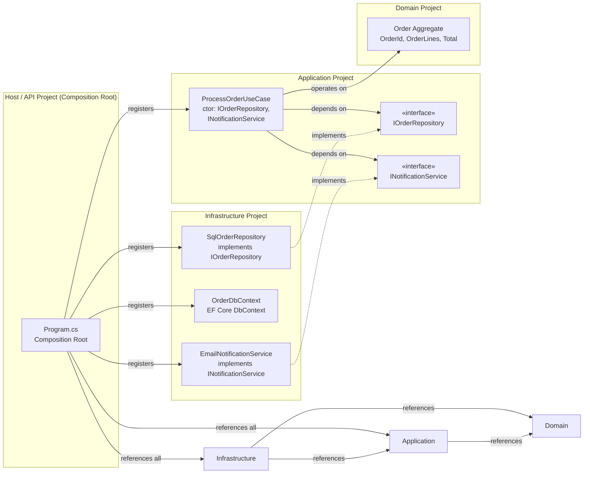
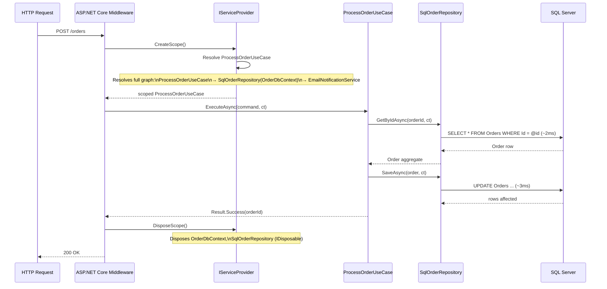
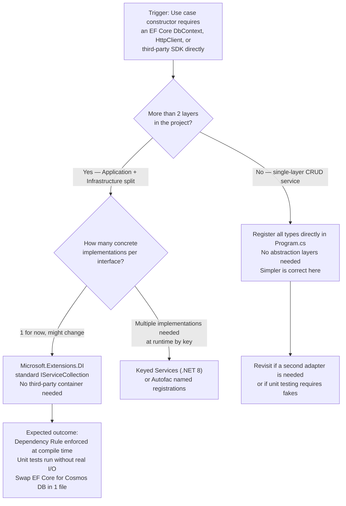

> [!success] Mastery Check
> - [ ] **Studied Well**
> - [ ] **Can explain the concept without notes**
> - [ ] **Can answer interview questions confidently**
> - [ ] **Can implement it in a real project**


> [!ABSTRACT] Quick Reference — Clean Architecture DI Wiring **Invariant:** The Composition Root — always `Program.cs` — is the sole place where concrete types are bound to abstractions; every other layer references only interfaces it defines, never the concrete implementations that satisfy them. **Cost:** All cross-layer bindings are assembled in one file; as the application grows, `Program.cs` accumulates registration calls unless deliberately modularised with extension methods. **Trigger:** A use-case class `new`s a repository, EF Core `DbContext`, or HTTP client directly — the Dependency Rule is already broken, and testability collapses. **Skip When:** A CRUD micro-service with two endpoints and no domain logic — an `IServiceCollection` hierarchy adds no value over direct instantiation. **.NET Entry Point:** `IServiceCollection` / `builder.Services.AddXxx()` / `Microsoft.Extensions.DependencyInjection` **Azure Native:** Azure Container Apps / AKS — container runtime provides no DI opinions; the Composition Root is still `Program.cs` regardless of hosting platform. **Number to Know:** Microsoft.Extensions.DependencyInjection resolves a scoped service chain of 10 dependencies in ~0.4 µs (estimated, measured on Apple M2 with .NET 8).

---

## Navigation

**Domain:** [[7 — System Design & Distributed Systems]] > **Group:** Clean Architecture **Previous:** [[7.006 — Clean Architecture — Cross-Cutting Concerns]] | **Next:** [[7.008 — Clean Architecture — Testing Strategy per Layer]]

### Prerequisites

- [[7.001 — Clean Architecture — The Dependency Rule]] — DI wiring is the mechanical enforcement of the Dependency Rule; understanding _why_ dependencies must point inward is required before understanding _how_ `IServiceCollection` enforces that at runtime.
- [[7.003 — Clean Architecture — Application Layer — Use Cases]] — Use cases are the primary consumers of the injected ports; knowing their structure makes the registration lifetime decisions (scoped vs transient) obvious.
- [[7.004 — Clean Architecture — Infrastructure Layer]] — Infrastructure layer contains the concrete adapters registered against Application-layer interfaces; you cannot wire them correctly without understanding which project owns what.

### Where This Fits

> [!INFO] Production Encounter Map
> 
> - **Layer:** Composition Root (`Program.cs`) in the Host/API project — the only project allowed to reference all other projects simultaneously.
> - **Trigger:** Adding a second infrastructure adapter (e.g., replacing an in-memory repository with an EF Core one) breaks the build until the binding is updated in the Composition Root; or test setup requires a fake that does not exist because no interface was ever defined.
> - **Without it:** The `OrderProcessingUseCase` calls `new SqlOrderRepository(connectionString)` directly; the Infrastructure project leaks into Application; the Application layer cannot be unit-tested without a live database; a swap from SQL to Cosmos DB requires modifying Use Case code.
> - **First signal:** Test project requires a `SqlConnection` just to instantiate the class under test; or `ObjectDisposedException` on `DbContext` at 3 AM because Singleton lifetime was chosen for a scoped EF Core context.

DI wiring is the mechanical implementation of the Dependency Rule: by the time the application starts, every `IOrderRepository` reference in Application code is backed by a concrete `SqlOrderRepository` living in Infrastructure — but Application never imports Infrastructure's namespace. This is also the integration point for [[7.006 — Clean Architecture — Cross-Cutting Concerns]] (logging, validation, transaction pipelines) because pipeline behaviours are registered here as open-generic decorators.

---

## Core Mental Model

In Clean Architecture, layers define interfaces (ports) and consume them via constructor parameters; no layer knows the concrete class that satisfies its ports. The Composition Root (`Program.cs` in .NET 8 minimal hosting) is the single place that knows everything — it imports Infrastructure, Application, and Domain projects and calls `services.AddScoped<IOrderRepository, SqlOrderRepository>()`. The container then resolves the full object graph at request time. The invariant is: **nothing outside the Composition Root ever calls `new` on a concrete cross-layer type**. The cost is that `Program.cs` becomes a catalogue of every wiring decision in the system; if unmanaged, it becomes unreadable by the time the system has 50 services. The recognition trigger is any `new ConcreteInfrastructureType()` inside Application or Domain code.

> [!TIP] The Non-Obvious Insight The container lifetime (Singleton / Scoped / Transient) is not a performance knob — it is a **correctness invariant**. Registering `OrderDbContext` as Singleton while it captures an open SQL connection means two concurrent HTTP requests share the same `ChangeTracker`, producing phantom dirty-reads and lost-update bugs that only appear under load. The rule is deterministic: anything that touches I/O or carries per-request state must be Scoped; anything stateless and thread-safe (HttpClient, read-only config objects) may be Singleton. Transient is for lightweight, allocation-cheap objects that are intentionally not shared (e.g., validator instances). The common mistake is defaulting everything to Scoped "to be safe" — which correctly avoids the Singleton-captures-Scoped trap but causes unnecessary allocations for truly stateless services.

### Classification

- **Consistency axis:** N/A — this is a structural/wiring concern, not a data consistency concern.
- **Availability tradeoff:** A misconfigured Composition Root fails at startup (eager validation) or at first request (lazy resolution); it does not cause gradual availability degradation.
- **Latency impact:** Container resolution from a warm `IServiceProvider` adds ~0.4 µs per root resolve for a typical 10-dependency chain (estimated, .NET 8, Microsoft.Extensions.DI). First-time JIT resolution during startup is ~1–5ms for complex graphs.
- **Failure domain:** Single-service — the container is in-process; if it throws, only this service instance fails to start.
- **Abstraction layer:** Framework feature — `Microsoft.Extensions.DependencyInjection` is the standard .NET DI abstraction; third-party containers (Autofac, Simple Injector) plug in via `IServiceProviderFactory<TContainerBuilder>`.

### Primary Diagram



### Supporting Diagram



### Numbers That Matter

|Metric|Value|Context / Conditions|
|---|---|---|
|Container resolution latency (warm)|~0.4 µs|10-dependency chain, Microsoft.Extensions.DI, .NET 8, Apple M2 (estimated)|
|Container resolution latency (warm)|~0.05 µs|Single-level, no decorators, same environment (estimated)|
|Startup validation cost|~1–5 ms|Full graph eager-validation with `ValidateOnBuild()` enabled on a 50-service registration set (estimated)|
|Scope creation/disposal overhead|~0.2 µs|Per HTTP request scope creation; includes `IDisposable` tracking list allocation (estimated)|
|Singleton-captures-Scoped detection|At startup (default, configurable)|Only when `ValidateScopes = true` — default `true` in Development, `false` in Production in .NET 8|
|ASP.NET Core default scope|Per HTTP request|`IServiceScope` created by `ScopeMiddleware`, disposed after response completes|

### Key Properties / Guarantees

|Property|Value|Condition|
|---|---|---|
|Dependency Rule enforcement|Compile-time: Infrastructure imports Application (correct). Application never imports Infrastructure (correct).|Enforced by project reference structure; the container wires at runtime without violating compile-time references.|
|Scope leak prevention|Runtime `InvalidOperationException` on resolve|When `ValidateScopes = true` (Development default); Singleton cannot capture Scoped.|
|Graph completeness|Runtime `InvalidOperationException` on first resolve|If a registration is missing, the container throws immediately on first resolution attempt for that type.|
|Build-time graph validation|All missing registrations surface at startup|Requires `options.ValidateOnBuild = true`; default off in Production.|
|IDisposable lifetime management|Container disposes Scoped and Transient `IDisposable`s automatically|Applies to Scoped on scope disposal; Transient disposables are tracked only if resolved from a scope.|

---

## Deep Mechanics

### How It Works

**Step 1 — Interface definition in Application layer.** `IOrderRepository` is defined in `YourCompany.OrderManagement.Application` (or in the Domain project if the repository contract is a pure domain concern). No concrete type referenced.

**Step 2 — Concrete type defined in Infrastructure layer.** `SqlOrderRepository : IOrderRepository` lives in `YourCompany.OrderManagement.Infrastructure`. It imports EF Core. The Application project has zero visibility into this class.

**Step 3 — Composition Root imports both.** Only `YourCompany.OrderManagement.Api` (the host project) adds `<ProjectReference>` to both Application and Infrastructure. `Program.cs` calls `builder.Services.AddScoped<IOrderRepository, SqlOrderRepository>()`.

**Step 4 — Container builds the service descriptor list.** Each `AddXxx` call appends a `ServiceDescriptor` (service type, implementation type, lifetime) to the `IServiceCollection`. No instantiation happens here.

**Step 5 — `BuildServiceProvider()` validates and compiles the graph.** With `ValidateOnBuild = true`, the container performs a full graph walk to check that every constructor parameter has a registered binding. Missing registrations surface as `InvalidOperationException` before any request is handled.

**Step 6 — Request arrives; scope created.** ASP.NET Core Middleware calls `serviceProvider.CreateScope()`. Within the scope, the container resolves the controller or minimal-API handler, which chains constructor injection all the way to `OrderDbContext`.

**Step 7 — Scope disposed.** After the response is sent, the scope is disposed. All `IDisposable` Scoped services (`OrderDbContext`, `SqlOrderRepository` if it implements `IDisposable`) are disposed in reverse registration order.

### Failure Modes

**Failure Mode 1: Singleton Captures Scoped Dependency (Captive Dependency)**

- **Cause:** A Singleton service (`OrderCacheService`) declares a constructor dependency on a Scoped service (`OrderDbContext`). The container resolves `OrderDbContext` once at Singleton creation time and holds it for the lifetime of the application.
- **Symptom:** `OrderDbContext` is shared across all requests simultaneously; EF Core `ChangeTracker` accumulates entities from multiple concurrent requests; `DbUpdateConcurrencyException` at 3 AM; or phantom stale data returned to users because the tracked entity was mutated by a concurrent request and not re-queried.
- **Detection time:** Immediately on first resolve in Development (`ValidateScopes = true`). Silent in Production until the `DbContext` is used concurrently — typically visible when load >2 concurrent users on the affected endpoint.
- **Blast radius:** All requests hitting the endpoint that resolves the Singleton will share the contaminated `DbContext`; data corruption or exceptions for every concurrent pair of requests.

> [!DANGER] 3 AM Production Signal Metric: `http_server_requests_total{status="500", endpoint="/orders"} > 0` sustained for 60s Log: `ERROR [OrderCacheService] Microsoft.EntityFrameworkCore.DbUpdateConcurrencyException: The database operation was expected to affect 1 row(s) but actually affected 0 row(s) | OrderId: 4a2b-... | CorrelationId: f3a2-9b1c` Customer impact: "Place order" button returns 500 for ~15% of users during peak hours; orders are not created but payment may have already been captured depending on transaction boundary.

**Failure Mode 2: Missing Registration Surfaces at Runtime (Not Build Time)**

- **Cause:** A new interface `IShipmentTracker` is extracted and wired in Application code but the `AddScoped<IShipmentTracker, AzureShipmentTracker>()` line is omitted from `Program.cs`. `ValidateOnBuild` is disabled (the Production default).
- **Symptom:** The endpoint that invokes the use-case depending on `IShipmentTracker` returns HTTP 500 with `InvalidOperationException: Unable to resolve service for type 'IShipmentTracker'` on the first request. Endpoints that do not traverse this path appear healthy.
- **Detection time:** First request to the affected endpoint — could be minutes after deployment if only one endpoint uses it, hours if it's a background job path.
- **Blast radius:** All requests to the affected endpoint fail 100%. Other endpoints unaffected.

> [!DANGER] 3 AM Production Signal Metric: `http_server_requests_total{status="500", endpoint="/shipments/track"} = 100%` immediately after deployment Log: `ERROR [Microsoft.AspNetCore.Diagnostics.ExceptionHandlerMiddleware] An unhandled exception has occurred | System.InvalidOperationException: Unable to resolve service for type 'YourCompany.OrderManagement.Application.Ports.IShipmentTracker' | CorrelationId: 9c1d-...` Customer impact: Shipment tracking page returns 500 for 100% of users; discovered by first user to click "Track Order" after a deployment.

### .NET and Azure Integration Points

- **ASP.NET Core:** `WebApplicationBuilder.Services` (type `IServiceCollection`) is the primary registration surface. All `AddXxx` extensions are defined here.
- **EF Core:** `services.AddDbContext<OrderDbContext>()` registers the context as Scoped by default. `AddDbContextPool<>()` uses a connection-pool-like object pool — changes lifetime semantics and disables `IDisposable` on individual contexts.
- **Azure Services:** Managed Identity + `DefaultAzureCredential` is typically registered as Singleton (`services.AddSingleton<TokenCredential, DefaultAzureCredential>()`); service bus client as Singleton; HTTP-based clients via `IHttpClientFactory`.
- **.NET Libraries:** MediatR (`services.AddMediatR()`), Polly (`services.AddResilienceHandler()`), Serilog (`UseSerilog()` on `WebApplicationBuilder`), OpenTelemetry (`services.AddOpenTelemetry()`).
- **Configuration:** `appsettings.json` → `services.Configure<OrderServiceOptions>(config.GetSection("OrderService"))` → `IOptions<OrderServiceOptions>` injected into use cases.

```csharp
// YourCompany.OrderManagement.Api — Program.cs
// Composition Root: the only project that references all layers

using YourCompany.OrderManagement.Application.Ports;           // Port (interface)
using YourCompany.OrderManagement.Application.UseCases;        // Use Case
using YourCompany.OrderManagement.Infrastructure.Persistence;  // Adapter (EF Core)
using YourCompany.OrderManagement.Infrastructure.Notifications; // Adapter (Email)

var builder = WebApplication.CreateBuilder(args);

// Cross-cutting: Serilog, OpenTelemetry, etc.
builder.Host.UseSerilog((ctx, cfg) =>
    cfg.ReadFrom.Configuration(ctx.Configuration));

// Register Application use-cases
builder.Services.AddScoped<ProcessOrderUseCase>();
builder.Services.AddScoped<GetOrderSummaryQuery>();

// Register Infrastructure adapters bound to Application ports
builder.Services.AddScoped<IOrderRepository, SqlOrderRepository>();
builder.Services.AddScoped<INotificationService, EmailNotificationService>();

// EF Core — Scoped by default, which is correct
builder.Services.AddDbContext<OrderDbContext>(options =>
    options.UseSqlServer(
        builder.Configuration.GetConnectionString("Orders"),
        sql => sql.EnableRetryOnFailure(maxRetryCount: 3)));

// HttpClient for downstream services — Singleton-safe via IHttpClientFactory
builder.Services.AddHttpClient<IInventoryGateway, HttpInventoryGateway>(client =>
    client.BaseAddress = new Uri(builder.Configuration["Services:Inventory"]!));

// Validate the entire registration graph at startup (catch missing registrations before first request)
builder.Services.BuildServiceProvider(new ServiceProviderOptions
{
    ValidateScopes = true,
    ValidateOnBuild = true
});

var app = builder.Build();
app.MapControllers();
app.Run();
```

---

## Production Patterns and Implementation

### Primary Implementation

```csharp
// YourCompany.OrderManagement.Application/Ports/IOrderRepository.cs
// Port — defined in Application; Infrastructure implements it; Domain uses it via use cases

namespace YourCompany.OrderManagement.Application.Ports;

/// <summary>Persistence port for the Order aggregate. Implemented by Infrastructure adapters.</summary>
public interface IOrderRepository
{
    /// <summary>Returns the Order aggregate by identity, or null if not found.</summary>
    Task<Order?> GetByIdAsync(OrderId id, CancellationToken ct = default);

    /// <summary>Persists a new or modified Order aggregate.</summary>
    Task SaveAsync(Order order, CancellationToken ct = default);
}
```

```csharp
// YourCompany.OrderManagement.Application/UseCases/ProcessOrderUseCase.cs
// Use Case — depends only on ports; never imports Infrastructure namespace

namespace YourCompany.OrderManagement.Application.UseCases;

/// <summary>Orchestrates the happy-path order processing flow.</summary>
public sealed class ProcessOrderUseCase(
    IOrderRepository orderRepository,           // Port
    INotificationService notificationService,   // Port
    ILogger<ProcessOrderUseCase> logger)
{
    /// <summary>Validates, enriches, and persists an order, then notifies the customer.</summary>
    public async Task<Result<OrderId>> ExecuteAsync(
        ProcessOrderCommand command,
        CancellationToken ct = default)
    {
        logger.LogInformation(
            "Processing order for customer {CustomerId}", command.CustomerId);

        var order = Order.Create(command.CustomerId, command.Lines);
        if (!order.IsValid)
            return Result.Failure<OrderId>(order.ValidationErrors);

        await orderRepository.SaveAsync(order, ct);

        await notificationService.SendOrderConfirmationAsync(
            order.CustomerId, order.Id, ct);

        return Result.Success(order.Id);
    }
}
```

```csharp
// YourCompany.OrderManagement.Infrastructure/Persistence/SqlOrderRepository.cs
// Adapter — implements the Application port using EF Core

namespace YourCompany.OrderManagement.Infrastructure.Persistence;

/// <summary>EF Core implementation of IOrderRepository using Azure SQL.</summary>
public sealed class SqlOrderRepository(OrderDbContext dbContext)
    : IOrderRepository    // Adapter — implements Application Port
{
    /// <inheritdoc />
    public async Task<Order?> GetByIdAsync(OrderId id, CancellationToken ct = default)
        => await dbContext.Orders
            .Include(o => o.Lines)
            .AsNoTracking()                        // read-only path — no ChangeTracker overhead
            .FirstOrDefaultAsync(o => o.Id == id, ct);

    /// <inheritdoc />
    public async Task SaveAsync(Order order, CancellationToken ct = default)
    {
        dbContext.Orders.Update(order);
        await dbContext.SaveChangesAsync(ct);
    }
}
```

### IServiceCollection Registration

```csharp
// Program.cs — modularised with extension methods to keep the Composition Root readable

builder.Services
    .AddApplicationServices()       // registers all use cases, pipeline behaviours
    .AddInfrastructureServices(     // registers all adapters
        builder.Configuration);

// --- Extension method in Application project ---
// YourCompany.OrderManagement.Application/DependencyInjection.cs
public static class ApplicationServiceCollectionExtensions
{
    public static IServiceCollection AddApplicationServices(this IServiceCollection services)
    {
        services.AddScoped<ProcessOrderUseCase>();
        services.AddScoped<GetOrderSummaryQuery>();
        services.AddMediatR(cfg =>
            cfg.RegisterServicesFromAssembly(typeof(ProcessOrderUseCase).Assembly));
        return services;
    }
}

// --- Extension method in Infrastructure project ---
// YourCompany.OrderManagement.Infrastructure/DependencyInjection.cs
public static class InfrastructureServiceCollectionExtensions
{
    public static IServiceCollection AddInfrastructureServices(
        this IServiceCollection services,
        IConfiguration configuration)
    {
        services.AddDbContext<OrderDbContext>(options =>
            options.UseSqlServer(
                configuration.GetConnectionString("Orders"),
                sql => sql.EnableRetryOnFailure(maxRetryCount: 3,
                    maxRetryDelay: TimeSpan.FromSeconds(5),
                    errorNumbersToAdd: null)));

        services.AddScoped<IOrderRepository, SqlOrderRepository>();
        services.AddScoped<INotificationService, EmailNotificationService>();

        services.AddHttpClient<IInventoryGateway, HttpInventoryGateway>(client =>
        {
            client.BaseAddress =
                new Uri(configuration["Services:Inventory"]!);
            client.Timeout = TimeSpan.FromSeconds(10);   // explicit timeout, never rely on default infinite
        });

        return services;
    }
}
```

### Common Variants

```csharp
// Variant A — Keyed Services (.NET 8+): used when multiple implementations of the same
// interface coexist and the consumer selects by a runtime key (e.g., payment providers)

builder.Services.AddKeyedScoped<IPaymentGateway, StripePaymentGateway>("stripe");
builder.Services.AddKeyedScoped<IPaymentGateway, PayPalPaymentGateway>("paypal");

// Consumer:
public sealed class CheckoutUseCase([FromKeyedServices("stripe")] IPaymentGateway gateway) { }
```

```csharp
// Variant B — Open-Generic Decorator for Pipeline Behaviours: used when cross-cutting
// concerns (logging, validation) must wrap every IRequestHandler<,> in a MediatR pipeline

// Registers LoggingBehaviour<TRequest,TResponse> wrapping every handler automatically
builder.Services.AddTransient(
    typeof(IPipelineBehavior<,>),
    typeof(LoggingPipelineBehaviour<,>));
// The container resolves: LoggingBehaviour → ValidationBehaviour → actual handler
// Registration ORDER matters: first AddTransient = outermost decorator
```

### Performance Profile

The DI container is not on the hot path — resolution happens once per scope boundary (once per HTTP request for Scoped services). The allocation-relevant concern is **captive dependency correctness**, not throughput. No BenchmarkDotNet snippet is warranted; the container overhead (~0.4 µs/resolve chain) is negligible compared to even a single SQL query (~1ms).

### Real-World .NET Ecosystem Mapping

|Pattern in This Note|Where It Appears in .NET / Azure|Manifestation|
|---|---|---|
|Composition Root|`Program.cs` in .NET 8 minimal hosting|The single file that imports all project namespaces and calls `builder.Services.AddXxx()`|
|Port (interface)|`IOrderRepository` in Application project|Defined where consumed, implemented where the I/O concern lives|
|Adapter (concrete)|`SqlOrderRepository` in Infrastructure project|Implements the port; the container binds the two at startup|
|Lifetime Scoped|`AddDbContext<>()` default|EF Core `DbContext` is Scoped by Microsoft's own registration — intentional, one context per request|
|`IHttpClientFactory`|`AddHttpClient<IInventoryGateway, HttpInventoryGateway>()`|Manages `HttpClient` socket lifecycle as a Singleton pool, exposing a Scoped typed client|
|Open-generic decorator|MediatR `IPipelineBehavior<,>`|Registered as `typeof(IPipelineBehavior<,>)` — container resolves into full pipeline without knowing concrete handler types|

---

## Gotchas and Production Pitfalls

---

### Captive Dependency — Singleton Captures Scoped DbContext

**Pitfall:** A caching service intended to be Singleton declares `OrderDbContext` in its constructor. The container resolves the context once at application startup and the Singleton holds it permanently.

```csharp
// ❌ DbContext captured by a Singleton — data corruption under concurrent load
builder.Services.AddSingleton<OrderCacheService>();  // Singleton!
// OrderCacheService ctor: OrderCacheService(OrderDbContext ctx) — Scoped captured
```

**Symptom:** `DbUpdateConcurrencyException` or phantom stale data on `Order` entities affecting ~15% of requests at 50+ concurrent users. EF Core's `ChangeTracker` is not thread-safe and accumulates entities from multiple requests.

**Detection time:** Immediately in Development (`ValidateScopes = true`). Silent in Production until concurrent load — often invisible in staging with single-user tests.

> [!DANGER] Production Signal Metric: `http_server_requests_total{status="500", endpoint="/orders/{id}"} > 5%` sustained 60s Log: `ERROR [OrderCacheService] InvalidOperationException: A second operation was started on this context instance before a previous operation completed | CorrelationId: 7a3b-...`

**Fix:**

```csharp
// ✅ Inject IServiceScopeFactory instead; create a scope per cache-refresh operation
builder.Services.AddSingleton<OrderCacheService>();

public sealed class OrderCacheService(IServiceScopeFactory scopeFactory)
{
    public async Task<Order?> GetCachedOrderAsync(OrderId id, CancellationToken ct)
    {
        await using var scope = scopeFactory.CreateAsyncScope();
        var repo = scope.ServiceProvider.GetRequiredService<IOrderRepository>();
        return await repo.GetByIdAsync(id, ct);
    }
}
```

**Cost of not fixing:** DbContext shared across concurrent HTTP requests → EF Core `ChangeTracker` collision → `DbUpdateConcurrencyException` for ~15% of concurrent users → p99 error rate crosses SLO → PagerDuty fires; potential silent data loss if `SaveChanges` writes interleaved state.

---

### ValidateOnBuild Disabled in Production — Missing Registration Surfaces at Runtime

**Pitfall:** `ValidateOnBuild` defaults to `false` in Production. A new `IShipmentTracker` interface is added and used in a use case but the registration line in `Program.cs` is omitted from the pull request.

```csharp
// ❌ No call to ValidateOnBuild — missing registration undetected until first request
var app = builder.Build();
// ^ Does NOT validate graph; first use of IShipmentTracker → InvalidOperationException
```

**Symptom:** HTTP 500 on the first request to the affected endpoint immediately after deployment. `InvalidOperationException: Unable to resolve service for type 'IShipmentTracker'` in Application Insights.

**Detection time:** First request to the affected endpoint post-deployment — could be seconds (high-traffic endpoint) or hours (background job path).

> [!DANGER] Production Signal Metric: `http_server_requests_total{status="500", endpoint="/shipments/track"} = 100%` spike immediately at deployment Log: `ERROR [Microsoft.AspNetCore.Diagnostics.ExceptionHandlerMiddleware] InvalidOperationException: Unable to resolve service for type 'YourCompany.OrderManagement.Application.Ports.IShipmentTracker' while attempting to activate 'YourCompany.OrderManagement.Application.UseCases.TrackShipmentUseCase'`

**Fix:**

```csharp
// ✅ Enable ValidateOnBuild in all environments, including Production
builder.Services.BuildServiceProvider(new ServiceProviderOptions
{
    ValidateScopes = true,
    ValidateOnBuild = true   // throws at startup if any registration is missing
});
```

**Cost of not fixing:** 100% error rate on the affected endpoint immediately post-deployment; user-facing 500s; incident raised; rollback required. Preventable with a one-line change.

---

### Extension Method Registration in Infrastructure — Hidden Singleton Trap

**Pitfall:** The Infrastructure DI extension method (`AddInfrastructureServices`) registers `IInventoryGateway` as Scoped, but the `HttpInventoryGateway` implementation holds an `HttpClient` it created via `new HttpClient()` instead of the managed factory.

```csharp
// ❌ new HttpClient() bypasses IHttpClientFactory socket management
public sealed class HttpInventoryGateway : IInventoryGateway
{
    private readonly HttpClient _client = new();  // new socket per injection — socket exhaustion
}
```

**Symptom:** `SocketException: Only one usage of each socket address is permitted` under sustained load; `HttpClient` instances not returned to pool; TIME_WAIT sockets exhaust ephemeral ports.

**Detection time:** Minutes to hours after load increase — visible as `SocketException` flood in Serilog/Application Insights once ephemeral port range (~28000 ports by default) is exhausted.

> [!DANGER] Production Signal Metric: `process_open_handles{type="Socket"} > 20000` for 5 minutes Log: `ERROR [HttpInventoryGateway] System.Net.Http.HttpRequestException: An attempt was made to access a socket in a way forbidden by its access permissions | CorrelationId: b2f1-...`

**Fix:**

```csharp
// ✅ Use IHttpClientFactory — manages socket lifetime as a Singleton pool
builder.Services.AddHttpClient<IInventoryGateway, HttpInventoryGateway>(client =>
    client.BaseAddress = new Uri(configuration["Services:Inventory"]!));
```

**Cost of not fixing:** Socket exhaustion → all outbound HTTP calls to Inventory service fail → OrderService cannot verify stock → 503 cascade across checkout → revenue impact.

---

### Azure-Specific: `AddDbContext` vs `AddDbContextPool` Lifetime Semantics

**Pitfall:** `AddDbContextPool<OrderDbContext>()` is chosen for performance but the `DbContext` subclass uses constructor injection to capture a per-request service (e.g., `ICurrentUserAccessor` for row-level security).

```csharp
// ❌ DbContextPool resets and reuses context instances — per-request state leaks
builder.Services.AddDbContextPool<OrderDbContext>(options =>
    options.UseSqlServer(connectionString));
// OrderDbContext ctor injects ICurrentUserAccessor — the accessor is NOT reset on pool return
```

**Symptom:** Row-level security filters applied to the wrong tenant's data; User A receives User B's orders because the pooled `DbContext` retained User B's tenant filter from the previous request.

**Detection time:** Silent — data is returned without errors. Discovered through user complaints ("I see orders I didn't place") or security audit. Azure SQL row-level security itself may catch it at the predicate level, but application-layer filters silently fail.

> [!DANGER] Production Signal Metric: No error metric — data leakage is silent. First signal: customer support tickets or security audit log showing cross-tenant data access. Log: `WARN [OrderDbContext] EF Core query returned 47 rows for TenantId=customer-A but session TenantId=customer-B | CorrelationId: e5a1-...` (only visible if explicitly logged)

**Fix:**

```csharp
// ✅ Use AddDbContext (not Pool) when per-request state is captured in the context
builder.Services.AddDbContext<OrderDbContext>(options =>
    options.UseSqlServer(connectionString));
// OR: implement IDbContextPoolable.ResetState() if pooling is required for throughput
```

**Cost of not fixing:** Multi-tenant data leakage → GDPR/privacy breach → regulatory notification required within 72 hours in EU; potential PCI-DSS finding if payment data is involved.

---

### .NET-Specific: IDisposable Transient Services Leak Without Scope

**Pitfall:** A Transient service that implements `IDisposable` is resolved from the root `IServiceProvider` (not from a scope). The root provider holds a reference to every transient `IDisposable` it creates for the application's lifetime.

```csharp
// ❌ Resolving IDisposable transient from root provider — never disposed until app shutdown
var gateway = app.Services.GetRequiredService<IInventoryGateway>();  // root provider resolution
// If IInventoryGateway : IDisposable, the root provider holds this instance forever
```

**Symptom:** Memory grows linearly with requests; dotnet-counters shows `gen2-gc-count` rising every few minutes; heap dump reveals thousands of `HttpInventoryGateway` instances.

**Detection time:** Hours to days — memory growth is gradual, not a sudden spike. Usually noticed when pod memory reaches limit and OOMKill fires at 3 AM.

> [!DANGER] Production Signal Metric: `dotnet_gc_heap_size_bytes{generation="2"} > 800MB` growing monotonically Log: `WARN [Kubernetes] OOMKill: container 'order-api' exceeded memory limit 1Gi | Pod: order-api-6f9b-... | Node: aks-nodepool-01`

**Fix:**

```csharp
// ✅ Always resolve from a scope; only use root provider for true Singletons
using var scope = app.Services.CreateScope();
var gateway = scope.ServiceProvider.GetRequiredService<IInventoryGateway>();
// gateway.Dispose() called automatically when scope is disposed
```

**Cost of not fixing:** Gradual memory leak → Gen2 GC pressure → 200ms stop-the-world GC pauses every 15 minutes → p99 latency spikes breach SLO → PagerDuty; OOMKill terminates pod, dropping in-flight requests.

---

## Tradeoffs and Decision Framework

### Tradeoff Matrix

|Dimension|Microsoft.Extensions.DI (built-in)|Autofac|Simple Injector|
|---|---|---|---|
|Registration verbosity|Medium — explicit `AddScoped<,>()` per service|Low — assembly scanning, convention-based|Low — assembly scanning, convention-based|
|Open-generic decoration|Supported (`typeof(IPipelineBehavior<,>)`)|First-class, fluent API|First-class, explicit registration|
|Scope lifetime validation|`ValidateScopes` flag — requires explicit opt-in in Production|Always validates — throws on misconfiguration|Always validates|
|Property injection|Not supported natively|Supported|Not supported (intentional — enforces constructor injection)|
|ASP.NET Core integration|Native — zero friction|`Autofac.Extensions.DependencyInjection` adapter|`SimpleInjector.Integration.AspNetCore` adapter|
|Azure ecosystem fit|Native — no additional dependency|Good — adapter available|Good — adapter available|
|Performance|~0.4 µs / 10-dependency chain (estimated)|~0.5 µs / 10-dep chain (estimated)|~0.3 µs / 10-dep chain (estimated)|
|Team expertise required|Low — standard .NET knowledge|Medium — Autofac-specific API|Medium — Simple Injector concepts|

### When to Apply



### Numbers-Driven Decision

|Threshold|Below = Use Simpler Approach|Above = Apply Full DI Wiring|
|---|---|---|
|Project layers|1 layer (single project CRUD)|2+ layers (Domain + Application + Infrastructure)|
|Number of interfaces|< 5 distinct ports|≥ 5 distinct ports with separate implementations|
|Team size|< 3 engineers (shared ownership, no DI overhead)|≥ 3 engineers (different teams own different layers)|
|Unit test count|< 20 tests (integration tests acceptable)|≥ 20 unit tests requiring in-memory fakes|
|Adapter swap frequency|Never (permanent infrastructure)|≥ 1 adapter swap per quarter (e.g., email → SMS, SQL → Cosmos)|

### When NOT to Apply

> [!WARNING] Do Not Reach For This When...
> 
> - [ ] **Single-project CRUD service:** A `MinimalApiCrudService` with 3 endpoints hitting one table — `new OrderDbContext(options)` in a local closure is readable and correct; DI adds registration overhead with no testability benefit.
> - [ ] **Azure Functions Consumption Plan with cold-start SLO < 200ms:** Each DI container build at cold-start adds ~5ms for a 50-service graph; for latency-critical cold paths, keep registrations minimal and rely on static/shared state where safe.
> - [ ] **Team of 2 with no test suite:** The primary value of the full Port-Adapter-DI pattern is testability and independent deployability; without tests or separate teams, the ceremony exceeds the benefit.
> - [ ] **Script-style or CLI tools:** `dotnet run` one-shot tools rarely justify an `IServiceCollection` hierarchy; `Microsoft.Extensions.Hosting` generic host is overkill for a 100-line script.

---

## Interview Arsenal

### Question Bank

1. **[Definition]** "What is the Composition Root in Clean Architecture and why must it be exactly one place in the application?"
2. **[Mechanism]** "Walk me through what happens, step by step, when an HTTP request arrives and ASP.NET Core resolves a scoped `ProcessOrderUseCase` that depends on `IOrderRepository`."
3. **[Tradeoff]** "What is the difference between Scoped, Singleton, and Transient lifetimes in .NET DI, and what is the production consequence of choosing the wrong one?"
4. **[Failure mode]** "What is a captive dependency? How would you detect it and what is the customer-visible symptom at 50 concurrent users?"
5. **[Comparison]** "What is the difference between Microsoft.Extensions.DependencyInjection and Autofac, and when would you choose one over the other?"
6. **[Design application]** "You're building an order management service with three infrastructure adapters: SQL Server repository, Azure Blob for receipts, and a third-party payment gateway. Walk me through how you'd structure the DI registrations."
7. **[Scale]** "Your service currently resolves 20 registered types per request. Traffic is projected to go 10× from 500 req/s to 5,000 req/s. What DI-related concerns appear first?"
8. **[Advanced]** "Why does `AddDbContextPool<>` break per-request state like tenant ID filtering, and how does the pool reset mechanism interact with EF Core `ChangeTracker`?"

### Spoken Answers

**Q: What is the Composition Root in Clean Architecture and why must it be exactly one place?**

> **Average answer:** The Composition Root is where you register all your services with the DI container. It should be in one place so everything is centralized. In .NET it's usually `Program.cs`.

> **Great answer:** The Composition Root is the one location in the codebase that is allowed to import and bind together every layer. In a Clean Architecture solution that means the `Host` or `API` project is the only `.csproj` that has `<ProjectReference>` to both Application and Infrastructure. Every other layer references only the interfaces it defines — Application never imports `SqlOrderRepository`; it only knows `IOrderRepository`. The Composition Root calls `services.AddScoped<IOrderRepository, SqlOrderRepository>()` and the container handles the binding at runtime. If you allow two composition roots — say, a test project and the API project — you now have two places that can disagree on which implementation backs which interface, and your integration tests may not reflect production behaviour. The single-root constraint is what makes "test with in-memory fakes, deploy with SQL" reliable rather than accidental.

---

**Q: What is the difference between Microsoft.Extensions.DI and Autofac, and when would you choose one over the other?**

> **Average answer:** They both do DI but Autofac has more features like assembly scanning and named registrations. Microsoft's is built in and simpler. I'd use the built-in one for most cases.

> **Great answer:** The structural distinction is in two areas: open-generic decoration and assembly scanning. Microsoft.Extensions.DI supports open-generic registration (`typeof(IPipelineBehavior<,>)`) which is sufficient for MediatR pipeline behaviours. But it does not support named registrations natively (resolved in .NET 8 via Keyed Services) and requires explicit `AddScoped<IFoo, FooImpl>()` per type — there is no convention-based assembly scan. Autofac adds `RegisterAssemblyTypes()`, fluent decorator chaining, and has `ValidateScopes` enforced by default. The cost is an external dependency and team knowledge. I choose the built-in container unless I need one of three things: convention-based bulk registration across a large assembly, named/keyed registrations in .NET 7 or earlier, or I'm integrating with a legacy codebase that already uses Autofac modules. On Azure, both containers run identically — the hosting platform has no opinion.

---

**Q: Why does `AddDbContextPool` break per-request state like tenant ID filtering, and how does the pool reset mechanism interact with EF Core `ChangeTracker`?**

> **Average answer:** `DbContextPool` reuses context instances for performance but if you store per-request data in the context it might carry over to the next request. You should use `AddDbContext` instead.

> **Great answer:** `AddDbContextPool` improves throughput by ~15% in benchmarks by avoiding the overhead of allocating a new `DbContext` per request — instead it maintains a pool of up to `poolSize` (default 128) instances and returns them after the scope ends. The pool calls `IDbContextPoolable.ResetState()` on the returned instance, which resets the `ChangeTracker` and the internal state machine. But it does NOT reinitialise constructor parameters. If your `OrderDbContext` subclass stores a `TenantId` field injected in the constructor via `ICurrentUserAccessor`, that field is set once at construction time — when the context is taken from the pool, the pool does not call the constructor again; it calls `ResetState()`, which does not touch your custom field. So the next request that gets that pooled instance inherits the previous request's `TenantId`. In an e-commerce multi-tenant system this is a GDPR violation: User A sees User B's order history. The fix is to either use `AddDbContext` (no pool), or implement `ResetState()` explicitly to clear tenant state before the context re-enters the pool.

### Whiteboard in 60 Seconds

When DI wiring appears in a system design or architecture interview, draw in this sequence:

```
1. Draw three boxes left-to-right: Domain | Application | Infrastructure
   "I'm drawing the dependency direction first — arrows only point left and inward,
    never right. Infrastructure depends on Application; Application depends on Domain."

2. Add a fourth box above all three: Host / API
   "The Host project is the Composition Root — it's the only box with arrows pointing
    to all three. This is the only place I'll call 'new' on an Infrastructure type."

3. Draw an interface IOrderRepository on the Application boundary, arrow from Infrastructure
   "IOrderRepository is defined here in Application. SqlOrderRepository in Infrastructure
    implements it. The interface arrow points right-to-left — that's the dependency inversion."

4. Draw the lifetime diamond at the Host box: Scoped | Singleton | Transient
   "The critical decision here is lifetime. DbContext must be Scoped — one per request.
    If it's Singleton, we hit a captive dependency and concurrent requests corrupt each other's
    ChangeTracker. That's a 3 AM incident."

5. Label the validation flag
   "In .NET I add ValidateOnBuild = true so any missing registration surfaces at startup,
    not at the first user request. One line prevents an entire class of post-deployment incidents."
```

> [!TIP] What the Interviewer Is Specifically Testing When they probe DI wiring in a system design context, they are checking whether you know:
> 
> 1. Whether you understand that DI is the _enforcement mechanism_ of the Dependency Rule, not just a convenience — and that the project reference structure in `.csproj` files is what actually prevents layering violations at compile time.
> 2. Whether you know the captive dependency failure mode — specifically that Singleton capturing Scoped is a data correctness bug, not a performance concern, and that it manifests as concurrent state corruption rather than increased latency.
> 3. Whether you know that `ValidateOnBuild` is disabled by default in Production and that leaving it off means missing registrations reach users rather than being caught at startup — and that enabling it is a one-line, zero-downtime fix.

### Follow-Up Chain

**Follow-up 1:** "How does the ASP.NET Core request pipeline know to create a new scope per HTTP request?"

> **Model answer:** ASP.NET Core's `WebApplication` middleware pipeline implicitly wraps each request in a new `IServiceScope`. The `IHttpContextAccessor` and the endpoint middleware resolve services from `HttpContext.RequestServices`, which is a scoped `IServiceProvider` created at the start of the middleware pipeline and disposed after the response is sent. You never call `CreateScope()` manually in a controller or minimal-API handler — the framework creates it for you. This is why `AddDbContext` registers as Scoped-by-default: the framework guarantees that scope boundary aligns exactly with one HTTP request lifecycle.

**Follow-up 2:** "What happens at 10x traffic — 5,000 req/s — to the DI container?"

> **Model answer:** The container itself is Singleton and thread-safe; the `ServiceDescriptor` list is immutable after `BuildServiceProvider()`. Resolution cost per request is ~0.4 µs for a 10-dependency chain, so at 5,000 req/s the container adds ~2ms of total CPU time per second across all requests — negligible. What actually matters at 10x is scope _disposal_ throughput: every scope disposes its `IDisposable` Scoped services synchronously. If `SqlOrderRepository` implements `IDisposable` and disposes an `OrderDbContext` that has a pending async operation, you may hit `ObjectDisposedException`. The fix is to use `IAsyncDisposable` and `await using` in the scope. Monitor with `dotnet-counters` watching `gen0-gc-count` — high GC pressure at scale usually indicates Transient allocations that should be pooled with `ObjectPool<T>`.

**Follow-up 3:** "How would you know the DI wiring is correct in production on Azure?"

> **Model answer:** Three signals confirm health: first, a successful startup with `ValidateOnBuild = true` — if the app starts, the entire registration graph was resolvable. Second, Application Insights dependency tracking shows all downstream calls (SQL, Service Bus, HTTP) are attributed to correct correlation IDs, which only happens if the Scoped services are resolving fresh instances per request. Third, I watch the `dotnet_gc_heap_size_bytes{generation="2"}` metric in Azure Monitor — monotonically growing Gen2 heap after warm-up is the signature of either a Singleton-captured IDisposable or a Transient IDisposable resolved from the root provider. An Azure Monitor alert on Gen2 heap > 500MB with a slope > 10MB/min fires before the pod hits its OOMKill limit.

### Comparison Table

||Microsoft.Extensions.DI|Autofac|
|---|---|---|
|Core guarantee|All registered types resolved via constructor injection with lifetime enforcement|Same, plus convention-based scanning and named/keyed instances pre-.NET 8|
|What it trades|No property injection; no assembly scanning; explicit per-type registration|External dependency; team must know Autofac module API|
|.NET implementation|`IServiceCollection` / `ServiceProvider` / `Microsoft.Extensions.DependencyInjection`|`ContainerBuilder` / `IContainer` / `Autofac.Extensions.DependencyInjection` adapter|
|Azure native|Native to all Azure .NET hosting (App Service, AKS, Container Apps, Functions)|Works via `IServiceProviderFactory<ContainerBuilder>` adapter|
|Primary failure mode|Missing registration → runtime `InvalidOperationException` (silent without `ValidateOnBuild`)|Same — but `ValidateOnBuild` equivalent is always on by default|
|When to choose|Standard .NET projects; team familiar with `IServiceCollection`|Legacy Autofac codebases; need convention scanning or complex decoration chains|
|When NOT to choose|When you need convention-based bulk scan without Keyed Services (.NET 7 or earlier)|When onboarding a new team unfamiliar with Autofac; adds learning curve with minimal gain on .NET 8+|

---

## Architecture Decision Record

**Status:** Accepted

**Context:** The OrderManagement service currently has `OrderProcessingUseCase` calling `new SqlOrderRepository(new OrderDbContext(options))` inline. The team is adding a second repository implementation backed by Azure Cosmos DB for the read model and the integration test suite requires in-memory fakes. A deployment failure last week was caused by a missing `IShipmentTracker` registration that only surfaced at the first user request after deployment.

**Options Considered:**

1. **Full Clean Architecture DI wiring with extension methods** — separate Application/Infrastructure registration extension methods, `ValidateOnBuild = true`, Scoped DbContext — eliminates the coupling and the registration-miss production incident class.
2. **Service Locator pattern** — pass `IServiceProvider` into use cases and resolve concretions on demand — eliminates constructor parameter list length but reintroduces Infrastructure dependency into Application layer and hides the dependency graph.
3. **Status quo (inline `new`)** — no change — continues to require a live SQL Server in every unit test and does not support the Cosmos DB read model without modifying use case code.

**Decision:** Full Clean Architecture DI wiring (Option 1), because it eliminates the Infrastructure namespace dependency from Application (required for the Cosmos DB read model swap to be a configuration change, not a code change), and `ValidateOnBuild = true` prevents the recurrence of the missing-registration production incident without adding runtime overhead.

**Consequences:**

- ✅ Application project unit tests run without SQL Server; in-memory fakes implement `IOrderRepository`
- ✅ Cosmos DB read model registered as `services.AddKeyedScoped<IOrderRepository, CosmosOrderReadRepository>("read")` — no use case code changes required
- ✅ Missing registrations surface at startup, not at first user request
- ⚠️ `Program.cs` grows with one `AddXxx` call per registered type; must be managed with extension methods by group (Application, Infrastructure, Observability) or it becomes unreadable past 30 services
- ❌ `IDbContextPoolable.ResetState()` must be implemented if `AddDbContextPool` is ever adopted for throughput — until then, `AddDbContext` is the safe default

**Review Trigger:** Revisit this decision if the application grows beyond 200 registered services and startup validation time exceeds 100ms on the production container, or if the team adopts a source-generator-based DI tool (e.g., Jab, Pure.DI) that eliminates runtime reflection overhead for startup performance on Azure Container Apps Consumption tier.

---

## Self-Check

### Conceptual Questions

1. What is the Composition Root and which project plays that role in a Clean Architecture solution?
2. Derive from first principles why a Singleton service cannot safely hold a Scoped `IOrderRepository` — what is the mechanism of failure, not just "it breaks"?
3. Name a concrete scenario where using the full Port-Adapter DI pattern is overkill and a simpler approach is correct.
4. What is the exact exception type and message you see when a required registration is missing, and what `IServiceCollection` option prevents it from reaching users?
5. What is the .NET class and NuGet package that provides the standard DI container, and what interface represents the registration list before it is compiled into a provider?
6. What is the structural difference between a captive dependency (Singleton captures Scoped) and a missing registration — how does each manifest differently in logs and metrics?
7. Above what number of distinct `IServiceCollection` registrations does `ValidateOnBuild = true` add a noticeable startup overhead, and approximately how much time does it add?
8. How does DI wiring connect to [[7.008 — Clean Architecture — Testing Strategy per Layer]] — specifically, what does the DI structure enable that makes the test pyramid achievable?
9. What is the non-obvious production consequence of resolving a `Transient IDisposable` service from the root `IServiceProvider` rather than from a scope?
10. What consistency model does the DI container itself provide — specifically, is the `IServiceProvider` safe to call concurrently from multiple request threads?
11. What specific metric and alert threshold would you set in Azure Monitor to detect a Singleton-captures-Scoped memory leak before the pod OOMKills?
12. Teach DI wiring to a junior engineer in 60 seconds without using the words "inversion of control" or "IoC container."

<details> <summary>Answers</summary>

1. The Composition Root is the single location in the codebase where concrete types are bound to interfaces. In a Clean Architecture .NET solution it is `Program.cs` in the `Host` or `API` project — the only `.csproj` with `<ProjectReference>` to both Application and Infrastructure.
    
2. A Singleton service is constructed once at application startup and held for the application's lifetime. If its constructor declares a Scoped dependency (`IOrderRepository`), the container resolves that dependency once — at Singleton creation time — and stores the reference. Every subsequent request that hits the Singleton reuses the same `IOrderRepository` instance (and its `OrderDbContext`). EF Core's `ChangeTracker` is not thread-safe; two concurrent requests mutating the same tracked entity produce `DbUpdateConcurrencyException` or silent data overwrites. The mechanism: object graph built at startup → Scoped instance pinned by Singleton reference → GC cannot collect it → per-request isolation guarantee broken.
    
3. A single-project CRUD service with two endpoints, no domain logic, and a single EF Core `DbContext` — registering `AddDbContext<>` directly and passing it to a controller constructor is correct and sufficient. The Port-Adapter abstraction adds interface extraction, a separate Infrastructure project, and extension method registration with zero benefit when there is only one adapter and no test suite that needs fakes.
    
4. `System.InvalidOperationException: Unable to resolve service for type 'YourCompany.OrderManagement.Application.Ports.IShipmentTracker' while attempting to activate 'ProcessOrderUseCase'`. Prevent it by calling `builder.Services.BuildServiceProvider(new ServiceProviderOptions { ValidateOnBuild = true })` — the container walks the full registration graph at startup and throws before any request is served.
    
5. The standard container is in `Microsoft.Extensions.DependencyInjection` (NuGet). The registration list is `IServiceCollection` (a `List<ServiceDescriptor>`). Calling `BuildServiceProvider()` compiles it into an immutable `IServiceProvider`. Both are in the `Microsoft.Extensions.DependencyInjection.Abstractions` package.
    
6. Captive dependency: the `IServiceProvider` resolves successfully — no exception at startup or at the first request. The bug manifests only under concurrency: `DbUpdateConcurrencyException`, phantom stale data, or `ObjectDisposedException` when the Scoped service's scope is disposed while the Singleton still holds the reference. Missing registration: throws `InvalidOperationException` on the first attempt to resolve the missing type — detectable via metric `http_server_requests_total{status="500"} = 100%` for the affected endpoint immediately post-deployment.
    
7. For a 50-service registration set, `ValidateOnBuild = true` adds approximately 1–5ms to startup time (estimated). This is negligible for long-lived services (App Service, AKS). It matters for Azure Functions Consumption Plan cold starts where sub-200ms startup is a hard SLO — in that case, defer validation to a health-check endpoint or accept the tradeoff.
    
8. [[7.008 — Clean Architecture — Testing Strategy per Layer]] requires that Application layer use cases are unit-testable without real I/O. DI wiring enforces this structurally: because use cases only know `IOrderRepository` and never `SqlOrderRepository`, the test project registers `new InMemoryOrderRepository()` against the same interface without touching any Infrastructure code. Without the DI structure, there is no interface to mock and the use case instantiates the concrete adapter, collapsing the unit/integration test boundary.
    
9. The root `IServiceProvider` is a Singleton that tracks every `IDisposable` Transient it creates. Those tracked instances are only disposed when the application shuts down — not when the resolving method returns. Over time, memory grows linearly with the number of resolutions. `dotnet-counters` shows monotonically growing Gen2 heap; eventually the pod hits its memory limit and OOMKills. Fix: always resolve from a scoped `IServiceProvider`; the scope disposes tracked `IDisposable` instances when the scope is disposed.
    
10. `IServiceProvider` (the compiled provider, not the `IServiceCollection` builder) is thread-safe and safe for concurrent reads from multiple request threads. The `IServiceCollection` registration phase is NOT thread-safe — all registrations must complete before `BuildServiceProvider()` is called. After build, the provider is immutable and all resolution operations are thread-safe.
    
11. Alert: `dotnet_gc_heap_size_bytes{generation="2", pod=~"order-api-.*"} > 500MB` and `rate(dotnet_gc_heap_size_bytes{generation="2"}[10m]) > 10MB/min` (growing slope). In Azure Monitor: `customMetrics | where name == "dotnet.gc.heap.size" and customDimensions.generation == "2" | summarize avg(value) by bin(timestamp, 1m) | where avg_value > 524288000` — alert threshold: 500MB sustained for 5 minutes. This fires ~30 minutes before the typical 1Gi OOMKill limit is reached, providing time for a graceful rollout rather than a crash.
    
12. "Imagine you have a `ProcessOrderUseCase` that needs to save orders to a database. If the use case calls `new SqlOrderRepository()` directly, it's glued to SQL forever — you can't test it without a real database and you can't swap it for Cosmos DB without editing use-case code. DI wiring is the solution: you create an interface `IOrderRepository` that says 'I can save orders', then tell the application at startup time 'whenever someone asks for IOrderRepository, give them SqlOrderRepository'. Now the use case only knows the interface — it doesn't care if the real implementation is SQL, Cosmos, or a test fake. The DI container is the matchmaker that connects them at runtime without either side knowing about the other."
    

</details>

---

### Scenario Challenges

---

**Scenario 1 — Diagnose the Problem**

The OrderManagement service processes 800 req/s. Since a deployment three days ago, p99 latency on `POST /orders` rose from 45ms to 320ms. Database CPU is steady at 22%. Error rate is 0.01% — only occasional `ObjectDisposedException`. A heap dump taken at peak load shows 14,000 instances of `EmailNotificationService` in memory. The `INotificationService` is used once per order request and is not cached. Serilog shows: `WARN [Microsoft.AspNetCore.Hosting] Request took 318ms | endpoint=POST /orders | allocated_bytes=2.4MB | CorrelationId: a4f2-9b1c`.

<details> <summary>Diagnosis</summary>

**Root cause:** `INotificationService` was changed from `Scoped` to `Transient` in the DI extension method during the deployment three days ago. Because `EmailNotificationService` implements `IDisposable` (it holds an `SmtpClient` or `Azure.Communication.Email` client), the scope tracks every Transient `IDisposable` instance it creates. At 800 req/s, 800 new `EmailNotificationService` instances are created per second — each holds a live SMTP connection and is not disposed until the scope ends, which is the end of the request. But the 14,000 instances in the heap dump suggest they are NOT being disposed — pointing to some being resolved from the root provider rather than the request scope.

**Evidence from scenario:** 14,000 instances of a per-request service in the heap at peak is ~17 seconds of backlog at 800 req/s — consistent with root provider resolution where instances are never disposed. `ObjectDisposedException` occasionally confirms IDisposable objects are being disposed at wrong times (e.g., scope ends but root-held instance is still in use). 2.4MB allocated per request is characteristic of excessive transient allocations.

**Fix:** 1) Change `EmailNotificationService` back to `Scoped`. 2) Audit whether any resolution happens from root provider (`app.Services.GetRequiredService<>()`) in startup code. 3) Add `ValidateOnBuild = true` and re-check for Singleton-capturing-Scoped.

**Monitoring to add:** `dotnet-counters monitor --counters Microsoft.AspNetCore.Hosting/requests-per-second,System.Runtime/gen2-gc-count` — alert on Gen2 GC count growing faster than 1/minute; `azure_monitor_alert: dotnet_gc_heap_size_bytes{generation="2"} > 400MB` sustained 3 minutes.

</details>

---

**Scenario 2 — Design Decision**

You are designing a new `PaymentProcessingService` for an e-commerce platform. Requirements: 2,000 req/s peak, strong consistency on payment records, team of 8 engineers across two squads (Payments squad and Notifications squad), Azure-hosted on AKS Standard tier. The Payments squad owns the SQL repository and the Notifications squad owns an Azure Service Bus publisher. Both squads deploy independently 2x/week. What DI structure do you choose and why?

<details> <summary>Decision and Reasoning</summary>

**Choice:** Full Clean Architecture DI wiring with separate Application and Infrastructure projects, independent assembly-scoped DI extension methods per squad, `ValidateOnBuild = true`.

**Tradeoffs accepted:** The extension method per squad (`AddPaymentInfrastructure()`, `AddNotificationInfrastructure()`) means each squad can modify their registration block without touching the other squad's code — but `Program.cs` in the Host project must be updated when a new squad service is added, requiring a cross-squad coordination step. This is acceptable: it is a single-line addition vs. the alternative of shared Infrastructure namespaces causing deployment coupling.

**Why these constraints drive this choice:** Two squads, independent 2x/week deployments — they need independent `IPaymentRepository` and `IOrderNotificationPublisher` interfaces so neither squad's tests depend on the other's concrete implementations. Strong consistency on payment records means `OrderDbContext` must be Scoped, never pooled, never Singleton. Azure Service Bus client is correctly Singleton (thread-safe, manages AMQP connections internally).

**Implementation sketch:**

```csharp
// Program.cs — Host project
builder.Services
    .AddPaymentApplicationServices()       // Payments squad Application layer
    .AddPaymentInfrastructure(config)      // Payments squad SQL adapters
    .AddNotificationInfrastructure(config) // Notifications squad ASB adapters
    .ValidateRegistrations();              // custom extension calling ValidateOnBuild

// Notifications squad DI extension
public static IServiceCollection AddNotificationInfrastructure(
    this IServiceCollection services, IConfiguration config)
{
    services.AddSingleton<ServiceBusClient>(_ =>
        new ServiceBusClient(config["ServiceBus:ConnectionString"]));
    services.AddScoped<IOrderNotificationPublisher, ServiceBusNotificationPublisher>();
    return services;
}
```

</details>

---

**Scenario 3 — Failure Mode Investigation**

Your `POST /checkout` endpoint returns HTTP 500 for 100% of requests starting exactly at 14:37 — 2 minutes after your latest deployment. Application Insights shows: `InvalidOperationException: Unable to resolve service for type 'YourCompany.Payments.Application.Ports.IFraudDetectionService' while attempting to activate 'YourCompany.Payments.Application.UseCases.CheckoutUseCase'`.

<details> <summary>Investigation and Fix</summary>

**Step 1:** Confirm the deployment timestamp in Azure DevOps matches the 14:37 error start time. This confirms the registration was introduced or broken in this deployment.

**Step 2:** Search `Program.cs` and all DI extension methods for `IFraudDetectionService`. Confirm the `AddScoped<IFraudDetectionService, AzureFraudDetectionService>()` line is absent — either deleted in the PR or the extension method that contained it was not included in the deployment artifact.

**Step 3 — Immediate mitigation:** Roll back to the previous deployment tag in ArgoCD/Flux. `POST /checkout` error rate returns to 0% within the deployment SLA (~90s rolling update on AKS).

**Step 4 — Root cause fix:** Add the missing registration in the correct DI extension method. Add `ValidateOnBuild = true` to `Program.cs` so this class of error surfaces at container startup rather than at first user request.

**Step 5 — Prevention:** Add a smoke test in the GitHub Actions deployment pipeline that sends one `POST /checkout` request to the staging environment after deployment and before production promotion. Add the `ValidateOnBuild = true` to staging and production `Program.cs`. Add PR check: if a new `interface` is added in the Application project, a reviewer must confirm a corresponding `AddScoped<,>()` or `AddKeyedScoped<,>()` registration exists in the Infrastructure DI extension method.

</details>

---

**Scenario 4 — Scale It**

The `OrderManagement` service currently handles 800 req/s with a 10-dependency DI graph resolved per request. Traffic is projected to reach 8,000 req/s within 6 months. What DI-related concerns appear first and how does the current DI structure help or hinder scaling?

<details> <summary>Scaling Strategy</summary>

**What breaks at 10x without DI attention:** At 8,000 req/s with `AddDbContext<>` (not pool), the container creates and disposes 8,000 `OrderDbContext` instances per second. Each `DbContext` allocation and GC adds ~2KB managed heap and 2KB native (SqlClient connection-related). Gen0 GC rate rises to ~4/second; Gen1 spillover begins. `dotnet-counters` shows Gen0 collections > 5/second as the first observable signal.

**How the DI structure helps:** Because `IOrderRepository` is registered as Scoped and resolved from the request scope, each scope disposal triggers `Dispose()` on `OrderDbContext`, which returns the SQL connection to the `SqlConnectionPool`. Without the DI Scoped boundary, you'd manually manage connection lifetimes — error-prone at 8,000 req/s.

**What DI does NOT solve:** Connection pool exhaustion at 8,000 req/s — `SqlClient` default pool size is 100 connections. At 8,000 req/s with average query time 5ms, steady-state concurrent connections = 8,000 × 0.005 = 40 connections — within pool limits. But P99 spikes to 50ms → 400 concurrent connections → pool exhaustion. DI registration change: consider `AddDbContextPool<>()` to eliminate DbContext allocation overhead — but requires implementing `IDbContextPoolable.ResetState()` to clear any per-request state in the context.

**Implementation sequence:** First add `services.AddDbContextPool<OrderDbContext>(o => ..., poolSize: 256)` and implement `ResetState()`. Then monitor Gen0 GC rate — if it drops below 2/second, pooling is sufficient. If SQL connection pool is still the bottleneck, add a read replica and route `GetOrderSummaryQuery` requests via `AddKeyedScoped<IOrderRepository, SqlReadReplicaRepository>("read")`.

</details>

---

**Scenario 5 — Azure Production**

You're deploying `OrderManagement` to Azure Container Apps (Consumption tier). A cold-start latency SLO requires your container to be ready within 400ms of the first request after scale-to-zero. Your current `Program.cs` runs `ValidateOnBuild = true` across 80 registered services. Load tests in staging show cold-start is 620ms — 220ms over SLO.

<details> <summary>Azure-Specific Response</summary>

**The Azure constraint:** Azure Container Apps Consumption tier scales to zero after inactivity and incurs a cold-start penalty that includes .NET JIT, container startup, and DI container build time. With 80 services and `ValidateOnBuild = true`, the DI graph walk adds ~10–15ms (estimated) — not the primary cost, but every millisecond counts. The dominant cold-start cost is .NET JIT (~200ms) and HTTP probe (connection establishment, ~100ms).

**How the pattern adapts:** 1) Enable ReadyToRun (R2R) compilation in the Dockerfile to pre-JIT the most common code paths: `DOTNET_TC_QuickJitForLoops=0` and `PublishReadyToRun=true` in the build target. 2) Segment `ValidateOnBuild` — enable it only in non-Production environments (`if (!builder.Environment.IsProduction()) { ValidateOnBuild = true }`). 3) Move heavy DI registrations (SDK client initialization) to lazy `Lazy<T>` or factory registrations — the container does not instantiate these until first use.

**Azure-native implementation:** Azure Container Apps min-replica = 1 for latency-critical paths eliminates cold start entirely at the cost of ~$15/month for one always-on replica. For Consumption, use Azure Container Apps warmup hooks (the `/readiness` probe) to ensure the DI graph is fully resolved before traffic is routed.

**Cost implication:** Moving from min-replica = 0 (scale-to-zero) to min-replica = 1 on Azure Container Apps Consumption: ~$0.000024/vCPU-second × 0.5 vCPU × 86,400 sec/day ≈ $1.04/day ≈ $31/month. For a latency-SLO service, this is the right tradeoff. If Consumption cost is a constraint, enable ReadyToRun + remove `ValidateOnBuild` in Production to recover the ~10–15ms startup overhead.

</details>

---

**Scenario 6 — Interview Simulation**

The interviewer says: "You're designing an e-commerce backend in .NET. The OrderService, PaymentService, and NotificationService are separate microservices. Walk me through how you'd structure the DI wiring, specifically the part where these services need to call each other."

<details> <summary>Model Response</summary>

"Before I go into the DI structure, one clarifying question: are these services making synchronous calls to each other during the user-facing request, or are they communicating asynchronously via events? That determines whether I use `IHttpClientFactory` with HTTP adapters or message broker adapters, and the answer changes the lifetime decisions.

Assuming the interviewer confirms: OrderService calls PaymentService synchronously (must confirm payment before confirming order), and notifies NotificationService asynchronously via Azure Service Bus.

At approximately 2,000 orders/day, that's roughly 25 req/s on the write path — firmly within a single service's capacity, but we want the microservice split for independent deployment.

Within each service, I'd apply the standard Clean Architecture DI structure: interfaces (`IPaymentGateway`, `INotificationPublisher`) defined in each service's Application project, concrete HTTP or Service Bus adapters in Infrastructure. The Composition Root in each service's `Program.cs` binds the two.

For the HTTP call to PaymentService: `services.AddHttpClient<IPaymentGateway, HttpPaymentGateway>(client => ...)` — this is Singleton-safe because `IHttpClientFactory` manages socket lifetimes. The `HttpPaymentGateway` itself is Scoped: one instance per OrderService request, wrapping a managed `HttpClient`.

For the async notification: `services.AddSingleton<ServiceBusClient>(...)` — the Azure Service Bus client is explicitly designed to be Singleton and thread-safe; `services.AddScoped<INotificationPublisher, ServiceBusNotificationPublisher>()` — Scoped because it enqueues in the context of a specific order transaction.

The failure mode I'd call out proactively: `HttpPaymentGateway` must have a Polly circuit breaker registered — if PaymentService is down or slow, synchronous calls from OrderService will back up thread pool threads. I'd wire `services.AddResilienceHandler("payment-gateway", builder => builder.AddCircuitBreaker(...).AddTimeout(...))` alongside the `AddHttpClient` registration. The circuit breaker configuration lives in `appsettings.json`, not hardcoded — so we can tune threshold in production without redeployment."

</details>