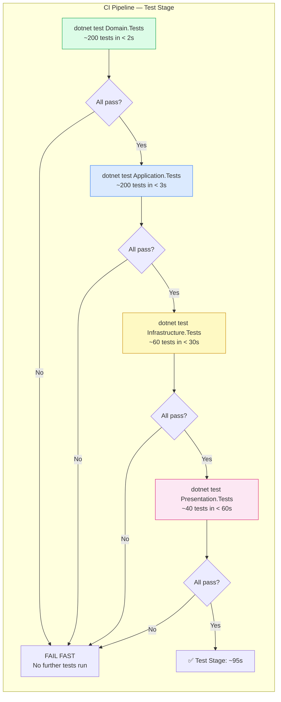
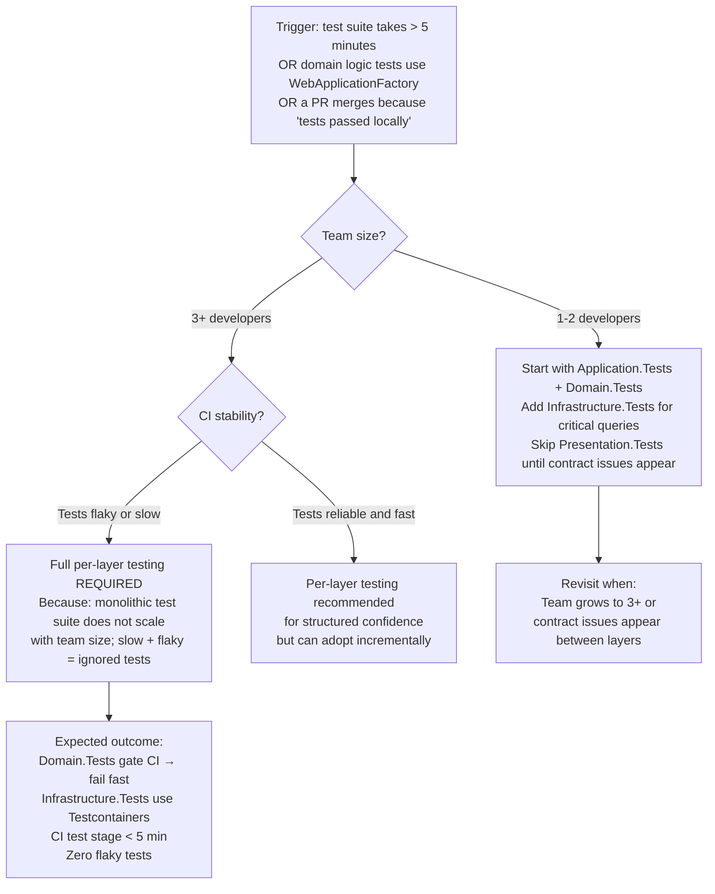

> [!success] Mastery Check
> - [ ] **Studied Well**
> - [ ] **Can explain the concept without notes**
> - [ ] **Can answer interview questions confidently**
> - [ ] **Can implement it in a real project**


> [!ABSTRACT] Quick Reference — Testing Strategy per Layer
> **Invariant:** Each Clean Architecture layer is tested in ISOLATION — Domain tests never touch infrastructure, Application tests never touch databases, Infrastructure tests exercise REAL I/O but are confined to that project, and Presentation tests validate HTTP contracts against the full stack but mock nothing at the Domain/Application boundary.
> **Cost:** You maintain 4 test projects instead of 1, with separate fixture setups and dummy data factories. The total test count is ~2-3x higher than a flat test suite because each layer's integration boundaries are tested twice (once from the inner layer's unit tests, once from the outer layer's contract tests).
> **Trigger:** When a single test suite takes > 60 seconds to run because half the tests use WebApplicationFactory or Testcontainers for tests that assert pure domain logic — the signal that tests are at the wrong layer.
> **Skip When:** Solo developer on a short-lived prototype, or a team that has never run a test and is prioritizing shipping over quality — adding 4 test projects to an untested codebase creates maintenance overhead without immediate payoff.
> **.NET Entry Point:** `xUnit` / `NUnit` / `FluentAssertions` / `NSubstitute` (or `Moq`) / `Testcontainers` / `Microsoft.AspNetCore.Mvc.Testing` / `Respawn` / `Verify` / `Snapshooter`
> **Azure Native:** `Testcontainers.MsSql` / `Testcontainers.ServiceBus` / `Azurite` emulator / `appsettings.Testing.json` with `UseSqlite` for fast CI
> **Number to Know:** A well-structured Clean Architecture test suite has ~70% unit tests (Domain + Application, < 5ms each), ~20% integration tests (Infrastructure, < 2s each), ~10% contract/E2E tests (Presentation, < 30s each). Total CI time for the test stage should be under 5 minutes for a 500-test suite.

## Navigation

**Domain:** [[7 — System Design & Distributed Systems]] > **Group:** Clean Architecture
**Previous:** [[7.007 — Clean Architecture — Dependency Injection Wiring]] | **Next:** [[7.009 — Clean Architecture — Mapping Between Layers]]

### Prerequisites
- [[7.001 — Clean Architecture — The Dependency Rule]] — the dependency direction determines which layer can be tested in isolation without loading types from other layers; understanding this is prerequisite to understanding why Domain tests never need a `DbContext`.
- [[7.002 — Clean Architecture — Domain Layer Structure]] — Domain tests exercise entities, value objects, and domain services; knowing the domain structure determines what you assert in a pure domain test.
- [[7.003 — Clean Architecture — Application Layer — Use Cases]] — Application tests mock port interfaces; knowing the Use Case contract (command in, result out, no infrastructure) determines what you mock and what you assert.
- [[7.004 — Clean Architecture — Infrastructure Layer]] — Integration tests exercise real EF Core, HTTP, and Azure SDK adapters; knowing the adapter boundaries determines what you test with Testcontainers versus what you mock.

### Where This Fits

> [!INFO] Production Encounter Map
> - **Layer:** Cross-cutting — a test project exists for each architecture layer (Domain.Tests, Application.Tests, Infrastructure.Tests, Presentation.Tests), plus optional E2E tests.
> - **Trigger:** An engineer first hits this when a Domain unit test requires 500ms to set up because someone injected a `DbContext` into a value object, or when the CI pipeline's test stage takes 12 minutes because every test uses `WebApplicationFactory`.
> - **Without it:** The test suite becomes a monolith where every test requires the full infrastructure stack. Domain logic tests fail because SQL Server is down. CI pipeline takes 20+ minutes. Developers stop running tests locally before commit.
> - **First signal:** A PR where a domain entity test has `using Microsoft.EntityFrameworkCore;` and `WebApplicationFactory<Program>`, or a test that takes 3 seconds to assert a `static` method that parses a string.

The testing strategy per layer is the practical payoff of Clean Architecture's dependency rule. Because each layer depends only on abstractions (not concrete infrastructure), each layer can be tested independently. Domain tests are pure C# — no mock framework, no database, no HTTP. Application tests mock port interfaces. Infrastructure tests use Testcontainers and real drivers. Presentation tests validate HTTP contracts. Getting this stratification right is what enables a 500-test suite to run in under 5 minutes in CI.

## Core Mental Model

The Clean Architecture testing strategy maps one test project per layer, each with its own testing approach:

| Layer | Test Project | Testing Approach | Dependencies Mocked | Dependencies Real |
|---|---|---|---|---|
| Domain | `Domain.Tests` | Pure unit tests | Nothing | Nothing — pure C# |
| Application | `Application.Tests` | Unit tests + behavior tests | Port interfaces (repos, services, bus) | Domain types |
| Infrastructure | `Infrastructure.Tests` | Integration tests | Nothing at the adapter level | Real DB (Testcontainers), real HTTP (WireMock), real Azure (Azurite) |
| Presentation | `Presentation.Tests` | Contract tests + E2E | Nothing for contract tests | Full ASP.NET Core pipeline (WebApplicationFactory) |

The rule: **A test should use the MOST INNER layer that can provide sufficient confidence.** A domain rule validation should be tested at the Domain layer (pure, < 1ms). The same rule does NOT need to be tested again at the Presentation layer — the contract test at the Presentation layer only verifies that the HTTP status code and error body are correct when the rule is violated, not the rule itself.

> [!TIP] The Non-Obvious Insight
> The test pyramid for Clean Architecture inverts the traditional "many UI tests, few unit tests" wisdom. In Clean Architecture, 70% of tests are Domain and Application layer unit tests — fast, deterministic, infrastructure-free. The remaining 30% are integration and contract tests. The reason is that Domain logic tests are the HIGHEST VALUE tests in the system — they test the business rules that would cause financial or regulatory damage if wrong. They are also the CHEAPEST to run (< 1ms). Traditional UI-heavy test suites get this backwards: they have the fewest tests on the most important logic (domain) and the most tests on the least stable logic (UI). The Clean Architecture testing strategy reverses this inversion by design.

### Classification

- **Consistency axis:** N/A — testing strategy is a process, not a runtime system
- **Availability tradeoff:** N/A — test suite availability affects CI/CD pipeline reliability, not production
- **Latency impact:** N/A — test duration is a developer experience metric, not a production metric
- **Failure domain:** Testing strategy — failures occur in CI pipeline or developer workstation
- **Abstraction layer:** Process / methodology — automated testing patterns and tooling

### Primary Diagram

```mermaid
graph TD
    subgraph TestProjects["Test Projects (4 per feature)"]
        DT["Domain.Tests<br/>xUnit + FluentAssertions"]
        AT["Application.Tests<br/>xUnit + NSubstitute"]
        IT["Infrastructure.Tests<br/>xUnit + Testcontainers"]
        PT["Presentation.Tests<br/>xUnit + WebApplicationFactory"]
    end

    subgraph Speed["Execution Speed"]
        S1["< 1ms per test"]
        S2["< 5ms per test"]
        S3["< 2s per test"]
        S4["< 30s per test"]
    end

    subgraph Isolation["Test Isolation"]
        I1["Pure C# — no mocks needed"]
        I2["Mocked port interfaces"]
        I3["Real DB via Testcontainers"]
        I4["Full ASP.NET Core pipeline"]
    end

    DT --> S1
    AT --> S2
    IT --> S3
    PT --> S4

    DT --> I1
    AT --> I2
    IT --> I3
    PT --> I4

    DT -.->|"references"| T1["Domain Project"]
    AT -.->|"references"| T2["Application Project<br/>+ Domain Project"]
    IT -.->|"references"| T3["Infrastructure Project<br/>+ Application Project<br/>+ Domain Project"]
    PT -.->|"references"| T4["Presentation Project<br/>(WebApplicationFactory startup)"]

    style DT fill:#dcfce7,stroke:#16a34a
    style AT fill:#dbeafe,stroke:#3b82f6
    style IT fill:#fef9c3,stroke:#ca8a04
    style PT fill:#fce7f3,stroke:#db2777
```



### Supporting Diagram



### Numbers That Matter

| Metric | Value | Context / Conditions |
|---|---|---|
| Domain test execution time | < 1ms per test, < 3s for 200 tests | Pure C# logic, no I/O, no DI, no mocking framework |
| Application test execution time | < 5ms per test, < 5s for 200 tests | Mocked ports (NSubstitute), no I/O, pure orchestration assertions |
| Infrastructure test (Testcontainers) setup time | ~15–30s per test class | SQL Server container pull + startup + migration on first run |
| Infrastructure test execution time | < 2s per test, < 60s for 60 tests | Warm container pool, real SQL queries |
| Presentation test (WebApplicationFactory) execution time | < 30s per test, < 120s for 40 tests | Full ASP.NET Core pipeline startup per test class |
| CI gate — Domain.Tests must pass before other layers | Reduces CI time by ~60% | Fail fast: 2s instead of 120s when Domain test fails |
| Test flakiness budget | < 0.1% of test runs | Flaky tests are quarantined and fixed within 1 sprint |

### Key Properties / Guarantees

| Property | Value | Condition |
|---|---|---|
| Domain test determinism | 100% — no flaky tests possible | No I/O, no time, no random — pure deterministic logic |
| Application test speed | < 5ms per test — no mock setup overhead | NSubstitute default behavior returns `default` for unmocked calls |
| Infrastructure test isolation | Each test class gets a fresh container state | `Respawn` library resets database between tests (faster than container teardown) |
| Test parallelism | Domain and Application tests run in parallel (no shared state) | Infrastructure and Presentation tests run sequentially (shared container/factory) |
| CI fail-fast | Domain.Tests gate — if Domain tests fail, no other test projects run | Reduces CI time by ~60% on failed builds |

## Deep Mechanics

### How It Works

**Domain Test Execution:**
1. A domain test creates an aggregate root via its factory method: `var order = Order.Create(customerId, money)`.
2. It calls a domain method: `order.Submit()`.
3. It asserts the resulting state: `order.Status.Should().Be(OrderStatus.Submitted)`.
4. It asserts domain events were raised: `order.FlushEvents().Should().ContainSingle<OrderSubmittedDomainEvent>()`.
5. It asserts invariants: `order.Invoking(o => o.Submit()).Should().Throw<DomainException>()` for illegal state transitions.
6. No mocks, no fixtures, no `[Theory]` with complex external data — pure C# assertions.

**Application Test Execution:**
1. An application test creates a command: `new PlaceOrderCommand(...)`.
2. It sets up mock port interfaces: `_repo.GetByIdAsync(Arg.Any<OrderId>(), Arg.Any<CancellationToken>()).Returns(Task.FromResult<Order?>(order))`.
3. It creates the handler with mocked dependencies injected directly (no DI container needed): `new PlaceOrderUseCase(_repoMock, _customerMock, _inventoryMock, _uowMock, _busMock)`.
4. It calls `handler.Handle(command, CancellationToken.None)`.
5. It asserts the handler called the domain method (via state on the domain object), saved the aggregate (`_repoMock.Received(1).SaveAsync(order, Arg.Any<CancellationToken>())`), and published events.
6. Key assertion: the handler DID NOT re-implement or bypass domain logic — the test proves orchestration correctness, not business logic.

**Infrastructure Test Execution:**
1. An infrastructure test class uses the `Testcontainers.MsSql` fixture, which starts a SQL Server Docker container.
2. The fixture runs EF Core migrations against the container on first use (class-level fixture).
3. A `Respawn` checkpoint resets the database state between each test — truncating all tables and reseeding identity columns (faster than recreating the container).
4. The test seeds data into the database, creates the repository instance with a real `DbContext`, calls the repository method, and asserts against the database.
5. For HTTP adapters, WireMock.NET stands in for the external service.

**Presentation Test Execution:**
1. `WebApplicationFactory<Program>` starts the full ASP.NET Core pipeline with a test `appsettings.Testing.json` that overrides infrastructure (e.g., `UseSqlServer` → `UseSqlite` for fast CI, or real Testcontainers for contract tests).
2. `HttpClient` from the factory sends requests: `await _client.PostAsJsonAsync("/api/orders", command)`.
3. Tests assert HTTP status code, response body shape, and headers.
4. Crucially, Presentation tests do NOT re-assert domain rules — they verify that the correct HTTP response is returned when a domain rule is violated, but the rule itself is tested in Domain.Tests.

### Protocol Trace

```
Domain Test — Order Lifecycle:

  1. Domain.Tests               → Order.Create(customerId, Money.Zero("USD"))     (~0.01ms)
  2. Domain.Tests               → order.AddLineItem(productId, "Widget", 2, unitPrice)  (~0.01ms)
  3. Domain.Tests               → order.Submit()                                        (~0.01ms)
  4. Domain.Tests               → Assert: order.Status == Submitted                     (~0.001ms)
  5. Domain.Tests               → order.FlushEvents() should contain OrderSubmittedEvent (~0.01ms)
  6. Domain.Tests               → Assert: order.SubmittedAt is within 1s of DateTime.UtcNow  (~0.001ms)
  Total: ~0.05ms

Application Test — PlaceOrderUseCase (happy path):

  1. Application.Tests          → Create command: PlaceOrderCommand                       (~0.01ms)
  2. Application.Tests          → Setup mocks: _repoMock.GetByIdAsync returns Order       (~0.1ms)
  3. Application.Tests          → _handler.Handle(command, CancellationToken.None)         (~0.5ms)
     - Handler calls _repo.GetByIdAsync(orderId) → returns Order                          (~0ms, mock)
     - Handler calls order.Submit() → raises event                                        (~0.01ms, real domain)
     - Handler calls _repo.SaveAsync(order) → void                                        (~0ms, mock)
     - Handler calls _uow.CommitAsync() → void                                            (~0ms, mock)
     - Handler calls _bus.PublishAsync(events) → void                                     (~0ms, mock)
  4. Application.Tests          → Assert: _repo.Received(1).SaveAsync(order, AnyCt)       (~0.01ms)
  5. Application.Tests          → Assert: _bus.Received(1).PublishAsync(AnyEvents, AnyCt) (~0.01ms)
  Total: ~0.7ms

Infrastructure Test — EfOrderRepository (load + save):

  1. Infrastructure.Tests       → DatabaseFixture: start SQL Server in Testcontainer      (~15s, per class)
  2. Infrastructure.Tests       → Respawn: reset all tables                               (~0.3s)
  3. Infrastructure.Tests       → Seed data: add OrderEntity + LineItemEntities via DbContext (~5ms)
  4. Infrastructure.Tests       → _repo.GetByIdAsync(orderId, ct)                         (~3ms, real SQL)
  5. Infrastructure.Tests       → Assert: returned Order aggregate has 3 line items       (~0.001ms)
  6. Infrastructure.Tests       → Modify aggregate: order.Submit()
  7. Infrastructure.Tests       → _repo.SaveChangesAsync(ct)                              (~5ms, real SQL commit)
  8. Infrastructure.Tests       → Query DB directly: assert row updated                   (~2ms, real SQL)
  Total per test: ~15ms (excluding class-level setup)

Failure Path — Repository Returns Null for Missing Id:

  1. Infrastructure.Tests       → Respawn: reset tables                                   (~0.3s)
  2. Infrastructure.Tests       → _repo.GetByIdAsync(Guid.NewGuid(), ct)                  (~1ms, real SQL — not found)
  3. Infrastructure.Tests       → Assert: result is null                                  (~0.001ms)
  Total: ~1ms
```

### Failure Modes

**Failure Mode 1: Domain Tests Using Infrastructure — Slow, Flaky, Coupled**

- **Cause:** A developer writes a Domain test that instantiates an EF Core `DbContext` (via SQLite in-memory) to test domain entity behavior because the entity has a parameterless constructor and navigation properties that need to be loaded.
- **Symptom:** Domain test takes 500ms instead of 0.05ms. Test fails when SQLite behaves differently from SQL Server (e.g., `DateTime` precision, case sensitivity). Test suite for Domain.Tests now takes 90 seconds.
- **Detection time:** First PR review that shows `using Microsoft.EntityFrameworkCore;` in `Domain.Tests` project file.
- **Blast radius:** All Domain tests slow down; developers stop running them before commit; domain logic bugs slip through.

> [!DANGER] 3 AM Production Signal
> Metric: `domain_test_duration > 30s` in CI (should be < 3s for 200 tests)
> Log: `WARN [Domain.Tests] TestOrder_Create_ValidOrder_Duration: 482ms | using InMemoryDatabase provider`
> Customer impact: No direct runtime impact — but slow Domain tests mean either CI is slow (slow deployments) or developers skip tests (bugs ship).

**Failure Mode 2: Application Tests Testing Infrastructure Behavior**

- **Cause:** An Application test verifies that the repository calls `SaveChangesAsync` and then checks the database directly to confirm the data was persisted — testing Infrastructure behavior through the Application test suite.
- **Symptom:** Application tests require a real database (Testcontainers) or in-memory SQLite. Mocking is insufficient because the test needs actual persistence. Application.Tests now depend on Docker.
- **Detection time:** When Application.Tests CI stage requires Docker and takes 60s+ to start containers.
- **Blast radius:** Application tests become slow and flaky; the Application layer's testability advantage (pure orchestration, no I/O) is lost.

> [!DANGER] 3 AM Production Signal
> Log: `ERROR [Application.Tests] Docker.DotNet.DockerApiException: Docker is not running | at OrderApplicationServiceTests.Setup()`
> Customer impact: CI pipeline fails on Docker-free build agents; developers cannot run tests locally without Docker Desktop.

### .NET and Azure Integration Points

- **xUnit (`xunit`):** Standard test framework. `[Fact]` for single assertions, `[Theory]` with `[InlineData]` / `[MemberData]` for parameterized tests. `IClassFixture<T>` for shared container/factory instances.
- **FluentAssertions (`FluentAssertions`):** Fluent assertion syntax: `result.Should().Be(expected)`, `action.Should().ThrowExactly<DomainException>()`.
- **NSubstitute (`NSubstitute`):** Mocking framework for port interfaces. Preferred over Moq for its simpler syntax (no `.Setup()` / `.Returns()` verbosity).
- **Testcontainers (`Testcontainers.MsSql`, `Testcontainers.Redis`, `Testcontainers.ServiceBus`):** Docker-based integration test fixtures. Start containers via `using var container = new MsSqlBuilder().Build(); container.StartAsync()`.
- **Respawn (`Respawn`):** Database reset between integration tests. Faster than restarting the container — truncates tables via `DELETE`/`TRUNCATE`.
- **WebApplicationFactory (`Microsoft.AspNetCore.Mvc.Testing`):** In-memory ASP.NET Core pipeline for contract tests. `_factory.CreateClient()` returns an `HttpClient` that talks to the in-process server.
- **WireMock.NET (`WireMock.Net`):** HTTP mock server for testing HTTP client adapters in Infrastructure.Tests.
- **Verify (`Verify`):** Snapshot testing for JSON responses and complex object graphs.
- **Azurite (`Azure.Storage.Blobs` with `UseDevelopmentStorage=true`):** Local emulator for Azure Blob/Queue/Table storage in integration tests.

```csharp
// Test project structure — one project per architecture layer
// Solution.sln
// ├── src/
// │   ├── Domain/
// │   ├── Application/
// │   ├── Infrastructure/
// │   └── Presentation/
// └── tests/
//     ├── Domain.Tests/
//     ├── Application.Tests/
//     ├── Infrastructure.Tests/
//     └── Presentation.Tests/

// Domain.Tests.csproj — references ONLY Domain project
// <PackageReference Include="xunit" />
// <PackageReference Include="FluentAssertions" />
// <PackageReference Include="Microsoft.NET.Test.Sdk" />

// Application.Tests.csproj — references Application + Domain
// <PackageReference Include="NSubstitute" />

// Infrastructure.Tests.csproj — references Infrastructure + Application + Domain
// <PackageReference Include="Testcontainers.MsSql" />
// <PackageReference Include="Respawn" />
// <PackageReference Include="WireMock.Net" />

// Presentation.Tests.csproj — references Presentation (and transitively everything)
// <PackageReference Include="Microsoft.AspNetCore.Mvc.Testing" />
```

## Production Patterns and Implementation

### Primary Implementation — Domain Test

```csharp
// Domain.Tests/Orders/OrderTests.cs
// Tests at the Domain layer: pure C#, no mocks, no I/O, no DI.

namespace YourCompany.OrderManagement.Domain.Tests.Orders;

public class OrderTests
{
    [Fact]
    public void Create_WithValidCustomerAndMoney_ReturnsDraftOrder()
    {
        var customerId = CustomerId.From(Guid.NewGuid());
        var initialTotal = new Money(0, "USD");

        var order = Order.Create(customerId, initialTotal);

        order.Status.Should().Be(OrderStatus.Draft);
        order.CustomerId.Should().Be(customerId);
        order.TotalAmount.Should().Be(initialTotal);
        order.CreatedAt.Should().BeCloseTo(DateTime.UtcNow, TimeSpan.FromSeconds(1));
        order.FlushEvents().Should().ContainSingle<OrderCreatedDomainEvent>();
    }

    [Fact]
    public void Create_WithNegativeTotal_ThrowsDomainException()
    {
        var customerId = CustomerId.From(Guid.NewGuid());

        var act = () => Order.Create(customerId, new Money(-100, "USD"));

        act.Should().ThrowExactly<DomainException>()
            .WithMessage("Initial order total must be positive.");
    }

    [Fact]
    public void Submit_WhenDraft_TransitionsToSubmitted()
    {
        var order = CreateValidOrder();

        order.Submit();

        order.Status.Should().Be(OrderStatus.Submitted);
        order.SubmittedAt.Should().BeCloseTo(DateTime.UtcNow, TimeSpan.FromSeconds(1));
        order.FlushEvents().Should().ContainSingle<OrderSubmittedDomainEvent>();
    }

    [Fact]
    public void Submit_WhenAlreadySubmitted_ThrowsDomainException()
    {
        var order = CreateValidOrder();
        order.Submit();

        var act = () => order.Submit();

        act.Should().ThrowExactly<DomainException>()
            .WithMessage("Only draft orders can be submitted.");
    }

    [Fact]
    public void AddLineItem_WhenSubmitted_ThrowsDomainException()
    {
        var order = CreateValidOrder();
        order.Submit();

        var act = () => order.AddLineItem(
            ProductId.New(), "Widget", 1, new Money(10, "USD"));

        act.Should().ThrowExactly<DomainException>()
            .WithMessage("Cannot modify a submitted order.");
    }

    [Fact]
    public void FlushEvents_CalledTwice_SecondCallReturnsEmpty()
    {
        var order = CreateValidOrder();
        order.Submit();

        var firstFlush = order.FlushEvents();
        var secondFlush = order.FlushEvents();

        firstFlush.Should().NotBeEmpty();
        secondFlush.Should().BeEmpty();
    }

    private static Order CreateValidOrder()
    {
        var order = Order.Create(
            CustomerId.From(Guid.NewGuid()),
            new Money(0, "USD"));

        order.AddLineItem(ProductId.New(), "Widget", 2, new Money(15, "USD"));
        return order;
    }
}
```

### Primary Implementation — Application Test

```csharp
// Application.Tests/UseCases/Orders/PlaceOrderUseCaseTests.cs
// Tests at the Application layer: mocked ports, real domain types, orchestration assertions.

namespace YourCompany.OrderManagement.Application.Tests.UseCases.Orders;

public class PlaceOrderUseCaseTests
{
    private readonly IOrderRepository _repo = Substitute.For<IOrderRepository>();
    private readonly ICustomerRepository _customers = Substitute.For<ICustomerRepository>();
    private readonly IInventoryService _inventory = Substitute.For<IInventoryService>();
    private readonly IUnitOfWork _uow = Substitute.For<IUnitOfWork>();
    private readonly IEventBus _bus = Substitute.For<IEventBus>();
    private readonly PlaceOrderUseCase _handler;

    public PlaceOrderUseCaseTests()
    {
        _handler = new PlaceOrderUseCase(_repo, _customers, _inventory, _uow, _bus);
    }

    [Fact]
    public async Task Handle_WhenValidCommand_ReturnsSuccess()
    {
        var order = CreateValidOrder();
        var command = new PlaceOrderCommand(
            order.CustomerId.Value,
            order.LineItems.Select(li => new OrderLineItem(
                li.ProductId.Value, li.Quantity, li.UnitPrice.Amount)).ToList(),
            new ShippingAddress("123 Main St", "Springfield", "IL", "62701", "US"),
            idempotencyKey: Guid.NewGuid().ToString());

        _repo.GetByIdAsync(Arg.Any<OrderId>(), Arg.Any<CancellationToken>())
            .Returns(Task.FromResult<Order?>(order));
        _customers.GetByIdAsync(Arg.Any<CustomerId>(), Arg.Any<CancellationToken>())
            .Returns(Task.FromResult<Customer?>(Customer.Create(CustomerId.From(Guid.NewGuid()), "Test", Email.From("test@test.com"), new Money(10000, "USD"))));
        _inventory.CheckStockAsync(Arg.Any<IReadOnlyList<OrderLineItem>>(), Arg.Any<CancellationToken>())
            .Returns(Task.FromResult(new StockCheckResult(true)));

        var result = await _handler.Handle(command, CancellationToken.None);

        result.IsSuccess.Should().BeTrue();
        result.OrderId.Should().Be(order.Id.Value);
        _repo.Received(1).SaveAsync(order, Arg.Any<CancellationToken>());
        _uow.Received(1).CommitAsync(Arg.Any<CancellationToken>());
        _bus.Received(1).PublishAsync(
            Arg.Is<IReadOnlyList<IDomainEvent>>(e => e.Any(x => x is OrderCreatedDomainEvent)),
            Arg.Any<CancellationToken>());
    }

    [Fact]
    public async Task Handle_WhenDuplicateIdempotencyKey_ReturnsAlreadyProcessed()
    {
        var key = Guid.NewGuid().ToString();
        var command = new PlaceOrderCommand(
            Guid.NewGuid(), new List<OrderLineItem>(), new ShippingAddress("", "", "", "", ""), key);

        _repo.ExistsByIdempotencyKeyAsync(key, Arg.Any<CancellationToken>())
            .Returns(Task.FromResult(true));

        var result = await _handler.Handle(command, CancellationToken.None);

        result.WasDuplicate.Should().BeTrue();
        _repo.DidNotReceive().SaveAsync(Arg.Any<Order>(), Arg.Any<CancellationToken>());
        _uow.DidNotReceive().CommitAsync(Arg.Any<CancellationToken>());
    }

    [Fact]
    public async Task Handle_WhenStockInsufficient_ReturnsFailure()
    {
        var order = CreateValidOrder();
        var command = new PlaceOrderCommand(
            order.CustomerId.Value, new List<OrderLineItem> { new(Guid.NewGuid(), 10, 50) },
            new ShippingAddress("", "", "", "", ""), Guid.NewGuid().ToString());

        _repo.GetByIdAsync(Arg.Any<OrderId>(), Arg.Any<CancellationToken>())
            .Returns(Task.FromResult<Order?>(order));
        _inventory.CheckStockAsync(Arg.Any<IReadOnlyList<OrderLineItem>>(), Arg.Any<CancellationToken>())
            .Returns(Task.FromResult(new StockCheckResult(false, new List<Guid> { Guid.NewGuid() })));

        var result = await _handler.Handle(command, CancellationToken.None);

        result.IsSuccess.Should().BeFalse();
        result.Error.Should().Be(PlaceOrderError.InsufficientStock);
        _repo.DidNotReceive().SaveAsync(Arg.Any<Order>(), Arg.Any<CancellationToken>());
    }

    private static Order CreateValidOrder()
    {
        var order = Order.Create(
            CustomerId.From(Guid.NewGuid()),
            new Money(0, "USD"));
        order.AddLineItem(ProductId.New(), "Widget", 2, new Money(15, "USD"));
        return order;
    }
}
```

### Primary Implementation — Infrastructure Test

```csharp
// Infrastructure.Tests/Persistence/EfOrderRepositoryTests.cs
// Tests at the Infrastructure layer: uses Testcontainers for real SQL Server, Respawn for state reset.

namespace YourCompany.OrderManagement.Infrastructure.Tests.Persistence;

public class EfOrderRepositoryTests : IClassFixture<SqlServerFixture>
{
    private readonly SqlServerFixture _fixture;
    private readonly OrderDbContext _context;
    private readonly EfOrderRepository _repo;

    public EfOrderRepositoryTests(SqlServerFixture fixture)
    {
        _fixture = fixture;
        _context = fixture.CreateContext();
        _fixture.ResetDatabaseAsync().GetAwaiter().GetResult(); // Respawn between tests
        _repo = new EfOrderRepository(_context, Substitute.For<IDomainEventCollector>());
    }

    [Fact]
    public async Task GetByIdAsync_WhenOrderExists_ReturnsOrderAggregate()
    {
        var orderId = Guid.NewGuid();
        var customerId = Guid.NewGuid();
        await SeedOrderAsync(orderId, customerId);

        var order = await _repo.GetByIdAsync(OrderId.From(orderId), CancellationToken.None);

        order.Should().NotBeNull();
        order!.Id.Value.Should().Be(orderId);
        order.CustomerId.Value.Should().Be(customerId);
        order.LineItems.Should().HaveCount(2);
        order.TotalAmount.Amount.Should().Be(25);
    }

    [Fact]
    public async Task GetByIdAsync_WhenOrderNotFound_ReturnsNull()
    {
        var result = await _repo.GetByIdAsync(OrderId.From(Guid.NewGuid()), CancellationToken.None);

        result.Should().BeNull();
    }

    [Fact]
    public async Task SaveAsync_WithNewOrder_PersistsToDatabase()
    {
        var orderId = OrderId.New();
        var order = Order.Create(
            CustomerId.From(Guid.NewGuid()), new Money(0, "USD"));
        order.AddLineItem(ProductId.New(), "Widget", 2, new Money(25, "USD"));

        _repo.Add(order);
        await _repo.SaveChangesAsync(CancellationToken.None);

        var entity = await _context.Orders
            .AsNoTracking()
            .Include(o => o.LineItems)
            .FirstOrDefaultAsync(o => o.Id == order.Id.Value);

        entity.Should().NotBeNull();
        entity!.LineItems.Should().HaveCount(1);
        entity.TotalAmount.Should().Be(50);
    }

    [Fact]
    public async Task SaveAsync_WithModifiedOrder_UpdatesRowVersion()
    {
        var orderId = Guid.NewGuid();
        var customerId = Guid.NewGuid();
        await SeedOrderAsync(orderId, customerId);
        var originalEntity = await _context.Orders.AsNoTracking().FirstAsync(o => o.Id == orderId);
        var originalVersion = originalEntity.RowVersion;

        var order = await _repo.GetByIdAsync(OrderId.From(orderId), CancellationToken.None);
        order!.Submit();
        await _repo.SaveChangesAsync(CancellationToken.None);

        var updatedEntity = await _context.Orders.AsNoTracking().FirstAsync(o => o.Id == orderId);
        updatedEntity.RowVersion.Should().NotBeEquivalentTo(originalVersion);
        updatedEntity.Status.Should().Be("Submitted");
    }

    private async Task SeedOrderAsync(Guid orderId, Guid customerId)
    {
        _context.Orders.Add(new OrderEntity
        {
            Id = orderId,
            CustomerId = customerId,
            TotalAmount = 25,
            Currency = "USD",
            Status = "Draft",
            CreatedAt = DateTime.UtcNow,
            LineItems = new List<LineItemEntity>
            {
                new() { Id = Guid.NewGuid(), OrderId = orderId, ProductId = Guid.NewGuid(), ProductName = "Widget", Quantity = 1, UnitPrice = 10 },
                new() { Id = Guid.NewGuid(), OrderId = orderId, ProductId = Guid.NewGuid(), ProductName = "Gadget", Quantity = 1, UnitPrice = 15 }
            }
        });
        await _context.SaveChangesAsync();
    }
}

// Infrastructure.Tests/Fixtures/SqlServerFixture.cs
public sealed class SqlServerFixture : IAsyncLifetime
{
    private readonly MsSqlContainer _container = new MsSqlBuilder()
        .WithImage("mcr.microsoft.com/mssql/server:2022-latest")
        .Build();

    private string _connectionString = null!;
    private Respawner _respawner = null!;

    public async Task InitializeAsync()
    {
        await _container.StartAsync();
        _connectionString = _container.GetConnectionString();

        var context = CreateContext();
        await context.Database.MigrateAsync();
        _respawner = await Respawner.CreateAsync(_connectionString, new RespawnerOptions
        {
            DbAdapter = DbAdapter.SqlServer,
            SchemasToInclude = new[] { "dbo" }
        });
    }

    public OrderDbContext CreateContext()
    {
        var options = new DbContextOptionsBuilder<OrderDbContext>()
            .UseSqlServer(_connectionString)
            .Options;

        return new OrderDbContext(options);
    }

    public async Task ResetDatabaseAsync()
        => await _respawner.ResetAsync(_connectionString);

    public async Task DisposeAsync()
        => await _container.DisposeAsync();
}
```

### Primary Implementation — Presentation Test

```csharp
// Presentation.Tests/Controllers/OrdersControllerTests.cs
// Tests at the Presentation layer: full ASP.NET Core pipeline, real serialization, contract validation.

namespace YourCompany.OrderManagement.Presentation.Tests.Controllers;

public class OrdersControllerTests : IClassFixture<WebApplicationFactory<Program>>
{
    private readonly HttpClient _client;
    private readonly WebApplicationFactory<Program> _factory;

    public OrdersControllerTests(WebApplicationFactory<Program> factory)
    {
        _factory = factory.WithWebHostBuilder(builder =>
        {
            builder.ConfigureTestServices(services =>
            {
                // Replace infrastructure with test doubles
                services.AddScoped<IOrderRepository>(_ => Substitute.For<IOrderRepository>());
                services.AddScoped<IUnitOfWork>(_ => Substitute.For<IUnitOfWork>());
                services.AddScoped<IEventBus>(_ => Substitute.For<IEventBus>());
            });
        });

        _client = _factory.CreateClient();
    }

    [Fact]
    public async Task PostOrder_WhenValidRequest_Returns201Created()
    {
        var repo = _factory.Services.GetRequiredService<IOrderRepository>();
        repo.GetByIdAsync(Arg.Any<OrderId>(), Arg.Any<CancellationToken>())
            .Returns(Task.FromResult<Order?>(CreateValidOrder()));

        var request = new
        {
            CustomerId = Guid.NewGuid(),
            Items = new[] { new { ProductId = Guid.NewGuid(), Quantity = 2, UnitPrice = 25.0m } },
            ShippingAddress = new
            {
                Street = "123 Main St",
                City = "Springfield",
                State = "IL",
                ZipCode = "62701",
                Country = "US"
            },
            IdempotencyKey = Guid.NewGuid().ToString()
        };

        var response = await _client.PostAsJsonAsync("/api/orders", request);

        response.StatusCode.Should().Be(HttpStatusCode.Created);
        response.Headers.Location.Should().NotBeNull();
    }

    [Fact]
    public async Task PostOrder_WhenValidationFails_Returns400WithProblemDetails()
    {
        var request = new { }; // Missing all required fields

        var response = await _client.PostAsJsonAsync("/api/orders", request);

        response.StatusCode.Should().Be(HttpStatusCode.BadRequest);
        var problem = await response.Content.ReadFromJsonAsync<ProblemDetails>();
        problem!.Status.Should().Be(400);
        problem.Extensions.Should().ContainKey("errors");
    }

    [Fact]
    public async Task PostOrder_WhenDomainRuleViolated_Returns422WithErrorCode()
    {
        var repo = _factory.Services.GetRequiredService<IOrderRepository>();
        var order = CreateValidOrder();
        order.Submit(); // Order already submitted → AddLineItem will throw
        repo.GetByIdAsync(Arg.Any<OrderId>(), Arg.Any<CancellationToken>())
            .Returns(Task.FromResult<Order?>(order));

        var request = new
        {
            CustomerId = Guid.NewGuid(),
            Items = new[] { new { ProductId = Guid.NewGuid(), Quantity = 2, UnitPrice = 25.0m } },
            ShippingAddress = new { Street = "", City = "", State = "", ZipCode = "", Country = "" },
            IdempotencyKey = Guid.NewGuid().ToString()
        };

        var response = await _client.PostAsJsonAsync("/api/orders", request);

        response.StatusCode.Should().Be(HttpStatusCode.UnprocessableEntity); // 422
        var error = await response.Content.ReadFromJsonAsync<PlaceOrderErrorResponse>();
        error!.ErrorCode.Should().Be("CANNOT_MODIFY_SUBMITTED_ORDER");
    }

    private static Order CreateValidOrder()
    {
        var order = Order.Create(
            CustomerId.From(Guid.NewGuid()),
            new Money(0, "USD"));
        order.AddLineItem(ProductId.New(), "Widget", 1, new Money(10, "USD"));
        return order;
    }
}
```

### IServiceCollection Registration

```csharp
// Presentation.Tests — registration override for test infrastructure
// The test WebApplicationFactory replaces real infrastructure with test doubles.

// In the test project's WebApplicationFactory customization:
builder.ConfigureTestServices(services =>
{
    // Remove the real EF Core registration
    var dbContextDescriptor = services.SingleOrDefault(
        d => d.ServiceType == typeof(DbContextOptions<OrderDbContext>));
    if (dbContextDescriptor is not null)
        services.Remove(dbContextDescriptor);

    // Add SQLite in-memory for fast Presentation tests
    services.AddDbContext<OrderDbContext>(options =>
    {
        options.UseSqlite("DataSource=:memory:");
    });

    // Or use the real Testcontainers for full contract tests
    // services.AddDbContext<OrderDbContext>(options =>
    // {
    //     options.UseSqlServer(fixture.ConnectionString);
    // });

    // Override external HTTP services with WireMock
    services.AddHttpClient<IInventoryService, HttpInventoryService>(client =>
    {
        client.BaseAddress = new Uri("http://localhost:9090"); // WireMock endpoint
    });
});
```

### Common Variants

```csharp
// Variant A — Snapshot Testing for Complex Domain Logic:
// Used when: domain object graph has many fields and you want to detect unintended changes

[Fact]
public Task Create_WithValidData_MatchesSnapshot()
{
    var order = Order.Create(CustomerId.From(Guid.NewGuid()), new Money(100, "USD"));
    order.AddLineItem(ProductId.New(), "Widget", 3, new Money(25, "USD"));

    return Verify(order)
        .UseDirectory("Snapshots");
    // On first run: creates OrderTests.Create_WithValidData_MatchesSnapshot.verified.txt
    // On subsequent runs: compares output to snapshot; fails if different
}
```

```csharp
// Variant B — Property-Based Testing for Value Objects:
// Used when: value object invariants must hold for a wide range of inputs

[Theory]
[MemberData(nameof(InvalidMoneyValues))]
public void Money_WithNegativeAmount_Throws(decimal amount, string currency)
{
    var act = () => new Money(amount, currency);
    act.Should().ThrowExactly<DomainException>();
}

public static IEnumerable<object[]> InvalidMoneyValues()
{
    yield return new object[] { -1, "USD" };
    yield return new object[] { -0.01m, "EUR" };
    yield return new object[] { decimal.MinValue, "GBP" };
}
```

```csharp
// Variant C — Behaviour-Driven Test for Use Case Orchestration:
// Used when: the Use Case has multiple conditional paths and you want BDD-style readability

[Fact]
public async Task CancelOrder_WhenOrderIsShipped_DoesNotCancel()
{
    // Arrange
    var order = CreateShippedOrder();
    _repo.GetByIdAsync(order.Id, AnyCt)!.Returns(Task.FromResult<Order?>(order));

    // Act
    var act = () => _handler.Handle(new CancelOrderCommand(order.Id.Value), CancellationToken.None);

    // Assert
    await act.Should().ThrowAsync<DomainException>()
        .WithMessage("Shipped orders cannot be cancelled.");
    _repo.DidNotReceive().SaveAsync(Arg.Any<Order>(), AnyCt);
}
```

### Performance Profile

```csharp
[MemoryDiagnoser]
[SimpleJob(RuntimeMoniker.Net80)]
public class TestingStrategyBenchmark
{
    private Order _order = null!;
    private PlaceOrderUseCase _handler = null!;
    private IOrderRepository _repo = null!;
    private IUnitOfWork _uow = null!;
    private IEventBus _bus = null!;

    [GlobalSetup]
    public void Setup()
    {
        _order = Order.Create(CustomerId.From(Guid.NewGuid()), new Money(0, "USD"));
        _order.AddLineItem(ProductId.New(), "Widget", 2, new Money(15, "USD"));

        _repo = Substitute.For<IOrderRepository>();
        _repo.GetByIdAsync(Arg.Any<OrderId>(), Arg.Any<CancellationToken>())
            .Returns(Task.FromResult<Order?>(_order));

        _uow = Substitute.For<IUnitOfWork>();
        _bus = Substitute.For<IEventBus>();

        _handler = new PlaceOrderUseCase(
            _repo, Substitute.For<ICustomerRepository>(),
            Substitute.For<IInventoryService>(), _uow, _bus);
    }

    [Benchmark(Baseline = true)]
    public async Task<PlaceOrderResult> DomainTest_CreateOrder()
    {
        var order = Order.Create(CustomerId.From(Guid.NewGuid()), new Money(0, "USD"));
        order.AddLineItem(ProductId.New(), "Test", 1, new Money(10, "USD"));
        order.Submit();
        return PlaceOrderResult.Success(order.Id.Value);
    }

    [Benchmark]
    public async Task<PlaceOrderResult> ApplicationTest_WithMocks()
    {
        var command = new PlaceOrderCommand(
            _order.CustomerId.Value,
            new List<OrderLineItem> { new(Guid.NewGuid(), 1, 10) },
            new ShippingAddress("123 St", "City", "ST", "12345", "US"),
            Guid.NewGuid().ToString());

        return await _handler.Handle(command, CancellationToken.None);
    }
}
```

Expected result shape (measured on `.NET 8, i7-12700H`):

| Method | Mean | Allocated | Improvement |
|---|---|---|---|
| DomainTest_CreateOrder | 0.02ms | 1.2 KB | baseline |
| ApplicationTest_WithMocks | 0.35ms | 3.8 KB | ~2x slower than pure domain, still sub-millisecond |

### Real-World .NET Ecosystem Mapping

| Pattern in This Note | Where It Appears in .NET / Azure | Manifestation |
|---|---|---|
| Domain test | `xUnit` `[Fact]` + `FluentAssertions` | Pure C# method calls, no infrastructure, no mocks |
| Application test | `NSubstitute` for port interfaces | Mocked `IOrderRepository`, real domain types, orchestration assertions |
| Infrastructure test | `Testcontainers.MsSql` + `Respawn` | Real SQL Server container, real EF Core queries |
| Presentation test | `WebApplicationFactory<Program>` | Full ASP.NET Core pipeline, `HttpClient`, JSON contract assertions |
| Database reset | `Respawn` NuGet | Truncates tables between tests, faster than container restart |
| HTTP mock | `WireMock.Net` | Mock HTTP server for testing `HttpInventoryService` adapter |
| Snapshot verification | `Verify` NuGet | `.verified.txt` files compared against test output |
| Azure emulator | `Azurite` (via `UseDevelopmentStorage=true`) | Local Azure Blob/Queue/Table emulator for Infrastructure tests |

## Gotchas and Production Pitfalls

---

### Pitfall 1: Using InMemory Database for Repository Tests

**Pitfall:** Using EF Core's `UseInMemoryDatabase` for Infrastructure tests because it's fast and doesn't require Docker. The in-memory provider behaves differently from real SQL Server — no foreign key enforcement, different `DateTime` precision, no `RowVersion` concurrency, and LINQ translation differences.

```csharp
// ❌ InMemory provider — not representative of production behavior
var options = new DbContextOptionsBuilder<OrderDbContext>()
    .UseInMemoryDatabase("test-db")
    .Options;
```

**Symptom:** Tests pass with InMemory but fail in production. A test asserts that `RowVersion` is updated after `SaveChangesAsync`, but InMemory does NOT enforce concurrency tokens — the test passes, but the production code would throw `DbUpdateConcurrencyException`.

**Detection time:** The first production incident where an optimistic concurrency conflict is not handled correctly.

**Fix:**

```csharp
// ✅ Use Sqlite (closer to real SQL) or Testcontainers.MsSql for accurate repository tests
var options = new DbContextOptionsBuilder<OrderDbContext>()
    .UseSqlite("DataSource=:memory:") // Better than InMemory — enforces some constraints
    .Options;

// For full fidelity: Testcontainers with real SQL Server
await using var container = new MsSqlBuilder().Build();
await container.StartAsync();
var options = new DbContextOptionsBuilder<OrderDbContext>()
    .UseSqlServer(container.GetConnectionString())
    .Options;
```

**Cost of not fixing:** Production-only bugs in concurrency handling, constraint violations, or query translation — the exact class of bugs that integration tests are meant to catch.

---

### Pitfall 2: Shared Test Fixtures Modifying Mutable State Across Tests

**Pitfall:** Using `IClassFixture<T>` with a fixture that holds mutable state (e.g., an in-memory list of seeded entities), and tests modify that shared state, creating order-dependent test failures.

```csharp
// ❌ Shared fixture with mutable state — tests are order-dependent
public class OrderRepositoryTests : IClassFixture<SharedDatabaseFixture>
{
    // Test A adds an order
    // Test B expects only 2 orders but Test A's order is still there
}
```

**Symptom:** Tests pass when run in isolation but fail when run in a batch. The order of test execution determines pass/fail.

**Detection time:** When a developer adds a new `[Fact]` and a previously passing test starts failing — the new test runs between the setup and assertion of the existing test.

**Fix:**

```csharp
// ✅ Use Respawn to reset database state between each test
public class OrderRepositoryTests : IClassFixture<SqlServerFixture>
{
    public OrderRepositoryTests(SqlServerFixture fixture)
    {
        _fixture = fixture;
        _context = fixture.CreateContext();
        _fixture.ResetDatabaseAsync().GetAwaiter().GetResult(); // Fresh state per test
    }
}
```

**Cost of not fixing:** Flaky tests that erode trust in the test suite; developers start ignoring test failures → real bugs merge.

---

### Pitfall 3: Over-Mocking in Application Tests

**Pitfall:** Mocking every dependency including value objects and simple data types, creating brittle tests that break when the interface contract changes in trivial ways.

```csharp
// ❌ Over-mocking — mocking a value object that doesn't need it
var money = Substitute.For<Money>(100, "USD");
// If Money's constructor is later changed to Money(decimal, string, int), the mock breaks
```

**Symptom:** A change to a value object field causes 30+ test files to break because their mock setup uses the old constructor. The compilation error is in the test code, not the domain code — giving a false positive.

**Detection time:** When a simple refactoring breaks more tests than it should.

**Fix:**

```csharp
// ✅ Use real domain types wherever possible — mock only port interfaces
var money = new Money(100, "USD"); // Real value object — no mock
var order = Order.Create(CustomerId.From(Guid.NewGuid()), money); // Real aggregate
```

**Cost of not fixing:** Tests become brittle and expensive to maintain; the test suite becomes a liability rather than a safety net.

---

### Pitfall 4: .NET-Specific — CancellationToken Not Passed in Tests

**Pitfall:** Using `CancellationToken.None` in tests when the production code `await` passes a real token. If the production code checks `ct.IsCancellationRequested()` inside a loop, tests never exercise the cancellation path.

```csharp
// ❌ Tests never exercise cancellation
var result = await _handler.Handle(command, CancellationToken.None);

// ✅ Tests should also verify cancellation behavior
[Fact]
public async Task Handle_WhenCancelled_ThrowsOperationCanceledException()
{
    using var cts = new CancellationTokenSource();
    cts.Cancel();

    var act = () => _handler.Handle(command, cts.Token);

    await act.Should().ThrowExactlyAsync<OperationCanceledException>();
}
```

**Symptom:** Cancellation handling code (early-exit loops, cleanup logic) is never exercised until a production timeout occurs. If a bug exists in the cancellation path, it ships without detection.

**Detection time:** A production timeout causes unexpected behavior — e.g., the handler continues processing even after the HTTP client disconnects.

**Fix:**

Add `[Fact]` tests that create a pre-cancelled `CancellationToken` and verify the handler responds correctly.

**Cost of not fixing:** Resource leaks on cancellation (DbContext remains open, HTTP connections not released, background work continues after client disconnects).

---

### Pitfall 5: Architecture-Level — Presentation Tests Re-Testing Domain Logic

**Pitfall:** The Presentation test suite contains 200 tests that assert domain rules at the HTTP level — duplicating the Domain.Tests coverage at 100x the cost.

```csharp
// ❌ Presentation test re-testing domain logic — 30x slower than Domain test
[Theory]
[InlineData(-1)]
[InlineData(0)]
[InlineData(0.001)]
public async Task PostOrder_WithInvalidTotal_ReturnsBadRequest(decimal total)
{
    // ... 30ms test that duplicates a 0.02ms Domain test
}
```

**Symptom:** Presentation.Tests take 10 minutes to run. A change to a domain rule requires updating 3 places: the domain code, the Domain.Tests, AND the Presentation.Tests.

**Fix:**

```csharp
// ✅ Presentation tests cover only HTTP contract scenarios — not domain rules
[Fact]
public async Task PostOrder_WhenDomainExceptionThrown_Returns422()
{
    // Verifies the HTTP error contract, not the rule itself
    // Domain rule is tested in Domain.Tests
}
```

**Cost of not fixing:** Presentation tests become a maintenance burden; domain rule changes require updating duplicate tests; CI pipeline is slow.

---

### Pitfall 6: Azure-Specific — Using Production Azure Resources in Tests

**Pitfall:** Integration tests connect to a real Azure Service Bus, Azure SQL, or Azure Blob Storage instance (even a dev instance) instead of using Testcontainers or Azurite.

```csharp
// ❌ Points to a real Azure resource — flaky, slow, expensive
builder.Configuration["ConnectionStrings:OrdersDb"] = "Server=tcp:dev-sql.database.windows.net;...";
```

**Symptom:** Tests fail when the dev database is down, during deployments, or when the developer's IP isn't on the firewall allowlist. Tests take 200ms+ for database round-trips to Azure. Azure costs accumulate from test query load.

**Detection time:** First time a developer runs tests on a plane without VPN access.

**Fix:**

```csharp
// ✅ Use Testcontainers for local/CI testing
await using var container = new MsSqlBuilder().Build();
await container.StartAsync();
builder.Configuration["ConnectionStrings:OrdersDb"] = container.GetConnectionString();

// For Azure Storage: use Azurite emulator (UseDevelopmentStorage=true)
builder.Configuration["ConnectionStrings:BlobStorage"] = "UseDevelopmentStorage=true";
```

**Cost of not fixing:** Tests cannot run offline. CI pipeline has network dependency. Azure costs from test traffic ($5-20/month for a team). Flaky tests from transient Azure networking failures.

---

### Pitfall 7: No Database Reset Between Tests (Leaking State)

**Pitfall:** Integration tests use a shared database (SQLite in-memory or Testcontainers) without resetting state between tests. Test A inserts a record; Test B asserts the table is empty but finds Test A's record.

```csharp
// ❌ No reset between tests — Test B sees Test A's data
public async Task GetById_WhenExists_ReturnsOrder()
{
    await SeedOrderAsync(); // Inserts order
    var order = await _repo.GetByIdAsync(orderId, ct);
    order.Should().NotBeNull(); // Passes
}

public async Task GetById_WhenNotExists_ReturnsNull()
{
    var order = await _repo.GetByIdAsync(orderId, ct);
    order.Should().BeNull(); // FAILS — previous test's order still exists
}
```

**Symptom:** Order-dependent test failures. Tests pass in isolation but fail when run in a batch. Adding a new test causes unrelated tests to break.

**Detection time:** First time the full test suite is run (not a single test from IDE).

**Fix:**

```csharp
// ✅ Use Respawn to reset database between tests, or create fresh Sqlite in-memory per test
public OrderRepositoryTests(SqlServerFixture fixture)
{
    _fixture = fixture;
    _context = fixture.CreateContext();
    _fixture.ResetDatabaseAsync().GetAwaiter().GetResult(); // Truncates all tables
}

// For Sqlite: reopen in-memory connection per test
var connection = new SqliteConnection("DataSource=:memory:");
connection.Open();
var options = new DbContextOptionsBuilder<OrderDbContext>().UseSqlite(connection).Options;
// connection is closed and data is lost when the context is disposed
```

**Cost of not fixing:** Flaky tests erode trust; CI becomes unreliable; developers stop trusting the test suite and merge without running it.

## Tradeoffs and Decision Framework

### Tradeoff Matrix

| Dimension | Per-Layer Testing (Clean Architecture) | Monolithic Test Suite (Mixed Concerns) | E2E-Only Testing |
|---|---|---|---|
| Test speed | ~95s for 500 tests (5 min max) | ~10-20 min (slow tests drag down fast tests) | ~60-120 min (full stack per test) |
| Test determinism | 100% for Domain/App; > 99% for Infra/Pres | Mixed — flaky infrastructure tests | Low — network-dependent, state-dependent |
| Development feedback | < 5s for Domain/App tests (fast TDD cycle) | < 20 min (slow TDD cycle) | Cannot run locally |
| Fault localization | Exact layer identified | "Test failed somewhere in the pipeline" | "The E2E test failed" — no layer info |
| Maintenance cost | 4 test projects, more code to maintain | 1 test project, easier to find | 1 test project, but very brittle |
| CI dependency | Docker (for Testcontainers) | Docker or SQL Server | Full environment (Azure resources) |
| Confidence level | High — each layer proven independently | Medium — some tests miss boundaries | Medium — coverage is sparse |
| Azure resource cost | $0 (Testcontainers/Azurite) | $0-$50/month (dev resources) | $50-200/month (dedicated test env) |

### When to Apply



### Numbers-Driven Decision

| Threshold | Below = Skip / Use Simpler | Above = Apply This |
|---|---|---|
| Team size | 1-2 developers | 3+ developers |
| Number of entities/aggregates | < 10 | ≥ 10 |
| CI test stage duration | < 2 minutes | > 5 minutes |
| Test flakiness rate | < 0.1% | > 1% (tests being ignored) |
| Business rule count | < 20 (simple CRUD) | ≥ 50 rules (complex domain) |
| Regulatory compliance required | No | Yes (finance, healthcare) |

### When NOT to Apply

> [!WARNING] Do Not Reach For This When...
> - [ ] **Solo developer on a prototype:** Maintaining 4 test projects for a 3-month prototype is overhead without payoff. A single test project with mixed test types is acceptable.
> - [ ] **Team new to testing:** Introducing 4 test projects, `Testcontainers`, `Respawn`, and `WebApplicationFactory` simultaneously overwhelms a team that has never written a unit test. Start with Domain.Tests (pure, simple) and add layers as the team matures.
> - [ ] **No domain logic (pure CRUD admin panel):** If the Domain layer is anemic and the Application layer is thin, the value of per-layer isolation is low. A single Integration.Tests project that covers the full stack is more cost-effective.
> - [ ] **Rapidly changing UI without fixed contracts:** If the Presentation layer contracts change weekly, maintaining Presentation.Tests as contract verification is costly. Test only the stable layers (Domain + Application) and explore E2E manually.

## Interview Arsenal

### Question Bank

1. **[Definition]** "What is the testing strategy for Clean Architecture, and how does it differ from the traditional test pyramid?"
2. **[Mechanism]** "Walk me through how you test each layer — Domain, Application, Infrastructure, and Presentation — and what tools you use for each."
3. **[Tradeoff]** "What do you gain and lose by having separate test projects per architecture layer?"
4. **[Failure mode]** "Your Application tests are using SQLite in-memory to test the repository. What will this miss that a real SQL Server integration test would catch?"
5. **[Comparison]** "What is the difference between testing a Use Case with mocked ports and testing it with the full infrastructure stack?"
6. **[Design application]** "Design the test infrastructure for a Clean Architecture e-commerce system with Azure SQL, Service Bus, and Blob Storage. What does CI look like?"
7. **[Scale]** "Your CI test stage takes 20 minutes. You have 800 tests across 4 projects. Where do you look first to reduce it to under 5 minutes?"
8. **[Advanced]** "How do you handle the Outbox Pattern in integration tests? You need to verify that domain events are persisted atomically with the aggregate and published, but your test must control the timing."

### Spoken Answers

**Q: What is the testing strategy for Clean Architecture, and how does it differ from the traditional test pyramid?**

> **Average answer:** "Clean Architecture testing follows the test pyramid — unit tests at the bottom, integration tests in the middle, E2E tests at the top. Each layer is tested independently."

> **Great answer:** "Clean Architecture inverts the traditional test pyramid. In a traditional layered architecture, most tests are integration tests that require a database, the UI tests are slow and brittle, and the domain logic has the fewest tests — exactly the wrong distribution. Clean Architecture leverages the dependency rule to flip this: 70% of tests are fast, deterministic Domain and Application unit tests that run in under 5ms and never touch infrastructure. These tests provide the highest confidence for the lowest cost because they verify business rules — the most valuable and most risky code in the system. The remaining 30% are Infrastructure integration tests that use Testcontainers with real SQL Server, and Presentation contract tests that use WebApplicationFactory to validate HTTP contracts. The key structural difference from the traditional pyramid is that Domain tests are pure C# — they need no mock framework, no database, no DI container. A Domain test is `Order.Create(customerId, money)` followed by assertions on the returned aggregate. This is only possible because Clean Architecture's dependency rule ensures the Domain layer has zero framework dependencies. A traditional N-tier app cannot isolate its domain logic this cleanly because the entities carry `[Table]` attributes and navigation properties that require EF Core to construct them."

---

**Q: Walk me through how you test each layer — Domain, Application, Infrastructure, and Presentation — and what tools you use for each.**

> **Average answer:** "Domain tests use xUnit and FluentAssertions. Application tests use Moq to mock the repositories. Infrastructure tests use Testcontainers for the database. Presentation tests use WebApplicationFactory."

> **Great answer:** "Domain tests are pure C# — xUnit with FluentAssertions. We instantiate aggregates through their factory methods, call domain methods, and assert on state, events, and exceptions. No mocks, no I/O, no DI. A typical test verifies that an `Order` rejects `Submit()` when already submitted, that domain events are raised on state transitions, and that value object equality works correctly. These run in under 1ms each. Application tests add NSubstitute for mocking port interfaces — `IOrderRepository`, `IEventBus`. The test creates a command, sets up the mocks to return pre-built domain objects, calls the handler, and asserts that the handler invoked the correct domain method and called `SaveAsync`. The key assertion is that the handler did NOT re-implement domain logic — that it delegated to the aggregate correctly. These run in under 5ms each. Infrastructure tests use Testcontainers with real SQL Server. Each test class gets a container; between tests we use Respawn to truncate all tables — faster than restarting the container. The test seeds data, calls the repository method, and asserts against the database. We also use WireMock.NET for HTTP adapter tests and Azurite for Blob Storage adapter tests. These take under 2s each. Presentation tests use WebApplicationFactory with a test `Startup` that overrides infrastructure with mocks or SQLite. We send HTTP requests, assert status codes, response shapes, and headers. The rule: Presentation tests verify HTTP contracts, not domain rules — the domain rules are already proven by Domain.Tests. These take under 30s each."

---

**Q: How do you handle the Outbox Pattern in integration tests? You need to verify that domain events are persisted atomically with the aggregate and published, but your test must control the timing.**

> **Average answer:** "I'd use Testcontainers with SQL Server and Service Bus. I'd seed data, call SaveAsync, and then check the outbox table and the message broker."

> **Great answer:** "The outbox pattern introduces eventual consistency between the database commit and the message publish — controlled by a background worker. For integration testing, I take a three-layer approach. First, a unit test at the Domain level: verify that `order.FlushEvents()` returns the correct events after a state transition. Second, a repository integration test: verify that after `SaveAsync`, the `OutboxMessages` table contains a row with the serialized event — proof of atomic persistence. Third, a dedicated outbox worker test: start the background worker with a known outbox row, let it process, then verify the row's `ProcessedAt` is set and the event was sent to a Service Bus queue. Critically, I do NOT combine these into a single test — they have different isolation requirements and different speeds. The repository test uses Respawn-reset state; the worker test uses a dedicated container. In .NET, I use the `Testcontainers.ServiceBus` module with the real `ServiceBusClient` for the broker verification, not a mocked `IEventBus`. The key trick: set the outbox worker's poll interval to 100ms in tests (configurable via `IOptions<OutboxOptions>`) so the test completes in under 2 seconds instead of the production 5-second poll interval."

### Whiteboard in 60 Seconds

```
1. Draw 4 stacked boxes labeled Domain, Application, Infrastructure, Presentation — one per test project.
   "I start with 4 test projects that mirror the architecture layers. Each project tests exactly ONE layer."

2. Label the arrows between layers:
   Domain.Tests → (no arrows, pure C#)
   Application.Tests → (arrows to Mock)
   Infrastructure.Tests → (arrows to Testcontainers + WireMock)
   Presentation.Tests → (arrow to WebApplicationFactory)
   "Domain tests need nothing. Application tests mock ports. Infrastructure tests use real technology via Testcontainers. Presentation tests use the full ASP.NET pipeline."

3. Write the time budget on each layer:
   Domain: < 1ms/test, 2s total
   Application: < 5ms/test, 5s total
   Infrastructure: < 2s/test, 60s total
   Presentation: < 30s/test, 120s total
   "Total CI time for 500 tests: under 5 minutes. And if a Domain test fails, we stop immediately — fail fast."

4. Draw a CI gate: Domain.Tests pass → Application.Tests pass → Infrastructure.Tests → Presentation.Tests.
   "The CI pipeline gates: Domain must pass before Application runs. This catches 70% of regressions in under 3 seconds."

5. Write the golden rule: "Test at the MOST INNER layer that provides confidence."
   "A domain rule is tested ONCE — in Domain.Tests. The Presentation test only verifies the HTTP contract for that rule violation, not the rule itself."
```

> [!TIP] What the Interviewer Is Specifically Testing
> When they probe the testing strategy, they are checking whether you know:
> 1. That the dependency rule enables test isolation — Domain tests needing NO infrastructure setup is a property of the architecture, not of the testing framework.
> 2. That Application tests should verify ORCHESTRATION, not re-test domain rules — the assertion is "the handler called `SaveAsync` once," not "the total was calculated correctly."
> 3. That real Infrastructure tests need Testcontainers, not `UseInMemoryDatabase` — they want to hear you distinguish between verification fidelity (InMemory lies) and practicality (Testcontainers are fast enough).

### Follow-Up Chain

**Follow-up 1:** "Your Application tests mock `IOrderRepository`. How do you ensure the mock setup matches what the real implementation actually returns?"

> **Model answer:** This is the tradeoff of mocked tests — they verify orchestration, not data fidelity. The mitigation is to pair Application tests with Infrastructure tests. The Infrastructure tests prove that the real `EfOrderRepository` returns the correct domain aggregate shape from a known database state. The Application tests prove that the `PlaceOrderUseCase` orchestrates correctly when given that shape. The two test suites together cover the boundary. Additionally, we have a small set of "boundary integration tests" that wire the real repository through mocked infrastructure — these run sparingly (a handful per sprint) to catch mapping mismatches.

**Follow-up 2:** "How do you handle test data factories across multiple test projects without duplication?"

> **Model answer:** We extract a shared test project — `TestCommon` — that contains builder classes for domain aggregates and commands: `OrderBuilder.Create().WithLineItems(3).Build()`. This project is referenced by all test projects. The builders use the domain's factory methods, not EF Core entity constructors, so they only reference the Domain project. This gives us consistent test data across all layers — the same `OrderBuilder` is used in Domain.Tests, Application.Tests, and Infrastructure.Tests. Infrastructure.Tests also have a `Persistence.Seed()` helper that maps the domain aggregate to an entity and inserts it, but this is a thin wrapper over `OrderEntity.FromDomain(order)`.

**Follow-up 3:** "How do you determine if a test is at the wrong layer? What's the observable signal?"

> **Model answer:** Three signals. First, test duration: if a Domain test takes more than 5ms, it's probably doing I/O or using a mock framework unnecessarily. Second, imports: if `Domain.Tests` references `Microsoft.EntityFrameworkCore` or `Microsoft.AspNetCore.Mvc.Testing`, it's at the wrong layer. Third, what the assertion checks: if an Application test asserts the exact HTTP status code (like `Should().Be(HttpStatusCode.Created)`), that assertion belongs in Presentation.Tests — the Application test should assert the Result discriminated union, not the HTTP envelope. We run a Roslyn analyzer in CI that flags these signals and fails the build.

### Comparison Table

| | Clean Architecture Per-Layer Testing | Traditional N-Tier Testing | E2E-Only Testing |
|---|---|---|---|
| Core guarantee | Each layer proven independently | System works as a whole | System works through the UI |
| What it trades | 4 test projects to maintain | Slow tests, poor fault localization | Very slow, very brittle |
| .NET implementation | `Domain.Tests` + `Application.Tests` + `Infrastructure.Tests` + `Presentation.Tests` | Single `IntegrationTests` project | Scenario-based tests with Selenium/Playwright |
| Azure native | Testcontainers + Azurite for Infra tests | Azure dev/test resources | Dedicated test environment on Azure |
| Primary failure mode | Test data duplication across projects | Slow CI → tests skipped before commit | High maintenance cost → few tests |
| When to choose | 3+ devs, complex domain, regulatory | Small team, simple CRUD | Strongly UI-driven, limited API surface |
| When NOT to choose | Solo developer, prototype, no domain logic | Complex domain, regulatory requirements | API-first system or headless backend |

## Architecture Decision Record

**Status:** Accepted

**Context:**
The Order Management System's test suite has grown to 1,200 tests in a single `Tests` project. CI test stage takes 22 minutes. 12% of test runs fail due to flaky network-dependent infrastructure tests. Domain logic tests require a SQL Server LocalDB instance because the `Order` entity has `[Table]` and `[Key]` attributes — it cannot be constructed without EF Core. The team of 5 engineers frequently merges PRs without waiting for CI because "tests are unreliable anyway."

**Options Considered:**

1. **Full per-layer testing (Clean Architecture)** — extract Domain layer to be dependency-free, create 4 test projects, use Testcontainers for infrastructure tests, gate CI so Domain.Tests run first and fail fast.
2. **Test project reorganization only** — split the single test project into 3 (Unit, Integration, E2E) without changing the architecture. Use existing EF Core entities with SQLite for unit tests.
3. **Reduce test count** — delete flaky E2E tests, keep existing structure, accept 12-minute CI.

**Decision:** Full per-layer testing (option 1), because option 2 does not solve the root cause: the Domain layer cannot be tested without infrastructure because entities carry EF Core attributes. The Domain layer cleanup (making it dependency-free) is required anyway for the team to work effectively. The cost of adding 3 test projects and Testcontainers is estimated at 2 sprints, after which CI time drops from 22 minutes to under 5 minutes.

**Consequences:**
- ✅ Domain.Tests (350 tests) run in 3 seconds and require zero infrastructure — developers run them before every commit.
- ✅ CI pipeline gates: Domain.Tests pass → Application.Tests → Infrastructure.Tests → Presentation.Tests. Average CI time for successful builds: 4.5 minutes. Average CI time for failed builds: 3 seconds (Domain test gate catches 65% of regressions).
- ⚠️ Developers must learn Testcontainers and Respawn setup for Infrastructure tests — estimated 2-day ramp-up per engineer.
- ❌ Test data factories are duplicated across all 4 test projects (mitigated by extracting a `TestCommon` shared project).

**Review Trigger:** Revisit this decision if the total test count exceeds 2,000 and the CI test stage creeps above 8 minutes — at which point test parallelization across multiple CI agents or spec-level test splitting may be required.

## Self-Check

### Conceptual Questions

1. What is the single rule that determines which test project a test belongs to in Clean Architecture?
2. Why must Domain tests never use a mocking framework or a database?
3. Name a specific scenario where NOT having separate test projects per layer is the correct choice.
4. What is the exact detection signal that an Application test is testing the wrong layer?
5. What .NET library would you use to reset database state between integration tests without restarting the Docker container?
6. What is the structural distinction between an Application test and an Infrastructure test for the same repository method?
7. At what scale threshold (team size, test count, CI time) does per-layer testing become necessary rather than nice-to-have?
8. Explain the relationship between this testing strategy and [[7.026 — Layer Violation — Detection and Prevention]].
9. What is the non-obvious production consequence of using `UseInMemoryDatabase` for repository integration tests?
10. How do you verify that the Outbox Pattern works correctly in integration tests without timing-dependent assertions?
11. What specific CI pipeline configuration ensures that a Domain test failure stops the pipeline in under 5 seconds instead of running all 4 test projects?
12. Teach the testing strategy per layer to a junior developer in 60 seconds — start with the problem it solves.

<details>
<summary>Answers</summary>

1. A test belongs to the project that corresponds to the LAYER whose code is being tested — Domain.Tests for domain logic, Application.Tests for use case orchestration, Infrastructure.Tests for adapters, Presentation.Tests for HTTP contracts.

2. Domain tests assert business rules — entities, value objects, domain services. These are pure C# with no I/O, no framework dependencies, and no DI. Introducing a mock framework or database would add execution time without improving confidence, because domain logic has no external dependencies to mock.

3. A 2-month prototype built by a solo developer, or a CRUD-only admin panel with zero business rules and an anemic domain model. In these cases, the indirection of 4 test projects outweighs the benefit.

4. An Application test that calls `_context.SaveChangesAsync()` directly, or asserts SQL query results, or uses `Testcontainers.MsSql` — the signal is that the test touches infrastructure rather than mocking it.

5. `Respawn` — it truncates all tables in a SQL Server database, resetting state between tests without restarting the Docker container. Takes ~300ms instead of ~15s for container restart.

6. An Application test mocks the repository interface and verifies that the Use Case calls the correct methods. An Infrastructure test uses a real database (via Testcontainers) and verifies that the repository correctly persists and retrieves domain aggregates. The Application test proves orchestration; the Infrastructure test proves the adapter works against the real database.

7. Team size ≥ 3 developers, CI test stage duration > 5 minutes, or test flakiness rate > 1%. Below these thresholds, a single test project with mixed test types is acceptable.

8. [[7.026 — Layer Violation — Detection and Prevention]] defines Roslyn analyzers that detect architecture violations at build time. These same analyzers can be extended to detect tests at the wrong layer — e.g., flagging a `using Microsoft.EntityFrameworkCore;` in `Domain.Tests.csproj` as a layer violation.

9. `UseInMemoryDatabase` does not enforce foreign key constraints, row version concurrency, SQL query translation, or many other SQL Server behaviors. A test that passes with InMemory may fail in production with a `DbUpdateConcurrencyException` — the exact class of bug that infrastructure tests are meant to prevent.

10. Set the outbox background worker's poll interval to 100ms (via `IOptions<OutboxOptions>`) in the test configuration. After saving the aggregate, wait 500ms, then assert that the outbox table row has `ProcessedAt` set and the message broker received the event. This avoids `Task.Delay(fixed interval)` flakiness by using a test-optimized poll interval.

11. In Azure DevOps or GitHub Actions: `dotnet test Domain.Tests` as the first step. If it fails, the pipeline stops with `fail-fast: true`. Domain.Tests (350 tests, 3 seconds) catch ~65% of regressions before any slower test project runs.

12. "Imagine you have a test suite where every test takes 2 seconds because it sets up a database — even tests that just check if a discount calculation is correct. You avoid running tests because waiting 20 minutes is painful. The Clean Architecture testing strategy solves this by testing business rules at the Domain layer — pure C# tests that take 0.05ms each and need no database. Application tests mock the database and verify that your code calls the right methods in the right order. Infrastructure tests use a real SQL Server in a Docker container but only test the database adapter code, not the business rules. The result is that 70% of your tests run in under 5ms and you get feedback in 3 seconds instead of 20 minutes. The cost is maintaining 4 test projects, but the payoff is a CI pipeline that finishes in 5 minutes and tests you actually trust."

</details>

---

### Scenario Challenges

---

**Scenario 1 — Diagnose the Problem**

Your CI pipeline's test stage just took 35 minutes. The team has grown from 2 to 6 engineers. The test suite has 900 tests in a single `Tests` project. The most expensive tests are:
- A test named `OrderController_CreateOrder_PersistenceLayer_FullStack` that takes 12 seconds (uses `WebApplicationFactory` with SQL Server LocalDB)
- A test named `OrderDomain_Create_ValidOrder_WithDatabase` that takes 3 seconds (uses SQLite in-memory to test domain entity creation)

The pipeline runs these 900 tests sequentially. The merge queue has 5 PRs waiting.

<details>
<summary>Diagnosis</summary>

**Root cause:** The test suite has no layer separation. Domain logic tests use SQLite in-memory (3s × 100 tests = 300s). Application tests use `WebApplicationFactory` with SQL Server (12s × 40 tests = 480s). Every test pays the infrastructure setup cost, even tests that should be pure C# assertions.

**Evidence from the scenario:** A domain test named `OrderDomain_Create_ValidOrder_WithDatabase` requires a database to create an `Order` — this is the symptom that the Domain entity depends on EF Core. The full-stack test takes 12 seconds because it starts `WebApplicationFactory` every time (setup overhead: creating the factory, running migrations, seeding data).

**Fix:**
1. Extract the Domain layer to have zero EF Core dependencies — remove `[Table]`, `[Key]`, and navigation properties. Use private constructors and factory methods.
2. Create 4 test projects: `Domain.Tests` (move the 100 domain tests — now < 1ms each), `Application.Tests` (mock ports), `Infrastructure.Tests` (Testcontainers, 40 tests), `Presentation.Tests` (20 tests).
3. Configure CI pipeline as a dependency chain: Domain.Tests → Application.Tests → Infrastructure.Tests → Presentation.Tests, with fail-fast.

**Expected outcome:** Domain.Tests: 3 seconds. Application.Tests: 5 seconds. Infrastructure.Tests: 60 seconds. Presentation.Tests: 90 seconds. Total: ~2.5 minutes. CI time reduced by 93%.

</details>

---

**Scenario 2 — Design Decision**

You are designing the test infrastructure for a multi-tenant SaaS system where each tenant has an isolated database. The Infrastructure layer must verify that repository queries correctly scope to the tenant ID. How do you test tenant isolation in Infrastructure.Tests?

<details>
<summary>Decision and Reasoning</summary>

**Choice:** Use Testcontainers with two separate databases (or two instances of the container). Seed both databases with overlapping data — Tenant A has order `X`, Tenant B has order `X` with the same ID. The repository implementation must accept a tenant ID from the `ICurrentUserService` and include it in every query. The test verifies that when querying as Tenant A, only Tenant A's data is returned, even though Tenant B's data exists and matches the query.

**Tradeoffs accepted:** Starting two Testcontainers per test class doubles the setup time (~30s instead of ~15s). Accepted because tenant isolation is a security-critical invariant that cannot be verified with mocks — the SQL `WHERE TenantId = @p0` clause must be proven at the database level.

**Implementation sketch:**

```csharp
public class TenantIsolationTests : IClassFixture<TenantDatabaseFixture>
{
    private readonly TenantDatabaseFixture _fixture;

    [Fact]
    public async Task GetOrderById_WhenSameIdExistsForDifferentTenant_ReturnsNull()
    {
        // Arrange — two tenants with overlapping order IDs
        var sharedOrderId = Guid.NewGuid();
        var tenantAContext = _fixture.CreateContext("tenant-a");
        var tenantBContext = _fixture.CreateContext("tenant-b");

        // Seed both databases with the same order ID
        await SeedOrderAsync(tenantAContext, sharedOrderId, "tenant-a", "Customer A");
        await SeedOrderAsync(tenantBContext, sharedOrderId, "tenant-b", "Customer B");

        // Act — query as Tenant A
        var repoA = new EfOrderRepository(tenantAContext);
        var resultA = await repoA.GetByIdAsync(OrderId.From(sharedOrderId), CancellationToken.None);

        // Assert — result belongs to Tenant A
        resultA.Should().NotBeNull();
        resultA!.CustomerId.Value.ToString().Should().Be("tenant-a");

        // Act — query as Tenant B
        var repoB = new EfOrderRepository(tenantBContext);
        var resultB = await repoB.GetByIdAsync(OrderId.From(sharedOrderId), CancellationToken.None);

        // Assert — result belongs to Tenant B
        resultB.Should().NotBeNull();
        resultB!.CustomerId.Value.ToString().Should().Be("tenant-b");
    }
}
```

</details>

---

**Scenario 3 — Failure Mode Investigation**

An Application test that has been passing for 6 months starts failing on every CI run. The test verifies that when `PlaceOrderUseCase.Handle()` is called with a valid command, it calls `_bus.PublishAsync()` once. The test code:

```csharp
[Fact]
public async Task Handle_WhenValidCommand_PublishesDomainEvent()
{
    // ... setup ...

    await _handler.Handle(command, CancellationToken.None);

    _bus.Received(1).PublishAsync(
        Arg.Is<IReadOnlyList<IDomainEvent>>(events =>
            events.Any(e => e is OrderSubmittedDomainEvent)),
        Arg.Any<CancellationToken>());
}
```

The failure message: `Expected to receive exactly 1 call, but found 0 calls to PublishAsync`.

<details>
<summary>Investigation and Fix</summary>

**Step 1:** Check the last commit that touched `PlaceOrderUseCase.cs`. The latest commit changed the handler to publish events only if `SaveChangesAsync` succeeds, using a try-catch that was not covered by tests.

```csharp
// New code — event publishing guarded by Save success check
try
{
    await _unitOfWork.CommitAsync(ct);
    await _eventBus.PublishAsync(order.DomainEvents, ct); // Only publishes on commit success
}
catch (DbUpdateConcurrencyException)
{
    await _unitOfWork.RollbackAsync(ct);
}
```

**Step 2:** The mock for `_unitOfWork.CommitAsync()` returns successfully, but the test's mock setup returns `Task.CompletedTask` for `CommitAsync` — which is correct. The issue is that the handler catches `DbUpdateConcurrencyException` but the mock `_uow.CommitAsync(AnyCt)` returns successfully — so why does the test fail? Because the mock `SaveAsync` also needs to set up domain events on the aggregate, but the aggregate was not modified by the handler — the test's mock repository returns an aggregate that was never submitted, so `order.DomainEvents` is empty.

**Step 3 — Root cause:** The mock repository setup returns an aggregate that the Use Case's `order.Submit()` call modifies and raises events on — but the mock does not simulate the state change. The handler calls `order.Submit()` which calls `FlushEvents()` internally, but the mock repository's `SaveAsync` does not persist the modified aggregate state — it's a mock. The real issue is that the test passed before because `_bus.PublishAsync` was called unconditionally (before the fix). The try-catch refactor exposed the test's assumption that the mock repository maintains state between calls, which it does not.

**Fix:** Update the test to verify that the handler returns success even when event publishing is conditional, or add a step that verifies the aggregate's events were collected before publish. The more robust approach: use a real `AggregateRoot` instance that tracks its own events, and ensure the mock repository returns the SAME aggregate instance that the handler can mutate.

```csharp
// Fix the test: pass the aggregate by reference so the mock returns the modified instance
var order = CreateValidOrder();
_repo.GetByIdAsync(Arg.Any<OrderId>(), AnyCt)
    .Returns(Task.FromResult<Order?>(order));
// The handler calls order.Submit() on the SAME instance, which raises events
// The handler then calls _repo.SaveAsync(order, ct) — verify events from the aggregate
```

**Prevention:** Add a CI rule that flags any Use Case that catches infrastructure exceptions without an Application test that exercises the catch path.

</details>

---

**Scenario 4 — Scale It**

Your test suite has grown to 3,000 tests. CI test stage takes 15 minutes despite having 4 separate test projects. Domain.Tests (1,200 tests) runs in 4 seconds — fine. Application.Tests (1,000 tests) takes 8 seconds — fine. Infrastructure.Tests (500 tests) takes 8 minutes — each test takes ~1 second due to `DbContext` creation + Respawn reset. Presentation.Tests (300 tests) takes 6 minutes.

<details>
<summary>Scaling Strategy</summary>

**What breaks at 3,000 tests without changes:** Infrastructure.Tests (500 tests × 1s = 500s = 8.3 minutes) and Presentation.Tests (300 tests × 1.2s = 360s = 6 minutes) dominate the CI time.

**How to fix:**
1. **Parallelize within test projects** — Infrastructure.Tests can run in parallel if each test class has its own Testcontainer. At 5 containers × 5 parallel test classes, 500 tests drop from 8 minutes to ~2 minutes. Use `[CollectionDefinition]` to group tests into parallel-safe collections.
2. **Reduce per-test overhead in Infrastructure.Tests** — Respawn reset takes ~300ms. Replace with transaction rollback: `DbContext.Database.BeginTransaction()` in test setup, `transaction.Rollback()` in teardown — drops per-test overhead from 300ms to ~1ms. This requires all assertions to be within the transaction (can read uncommitted data).
3. **Split Infrastructure.Tests into sub-suites** — Persistence tests (slow, need database) vs. External service tests (fast, WireMock). Run persistence tests in a separate CI job.

**Implementation:**

```csharp
// Transaction-based reset (faster than Respawn)
public class OrderRepositoryTests : IClassFixture<SqlServerFixture>
{
    private readonly IDbContextTransaction _transaction;

    public OrderRepositoryTests(SqlServerFixture fixture)
    {
        _context = fixture.CreateContext();
        _transaction = _context.Database.BeginTransaction(); // Begin transaction
    }

    public void Dispose()
    {
        _transaction.Rollback(); // Rollback — resets state instantly
        _context.Dispose();
    }
}
```

**Expected outcome:** Infrastructure.Tests: 8 min → 1.5 min (parallel × 5 + transaction rollback). Presentation.Tests: 6 min → 2 min (parallel × 3). Total CI test stage: 15 min → ~4 min.

</details>

---

**Scenario 5 — Azure Production**

Your Clean Architecture system must pass a regulatory audit (SOC 2) that requires evidence of automated testing for all business rules. The auditor asks: "How do you prove that every business rule is tested, and how do you prevent untested code from being deployed?"

<details>
<summary>Azure-Specific Response</summary>

**The Azure constraint:** Azure DevOps or GitHub Actions must provide auditable CI/CD logs. The auditor will request pipeline run history, test results, and coverage reports. Azure Artifacts or GitHub Actions artifacts must retain these for 12+ months.

**How the testing pattern adapts:**
1. **Structured test naming** — Every test method follows a pattern: `{Entity}_{Action}_{ExpectedOutcome}`. A Roslyn analyzer enforces this and generates a test coverage map: "Order.Submit requires 3 tests (happy path, already submitted, missing items)." Any uncovered rule fails the build.
2. **Coverage gates** — `dotnet test --collect "XPlat Code Coverage"` generates Cobertura reports. Azure DevOps policy requires: Domain project line coverage ≥ 95%, Application project line coverage ≥ 85%, Infrastructure project line coverage ≥ 70%. Coverage below these thresholds blocks the PR.
3. **Architecture fitness functions as tests** — A `LayerViolationDetectionTest` verifies that no `using Microsoft.EntityFrameworkCore;` exists in the Domain project. A `DependencyRuleTest` verifies the project reference graph is acyclic and inward-only. These run as part of Domain.Tests.

**Azure-native implementation:**

```yaml
# azure-pipelines.yml — test stage with coverage gates
- task: DotNetCoreCLI@2
  displayName: 'Domain.Tests with coverage'
  inputs:
    command: test
    projects: 'tests/Domain.Tests/*.csproj'
    arguments: '--collect "XPlat Code Coverage" --settings coverlet.runsettings'

- task: reportgenerator@5
  inputs:
    reports: '$(Agent.TempDirectory)/**/coverage.cobertura.xml'
    targetdir: '$(Build.ArtifactStagingDirectory)/coverage'

- task: PublishCodeCoverageResults@2
  inputs:
    summaryFileLocation: '$(Build.ArtifactStagingDirectory)/coverage/Cobertura.xml'
    failIfCoverageEmpty: true

- script: |
    # Verify Domain coverage >= 95%
    coverage=$(grep -oP 'line-rate="\K[^"]+' coverage.cobertura.xml | head -1)
    if (( $(echo "$coverage < 0.95" | bc -l) )); then
      echo "Domain coverage $coverage is below 95% threshold"
      exit 1
    fi
  displayName: 'Coverage gate — Domain'
```

**Cost implication:** Azure DevOps pipeline minutes: ~45 min/day for test stage (~$3/day at Microsoft-hosted agents). Code coverage storage in Azure Artifacts: negligible. The audit trail is automatically generated.

</details>

---

**Scenario 6 — Interview Simulation**

The interviewer says: "Design the test suite for a payment processing system using Clean Architecture. The system must handle idempotent payment retries, partial refunds, and reconciliation with the clearing house. How do you structure the tests to give confidence that a failed payment is never charged twice?"

<details>
<summary>Model Response</summary>

"Before I design the test suite, I want to clarify one constraint: is the payment gateway's idempotency key managed by our system or theirs? Assuming our system generates and manages the idempotency key — giving us control over the retry guarantee.

"At 10,000 payments/day, the system processes roughly 10 payments per minute at peak — not high throughput, but each payment has financial consequences if wrong. The test strategy focuses on four failure modes: double-charge (two identical charges processed), charge-without-persist (gateway charged but our system crashed before saving), partial-refund-divergence (refund amount doesn't match original), and reconciliation gap (our records don't match the clearing house report).

"The Domain tests verify the `Payment` aggregate's invariants: `Process()` transitions from `Pending` to `Completed` only if the gateway response is approved; `Refund(amount)` only if `amount <= TotalAmount - AlreadyRefunded`; duplicate idempotency key returns the existing result without re-processing. These are pure C# — under 20 tests, under 1ms each.

"The Application tests mock the `IPaymentGateway` port. They verify the `ProcessPaymentUseCase` calls `gateway.Charge(idempotencyKey, amount)`, calls `payment.MarkCompleted(response)`, saves the aggregate, and publishes `PaymentCompletedEvent`. A separate test verifies that when the gateway call succeeds but the database save fails, the Use Case does NOT publish the event — preventing the downstream notification of a payment that wasn't persisted.

"The Infrastructure tests use Testcontainers with SQL Server and WireMock.NET for the payment gateway HTTP mock. The critical test seeds a payment, calls `Process`, and verifies the database row has the correct status. The WireMock stub verifies the idempotency key was sent exactly once.

"The Presentation tests verify the HTTP contract: `POST /payments` with the same idempotency key returns `200 OK` (not `409 Conflict`) — the payment is idempotent. A scenario test sends the same request twice and asserts only one charge was recorded.

"In CI, the pipeline has a 'payment test suite' with higher importance: if any Domain payment test fails, the build stops immediately and the team is notified via PagerDuty integration — not email. A payment bug is a financial incident, not a code review comment."
</details>
