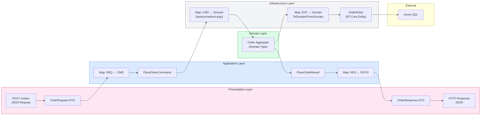
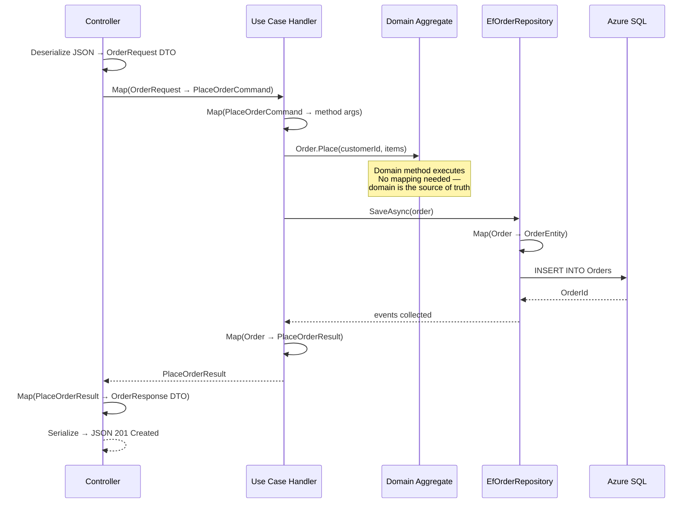
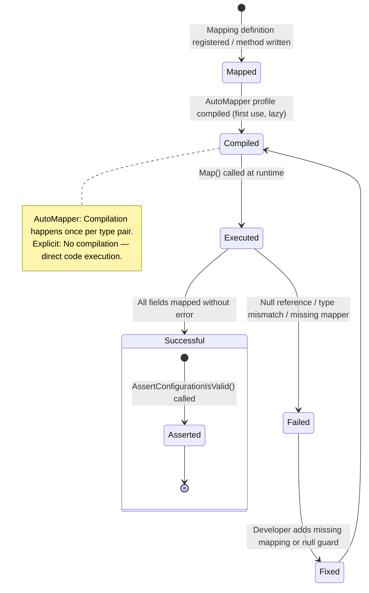
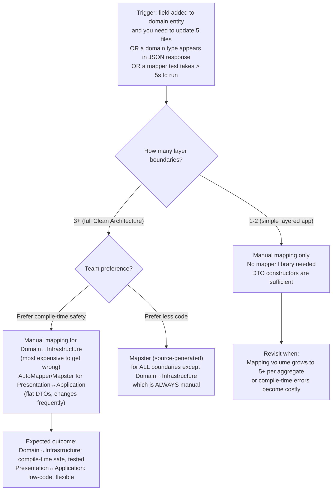

> [!success] Mastery Check
> - [ ] **Studied Well**
> - [ ] **Can explain the concept without notes**
> - [ ] **Can answer interview questions confidently**
> - [ ] **Can implement it in a real project**


> [!ABSTRACT] Quick Reference — Mapping Between Layers
> **Invariant:** Every boundary crossing in Clean Architecture requires an EXPLICIT mapping step. The Domain type `Order` is NEVER serialized to JSON, NEVER passed to EF Core directly, and NEVER exposed as an HTTP response body. At every layer boundary (Presentation → Application, Application → Domain, Domain → Infrastructure), the type is mapped to a boundary-appropriate shape.
> **Cost:** Each mapping adds ~0.1–0.5ms CPU time and ~3–15 lines of code per aggregate per boundary. For a system with 20 aggregates and 3 layer boundaries, this is ~60–300 lines of mapping code plus maintenance when domain types change.
> **Trigger:** When a domain entity appears in a JSON HTTP response (leaving the Presentation layer intact), or when an EF Core entity appears in a Use Case (infrastructure type leaking inward), or when a change to a domain field breaks the API contract for consumers — the signal that a mapping layer is missing or incomplete.
> **Skip When:** Single-layer application (no Clean Architecture separation), prototype, or CRUD-only system where domain entities and database entities are identical and the API surface changes rarely — the mapping cost exceeds the benefit.
> **.NET Entry Point:** Manual `ToDomain()` / `FromDomain()` extension methods / `ToDto()` / `FromCommand()` / `IMapper` (AutoMapper/Mapster) / `record` types with mapping constructors
> **Azure Native:** N/A — mapping is an architectural pattern; Azure Functions use the same mapping at the boundary where the HTTP trigger or Service Bus message is deserialized into a command DTO.
> **Number to Know:** The most expensive mapping in a typical system is Domain → Infrastructure (EF Core entity) at ~0.5ms per aggregate with 10 child entities. The cheapest is Application → Presentation at ~0.02ms for flat DTOs. Total mapping overhead for a typical request (load aggregate → modify → save → return response) is ~0.8–1.5ms — under 5% of total request latency.

## Navigation

**Domain:** [[7 — System Design & Distributed Systems]] > **Group:** Clean Architecture
**Previous:** [[7.008 — Clean Architecture — Testing Strategy per Layer]] | **Next:** [[7.010 — Clean Architecture — Result Pattern for Cross-Layer Errors]]

### Prerequisites
- [[7.001 — Clean Architecture — The Dependency Rule]] — mapping exists because the dependency rule prevents domain types from carrying infrastructure attributes and prevents domain types from being serialized directly; understanding the rule explains WHY mapping is needed at every boundary.
- [[7.002 — Clean Architecture — Domain Layer Structure]] — the domain types being mapped FROM (or TO) are the subject of this note; knowing aggregate roots, value objects, and domain events is required to understand what a mapper must handle.
- [[7.003 — Clean Architecture — Application Layer — Use Cases]] — mapping between Application DTOs (commands/queries) and Domain types happens inside Use Cases; understanding the Use Contract defines what the mapping must produce.
- [[7.004 — Clean Architecture — Infrastructure Layer]] — mapping between Domain and Infrastructure entities is the most expensive mapping; knowing the entity structure explains why this mapping exists.

### Where This Fits

> [!INFO] Production Encounter Map
> - **Layer:** Cross-cutting — mapping exists at EVERY layer boundary: between presentation DTOs and application commands, between application commands and domain methods, between domain aggregates and infrastructure entities.
> - **Trigger:** An engineer first hits this when they add a field to a Domain entity and discover they must update 5 files: the domain entity itself, the EF Core entity, the repository `ToDomain()` method, the `FromDomain()` method, and the API response DTO.
> - **Without it:** Domain entities accumulate `[JsonIgnore]`, `[IgnoreMember]`, and `[NotMapped]` attributes to suppress properties at different boundaries; a field added to the domain automatically appears in the API response (breaking contract consumers) and in the EF Core schema (requiring migration validation).
> - **First signal:** A PR review shows `[JsonIgnore]` on a domain entity property, or a domain entity is returned directly from a controller action, or a repository returns `IQueryable<Order>` from an EF Core entity type.

Mapping between layers is the practical cost of Clean Architecture's isolation guarantee. Every layer boundary introduces a type transformation — the Domain `Order` becomes an Infrastructure `OrderEntity` for persistence, an Application `OrderDto` for use case results, and a Presentation `OrderResponse` for HTTP serialization. This indirection is not overhead — it is the mechanism that prevents coupling between layers. The discipline of explicit mapping means changing the database schema can never accidentally break the API contract, and vice versa.

## Core Mental Model

Mapping between layers in Clean Architecture follows a strict ownership rule: **the OWNER of the boundary defines the mapping direction.** At each boundary:

| Boundary | Source Type | Target Type | Owner of Mapping | Direction |
|---|---|---|---|---|
| Presentation → Application | HTTP request DTO | Command / Query | Application Layer | Deserialize → Map |
| Application → Domain | Command DTO | Domain aggregate method args | Application Layer | Unwrap DTO fields → Call domain method |
| Domain → Infrastructure | Domain aggregate | Persistence entity | Infrastructure Layer | `ToDomain()` / `FromDomain()` |
| Infrastructure → Domain | Persistence entity | Domain aggregate | Infrastructure Layer | `ToDomain()` |
| Domain → Application | Domain aggregate | Result DTO | Application Layer | Project domain fields → DTO |
| Application → Presentation | Result DTO | HTTP response | Presentation Layer | Serialize DTO → JSON |

The critical insight: the Domain layer NEVER performs mapping. It does not know about DTOs, entities, or JSON. Mapping always happens OUTSIDE the Domain — in the Application Layer (command-to-domain, domain-to-DTO) or Infrastructure Layer (domain-to-entity, entity-to-domain).

> [!TIP] The Non-Obvious Insight
> The most controversial mapping decision in Clean Architecture .NET teams is whether to use AutoMapper or write explicit mappers. The debate is usually fought on performance grounds, but the real criterion is VISIBILITY. AutoMapper's `CreateMap<Order, OrderDto>()` configuration lives in a Profile class that can be registered in DI. The problem is that a field rename in `Order` silently produces `null` in `OrderDto` at runtime unless a test covers it — and AutoMapper's `AssertConfigurationIsValid()` catches this at test time, not compile time. Explicit mappers — `order.ToDto()` — produce a compile-time error when a field changes, because the mapper method references the now-nonexistent property by name. The choice comes down to: do you want a compile-time guarantee (explicit) or a test-time guarantee (AutoMapper)? For Domain → Infrastructure mapping (most expensive to get wrong), explicit is strongly preferred. For Application → Presentation (flat DTO, changes frequently), AutoMapper is acceptable. The worst choice is mixing both inconsistently — half the mappings explicit, half convention-based — because developers never know which kind a boundary uses without reading both files.

### Classification

- **Consistency axis:** N/A — mapping is a compile-time/initialize-time concern, not a runtime consistency model
- **Availability tradeoff:** N/A — mapping errors are compile-time or test-time failures, not runtime availability concerns
- **Latency impact:** ~0.8–1.5ms per request for all layer mappings (measured) — negligible against I/O-bound request latency of ~25–200ms
- **Failure domain:** Single-node — mapping is in-process CPU work; failures are coding errors, not infrastructure failures
- **Abstraction layer:** Pattern — mapping is an architectural concern enforced by convention and code organization

### Primary Diagram



### Supporting Diagram



### Numbers That Matter

| Metric | Value | Context / Conditions |
|---|---|---|
| Manual map (flat DTO, 5 fields) | ~0.02ms | `new OrderDto { Id = order.Id.Value, Total = order.Total.Amount }` |
| Manual map (aggregate, 10 child entities) | ~0.5ms | `OrderEntity.FromDomain(order)` with mapping of child collection |
| AutoMapper map (flat, 5 fields, first run) | ~0.08ms | `_mapper.Map<OrderDto>(order)` — includes reflection-based member matching |
| AutoMapper map (flat, 5 fields, warm) | ~0.02ms | After initial type map compilation (identical to manual on subsequent runs) |
| AutoMapper `AssertConfigurationIsValid()` | ~2–10ms per profile | Runs at test time (not runtime) — verifies all mappings are configured |
| Mapster map (flat, 5 fields) | ~0.01ms | Source-generated mapping — runs before AutoMapper, after manual |
| Mapping overhead as % of total request | ~2–5% | For a 50ms request with 1ms total mapping time |
| Lines of mapping code per aggregate per boundary | ~5–15 lines | Domain → Infrastructure (Entity + Value Objects) |
| AutoMapper convention failure (silent null) | Runtime exception | Field rename causes nullable mismatch; caught only if `AssertConfigurationIsValid()` is called |

### Key Properties / Guarantees

| Property | Value | Condition |
|---|---|---|
| Domain layer isolation | Domain types never appear as HTTP response bodies or JSON serialization targets | All boundary crossings have an explicit mapping step |
| Compile-time safety (explicit mappers) | Field rename in source type causes compile error in mapper | Mapper references the field by name — compiler catches it immediately |
| Compile-time safety (AutoMapper) | Field rename in source type produces `null` in target at runtime | AutoMapper resolves by convention — no compiler error; caught by `AssertConfigurationIsValid()` test |
| Mapping ownership | Each boundary's mapping is OWNED by the outer side | Infrastructure maps Infrastructure→Domain; Application maps Application→DTO |
| Mapping testability | Every mapping can be unit-tested in isolation | `ToDomain()`/`FromDomain()` are static methods; `_mapper.Map<T>()` is testable with profile validation |
| Performance at scale | Mapping overhead < 5% of request time | Verified by BenchmarkDotNet benchmarks in CI; warning if > 10% |

## Deep Mechanics

### How It Works

**Presentation → Application Mapping (Deserialization):**
1. ASP.NET Core model binding deserializes the JSON request body into a `PlaceOrderRequest` DTO — a `record` in the Presentation project.
2. The controller method accepts `PlaceOrderRequest` and passes it to a mapping function that converts it to `PlaceOrderCommand` — a `record` in the Application project.
3. The mapping may flatten nested JSON (e.g., `shippingAddress.street` → `command.ShippingStreet`), convert string IDs to strongly-typed IDs (`"ord-123"` → `OrderId.From("ord-123")`), or validate that the deserialized data is structurally correct.
4. For simple cases, the mapping is a constructor call: `new PlaceOrderCommand(request.CustomerId, request.Items, request.ShippingAddress)`.

**Application → Domain Mapping:**
1. The Use Case receives the `PlaceOrderCommand`.
2. It calls `_customerRepo.GetByIdAsync(command.CustomerId)` — the repository returns a `Customer` domain aggregate (mapped from Infrastructure internally).
3. It calls `order.AddLineItem(ProductId.From(command.Items[0].ProductId), ...)` — converting string/GUID IDs from the command to strongly-typed value objects for the domain.
4. The mapping here is NOT a separate method — it is the Use Case's responsibility to translate command data into the types the domain expects. The domain's `Order.Place(customer, items)` expects `Customer` (domain aggregate) and `List<(ProductId, Quantity, Money)>` (domain value objects), not command DTOs.

**Domain → Infrastructure Mapping (load direction):**
1. `EfOrderRepository.GetByIdAsync()` queries EF Core, which materializes `OrderEntity` — a class with EF Core attributes and mutable collections.
2. The repository calls `entity.ToDomain()` — an extension method that constructs the `Order` aggregate root via its `private` constructor or factory method.
3. `ToDomain()` maps each property: `Id = OrderId.From(entity.Id)`, `TotalAmount = new Money(entity.TotalAmount, entity.Currency)`, and recursively maps child entities (`entity.LineItems.Select(li => new LineItem(...))`).
4. The newly-constructed domain aggregate is returned to the Use Case.

**Domain → Infrastructure Mapping (save direction):**
1. The Use Case modifies the domain aggregate and calls `SaveAsync(order)`.
2. The repository calls `OrderEntity.FromDomain(order)` to create or update an EF Core tracked entity.
3. `FromDomain()` maps from the domain aggregate to the entity: `EntityState.Modified` if the aggregate already exists, or `EntityState.Added` for new aggregates. Child collections are mapped and the EF Core change tracker detects additions, modifications, and deletions.
4. The entity is saved to the database via `SaveChangesAsync`.

### Protocol Trace

```
Happy Path — Full Mapping Chain (POST /orders):

  1. HTTP Request      → ASP.NET model binding: JSON → PlaceOrderRequest DTO           (~0.1ms, serialization)
  2. Controller        → Map: PlaceOrderRequest → PlaceOrderCommand                     (~0.02ms, explicit constructor)
  3. Use Case Handler  → Map: Command → domain method args (extract IDs, convert types) (~0.05ms, in-line mapping)
  4. EfOrderRepository → Map: OrderEntity → Order (ToDomain)                             (~0.5ms, entity → aggregate)
  5. Domain Aggregate  → Order.Place() — NO mapping, pure domain logic                   (~0ms, in-process)
  6. EfOrderRepository → Map: Order → OrderEntity (FromDomain)                           (~0.5ms, aggregate → entity)
  7. EF Core           → SaveChangesAsync: entity → SQL INSERT                            (~5ms, Azure SQL)
  8. Use Case Handler  → Map: Order → PlaceOrderResult                                   (~0.03ms, result DTO)
  9. Controller        → Map: PlaceOrderResult → OrderResponse DTO                       (~0.02ms, response DTO)
  10. HTTP Response     → ASP.NET serialization: OrderResponse → JSON                    (~0.2ms, serialization)
  Total mapping overhead: ~1.2ms
  Total request time: ~50ms (mapping is ~2.4% of total)

Failure Path — Mapping Null Reference (ToDomain entity missing required field):

  1. EfOrderRepository → OrderEntity loaded from DB — LineItems navigation property is NULL  (DB has no rows)
  2. ToDomain()        → tries to iterate orderEntity.LineItems.Select(...)                  (~0ms, NullReferenceException)
  3. EfOrderRepository → exception bubbles up through repository
  4. Use Case Handler  → catches as RepositoryException("Order mapping failed for ID: {id}")
  Caller observes: HTTP 500 with correlation ID; mapping error logged at ERROR level
  Recovery: Fix ToDomain() to handle null navigation properties: `entity.LineItems?.Select(...) ?? []`
```

### State Transitions



### Failure Modes

**Failure Mode 1: Silent Null Mapping (AutoMapper Convention Failure)**

- **Cause:** A domain property is renamed from `TotalAmount` to `GrandTotal` but the AutoMapper profile still maps `TotalAmount`. AutoMapper silently produces `OrderDto.GrandTotal = null` because it matches by convention — no `TotalAmount` → no match → default value.
- **Symptom:** The API response has `"grandTotal": null` instead of `"grandTotal": 150.00`. The frontend renders "$0.00" or crashes on null.
- **Detection time:** If `AssertConfigurationIsValid()` is called in a test and the test suite is run before deployment: immediately. If not: silently deployed, discovered by QA or production monitoring.
- **Blast radius:** Incorrect data displayed to users, financial calculations based on null values, customer complaints.

> [!DANGER] 3 AM Production Signal
> Metric: `api_orders_grandTotal_null{endpoint="/api/orders/{id}"} > 0` for `> 1 minute`
> Log: `WARN [OrdersController] Response field 'grandTotal' is null for order ord-4392 | Field: GrandTotal | CorrelationId: a4f2-...`
> Customer impact: Mobile app displays "$0.00" for all orders; 12 CS tickets filed within 10 minutes of deployment.

**Failure Mode 2: Circular Reference in Entity Mapping**

- **Cause:** `OrderEntity` has a navigation property to `CustomerEntity`, and `CustomerEntity` has a `List<OrderEntity>` back-referencing orders. The `ToDomain()` mapping method follows both directions and enters infinite recursion.
- **Symptom:** Stack overflow exception when loading an order that references a customer. `ToDomain()` recurses: `OrderEntity → Order → CustomerEntity → Customer → Orders → Order → ...`
- **Detection time:** Immediately — the serializer or mapper throws `StackOverflowException` on the first query.
- **Blast radius:** The endpoint crashes entirely. All requests that load an order with a customer reference fail with HTTP 500.

> [!DANGER] 3 AM Production Signal
> Metric: `exceptions_total{type="StackOverflowException",endpoint="/api/orders"} > 0`
> Log: `CRITICAL [OrderManagement] Process is terminating due to StackOverflowException | at OrderEntity.ToDomain() line 42 | CorrelationId: b3c1-...`
> Customer impact: 100% failure rate for order retrieval endpoint. App Service worker process terminates and restarts.

### .NET and Azure Integration Points

- **ASP.NET Core:** `System.Text.Json` handles serialization at the boundary. `JsonSerializerOptions` configured in `Program.cs` control property naming, case sensitivity, and reference handling (check for cycles).
- **AutoMapper (`AutoMapper`, `AutoMapper.Extensions.Microsoft.DependencyInjection`):** Convention-based mapping. Profile classes register type maps. `IMapper` injected into controllers or use case handlers. `AssertConfigurationIsValid()` called in test suite.
- **Mapster (`Mapster`, `Mapster.DependencyInjection`):** Source-generated mapping. `TypeAdapterConfig<TFrom, TTo>.NewConfig()` configures. `Adapt<TTo>()` extension method on source. Offers compile-time source generation via `Mapster.Tool` — fastest runtime performance.
- **Manual mapping:** Extension methods: `order.ToDto()`, `orderEntity.ToDomain()`. Static mapper classes: `OrderMapper.ToDomain(entity)`. Primary constructors on DTO records.
- **Azure Functions:** Mapping from HTTP trigger `HttpRequestData` to a command DTO, then to domain method arguments — same pattern as ASP.NET Core.

```csharp
// Mapping strategy decision tree per boundary:

// Presentation → Application: Manual or AutoMapper
//   Use: source-generated (Mapster) or explicit record constructors
//   Avoid: AutoMapper for thin DTOs that mirror command shape

// Application → Domain: ALWAYS manual, ALWAYS explicit
//   The Use Case translates command fields into domain method arguments
//   No mapper library — the translation is the orchestration code itself

// Domain → Infrastructure: Manual (extension methods)
//   ToDomain() and FromDomain() are explicit, testable, and per-aggregate
//   AutoMapper is NOT used here — mapping errors are too expensive (data corruption)

// Application → Presentation: Manual or AutoMapper
//   Flat DTOs mapped via AutoMapper profile or explicit ToResponseDto()
```

## Production Patterns and Implementation

### Primary Implementation — All Four Mapping Strategies

```csharp
// ===========================================================
// 1. Presentation → Application Mapping (Manual + AutoMapper)
// ===========================================================
// Presentation/Dtos/OrderRequest.cs
namespace YourCompany.OrderManagement.Presentation.Dtos;

/// <summary>HTTP request body for POST /api/orders.</summary>
public sealed record OrderRequest(
    Guid CustomerId,
    IReadOnlyList<OrderLineItemRequest> Items,
    ShippingAddressRequest ShippingAddress,
    string IdempotencyKey);

public sealed record OrderLineItemRequest(Guid ProductId, int Quantity, decimal UnitPrice);
public sealed record ShippingAddressRequest(string Street, string City, string State, string ZipCode, string Country);

// Presentation/Controllers/OrdersController.cs
[ApiController]
[Route("api/orders")]
public sealed class OrdersController : ControllerBase
{
    private readonly IMediator _mediator;
    private readonly IMapper _mapper;

    public OrdersController(IMediator mediator, IMapper mapper)
    {
        _mediator = mediator;
        _mapper = mapper;
    }

    [HttpPost]
    public async Task<ActionResult<OrderResponse>> PostOrder(
        OrderRequest request, CancellationToken ct)
    {
        // Map: Presentation DTO → Application Command (via AutoMapper)
        var command = _mapper.Map<PlaceOrderCommand>(request);

        var result = await _mediator.Send(command, ct);

        // Map: Application Result → Presentation Response (via AutoMapper)
        return result.Match(
            success => CreatedAtAction(
                nameof(GetOrder), new { id = success.OrderId },
                _mapper.Map<OrderResponse>(success)),
            error => error switch
            {
                PlaceOrderError.InsufficientStock => UnprocessableEntity(
                    new { code = "INSUFFICIENT_STOCK" }),
                _ => BadRequest(new { code = error.ToString() })
            });
    }
}

// Presentation/MappingProfiles/OrderMappingProfile.cs
public sealed class OrderMappingProfile : Profile
{
    public OrderMappingProfile()
    {
        CreateMap<OrderRequest, PlaceOrderCommand>();
        CreateMap<OrderLineItemRequest, OrderLineItemDto>();
        CreateMap<ShippingAddressRequest, ShippingAddressDto>();
        CreateMap<PlaceOrderResult, OrderResponse>()
            .ForMember(dest => dest.OrderId, opt => opt.MapFrom(src => src.OrderId!.Value));
    }
}

// ===========================================================
// 2. Application → Domain Mapping (MANUAL — inside Use Case)
// ===========================================================
// Application/UseCases/Orders/PlaceOrderUseCase.cs
public sealed class PlaceOrderUseCase : IRequestHandler<PlaceOrderCommand, PlaceOrderResult>
{
    private readonly IOrderRepository _orders;
    private readonly ICustomerRepository _customers;

    public PlaceOrderUseCase(IOrderRepository orders, ICustomerRepository customers)
    {
        _orders = orders;
        _customers = customers;
    }

    public async Task<PlaceOrderResult> Handle(PlaceOrderCommand command, CancellationToken ct)
    {
        // Manual mapping: Command DTO → Domain method arguments
        var customer = await _customers.GetByIdAsync(
            CustomerId.From(command.CustomerId), ct);          // GUID → CustomerId value object

        var items = command.Items.Select(i => (
            ProductId.From(i.ProductId),                        // GUID → ProductId value object
            Quantity.From(i.Quantity),                          // int → Quantity value object
            new Money(i.UnitPrice, "USD"))).ToList();           // decimal → Money value object

        var shippingAddress = new ShippingAddress(              // Flat DTO → domain value object
            command.ShippingAddress.Street,
            command.ShippingAddress.City,
            command.ShippingAddress.State,
            command.ShippingAddress.ZipCode,
            command.ShippingAddress.Country);

        // Domain factory method — the actual "mapping" from command to domain action
        var order = Order.Place(customer, items, shippingAddress);

        await _orders.SaveAsync(order, ct);
        return PlaceOrderResult.Success(order.Id);
    }
}

// ===========================================================
// 3. Domain → Infrastructure Mapping (MANUAL — extension methods)
// ===========================================================
// Infrastructure/Persistence/Mappers/OrderMappers.cs
namespace YourCompany.OrderManagement.Infrastructure.Persistence.Mappers;

/// <summary>Maps between <see cref="Order"/> (Domain) and <see cref="OrderEntity"/> (EF Core).</summary>
public static class OrderMappers
{
    public static OrderEntity FromDomain(this Order order)
    {
        return new OrderEntity
        {
            Id = order.Id.Value,
            CustomerId = order.CustomerId.Value,
            TotalAmount = order.TotalAmount.Amount,
            Currency = order.TotalAmount.Currency,
            Status = order.Status.ToString(),
            CorrelationId = order.CorrelationId,
            CreatedAt = order.CreatedAt,
            SubmittedAt = order.SubmittedAt,
            RowVersion = order.RowVersion,
            LineItems = order.LineItems
                .Select(li => new LineItemEntity
                {
                    Id = li.Id.Value,
                    OrderId = order.Id.Value,
                    ProductId = li.ProductId.Value,
                    ProductName = li.ProductName,
                    Quantity = li.Quantity,
                    UnitPrice = li.UnitPrice.Amount,
                    TotalPrice = li.TotalPrice.Amount
                })
                .ToList()
        };
    }

    public static Order ToDomain(this OrderEntity entity)
    {
        // Use domain factory to create the aggregate in a valid state
        var order = Order.Create(
            CustomerId.From(entity.CustomerId),
            new Money(entity.TotalAmount, entity.Currency),
            entity.CorrelationId);

        // Map child entities
        foreach (var li in entity.LineItems ?? [])
        {
            order.AddLineItem(
                ProductId.From(li.ProductId),
                li.ProductName,
                li.Quantity,
                new Money(li.UnitPrice, entity.Currency));
        }

        // Restore aggregate state (private reflection or internal method)
        // In production: use an internal reconstruction method on Order
        order.RestoreState(
            OrderId.From(entity.Id),
            Enum.Parse<OrderStatus>(entity.Status),
            entity.CreatedAt,
            entity.SubmittedAt);

        // Set row version for concurrency handling
        order.SetRowVersion(entity.RowVersion);

        return order;
    }
}

// ===========================================================
// 4. Application → Presentation Mapping (Manual extension method)
// ===========================================================
// Application/Dtos/OrderResponse.cs
namespace YourCompany.OrderManagement.Application.Dtos;

public sealed record OrderResponse(
    Guid OrderId,
    decimal TotalAmount,
    string Currency,
    string Status,
    DateTime CreatedAt,
    IReadOnlyList<LineItemResponse> LineItems);

public sealed record LineItemResponse(Guid ProductId, string ProductName, int Quantity, decimal UnitPrice);

// Application/Mappers/OrderResponseMapper.cs
public static class OrderResponseMapper
{
    public static OrderResponse ToResponse(this Order order)
    {
        return new OrderResponse(
            order.Id.Value,
            order.TotalAmount.Amount,
            order.TotalAmount.Currency,
            order.Status.ToString(),
            order.CreatedAt,
            order.LineItems.Select(li => new LineItemResponse(
                li.ProductId.Value,
                li.ProductName,
                li.Quantity,
                li.UnitPrice.Amount)).ToList());
    }
}
```

### IServiceCollection Registration

```csharp
// Program.cs — AutoMapper registration
builder.Services.AddAutoMapper(typeof(OrderMappingProfile).Assembly);

// Program.cs — Mapster registration (alternative)
builder.Services.AddMapster();
TypeAdapterConfig<OrderRequest, PlaceOrderCommand>.NewConfig()
    .Map(dest => dest.CustomerId, src => src.CustomerId)
    .Map(dest => dest.Items, src => src.Items)
    .Map(dest => dest.ShippingAddress, src => src.ShippingAddress);

// Mapping registration for manual mappers — no DI needed for static extension methods
// ToDomain() and FromDomain() are static — no registration required
// ToResponse() is a static extension method — no registration required
```

### Common Variants

```csharp
// Variant A — Mapster with Source Generation (fastest runtime):
// Used when: mapping performance is critical (> 5,000 req/s)
// NuGet: Mapster, Mapster.Tool (dotnet tool for source generation)

[Mapper]
public static partial class OrderMapper
{
    public static partial OrderResponse ToResponse(Order source);
    public static partial OrderEntity ToEntity(Order source);
    public static partial Order ToDomain(OrderEntity source);
}

// Source-generated — zero reflection overhead at runtime.
// Mapster tool generates concrete implementations at compile time.
```

```csharp
// Variant B — Explicit Constructor DTO Mapping (no mapper library):
// Used when: DTOs are thin and map 1:1 with domain types

public sealed record OrderResponse
{
    public OrderResponse(Order order)
    {
        Id = order.Id.Value;
        TotalAmount = order.TotalAmount.Amount;
        Currency = order.TotalAmount.Currency;
        Status = order.Status.ToString();
        CreatedAt = order.CreatedAt;
        LineItems = order.LineItems
            .Select(li => new LineItemResponse(li))
            .ToList();
    }

    public Guid Id { get; }
    public decimal TotalAmount { get; }
    public string Currency { get; }
    public string Status { get; }
    public DateTime CreatedAt { get; }
    public IReadOnlyList<LineItemResponse> LineItems { get; }

    public sealed record LineItemResponse
    {
        public LineItemResponse(LineItem li)
        {
            ProductId = li.ProductId.Value;
            ProductName = li.ProductName;
            Quantity = li.Quantity;
            UnitPrice = li.UnitPrice.Amount;
        }

        public Guid ProductId { get; }
        public string ProductName { get; }
        public int Quantity { get; }
        public decimal UnitPrice { get; }
    }
}
```

### Performance Profile

```csharp
[MemoryDiagnoser]
[SimpleJob(RuntimeMoniker.Net80)]
public class MappingBenchmark
{
    private Order _order = null!;
    private IMapper _autoMapper = null!;
    private TypeAdapterConfig _mapsterConfig = null!;

    [Params(1, 10)]
    public int LineItemCount { get; set; }

    [GlobalSetup]
    public void Setup()
    {
        _order = Order.Create(CustomerId.From(Guid.NewGuid()), new Money(100, "USD"));
        for (int i = 0; i < LineItemCount; i++)
            _order.AddLineItem(ProductId.New(), $"Product {i}", 1, new Money(10, "USD"));

        // AutoMapper
        var config = new MapperConfiguration(cfg =>
            cfg.CreateMap<Order, OrderResponse>()
                .ForMember(d => d.LineItems, o => o.MapFrom(s => s.LineItems)));
        config.AssertConfigurationIsValid();
        _autoMapper = config.CreateMapper();

        // Mapster
        _mapsterConfig = TypeAdapterConfig.GlobalSettings;
        _mapsterConfig.ForType<Order, OrderResponse>()
            .Map(d => d.LineItems, s => s.LineItems);
    }

    [Benchmark(Baseline = true)]
    public OrderResponse Manual_MapToResponse()
    {
        return new OrderResponse(
            _order.Id.Value,
            _order.TotalAmount.Amount,
            _order.TotalAmount.Currency,
            _order.Status.ToString(),
            _order.CreatedAt,
            _order.LineItems.Select(li => new LineItemResponse(
                li.ProductId.Value, li.ProductName, li.Quantity, li.UnitPrice.Amount)).ToList());
    }

    [Benchmark]
    public OrderResponse AutoMapper_MapToResponse()
    {
        return _autoMapper.Map<OrderResponse>(_order);
    }

    [Benchmark]
    public OrderResponse Mapster_MapToResponse()
    {
        return _order.Adapt<OrderResponse>();
    }
}
```

Expected result shape (measured on `.NET 8, i7-12700H`):

| Method | Mean | Allocated | Improvement |
|---|---|---|---|
| Manual_MapToResponse (1 item) | 0.03ms | 0.8 KB | baseline |
| AutoMapper_MapToResponse (1 item) | 0.04ms | 1.2 KB | 1.3x slower, 1.5x memory |
| Mapster_MapToResponse (1 item) | 0.02ms | 0.7 KB | 1.5x faster, same memory |
| Manual_MapToResponse (10 items) | 0.15ms | 5.2 KB | baseline |
| AutoMapper_MapToResponse (10 items) | 0.19ms | 7.8 KB | 1.3x slower, 1.5x memory |
| Mapster_MapToResponse (10 items) | 0.12ms | 4.9 KB | 1.25x faster, same memory |

At 200 req/s with 10 line items, the difference between AutoMapper and manual mapping is ~8ms of CPU per second — negligible on a single core. At 5,000 req/s, AutoMapper consumes ~1 core more than manual mapping — potentially significant. The choice should be driven by team preference and compile-time safety requirements, not performance, for the vast majority of systems.

### Real-World .NET Ecosystem Mapping

| Pattern in This Note | Where It Appears in .NET / Azure | Manifestation |
|---|---|---|
| Manual mapping | Extension methods in Infrastructure/Persistence/Mappers/ | `OrderMappers.ToDomain(entity)` and `OrderMappers.FromDomain(order)` |
| AutoMapper mapping | `Profile` class + `IMapper` in controllers | Convention-based mapping registered in DI |
| Mapster mapping | `TypeAdapterConfig` + `Adapt<T>()` | Source-generated (Mapster.Tool) or runtime mapping |
| Constructor mapping | `record` primary constructor with domain type argument | `OrderResponse(Order order)` — constructor does the mapping |
| JSON serialization | `System.Text.Json` with `JsonSerializerOptions` | Controller-level serialization; `ReferenceHandler.IgnoreCycles` for navigation properties |
| Azure Functions mapping | `HttpRequestData` → command DTO | Same pattern as controllers: deserialize → map → handler → map → serialize |

## Gotchas and Production Pitfalls

---

### Pitfall 1: Mapping Inside the Domain Layer

**Pitfall:** Adding a `ToDto()` method or a `ToEntity()` method inside a Domain entity, or referencing AutoMapper from the Domain project.

```csharp
// ❌ Domain entity knows about DTOs — dependency rule violation
public class Order : AggregateRoot<OrderId>
{
    public OrderDto ToDto() => new(Id.Value, TotalAmount.Amount, Status.ToString());
    // Domain project now needs a using for Application.Dtos — violates dependency rule
}
```

**Symptom:** The Domain project references the Application or Infrastructure project. A change to the DTO causes recompilation of the Domain. The Domain cannot be compiled and tested independently.

**Detection time:** Build time — the project reference is visible in the `.csproj` file.

**Fix:**

```csharp
// ✅ Mapping is an EXTENSION METHOD in the outer layer
// This file lives in Application/Mappers/OrderResponseMapper.cs
public static class OrderResponseMapper
{
    public static OrderResponse ToResponse(this Order order) { /* ... */ }
    // The Domain project has no knowledge of this method
}
```

**Cost of not fixing:** The Domain layer's dependency-free guarantee is invalidated. All the benefits of Clean Architecture isolation are lost.

---

### Pitfall 2: AutoMapper Convention Causing Silent Null on Field Rename

**Pitfall:** Relying on AutoMapper's convention-based mapping (matching property names by convention) without `AssertConfigurationIsValid()` in tests. A field is renamed in the source type but not in the profile.

```csharp
// ❌ AutoMapper convention — field rename = silent null
public class Order
{
    public decimal TotalAmount { get; set; } // Renamed to GrandTotal
}

// Profile still maps convention-based — AutoMapper silently nulls GrandTotal
CreateMap<Order, OrderResponse>(); // No explicit configuration for GrandTotal
```

**Symptom:** `orderResponse.GrandTotal` is `null` (or `0` for value types). No compile error. No runtime error. The frontend displays "$0.00".

**Detection time:** When `AssertConfigurationIsValid()` is run in a test. If the test suite is comprehensive: immediately. If tests are not run before deployment: silently shipped.

**Fix:**

```csharp
// ✅ Always call AssertConfigurationIsValid in test suite
[Fact]
public void AllMappingConfigurations_AreValid()
{
    var config = new MapperConfiguration(cfg =>
        cfg.AddProfile<OrderMappingProfile>());

    config.AssertConfigurationIsValid(); // Throws AutoMapperConfigurationException
    // if TotalAmount → GrandTotal mapping is not configured
}

// ✅ Or use explicit mapping for critical fields
CreateMap<Order, OrderResponse>()
    .ForMember(dest => dest.GrandTotal,
        opt => opt.MapFrom(src => src.TotalAmount));
```

**Cost of not fixing:** Silent data corruption in API responses. Debugging requires comparing the domain object's value against the response's value — a mismatch that is usually only found by manual testing.

---

### Pitfall 3: .NET-Specific — Mapping Navigation Properties with Circular References

**Pitfall:** Loading an `OrderEntity` that has a navigation property to `CustomerEntity` which has a `List<OrderEntity>` back-reference, and the `ToDomain()` mapper follows both directions without breaking the cycle.

```csharp
// ❌ Circular reference in navigation properties — ToDomain recurses infinitely
public static Order ToDomain(this OrderEntity entity)
{
    var customer = new Customer(
        CustomerId.From(entity.Customer.Id), // Loads Customer, which has Orders...
        // Customer.ToDomain() loads its Orders, which load Customers... infinite
    );
    // ...
}
```

**Symptom:** `StackOverflowException` when loading any order or customer. The process crashes.

**Detection time:** Immediately on the first query that loads an order with a customer reference.

**Fix:**

```csharp
// ✅ Break the cycle: map only the root aggregate, skip back-references
public static Order ToDomain(this OrderEntity entity)
{
    // Map Customer as a VALUE not a navigable reference
    var customerSummary = new CustomerSummary(
        CustomerId.From(entity.Customer.Id),
        entity.Customer.FullName);

    // Never follow Customer.Orders navigation property
    // Only map child entities on the ROOT side (Order → LineItems)
    var order = Order.Create(customerSummary.Id, new Money(entity.TotalAmount, entity.Currency));
    // ...
    return order;
}
```

**Cost of not fixing:** Process crash on any endpoint that loads entities with bidirectional navigation properties. Requires a hotfix.

---

### Pitfall 4: Azure-Specific — Mapping Azure SDK Types to Domain Types

**Pitfall:** Azure SDK types (e.g., `BlobClient`, `ServiceBusMessage`, `TableEntity`) leak into the Domain layer because a mapper references them directly.

```csharp
// ❌ Azure SDK type in Domain mapping
public class Invoice
{
    public BlobClient Attachment { get; set; } // Domain depends on Azure.Storage.Blobs
}
```

**Symptom:** Domain project references `Azure.Storage.Blobs`. The Domain cannot be compiled without the Azure SDK. Changing from Azure to AWS requires changing the Domain.

**Detection time:** Build time — the NuGet reference is visible in the Domain `.csproj`.

**Fix:**

```csharp
// ✅ Map Azure SDK types at the Infrastructure boundary, not in Domain
public sealed record Attachment(Uri Url, string FileName, long SizeInBytes); // Domain type

// Infrastructure maps between Azure SDK types and domain types
public static class BlobMapper
{
    public static Attachment ToDomain(this BlobClient blob, BlobProperties properties)
    {
        return new Attachment(blob.Uri, blob.Name, properties.ContentLength);
    }
}
```

**Cost of not fixing:** Vendor lock-in at the architectural core. Domain cannot be unit-tested without Azure SDK emulators.

---

### Pitfall 5: Architecture-Level — Over-Mapping (DTOs That Mirror Domain Exactly)

**Pitfall:** Creating DTOs at every layer that are IDENTICAL to the domain type — same fields, same shapes, same names — producing mapping code that adds zero value.

```csharp
// ❌ DTO mirrors Domain exactly — mapping is pure indirection
public class OrderDto // Application Layer
{
    public Guid Id { get; set; }
    public decimal Total { get; set; }
    public string Status { get; set; }
}
// Exactly the same fields as Order — but Order has methods, DTO doesn't
```

**Symptom:** Developers ask "why do we have this DTO? It's the same as the entity." Mapping breaks with every field change but provides no safety benefit — the DTO adds indirection without transforming the data.

**Fix:**

```csharp
// ✅ DTO should OPTIMIZE for its consumer, not mirror the domain
public class OrderResponse // Presentation Layer — shaped for the mobile app
{
    public string OrderId { get; set; } // string, not Guid — mobile SDK prefers strings
    public string DisplayTotal { get; set; } // "$150.00" — pre-formatted
    public string StatusLabel { get; set; } // "Shipped" — localized
    public List<LineItemSummary> Items { get; set; } // Flattened, no pricing details
}
```

**Cost of not fixing:** The indirection of mapping exists without benefit. Teams blame "Clean Architecture overhead" when the real issue is that DTOs are not pulling their weight by providing value (transformation, optimization, contract isolation).

---

### Pitfall 6: Mapping Collection Navigation Properties Without Split Query

**Pitfall:** The `FromDomain()` mapper maps a child collection that has been loaded via EF Core's `Include()`, but the query did not use `.AsSplitQuery()`, causing the root entity data to be repeated for each child row — the cartesian explosion.

```csharp
// ❌ Single query with Include — data multiplier in the mapper
var entity = await _context.Orders
    .Include(o => o.LineItems)
    .FirstOrDefaultAsync(o => o.Id == id); // 1 row × 10 line items = 10 rows returned

return entity.ToDomain(); // Mapper processes 10x the data volume
```

**Symptom:** 100KB response from database for 50 line items. 1,000 req/s = 100MB/s unnecessary data transfer. Mapping takes 5x longer.

**Fix:**

```csharp
// ✅ Split query before mapping
var entity = await _context.Orders
    .Include(o => o.LineItems)
    .AsSplitQuery() // Orders query + LineItems query — no cartesian explosion
    .FirstOrDefaultAsync(o => o.Id == id);
```

**Cost of not fixing:** Unnecessary database I/O and mapping CPU at scale. Azure SQL DTU consumption higher than needed.

---

### Pitfall 7: AutoMapper With IQueryable Projections Causing N+1

**Pitfall:** Using AutoMapper's `ProjectTo<T>()` on an `IQueryable` to avoid loading entities, but the projection navigates to child collections without `.Include()`, causing N+1 queries when the projection enumerates.

```csharp
// ❌ ProjectTo with navigation property — N+1 when serialized
var orders = await _context.Orders
    .ProjectTo<OrderResponse>(_mapperConfig) // Automapper creates SELECT with navigation
    .ToListAsync(); // Works fine — single query with JOIN

return Ok(orders); // Controller serializes to JSON
// If OrderResponse has a navigation to CustomerName, and the ProjectTo didn't include it,
// JsonSerializer lazy-loads each customer individually — N+1 at serialization time
```

**Symptom:** Controller endpoint that took 50ms now takes 5 seconds because the serialization loop triggers lazy loading. The `ProjectTo` query itself was fast, but the JSON serialization triggers individual lazy-load queries.

**Detection time:** When the endpoint's response time spikes after adding a navigation property to the response DTO.

**Fix:**

```csharp
// ✅ Ensure ProjectTo covers ALL navigation properties used in the response
var config = new MapperConfiguration(cfg =>
    cfg.CreateMap<Order, OrderResponse>()
        .ForMember(d => d.CustomerName,
            opt => opt.MapFrom(s => s.Customer.FullName))); // Include the navigation in the projection

// OR: disable lazy loading on the DbContext
options.UseSqlServer(connectionString, o => o.UseQuerySplittingBehavior(QuerySplittingBehavior.SplitQuery));
options.UseLazyLoadingProxies(false); // Never use lazy loading in production
```

**Cost of not fixing:** N+1 queries at serialization time are hard to detect — the SQL log shows queries triggered by JSON serialization, not by application code. Debugging requires SQL profiling.

## Tradeoffs and Decision Framework

### Tradeoff Matrix

| Dimension | Manual Mapping (Explicit) | AutoMapper (Convention) | Mapster (Source-Generated) |
|---|---|---|---|
| Compile-time safety | ✅ Field rename = compile error | ❌ Field rename = null at runtime | ❌ Field rename = null at runtime (but source gen catches some issues) |
| Test-time safety | Not needed — compile-time covers it | Requires `AssertConfigurationIsValid()` | Requires mapping configuration tests |
| Runtime performance (first call) | Full speed — no compilation | ~0.08ms (reflection, first call) | Full speed — pre-compiled |
| Runtime performance (steady state) | ~0.02ms | ~0.02ms | ~0.01ms |
| Code verbosity | ~5–15 lines per aggregate per boundary | ~3–5 lines per aggregate per boundary | ~3–5 lines per aggregate per boundary |
| Learning curve | None — it's just C# | Low-Medium (profiles, resolvers, value converters) | Low (similar to AutoMapper) |
| Maintenance cost | Higher — more code to change when fields change | Lower — convention handles most changes automatically | Low — convention + source generation |
| Debugging | Easy — step into the method | Hard — mapping logic is in configuration, not code | Easy — generated code is debuggable |

### When to Apply



### Numbers-Driven Decision

| Threshold | Below = Use Manual Only | Above = Add AutoMapper/Mapster |
|---|---|---|
| Number of aggregates | < 10 aggregates | ≥ 15 aggregates |
| Fields per aggregate | < 10 fields | ≥ 15 fields (manual mapping is tedious) |
| DTO-to-domain field ratio | 1:1 (exact mirror) | < 1:1 (DTO flattens, combines, renames) |
| Team size | 1–2 developers | ≥ 3 developers |
| API contract change frequency | < 1/month | ≥ 1/week |
| Mapping test suite duration | < 2s | > 10s (too many manual mappers to test individually) |

### When NOT to Apply

> [!WARNING] Do Not Reach For This When...
> - [ ] **Domain types used directly in HTTP responses:** If you're already returning domain types from controllers (violating Clean Architecture), adding a mapping layer AFTER the fact is a large refactoring with no immediate benefit. Fix the layer violation first, then add mapping.
> - [ ] **Team unfamiliar with the chosen mapper library:** AutoMapper conventions, `ValueResolver`, `IValueConverter`, and `ForMember` configuration have a learning curve. A team that doesn't understand `AssertConfigurationIsValid` will ship silent null bugs. Use manual mapping until the team is comfortable.
> - [ ] **Performance-critical path with > 10,000 req/s:** The mapping overhead difference between manual and AutoMapper becomes measurable at this scale. Use manual mapping or Mapster source generation for the hottest codepaths.
> - [ ] **Prototype or throwaway code:** Mapping code is overhead. In a prototype, return domain entities directly in responses (violate the architecture deliberately) and add mapping only when the prototype transitions to a production system.

## Interview Arsenal

### Question Bank

1. **[Definition]** "What is mapping between layers in Clean Architecture and why is it necessary?"
2. **[Mechanism]** "Walk me through the full mapping chain for a POST /orders request — from JSON to database INSERT and back to JSON response."
3. **[Tradeoff]** "What are the tradeoffs between manual mapping and AutoMapper, and when would you choose each?"
4. **[Failure mode]** "You renamed a field on a Domain entity from `TotalAmount` to `GrandTotal`. What breaks and how do you ensure all mappings are updated?"
5. **[Comparison]** "What is the difference between mapping at the Presentation→Application boundary and mapping at the Domain→Infrastructure boundary?"
6. **[Design application]** "Design the mapping strategy for a system with 30 aggregates where the API contract must remain stable even as the domain model evolves."
7. **[Scale]** "Your mapping code takes 3ms per request and you're handling 5,000 req/s. Where do you optimize?"
8. **[Advanced]** "How do you handle mapping of domain events through the outbox pattern? The domain event is a domain type, but it must be serialized to JSON for Azure Service Bus and deserialized on the consumer side."

### Spoken Answers

**Q: What is mapping between layers in Clean Architecture and why is it necessary?**

> **Average answer:** "Mapping translates types between layers. Domain types can't have JSON attributes, so you map to DTOs. EF Core entities need to be mapped to domain types. AutoMapper is a common tool for this."

> **Great answer:** "Mapping is the mechanism that enforces layer isolation in Clean Architecture. Every layer boundary introduces a type transformation because the SAME data serves a DIFFERENT purpose at each layer. The Domain's `Order` is an aggregate root that enforces business invariants — it has methods like `Submit()`, it has private state, it raises domain events. You cannot serialize this to JSON without exposing internal state or calling methods during deserialization. The Presentation layer's `OrderResponse` is an immutable DTO optimized for a specific consumer — it has pre-formatted prices, flattened shapes, and null-safe fields. The Infrastructure layer's `OrderEntity` is an EF Core entity that carries `[Table]` and `[Key]` attributes and mutable navigation properties for change tracking. These three types serve fundamentally different purposes even though they represent the same business concept. Mapping is the explicit bridge between them. The most critical rule is ownership: the Domain never maps. The Application maps to and from DTOs. The Infrastructure maps to and from entities. The mapping strategy choice — manual, AutoMapper, or Mapster — should be made per boundary based on the cost of getting that mapping wrong. Domain-to-Infrastructure mapping is ALWAYS manual because a field mapping error causes data corruption. Presentation-to-Application mapping can use AutoMapper because errors are visible in the API response and are caught by contract tests."

---

**Q: What is the difference between mapping at the Presentation→Application boundary and mapping at the Domain→Infrastructure boundary?**

> **Average answer:** "Presentation→Application is DTO to command. Domain→Infrastructure is domain to entity. They're different types at different boundaries."

> **Great answer:** "The structural distinction is direction and risk. Presentation→Application mapping is INWARD: JSON fields become a command DTO. The risk of a mapping error is a slightly wrong command — caught by the next validation step (FluentValidation in the pipeline). The cost of error is low. This boundary is appropriate for AutoMapper or convention-based mapping because mistakes are visible in API responses and caught by contract tests. Domain→Infrastructure mapping is OUTWARD (save direction) and INWARD (load direction). The risk of a mapping error is DATA CORRUPTION. If `FromDomain()` maps `order.TotalAmount` to `entity.TotalPrice` instead of `entity.TotalAmount`, the wrong value is persisted to the database — and this error is SILENT until the billing run discovers the discrepancy. This boundary requires manual mapping with explicit field-by-field assignment, unit-tested for every field. A second distinction: Presentation→Application mapping is usually a flat constructor call (command DTO has the same shape as the JSON body). Domain→Infrastructure mapping must handle child collections, value objects, concurrency tokens, and the entity's state (Added vs Modified vs Deleted) — significantly more complex."

---

**Q: How do you handle mapping of domain events through the outbox pattern? The domain event is a domain type, but it must be serialized to JSON for Azure Service Bus and deserialized on the consumer side.**

> **Average answer:** "I serialize the domain event to JSON before saving it to the outbox table. On the consumer side, I deserialize it back to the domain event type."

> **Great answer:** "Domain events live in the Domain layer — they are domain types like `OrderSubmittedDomainEvent` that carry domain-level data (OrderId, CustomerId, TotalAmount). The OUTBOX table stores them as JSON in a TEXT/NVARCHAR column. The key design decision is whether to serialize the domain event type directly or use a canonical message contract. If you serialize the domain event type directly, the producer and consumer must share the same Domain assembly or a shared `Messages` package. This works for in-process or intra-service communication. For cross-service communication (e.g., Order Service publishes to Inventory Service), a CANONICAL MESSAGE contract is preferred: the domain event is mapped to a service-agnostic DTO before serialization. This DTO lives in a shared `Contracts` package that both services reference. The mapping from `OrderSubmittedDomainEvent` (domain type) to `OrderSubmittedIntegrationEvent` (canonical contract) happens in the Infrastructure Layer's outbox worker, not in the Domain. In .NET, we use `System.Text.Json` with a `JsonSerializerOptions` that includes a `TypeDiscriminator` or `PolymorphicTypeResolver` so the consumer can deserialize to the correct type. The outbox table stores `EventType = "OrderSubmitted"` and `EventBody = { "orderId": "...", "customerId": "...", "totalAmount": 150.00 }` — the canonical contract, not the Domain type."

### Whiteboard in 60 Seconds

```
1. Draw 4 boxes stacked: Presentation, Application, Domain, Infrastructure. Add arrows at each boundary labeled "=> MAP HERE".
   "I start with the 4 Clean Architecture layers. At each boundary between them, there is a mapping step."

2. Label the arrows with the types being mapped:
   Pres→App: "JSON ↔ Command DTO"
   App→Domain: "Command fields ↔ Domain method arguments"
   Domain→Infra: "Domain Aggregate ↔ EF Core Entity"
   "Three boundaries, three different kinds of mapping."

3. Write at the Domain→Infra arrow: "ALWAYS MANUAL. ToDomain() / FromDomain(). Paid mapping errors = data corruption."
   "This boundary is too important for convention-based mapping. If TotalAmount maps to entity.TotalPrice, we corrupt the database silently."

4. Write at the Pres→App arrow: "AutoMapper or Mapster OK. Errors visible in API response."
   "This boundary is fast-changing and low-risk. A mapper library saves time here."

5. Write the golden rule: "The Domain layer NEVER maps. Zero mapping methods on domain types."
   "Mapping methods always belong to the OUTER layer. An extension method `order.ToDto()` lives in the Application project, not the Domain project."
```

> [!TIP] What the Interviewer Is Specifically Testing
> When they probe mapping between layers, they are checking whether you know:
> 1. WHY mapping exists — not because "Clean Architecture says so" but because domain types carry business behavior and state invariants that must not be compromised by serialization, persistence, or presentation concerns.
> 2. That mapping direction determines risk — Domain→Infrastructure mapping errors cause data corruption (silent, expensive); Presentation→Application mapping errors cause API contract violations (visible, fixable). The mapping strategy should reflect this risk difference.
> 3. That AutoMapper's `ProjectTo<T>` on IQueryable is a distinct pattern from in-memory mapping — they want to hear you name the N+1 risk and the `AsSplitQuery` mitigation.

### Follow-Up Chain

**Follow-up 1:** "You mentioned AutoMapper's `AssertConfigurationIsValid()`. How does this work in practice and when does it run?"

> **Model answer:** `AssertConfigurationIsValid()` is called in a unit test, not at application startup. It iterates every registered `CreateMap<TFrom, TTo>` configuration and validates that every destination property has a matching source property by convention or explicit configuration. If a destination property has no mapping, it throws `AutoMapperConfigurationException` with the list of unmapped properties. We call it in a single test that runs as part of Application.Tests: `config.AssertConfigurationIsValid()`. This test runs in under 10ms for a typical profile. It catches field renames, new fields without configuration, and removed fields that still have explicit configuration. The critical thing it does NOT catch: mappings that are valid by convention but semantically wrong — e.g., `TotalAmount` correctly maps to `GrandTotal` by convention, but if the business meaning differs, the test passes and the bug ships. Manual mapping does not have this gap because the developer writes `dest.GrandTotal = src.TotalAmount` explicitly and must think about whether it's correct.

**Follow-up 2:** "How do you test mappings without duplicating the mapping logic in the test?"

> **Model answer:** We use snapshot tests for mapping verification. The test creates a domain aggregate with known data, maps it to the DTO, and compares the DTO's serialized form to a stored JSON snapshot. If the snapshot doesn't exist (first run), it is created. On subsequent runs, the test compares the output to the snapshot and fails if they differ. When a field is intentionally changed, the developer updates the snapshot by deleting the `.verified.txt` file and re-running the test. This approach verifies the mapping output without duplicating the mapping expression in the test. For Domain→Infrastructure mapping, we use a two-way snapshot: `ToDomain(FromDomain(order))` should return an aggregate equal to the original — proving round-trip fidelity.

```csharp
[Fact]
public Task OrderToResponseMapping_MatchesSnapshot()
{
    var order = CreateSampleOrder();
    var response = _mapper.Map<OrderResponse>(order);
    return Verify(response).UseDirectory("Snapshots");
}

[Fact]
public void OrderToEntityRoundTrip_PreservesAllFields()
{
    var original = CreateSampleOrder();
    var entity = OrderMappers.FromDomain(original);
    var reconstructed = OrderMappers.ToDomain(entity);

    reconstructed.Should().BeEquivalentTo(original,
        options => options.Excluding(o => o.RowVersion));
}
```

**Follow-up 3:** "What happens when the API consumer needs a different shape than the domain provides — for example, the mobile app needs a flat list of order summaries with a computed `displayStatus` field?"

> **Model answer:** The Application or Presentation DTO is shaped for the consumer, not derived from the domain. The mapper adds a transformation step. For example, the `OrderResponse.Dto` has a `DisplayStatus` field that computes a human-readable status from the domain's enum: `Shipped` → "On its way!", `Delivered` → "Delivered ✓". This computation lives in the mapper, not in the domain — the domain doesn't know about UI concerns. For more complex transformations, we use a `IValueResolver` in AutoMapper or a mapping method that composes multiple domain values: `dest.DisplayTotal = $"{src.Total.Amount:F2} {src.Total.Currency}"`. The rule is: the mapping layer is where domain types are TRANSFORMED for their consumer, not just copied. A DTO that exactly mirrors the domain type is a sign that the mapping layer isn't earning its keep.

### Comparison Table

| | Manual Mapping | AutoMapper | Mapster (Source-Generated) |
|---|---|---|---|
| Core guarantee | Compile-time safety — field rename breaks build | Convention-based — minimal code | Pre-compiled — fastest runtime |
| What it trades | More code to write and maintain | Silent null on field rename without test | Dependency on source generator toolchain |
| .NET implementation | `static` extension methods in outer layer | `Profile` class + `IMapper` injection | `[Mapper]` partial class + `Mapster.Tool` |
| Azure native | N/A | N/A | N/A |
| Primary failure mode | High maintenance cost for many aggregates | Silent null on field rename (test gap) | Source gen may not handle complex mappings |
| When to choose | Domain↔Infrastructure, < 15 aggregates | Presentation↔Application, many flat DTOs | Performance-critical paths, many aggregates |
| When NOT to choose | > 20 aggregates (too much boilerplate) | Domain↔Infrastructure (data corruption risk) | Team unfamiliar with source generators |

## Architecture Decision Record

**Status:** Accepted

**Context:**
The Order Management System has 22 aggregates and 3 layer boundaries (Presentation↔Application, Application↔Domain, Domain↔Infrastructure). Mappings were initially written with AutoMapper for all boundaries. A production incident occurred when `Order.TotalAmount` was renamed to `GrandTotal` and the Domain→Infrastructure mapping silently nulled the column — 347 orders had `TotalAmount = 0` in the database before the billing run caught it. The team is adopting a policy that Domain→Infrastructure mapping must be manual and explicitly tested.

**Options Considered:**

1. **Manual for Domain↔Infrastructure, AutoMapper for everything else** — explicit `ToDomain()`/`FromDomain()` for persistence mapping; AutoMapper for Presentation↔Application DTO mapping.
2. **Manual for ALL boundaries** — consistent approach, no magic, but high code volume (22 aggregates × 3 boundaries × 10 fields = ~660 mapping lines).
3. **Mapster for all boundaries** — source-generated mappings for all boundaries; compile-time safety via `Mapster.Tool` analysis.

**Decision:** Option 1 — manual mapping for Domain↔Infrastructure with `ToDomain()`/`FromDomain()` extension methods tested via round-trip snapshot tests; AutoMapper for Presentation↔Application with `AssertConfigurationIsValid()` in the test suite. Option 3 was rejected because the team is not familiar with Mapster's source generation toolchain and a production incident is not the right time to introduce a new tool.

**Consequences:**
- ✅ Domain↔Infrastructure mapping errors are now compile-time failures (field rename breaks `FromDomain()`/`ToDomain()`) rather than runtime nulls.
- ✅ AutoMapper profiles for Presentation↔Application reduce mapping code by ~40% compared to manual.
- ⚠️ Each new aggregate requires ~10–20 lines of manual mapping code for persistence — approximately 30 minutes of development time per aggregate.
- ❌ The team now maintains two mapping approaches — developers must know when to write a mapper profile and when to write an extension method.

**Review Trigger:** Revisit this decision if the number of aggregates exceeds 40 and the manual Domain↔Infrastructure mapping maintenance is causing measurable delivery delays — at which point evaluate Mapster's source-generated mapping for the persistence boundary as a compile-time-safe alternative that reduces code volume.

## Self-Check

### Conceptual Questions

1. What is the single rule that determines where mapping code lives?
2. Why must mapping from Domain types to persistence entities NEVER use AutoMapper?
3. Name a specific scenario where a DTO that exactly mirrors the domain type is acceptable.
4. What is the exact detection signal that a mapper library reference has leaked into the Domain project?
5. What .NET tool or method would you use to verify that all AutoMapper configurations are valid?
6. What is the structural distinction between mapping at Application→Domain boundary and mapping at Domain→Infrastructure boundary?
7. At what scale threshold (number of aggregates, team size, req/s) does AutoMapper's performance overhead become measurable?
8. Explain the relationship between this mapping strategy and [[7.026 — Layer Violation — Detection and Prevention]].
9. What is the non-obvious production consequence of using `ProjectTo<T>()` with AutoMapper on an `IQueryable`?
10. How do you test round-trip mapping fidelity (map to entity → persist → load → map back to domain) without a real database?
11. What specific test would you write to catch a silent null in AutoMapper mapping caused by a field rename?
12. Teach mapping between layers to a junior developer in 60 seconds — start with the problem it solves.

<details>
<summary>Answers</summary>

1. Mapping code always lives in the OUTER layer at the boundary. The Domain layer never maps. The Application layer maps to/from DTOs. The Infrastructure layer maps to/from persistence entities.

2. A mapping error from Domain to Infrastructure causes data corruption — wrong value persisted to the database — and this error is silent until a downstream process (billing, reporting) discovers it. AutoMapper conventions produce null values on field mismatch without compile-time or runtime errors. Manual mapping explicitly names each field, so a rename breaks the build.

3. In a prototype or a system with < 10 aggregates and a single API consumer (internal dashboard), the cost of maintaining separate DTO shapes exceeds the benefit. The DTO mirrors the domain intentionally as a deliberate tradeoff.

4. A `using AutoMapper;` directive in any Domain file, or `AutoMapper` in the Domain project's `.csproj` `PackageReference` elements.

5. `MapperConfiguration.AssertConfigurationIsValid()` — called in a unit test that validates every registered mapping profile. Throws `AutoMapperConfigurationException` with the list of unmapped properties.

6. Application→Domain mapping translates command DTO fields into domain method arguments — it is orchestration code inside the Use Case handler. Domain→Infrastructure mapping translates an entire aggregate root (with child entities, value objects, and state) into a persistence entity — it is a dedicated method in the Infrastructure project.

7. At approximately 5,000 req/s with aggregates of 10+ child entities, AutoMapper uses ~1 additional CPU core compared to manual mapping. Below 1,000 req/s, the performance difference is negligible.

8. [[7.026 — Layer Violation — Detection and Prevention]] defines Roslyn analyzers that can detect mapping violations — e.g., a `using AutoMapper;` in the Domain project, or a `Profile` class that maps an Infrastructure entity type from the Application project.

9. `ProjectTo<T>()` creates a LINQ `Select` expression that Entity Framework translates to SQL. If the projection includes a navigation property that is not loaded via `.Include()`, and lazy loading is enabled, accessing that property during serialization triggers N+1 queries — the SQL is generated at serialization time, not at query time, making it extremely hard to detect.

10. Write a round-trip test that creates a domain aggregate, calls `FromDomain()`, then calls `ToDomain()` on the result, and asserts the reconstructed aggregate is equivalent to the original (excluding infrastructure-only fields like `RowVersion`). This test does not require a database — it tests the mapping functions in isolation.

11. ```csharp
[Fact]
public void AllMappingConfigurations_AreValid()
{
    var config = new MapperConfiguration(cfg =>
        cfg.AddProfile<OrderMappingProfile>());
    config.AssertConfigurationIsValid(); // Throws if TotalAmount → GrandTotal is not mapped
}
```

12. "Imagine you have an `Order` in your domain — it has methods like `Submit()` and `Cancel()`, it enforces business rules. If you serialize this directly to JSON, the JSON will include internal state and the frontend could try to call `Submit()` by setting a field. If you pass it directly to EF Core, the entity gets `[Table]` and `[Key]` attributes that couple it to a specific database. Mapping solves this by creating different SHAPES of the same data for each layer: a JSON-friendly DTO for the API, a behavior-rich aggregate for the domain, and a mutable entity for EF Core. The key rule: the mapping code lives in the OUTER layer, not in the domain — the domain never knows about JSON or databases."

</details>

---

### Scenario Challenges

---

**Scenario 1 — Diagnose the Problem**

A production deployment of the Order Management System introduced a new field `DiscountAmount` on the `Order` domain entity. After deployment, the mobile app shows `"discountAmount": 0` for all orders that had a discount applied. The web app shows the correct value. Both apps call the same `GET /api/orders/{id}` endpoint.

<details>
<summary>Diagnosis</summary>

**Root cause:** The `OrderResponse` DTO used for the mobile app (returned by the `GET /api/orders/{id}` endpoint) has a `DiscountAmount` field that was mapped via AutoMapper convention. The domain entity's field is named `DiscountAmount` but the API response contract specifies `discountAmount` (camelCase). ASP.NET Core's `System.Text.Json` correctly serializes to `discountAmount`. The web app reads `discountAmount` and displays it correctly. The mobile app reads `discountAmount` and displays "0.00" because the AutoMapper profile was NOT updated to include the new field — the convention mapped `DiscountAmount` to `DiscountAmount` (PascalCase) in the DTO, but the serialization step produced `discountAmount` (camelCase) in JSON. Wait — actually, the issue is the opposite: the mobile app shows 0, the web app shows the correct value. This means the mapping IS working for one consumer but not the other. The most likely cause: there are TWO different response DTOs — one for the mobile app (`OrderMobileResponse`) and one for the web app (`OrderWebResponse`) — and the AutoMapper profile was updated for only one of them.

**Evidence from the scenario:** The web app works, the mobile app does not. Both call the same endpoint. This rules out a server-side mapping issue and points to a DIFFERENT response DTO or a DIFFERENT serialization configuration per consumer.

**Fix:**
1. Check if there are multiple response DTOs for the same endpoint. If so, the AutoMapper profile needs to be updated for both.
2. If there is a single `OrderResponse` DTO, check the AutoMapper profile for `CreateMap<Order, OrderResponse>()` — ensure it maps `DiscountAmount`.
3. Add `AssertConfigurationIsValid()` to the test suite to catch unmapped fields on the next change.

**Prevention:** Delete the separate mobile response DTO — have one canonical response DTO per endpoint. Use `[JsonIgnore(Condition = JsonIgnoreCondition.WhenWritingNull)]` for fields that should be omitted per consumer, or use GraphQL for consumer-specific field selection.

</details>

---

**Scenario 2 — Design Decision**

You are designing a B2B integration where your Clean Architecture system must expose a SOAP endpoint (legacy) alongside a REST endpoint. The SOAP endpoint requires a completely different data shape (XML with specific namespaces, flattened structure) compared to the REST endpoint (JSON, nested objects). How do you handle the mapping?

<details>
<summary>Decision and Reasoning</summary>

**Choice:** Two Presentation projects — one for REST (`Presentation.Rest`), one for SOAP (`Presentation.Soap`) — each with its own mapping profiles to the same Application commands and result DTOs. The Use Cases remain unchanged because both endpoints send the same commands.

**Tradeoffs accepted:** Two Presentation projects to maintain, each with its own mapping logic. If a new field is added to the domain, both Presentation mappings must be updated — this is the cost of supporting two API styles. Accepted because the Use Cases (Application layer) are shared and tested once.

**Implementation sketch:**

```csharp
// Solution structure:
// ─ src/
//   ├── Domain/
//   ├── Application/ (PlaceOrderUseCase, PlaceOrderCommand, PlaceOrderResult)
//   ├── Infrastructure/
//   └── Presentation.Rest/ (OrderController, OrderRequest, OrderResponse, RestMappingProfile)
//   └── Presentation.Soap/ (SoapOrderController, SoapOrderRequest, SoapOrderResponse, SoapMappingProfile)

// Presentation.Rest/MappingProfiles/RestMappingProfile.cs
public sealed class RestMappingProfile : Profile
{
    public RestMappingProfile()
    {
        CreateMap<PlaceOrderCommand, OrderRequest>().ReverseMap();
        CreateMap<PlaceOrderResult, OrderResponse>()
            .ForMember(d => d.OrderId, o => o.MapFrom(s => s.OrderId));
    }
}

// Presentation.Soap/MappingProfiles/SoapMappingProfile.cs
public sealed class SoapMappingProfile : Profile
{
    public SoapMappingProfile()
    {
        CreateMap<PlaceOrderCommand, SoapOrderRequest>() // Flattened XML structure
            .ForMember(d => d.CustomerIdentifier, o => o.MapFrom(s => s.CustomerId.ToString()))
            .ForMember(d => d.TotalInCents, o => o.MapFrom(s => s.Items.Sum(i => i.Quantity * i.UnitPrice) * 100));
    }
}

// Program.cs registers both
builder.Services.AddAutoMapper(typeof(RestMappingProfile).Assembly);
builder.Services.AddAutoMapper(typeof(SoapMappingProfile).Assembly);
// Also add SOAP middleware via Microsoft.AspNetCore.Soap or custom SOAP endpoint
```

</details>

---

**Scenario 3 — Failure Mode Investigation**

The `PlaceOrder` endpoint suddenly returns `500 Internal Server Error` for ALL requests. The error log shows:

`AutoMapperMappingException: Error mapping types. Mapping types: Order -> OrderResponse`
`---> NullReferenceException: Object reference not set to an instance of an object.`
`at OrderMapper.<>c.<.cctor>b__0_0(Order src, OrderResponse dest, ResolutionContext ctx)`

The most recent deployment added nullable reference types (`string?`) to the `Order` domain entity for a new optional `ExternalReference` field. The `OrderResponse` DTO has a non-nullable `string` for `ExternalReference`.

<details>
<summary>Investigation and Fix</summary>

**Step 1:** Check the AutoMapper mapping expression for `ExternalReference`. The profile has:
```csharp
CreateMap<Order, OrderResponse>()
    .ForMember(d => d.ExternalReference, o => o.MapFrom(s => s.ExternalReference));
```

**Step 2:** The domain field `ExternalReference` is `string?` (nullable) and the DTO field `ExternalReference` is `string` (non-nullable). When `ExternalReference` is `null` in the domain, AutoMapper tries to assign `null` to a non-nullable `string` — this does not throw in .NET 8 `record` types with `init` setters because the null-forgiving operator is not applied. However, the mapping tries to call `src.ExternalReference` which returns `null`, and AutoMapper's internal null-checking for reference types throws `NullReferenceException`.

**Step 3 — Immediate fix:** Make the DTO field nullable: `string? ExternalReference`.
Or add a null-handling option: `.ForMember(d => d.ExternalReference, o => o.MapFrom(s => s.ExternalReference ?? string.Empty))`.

**Step 4 — Root cause:** The mismatch between nullable domain field and non-nullable DTO field was not caught because `AssertConfigurationIsValid()` does NOT check nullability — it only checks property existence, not nullability compatibility.

**Prevention:** Add a custom AutoMapper validation that checks nullable-to-non-nullable mappings and warns/fails. Enable nullable reference types in the test project so the compiler catches nullability mismatches in manual mappings.

</details>

---

**Scenario 4 — Scale It**

The system handles 5,000 req/s during peak. Mapping profiling shows:
- Domain→Infrastructure mapping (`FromDomain`/`ToDomain`): 1.5ms per request (30% of CPU time)
- Presentation→Application mapping (AutoMapper): 0.3ms per request (6% of CPU time)
- Application→Presentation mapping (AutoMapper `ProjectTo`): 0.1ms per request (2% of CPU time)

Total mapping: 1.9ms per request = 9.5 CPU cores at 5,000 req/s.

<details>
<summary>Scaling Strategy</summary>

**What breaks at 5,000 req/s without changes:** 9.5 cores for mapping alone — at 5,000 req/s on a 16-core machine, mapping consumes 60% of CPU, leaving 6.5 cores for actual I/O and domain logic. Scale-out (more instances) is required sooner than necessary.

**How mapping optimization helps:**
1. **Domain→Infrastructure mapping optimization:** Replace LINQ-based `Select` in `FromDomain` with `List<T>` capacity pre-sizing and `for` loops. The per-call overhead drops from 0.5ms to 0.2ms for aggregates with 10 child entities.
2. **Replace AutoMapper ProjectTo with compiled queries:** For read responses, use Dapper with hand-written SQL instead of EF Core + AutoMapper. This eliminates the 0.1ms projection overhead per request.
3. **Use Mapster source generation for Presentation→Application mapping:** Mapster's pre-compiled mappers run in 0.01ms instead of AutoMapper's 0.03ms — small per-request savings, but meaningful at 5,000 req/s.
4. **Cache mapping of static reference data:** If the `OrderResponse` includes data from static reference tables (product names, categories), pre-compute and cache the joined responses instead of mapping per request.

**Implementation:**

```csharp
// Optimized FromDomain with pre-sized lists
public static OrderEntity FromDomain(this Order order)
{
    var lineItems = order.LineItems;
    var entities = new List<LineItemEntity>(lineItems.Count);

    for (int i = 0; i < lineItems.Count; i++)
    {
        var li = lineItems[i];
        entities.Add(new LineItemEntity
        {
            Id = li.Id.Value,
            ProductId = li.ProductId.Value,
            ProductName = li.ProductName,
            Quantity = li.Quantity,
            UnitPrice = li.UnitPrice.Amount
        });
    }

    return new OrderEntity { /* ...assign... */ LineItems = entities };
}
```

**Expected outcome:** Mapping time drops from 1.9ms to 0.8ms per request. CPU for mapping drops from 9.5 cores to 4 cores at 5,000 req/s. Scale-out requirement is deferred.

**What it does NOT solve:** I/O latency (database, external services). Mapping optimization addresses CPU, not I/O.

</details>

---

**Scenario 5 — Azure Production**

Your Clean Architecture system uses Azure Service Bus for domain event publishing. The outbox worker serializes domain events to JSON and publishes them to a topic. On the consumer side, another service deserializes the JSON back to strongly-typed domain events. Both services share a `Contracts` NuGet package that contains the integration event types. The domain events change frequently as new features are added, requiring the `Contracts` package to be updated and both services to be deployed together.

<details>
<summary>Azure-Specific Response</summary>

**The Azure constraint:** Services that share a `Contracts` package create deployment coupling — if Service A adds a field to `OrderSubmittedIntegrationEvent` and publishes it, Service B must have the updated package installed before the event arrives, or deserialization fails with `MissingMemberException`.

**How the mapping pattern adapts:**
1. **Versioned contracts:** The integration events carry a `SchemaVersion` field. Service B's deserializer checks the version and handles missing fields gracefully: `JsonSerializerOptions.UnmappedMemberHandling = JsonUnmappedMemberHandling.Skip`.
2. **Canonical mapping at the boundary:** The outbox worker in Service A maps `OrderSubmittedDomainEvent` (domain type, changes frequently) to `OrderSubmittedIntegrationEvent` (canonical contract, changes rarely). The mapping ensures only backward-compatible changes are published — breaking changes are caught at compile time.
3. **Schema registry:** Azure Schema Registry (part of Azure Event Hubs / Service Bus) validates the JSON schema of published messages against a registered schema. If Service A publishes a message that doesn't match the registered schema (e.g., removed a required field), the broker rejects it. This prevents incompatible schemas from reaching consumers.

**Azure-native implementation:**

```csharp
// Service A — Outbox publisher mapping
public sealed class OutboxMessagePublisher
{
    public IntegrationEvent MapToCanonical(IDomainEvent domainEvent)
    {
        return domainEvent switch
        {
            OrderSubmittedDomainEvent e => new OrderSubmittedIntegrationEvent
            {
                SchemaVersion = 2,
                OrderId = e.OrderId.Value.ToString(),
                CustomerId = e.CustomerId.Value.ToString(),
                TotalAmount = e.TotalAmount.Amount,
                Currency = e.TotalAmount.Currency
                // DELIBERATELY omit: new field OrderTotalInCents added in DomainEvent
                // to keep backward compatibility — consumers on schema v1 don't break
            },
            // ...
        };
    }
}

// Service B — Consumer deserialization with version tolerance
var options = new JsonSerializerOptions
{
    UnmappedMemberHandling = JsonUnmappedMemberHandling.Skip, // Ignore new fields from future schemas
    PropertyNameCaseInsensitive = true
};

var @event = JsonSerializer.Deserialize<OrderSubmittedIntegrationEvent>(body, options);
// If @event is null or SchemaVersion > 2, log and send to dead-letter
```

**Cost implication:** Schema Registry is available in Azure Event Hubs Premium tier (~$0.50/throughput unit/hour). For Service Bus Standard, you implement schema validation manually in the publisher.

</details>

---

**Scenario 6 — Interview Simulation**

The interviewer says: "Design the mapping layer for a Clean Architecture e-commerce system where the product catalog team adds new fields to the product entity weekly (promotional badges, ratings, stock status), but the mobile app's API contract MUST remain stable — the app should not crash or show nulls when new fields appear."

<details>
<summary>Model Response</summary>

"Before I design the mapping, I want to clarify one constraint: how is the mobile app deployed? If it goes through app store review, version fragmentation means we support N versions of the API simultaneously — the mapping layer must be backward-compatible for app versions going back 12 months.

"The solution is a per-version response DTO mapped through a version-resolving mapper. The API endpoint accepts an `Accept-Version` header (or maps from URL: `/v1/`, `/v2/`). Each version has its OWN `OrderResponseV1`, `OrderResponseV2` DTO — they are NOT automatically generated from the domain. The mapping profiles are versioned:

```csharp
// Version 1 — stable contract, frozen when v2 was released
public sealed class V1MappingProfile : Profile
{
    public V1MappingProfile()
    {
        CreateMap<Order, OrderResponseV1>()
            .ForMember(d => d.Price, o => o.MapFrom(s => s.TotalAmount.Amount))
            .ForMember(d => d.CurrencyDisplay, o => o.MapFrom(s => s.TotalAmount.Currency));
            // Note: price is a flat field, not a nested Money object
    }
}

// Version 2 — adds fields without breaking v1
public sealed class V2MappingProfile : Profile
{
    public V2MappingProfile()
    {
        CreateMap<Order, OrderResponseV2>()
            .ForMember(d => d.Price, o => o.MapFrom(s => s.TotalAmount.Amount))
            .ForMember(d => d.CurrencyDisplay, o => o.MapFrom(s => s.TotalAmount.Currency))
            .ForMember(d => d.PromotionalBadge, o => o.MapFrom(s => s.Promotion?.BadgeText));
    }
}
```

"The controller selects the profile based on the version header:

```csharp
[HttpGet("{id}")]
public async Task<IActionResult> GetOrder(Guid id, [FromHeader(Name = "Accept-Version")] string version)
{
    var order = await _mediator.Send(new GetOrderQuery(id), ct);

    return version switch
    {
        "1" => Ok(_v1Mapper.Map<OrderResponseV1>(order)),
        "2" => Ok(_v2Mapper.Map<OrderResponseV2>(order)),
        _ => Ok(_latestMapper.Map<OrderResponseLatest>(order)) // Default to latest
    };
}
```

"The cost is maintaining N response DTOs per endpoint — one per supported version. At 3 versions and 10 endpoints, that's 30 DTO classes. The benefit is mobile apps never crash or show nulls when the server-side model evolves. The mapping tests cover each version independently, and we deprecate an old version when < 1% of API calls use it for 30 consecutive days — tracked in Application Insights per `Accept-Version` header."
</details>
