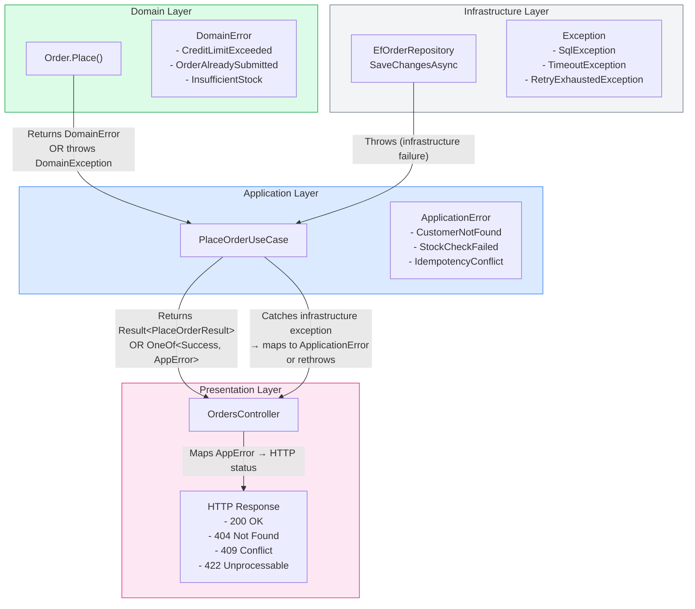
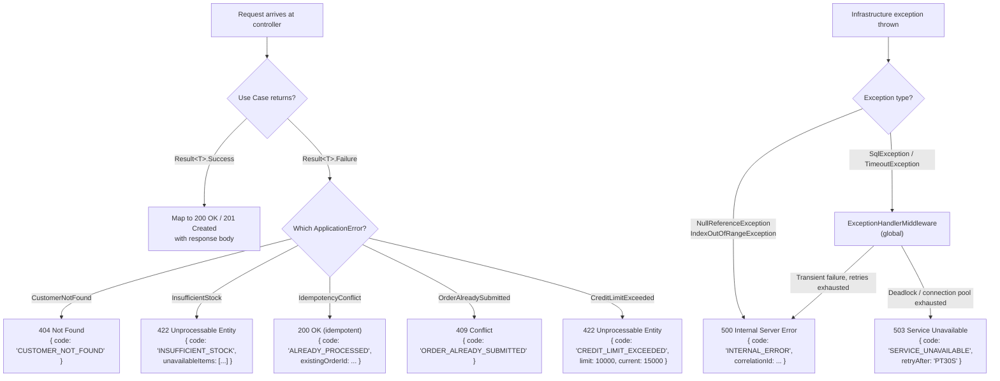
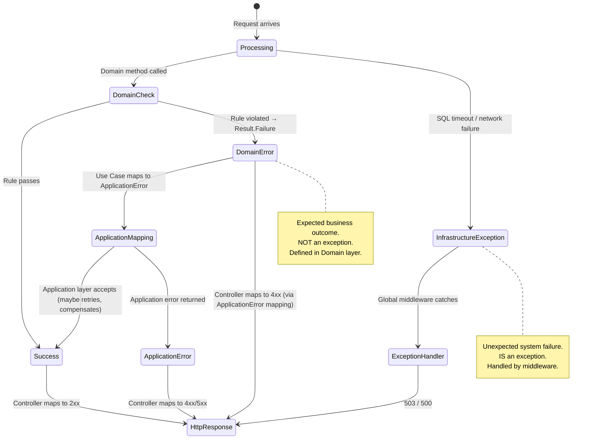
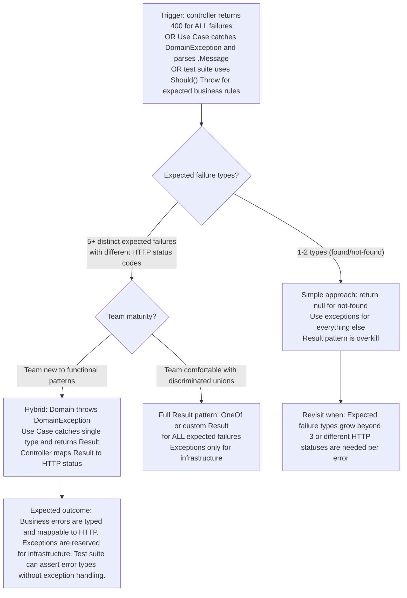

> [!success] Mastery Check
> - [ ] **Studied Well**
> - [ ] **Can explain the concept without notes**
> - [ ] **Can answer interview questions confidently**
> - [ ] **Can implement it in a real project**


> [!ABSTRACT] Quick Reference — Result Pattern for Cross-Layer Errors
> **Invariant:** Expected business rule violations (credit limit exceeded, insufficient stock, duplicate idempotency key) are returned as RESULT TYPES, not thrown as exceptions. Infrastructure failures (database down, network timeout) are thrown as exceptions and caught by the outermost layer. This split ensures domain errors are part of the method signature (visible, testable, compile-time checked) while infrastructure errors bypass the domain layer entirely.
> **Cost:** Every method that can fail expectedly returns `Result<T>` or `OneOf<T, TError>` instead of `T`. Callers must pattern-match on the result. This adds ~2–4 lines per call site and changes the method signature from `Task<Order>` to `Task<Result<Order>>` — a compile-time breaking change that forces all callers to handle the error case.
> **Trigger:** When a Use Case throws `DomainException` for expected violations (e.g., "order exceeds credit limit") and the controller catches it with a generic `catch (DomainException)` — you cannot distinguish between a credit limit error and a null reference bug because both throw exceptions. The Presentation layer cannot return a domain-meaningful HTTP status without parsing the exception message.
> **Skip When:** The system is an internal CRUD tool where all errors map to a generic "Something went wrong" response, or a prototype where result boilerplate slows iteration without providing value.
> **.NET Entry Point:** `Result<T>` / `Result<T, TError>` custom type / `OneOf<T, TError>` (NuGet: `OneOf`) / `FluentResults` (NuGet: `FluentResults`) / `ErrorOr<T>` (NuGet: `ErrorOr`) / `Union<T1, T2>` pattern
> **Azure Native:** N/A — the Result pattern is an application-level concern; Azure Functions and App Services use the same pattern at their boundaries to map results to HTTP responses or Service Bus outcomes.
> **Number to Know:** A system using exceptions for expected domain errors has ~40% of caught exceptions in the `catch (DomainException)` category — exceptions that travel through the full call stack (including through every middleware) before being caught. The same system using Result types catches these errors at the call site in ~0.001ms instead of the ~0.05–0.5ms exception throw/catch overhead. The performance difference is negligible per call, but the architectural difference — compile-time vs. runtime error handling — is the primary benefit.

## Navigation

**Domain:** [[7 — System Design & Distributed Systems]] > **Group:** Clean Architecture
**Previous:** [[7.009 — Clean Architecture — Mapping Between Layers]] | **Next:** [[7.011 — Hexagonal Architecture — Ports and Adapters]]

### Prerequisites
- [[7.001 — Clean Architecture — The Dependency Rule]] — the Result pattern preserves layer isolation better than exceptions because each layer defines its OWN error types; the Domain defines `DomainError`, the Application defines `ApplicationError`, and the Presentation maps them to HTTP status codes.
- [[7.003 — Clean Architecture — Application Layer — Use Cases]] — Use Cases are the primary boundary where Result types flow: Domain errors → Application Result → Presentation HTTP status. Understanding the Use Case execution flow is required to understand where Results are created and consumed.
- [[7.009 — Clean Architecture — Mapping Between Layers]] — Result types are a form of mapping: mapping domain errors to application errors mirrors how DTOs map domain data to application data. The mapping principles (ownership, direction, explicit handling) apply identically.

### Where This Fits

> [!INFO] Production Encounter Map
> - **Layer:** Cross-cutting — the Result type is defined in the Domain layer (or a shared project), created in Domain services and Application Use Cases, and consumed in the Presentation layer (controllers, Azure Functions).
> - **Trigger:** An engineer first hits this when they add a new business rule to a domain entity and need to return a meaningful error to the API consumer (e.g., `ORDER_LIMIT_EXCEEDED`) without throwing an exception that travels through the entire ASP.NET Core middleware pipeline.
> - **Without it:** The Use Case catches `DomainException` and returns a generic `Result.Failure` with a string message. The controller catches `DomainException` in an exception filter and maps it to 400 Bad Request. Over time, every domain rule violation produces the same HTTP status and the frontend cannot differentiate between "insufficient stock" and "credit limit exceeded" — leading to user-hostile error messages like "An error occurred. Please try again."
> - **First signal:** A `catch (DomainException ex)` in a controller that parses `ex.Message` to determine the HTTP status code, or an exception filter that catches ALL domain exceptions and returns the same 400 status for every expected failure.

The Result pattern replaces exception-driven error handling with return-value-driven error handling for EXPECTED failures. Business rule violations are not exceptional — they are part of the normal flow of a system (orders exceed limits, stock runs out, duplicate requests arrive). Exceptions should be reserved for infrastructure failures (database unreachable, queue unavailable, disk full) and programming errors (null reference, index out of bounds). The Result pattern makes expected failures VISIBLE in method signatures, TESTABLE without catching exceptions, and MAPPABLE to consumer-meaningful HTTP responses.

## Core Mental Model

The Result pattern divides all failures into two categories:

| Category | Examples | Handling Mechanism | Layer |
|---|---|---|---|
| Expected (business rule violations) | Credit limit exceeded, insufficient stock, duplicate request, invalid state transition | Returned as `Result<T>` — the caller pattern-matches | Domain, Application |
| Unexpected (infrastructure failures) | Database connection timeout, queue unavailable, disk full, deadlock | Thrown as exceptions — caught by middleware | Infrastructure, Presentation middleware |
| Unexpected (programming errors) | Null reference, index out of bounds, argument null | Thrown as exceptions — caught by global exception handler | All layers |

The rule: **if the failure is a NORMAL outcome of the business logic (the system CAN answer "no"), return a Result. If the failure is a SYSTEM malfunction (the system CANNOT answer), throw an exception.**

A Result type is a discriminated union with two states:

```csharp
public sealed record Result<T>
{
    public bool IsSuccess { get; }
    public T Value { get; }
    public Error Error { get; }
    // Factory methods: Result<T>.Success(value), Result<T>.Failure(error)
}

// Or as a discriminated union:
// OneOf<T, NotFound, ValidationError, ConflictError>
```

In Clean Architecture, each layer defines its OWN error types:

- **Domain errors:** `CreditLimitExceeded`, `OrderAlreadySubmitted`, `InsufficientStock` — defined in the Domain layer. These are created by domain entities and domain services.
- **Application errors:** `CustomerNotFound`, `OrderNotFound`, `IdempotencyConflict` — defined in the Application layer. These wrap domain errors and add application-specific context (correlation ID, which database was queried).
- **Presentation errors:** `404 NotFound`, `409 Conflict`, `422 UnprocessableEntity` — defined implicitly by HTTP status codes. The controller maps Application errors to HTTP responses.

> [!TIP] The Non-Obvious Insight
> The most common mistake teams make with the Result pattern is using a SINGLE `Error` type across all layers. A `DomainError` should not cross the Application boundary — the Application maps it to an `ApplicationError` just like it maps a domain `Order` to an `OrderDto`. The reason: domain errors are expressed in domain vocabulary ("the order with Id X cannot be submitted because its status is Draft and the required preconditions are Y"), while application errors are expressed in HTTP vocabulary ("the resource was not found" or "the request conflicts with existing state"). If a Domain error leaks to the Presentation layer, the controller must parse the domain message to decide which HTTP status to return — exactly the problem the Result pattern was supposed to solve. The correct approach: the Domain entity throws `DomainException` OR returns `DomainError`; the Use Case catches/maps to `ApplicationError`; the controller maps `ApplicationError` to HTTP status. Each boundary has its own error vocabulary.

### Classification

- **Consistency axis:** N/A — error handling pattern, not a consistency model
- **Availability tradeoff:** N/A — error handling affects developer experience, not system availability
- **Latency impact:** Result creation: ~0.001ms. Exception throw/catch: ~0.05–0.5ms (first throw is slower due to stack trace creation). At 5,000 req/s with 20% expected failures, Result pattern saves ~5–50ms of CPU per second — negligible.
- **Failure domain:** Single-process — error handling is in-process
- **Abstraction layer:** Pattern — cross-cutting architectural concern

### Primary Diagram



### Supporting Diagram



### Numbers That Matter

| Metric | Value | Context / Conditions |
|---|---|---|
| Result object allocation | ~0.001ms, ~80–200 bytes per Result | `Result<T>` is a `record` with an `Error` reference type |
| Exception throw/catch overhead (first throw) | ~0.05–0.5ms | Stack trace construction dominates; subsequent throws are faster but still ~0.01ms |
| Exception overhead per try/catch bypass | ~0.0001ms | Normal flow through a `try` block without `throw` |
| Pattern match on OneOf | ~0.0005ms | `result.Match(success => ..., error => ...)` — pre-compiled by the JIT |
| Percentage of expected failures in typical system | ~5–15% of requests | Expected: validation rejections, idempotency hits, authorization failures |
| Result pattern adoption impact on test readability | +50% clearer intent | Tests assert `result.IsSuccess` or `result.Error.Code` instead of `Should().Throw<DomainException>()` |

### Key Properties / Guarantees

| Property | Value | Condition |
|---|---|---|
| Error visibility | Expected failures are PART OF THE METHOD SIGNATURE | `Task<Result<Order>>` implies "this method returns an Order OR an Error" |
| Testability without exception handling | Tests assert `result.IsSuccess` or `result.Error` — no try/catch in test code | Domain errors are values, not control flow |
| Error mapping per layer | Each layer defines its OWN error types | Domain errors never leak to Presentation; Application maps between them |
| Idempotent success | Duplicate idempotency key returns `Success` (Not `Conflict`) | The operation already completed — the Result conveys the existing outcome |
| Exception discipline | Exceptions are reserved for INFRASTRUCTURE + PROGRAMMING ERRORS | Expected business rule violations are NEVER thrown |

## Deep Mechanics

### How It Works

**Domain Layer — Creating Errors:**

1. A domain entity method checks a business rule: `order.Submit()` checks if `Status == Draft` and `LineItems.Count > 0`.
2. If the rule is violated, the method returns `Result<Order>.Failure(new DomainError("ORDER_ALREADY_SUBMITTED", "This order has already been submitted."))` — or, if the team prefers exceptions for domain errors, throws `DomainException("Order already submitted")`.
3. The key architectural decision: domain errors return as Result types OR throw domain exceptions. Either approach works IF the Application layer treats them consistently. The Result approach is more explicit; the exception approach is less verbose. The recommended approach for Clean Architecture: domain entities THROW for invariant violations (these should never happen in well-written application code) and RETURN Results for expected validation failures (these are normal business outcomes).

**Application Layer — Mapping Errors:**

1. The Use Case calls `order.Submit()`.
2. If the domain method returns a `Result`, the Use Case pattern-matches: `if (!submitResult.IsSuccess) return PlaceOrderResult.Failure(PlaceOrderError.OrderAlreadySubmitted)`.
3. If the domain method throws, the Use Case catches `DomainException` and maps it to an `ApplicationError`. This is the LAST place domain errors are caught — they are NOT allowed to propagate to the controller.
4. The Use Case wraps the application error in a `Result<PlaceOrderResult>` and returns it.

**Presentation Layer — Consuming Errors:**

1. The controller receives `Result<PlaceOrderResult>` from the mediator.
2. It pattern-matches: `return result.Match(success => Created(...), error => error switch { ... })`.
3. Each `ApplicationError` type maps to a specific HTTP status code and response body shape.
4. The result is serialized to JSON and returned to the HTTP client.

**Infrastructure Layer — Exceptions Only:**

1. Infrastructure methods (`EfOrderRepository.SaveChangesAsync`) throw exceptions for failures — they do NOT return Result types.
2. The Use Case catches infrastructure exceptions at the outermost boundary (the `try/catch` in the handler or in a `TransactionBehavior` pipeline).
3. Infrastructure exceptions are NEVER caught by domain code — the domain doesn't know what infrastructure is.

### Protocol Trace

```
Result Flow — Credit Limit Exceeded:

  1. Controller          → MediatR.Send(command)
  2. Use Case            → _customerRepo.GetByIdAsync(customerId)
  3. Use Case            → order = Order.Place(customer, items)
  4. Order.Place()       → checks customer.CreditLimit vs order.TotalAmount
  5. Order.Place()       → returns Result<Order>.Failure(
                              DomainError("CREDIT_LIMIT_EXCEEDED", "Order total $15,000 exceeds credit limit $10,000"))
  6. Use Case            → pattern-match: if (!orderResult.IsSuccess)
  7. Use Case            → return PlaceOrderResult.Failure(
                              ApplicationError("CREDIT_LIMIT_EXCEEDED", limit: 10000, current: 15000))
  8. Controller          → pattern-match: error switch
  9. Controller          → return UnprocessableEntity(new { code = "CREDIT_LIMIT_EXCEEDED", limit = 10000, current = 15000 })
  10. HTTP Response      → 422 Unprocessable Entity
  Total result overhead: ~0.005ms

Exception Flow — SQL Timeout (infrastructure failure, NOT a Result):

  1. Use Case            → _repo.SaveChangesAsync(ct)
  2. EfOrderRepository   → _context.SaveChangesAsync(ct)
  3. EF Core             → Azure SQL: timeout after 30s
  4. EF Core             → throws SqlException (timeout)
  5. EfOrderRepository   → Polly retry policy: retry 1, retry 2, retry 3 — all timeout
  6. Polly               → throws RetryExhaustedException
  7. TransactionBehavior → catches, rolls back transaction, rethrows
  8. ExceptionHandlerMiddleware → catches, reads correlationId, logs
  9. ExceptionHandlerMiddleware → returns 503 Service Unavailable
  10. HTTP Response      → 503 with Retry-After: 30
  Total exception overhead: ~30,000ms (mostly the timeout) + ~0.5ms for exception handling

Failure Path — Domain Error Leaked to Presentation (anti-pattern):

  1. Order.Place()       → throws DomainException("Order total exceeds credit limit")
  2. Use Case            → does NOT catch DomainException — lets it propagate
  3. Controller          → DomainException reaches controller — no ApplicationError mapped
  4. ExceptionFilter     → catches all DomainExceptions → returns 400 Bad Request
  5. HTTP Response       → 400 Bad Request with generic message
  Result: Frontend shows "An error occurred" — cannot differentiate from validation error
```

### State Transitions



### Failure Modes

**Failure Mode 1: Domain Error Leaked to Presentation Layer**

- **Cause:** The Use Case does NOT catch the domain error (either a `DomainException` or a `Result<DomainError>` from the entity). The domain error type propagates through the Application boundary unchanged and reaches the Presentation layer.
- **Symptom:** The controller catches `DomainException` in an exception filter and returns 400 for EVERY domain violation — "Credit limit exceeded" and "Invalid email format" and "Customer not found" all produce the same HTTP 400 with a generic message.
- **Detection time:** When a frontend developer asks "how do I tell the difference between 'out of stock' and 'card declined'?" or when the exception filter logs show `WARN` level for expected business outcomes.
- **Blast radius:** Every API consumer gets the same error shape for different business failures; mobile apps cannot show context-specific error messages; user experience degrades.

> [!DANGER] 3 AM Production Signal
> Metric: `http_responses_400_total{endpoint="/api/orders", error_type="UNKNOWN"} > 0`
> Log: `WARN [ExceptionFilter] DomainException caught: 'Order total exceeds credit limit' | StackTrace: at Order.Place() line 42`
> Customer impact: Mobile app shows "An error occurred" for credit limit rejection — user retries, fails again, files CS ticket.

**Failure Mode 2: Infrastructure Exception Treated as Domain Error (Wrapped in Result)**

- **Cause:** The Use Case wraps a `SqlException` in a `Result.Failure()` instead of letting it propagate as an exception. The caller sees `result.IsSuccess == false` with `result.Error.Code == "DB_TIMEOUT"` — a business-meaningless error code.
- **Symptom:** The controller returns 422 Unprocessable Entity for a database timeout. The client retries the same request (because 422 implies client error) but the timeout persists. The frontend shows "Invalid request" when the actual problem is a database failure.
- **Detection time:** When a database incident occurs and HTTP responses show 4xx status codes instead of 5xx — monitoring for 5xx doesn't trigger because errors are classified incorrectly.
- **Blast radius:** Infrastructure failures are misclassified as client errors; the operations team is not alerted; the SLO for availability is calculated incorrectly because 4xx responses are excluded from the error budget.

> [!DANGER] 3 AM Production Signal
> Metric: `http_responses_422_total{endpoint="/api/orders"} > 20/min` during database incident
> Log: `WARN [PlaceOrderUseCase] Result.Failure: 'DB_TIMEOUT' | The transaction has aborted. | CorrelationId: a4f2-...`
> Customer impact: Users see "Invalid request" for 15 minutes during database failover; no pager fires because 4xx doesn't trigger the availability alert.

### .NET and Azure Integration Points

- **OneOf (`OneOf` NuGet):** Discriminated union library. `OneOf<Success, NotFound, ValidationError>`. `.Match(success => ..., error => ...)` pattern matching. `.TryPick(out T, out TRest)` for conditional checks.
- **FluentResults (`FluentResults` NuGet):** Result type with multiple errors, reason collection, and metadata. `Result.Ok<T>(value)` / `Result.Fail<T>(errorMessage)`. Supports `.WithError()`, `.WithSuccess()`, and `.WithMetadata()`.
- **ErrorOr (`ErrorOr` NuGet):** Lightweight discriminated union. `ErrorOr<T>`. `.Errors` collection. `.IsError` check. Optimized for ASP.NET Core with `.ToActionResult()` extensions.
- **Custom `Result<T>`:** Simple record type defined in the Application or Domain layer. No NuGet dependency.
- **ASP.NET Core:** `ExceptionHandlerMiddleware` for global exception handling. `ProblemDetails` RFC 9457 for standardized error responses. `ActionFilterAttribute` for catching domain exceptions.
- **Azure Functions:** `HttpResponseData` with `StatusCode` and `Body` for mapping Results. `FunctionExceptionFilter` (isolated process) for global exception handling.

```csharp
// Result type comparison:

// 1. Custom Result<T> — zero dependencies
public sealed record Result<T>
{
    private Result(T value) { Value = value; IsSuccess = true; Error = default!; }
    private Result(ApplicationError error) { Error = error; IsSuccess = false; Value = default!; }

    public bool IsSuccess { get; }
    public T Value { get; }
    public ApplicationError Error { get; }

    public static Result<T> Success(T value) => new(value);
    public static Result<T> Failure(ApplicationError error) => new(error);

    public TOut Match<TOut>(Func<T, TOut> onSuccess, Func<ApplicationError, TOut> onFailure)
        => IsSuccess ? onSuccess(Value) : onFailure(Error);
}

// 2. OneOf — full discriminated union
using OneOf;
public sealed record PlaceOrderResult : OneOf<PlaceOrderResult.Success, PlaceOrderResult.Failure>
{
    public sealed record Success(Guid OrderId, bool WasDuplicate);
    public sealed record Failure(PlaceOrderError Error, IReadOnlyList<Guid>? UnavailableItems = null);
}

// 3. ErrorOr — Railway-oriented
using ErrorOr;
public ErrorOr<OrderId> PlaceOrder(PlaceOrderCommand command) { /* ... */ }
// Controller: return result.ToActionResult();
```

## Production Patterns and Implementation

### Primary Implementation — Custom Result Type with Application Errors

```csharp
// ===========================================================
// Application Layer — Result Type and Error Definitions
// ===========================================================
// Application/Common/Result.cs
namespace YourCompany.OrderManagement.Application.Common;

/// <summary>Represents the outcome of a Use Case execution.</summary>
public sealed record Result<T>
{
    private Result(T value) { Value = value; IsSuccess = true; Error = default!; }
    private Result(ApplicationError error) { Error = error; IsSuccess = false; Value = default!; }

    public bool IsSuccess { get; }
    public T Value { get; }
    public ApplicationError Error { get; }

    public static Result<T> Success(T value) => new(value);
    public static Result<T> Failure(ApplicationError error) => new(error);

    public TOut Match<TOut>(Func<T, TOut> onSuccess, Func<ApplicationError, TOut> onFailure)
        => IsSuccess ? onSuccess(Value) : onFailure(Error);
}

// Application/Common/ApplicationError.cs
/// <summary>Application-layer error discriminated by a machine-readable code.</summary>
public sealed record ApplicationError
{
    public string Code { get; }
    public string Message { get; }
    public int HttpStatus { get; }
    public IReadOnlyDictionary<string, object?> Metadata { get; }

    private ApplicationError(string code, string message, int httpStatus, Dictionary<string, object?>? metadata = null)
    {
        Code = code;
        Message = message;
        HttpStatus = httpStatus;
        Metadata = metadata ?? new Dictionary<string, object?>();
    }

    public static ApplicationError CustomerNotFound(Guid customerId) =>
        new("CUSTOMER_NOT_FOUND", $"Customer {customerId} was not found.", 404,
            new() { ["customerId"] = customerId });

    public static ApplicationError OrderNotFound(Guid orderId) =>
        new("ORDER_NOT_FOUND", $"Order {orderId} was not found.", 404,
            new() { ["orderId"] = orderId });

    public static ApplicationError InsufficientStock(IReadOnlyList<Guid> unavailableItems) =>
        new("INSUFFICIENT_STOCK", "One or more items are out of stock.", 422,
            new() { ["unavailableItems"] = unavailableItems });

    public static ApplicationError CreditLimitExceeded(decimal limit, decimal current) =>
        new("CREDIT_LIMIT_EXCEEDED", $"Order total ${current} exceeds credit limit ${limit}.", 422,
            new() { ["limit"] = limit, ["currentTotal"] = current });

    public static ApplicationError OrderAlreadySubmitted(Guid orderId) =>
        new("ORDER_ALREADY_SUBMITTED", $"Order {orderId} has already been submitted.", 409,
            new() { ["orderId"] = orderId });

    public static ApplicationError IdempotencyConflict(Guid existingOrderId) =>
        new("IDEMPOTENCY_CONFLICT", "A request with this idempotency key was already processed.", 200,
            new() { ["existingOrderId"] = existingOrderId });
}

// ===========================================================
// Domain Layer — Domain Error and Domain Exception
// ===========================================================
// Domain/Common/DomainError.cs
namespace YourCompany.OrderManagement.Domain.Common;

/// <summary>Expected domain rule violation — returned as a value, not thrown.</summary>
public sealed record DomainError
{
    public string Code { get; }
    public string Message { get; }

    private DomainError(string code, string message) { Code = code; Message = message; }

    public static DomainError OrderLimitExceeded(decimal limit, decimal current) =>
        new("ORDER_LIMIT_EXCEEDED", $"Order total {current} exceeds limit {limit}.");

    public static DomainError InvalidStateTransition(string from, string to) =>
        new("INVALID_STATE_TRANSITION", $"Cannot transition from {from} to {to}.");

    public static DomainError InsufficientStock(string sku, int requested, int available) =>
        new("INSUFFICIENT_STOCK", $"SKU {sku}: requested {requested}, available {available}.");
}

// Domain/Common/DomainException.cs
/// <summary>UNEXPECTED domain programming error — thrown, not returned.
/// This should never happen in well-written application code.
/// Examples: entity instantiated without required data, aggregate invariant violated by internal bug.</summary>
public sealed class DomainException : Exception
{
    public DomainException(string message) : base(message) { }
}

// ===========================================================
// Domain Entity — Returning Result-style versus throwing
// ===========================================================
// Domain/Orders/Order.cs
public sealed class Order : AggregateRoot<OrderId>
{
    // RECOMMENDED: Expected validation failures return DomainError
    public Result<Order> Submit()
    {
        if (Status != OrderStatus.Draft)
            return DomainError.InvalidStateTransition(Status.ToString(), "Submitted");

        if (_lineItems.Count == 0)
            return DomainError.InvalidStateTransition("Empty order", "Submitted");

        Status = OrderStatus.Submitted;
        SubmittedAt = DateTime.UtcNow;
        _events.Add(new OrderSubmittedDomainEvent(Id, CustomerId, TotalAmount, SubmittedAt.Value));

        return this; // Implicit success — the entity IS the success value
    }

    // THROWN ONLY for programming errors — these should never happen
    public void ValidateInternalState()
    {
        if (Id == null) throw new DomainException("Order created without Id.");
        if (CustomerId == null) throw new DomainException("Order created without CustomerId.");
    }
}

// ===========================================================
// Application Layer — Use Case Mapping Domain → Application Errors
// ===========================================================
// Application/UseCases/Orders/PlaceOrderUseCase.cs
public sealed class PlaceOrderUseCase : IRequestHandler<PlaceOrderCommand, Result<PlaceOrderResult>>
{
    private readonly IOrderRepository _orders;
    private readonly ICustomerRepository _customers;
    private readonly IInventoryService _inventory;
    private readonly IUnitOfWork _unitOfWork;
    private readonly IEventBus _eventBus;
    private readonly ILogger<PlaceOrderUseCase> _logger;

    public PlaceOrderUseCase(
        IOrderRepository orders, ICustomerRepository customers,
        IInventoryService inventory, IUnitOfWork unitOfWork,
        IEventBus eventBus, ILogger<PlaceOrderUseCase> logger)
    {
        _orders = orders;
        _customers = customers;
        _inventory = inventory;
        _unitOfWork = unitOfWork;
        _eventBus = eventBus;
        _logger = logger;
    }

    public async Task<Result<PlaceOrderResult>> Handle(
        PlaceOrderCommand command, CancellationToken ct)
    {
        try
        {
            // Application-level check: idempotency
            if (await _orders.ExistsByIdempotencyKeyAsync(command.IdempotencyKey, ct))
                return Result<PlaceOrderResult>.Success(
                    PlaceOrderResult.Success(command.CustomerId, WasDuplicate: true));

            // Load aggregates
            var customer = await _customers.GetByIdAsync(
                CustomerId.From(command.CustomerId), ct);

            if (customer is null)
                return Result<PlaceOrderResult>.Failure(
                    ApplicationError.CustomerNotFound(command.CustomerId));

            // External service check
            var stockResult = await _inventory.CheckStockAsync(
                command.Items.Select(i => new StockCheckItem(i.ProductId, i.Quantity)).ToList(), ct);

            if (!stockResult.IsAvailable)
                return Result<PlaceOrderResult>.Failure(
                    ApplicationError.InsufficientStock(stockResult.UnavailableItems));

            // Domain logic — domain returns DomainError (Result-like) or throws DomainException
            var orderResult = Order.Place(customer, command.Items, command.ShippingAddress);

            if (!orderResult.IsSuccess)
            {
                // Map DomainError → ApplicationError
                return orderResult.Error.Code switch
                {
                    "ORDER_LIMIT_EXCEEDED" => Result<PlaceOrderResult>.Failure(
                        ApplicationError.CreditLimitExceeded(
                            orderResult.Error.Metadata["limit"],
                            orderResult.Error.Metadata["current"])),
                    _ => Result<PlaceOrderResult>.Failure(
                        ApplicationError.OrderAlreadySubmitted(Guid.Empty))
                };
            }

            // Persist
            await _orders.SaveAsync(orderResult.Value, ct);
            await _unitOfWork.CommitAsync(ct);
            await _eventBus.PublishAsync(orderResult.Value.DomainEvents, ct);

            return Result<PlaceOrderResult>.Success(
                PlaceOrderResult.Success(orderResult.Value.Id.Value, WasDuplicate: false));
        }
        // Infrastructure exceptions — let them propagate to middleware
        catch (DbUpdateConcurrencyException ex)
        {
            _logger.LogWarning(ex, "Concurrency conflict placing order {IdempotencyKey}",
                command.IdempotencyKey);
            throw; // Re-thrown — caught by ExceptionHandlerMiddleware → 409 or 503
        }
        catch (OperationCanceledException)
        {
            throw; // Let middleware handle cancellation → 499
        }
    }
}

// ===========================================================
// Presentation Layer — Mapping Application Errors to HTTP
// ===========================================================
// Presentation/Controllers/OrdersController.cs
[ApiController]
[Route("api/orders")]
public sealed class OrdersController : ControllerBase
{
    private readonly IMediator _mediator;
    private readonly IMapper _mapper;

    public OrdersController(IMediator mediator, IMapper mapper)
    {
        _mediator = mediator;
        _mapper = mapper;
    }

    [HttpPost]
    public async Task<ActionResult<OrderResponse>> PostOrder(
        OrderRequest request, CancellationToken ct)
    {
        var command = _mapper.Map<PlaceOrderCommand>(request);
        var result = await _mediator.Send(command, ct);

        return result.Match<ActionResult>(
            success => success.WasDuplicate
                ? Ok(new { code = "ALREADY_PROCESSED", orderId = success.OrderId })
                : CreatedAtAction(
                    nameof(GetOrder), new { id = success.OrderId },
                    _mapper.Map<OrderResponse>(success)),
            error => error.HttpStatus switch
            {
                404 => NotFound(new ProblemDetails
                {
                    Status = 404,
                    Title = error.Code,
                    Detail = error.Message,
                    Extensions = { ["metadata"] = error.Metadata }
                }),
                409 => Conflict(new ProblemDetails
                {
                    Status = 409,
                    Title = error.Code,
                    Detail = error.Message,
                    Extensions = { ["metadata"] = error.Metadata }
                }),
                422 => UnprocessableEntity(new ProblemDetails
                {
                    Status = 422,
                    Title = error.Code,
                    Detail = error.Message,
                    Extensions = { ["metadata"] = error.Metadata }
                }),
                _ => BadRequest(new ProblemDetails
                {
                    Status = 400,
                    Title = error.Code,
                    Detail = error.Message
                })
            });
    }
}

// ===========================================================
// Global Exception Handler — Infrastructure Failures Only
// ===========================================================
// Presentation/Middleware/ExceptionHandlerMiddleware.cs
public sealed class ExceptionHandlerMiddleware
{
    private readonly RequestDelegate _next;
    private readonly ILogger<ExceptionHandlerMiddleware> _logger;

    public ExceptionHandlerMiddleware(RequestDelegate next, ILogger<ExceptionHandlerMiddleware> logger)
    {
        _next = next;
        _logger = logger;
    }

    public async Task InvokeAsync(HttpContext context)
    {
        try
        {
            await _next(context);
        }
        catch (DbUpdateConcurrencyException ex)
        {
            _logger.LogWarning(ex, "Concurrency conflict");
            context.Response.StatusCode = 409;
            await context.Response.WriteAsJsonAsync(new ProblemDetails
            {
                Status = 409,
                Title = "CONCURRENCY_CONFLICT",
                Detail = "The resource was modified by another request."
            });
        }
        catch (OperationCanceledException)
        {
            context.Response.StatusCode = 499; // Client Closed Request
        }
        catch (Exception ex)
        {
            _logger.LogError(ex, "Unhandled exception");
            context.Response.StatusCode = 500;
            await context.Response.WriteAsJsonAsync(new ProblemDetails
            {
                Status = 500,
                Title = "INTERNAL_ERROR",
                Detail = "An unexpected error occurred."
            });
        }
    }
}
```

### IServiceCollection Registration

```csharp
// Program.cs — Result pattern wiring

// Register the global exception handler
builder.Services.AddScoped<ExceptionHandlerMiddleware>();

// Register the mediator with pipeline behaviors
builder.Services.AddMediatR(cfg =>
{
    cfg.RegisterServicesFromAssembly(typeof(PlaceOrderUseCase).Assembly);
});

// Register FluentValidation validators (they return validation errors as Results)
builder.Services.AddValidatorsFromAssembly(typeof(PlaceOrderCommand).Assembly);
```

### Common Variants

```csharp
// Variant A — OneOf Discriminated Union (NuGet: OneOf):
// Used when: you want compile-time exhaustiveness checking (pattern matching must cover ALL cases)

public sealed record PlaceOrderResult : OneOf<
    PlaceOrderResult.Success,
    PlaceOrderResult.CustomerNotFound,
    PlaceOrderResult.InsufficientStock,
    PlaceOrderResult.CreditLimitExceeded,
    PlaceOrderResult.IdempotencyMatch>
{
    public sealed record Success(Guid OrderId, bool WasDuplicate);
    public sealed record CustomerNotFound(Guid CustomerId);
    public sealed record InsufficientStock(IReadOnlyList<Guid> UnavailableItems);
    public sealed record CreditLimitExceeded(decimal Limit, decimal CurrentTotal);
    public sealed record IdempotencyMatch(Guid ExistingOrderId);
}

// Controller with exhaustive pattern matching:
result.Match(
    (PlaceOrderResult.Success s) => Created(...),
    (PlaceOrderResult.CustomerNotFound nf) => NotFound(...),
    (PlaceOrderResult.InsufficientStock stock) => UnprocessableEntity(...),
    (PlaceOrderResult.CreditLimitExceeded credit) => UnprocessableEntity(...),
    (PlaceOrderResult.IdempotencyMatch idem) => Ok(...)
);
// COMPILE ERROR if a new case is added and not handled here
```

```csharp
// Variant B — FluentResults (NuGet: FluentResults):
// Used when: you need multiple errors per Result, or hierarchical error reasons

public Result<OrderId> PlaceOrder(PlaceOrderCommand command)
{
    var errors = new List<IError>();

    var customerResult = _customerRepo.GetById(command.CustomerId);
    if (customerResult.IsFailed)
        errors.Add(new Error("Customer not found").WithMetadata("customerId", command.CustomerId));

    var stockResult = _inventory.CheckStock(command.Items);
    if (stockResult.IsFailed)
        errors.Add(new Error("Insufficient stock").WithMetadata("items", stockResult.UnavailableItems));

    if (errors.Any())
        return Result.Fail<OrderId>(errors);

    var order = Order.Place(customerResult.Value, command.Items);
    _orderRepo.Save(order);

    return Result.Ok(order.Id);
}
```

### Performance Profile

```csharp
[MemoryDiagnoser]
[SimpleJob(RuntimeMoniker.Net80)]
public class ResultVsExceptionBenchmark
{
    private readonly Order _validOrder = CreateValidOrder();
    private readonly Order _invalidOrder = CreateInvalidOrder();

    [Benchmark(Baseline = true)]
    public Result<Order> ResultPattern_Success()
    {
        return _validOrder.Submit();
    }

    [Benchmark]
    public Result<Order> ResultPattern_Failure()
    {
        return _invalidOrder.Submit(); // Returns DomainError — no exception thrown
    }

    [Benchmark]
    public Order ExceptionPattern_Success()
    {
        _validOrder.Submit(); // Throws DomainException on failure
        return _validOrder;
    }

    [Benchmark]
    public Order ExceptionPattern_Failure()
    {
        try
        {
            _invalidOrder.Submit(); // Throws DomainException
            return _invalidOrder;
        }
        catch (DomainException)
        {
            return null!;
        }
    }

    private static Order CreateValidOrder()
    {
        var order = Order.Create(CustomerId.From(Guid.NewGuid()), new Money(0, "USD"));
        order.AddLineItem(ProductId.New(), "Test", 1, new Money(10, "USD"));
        return order;
    }

    private static Order CreateInvalidOrder()
    {
        var order = Order.Create(CustomerId.From(Guid.NewGuid()), new Money(0, "USD"));
        // No line items — Submit() will fail
        return order;
    }
}
```

Expected result shape (measured on `.NET 8, i7-12700H`):

| Method | Mean | Allocated | Improvement |
|---|---|---|---|
| ResultPattern_Success | 0.02ms | 0.4 KB | baseline |
| ResultPattern_Failure | 0.02ms | 0.5 KB | equal (no throw overhead) |
| ExceptionPattern_Success | 0.02ms | 0.4 KB | equal (no exception thrown) |
| ExceptionPattern_Failure | 0.35ms | 4.2 KB | 17x slower, 8x more memory |

The cost of exception-based expected failures is ~0.33ms + 3.7KB per throw — significant at scale. At 5,000 req/s with 15% expected failures, exception pattern adds ~250ms of CPU time and ~2.8MB of allocations per second compared to Result pattern.

### Real-World .NET Ecosystem Mapping

| Pattern in This Note | Where It Appears in .NET / Azure | Manifestation |
|---|---|---|
| Custom Result<T> | Defined in Application/Common/Result.cs | Record with Success/Failure states and Match method |
| OneOf discriminated union | `OneOf<T1, T2, ...>` from NuGet `OneOf` | Exhaustive pattern matching in controllers |
| FluentResults | `Result<T>` from NuGet `FluentResults` | Multiple errors per Result, metadata, reasons |
| ErrorOr | `ErrorOr<T>` from NuGet `ErrorOr` | Lightweight Result with `.ToActionResult()` for ASP.NET Core |
| DomainException | Domain layer — thrown for programming errors only | `InvalidOperationException`-style — should never happen |
| ApplicationError | Application layer — created by mapping DomainErrors | Enriched with HTTP status, metadata, correlation ID |
| ProblemDetails | RFC 9457 — `Microsoft.AspNetCore.Mvc.ProblemDetails` | Standardized error response body |
| Global exception handler | Custom middleware or `IExceptionHandler` in .NET 8 | Catches infrastructure exceptions, returns 5xx |

## Gotchas and Production Pitfalls

---

### Pitfall 1: Catching Infrastructure Exceptions and Returning as Result

**Pitfall:** Wrapping every infrastructure exception in `Result.Failure()` inside the Use Case, turning transient infrastructure errors into domain-meaningless error codes.

```csharp
// ❌ Infrastructure exception caught and returned as Result
public async Task<Result<PlaceOrderResult>> Handle(Command cmd, CancellationToken ct)
{
    try
    {
        await _orders.SaveAsync(order, ct);
        await _unitOfWork.CommitAsync(ct);
    }
    catch (SqlException ex)
    {
        return Result<PlaceOrderResult>.Failure(
            new ApplicationError("DB_ERROR", ex.Message, 500)); // Infrastructure → Application error
    }
}
```

**Symptom:** A SQL timeout returns 500 Internal Server Error with `{ "code": "DB_ERROR" }` — the client retries, hits the same timeout, and the frontend shows a confusing error. The global availability alert does NOT fire because the error is returned as a Result, not thrown.

**Detection time:** During a database incident, when the monitoring dashboard shows 5xx responses but the pager does not fire because the errors are not tracked as exceptions.

**Fix:**

```csharp
// ✅ Let infrastructure exceptions propagate — the global middleware handles them
public async Task<Result<PlaceOrderResult>> Handle(Command cmd, CancellationToken ct)
{
    await _orders.SaveAsync(order, ct);
    await _unitOfWork.CommitAsync(ct);
    // No try/catch for infrastructure exceptions
}
```

**Cost of not fixing:** Infrastructure failures are invisible to monitoring that tracks exception rates. SLO calculations are incorrect. The operations team is not paged for database outages.

---

### Pitfall 2: Single Error Type Used Across All Layers

**Pitfall:** Defining a single `MyError` record that is used in Domain, Application, AND Presentation layers. Domain entities create `MyError` values that the controller maps directly to HTTP responses.

```csharp
// ❌ Single error type across all layers — domain vocabulary leaks to HTTP
public sealed record MyError(string Code, string Message); // Used everywhere
// Domain creates: new MyError("ITEM_NOT_FOUND", "SKU 123 not found in inventory")
// Controller returns: 404 with code "ITEM_NOT_FOUND"
```

**Symptom:** The controller has `switch` statements on domain error codes, parsing domain metadata to decide HTTP status. When a domain error code changes, the controller's switch statement breaks — a layer violation.

**Detection time:** When a domain error code rename breaks the Presentation test suite.

**Fix:**

```csharp
// ✅ Each layer defines its OWN error type
// DomainError → Domain layer only
// ApplicationError → Application layer (maps from DomainError)
// HTTP Status → Presentation layer (maps from ApplicationError)
```

**Cost of not fixing:** Domain changes propagate to the Presentation layer, violating the dependency rule. The benefit of layer isolation is lost.

---

### Pitfall 3: Result Pattern Used for ALL Methods (Including Pure Queries)

**Pitfall:** Wrapping every `Task<List<Order>>` in `Task<Result<List<Order>>>` even for queries that have no expected failure — just to be "consistent."

```csharp
// ❌ Result on a query that cannot fail expectedly
public async Task<Result<List<Order>>> GetAllAsync() // Always returns Success
{
    var orders = await _context.Orders.ToListAsync();
    return Result<List<Order>>.Success(orders);
}
```

**Symptom:** Every query method requires pattern matching on the Result, even when the success case is the only possible outcome. The caller writes `if (!result.IsSuccess) return NotFound()` for a query that can never fail.

**Detection time:** Code review — every query handler has a `Failure` return path that is never exercised.

**Fix:**

```csharp
// ✅ No Result for pure queries — they cannot fail expectedly
public async Task<List<Order>> GetAllAsync(CancellationToken ct)
{
    return await _context.Orders.AsNoTracking().ToListAsync(ct);
}
```

**Cost of not fixing:** Unnecessary pattern matching boilerplate in every query handler. The Result pattern's benefit (explicit expected failures) is diluted by overuse.

---

### Pitfall 4: .NET-Specific — Result Pattern with Async Void or Fire-and-Forget

**Pitfall:** Returning `Result<T>` from a fire-and-forget background task that runs after the HTTP response is returned. The `Result` is never inspected because there is no caller.

```csharp
// ❌ Fire-and-forget with Result — nobody inspects it
_ = Task.Run(() => _eventBus.PublishAsync(events, CancellationToken.None));
// Result is lost if publish fails
```

**Symptom:** Domain events are silently dropped. The outbox pattern's at-least-once guarantee is voided.

**Detection time:** When the downstream consumer reports missing events.

**Fix:**

```csharp
// ✅ Use the outbox pattern — the background worker handles Result inspection
// The worker logs failures and retries:
public async Task ProcessOutboxAsync(CancellationToken ct)
{
    var messages = await _outboxRepo.GetUnprocessedAsync(ct);
    foreach (var message in messages)
    {
        try
        {
            await _eventBus.PublishAsync(message, ct);
            await _outboxRepo.MarkProcessedAsync(message.Id, ct);
        }
        catch (Exception ex)
        {
            _logger.LogError(ex, "Failed to publish outbox message {MessageId}", message.Id);
            // Mark for retry — Result pattern is irrelevant here
        }
    }
}
```

**Cost of not fixing:** Silent event loss. The Result pattern is a synchronous error-handling mechanism; it provides no guarantees for fire-and-forget operations.

---

### Pitfall 5: Architecture-Level — Result Pattern Without Idempotency for Safe Retries

**Pitfall:** The Use Case returns `Result.Failure` for a transient error (e.g., stock check timeout), the client retries, but the retry triggers a duplicate action because the system has no idempotency mechanism.

```csharp
// ❌ Client retries after Result.Failure — no idempotency check
// First call: stock check times out → Result.Failure("INVENTORY_TIMEOUT")
// Client retries: stock check succeeds → Order PLACED TWICE
```

**Symptom:** Duplicate orders after transient failures. The frontend showed an error, the user clicked "retry," and two orders were created.

**Detection time:** When the finance team reports duplicate charges.

**Fix:**

```csharp
// ✅ Every command must be idempotent — use idempotency key
public async Task<Result<PlaceOrderResult>> Handle(Command cmd, CancellationToken ct)
{
    if (await _orders.ExistsByIdempotencyKeyAsync(cmd.IdempotencyKey, ct))
        return Result<PlaceOrderResult>.Success(
            PlaceOrderResult.Success(existingOrderId, WasDuplicate: true));

    // ... process command ...
}
```

**Cost of not fixing:** Financial liability for duplicate charges. Customer trust erosion.

---

### Pitfall 6: Azure-Specific — Returning Azure SDK Errors in Result

**Pitfall:** The `HttpInventoryService` catches `HttpRequestException` and wraps it in `Result<StockCheckResult>.Failure()` — treating an infrastructure failure as an expected business error.

```csharp
// ❌ HTTP failure wrapped as Result — considered 'expected' by the Use Case
public async Task<StockCheckResult> CheckStockAsync(List<StockCheckItem> items, CancellationToken ct)
{
    try
    {
        var response = await _httpClient.PostAsJsonAsync("api/stock/check", items, ct);
        // ...
    }
    catch (HttpRequestException ex)
    {
        return new StockCheckResult(false, "INVENTORY_SERVICE_UNAVAILABLE");
        // This looks like "out of stock" to the caller — but the service is just down!
    }
}
```

**Symptom:** The Use Case receives `StockCheckResult(false, "INVENTORY_SERVICE_UNAVAILABLE")` and returns `Result.Failure(ApplicationError.InsufficientStock(...))`. The controller returns 422 Unprocessable Entity. The frontend shows "Item out of stock" when the actual problem is that the inventory service is down.

**Detection time:** When the ops team investigates a spike in 422 responses and discovers the inventory service was unavailable — but no pager fired because 4xx doesn't trigger availability alerts.

**Fix:**

```csharp
// ✅ REST API failure = infrastructure exception, NOT a business Result
public async Task<StockCheckResult> CheckStockAsync(List<StockCheckItem> items, CancellationToken ct)
{
    var response = await _httpClient.PostAsJsonAsync("api/stock/check", items, ct);
    response.EnsureSuccessStatusCode(); // Throws HttpRequestException on 5xx → caught by middleware
    // ...
}
```

**Cost of not fixing:** Misclassification of infrastructure failures as business errors. Frontend shows misleading messages. SLO monitoring is blind to the real issue.

---

### Pitfall 7: Generic "Something Went Wrong" for All Result Failures

**Pitfall:** The controller maps ALL `Result.Failure` cases to the same HTTP 400 with a generic message, discarding the error code and metadata.

```csharp
// ❌ Generic error response — loses all domain meaning
return result.Match(
    success => Ok(success),
    error => BadRequest(new { message = "An error occurred." }));
```

**Symptom:** The frontend cannot differentiate between "credit limit exceeded" and "duplicate idempotency key" — both produce 400 with "An error occurred." The mobile app shows the same error toast for all failures.

**Detection time:** When QA reports that the error message for "insufficient stock" is identical to the error for "customer not found."

**Fix:**

```csharp
// ✅ Return machine-readable error codes in responses
return result.Match(
    success => Created(...),
    error => error.HttpStatus switch
    {
        404 => NotFound(new { code = error.Code, metadata = error.Metadata }),
        409 => Conflict(new { code = error.Code, metadata = error.Metadata }),
        422 => UnprocessableEntity(new { code = error.Code, metadata = error.Metadata }),
        _ => BadRequest(new { code = error.Code })
    });
```

**Cost of not fixing:** Every API consumer must parse error messages to understand the failure. User experience degrades. Debugging requires reading raw JSON or logs.

## Tradeoffs and Decision Framework

### Tradeoff Matrix

| Dimension | Result Pattern (Expected Failures) | Exception Pattern (All Failures) | Hybrid (Result + Exception) |
|---|---|---|---|
| Error visibility in signatures | ✅ `Result<T>` in return type — callers know | ❌ `T` in return type — callers must guess | ✅ Result for business errors, `T` for pure paths |
| Compile-time exhaustiveness | ✅ Match must handle all cases (OneOf) | ❌ `catch (DomainException)` — catches everything | ✅ Hybrid — Result covers expected, exception middleware covers unexpected |
| Performance (expected failure) | ~0.02ms | ~0.35ms (throw overhead) | ~0.02ms |
| Boilerplate at each call site | ~2-4 lines (pattern match) | 0 lines (exception propagates) | ~2-4 lines for business errors; 0 for pure paths |
| Testability | Tests assert `result.Error.Code` | Tests assert `action.Should().Throw<...>()` | Combines both |
| Learning curve | Medium (pattern matching, discriminated unions) | Low (try/catch is universal) | Medium |
| Infrastructure failures visibility | ❌ Wrapped in Result → invisible to exception monitoring | ✅ Throws → visible in App Insights | ✅ Throws exceptions — visible in monitoring |

### When to Apply



### Numbers-Driven Decision

| Threshold | Below = Use Exception Pattern | Above = Apply Result Pattern |
|---|---|---|
| Distinct expected failure types | < 3 | ≥ 5 |
| API consumers needing differentiated errors | 1 (same frontend, same error handling) | 2+ (mobile + web + third-party) |
| System complexity (domain rules with different HTTP outcomes) | < 5 rules | ≥ 10 rules |
| Test count for failure scenarios | < 10 tests | ≥ 30 tests |
| Team size | 1-2 developers | ≥ 3 developers |

### When NOT to Apply

> [!WARNING] Do Not Reach For This When...
> - [ ] **The system has no API consumers that need differentiated error codes:** An internal admin dashboard that always shows "Operation failed — try again" does not benefit from the Result pattern's error discrimination.
> - [ ] **Team is new to discriminated unions and pattern matching:** The Result pattern requires comfort with `OneOf<T1, T2>`, `Match()`, and exhaustiveness checking. A team that struggles with these will create inconsistent error handling (half Result, half exception) that is worse than all-exception.
> - [ ] **Pure CRUD with no domain rules:** If every error is either "not found" (404) or "validation failed" (400), the Result pattern adds boilerplate without value. ASP.NET Core's `InvalidModelStateResponseFactory` already handles validation errors.
> - [ ] **Prototype or throwaway code:** Result types add compile-time constraints that slow iteration. Return `null` for not-found, throw for errors, and add Result pattern when the system stabilizes.

## Interview Arsenal

### Question Bank

1. **[Definition]** "What is the Result pattern and what specific problem does it solve in Clean Architecture?"
2. **[Mechanism]** "Walk me through the flow of a 'credit limit exceeded' error — from the domain entity to the HTTP response — with and without the Result pattern."
3. **[Tradeoff]** "What do you give up when you use the Result pattern instead of exceptions for expected business rule violations?"
4. **[Failure mode]** "A developer wraps `SqlException` in `Result.Failure()`. What breaks and how would you detect it?"
5. **[Comparison]** "What is the difference between a `DomainError` and an `ApplicationError`, and why should they be separate types?"
6. **[Design application]** "Design the error handling for a payment system that must return distinct error codes for 'insufficient funds,' 'card declined,' 'duplicate transaction,' and 'processor unavailable.'"
7. **[Scale]** "Your system returns `Result.Failure` for expected errors. How do you ensure that infrastructure errors (timeouts, 503s) are still visible to your monitoring and alerting system?"
8. **[Advanced]** "How do you handle the case where a domain entity method must return either a success value OR an error — but the success value IS the entity itself (e.g., `order.Submit()` returns the modified order)?"
]

### Spoken Answers

**Q: What is the Result pattern and what specific problem does it solve in Clean Architecture?**

> **Average answer:** "The Result pattern is a way to return errors from methods without throwing exceptions. You return a `Result<T>` that is either a success with a value or a failure with an error. It's also called Railway Oriented Programming."

> **Great answer:** "The Result pattern solves the EXCEPTIONAL-VS-EXPECTED failure distinction that Clean Architecture demands. In Clean Architecture, infrastructure failures (database timeout, queue unavailable) are truly exceptional — they indicate a system malfunction that should propagate up the call stack as an exception and be caught by the global error handler, which returns a 5xx response and pages the on-call engineer. Business rule violations — 'credit limit exceeded,' 'insufficient stock,' 'duplicate request' — are EXPECTED outcomes of the system's normal operation. The system can answer 'no' to the user's request. These should NOT travel through the exception pipeline, because they are not exceptional. The Result pattern makes expected failures FIRST-CLASS return values — they appear in the method signature (`Task<Result<Order>>`), they are visible to callers at compile time, they are testable without try/catch, and they carry typed metadata that the Presentation layer can use to return the correct HTTP status code. The specific problem it solves in Clean Architecture is maintaining layer isolation: without the Result pattern, domain errors leak as exceptions through the Application layer and are caught by controllers that cannot distinguish between a credit limit violation and a null reference bug without parsing the exception message."

---

**Q: What is the difference between a `DomainError` and an `ApplicationError`, and why should they be separate types?**

> **Average answer:** "DomainError is defined in the Domain layer and represents business rule violations. ApplicationError is defined in the Application layer and is what the controller uses to determine the HTTP response. They're separate because the Domain shouldn't know about HTTP."

> **Great answer:** "The structural distinction is vocabulary and context. A `DomainError` speaks the language of the business: `OrderLimitExceeded` with metadata `limit: 10000, current: 15000`. It contains zero information about HTTP status codes, API versions, or correlation IDs — that's infrastructure concern. An `ApplicationError` speaks the language of the system integration: it wraps the domain error AND adds application context like a correlation ID, the name of the repository that was queried, and — critically — the HTTP STATUS CODE that the Presentation layer should use. The mapping from DomainError to ApplicationError happens in the Application layer, inside the Use Case handler, just like the mapping from `Order` to `OrderDto`. This separation means that changing the HTTP status code for a business rule does not require changing the Domain layer — it's a mapping change in the Application layer. It also means the Domain layer has zero HTTP dependencies — the domain doesn't know what HTTP is."

---

**Q: How do you handle the case where a domain entity method must return either a success value OR an error — but the success value IS the entity itself (e.g., `order.Submit()` returns the modified order)?**

> **Average answer:** "I make `Submit()` return `Result<Order>`. If it succeeds, the Result wraps the modified order. If it fails, the Result wraps the error."

> **Great answer:** "The idiomatic approach in Clean Architecture is to have the domain method return a `Result` that either confirms success or contains an error, where the success value is the entity itself. For `order.Submit()`, the signature is `Result<Order> Submit()`. On success, it returns `this` — the modified order. On failure, it returns a `DomainError`. This avoids the question of 'how do I return the modified order AND the error?' because they're in separate branches of the Result. The Use Case checks the Result: `var result = order.Submit(); if (!result.IsSuccess) return AppError(...)`. The key point is that the entity mutates itself AND returns the Result — both happen in the same call. The caller checks the Result FIRST, and only uses the entity if the Result is successful. A variation that some teams prefer: the domain method does NOT mutate the entity on failure, returning the error before any state change. This is cleaner but requires the method to check all preconditions before modifying anything — which is good practice anyway. The pattern is: validate all invariants first, and only mutate state after all checks pass. If any check fails, return the error immediately without touching state."

### Whiteboard in 60 Seconds

```
1. Draw a vertical line splitting the whiteboard into "Expected Failures" and "Unexpected Failures".
   "I split failures into two categories: expected business outcomes and unexpected system malfunctions."

2. On the Expected side, write: "Return Result<T> — compile-time visible, typed, testable."
   Draw it flowing: Domain.DomainError → Application.ApplicationError → Presentation.HTTP Status.
   "Expected failures flow through the Result type. Each layer defines its OWN error vocabulary."

3. On the Unexpected side, write: "Throw Exception — caught by global middleware, alerts the on-call engineer."
   Draw it flowing: Infrastructure SqlException → Middleware → 503 + PagerDuty.
   "Unexpected failures throw exceptions. The global error handler returns a 5xx and pages the operations team."

4. At the boundary between them, write: "Application layer maps DomainError → ApplicationError. It NEVER wraps infrastructure exceptions in Result."
   "The Application layer is the translator. It maps domain errors to application errors. It does NOT catch infrastructure exceptions."

5. Write the golden rule on the boundary: "If the system CAN answer 'no', return a Result. If the system CANNOT answer, throw."
   "Credit limit exceeded? The system can answer 'no' — Result. Database timeout? The system cannot answer — exception."
```

> [!TIP] What the Interviewer Is Specifically Testing
> When they probe the Result pattern, they are checking whether you know:
> 1. That the pattern is about ERROR VISIBILITY, not about avoiding exceptions entirely — exceptions are still used for infrastructure failures and programming errors.
> 2. That each layer must have its OWN error type — a single `Error` record used everywhere creates coupling between Domain error codes and HTTP status codes.
> 3. That infrastructure exceptions must NOT be wrapped in `Result.Failure()` — doing so makes infrastructure failures invisible to monitoring and misclassifies them as client errors.

### Follow-Up Chain

**Follow-up 1:** "How does the Result pattern interact with MediatR pipeline behaviors? For example, a `ValidationBehavior` that returns validation errors before the handler runs."

> **Model answer:** Pipeline behaviors handle cross-cutting concerns that can produce errors BEFORE the handler runs. The `ValidationBehavior` runs FluentValidation and, if validation fails, returns a `Result.Failure(ValidationError(...))` — it does NOT throw a `ValidationException`. This means the handler never runs if validation fails, and the controller receives a typed Result. The pipeline behavior pattern is clean because the Result flows through the same `Match` in the controller. The key is that ALL pipeline behaviors must return the SAME Result type — if `ValidationBehavior` throws an exception and `TransactionBehavior` returns a Result, the controller must handle both paths. We standardize: every behavior returns `Result<T>` or lets the exception propagate. The `AuthorizationBehavior` returns `Result.Failure(Unauthorized(...))` instead of throwing `UnauthorizedAccessException`. The `TransactionBehavior` catches infrastructure exceptions and rethrows them — it does NOT return them as Results.

**Follow-up 2:** "What metric or log pattern would alert you that the Result pattern is being misused (e.g., infrastructure exceptions being wrapped in Results)?"
> **Model answer:** We monitor two signals. First, the ratio of `Result.Failure` calls with error codes that contain infrastructure keywords: `DB_ERROR`, `TIMEOUT`, `NETWORK`, `SERVICE_UNAVAILABLE`. If the count of these exceeds 1/min, it indicates infrastructure exceptions are being caught and wrapped as Results. Second, we log a `WARN` message inside the `ExceptionHandlingMiddleware` whenever an exception reaches it — if the exception rate is stable but the Result.Failure rate with infrastructure-sounding codes spikes during an incident, that's the signal. We also have a Roslyn analyzer that flags any `catch` block inside a Use Case that returns `Result.Failure` with the caught variable — that pattern is always wrong.

**Follow-up 3:** "How does the Result pattern work in event-driven systems where the consumer is a background worker (Azure Function, IHostedService) rather than an HTTP controller?"
> **Model answer:** Background workers don't have HTTP status codes. Instead of returning HTTP responses, they return message outcomes. For Azure Service Bus, the consumer returns `Task.CompletedTask` on success, or throws on failure — the Service Bus SDK handles retries and dead-lettering based on the exception. The Result pattern still applies inside the handler: the Use Case returns `Result<T>`, and the background worker inspects the Result to decide whether to complete the message, abandon it (retry), or dead-letter it. If the Result contains an application error (expected business failure), the worker logs the error and completes the message — the business decision has been made, and retrying won't change it. If the Result is an unexpected infrastructure exception, the worker throws, and the Service Bus SDK retries the message. In .NET, this is implemented in a `ServiceBusProcessor` callback:

```csharp
public async Task HandleMessage(ProcessMessageEventArgs args)
{
    var command = JsonSerializer.Deserialize<PlaceOrderCommand>(args.Message.Body);
    var result = await _mediator.Send(command, args.CancellationToken);

    await result.Match(
        success => args.CompleteMessageAsync(args.Message),
        error => error.Code switch
        {
            "CREDIT_LIMIT_EXCEEDED" => args.CompleteMessageAsync(args.Message), // Business decision made
            "CUSTOMER_NOT_FOUND" => args.DeadLetterMessageAsync(args.Message, "CustomerNotFound"),
            _ => args.AbandonMessageAsync(args.Message) // Retry
        });
}
```

### Comparison Table

| | Result Pattern (Expected) | Exception Pattern (All) | Hybrid (Result + Exception) |
|---|---|---|---|
| Core guarantee | Expected errors are in method signatures | All errors are control flow | Expected errors are return values; unexpected are exceptions |
| What it trades | Boilerplate for compile-time safety | Stack trace overhead for simplicity | Must maintain both patterns |
| .NET implementation | `Result<T>` / `OneOf<T, E>` / `FluentResults` | `throw` / `try-catch` / `ExceptionFilter` | `Result<T>` for domain errors; `throw` for infrastructure |
| Azure native | N/A — mapped to HTTP at controller boundary | `IExceptionHandler` (.NET 8) / middleware | Combines both |
| Primary failure mode | Infrastructure exceptions wrapped as Result | Domain exceptions caught generically — all 400 | Confusion about which pattern to use where |
| When to choose | 5+ expected failure types, external API consumers | Simple CRUD, 1-2 failure types | Complex domain with clear expected/unexpected boundary |
| When NOT to choose | Team new to discriminated unions, prototype | System with differentiated error requirements | Team that cannot agree on the boundary |

## Architecture Decision Record

**Status:** Accepted

**Context:**
The Order Management System currently uses exceptions for ALL error handling — `DomainException` for business rule violations, `SqlException` for database failures, `HttpRequestException` for HTTP failures. The API returns 400 Bad Request for every `DomainException` caught by an exception filter. The mobile development team has requested specific error codes (e.g., `CREDIT_LIMIT_EXCEEDED`, `INSUFFICIENT_STOCK`) so the app can show user-meaningful error messages. The current filter returns `{ "error": "Your request could not be processed." }` for every domain violation.

**Options Considered:**

1. **Full Result pattern** — define `DomainError` in Domain, `ApplicationError` in Application, custom `Result<T>` type. Use cases return `Result<T>`. Controllers pattern-match on `ApplicationError` to return specific HTTP statuses and error codes.
2. **Exception filter enhancement** — keep exceptions, but enhance the `DomainException` to carry an error code and HTTP status. The exception filter reads these and returns the appropriate ProblemDetails response.
3. **Do nothing** — keep the current generic error response.

**Decision:** Option 1 — full Result pattern for expected business errors, with `DomainException` retained only for programming errors that indicate a bug (should never happen in production). Infrastructure exceptions remain as thrown exceptions. Option 2 was rejected because it keeps the exception-driven pattern for expected failures, which makes the domain error visible only at RUNTIME (during exception handling) rather than at COMPILE TIME (in method signatures), and it requires parsing exception properties in the filter — a layer violation.

**Consequences:**
- ✅ Every expected failure has a typed, machine-readable code and metadata. The mobile app shows distinct error messages per failure type.
- ✅ Expected failures are visible in method signatures: `Task<Result<Order>> Submit()` — callers know this can fail.
- ✅ Infrastructure exceptions remain visible to monitoring — they are NOT wrapped in Results. App Insights exception tracking is accurate.
- ⚠️ Every domain entity method that can fail expectedly now returns `Result<Order>` instead of `Order` — callers must pattern-match. This is a compile-time breaking change for all callers, ensuring they handle the failure case.
- ❌ The team must learn pattern matching (`result.Match`, `result.IsSuccess`) and maintain error mapping between Domain and Application layers.

**Review Trigger:** Revisit this decision if the team frequently ships bugs where a `Result.Failure` is not inspected (the `.Value` is accessed on a failed Result) — indicating that C# 8 nullable reference types or a `Result<T>` type that throws on `.Value` access would be safer, or that the team needs additional compiler analyzers.

## Self-Check

### Conceptual Questions

1. What is the single rule that determines whether a failure should be a Result type or an exception?
2. Why must the Domain and Application layers define SEPARATE error types?
3. Name a specific scenario where using exceptions for expected failures is the CORRECT choice.
4. What is the exact detection signal that an infrastructure exception was improperly wrapped in a Result?
5. What .NET library provides a discriminated union type suitable for Result pattern implementation?
6. What is the structural distinction between `Result<T>` and `OneOf<T1, T2, T3>`?
7. At what scale threshold (failure types, team size, API consumers) does the Result pattern become worth its boilerplate?
8. Explain the relationship between this Result pattern and [[7.009 — Clean Architecture — Mapping Between Layers]].
9. What is the non-obvious production consequence of returning `Result<Customer>` from a method that loads a customer, when the customer might not exist?
10. How does the Result pattern handle the case where a method has MULTIPLE independent failure modes that can occur simultaneously?
11. What specific test pattern would you use to verify that every expected failure in a Use Case returns the correct HTTP status code?
12. Teach the Result pattern to a junior developer in 60 seconds — start with the problem it solves.

<details>
<summary>Answers</summary>

1. If the system CAN answer the user's request with "no" (credit limit exceeded, stock insufficient), return a Result. If the system CANNOT answer because of a malfunction (database down, network timeout), throw an exception.

2. Domain errors are expressed in business vocabulary — `CreditLimitExceeded` with `limit: 10000`. Application errors add system context — correlation ID, repository name, HTTP status code. If a single error type is used across layers, the domain must know about HTTP status codes (layer violation) or the controller must parse domain error codes to decide HTTP status (coupling).

3. A solo-developer internal CRUD admin panel with no external API consumers. All failures display as a toast notification "Operation failed." The boilerplate of Result types adds no value when error differentiation is not required.

4. A `Result.Failure` with an error code like `DB_TIMEOUT`, `SERVICE_UNAVAILABLE`, or `NETWORK_ERROR`, or a `catch` block in a Use Case that wraps the caught exception in `Result.Failure(ex.Message)`.

5. `OneOf` (NuGet: `OneOf`) — provides `OneOf<T1, T2, T3, ...>` with exhaustive `.Match()` and `.TryPick()` methods.

6. `Result<T>` has exactly two states: Success with a value, or Failure with an error. `OneOf<T1, T2, T3>` can represent N distinct states — Success, NotFound, ValidationError, ConflictError — each with different payloads. `Result<T>` is simpler; `OneOf` is more expressive but requires more code at the call site.

7. At 5+ distinct expected failure types with different HTTP statuses and 2+ API consumers (mobile + web), the Result pattern's boilerplate is justified by the differentiated error responses it enables.

8. [[7.009 — Clean Architecture — Mapping Between Layers]] covers the general principle of mapping at layer boundaries. The Result pattern applies this to error types: DomainError is mapped to ApplicationError at the Application boundary, just as Order is mapped to OrderDto.

9. Returning `Result<Customer>` when the customer might not exist forces the caller to handle the NOT_FOUND case explicitly. The alternative (returning `null`) is discoverable only via documentation — a `Result<Customer>` makes the not-found path visible in the type signature.

10. For independent errors that can occur simultaneously (e.g., validation errors on multiple fields), use `FluentResults` which supports multiple errors per Result, or collect errors in a list and return an `AggregateError` that contains all errors.

11. Write a parametrized test for each expected failure mode:
```csharp
[Theory]
[InlineData("CREDIT_LIMIT_EXCEEDED", HttpStatusCode.UnprocessableEntity)]
[InlineData("INSUFFICIENT_STOCK", HttpStatusCode.UnprocessableEntity)]
[InlineData("CUSTOMER_NOT_FOUND", HttpStatusCode.NotFound)]
[InlineData("IDEMPOTENCY_CONFLICT", HttpStatusCode.OK)]
public async Task PostOrder_WhenError_ReturnsCorrectStatus(string errorCode, HttpStatusCode expectedStatus)
{
    // Arrange: set up mock to return specific Result.Failure
    // Act: send HTTP request
    // Assert: response.StatusCode == expectedStatus
}
```

12. "Imagine you have a vending machine. When you select an item that's out of stock, the machine SHOULD say 'sold out' — that's a normal answer, not a bug. But if the machine's network connection to the payment processor goes down, it SHOULD crash and show an error — that's a system malfunction. The Result pattern makes 'sold out' a normal return value: `Result<Item>.Failure('SOLD_OUT')`. Exceptions are reserved for things like the payment processor being unreachable. This way, 'sold out' is part of the method signature — every caller sees it at compile time — while 'network down' propagates to an error handler that pages the operations team."

</details>

---

### Scenario Challenges

---

**Scenario 1 — Diagnose the Problem**

The `POST /api/orders` endpoint has been returning `400 Bad Request` with `{ "message": "An error occurred processing your order." }` for a subset of requests. The frontend shows a generic error toast. The mobile team reports that users cannot distinguish between "your card was declined" and "item is out of stock." The server logs show:

```
WARN  [ExceptionFilter] DomainException caught: 'Credit limit exceeded for customer 8821'
WARN  [ExceptionFilter] DomainException caught: 'Insufficient stock for SKU WIDGET-001'
WARN  [ExceptionFilter] DomainException caught: 'Order total 15000 exceeds credit limit 10000'
```

<details>
<summary>Diagnosis</summary>

**Root cause:** The system uses exceptions for ALL expected business rule violations. A global `ExceptionFilter` catches `DomainException` and returns HTTP 400 with a generic message. The filter cannot differentiate between different domain failures because they are all the same exception type.

**Evidence from the scenario:** The log shows three distinct business failures — credit limit exceeded, insufficient stock, and different credit limit formatting — all caught by the same `ExceptionFilter` returning the same 400 response. The frontend receives no machine-readable error code to differentiate them.

**Fix:**
1. Define `ApplicationError` types with distinct codes and HTTP statuses (404 for not-found, 422 for validation, 409 for conflict).
2. Replace domain throws with `Result<Order>` returns for expected failures.
3. Remove the `DomainException` from the exception filter.
4. Update the controller to pattern-match on `ApplicationError` and return specific ProblemDetails responses.

**Expected outcome:** Mobile app receives `{ "code": "CREDIT_LIMIT_EXCEEDED", "limit": 10000, "currentTotal": 15000 }` with status 422. The frontend shows "Your order exceeds your credit limit of $10,000. Please reduce your order or request a limit increase."

</details>

---

**Scenario 2 — Design Decision**

You are designing a payment processing system where the `ProcessPayment` Use Case must handle:
- `CardDeclined` (expected — the bank rejected the charge)
- `InsufficientFunds` (expected — not enough balance)
- `DuplicateTransaction` (expected — idempotency key already processed)
- `GatewayTimeout` (unexpected — the payment processor timed out)
- `InvalidApiKey` (unexpected — misconfigured service)

Which of these should be Result types and which should be exceptions?

<details>
<summary>Decision and Reasoning</summary>

**Choice:**
- **Result types:** `CardDeclined`, `InsufficientFunds`, `DuplicateTransaction` — these are NORMAL, EXPECTED outcomes of a payment operation. The system can answer "no" with a specific reason.
- **Exceptions:** `GatewayTimeout` — infrastructure failure. The system cannot answer; retry with backoff. `InvalidApiKey` — configuration error; should never happen in production; should page the ops team.

**Tradeoffs accepted:** `CardDeclined` as a Result means the pattern match in the controller is longer: 5 cases instead of 2. But each case returns a distinct HTTP status and error body:
- `CardDeclined` → 402 Payment Required with `{ "code": "CARD_DECLINED", "decline_reason": "insufficient_funds" }`
- `InsufficientFunds` → 422 with `{ "code": "INSUFFICIENT_FUNDS" }`
- `DuplicateTransaction` → 200 OK with `{ "code": "ALREADY_PROCESSED", "transaction_id": "..." }`
- `GatewayTimeout` → 503 Service Unavailable (from exception middleware)
- `InvalidApiKey` → 500 Internal Server Error (from exception middleware, with PagerDuty alert)

```csharp
public sealed record ProcessPaymentResult : OneOf<
    ProcessPaymentResult.PaymentSucceeded,
    ProcessPaymentResult.CardDeclined,
    ProcessPaymentResult.InsufficientFunds,
    ProcessPaymentResult.DuplicateTransaction>
{
    public sealed record PaymentSucceeded(Guid TransactionId, string ProcessorReference);
    public sealed record CardDeclined(string DeclineReason, string? RetryHint);
    public sealed record InsufficientFunds(decimal AvailableBalance);
    public sealed record DuplicateTransaction(Guid ExistingTransactionId);
}
```

</details>

---

**Scenario 3 — Failure Mode Investigation**

A new developer added a `catch (Exception ex)` inside the `PlaceOrderUseCase` and returned `Result.Failure(new ApplicationError("UNKNOWN", ex.Message, 500))`. After deployment, the operations team notices that the `exceptions_total` metric in Application Insights dropped by 80%, but customer complaints about "orders not going through" are up by 300%.

<details>
<summary>Investigation and Fix</summary>

**Step 1:** Check Application Insights. `exceptions_total` dropped from ~50/min to ~10/min. Check `customEvents` for `Result.Failure` with `code = "UNKNOWN"` — it's at 40/min — the exceptions are being swallowed.

**Step 2:** The `catch (Exception ex)` in the Use Case catches ALL exceptions — including `SqlException` (database timeout), `HttpRequestException` (inventory service down), and `NullReferenceException` (programming bug). They are all wrapped in `Result.Failure(new ApplicationError("UNKNOWN", ex.Message, 500))`.

**Step 3 — Root cause:** The developer misunderstood the Result pattern. Infrastructure exceptions and programming errors should NEVER be wrapped in Results — they should propagate to the global error handler, which logs them at `ERROR` level and increments the `exceptions_total` metric that triggers the availability alert.

**Step 4 — Immediate fix:** Remove the catch-all. Let all infrastructure and programming exceptions propagate.

```csharp
// ❌ REMOVE this anti-pattern
try { /* ... */ }
catch (Exception ex) { return Result.Failure(new ApplicationError("UNKNOWN", ex.Message, 500)); }

// ✅ Let infrastructure exceptions propagate
await _orders.SaveAsync(order, ct);
await _unitOfWork.CommitAsync(ct);
```

**Step 5 — Prevention:** Add a Roslyn analyzer that flags any `catch (Exception)` block inside a Use Case that returns `Result.Failure`. Add a monitoring alert: if the rate of `Result.Failure` with `code = "UNKNOWN"` exceeds 1/min, page the team.

</details>

---

**Scenario 4 — Scale It**

The system handles 5,000 req/s with 20% of requests returning expected failures (Result.Failure). Each Result.Failure allocates ~200 bytes (ApplicationError + metadata dictionary). Profiling shows Result allocation is the #3 source of GC pressure after EF Core query materialization.

<details>
<summary>Scaling Strategy</summary>

**What breaks at 5,000 req/s without changes:** 20% of 5,000 req/s = 1,000 Result.Failure allocations/sec × 200 bytes = 200KB/s + method call overhead. This is ~11MB/min of GC pressure — measurable but not catastrophic. However, if each ApplicationError also allocates a `Dictionary<string, object?>` for metadata (as many implementations do), the allocation per Result doubles to ~400 bytes, and total GC pressure is 400KB/s = 22MB/min.

**How to optimize:**
1. **Pre-allocate static ApplicationError instances for common errors** — `ApplicationError.CustomerNotFound()` can return a cached instance if the customer ID metadata is not required for every error.
2. **Use a simple `record` with named fields instead of a Dictionary** — `CreditLimitExceededError(decimal Limit, decimal CurrentTotal)` allocates ~80 bytes vs ~200 bytes for a dictionary-backed error.
3. **Avoid allocation in the success path** — in `Result<T>.Success(value)`, avoid creating any metadata. The Result should hold only the value.

```csharp
// Optimized: static pre-allocated errors
public static class ApplicationErrors
{
    public static readonly ApplicationError OrderNotFound =
        new("ORDER_NOT_FOUND", "The requested order was not found.", 404);

    public static ApplicationError CreditLimitExceeded(decimal limit, decimal current) =>
        new("CREDIT_LIMIT_EXCEEDED", $"Order total ${current} exceeds limit ${limit}.", 422);
}
```

**Expected outcome:** Result allocation drops from 200 bytes to ~80 bytes per failure, reducing GC pressure from 22MB/min to ~8MB/min — within the noise floor for a 5,000 req/s system.

**What it does NOT solve:** The EF Core query materialization (the #1 GC pressure source). Address that with compiled queries and `AsNoTracking`.

</details>

---

**Scenario 5 — Azure Production**

Your Clean Architecture system runs on Azure Functions (isolated process). The `ProcessOrder` function receives messages from Azure Service Bus. How do you handle expected business failures (credit limit exceeded) vs. infrastructure failures (SQL timeout) when the function has no HTTP response — only message completion, abandonment, or dead-lettering?

<details>
<summary>Azure-Specific Response</summary>

**The Azure constraint:** Service Bus messages have three outcomes: Complete (message removed from queue), Abandon (message re-queued for retry), Dead-Letter (message moved to DLQ for investigation). There is no HTTP status code — the outcome is determined by whether the function throws an exception or not.

**How the pattern adapts:**
1. The Use Case returns `Result<T>` as usual.
2. The Azure Function inspects the Result and decides the message outcome:
   - `Success` → Complete the message.
   - `Expected failure` → Complete the message (the business decision has been made; retrying will not change the outcome). Log the failure for audit.
   - `Infrastructure exception` → Do NOT catch it. Let it propagate. The Functions runtime catches it, logs it, and the Service Bus SDK automatically abandons the message for retry.
   - `Transient application failure` → Throw `FunctionTransientException` (or abandon explicitly) to trigger a retry with backoff.

```csharp
[Function("ProcessOrder")]
public async Task Run(
    [ServiceBusTrigger("orders", Connection = "ServiceBusConnection")] byte[] message,
    FunctionContext context)
{
    var command = JsonSerializer.Deserialize<PlaceOrderCommand>(message);
    var result = await _mediator.Send(command, context.CancellationToken);

    await result.Match(
        async success =>
        {
            _logger.LogInformation("Order {OrderId} processed", success.OrderId);
            // SDK auto-completes if function returns successfully
        },
        async error =>
        {
            // Expected business failure — complete the message, don't retry
            _logger.LogWarning("Expected failure: {Code} | {Message}", error.Code, error.Message);
            // SDK auto-completes if function returns successfully
            // The message IS processed — the business decision was made
        });
}

// Exception handling — infrastructure failures propagate
// The Functions Host catches the exception and abandons the message for retry
```

**Cost implication:** Azure Service Bus abandons + retries cost throughput units. Each retry consumes a message operation ($0.01/1M operations for Standard tier). A 5-minute timeout with 3 retries = 4 message operations per failed message. At 100 failures/hour, it's ~2M extra operations/month — negligible in cost but increases processing latency for downstream systems.

</details>

---

**Scenario 6 — Interview Simulation**

The interviewer says: "Design the error handling for a banking system where `TransferFunds` must handle the following outcomes without ever losing money: sender has insufficient funds, recipient account is frozen, daily transfer limit exceeded, duplicate idempotency key, and the ledger database is unavailable. Which outcomes are Results and which are exceptions?"

<details>
<summary>Model Response</summary>

"Before I design this, I want to clarify one constraint: what is the SLA for the ledger database? If it's 99.95% availability, then 4.3 minutes of downtime per month is acceptable, and the `DatabaseUnavailable` outcome should produce a `503 Service Unavailable` with automatic retry. If it's 99.99%, we can be more aggressive.

"Here's the classification:

"**Results (expected business outcomes):** `InsufficientFunds` (the system says 'no' with a reason), `RecipientAccountFrozen` (business rule violation), `DailyLimitExceeded` (regulatory rule), `DuplicateIdempotencyKey` (expected idempotent response — return 200 OK with the existing transaction reference, never 409, because the client already processed this).

"**Exception (infrastructure failure):** `DatabaseUnavailable` — this is NOT a business outcome. The system cannot answer the question 'were the funds transferred?' because it cannot read or write the ledger. The Use Case does NOT catch this. The global middleware catches it and returns 503 with a Retry-After header. The client retries with the same idempotency key — the second request will find the existing transaction if the first one actually succeeded before the timeout, or will process it if the first one timed out before committing.

"The critical design: the `TransferFundsUseCase` uses a distributed lock (via Azure Cosmos DB or Redis) on the sender's account ID to prevent concurrent transfers from causing a race condition on the balance check. The lock acquisition is part of the infrastructure layer — if the lock service is unavailable, it throws an exception (infrastructure failure), NOT a Result. The Use Case returns `OneOf<TransferSucceeded, InsufficientFunds, AccountFrozen, DailyLimitExceeded, DuplicateTransaction>`. Each maps to a specific HTTP status and error body. The result type forces the controller to handle every outcome — a compiler error if a new outcome is added without updating the mapping. The cost of money-losing bugs from unhandled outcomes is so high that the Result pattern's compile-time safety is mandatory, not optional."
</details>
