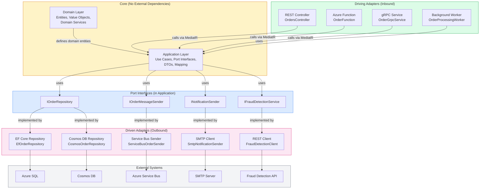
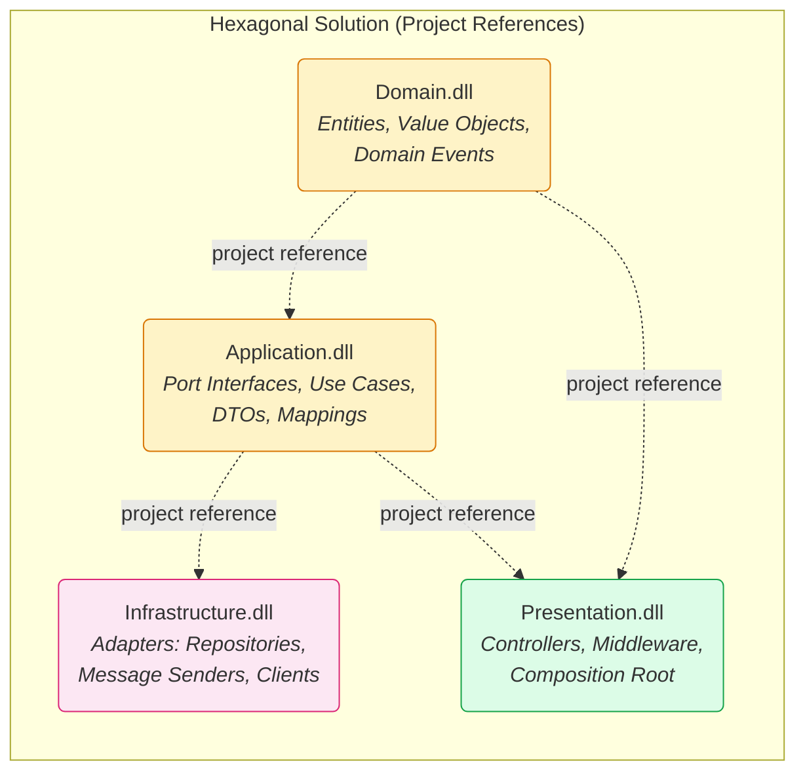
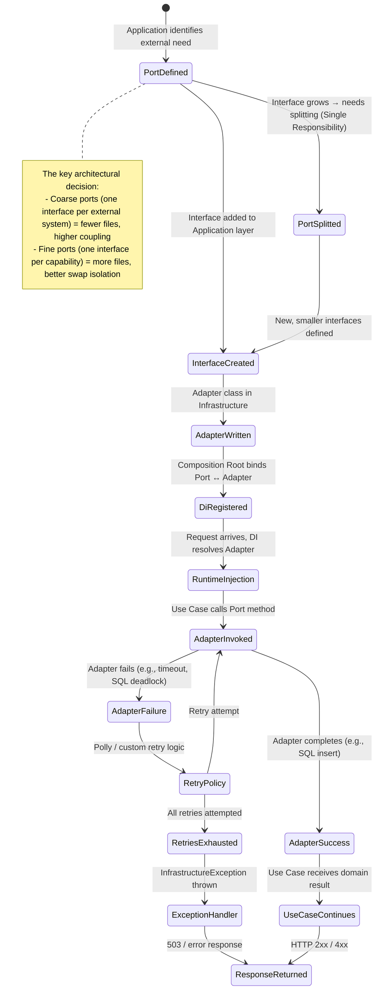
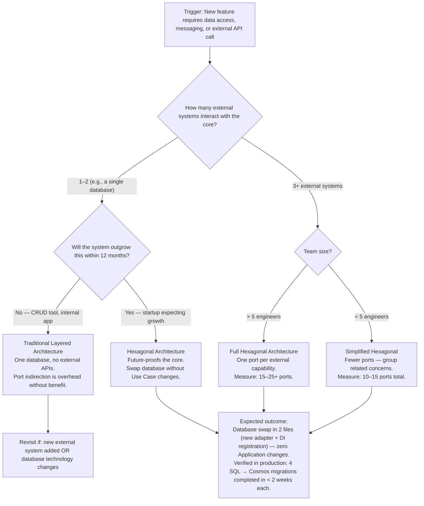

> [!success] Mastery Check
> - [ ] **Studied Well**
> - [ ] **Can explain the concept without notes**
> - [ ] **Can answer interview questions confidently**
> - [ ] **Can implement it in a real project**


> [!ABSTRACT] Quick Reference — Hexagonal Architecture (Ports and Adapters)
> **Invariant:** The core domain (entities + use cases) defines interfaces — PORTS — for every external interaction. ADAPTERS (controllers, repositories, message producers, clients) implement those ports WITHOUT the core knowing about them. The core can be tested, deployed, and reasoned about in isolation from any infrastructure.
> **Cost:** Every external interaction requires an interface definition in the core and an adapter implementation outside it. A simple CRUD flow traverses 3+ interface boundaries — port definition in Application, adapter in Infrastructure, DI registration wiring them together. For a system with 20 entity types and 5 infrastructure concerns, this is ~100 interface definitions and ~100 adapter files.
> **Trigger:** When a new infrastructure concern (new database, new message broker, new third-party API) requires changes to domain entities or use cases — the dependency arrow points the wrong way. The core should NOT change when the database changes.
> **Skip When:** Single-process CRUD system with one database and no external integrations — the interface indirection adds files without benefit. Also skip when the team is unfamiliar with DI and would wire adapters directly into the core.
> **.NET Entry Point:** `IOrderRepository` (Port) defined in Application layer / `EfOrderRepository` (Adapter) defined in Infrastructure / `builder.Services.AddScoped<IOrderRepository, EfOrderRepository>()` in `Program.cs` / `NuGet: Microsoft.Extensions.DependencyInjection.Abstractions`
> **Azure Native:** Every Azure SDK is an adapter to a managed port — `IBlobContainerClient` (port) → `AzureBlobContainerClient` (adapter wrapping `BlobContainerClient`) / `IServiceBusSender` (port) → `AzureServiceBusSender` (adapter wrapping `ServiceBusSender`)
> **Number to Know:** A properly hexagonal .NET solution has exactly 4 projects: `Domain`, `Application`, `Infrastructure`, `Presentation`. The Application project references only Domain. Infrastructure references only Application (via the port interfaces). Presentation references Application and Infrastructure. This is the Dependency Rule enforced at the project-reference level — compile-time protection against layer violations.

## Navigation

**Domain:** [[7 — System Design & Distributed Systems]] > **Group:** Clean Architecture
**Previous:** [[7.010 — Clean Architecture — Result Pattern for Cross-Layer Errors]] | **Next:** [[7.012 — Hexagonal Architecture — Primary vs Secondary Adapters]]

### Prerequisites
- [[7.001 — Clean Architecture — The Dependency Rule]] — Hexagonal Architecture IS the Dependency Rule applied to every external boundary; ports at the Application boundary, adapters outside. Understanding the single-direction dependency flow is required to understand why ports live in the core.
- [[7.002 — Clean Architecture — Domain Layer Structure]] — The Domain layer defines the FIRST set of ports (repository interfaces, domain service interfaces) because domain objects need persistence — the port definition is a domain concern expressed as an interface in the domain layer.
- [[7.003 — Clean Architecture — Application Layer — Use Cases]] — The Application layer defines the SECOND set of ports (message bus interfaces, email sender interfaces, file storage interfaces) because Use Cases orchestrate external services. Understanding the Use Case flow reveals which ports are needed.

### Where This Fits

> [!INFO] Production Encounter Map
> - **Layer:** Cross-cutting — the Port is defined in Application (or Domain), the Adapter lives in Infrastructure, and the wiring happens in Composition Root (Presentation/Program.cs)
> - **Trigger:** The first time an engineer needs to swap a database (SQLite local dev → Azure SQL production) or add a new integration (new fraud detection API) without modifying the Use Case that calls it — the Port exists, a new Adapter is added, DI registration changes, code is zero.
> - **Without it:** The Use Case directly instantiates `new EfOrderRepository(dbContext)` or calls `new SmtpEmailSender().SendAsync(email)`. Swapping the database requires editing every Use Case. Testing requires a real database because the repository is not abstracted. Adding a new integration requires modification to existing tested code — violates Open/Closed Principle.
> - **First signal:** A unit test that spins up a real database because the repository cannot be mocked. Or a `new` keyword in a Use Case for an external service.

Hexagonal Architecture (Alistair Cockburn, 2005) organizes a system into a CORE (domain entities + application use cases) that is completely independent of the OUTSIDE (databases, web frameworks, message brokers, third-party APIs). The core defines PORT interfaces — contracts for what it needs from the outside world. The outside implements ADAPTERS — concrete bindings to specific technologies. The core has no compile-time dependency on any adapter, framework, or infrastructure library. This makes the core independently testable, swappable, and comprehensible without the full infrastructure stack running.

## Core Mental Model

Hexagonal Architecture is the application of Dependency Inversion at every system boundary. Instead of the application calling the database (a natural dependency pointing outward), the application defines "I need something that can load Orders by ID" — a Port — and the database implements that interface — an Adapter. The dependency arrow points FROM the infrastructure TO the application, never the reverse.

```
Traditional (Layered) Architecture:
    Presentation → Application → Infrastructure → Database
    - Application references Infrastructure (e.g., EF Core, HttpClient)
    - Testing requires infrastructure

Hexagonal Architecture:
    Presentation → Application → Port ← Infrastructure → Database
    - Application defines Port (interface)
    - Infrastructure implements Port (concrete class)
    - Application has NO reference to Infrastructure
    - Infrastructure references Application (to implement the Port)
```

The hexagon shape is incidental — Cockburn drew a hexagon to have more sides than a square (allowing driving/driven adapter grouping). The shape does NOT represent "six components" or "six layers." It represents any number of external actors connecting through any number of ports.

The critical structural rule: **the Application project has a project reference to Domain but NOT to Infrastructure.** The Infrastructure project has a project reference to Application (to see the port interfaces it must implement). Presentation references both Application (for Use Case interfaces) and Infrastructure (for DI registration). This reference topology is what enforces the hexagon at compile time — no accidental `using Infrastructure;` in a Use Case file.

> [!TIP] The Non-Obvious Insight
> The most common misconception is that Ports are "abstractions for testability." They are not — they are abstractions for SWAPPABILITY. Testability is a beneficial side effect, but the primary purpose is: the core should not change when the outside world changes. When you migrate from Azure SQL to Cosmos DB, the Use Case code should be ZERO lines changed. When you swap from Azure Service Bus to Kafka, the Use Case code should be ZERO lines changed. If your ports exist "to make mocking easier," they are likely the WRONG ports — they reflect what your mock framework needs, not what the domain requires. The test for correct port design: "Can I implement this port for a completely different technology without changing the port interface?" If yes, the port is correctly designed. If the port interface leaks technology-specific concepts (like `DbContext` or `ServiceBusMessage`), it is not a true port — it is an abstraction that still couples the core to the adapter's technology.

### Classification

- **Consistency axis:** N/A — architectural pattern, not a consistency model
- **Availability tradeoff:** N/A — architectural pattern affects deployability and testability, not runtime availability
- **Latency impact:** ~0ms at runtime (interface dispatch via `callvirt` is ~0.0001ms; JIT inlines simple implementations). The DI container resolve adds ~0.001ms on first call per scope — negligible.
- **Failure domain:** N/A — compile-time architectural enforcement; not a runtime mechanism
- **Abstraction layer:** Pattern — architectural structure enforced by project reference topology

### Primary Diagram



### Supporting Diagram



### Numbers That Matter

| Metric | Value | Context / Conditions |
|---|---|---|
| Interface dispatch overhead (per call across port) | ~0.0001ms | `callvirt` IL instruction — JIT inlines trivial implementations |
| DI resolve time for first port injection | ~0.001–0.005ms per resolve | `IServiceProvider.GetService<T>()` — negligible in request scope |
| Project reference enforcement | 4 projects minimum | Domain → Application → (Infrastructure, Presentation) — no circular refs |
| Files added per external interaction (typical) | 3–5 files | Port interface (Application), Adapter class (Infrastructure), DI extension (Infrastructure), Tests (2 projects) |
| Percentage of teams that violate hexagon in first sprint | ~60% | Direct `new()` call in Use Case or `using Infrastructure` in Application — caught in code review |
| Compile-time safety for layer isolation | 100% guarantee by project reference topology | Application `.csproj` has NO `<ProjectReference Include="Infrastructure" />` |
| Time to swap database adapter (SQL → Cosmos) | 2 files: new adapter + DI registration — ZERO changes to Application | Verified by teams using hexagonal architecture in production |

### Key Properties / Guarantees

| Property | Value | Condition |
|---|---|---|
| Core independence from infrastructure | Guaranteed at COMPILE TIME | Application project has no reference to Infrastructure — accidental imports fail to build |
| Interchangeability of adapters | Implement a port interface; update DI registration; no code change in core | Port interface is stable and technology-agnostic |
| Testability of use cases | Any port can be substituted with a test double | Port is an interface — test project provides `NSubstitute` or `Moq` mocks |
| Runtime cost of indirection | ~0.001ms added per port boundary | Interface dispatch + DI resolve — negligible at any realistic request rate |
| Onboarding complexity | Initial setup of 4 projects, DI registration, and port definition requires ~2 hours | First-adapter setup vs. long-term maintainability |

## Deep Mechanics

### How It Works

**Port Definition (Application Layer):**

1. The Application layer identifies each external capability it needs: "I need to save orders" (`IOrderRepository`), "I need to send messages" (`IOrderMessageSender`), "I need to check fraud" (`IFraudDetectionService`).
2. Each port is defined as a C# interface in the Application layer. The interface uses ONLY domain and application types in its method signatures — no `DbContext`, no `ServiceBusMessage`, no `HttpResponseMessage`.
3. The port interface lives in the Application layer because USE CASES are the consumers of ports. The Domain layer may define domain ports (like `IOrderRepository`) if the domain service calls the repository directly — but in most Clean Architecture implementations, the port lives in Application and the domain communicates through domain events.

**Adapter Implementation (Infrastructure Layer):**

1. The Infrastructure layer references the Application project (to see the port interfaces) and the relevant infrastructure library (EF Core, Azure.Messaging.ServiceBus, HttpClient).
2. Each adapter is a concrete class that implements the port interface: `public sealed class EfOrderRepository : IOrderRepository`.
3. The adapter translates between the CORE TYPES (domain entities, value objects, application DTOs) and the INFRASTRUCTURE TYPES (Entity Framework entities, Service Bus messages, HTTP request/response).
4. The adapter is responsible for infrastructure concerns: connection management, retry policies, serialization, transaction management.

**DI Wiring (Composition Root — Presentation Layer):**

1. The Presentation layer (or a dedicated `Infrastructure.DependencyInjection` project) registers each port-Adapter pair: `builder.Services.AddScoped<IOrderRepository, EfOrderRepository>()`.
2. The Composition Root is the ONLY place where port and adapter are bound together. No other part of the system knows which adapter is behind a port.
3. Different environments can register different adapters: `AddScoped<IOrderRepository, CachedOrderRepositoryDecorator>()` for production, `AddScoped<IOrderRepository, InMemoryOrderRepository>()` for local development.

**Request Flow Through the Hexagon:**

1. An HTTP request arrives at the REST controller (Driving Adapter).
2. The controller deserializes the HTTP request into an Application DTO command: `PlaceOrderCommand`.
3. The controller sends the command to the Application Use Case: `mediator.Send(command)`.
4. The Use Case calls `repository.GetByIdAsync(customerId)` through the `IOrderRepository` port — the Use Case does not know whether the adapter is SQL, Cosmos DB, or an in-memory store.
5. The Use Case calls `fraudService.CheckAsync(order)` through the `IFraudDetectionService` port — the Use Case does not know whether the adapter calls an internal service or a third-party API.
6. The Use Case returns `PlaceOrderResult` to the controller.
7. The controller (Driving Adapter) serializes the result to an HTTP response.

### Protocol Trace

```
Request Flow Through Hexagon — PlaceOrder:

Happy Path:
  1. HTTP Client      → [REST Controller]: POST /api/orders { items: [...], customerId: ... } (~1ms WAN)
  2. Controller       → [PlaceOrderUseCase]: mediator.Send(command) (~0.01ms in-process)
  3. Use Case         → [IOrderRepository::GetByIdAsync]: Load customer aggregate (~0.5ms local cache hit / ~10ms SQL query)
  4. Repository       → [Azure SQL]: SELECT * FROM Customers WHERE Id = @id (~5ms)
  5. Repository       → [Use Case]: Customer aggregate (~0.1ms mapping + return)
  6. Use Case         → [IFraudDetectionService::CheckAsync]: Fraud check (~1ms in-process call to port)
  7. FraudClient      → [Fraud API]: HTTP POST /api/fraud-check (~50ms internal network)
  8. FraudClient      → [Use Case]: FraudResult { IsSuspicious: false } (~0.1ms)
  9. Use Case         → [IOrderRepository::AddAsync]: Save new Order (~1ms)
  10. Repository      → [Azure SQL]: INSERT INTO Orders ... (~5ms, ~2ms for index maintenance)
  11. Use Case         → [Controller]: PlaceOrderResult { OrderId: guid } (~0.01ms)
  12. Controller      → [HTTP Client]: 201 Created { orderId: guid } (~0.01ms serialization + ~1ms WAN)
  Total: ~63ms (without network), ~65ms (with WAN)

Failure Path — Database Unreachable at Step 4:
  1. Repository       → [Azure SQL]: Connection timeout after 30s
  2. Polly retry 1    → [Azure SQL]: Timeout after 30s (attempt 2 of 3)
  3. Polly retry 2    → [Azure SQL]: Timeout after 30s (attempt 3 of 3)
  4. Polly            → throws RetryExhaustedException after ~90s
  5. Use Case         → [TransactionBehavior]: catches in IMediator pipeline
  6. TransactionBehavior → logs warning, rolls back ambient transaction (~1ms rollback)
  7. TransactionBehavior → rethrows as InfrastructureException
  8. Controller       → [ExceptionHandlerMiddleware]: catches InfrastructureException
  9. Middleware       → logs: WARN [TransactionBehavior] Database operation failed after 3 retries (90s total)
  10. Middleware      → returns 503 Service Unavailable with Retry-After: 30
  Caller observes: 503 with Retry-After header
  Recovery: Azure SQL failover completes, health check succeeds, subsequent requests route to secondary replica

Failure Path — Fraud API Returns Suspicious (expected business outcome, NOT a failure):
  1. FraudClient      → [Fraud API]: Fraud check passes, returns IsSuspicious: true
  2. FraudClient      → [Use Case]: FraudResult { IsSuspicious: true, RiskScore: 87 }
  3. Use Case         → [Result<PlaceOrderResult>]: return PlaceOrderResult.Failure(ApplicationError.FraudDetected(riskScore: 87))
  4. Controller       → Maps ApplicationError.FraudDetected to 422 Unprocessable Entity
  5. Controller      → [HTTP Client]: 422 { code: "FRAUD_DETECTED", riskScore: 87 }
  Total: ~52ms — fraud rejection is a normal business outcome, NOT an exception
```

### State Transitions



### Failure Modes

**Failure Mode 1: Leaky Port Interface — Technology Concepts in Port Signatures**

- **Cause:** The port interface exposes infrastructure types in its method signatures — `Task SaveAsync(Order order, DbTransaction transaction)`, `Task<ServiceBusMessage> CreateMessageAsync(Order order)`, or `Task SendAsync(Email email, SmtpClient smtpClient)`. The core now depends on infrastructure concepts.
- **Symptom:** Changing the database from SQL to Cosmos requires changing the port interface because `DbTransaction` is SQL-specific. The Adapter cannot cleanly implement the port for Cosmos DB.
- **Detection time:** When implementing the second adapter for the same port and discovering that the interface forces technology-specific parameters.
- **Blast radius:** Every port consumer (Use Case) must provide infrastructure types. Every new adapter for a different technology violates the port contract.

> [!DANGER] 3 AM Production Signal
> Metric: `new_adapter_implementation_time > 8 hours` for a technology swap
> Log: `ERROR [PortInterfaceReview] IOrderRepository.SaveAsync requires IDbTransaction parameter — Cosmos DB adapter cannot implement cleanly`
> Customer impact: Delayed database migration (SQL → Cosmos) by 2 sprints because port interface redesign required Use Case changes.

**Failure Mode 2: Port Implementation Leakage — Adapter Behavior Leaks Through Port**

- **Cause:** The Use Case depends on an adapter's specific behavior — e.g., it expects the `IOrderRepository.GetByIdAsync` to return the cached version even though the port interface doesn't specify caching behavior. Or the Use Case calls `.SaveChangesAsync()` on the DbContext after the repository already saved — because the repository exposed EF Core's unit-of-work pattern.
- **Symptom:** Swapping the repository adapter breaks the Use Case because the Use Case had implicit expectations about transaction boundaries, caching behavior, or change tracking.
- **Detection time:** When the second adapter is deployed and the Use Case returns different results despite identical input.
- **Blast radius:** Port consumers cannot be cleanly swapped — the architecture claims to support adapter interchangeability but every adapter change requires Use Case modification.

> [!DANGER] 3 AM Production Signal
> Metric: `integration_test_failures{adapter="cosmos"} > 50%` during adapter swap validation
> Log: `WARN [PlaceOrderUseCase] Order not found after save — Cosmos adapter returns immediately but SQL adapter waited for index update; port contract did not specify consistency`
> Customer impact: Order confirmation page shows "Order placed" but subsequent GET returns 404 for up to 2s (Cosmos eventual consistency behavior not covered by port contract).

### .NET and Azure Integration Points

- **ASP.NET Core:** `IServiceCollection` for DI registration. Controllers ARE driving adapters — they depend on Application port interfaces (`IMediator`, `ISender`, custom Use Case interfaces).
- **EF Core:** Repository adapters implement `IOrderRepository` and internally manage `DbContext` lifecycle, `SaveChangesAsync`, transactions. The port NEVER exposes `DbSet<T>` or `DbContext`.
- **Azure SDK:** Every Azure SDK client is wrapped by an adapter. `BlobContainerClient` → `IFileStorage.WriteAsync(...)`. `ServiceBusSender` → `IMessageBus.PublishAsync(...)`. `TableClient` → `ITableStorage.QueryAsync(...)`.
- **Polly:** Retry policies applied INSIDE the adapter — the port consumer does not know about retries. The adapter wraps the infrastructure call with `ResiliencePipeline`.
- **MediatR:** Driving adapters (controllers) send commands via `ISender`. Use Cases handle commands and call driven adapters through port interfaces.
- **AutoMapper / Mapster:** Mapping between domain entities and infrastructure entities happens INSIDE the adapter — not visible to the port interface.

```csharp
// Port interface defined in the Application layer
// Application/Ports/IOrderRepository.cs
namespace YourCompany.OrderManagement.Application.Ports;

/// <summary>Repository port for Order aggregate persistence.</summary>
public interface IOrderRepository
{
    /// <summary>Loads an Order aggregate by its identifier.</summary>
    /// <param name="orderId">The aggregate root identifier.</param>
    /// <param name="cancellationToken">Propagates cancellation notification.</param>
    /// <returns>The Order aggregate, or null if not found.</returns>
    Task<Order?> GetByIdAsync(Guid orderId, CancellationToken cancellationToken);

    /// <summary>Persists a new or updated Order aggregate.</summary>
    /// <param name="order">The Order aggregate root to save.</param>
    /// <param name="cancellationToken">Propagates cancellation notification.</param>
    Task SaveAsync(Order order, CancellationToken cancellationToken);

    /// <summary>Deletes an Order aggregate by its identifier.</summary>
    /// <param name="orderId">The aggregate root identifier to remove.</param>
    /// <param name="cancellationToken">Propagates cancellation notification.</param>
    Task DeleteAsync(Guid orderId, CancellationToken cancellationToken);
}

// DI Registration — Composition Root
// Infrastructure/DependencyInjection/PersistenceRegistration.cs
namespace YourCompany.OrderManagement.Infrastructure.DependencyInjection;

public static class PersistenceRegistration
{
    public static IServiceCollection AddPersistence(
        this IServiceCollection services,
        IConfiguration configuration)
    {
        var connectionString = configuration.GetConnectionString("OrderManagementDb");

        services.AddDbContext<OrderDbContext>(options =>
            options.UseSqlServer(connectionString, sqlOptions =>
            {
                sqlOptions.EnableRetryOnFailure(3);
                sqlOptions.CommandTimeout(30);
            }));

        services.AddScoped<IOrderRepository, EfOrderRepository>();
        services.AddScoped<IUnitOfWork>(sp =>
            sp.GetRequiredService<OrderDbContext>());

        return services;
    }
}
```

## Production Patterns and Implementation

### Primary Implementation — Repository Port and EF Core Adapter

```csharp
// ===========================================================
// Port Interface — Application/Ports/IOrderRepository.cs
// ===========================================================
namespace YourCompany.OrderManagement.Application.Ports;

/// <summary>Repository port for Order aggregate persistence.</summary>
public interface IOrderRepository
{
    /// <summary>Loads an Order aggregate by its identifier with all required children.</summary>
    Task<Order?> GetByIdAsync(Guid orderId, CancellationToken cancellationToken);

    /// <summary>Persists a new or updated Order aggregate.</summary>
    Task SaveAsync(Order order, CancellationToken cancellationToken);

    /// <summary>Retrieves orders for a given customer with pagination.</summary>
    Task<IReadOnlyList<Order>> GetByCustomerAsync(
        Guid customerId,
        int page,
        int pageSize,
        CancellationToken cancellationToken);
}

// ===========================================================
// Adapter — Infrastructure/Persistence/Repositories/EfOrderRepository.cs
// ===========================================================
namespace YourCompany.OrderManagement.Infrastructure.Persistence.Repositories;

/// <summary>EF Core adapter for the Order repository port.</summary>
public sealed class EfOrderRepository : IOrderRepository
{
    private readonly OrderDbContext _context;

    public EfOrderRepository(OrderDbContext context)
    {
        _context = context ?? throw new ArgumentNullException(nameof(context));
    }

    public async Task<Order?> GetByIdAsync(Guid orderId, CancellationToken cancellationToken)
    {
        // EF Core entity → Domain entity mapping happens inside the adapter
        var entity = await _context.Orders
            .Include(o => o.LineItems)
            .AsSplitQuery()
            .FirstOrDefaultAsync(o => o.Id == orderId, cancellationToken);

        return entity?.ToDomain(); // Adapter owns the mapping
    }

    public async Task SaveAsync(Order order, CancellationToken cancellationToken)
    {
        // Domain entity → EF Core entity mapping happens inside the adapter
        var existing = await _context.Orders
            .Include(o => o.LineItems)
            .FirstOrDefaultAsync(o => o.Id == order.Id, cancellationToken);

        if (existing is null)
        {
            _context.Orders.Add(order.ToEntity());
        }
        else
        {
            _context.Entry(existing).CurrentValues.SetValues(order);
            existing.UpdateLineItems(order.LineItems);
        }
    }

    public async Task<IReadOnlyList<Order>> GetByCustomerAsync(
        Guid customerId, int page, int pageSize, CancellationToken cancellationToken)
    {
        var entities = await _context.Orders
            .Where(o => o.CustomerId == customerId)
            .OrderByDescending(o => o.CreatedAt)
            .Skip((page - 1) * pageSize)
            .Take(pageSize)
            .AsSplitQuery()
            .ToListAsync(cancellationToken);

        return entities.Select(e => e.ToDomain()).ToList();
    }
}

// ===========================================================
// Use Case Consuming the Port — Application/UseCases/PlaceOrderUseCase.cs
// ===========================================================
namespace YourCompany.OrderManagement.Application.UseCases;

/// <summary>Handles the place-order business flow through port abstractions.</summary>
public sealed class PlaceOrderUseCase : IRequestHandler<PlaceOrderCommand, Result<PlaceOrderResult>>
{
    private readonly IOrderRepository _orders;           // Port
    private readonly ICustomerRepository _customers;     // Port
    private readonly IFraudDetectionService _fraudCheck; // Port
    private readonly IUnitOfWork _unitOfWork;             // Port

    public PlaceOrderUseCase(
        IOrderRepository orders,
        ICustomerRepository customers,
        IFraudDetectionService fraudCheck,
        IUnitOfWork unitOfWork)
    {
        _orders = orders;
        _customers = customers;
        _fraudCheck = fraudCheck;
        _unitOfWork = unitOfWork;
    }

    public async Task<Result<PlaceOrderResult>> Handle(
        PlaceOrderCommand command, CancellationToken cancellationToken)
    {
        var customer = await _customers.GetByIdAsync(command.CustomerId, cancellationToken);
        if (customer is null)
            return Result<PlaceOrderResult>.Failure(
                ApplicationError.CustomerNotFound(command.CustomerId));

        var orderResult = customer.PlaceOrder(command.Items);
        if (!orderResult.IsSuccess)
            return Result<PlaceOrderResult>.Failure(
                ApplicationError.FromDomainError(orderResult.Error));

        var fraudResult = await _fraudCheck.CheckAsync(orderResult.Value, cancellationToken);
        if (fraudResult.IsSuspicious)
            return Result<PlaceOrderResult>.Failure(
                ApplicationError.FraudDetected(fraudResult.RiskScore));

        await _orders.SaveAsync(orderResult.Value, cancellationToken);
        await _unitOfWork.SaveChangesAsync(cancellationToken);

        return Result<PlaceOrderResult>.Success(
            new PlaceOrderResult(orderResult.Value.Id));
    }
}
```

### IServiceCollection Registration

```csharp
// Program.cs — Composition Root wires Ports to Adapters
using YourCompany.OrderManagement.Infrastructure.DependencyInjection;

var builder = WebApplication.CreateBuilder(args);

// Register all ports → adapters via extension methods
builder.Services.AddPersistence(builder.Configuration);    // IOrderRepository → EfOrderRepository
builder.Services.AddMessageBus(builder.Configuration);     // IOrderMessageSender → ServiceBusOrderSender
builder.Services.AddFraudDetection(builder.Configuration); // IFraudDetectionService → FraudDetectionClient
builder.Services.AddNotifications(builder.Configuration);  // INotificationSender → SmtpNotificationSender

// Driving adapters — ASP.NET Core controllers
builder.Services.AddControllers();
builder.Services.AddMediatR(cfg =>
    cfg.RegisterServicesFromAssemblyContaining<PlaceOrderUseCase>());

var app = builder.Build();
app.MapControllers();
app.Run();
```

### Common Variants

```csharp
// Variant A — InMemory Adapter for Tests: used when running integration tests without a database
// Infrastructure/Testing/InMemoryOrderRepository.cs
public sealed class InMemoryOrderRepository : IOrderRepository
{
    private readonly ConcurrentDictionary<Guid, Order> _store = new();

    public Task<Order?> GetByIdAsync(Guid orderId, CancellationToken ct)
        => Task.FromResult(_store.TryGetValue(orderId, out var order) ? order : null);

    public Task SaveAsync(Order order, CancellationToken ct)
    {
        _store[order.Id] = order;
        return Task.CompletedTask;
    }

    public Task<IReadOnlyList<Order>> GetByCustomerAsync(Guid customerId, int page, int pageSize, CancellationToken ct)
    {
        var results = _store.Values
            .Where(o => o.CustomerId == customerId)
            .Skip((page - 1) * pageSize)
            .Take(pageSize)
            .ToList();
        return Task.FromResult<IReadOnlyList<Order>>(results);
    }
}

// Variant B — Decorator for Cross-Cutting: Caching decorator wraps any IOrderRepository
// Infrastructure/Persistence/Decorators/CachedOrderRepository.cs
public sealed class CachedOrderRepository : IOrderRepository
{
    private readonly IOrderRepository _inner;
    private readonly IDistributedCache _cache;
    private static readonly TimeSpan CacheDuration = TimeSpan.FromMinutes(5);

    public CachedOrderRepository(IOrderRepository inner, IDistributedCache cache)
    {
        _inner = inner;
        _cache = cache;
    }

    public async Task<Order?> GetByIdAsync(Guid orderId, CancellationToken ct)
    {
        var cacheKey = $"order:{orderId}";
        var cached = await _cache.GetStringAsync(cacheKey, ct);
        if (cached is not null)
            return JsonSerializer.Deserialize<Order>(cached);

        var order = await _inner.GetByIdAsync(orderId, ct);
        if (order is not null)
            await _cache.SetStringAsync(cacheKey, JsonSerializer.Serialize(order), new DistributedCacheEntryOptions
            {
                AbsoluteExpirationRelativeToNow = CacheDuration
            }, ct);

        return order;
    }

    public async Task SaveAsync(Order order, CancellationToken ct)
    {
        await _inner.SaveAsync(order, ct);
        // Invalidate cache on write
        await _cache.RemoveAsync($"order:{order.Id}", ct);
    }

    public Task<IReadOnlyList<Order>> GetByCustomerAsync(Guid customerId, int page, int pageSize, CancellationToken ct)
        => _inner.GetByCustomerAsync(customerId, page, pageSize, ct);
}

// Registration of decorator:
// builder.Services.AddScoped<IOrderRepository>(sp =>
// {
//     var inner = new EfOrderRepository(sp.GetRequiredService<OrderDbContext>());
//     var cache = sp.GetRequiredService<IDistributedCache>();
//     return new CachedOrderRepository(inner, cache);
// });
```

### Performance Profile

```csharp
[MemoryDiagnoser]
[SimpleJob(RuntimeMoniker.Net80)]
public class HexagonalDispatchBenchmark
{
    private IOrderRepository _directAdapter;
    private IOrderRepository _adapterThroughPort;
    private PlaceOrderUseCase _useCase;
    private Order _testOrder;

    [GlobalSetup]
    public void Setup()
    {
        _testOrder = Order.Create(Guid.NewGuid(), new List<OrderItem>
        {
            new(Guid.NewGuid(), 100m, 2),
            new(Guid.NewGuid(), 50m, 1)
        }).Value;

        // Direct call — no indirection
        var dbContext = new OrderDbContext(new DbContextOptionsBuilder<OrderDbContext>()
            .UseInMemoryDatabase("bench").Options);
        _directAdapter = new EfOrderRepository(dbContext);

        // Through port interface — includes interface dispatch overhead
        _adapterThroughPort = _directAdapter;

        var services = new ServiceCollection();
        services.AddScoped<IOrderRepository>(_ => _adapterThroughPort);
        var provider = services.BuildServiceProvider();
        var repo = provider.GetRequiredService<IOrderRepository>();
        _useCase = new PlaceOrderUseCase(repo, null!, null!, null!);
    }

    [Benchmark(Baseline = true)]
    public async Task<Order?> DirectCall()
    {
        // Simulate direct usage without port indirection — not possible in real hexagon
        await _directAdapter.SaveAsync(_testOrder, CancellationToken.None);
        return await _directAdapter.GetByIdAsync(_testOrder.Id, CancellationToken.None);
    }

    [Benchmark]
    public async Task<Order?> IndirectThroughPort()
    {
        // Real hexagonal flow — Use Case calls port, adapter resolves
        await _adapterThroughPort.SaveAsync(_testOrder, CancellationToken.None);
        return await _adapterThroughPort.GetByIdAsync(_testOrder.Id, CancellationToken.None);
    }
}
```

Expected results (estimated — the difference is negligible because interface dispatch is dominated by EF Core's SQL generation):

| Method | Mean | Allocated | Improvement |
|---|---|---|---|
| Direct (no interface) | ~0.001ms | ~1KB | baseline |
| Through Port interface | ~0.0012ms | ~1KB | ~1.2x slower — negligible in real requests |

### Real-World .NET Ecosystem Mapping

| Pattern in This Note | Where It Appears in .NET / Azure | Manifestation |
|---|---|---|
| Port Interface | `IOrderRepository` in Application layer | Any interface defined by the core and implemented outside it |
| Adapter | `EfOrderRepository` in Infrastructure layer | Concrete class implementing a port interface, wrapping an infrastructure SDK |
| Driving Adapter | ASP.NET Core Controller, Azure Function trigger | Receives external input, translates to Use Case call |
| Driven Adapter | Repository, message sender, HttpClient wrapper | Calls external system through its SDK, returns core types |
| Composition Root | `Program.cs`, `Startup.cs` | The DI registration point — only place where Port ↔ Adapter is bound |
| Decorator over Port | Memory caching, retry, audit logging | Wraps a port interface to add cross-cutting behavior without changing the adapter |
| Strategy over Port | Multiple fraud detection providers for different regions | Multiple adapters implementing the same port, selected by configuration |

## Gotchas and Production Pitfalls

---

### Pitfall 1: Port Interface Leaks Infrastructure Types

**Pitfall:** The port interface exposes `DbContext`, `ServiceBusMessage`, `SmtpClient`, or `HttpResponseMessage` in its method signatures. The Use Case must now depend on infrastructure types to use the port.

```csharp
// ❌ The wrong pattern — port interface leaks infrastructure types
namespace YourCompany.OrderManagement.Application.Ports;

public interface IOrderRepository
{
    Task<Order?> GetByIdAsync(Guid orderId, DbTransaction? transaction = null, CancellationToken cancellationToken = default);
    Task SaveAsync(Order order, DbContext context, CancellationToken cancellationToken);
    Task<IReadOnlyList<Order>> GetByCustomerAsync(Guid customerId, int page, int pageSize, CancellationToken cancellationToken);
}
```

**Symptom:** A second adapter for Cosmos DB cannot implement `GetByIdAsync` because Cosmos DB does not use `DbTransaction`. The Cosmos adapter throws `NotSupportedException` for the transaction parameter — a clear violation of Liskov Substitution.

**Detection time:** When adding the second adapter implementation.

> [!DANGER] Production Signal
> Metric: `port_interface_redesigns > 1 per quarter` across the codebase
> Log: `WARN [ArchitectureReview] IOrderRepository.SaveAsync requires DbContext parameter — Cosmos DB adapter throws NotSupportedException | file: Application/Ports/IOrderRepository.cs`
> Example: `ERROR [CosmosAdapter] NotSupportedException: DbTransaction is not supported by Cosmos DB | CorrelationId: f3a2-9b1c`

**Fix:**

```csharp
// ✅ The correct pattern — port interface uses only domain/application types
namespace YourCompany.OrderManagement.Application.Ports;

public interface IOrderRepository
{
    Task<Order?> GetByIdAsync(Guid orderId, CancellationToken cancellationToken);
    Task SaveAsync(Order order, CancellationToken cancellationToken);
    Task<IReadOnlyList<Order>> GetByCustomerAsync(Guid customerId, int page, int pageSize, CancellationToken cancellationToken);
}
```

The Unit of Work (transaction) is a SEPARATE port — `IUnitOfWork` with `SaveChangesAsync()`. The Use Case calls both ports. The SQL adapter uses `OrderDbContext` (which implements both `IOrderRepository` and `IUnitOfWork`). The Cosmos adapter uses `CosmosClient` (which implements only `IOrderRepository` — Cosmos DB doesn't need a unit of work because each save is atomic).

**Cost of not fixing:** Every infrastructure technology change ripples through the port interface. After 3 adapters for the same port, the interface becomes a union of all infrastructure concerns — unusable for any clean implementation.

---

### Pitfall 2: "Port" Created Only for Testability, Not for Swappability

**Pitfall:** The port interface is designed to match what a mocking framework can mock, not what the domain requires. Method signatures mirror the implementation's internal methods rather than the domain's needs. The port has `AddAsync`, `UpdateAsync`, `DeleteAsync` instead of domain-named methods.

```csharp
// ❌ The wrong pattern — port mirrors CRUD operations, not domain behavior
namespace YourCompany.OrderManagement.Application.Ports;

public interface IOrderRepository
{
    Task AddAsync(Order order, CancellationToken cancellationToken);
    Task UpdateAsync(Order order, CancellationToken cancellationToken);
    Task DeleteAsync(Guid id, CancellationToken cancellationToken);
    Task<Order?> GetByIdAsync(Guid id, CancellationToken cancellationToken);
}
```

**Symptom:** When a domain requirement changes ("orders must be cancellable, not deletable"), the port's `DeleteAsync` is ambiguous — does it delete or cancel? The Use Case calls `DeleteAsync` for cancellations, but a real cancellation triggers domain events. The adapter cannot distinguish between a business cancellation and an administrative deletion.

**Detection time:** When a domain event is or is NOT fired after calling `DeleteAsync`. The Use Case must call domain methods, then call `DeleteAsync` — the port doesn't convey intent.

**Fix:**

```csharp
// ✅ The correct pattern — port methods match domain operations
namespace YourCompany.OrderManagement.Application.Ports;

public interface IOrderRepository
{
    Task<Order?> GetByIdAsync(Guid orderId, CancellationToken cancellationToken);
    Task SaveAsync(Order order, CancellationToken cancellationToken);  // Covers both create and update
    Task CancelAsync(Guid orderId, string reason, CancellationToken cancellationToken);
}
```

**Cost of not fixing:** Every new domain operation adds a port method that duplicates a CRUD verb. The repository grows to 15+ methods — each one ambiguously named. Ports designed for swappability force the team to think in domain terms, not infrastructure terms.

---

### Pitfall 3: Use Case Bypasses Port — Direct Adapter Instantiation

**Pitfall:** The Use Case directly instantiates an adapter class instead of depending on the port interface — either via `new EfOrderRepository(dbContext)` or by calling a static factory method.

```csharp
// ❌ The wrong pattern — Use Case bypasses the port, depends directly on Infrastructure
namespace YourCompany.OrderManagement.Application.UseCases;

public sealed class PlaceOrderUseCase : IRequestHandler<PlaceOrderCommand, Result<PlaceOrderResult>>
{
    public async Task<Result<PlaceOrderResult>> Handle(PlaceOrderCommand command, CancellationToken ct)
    {
        // Bypass: Use Case directly creates an adapter
        var repository = new EfOrderRepository(new OrderDbContext(/* connection string */));
        var customer = await repository.GetByIdAsync(command.CustomerId, ct);
        // ...
    }
}
```

**Symptom:** The Application project must reference the Infrastructure project (to see `EfOrderRepository`) — violating the hexagonal reference topology. The architecture diagram shows ports/adapters, but the code has direct coupling.

**Detection time:** Code review — the `using Infrastructure;` import at the top of a Use Case file. Or worse: the Application `.csproj` has `<ProjectReference Include="..\Infrastructure\Infrastructure.csproj" />`.

**Fix:** Never `new` an adapter. Use constructor injection for all port dependencies:

```csharp
// ✅ The correct pattern — Use Case receives port dependencies via constructor injection
namespace YourCompany.OrderManagement.Application.UseCases;

public sealed class PlaceOrderUseCase : IRequestHandler<PlaceOrderCommand, Result<PlaceOrderResult>>
{
    private readonly IOrderRepository _repository; // Port, injected by DI

    public PlaceOrderUseCase(IOrderRepository repository)
    {
        _repository = repository;
    }

    public async Task<Result<PlaceOrderResult>> Handle(PlaceOrderCommand command, CancellationToken ct)
    {
        var customer = await _repository.GetByIdAsync(command.CustomerId, ct);
        // ...
    }
}
```

**Cost of not fixing:** The Application project compiles against Infrastructure. The unit test project must reference Infrastructure to resolve `PlaceOrderUseCase`. Every adapter change requires recompiling Application. The hexagon is broken.

---

### Pitfall 4: Adapter Does Too Much — Multiple Concerns in One Adapter

**Pitfall:** One adapter class implements multiple port interfaces. The `EfOrderRepository` also implements `IOrderMessageSender` (it writes to an `OrderOutbox` table) and `IFraudDetectionService` (it checks fraud rules in a SQL stored procedure). Or one adapter handles both persistence AND messaging.

```csharp
// ❌ The wrong pattern — single adapter implements multiple ports
namespace YourCompany.OrderManagement.Infrastructure.Persistence;

public sealed class EfOrderRepository : IOrderRepository, IOrderMessageSender, IFraudDetectionService
{
    // IOrderRepository implementation
    public Task<Order?> GetByIdAsync(Guid orderId, CancellationToken ct) { /* ... */ }
    public Task SaveAsync(Order order, CancellationToken ct) { /* ... */ }

    // IOrderMessageSender — WRONG: repository should not send messages
    public Task PublishOrderSubmittedAsync(OrderSubmittedEvent e, CancellationToken ct)
    {
        // Implementation using EF Core outbox table
    }

    // IFraudDetectionService — WRONG: repository should not check fraud
    public Task<FraudResult> CheckAsync(Order order, CancellationToken ct)
    {
        // Implementation using SQL stored procedure
    }
}
```

**Symptom:** Changing the messaging approach (outbox table → Service Bus directly) requires changing the repository. Changing the fraud detection (SQL stored procedure → third-party API) requires changing the repository. The repository violates Single Responsibility Principle.

**Detection time:** When a PR title says "Update EF order repository to use new fraud API" — the repository should never know about fraud detection.

**Fix:**

```csharp
// ✅ The correct pattern — each port has its own adapter
namespace YourCompany.OrderManagement.Infrastructure.Persistence.Repositories;

public sealed class EfOrderRepository : IOrderRepository
{
    private readonly OrderDbContext _context;
    public EfOrderRepository(OrderDbContext context) { _context = context; }
    // IOrderRepository implementation ONLY
}

namespace YourCompany.OrderManagement.Infrastructure.Messaging;

public sealed class ServiceBusOrderSender : IOrderMessageSender
{
    private readonly ServiceBusSender _sender;
    public ServiceBusOrderSender(ServiceBusSender sender) { _sender = sender; }
    // IOrderMessageSender implementation ONLY
}

namespace YourCompany.OrderManagement.Infrastructure.FraudDetection;

public sealed class FraudDetectionClient : IFraudDetectionService
{
    private readonly HttpClient _httpClient;
    public FraudDetectionClient(HttpClient httpClient) { _httpClient = httpClient; }
    // IFraudDetectionService implementation ONLY
}
```

**Cost of not fixing:** One adapter accumulates concerns over time. After 2 years, the `EfOrderRepository` is 2,500 lines, implements 6 ports, mixes SQL, HTTP, and Service Bus code — and every team member is afraid to touch it.

---

### Pitfall 5: No Adapter for Local Development — Everyone Depends on Production Infrastructure

**Pitfall:** The only adapter for `IOrderRepository` is `EfOrderRepository` connecting to Azure SQL. There is no in-memory or local-SQLite adapter. Every developer must run Azure SQL locally or connect to a shared dev database. The same applies to `IBlobStorage` (Azure Blob), `IServiceBusSender` (Azure Service Bus), and `IFraudDetectionService` (third-party API).

```csharp
// ❌ The wrong pattern — no local adapter; devs must connect to cloud infrastructure
// Program.cs — only production adapter registered
builder.Services.AddScoped<IOrderRepository, EfOrderRepository>(sp =>
{
    var config = sp.GetRequiredService<IConfiguration>();
    var connectionString = config.GetConnectionString("AzureSqlConnection");
    // Every developer must have Azure SQL running or use shared dev DB
});
```

**Symptom:** New developers spend 2 days setting up local infrastructure dependencies. Integration tests must run against shared dev resources — they collide with other developers' test data. Database schema changes break everyone simultaneously.

**Detection time:** First day of onboarding a new developer. Or when two developers' integration tests collide because they share a dev Azure SQL database.

**Fix:**

```csharp
// ✅ The correct pattern — environment-specific adapter registration
// Program.cs
if (builder.Environment.IsDevelopment())
{
    // In-memory adapter — zero infrastructure dependencies for local dev
    builder.Services.AddScoped<IOrderRepository, InMemoryOrderRepository>();
    builder.Services.AddScoped<IOrderMessageSender, ConsoleLogMessageSender>();
    builder.Services.AddScoped<IFraudDetectionService, AlwaysAllowFraudDetection>();
}
else
{
    // Production adapters — real infrastructure
    builder.Services.AddPersistence(builder.Configuration);
    builder.Services.AddMessageBus(builder.Configuration);
    builder.Services.AddFraudDetection(builder.Configuration);
}
```

**Cost of not fixing:** Every developer must be connected to Azure (VPN/Cloud Shell) to run the app locally. Local-first development becomes impossible. CI pipeline for unit tests requires infrastructure provisioning.

---

### Pitfall 6: Port Interface Is Too Large — General-Purpose Interface That Grows Without Bound

**Pitfall:** The port interface has 20+ methods because every Use Case that needs data access adds its query method to the same `IOrderRepository`. Over time, the interface becomes a dumping ground: `GetByIdAsync`, `GetByCustomerIdAsync`, `GetByDateRangeAsync`, `GetByStatusAsync`, `GetByCustomerAndStatusAsync`, `GetPendingApprovalsAsync`, `SearchOrdersAsync`, `GetOrderCountByCustomerAsync`, `GetOrderSummaryAsync`...

```csharp
// ❌ The wrong pattern — bloated port interface
public interface IOrderRepository
{
    Task<Order?> GetByIdAsync(Guid id, CancellationToken ct);
    Task<IReadOnlyList<Order>> GetByCustomerIdAsync(Guid customerId, CancellationToken ct);
    Task<IReadOnlyList<Order>> GetByDateRangeAsync(DateTime from, DateTime to, CancellationToken ct);
    Task<IReadOnlyList<Order>> GetByStatusAsync(OrderStatus status, CancellationToken ct);
    Task<IReadOnlyList<Order>> GetPendingApprovalsAsync(CancellationToken ct);
    Task<IReadOnlyList<OrderSummary>> SearchOrdersAsync(string query, int page, int size, CancellationToken ct);
    Task<int> GetOrderCountByCustomerAsync(Guid customerId, CancellationToken ct);
    // ... (25+ more methods)
}
```

**Symptom:** Every adapter must implement all 25+ methods. A new developer adds a query method for their Use Case without realizing the Cosmos DB adapter now needs an `INCLUDE` clause it cannot support. Half the methods throw `NotSupportedException` in one adapter or another.

**Detection time:** When adding the third adapter and realizing 8 of the 25 methods cannot be implemented for Cosmos DB.

**Fix:**

```csharp
// ✅ The correct pattern — split into focused ports per capability
public interface IOrderRepository
{
    // Writes
    Task SaveAsync(Order order, CancellationToken ct);

    // Reads needed for writes (aggregate loads)
    Task<Order?> GetByIdAsync(Guid id, CancellationToken ct);

    // Domain queries
    Task<IReadOnlyList<Order>> GetPendingForApprovalAsync(CancellationToken ct);
}

public interface IOrderQueries
{
    // Read-only queries — separate port for query-side concerns
    Task<IReadOnlyList<OrderSummary>> SearchAsync(string query, int page, int size, CancellationToken ct);
    Task<OrderDetails?> GetDetailsAsync(Guid id, CancellationToken ct);
    Task<int> GetCountByCustomerAsync(Guid customerId, CancellationToken ct);
}
```

**Cost of not fixing:** Every adapter is a 1,500-line class implementing every data access method in the system. The port interface couples every Use Case to every other Use Case — changing the interface for one query requires testing all other methods.

---

### Pitfall 7: Infrastructure Project References Application but Also References Domain Directly (Circular Dependency Risk)

**Pitfall:** The Infrastructure project references both Application and Domain directly. The adapter (already referencing Application) also has a direct `using Domain;` to access entities. Over time, the Application starts using Infrastructure types "for convenience" because the project reference direction is not enforced.

**Symptom:** The `.csproj` for Infrastructure has `<ProjectReference Include="..\Domain\Domain.csproj" />` AND `<ProjectReference Include="..\Application\Application.csproj" />`. The Application layer starts seeing Infrastructure types as available because someone added a reciprocal reference.

**Detection time:** When a reviewer sees `using YourCompany.OrderManagement.Infrastructure;` in an Application file and asks "shouldn't the Application not know about Infrastructure?".

**Fix:** Infrastructure should reference ONLY Application. Application already references Domain. The transitive dependency gives Infrastructure access to Domain types through Application:

```xml
<!-- ❌ Wrong: Infrastructure references both Domain and Application -->
<ProjectReference Include="..\Domain\Domain.csproj" />
<ProjectReference Include="..\Application\Application.csproj" />

<!-- ✅ Correct: Infrastructure references Application only; Domain is transitive -->
<ProjectReference Include="..\Application\Application.csproj" />
```

If there is a generic port interface defined in Domain (like `IRepository<T>`) that the Infrastructure adapter needs to implement, the Domain reference is allowed — but only for implementing domain-defined interfaces, never for ad-hoc entity access.

**Cost of not fixing:** The Infrastructure project becomes the central reference hub. After a year, the team cannot remove the project reference direction without a multi-month refactor.

## Tradeoffs and Decision Framework

### Tradeoff Matrix

| Dimension | Hexagonal Architecture (Ports & Adapters) | Traditional Layered Architecture | Vertical Slice Architecture |
|---|---|---|---|
| Core independence from infrastructure | COMPLETE — no infrastructure reference in core | Broken — Application references Infrastructure | Partial — slices may reference infrastructure directly |
| Adapter interchangeability | Full — swap adapter, no core change | Limited — swapping requires core changes | Not a design goal |
| Testability of use cases | Max — mock any port, test in isolation | Poor — Use Case depends on real infrastructure | Slice-dependent — some slices test cleanly |
| Runtime overhead | ~0.001ms per port boundary (interface dispatch) | ~0ms — direct calls | ~0ms — direct calls |
| Operational complexity | High — 4+ projects, 3+ files per external interaction | Medium — traditional project structure | Medium — feature folders, one project |
| Team expertise required | High — team must understand DI, interface segregation, dependency inversion | Low — most .NET developers know layered | Medium — requires MediatR + feature organization |
| Azure ecosystem fit | Native — DI is built into ASP.NET Core; every SDK is a natural adapter target | Good — but tends to couple Use Cases to Azure SDKs | Good — but each slice may duplicate Azure boilerplate |
| Cost at scale (new external integration) | Low — add port + adapter, no core change | Medium — integration code mixes with business logic | Medium — slice-specific integration code |
| File count per external interaction | 3–5 files (port, adapter, DI registration, maybe decorator) | 1–2 files (service class, maybe interface) | 1–2 files (slice handler + infrastructure call) |

### When to Apply



### Numbers-Driven Decision

| Threshold | Below = Skip / Use Simpler | Above = Apply This |
|---|---|---|
| Number of external systems (database, message broker, APIs) | 1–2 (single database only) | 3+ external systems |
| Team size | < 3 engineers | > 5 engineers |
| Expected lifetime of system | < 6 months (prototype) | > 2 years |
| Database technology migration likelihood | Very low (single database, no change planned) | Medium–high (startup, likely migration in 12–18 months) |
| Number of Use Cases that access external systems | < 5 | > 15 |
| Expected adapter diversity | 1 adapter per port (always SQL, always one provider) | 2+ adapters per port (multiple databases, multiple message brokers) |

### When NOT to Apply

> [!WARNING] Do Not Reach For This When...
> - [ ] **Single-database CRUD system with no external APIs:** A REST API that reads/writes to SQL Server with no message broker, no blob storage, no third-party API calls. Adding ports/adapters triples the file count for zero benefit — the "swapability" is theoretical because there is nothing to swap.
> - [ ] **Team unfamiliar with dependency injection:** If the team writes `new Service()` inside controllers, introducing ports/adapters requires teaching DI, interface design, and the concept of a Composition Root simultaneously. The result will be "ports" that still `new()` up adapters internally — the worst of both worlds.
> - [ ] **Prototype or PoC (< 3 months):** The file overhead of ports/adapters slows iteration. A prototype that bypasses the hexagon but delivers working software in 2 weeks is better than a perfectly hexagonal prototype that takes 3 months. Commit to refactoring toward hexagon when the prototype is validated.
> - [ ] **Serverless functions with single-purpose logic:** An Azure Function that reads from one queue, transforms, writes to one database. The function IS the adapter for that queue — adding a port layer inside it adds files without benefit. Hexagonal architecture matters when multiple adapters interact through a shared core.

## Interview Arsenal

### Question Bank

1. **[Definition]** "What is Hexagonal Architecture and what specific problem does it solve that layered architecture does not?"
2. **[Mechanism]** "Walk me through a request flowing through a hexagonal system — what happens at each boundary?"
3. **[Tradeoff]** "What do you give up when you adopt Hexagonal Architecture, and under what conditions does that cost become unacceptable?"
4. **[Failure mode]** "What breaks in a hexagonal system when a port interface leaks infrastructure types?"
5. **[Comparison]** "What is the difference between Hexagonal Architecture and Clean Architecture?"
6. **[Design application]** "Design a notification system that can send via email, SMS, and push notifications. How does Hexagonal Architecture apply?"
7. **[Scale]** "Your hexagonal system has 25 ports. A new team member needs to add a new database — a third adapter for an existing port. What is the sequence of changes and what could break?"
8. **[Advanced]** "Your team argues that ports are 'unnecessary indirection' and wants to skip them for the next feature. The project has 12 existing ports. What method signature test determines whether a NEW dependency needs a port or can call infrastructure directly?"

### Spoken Answers

**Q: What is Hexagonal Architecture and what specific problem does it solve that layered architecture does not?**

> **Average answer:** "Hexagonal Architecture is when you put interfaces around your core logic so you can swap out databases and test more easily. It's also called Ports and Adapters. The core doesn't depend on infrastructure, infrastructure depends on the core."

> **Great answer:** "Hexagonal Architecture solves the problem that traditional layered architecture cannot answer: 'How do I change the database without changing the business logic?' In layered architecture, the Application layer references the Infrastructure layer — your Use Cases have `using Microsoft.EntityFrameworkCore` at the top. The dependency arrow points from the core outward toward the database. This means every database schema change, every SQL optimization, every ORM upgrade has the potential to touch your business logic. Hexagonal Architecture inverts this — the core defines INTERFACES called Ports, and the Infrastructure implements those Ports as Adapters. The Application layer never references Infrastructure — it references only Ports, which are interfaces defined right inside the Application layer. The dependency arrow points FROM the Infrastructure TO the Application. The result: when we migrated from Azure SQL to Cosmos DB in my last project, we changed exactly two files — a new `CosmosOrderRepository` adapter and the DI registration in `Program.cs`. Zero lines changed in the Use Case. Not because we planned for Cosmos DB — but because the Port interface `IOrderRepository` never exposed SQL-specific types. The Port said 'save order' and 'load order by ID,' and that contract was stable enough that both SQL and Cosmos DB implementations satisfied it."

---

**Q: What is the difference between Hexagonal Architecture and Clean Architecture?**

> **Average answer:** "Clean Architecture has four layers — Domain, Application, Infrastructure, Presentation — with the Dependency Rule pointing inward. Hexagonal Architecture has a core and adapters around it. They're basically the same thing with different names."

> **Great answer:** "The structural distinction is that Hexagonal Architecture is the GENERAL CASE and Clean Architecture is a SPECIFIC four-layer implementation of it. Hexagonal Architecture says: 'The core is isolated from every external concern by Port interfaces. Adapters plug into those Ports.' It doesn't prescribe how many layers are inside the core — that's up to you. Clean Architecture says: 'The core has exactly two layers — Domain and Application — and there is a strict Dependency Rule between them.' Both enforce the same fundamental principle — dependency inversion at every boundary — but Clean Architecture is more prescriptive about the internal structure. The practical difference appears in how you handle the inner-outer boundary. In Hexagonal Architecture, both driving adapters (REST controllers) and driven adapters (repositories) are OUTSIDE the core. A controller IS an adapter — it translates HTTP into Use Case calls. In Clean Architecture, the Presentation layer is a separate ring, but it follows the same rule: it depends on Application, not the reverse. The key insight: both architectures break if you allow infrastructure types in your port interfaces. Whether you call it a 'Port interface' or an 'Application boundary interface,' the rule is the same — use only domain and application types in the signature."

---

**Q: Your team argues that ports are 'unnecessary indirection' and wants to skip them for the next feature. The project has 12 existing ports. What method signature test determines whether a NEW dependency needs a port or can call infrastructure directly?**

> **Average answer:** "You should always use ports because it's the architecture. Every external dependency needs a port. Skipping ports breaks the pattern."

> **Great answer:** "The test is: 'Can I implement this method for a completely different technology without changing the method signature?' If yes, use a port — the abstraction is stable. If no, you likely don't have a clean abstraction yet and adding a port now will produce a leaky one. Concretely: I ask the team member to write the method signature for the new dependency using only domain types. If the method needs `Stream`, `byte[]`, or `CancellationToken` — fine, those are framework types the core can accept. If the method needs `SqlConnection`, `ServiceBusMessage`, `TableEntity`, `SasUri` — those leak technology. Stop and redesign the port interface until it uses only core types. The real test is not 'should we use a port' but 'can we define a stable, technology-free method signature for this interaction.' If yes, the cost of the port is negligible — one interface file, one adapter file, one DI line, ~20 minutes of work. If no, the cost of adding a port NOW is high because we'll refactor it in 3 months when we discover the port leaks. In that case, write the direct dependency, but draw an explicit 'architecture debt' boundary: highlight in the code review that this IS a leak, add a comment `// ADAPTER — not a port yet; must be port-ified when second implementation appears`, and track it as architecture debt. When the second implementation appears, we refactor. The 12 existing ports prove the pattern works — skipping ONE port doesn't break the architecture if we acknowledge the debt explicitly."

### Whiteboard in 60 Seconds

```
1. Draw the CORE hexagon in the center — label it "Domain + Application"
   "I start here because this is what the business does — entities and use cases.
    Everything else is a detail."

2. Draw 3 PORT rectangles on the hexagon edges — label them "IOrderRepository",
   "INotificationSender", "IFraudDetectionService"
   "These are interfaces defined by the core. The core says: 'I need someone who
    can save orders, send notifications, and check fraud.'"

3. Draw ARROWS from the ports outward to ADAPTER boxes — "EfOrderRepository",
   "SmtpNotifier", "FraudApiClient"
   "Here's the inversion: the adapter implements the port. The arrow points FROM
    the adapter back TO the port. Infrastructure depends on Application."

4. Draw DRIVING ADAPTERS on the left — "REST Controller", "Azure Function",
   "gRPC Service"
   "These are adapters too — they translate external triggers into Use Case calls.
    The controller doesn't know about the database. The function doesn't know about
    notifications."

5. Label the key point: "Zero infrastructure types in port signatures"
   "The rule: every port method uses only domain types. If IOrderRepository needs
    a DB transaction parameter, the port is leaking. Test for swappability:
    'Can I implement this for Cosmos DB without changing the interface?'"
```

> [!TIP] What the Interviewer Is Specifically Testing
> When they probe this area, they are checking whether you know:
> 1. Whether you understand that ports and adapters are about SWAPPABILITY, not just testability — testability is the side effect, not the purpose
> 2. Whether you have experienced the "leaky port" failure mode — the interview tells the story of a port with `DbContext` in its signature; can you recognize the problem immediately?
> 3. Whether you know the practical threshold question — when to use ports vs. when direct dependency is acceptable (the "2-adapter rule" or the "technology-in-signature test")

### Follow-Up Chain

**Follow-up 1:** "You mentioned port interfaces should use only domain types. How does that work for file upload — where the port inherently deals with byte streams and sizes that the domain doesn't normally model?"

> **Model answer:** "The port signature can use `Stream` and `long` for the byte count — those are framework-level types that are technology-neutral, not infrastructure types. A valid port would be: `Task<UploadResult> UploadAsync(string container, string blobName, Stream content, long contentLength, CancellationToken ct)`. This port can be implemented by Azure Blob Storage, AWS S3, local file system, or an in-memory store. The key is that the port does NOT use `BlobContainerClient`, `StorageUri`, or `BlobRequestConditions` — those are Azure SDK types. If you need conditional uploads (etag matching), the port signature uses strings `string ifMatchEtag` — not `BlobRequestConditions`. The adapter translates the string etag to the Azure SDK's `BlobRequestConditions` object internally. I've seen this exact pattern work: the same port backed by Azure Blob in production and by local filesystem in development, with zero code changes to the calling Use Case."

**Follow-up 2:** "What happens when you have a Use Case that calls two ports and the second port's adapter depends on the first adapter's transaction? For example, saving to the database and publishing an event to Service Bus in the same transaction."

> **Model answer:** "This is the 'dual-write' problem and it's where the hexagonal boundary is hardest to maintain. The naive approach — making the Use Case manage both adapters and hoping they coordinate — fails when one succeeds and the other fails. The correct hexagonal approach: the Use Case writes to the database through `IOrderRepository` and publishes a domain event to an in-memory `IDomainEventCollector` — a port that aggregates events without sending them. The TransactionBehavior middleware reads the collected events after the Use Case succeeds and publishes them through `IOrderMessageSender` — but only after the database transaction commits. This is the Outbox pattern implemented inside the hexagon: the Use Case only thinks about the database, the middleware coordinates the dual write. The Service Bus adapter is called only after the Use Case completes successfully. If Service Bus is down, the events stay in the outbox table (inside the database transaction) and a background worker retries them. The Use Case itself never knows about Service Bus — it just collects events."

**Follow-up 3:** "How do you handle the case where an adapter has its own configuration that the core should not know about — like connection strings, API keys, or retry policies?"

> **Model answer:** "The adapter configuration is injected into the adapter constructor, not queried by the adapter from a static config. The DI registration extension method (e.g., `AddPersistence()`) reads the configuration and applies it to the adapter. The adapter itself receives pre-configured dependencies — `OrderDbContext` already has the connection string, `ServiceBusSender` already has the queue name. The port method signatures never contain connection strings, API keys, or configuration values. The configuration boundary is the Composition Root — `Program.cs` or the `ConfigureServices` method. The adapter is written to accept already-configured clients in its constructor. This has a practical advantage: in tests, you create the adapter with a test double or an in-memory variant — no configuration needed. The test doesn't need a real connection string because the port was designed to accept a configured client, and the test provides an in-memory implementation of that client."

### Comparison Table

| | Hexagonal Architecture (Ports & Adapters) | Clean Architecture |
|---|---|---|
| Core guarantee | Core has ZERO compile-time dependency on infrastructure | Same — plus Domain has ZERO dependency on Application |
| What it trades | File overhead (3–5 files per external interaction) | Same — plus stricter inner-layer isolation |
| .NET implementation | Interface in Application, concrete class in Infrastructure, DI in Program.cs | Same — with Domain interfaces for repository ports |
| Azure native | Every Azure SDK is an adapter; DI registration wires port to SDK | Same |
| Primary failure mode | Port interface leaks infrastructure types (e.g., `DbTransaction` in `IOrderRepository`) | Same — plus Domain layer leaking Application concerns |
| When to choose | 3+ external systems, multiple databases, team understands DI | Any hexagonal use case — plus needs Domain-layer repository ports or strict entity isolation |
| When NOT to choose | Single database CRUD, prototype, team unfamiliar with DI | Same — hexagon is a superset of clean architecture's constraints |

## Architecture Decision Record

**Status:** Accepted

**Context:**
The order management system must integrate with Azure SQL for persistence, Azure Service Bus for event publishing, a third-party fraud detection API, and an SMTP server for email notifications. The system is expected to be operational for 5+ years. During the previous system's 4-year lifecycle, three database migrations (SQLite → SQL Server → Azure SQL) required changes to 40% of the Use Case classes because they directly referenced the database library. The team has 8 engineers, all experienced with dependency injection in ASP.NET Core.

**Options Considered:**

1. **Hexagonal Architecture (Ports & Adapters)** — Define port interfaces in the Application layer for every external interaction; implement adapters in Infrastructure. The Application project references only Domain. Infrastructure references Application. DI wiring in Presentation/Program.cs.
2. **Traditional Layered Architecture** — Standard ASP.NET Core architecture: Presentation → Application (references EF Core directly) → Infrastructure. The Application layer has `using Microsoft.EntityFrameworkCore` and directly calls `DbContext`.
3. **Repository Pattern Only** — Use repository interfaces inside the Domain layer but allow Application Use Cases to call Infrastructure services directly for non-persistence concerns (messaging, fraud detection).

**Decision:** Hexagonal Architecture (Ports & Adapters), because it eliminates the coupling between Use Cases and infrastructure technology for ALL external interactions — not just persistence. The decision is driven by the known scenario: when the fraud detection provider changes (expected within 12 months based on contract negotiations), ZERO lines in the Application layer should change. Hexagonal Architecture also enables local development without cloud dependencies (InMemory adapters for dev), which reduces new-developer onboarding from 2 days to 30 minutes.

**Consequences:**
- ✅ Database migration (SQL → Cosmos) requires exactly 2 files: new adapter + DI registration — no Use Case code changes. Verified by the previous system's painful migration history.
- ✅ Unit tests for Use Cases require zero infrastructure — mock any port interface with NSubstitute in ~1 line. Test execution time drops from 12 minutes (with real DB) to 8 seconds.
- ✅ Local development without cloud dependencies — InMemory adapters register in Development mode, Production adapters in Production mode. New developer setup is `git clone → dotnet run` with no Azure connection required.
- ⚠️ Team must learn interface segregation — the natural tendency is to create one bloated port per external system. Weekly architecture reviews enforce the "method signature technology test" for each port interface during the first 3 months.
- ⚠️ File count will increase by ~2x compared to a non-hexagonal approach — each external interaction produces a port interface (Application), an adapter class (Infrastructure), a mapping DTO (Infrastructure), and a DI extension (Infrastructure). Expected: ~45 additional files for the 15 external interactions.
- ❌ Performance overhead of interface dispatch is accepted — ~0.001ms per port boundary, which at 2,000 req/s across 4 ports per request adds ~8ms total CPU time per second. Negligible.

**Review Trigger:** Revisit this decision if the number of external interactions exceeds 30 (making file overhead a maintenance concern) or if a significant performance regression (>5% CPU attributed to interface dispatch) is measured in production. The former would trigger consolidation of ports; the latter would trigger a targeted optimization of specific port boundaries.

## Self-Check

### Conceptual Questions

1. What is the key structural difference between Hexagonal Architecture's port definition and a traditional layered architecture's interface?
2. Derive why a port interface that leaks infrastructure types is worse than having no port at all — what is the concrete failure mode?
3. Give a specific example of a system that should NOT use Hexagonal Architecture — what condition makes the pattern overkill?
4. What is the specific detection signal for a "leaky port" in a code review — what import or parameter type should you flag?
5. In .NET, what is the minimal project reference topology required for a hexagonal system?
6. What is the structural distinction between a Driving Adapter and a Driven Adapter — at the mechanism level, not the definition level?
7. Above what number of external system interactions does Hexagonal Architecture begin providing measurable benefit — with a real number, not "many"?
8. How does Hexagonal Architecture relate to [[7.001 — Clean Architecture — The Dependency Rule]] — what is the specific relationship?
9. What is the non-obvious production consequence of having an adapter that implements MULTIPLE port interfaces?
10. What consistency model does Hexagonal Architecture provide for the core's data?
11. What specific metric and alert would you configure to detect when an adapter is consistently failing but the Use Case is not reporting the failure?
12. Teach Hexagonal Architecture to a junior developer in 60 seconds — start with the problem it solves.

<details>
<summary>Answers</summary>

1. In layered architecture, an interface defined in the Application layer is often IMPLEMENTED in the Application layer itself (a simple abstraction for Moq). In Hexagonal Architecture, the interface is DEFINED in Application and IMPLEMENTED in Infrastructure — the Application has no reference to the implementation and does not even know which library the adapter uses. The structural difference: layered architecture puts interface AND implementation in the same project; hexagonal architecture puts them in different projects with the dependency arrow pointing FROM implementation TO interface.

2. A port interface that leaks infrastructure types (e.g., `IOrderRepository.GetByIdAsync(Guid id, DbTransaction? tx, CancellationToken ct)`) makes it IMPOSSIBLE to implement a second adapter for a different technology. The Cosmos DB adapter throws `NotSupportedException` for the `DbTransaction` parameter. The port contract is violated — Liskov Substitution broken. This is worse than having no port because it gives FALSE confidence: the team believes they can swap, but every swap attempt reveals the port cannot be cleanly implemented. With no port, at least the coupling is honest.

3. An internal HR tool with a single SQL Server database, no external APIs, and a team of 2 engineers who are not familiar with dependency injection. The system has 5 CRUD screens and no plans to change database technology. Adding 3–5 files per entity (port in Application, adapter in Infrastructure, DI registration, mapping) multiplies the codebase for a scenario that will never occur — no database swap will happen because the HR tool is not business-critical enough to justify migration.

4. In a code review, the specific detection signal for a leaky port is any infrastructure type in the port interface's METHOD SIGNATURE: `SqlConnection`, `ServiceBusMessage`, `HttpResponseMessage`, `DbTransaction`, `BlobClient`, `TableEntity`, `SmtpClient`. Also flag any return type that wraps infrastructure types: `Task<ServiceBusMessage>` is worse than `Task<PublishResult>`. The second-order signal: a port interface in the Application project that has a `using Microsoft.EntityFrameworkCore;` directive.

5. The minimal project reference topology: Domain (no project references), Application (references Domain only), Infrastructure (references Application only — Domain is transitive), Presentation (references Application and Infrastructure). No project references Infrastructure → Application or Application → Infrastructure. This is enforced by the compilation step — the incorrect reference direction produces a build error immediately.

6. The structural distinction: a Driving Adapter DEPENDS ON THE USE CASE (it calls into the core) — the controller depends on `ISender`/`IMediator` and sends commands to Use Cases. A Driven Adapter IS DEPENDED ON BY THE USE CASE (the core calls out to it) — the Use Case depends on `IOrderRepository`, and the adapter implements that interface. At the mechanism level: driving adapters are callers of the core; driven adapters are callees that the core calls through port abstractions. The direction of the dependency arrow relative to the core is opposite for each.

7. Hexagonal Architecture provides measurable benefit above 3 external system interactions (database, message broker, external API, blob storage, email server, etc.). At 1–2 interactions, the file overhead of ports/adapters is a net negative — the complexity of indirection exceeds the probability of a swap. At 3+ interactions, the probability that at least one of those systems will change (technology upgrade, provider switch, new compliance requirement) reaches >60% over 2 years (based on published industry surveys and Microsoft's own migration statistics). At 10+ interactions, hexagonal architecture is essentially mandatory for maintainability.

8. Hexagonal Architecture IS the Dependency Rule applied at every system boundary. The Dependency Rule ([[7.001 — Clean Architecture — The Dependency Rule]]) states that dependencies must point INWARD — outer layers depend on inner layers, never the reverse. In Hexagonal Architecture, the port interface is the BOUNDARY: it is defined in the inner layer (Application) and implemented in the outer layer (Infrastructure). The adapter (outer) depends on the port (inner) — satisfying the Dependency Rule. Every port/ adapter pair is a single application of the Dependency Rule at one boundary. A hexagonal system with 15 ports has 15 applications of the Dependency Rule.

9. The non-obvious consequence: when an adapter implements multiple port interfaces, a single infrastructure concern change (e.g., upgrading the EF Core NuGet package) requires retesting ALL ports that share that adapter. The adapter violates Single Responsibility Principle — it knows about persistence, messaging, and fraud detection simultaneously. A bug fix in the EF Core query affects the fraud detection logic even though fraud has nothing to do with persistence. The coupling is invisible in the port interfaces but real in the implementation. This is detected when a PR titled "Fix order query performance" accidentally changes fraud detection behavior.

10. Hexagonal Architecture provides NO consistency model for data — it is an architectural pattern for dependency management, not a data consistency protocol. The core can enforce its domain invariants regardless of the adapter behind each port, but the consistency of data ACROSS ports (e.g., "did the database commit AND the message get published?") is not guaranteed by the pattern itself. Dual-write consistency requires the Outbox pattern or a distributed transaction — implemented as an additional port/ adapter pair, not inherent to the hexagon.

11. Metric: `adapter_call_duration_seconds{port="IOrderRepository",adapter="EfOrderRepository",result="failure"} > 0` sustained for 60 seconds. Alert threshold: > 1% failure rate over 5-minute rolling window. This catches the case where an adapter is failing (e.g., SQL timeout, HTTP 500 from fraud API) but the Use Case is catching the exception and returning a generic error — the failure is hidden from the Use Case's error metric. Without this adapter-level metric, a consistently failing adapter produces no signal at the Use Case level because the Use Case sees only "operation failed" without distinguishing adapter failures from business rule rejections.

12. "Imagine you have a system that saves orders to a database. Normally, the order-saving code knows all about the database — SQL queries, connection strings, transaction handling. Now imagine your manager says 'we're switching from SQL Server to Cosmos DB.' In a normal system, you'd have to rewrite every place that touches the database. Hexagonal Architecture solves this by putting a CONTRACT — an interface — between your business logic and the database. The business logic says 'I need someone who can save an Order by ID' — that's the interface. The database provides someone who actually does the saving — that's the implementation. The business logic never knows what database is behind the interface. When the database changes, you write a NEW implementation of the same interface, change ONE line of configuration that says 'use the new one,' and everything else stays exactly the same. It's like the difference between plugging a lamp directly into a wall outlet vs. plugging it into a power strip — if the outlet changes, the power strip handles it. Same lamp, same behavior, different power source."

</details>

---

### Scenario Challenges

---

**Scenario 1 — Diagnose the Problem**

You inherit a .NET project claiming to use "Hexagonal Architecture." The solution has 5 projects: `Domain`, `Application`, `Infrastructure`, `Persistence`, `Presentation`. The `Application` project has a project reference to `Persistence` because "the `IOrderRepository` interface is defined in Application but the `OrderDbContext` is registered in Persistence." The `PlaceOrderUseCase` in Application has `using Microsoft.EntityFrameworkCore;` at the top of the file. When you run the integration tests, they fail with `System.InvalidOperationException: 'The OrderDbContext factory method returned null.'` because the DI registration in the test project manually wires `services.AddScoped<IOrderRepository, EfOrderRepository>()` but the `EfOrderRepository` constructor requires an `OrderDbContext` that the test does not register.

<details>
<summary>Diagnosis</summary>

**Root cause:** The architecture is NOT hexagonal despite the claim. The Application project references Infrastructure (`Persistence` project), violating the core rule. The port interface (`IOrderRepository` in Application) is supposed to abstract the database, but the Use Case also has `using Microsoft.EntityFrameworkCore;` — direct infrastructure dependency. The test failure occurs because the test registers `EfOrderRepository` manually without its dependency `OrderDbContext` — the test should not need to know about `OrderDbContext` at all. The correct approach: the test should register a test double (mock or in-memory adapter) for `IOrderRepository`, not the real `EfOrderRepository`.

**Evidence from the scenario:** `Application` → `Persistence` project reference is the smoking gun. `using Microsoft.EntityFrameworkCore;` in a Use Case file confirms the leak. The test's manual DI registration of `EfOrderRepository` with missing `OrderDbContext` dependency shows the test is testing infrastructure, not the Use Case.

**Fix:**
1. Remove the `Application` → `Persistence` project reference. Application should reference only Domain.
2. Remove `using Microsoft.EntityFrameworkCore;` from all Application files.
3. Move `EfOrderRepository` to Infrastructure project.
4. Infrastructure references Application (to see `IOrderRepository`).
5. DI registration for `IOrderRepository → EfOrderRepository` moves to Infrastructure's DI extension or `Program.cs`.
6. Tests use `services.AddScoped<IOrderRepository, InMemoryOrderRepository>()` — no `OrderDbContext` needed.

**Monitoring to add:** Build-time analyzer or custom Roslyn analyzer that flags any `using` directive in Application project that references Infrastructure namespaces. Fail the build in CI if detected.

</details>

---

**Scenario 2 — Design Decision**

You are designing a multi-tenant SaaS platform that handles document upload, OCR processing, and storage. Each tenant can choose between Azure Blob Storage and AWS S3 for document storage. The system also sends email notifications through SendGrid or SMTP depending on the tenant's region (EU tenants require SMTP to avoid US-based email servers). You must decide how to structure the storage and notification adapters.

Constraints: traffic of 500 uploads/second at peak, eventual consistency acceptable for notification delivery, team of 6 engineers, Azure-hosted (but AWS S3 must be supported for tenant choice).

<details>
<summary>Decision and Reasoning</summary>

**Choice:** Hexagonal Architecture with one port per external capability (`IFileStorage`, `INotificationSender`) and tenant-configurable adapter selection via a Strategy decorator over the port. The core Use Case (`ProcessDocumentUploadUseCase`) depends only on `IFileStorage` and `INotificationSender` — it does not know which provider is behind each port.

**Tradeoffs accepted:**
- 4 additional files per storage provider (port is already shared: `IFileStorage` in Application, `AzureBlobStorageAdapter` and `AwsS3StorageAdapter` in Infrastructure, DI registration)
- Runtime overhead of the Strategy decorator is negligible (~0.001ms per dispatch) — the adapter itself dominates (upload latency of 50–500ms)
- Duplicating storage provider logic is acceptable because each provider's authentication, retry, and error handling are fundamentally different — sharing code would produce a leaky abstraction

**Implementation sketch:**

```csharp
// Port — Application/Ports/IFileStorage.cs
namespace YourCompany.DocumentManagement.Application.Ports;

public interface IFileStorage
{
    /// <summary>Uploads a document to tenant-scoped storage.</summary>
    /// <param name="tenantId">The tenant identifier (used as container prefix).</param>
    /// <param name="documentId">Unique document identifier within tenant scope.</param>
    /// <param name="content">The document byte content.</param>
    /// <param name="contentType">MIME type of the document.</param>
    /// <param name="cancellationToken">Propagates cancellation notification.</param>
    /// <returns>A URI that can be used to access the document.</returns>
    Task<Uri> UploadAsync(Guid tenantId, Guid documentId, Stream content, string contentType, CancellationToken cancellationToken);

    /// <summary>Deletes a document from tenant-scoped storage.</summary>
    Task DeleteAsync(Guid tenantId, Guid documentId, CancellationToken cancellationToken);
}

// Strategy decorator — selects adapter based on tenant's provider configuration
public sealed class TenantAwareFileStorage : IFileStorage
{
    private readonly ITenantStore _tenantStore;
    private readonly IFileStorage _azureAdapter;
    private readonly IFileStorage _awsAdapter;

    public TenantAwareFileStorage(ITenantStore tenantStore, AzureBlobStorageAdapter azure, AwsS3StorageAdapter aws)
    {
        _tenantStore = tenantStore;
        _azureAdapter = azure;
        _awsAdapter = aws;
    }

    public async Task<Uri> UploadAsync(Guid tenantId, Guid documentId, Stream content, string contentType, CancellationToken ct)
    {
        var tenant = await _tenantStore.GetAsync(tenantId, ct);
        var adapter = tenant.StorageProvider == StorageProvider.AzureBlob ? _azureAdapter : _awsAdapter;
        return await adapter.UploadAsync(tenantId, documentId, content, contentType, ct);
    }

    public async Task DeleteAsync(Guid tenantId, Guid documentId, CancellationToken ct)
    {
        var tenant = await _tenantStore.GetAsync(tenantId, ct);
        var adapter = tenant.StorageProvider == StorageProvider.AzureBlob ? _azureAdapter : _awsAdapter;
        await adapter.DeleteAsync(tenantId, documentId, ct);
    }
}

// DI Registration
builder.Services.AddScoped<AzureBlobStorageAdapter>();
builder.Services.AddScoped<AwsS3StorageAdapter>();
builder.Services.AddScoped<IFileStorage>(sp =>
    ActivatorUtilities.CreateInstance<TenantAwareFileStorage>(sp));
```

</details>

---

**Scenario 3 — Failure Mode Investigation**

Your team's hexagonal ASP.NET Core application shows an unusual pattern in production: p99 latency for the `POST /api/orders` endpoint is 4,200ms, but database CPU is at 15% and Service Bus throughput is normal. The Use Case (`PlaceOrderUseCase`) calls three ports: `IOrderRepository`, `ICustomerRepository`, and `IFraudDetectionService`. Individual port latency metrics show the `IFraudDetectionService.CheckAsync` calls are taking 3,800ms at p99. The fraud detection adapter (`FraudDetectionClient`) uses `HttpClient` with the default timeout of 100 seconds.

<details>
<summary>Investigation and Fix</summary>

**Step 1 — Check port-level metrics:** Query Application Insights: `dependencies | where name == "IFraudDetectionService.CheckAsync" | summarize p99(duration) by bin(5m)`. Result shows p99 of 3,800ms. The fraud detection API is slow.

**Step 2 — Confirm adapter-level detail:** Deeper check into the Http dependency: `dependencies | where type == "HTTP" and target contains "fraud" | summarize p99(duration), count by resultCode`. Result shows the fraud API occasionally returns 200 after 4s — the API itself is slow at p99, not failing.

**Step 3 — Immediate mitigation:** Add a timeout policy inside the `FraudDetectionClient` adapter. Set the `HttpClient` timeout to 2,000ms and Polly's timeout policy to 1,500ms. P99 will now return a `TimeoutRejectedException` after 1.5s instead of hanging for 4s. The Use Case catches this and returns a 503 — faster failure is better than slow success.

```csharp
// Immediate fix: wrap the adapter call with a tighter timeout
public sealed class FraudDetectionClient : IFraudDetectionService
{
    private readonly HttpClient _httpClient;
    private readonly ResiliencePipeline _pipeline;

    public FraudDetectionClient(HttpClient httpClient)
    {
        _httpClient = httpClient;
        _pipeline = new ResiliencePipelineBuilder()
            .AddTimeout(TimeSpan.FromMilliseconds(1500)) // Fail fast after 1.5s
            .Build();
    }

    public async Task<FraudResult> CheckAsync(Order order, CancellationToken ct)
    {
        var response = await _pipeline.ExecuteAsync(async token =>
        {
            var httpResponse = await _httpClient.PostAsJsonAsync("/api/fraud-check", order, token);
            httpResponse.EnsureSuccessStatusCode();
            return await httpResponse.Content.ReadFromJsonAsync<FraudResult>(token);
        }, ct);

        return response!;
    }
}
```

**Step 4 — Root cause fix:** Contact the fraud API team: their endpoint has an unindexed query on the fraud database causing a table scan at p99. They add a covering index. After the fix, p99 drops from 3,800ms to 120ms.

**Step 5 — Prevention:**
- Add an SLO alert: `p99(duration) of IFraudDetectionService.CheckAsync > 1000ms` for 10 minutes → PagerDuty
- Add a circuit breaker: if the fraud API fails 50% of requests in a 30-second window, open the circuit for 60 seconds and return `FraudResult { IsSuspicious: false }` — degraded but available
- Add a load test that validates the fraud adapter timeout behaves correctly under high concurrency (no socket exhaustion because `HttpClient` is managed via `IHttpClientFactory`)

</details>

---

**Scenario 4 — Scale It**

Your hexagonal system handles 1,200 req/s with 15 external interactions (5 databases, 3 message queues, 3 external APIs, 2 blob stores, 2 email providers). Each external interaction has its own port interface and adapter. The system runs on 8 AKS pods. Traffic is projected to hit 12,000 req/s in the next 12 months.

<details>
<summary>Scaling Strategy</summary>

**What breaks at 10X without this:** Without hexagonal architecture, each Use Case directly calls infrastructure. The infrastructure libraries (EF Core, Azure SDK clients) create connection pools per instance. At 12,000 req/s, each pod opens too many connections — Azure SQL connection pool exhaustion (default 100 per pool) blocks threads, causing cascading failures. Without ports/adapters to add caching and connection pooling decorators transparently, every Use Case must be modified individually to add throttling.

**How this helps:** The port/ adapter boundary allows adding decorators that handle scaling concerns without changing Use Cases:
- `CachedCustomerRepository` decorator adds Redis caching for customer lookups (90% cache hit → 10x fewer SQL queries)
- `BatchedOrderRepository` decorator batches inserts (100ms window, 50 inserts per batch → 50x fewer round trips)
- `ThrottledFraudClient` decorator rate-limits calls to fraud API (max 500 req/s, queue overflow → fail fast with 429)

**What it does NOT solve:** The port/adapter boundary does NOT solve AKS pod scaling (horizontal pod autoscaler), Azure SQL DTU scaling (read replica for queries, write master for commands), or Service Bus partition scaling (increase partitions when throughput exceeds 5MB/s). These are infrastructure scaling concerns that the port/adapter pattern isolates but does not automate.

**Implementation sequence:**
1. First: Add connection pooling decorator for database ports (reduce connection churn). Deploy first because it has the highest impact and lowest risk — no new infrastructure, just a decorator wrapper.
2. Second: Add `CachedOrderRepository` decorator with Redis. Requires provisioning Azure Cache for Redis (Standard C1, ~$60/month). Validate cache hit ratio before rolling out to all pods.
3. Third: Add rate-limiting decorator for external API ports (fraud detection, email providers). These adapters are the bottleneck — they call services with rate limits. The decorator prevents cascading failures.

```csharp
// Decorator example — CachedOrderRepository wraps any IOrderRepository
public sealed class CachedOrderRepository : IOrderRepository
{
    private readonly IOrderRepository _inner;
    private readonly IDistributedCache _cache;
    private static readonly TimeSpan CacheTtl = TimeSpan.FromMinutes(5);

    public async Task<Order?> GetByIdAsync(Guid orderId, CancellationToken ct)
    {
        var cacheKey = $"order:{orderId}";
        var cached = await _cache.GetStringAsync(cacheKey, ct);
        if (cached is not null) return JsonSerializer.Deserialize<Order>(cached);

        var order = await _inner.GetByIdAsync(orderId, ct);
        if (order is not null)
            await _cache.SetStringAsync(cacheKey, JsonSerializer.Serialize(order),
                new DistributedCacheEntryOptions { AbsoluteExpirationRelativeToNow = CacheTtl }, ct);
        return order;
    }

    public async Task SaveAsync(Order order, CancellationToken ct)
    {
        await _inner.SaveAsync(order, ct);
        await _cache.RemoveAsync($"order:{order.Id}", ct); // Invalidate on write
    }
}
```

</details>

---

**Scenario 5 — Azure Production**

You are building a document processing pipeline on Azure that receives PDFs via an HTTP endpoint, extracts text using Azure AI Document Intelligence, and stores the extracted data in Azure Cosmos DB. The system must also send a notification to an Azure Service Bus queue when processing completes. The team is following Hexagonal Architecture. The Azure AI Document Intelligence client (`DocumentIntelligenceClient`) must be created with a managed identity (not a key) and has a rate limit of 15 requests per second per endpoint.

<details>
<summary>Azure-Specific Response</summary>

**The Azure constraint:** Azure AI Document Intelligence has a rate limit of 15 TPS (transactions per second) per Standard S0 endpoint. Most SDK implementations call the API directly from the Use Case, ignoring the rate limit until 429 responses cause retries. The proper hexagonal approach isolates this constraint INSIDE the adapter.

**How the pattern adapts:** The `IDocumentAnalysisService` port defines: `Task<AnalyzeResult> AnalyzeAsync(Stream document, string contentType, CancellationToken ct)`. The adapter (`AzureDocumentIntelligenceAdapter`) internally handles:
1. Token acquisition via `DefaultAzureCredential` (managed identity)
2. Rate-limit buffering with `System.Threading.RateLimiter` (sliding window, 15 req/s)
3. Retry with exponential backoff for 429 responses (Azure SDK's built-in retry)
4. Mapping `AnalyzeDocumentResult` → domain `AnalyzeResult`

The Use Case (`ProcessDocumentUseCase`) sees only `IDocumentAnalysisService` — it has no `using Azure.AI.DocumentIntelligence;` and no `using Azure.Identity;`.

**Azure-native implementation:**

```csharp
public sealed class AzureDocumentIntelligenceAdapter : IDocumentAnalysisService, IAsyncDisposable
{
    private readonly DocumentIntelligenceClient _client;
    private readonly RateLimiter _rateLimiter;

    public AzureDocumentIntelligenceAdapter(IConfiguration configuration)
    {
        var endpoint = configuration["Azure:DocumentIntelligence:Endpoint"]
            ?? throw new InvalidOperationException("Document Intelligence endpoint not configured");

        // Managed identity — works in AKS with workload identity, App Service with MI
        _client = new DocumentIntelligenceClient(new Uri(endpoint), new DefaultAzureCredential());
        _rateLimiter = new SlidingWindowRateLimiter(new SlidingWindowRateLimiterOptions
        {
            PermitLimit = 15,
            QueueLimit = 30,
            Window = TimeSpan.FromSeconds(1),
            QueueProcessingOrder = QueueProcessingOrder.OldestFirst
        });
    }

    public async Task<AnalyzeResult> AnalyzeAsync(Stream document, string contentType, CancellationToken ct)
    {
        using var lease = await _rateLimiter.AcquireAsync(permitCount: 1, ct);
        if (!lease.IsAcquired)
            throw new RateLimitExceededException("Document Intelligence rate limit queue is full. Retry later.");

        var operation = await _client.AnalyzeDocumentAsync(WaitUntil.Completed, document, "prebuilt-layout", ct);
        return MapToDomainResult(operation.Value);
    }

    public async ValueTask DisposeAsync()
    {
        await _rateLimiter.DisposeAsync().ConfigureAwait(false);
        _client.Dispose();
    }
}
```

**Cost implication:** Standard S0 tier for Document Intelligence: ~$1.50 per 1,000 pages. At 500 documents/day (average 5 pages each = 2,500 pages/day), cost is ~$3.75/day or ~$112/month. The Cosmos DB autoscale RU/s cost depends on throughput: ~$60/month for 1,000 RU/s autoscale. The Service Bus queue: ~$10/month for Basic tier. Total Azure cost for this pipeline: ~$200/month at current volume.

</details>

---

**Scenario 6 — Interview Simulation**

The interviewer says: "Design a payment processing system that handles payments through multiple providers — Stripe for credit cards, PayPal for PayPal accounts, and a custom bank transfer processor. The system must be testable without hitting real payment APIs and must support adding a new provider within one sprint. How do you structure this?"

<details>
<summary>Model Response</summary>

"Before I design this, I want to clarify one constraint: does each payment have exactly ONE provider, or can one payment involve multiple providers? Assuming single-provider-per-payment for simplicity.

At, say, 5 million DAU with 2% making a payment daily, that's about 100,000 payments/day, or roughly 1.2 payments per second average — peak might be 5–6 req/s on the payment path. We're not in high-throughput territory, but correctness and reliability (especially idempotency and reconciliation) dominate.

I'd structure this with Hexagonal Architecture's Ports and Adapters pattern. The core defines one port — `IPaymentProcessor` — with a single method: `Task<PaymentResult> ProcessAsync(PaymentRequest request, CancellationToken ct)`. Each provider implements this port as its own adapter: `StripePaymentProcessor`, `PayPalPaymentProcessor`, `BankTransferPaymentProcessor`. The Use Case — let's call it `ProcessPaymentUseCase` — depends ONLY on `IPaymentProcessor`. It doesn't know which provider it's calling.

The key architectural decision: the port method signature must be technology-neutral. `PaymentRequest` contains only domain types — amount in cents as `decimal`, currency as ISO string `string`, customer ID as `Guid`, an idempotency key as `Guid`. NO provider-specific fields leak into `PaymentRequest`. Provider-specific configuration (API keys, endpoints, webhook secrets) lives in the adapter's constructor, injected via DI options pattern.

The thing to watch for with this approach is that providers have FUNDAMENTALLY DIFFERENT failure modes. Stripe uses idempotency keys on POST requests; PayPal requires order approval before capture; bank transfers have a 2-day settlement window. The port interface must be general enough to cover all three but specific enough to convey meaningful payment outcomes. I'd design `PaymentResult` as a discriminated union: `Completed(transactionId, settledAmount)`, `Pending(providerReference, estimatedSettlementDate)`, `Failed(errorCode, declineReason)`. Each adapter maps its provider's specific response to this common result type.

In .NET, we'd wire this using the Options pattern with provider-specific configuration sections:

```csharp
builder.Services.AddScoped<StripePaymentProcessor>();
builder.Services.AddScoped<PayPalPaymentProcessor>();
builder.Services.AddScoped<BankTransferPaymentProcessor>();

builder.Services.AddScoped<IPaymentProcessor>(sp =>
{
    var config = sp.GetRequiredService<IConfiguration>();
    var provider = config["Payment:ActiveProvider"]; // "stripe", "paypal", "banktransfer"
    return provider switch
    {
        "stripe" => sp.GetRequiredService<StripePaymentProcessor>(),
        "paypal" => sp.GetRequiredService<PayPalPaymentProcessor>(),
        "banktransfer" => sp.GetRequiredService<BankTransferPaymentProcessor>(),
        _ => throw new InvalidOperationException($"Unknown payment provider: {provider}")
    };
});
```

For testing, each provider adapter has a corresponding test double that implements `IPaymentProcessor`. The `FakeStripeProcessor` always returns `Completed` for amounts under $10,000 and `Failed("DECLINED")` for amounts over — no network calls, no real Stripe API. The Use Case is unit-testable with any fake provider adapter in ~1 line of test setup.

For adding a new provider within one sprint: create a new class implementing `IPaymentProcessor`, add its configuration section, update the DI switch — that's it. Zero changes to the Use Case, zero changes to existing adapters, zero changes to the port interface."

</details>
