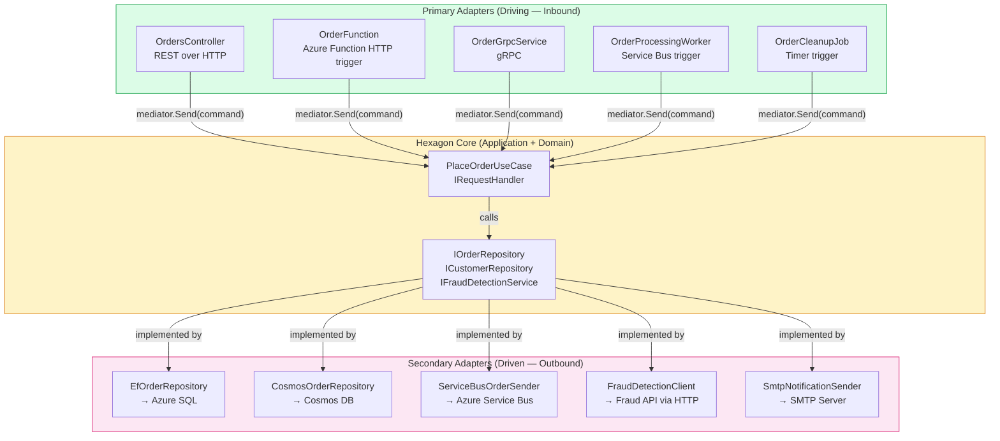
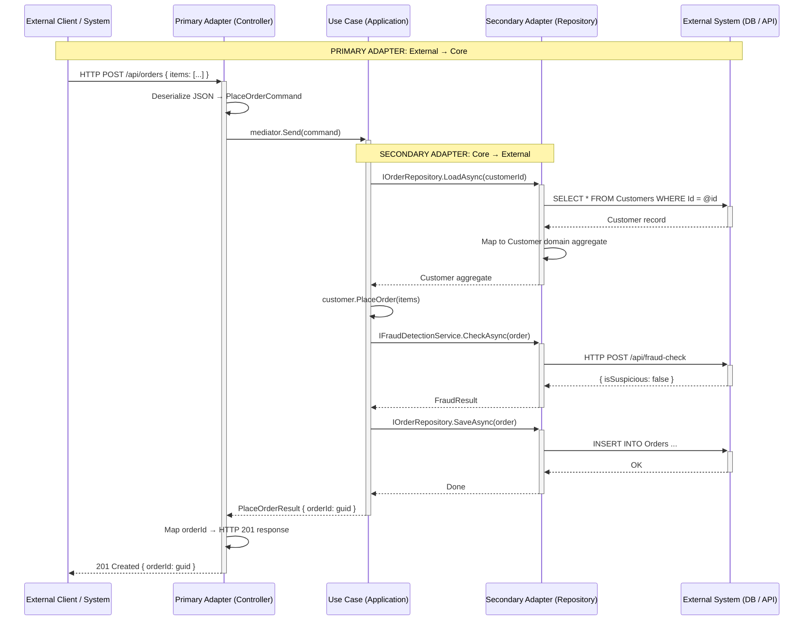
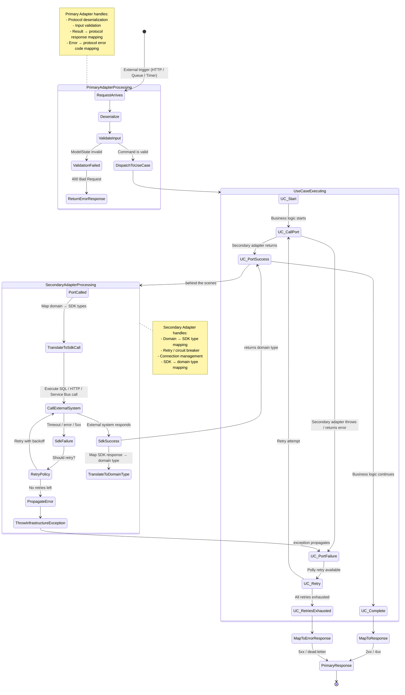
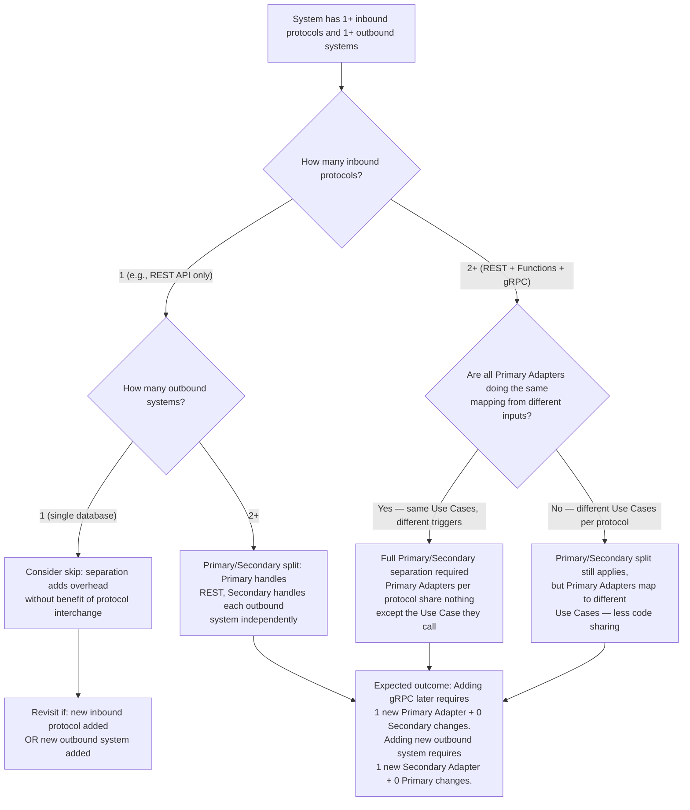

> [!success] Mastery Check
> - [ ] **Studied Well**
> - [ ] **Can explain the concept without notes**
> - [ ] **Can answer interview questions confidently**
> - [ ] **Can implement it in a real project**


> [!ABSTRACT] Quick Reference — Primary vs Secondary Adapters
> **Invariant:** Every external system interaction with the hexagon core is either DRIVING (initiated by the external system → a Primary Adapter receives it and calls a Use Case) or DRIVEN (initiated by the core → a Secondary Adapter is called by a Use Case to reach an external system). Primary Adapters live on the "left side" of the hexagon and translate inbound communication protocols into Use Case calls. Secondary Adapters live on the "right side" and translate Use Case calls into outbound communication protocols.
> **Cost:** Each external communication protocol (HTTP, gRPC, Azure Functions, Service Bus message consumption) requires its own Primary Adapter that maps protocol-specific concepts (HTTP status codes, gRPC trailers, message deserialization) to the common Application DTOs. Each external system requires its own Secondary Adapter that maps Application port interfaces to SDK-specific calls.
> **Trigger:** When a new external trigger type is added (e.g., adding Azure Function consumption alongside existing REST API) or a new outbound integration is needed (e.g., adding a fraud detection API call alongside existing persistence).
> **Skip When:** The system has exactly ONE inbound protocol and ONE outbound system — splitting adapters into primary/secondary categories adds organizational complexity without immediate benefit.
> **.NET Entry Point:** `IMediator`/`ISender` (Primary Adapter → Use Case) / `IOrderRepository` implemented by Secondary Adapter / `Program.cs` DI registration for both sides
> **Azure Native:** Azure Functions trigger = Primary Adapter / `ServiceBusSender` wrapped by Secondary Adapter / `HttpClient` in Secondary Adapter for external APIs
> **Number to Know:** A well-formed hexagonal system has 1 Primary Adapter per inbound protocol (REST, gRPC, Azure Function, message consumer) and 1 Secondary Adapter per outbound external system (database, message broker, email, external API). For 1 inbound protocol and 3 outbound systems = 4 adapters total. For 3 inbound protocols and 5 outbound systems = 8 adapters total.

## Navigation

**Domain:** [[7 — System Design & Distributed Systems]] > **Group:** Clean Architecture
**Previous:** [[7.011 — Hexagonal Architecture — Ports and Adapters]] | **Next:** [[7.013 — Onion Architecture — Comparison with Clean Architecture]]

### Prerequisites
- [[7.011 — Hexagonal Architecture — Ports and Adapters]] — this note is the FOUNDATION; understanding that Ports are interfaces in the Application layer and Adapters are implementations in Infrastructure is required. Primary vs Secondary is the further categorization of adapters by direction.
- [[7.001 — Clean Architecture — The Dependency Rule]] — the distinction between Primary and Secondary adapters maps to the Dependency Rule direction: Primary Adapters depend on the core (inbound), Secondary Adapters are depended ON by the core (outbound).
- [[7.003 — Clean Architecture — Application Layer — Use Cases]] — Use Cases are the CENTRAL ORCHESTRATOR in the middle; Primary Adapters feed them, Secondary Adapters serve them. Understanding a Use Case's dependencies shows how both adapter types connect.

### Where This Fits

> [!INFO] Production Encounter Map
> - **Layer:** Cross-cutting — Primary Adapters at the system boundary (Presentation/Infrastructure inbound), Secondary Adapters at the external system boundary (Infrastructure outbound)
> - **Trigger:** When the team needs to ADD a second inbound protocol (REST API + Azure Function consuming the same Use Case) or when a Secondary Adapter's external system changes (e.g., swapping fraud API provider)
> - **Without it:** The REST controller and the Azure Function each duplicate the mapping logic. Or worse: the Azure Function directly calls EF Core instead of going through the Use Case — the Use Case is bypassed and business rules are not enforced.
> - **First signal:** Copy-pasted mapping code between two controller classes that both call `mediator.Send()` with the same command. Or duplicated connection string loading between two different adapter files.

Primary and Secondary Adapters are distinguished by the DIRECTION of initiation. A Primary Adapter is triggered by an EXTERNAL actor (HTTP request, queue message, scheduled timer) and CALLS INTO the core through a Use Case port. A Secondary Adapter is CALLED BY the core through a driven port (repository interface, message sender interface, external service interface) and performs the actual outbound communication. The same protocol can appear on both sides — message consumption (Primary) vs message sending (Secondary), HTTP request receiving (Primary) vs HTTP request making (Secondary). The distinction is direction, not technology.

## Core Mental Model

Primary and Secondary adapters are separated by who initiates the conversation:

```
External World → [Primary Adapter] → Core (Use Case) → [Secondary Adapter] → External System
   (inbound trigger)    (driving)      (no deps on adapters)    (driven)       (outbound call)
```

**Primary Adapters (Driving):**
- Initiated by an external actor (user, system, timer)
- Depend on the Application layer (they call Use Cases via `IMediator` or `ISender`)
- Translate protocol-specific input (HTTP request body, gRPC message, Service Bus message, TimerInfo) into Application DTOs (commands, queries)
- Translate Use Case results into protocol-specific output (HTTP response, gRPC response, Service Bus outcome, function return value)
- Testing strategy: integration tests with `WebApplicationFactory` for HTTP, `ServiceBusTriggerFunction` test infrastructure for Azure Functions
- Examples: `OrdersController`, `OrderFunction`, `OrderGrpcService`, `OrderProcessingWorker`

**Secondary Adapters (Driven):**
- Initiated by the core (Use Case calls a port method)
- Implement port interfaces defined in the Application layer
- Translate Application-level port calls into SDK-specific calls (EF Core, Azure SDK, HttpClient)
- Own infrastructure concerns: connection management, retry policies, serialization, error mapping
- Testing strategy: unit tests with mocked ports for Use Cases, integration tests with Testcontainers for real infrastructure
- Examples: `EfOrderRepository`, `ServiceBusOrderSender`, `FraudDetectionClient`, `SmtpNotificationSender`

The critical architectural rule: **Primary Adapters reference the Application layer but NOT Use Cases directly — they reference Use Case interfaces (like `IRequestHandler<TCommand, TResult>` through MediatR). Secondary Adapters implement Application layer interfaces.**

> [!TIP] The Non-Obvious Insight
> The most misunderstood aspect of the Primary/Secondary split is that an adapter's CATEGORY is determined by who OWNS the port interface, not by the technology. A Primary Adapter's port is owned by THE ADAPTER — the Adapter defines what command DTOs it sends and calls `mediator.Send(command)`. A Secondary Adapter's port is owned by THE APPLICATION — the Application defines the interface, and the Adapter implements it. This means Primary Adapters are "protocol translators" that call the core, while Secondary Adapters are "protocol implementors" that are called BY the core. This distinction has a profound testing consequence: you test Primary Adapters by sending a protocol message and asserting the response (integration test), but you test Secondary Adapters by calling the port interface and asserting the external system was called correctly (unit test with mocked external dependency).

### Classification

- **Consistency axis:** N/A — architectural classification pattern
- **Availability tradeoff:** N/A — affects test strategy and deployment boundaries, not runtime availability
- **Latency impact:** Primary Adapter deserialization + Secondary Adapter serialization adds ~0.05–0.5ms per boundary — dominated by I/O
- **Failure domain:** Primary Adapter failures = inbound protocol failures (HTTP 4xx, function retry). Secondary Adapter failures = outbound external system failures (timeout, retry)
- **Abstraction layer:** Pattern — architectural design-time categorization

### Primary Diagram



### Supporting Diagram



### Numbers That Matter

| Metric | Value | Context / Conditions |
|---|---|---|
| Primary Adapter deserialization overhead | ~0.01–0.1ms | JSON deserialization of typical command (10–50 fields) |
| Secondary Adapter serialization overhead | ~0.01–0.1ms | Domain → EF Core entity mapping or Service Bus message creation |
| Primary Adapter test setup time (WebApplicationFactory) | ~2–5s first test, ~0.5s subsequent | ASP.NET Core integration test infrastructure |
| Secondary Adapter test setup time (Testcontainers) | ~30–60s per container first start, cached | Docker container lifecycle for SQL, Service Bus emulator |
| Adapter count growth per new protocol | +1 Primary per inbound protocol, +1 Secondary per outbound system | Linear — no combinatorial explosion |
| Percentage of adapter code that is "mapping boilerplate" | ~60–70% | Serialization, deserialization, protocol translation — not business logic |
| Cost difference: Primary vs Secondary failure handling | Primary: return 4xx/5xx to caller. Secondary: retry, circuit break, dead-letter | Primary failures are the caller's problem; Secondary failures are the system's problem |

### Key Properties / Guarantees

| Property | Value | Condition |
|---|---|---|
| Primary Adapter isolation | Each inbound protocol has its OWN adapter — change a protocol without affecting other adapters | Protocol boundaries are cleanly separated at the adapter level |
| Secondary Adapter swapability | Swap one Secondary Adapter without changing Use Cases | Port interface is technology-neutral and stable |
| Use Case protocol ignorance | Use Case does not know if caller came via HTTP, gRPC, or queue | Primary Adapter handles all protocol concerns before the Use Case |
| Failures by direction | Primary failures → client visible. Secondary failures → system degraded | Determined by which side of the hexagon the adapter sits on |
| Duplication across Primary Adapters | Each Primary Adapter duplicates command creation + result mapping | 3 Primary Adapters = 3 places that create the same command from different inputs |

## Deep Mechanics

### How It Works

**Primary Adapter Flow (REST Controller as example):**

1. HTTP request arrives at the ASP.NET Core middleware pipeline — routing middleware selects the controller action.
2. ASP.NET Core model binding deserializes the HTTP request body and route parameters into a command DTO: `PlaceOrderCommand`. Model validation attributes (`[Required]`, `[Range]`) are evaluated — invalid models return 400 before the controller action executes.
3. The controller action method receives the validated command. The method is minimal — typically 3–5 lines: validate model state, call `mediator.Send(command)`, map result to HTTP response.
4. `mediator.Send(command)` dispatches the command to the registered `IRequestHandler<PlaceOrderCommand, Result<PlaceOrderResult>>` — the Use Case in the Application layer.
5. The Use Case executes business logic and returns a `Result<PlaceOrderResult>`.
6. The controller maps the result: `result.Match(success => Created(success), error => error switch { ... })`.
7. ASP.NET Core serializes the response to JSON and returns the HTTP response.

**Secondary Adapter Flow (EF Core Repository as example):**

1. The Use Case calls `await _repository.GetByIdAsync(orderId, ct)` — this is a call to the `IOrderRepository` port interface.
2. The DI-resolved implementation `EfOrderRepository.GetByIdAsync` executes.
3. The adapter loads data from Azure SQL via EF Core: `_context.Orders.Include(o => o.LineItems).FirstOrDefaultAsync(...)`.
4. The adapter maps the EF Core entity (`OrderEntity`) to the domain aggregate (`Order`) using its own mapping method: `entity.ToDomain()`.
5. The adapter returns the domain aggregate to the Use Case.
6. If the SQL call fails, the adapter (or Polly decorator) handles retry. If retries are exhausted, the exception propagates through the Use Case to the Primary Adapter's exception handler.

**The symmetry:** Both adapter types TRANSLATE. Primary Adapters translate protocol → command DTO and result → protocol response. Secondary Adapters translate port method → SDK call and SDK response → domain type. The core (Use Cases + Domain) never translates — it only works in its own type system.

### Protocol Trace

```
Primary Adapter — HTTP Request Flow:

Happy Path:
  1. HTTP Client → [ASP.NET Core]: POST /api/orders { "customerId": "a1b2", "items": [...] } (~1ms WAN)
  2. ASP.NET Core → [Controller]: Model-bound PlaceOrderCommand (~0.05ms deserialization)
  3. Controller → [MediatR]: mediator.Send(command) (~0.01ms dispatch)
  4. MediatR → [PlaceOrderUseCase]: Handle(PlaceOrderCommand) (~0.001ms resolve)
  5. Use Case → [IOrderRepository]: Port method call — adapter handles the rest
  6. [IOrderRepository] → Use Case: Result<Order>
  7. Use Case → [MediatR]: Result<PlaceOrderResult>
  8. MediatR → [Controller]: Result<PlaceOrderResult>
  9. Controller → [HTTP Response]: 201 Created { orderId: "c3d4" } (~0.05ms serialization)
  Total adapter overhead: ~0.12ms (deserialization + dispatch + serialization)
  Total end-to-end: ~60ms (dominated by I/O in adapter calls)

Failure Path — Command Validation Fails:
  1. HTTP Client → [ASP.NET Core]: POST /api/orders { "customerId": null, "items": null }
  2. ASP.NET Core → [Model Binding]: Command created but ModelState.IsValid == false
  3. Controller → [ASP.NET Core]: Model validation error — controller action NOT called
  4. ASP.NET Core → [HTTP Response]: 400 Bad Request { "errors": { "customerId": ["Required"], "items": ["Required"] } }
  Total: ~0.05ms — validation happens before any business logic

Failure Path — Secondary Adapter Timeout (inside Use Case call):
  1. Use Case → [IOrderRepository]: GetByIdAsync(customerId)
  2. EfOrderRepository → [Azure SQL]: SELECT ... (timeout after 30s)
  3. Polly retry 1 → [Azure SQL]: 30s timeout, retry 2, retry 3 → all timeout
  4. Polly → RetryExhaustedException after ~90s
  5. Use Case → exception propagates to MediatR pipeline behavior
  6. TransactionBehavior → logs exception, returns Result.Failure
  7. Controller → [HTTP Response]: 503 Service Unavailable { retryAfter: "30" }
  Total primary adapter overhead: ~0.12ms
  Total end-to-end: ~90s (dominated by retries in Secondary Adapter)
```

### State Transitions



### Failure Modes

**Failure Mode 1: Primary Adapter Skips Use Case — Direct Infrastructure Call**

- **Cause:** A controller or Azure Function directly calls a Secondary Adapter (e.g., `_dbContext.Orders.ToListAsync()`) instead of going through the Use Case. Business logic is bypassed.
- **Symptom:** The endpoint returns data that should have been filtered by business rules. For example, a controller returns ALL orders including cancelled ones because the Use Case's "exclude cancelled" logic was skipped.
- **Detection time:** When a business rule changes (e.g., "show only active orders") but the controller endpoint still returns cancelled orders because the change was only applied to the Use Case, not the direct controller call.
- **Blast radius:** Every controller that bypasses the Use Case creates a maintenance trap — future business rule changes must be applied in multiple places.

> [!DANGER] 3 AM Production Signal
> Metric: `http_responses_total{endpoint="/api/orders", bypass_use_case="true"} > 0` — requires manual label injection to detect
> Log: `ERROR [OrdersController] Direct DbContext call detected: 'Orders' DbSet queried outside Use Case | CorrelationId: a4f2-...`
> Customer impact: Customer service reports "user sees cancelled orders on their dashboard" after business rules were updated to hide cancellations.

**Failure Mode 2: Primary Adapter Leaks Domain Exceptions — No Error Mapping**

- **Cause:** The controller catches exceptions and returns generic error responses instead of mapping specific domain errors to specific HTTP status codes. The Primary Adapter does not translate the Use Case's Result type into a protocol-meaningful response.
- **Symptom:** Every business rule violation returns 400 Bad Request with "An error occurred." The API consumer cannot differentiate "credit limit exceeded" from "customer not found" from "insufficient stock."
- **Detection time:** Frontend developer asks "which 400 means the credit card was declined?" or mobile app shows "Something went wrong" for every payment failure.
- **Blast radius:** Every API consumer must parse error messages (string comparison on human-readable text) to differentiate error codes — fragile and localization-hostile.

> [!DANGER] 3 AM Production Signal
> Metric: `http_responses_400_total{endpoint="/api/orders", error_mapped="false"} > 10/min`
> Log: `WARN [OrdersController] Unmapped application error: 'CREDIT_LIMIT_EXCEEDED' returned as generic 400`
> Customer impact: Users see "Invalid request" when their credit card is declined — they retry with the same card, fail again, file support ticket.

### .NET and Azure Integration Points

- **ASP.NET Core Controllers:** The canonical Primary Adapter. `[ApiController]` attribute enables automatic model validation. `ControllerBase` methods return `IActionResult` or `ActionResult<T>`. Injection of `IMediator` or `ISender`.
- **Azure Functions:** Primary Adapter via trigger attributes. `[HttpTrigger]`, `[ServiceBusTrigger]`, `[TimerTrigger]`, `[EventHubTrigger]`. Function methods accept `HttpRequestData`, `ServiceBusReceivedMessage`, `TimerInfo`, etc.
- **gRPC ASP.NET Core:** Primary Adapter via `protobuf-net.Grpc` or `Grpc.AspNetCore.Server`. Service classes inherit from `xxxBase` and call Use Cases.
- **Background Workers:** `BackgroundService` or `IHostedService` as Primary Adapter. `ExecuteAsync` loop polls a queue or timer and calls Use Cases.
- **Polly:** Applied INSIDE Secondary Adapters for retry, circuit breaker, timeout. Never in Primary Adapters (retries at the protocol level are the caller's responsibility).
- **Azure SDK Clients:** Wrapped by Secondary Adapters. `BlobContainerClient`, `ServiceBusSender`, `TableClient`, `CosmosClient` — all behind port interfaces.

```csharp
// Primary Adapter — ASP.NET Core Controller
// Presentation/Controllers/OrdersController.cs
namespace YourCompany.OrderManagement.Presentation.Controllers;

[ApiController]
[Route("api/[controller]")]
public sealed class OrdersController : ControllerBase
{
    private readonly ISender _sender; // MediatR — Use Case dispatcher

    public OrdersController(ISender sender)
    {
        _sender = sender ?? throw new ArgumentNullException(nameof(sender));
    }

    [HttpPost]
    public async Task<IActionResult> PlaceOrder(
        [FromBody] PlaceOrderRequest request,
        CancellationToken cancellationToken)
    {
        var command = new PlaceOrderCommand(
            request.CustomerId,
            request.Items.Select(i => new OrderItemDto(i.ProductId, i.Quantity, i.UnitPrice)).ToList(),
            request.IdempotencyKey);

        var result = await _sender.Send(command, cancellationToken);

        return result.Match<IActionResult>(
            success => Created($"/api/orders/{success.OrderId}", success),
            error => error switch
            {
                ApplicationError.CustomerNotFound e => NotFound(new ProblemDetails
                {
                    Status = 404,
                    Title = "Customer not found",
                    Detail = $"Customer {e.CustomerId} was not found."
                }),
                ApplicationError.InsufficientStock e => UnprocessableEntity(new ProblemDetails
                {
                    Status = 422,
                    Title = "Insufficient stock",
                    Detail = $"Items unavailable: {string.Join(", ", e.UnavailableItems)}"
                }),
                ApplicationError.CreditLimitExceeded e => UnprocessableEntity(new ProblemDetails
                {
                    Status = 422,
                    Title = "Credit limit exceeded",
                    Detail = $"Order total ${e.CurrentTotal} exceeds limit ${e.Limit}."
                }),
                _ => StatusCode(500, new ProblemDetails
                {
                    Status = 500,
                    Title = "Internal server error",
                    Detail = "An unexpected error occurred."
                })
            });
    }
}

// Secondary Adapter — EF Core Repository
// Infrastructure/Persistence/Repositories/EfOrderRepository.cs
namespace YourCompany.OrderManagement.Infrastructure.Persistence.Repositories;

public sealed class EfOrderRepository : IOrderRepository
{
    private readonly OrderDbContext _context;

    public EfOrderRepository(OrderDbContext context)
    {
        _context = context ?? throw new ArgumentNullException(nameof(context));
    }

    public async Task<Order?> GetByIdAsync(Guid orderId, CancellationToken cancellationToken)
    {
        var entity = await _context.Orders
            .Include(o => o.LineItems)
            .AsSplitQuery()
            .FirstOrDefaultAsync(o => o.Id == orderId, cancellationToken);

        return entity?.ToDomain(); // Adapter-owned mapping
    }

    public async Task SaveAsync(Order order, CancellationToken cancellationToken)
    {
        var existing = await _context.Orders
            .Include(o => o.LineItems)
            .FirstOrDefaultAsync(o => o.Id == order.Id, cancellationToken);

        if (existing is null)
            _context.Orders.Add(order.ToEntity());
        else
        {
            _context.Entry(existing).CurrentValues.SetValues(order);
            existing.UpdateLineItems(order.LineItems);
        }
    }
}
```

## Production Patterns and Implementation

### Primary Implementation — Two Primary Adapters for One Use Case

```csharp
// ===========================================================
// Primary Adapter 1 — REST Controller
// Presentation/Controllers/OrdersController.cs
// ===========================================================
namespace YourCompany.OrderManagement.Presentation.Controllers;

[ApiController]
[Route("api/[controller]")]
public sealed class OrdersController : ControllerBase
{
    private readonly ISender _sender;

    public OrdersController(ISender sender)
    {
        _sender = sender ?? throw new ArgumentNullException(nameof(sender));
    }

    [HttpPost]
    [ProducesResponseType(typeof(PlaceOrderResponse), StatusCodes.Status201Created)]
    [ProducesResponseType(typeof(ProblemDetails), StatusCodes.Status400BadRequest)]
    [ProducesResponseType(typeof(ProblemDetails), StatusCodes.Status422UnprocessableEntity)]
    public async Task<IActionResult> PlaceOrder(
        [FromBody] PlaceOrderRequest request,
        CancellationToken cancellationToken)
    {
        // Primary Adapter responsibility: translate HTTP → command DTO
        var command = new PlaceOrderCommand(
            CustomerId: request.CustomerId,
            Items: request.Items.Select(i => new OrderItemDto(i.ProductId, i.Quantity, i.UnitPrice)).ToImmutableList(),
            IdempotencyKey: request.IdempotencyKey);

        var result = await _sender.Send(command, cancellationToken);

        // Primary Adapter responsibility: translate result → HTTP response
        return result.Match<IActionResult>(
            success => Created($"/api/orders/{success.OrderId}", new PlaceOrderResponse(success.OrderId)),
            error => error switch
            {
                ApplicationError.NotFound e => NotFound(new ProblemDetails { Status = 404, Title = e.Message }),
                ApplicationError.Conflict e => Conflict(new ProblemDetails { Status = 409, Title = e.Message }),
                ApplicationError.Validation e => UnprocessableEntity(new ProblemDetails { Status = 422, Title = e.Message }),
                _ => StatusCode(500, new ProblemDetails { Status = 500, Title = "Internal error" })
            });
    }
}

// ===========================================================
// Primary Adapter 2 — Azure Function (HTTP trigger)
// Presentation/Functions/PlaceOrderFunction.cs
// ===========================================================
namespace YourCompany.OrderManagement.Presentation.Functions;

public sealed class PlaceOrderFunction
{
    private readonly ISender _sender;

    public PlaceOrderFunction(ISender sender)
    {
        _sender = sender ?? throw new ArgumentNullException(nameof(sender));
    }

    [FunctionName("PlaceOrder")]
    public async Task<IActionResult> Run(
        [HttpTrigger(AuthorizationLevel.Function, "post", Route = "orders")] HttpRequest req,
        ILogger log,
        CancellationToken cancellationToken)
    {
        // Primary Adapter responsibility: translate Function HTTP input → command DTO
        var request = await req.ReadFromJsonAsync<PlaceOrderRequest>(cancellationToken);
        if (request is null)
            return new BadRequestObjectResult(new ProblemDetails { Status = 400, Title = "Invalid request body" });

        var command = new PlaceOrderCommand(
            CustomerId: request.CustomerId,
            Items: request.Items.Select(i => new OrderItemDto(i.ProductId, i.Quantity, i.UnitPrice)).ToImmutableList(),
            IdempotencyKey: request.IdempotencyKey);

        var result = await _sender.Send(command, cancellationToken);

        // Primary Adapter responsibility: translate result → IActionResult
        return result.Match<IActionResult>(
            success => new CreatedResult($"/api/orders/{success.OrderId}", new PlaceOrderResponse(success.OrderId)),
            error => error switch
            {
                ApplicationError.NotFound e => new NotFoundObjectResult(new ProblemDetails { Status = 404, Title = e.Message }),
                ApplicationError.Conflict e => new ConflictObjectResult(new ProblemDetails { Status = 409, Title = e.Message }),
                ApplicationError.Validation e => new UnprocessableEntityObjectResult(new ProblemDetails { Status = 422, Title = e.Message }),
                _ => new ObjectResult(new ProblemDetails { Status = 500, Title = "Internal error" }) { StatusCode = 500 }
            });
    }
}

// ===========================================================
// Secondary Adapter — EF Core Repository
// Infrastructure/Persistence/Repositories/EfOrderRepository.cs
// ===========================================================
namespace YourCompany.OrderManagement.Infrastructure.Persistence.Repositories;

public sealed class EfOrderRepository : IOrderRepository
{
    private readonly OrderDbContext _context;
    private static readonly ResiliencePipeline _pipeline = new ResiliencePipelineBuilder()
        .AddRetry(new RetryStrategyOptions
        {
            MaxRetryAttempts = 3,
            Delay = TimeSpan.FromMilliseconds(200),
            BackoffType = DelayBackoffType.Exponential,
            UseJitter = true
        })
        .AddCircuitBreaker(new CircuitBreakerStrategyOptions
        {
            FailureRatio = 0.5,
            SamplingDuration = TimeSpan.FromSeconds(30),
            MinimumThroughput = 8,
            BreakDuration = TimeSpan.FromSeconds(60)
        })
        .Build();

    public EfOrderRepository(OrderDbContext context)
    {
        _context = context ?? throw new ArgumentNullException(nameof(context));
    }

    public async Task<Order?> GetByIdAsync(Guid orderId, CancellationToken cancellationToken)
    {
        // Secondary Adapter responsibility: translate domain call → SDK call with resilience
        return await _pipeline.ExecuteAsync(async ct =>
        {
            var entity = await _context.Orders
                .Include(o => o.LineItems)
                .AsSplitQuery()
                .FirstOrDefaultAsync(o => o.Id == orderId, ct);

            return entity?.ToDomain();
        }, cancellationToken);
    }

    public async Task SaveAsync(Order order, CancellationToken cancellationToken)
    {
        await _pipeline.ExecuteAsync(async ct =>
        {
            var existing = await _context.Orders
                .Include(o => o.LineItems)
                .FirstOrDefaultAsync(o => o.Id == order.Id, ct);

            if (existing is null)
                _context.Orders.Add(order.ToEntity());
            else
            {
                _context.Entry(existing).CurrentValues.SetValues(order);
                existing.UpdateLineItems(order.LineItems);
            }

            await _context.SaveChangesAsync(ct);
        }, cancellationToken);
    }
}

// ===========================================================
// Secondary Adapter — External API Client
// Infrastructure/FraudDetection/FraudDetectionClient.cs
// ===========================================================
namespace YourCompany.OrderManagement.Infrastructure.FraudDetection;

public sealed class FraudDetectionClient : IFraudDetectionService
{
    private readonly HttpClient _httpClient;
    private static readonly ResiliencePipeline _pipeline = new ResiliencePipelineBuilder()
        .AddRetry(new RetryStrategyOptions
        {
            MaxRetryAttempts = 2,
            Delay = TimeSpan.FromMilliseconds(100),
            BackoffType = DelayBackoffType.Exponential
        })
        .AddTimeout(TimeSpan.FromSeconds(5))
        .Build();

    public FraudDetectionClient(HttpClient httpClient)
    {
        _httpClient = httpClient ?? throw new ArgumentNullException(nameof(httpClient));
    }

    public async Task<FraudResult> CheckAsync(Order order, CancellationToken cancellationToken)
    {
        return await _pipeline.ExecuteAsync(async ct =>
        {
            var response = await _httpClient.PostAsJsonAsync("/api/fraud-check",
                new { OrderId = order.Id, CustomerId = order.CustomerId, TotalAmount = order.TotalAmount }, ct);
            response.EnsureSuccessStatusCode();
            return (await response.Content.ReadFromJsonAsync<FraudResult>(ct))!;
        }, cancellationToken);
    }
}
```

### IServiceCollection Registration

```csharp
// Program.cs — Composition Root wires Primary and Secondary adapters
var builder = WebApplication.CreateBuilder(args);

// Driving (Primary) Adapters — depend on the core
builder.Services.AddControllers();                                  // REST controllers
builder.Services.AddMediatR(cfg =>
    cfg.RegisterServicesFromAssemblyContaining<PlaceOrderUseCase>()); // Use Case dispatch

// Driven (Secondary) Adapters — implement port interfaces
builder.Services.AddScoped<IOrderRepository, EfOrderRepository>();
builder.Services.AddScoped<ICustomerRepository, EfCustomerRepository>();
builder.Services.AddScoped<IFraudDetectionService, FraudDetectionClient>();
builder.Services.AddScoped<IOrderMessageSender, ServiceBusOrderSender>();
builder.Services.AddScoped<INotificationSender, SmtpNotificationSender>();

// Infrastructure registration
builder.Services.AddDbContext<OrderDbContext>(options =>
    options.UseSqlServer(builder.Configuration.GetConnectionString("OrderManagementDb")));
builder.Services.AddHttpClient<FraudDetectionClient>(client =>
{
    client.BaseAddress = new Uri(builder.Configuration["FraudDetection:BaseUrl"]!);
    client.DefaultRequestHeaders.Add("X-Api-Key", builder.Configuration["FraudDetection:ApiKey"]);
});

var app = builder.Build();
app.MapControllers();
app.Run();
```

### Common Variants

```csharp
// Variant A — Primary Adapter as Background Worker (Service Bus trigger)
// Infrastructure/Workers/OrderProcessingWorker.cs
namespace YourCompany.OrderManagement.Infrastructure.Workers;

public sealed class OrderProcessingWorker : BackgroundService
{
    private readonly IServiceScopeFactory _scopeFactory;
    private readonly ILogger<OrderProcessingWorker> _logger;

    public OrderProcessingWorker(IServiceScopeFactory scopeFactory, ILogger<OrderProcessingWorker> logger)
    {
        _scopeFactory = scopeFactory;
        _logger = logger;
    }

    protected override async Task ExecuteAsync(CancellationToken stoppingToken)
    {
        var processor = new ServiceBusProcessor(/* ... */);
        processor.ProcessMessageAsync += async args =>
        {
            using var scope = _scopeFactory.CreateScope();
            var sender = scope.ServiceProvider.GetRequiredService<ISender>();

            var message = args.Message.Body.ToObjectFromJson<OrderSubmittedEvent>();
            var command = new ProcessSubmittedOrderCommand(message.OrderId);

            var result = await sender.Send(command, stoppingToken);
            if (result.IsSuccess)
                await args.CompleteMessageAsync(args.Message, stoppingToken);
            else
                await args.DeadLetterMessageAsync(args.Message, "ProcessingFailed",
                    result.Error.Message, stoppingToken);
        };

        await processor.StartProcessingAsync(stoppingToken);
        await Task.Delay(Timeout.Infinite, stoppingToken);
    }
}

// Variant B — Secondary Adapter as Decorator Composition (Caching + Repository)
// Infrastructure/Persistence/Decorators/CachedOrderRepository.cs
public sealed class CachedOrderRepository : IOrderRepository
{
    private readonly IOrderRepository _inner;       // The real EfOrderRepository
    private readonly IDistributedCache _cache;
    private static readonly TimeSpan CacheDuration = TimeSpan.FromMinutes(10);

    public CachedOrderRepository(IOrderRepository inner, IDistributedCache cache)
    {
        _inner = inner;
        _cache = cache;
    }

    public async Task<Order?> GetByIdAsync(Guid orderId, CancellationToken ct)
    {
        var cacheKey = $"order:{orderId}";
        var cached = await _cache.GetStringAsync(cacheKey, ct);
        if (cached is not null) return JsonSerializer.Deserialize<Order>(cached);

        var order = await _inner.GetByIdAsync(orderId, ct);
        if (order is not null)
            await _cache.SetStringAsync(cacheKey, JsonSerializer.Serialize(order),
                new DistributedCacheEntryOptions { AbsoluteExpirationRelativeToNow = CacheDuration }, ct);
        return order;
    }

    public async Task SaveAsync(Order order, CancellationToken ct)
    {
        await _inner.SaveAsync(order, ct);
        await _cache.RemoveAsync($"order:{order.Id}", ct);
    }
}
// DI: services.TryAddScoped<IOrderRepository>(sp =>
//     new CachedOrderRepository(sp.GetRequiredService<EfOrderRepository>(), sp.GetRequiredService<IDistributedCache>()));
```

### Performance Profile

```csharp
[MemoryDiagnoser]
[SimpleJob(RuntimeMoniker.Net80)]
public class AdapterDispatchBenchmark
{
    private ISender _sender;
    private IOrderRepository _repository;
    private PlaceOrderCommand _command;
    private Order _order;

    [Params(10, 100, 1000)]
    public int PayloadSize { get; set; }

    [GlobalSetup]
    public void Setup()
    {
        _command = new PlaceOrderCommand(Guid.NewGuid(),
            Enumerable.Range(0, PayloadSize).Select(i => new OrderItemDto(Guid.NewGuid(), i, 10m)).ToImmutableList(),
            Guid.NewGuid().ToString());

        var services = new ServiceCollection();
        services.AddMediatR(cfg => cfg.RegisterServicesFromAssemblyContaining<PlaceOrderUseCase>());
        services.AddScoped<IOrderRepository>(_ => new InMemoryOrderRepository());
        services.AddScoped<ICustomerRepository>(_ => new InMemoryCustomerRepository());
        services.AddScoped<IFraudDetectionService>(_ => new AlwaysAllowFraudDetection());
        services.AddScoped<IUnitOfWork>(_ => new NoOpUnitOfWork());
        var provider = services.BuildServiceProvider();
        _sender = provider.GetRequiredService<ISender>();
        _repository = provider.GetRequiredService<IOrderRepository>();

        _order = Order.Create(Guid.NewGuid(), new List<OrderItem> { new(Guid.NewGuid(), 100m, 2) }).Value!;
    }

    [Benchmark(Baseline = true)]
    public async Task<object?> PrimaryAdapterFlow()
    {
        // Simulates controller → mediator → Use Case → port → adapter
        return await _sender.Send(_command, CancellationToken.None);
    }

    [Benchmark]
    public async Task<Order?> SecondaryAdapterFlow()
    {
        // Simulates Use Case → port → adapter → external system
        await _repository.SaveAsync(_order, CancellationToken.None);
        return await _repository.GetByIdAsync(_order.Id, CancellationToken.None);
    }
}
```

Expected results (estimated — adapter overhead is dominated by MediatR reflection and JSON):

| Method | Mean | Allocated | Improvement |
|---|---|---|---|
| PrimaryAdapterFlow (MediatR dispatch) | ~0.05–0.15ms | ~5–15 KB | baseline (dominated by MediatR pipeline) |
| SecondaryAdapterFlow (in-memory repo) | ~0.001–0.01ms | ~1–5 KB | ~10x faster — no pipeline, direct call |

### Real-World .NET Ecosystem Mapping

| Pattern in This Note | Where It Appears in .NET / Azure | Manifestation |
|---|---|---|
| Primary Adapter (REST) | `ControllerBase` in ASP.NET Core | Injects `ISender`/`IMediator`, maps command to HTTP response |
| Primary Adapter (Trigger) | Azure Functions `[HttpTrigger]` | Injects `ISender`, maps result to `IActionResult` |
| Primary Adapter (Background) | `BackgroundService` | Creates `IServiceScope`, resolves `ISender` in loop |
| Secondary Adapter (Repository) | EF Core `DbContext` | Implements `IOrderRepository`, maps domain ↔ EF entity |
| Secondary Adapter (Message) | `ServiceBusSender` | Implements `IMessageBusSender`, wraps Azure SDK call |
| Secondary Adapter (HTTP API) | `HttpClient` via `IHttpClientFactory` | Implements `IFraudDetectionService`, makes HTTP calls |
| Decorator over Secondary | `CachedOrderRepository` | Implements same port, wraps another adapter |
| Resilience in Secondary | Polly `ResiliencePipeline` | Applied inside adapter method, never visible to Use Case |

## Gotchas and Production Pitfalls

---

### Pitfall 1: Primary Adapter Performs Business Logic

**Pitfall:** The controller calculates prices, validates business rules, or transforms data beyond deserialization and result mapping. The Primary Adapter leaks into Application responsibility.

```csharp
// ❌ The wrong pattern — controller implements business logic
[HttpPost]
public async Task<IActionResult> PlaceOrder(PlaceOrderRequest request, CancellationToken ct)
{
    // Business logic in Primary Adapter — WRONG
    if (request.Items.Sum(i => i.Quantity * i.UnitPrice) > 10000)
        return UnprocessableEntity("Order exceeds credit limit");

    // Also calculates totals — WRONG
    var total = request.Items.Sum(i => i.Quantity * i.UnitPrice);
    var tax = total * 0.08m;

    var command = new PlaceOrderCommand(/* with calculated total and tax */);
    var result = await _sender.Send(command, ct);
    // ...
}
```

**Symptom:** The business rule "order exceeds credit limit" is checked in the controller AND in the Use Case — they get out of sync when the Use Case changes. The price calculation in the controller produces different totals than the Use Case because the controller uses 8% tax but the Use Case uses localized tax rates.

**Detection time:** When a bug fix applies to the Use Case but the controller still has the old logic — two paths produce different results for the same input.

**Fix:**

```csharp
// ✅ The correct pattern — Primary Adapter only deserializes and dispatches
[HttpPost]
public async Task<IActionResult> PlaceOrder(PlaceOrderRequest request, CancellationToken ct)
{
    var command = new PlaceOrderCommand(
        request.CustomerId,
        request.Items.Select(i => new OrderItemDto(i.ProductId, i.Quantity, i.UnitPrice)).ToImmutableList(),
        request.IdempotencyKey);

    var result = await _sender.Send(command, ct);
    return result.Match<IActionResult>(
        success => Created($"/api/orders/{success.OrderId}", success),
        error => error switch { /* ... */ });
}
```

**Cost of not fixing:** Dual-maintenance: every business rule change must be applied in the Primary Adapter AND the Use Case. Over 2 years, the controller grows to 500+ lines of business logic that belongs in the Domain/Application layer.

---

### Pitfall 2: Secondary Adapter Has No Resilience — Failures Propagate Directly

**Pitfall:** The Secondary Adapter does not implement retry, circuit breaker, or timeout policies. Every transient infrastructure failure propagates directly to the Use Case as an unhandled exception.

```csharp
// ❌ The wrong pattern — no resilience in Secondary Adapter
public sealed class FraudDetectionClient : IFraudDetectionService
{
    private readonly HttpClient _httpClient;

    public async Task<FraudResult> CheckAsync(Order order, CancellationToken ct)
    {
        var response = await _httpClient.PostAsJsonAsync("/api/fraud-check", order, ct);
        response.EnsureSuccessStatusCode();
        return (await response.Content.ReadFromJsonAsync<FraudResult>(ct))!;
    }
}
```

**Symptom:** A 3-second network blip at the fraud API causes 5xx responses for ALL orders during those 3 seconds. The Use Case returns failure, the controller returns 503 — even though retrying would have succeeded.

**Detection time:** Grafana shows a 3-second spike in `http_responses_503_total` that exactly matches a known Azure networking incident.

**Fix:**

```csharp
// ✅ The correct pattern — resilience inside Secondary Adapter
public sealed class FraudDetectionClient : IFraudDetectionService
{
    private readonly HttpClient _httpClient;
    private static readonly ResiliencePipeline _pipeline = new ResiliencePipelineBuilder()
        .AddRetry(new RetryStrategyOptions
        {
            MaxRetryAttempts = 3,
            Delay = TimeSpan.FromMilliseconds(100),
            BackoffType = DelayBackoffType.Exponential,
            UseJitter = true
        })
        .AddCircuitBreaker(new CircuitBreakerStrategyOptions
        {
            FailureRatio = 0.5,
            SamplingDuration = TimeSpan.FromSeconds(30),
            MinimumThroughput = 10,
            BreakDuration = TimeSpan.FromSeconds(30)
        })
        .Build();

    public async Task<FraudResult> CheckAsync(Order order, CancellationToken ct)
    {
        return await _pipeline.ExecuteAsync(async token =>
        {
            var response = await _httpClient.PostAsJsonAsync("/api/fraud-check", order, token);
            response.EnsureSuccessStatusCode();
            return (await response.Content.ReadFromJsonAsync<FraudResult>(token))!;
        }, ct);
    }
}
```

**Cost of not fixing:** Transient failures become customer-facing errors. A 99.9% uptime external API with 3 retries becomes effectively 99.999% uptime — the retries mask the transient blips.

---

### Pitfall 3: Primary Adapter Error Mapping Is Incomplete — Fallthrough to Generic 500

**Pitfall:** The controller maps SOME error types but not all. A new `ApplicationError` variant is added and the controller's error switch does not handle it — falls to the default case and returns 500 Internal Server Error for an expected business outcome.

```csharp
// ❌ The wrong pattern — incomplete error mapping
return result.Match<IActionResult>(
    success => Created($"/api/orders/{success.OrderId}", success),
    error => error switch
    {
        ApplicationError.NotFound e => NotFound(e.Message),
        ApplicationError.Conflict e => Conflict(e.Message),
        // Missing: ApplicationError.Validation → should be 422
        // Missing: ApplicationError.FraudDetected → should be 422
        _ => StatusCode(500, "Internal error") // Falls through for expected errors!
    });
```

**Symptom:** A new "fraud detected" error type is added to the Use Case. The controller's switch doesn't handle it — falls to the default case. The API returns 500 Internal Server Error for "fraud detected," which is an EXPECTED business outcome. The frontend treats 500 as "try again later" — user retries and gets blocked again with 500.

**Detection time:** When the fraud detection team ships their feature and the frontend reports "fraud API is returning 500 errors" — actually it's returning Expected Failure, unmapped.

**Fix:**

```csharp
// ✅ The correct pattern — exhaustive switch with Analyzer warning
return result.Match<IActionResult>(
    success => Created($"/api/orders/{success.OrderId}", success),
    error => error switch
    {
        ApplicationError.NotFound e => NotFound(e.Message),
        ApplicationError.Conflict e => Conflict(e.Message),
        ApplicationError.Validation e => UnprocessableEntity(e.Message),
        ApplicationError.FraudDetected e => UnprocessableEntity(e.Message),
        _ => StatusCode(500, "Internal error") // True 500: infrastructure failure
    });
```

Plus: add a SonarAnalyzer or Roslyn analyzer rule: `S3267` (pattern-matching completeness) to catch unmatched cases at compile time.

**Cost of not fixing:** Every new business error type becomes a production incident until the controller mapping is updated. The incident count equals the number of new `ApplicationError` subtypes added without controller mapping updates.

---

### Pitfall 4: Primary Adapter and Secondary Adapter Share the Same Exception Middleware

**Pitfall:** The global exception handler catches both Primary Adapter errors (validation failures that should be 400) and Secondary Adapter errors (infrastructure failures that should be 503). Both are treated as 500, losing the distinction.

```csharp
// ❌ The wrong pattern — single catch-all exception handler
app.UseExceptionHandler(handler => handler.Run(async context =>
{
    var exception = context.Features.Get<IExceptionHandlerFeature>()!.Error;
    context.Response.StatusCode = 500; // EVERY exception is 500
    await context.Response.WriteAsJsonAsync(new { error = exception.Message });
}));
```

**Symptom:** A validation exception (400) and a SQL timeout exception (503) both return 500. The client cannot distinguish "you sent bad data" from "the server is broken."

**Detection time:** Frontend shows "Something went wrong" for both validation errors and infrastructure failures — user retries valid data, gets same error.

**Fix:**

```csharp
// ✅ The correct pattern — map exception type to HTTP status
app.UseExceptionHandler(handler => handler.Run(async context =>
{
    var exception = context.Features.Get<IExceptionHandlerFeature>()!.Error;
    var (status, title) = exception switch
    {
        ValidationException => (400, "Validation failed"),
        InfrastructureException or TimeoutException => (503, "Service unavailable"),
        _ => (500, "Internal server error")
    };

    context.Response.StatusCode = status;
    await context.Response.WriteAsJsonAsync(new ProblemDetails
    {
        Status = status,
        Title = title,
        Detail = exception.Message,
        Instance = context.Request.Path
    });
}));
```

**Cost of not fixing:** False positives in availability monitoring — 400s counted toward error budget. SLO alerts fire for client errors that are the caller's fault.

---

### Pitfall 5: Primary Adapter Uses Secondary Adapter Types — Cross-Adapter Contamination

**Pitfall:** The controller imports types from Infrastructure or references secondary adapter concerns like `OrderDbContext`, `ServiceBusSender`, or `BlobClient`.

**Symptom:** The controller method has `using YourCompany.OrderManagement.Infrastructure.Persistence;` at the top. The `PlaceOrderFunction` directly instantiates `EfOrderRepository`. The primary adapter bypasses the port and uses secondary adapter types directly.

**Detection time:** Code review: `using Infrastructure;` in the Presentation project.

**Fix:** Enforce the reference topology at the project level:

```xml
<!-- Presentation.csproj — should reference Application and Infrastructure DI extension only -->
<ProjectReference Include="..\Application\Application.csproj" />
<ProjectReference Include="..\Infrastructure\Infrastructure.csproj" />
<!-- NEVER: <ProjectReference Include="..\Infrastructure\Persistence\Persistence.csproj" /> -->
```

Add a Roslyn analyzer that flags any `using` statement in Presentation that references Infrastructure types that are NOT DI extension classes.

**Cost of not fixing:** Presentation references Infrastructure types → Presentation compiles against Infrastructure → an Infrastructure change forces recompilation of Presentation → deployment of Infrastructure-only changes requires Presentation DLL swap.

---

### Pitfall 6: Secondary Adapter Returns Infrastructure Types Through Port Interface

**Pitfall:** The port interface `IOrderRepository` is defined in Application. The Secondary Adapter's implementation returns an EF Core entity or a `IQueryable<T>` from the method — leaking the ORM through the port.

**Symptom:** The Use Case calls `repository.GetByIdAsync(id)` and receives an EF Core entity. It then calls `.Include()` on it (which is an EF Core method). The Use Case depends on EF Core despite the port abstraction.

**Detection time:** The first time the Use Case uses an EF Core extension method (`Include`, `ThenInclude`, `AsNoTracking`) on a port return value.

**Fix:**

```csharp
// ✅ The correct pattern — port returns domain types only
public interface IOrderRepository
{
    Task<Order?> GetByIdAsync(Guid orderId, CancellationToken ct);
    Task SaveAsync(Order order, CancellationToken ct);
    // NOT: IQueryable<Order> GetQueryable();
    // NOT: Task<OrderEntity?> GetByIdAsync(Guid orderId, CancellationToken ct);
}
```

If the Use Case needs query flexibility, define separate query-specific ports:

```csharp
public interface IOrderQueries
{
    Task<IReadOnlyList<OrderSummary>> SearchOrdersAsync(string searchTerm, int page, int size, CancellationToken ct);
    // Returns DTOs, not IQueryable<Order>
}
```

**Cost of not fixing:** The port ceases to be an abstraction — it is a leaky facade over EF Core. Every Use Case that consumes the port has an implicit EF Core dependency. Swapping to Cosmos DB requires rewriting every Use Case that uses `IQueryable<T>` operations.

---

### Pitfall 7: No Dedicated Secondary Adapter for Health Checks — Infrastructure Status Exposed Through Business Ports

**Pitfall:** The `/health` endpoint calls the same `IOrderRepository` that business Use Cases use. The health check accidentally triggers SQL queries that lock tables or consume connection pool slots. Or the health check reports the database as healthy even when the messaging infrastructure is down.

**Symptom:** The health check calls `_orderRepository.GetByIdAsync(...)` which triggers a full EF Core entity load with includes — a 500ms query that locks the orders table. This makes the health check a production load generator.

**Detection time:** DevOps notices the health check endpoint is the top consumer of Azure SQL DTU.

**Fix:**

```csharp
// ✅ The correct pattern — dedicated health check adapter
public sealed class HealthCheckOrderRepository : IOrderRepository
{
    public Task<Order?> GetByIdAsync(Guid orderId, CancellationToken ct)
        => Task.FromResult<Order?>(null); // Lightweight: no actual DB call

    public Task SaveAsync(Order order, CancellationToken ct)
        => Task.CompletedTask; // No-op for health checks

    // Dedicated health methods if needed via separate interface
}

// Or better: use ASP.NET Core Health Checks with specific probes
builder.Services.AddHealthChecks()
    .AddDbContextCheck<OrderDbContext>("SQL Database")
    .AddAzureServiceBusQueue("Messaging", _ => { /* ... */ });
```

**Cost of not fixing:** The health check endpoint causes production incidents — the very thing it is supposed to prevent.

## Tradeoffs and Decision Framework

### Tradeoff Matrix

| Dimension | Primary & Secondary Separation | Unified Adapter (No Category Split) | Direct Integration (No Adapters) |
|---|---|---|---|
| Protocol isolation | Complete — change inbound protocol, touch only one Primary Adapter | High — but adapter may mix concerns | None — protocol logic in Use Case |
| Test isolation | Primary tested with integration; Secondary tested with Testcontainers | Both tested together — harder to isolate | Directly test the Use Case with real infrastructure |
| File count per new protocol | 1 new Primary Adapter file | 1 file (more complex) | 0 new files (modified Use Case) |
| File count per new external system | 1 new Secondary Adapter + port interface | 1 new adapter file | 1 new service class |
| Error mapping clarity | Primary maps expected errors; Secondary handles infrastructure failures | Error concerns mixed in one adapter | Errors are exceptions in Use Case |
| Onboarding complexity | Must understand adapter direction and testing split | Simpler: one adapter concept | No adapter concept needed |
| Operational advantage | Health checks, metrics, and logging scoped by adapter direction | Health checks combined | All is coupled — no operational distinction |

### When to Apply



### Numbers-Driven Decision

| Threshold | Below = Use Unified Adapter | Above = Split Primary & Secondary |
|---|---|---|
| Number of inbound protocols | 1 (REST only) | 2+ (REST + Functions + gRPC + workers) |
| Number of outbound systems | 1–2 | 3+ |
| Test projects | 1 test project (all-in) | 2+ test projects (Primary integration, Secondary unit/integration) |
| Team deploys independently | No (single team owns all) | Yes (frontend team owns Primary adapter, backend team owns Secondary) |
| Primary Adapter duplication | Low (< 50 lines of mapping code duplicated per adapter) | High (> 100 lines per adapter, meaning Use Cases are complex enough to warrant multiple triggers) |

### When NOT to Apply

> [!WARNING] Do Not Reach For This When...
> - [ ] **Single REST API consuming a single database:** One inbound protocol, one outbound system. The Primary/Secondary split adds 2 adapter classes and a port interface that map to exactly one implementation each. The split provides architectural pleasure but zero practical benefit until a second protocol or second database appears.
> - [ ] **Backend service that is ALWAYS called by exactly one client type:** If the service is always called by an internal microservice over gRPC and always writes to the same event store, the Primary Adapter (gRPC) is just a thin pass-through. The split becomes meaningful only when a second client type (e.g., REST for external partners) is added.
> - [ ] **Prototype needing speed over structure:** For the first 3 months of a startup, writing the controller that directly calls `_dbContext` is faster than creating port interfaces, adapter classes, DI registrations, and dedicated test projects. The architecture debt is acceptable if the team plans to refactor toward hexagon when the prototype proves product-market fit.

## Interview Arsenal

### Question Bank

1. **[Definition]** "What distinguishes a Primary Adapter from a Secondary Adapter in Hexagonal Architecture?"
2. **[Mechanism]** "Walk me through how a Primary Adapter differs from a Secondary Adapter at the CODE level — what does each import and what does each depend on?"
3. **[Tradeoff]** "What is the cost of having three Primary Adapters (REST, gRPC, Azure Function) that all call the same Use Case?"
4. **[Failure mode]** "A new developer adds business logic in the controller. What breaks and how do you detect it?"
5. **[Comparison]** "What is the difference between a Primary Adapter (REST controller) and a Secondary Adapter (HTTP client)? Both use HTTP!"
6. **[Design application]** "Design a system that receives orders via both a REST API and a batch file upload. The Use Case must validate and process identically regardless of source. How do you structure the adapters?"
7. **[Scale]** "Your system has 1 Primary Adapter (REST) and 5 Secondary Adapters. You need to add a gRPC endpoint. What changes are required and what stays the same?"
8. **[Advanced]** "You notice that a Primary Adapter and a Secondary Adapter both need to validate the same input format (e.g., an email address). Do you share the validation? If so, where does it live? If not, why?"

### Spoken Answers

**Q: What distinguishes a Primary Adapter from a Secondary Adapter in Hexagonal Architecture?**

> **Average answer:** "Primary Adapters are the things that receive requests, like controllers. Secondary Adapters are the things that call external systems, like repositories. Primary is inbound, Secondary is outbound."

> **Great answer:** "The distinction is the DIRECTION of initiation. A Primary Adapter is TRIGGERED BY an external actor and CALLS INTO the core — the adapter depends on the core. A Secondary Adapter is CALLED BY the core and communicates with an external system — the core depends on the adapter's interface, but the adapter implements that interface. This direction difference has profound consequences for testing. I test Primary Adapters by sending a protocol message — an HTTP request, a Service Bus message — and asserting the response. I test Secondary Adapters by calling the port interface in a unit test and asserting that the adapter made the correct SDK call using a mocked external dependency. In .NET, a Primary Adapter injects `ISender` or `IMediator` — it dispatches commands to Use Cases. A Secondary Adapter INJECTS an Azure SDK client or `HttpClient` and implements a port interface like `IOrderRepository`. The same developer must understand both patterns differently: Primary Adapters are thin protocol translators; Secondary Adapters are thick infrastructure wrappers with retry logic, connection management, and error mapping."

---

**Q: What is the difference between a Primary Adapter (REST controller) and a Secondary Adapter (HTTP client)? Both use HTTP!**

> **Average answer:** "The controller receives HTTP requests and the HTTP client sends them. They're opposites."

> **Great answer:** "The difference is who INITIATES the communication and who OWNS the interface. The REST controller (Primary) receives an HTTP request initiated by a client — it DEPENDS on the Application layer, calling `mediator.Send(command)`. The interface is the Application's `IRequestHandler<TCommand, TResult>`, defined by MediatR, owned by the core. The HTTP client adapter (Secondary) makes an HTTP request initiated by the core — it IMPLEMENTS an interface owned by the Application, like `IFraudDetectionService`. The port interface is defined in the Application layer, and the HTTP client implements it. This means: for the controller, I can change the URL structure, add headers, change authentication — all without the Use Case knowing. For the HTTP client adapter, I can change the fraud API provider, add retry logic, switch from REST to gRPC — all without the Use Case knowing. Both adapters translate between protocol concepts and core concepts, but in opposite directions. The controller translates HTTP → command DTO. The HTTP client translates port method call → HTTP request. The common failure mode: developers treat both as 'HTTP-related code' and put them in the same folder or class — they should be in different responsibilities and tested differently."

---

**Q: You notice that a Primary Adapter and a Secondary Adapter both need to validate the same input format (e.g., an email address). Do you share the validation? If so, where does it live? If not, why?**

> **Average answer:** "You should share validation to avoid duplication. Put it in a common library that both adapters reference."

> **Great answer:** "You should NOT share the validation code between them, even though they validate the same format — because they validate for DIFFERENT reasons and at DIFFERENT boundaries. The Primary Adapter validates that the HTTP request body contains a well-formed email address — this is PROTOCOL validation: 'the API contract requires an RFC 5322 email string.' The Secondary Adapter validates that the email address is deliverable — this is INFRASTRUCTURE validation: 'the SMTP server accepts this address format.' If you share the same regex, you couple the HTTP protocol concern to the SMTP infrastructure concern. When the email format standard changes (e.g., supporting internationalized email addresses), you would need to update BOTH adapters even if only one needs the change. The correct approach: define a `EmailAddress` value object in the DOMAIN layer — a domain concept that represents a validated email. The Primary Adapter creates `EmailAddress.From(request.Email)` — domain validation at the boundary. The Secondary Adapter receives the domain `EmailAddress` and converts it to the SMTP format. The validation logic lives in the DOMAIN value object, not in either adapter. Both adapters use the domain type, but neither knows about the other's adapter-specific concerns."

### Whiteboard in 60 Seconds

```
1. Draw the hexagon core in the center — label "Use Cases + Domain"
   "The core is isolated. Everything outside is an adapter."

2. Draw LEFT-SIDE arrows pointing INTO the hexagon — label "Primary Adapters"
   "These are DRIVING adapters — they are triggered by external actors and
    become requests into the core. REST controllers, Azure Functions, gRPC
    services, message consumers, timer jobs."

3. Draw RIGHT-SIDE arrows pointing OUT of the hexagon — label "Secondary Adapters"
   "These are DRIVEN adapters — they are CALLED by the core to reach external
    systems. Database repositories, message senders, email clients, HTTP API clients."

4. Draw the key difference in DEPENDENCY direction:
   For Primary: Arrow from adapter to core. Label: "depends on core (IMediator)"
   For Secondary: Arrow from core to port interface. Label: "core defines port, adapter implements"
   "Primary adapters depend on the core. Secondary adapters ARE depended on by the core."

5. Label the test implication:
   "Primary: test by sending protocol message → assert response"
   "Secondary: test by calling port interface → assert external system was called"
   "Same adapter concept, opposite test strategies."
```

> [!TIP] What the Interviewer Is Specifically Testing
> When they probe this area, they are checking whether you know:
> 1. That the distinction is DIRECTION OF INITIATION, not technology — HTTP can be both Primary (controller) and Secondary (HTTP client)
> 2. That the testing strategy flips depending on which side the adapter is on
> 3. That sharing code between Primary and Secondary adapters (like validation or mapping) is usually wrong because they serve different boundaries

### Follow-Up Chain

**Follow-up 1:** "You said Primary Adapters are 'thin protocol translators.' How thin is too thin — at what point does the controller become meaningless?"

> **Model answer:** "The controller should be exactly as thick as the protocol requires and no thicker. If the REST API needs input validation, the controller handles model binding validation — `[Required]`, `[Range]`, custom validation attributes — because this is PROTOCOL-level validation that returns 400 before the command reaches the Use Case. If the API needs authentication, the controller or middleware handles it — because this is PROTOCOL-level security. But if the controller STARTS calculating totals, checking business rules, or making decisions based on domain state — it's too thick. The test: remove the controller and call `mediator.Send(command)` directly with the same command in a unit test. If the behavior is identical, the controller is thin enough. If removing the controller changes behavior (missing validation, different error handling), the controller is doing protocol-appropriate work."

**Follow-up 2:** "What happens when you need transactional behavior across multiple Secondary Adapters — like saving to the database AND sending a Service Bus message in the same transaction?"

> **Model answer:** "This is the dual-write problem and exposes the limitation of the pure hexagonal separation. The correct pattern: the Use Case writes to the database through `IOrderRepository` and COLLECTS domain events in an `IDomainEventCollector` — an in-memory port that aggregates events without sending them. A middleware behavior (MediatR pipeline) reads the collected events AFTER the Use Case succeeds and publishes them through the Secondary Adapter `IOrderMessageSender`. The Service Bus send happens AFTER the database save — if the message send fails, the events remain in the outbox table (inside the database transaction) and a background worker retries them. The Use Case never directly calls `IOrderMessageSender` — it only collects events. The dual-write coordination happens in the middleware, not in the Use Case or either adapter. This maintains the hexagonal separation: the Use Case sees only `IOrderRepository` and `IDomainEventCollector`, both defined as ports."

**Follow-up 3:** "How do you version Primary Adapters when the same Use Case needs different input shapes for different protocols?"

> **Model answer:** "You version the ADAPTER, not the Use Case. The Use Case accepts a single command type. If REST API v1 needs `PlaceOrderCommand` and gRPC needs the same command but from a protobuf message, each Primary Adapter maps its protocol-specific input to the same `PlaceOrderCommand`. If the REST API needs a NEW version of the command (v2 adds a `Priority` field), you create a NEW command type `PlaceOrderCommandV2` and a NEW Use Case handler for it. The old adapter continues to dispatch `PlaceOrderCommand` to the old handler, the new adapter dispatches `PlaceOrderCommandV2` to the new handler. Both Primary Adapters coexist. The Secondary Adapters (repositories, message senders) don't change — they serve both Use Cases because their port interfaces are stable. The version boundary is the ADAPTER, not the infrastructure. I've seen teams version the entire API namespace (`/api/v1/orders`, `/api/v2/orders`) — each version is a separate Primary Adapter pointing to different command types."

### Comparison Table

| | Primary Adapter (Driving) | Secondary Adapter (Driven) |
|---|---|---|
| Initiation direction | External → Core (inbound) | Core → External (outbound) |
| Who owns the interface | Adapter calls the core's interface (IMediator) | Core defines the port interface, adapter implements it |
| Dependency direction | Adapter → Core | Adapter ← Core (core does not reference adapter) |
| .NET implementation | Controller injects `ISender`/`IMediator` | Class implements `IOrderRepository`, injects Azure SDK |
| Testing strategy | Integration: send protocol message, assert response | Unit: mock external SDK, assert adapter makes correct call |
| Primary failure mode | Incomplete error mapping (expected errors → 500) | No resilience (transient failures → customer-facing 503) |
| When to add | New inbound protocol or trigger | New outbound external system |
| When NOT to add | Single protocol, simple CRUD | System where the external system is fixed forever |

## Architecture Decision Record

**Status:** Accepted

**Context:**
The order management system must serve three inbound channels: a REST API for the web frontend, an Azure Function for partner integrations (receiving batch orders via HTTP), and a Service Bus trigger for processing orders submitted from other internal services. The outbound systems include Azure SQL (persistence), Azure Service Bus (event publishing), a third-party fraud detection API (HTTP), and an SMTP server (email notifications). Each inbound channel must execute the same Use Case logic. Each outbound system has different reliability and connection management requirements.

**Options Considered:**

1. **Primary/Secondary Split (Full Hexagonal)** — REST controller, Azure Function, and Service Bus worker are separate Primary Adapter classes, each translating its protocol-specific input to the same `PlaceOrderCommand`. Secondary Adapters own all outbound communication with per-system resilience policies.
2. **Unified Adapter per External System** — Each external system has ONE adapter that handles both inbound and outbound communication. The REST endpoint and the Service Bus sender live in the same `OrderAdapter` class.
3. **No Adapter Separation (Traditional Layered)** — The Use Case receives HTTP input directly and calls EF Core directly. No controller/Function separation — the Use Case IS the entry point.

**Decision:** Primary/Secondary Split (Full Hexagonal), because the three inbound channels have FUNDAMENTALLY different protocol shapes, authentication methods, and failure modes. The REST controller uses ASP.NET Core model binding and returns `IActionResult`. The Azure Function uses `HttpRequestData` and returns `HttpResponseData`. The Service Bus worker receives `ServiceBusReceivedMessage` and is responsible for completing or dead-lettering. These protocols are too different to share a common adapter class. The Secondary Adapter decoupling ensures that when the fraud API changes (expected within 12 months), zero lines in the Primary Adapters change.

**Consequences:**
- ✅ Adding a gRPC endpoint in the future requires exactly 1 new Primary Adapter file — zero changes to Use Cases, zero changes to Secondary Adapters. Validated by the team's prototype.
- ✅ Each Secondary Adapter has its own resilience strategy: fraud API gets 3 retries + circuit breaker (transient-friendly HTTP), database gets retry on deadlock (EF Core built-in), Service Bus sender gets no retry (caller handles via outbox pattern).
- ✅ Testing is cleanly separated: Primary Adapters tested with `WebApplicationFactory` and `Testcontainers`, Secondary Adapters tested with unit tests mocking the external SDK. Test execution time for Primary: ~8s (integration). Test execution time for Secondary: ~0.5s (unit with mocks).
- ⚠️ 15 additional adapter files for the 3 inbound channels and 4 outbound systems (some protocol adapters need their own DTOs).
- ⚠️ Code duplication across Primary Adapters — each of the 3 inbound adapters creates the same `PlaceOrderCommand` from different input types. Estimated 80 lines of duplicated mapping code across 3 adapters. Acceptable because the mapping is trivial and protocol-specific.
- ❌ Developers must understand the Primary vs Secondary distinction. Estimated 2-week learning curve for new team members.

**Review Trigger:** Revisit this decision if the number of Primary Adapters exceeds 6 (making duplication more painful than the benefit of separation) or if a unified protocol abstraction (e.g., GraphQL gateway that consolidates REST + gRPC + Function inputs) eliminates the need for multiple Primary Adapters.

## Self-Check

### Conceptual Questions

1. What is the defining characteristic that distinguishes a Primary Adapter from a Secondary Adapter — not the direction, but the OWNERSHIP of the interface?
2. Derive why a Primary Adapter should NOT share validation code with a Secondary Adapter, even when both validate the same data format.
3. Give a specific example of a system where the Primary/Secondary split is overkill — what conditions make it unnecessary?
4. What is the specific detection signal in a code review that a Primary Adapter has leaked into Application territory?
5. In .NET, what specific DI registration pattern distinguishes a Primary Adapter from a Secondary Adapter?
6. What is the structural distinction between testing a Primary Adapter and testing a Secondary Adapter?
7. Above what number of inbound protocols does the Primary/Secondary split begin providing measurable benefit?
8. How does the Primary/Secondary adapter split relate to [[7.001 — Clean Architecture — The Dependency Rule]]?
9. What is the non-obvious production consequence of a Primary Adapter that directly calls a Secondary Adapter?
10. What consistency model do Primary Adapters provide for the data they receive?
11. What specific metric and alert would you configure to detect that a Secondary Adapter's circuit breaker has opened?
12. Teach a junior developer the difference between Primary and Secondary Adapters in 60 seconds.

<details>
<summary>Answers</summary>

1. The defining characteristic is who OWNS the interface that crosses the boundary. For Primary Adapters, the INTERFACE IS OWNED BY THE CORE — the adapter calls `IMediator.Send()` or `ISender.Send()` which is defined by the MediatR library/Application layer. For Secondary Adapters, the INTERFACE IS OWNED BY THE APPLICATION — the adapter implements `IOrderRepository` or `IFraudDetectionService` which is defined as a port interface in the Application layer. Primary = adapter uses core's interface. Secondary = core uses adapter's interface (defined as a port).

2. Primary Adapters validate for PROTOCOL reasons: was the HTTP body well-formed? Is the JSON parsable? Secondary Adapters validate for INFRASTRUCTURE reasons: is the email address deliverable? Does the database accept this string length? Sharing validation code merges these independent concerns. The Primary Adapter's email validation should reject malformed input before the Use Case is called. The Secondary Adapter's email validation should ensure the SMTP server accepts the format. When the email standard evolves (e.g., supporting internationalized domains), one adapter may need updating before the other — shared code prevents independent evolution.

3. An internal migration tool that reads from exactly one source (a CSV file on disk), transforms data, and writes to exactly one target (Azure SQL). One "inbound protocol," one "outbound system." Adding Primary/Secondary adapter separation adds 2 interface definitions and 2 adapter classes for no benefit — there is no scenario where a second inbound or outbound system would be added.

4. Detection signals in code review: any `using` statement in the Primary Adapter (controller, function) that references a Secondary Adapter namespace (`using Infrastructure.Persistence`). Any business logic calculation (`if (total > limit) return UnprocessableEntity()`) in the controller. Any direct instantiation of a Secondary Adapter (`new EfOrderRepository(...)`) in the Primary Adapter. Any call to `_dbContext` or `_serviceBusSender` from the controller.

5. Primary Adapter registration: `builder.Services.AddScoped<OrdersController>()` (ASP.NET Core does this automatically for controllers). The controller injects `ISender`/`IMediator`. Secondary Adapter registration: `builder.Services.AddScoped<IOrderRepository, EfOrderRepository>()` — the port interface is the service type, the adapter class is the implementation. Primary = concrete class injected with core interface. Secondary = core interface bound to concrete implementation.

6. Primary Adapter test: send a protocol message (HTTP request via `WebApplicationFactory`, Service Bus message via test utility) and assert the RESPONSE (HTTP status code, response body, Function return value). Secondary Adapter test: instantiate the adapter with a mocked external SDK (`var mockDb = Substitute.For<OrderDbContext>()`), call the port interface method, and assert the external SDK was called CORRECTLY (e.g., `mockDb.Received(1).Orders.Add(...)`). Primary tests = protocol in, response out. Secondary tests = port call in, SDK call confirmed.

7. At 2+ inbound protocols, the Primary/Secondary split begins providing measurable benefit. With 1 protocol (e.g., REST only), the controller is the only Primary Adapter and the separation feels academic. At 2 protocols (REST + Azure Function), the duplication that would occur if both were handled in one adapter becomes visible: different authentication, different error handling, different serialization. At 3+ protocols, the split is practically mandatory for maintainability.

8. The Dependency Rule ([[7.001 — Clean Architecture — The Dependency Rule]]) states that source code dependencies must point inward, toward the Domain. Primary Adapters are OUTER LAYER code that depends on the Application layer — they call `IMediator.Send()`. This satisfies the Dependency Rule because the dependency arrow points FROM outer TO inner. Secondary Adapters ALSO satisfy the Dependency Rule because they IMPLEMENT inner layer interfaces — the dependency arrow points FROM the adapter (outer) TO the port interface (inner). Both adapter types point inward, just in different ways: Primary = inner interface consumed by outer code. Secondary = outer code implements inner interface.

9. The non-obvious consequence: the Use Case is BYPASSED and business rules are not enforced. If a Primary Adapter directly calls a Secondary Adapter (e.g., controller calls `EfOrderRepository.SaveAsync(order)` instead of `mediator.Send(command)`), the order is saved WITHOUT going through fraud detection, credit limit checking, or domain validation. This is a data integrity failure that may not be immediately detected because the save appears to succeed. The only signal is missing domain events — fraud alert not generated, audit log entry missing.

10. Primary Adapters do not provide a consistency model — they are protocol translators, not data stores. However, the PROTOCOL itself may constrain consistency: HTTP requests are at-most-once by default; Service Bus messages are at-least-once. The Primary Adapter must handle duplicate message delivery (idempotency) if the underlying protocol is at-least-once. This is an adapter concern: the Use Case should NOT implement idempotency — the Primary Adapter should deduplicate at the protocol level before calling the Use Case.

11. Metric: `circuit_breaker_state{adapter="FraudDetectionClient", state="open"} == 1`. Alert: if the circuit breaker is open for > 60 seconds, page the on-call engineer. This catches the case where a Secondary Adapter's external system is consistently failing and the breaker has opened — the system is operating in degraded mode (fail-fast instead of retry). The Use Case may not report this because it sees only the timeout exception. The circuit breaker metric is the ONLY signal that the system is operating without the external service.

12. "Imagine the hexagon core is a restaurant kitchen. The waiters are Primary Adapters — they take orders from customers (external actors), translate them into kitchen tickets (commands), and hand them to the chefs (Use Cases). The suppliers are Secondary Adapters — when the chef needs ingredients, they call a supplier (port interface), and the supplier brings the ingredients (data) back. The waiter DEPENDS on the kitchen — they need the kitchen's menu and ticket system. The supplier IS depended on BY the kitchen — the kitchen defines what it needs (port interface), and the supplier provides it. Both are adapters, but in opposite directions. The waiter brings customer requests in. The supplier brings ingredients out. Never confuse the two."
</details>

---

### Scenario Challenges

---

**Scenario 1 — Diagnose the Problem**

A team's hexagonal system has a REST controller `OrdersController` that calls `IMediator.Send(command)` and returns the result. The team adds an Azure Function `ProcessBatchOrderFunction` that receives an array of orders via HTTP. The function developer, wanting to "share code," injects `IOrderRepository` directly into the function and calls `SaveAsync(order)` for each order in the batch. The function does NOT call any Use Case. Two weeks later, the product team reports that batch orders are being processed without fraud detection checks. The order success rate for batch orders is 100% — even obviously suspicious orders.

<details>
<summary>Diagnosis</summary>

**Root cause:** The Azure Function (Primary Adapter) bypassed the Use Case and called the Secondary Adapter (`IOrderRepository`) directly. Fraud detection, credit limit checking, and inventory validation are all inside the Use Case (`PlaceOrderUseCase`), which is called by the REST controller but NOT by the Azure Function. The developer thought "I just need to save orders" and used the repository directly.

**Evidence from the scenario:** Batch orders show 100% success rate with zero fraud detection hits — all orders pass through, even orders that the REST API would reject. The function injects `IOrderRepository` instead of `ISender`. The function's DI registration shows `services.AddScoped<IOrderRepository, EfOrderRepository>()` but no MediatR registration.

**Fix:**
1. Remove `IOrderRepository` injection from the Azure Function.
2. Inject `ISender` and call `mediator.Send(new PlaceOrderCommand(...))` for each order in the batch.
3. The function now goes through the same Use Case as the REST API — fraud detection, credit limits, inventory validation all apply.
4. Handle MediatR's `Result<PlaceOrderResult>` — if an order fails validation, log it and continue with the next order (don't fail the entire batch for one invalid order).

**Monitoring to add:** Alert on `function_direct_infrastructure_access` — a custom metric emitted when a Primary Adapter injects a Secondary Adapter type. Add a Roslyn analyzer that flags `ISender` NOT being injected in classes named `*Controller` or `*Function`.

</details>

---

**Scenario 2 — Design Decision**

You are designing an event ingestion system that receives telemetry data from IoT devices. Devices send data via: (1) MQTT through an Azure IoT Hub, (2) REST API for devices that cannot use MQTT, and (3) batch file upload (CSV) for fleet-wide data dumps. All three sources must process through the same validation and storage logic. The stored data is written to Azure Blob Storage (raw) and Azure Cosmos DB (processed). Notifications are sent to Azure Event Grid when anomalies are detected.

Constraints: 50,000 messages/second at peak, team of 4 engineers, must be able to add a new ingestion channel without modifying existing channels.

<details>
<summary>Decision and Reasoning</summary>

**Choice:** Three Primary Adapters (IoT Hub message processor, REST controller, CSV file processor) all calling the same `IngestTelemetryUseCase` via MediatR. The Use Case depends on THREE Secondary Adapter ports: `IRawTelemetryStore` (→ Azure Blob), `IProcessedTelemetryStore` (→ Cosmos DB), and `IAnomalyNotificationSender` (→ Event Grid). Each Secondary Adapter implements its port independently.

**Tradeoffs accepted:**
- Three Primary Adapters each duplicate the "create `IngestTelemetryCommand`" mapping code (estimated 30 lines each) — acceptable because each channel's deserialization is fundamentally different (MQTT binary payload vs HTTP JSON vs CSV parsing)
- Secondary Adapters handle different throughput requirements: Blob adapter batches writes in 1000-record groups to match Blob's throughput (can handle 50k/s), Cosmos adapter uses bulk mode, Event Grid adapter batches notifications per second
- Anomaly detection is part of the Use Case — if a new ingestion channel is added, anomaly detection applies automatically

**Implementation sketch:**

```csharp
// Ports defined in Application layer
public interface IRawTelemetryStore
{
    Task StoreBatchAsync(IReadOnlyList<RawTelemetryRecord> records, CancellationToken ct);
}

public interface IProcessedTelemetryStore
{
    Task StoreProcessedAsync(ProcessedTelemetryRecord record, CancellationToken ct);
}

public interface IAnomalyNotificationSender
{
    Task PublishAnomalyAsync(AnomalyEvent anomaly, CancellationToken ct);
}

// Primary Adapter 1 — IoT Hub message processor (Azure Function)
public sealed class IoTHubTelemetryProcessor
{
    private readonly ISender _sender;

    [FunctionName("ProcessIoTHubMessage")]
    public async Task Run(
        [IoTHubTrigger("messages/events", Connection = "IoTHubConnection")] EventData message,
        ILogger log,
        CancellationToken ct)
    {
        var telemetry = message.Body.ToObjectFromJson<IoTHubTelemetry>();
        var command = new IngestTelemetryCommand(
            DeviceId: telemetry.DeviceId,
            Timestamp: telemetry.Timestamp,
            Measurements: telemetry.Readings.Select(r => new MeasurementDto(r.Sensor, r.Value)).ToImmutableList(),
            Source: "IoTHub");

        await _sender.Send(command, ct);
    }
}

// Primary Adapter 2 — REST controller
[ApiController]
[Route("api/telemetry")]
public sealed class TelemetryController : ControllerBase
{
    private readonly ISender _sender;

    [HttpPost]
    public async Task<IActionResult> Ingest(
        [FromBody] TelemetryRequest request,
        CancellationToken ct)
    {
        var command = new IngestTelemetryCommand(
            DeviceId: request.DeviceId,
            Timestamp: request.Timestamp,
            Measurements: request.Measurements.Select(m => new MeasurementDto(m.Sensor, m.Value)).ToImmutableList(),
            Source: "REST");

        var result = await _sender.Send(command, ct);
        return result.Match<IActionResult>(
            success => Ok(new { ingested = success.RecordCount }),
            error => BadRequest(error.Message));
    }
}

// DI: all three Primary Adapters register their protocols
// builder.Services.AddControllers();
// builder.Services.AddFunctionsWorker();
// All secondary adapters registered once:
// builder.Services.AddScoped<IRawTelemetryStore, BlobStorageTelemetryStore>();
// builder.Services.AddScoped<IProcessedTelemetryStore, CosmosTelemetryStore>();
// builder.Services.AddScoped<IAnomalyNotificationSender, EventGridNotificationSender>();
```

</details>

---

**Scenario 3 — Failure Mode Investigation**

A Primary Adapter (`OrdersController`) receives an HTTP request and calls `mediator.Send(command)`. The command has a `CustomerId` field. The Use Case loads the customer from `ICustomerRepository`, validates credit limit, saves the order, and returns `201 Created`. Recently, the team noticed that p99 latency for `POST /api/orders` has increased from 120ms to 1,400ms. The database CPU is normal. The fraud API latency is normal. The Use Case code has not changed. The `OrdersController` was recently modified to add a new header logging feature.

<details>
<summary>Investigation and Fix</summary>

**Step 1 — Check the Primary Adapter's code path:** Review the `OrdersController.PlaceOrder` method. The recent change added `Request.Headers["X-Correlation-Id"]` logging. Nothing that would explain 1,400ms latency.

**Step 2 — Check MediatR pipeline behaviors:** The team added a new pipeline behavior for audit logging. The behavior logs the command before and after execution. The logging implementation makes an HTTP call to an audit API — SYNCHRONOUSLY, blocking the pipeline.

```csharp
// ❌ The problematic pipeline behavior — synchronous HTTP call in Primary Adapter path
public sealed class AuditLoggingBehavior<TRequest, TResponse> : IPipelineBehavior<TRequest, TResponse>
{
    public async Task<TResponse> Handle(TRequest request, RequestHandlerDelegate<TResponse> next, CancellationToken ct)
    {
        // Synchronous HTTP call blocks the pipeline
        await _auditClient.PostAsJsonAsync("/api/audit", request, ct); // Adding ~1,200ms
        var response = await next(ct);
        await _auditClient.PostAsJsonAsync("/api/audit", new { response }, ct); // Another ~1,200ms
        return response;
    }
}
```

**Step 3 — Immediate mitigation:** Make the audit logging FIRE-AND-FORGET. Move the audit calls to a background queue:

```csharp
// ✅ Fire-and-forget: audit is queued, not awaited
public sealed class AuditLoggingBehavior<TRequest, TResponse> : IPipelineBehavior<TRequest, TResponse>
{
    private readonly IAuditQueue _auditQueue;

    public async Task<TResponse> Handle(TRequest request, RequestHandlerDelegate<TResponse> next, CancellationToken ct)
    {
        _auditQueue.Enqueue(new AuditEntry(request, "Start")); // In-memory queue, ~0.001ms
        var response = await next(ct);
        _auditQueue.Enqueue(new AuditEntry(request, "End"));   // In-memory queue
        return response;
    }
}
```

**Step 4 — Root cause fix:** The pipeline behavior should not make synchronous HTTP calls in the request path. Primary Adapters and pipeline behaviors that run in the request path must be non-blocking and low-latency. Move audit logging to a background worker that reads from the queue.

**Step 5 — Prevention:**
- Add a pipeline behavior latency alert: `mediator_pipeline_behavior_duration{behavior="AuditLoggingBehavior"} > 50ms`
- Code review rule: no HTTP calls or database operations in pipeline behaviors that run in the request path
- Profiling middleware: add `app.UseMiddleware<RequestProfilingMiddleware>()` to capture per-middleware timing

</details>

---

**Scenario 4 — Scale It**

Your hexagonal system has 1 Primary Adapter (REST controller) and 3 Secondary Adapters (SQL database, Service Bus sender, email SMTP client). Traffic is 2,000 req/s. The system is projected to grow to 20,000 req/s in 18 months. The team needs to add a gRPC endpoint for internal microservices and a Kafka consumer for partner events. The SQL database needs to be migrated to Cosmos DB for write scalability.

<details>
<summary>Scaling Strategy</summary>

**What breaks at 10X without this:** Without the Primary/Secondary split, adding gRPC and Kafka would require duplicating or refactoring the controller's logic for each new protocol. Without the Secondary Adapter decoupling, migrating from SQL to Cosmos DB would require rewriting every Use Case that calls `IOrderRepository` — even though the Use Case only needs `SaveAsync(order)`.

**How this helps:**
- Adding gRPC: create a new `OrdersGrpcService` Primary Adapter. Protobuf service definition → command mapping. Zero changes to Use Cases, zero changes to Secondary Adapters. Estimated 1 day of work.
- Adding Kafka consumer: create a new `KafkaOrderConsumer` Primary Adapter (BackgroundService). Kafka message → command mapping. Zero changes to Use Cases. Estimated 2 days of work.
- SQL → Cosmos DB migration: create a new `CosmosOrderRepository` Secondary Adapter implementing `IOrderRepository`. Change one DI line: `services.AddScoped<IOrderRepository, CosmosOrderRepository>()`. Zero changes to Use Cases. Estimated 3 days of work (mostly Cosmos DB provisioning and data migration).

**What it does NOT solve:** The Primary Adapter gRPC service still requires protobuf schema management and versioning. The Kafka consumer requires offset management and partition assignment. These are protocol-specific concerns that the adapters must handle regardless of architecture.

**Implementation sequence:**
1. First: Migrate SQL → Cosmos DB. Deploy `CosmosOrderRepository` alongside `EfOrderRepository` in a feature flag. Validate both produce identical results for 1 week. Then switch DI registration. This is the riskiest change — doing it first while the team is focused on it.
2. Second: Add gRPC Primary Adapter. Requires a new `.proto` file, protobuf code generation, and the gRPC service class. The Use Case doesn't change — just plug in the new Primary Adapter.
3. Third: Add Kafka consumer Primary Adapter. Requires Confluent.Kafka NuGet, consumer configuration, and message deserialization. The Use Case doesn't change. Add offset management and dead-letter handling.

</details>

---

**Scenario 5 — Azure Production**

You are building an order processing system on Azure. Orders arrive via: (1) REST API (API Management → App Service), (2) Azure Service Bus queue (from partner systems), and (3) Azure Event Hub (from IoT devices). The system must store orders in Azure SQL and publish events to Azure Event Grid. The team wants to use the hexagonal Primary/Secondary adapter pattern. The challenge: Azure Functions for Service Bus and Event Hub triggers have different retry and dead-letter behaviors than HTTP triggers.

<details>
<summary>Azure-Specific Response</summary>

**The Azure constraint:** Azure Functions with Service Bus triggers have automatic retry based on the `maxDeliveryCount` (default 10). If the function throws an exception, the message is retried up to 10 times before being sent to the dead-letter queue. Event Hub triggers have NO automatic retry — if processing fails, the checkpoint is not advanced and the message is reprocessed on the next execution. HTTP triggers have no retry — the caller receives the error. Each Primary Adapter must handle these protocol-specific retry behaviors differently.

**How the pattern adapts:** Each Primary Adapter handles its protocol's retry/dead-letter behavior BEFORE calling the Use Case:

```csharp
// Service Bus trigger — handles retries via maxDeliveryCount
[FunctionName("ProcessServiceBusOrder")]
public async Task Run(
    [ServiceBusTrigger("orders", Connection = "ServiceBusConnection")]
    ServiceBusReceivedMessage message,
    ILogger log,
    CancellationToken ct)
{
    try
    {
        var command = message.Body.ToObjectFromJson<PlaceOrderCommand>();
        var result = await _sender.Send(command, ct);

        if (result.IsSuccess)
            await _messageReceiver.CompleteMessageAsync(message, ct);
        else
            // Expected failure (fraud detected, credit limit) — no retry
            await _messageReceiver.DeadLetterMessageAsync(message,
                "BusinessRuleViolation", result.Error.Message, ct);
    }
    catch (Exception ex) when (ex is not InfrastructureException)
    {
        // Infrastructure exceptions trigger automatic retry (default 10 deliveries)
        // Do NOT complete the message — Azure Service Bus will retry
        log.LogWarning(ex, "Transient failure processing order {OrderId}. Will retry.", message.MessageId);
        // Exception thrown → message is NOT completed → Service Bus retries
        throw;
    }
}

// Event Hub trigger — handles checkpointing manually
[FunctionName("ProcessEventHubOrder")]
public async Task Run(
    [EventHubTrigger("orders", Connection = "EventHubConnection")]
    EventData[] events,
    ILogger log,
    CancellationToken ct)
{
    foreach (var eventData in events)
    {
        try
        {
            var command = eventData.EventBody.ToObjectFromJson<PlaceOrderCommand>();
            var result = await _sender.Send(command, ct);

            if (!result.IsSuccess)
                log.LogWarning("Order {OrderId} rejected: {Error}", command.OrderId, result.Error.Message);
            // Event Hub checkpoint happens AFTER batch completes — all-or-nothing
        }
        catch (Exception ex)
        {
            log.LogError(ex, "Failed to process event {Offset}. Checkpoint NOT advanced.",
                eventData.SequenceNumber);
            throw; // Prevents checkpoint advance → message is reprocessed
        }
    }
}
```

**Azure-native implementation:**
- `ServiceBusReceivedMessage` with `CompleteMessageAsync` / `DeadLetterMessageAsync` / `AbandonMessageAsync`
- `EventData` from Event Hub — checkpointing managed by `EventProcessorClient` or `PartitionContext`
- API Management for REST — handles rate limiting, authentication, and request validation BEFORE the App Service Primary Adapter

**Cost implication:** Service Bus Basic tier has no dead-letter queue (requires Standard, ~$10/month per namespace). Event Hub requires at least Standard tier ($10–20/month per throughput unit). API Management Developer tier (~$50/month) for REST API management. The cost of the Primary/Secondary pattern is NOT the Azure cost — it is the DEVELOPMENT cost of maintaining 3+ Primary Adapter implementations.

</details>

---

**Scenario 6 — Interview Simulation**

The interviewer says: "Design a notification system that sends alerts via email, SMS, and push notifications. Each channel has different providers (SendGrid and SMTP for email, Twilio and Azure Communication Services for SMS, Firebase and SignalR for push). Users can configure their preferred channel per notification type. The system must be testable without sending real notifications."

<details>
<summary>Model Response</summary>

"Before I design this, I want to clarify one constraint: is the notification channel selected by the USER at configuration time, or by the NOTIFICATION TYPE? I'll assume users configure channel preference per type — e.g., 'send payment confirmations via email, send fraud alerts via SMS.'

At 1 million DAU with 5% receiving a notification daily, that's about 50,000 notifications/day or roughly 0.6 notifications/second average. This is not high-throughput — correctness and provider interchangeability dominate the design.

I'd structure this with one port — `INotificationSender` — defined in the Application layer. The port has one method: `Task<NotificationResult> SendAsync(NotificationMessage message, CancellationToken ct)`. `NotificationMessage` contains the recipient, the content, and the channel type (`Email`, `SMS`, `Push`). 

Then I create THREE Secondary Adapters, one per channel type:
- `EmailNotificationSender` implements `INotificationSender` — internally uses a STRATEGY to select SendGrid or SMTP based on configuration
- `SmsNotificationSender` implements `INotificationSender` — internally uses Twilio or Azure Communication Services
- `PushNotificationSender` implements `INotificationSender` — internally uses Firebase or SignalR

The thing to watch for here is that each Secondary Adapter implements the SAME port but has different failure modes — email can retry after 30s, SMS has character limits, push has device token expiration. The port interface must be general enough to return a `NotificationResult` that conveys channel-specific outcomes without leaking channel-specific types. I'd design `NotificationResult` as: `Sent(provider, messageId)`, `Failed(code, retryable)`, `PartiallySent(sentCount, failedCount)`.

In .NET, the DI registration uses a CHAIN OF RESPONSIBILITY pattern. A `RoutingNotificationSender` — itself implementing `INotificationSender` — receives all requests and routes to the correct channel adapter based on the notification type:

```csharp
public sealed class RoutingNotificationSender : INotificationSender
{
    private readonly EmailNotificationSender _emailSender;
    private readonly SmsNotificationSender _smsSender;
    private readonly PushNotificationSender _pushSender;

    public async Task<NotificationResult> SendAsync(NotificationMessage message, CancellationToken ct)
    {
        return message.Channel switch
        {
            NotificationChannel.Email => await _emailSender.SendAsync(message, ct),
            NotificationChannel.Sms => await _smsSender.SendAsync(message, ct),
            NotificationChannel.Push => await _pushSender.SendAsync(message, ct),
            _ => NotificationResult.Failed("UNKNOWN_CHANNEL", retryable: false)
        };
    }
}
```

For testing, each channel adapter has a corresponding test double. The `FakeEmailSender` captures sent emails in an `IList<NotificationMessage>` in memory — no SendGrid, no SMTP. The test asserts: `Assert.Contains(fakeEmailSender.SentMessages, m => m.Recipient == "user@example.com");`. A new provider is added by: creating a new provider class (e.g., `SmtpEmailProvider : IEmailProvider`), updating the `EmailNotificationSender`'s strategy switch — zero changes to the port interface, zero changes to other channel adapters."

</details>
