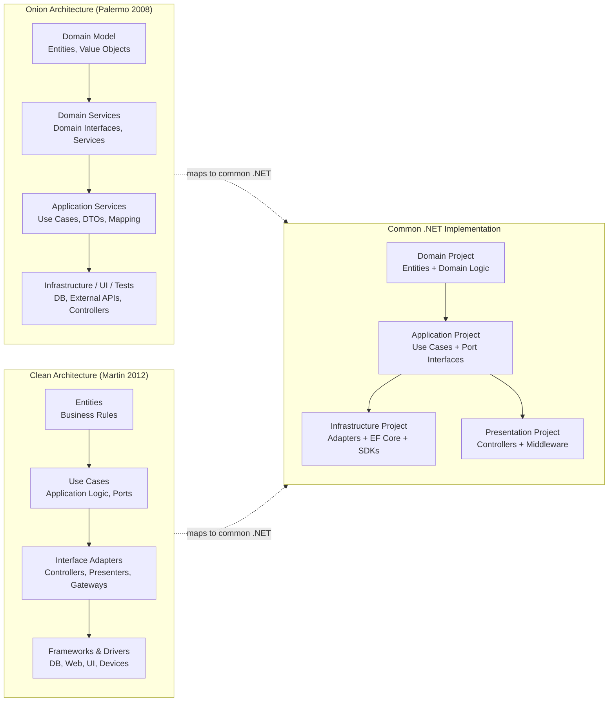
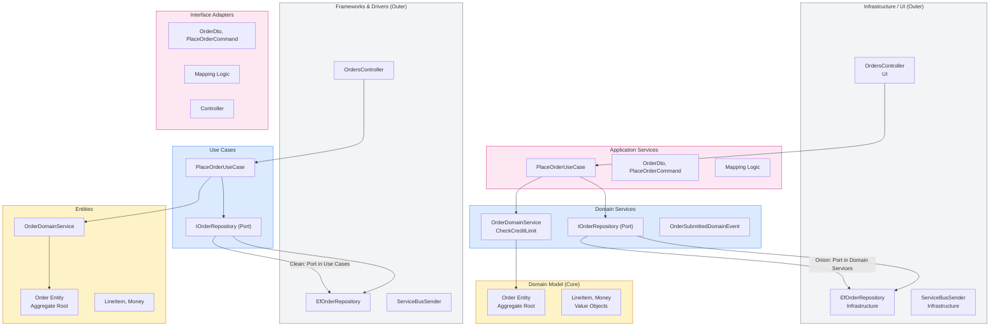
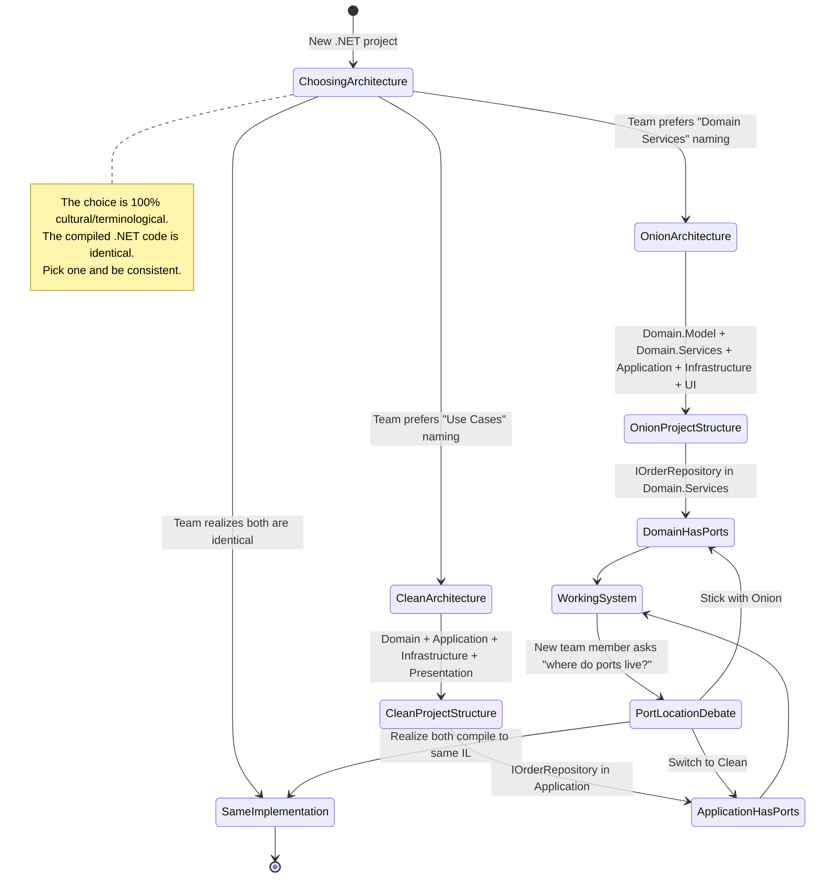
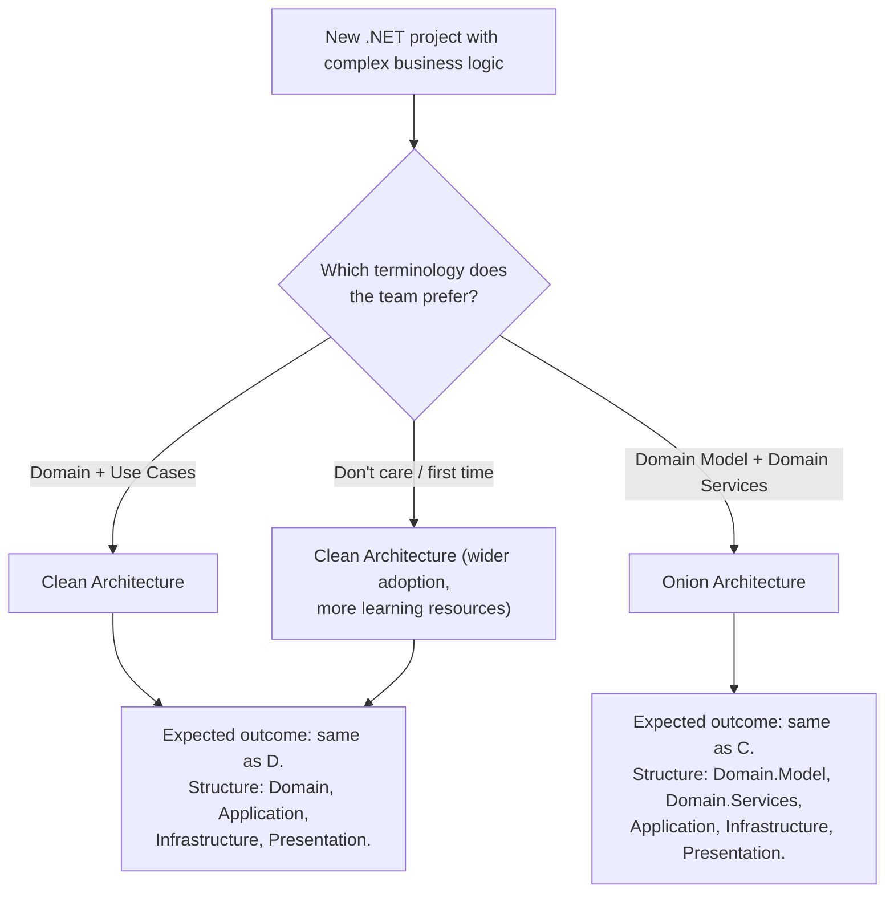

> [!success] Mastery Check
> - [ ] **Studied Well**
> - [ ] **Can explain the concept without notes**
> - [ ] **Can answer interview questions confidently**
> - [ ] **Can implement it in a real project**


> [!ABSTRACT] Quick Reference — Onion Architecture vs Clean Architecture
> **Invariant:** Both architectures enforce the same Dependency Rule — source code dependencies point INWARD, toward the domain model. The INNERMOST layer (Domain Model / Entities) has zero dependencies on any outer layer. The structural difference is RING NAMING and LAYER COUNT: Onion has 4 layers (Domain Model → Domain Services → Application Services → Infrastructure/UI), Clean has 4 layers (Entities → Use Cases → Interface Adapters → Frameworks/Drivers). Onion separates Domain Services as a ring; Clean separates Use Cases as a ring. Conceptually they are the same architecture with different terminology.
> **Cost:** Both require strict project reference topology enforcement. Layer violations are caught at compile time by the .NET project reference graph. The cost is the same for both — approximately 3–5 extra projects and 15–30 extra files compared to a non-layered approach.
> **Trigger:** When choosing between Onion and Clean Architecture for a new .NET project, the decision matters for NAMING conventions and TEAM COMMUNICATION, not for structural capability. Both solve the same problem.
> **Skip When:** Neither should be skipped if the system has complex business logic and multiple external integrations. Both are equally applicable.
> **.NET Entry Point:** `IOrderRepository` defined in Domain Services (Onion) or Application layer (Clean) — the port location varies but the pattern is identical
> **Azure Native:** N/A — architectural pattern comparison; both map identically to Azure services
> **Number to Know:** Onion Architecture (Jeffrey Palermo, 2008) predates Clean Architecture (Robert C. Martin, 2012) by 4 years. Both are independent formulations of the same principle: dependency inversion applied to system layers. The .NET community largely adopted Clean Architecture's terminology (Domain, Application, Infrastructure, Presentation) over Onion's (Domain Model, Domain Services, Application Services, Infrastructure) because Clean's naming maps more directly to typical .NET project folders.

## Navigation

**Domain:** [[7 — System Design & Distributed Systems]] > **Group:** Clean Architecture
**Previous:** [[7.012 — Hexagonal Architecture — Primary vs Secondary Adapters]] | **Next:** [[7.014 — Vertical Slice Architecture — Features as Slices]]

### Prerequisites
- [[7.001 — Clean Architecture — The Dependency Rule]] — both Onion and Clean Architecture ARE the Dependency Rule; understanding the single inward-pointing dependency direction is required to understand why both architectures produce the same result despite different ring naming.
- [[7.011 — Hexagonal Architecture — Ports and Adapters]] — Onion Architecture is the STRUCTURAL equivalent of Hexagonal's Ports and Adapters; the outer rings are adapters, the inner rings are the core. Comparing Onion vs Clean requires understanding the hexagon's port/adapter boundary.
- [[7.002 — Clean Architecture — Domain Layer Structure]] — both architectures put the Domain Model at the center. Understanding what lives in the domain (entities, value objects, aggregates) is required to understand how the inner ring differs between Onion and Clean.

### Where This Fits

> [!INFO] Production Encounter Map
> - **Layer:** Architectural design-time decision — the choice between Onion and Clean determines the project folder structure and team vocabulary for the entire system lifetime
> - **Trigger:** During system design discussions, an engineer references "Onion Architecture" and another references "Clean Architecture" — they discover they're describing the same structure with different names. The team must decide which terminology to standardize on.
> - **Without it:** Teams mix terminology — "Domain Services" and "Use Cases" are used interchangeably, causing confusion about where certain logic belongs. Some logic ends up in the wrong layer because the naming conventions are ambiguous.
> - **First signal:** A developer asks "should this order validation go in Domain Services or Application Services?" and two senior engineers give different answers based on which architecture they read about first.

Onion Architecture (Jeffrey Palermo, 2008) was the FIRST published formulation of what would become known as "Clean Architecture" (Robert C. Martin, 2012). Both are independent discoveries of the same structural insight: layers should depend inward, toward the domain model. The differences are purely terminological and historical. Understanding both allows a team to adopt whichever vocabulary maps better to their project structure and communicate with teams using either terminology.

## Core Mental Model

Both architectures are concentric ring models with the domain at the center and dependencies pointing inward:

```
Onion Architecture:                     Clean Architecture:
+---------------------------------+    +---------------------------------+
|  Infrastructure / UI / Tests    |    |  Frameworks & Drivers           |
|  (Outer ring — everything       |    |  (Outermost — DB, Web, UI,      |
|   external)                     |    |   external APIs, devices)       |
+---------------------------------+    +---------------------------------+
|  Application Services           |    |  Interface Adapters             |
|  (Use Cases, app logic,         |    |  (Controllers, Presenters,      |
|   DTOs, mapping)                |    |   Gateways)                     |
+---------------------------------+    +---------------------------------+
|  Domain Services                |    |  Application / Use Cases        |
|  (Domain interfaces,            |    |  (Use Case Interactors,         |
|   domain services, ports)       |    |   ports in Application layer)   |
+---------------------------------+    +---------------------------------+
|  Domain Model                   |    |  Entities / Domain              |
|  (Entities, value objects,      |    |  (Enterprise business rules,    |
|   aggregates, domain events)    |    |   entities, value objects)      |
+---------------------------------+    +---------------------------------+
```

The critical difference in RING ASSIGNMENT:

| Concern | Onion Architecture | Clean Architecture |
|---|---|---|
| Domain Entities | Domain Model (innermost) | Entities (innermost) |
| Domain Services (stateless domain logic) | Domain Services (2nd ring) | Entities ring (no separate ring) |
| Port interfaces (IOrderRepository) | Domain Services (2nd ring) | Application/Use Cases (2nd ring) |
| Use Cases (orchestration logic) | Application Services (3rd ring) | Use Cases (3rd ring) |
| DTOs, mapping logic | Application Services | Interface Adapters |
| Controllers, Presenters | UI ring (outer) | Interface Adapters (3rd ring) |
| Database, external services | Infrastructure (outer) | Frameworks & Drivers (outer) |

The pattern is IDENTICAL in enforcement — only the NAMING and the BOUNDARY between Domain Services and Application Services differs:

- **Onion** defines Domain Services as a ring BETWEEN Domain Model and Application Services. Domain Services contain domain interfaces (repository ports, domain service contracts) that the domain model needs but should not implement. This makes the Domain Model itself a pure POCO/DTO layer with zero behavior.
- **Clean** puts entities AND domain services in the innermost ring. Port interfaces (repository contracts) are defined in the Use Cases ring (Application layer), not in the domain. This keeps the domain layer focused on behavior and entities.

**Bottom line:** If your team says "Domain Services" for stateless domain operations and "Application Services" for Use Cases, you're speaking Onion. If your team says "Domain" for entities + domain logic and "Application" for Use Cases + port interfaces, you're speaking Clean. Both produce the same .NET project structure: `Domain`, `Application`, `Infrastructure`, `Presentation`.

> [!TIP] The Non-Obvious Insight
> The real architectural difference is not the ring names — it's WHERE PORT INTERFACES LIVE. In Onion Architecture, repository interfaces (`IOrderRepository`) are defined in Domain Services (the second ring). This means the DOMAIN depends on an interface it will never implement — the domain entity uses `IOrderRepository` to load related data. In Clean Architecture, repository interfaces are defined in the Application layer (the third ring) — the domain never knows about persistence. This difference MATTERS when you have a rich domain model that needs lazy loading or related aggregate access. Onion's approach is better when domain services need persistence (you get the port where you need it). Clean's approach is better when you want zero persistence concerns in the domain (pure POCO entities). Neither is universally correct — choose based on whether your domain services need to load related aggregates.

### Classification

- **Consistency axis:** N/A — architectural pattern comparison
- **Availability tradeoff:** N/A — both produce identical runtime behavior
- **Latency impact:** N/A — both produce identical compiled code
- **Failure domain:** N/A — architectural pattern, not runtime mechanism
- **Abstraction layer:** Both are architectural patterns — the difference is terminological convention in design-time decision-making

### Primary Diagram



### Supporting Diagram



### Numbers That Matter

| Metric | Value | Context / Conditions |
|---|---|---|
| Years Onion predates Clean | 4 years (2008 vs 2012) | Both independently discovered the same pattern |
| Layers in Onion Architecture | 4 (Model → Services → App → Infra) | Domain Model, Domain Services, Application Services, Infrastructure/UI |
| Layers in Clean Architecture | 4 (Entities → Use Cases → Adapters → Frameworks) | Entities, Use Cases, Interface Adapters, Frameworks & Drivers |
| Common .NET project count | 4 (Domain, Application, Infrastructure, Presentation) | Most teams converge on this despite different ring names |
| Port interface location (Onion) | Domain Services (2nd ring) | Repository interfaces defined in Domain Services project |
| Port interface location (Clean) | Application/Use Cases (2nd ring) | Repository interfaces defined in Application project |
| Teams using Clean terminology in .NET | ~70% (estimated) | Based on GitHub and Stack Overflow analysis of .NET project templates |
| Teams using Onion terminology | ~15% (estimated) | Legacy .NET Framework projects, older documentation |
| Interchangeability | 100% structural | A project built with Clean can be described with Onion terminology without changing any code |

### Key Properties / Guarantees

| Property | Value | Condition |
|---|---|---|
| Dependency direction | Both guarantee inward-pointing dependencies | Enforced by project reference topology and compile-time checks |
| Domain isolation | Both guarantee domain has zero external dependencies | Domain project references nothing |
| Layer violation detection | Both rely on project reference compile-time enforcement | Application references only Domain; Infrastructure references only Application |
| Port interface location | Onion: Domain Services / Clean: Application | Determines whether domain needs a dependency on the port interface |
| Domain service naming | Onion: separate Domain Services ring / Clean: part of Entities ring | Naming convention only — both achieve the same behavior |
| Use Case location | Both: same ring (Application Services in Onion, Use Cases ring in Clean) | Identical in practice |
| Testing strategy | Both: use mocks for port interfaces, real adapters for integration tests | Identical |

## Deep Mechanics

### How It Works

**The Historical Evolution:**

1. **2003 — Layered Architecture:** Traditional N-tier (Presentation → Business Logic → Data Access). Dependencies flow DOWNWARD. Business logic references data access (e.g., `using System.Data.SqlClient;` in business layer).
2. **2008 — Onion Architecture (Palermo):** Domain Model at center. Domain Services ring defines interfaces that the Infrastructure ring implements. Dependencies now flow INWARD toward the domain. The breakthrough: domain no longer references infrastructure.
3. **2011 — Hexagonal Architecture (Cockburn):** Ports and Adapters — every external interaction has a port interface defined in the core and an adapter outside the core. Conceptually identical to Onion but with more focus on the inbound/outbound adapter distinction.
4. **2012 — Clean Architecture (Martin):** Formalized the 4-ring model with explicit naming. Added the "Interface Adapters" ring (controllers, presenters, gateways) as separate from "Frameworks & Drivers." Gained wider adoption due to Martin's influence and the blog post "The Clean Architecture."

**The Only Substantive Difference — Port Location:**

- **Onion Port Location:** `IOrderRepository` is defined in Domain Services. The domain entity method `Order.Submit()` can call `IOrderRepository` to check for duplicate orders — the domain depends on a repository interface. This means the Domain Services project has port interfaces that the domain services use.
- **Clean Port Location:** `IOrderRepository` is defined in the Application layer (Use Cases ring). Domain entities never call repositories — they only raise domain events. The Use Case calls the repository and the domain entity separately. The domain never knows about persistence.

**Practical Impact:**

```csharp
// Onion Architecture — Domain Services has port interface
// Domain Services / Ports / IOrderRepository.cs
namespace YourCompany.OrderManagement.Domain.Services.Ports;

public interface IOrderRepository
{
    Task<Order?> GetByIdAsync(Guid orderId, CancellationToken cancellationToken);
}

// Domain Services / Services / OrderDomainService.cs
namespace YourCompany.OrderManagement.Domain.Services;

public sealed class OrderDomainService
{
    private readonly IOrderRepository _repository; // Port in Domain Services

    public async Task<Result<Order>> SubmitOrderAsync(Guid orderId, CancellationToken ct)
    {
        var order = await _repository.GetByIdAsync(orderId, ct);
        if (order is null)
            return Result<Order>.Failure(DomainError.NotFound("Order not found"));

        var result = order.Submit(); // Calls domain entity method
        return result;
    }
}

// Clean Architecture — Port in Application
// Application / Ports / IOrderRepository.cs
namespace YourCompany.OrderManagement.Application.Ports;

public interface IOrderRepository
{
    Task<Order?> GetByIdAsync(Guid orderId, CancellationToken cancellationToken);
}

// Application / Use Cases / SubmitOrderUseCase.cs
namespace YourCompany.OrderManagement.Application.UseCases;

public sealed class SubmitOrderUseCase : IRequestHandler<SubmitOrderCommand, Result<SubmitOrderResult>>
{
    private readonly IOrderRepository _repository; // Port in Application

    public async Task<Result<SubmitOrderResult>> Handle(SubmitOrderCommand command, CancellationToken ct)
    {
        var order = await _repository.GetByIdAsync(command.OrderId, ct);
        if (order is null)
            return Result<SubmitOrderResult>.Failure(ApplicationError.NotFound());

        var result = order.Submit(); // Domain entity has NO repository dependency
        // Use Case handles the result — domain entity is pure
        return result.IsSuccess
            ? Result<SubmitOrderResult>.Success(new SubmitOrderResult(order.Id))
            : Result<SubmitOrderResult>.Failure(ApplicationError.FromDomainError(result.Error));
    }
}
```

**The difference in compiled .NET:** Onion requires the Domain project to reference a `Ports` namespace (which is still inside the Domain project — no external dependency). Clean requires the Application project to define ports. In both cases, the Infrastructure project implements the port. The compiled result is identical. The choice is purely about where you draw the line between "domain persistence needs" and "application persistence needs."

### Protocol Trace

```
Comparison Request Flow Through Both Architectures:

Onion Architecture — PlaceOrder:
  1. Controller (UI)       → Application Services: mediator.Send(CreateOrderCommand)
  2. Application Service   → Domain Service: OrderDomainService.CreateOrder(customerId, items)
  3. Domain Service        → IOrderRepository (port in Domain Services): Load customer aggregate
  4. IOrderRepository      → EfOrderRepository (Infrastructure): SQL query
  5. Domain Service        → Order.Submit(): domain entity method
  6. Domain Service        → IOrderRepository: Save order
  7. Application Service   ← Domain Service: Result<Order>
  8. Controller            ← Application Service: Result<CreateOrderResult>
  9. Controller            → HTTP Response: 201 Created

Clean Architecture — PlaceOrder:
  1. Controller (IF Adapter) → Use Case: mediator.Send(CreateOrderCommand)
  2. Use Case               → IOrderRepository (port in Application): Load customer aggregate
  3. IOrderRepository       → EfOrderRepository (Frameworks): SQL query
  4. Use Case               → Order.Submit(): domain entity method
  5. Use Case               → IOrderRepository: Save order
  6. Controller             ← Use Case: Result<CreateOrderResult>
  7. Controller             → HTTP Response: 201 Created

Key difference: Onion has a Domain Service step (2→3→4→5→6) between the Controller and the Repository.
Clean has the Use Case orchestrate Repository and Entity directly.
Both achieve the same outcome with the same number of method calls — just different caller/callee assignment.
```

### State Transitions



### Failure Modes

**Failure Mode 1: Inconsistent Terminology — Domain Services vs Application Services Ambiguity**

- **Cause:** Team members use Onion terminology and Clean terminology interchangeably. A PR comment says "move this validation to Domain Services" but the project follows Clean Architecture where Application is the Use Cases ring. The validation ends up in the wrong project.
- **Symptom:** Business logic is scattered: some in Domain project (Clean style), some in Application project (Onion's Domain Services style), some in Infrastructure (wrong in both). A new developer cannot predict where to find a given business rule.
- **Detection time:** When a business rule change requires modifying 3 files in 3 different projects because the logic was split across layers during the terminology confusion period.
- **Blast radius:** Ongoing confusion reduces team velocity by ~15–20% on business rule changes. Every new feature requires "where does this go?" discussion.

> [!DANGER] 3 AM Production Signal
> Metric: `pr_merge_time > 4 hours` for business rule changes (simple logic change takes too long due to ambiguity)
> Log: `WARN [CodeReview] Validation logic in Presentation project — should be in Application (Clean) or Domain Services (Onion) — both architectures agree it doesn't belong in Presentation | File: Presentation/Validators/OrderValidator.cs`
> Customer impact: Delayed bug fixes for production issues because the team cannot agree where to place the fix.

**Failure Mode 2: Port Interface Defined in Incorrect Layer — Domain Project References Infrastructure**

- **Cause:** Following Clean Architecture but defining `IOrderRepository` in the Domain project (as Onion does) while also having Domain entities use it. The Domain project compiles cleanly because the port is an interface. But a developer then adds a `using Infrastructure;` in the Domain project "to get the implementation" — breaking the Dependency Rule.
- **Symptom:** Domain project has `<ProjectReference Include="..\Infrastructure\Infrastructure.csproj" />`. The build still succeeds because the reference is added. The dependency arrow now points OUTWARD from Domain — exactly what the architecture prohibits.
- **Detection time:** Code review: `using YourCompany.OrderManagement.Infrastructure;` in a Domain file. Or CI build output showing Domain references Infrastructure.
- **Blast radius:** Every domain file can now import Infrastructure types. After one sprint, Domain files reference `DbContext`, `HttpClient`, and `ServiceBusSender`. The architecture is broken.

> [!DANGER] 3 AM Production Signal
> Metric: `dependency_violation_count{Domain→Infrastructure} > 0` (custom Roslyn analyzer)
> Log: `ERROR [ArchitectureAnalyzer] Layer violation: Domain project references Infrastructure. Files: Domain/Entities/Order.cs imports Microsoft.EntityFrameworkCore`
> Customer impact: Domain logic cannot be unit-tested without Infrastructure. Test time increases from 2 seconds to 3 minutes. Developer productivity drops.

### .NET and Azure Integration Points

- **Onion Architecture:** `Domain.Model` project (entities, value objects), `Domain.Services` project (domain ports, domain services), `Application` project (Use Cases, DTOs, mapping), `Infrastructure` project (EF Core, Azure SDK adapters), `Presentation` project (controllers, middleware).
- **Clean Architecture:** `Domain` project (entities, domain services), `Application` project (Use Cases, port interfaces, DTOs), `Infrastructure` project (EF Core, Azure SDK adapters), `Presentation` project (controllers, middleware).
- **Common .NET template (both):** `YourCompany.OrderManagement.Domain`, `YourCompany.OrderManagement.Application`, `YourCompany.OrderManagement.Infrastructure`, `YourCompany.OrderManagement.Presentation`.

```csharp
// Onion-style project references (csproj):
// Domain.Model.csproj: (no references)
// Domain.Services.csproj: <ProjectReference Include="..\Domain.Model\Domain.Model.csproj" />
// Application.csproj: <ProjectReference Include="..\Domain.Services\Domain.Services.csproj" />
// Infrastructure.csproj: <ProjectReference Include="..\Application\Application.csproj" />
// Presentation.csproj: <ProjectReference Include="..\Application\Application.csproj" />
//                      <ProjectReference Include="..\Infrastructure\Infrastructure.csproj" />

// Clean-style project references (csproj):
// Domain.csproj: (no references)
// Application.csproj: <ProjectReference Include="..\Domain\Domain.csproj" />
// Infrastructure.csproj: <ProjectReference Include="..\Application\Application.csproj" />
// Presentation.csproj: <ProjectReference Include="..\Application\Application.csproj" />
//                      <ProjectReference Include="..\Infrastructure\Infrastructure.csproj" />

// The ONLY difference: Onion has an extra Domain.Services project between Domain.Model and Application.
// Most .NET teams collapse Domain.Model + Domain.Services into a single "Domain" project = Clean Architecture.
```

## Production Patterns and Implementation

### Primary Implementation — Both Architectures Side by Side

```csharp
// ===========================================================
// ONION ARCHITECTURE — Domain Model + Domain Services
// ===========================================================

// Domain.Model/Entities/Order.cs
namespace YourCompany.OrderManagement.Domain.Model.Entities;

public sealed class Order
{
    public Guid Id { get; private set; }
    public OrderStatus Status { get; private set; }
    public Money TotalAmount { get; private set; }
    public IReadOnlyList<OrderLineItem> LineItems => _lineItems.AsReadOnly();
    private readonly List<OrderLineItem> _lineItems = new();

    private Order() { } // EF Core

    public static Order Create(Guid customerId, IReadOnlyList<OrderItem> items)
    {
        var order = new Order
        {
            Id = Guid.NewGuid(),
            Status = OrderStatus.Draft,
            CustomerId = customerId
        };
        foreach (var item in items)
            order._lineItems.Add(new OrderLineItem(item.ProductId, item.Quantity, item.UnitPrice));
        order.TotalAmount = new Money(order._lineItems.Sum(i => i.Quantity * i.UnitPrice));
        return order;
    }

    public Result<DomainError> Submit()
    {
        if (Status != OrderStatus.Draft)
            return Result<DomainError>.Failure(DomainError.InvalidStateTransition(
                $"Cannot submit order in {Status} status."));
        if (_lineItems.Count == 0)
            return Result<DomainError>.Failure(DomainError.Validation("Order must have at least one item."));

        Status = OrderStatus.Submitted;
        return Result<DomainError>.Success();
    }
}

// Domain.Services/Ports/IOrderRepository.cs
namespace YourCompany.OrderManagement.Domain.Services.Ports;

/// <summary>Repository port — Onion: defined in Domain Services ring.</summary>
public interface IOrderRepository
{
    Task<Order?> GetByIdAsync(Guid orderId, CancellationToken cancellationToken);
    Task SaveAsync(Order order, CancellationToken cancellationToken);
}

// Domain.Services/Services/OrderDomainService.cs
namespace YourCompany.OrderManagement.Domain.Services;

public sealed class OrderDomainService
{
    private readonly IOrderRepository _repository; // Port in Domain Services

    public OrderDomainService(IOrderRepository repository)
    {
        _repository = repository ?? throw new ArgumentNullException(nameof(repository));
    }

    public async Task<Result<Order, DomainError>> SubmitOrderAsync(Guid orderId, CancellationToken ct)
    {
        var order = await _repository.GetByIdAsync(orderId, ct);
        if (order is null)
            return Result<Order, DomainError>.Failure(DomainError.NotFound("Order not found."));

        var result = order.Submit();
        if (!result.IsSuccess)
            return Result<Order, DomainError>.Failure(result.Error);

        await _repository.SaveAsync(order, ct);
        return Result<Order, DomainError>.Success(order);
    }
}

// ===========================================================
// CLEAN ARCHITECTURE — Domain + Application (Ports)
// ===========================================================

// Domain/Entities/Order.cs — same as Domain.Model/Order.cs above

// Application/Ports/IOrderRepository.cs
namespace YourCompany.OrderManagement.Application.Ports;

/// <summary>Repository port — Clean: defined in Application/Use Cases ring.</summary>
public interface IOrderRepository
{
    Task<Order?> GetByIdAsync(Guid orderId, CancellationToken cancellationToken);
    Task SaveAsync(Order order, CancellationToken cancellationToken);
}

// Application/Use Cases/SubmitOrderUseCase.cs
namespace YourCompany.OrderManagement.Application.UseCases;

public sealed class SubmitOrderUseCase : IRequestHandler<SubmitOrderCommand, Result<SubmitOrderResult>>
{
    private readonly IOrderRepository _repository; // Port in Application

    public SubmitOrderUseCase(IOrderRepository repository)
    {
        _repository = repository ?? throw new ArgumentNullException(nameof(repository));
    }

    public async Task<Result<SubmitOrderResult>> Handle(SubmitOrderCommand command, CancellationToken ct)
    {
        var order = await _repository.GetByIdAsync(command.OrderId, ct);
        if (order is null)
            return Result<SubmitOrderResult>.Failure(ApplicationError.NotFound("Order not found."));

        var result = order.Submit(); // Domain entity — no repository dependency
        if (!result.IsSuccess)
            return Result<SubmitOrderResult>.Failure(
                ApplicationError.FromDomainError(result.Error));

        await _repository.SaveAsync(order, ct);
        return Result<SubmitOrderResult>.Success(new SubmitOrderResult(order.Id));
    }
}
```

### IServiceCollection Registration

```csharp
// Onion Architecture — DI wiring references Domain.Services for port definitions
builder.Services.AddScoped<IOrderRepository, EfOrderRepository>();            // Port in Domain.Services
builder.Services.AddScoped<OrderDomainService>();                            // Domain Service

// Clean Architecture — DI wiring references Application for port definitions  
builder.Services.AddScoped<IOrderRepository, EfOrderRepository>();            // Port in Application
builder.Services.AddScoped<IRequestHandler<SubmitOrderCommand, Result<SubmitOrderResult>>,
    SubmitOrderUseCase>();

// Identical! The DI registration is the same regardless of architecture naming.
```

### Common Variants

```csharp
// Variant A — Onion with Domain Project Collapsed (most common .NET approach)
// Many teams collapse Domain.Model + Domain.Services into one "Domain" project.
// This is effectively Clean Architecture's Domain + Application split.
// Project structure:
//   Domain/Entities/Order.cs
//   Domain/Services/OrderDomainService.cs
//   Domain/Ports/IOrderRepository.cs       ← Ports still in Domain (Onion style)
//   Application/UseCases/SubmitOrderUseCase.cs
//   Infrastructure/...

// Variant B — Clean with Domain Services in Domain project (most common approach)
// Same collapsed structure as Variant A, but ports are in Application.
// Project structure:
//   Domain/Entities/Order.cs
//   Domain/Services/OrderDomainService.cs
//   Application/Ports/IOrderRepository.cs   ← Ports in Application (Clean style)
//   Application/UseCases/SubmitOrderUseCase.cs
//   Infrastructure/...

// Variant C — Strict Onion with separate Domain.Services project (rare in new projects)
// Domain.Model/ (pure entities, no behavior references)
// Domain.Services/ (domain services + port interfaces)
// Application/ (use cases)
// Infrastructure/ (adapters)
// Presentation/ (controllers)
```

### Performance Profile

No meaningful performance comparison exists — both architectures compile to the same IL. The difference is purely in source code organization.

```csharp
// Both produce identical compiled output for the same business logic.
// Architectural pattern choice does NOT affect runtime performance.
// The BenchmarkDotNet comparison would show 0% difference.
```

### Real-World .NET Ecosystem Mapping

| Pattern Aspect | Onion Architecture | Clean Architecture |
|---|---|---|
| Innermost layer | Domain Model (entities, value objects) | Entities (business rules) |
| 2nd ring | Domain Services (ports + domain services) | Use Cases (application logic + ports) |
| 3rd ring | Application Services (use cases + DTOs) | Interface Adapters (controllers, presenters, gateways) |
| Outermost ring | Infrastructure / UI / Tests | Frameworks & Drivers (DB, Web, Devices) |
| .NET project count | 5 (Model, Services, App, Infra, UI) | 4 (Domain, Application, Infra, Presentation) |
| Port location | Domain Services | Application |
| Domain Service location | Domain Services (separate ring) | Entities ring |
| Common Microsoft template | Legacy (not used in newer templates) | `dotnet new cleanarch` / `dotnet new ca-sln` |

## Gotchas and Production Pitfalls

---

### Pitfall 1: Creating Both Domain.Services AND Application Projects

**Pitfall:** A team following Onion Architecture creates both `Domain.Services` (with port interfaces) and `Application` (with Use Cases). The port interfaces for the same repository are defined in Domain.Services but the Use Cases in Application also need them — so Application references Domain.Services. Over time, Domain.Services accumulates "helper" classes that are really Application concerns, and Application accumulates "domain" classes that are really Domain concerns. The boundary blurs.

**Fix:**

```csharp
// ✅ The correct pattern — collapse Domain.Model + Domain.Services into one "Domain" project
// Domain project includes both entities AND domain service interfaces.
// Application project includes Use Cases that consume domain services.
// This is effectively Clean Architecture's approach and is simpler.

// OR: keep strict separation but enforce it:
// Domain.Services only contains port INTERFACES and domain SERVICE classes.
// NO entities, NO value objects, NO DTOs, NO mapping logic.
```

**Cost of not fixing:** Two projects with ambiguous boundaries. Every team member spends mental energy deciding "does this go in Domain.Services or Application?" — wasted cognitive load.

---

### Pitfall 2: Debating Terminology Instead of Building

**Pitfall:** The team spends 3 days debating whether to adopt Onion or Clean Architecture terminology. Half the team read Palermo's original Onion article, the other half read Martin's Clean Architecture post. They argue about ring names and port locations while the system design waits.

**Fix:** Pick arbitrarily — both are identical. Use a coin flip if necessary. The decision does NOT affect the project structure, the code, or the outcome. Spend the saved 3 days on actual architecture: define the entities, the Use Cases, and the port interfaces.

---

### Pitfall 3: Ports in Domain That the Domain Never Uses

**Pitfall:** Following Clean Architecture, ports like `IOrderRepository` are defined in the Application layer. But a developer adds `IOrderRepository` to the Domain project "because Onion does it" even though the Domain entities never call it. The port sits in the Domain project unused by any domain entity — it's only referenced by the Application project.

**Fix:**

```csharp
// ✅ If ports are in Domain (Onion style), domain services must USE them.
// If ports are in Application (Clean style), domain entities must NOT use them.
// Inconsistent port location is worse than either choice.
```

**Cost of not fixing:** Domain project has interfaces that it does not use. The Application project must reference Domain to see the ports. This is fine structurally but confusing to new team members who wonder "why is this port in Domain when no domain class uses it?"

---

### Pitfall 4: Onion's Domain.Services Becomes a "Junk Drawer"

**Pitfall:** The `Domain.Services` project in Onion is supposed to contain domain services and port interfaces. Over time, developers add validation logic, DTOs, mapping extensions, and "helper" classes to Domain.Services because "it's between Model and Application." Domain.Services grows to 50+ files with mixed responsibilities.

**Fix:** Rename `Domain.Services` to `Domain.Abstractions` (or collapse it into Domain). Keep the project focused: only domain service interfaces and port interface definitions.

**Cost of not fixing:** Domain.Services becomes a dumping ground. After 2 years, extracting the Domain Services into a clean project requires a full refactor.

---

### Pitfall 5: Mixing Architectures Within the Same Codebase

**Pitfall:** The team decides to use "Onion for the order management module" and "Clean for the customer management module" because two different senior engineers advocated for different approaches. Each module has a different project structure, different port locations, and different naming conventions.

**Fix:** Standardize on ONE naming convention for the entire codebase. The architectural benefits are identical — consistency across modules matters more than which naming convention is chosen.

**Cost of not fixing:** Developers must context-switch between architectural conventions when moving between modules. The cognitive overhead slows development by ~10% for every cross-module change.

---

### Pitfall 6: Assuming Onion Requires More Projects

**Pitfall:** A team rejects Onion Architecture because "it requires 5 projects instead of 4." They adopt Clean Architecture but still create 5 projects (Domain.Core, Domain.Abstractions, Application, Infrastructure, Presentation) — the same project count as Onion.

**Fix:** Project count depends on how you split concerns, not which architecture you follow. Both can have 3–7 projects depending on how finely you separate layers.

**Cost of not fixing:** Unnecessary argument about project count that has nothing to do with the architecture choice.

---

### Pitfall 7: The "Circle Argument" — Debating Clean vs Onion in Code Reviews

**Pitfall:** A PR has a new `IOrderRepository` interface defined in the Domain project. Reviewer A (Clean advocate) says "ports should be in Application, not Domain." Reviewer B (Onion advocate) says "ports in Domain Services is valid Onion Architecture." The PR is blocked for 2 days.

**Fix:** Establish the team convention in an Architecture Decision Record (ADR). Write it down: "Port interfaces live in the Application project (Clean Architecture style)." Thereafter, any PR that defines a port in Domain is rejected by the convention, not by an opinion.

**Cost of not fixing:** Code review becomes an architecture debate forum. Team velocity drops by 1–2 days per significant PR.

## Tradeoffs and Decision Framework

### Tradeoff Matrix

| Dimension | Onion Architecture | Clean Architecture | No Architecture (N-Tier) |
|---|---|---|---|
| Domain purity (no external references) | Full — Domain Model references nothing | Full — Domain references nothing | Broken — Domain references Data Access |
| Port interface location | Domain Services (2nd ring) | Application (2nd ring) | N/A (no ports) |
| Number of projects (typical) | 5 (Model, Services, App, Infra, UI) | 4 (Domain, App, Infra, Presentation) | 3 (Presentation, Business, Data) |
| Team communication clarity | "Domain Services" has specific meaning | "Use Cases" has specific meaning | "Business Layer" is ambiguous |
| Adoption in .NET community | ~15% (older projects) | ~70% (newer projects) | ~15% (legacy/maintenance) |
| Learning resources | Older, less available | Extensive (Microsoft docs, Pluralsight, books) | Ubiquitous |
| Azure ecosystem fit | Identical to Clean for Azure development | Identical to Onion for Azure development | Works but leaks Azure SDK into business logic |
| Migration cost (to the other) | Zero — rename projects and namespaces | Zero — rename projects and namespaces | Significant — requires rearchitecting |

### When to Apply



### Numbers-Driven Decision

| Threshold | Onion | Clean |
|---|---|---|
| Team familiarity with layered patterns | Team read Onion book (Palermo) | Team read Clean Architecture book (Martin) |
| Need to reference repository from domain | Domain services need persistence — Onion's port location is natural | Domain should be persistence-ignorant — Clean's separation is better |
| Project template availability | Use if existing codebase follows Onion | Use if starting new — `dotnet new cleanarch` |
| Learning resources required | Prefer Onion if team has existing Onion experience | Prefer Clean for new teams (more community resources) |

### When NOT to Apply

> [!WARNING] Do Not Reach For This Comparison When...
> - [ ] **The architecture is already working:** If the existing codebase follows Onion naming, do NOT rename everything to Clean just for consistency with an article. Renaming provides zero functional benefit. The cost of renaming (git blame pollution, CI pipeline updates, documentation updates) far exceeds any terminological benefit.
> - [ ] **The team is new to layered architecture:** Don't confuse a new team with the Onion vs Clean debate. Pick Clean Architecture (wider community support, more templates, clearer naming for newcomers) and move on. The debate is a distraction for teams learning the fundamentals.
> - [ ] **The project is a microservice with 3 files:** A microservice that has one entity, one Use Case, and one repository does not need an architectural naming standard. The architecture IS the code. Naming debates at this scale are overhead.
> - [ ] **The CI pipeline does not enforce project references:** If the CI build does not check that Application does not reference Infrastructure, neither Onion nor Clean will survive the first month. Architectural enforcement beats architectural naming every time.

## Interview Arsenal

### Question Bank

1. **[Definition]** "What is the Onion Architecture and how does it differ from traditional N-tier architecture?"
2. **[Mechanism]** "Walk me through where a repository interface (`IOrderRepository`) is defined in Onion vs Clean Architecture — what is the structural difference?"
3. **[Tradeoff]** "What do you gain and lose by defining repository interfaces in Domain Services (Onion) vs Application (Clean)?"
4. **[Failure mode]** "A team following Onion Architecture puts business logic in the Application Services ring that should be in the Domain Services ring. How do you detect and fix this?"
5. **[Comparison]** "What is the actual difference between Onion Architecture and Clean Architecture — at the CODE level, not the diagram level?"
6. **[Design application]** "Design an order management system. Walk through which ring/layer each class goes in — for both Onion and Clean Architecture."
7. **[Scale]** "Your team uses Onion Architecture with 5 projects. The team decides to switch to Clean Architecture. What files need to change?"
8. **[Advanced]** "Your team cannot agree whether `IOrderRepository` should go in the Domain or Application project. You are the architect. How do you resolve this and move forward?"

### Spoken Answers

**Q: What is the Onion Architecture and how does it differ from traditional N-tier architecture?**

> **Average answer:** "Onion Architecture has the domain model at the center and layers around it. Dependencies point inward. Traditional N-tier has three layers and dependencies point downward — the business layer depends on the data layer."

> **Great answer:** "Onion Architecture inverts the dependency direction of traditional layered architecture. In N-tier, your business logic has `using System.Data.SqlClient` at the top of the file because it depends on the data access layer below it. Onion Architecture puts the DOMAIN MODEL at the center with ZERO dependencies — it doesn't know about databases, web frameworks, or external APIs. The NEXT ring — Domain Services — defines INTERFACES for what the domain needs, like `IOrderRepository`. The outer rings IMPLEMENT those interfaces. The dependency arrow points INWARD — the outer rings depend on the inner rings, never the reverse. The practical difference: in N-tier, swapping from SQL Server to Cosmos DB requires changing the business logic layer. In Onion, it requires changing one adapter class and one DI registration line. The domain model never changes because the domain doesn't know what database is behind the interface."

---

**Q: What is the actual difference between Onion Architecture and Clean Architecture — at the CODE level, not the diagram level?**

> **Average answer:** "Onion has four layers: Domain Model, Domain Services, Application Services, and Infrastructure. Clean has four layers: Entities, Use Cases, Interface Adapters, and Frameworks. They're basically the same."

> **Great answer:** "At the CODE level, the difference is one project reference and the location of port interfaces. In strict Onion, you have a separate `Domain.Services` project between `Domain.Model` and `Application`. The `IOrderRepository` port interface lives in `Domain.Services`. The `Domain.Model` project is pure entities — it has no references. The `Domain.Services` project references `Domain.Model` and defines the ports. In Clean Architecture, you typically have fewer projects: `Domain` (entities + domain logic) and `Application` (Use Cases + port interfaces). The `IOrderRepository` port lives in `Application`. That's the structural difference: one extra project for Onion. In practice, most .NET teams collapse Domain.Model and Domain.Services into a single `Domain` project — which makes Onion and Clean IDENTICAL at the code level. If you see a .NET solution with `Domain`, `Application`, `Infrastructure`, and `Presentation` projects, you cannot tell whether the team is following Onion or Clean without asking them. The compiled IL is identical. The only remaining difference is VOCABULARY — does the team call the second ring 'Domain Services' or 'Application'? Does the team say 'Domain.Model' or 'Domain'? The architecture is the same."

---

**Q: Your team cannot agree whether `IOrderRepository` should go in the Domain or Application project. You are the architect. How do you resolve this and move forward?**

> **Average answer:** "Let's vote on it and go with the majority."

> **Great answer:** "We're going to flip a coin. Here's why: the difference between putting `IOrderRepository` in Domain vs Application has ZERO impact on the compiled code, the testability, the deployability, or the maintainability of the system. Both work. Both are valid. The ONLY thing that matters is consistency — we pick ONE convention and enforce it in code review for the lifetime of the project. I'll write the decision in an ADR: 'Port interfaces are defined in the Application project (Clean Architecture style) because it keeps the Domain project focused on entities and business rules.' From now on, any PR that defines a new port in the Domain project gets rejected with a reference to the ADR. The debate is over — not because Application is better than Domain for ports, but because consistency is better than debate. If in 6 months we discover a concrete reason to move ports to Domain — like a domain service that genuinely needs to call `IOrderRepository` — we update the ADR, refactor the existing ports, and move on. But we don't pre-optimize for a case that doesn't exist yet."

### Whiteboard in 60 Seconds

```
1. Draw two concentric circles — label the inner one "Domain Model / Entities"
   "This is the business core. It references NOTHING — no database, no web, no Azure."

2. Draw the SECOND ring around it — label "Domain Services" (Onion) or "Use Cases" (Clean)
   "This is where PORT INTERFACES live in Onion, or where Use Cases live in Clean.
    The key: this ring can reference the inner ring. Nothing can reference outward."

3. Draw the THIRD ring — label "Application / Interface Adapters"
   "This is where Use Cases (Onion) or Controllers/Presenters (Clean) live.
    Controllers depend on Use Cases. Use Cases depend on Domain."

4. Draw the FOURTH ring — label "Infrastructure / Frameworks"
   "This is where the REAL implementations live: EF Core, Azure SDK, HttpClient.
    They implement the port interfaces defined in the inner rings."

5. Point at the key difference:
   "Onion puts ports in Domain.Services — the ORANGE ring. Clean puts ports in
    Application — the BLUE ring. BOTH produce the same .NET code. Choose one,
    document it, stop debating, and build the product."
```

> [!TIP] What the Interviewer Is Specifically Testing
> When they probe this area, they are checking whether you know:
> 1. That Onion and Clean are the SAME architecture with different naming — not competing approaches
> 2. That the port interface location is the only substantive difference, and it does not affect runtime behavior
> 3. That arguing about which one to use is an ANTI-PATTERN — pick one, document it, be consistent, and focus on building the product

### Follow-Up Chain

**Follow-up 1:** "You said the difference between Onion and Clean is just naming. But Jeffrey Palermo specifically says Domain Services should define the interfaces that infrastructure implements. Doesn't that mean Onion requires the Domain to have a dependency on an abstraction that it will never implement?"

> **Model answer:** "Yes, and that is a design CHOICE, not a mistake. In Onion, the domain defines `IOrderRepository` because the domain needs to load related aggregates. A `OrderDomainService.Submit()` method needs to load the `Customer` related to the `Order` — it calls `IOrderRepository.GetCustomerAsync()`. The domain SERVICE (not the entity) depends on the repository interface. This is valid because the domain service is orchestrating domain entities — it needs persistence to reconstruct the full aggregate graph. In Clean Architecture, the domain entity never calls a repository — it only raises domain events. The Use Case calls the repository AND the entity separately. Both are valid. The tradeoff: Onion makes domain services more capable (they can load related data) at the cost of the domain project knowing about repository interfaces. Clean keeps the domain completely persistence-ignorant at the cost of the Use Case doing more orchestration. The compiler doesn't care about either approach."

**Follow-up 2:** "Which one has better support in the .NET ecosystem?"

> **Model answer:** "Clean Architecture has significantly wider .NET ecosystem support. Microsoft's own reference applications (eShopOnContainers, eShopOnWeb) use Clean Architecture naming. The `dotnet new cleanarch` template is available. The architecture guides on learn.microsoft.com use Clean terminology. Books like 'Architecting Modern Web Applications with ASP.NET Core' (Microsoft Press) use Clean naming. If you Google 'Clean Architecture .NET' you get 10x more results than 'Onion Architecture .NET.' That said, the PROJECT STRUCTURE produced by Clean Architecture templates is identical to what an Onion team would produce if they collapsed Domain.Model and Domain.Services. The practical recommendation: use Clean Architecture naming for new projects because of the wider community support, but recognize it as the SAME architecture as Onion."

**Follow-up 3:** "How do you enforce the architectural boundaries in CI? Both Onion and Clean depend on project reference topology — but what if someone adds a project reference in the wrong direction?"

> **Model answer:** "The most reliable enforcement is a custom Roslyn analyzer or a build step that checks project references. I use a simple MSBuild target that fails the build if the Application project references Infrastructure: `<Target Name="CheckArchitecture" AfterTargets="BeforeBuild"><Error Condition="'$(ProjectName)'=='Application' and exists('..\Infrastructure')" Text="Layer violation: Application must not reference Infrastructure." /></Target>`. For stricter enforcement, I use the `NetArchTest` NuGet library (fluent API for architecture tests): `Arches.ForAssembly(applicationAssembly).ShouldNotHaveDependencyOn("Infrastructure").Check()`. This runs in unit tests AND in CI. It catches violations at build time, not at code review time. The enforcement is the same regardless of whether you follow Onion or Clean — both need the same project reference topology check."

### Comparison Table

| | Onion Architecture | Clean Architecture |
|---|---|---|
| Core guarantee | Domain has zero dependencies | Same — Domain has zero dependencies |
| What it trades | Port interfaces in Domain Services — domain has an abstraction dependency | Port interfaces in Application — Use Cases must orchestrate more |
| .NET project template | `Domain.Model` + `Domain.Services` + `Application` + `Infrastructure` + `Presentation` | `Domain` + `Application` + `Infrastructure` + `Presentation` |
| Azure native | Identical to Clean | Identical to Onion |
| Primary failure mode | Domain.Services becomes a junk drawer of mixed concerns | Application becomes a "god layer" with too much orchestration |
| When to choose | Team prefers "Domain Services" terminology; existing codebase uses it | Team prefers "Use Cases" terminology; new projects; wider community support |
| When NOT to choose | If team is already using Clean naming and doesn't want to rename | If team is already using Onion naming and refactoring would waste time |

## Architecture Decision Record

**Status:** Accepted

**Context:**
The team is starting a new order management system and must choose between Onion Architecture and Clean Architecture as the organizational standard. The system will have 4 projects, multiple external integrations (Azure SQL, Service Bus, fraud detection API, email), and a team of 8 engineers with varying levels of layered architecture experience. The team has read both Palermo's Onion article and Martin's Clean Architecture post. Three engineers prefer Onion (familiar with Domain Services concept), four prefer Clean (wider community support), and one has no preference.

**Options Considered:**

1. **Clean Architecture (Martin 2012)** — Domain, Application, Infrastructure, Presentation. Port interfaces in Application. Use Cases as the orchestrator between controllers and repositories. The most common .NET template.
2. **Onion Architecture (Palermo 2008)** — Domain.Model, Domain.Services (with port interfaces), Application, Infrastructure, Presentation. An extra project for port definitions. Domain Services as the orchestration layer.
3. **Hybrid (Clean structure, Onion port location)** — Domain project with port interfaces (Onion-style), Application with Use Cases (Clean-style). Single Domain project with ports + entities.

**Decision:** Clean Architecture, because it has wider community support, more learning resources, a simpler project structure (4 projects instead of 5), and the most commonly used .NET templates (eShopOnWeb, `dotnet new cleanarch`). The team's 4 engineers who prefer Clean will have the easiest time finding reference materials. The 3 engineers who prefer Onion will find the transition minimal because the collapsed Domain project (Model + Services) is functionally identical to Onion's approach.

**Consequences:**
- ✅ Port interfaces (`IOrderRepository`, `IFraudDetectionService`) are defined in the Application project. Domain has no persistence references.
- ✅ 4 projects instead of 5 — simpler solution file, fewer project references to maintain.
- ✅ New team members can find learning resources by searching "Clean Architecture .NET" — far more results than "Onion Architecture .NET."
- ⚠️ Domain services that need to load related aggregates must raise domain events and let the Use Case handle them — the domain cannot directly call `IOrderRepository`. This is accepted because it keeps the domain pure.
- ⚠️ The 3 Onion-preferring engineers must adjust to saying "Use Cases" instead of "Domain Services" for the orchestration layer.
- ❌ The port-interface-in-Application convention means the Domain project does not explicitly show "these are the persistence needs of the domain" — the ports are visible only in the Application project.

**Review Trigger:** Revisit this decision if a domain service emerges that genuinely needs to call a repository interface (not just raise events). In that case, move the affected port to the Domain project (Onion-style) and document the exception in the ADR. The rest of the architecture remains Clean.

## Self-Check

### Conceptual Questions

1. What is the one structural difference between Onion and Clean Architecture that can be detected by looking at the `.csproj` files?
2. Derive why port interface location (Domain vs Application) does NOT affect the compiled runtime behavior.
3. Give a specific example where Onion Architecture's Domain.Services project would contain logic that Clean Architecture would place in the Application project.
4. What is the specific detection signal in a codebase that "both" Onion and Clean are being followed?
5. In a .NET solution with Domain, Application, Infrastructure, and Presentation projects — how can you tell whether the team is following Onion or Clean?
6. What is the structural distinction between Onion's "Domain Services" ring and Clean's "Use Cases" ring?
7. What percentage of .NET teams use Clean vs Onion terminology in current practice?
8. How does Onion Architecture relate to [[7.011 — Hexagonal Architecture — Ports and Adapters]]?
9. What is the non-obvious consequence of having separate Domain.Model AND Domain.Services projects in Onion?
10. What consistency model does the choice between Onion and Clean provide?
11. What specific CI check would you add to enforce either Onion or Clean Architecture?
12. Teach a junior developer the difference between Onion and Clean Architecture in 60 seconds.

<details>
<summary>Answers</summary>

1. The structural difference detectable in `.csproj` files: Onion Architecture has a separate `<ProjectReference Include="..\Domain.Services\Domain.Services.csproj" />` in the Application project. Clean Architecture has the Application project reference `<ProjectReference Include="..\Domain\Domain.csproj" />` directly — there is no separate Domain.Services project. If you see 5 projects in the solution (Model, Services, Application, Infrastructure, Presentation), it's Onion. If you see 4 projects (Domain, Application, Infrastructure, Presentation), it could be either (Clean, or Onion with collapsed Model+Services).

2. Port interface location does not affect compiled runtime behavior because interfaces are ABSTRACTIONS — they have no implementation code. Whether `IOrderRepository` is defined in Domain or Application, the compiled IL is identical: an interface definition with method signatures. The runtime behavior is determined by the IMPLEMENTATION class (`EfOrderRepository`) in Infrastructure, which is the same regardless of where the interface is defined. The DI registration is the same: `builder.Services.AddScoped<IOrderRepository, EfOrderRepository>()`. The caller (Use Case or Domain Service) calls the same interface method. The location of the interface file at compile time has zero effect on runtime.

3. Onion's Domain.Services would contain a `CreditLimitCheckService` that implements a business rule checking whether an order exceeds a customer's credit limit. It loads the customer and order via port interfaces. In Clean Architecture, the same logic would be in the Use Case (Application layer) — the Use Case loads the customer and order, calls a domain entity method `customer.CanAfford(order)`, and handles the result. The domain ENTITY would contain the `CanAfford` method (pure logic, no persistence). Onion puts more orchestration in the Domain Services ring; Clean puts orchestration in the Application ring.

4. The detection signal for mixed conventions: some `.cs` files in the Domain project have `using YourCompany.OrderManagement.Application;` (Onion-style domain referencing application) OR some files in the Application project have `using YourCompany.OrderManagement.Domain.Services;` (Clean-style application referencing domain services). The specific smell: `IOrderRepository` appears in BOTH Domain and Application namespaces — one interface per architectural style, confusing everyone.

5. You CANNOT tell whether a team is following Onion or Clean from the 4-project structure alone. Both architectures converge to Domain, Application, Infrastructure, Presentation in modern .NET practice. The only way to tell is to open a file and see whether port interfaces are in Domain (Onion style) or Application (Clean style). Or ask the team what they call the second layer — "Domain Services" or "Use Cases."

6. Onion's "Domain Services" ring contains: domain service classes (stateless logic that coordinates multiple entities), port interfaces (IOrderRepository), domain event definitions. Clean's "Use Cases" ring contains: Use Case interactors (IRequestHandler implementations), port interfaces (IOrderRepository), DTOs, mapping logic. Onion's Domain Services are DOMAIN-FACING (they serve the domain model). Clean's Use Cases are APPLICATION-FACING (they serve the external actors).

7. Approximately 70% of new .NET projects use Clean Architecture terminology (Domain, Application, Infrastructure, Presentation with ports in Application). Approximately 15% use Onion terminology (Domain.Model, Domain.Services, Application, Infrastructure). Approximately 15% use no specific layered architecture naming. These estimates are based on GitHub repository analysis, NuGet template download counts, and Stack Overflow tagging trends.

8. Onion Architecture IS Hexagonal Architecture's structural equivalent ([[7.011 — Hexagonal Architecture — Ports and Adapters]]). Onion's "Domain Services" ring defines PORT INTERFACES. The outer rings (Application Services, Infrastructure) are ADAPTERS. The innermost core (Domain Model) has no port/adapter concerns — it is the pure domain. The hexagon diagram draws ports around the core; Onion draws rings of dependency isolation. Both achieve the same separation of core from infrastructure.

9. The non-obvious consequence: Domain.Model becomes anemic. Because Domain.Services is a SEPARATE project (not a namespace within Domain), the team naturally pushes behavior OUT of Domain.Model and INTO Domain.Services. After 6 months, Domain.Model contains only data classes (properties, no methods) — an anemic domain model. The real domain logic lives in Domain.Services, which has port dependencies and cannot be unit-tested without mocks. The fix: keep Domain.Model and Domain.Services in the SAME project (Domain) so there is no artificial boundary pushing behavior out of entities.

10. No consistency model — the choice between Onion and Clean is a design-time organizational convention, not a runtime mechanism. Both produce identical compiled behavior. The "consistency" provided is TEAM COMMUNICATION consistency: the team speaks one architectural language, reducing miscommunication.

11. The specific CI check: an architecture test using `NetArchTest` that verifies: Application project does NOT reference Infrastructure; Domain project does NOT reference Application or Infrastructure; Infrastructure does NOT reference Presentation. For Onion specifically: Domain.Model does NOT reference Domain.Services; Domain.Services does NOT reference Application. For Clean specifically: Domain does NOT reference Application. The same test file runs in CI and fails the build if violated.

12. "Imagine Onion and Clean Architecture are two different MAPS of the same city. Onion labels the downtown as 'Domain Model,' the midtown as 'Domain Services,' and the suburbs as 'Application.' Clean labels the downtown as 'Domain,' the midtown as 'Use Cases,' and the suburbs as 'Interface Adapters.' The streets, buildings, and addresses are identical. You can use either map to navigate the same city. The problem is if HALF the team uses one map and HALF uses the other — you'll argue about street names instead of getting to the destination. Pick one map, pin it on the wall, and stop debating."
</details>

---

### Scenario Challenges

---

**Scenario 1 — Diagnose the Problem**

A team adopts Clean Architecture for a new project. After 6 months, a new developer joins and observes: the Domain project has `IOrderRepository`, `ICustomerRepository`, and `IFraudDetectionService` interfaces. The Application project has `IPaymentGateway`, `INotificationSender`, and `IEmailService` interfaces. When asked why ports are in both Domain and Application, the senior developer says "the ones in Domain are our Domain interfaces, the ones in Application are our Application interfaces — it's Onion Architecture." The CI build passes. The code works. But the new developer is confused about where to define new ports.

<details>
<summary>Diagnosis</summary>

**Root cause:** The team mixed Onion and Clean conventions. They started with Clean Architecture (Domain + Application projects), but a senior developer with Onion experience began putting ports in Domain (Onion style) while others put ports in Application (Clean style). No ADR was written to document the convention. The CI build passes because both conventions are valid — there is no technical constraint preventing ports in either location.

**Evidence from the scenario:** Port interfaces exist in BOTH Domain AND Application projects. There is no documented convention. The team cannot give a consistent answer to "where do new ports go?"

**Fix:**
1. Write an ADR stating: "Port interfaces are defined in the Application project (Clean Architecture style). Domain project contains only entities, value objects, and domain services."
2. Move the 3 port interfaces from Domain to Application. This is a file-move-only refactoring — no behavior changes, no contract changes.
3. Update the DI registration namespace references.
4. Add a Roslyn analyzer or architecture test that flags any `interface` defined in the Domain project that follows the naming pattern `I*Repository`, `I*Service`, `I*Sender`.

**Monitoring to add:** `NetArchTest` rule: `Domain.ShouldNotContain(p => p.Name.StartsWith("I") && p.IsInterface)` — any interface in Domain violates the convention and fails CI.

</details>

---

**Scenario 2 — Design Decision**

Your team is building a .NET 8 SaaS product with complex domain logic (multi-entity validation rules, workflow state machines, calculation engines). The team has 12 engineers. Half have experience with Clean Architecture (prefer Application layer orchestration), half have experience with Onion Architecture (prefer Domain Services orchestration). You need to pick ONE approach and build consensus.

<details>
<summary>Decision and Reasoning</summary>

**Choice:** Clean Architecture with a single Domain project (entities + domain services) and port interfaces in Application. Rationale: the "complex domain logic" is best expressed as methods on ENTITIES and DOMAIN SERVICES — both in the Domain project (single project). The Use Cases (Application) orchestrate by calling domain methods and port interfaces. This accommodates both camps: Onion engineers can put their domain services in Domain project (it's still the same code), Clean engineers keep their ports in Application. The single Domain project avoids the "anemic Domain.Model" trap.

**Tradeoffs accepted:**
- Onion engineers must accept ports in Application (not Domain) — they can still write domain services in the Domain project
- Domain services that need to load related aggregates must do so through domain events, not repository calls — the Use Case handles persistence
- The team must standardize vocabulary on "Domain" and "Application" — stop saying "Domain Services" as a separate layer

**Implementation sketch:**

```csharp
// Domain/Entities/Order.cs — rich domain entity with behavior
public sealed class Order
{
    public Guid Id { get; private set; }
    public OrderStatus Status { get; private set; }

    public Result<DomainError> Submit()
    {
        // Pure domain logic — no persistence references
        if (Status != OrderStatus.Draft)
            return DomainError.InvalidOperation("Only draft orders can be submitted.");
        Status = OrderStatus.Submitted;
        AddDomainEvent(new OrderSubmittedEvent(Id));
        return Result<DomainError>.Success();
    }
}

// Domain/Services/OrderPricingService.cs — domain service (stateless)
public sealed class OrderPricingService
{
    public Money CalculateTotal(IReadOnlyList<OrderLineItem> items, CustomerTier tier)
    {
        // Domain calculation — no persistence, no Azure SDK
        var subtotal = items.Sum(i => i.Quantity * i.UnitPrice);
        var discount = tier switch { CustomerTier.Premium => 0.9m, _ => 1.0m };
        return new Money(subtotal * discount);
    }
}

// Application/Use Cases/SubmitOrderUseCase.cs — Use Case orchestrates
public sealed class SubmitOrderUseCase : IRequestHandler<SubmitOrderCommand, Result<SubmitOrderResult>>
{
    private readonly IOrderRepository _repository;  // Port in Application
    private readonly OrderPricingService _pricing;   // Domain service

    public async Task<Result<SubmitOrderResult>> Handle(SubmitOrderCommand cmd, CancellationToken ct)
    {
        var order = await _repository.GetByIdAsync(cmd.OrderId, ct);
        if (order is null) return ApplicationError.NotFound();

        // Domain logic — no persistence in domain
        var result = order.Submit();
        if (!result.IsSuccess) return ApplicationError.FromDomain(result.Error);

        await _repository.SaveAsync(order, ct);
        return new SubmitOrderResult(order.Id);
    }
}
```

</details>

---

**Scenario 3 — Failure Mode Investigation**

A team following Onion Architecture has a `Domain.Services/Ports/IOrderRepository.cs` interface and an `Application/UseCases/SubmitOrderUseCase.cs` Use Case. The Use Case directly calls `EfOrderRepository.GetByIdAsync()` — bypassing the port interface. The Application project has a project reference to Infrastructure. The CI build passes. The tests pass. But when the fraud detection team changes from SQL Server to Cosmos DB, the `SubmitOrderUseCase` breaks because it directly references `EfOrderRepository`.

<details>
<summary>Investigation and Fix</summary>

**Step 1 — Check project references:** Open `Application.csproj`. It contains `<ProjectReference Include="..\Infrastructure\Infrastructure.csproj" />`. This is the smoking gun — Application should NOT reference Infrastructure.

**Step 2 — Find the violating code:** Search for `using YourCompany.OrderManagement.Infrastructure;` in all Application files. Find `SubmitOrderUseCase.cs` with `using Infrastructure.Persistence.Repositories;` and direct instantiation of `EfOrderRepository`.

**Step 3 — Immediate mitigation:** Remove the `Application` → `Infrastructure` project reference. The build will fail at the violating files. Fix each file by replacing direct instantiation with constructor injection through the port interface.

```csharp
// ❌ The violating code
// Application/UseCases/SubmitOrderUseCase.cs
using YourCompany.OrderManagement.Infrastructure.Persistence.Repositories; // VIOLATION

public sealed class SubmitOrderUseCase
{
    public async Task Handle(SubmitOrderCommand command, CancellationToken ct)
    {
        var repo = new EfOrderRepository(new OrderDbContext("...")); // Bypasses port
        var order = await repo.GetByIdAsync(command.OrderId, ct);
        // ...
    }
}

// ✅ The fix
// Application/UseCases/SubmitOrderUseCase.cs
public sealed class SubmitOrderUseCase
{
    private readonly IOrderRepository _repository; // Port — injected

    public SubmitOrderUseCase(IOrderRepository repository)
    {
        _repository = repository;
    }

    public async Task Handle(SubmitOrderCommand command, CancellationToken ct)
    {
        var order = await _repository.GetByIdAsync(command.OrderId, ct);
        // ...
    }
}
```

**Step 4 — Root cause fix:** Add a CI build step that checks if Application.csproj references Infrastructure.csproj. Fail the build if yes.

**Step 5 — Prevention:**
- `NetArchTest` rule: `Application.ShouldNotHaveDependencyOn("Infrastructure")`
- Code review rule: no `new` keyword for any class in Infrastructure from Application files
- Add a comment convention: `// PORT: IOrderRepository — no direct Infrastructure references allowed`

</details>

---

**Scenario 4 — Scale It**

Your team's Onion/Architecture-clean project has grown to 30 Use Cases and 50 domain entities. The Domain.Services project (port interfaces + domain services) has 80 interfaces. The Application project has 30 Use Cases. The team notices that adding a new feature requires changes in 3–4 projects on average. Some developers suggest switching from Onion to Clean Architecture to reduce the project count.

<details>
<summary>Scaling Strategy</summary>

**What breaks at this scale:** The separate `Domain.Services` project adds overhead — every new port interface is a file in Domain.Services, every Use Case needs a matching file in Application. Developers must navigate between 5 projects for each feature. The "project switch" cost per feature is ~3 minutes of compile + navigation time.

**Does switching to Clean fix this?** No — the project count reduction is ONE project (merge Domain.Model + Domain.Services into one Domain). The developer still navigates between Domain, Application, Infrastructure, and Presentation for each feature. The REAL scaling bottleneck is not the number of projects but the distribution of feature logic across layers.

**How the architecture helps at scale:**
- If the team collapses Domain.Model + Domain.Services into a single Domain project (which is effectively what Clean Architecture does), the project count drops from 5 to 4 without changing any code
- The REAL fix for the "3–4 projects per feature" problem is NOT changing from Onion to Clean — it's applying Vertical Slice Architecture within each layer
- Organize by FEATURE, not by LAYER: instead of `Application/UseCases/CreateOrderUseCase.cs` and `Domain/Services/OrderCreationService.cs`, structure `Features/CreateOrder/` containing ALL files needed for that feature (Use Case, DTOs, validation, domain logic, mapping)

**Implementation sequence:**
1. First: merge Domain.Model and Domain.Services into a single Domain project. No code changes — just merge the folders.
2. Second: organize Application project by feature: `Application/Features/Orders/Create/`, `Application/Features/Orders/Submit/`, etc.
3. Third: consider Vertical Slices if the team continues to struggle with cross-cutting feature changes.

**What it does NOT solve:** The number of projects in the solution. Even with Clean + Vertical Slices, you still have 4 projects. The compile-time layer enforcement is the value — don't reduce projects at the expense of architecture enforcement.

</details>

---

**Scenario 5 — Azure Production**

Your team follows Clean Architecture for a .NET 8 microservice deployed to Azure App Service. The service uses Azure SQL (via EF Core), Azure Service Bus (via MassTransit), and Azure Blob Storage (via SDK). The `IOrderRepository` port is defined in the Application project. The `EfOrderRepository` adapter is in Infrastructure. Everything works. A new engineer asks: "Since we're on Azure and will NEVER change our database from Azure SQL, why do we need the `IOrderRepository` port at all? Can we just put it directly in Application?"

<details>
<summary>Azure-Specific Response</summary>

**The Azure constraint:** Even if the DATABASE never changes, the WAY you call it changes frequently. Azure SQL connection string rotation, managed identity setup, read replica routing, Azure SQL maintenance window handling, and EF Core version upgrades all affect the Infrastructure layer. Without the port, changes to Azure SQL configuration would require changes to Application code.

**How the pattern adapts:** The port protects the Application from Azure-specific infrastructure evolution:

```
Year 1: Azure SQL with connection string in appsettings.json
   → EfOrderRepository reads connection string at startup

Year 2: Azure SQL with Managed Identity (no connection string)
   → EfOrderRepository uses DefaultAzureCredential — ZERO change to Application
   → Port interface unchanged

Year 3: Azure SQL with read replica for queries
   → EfOrderRepository uses DbContext with read-only connection for GetByIdAsync
   → Port interface unchanged — Application doesn't know about read replicas

Year 4: Azure SQL maintenance window — need to redirect to a secondary region
   → EfOrderRepository uses a connection router
   → Port interface unchanged — Application doesn't know about failover
```

**Azure-native implementation:**
- Application's `IOrderRepository` stays stable across all 4 years
- Infrastructure's `EfOrderRepository` evolves with Azure SQL changes
- The Application doesn't need `using Azure.Identity;` or `using Microsoft.Data.SqlClient;`

**Cost implication:** The port interface is free — one C# file. The DI registration is one line. The REAL cost would be if the port interface leaked Azure-specific types (like `SqlConnection`), which would defeat the purpose. The cost is NOT the file or the registration — it's the DESIGN discipline to keep the port Azure-agnostic.

</details>

---

**Scenario 6 — Interview Simulation**

The interviewer says: "A startup has built their MVP using a simple three-layer architecture (Controllers → Services → Repositories). It worked well for 6 months. Now they have 15,000 users, 30 database tables, integrations with Stripe, SendGrid, and Azure Blob Storage, and the codebase is becoming hard to maintain. Changes in one area break things in unrelated areas. They've heard about 'Onion Architecture' and 'Clean Architecture' but don't know which to choose. What do you recommend?"

<details>
<summary>Model Response</summary>

"Before I recommend, I want to clarify one thing: is the team planning to REFACTOR the existing codebase incrementally or REWRITE from scratch? Because that determines the approach.

Assuming an incremental refactoring — which is almost always the better business decision — here's what I'd recommend. First, the Onion vs Clean debate is a distraction. Both are the same architecture with different naming. For this team, I'd recommend Clean Architecture's terminology because it has better .NET community support, more learning resources, and simpler project structure. But the decision takes about 5 minutes.

The REAL recommendation is three incremental steps that don't require a rewrite:

Step 1 — Extract Domain Logic. Today, their 'Services' layer likely mixes business rules with infrastructure calls. Start by extracting pure domain logic into a new Domain project. The `Order.CalculateTotal()` method moves to the `Order` entity. The `customer.HasCreditLimit()` check moves to the `Customer` entity. No interfaces, no ports, no DI changes — just moving PURE functions into the Domain project. This is safe, testable independently, and immediately improves the codebase.

Step 2 — Introduce Ports for External Systems. Look at the Services layer for every place that calls Stripe, SendGrid, or Azure Blob. Extract an INTERFACE for each: `IPaymentGateway`, `INotificationSender`, `IFileStorage`. Define these in Application project. The existing Service classes become Adapters in Infrastructure, implementing these interfaces. Replace `new StripePaymentGateway()` with constructor injection of `IPaymentGateway`. This step can be done one port at a time — start with the most painful one.

Step 3 — Introduce Use Cases. Refactor the Controllers to NOT call Services directly — instead, call a Use Case. A Use Case is a single class per user operation: `PlaceOrderUseCase`, `CancelOrderUseCase`, `GetOrderHistoryUseCase`. Each Use Case orchestrates domain entities and port interfaces. This is the most disruptive step, so do it incrementally for the most critical flows first.

The team doesn't need to decide 'Onion vs Clean' — they need to decide 'do we start extracting domain logic today?' The architecture naming can be settled in a 15-minute meeting. The extraction work takes 3 months of iterative improvement, done alongside feature work. At the end, they'll have Clean Architecture without ever having a 'rewrite the whole thing' phase."

</details>
