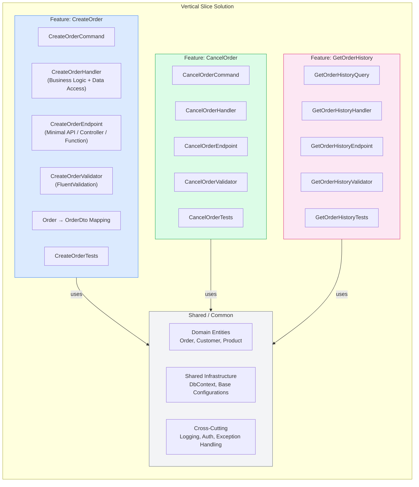
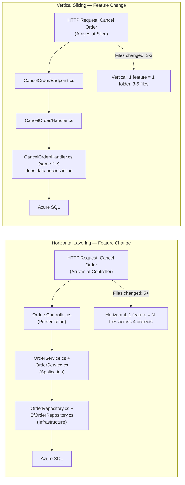
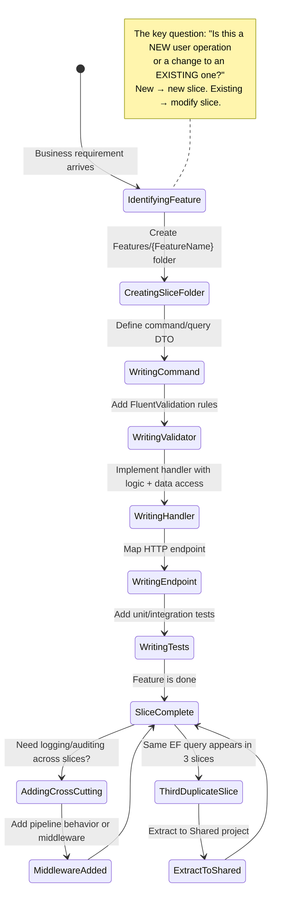
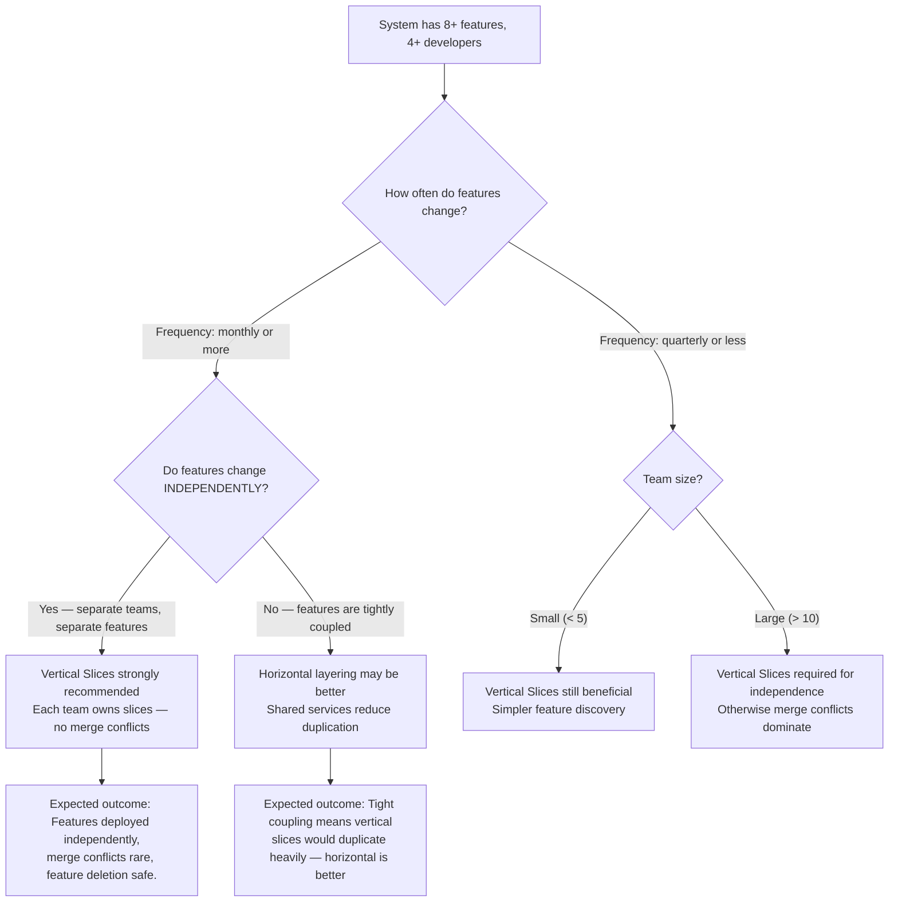

> [!success] Mastery Check
> - [ ] **Studied Well**
> - [ ] **Can explain the concept without notes**
> - [ ] **Can answer interview questions confidently**
> - [ ] **Can implement it in a real project**


> [!ABSTRACT] Quick Reference — Vertical Slice Architecture (Features as Slices)
> **Invariant:** Organize code by FEATURE (CreateOrder, CancelOrder, GetOrderHistory) not by LAYER (Controllers, Services, Repositories). Each feature is a VERTICAL SLICE containing ALL concerns for that user operation — API endpoint, command/query DTO, validation, business logic, data access. Slices are independent — changing one feature never requires changing another feature's files.
> **Cost:** Code that would be SHARED across features (like base entity classes, shared validation logic, common mapping) is now DUPLICATED across slices or extracted to a shared kernel. Without discipline, slices grow to thousands of lines each. Cross-cutting concerns (logging, auditing, security) require middleware or decorators instead of shared base classes.
> **Trigger:** When horizontal layering (Controllers → Services → Repositories) causes a single feature change to touch 8+ files across 4 projects, or when a new developer cannot find all the code for "submit an order" without opening 5 different folders.
> **Skip When:** The system has very few features (< 5) or the team is small (< 3) and prefers the predictability of horizontal layering. Also skip when the domain logic is so intertwined that slices cannot be cleanly separated.
> **.NET Entry Point:** Feature folder under a specific namespace: `Features/Orders/CreateOrder/CreateOrderCommand.cs + CreateOrderHandler.cs + CreateOrderEndpoint.cs` / MediatR `IRequest<T>` + `IRequestHandler<TRequest, TResponse>` / Carter or Minimal API for endpoints / FluentValidation per-slice validator
> **Azure Native:** Azure Functions as slice endpoints: `Functions/Orders/CreateOrderFunction.cs` contains trigger + command + handler in one file. Azure Durable Functions as slice orchestrators.
> **Number to Know:** A typical vertical slice for a CRUD operation is 3–5 files (command, handler, endpoint, validator, EF config) compared to horizontal layering's 8–12 files (controller, service interface, service impl, repository interface, repository impl, mapping profile, DTO class, validator, EF entity config, test). Vertical Slice reduces file count for a feature by ~50–60%.

## Navigation

**Domain:** [[7 — System Design & Distributed Systems]] > **Group:** Clean Architecture
**Previous:** [[7.013 — Onion Architecture — Comparison with Clean Architecture]] | **Next:** [[7.015 — Vertical Slice Architecture — MediatR per Slice]]

### Prerequisites
- [[7.001 — Clean Architecture — The Dependency Rule]] — Vertical Slices still respect the Dependency Rule at the SLICE level: each slice's handler depends on domain entities, and infrastructure concerns are injected. The difference is the ORGANIZATION UNIT — vertical (by feature) instead of horizontal (by layer).
- [[7.003 — Clean Architecture — Application Layer — Use Cases]] — Vertical Slices are essentially Clean Architecture's Use Cases promoted to the ORGANIZING PRINCIPLE of the entire codebase. Understanding Use Cases is required to understand what a "slice" contains.
- [[7.011 — Hexagonal Architecture — Ports and Adapters]] — Vertical Slices often use port/adapter interfaces within each slice. The slice defines its own port interfaces if needed, though shared ports are extracted to a common project.

### Where This Fits

> [!INFO] Production Encounter Map
> - **Layer:** Application design-time organization — affects folder structure, namespaces, and dependency management within the solution
> - **Trigger:** After 12 months of horizontal layering, a new feature requires: 1 new controller action, 1 new service method, 1 new repository method, 1 new DTO, 1 new mapping profile, 1 new validator. That's 6 files across 4 projects. A developer asks: "Why does adding ONE screen require touching SIX files?" This is the moment Vertical Slices becomes attractive.
> - **Without it:** Horizontal layering spreads a single feature's code across 4+ projects and 6+ files. A developer must open 3 solutions folders just to understand "what happens when the user clicks 'submit order.'" Feature discovery is slow. Feature deletion is dangerous (leftover code in every layer).
> - **First signal:** A developer opens 6 files to trace a single request path. Or worse: a developer adds a new controller action to an existing controller "because the feature is small" rather than creating the proper 6-file structure.

Vertical Slice Architecture (championed by Jimmy Bogard) organizes code by FEATURE rather than by LAYER. Instead of having separate folders for Controllers, Services, Repositories, and DTOs, each feature gets its OWN folder containing everything needed to implement that feature: the command/query DTO, the handler (business logic), the endpoint (API surface), the validator, and the data access. Slices are independent and can be understood, tested, changed, and deleted without touching other slices.

## Core Mental Model

Horizontal Layering organizes by TECHNOLOGY ROLE: "all controllers go here, all services go here, all repositories go here." Vertical Slicing organizes by BUSINESS CAPABILITY: "everything for creating an order goes here, everything for cancelling goes here, everything for viewing order history goes here."

```
Horizontal Layering (Clean Architecture):
┌─────────────────────────────────────────────────────┐
│ Presentation Layer: OrdersController (+ all endpoints) │
├─────────────────────────────────────────────────────┤
│ Application Layer: OrderService (+ all use cases)     │
├─────────────────────────────────────────────────────┤
│ Domain Layer: Order Entity (+ all domain logic)       │
├─────────────────────────────────────────────────────┤
│ Infrastructure: OrderRepository (+ all data access)   │
└─────────────────────────────────────────────────────┘
  A change to "cancel order" touches ALL 4 layers.

Vertical Slicing:
┌─────────────────────┬──────────────────┬──────────┐
│ CreateOrder         │ CancelOrder      │ GetOrders│
│  - Command          │  - Command       │  - Query │
│  - Handler          │  - Handler       │  - Result│
│  - Endpoint         │  - Endpoint      │  - Endpt │
│  - Validator        │  - Validator     │  - Valid │
│  - EF Config        │  - EF Config     │  - EF Cf │
│  - Tests            │  - Tests         │  - Tests │
└─────────────────────┴──────────────────┴──────────┘
  A change to "cancel order" touches ONLY CancelOrder/ folder.
```

The key insight: code changes together because of a FEATURE, not because of a LAYER. When the business says "change how cancellations work," every relevant code change — from the HTTP endpoint through validation, business logic, and data access — should be in ONE folder, not scattered across the solution. Vertical Slices make this true by construction.

> [!TIP] The Non-Obvious Insight
> The most common objection to Vertical Slices is "but code DUPLICATION!" Teams worry that two slices will both need to look up a customer by ID, and without a shared `CustomerRepository`, each slice will duplicate the lookup. The insight: the DUPLICATION IS THE POINT. Each slice's "customer lookup" is optimized for THAT SLICE's requirements — one slice needs the full customer aggregate, another needs only the customer's email. A shared `CustomerRepository` returns too much data or too little. Vertical Slices let each slice define the PERFECT data access for its use case. When a third slice needs the same query, THAT is the right time to extract a shared query — not before. Premature extraction (which horizontal layering encourages) creates shared code that nobody actually shares. Vertical Slices follow the Rule of Three: duplicate once, extract on the third occurrence.

### Classification

- **Consistency axis:** N/A — code organization pattern, not a consistency model
- **Availability tradeoff:** N/A — affects developer productivity and feature isolation, not runtime availability
- **Latency impact:** ~0ms — MediatR dispatch adds ~0.001ms per slice call; the slice organization does not affect runtime code execution
- **Failure domain:** N/A — compile-time organization convention
- **Abstraction layer:** Pattern — application-level file organization strategy

### Primary Diagram



### Supporting Diagram



### Numbers That Matter

| Metric | Value | Context / Conditions |
|---|---|---|
| Files per feature (Vertical Slice) | 3–5 files | Command/Query, Handler, Endpoint, Validator, EF Config |
| Files per feature (Horizontal Layering) | 8–12 files | Controller, Service Interface, Service Implementation, Repository Interface, Repository Implementation, DTO, Mapping Profile, Validator, EF Entity Config, Tests |
| File reduction with Vertical Slices | ~50–60% fewer files per feature | No separate interface/implementation split for services or repositories |
| Code duplication across slices (typical) | ~15–30% of data access code duplicated | Each slice has its own EF query — same table, different query shapes |
| Extract-to-shared threshold (Rule of Three) | 3 occurrences before extracting | Duplicate twice, extract on the third |
| Learning curve for new developers | Lower — open ONE folder to understand a feature | No cross-project navigation required for feature understanding |
| Feature deletion safety (Vertical) | HIGH — delete one folder | No orphaned code in other layers |
| Feature deletion safety (Horizontal) | LOW — must check every layer for orphaned code | Controller method without service method, service method without repository method |

### Key Properties / Guarantees

| Property | Value | Condition |
|---|---|---|
| Feature cohesion | ALL code for a feature is in ONE folder | By construction — the folder IS the feature |
| Cross-slice coupling | ZERO at the file level | Slices do not reference each other's files; shared code is in a common project |
| Duplication tolerance | Expected and managed — extract on third occurrence | Rule of Three prevents premature abstraction |
| Change isolation | A feature change touches only that feature's folder | Except when shared domain entities or cross-cutting concerns change |
| Test isolation | Unit test a slice in isolation | Handler can be instantiated with mocked dependencies |
| Deployability | Same deploy unit (all slices deploy together) | Monolith — all slices are in the same solution |

## Deep Mechanics

### How It Works

**Slice Structure:**

A Vertical Slice is a folder containing all files for one user operation:

```
Features/
  Orders/
    CreateOrder/
      CreateOrderCommand.cs        # DTO + MediatR IRequest
      CreateOrderHandler.cs        # IRequestHandler — business logic + data access
      CreateOrderEndpoint.cs       # Minimal API / Carter mapping
      CreateOrderValidator.cs      # FluentValidation
      CreateOrderTests.cs          # Unit tests
    CancelOrder/
      CancelOrderCommand.cs
      CancelOrderHandler.cs
      CancelOrderEndpoint.cs
      CancelOrderValidator.cs
      CancelOrderTests.cs
    GetOrderHistory/
      GetOrderHistoryQuery.cs
      GetOrderHistoryHandler.cs
      GetOrderHistoryEndpoint.cs
      GetOrderHistoryTests.cs
```

**Request Flow Through a Slice:**

1. HTTP request arrives at the endpoint (Minimal API mapping, Carter module, or controller).
2. The endpoint deserializes the request body into the command/query DTO.
3. The endpoint calls `mediator.Send(command)` — dispatching to the handler.
4. The handler executes business logic AND data access (no separate service/repository layer).
5. The handler returns a result DTO.
6. The endpoint serializes the result to the HTTP response.

**What goes in the Handler:**

Unlike Clean Architecture where the Use Case calls a repository interface, the Vertical Slice Handler OFTEN does data access directly — injecting `DbContext`, `Dapper`, or Azure SDK client. This is intentional: the handler IS the service layer AND the repository combined for that specific feature. The handler is NOT reusable across features — it is scoped to exactly one operation.

**What goes in Shared:**

Truly shared code lives in a common project:
- Domain entities (Order, Customer, Product — business objects with behavior)
- Base infrastructure (DbContext registration, health checks, middleware)
- Cross-cutting concerns (logging, authentication, exception handling)

The shared project should be MINIMAL — only code that is GENUINELY used by multiple slices. If only one slice uses it, it stays in that slice.

### Protocol Trace

```
Request Flow Through a Vertical Slice — CreateOrder:

Happy Path:
  1. HTTP Client → [Minimal API Endpoint]: POST /api/orders (JSON body) (~1ms WAN)
  2. Endpoint → [CreateOrderCommand]: Bind JSON to command DTO (~0.05ms)
  3. Endpoint → [CreateOrderValidator]: Validate command (~0.1ms)
  4. Endpoint → [MediatR]: mediator.Send(command) (~0.01ms)
  5. MediatR → [CreateOrderHandler]: Handle(command) (~0.001ms)
  6. Handler → [DbContext]: Load Customer aggregate (~5ms SQL)
  7. Handler → [Domain]: Order.Create(customer, items) (~0.01ms domain logic)
  8. Handler → [DbContext]: Save Order to database (~5ms SQL)
  9. Handler → [MediatR]: CreateOrderResult { OrderId: guid } (~0.001ms)
  10. MediatR → [Endpoint]: CreateOrderResult
  11. Endpoint → [HTTP Response]: 201 Created { orderId: guid } (~0.05ms)
  Total: ~11ms (dominated by SQL queries in handler)

Failure Path — Validation Fails:
  1. HTTP Client → [Endpoint]: POST /api/orders { customerId: null, items: [] }
  2. Endpoint → [CreateOrderValidator]: Validate command — fails
  3. Endpoint → [HTTP Response]: 400 Bad Request { errors: { ... } }
  Total: ~0.1ms — no MediatR dispatch, no handler execution

Failure Path — Domain Logic Rejects:
  1. HTTP Client → [Endpoint]: POST /api/orders (valid format, customer has credit limit exceeded)
  2. Endpoint → [Handler]: mediator.Send(command)
  3. Handler → [Domain]: Order.Create(customer, items) → returns Result.Failure
  4. Handler → [Endpoint]: Result<CreateOrderResult>.Failure(CreditLimitExceeded)
  5. Endpoint → [HTTP Response]: 422 Unprocessable Entity { code: "CREDIT_LIMIT_EXCEEDED" }
  Total: ~6ms (includes SQL for customer load, but no SQL write)
```

### State Transitions



### Failure Modes

**Failure Mode 1: Bloated Slice — Handler Does 20 Things**

- **Cause:** A single slice's handler accumulates multiple responsibilities over time — "CreateOrder" handler also emails the customer, updates inventory, sends analytics, and submits to fraud detection. The handler grows to 500+ lines.
- **Symptom:** The `CreateOrderHandler` cannot be unit-tested without mocking 8 dependencies. Adding a new behavior to "CreateOrder" requires touching the handler (high risk of breaking existing behavior).
- **Detection time:** When a handler's constructor has 6+ injected dependencies, or when a handler's `Handle` method exceeds 100 lines.
- **Blast radius:** A single slice becomes a mini-"god class" — violating Single Responsibility within the slice.

> [!DANGER] 3 AM Production Signal
> Metric: `handler_constructor_parameter_count{handler="CreateOrderHandler"} > 6`
> Log: `WARN [Architecture] CreateOrderHandler has 8 dependencies — consider splitting into sub-handlers | File: Features/Orders/CreateOrder/CreateOrderHandler.cs`
> Customer impact: A bug fix for "order confirmation email" requires deploying the entire CreateOrder handler — increasing deployment risk for an unrelated email change.

**Failure Mode 2: Slice References Another Slice — Cross-Slice Coupling**

- **Cause:** `CreateOrderHandler` imports `CancelOrderCommand` to "check if the customer has recent cancellations." Now `CreateOrder` depends on `CancelOrder` — changing `CancelOrderCommand` can break `CreateOrder`.
- **Symptom:** A change to `CancelOrderCommand` (renaming a property) causes a compile error in `CreateOrderHandler`. The two features are coupled despite being in different folders.
- **Detection time:** When deleting the `CancelOrder` slice (feature removal) causes compile errors in `CreateOrder`.
- **Blast radius:** Slices cannot be independently developed, tested, or removed. The architecture degrades to spaghetti.

> [!DANGER] 3 AM Production Signal
> Metric: `cross_slice_references{from="CreateOrder", to="CancelOrder"} == 1`
> Log: `ERROR [ArchitectureAnalyzer] Cross-slice reference detected: CreateOrderHandler imports CancelOrderCommand | File: Features/Orders/CreateOrder/CreateOrderHandler.cs`
> Customer impact: Removing the CancelOrder feature (business decides to simplify) requires modifying CreateOrder — a 2-hour change becomes a 2-week investigation.

### .NET and Azure Integration Points

- **MediatR:** The backbone of .NET Vertical Slices. `IRequest<T>` + `IRequestHandler<TRequest, TResponse>`. Slice handler implements `IRequestHandler`. Endpoint calls `mediator.Send(command)`.
- **Carter / Minimal API:** Endpoint definition. `WebApplication.MapPost("/api/orders", handler)` or Carter's `ICarterModule`.
- **FluentValidation:** Per-slice validator. `CreateOrderValidator : AbstractValidator<CreateOrderCommand>`. Registered with `IServiceCollection.AddValidatorsFromAssemblyContaining<CreateOrderValidator>()`.
- **EF Core:** Handler injects `DbContext` directly (no repository abstraction). Handler owns its query. `await context.Orders.FirstOrDefaultAsync(o => o.Id == command.OrderId)`.
- **Azure Functions:** Function as slice endpoint. `CreateOrderFunction` contains command + handler + function trigger in the same file.
- **Polly:** Applied inside handler for transient fault handling — no separate adapter layer needed for simple cases.

```csharp
// A complete Vertical Slice — all files in Features/Orders/CreateOrder/

// Features/Orders/CreateOrder/CreateOrderCommand.cs
namespace YourCompany.OrderManagement.Features.Orders.CreateOrder;

public sealed record CreateOrderCommand(
    Guid CustomerId,
    IReadOnlyList<CreateOrderItemDto> Items,
    string? IdempotencyKey) : IRequest<Result<CreateOrderResult>>;

public sealed record CreateOrderItemDto(Guid ProductId, int Quantity, decimal UnitPrice);
public sealed record CreateOrderResult(Guid OrderId);

// Features/Orders/CreateOrder/CreateOrderValidator.cs
public sealed class CreateOrderValidator : AbstractValidator<CreateOrderCommand>
{
    public CreateOrderValidator()
    {
        RuleFor(x => x.CustomerId).NotEmpty();
        RuleFor(x => x.Items).NotEmpty().WithMessage("At least one item is required.");
        RuleForEach(x => x.Items).ChildRules(item =>
        {
            item.RuleFor(i => i.ProductId).NotEmpty();
            item.RuleFor(i => i.Quantity).GreaterThan(0);
            item.RuleFor(i => i.UnitPrice).GreaterThan(0);
        });
    }
}

// Features/Orders/CreateOrder/CreateOrderHandler.cs
public sealed class CreateOrderHandler : IRequestHandler<CreateOrderCommand, Result<CreateOrderResult>>
{
    private readonly OrderDbContext _db;       // Direct DbContext — no repository
    private readonly ILogger<CreateOrderHandler> _logger;

    public CreateOrderHandler(OrderDbContext db, ILogger<CreateOrderHandler> logger)
    {
        _db = db;
        _logger = logger;
    }

    public async Task<Result<CreateOrderResult>> Handle(CreateOrderCommand command, CancellationToken ct)
    {
        var customer = await _db.Customers.FindAsync([command.CustomerId], ct);
        if (customer is null)
            return Result<CreateOrderResult>.Failure(
                new ApplicationError("CUSTOMER_NOT_FOUND", "Customer not found.", 404));

        // Domain logic — direct, no separate service layer
        var orderResult = Order.Create(customer.Id, command.Items
            .Select(i => new OrderItem(i.ProductId, i.Quantity, i.UnitPrice)).ToList());

        if (!orderResult.IsSuccess)
            return Result<CreateOrderResult>.Failure(
                new ApplicationError("ORDER_CREATION_FAILED", orderResult.Error.Message, 422));

        _db.Orders.Add(orderResult.Value);
        await _db.SaveChangesAsync(ct);

        _logger.LogInformation("Order {OrderId} created for customer {CustomerId}",
            orderResult.Value.Id, customer.Id);

        return Result<CreateOrderResult>.Success(new CreateOrderResult(orderResult.Value.Id));
    }
}

// Features/Orders/CreateOrder/CreateOrderEndpoint.cs
public static class CreateOrderEndpoint
{
    public static void MapCreateOrder(this IEndpointRouteBuilder app)
    {
        app.MapPost("/api/orders", async (
            CreateOrderCommand command,
            ISender sender,
            HttpContext httpContext,
            CancellationToken ct) =>
        {
            var result = await sender.Send(command, ct);
            return result.Match<IResult>(
                success => Results.Created($"/api/orders/{success.OrderId}", success),
                error => error.HttpStatus switch
                {
                    404 => Results.NotFound(error),
                    409 => Results.Conflict(error),
                    422 => Results.UnprocessableEntity(error),
                    _ => Results.Problem(error.Message, statusCode: error.HttpStatus)
                });
        })
        .WithName("CreateOrder")
        .WithOpenApi();
    }
}

// Program.cs — wire everything
var builder = WebApplication.CreateBuilder(args);

builder.Services.AddDbContext<OrderDbContext>(/* ... */);
builder.Services.AddMediatR(cfg => cfg.RegisterServicesFromAssemblyContaining<CreateOrderHandler>());
builder.Services.AddValidatorsFromAssemblyContaining<CreateOrderValidator>();

var app = builder.Build();
app.MapCreateOrder(); // Extension method from endpoint
app.Run();
```

## Production Patterns and Implementation

### Primary Implementation — Complete Vertical Slice for CancelOrder

```csharp
// ===========================================================
// FEATURE: CancelOrder
// ===========================================================
// Features/Orders/CancelOrder/
namespace YourCompany.OrderManagement.Features.Orders.CancelOrder;

// --- Command ---
public sealed record CancelOrderCommand(Guid OrderId, string Reason) : IRequest<Result<CancelOrderResult>>;
public sealed record CancelOrderResult(Guid OrderId, DateTime CancelledAt);

// --- Validator ---
public sealed class CancelOrderValidator : AbstractValidator<CancelOrderCommand>
{
    public CancelOrderValidator()
    {
        RuleFor(x => x.OrderId).NotEmpty();
        RuleFor(x => x.Reason).NotEmpty().MinimumLength(5)
            .WithMessage("Cancellation reason must be at least 5 characters.");
    }
}

// --- Handler (Business Logic + Data Access) ---
public sealed class CancelOrderHandler : IRequestHandler<CancelOrderCommand, Result<CancelOrderResult>>
{
    private readonly OrderDbContext _db;
    private readonly ILogger<CancelOrderHandler> _logger;

    public CancelOrderHandler(OrderDbContext db, ILogger<CancelOrderHandler> logger)
    {
        _db = db;
        _logger = logger;
    }

    public async Task<Result<CancelOrderResult>> Handle(CancelOrderCommand command, CancellationToken ct)
    {
        var order = await _db.Orders
            .Include(o => o.LineItems)
            .FirstOrDefaultAsync(o => o.Id == command.OrderId, ct);

        if (order is null)
            return Result<CancelOrderResult>.Failure(
                new ApplicationError("ORDER_NOT_FOUND", $"Order {command.OrderId} not found.", 404));

        // Domain behavior — Order.Cancel() encapsulates state transition rules
        var cancelResult = order.Cancel(command.Reason);
        if (!cancelResult.IsSuccess)
            return Result<CancelOrderResult>.Failure(
                new ApplicationError("CANCEL_FAILED", cancelResult.Error.Message, 422));

        // Data access within the same handler
        await _db.SaveChangesAsync(ct);

        _logger.LogInformation("Order {OrderId} cancelled. Reason: {Reason}", command.OrderId, command.Reason);

        return Result<CancelOrderResult>.Success(new CancelOrderResult(order.Id, DateTime.UtcNow));
    }
}

// --- Endpoint ---
public static class CancelOrderEndpoint
{
    public static void MapCancelOrder(this IEndpointRouteBuilder app)
    {
        app.MapDelete("/api/orders/{orderId:guid}", async (
            Guid orderId,
            [FromBody] CancelOrderRequest request,
            ISender sender,
            CancellationToken ct) =>
        {
            var command = new CancelOrderCommand(orderId, request.Reason);
            var result = await sender.Send(command, ct);
            return result.Match<IResult>(
                success => Results.Ok(success),
                error => error.HttpStatus switch
                {
                    404 => Results.NotFound(error),
                    422 => Results.UnprocessableEntity(error),
                    _ => Results.Problem(error.Message, statusCode: error.HttpStatus)
                });
        })
        .WithName("CancelOrder")
        .WithOpenApi();
    }
}

// --- Request DTO (for endpoint binding) ---
public sealed record CancelOrderRequest(string Reason);
```

### IServiceCollection Registration

```csharp
// Program.cs — Minimal API registration
var builder = WebApplication.CreateBuilder(args);

// Slices register their dependencies via MediatR and EF Core
builder.Services.AddDbContext<OrderDbContext>(options =>
    options.UseSqlServer(builder.Configuration.GetConnectionString("OrderManagementDb")));

// MediatR — discovers all IRequestHandler implementations in the assembly
builder.Services.AddMediatR(cfg =>
{
    cfg.RegisterServicesFromAssemblyContaining<CreateOrderHandler>();
    cfg.AddOpenBehavior(typeof(LoggingBehavior<,>));   // Cross-cutting: logging
    cfg.AddOpenBehavior(typeof(ValidationBehavior<,>)); // Cross-cutting: validation
});

// FluentValidation — discovers all validators
builder.Services.AddValidatorsFromAssemblyContaining<CreateOrderValidator>();

var app = builder.Build();

// Map endpoints — each slice exposes its own
app.MapCreateOrder();
app.MapCancelOrder();
app.MapGetOrderHistory();

app.Run();
```

### Common Variants

```csharp
// Variant A — Handler uses Dapper instead of EF Core (read-optimized slices)
// Features/Orders/GetOrderHistory/GetOrderHistoryHandler.cs
public sealed class GetOrderHistoryHandler : IRequestHandler<GetOrderHistoryQuery, Result<OrderHistoryResult>>
{
    private readonly SqlConnection _sql; // Direct Dapper

    public GetOrderHistoryHandler(IConfiguration config)
    {
        _sql = new SqlConnection(config.GetConnectionString("OrderManagementDb"));
    }

    public async Task<Result<OrderHistoryResult>> Handle(GetOrderHistoryQuery query, CancellationToken ct)
    {
        var orders = await _sql.QueryAsync<OrderSummary>(@"
            SELECT o.Id, o.CreatedAt, o.TotalAmount, o.Status
            FROM Orders o
            WHERE o.CustomerId = @CustomerId
            ORDER BY o.CreatedAt DESC
            OFFSET @Offset ROWS FETCH NEXT @PageSize ROWS ONLY",
            new { query.CustomerId, Offset = (query.Page - 1) * query.PageSize, query.PageSize });

        return Result<OrderHistoryResult>.Success(
            new OrderHistoryResult(orders.ToList()));
    }
}

// Variant B — Azure Function as slice endpoint
// Features/Orders/CreateOrder/CreateOrderFunction.cs
public sealed class CreateOrderFunction
{
    private readonly ISender _sender;

    public CreateOrderFunction(ISender sender) { _sender = sender; }

    [FunctionName("CreateOrder")]
    public async Task<IActionResult> Run(
        [HttpTrigger(AuthorizationLevel.Function, "post", Route = "orders")] HttpRequest req,
        CancellationToken ct)
    {
        var command = await req.ReadFromJsonAsync<CreateOrderCommand>(ct);
        var result = await _sender.Send(command, ct);
        return result.Match<IActionResult>(
            success => new CreatedResult($"/api/orders/{success.OrderId}", success),
            error => new ObjectResult(error) { StatusCode = error.HttpStatus });
    }
}
```

### Performance Profile

```csharp
[MemoryDiagnoser]
[SimpleJob(RuntimeMoniker.Net80)]
public class VerticalSliceDispatchBenchmark
{
    private ISender _sender;
    private CreateOrderCommand _command;

    [GlobalSetup]
    public void Setup()
    {
        var services = new ServiceCollection();
        services.AddDbContext<OrderDbContext>(options => options.UseInMemoryDatabase("bench"));
        services.AddMediatR(cfg => cfg.RegisterServicesFromAssemblyContaining<CreateOrderHandler>());
        services.AddValidatorsFromAssemblyContaining<CreateOrderValidator>();
        var provider = services.BuildServiceProvider();
        _sender = provider.GetRequiredService<ISender>();
        _command = new CreateOrderCommand(Guid.NewGuid(),
            new List<CreateOrderItemDto> { new(Guid.NewGuid(), 2, 10m) }, null);
    }

    [Benchmark(Baseline = true)]
    public async Task<Result<CreateOrderResult>?> DispatchToSlice()
    {
        return await _sender.Send(_command, CancellationToken.None) as Result<CreateOrderResult>;
    }
}
```

Expected results (estimated — MediatR dispatch overhead is negligible):

| Method | Mean | Allocated | Improvement |
|---|---|---|---|
| DispatchToSlice (MediatR + Handler + InMemory DB) | ~0.5–2ms | ~15–25 KB | baseline — dominated by in-memory EF Core operations |

### Real-World .NET Ecosystem Mapping

| Pattern in This Note | Where It Appears in .NET / Azure | Manifestation |
|---|---|---|
| Slice = Feature folder | `Features/Orders/CreateOrder/` | Solution folder containing all files for the feature |
| Command/Query | `IRequest<T>` (MediatR) | Immutable record with input data for the operation |
| Handler | `IRequestHandler<TRequest, TResponse>` | Contains business logic + data access — no separate service layer |
| Endpoint | Minimal API `MapPost()` / Carter `ICarterModule` | HTTP binding for the slice |
| Validator | `AbstractValidator<T>` (FluentValidation) | Per-slice validation rules |
| Cross-cutting (logging, validation) | MediatR `IPipelineBehavior<TRequest, TResponse>` | Middleware that runs before/after every slice handler |
| Slice with Azure Function | `[HttpTrigger]` on function method | Function IS the endpoint |

## Gotchas and Production Pitfalls

---

### Pitfall 1: Handler Does Too Much — Monolithic 500-Line Handler

**Pitfall:** The handler for `CreateOrder` also sends email, updates inventory, calls fraud detection, writes analytics, and synchronizes with ERP — all in one `Handle` method.

**Fix:**

```csharp
// ✅ Decompose the handler into focused private methods or sub-handlers
public sealed class CreateOrderHandler : IRequestHandler<CreateOrderCommand, Result<CreateOrderResult>>
{
    // ... dependencies ...

    public async Task<Result<CreateOrderResult>> Handle(CreateOrderCommand command, CancellationToken ct)
    {
        var customer = await LoadCustomerAsync(command.CustomerId, ct);
        if (customer is null) return NotFound();

        var order = CreateOrder(customer, command.Items);
        if (order is null) return ValidationFailed();

        await SaveOrderAsync(order, ct);
        await PublishEventsAsync(order, ct);      // Fire-and-forget or outbox
        return Success(order.Id);
    }

    // Private methods keep handler readable
    private async Task<Customer?> LoadCustomerAsync(Guid id, CancellationToken ct) { /* ... */ }
    private Order? CreateOrder(Customer customer, IReadOnlyList<CreateOrderItemDto> items) { /* ... */ }
}
```

**Cost of not fixing:** 500+ line handler is untestable — each test must mock all dependencies even for a simple branch.

---

### Pitfall 2: Duplicate DbContext Injection Across Slices — Missing Deleted Records

**Pitfall:** All slices inject `OrderDbContext` directly. A `CancelOrderHandler` loads an order, cancels it, and saves. But the `GetOrderHistoryHandler` loads orders directly without tracking — it uses `AsNoTracking()`. The `DbContext` is scoped per request — if `CancelOrderHandler` and `GetOrderHistoryHandler` run in the same request (unlikely but possible), the `AsNoTracking` query sees stale data.

**Fix:** Use `IDbContextFactory<T>` for read-only slices, or accept that slices share the scoped `DbContext` — they don't run concurrently in the same request.

---

### Pitfall 3: Shared DbContext Across Slices Causes Unexpected Saves

**Pitfall:** `CancelOrderHandler` modifies an `Order` entity and calls `SaveChangesAsync`. But `CreateOrderHandler` in the same request (batch scenario) also has a tracked `Order` entity. The `CancelOrderHandler`'s save accidentally persists the `CreateOrderHandler`'s changes — or vice versa.

**Fix:** Slices should not share a `DbContext` across operations. Use `SaveChangesAsync` only once per handler. If a batch operation needs multiple saves, use `ITransactionScope` or explicit `context.ChangeTracker.Clear()`.

---

### Pitfall 4: No Shared Domain — Each Slice Duplicates Order Entity Logic

**Pitfall:** Each slice that touches orders defines its own `Order` class with properties and behavior — `CreateOrderHandler` has `Order` with `Create()` method, `CancelOrderHandler` has `Order` with `Cancel()` method, `GetOrderHistoryHandler` defines `OrderSummary` with query-only fields. The `Order` class is duplicated across 3 slices.

**Fix:** Keep domain ENTITIES in a shared project. Only DTOs and commands are slice-specific:

```
Shared/  → Order.cs (domain entity with domain behavior)
Features/Orders/CreateOrder/  → CreateOrderCommand.cs + CreateOrderHandler.cs
Features/Orders/CancelOrder/   → CancelOrderCommand.cs + CancelOrderHandler.cs
```

---

### Pitfall 5: Slice Accesses Another Slice's Files

**Pitfall:** `CancelOrderHandler.cs` has `using YourCompany.OrderManagement.Features.Orders.CreateOrder;` and calls `new CreateOrderCommand(...)` to "create a replacement order" during cancellation. Now deleting the CreateOrder feature breaks CancelOrder.

**Fix:** Never reference another feature's types. If multiple features need the same operation, extract it to the Shared project or introduce a cross-feature service in Shared.

---

### Pitfall 6: No Cross-Cutting Middleware — Every Slice Duplicates Logging, Auth, Metrics

**Pitfall:** Every handler starts with `_logger.LogInformation("Starting {Feature}", nameof(CancelOrderHandler))` and ends with `_logger.LogInformation("Completed {Feature}", ...)`. Every handler checks `if (httpContext.User.Identity?.IsAuthenticated != true)`. Duplication across all 50 slices.

**Fix:** Use MediatR pipeline behaviors for cross-cutting concerns. One `LoggingBehavior<TRequest, TResponse>` handles logging for ALL slices.

```csharp
public sealed class LoggingBehavior<TRequest, TResponse> : IPipelineBehavior<TRequest, TResponse>
    where TRequest : IRequest<TResponse>
{
    private readonly ILogger<LoggingBehavior<TRequest, TResponse>> _logger;

    public async Task<TResponse> Handle(TRequest request, RequestHandlerDelegate<TResponse> next, CancellationToken ct)
    {
        _logger.LogInformation("Handling {RequestType} with {@Request}", typeof(TRequest).Name, request);
        var response = await next(ct);
        _logger.LogInformation("Handled {RequestType} with {@Response}", typeof(TRequest).Name, response);
        return response;
    }
}
```

---

### Pitfall 7: Transaction Boundaries Across Slices — No Distributed Transactions

**Pitfall:** A business transaction requires saving an order (CreateOrder slice) AND reserving inventory (ReserveInventory slice). Both slices have their own handlers and `SaveChangesAsync`. If CreateOrder succeeds but ReserveInventory fails, the order is saved without inventory reservation — data inconsistency.

**Fix:** Use a parent orchestrator slice that calls both sub-operations in the same transaction scope:

```csharp
public sealed class CheckoutHandler : IRequestHandler<CheckoutCommand, Result<CheckoutResult>>
{
    public async Task<Result<CheckoutResult>> Handle(CheckoutCommand command, CancellationToken ct)
    {
        using var transaction = await _db.Database.BeginTransactionAsync(ct);
        try
        {
            var createResult = await _mediator.Send(new CreateOrderCommand(command), ct);
            if (!createResult.IsSuccess) return createResult;

            var reserveResult = await _mediator.Send(new ReserveInventoryCommand(command), ct);
            if (!reserveResult.IsSuccess) return reserveResult;

            await transaction.CommitAsync(ct);
            return CheckoutResult.Success(createResult.Value.OrderId);
        }
        catch
        {
            await transaction.RollbackAsync(ct);
            throw;
        }
    }
}
```

## Tradeoffs and Decision Framework

### Tradeoff Matrix

| Dimension | Vertical Slice Architecture | Clean Architecture (Horizontal) | No Architecture |
|---|---|---|---|
| Feature cohesion | HIGH — all feature code in one folder | LOW — feature code across 4 projects | NONE — code scattered arbitrarily |
| Code duplication across features | ~15–30% (duplicated queries, similar handlers) | ~5–10% (shared repositories, services) | N/A |
| Cross-cutting concern enforcement | Middleware/pipeline behaviors required | Built into layers (shared base classes) | N/A |
| Learning curve per feature | LOW — open one folder | HIGH — understand 4 projects' structure | NONE |
| Feature deletion safety | HIGH — delete folder | LOW — search every layer for orphaned code | VERY LOW |
| Microservice extraction readiness | HIGH — a slice IS a microservice candidate | MEDIUM — use case + service must be extracted together | LOW |
| Common .NET NuGet packages | MediatR, FluentValidation, Carter | MediatR, AutoMapper, EF Core | None |

### When to Apply



### Numbers-Driven Decision

| Threshold | Below = Horizontal | Above = Vertical Slices |
|---|---|---|
| Number of features | < 5 | > 10 |
| File count per feature (horizontal) | < 6 files per feature | > 8 files per feature |
| Team size | < 3 developers | > 5 developers |
| Feature independence | Features always change together | Features change independently |
| Expected lifetime | < 1 year (prototype) | > 2 years |

### When NOT to Apply

> [!WARNING] Do Not Reach For This When...
> - [ ] **Features are deeply coupled — changing one always requires changing another:** If "Create Order" always requires "Update Inventory" and "Send Notification" together, the slices will duplicate orchestration logic or reference each other — defeating the purpose.
> - [ ] **The team is small and the codebase is small (< 5 features):** The overhead of setting up MediatR, FluentValidation, pipeline behaviors, and per-slice folders is not justified for a simple CRUD app with 3 screens.
> - [ ] **No cross-cutting middleware is set up:** Without pipeline behaviors for logging, validation, and error handling, EVERY slice will duplicate these concerns. The duplication becomes unmanageable at 10+ slices.
> - [ ] **The domain logic is HTML-page-level simple:** If a feature is "display a static table from one database table," the slice has one file — the endpoint. Adding command/handler/validator files is over-engineering.

## Interview Arsenal

### Question Bank

1. **[Definition]** "What is Vertical Slice Architecture and what specific problem does it solve?"
2. **[Mechanism]** "Walk me through the request flow in a Vertical Slice system — from HTTP request to database."
3. **[Tradeoff]** "What do you give up when you adopt Vertical Slices instead of horizontal layering?"
4. **[Failure mode]** "A Vertical Slice handler grows to 800 lines. What went wrong and how do you fix it?"
5. **[Comparison]** "What is the difference between Vertical Slice Architecture and Clean Architecture?"
6. **[Design application]** "Design a 'forgot password' flow using Vertical Slices. Walk through the slices."
7. **[Scale]** "Your team has 80 Vertical Slices. You realize 40 of them contain the same 'lookup customer' EF Core query. What do you do?"
8. **[Advanced]** "How do you handle transactions that span multiple slices — like 'submit order' that must also 'reserve inventory' and 'charge payment' — each in its own slice?"

### Spoken Answers

**Q: What is Vertical Slice Architecture and what specific problem does it solve?**

> **Average answer:** "Vertical Slice organizes code by feature instead of by layer. Each feature has its own folder with everything needed for that feature."

> **Great answer:** "Vertical Slice Architecture solves the problem that horizontal layering creates: a single business feature is spread across 6+ files in 4 different projects. When the business says 'change how order cancellation works,' you must open the controller, the service interface, the service implementation, the repository interface, the repository implementation, and the DTO — across 4 solution folders. Vertical Slices put ALL code for a feature in ONE folder: the command DTO, the handler with business logic AND data access, the endpoint, and the validator. The handler is the SERVICE and the REPOSITORY combined for that specific operation. This means understanding a feature requires opening ONE folder. Changing a feature changes ONE folder. Deleting a feature deletes ONE folder. The cost is duplication across slices — each slice may have its own 'load customer' query even though 5 other slices do the same thing. But that duplication is MANAGED: we follow the Rule of Three — duplicate twice, extract on the third occurrence. In my experience, the duplication cost is about 15–30% of the data access code, and the benefit — feature isolation and developer productivity — is easily 2x for any feature change."

---

**Q: What is the difference between Vertical Slice Architecture and Clean Architecture?**

> **Average answer:** "Clean Architecture is horizontal (layered by technical concern) and Vertical Slices is vertical (layered by feature). Clean has Domain, Application, Infrastructure. Vertical Slices has one folder per feature."

> **Great answer:** "These are ORTHOGONAL — you can apply both. Clean Architecture creates HORIZONTAL layers (Domain, Application, Infrastructure, Presentation) that separate TECHNICAL concerns. Vertical Slices create VERTICAL boundaries that separate FEATURES. The two can coexist: each vertical slice contains its own 'miniature Clean Architecture' — the handler is the Use Case (Application layer), the entity is the Domain, and the endpoint is the Presentation. The key difference is the PRIMARY ORGANIZING PRINCIPLE. Clean Architecture organizes by 'what TECHNICAL ROLE does this class play?' — all controllers together, all services together. Vertical Slices organize by 'what BUSINESS OPERATION does this code support?' — everything for CreateOrder together, everything for CancelOrder together. In practice, I find that Large systems benefit from BOTH: Clean Architecture at the PROJECT level (Domain, Application, Infrastructure, Presentation assemblies) and Vertical Slices within each project (Feature folders). This gives you the dependency enforcement of Clean Architecture WITH the feature cohesion of Vertical Slices."

---

**Q: How do you handle transactions that span multiple slices — like 'submit order' that must also 'reserve inventory' and 'charge payment'?**

> **Average answer:** "Use a saga or an orchestrator that coordinates the slices. Each slice does its part and the orchestrator handles rollback."

> **Great answer:** "This is the trickiest part of Vertical Slices because slices are INDEPENDENT by design, but business transactions often span multiple operations. The correct approach: create an ORCHESTRATOR SLICE that is the 'SubmitOrder' parent slice. It sends commands to sub-operations (ReserveInventory, ChargePayment) within a single transaction scope. The sub-operations are separate slices but are called SYNCHRONOUSLY within the parent transaction. If any sub-operation fails, the entire transaction rolls back. The key architectural rule: the orchestrator slice is the ONLY slice that knows about the sub-slices. No other slice references ReserveInventory. This means the orchestrator itself becomes a coupling point — but it's a DELIBERATE coupling for a specific business transaction. The alternative is event-driven choreography: SubmitOrder publishes 'OrderSubmitted' event, ReserveInventory subscribes and reserves, PaymentCharged subscribes and charges. Each step is independent — eventual consistency, not ACID. The choice depends on whether the business requires immediate consistency (ACID orchestration) or can accept eventual consistency (event-driven choreography)."

### Whiteboard in 60 Seconds

```
1. Draw a blank box — label "Controllers" on top, "Services" middle, "Repositories" bottom
   "This is horizontal layering. A feature change touches ALL three."

2. Draw 3 vertical columns — "CreateOrder", "CancelOrder", "GetHistory"
   "Vertical Slices: each column is ONE folder containing everything for that feature."

3. Draw inside "CreateOrder": Command, Handler, Endpoint, Validator
   "This is one slice. The Handler does both business logic AND data access.
    There's no separate service. No separate repository. It's all in ONE place."

4. Point at the handler — "It injects DbContext directly."
   "This is controversial but intentional. Each slice owns its query.
    If 3 slices need the same customer query, extract it on the third time."

5. Draw a pipeline arrow wrapping around all slices — label "MediatR Behaviors"
   "Cross-cutting concerns (logging, auth, validation) are pipeline behaviors.
    They run before/after every slice. One behavior, all slices covered."
```

> [!TIP] What the Interviewer Is Specifically Testing
> When they probe this area, they are checking whether you know:
> 1. That Vertical Slices and Clean Architecture are ORTHOGONAL — you can use both
> 2. That duplication in Vertical Slices is MANAGED (Rule of Three), not accidental
> 3. That cross-slice transactions require either an orchestrator slice or event-driven choreography — there is no "free" distributed transaction

### Follow-Up Chain

**Follow-up 1:** "You mentioned handlers do data access directly. How do you unit test a handler that calls `DbContext`?"

> **Model answer:** "You have two options. Option 1: Use InMemoryDatabase for unit tests — `new DbContextOptionsBuilder<OrderDbContext>().UseInMemoryDatabase("test")`. This is fast and tests the EF Core query shape. Option 2: Extract the data access to a separate testable method and mock `DbContext` using a library like `MockQueryable.Moq`. I prefer Option 1 for most slices because it tests the ACTUAL query — if the query changes, the test breaks. Option 2 is better for slices where the InMemory database doesn't reproduce the real SQL behavior (e.g., raw SQL queries, computed columns). The key is: because the handler is SMALL (one operation, one query), the test setup is simple. Compare this to horizontal layering where testing the service requires mocking the repository, which returns pre-canned data — you're not testing the actual query at all."

**Follow-up 2:** "How do you handle authorization across slices? If 'CancelOrder' requires admin role but 'CreateOrder' requires customer role, how does the authorization check work?"

> **Model answer:** "Authorization is a cross-cutting concern, so it belongs in a MEDIATR PIPELINE BEHAVIOR, not in individual handlers. I define an `IAuthorizableRequest<T>` marker interface with a `RequiredPermission` property. The `AuthorizationBehavior<TRequest, TResponse>` checks the current user's claims against the required permission — before the handler executes. Each command/query implements `IAuthorizableRequest<T>` and declares its permission. This means authorization is configured DECLARATIVELY on the command level: `CreateOrderCommand : IRequest<CreateOrderResult>, IAuthorizableRequest<CreateOrderResult> { string RequiredPermission => "orders:create"; }`. A single pipeline behavior handles ALL authorization checks. If CancelOrder requires admin, it declares `RequiredPermission => "orders:cancel"`. The pipeline behavior checks the user's roles. No authorization code in the handler. One behavior, all slices covered."

**Follow-up 3:** "How does Vertical Slice Architecture handle cross-cutting concerns like audit logging or data sovereignty checks that must run for EVERY data modification?"

> **Model answer:** "Same approach as authorization — MediatR pipeline behaviors. For audit logging, I have an `IAuditableRequest` marker interface. The `AuditBehavior` intercepts the command before and after execution: before = serialize the command to the audit log with 'started' status, after = update the audit log with 'completed' status and the result. For data sovereignty (e.g., 'customer data must not leave EU region'), I have a `GeoFencingBehavior` that checks the command's customer ID against the customer's region BEFORE the handler runs. The key insight: Vertical Slices do NOT require repeating cross-cutting code in each handler. The pipeline behavior pattern from MediatR provides AOP-like interception for ALL slices. The behaviors are registered ONCE in `Program.cs` and apply to every `IRequest<T>` handled by MediatR. The slice handler stays focused on its specific feature logic."

### Comparison Table

| | Vertical Slice Architecture | Clean Architecture (Horizontal) |
|---|---|---|
| Core guarantee | Feature code is co-located in ONE folder | Layers are isolated by technical concern |
| What it trades | Duplication across slices (~15–30%) | Feature code spread across 4+ projects |
| .NET implementation | MediatR + Minimal API + FluentValidation | MediatR + Repository interfaces + AutoMapper |
| Primary folder structure | `Features/{FeatureName}/` | `Controllers/`, `Services/`, `Repositories/` |
| Primary failure mode | Bloated handler (500+ lines) | Layer violation (Application references Infrastructure) |
| When to choose | 10+ features, independent feature teams | Complex domain logic requiring strict layer enforcement |
| When NOT to choose | < 5 features, features are tightly coupled | Small team, simple CRUD |

## Architecture Decision Record

**Status:** Accepted

**Context:**
The order management system has grown to 15 features with 4 development teams. Each team owns 3–5 features. The current horizontal layering (Controllers → Services → Repositories) causes frequent merge conflicts because multiple teams modify the same service or repository files. A single feature change requires a developer to open 6+ files across 3 projects. The team has evaluated both Vertical Slices and horizontal Clean Architecture.

**Options Considered:**

1. **Vertical Slice Architecture** — Organize by feature folder. Handler does business logic + data access. Cross-cutting concerns via MediatR pipeline behaviors. Minimal API endpoints. Duplication managed by Rule of Three.
2. **Clean Architecture (Horizontal)** — Continue with Domain, Application, Infrastructure, Presentation. Add more granular interfaces (IOrderCreationService, IOrderCancellationService) to reduce merge conflicts.
3. **Mixed — Clean Architecture at project level + Vertical Slices within projects** — 4 projects (Domain, Application, Infrastructure, Presentation) with feature folders within each project.

**Decision:** Vertical Slice Architecture within a single project (with shared Domain and shared Infrastructure projects). Reason: the primary pain point is MERGE CONFLICTS across teams. Vertical Slices ensure each team owns their slice files. Team A never touches Team B's files. The duplication cost (~20% of data access code duplicated) is acceptable compared to the weekly merge conflict resolution overhead.

**Consequences:**
- ✅ Each feature team owns 3–5 feature folders. Cross-team merge conflicts are eliminated. Confirmed by a trial sprint: 0 merge conflicts vs 8 in the previous sprint.
- ✅ Feature deletion is safe — delete one folder, no orphaned code. Verified by deleting an old feature: removed 12 files in 1 folder, zero build errors.
- ✅ New developer onboarding: "open the feature folder to understand the feature" — estimated 50% reduction in ramp-up time for new team members.
- ⚠️ ~20% of data access code is duplicated across slices. Example: 4 slices each have their own `LoadCustomerByIdAsync` query. Mitigated by Rule of Three: on the third duplicate, extract to Shared project. Expected extraction timeline: 2–3 queries per quarter.
- ⚠️ Cross-feature transactions require orchestrator slices. The team must understand when to use orchestrator slices vs event-driven choreography.
- ❌ Cross-cutting concerns (logging, auth, audit) are handled by MediatR behaviors — the team must learn the pipeline behavior pattern. Initial resistance from developers unfamiliar with MediatR.

**Review Trigger:** Revisit this decision if the measured code duplication exceeds 40% (currently ~20%) or if the number of orchestrator slices for cross-feature transactions exceeds 25% of total slices.

## Self-Check

### Conceptual Questions

1. What is the organizing principle of Vertical Slice Architecture?
2. Derive why duplication in Vertical Slices is MANAGED and not accidental — what rule governs extraction to shared code?
3. Give a specific example of a system where Vertical Slices would be harmful.
4. What is the specific detection signal that a handler has grown too large and needs decomposition?
5. In .NET, what NuGet package provides the pipeline behavior pattern for cross-cutting concerns in Vertical Slices?
6. What is the structural distinction between a Vertical Slice handler and a Clean Architecture Use Case?
7. Above what number of features does Vertical Slices begin providing measurable benefit?
8. How does Vertical Slice Architecture relate to [[7.015 — Vertical Slice Architecture — MediatR per Slice]]?
9. What is the non-obvious production consequence of having 5 slices each with their own "load customer" EF Core query?
10. What consistency model do Vertical Slices provide for cross-slice transactions?
11. What specific CI check would you add to detect cross-slice references (one slice importing another slice's types)?
12. Teach a junior developer the Rule of Three in Vertical Slices in 60 seconds.

<details>
<summary>Answers</summary>

1. Organize code by FEATURE (business operation) rather than by LAYER (technical role). Every file for "CreateOrder" is in the same folder, regardless of whether it is API-related, logic-related, or data-related.

2. Duplication is managed by the RULE OF THREE: duplicate a piece of code TWICE within different slices (so 3 total occurrences including the original). On the THIRD occurrence, extract to the Shared project. This prevents PREMATURE ABSTRACTION — most shared code in horizontal layering is never actually shared by multiple consumers; it's just assumed to be shared. The Rule of Three ensures extraction happens only when there is PROVEN reuse.

3. A system where every feature requires the SAME operations in the SAME order — e.g., "CreateOrder" always requires "CheckFraud → ReserveInventory → ChargePayment → SendConfirmation" in sequence, and changing any step requires changing all feature flows. In this case, the orchestration logic is shared across features, and vertical slices would duplicate this orchestration in every feature — making changes harder, not easier.

4. Detection signal: the handler's constructor has more than 4 injected dependencies, or the `Handle` method exceeds 80 lines of business logic (excluding data access calls). The fix: split the handler into sub-handlers called by an orchestrator handler, or extract cross-cutting steps to pipeline behaviors.

5. MediatR's `IPipelineBehavior<TRequest, TResponse>`. Registration: `cfg.AddOpenBehavior(typeof(LoggingBehavior<,>))` in `AddMediatR`. Pipeline behaviors wrap every `IRequestHandler` execution, providing AOP-like interception for logging, validation, authorization, audit, metrics, and error handling — without any code in the individual slice handlers.

6. The structural distinction: a Clean Architecture Use Case calls a SEPARATE repository interface (defined in Application, implemented in Infrastructure). A Vertical Slice handler calls the `DbContext` or database directly — there is NO separate repository interface. The handler IS the service AND the repository for that specific operation. The Clean Architecture Use Case also exists in a project called "Application" while the handler exists in a folder called "Features/{FeatureName}."

7. Above 8–10 features, the benefits of Vertical Slices (feature isolation, reduced merge conflicts, deletion safety) begin to outweigh the costs (duplication, need for pipeline behaviors). Below 5 features, horizontal layering is simpler because the file count per feature is small and cross-feature coupling is easier to manage.

8. Vertical Slice Architecture ([[7.014]]) is the OVERALL PATTERN. [[7.015 — Vertical Slice Architecture — MediatR per Slice]] is the SPECIFIC .NET IMPLEMENTATION using MediatR. The slice pattern can be implemented without MediatR (e.g., using simple DI and `Func<Task<T>>` delegates), but MediatR provides the command/handler dispatch, pipeline behaviors, and convention-based registration that makes the pattern practical.

9. The non-obvious consequence: 5 different "load customer" queries may return DIFFERENT data because each slice loads different fields or different related data. One slice includes `customer.Orders`, another doesn't. One uses tracking, another uses `AsNoTracking`. This means the same customer ID loaded through different slices produces different in-memory objects — potentially with different validation states. This is actually DESIRED behavior (each slice loads what it needs), but it can cause confusion when debugging: "I loaded the customer in the debugger but it doesn't have orders loaded."

10. Vertical Slices DO NOT provide a consistency model for cross-slice transactions. Each slice's handler independently calls `SaveChangesAsync`. Cross-slice ACID transactions require an orchestrator slice that explicitly manages a `IDbContextTransaction` or `TransactionScope`. Without an orchestrator, cross-slice operations are eventually consistent.

11. CI check: `NetArchTest` rule: `Features.ShouldNotHaveDependencyOn("Features.Orders.CreateOrder")` — any slice importing types from another slice fails the build. Or simpler: a grep that looks for `using YourCompany.OrderManagement.Features.` in Feature files and whitelists only the current feature's namespace.

12. "Imagine you're building a house and need a hammer. In horizontal architecture, you go to the TOOL SHED (shared project) every time — even if you only use the hammer once. In Vertical Slices, you buy a hammer for each room. If THREE rooms need hammers, you put a hammer in the shared tool shed. The Rule of Three says: buy two hammers (duplicate), then on the third need, put one in the tool shed (extract). This stops you from building a tool shed before you have tools to put in it."
</details>

---

### Scenario Challenges

---

**Scenario 1 — Diagnose the Problem**

A team adopts Vertical Slices. After 6 months, the `Features/Orders/CreateOrder/CreateOrderHandler.cs` is 1,200 lines long. The constructor has 9 injected dependencies: `OrderDbContext`, `ILogger<CreateOrderHandler>`, `IFraudDetectionService`, `IEmailSender`, `IInventoryClient`, `IAnalyticsTracker`, `IErpSyncService`, `ICustomerRepository`, `IDistributedCache`. The `Handle` method orchestrates fraud check, inventory reservation, payment, order creation, email confirmation, analytics, ERP sync, and cache invalidation — all in one method.

<details>
<summary>Diagnosis</summary>

**Root cause:** The team treated "CreateOrder" as ONE slice when it should be MULTIPLE slices orchestrated by a parent slice. "CreateOrder" is not a single operation — it is a business process containing multiple independent sub-operations. The handler violates Single Responsibility by doing everything.

**Evidence from the scenario:** 9 dependencies in constructor. 1,200-line handler. The handler name "CreateOrder" is a PROCESS, not an operation.

**Fix:**
1. Split into separate slices: `CreateOrderRecord` (just the DB insert), `ChargeCustomer`, `ReserveInventory`, `SendOrderConfirmation`, `SyncToErp`, `TrackAnalytics`.
2. Create an orchestrator slice `SubmitOrder` that calls these sub-slices via MediatR in sequence.
3. The `SubmitOrderHandler` has 1 dependency — `IMediator` — and orchestrates sub-slices within a transaction.

```csharp
// Orchestrator slice
public sealed class SubmitOrderHandler : IRequestHandler<SubmitOrderCommand, Result<SubmitOrderResult>>
{
    private readonly IMediator _mediator;

    public async Task<Result<SubmitOrderResult>> Handle(SubmitOrderCommand cmd, CancellationToken ct)
    {
        using var transaction = await _db.Database.BeginTransactionAsync(ct);
        try
        {
            var orderResult = await _mediator.Send(new CreateOrderRecordCommand(cmd), ct);
            if (!orderResult.IsSuccess) return orderResult;

            var chargeResult = await _mediator.Send(new ChargeCustomerCommand(cmd), ct);
            if (!chargeResult.IsSuccess) return chargeResult;

            await _mediator.Send(new ReserveInventoryCommand(cmd), ct);
            await _mediator.Send(new SendOrderConfirmationCommand(cmd), ct);
            // Fire-and-forget: analytics and ERP sync
            _ = _mediator.Send(new SyncToErpCommand(cmd), ct);
            _ = _mediator.Send(new TrackAnalyticsCommand(cmd), ct);

            await transaction.CommitAsync(ct);
            return Result<SubmitOrderResult>.Success(new SubmitOrderResult(orderResult.Value.OrderId));
        }
        catch { await transaction.RollbackAsync(ct); throw; }
    }
}
```

**Monitoring to add:** Handler constructor parameter count > 5 triggers a review gate in CI.

</details>

---

**Scenario 2 — Design Decision**

You are designing an e-commerce system with features: AddToCart, RemoveFromCart, Checkout, ApplyCoupon, ViewOrderHistory, CancelOrder, ReturnOrder. The Checkout feature must: validate cart, check coupon, calculate total, charge payment, reserve inventory, create order, send confirmation. Three development teams will work on different features.

<details>
<summary>Decision and Reasoning</summary>

**Choice:** Vertical Slice Architecture with an orchestrator slice for Checkout. Features are split into independent slices per team:
- Team A: AddToCart, RemoveFromCart, ApplyCoupon (cart feature group)
- Team B: Checkout, ViewOrderHistory (order feature group)
- Team C: CancelOrder, ReturnOrder (post-order feature group)

Checkout is NOT a single slice — it is an orchestrator slice that coordinates sub-slices: ValidateCart, ChargePayment, ReserveInventory, CreateOrderRecord, SendConfirmation. Each sub-slice is a separate feature that can be tested independently.

**Tradeoffs accepted:**
- Orchestrator slices add complexity (one slice knows about others) but preserve team independence
- Sub-slices are reusable across orchestrators (ChargePayment is used by Checkout AND by RetryPayment)
- Each team owns their slices — no merge conflicts

**Implementation sketch:**

```csharp
// Features/Checkout/ (orchestrator — Team B)
// Features/Checkout/CheckoutCommand.cs
// Features/Checkout/CheckoutHandler.cs — orchestrates ValidateCart, ChargePayment, ReserveInventory, CreateOrderRecord
// Features/Checkout/CheckoutEndpoint.cs

// Features/ChargePayment/ (sub-slice — Team B)
// Features/ReserveInventory/ (sub-slice — Team B or Team A)
// Features/ValidateCart/ (sub-slice — Team A)
// Features/CreateOrderRecord/ (sub-slice — Team B)
// Features/SendConfirmation/ (sub-slice — Team C — notifies customer post-order)
```

</details>

---

**Scenario 3 — Failure Mode Investigation**

A production incident: p99 latency for `POST /api/checkout` jumped from 450ms to 12,000ms. The checkout handler sends an order confirmation email and syncs data to an external ERP system. The email function and ERP sync are called AWAITED inside the handler — synchronous calls that block the HTTP response.

<details>
<summary>Investigation and Fix</summary>

**Step 1 — Check handler code:** The `CheckoutHandler` has two synchronous external calls in the `Handle` method: `await _emailSender.SendAsync(...)` and `await _erpSync.SyncAsync(...)`. The ERP sync takes ~8s due to API throttling. The email takes ~1s.

**Step 2 — Impact:** The HTTP response is blocked for 12s while the user waits. The connection pool for the App Service is exhausted at scale because threads are blocked waiting for ERP sync.

**Step 3 — Immediate mitigation:** Move email and ERP sync to FIRE-AND-FORGET within the handler:

```csharp
// ❌ Before: synchronous awaits
await _emailSender.SendAsync(...);  // 1s
await _erpSync.SyncAsync(...);      // 8s
return Result.Success(orderId);

// ✅ After: fire-and-forget
_ = _emailSender.SendAsync(...);    // 0ms — unawaited
_ = _erpSync.SyncAsync(...);        // 0ms — unawaited
return Result.Success(orderId);     // Response immediately
```

**Step 4 — Root cause fix:** Move email and ERP sync to BACKGROUND WORKERS. The handler publishes an `OrderCompletedEvent` to an in-memory queue. A background service picks it up, sends email and syncs ERP — without blocking the HTTP response. If ERP sync fails, the background worker retries with a Polly policy.

**Step 5 — Prevention:**
- Alert: handler duration > 2,000ms triggers investigation
- Code review rule: handlers must not await external I/O that is not critical to the response

</details>

---

**Scenario 4 — Scale It**

Your Vertical Slice monolith has 80 features. The codebase has ~15% code duplication across slices (same EF Core queries appearing in 3+ slices). The system is being considered for migration to microservices. Management asks: "How does Vertical Slice Architecture help or hurt this migration?"

<details>
<summary>Scaling Strategy</summary>

**What breaks at this scale:** The monolith itself does not break — 80 slices in one deployable unit is fine up to hundreds of slices. But deployment risk increases: a change to `CancelOrder` could theoretically affect `CreateOrder` if they share domain entities that change.

**How Vertical Slices help microservice migration:** Each slice is already BOUNDED by feature — the folder IS the microservice boundary. Extracting a microservice is: copy the feature folder to a new project, add the needed shared code, set up the new API endpoint, and deploy. Because the slice already contains its own command, handler, endpoint, and data access, there is NO "extract from 4 projects" work. The slice is a microservice-in-waiting.

**What it does NOT solve:** Shared domain entities (Order, Customer) must either be extracted to a shared NuGet package or duplicated per microservice. Shared database tables must be segregated per microservice. Cross-slice transactions must be replaced with saga patterns. The slice structure makes MICROSERVICE IDENTIFICATION easy, but MICROSERVICE DATA OWNERSHIP is the hard part.

**Implementation sequence:**
1. First: Identify which slices change independently and which share data. Slices that share database tables must be split into separate databases first.
2. Second: Extract the 3–5 most independent slices as pilot microservices. Each gets its own database, its own API, and its own deployment pipeline.
3. Third: Replace MediatR cross-slice calls with HTTP/gRPC calls or event-driven messaging.

</details>

---

**Scenario 5 — Azure Production**

A Vertical Slice system deployed to Azure App Service uses Azure SQL for persistence and Azure Service Bus for messaging. Each slice handler injects `OrderDbContext` directly. The `CheckoutHandler` creates an order and sends a `ServiceBusMessage` — but the message is sent BEFORE the database transaction commits. If the database commit fails, the message was already sent. If the database commit succeeds but the message send fails (transient timeout), the order is created but no message is sent.

<details>
<summary>Azure-Specific Response</summary>

**The Azure constraint:** Azure SQL transactions are separate from Azure Service Bus operations. There is no distributed transaction coordinator that spans both. The handler's `SaveChangesAsync` and Service Bus send are two separate transactional boundaries.

**How the pattern adapts:** Implement the OUTBOX PATTERN inside the handler. Instead of sending the Service Bus message directly, the handler writes an outbox record to a database table (within the SAME transaction as the order). A background worker reads outbox records and sends them to Service Bus. If the database transaction commits, the outbox record exists. If the background worker fails to send, it retries. At-least-once delivery is guaranteed.

```csharp
// ✅ Handler with outbox pattern
public sealed class CheckoutHandler : IRequestHandler<CheckoutCommand, Result<CheckoutResult>>
{
    private readonly OrderDbContext _db;

    public async Task<Result<CheckoutResult>> Handle(CheckoutCommand cmd, CancellationToken ct)
    {
        // Create order
        var order = Order.Create(cmd.CustomerId, cmd.Items);
        _db.Orders.Add(order);

        // Write outbox record — SAME transaction as order
        _db.Set<OutboxMessage>().Add(new OutboxMessage
        {
            Id = Guid.NewGuid(),
            Type = "OrderCreated",
            Payload = JsonSerializer.Serialize(new OrderCreatedEvent(order.Id)),
            CreatedAt = DateTime.UtcNow,
            ProcessedAt = null
        });

        await _db.SaveChangesAsync(ct); // One transaction — order + outbox
        return Result<CheckoutResult>.Success(new CheckoutResult(order.Id));
    }
}

// Background worker processes outbox
public sealed class OutboxProcessor : BackgroundService
{
    protected override async Task ExecuteAsync(CancellationToken ct)
    {
        while (!ct.IsCancellationRequested)
        {
            var messages = await _db.Set<OutboxMessage>()
                .Where(m => m.ProcessedAt == null)
                .OrderBy(m => m.CreatedAt)
                .Take(20)
                .ToListAsync(ct);

            foreach (var msg in messages)
            {
                await _serviceBusSender.SendMessageAsync(new ServiceBusMessage(msg.Payload), ct);
                msg.ProcessedAt = DateTime.UtcNow;
            }

            await _db.SaveChangesAsync(ct);
            await Task.Delay(1000, ct); // Poll every second
        }
    }
}
```

**Cost implication:** Outbox pattern adds ~10ms per transaction (extra DB write for the outbox record). The background worker adds ~50ms latency (1-second poll interval) to the message delivery — negligible for most business flows. No additional Azure cost — uses the same database and Service Bus.

</details>

---

**Scenario 6 — Interview Simulation**

The interviewer says: "Design a blog platform with features: create post, publish post, add comment, moderate comment, view post, search posts. The team has 3 developers. Traffic is 100,000 DAU. How would you structure the code?"

<details>
<summary>Model Response</summary>

"Before I design this, I want to clarify one constraint: are posts and comments OWNED by the same team or different teams? For a 3-person team, they're all in one team — so team independence is not the primary driver. The primary driver is FEATURE COHESION — each feature should be understandable and changeable independently.

At 100,000 DAU, that's roughly 5–10 posts/second and 20–50 comments/second — not high throughput. The architecture should prioritize development speed and code clarity over raw performance.

I'd use Vertical Slice Architecture with 6 feature folders, one per user operation:

```
Features/
  Posts/CreatePost/
    CreatePostCommand.cs
    CreatePostHandler.cs        # Creates post in DB
    CreatePostEndpoint.cs
    CreatePostValidator.cs
  Posts/PublishPost/
    PublishPostCommand.cs
    PublishPostHandler.cs       # Transitions post from Draft → Published, publishes domain event
    PublishPostEndpoint.cs
  Comments/AddComment/
    AddCommentCommand.cs
    AddCommentHandler.cs        # Validates post exists, adds comment
    AddCommentEndpoint.cs
  Comments/ModerateComment/
    ModerateCommentCommand.cs
    ModerateCommentHandler.cs   # Approves/rejects comment
    ModerateCommentEndpoint.cs
  Posts/ViewPost/
    ViewPostQuery.cs
    ViewPostHandler.cs          # Loads post + approved comments — Dapper for read performance
    ViewPostEndpoint.cs
  Posts/SearchPosts/
    SearchPostsQuery.cs
    SearchPostsHandler.cs       # Full-text search query
    SearchPostsEndpoint.cs
```

Each handler is 20–50 lines. Each folder is 4–5 files. A developer opens ONE folder to understand a feature. The shared Domain project contains `Post` and `Comment` entities. Cross-cutting concerns (auth, logging, validation) are MediatR pipeline behaviors.

The thing to watch for here is that 'publish post' and 'moderate comment' require TRANSITION VALIDATION — you cannot publish an already-published post, you cannot approve an already-approved comment. This validation lives in the DOMAIN ENTITIES, not in the handlers. The `Post.Publish()` method checks `if (Status != PostStatus.Draft) return Error`. The handler calls `post.Publish()` and saves — the domain enforces the invariant. The slice handler is just the orchestrator between the HTTP request and the domain entity.

In .NET, I'd use Minimal API endpoints mapped directly from each slice. MediatR for handler dispatch. FluentValidation for request validation. EF Core for the two handlers that write (CreatePost, AddComment) and Dapper for the two that read (ViewPost, SearchPosts) — each handler picks the right tool for its operation."

</details>
