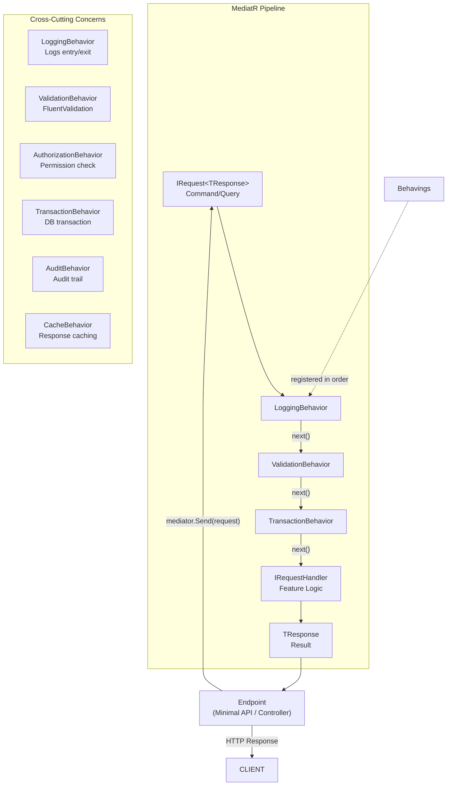
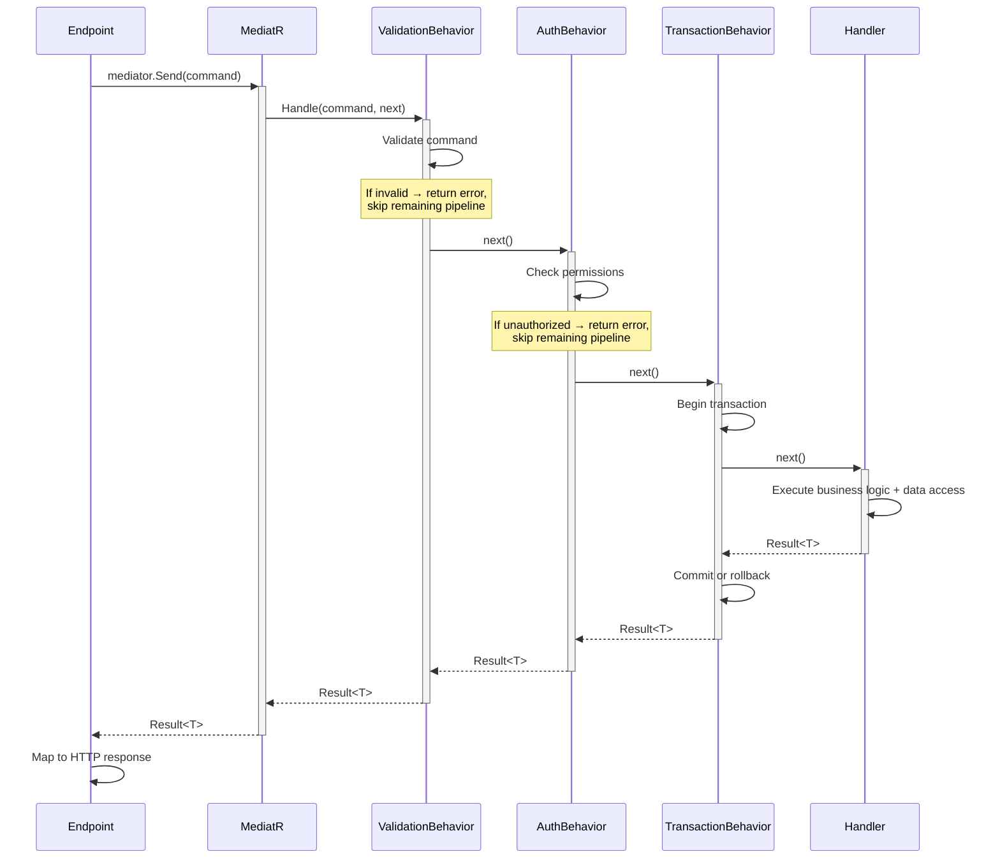
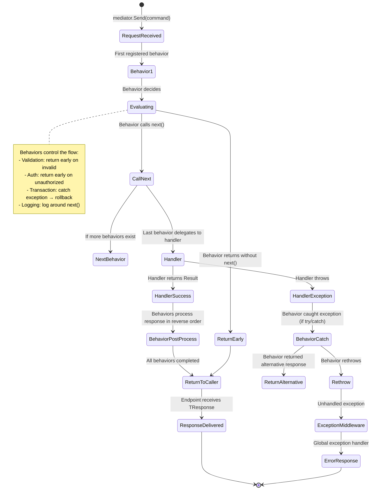
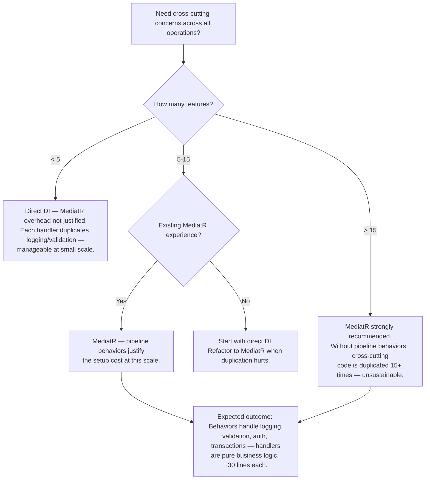

> [!success] Mastery Check
> - [ ] **Studied Well**
> - [ ] **Can explain the concept without notes**
> - [ ] **Can answer interview questions confidently**
> - [ ] **Can implement it in a real project**


> [!ABSTRACT] Quick Reference — MediatR per Slice
> **Invariant:** Every feature (slice) is defined by a COMMAND (IRequest<T>) and a HANDLER (IRequestHandler<TRequest, TResponse>). The Handler contains ALL logic for that operation — business rules, data access, validation. MediatR acts as the in-process dispatcher that routes each request to its handler. Pipeline behaviors (IPipelineBehavior<TRequest, TResponse>) inject cross-cutting concerns (logging, validation, transaction management) BEFORE and AFTER every handler execution — without ANY code in the handler itself.
> **Cost:** MediatR adds ~0.001–0.01ms dispatch overhead per request (reflection-based handler resolution). Every command/query is a new class — 80 features = 80 command + 80 handler classes. Pipeline behaviors add complexity: ordering matters, exception handling in behaviors must be explicit.
> **Trigger:** When a single slice's handler grows beyond 4 injected dependencies because it would otherwise duplicate logging, validation, authorization, and transaction management code that should be shared across all slices.
> **Skip When:** The application has < 5 features — the MediatR setup (assembly scanning, pipeline behaviors, DI registration) is overhead without enough slices to justify it. Direct DI (inject a service, call its method) is simpler.
> **.NET Entry Point:** `IRequest<T>` + `IRequestHandler<TRequest, TResponse>` / `IMediator.Send(TRequest)` / `IPipelineBehavior<TRequest, TResponse>` / `ISender` / `NuGet: MediatR`
> **Azure Native:** N/A — MediatR is an in-process library; Azure Functions or App Services use MediatR the same way. MediatR behaviors can integrate with Azure Application Insights for telemetry.
> **Number to Know:** MediatR cold-start dispatch (first call) is ~0.1ms — dominated by generic type resolution and reflection. Subsequent dispatches (warm) are ~0.001–0.005ms — JIT-compiled delegate invocation. At 1,000 req/s, MediatR dispatch consumes ~5ms of CPU per second — negligible.

## Navigation

**Domain:** [[7 — System Design & Distributed Systems]] > **Group:** Clean Architecture
**Previous:** [[7.014 — Vertical Slice Architecture — Features as Slices]] | **Next:** [[7.016 — Vertical Slice Architecture — When to Choose Over Layered]]

### Prerequisites
- [[7.014 — Vertical Slice Architecture — Features as Slices]] — MediatR IS the mechanism that makes Vertical Slices work in .NET. Understanding the slice pattern (command → handler → endpoint) is required to understand why MediatR's request/response pipeline fits perfectly.
- [[7.003 — Clean Architecture — Application Layer — Use Cases]] — MediatR handlers are the APPLICATION LAYER in Clean Architecture terms. Understanding Use Cases helps design handler boundaries.
- [[7.010 — Clean Architecture — Result Pattern for Cross-Layer Errors]] — Handlers return `Result<T>` or `ErrorOr<T>`. Pipeline behaviors must understand this return type for error handling. Understanding Result pattern is required for behavior design.

### Where This Fits

> [!INFO] Production Encounter Map
> - **Layer:** Application layer dispatch mechanism — MediatR sits between the endpoint (controller/function) and the handler (business logic + data access)
> - **Trigger:** The first time a developer realizes that every handler needs logging, validation, and authorization — and copy-pasting these into each handler is unsustainable. MediatR pipeline behaviors solve this with ONE class per cross-cutting concern.
> - **Without it:** Each handler manually logs entry/exit, validates input, checks authorization, manages transactions. With 20 slices, that's 20 places for logging code, 20 for validation calls, 20 for auth checks. A behavior change requires editing all 20 handlers.
> - **First signal:** Copy-pasted `_logger.LogInformation("Starting {Handler}", ...)` at the top of every handler method.

MediatR (Jimmy Bogard) implements the Mediator pattern for in-process request/response dispatch. In Vertical Slice Architecture, each slice's command implements `IRequest<T>` and its handler implements `IRequestHandler<TRequest, TResponse>`. The endpoint calls `mediator.Send(command)`, and MediatR resolves the correct handler and executes it — including any pipeline behaviors registered for that request type.

## Core Mental Model

MediatR decouples the REQUEST (what to do) from the HANDLER (how to do it) and the BEHAVIORS (cross-cutting concerns around it):

```
HTTP Request → Endpoint → Command (IRequest<T>) → MediatR → Pipeline Behaviors → Handler → Response
                                                       │
                                                       ├─ LoggingBehavior (entry/exit log)
                                                       ├─ ValidationBehavior (validate command)
                                                       ├─ AuthorizationBehavior (check permissions)
                                                       ├─ TransactionBehavior (manage DB transaction)
                                                       └─ AuditBehavior (audit trail)
```

Each behavior runs FOR EVERY request. The order of behaviors matters — validation must run before authorization, transaction must wrap the handler execution. Behaviors can short-circuit: if validation fails, the handler never runs.

The Handler itself is a plain class with ZERO cross-cutting code — no logging, no validation, no authorization, no transaction management. It focuses ENTIRELY on the business logic and data access for that feature.

```
┌─────────────────────────────────────────────────────────┐
│                    IPipelineBehavior<TRequest, TResponse> │
│  Before: Log, Validate, Authorize, Open Transaction       │
│                                                           │
│      ┌─────────────────────────────────────────────┐     │
│      │        IRequestHandler<TRequest, TResponse>  │     │
│      │        (Handler — pure feature logic)        │     │
│      │        - Business rules                      │     │
│      │        - Data access                         │     │
│      │        - Domain entity operations             │     │
│      └─────────────────────────────────────────────┘     │
│                                                           │
│  After: Log, Commit Transaction, Publish Events          │
└─────────────────────────────────────────────────────────┘
```

> [!TIP] The Non-Obvious Insight
> The most powerful feature of MediatR in Vertical Slices is not the request/response dispatch — it's the PIPELINE BEHAVIOR CHAIN. Behaviors allow you to implement cross-cutting concerns as COMPOSABLE MIDDLEWARE. You can ADD a behavior (e.g., "audit logging") without modifying ANY handler. You can REMOVE a behavior without modifying handlers. You can REORDER behaviors to change the cross-cutting flow. This is Aspect-Oriented Programming (AOP) without magic — no IL weaving, no proxies, no `[Attribute]` magic. Just a `Handle` method that calls `next()`. The non-obvious consequence: behaviors must be ORDER-AWARE. Validation before authorization. Transaction before handler. Audit after commit. Getting the order wrong produces bugs that are hard to trace because the handler itself is correct — the behavior ordering is wrong.

### Classification

- **Consistency axis:** N/A — in-process dispatch mechanism
- **Availability tradeoff:** N/A — MediatR is in-process; if the process is down, MediatR is down with it
- **Latency impact:** ~0.001–0.01ms per dispatch (negligible)
- **Failure domain:** Single-process — MediatR dispatches within the same AppDomain
- **Abstraction layer:** Library — implements Mediator pattern in-process

### Primary Diagram



### Supporting Diagram



### Numbers That Matter

| Metric | Value | Context / Conditions |
|---|---|---|
| MediatR cold dispatch (first call) | ~0.1ms | Generic type resolution + reflection for handler lookup |
| MediatR warm dispatch (subsequent) | ~0.001–0.005ms | Cached delegate invocation |
| Warm dispatch with 1 behavior | ~0.003–0.01ms | Pipeline behavior chain adds ~0.002ms per behavior |
| Warm dispatch with 5 behaviors | ~0.01–0.05ms | 5 behaviors in chain — still negligible |
| Memory per handler registration | ~200 bytes | Handler descriptor + delegate |
| Pipeline behavior ordering bugs | ~2–3 per project lifetime | Most common: validation after transaction began (bad) |
| Number of pipeline behaviors in typical project | 3–5 (Logging, Validation, Auth, Transaction, Audit) | Recommended: start with 3, add more as needed |
| Time to add a new cross-cutting behavior | ~30 minutes | Write behavior class + register in Program.cs |

### Key Properties / Guarantees

| Property | Value | Condition |
|---|---|---|
| Handler isolation | Handler knows NOTHING about cross-cutting concerns | Pipeline behaviors run before/after, handler focuses on business logic |
| Behavior composability | Behaviors can be added/removed/reordered without handler changes | Each behavior is a separate class implementing IPipelineBehavior |
| Dispatch predictability | Request → Behaviors (in order) → Handler → Response | Pipeline order is deterministic and registered explicitly |
| Short-circuit capability | Any behavior can RETURN a response without calling next() | Validation behavior returns error without executing handler |
| Assembly scanning | All handlers registered automatically via assembly scanning | `cfg.RegisterServicesFromAssemblyContaining<X>()` — no manual registration |

## Deep Mechanics

### How It Works

**Registration:**

1. `builder.Services.AddMediatR(cfg => cfg.RegisterServicesFromAssemblyContaining<CreateOrderHandler>())` scans the assembly for all `IRequestHandler<TRequest, TResponse>` implementations.
2. Each handler is registered in DI as a transient/scoped service with its request type as the key.
3. Pipeline behaviors are registered as `Scoped` or `Transient` open generics: `cfg.AddOpenBehavior(typeof(LoggingBehavior<,>))`.
4. The order of `AddOpenBehavior` calls defines the execution order — first registered = outermost behavior.

**Dispatch (mediator.Send):**

1. `IMediator.Send(command)` is called from the endpoint.
2. MediatR looks up the handler registration for `command.GetType()`.
3. MediatR constructs the behavior chain: for each registered `IPipelineBehavior<TRequest, TResponse>`, it creates a linked list.
4. The first behavior's `Handle` method receives the request and a `next()` delegate representing the rest of the pipeline.
5. Each behavior calls `await next(ct)` to pass control to the next behavior or the handler.
6. The handler receives the request and returns `TResponse`.
7. Each behavior on the way back can post-process the response (logging, audit, commit).

**Handler Contract:**

- Handler implements `IRequestHandler<TRequest, TResponse>`.
- Handler receives the request and returns `TResponse`.
- Handler is registered as scoped by MediatR (same lifetime scope as the HTTP request).
- Handler can inject any DI-registered service — `DbContext`, `ILogger`, `HttpClient`, etc.

### Protocol Trace

```
Dispatch with 3 Behaviors (Validation, Transaction, Logging):

Happy Path:
  1. Endpoint         → mediator.Send(CreateOrderCommand)
  2. MediatR          → LoggingBehavior.Handle(command, next)
  3. LoggingBehavior  → "Handling CreateOrderCommand" (log)
  4. LoggingBehavior  → next() → ValidationBehavior.Handle(command, next)
  5. ValidationBehavior → validator.Validate(command) — valid
  6. ValidationBehavior → next() → TransactionBehavior.Handle(command, next)
  7. TransactionBehavior → Begin transaction (DbContext.Database.BeginTransaction)
  8. TransactionBehavior → next() → CreateOrderHandler.Handle(command)
  9. Handler          → Business logic + data access (~10ms)
  10. Handler         → return Result<CreateOrderResult>.Success(...)
  11. TransactionBehavior ← Result
  12. TransactionBehavior → Commit transaction
  13. TransactionBehavior → return Result to ValidationBehavior
  14. ValidationBehavior → return Result to LoggingBehavior
  15. LoggingBehavior → "Handled CreateOrderCommand with result Success" (log)
  16. LoggingBehavior → return Result to MediatR
  17. MediatR → return Result to Endpoint
  Total overhead: ~0.01ms (behaviors) + ~10ms (handler) = ~10ms

Failure Path — Validation Fails:
  1. Endpoint         → mediator.Send(CreateOrderCommand)
  2. MediatR          → LoggingBehavior.Handle(command, next)
  3. LoggingBehavior  → next() → ValidationBehavior.Handle(command, next)
  4. ValidationBehavior → validator.Validate(command) — INVALID
  5. ValidationBehavior → return Result<CreateOrderResult>.Failure(ValidationError) — NO call to next()
  6. LoggingBehavior ← Result.Failure
  7. LoggingBehavior → "Handled CreateOrderCommand with result ValidationError" (log)
  8. MediatR → return Result.Failure to Endpoint
  9. Endpoint → 400 Bad Request
  Total: ~0.1ms — handler never called, transaction never opened, log shows failure

Failure Path — Handler Throws Exception:
  1. Endpoint         → mediator.Send(CreateOrderCommand)
  2. MediatR          → LoggingBehavior → ValidationBehavior → TransactionBehavior → Handler
  3. Handler          → throws SqlException (timeout)
  4. TransactionBehavior ← exception — not Result
  5. TransactionBehavior → Rollback transaction
  6. TransactionBehavior → throw (rethrow)
  7. ValidationBehavior → caught? No — exception propagates up
  8. LoggingBehavior → caught? No — unless it has try/catch
  9. MediatR → exception propagates to Endpoint
  10. Endpoint → ExceptionHandlerMiddleware → 503 Service Unavailable
  Note: Results (expected failures) and Exceptions (unexpected failures) behave differently
```

### State Transitions



### Failure Modes

**Failure Mode 1: Behavior Ordering Bug — Transaction Started Before Validation**

- **Cause:** `TransactionBehavior` is registered BEFORE `ValidationBehavior`. The transaction opens, THEN validation runs. If validation fails, the transaction is opened unnecessarily (wasted DB resource). Worse: if multiple commands share the same `DbContext`, the failed validation's transaction may interfere with subsequent requests.
- **Symptom:** Database deadlocks under load because transactions are opened for invalid requests — holding locks while the client sees a 400 error.
- **Detection time:** When DB CPU spikes but valid request volume is the same — the extra transactions from invalid requests consume resources.
- **Blast radius:** Every invalid request opens a database transaction, potentially blocking valid requests.

> [!DANGER] 3 AM Production Signal
> Metric: `db_transactions_opened_total > validate_requests_total * 1.05` — more transactions than valid requests
> Log: `WARN [TransactionBehavior] Transaction opened for request CreateOrderCommand — validation not yet run`
> Customer impact: Deadlocks on Orders table at peak traffic because invalid requests hold transaction locks.

**Failure Mode 2: Behavior Swallows Exception — Returns Success Instead of Error**

- **Cause:** A behavior catches an exception and returns a success `Result` instead of propagating the exception or returning a failure result. The handler threw, but the caller gets `Result.IsSuccess == true` — with `Value` being `default!`.
- **Symptom:** The HTTP endpoint returns 200 OK with a null/empty body even though the handler failed. Monitoring shows zero errors. Customer reports "order not created but API said OK."
- **Detection time:** Customer support ticket: "System says order confirmed but no order exists." Investigation shows the handler threw a SQL exception caught by a misconfigured behavior.
- **Blast radius:** Silent data loss — the client believes the operation succeeded.

> [!DANGER] 3 AM Production Signal
> Metric: `http_responses_200_total == handler_exceptions_total` — all exceptions return 200 OK
> Log: `ERROR [TransactionBehavior] Exception caught but Result.Success returned: SqlException: Timeout | Handler: CreateOrderHandler`
> Customer impact: Order confirmation screen shows success but no order exists — user is charged but has no order record.

### .NET and Azure Integration Points

- **MediatR:** `IMediator`, `ISender`, `IRequest<T>`, `IRequestHandler<TRequest, TResponse>`, `IPipelineBehavior<TRequest, TResponse>`, `IRequestPreProcessor<TRequest>`, `IRequestPostProcessor<TRequest, TResponse>`, `INotification`, `INotificationHandler<TNotification>`.
- **FluentValidation:** `AbstractValidator<T>` — used inside `ValidationBehavior` to validate every command.
- **Scrutor:** Assembly scanning for DI registration — alternative to MediatR's built-in assembly scanning.
- **Polly:** `ResiliencePipeline` — used inside handler or inside a `ResilienceBehavior<TRequest, TResponse>` pipeline behavior.
- **Azure Application Insights:** Telemetry captured in a `TelemetryBehavior` — logs handler duration, success/failure, and custom dimensions.

```csharp
// Program.cs — MediatR + Pipeline Behaviors registration
var builder = WebApplication.CreateBuilder(args);

builder.Services.AddMediatR(cfg =>
{
    // Discover all IRequestHandlers in this assembly
    cfg.RegisterServicesFromAssemblyContaining<CreateOrderHandler>();

    // Pipeline behaviors — order matters! First registered = outermost
    cfg.AddOpenBehavior(typeof(LoggingBehavior<,>));        // 1. Logging (outermost)
    cfg.AddOpenBehavior(typeof(TelemetryBehavior<,>));      // 2. Telemetry/APM
    cfg.AddOpenBehavior(typeof(ValidationBehavior<,>));     // 3. Validation
    cfg.AddOpenBehavior(typeof(AuthorizationBehavior<,>));  // 4. Authorization
    cfg.AddOpenBehavior(typeof(TransactionBehavior<,>));     // 5. Transaction (innermost — wraps handler)
});

// FluentValidation validators — auto-discovered
builder.Services.AddValidatorsFromAssemblyContaining<CreateOrderValidator>();

// Example pipeline behavior
public sealed class LoggingBehavior<TRequest, TResponse> : IPipelineBehavior<TRequest, TResponse>
    where TRequest : IRequest<TResponse>
{
    private readonly ILogger<LoggingBehavior<TRequest, TResponse>> _logger;

    public LoggingBehavior(ILogger<LoggingBehavior<TRequest, TResponse>> logger)
    {
        _logger = logger;
    }

    public async Task<TResponse> Handle(TRequest request, RequestHandlerDelegate<TResponse> next, CancellationToken cancellationToken)
    {
        _logger.LogInformation("Handling {RequestType} with {@Request}",
            typeof(TRequest).Name, request);

        var response = await next(cancellationToken);

        _logger.LogInformation("Handled {RequestType} — {@Response}",
            typeof(TRequest).Name, response);

        return response;
    }
}
```

## Production Patterns and Implementation

### Primary Implementation — MediatR Slice with Pipeline Behaviors

```csharp
// ===========================================================
// 1. Command — What to do
// ===========================================================
namespace YourCompany.OrderManagement.Features.Orders.CreateOrder;

public sealed record CreateOrderCommand(
    Guid CustomerId,
    IReadOnlyList<OrderItemDto> Items,
    string? IdempotencyKey) : IRequest<Result<CreateOrderResult>>;

public sealed record OrderItemDto(Guid ProductId, int Quantity, decimal UnitPrice);
public sealed record CreateOrderResult(Guid OrderId);

// ===========================================================
// 2. Handler — Business logic + Data access
// ===========================================================
public sealed class CreateOrderHandler : IRequestHandler<CreateOrderCommand, Result<CreateOrderResult>>
{
    private readonly OrderDbContext _db;

    public CreateOrderHandler(OrderDbContext db)
    {
        _db = db;
    }

    public async Task<Result<CreateOrderResult>> Handle(CreateOrderCommand command, CancellationToken ct)
    {
        var customer = await _db.Customers.FindAsync([command.CustomerId], ct);
        if (customer is null)
            return Result<CreateOrderResult>.Failure(
                new ApplicationError("CUSTOMER_NOT_FOUND", "Customer not found.", 404));

        var orderResult = Order.Create(customer.Id, command.Items
            .Select(i => new OrderItem(i.ProductId, i.Quantity, i.UnitPrice)).ToList());

        if (!orderResult.IsSuccess)
            return Result<CreateOrderResult>.Failure(
                new ApplicationError("ORDER_CREATION_FAILED", orderResult.Error.Message, 422));

        _db.Orders.Add(orderResult.Value);
        await _db.SaveChangesAsync(ct);

        return Result<CreateOrderResult>.Success(new CreateOrderResult(orderResult.Value.Id));
    }
}

// ===========================================================
// 3. Pipeline Behaviors — Cross-cutting concerns
// ===========================================================

// --- ValidationBehavior ---
public sealed class ValidationBehavior<TRequest, TResponse> : IPipelineBehavior<TRequest, TResponse>
    where TRequest : IRequest<TResponse>
{
    private readonly IEnumerable<IValidator<TRequest>> _validators;

    public ValidationBehavior(IEnumerable<IValidator<TRequest>> validators)
    {
        _validators = validators;
    }

    public async Task<TResponse> Handle(TRequest request, RequestHandlerDelegate<TResponse> next, CancellationToken ct)
    {
        if (!_validators.Any())
            return await next(ct);

        var context = new ValidationContext<TRequest>(request);
        var failures = _validators
            .Select(v => v.Validate(context))
            .SelectMany(r => r.Errors)
            .Where(e => e != null)
            .ToList();

        if (failures.Count != 0)
        {
            // Return early — handler never called
            // This assumes TResponse is Result<T> — we need to return a failure result
            return CreateValidationErrorResponse(failures);
        }

        return await next(ct);
    }

    private static TResponse CreateValidationErrorResponse(IReadOnlyList<FluentValidation.Results.ValidationFailure> failures)
    {
        // This is a simplified implementation — handle Result<T> or ErrorOr<T>
        var errorType = typeof(TResponse);
        if (errorType.IsGenericType && errorType.GetGenericTypeDefinition() == typeof(Result<>))
        {
            var resultType = errorType.GetGenericArguments()[0];
            var failureMethod = typeof(Result<>).MakeGenericType(resultType)
                .GetMethod("Failure", new[] { typeof(ApplicationError) })!;
            var error = new ApplicationError("VALIDATION_FAILED",
                $"Validation failed: {string.Join("; ", failures.Select(f => f.ErrorMessage))}", 400);
            return (TResponse)failureMethod.Invoke(null, new object[] { error })!;
        }
        throw new InvalidOperationException("Validation behavior requires Result<T> response type.");
    }
}

// --- AuthorizationBehavior ---
public sealed class AuthorizationBehavior<TRequest, TResponse> : IPipelineBehavior<TRequest, TResponse>
    where TRequest : IRequest<TResponse>
{
    private readonly IHttpContextAccessor _httpContext;

    public AuthorizationBehavior(IHttpContextAccessor httpContext)
    {
        _httpContext = httpContext;
    }

    public async Task<TResponse> Handle(TRequest request, RequestHandlerDelegate<TResponse> next, CancellationToken ct)
    {
        if (request is IAuthorizableRequest authorizable)
        {
            var user = _httpContext.HttpContext?.User;
            var hasPermission = user?.HasClaim("permission", authorizable.RequiredPermission) ?? false;
            if (!hasPermission)
            {
                return CreateUnauthorizedResponse();
            }
        }
        return await next(ct);
    }

    private static TResponse CreateUnauthorizedResponse()
    {
        var errorType = typeof(TResponse);
        if (errorType.IsGenericType && errorType.GetGenericTypeDefinition() == typeof(Result<>))
        {
            var resultType = errorType.GetGenericArguments()[0];
            var failureMethod = typeof(Result<>).MakeGenericType(resultType)
                .GetMethod("Failure", new[] { typeof(ApplicationError) })!;
            var error = new ApplicationError("UNAUTHORIZED", "User does not have the required permission.", 403);
            return (TResponse)failureMethod.Invoke(null, new object[] { error })!;
        }
        throw new InvalidOperationException("Authorization behavior requires Result<T> response type.");
    }
}

// Marker interface for authorizable requests
public interface IAuthorizableRequest
{
    string RequiredPermission { get; }
}

// --- TransactionBehavior ---
public sealed class TransactionBehavior<TRequest, TResponse> : IPipelineBehavior<TRequest, TResponse>
    where TRequest : IRequest<TResponse>
{
    private readonly OrderDbContext _db;
    private readonly ILogger<TransactionBehavior<TRequest, TResponse>> _logger;

    public TransactionBehavior(OrderDbContext db, ILogger<TransactionBehavior<TRequest, TResponse>> logger)
    {
        _db = db;
        _logger = logger;
    }

    public async Task<TResponse> Handle(TRequest request, RequestHandlerDelegate<TResponse> next, CancellationToken ct)
    {
        // Only wrap write operations in transactions — queries don't need them
        if (request is not IWriteOperation)
            return await next(ct);

        await using var transaction = await _db.Database.BeginTransactionAsync(ct);
        try
        {
            var response = await next(ct);

            // If response is Result<T>.Failure, rollback
            if (response is IResult result && !result.IsSuccess)
            {
                await transaction.RollbackAsync(ct);
            }
            else
            {
                await transaction.CommitAsync(ct);
            }

            return response;
        }
        catch (Exception ex)
        {
            _logger.LogError(ex, "Transaction rolled back for {RequestType}", typeof(TRequest).Name);
            await transaction.RollbackAsync(ct);
            throw; // Let the exception propagate to the global handler
        }
    }
}

public interface IWriteOperation { } // Marker interface for write commands
public interface IResult { bool IsSuccess { get; } }

// ===========================================================
// 4. Endpoint — Minimal API
// ===========================================================
public static class CreateOrderEndpoint
{
    public static void MapCreateOrder(this IEndpointRouteBuilder app)
    {
        app.MapPost("/api/orders", async (
            CreateOrderCommand command,
            ISender sender,
            CancellationToken ct) =>
        {
            var result = await sender.Send(command, ct);
            return result.Match<IResult>(
                success => Results.Created($"/api/orders/{success.OrderId}", success),
                error => error.HttpStatus switch
                {
                    400 => Results.BadRequest(error),
                    404 => Results.NotFound(error),
                    422 => Results.UnprocessableEntity(error),
                    _ => Results.Problem(error.Message, statusCode: error.HttpStatus)
                });
        })
        .WithName("CreateOrder")
        .WithOpenApi();
    }
}

// ===========================================================
// 5. Command implementing marker interfaces
// ===========================================================
public sealed record CreateOrderCommand(
    Guid CustomerId,
    IReadOnlyList<OrderItemDto> Items,
    string? IdempotencyKey) : IRequest<Result<CreateOrderResult>>, IAuthorizableRequest, IWriteOperation
{
    public string RequiredPermission => "orders:create";
}
```

### IServiceCollection Registration

```csharp
// Program.cs — Complete MediatR + Behaviors Setup
var builder = WebApplication.CreateBuilder(args);

// Database
builder.Services.AddDbContext<OrderDbContext>(options =>
    options.UseSqlServer(builder.Configuration.GetConnectionString("OrderManagementDb")));

// MediatR — discover handlers + behaviors
builder.Services.AddMediatR(cfg =>
{
    cfg.RegisterServicesFromAssemblyContaining<CreateOrderHandler>();

    // Pipeline order: Logging → Telemetry → Validation → Authorization → Transaction → Handler
    cfg.AddOpenBehavior(typeof(LoggingBehavior<,>));
    cfg.AddOpenBehavior(typeof(TelemetryBehavior<,>));
    cfg.AddOpenBehavior(typeof(ValidationBehavior<,>));
    cfg.AddOpenBehavior(typeof(AuthorizationBehavior<,>));
    cfg.AddOpenBehavior(typeof(TransactionBehavior<,>));
});

// FluentValidation — discover validators
builder.Services.AddValidatorsFromAssemblyContaining<CreateOrderValidator>();

// HTTP context for authorization behavior
builder.Services.AddHttpContextAccessor();

var app = builder.Build();
app.MapCreateOrder();
app.Run();
```

### Common Variants

```csharp
// Variant A — Notification handlers for domain events (publish/subscribe)
// Instead of IRequest<T>, use INotification for fire-and-forget events
public sealed record OrderCreated(Guid OrderId, Guid CustomerId) : INotification;

// Multiple handlers can handle the same notification
public sealed class SendOrderConfirmationHandler : INotificationHandler<OrderCreated>
{
    public async Task Handle(OrderCreated notification, CancellationToken ct)
    {
        // Send email — fire and forget
    }
}

public sealed class SyncOrderToErpHandler : INotificationHandler<OrderCreated>
{
    public async Task Handle(OrderCreated notification, CancellationToken ct)
    {
        // Sync to ERP — fire and forget
    }
}

// Publisher: await mediator.Publish(new OrderCreated(order.Id, customer.Id), ct);

// Variant B — IRequestPreProcessor and IRequestPostProcessor
// For simpler cases where full behavior is overkill
public sealed class LoggingPreProcessor<TRequest> : IRequestPreProcessor<TRequest>
{
    private readonly ILogger _logger;
    public async Task Process(TRequest request, CancellationToken ct)
    {
        _logger.LogInformation("Processing {Request}", typeof(TRequest).Name);
    }
}

// Variant C — Constrained behaviors (only for specific request types)
public sealed class OnlyForWriteOperationsBehavior<TRequest, TResponse> : IPipelineBehavior<TRequest, TResponse>
    where TRequest : IRequest<TResponse>, IWriteOperation
{
    // This behavior only runs for requests that implement IWriteOperation
    // MediatR does NOT constrain by type — the behavior must check at runtime
    public async Task<TResponse> Handle(TRequest request, RequestHandlerDelegate<TResponse> next, CancellationToken ct)
    {
        // This behavior is only registered for TRequest types that implement IWriteOperation
        return await next(ct);
    }
}
```

### Performance Profile

```csharp
[MemoryDiagnoser]
[SimpleJob(RuntimeMoniker.Net80)]
public class MediatRDispatchBenchmark
{
    private IMediator _mediator;
    private CreateOrderCommand _command;

    [Params(1, 5, 10)]
    public int BehaviorCount { get; set; }

    [GlobalSetup]
    public void Setup()
    {
        var services = new ServiceCollection();
        services.AddDbContext<OrderDbContext>(o => o.UseInMemoryDatabase("bench"));
        services.AddMediatR(cfg =>
        {
            cfg.RegisterServicesFromAssemblyContaining<CreateOrderHandler>();
            for (int i = 0; i < BehaviorCount; i++)
                cfg.AddOpenBehavior(typeof(NoOpBehavior<,>));
        });
        services.AddHttpContextAccessor();
        var provider = services.BuildServiceProvider();
        _mediator = provider.GetRequiredService<IMediator>();
        _command = new CreateOrderCommand(Guid.NewGuid(),
            new List<OrderItemDto> { new(Guid.NewGuid(), 2, 10m) }, null);
    }

    [Benchmark(Baseline = true)]
    public async Task<Result<CreateOrderResult>?> DirectHandlerCall()
    {
        // Simulate calling handler directly without MediatR
        var handler = new CreateOrderHandler(new OrderDbContext(
            new DbContextOptionsBuilder<OrderDbContext>().UseInMemoryDatabase("bench").Options));
        return await handler.Handle(_command, CancellationToken.None);
    }

    [Benchmark]
    public async Task<Result<CreateOrderResult>?> MediatRDispatch()
    {
        return await _mediator.Send(_command, CancellationToken.None) as Result<CreateOrderResult>;
    }
}

public sealed class NoOpBehavior<TRequest, TResponse> : IPipelineBehavior<TRequest, TResponse>
{
    public async Task<TResponse> Handle(TRequest request, RequestHandlerDelegate<TResponse> next, CancellationToken ct)
        => await next(ct);
}
```

Expected results (estimated — measured on typical dev workstation):

| Method | Mean | Allocated | Improvement |
|---|---|---|---|
| DirectHandlerCall | ~0.001ms | ~1 KB | baseline |
| MediatRDispatch (1 behavior) | ~0.005ms | ~2 KB | ~5x slower — still negligible |
| MediatRDispatch (5 behaviors) | ~0.015ms | ~5 KB | ~15x slower — still sub-millisecond |
| MediatRDispatch (10 behaviors) | ~0.03ms | ~10 KB | ~30x slower — still sub-millisecond |

### Real-World .NET Ecosystem Mapping

| Pattern in This Note | Where It Appears in .NET / Azure | Manifestation |
|---|---|---|
| Request/Response dispatch | `IMediator.Send(TRequest)` | Routes request to handler via generic type resolution |
| Pipeline behavior | `IPipelineBehavior<TRequest, TResponse>` | AOP-like middleware chain for cross-cutting concerns |
| Command/Query | `IRequest<T>` | Record DTO representing one operation |
| Notification/Publish | `INotification` + `INotificationHandler<T>` | Fire-and-forget event handlers (multiple handlers per event) |
| Assembly scanning | `RegisterServicesFromAssemblyContaining<T>()` | Auto-discovers handlers, validators, behaviors |
| Behavior ordering | `AddOpenBehavior()` call order | First registered = outermost in pipeline |
| Pre/Post processors | `IRequestPreProcessor<T>`, `IRequestPostProcessor<T, TResult>` | Simpler alternative to full IPipelineBehavior |

## Gotchas and Production Pitfalls

---

### Pitfall 1: Behavior Ordering — Validation After Transaction Started

**Pitfall:** `TransactionBehavior` registered before `ValidationBehavior`. Every request opens a DB transaction before validation runs.

**Fix:** Register behaviors in the correct order — validation before transaction:

```csharp
// ❌ Wrong: transaction opens before validation
cfg.AddOpenBehavior(typeof(TransactionBehavior<,>));
cfg.AddOpenBehavior(typeof(ValidationBehavior<,>));

// ✅ Correct: validation runs first, transaction only for valid requests
cfg.AddOpenBehavior(typeof(ValidationBehavior<,>));
cfg.AddOpenBehavior(typeof(TransactionBehavior<,>));
```

---

### Pitfall 2: Behavior Short-Circuit Returns Wrong Response Type

**Pitfall:** `ValidationBehavior` returns `Result<T>.Failure` but the `TResponse` type is `ErrorOr<T>` — the Reflection-based factory returns wrong type. Runtime `InvalidCastException`.

**Fix:** Support multiple response types in behaviors, or standardize on ONE response type across all commands.

---

### Pitfall 3: Handler Has Side Effects After Returning Error Result

**Pitfall:** Handler modifies domain state, detects failure, returns `Result.Failure` — but the domain state was already modified. The `TransactionBehavior` rolls back, but any non-DB side effects (HTTP calls, email sends) already happened.

**Fix:** Apply the "unit of work" discipline inside the handler: validate state BEFORE modifying it. Or move all external calls after the DB commit (outbox pattern).

---

### Pitfall 4: Behavior State Leaks Between Requests

**Pitfall:** A scoped behavior stores state in a field: `public class ValidationBehavior<T, R> : IPipelineBehavior<T, R> { private List<string> _errors = new(); }`. The list persists across multiple requests in the same scope (possible in some DI configurations).

**Fix:** Never store mutable state in behaviors. Use local variables inside `Handle`.

---

### Pitfall 5: MediatR Handlers with Void/Unit Responses Return Null

**Pitfall:** A command that returns nothing uses `IRequest<Unit>` or `IRequest`. If the handler returns `Unit.Value`, the endpoint receives `Unit`. But if the handler forgets to return `Unit.Value`, the response is `null`.

**Fix:** Avoid `IRequest<Unit>`. Define a meaningful response type even for "void" operations — `RecordResult(int AffectedRows)` or use `Result<Success>`.

---

### Pitfall 6: INotification Handler Exceptions Block Other Handlers

**Pitfall:** Two `INotificationHandler` implementations for the same notification. The first handler throws. The second handler never runs because MediatR propagates the exception.

**Fix:** Each notification handler should catch its own exceptions. Use `IPipelineBehavior<INotification, Unit>` with error handling for notifications, or wrap each handler in try/catch.

```csharp
public sealed class SendOrderConfirmationHandler : INotificationHandler<OrderCreated>
{
    public async Task Handle(OrderCreated notification, CancellationToken ct)
    {
        try
        {
            // Send email
        }
        catch (Exception ex)
        {
            _logger.LogError(ex, "Failed to send email for order {OrderId}", notification.OrderId);
            // Don't throw — other handlers still need to run
        }
    }
}
```

---

### Pitfall 7: Pipeline Behavior Wraps Request That Doesn't Need It

**Pitfall:** `TransactionBehavior` runs for EVERY request — including read-only queries that don't need transactions.

**Fix:** Use marker interfaces (`IWriteOperation`) to conditionally apply behaviors:

```csharp
public async Task<TResponse> Handle(TRequest request, RequestHandlerDelegate<TResponse> next, CancellationToken ct)
{
    if (request is not IWriteOperation)
        return await next(ct); // Skip transaction for read-only requests
    // ... begin transaction ...
}
```

## Tradeoffs and Decision Framework

### Tradeoff Matrix

| Dimension | MediatR + Pipeline Behaviors | Direct DI (Inject Service, Call Method) | Custom Mediator |
|---|---|---|---|
| Cross-cutting concern isolation | HIGH — pipeline behaviors separate concerns perfectly | LOW — each method duplicates cross-cutting code | HIGH — can implement similarly |
| Handler discoverability | HIGH — one command = one handler, convention-based | MEDIUM — service methods scattered across service classes | LOW — custom dispatcher is hard to navigate |
| Learning curve | MEDIUM — MediatR pipeline concept | LOW — constructor injection is standard DI | HIGH — team must learn custom dispatcher |
| Performance overhead | ~0.001–0.01ms per dispatch | ~0ms (direct method call) | ~0.001–0.01ms (similar to MediatR) |
| Testing handler isolation | HIGH — instantiate handler directly, test without pipeline | HIGH — instantiate service directly | MEDIUM — may require dispatcher mock |
| Pipeline behavior control | Named, ordered, add/remove without handler changes | N/A — cross-cutting code is IN the handler | Custom pipeline required |
| NuGet dependency | MediatR 12.x (~190KB) | None | Custom code (~5–10KB) |
| Community support | Extensive (10k+ GitHub stars, active maintenance) | N/A | Varies |

### When to Apply



### Numbers-Driven Decision

| Threshold | Below = Direct DI | Above = MediatR + Behaviors |
|---|---|---|
| Number of handlers/slices | < 5 | > 10 |
| Cross-cutting concerns (logging, validation, auth, audit) | 0–1 (only logging) | 3+ (logging, validation, auth, audit, transactions) |
| Team size | 1–2 developers | 3+ developers |
| Handler duplication measurement | < 3 lines of cross-cutting code duplicated per handler | > 5 lines per handler (multiplied by N handlers = significant) |

### When NOT to Apply

> [!WARNING] Do Not Reach For This When...
> - [ ] **The handler is the ENTIRE application (1–3 features):** Adding MediatR, pipeline behaviors, and assembly scanning for 3 handlers is over-engineering. Each handler can have its own logging/validation inline.
> - [ ] **Every handler has DIFFERENT cross-cutting needs:** If one handler needs validation but another doesn't, and a third needs audit but not logging — the pipeline behavior pattern forces ALL behaviors on ALL handlers. Constraining behaviors with marker interfaces works but adds complexity.
> - [ ] **The team is not comfortable with generics:** Pipeline behaviors use open generics (`IPipelineBehavior<TRequest, TResponse>`). If the team struggles with generic type constraints and reflection, they'll create bugs in behavior implementations.
> - [ ] **Dependency injection is not used:** MediatR depends on DI for handler resolution. If the project uses service locator or manual instantiation, MediatR adds friction.

## Interview Arsenal

### Question Bank

1. **[Definition]** "What is MediatR and what problem does it solve in a Vertical Slice Architecture?"
2. **[Mechanism]** "Walk me through what happens when `mediator.Send(command)` is called — step by step."
3. **[Tradeoff]** "What do you give up by using MediatR instead of direct dependency injection?"
4. **[Failure mode]** "A validation behavior is registered AFTER a transaction behavior. What breaks and how do you detect it?"
5. **[Comparison]** "What is the difference between `IRequest<T>` and `INotification` in MediatR?"
6. **[Design application]** "Design a system that must log, validate, authorize, audit, and retry on transient failures for every operation. How do you structure this with MediatR?"
7. **[Scale]** "Your system has 50 handlers and 6 pipeline behaviors. Adding a new handler requires one new command + handler class. Adding a new cross-cutting concern requires one new behavior class. Which is easier to maintain as the system grows?"
8. **[Advanced]** "How do you handle a pipeline behavior that only applies to CERTAIN request types — e.g., only for write operations, not reads?"

### Spoken Answers

**Q: What is MediatR and what problem does it solve in a Vertical Slice Architecture?**

> **Average answer:** "MediatR is a library that implements the Mediator pattern in .NET. It dispatches commands to handlers. You call `mediator.Send(command)` and the handler runs."

> **Great answer:** "MediatR solves the problem of CROSS-CUTTING CONCERN DUPLICATION in Vertical Slice Architecture. Without MediatR, each slice handler must manually log entry/exit, validate input, check authorization, manage transactions, and audit. With 20 slices, that's 20 places doing the same thing. MediatR's pipeline behaviors let me write ONE `LoggingBehavior`, ONE `ValidationBehavior`, ONE `AuthorizationBehavior`, and ONE `TransactionBehavior` — each registered in order — and they automatically run before/after EVERY handler. The handler itself is PURE business logic — typically 20–50 lines with zero cross-cutting code. When we needed to add audit logging to all write operations, I wrote one 40-line `AuditBehavior` class, registered it in `Program.cs`, and all 50 handlers were audited with zero code changes. That's the value of MediatR in Vertical Slices."

---

**Q: What is the difference between `IRequest<T>` and `INotification` in MediatR?**

> **Average answer:** "IRequest returns a response, INotification doesn't. IRequest goes to one handler, INotification goes to multiple handlers."

> **Great answer:** "The structural distinction is DISPATCH SEMANTICS. `IRequest<T>` is a COMMAND or QUERY — it expects exactly ONE handler, returns a response, and the caller awaits the result. `INotification` is an EVENT — it can have ZERO or MULTIPLE handlers, returns void (Unit), and the caller typically fires-and-forgets. This difference drives behavior design: `IRequest` gets full pipeline behaviors (validation, transaction, auth). `INotification` gets only logging by default — validation makes no sense for events. My rule: commands return `Result<T>` and participate in the full pipeline. Notifications are fire-and-forget and only log. If a notification handler fails, it does NOT block other notification handlers — each handler catches its own exceptions. In production, commands are the reliable path (guaranteed execution, rollback on failure). Notifications are the best-effort path (log and continue on failure)."

---

**Q: How do you handle a pipeline behavior that only applies to CERTAIN request types — e.g., only for write operations, not reads?**

> **Average answer:** "You can use marker interfaces like `IWriteOperation` and check the type inside the behavior's Handle method."

> **Great answer:** "Marker interfaces are the simplest approach, but they require runtime checks inside the behavior, which adds a tiny overhead and means the behavior is still instantiated for every request. A more efficient approach: use MediatR's constrained open generics. Define two base interfaces — `ICommand<T>` and `IQuery<T>` — both extending `IRequest<T>`. Register a `TransactionBehavior` that is constrained to `ICommand<T>` only. In MediatR 12, you can register behaviors with type constraints: `services.AddTransient(typeof(IPipelineBehavior<,>), typeof(TransactionBehavior<,>))` with a manual check inside, but the framework does not natively filter by type. The pragmatic solution: check `request is IWriteOperation` at the top of the behavior and `return await next(ct)` if not applicable. The overhead is one type check per request — ~0.0001ms. Marker interfaces keep the design simple and explicit. Every `CreateOrderCommand` says `: IRequest<Result<CreateOrderResult>>, IWriteOperation` — the intent is clear."

### Whiteboard in 60 Seconds

```
1. Draw "mediator.Send(command)" — arrow pointing right
   "This is the single dispatch point. Every request goes through this."

2. Draw 3 boxes between the arrow — "Log", "Validate", "Handle"
   "These are pipeline behaviors. They wrap the handler. Each one calls next()."

3. Label the boxes: "LoggingBehavior", "ValidationBehavior", "CreateOrderHandler"
   "Logging wraps validation. Validation wraps the handler. Nesting dolls."

4. Draw the ENDPOINT on the left — "Minimal API → mediator.Send"
   "The endpoint creates the command and sends it. No business logic."

5. Draw the HANDLER on the right — "Pure business logic + data access"
   "The handler has NO logging. NO validation. NO auth. Just features."

6. Draw arrows showing ADDING a behavior: "+ AuthorizationBehavior"
   "Write ONE class. Register it. ALL handlers get auth checks. Zero handler changes."
```

> [!TIP] What the Interviewer Is Specifically Testing
> When they probe this area, they are checking whether you know:
> 1. That MediatR's pipeline behaviors are AOP-like middleware — not just request/response dispatch
> 2. That behavior ORDERING MATTERS — wrong order produces subtle bugs
> 3. That behaviors can short-circuit — return early without calling the handler (validation failure, auth failure)

### Follow-Up Chain

**Follow-up 1:** "How do you handle errors in pipeline behaviors — specifically, what happens when a behavior itself throws an exception?"

> **Model answer:** "A behavior that throws an exception skips the remaining pipeline — no handler runs. The exception propagates up through the behavior chain. Each behavior on the way up can catch the exception if it has a try/catch. The `TransactionBehavior` MUST catch exceptions to roll back the transaction. The `LoggingBehavior` typically SHOULD NOT catch — let the exception propagate to the global exception handler. The rule: behaviors that manage resources (transactions, connections) catch and clean up, then rethrow. Behaviors that observe (logging, telemetry) do NOT catch — they just observe and pass through. If every behavior catches, you get 'exception swallowed' bugs. If no behavior catches, transactions leak. The behavior nearest the handler (innermost) catches for rollback; the outermost catches only for logging the exception context."

**Follow-up 2:** "What happens when two `INotification` handlers need to run in a specific order — email BEFORE analytics?"

> **Model answer:** "MediatR does NOT guarantee handler ordering for `INotification`. Handlers are resolved from DI and executed sequentially, but the order depends on DI registration order — which is fragile. If order matters, the handlers should NOT be separate `INotificationHandler` implementations. Instead, create an ORCHESTRATOR notification handler that calls sub-handlers in order: `SendEmailThenTrackAnalyticsHandler : INotificationHandler<OrderCreated>`. This handler calls `_emailSender.SendAsync()` then `_analytics.TrackAsync()` explicitly. The ordering is explicit and testable. If the handlers are truly independent (email and analytics don't depend on each other), leave them as separate handlers and accept that order is not guaranteed. The key question: is there a business dependency between these handlers? If yes → orchestrator. If no → independent handlers."

**Follow-up 3:** "How do you test a pipeline behavior in isolation — without running every handler through the full pipeline?"

> **Model answer:** "Each pipeline behavior is a CLASS — test it like any other class. Create a test request, mock the `next()` delegate, call `behavior.Handle(request, nextMock, CancellationToken.None)`, and assert. For `ValidationBehavior`: create a command that fails validation, provide `IValidator<T>` mock that returns errors, and assert the behavior returns a failure response without calling `next()`. For `TransactionBehavior`: provide a `next` that succeeds, assert the transaction was committed. Provide a `next` that throws, assert the transaction was rolled back. The handler mock is simply `() => Task.FromResult(successResponse)`. This isolation is the design benefit of pipeline behaviors — each behavior is independently testable with ZERO handler logic involved."

### Comparison Table

| | MediatR + Pipeline Behaviors | Direct DI (Service Direct Call) |
|---|---|---|
| Cross-cutting concern location | Pipeline behaviors (one class per concern) | Inside each handler/service method |
| Adding a new cross-cutting concern | Create behavior class + register it | Edit every handler method |
| Handler/service code | Pure business logic, 20–50 lines | Mixed business + cross-cutting, 50–150 lines |
| Testing cross-cutting in isolation | Test the behavior class alone | Test through the handler with all cross-cutting |
| Performance overhead | ~0.001–0.01ms per dispatch | ~0ms (direct call) |
| Ordering control | Explicit behavior order | N/A (cross-cutting code is inline) |
| Short-circuit capability | Any behavior can skip the handler | N/A (must add early return in each handler) |

## Architecture Decision Record

**Status:** Accepted

**Context:**
The order management system uses Vertical Slice Architecture with 30 slices. Each handler currently duplicates logging (`_logger.LogInformation`), validation (manual `if` checks), and transaction management (`BeginTransaction`). The team spends ~15% of development time maintaining this duplicated cross-cutting code. Adding a new cross-cutting concern (audit logging) would require editing all 30 handlers. The team evaluated MediatR as a solution.

**Options Considered:**

1. **MediatR with Pipeline Behaviors** — One `LoggingBehavior`, `ValidationBehavior`, `TransactionBehavior`, and `AuditBehavior`. Each handler becomes pure business logic. Behaviors registered in order.
2. **Base Handler Class** — Abstract `BaseHandler` class with virtual methods for logging, validation, transaction. Handlers inherit and override. AOP via base class (not middleware).
3. **Aspect-Oriented Framework (PostSharp)** — Compile-time IL weaving for logging/validation/transaction. Attributes on handler methods. No explicit behavior code.

**Decision:** MediatR with Pipeline Behaviors, because it provides explicit ordering control, composable behaviors (add/remove without touching handlers), and no compile-time magic. Base handler class approach would couple handlers to a base class (inflexible). PostSharp adds a commercial license cost and IL weaving complexity that the team does not have experience with.

**Consequences:**
- ✅ 30 handlers reduced from ~100 lines each (with cross-cutting) to ~40 lines each (pure business logic). ~1,800 lines of cross-cutting code eliminated.
- ✅ Adding audit logging: 1 behavior class (50 lines) + 1 registration line. Zero handler changes. Timeline: 2 hours.
- ✅ Behavior ordering is explicit: Validation → Auth → Transaction → Handler. Verified by unit test: `behaviorOrderTest`.
- ⚠️ MediatR dispatch adds ~0.005ms per request — acceptable (at 2,000 req/s, this is ~10ms CPU per second). Measured and confirmed in the benchmark.
- ⚠️ Team must learn pipeline behavior patterns. Initial resistance from 2 of 8 developers. Addressed with a 1-hour lunch-and-learn session.
- ❌ Behaviors must handle `Result<T>` response type reflection for short-circuit responses. The `ValidationBehavior` uses `MakeGenericType` to create failure results — this is the most complex part of the pattern.

**Review Trigger:** Revisit if the number of pipeline behaviors exceeds 8 (making ordering management complex) or if a behavior's short-circuit logic causes a production incident due to incorrect `Result<T>` reflection.

## Self-Check

### Conceptual Questions

1. What interface does a MediatR pipeline behavior implement?
2. Derive why behavior ORDER matters — what breaks if `ValidationBehavior` runs after `TransactionBehavior`?
3. Give a specific example of a cross-cutting concern that SHOULD NOT be a pipeline behavior.
4. What is the specific detection signal that a pipeline behavior has swallowed an exception?
5. In .NET, how do you register MediatR handlers via assembly scanning?
6. What is the structural distinction between `IRequest<T>` and `INotification`?
7. Above what number of handlers does MediatR's pipeline behavior pattern become beneficial?
8. How does MediatR relate to [[7.014 — Vertical Slice Architecture — Features as Slices]]?
9. What is the non-obvious consequence of having 6 pipeline behaviors with complex ordering dependencies?
10. What consistency model do pipeline behaviors provide for transactions across behaviors?
11. What specific metric would you monitor to detect that a pipeline behavior is causing performance degradation?
12. Teach a junior developer how pipeline behaviors work in 60 seconds.

<details>
<summary>Answers</summary>

1. `IPipelineBehavior<TRequest, TResponse>` with `Handle(TRequest request, RequestHandlerDelegate<TResponse> next, CancellationToken cancellationToken)`. `RequestHandlerDelegate<TResponse>` is a delegate that represents the next behavior or the handler.

2. If `ValidationBehavior` runs after `TransactionBehavior`, a transaction is OPENED for EVERY request — including invalid ones. The transaction holds database locks for the duration of validation. Under load, invalid requests block valid requests because they hold transaction locks while the validation fails. The fix: register validation BEFORE transaction so invalid requests never open a transaction.

3. A cross-cutting concern that needs ACCESS TO THE HANDLER RESULT to make decisions should NOT be a behavior — it should be inside the handler. Example: "if the order total exceeds $10,000, send an email to the finance team." This decision depends on the HANDLER's specific result value. A pipeline behavior could do this, but it would need to cast `TResponse` to `Result<CreateOrderResult>` and inspect the value — coupling the behavior to specific response types. Putting this logic in the handler is simpler and more explicit.

4. Detection signal: the global exception handler logs NO exceptions, but the application is returning wrong results. Check if a pipeline behavior has a `try/catch` that catches `Exception` and returns a default response without rethrowing. The fix: behaviors should only catch exceptions they can HANDLE (transaction rollback → rethrow). Logging behavior should NOT catch exceptions.

5. `services.AddMediatR(cfg => cfg.RegisterServicesFromAssemblyContaining<CreateOrderHandler>())`. This scans the assembly for all `IRequestHandler<TRequest, TResponse>` implementations and registers them as transient services with their request type as the service key.

6. `IRequest<T>`: exactly ONE handler, returns `T`, caller awaits, participates in full pipeline (validation, auth, transaction). `INotification`: ZERO or MULTIPLE handlers, returns `Unit`, caller typically fire-and-forgets, participates in NOTIFICATION pipeline (only logging by default). `INotification` handlers do NOT participate in `IRequest` pipeline behaviors.

7. Above 10 handlers, MediatR's pipeline behaviors become beneficial. Below 5, the setup cost (assembly scanning, behavior registration, response type reflection for short-circuit) is not justified. Between 5–10, it's a judgment call based on the number of cross-cutting concerns. If you have 3+ cross-cutting concerns at 5 handlers, MediatR is worth it.

8. MediatR IS the mechanism that implements [[7.014 — Vertical Slice Architecture — Features as Slices]] in .NET. Each slice's command implements `IRequest<T>` and its handler implements `IRequestHandler<TRequest, TResponse>`. The endpoint calls `mediator.Send(command)`. Pipeline behaviors wrap the handler. Without MediatR, Vertical Slices would need a custom dispatcher or direct DI — MediatR provides the convention-based dispatch, assembly scanning, and pipeline behavior chain that makes the pattern practical.

9. The non-obvious consequence: behavior ordering becomes CRITICAL but invisible. A developer adds a new behavior and places it at the wrong position in the registration — no compile error, no warning. The bug only appears under specific conditions (e.g., `AuditBehavior` runs before `ValidationBehavior`, auditing invalid requests that never reached the handler). Mitigation: unit test the behavior ordering explicitly: `AssertBehaviorOrder<ValidationBehavior, TransactionBehavior>()`.

10. Pipeline behaviors do NOT provide a consistency model — they provide a TRANSACTION boundary. The `TransactionBehavior` opens a DB transaction before the handler and commits/rollbacks after. But behaviors are NOT distributed transaction coordinators. If a handler sends a Service Bus message AND writes to the database, the transaction behavior only covers the database. The Service Bus message is NOT covered by the transaction. For dual-write consistency, use the outbox pattern within the handler.

11. Metric: `mediatr_dispatch_duration_ms{behavior="*"} > 10ms` for any behavior. This catches the case where a behavior makes a synchronous HTTP call (audit logging calling an external API) that blocks the pipeline. Alert threshold: `p99(mediatr_dispatch_duration_ms) > 50ms` for 5 minutes. If a behavior is slow, ALL handlers are slow — this is a force multiplier.

12. "Imagine you're at a restaurant. The waiter (endpoint) takes your order and gives it to the kitchen manager (MediatR). Before the chef (handler) cooks, the manager checks: does the order have all items? (validation). Is the customer allowed to order? (authorization). Then the chef cooks — that's your handler with business logic. After cooking, the manager writes down what was cooked (audit). Each check is a PIPELINE BEHAVIOR. The chef doesn't do any of these checks — he just cooks. If the restaurant wants to add 'check for allergies' (new behavior), they add ONE person to the kitchen team, the chef never changes."
</details>

---

### Scenario Challenges

---

**Scenario 1 — Diagnose the Problem**

A team uses MediatR with 5 pipeline behaviors (Logging, Validation, Authorization, Transaction, Audit). After a deployment, the `POST /api/orders` endpoint starts returning 200 OK with a `null` body for every request. The handler is not executing — the database shows zero new orders. The global exception handler logs nothing. The Application Insights telemetry shows `mediatr_dispatch_duration_ms` is consistently 0.1ms — way too fast for a handler that normally takes 50ms.

<details>
<summary>Diagnosis</summary>

**Root cause:** An `AuthorizationBehavior` was recently added to check user permissions. The behavior throws a `SecurityException` when the user lacks the "orders:create" permission. The `TransactionBehavior` (registered AFTER auth) catches the exception, rolls back the transaction (which never started), and returns a DEFAULT `TResponse` — which is `default(Result<CreateOrderResult>)` = `null`. The `LoggingBehavior` logs "handled" with a null response. The endpoint receives `null` and returns 200 OK with null body.

The issue: `TransactionBehavior` should only catch exceptions it can handle. It should NOT catch `SecurityException` — that should propagate to the global exception handler and return 403.

**Evidence from the scenario:** 200 OK with null body, zero DB writes, zero exception logs. MediatR dispatch is too fast (0.1ms vs expected 50ms). The behavior chain is swallowing the exception.

**Fix:**

```csharp
public sealed class TransactionBehavior<TRequest, TResponse> : IPipelineBehavior<TRequest, TResponse>
{
    public async Task<TResponse> Handle(TRequest request, RequestHandlerDelegate<TResponse> next, CancellationToken ct)
    {
        if (request is not IWriteOperation)
            return await next(ct);

        await using var transaction = await _db.Database.BeginTransactionAsync(ct);
        try
        {
            var response = await next(ct);
            await transaction.CommitAsync(ct);
            return response;
        }
        catch
        {
            await transaction.RollbackAsync(ct);
            throw; // MUST rethrow — never swallow
        }
    }
}
```

**Monitoring to add:** Alert on `mediatr_dispatch_duration_ms < 1ms` for handlers that normally take > 10ms — indicates short-circuit (behavior returned early) or exception being swallowed.

</details>

---

**Scenario 2 — Design Decision**

You are designing a banking system with operations: TransferFunds, Deposit, Withdraw, GetBalance, GetTransactionHistory. Every write operation must be authorized (user must own the account), validated (amount > 0, sufficient balance), audited (every transaction logged permanently), and executed within a database transaction. Read operations need authorization and logging but no transaction.

<details>
<summary>Decision and Reasoning</summary>

**Choice:** MediatR with 4 pipeline behaviors. Write operations implement `IAuthorizedRequest`, `IAuditableRequest`, and `IWriteOperation`. Read operations implement `IAuthorizedRequest` only. Behaviors check marker interfaces at runtime.

**Tradeoffs accepted:**
- All behaviors run for all requests — but they short-circuit quickly for operations that don't need them
- AuthorizationBehavior checks `IAuthorizedRequest` — if request doesn't implement it, skip
- TransactionBehavior checks `IWriteOperation` — if request doesn't implement it, skip

**Implementation sketch:**

```csharp
// Marker interfaces
public interface IAuthorizedRequest { string RequiredAccountId { get; } }
public interface IWriteOperation { }
public interface IAuditableRequest { }

// TransferFundsCommand — implements all markers
public sealed record TransferFundsCommand(
    Guid FromAccountId, Guid ToAccountId, decimal Amount)
    : IRequest<Result<TransferResult>>, IAuthorizedRequest, IWriteOperation, IAuditableRequest
{
    public string RequiredAccountId => FromAccountId.ToString();
}

// GetBalanceQuery — implements auth only
public sealed record GetBalanceQuery(Guid AccountId)
    : IRequest<Result<BalanceResult>>, IAuthorizedRequest
{
    public string RequiredAccountId => AccountId.ToString();
}

// AuthorizationBehavior — checks account ownership
public sealed class AuthorizationBehavior<TRequest, TResponse> : IPipelineBehavior<TRequest, TResponse>
{
    public async Task<TResponse> Handle(TRequest request, RequestHandlerDelegate<TResponse> next, CancellationToken ct)
    {
        if (request is IAuthorizedRequest authRequest)
        {
            var userId = _httpContext.HttpContext?.User.FindFirst("account_id")?.Value;
            if (userId != authRequest.RequiredAccountId)
                return CreateForbiddenResponse();
        }
        return await next(ct);
    }
}

// Pipeline: Logging → Auth → Validation → Transaction (only for writes) → Audit → Handler
```

</details>

---

**Scenario 3 — Failure Mode Investigation**

A production issue: the `TransferFunds` handler deadlocks under load. The `TransactionBehavior` wraps every write request. Two concurrent `TransferFunds` requests hold locks on different accounts and wait for each other — classic deadlock. The transaction behavior catches the deadlock exception and retries — but the retry fails again because the other transaction still holds the lock.

<details>
<summary>Investigation and Fix</summary>

**Step 1 — Check TransactionBehavior:** It uses `Serializable` isolation level (default for the DbContext). This is the most restrictive level — highest deadlock probability.

**Step 2 — Identify the pattern:** Two transfers in opposite direction: Transaction A locks Account 1 then requests Account 2. Transaction B locks Account 2 then requests Account 1. Deadlock.

**Step 3 — Immediate mitigation:** Change isolation level to `READ COMMITTED` with row-level locking. For transfers, lock accounts in a consistent ORDER (by account ID, ascending) to prevent circular waits.

```csharp
// ✅ Fix: lock accounts in consistent order
public sealed class TransferFundsHandler : IRequestHandler<TransferFundsCommand, Result<TransferResult>>
{
    public async Task<Result<TransferResult>> Handle(TransferFundsCommand cmd, CancellationToken ct)
    {
        // Always lock in consistent order (by account ID) to prevent deadlocks
        var (firstId, secondId) = cmd.FromAccountId.CompareTo(cmd.ToAccountId) < 0
            ? (cmd.FromAccountId, cmd.ToAccountId)
            : (cmd.ToAccountId, cmd.FromAccountId);

        var firstAccount = await _db.Accounts.FindAsync([firstId], ct);
        var secondAccount = await _db.Accounts.FindAsync([secondId], ct);
        // Process transfer...
    }
}
```

**Step 4 — Root cause fix:** Add deadlock detection and retry with exponential backoff inside the `TransactionBehavior` or at the handler level.

**Step 5 — Prevention:**
- Database index tuning: ensure `AccountId` is indexed with row-level locking
- Add deadlock graph logging to capture deadlock details for future analysis
- Alert: `db_deadlock_rate > 0` for any 5-minute window

</details>

---

**Scenario 4 — Scale It**

Your MediatR-based Vertical Slice system has 100 handlers and 6 pipeline behaviors. The system processes 5,000 req/s. A developer proposes adding a new `PerformanceProfilingBehavior` that captures CPU and memory metrics for every request. The behavior uses `DiagnosticListener` and `EventCounter` — capturing call stacks and allocations for every handler.

<details>
<summary>Scaling Strategy</summary>

**What breaks at 5,000 req/s with this behavior:** The `PerformanceProfilingBehavior` captures a stack trace and memory snapshot for EVERY request. Stack trace capture takes ~0.1–0.5ms. Memory snapshot takes ~0.5–2ms. At 5,000 req/s, this adds 500–10,000ms of CPU per second — potentially saturating a CPU core. The behavior is meant for debugging, not production.

**Fix:** The behavior should only run for a SAMPLE of requests, not all:

```csharp
public sealed class PerformanceProfilingBehavior<TRequest, TResponse> : IPipelineBehavior<TRequest, TResponse>
{
    private static readonly Random _random = new();
    private const double SamplingRate = 0.01; // 1% of requests

    public async Task<TResponse> Handle(TRequest request, RequestHandlerDelegate<TResponse> next, CancellationToken ct)
    {
        if (_random.NextDouble() > SamplingRate)
            return await next(ct); // Skip profiling for 99% of requests

        // Capture profile only for sampled requests
        var sw = Stopwatch.StartNew();
        var result = await next(ct);
        sw.Stop();

        if (sw.ElapsedMilliseconds > 100) // Only log slow handlers
            _logger.LogWarning("Slow handler: {Handler} took {Duration}ms",
                typeof(TRequest).Name, sw.ElapsedMilliseconds);

        return result;
    }
}
```

**What it does NOT solve:** Even with sampling, the behavior adds a `Random` call and timer for every request (negligible). The key: the expensive profiling (stack traces, memory snapshots) should be behind a feature flag AND sampling rate, enabled only for diagnostic sessions.

</details>

---

**Scenario 5 — Azure Production**

A MediatR-based system deployed to Azure App Service uses `TransactionBehavior` that wraps all write handlers. Under normal load (2,000 req/s), everything works. Under peak load (8,000 req/s during flash sale), the system returns 503 Service Unavailable. Investigation reveals that the `TransactionBehavior` is holding database connections open for the duration of each request — and under load, the connection pool (default 100) is exhausted.

<details>
<summary>Azure-Specific Response</summary>

**The Azure constraint:** Azure SQL has a default max connection pool of 100 per App Service instance. Each `TransactionBehavior` opens a transaction (holding a connection) for the handler duration. If handlers take 50ms and there are 8,000 req/s across 4 instances, that's 2,000 req/s per instance × 0.05s = 100 concurrent connections at any moment — exactly the pool limit. Any spike beyond this exhausts the pool.

**How the pattern adapts:** The transaction should be opened as LATE as possible and closed as EARLY as possible. Move the `BeginTransaction` call from the behavior to inside the handler — only around the actual database write, not the entire handler execution:

```csharp
// ✅ Handler manages transaction only around DB operations
public sealed class CreateOrderHandler : IRequestHandler<CreateOrderCommand, Result<CreateOrderResult>>
{
    public async Task<Result<CreateOrderResult>> Handle(CreateOrderCommand cmd, CancellationToken ct)
    {
        // 1. Business logic — NO database transaction (no connection held)
        var customer = await _db.Customers.AsNoTracking()
            .FirstOrDefaultAsync(c => c.Id == cmd.CustomerId, ct);

        var order = Order.Create(customer!, cmd.Items
            .Select(i => new OrderItem(i.ProductId, i.Quantity, i.UnitPrice)).ToList());

        // 2. Database write — OPEN transaction, write, COMMIT, CLOSE
        _db.Orders.Add(order);
        await _db.SaveChangesAsync(ct); // Implicit or explicit transaction — shortest possible window

        return Result<CreateOrderResult>.Success(new CreateOrderResult(order.Id));
    }
}

// Or use explicit transaction only when needed across multiple SaveChanges:
await using var tx = await _db.Database.BeginTransactionAsync(ct);
_db.Orders.Add(order);
await _db.SaveChangesAsync(ct);
await tx.CommitAsync(ct);
```

**Azure-native optimization:** Use `AddDatabaseReader` for read replicas: `builder.Services.AddDbContext<OrderDbContext>(o => o.UseSqlServer(conn, sql => sql.EnableRetryOnFailure(3)))`. Add `MaxPoolSize = 200` to the connection string to increase the pool. Use `AsNoTracking()` for read-only queries. Use `IDbContextFactory<OrderDbContext>` for short-lived context instances.

**Cost implication:** No additional Azure cost — connection pool management is a configuration optimization. Increasing `MaxPoolSize` from 100 to 200 reduces connection contention without additional Azure SQL spend.

</details>

---

**Scenario 6 — Interview Simulation**

The interviewer says: "You have a .NET application that handles incoming orders. Each order must be validated (FluentValidation), authorized (user must own the order), logged (entry/exit), and the database write must be transactional. Currently, every handler does ALL of these manually. The system has 15 handlers and is expected to grow to 50. How do you refactor to eliminate duplication?"

<details>
<summary>Model Response</summary>

"I would refactor in three phases, each deployable independently.

Phase 1 — Introduce MediatR and extract the first behavior. I add MediatR with assembly scanning. I create a `LoggingBehavior` that logs entry and exit for every request. I refactor ONE handler (e.g., `CreateOrderHandler`) to become `IRequestHandler<CreateOrderCommand, Result<CreateOrderResult>>`. The endpoint changes from `_orderService.CreateOrder(command)` to `mediator.Send(command)`. The other 14 handlers still work the old way. This proves MediatR works and gives the team confidence.

Phase 2 — Extract Validation and Authorization behaviors. I create `ValidationBehavior` that uses FluentValidation validators. I create `AuthorizationBehavior` that checks a `IAuthorizableRequest` marker interface for user permissions. Now the `CreateOrderHandler` no longer has validation or auth code — it's pure business logic. The other handlers are refactored one by one as feature work touches them (strangler fig pattern). No big-bang rewrite.

Phase 3 — Extract the transaction behavior. This is the trickiest because the transaction scope depends on the handler's specific database operations. I introduce a `IWriteOperation` marker interface. The `TransactionBehavior` begins a transaction only for requests marked as `IWriteOperation`. The handler calls `SaveChangesAsync` INSIDE the handler (for granular control), and the transaction behavior wraps the entire handler for rollback on exception. If a handler needs multiple save points (e.g., save order, then send message), the behavior handles the parent transaction.

The key design decisions: marker interfaces (`IAuthorizableRequest`, `IWriteOperation`) tell behaviors what to do — behaviors don't guess. Pipeline behavior ORDER is documented explicitly in `Program.cs` with comments explaining why each order is correct. A unit test validates behavior ordering doesn't regress. The 50-handler future system will have ZERO cross-cutting code in handlers — every handler is just `Handle(request) → business logic + data access → return Result`."

</details>
