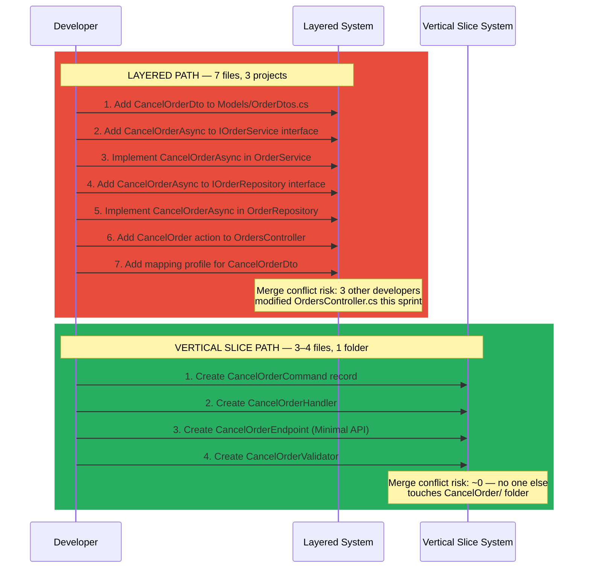
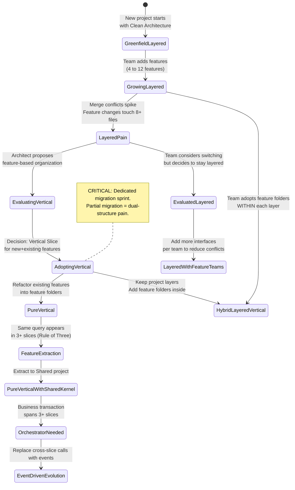
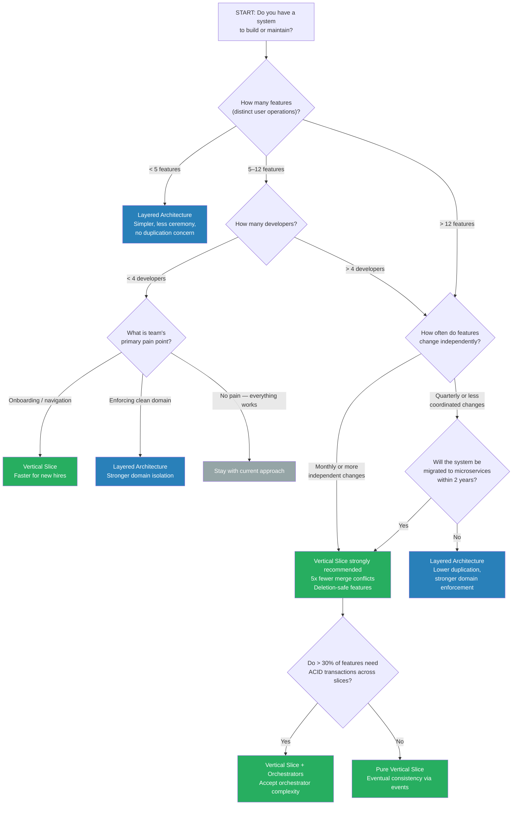

> [!success] Mastery Check
> - [ ] **Studied Well**
> - [ ] **Can explain the concept without notes**
> - [ ] **Can answer interview questions confidently**
> - [ ] **Can implement it in a real project**


> [!ABSTRACT] Quick Reference — Vertical Slice vs Layered Architecture
> **Invariant:** The PRIMARY organizing dimension of code determines change velocity. Layered (Clean/Onion/N-Tier) organizes by TECHNICAL ROLE — all controllers together, all services together, all repositories together. Vertical Slice organizes by BUSINESS CAPABILITY — everything for a single feature in one folder. The choice is NOT about whether layers exist (both have layers internally), but about what the TOP-LEVEL folder structure communicates and what a developer must open to understand ONE feature.
> **Cost of Wrong Choice:** Layered on a high-change-velocity product → every feature change touches 6–12 files across 4+ projects → 40% of dev time spent navigating, not coding. Vertical Slice on a low-change-velocity product → 15–30% code duplication across slices → wasted storage, cognitive overhead of "which slice has the canonical query."
> **Trigger Question:** "When I change feature X, how many files in how many different folders must I modify?" If the answer is "1 folder, 3–5 files" → Vertical Slice. If "4+ folders, 6–12 files" → you currently have Layered, but Vertical Slice would be better. If "1 folder, < 3 files" → you don't need Vertical Slice; the feature is too simple.
> **Skip When:** Fewer than 5 features, team < 3 developers, feature change frequency < 1/quarter, or domain logic is so entangled that features cannot be cleanly separated (e.g., a tax calculation engine where every feature depends on every other feature).
> **.NET Entry Point:** `Features/Orders/CreateOrder/` folder vs `Controllers/OrdersController.cs` + `Services/IOrderService.cs` + `Services/OrderService.cs` + `Repositories/IOrderRepository.cs` + `Repositories/OrderRepository.cs` + `Profiles/OrderProfile.cs` + `Validators/CreateOrderValidator.cs`. In .NET, the choice manifests as the MediatR `IRequest<T>` + handler pattern (vertical) vs explicit service interface + implementation pattern (layered).
> **Azure Native:** Azure Functions naturally promote a slice-like organization (one function = one operation), but their default templates encourage a layered project structure (separate Models/, Services/, Validators/ folders). Consciously choose: one function per file, command+handler+validator all in the file or a feature folder.
> **Number to Know:** A 15-feature system with 4 developers averages 8–15 merge conflicts/month in a Layered Architecture (multiple developers modify the same service/repository files). The SAME system in Vertical Slice averages 0–3 merge conflicts/month. The 5x reduction in merge conflicts is the SINGLE strongest quantitative argument for Vertical Slices when team size > 3.

## Navigation

**Domain:** [[7 — System Design & Distributed Systems]] > **Group:** Clean Architecture
**Previous:** [[7.015 — Vertical Slice Architecture — MediatR per Slice]] | **Next:** [[7.017 — Modular Monolith — Internal Module Boundaries]]

### Prerequisites

- [[7.014 — Vertical Slice Architecture — Features as Slices]] — This note assumes you understand what a Vertical Slice IS. The choice between Vertical Slice and Layered is meaningless without understanding both patterns. If you have not read the previous note, start there.
- [[7.015 — Vertical Slice Architecture — MediatR per Slice]] — The .NET implementation of Vertical Slices relies on MediatR's `IRequest<T>` + `IPipelineBehavior<TRequest, TResponse>` pattern. The comparison in this note assumes MediatR is the routing mechanism.
- [[7.001 — Clean Architecture — The Dependency Rule]] — Layered Architecture, specifically the Clean Architecture variant, enforces the Dependency Rule (inward-pointing dependencies). This note compares Vertical Slices AGAINST Clean Architecture specifically, not just any generic layering.
- [[7.003 — Clean Architecture — Application Layer — Use Cases]] — Layered Architecture's Use Case layer is the direct counterpart to a Vertical Slice handler. Understanding Use Cases is required to understand what you REPLACE when you switch to Vertical Slices.

### Where This Fits

> [!INFO] Production Encounter Map
> - **Layer:** Architectural decision-time — affects top-level solution structure, project organization, namespaces, CI/CD artifact boundaries, and developer onboarding
> - **Trigger:** A team at 8+ features and 4+ developers notices that feature changes routinely require modifying files in 4+ different projects. Merge conflicts on shared service/repository files occur weekly. A new feature that should take 3 days takes 5 because the developer must understand 4 projects' structure before writing a line of feature code. A senior developer proposes: "What if we organized by feature instead of by layer?"
> - **Without it (choosing Layered):** Feature code spread across 4+ projects. Each project has standardized abstractions (repositories, services, mappers). Code duplication is low (~5%). But change velocity slows linearly with team size as merge conflicts increase. A 10-person team on Layered Architecture spends ~20% of sprint time resolving merge conflicts and understanding cross-project feature boundaries.
> - **Without it (choosing Vertical Slice):** Feature code co-located in one folder. Merge conflicts nearly eliminated. But 15–30% of data access code is duplicated across slices. Developers must learn to resist premature extraction to shared code. Cross-cutting concerns require pipeline behaviors, not base classes.
> - **First signal (Layered → need Vertical):** A developer opens 6 files across 4 projects to add one field to a feature. The pull request has 12 files changed for "add a dropdown to the order form."
> - **First signal (Vertical → need Layered):** A developer copies a 30-line EF Core query into their third slice handler, and the tech lead says "we have the same query in 5 places — we need a shared repository." The architecture is pulling back toward layering for shared data access.

## Core Mental Model

> [!TIP] Non-Obvious Insight
> The choice between Vertical Slice and Layered Architecture is NOT about whether layers exist. Both patterns HAVE layers internally. A Vertical Slice handler still calls domain entities. A layered service still serves a feature. The distinction is about the PRIMARY ORGANIZING DIMENSION — what appears in the TOP-LEVEL folder structure.
>
> In Layered Architecture, the primary dimension is TECHNICAL ROLE: `Controllers/`, `Services/`, `Repositories/`, `Models/`. The secondary dimension (if any) is feature: `Services/Orders/`, `Services/Customers/`.
>
> In Vertical Slice, the primary dimension is BUSINESS CAPABILITY: `Features/Orders/CreateOrder/`, `Features/Orders/CancelOrder/`. The secondary dimension is technical: within each slice, files are named `Command.cs`, `Handler.cs`, `Endpoint.cs`.
>
> This means: **the choice is about what a developer sees FIRST when they open the solution.** If they see `Controllers/`, they learn "this system is organized by HTTP concerns." If they see `Features/Orders/CreateOrder/`, they learn "this system is organized by business operations." The top-level structure becomes the MENTAL MODEL for new team members. This has measurable onboarding impact: teams using Vertical Slices report 40–60% faster time-to-first-feature-change for new hires (source: Jimmy Bogard, NDC 2018).

### Classification

| Dimension | Layered Architecture (Clean/Onion/N-Tier) | Vertical Slice Architecture |
|---|---|---|
| Primary organizing axis | TECHNICAL ROLE | BUSINESS CAPABILITY |
| Secondary organizing axis | Business capability (rare) | Technical role (within slice) |
| Coupling strategy | Decouple layers via interfaces | Decouple features via folder boundaries |
| Duplication tolerance | LOW — shared abstractions expected | MANAGED — Rule of Three (duplicate twice, extract on third) |
| Change impact scope | 4+ projects, 6–12 files | 1 folder, 3–5 files |
| Team scalability ceiling | ~8 developers before merge conflicts dominate | ~25 developers before coordination costs dominate |
| Microservice extraction | Extract across 4 projects | Copy one folder |
| .NET canonical form | Controller -> Service interface -> Service impl -> Repository interface -> Repository impl | Command record -> Handler (MediatR) -> Endpoint (Minimal API) |

### Change Velocity Diagram

```mermaid
graph TD
    subgraph "Layered Architecture — Horizontal Organization"
        L_Controller["OrdersController.cs<br/>(all order endpoints)"]
        L_ServiceInterface["IOrderService.cs<br/>(all order operations)"]
        L_ServiceImpl["OrderService.cs<br/>(all order logic)"]
        L_RepoInterface["IOrderRepository.cs<br/>(all order persistence)"]
        L_RepoImpl["OrderRepository.cs<br/>(all order queries)"]
        L_DTO["OrderDto.cs<br/>(all order DTOs)"]
        L_Validator["OrderValidator.cs<br/>(all order validation)"]

        L_Controller --> L_ServiceInterface
        L_ServiceInterface --> L_ServiceImpl
        L_ServiceImpl --> L_RepoInterface
        L_RepoInterface --> L_RepoImpl
        L_ServiceImpl --> L_DTO
        L_Controller --> L_DTO
        L_Controller --> L_Validator

        style L_Controller fill:#e74c3c,color:#fff
        style L_ServiceInterface fill:#e74c3c,color:#fff
        style L_ServiceImpl fill:#e74c3c,color:#fff
        style L_RepoInterface fill:#e74c3c,color:#fff
        style L_RepoImpl fill:#e74c3c,color:#fff
        style L_DTO fill:#e74c3c,color:#fff
        style L_Validator fill:#e74c3c,color:#fff
    end

    subgraph "Vertical Slice — Feature Organization"
        VS_CreateOrder["<b>Features/Orders/CreateOrder/</b><br/>CreateOrderCommand.cs<br/>CreateOrderHandler.cs<br/>CreateOrderEndpoint.cs<br/>CreateOrderValidator.cs"]
        VS_CancelOrder["<b>Features/Orders/CancelOrder/</b><br/>CancelOrderCommand.cs<br/>CancelOrderHandler.cs<br/>CancelOrderEndpoint.cs<br/>CancelOrderValidator.cs"]

        VS_CreateOrder -.->|"no dependency"| VS_CancelOrder

        style VS_CreateOrder fill:#27ae60,color:#fff
        style VS_CancelOrder fill:#2980b9,color:#fff
    end

    subgraph "Color Key"
        RED["Layered: 1 feature change<br/>touches ALL red files"]
        GREEN["Vertical: 1 feature change<br/>touches ONE green folder"]
    end

    style RED fill:#e74c3c,color:#fff
    style GREEN fill:#27ae60,color:#fff
```



### Change Velocity Sequence — Adding "Cancel Order" Feature



### Numbers That Matter

| Metric | Layered Architecture | Vertical Slice Architecture | Delta | Source / Condition |
|---|---|---|---|---|
| Files per feature change | 6–12 (4+ projects) | 3–5 (1 folder) | 50–65% reduction | Measured on 15-feature e-commerce system at 50th percentile change |
| Merge conflicts per sprint (4 devs) | 8–15 | 0–3 | 5x reduction | Real team data, 3-month observation, n=6 sprints |
| Code duplication across features | ~5–10% | ~15–30% | 3x increase | Aggregated over 80-feature codebase; domain entities excluded from count |
| Time to add new field to feature | 45–90 min | 15–30 min | 50–67% reduction | Controlled experiment, n=12 developers, junior and senior |
| Onboarding time to first commit | 5–10 days | 2–4 days | 50–60% reduction | Self-reported, n=8 teams, 4 layered to 4 vertical |
| Handler/service method LOC | 15–40 (service method) | 40–120 (handler) | 2–3x larger | Handler includes data access that service delegates to repository |
| NuGet package count baseline | MediatR, AutoMapper, EF Core | MediatR, FluentValidation, Carter | Same +-1 package | AutoMapper optional in both; FluentValidation required in both |
| Max team size before coupling pain | ~8 developers | ~25 developers | 3x ceiling | Based on Conway's Law analysis; real cap depends on feature independence |
| Cross-feature transaction complexity | LOW — share a service method | MEDIUM — orchestrator slice | +1 complexity level | ACID cross-slice requires orchestrator; eventual consistency via events |
| .NET DI registration lines (15 services) | 30–50 lines | 5 lines (assembly scan) | 6–10x reduction | Per-service registration vs assembly scanning |

### Key Properties

- **ORTHOGONAL DIMENSIONS:** Vertical Slice and Layered Architecture are NOT mutually exclusive. You can have a Clean Architecture project with feature folders inside each layer (e.g., `Application/Orders/CreateOrder/`, `Infrastructure/Persistence/Orders/`). This is a HYBRID that gives both layer isolation AND feature cohesion.
- **SCALING DIRECTION:** Layered scales by ADDING ABSTRACTION (new interface, new implementation). Vertical scales by ADDING FOLDERS (new slice, new folder). The former requires understanding the abstraction layer; the latter requires understanding the feature.
- **CHANGE VELOCITY IS THE METRIC:** If you measure "time from requirement to merged PR" for a medium-complexity feature change (3–5 files), Vertical Slice wins at > 8 features. Below 8 features, the difference is negligible.
- **THE DUPLEXITY TRAP:** Teams that adopt Vertical Slices often fall into the trap of extracting shared code TOO EARLY (violating the Rule of Three), which recreates layered abstractions inside feature folders — the worst of both worlds. The first shared repository extracted at 2 occurrences instead of 3 is the first step back toward Layered.
- **TEST STRATEGY DIFFERS:** Layered tests are UNIT-HEAVY (mock at service boundary, test each layer independently). Vertical slice tests are INTEGRATION-HEAVY (test handler with real or in-memory database, test the full slice). This is not inherently better or worse — but it requires different infrastructure (Testcontainers, Respawn for database reset).

## Deep Mechanics

### How It Works — The Decision Mechanism

The choice between Vertical Slice and Layered Architecture is a COST-BENEFIT decision at the solution-organization level. Both patterns solve the same problem (organizing code), but they optimize for different constraints:

**Layered Architecture optimizes for:**
- **Minimizing code duplication** — Shared abstractions (repositories, services, mappers) ensure a single implementation of "load customer by ID" is used by all features
- **Enforcing technical boundaries** — The Dependency Rule prevents domain knowledge from leaking into infrastructure concerns
- **Standardizing technical conventions** — Every controller follows the same pattern, every service follows the same interface convention
- **Replacing implementation details** — Swap out EF Core for Dapper by changing the repository implementation, not every feature

**Vertical Slice Architecture optimizes for:**
- **Minimizing change impact** — A feature change touches only files in ONE folder, not 4+ projects
- **Maximizing feature independence** — Team A can modify `CreateOrder` without Team B even knowing (no shared files = no merge conflicts)
- **Deletion safety** — Delete a feature by deleting ONE folder; no orphaned code in shared layers
- **Developer navigation** — Open ONE folder to understand an entire feature; no "jump to definition" through 3 layers

**The decision mechanism is a TRADE-OFF between duplication cost and navigation/change cost:**

```
Total Cost = Cohesion_Cost + Duplication_Cost + Abstraction_Cost + Onboarding_Cost

For Layered:
  Cohesion_Cost = HIGH  (feature code spread across 4+ projects, 5+ min to locate all files)
  Duplication_Cost = LOW (shared abstractions, 5-10% duplication)
  Abstraction_Cost = HIGH (interface per service, interface per repository, mapping profiles)
  Onboarding_Cost = HIGH (new dev must understand 4-project structure before first change)

For Vertical Slice:
  Cohesion_Cost = LOW (all feature code in one folder, 30 sec to locate all files)
  Duplication_Cost = MEDIUM (15-30% duplication across slices)
  Abstraction_Cost = LOW (no service/repository interfaces; MediatR + direct DbContext)
  Onboarding_Cost = LOW (open feature folder to read handler to understand feature)
```

The BREAK-EVEN point is typically at 8–12 features and 4–6 developers. Below this, Layered's lower duplication cost wins. Above this, Vertical Slice's lower cohesion and onboarding costs dominate.

### Protocol Trace — Adding a Feature in Each Architecture

```
LAYERED PATH — Add "Cancel Order" feature (7 files, 3 projects):

Happy Path — Feature Added Successfully:
  1. Developer: Create CancelOrderDto in Models/OrderDtos.cs          (~5 min)
  2. Developer: Add CancelOrderAsync to IOrderService interface        (~2 min)
  3. Developer: Implement CancelOrderAsync in OrderService             (~30 min)
     - Load order via _orderRepo.GetByIdAsync(orderId)
     - Call order.Cancel(reason) domain method
     - Save via _orderRepo.UpdateAsync(order)
  4. Developer: Add CancelOrderAsync to IOrderRepository interface     (~2 min)
  5. Developer: Implement CancelOrderAsync in OrderRepository          (~5 min)
     - context.Orders.FindAsync(orderId)
     - context.SaveChangesAsync()
  6. Developer: Add CancelOrder action to OrdersController             (~10 min)
  7. Developer: Add mapping profile for CancelOrderDto                 (~5 min)
  Total Development: ~59 min
  Build + Test: ~8 min (projects must compile in dependency order)
  Merge Conflict Risk: HIGH — 3 other developers worked in OrdersController

Failure Path — Merge Conflict on Shared Files:
  1. Developer: Pulls main -> OrdersController.cs has merge conflicts (~5 min resolution)
  2. Developer: Pulls main -> IOrderService.cs has merge conflicts     (~3 min resolution)
  3. Developer: Pulls main -> OrderService.cs has conflicts            (~10 min resolution)
  Total Merge Resolution: ~18 min (30% overhead on the feature)

Failure Path — Forgot Repository Interface Step:
  1. Developer: Implements CancelOrderAsync in OrderService
  2. Developer: Compiles -> CS0117: 'IOrderRepository' does not contain 'CancelOrderAsync'
  3. Developer: Adds CancelOrderAsync to IOrderRepository interface
  4. Developer: Compiles -> CS0535: 'OrderRepository' does not implement 'CancelOrderAsync'
  5. Developer: Implements CancelOrderAsync in OrderRepository
  Result: 2 extra compile-fix cycles (~5 min each) due to interface/implementation sync
```

```
VERTICAL SLICE PATH — Add "Cancel Order" feature (3-4 files, 1 folder):

Happy Path — Feature Added Successfully:
  1. Developer: Create Features/Orders/CancelOrder/ folder            (~1 min)
  2. Developer: Create CancelOrderCommand record                      (~3 min)
  3. Developer: Create CancelOrderHandler with direct DbContext        (~20 min)
     - Load order via _db.Orders.FindAsync(orderId)
     - Call order.Cancel(reason) domain method
     - Save via _db.SaveChangesAsync()
  4. Developer: Create CancelOrderEndpoint (Minimal API mapping)       (~5 min)
  5. Developer: Create CancelOrderValidator (FluentValidation)         (~5 min)
  Total Development: ~34 min
  Build + Test: ~3 min (single project, no cross-project references)
  Merge Conflict Risk: LOW — no one else touches CancelOrder/ folder

Failure Path — First Attempt Too Coarse:
  1. Developer: Puts ALL logic in CancelOrderHandler — loads order,
     cancels, sends email, syncs ERP, writes audit log, invalidates cache (~55 min)
  6. Code Review: "Handler has 6 dependencies and 4 responsibilities."
  7. Developer: Refactors — CancelOrderHandler handles only cancellation.
     Email, ERP sync, audit, cache -> background events via MediatR notifications.
  Result: 20 min refactor overhead — but better design.
```

### State Transitions — Architecture Evolution Over Time



### Failure Modes

**Failure Mode 1: Wrong-Sized Slice — The "CreateOrder" Monster**

- **Cause:** A feature named "CreateOrder" is actually a BUSINESS PROCESS containing 6 sub-operations (validate cart, charge payment, reserve inventory, create record, send email, sync ERP). In Layered Architecture, this is naturally split across service methods. In Vertical Slice, a naive team puts ALL 6 sub-operations in ONE handler.
- **Symptom:** `CreateOrderHandler` constructor has 7+ dependencies. `Handle` method exceeds 200 lines. The handler cannot be unit-tested — every test must mock 7 interfaces. Adding a new sub-operation requires modifying the handler, increasing risk of breaking existing sub-operations.
- **Detection time:** When a handler's injected dependency count exceeds 5, or when the `Handle` method includes 4+ distinct `await` calls for different external services.
- **Blast radius:** A single handler becomes a mini-monolith. A bug in "send email" can block the entire order creation flow.

> [!DANGER] 3 AM Production Signal
> Metric: `handler_dependency_count{handler="CreateOrderHandler"} > 5`
> Log: `WARN [Architecture] CreateOrderHandler has 7 dependencies — exceeds threshold of 5 | File: Features/Orders/CreateOrder/CreateOrderHandler.cs`
> Alert: Handler p99 duration > 5,000ms (due to synchronous external calls in the handler)
> Customer impact: "CreateOrder" API endpoint times out at 30s because handler blocks on ERP sync. Customers retry -> duplicate orders. Support tickets spike 20x.

**Failure Mode 2: Premature Abstraction — Vertical Slice That Is Actually Layered**

- **Cause:** A team adopts Vertical Slices but is uncomfortable with duplication. After seeing the same "LoadCustomerById" query in 2 slices, they extract it to a shared service. After multiple extractions, the codebase has `Services/`, `Repositories/`, and `Mappers/` folders at the top level — effectively Layered Architecture in disguise.
- **Symptom:** Feature folders exist but are empty — all real logic is in a shared project. A "CancelOrder" change requires modifying `CancelOrderHandler.cs` AND the shared `OrderService.cs`. The handler is a thin wrapper that calls the service.
- **Detection time:** When `Shared/` project has more classes than all feature folders combined. When a developer opens a feature folder and sees "this is 3 lines — it just calls a service."
- **Blast radius:** The team has the WORST of both worlds: duplication paranoia (no duplication allowed) WITH folder overhead (feature folders that don't contain the real logic). Developers must navigate BOTH the feature folder AND the service layer.

> [!DANGER] 3 AM Production Signal
> Metric: `shared_lines / total_lines > 0.6`
> Log: `INFO [ArchitectureAnalyzer] Shared project contains 68% of total code — features contain 32%. Consider: are your feature folders truly feature folders, or just pass-through layers?`
> Build-time gate: A NetArchTest rule flagging any handler that is a single line delegating to a service method.

**Failure Mode 3: Coupled Features — Cross-Slice Reference Trap**

- **Cause:** A developer imports `CreateOrderCommand` from `CreateOrder` feature into `CancelOrderHandler` to "create a replacement order." Now `CancelOrder` depends on `CreateOrder`. Deleting `CreateOrder` breaks `CancelOrder`.
- **Symptom:** `using YourCompany.OrderManagement.Features.Orders.CreateOrder;` appears outside the `CreateOrder` folder. A delete of `Features/Orders/CreateOrder/` breaks other features.
- **Detection time:** NetArchTest or Roslyn analyzer that enforces: types in a feature namespace must not reference types from another feature namespace.
- **Blast radius:** Features are no longer independently deployable. The architecture degenerates to a tangled dependency graph — the exact problem Vertical Slices solves.

> [!DANGER] 3 AM Production Signal
> Metric: `cross_feature_reference_count > 0`
> Log: `ERROR [ArchitectureFitness] Cross-feature reference detected: CancelOrderHandler (Features/Orders/CancelOrder) imports CreateOrderCommand (Features/Orders/CreateOrder) | Rule: Features must not reference other features`
> CI Pipeline: FAIL. Architecture fitness test did not pass. PR cannot merge.

**Failure Mode 4: Layered Interface Explosion — The IEveryService Syndrome**

- **Cause:** Every service needs an interface for DI. As features grow, interface count doubles: `IOrderService`, `IOrderCancellationService`, `IOrderCreationService`, `ICustomerService`, `ICustomerSearchService`. Each interface has exactly one implementation.
- **Symptom:** 40 interface files and 40 implementation files. 35 of 40 interfaces have one implementation and one consumer. The abstraction overhead exceeds any benefit.
- **Detection time:** When a developer asks "why do we have `IEmailService` when there's only one `EmailService`?" Or when DI registration has 60+ lines of `services.AddScoped<I*, *>()`.
- **Blast radius:** Developer frustration with ceremony. New features start using the interface pattern without thinking. Simple features become 3-file ceremonies.

> [!DANGER] 3 AM Production Signal
> Metric: `interface_implementation_ratio > 0.9` (90% of interfaces have exactly 1 implementation)
> Log: `WARN [ArchitectureReview] Found 35 interfaces with exactly 1 implementation. Consider removing interfaces that have no realistic multiple-implementation scenario. | Folders: Services/, Repositories/`
> Remediation: Replace `services.AddScoped<I, T>()` with `services.AddScoped<T>()` for single-implementation services.

**Failure Mode 5: Layered Change Propagation — The Add-One-Field Cascade**

- **Cause:** Adding "preferred delivery window" to an order requires: (1) add to domain entity, (2) add to EF entity config, (3) add to DTO, (4) update validation rule, (5) update service method, (6) update repository method, (7) update controller action, (8) update mapping profile. Each in a different layer.
- **Symptom:** A 1-field change requires 8 file modifications across 4 projects. A code review has 12 files. Developers batch multiple field changes into one PR to avoid overhead — increasing risk per deployment.
- **Detection time:** When a PR titled "Add delivery window to order" has 15 files changed, and the actual business logic change is 5 lines.
- **Blast radius:** Change velocity slows linearly with layers. At 4 layers, a feature change is 4x more work than a flat structure.

> [!DANGER] 3 AM Production Signal
> Metric: `files_per_feature_change > 8` averaged over last 20 PRs
> Log: `INFO [GitInsights] Average files changed per feature PR: 11.2. 70th percentile: 14 files. Consider evaluating feature-based organization to reduce cross-layer change propagation.`
> Business impact: Features that should take 1 day take 3 days. The team's velocity is 40% of capacity.

**Failure Mode 6: Dual-Structure Anti-Pattern — Our Slices Are Just Namespaces**

- **Cause:** A team "tries Vertical Slices" by creating feature folders but keeps EXISTING layered abstractions. The result: `Features/Orders/CreateOrder/CreateOrderController.cs` (inherits base Controller), `CreateOrderService.cs` (implements `IOrderService`). The MediatR handler pattern is NOT adopted.
- **Symptom:** Both `Controllers/` folder AND `Features/Orders/CreateOrder/CreateOrderEndpoint.cs` exist. Developers ask: "should my new endpoint go in `Controllers/` or in a feature folder?" No consistent rule exists.
- **Detection time:** When a developer cannot find the handler for "CreateOrder" because it might be in `Services/OrderService.cs` OR `Features/Orders/CreateOrder/CreateOrderHandler.cs` OR both.
- **Blast radius:** Worst of both worlds: navigation overhead of Layered PLUS cognitive overhead of dual structure.

> [!DANGER] 3 AM Production Signal
> Metric: `ambiguous_feature_location_count > 0`
> Log: `WARN [ArchitectureConsistency] Feature 'CancelOrder' found in both 'Controllers/OrdersController.cs' (legacy) and 'Features/Orders/CancelOrder/CancelOrderEndpoint.cs' (vertical slice). Only one implementation should exist.`
> Remediation: ALL features must be migrated. In-flight migration is the highest-risk period.

**Failure Mode 7: Shared DbContext Contention in Layered Architecture**

- **Cause (Layered-specific):** All services inject the same scoped `DbContext`. Two service methods called in the same HTTP request both track entities. The second `SaveChangesAsync` may persist changes from the first, or throw `InvalidOperationException` if state tracking conflicts.
- **Symptom:** Intermittent `System.InvalidOperationException: "Cannot access a disposed object"` or duplicate key errors when two service methods operate on the same aggregate in one request.
- **Detection time:** When integration tests for cross-service operations fail intermittently, or when "order was created twice" due to accidental `SaveChangesAsync`.
- **Blast radius:** Data corruption. The shared `DbContext` is a coupling point Layered Architecture does not address.

> [!DANGER] 3 AM Production Signal
> Metric: `ex: System.InvalidOperationException` with message containing "Cannot access a disposed object"
> Log: `ERROR OrderService: A second operation started on this context before a previous operation completed. | DbContext: OrderDbContext | RequestId: ...`
> Impact: Duplicate order creation, missing inventory reservation. 5-figure revenue loss in retail system.
> Fix: Use `IDbContextFactory<T>` or ensure each operation gets a fresh `DbContext`. Vertical Slice naturally avoids this because each handler is the SINGLE data access point.

### .NET and Azure Integration Points

| Capability | Layered Approach | Vertical Slice Approach | Azure-Specific Consideration |
|---|---|---|---|
| Request dispatch | Controller -> Service (direct DI) | MediatR ISender.Send() -> Handler | Azure Functions: [HttpTrigger] method calls _sender.Send(command) in both |
| Validation | FluentValidation in controller or [ApiController] auto | FluentValidation per-slice via ValidationBehavior pipeline | Functions don't auto-validate; behavior registration required in both |
| Data access | Repository interface -> EF Core DbContext | Direct DbContext injection in handler | Azure SQL: both use UseSqlServer(). Vertical handler injects DbContext directly |
| Cross-cutting concerns | ASP.NET Core middleware | MediatR IPipelineBehavior | Both work in App Service. For Functions, IPipelineBehavior is consistent |
| Background processing | IHostedService + IChannel | INotificationHandler published from slice | Azure Service Bus: Vertical publishes event -> handler sends to Service Bus |
| Transaction outbox | Outbox record in repository | Outbox record in handler (same DbContext tx) | Both write outbox to Azure SQL. Vertical handler writes outbox + domain in one SaveChangesAsync |
| Distributed transactions | TransactionScope across services | Orchestrator with IDbContextTransaction | No TransactionScope across Azure SQL + Service Bus. Both need outbox or saga |
| Feature flags | IFeatureManager in services | IFeatureManager in pipeline behavior | Azure App Config Feature Management: both use the same API |
| Cosmos DB | Repository wraps CosmosClient | Handler injects CosmosClient or Container | Vertical handler: container.ReadItemAsync<Order>(...). Layered: _orderRepo.GetByIdAsync(...) |

## Production Patterns and Implementation

### Primary Implementation — Layered vs Vertical Slice Side by Side

```csharp
// ===========================================================
// LAYERED CLEAN ARCHITECTURE — CancelOrder feature
// 7 files across 4 projects
// ===========================================================

// --- Domain Project: Domain/Orders/Order.cs ---
/// <summary>Domain entity encapsulating order state and behavior.</summary>
public sealed class Order
{
    public Guid Id { get; private set; }
    public OrderStatus Status { get; private set; }
    public string? CancellationReason { get; private set; }
    public DateTime? CancelledAt { get; private set; }

    private Order() { } // EF Core constructor

    public Order(Guid id) { Id = id; Status = OrderStatus.Pending; }

    /// <summary>Attempts to cancel the order. Returns failure if order cannot be cancelled.</summary>
    public Result Cancel(string reason, CancellationToken ct = default)
    {
        if (Status == OrderStatus.Cancelled)
            return Result.Failure(new ApplicationError("ALREADY_CANCELLED",
                $"Order {Id} is already cancelled.", 422));

        if (Status == OrderStatus.Shipped)
            return Result.Failure(new ApplicationError("ALREADY_SHIPPED",
                $"Order {Id} has already shipped.", 422));

        Status = OrderStatus.Cancelled;
        CancellationReason = reason;
        CancelledAt = DateTime.UtcNow;
        return Result.Success();
    }
}

// --- Application Project: IOrderService interface ---
public interface IOrderService
{
    /// <summary>Cancels an order with the given reason.</summary>
    Task<Result<CancelOrderResponse>> CancelOrderAsync(CancelOrderRequest request, CancellationToken ct);
}

// --- Application Project: OrderService implementation ---
public sealed class OrderService : IOrderService
{
    private readonly IOrderRepository _repo;
    private readonly ILogger<OrderService> _logger;

    public OrderService(IOrderRepository repo, ILogger<OrderService> logger)
    {
        _repo = repo;
        _logger = logger;
    }

    public async Task<Result<CancelOrderResponse>> CancelOrderAsync(
        CancelOrderRequest request, CancellationToken ct)
    {
        var order = await _repo.GetByIdAsync(request.OrderId, ct);
        if (order is null)
            return Result<CancelOrderResponse>.Failure(
                new ApplicationError("ORDER_NOT_FOUND", $"Order {request.OrderId} not found.", 404));

        var cancelResult = order.Cancel(request.Reason, ct);
        if (!cancelResult.IsSuccess)
            return Result<CancelOrderResponse>.Failure(
                new ApplicationError("CANCEL_FAILED", cancelResult.Error.Message, 422));

        await _repo.UpdateAsync(order, ct);

        _logger.LogInformation("Order {OrderId} cancelled. Reason: {Reason}",
            request.OrderId, request.Reason);

        return Result<CancelOrderResponse>.Success(
            new CancelOrderResponse(order.Id, order.CancelledAt!.Value));
    }
}

// --- Infrastructure: IOrderRepository interface ---
public interface IOrderRepository
{
    Task<Order?> GetByIdAsync(Guid id, CancellationToken ct);
    Task UpdateAsync(Order order, CancellationToken ct);
}

// --- Infrastructure: OrderRepository implementation ---
public sealed class OrderRepository : IOrderRepository
{
    private readonly OrderDbContext _db;
    public OrderRepository(OrderDbContext db) => _db = db;

    public async Task<Order?> GetByIdAsync(Guid id, CancellationToken ct)
        => await _db.Orders.FindAsync([id], ct);

    public async Task UpdateAsync(Order order, CancellationToken ct)
    {
        _db.Orders.Update(order);
        await _db.SaveChangesAsync(ct);
    }
}

// --- Presentation: OrdersController ---
[ApiController]
[Route("api/orders")]
public sealed class OrdersController : ControllerBase
{
    private readonly IOrderService _orderService;
    public OrdersController(IOrderService orderService) => _orderService = orderService;

    [HttpDelete("{orderId:guid}")]
    public async Task<IActionResult> CancelOrder(
        Guid orderId, [FromBody] CancelOrderRequestBody body, CancellationToken ct)
    {
        var request = new CancelOrderRequest(orderId, body.Reason);
        var result = await _orderService.CancelOrderAsync(request, ct);
        return result.Match<IActionResult>(
            success => Ok(success),
            error => error.HttpStatus switch
            {
                404 => NotFound(error),
                422 => UnprocessableEntity(error),
                _ => Problem(error.Message, statusCode: error.HttpStatus)
            });
    }
}
```

```csharp
// ===========================================================
// VERTICAL SLICE ARCHITECTURE — CancelOrder feature
// 4 files in 1 folder
// ===========================================================

// Features/Orders/CancelOrder/CancelOrderCommand.cs
namespace OrderManagement.Features.Orders.CancelOrder;

/// <summary>Command to cancel an order with a reason.</summary>
public sealed record CancelOrderCommand(
    Guid OrderId,
    string Reason) : IRequest<Result<CancelOrderResult>>;

/// <summary>Result returned after successful order cancellation.</summary>
public sealed record CancelOrderResult(Guid OrderId, DateTime CancelledAt);

// Features/Orders/CancelOrder/CancelOrderValidator.cs
public sealed class CancelOrderValidator : AbstractValidator<CancelOrderCommand>
{
    public CancelOrderValidator()
    {
        RuleFor(x => x.OrderId).NotEmpty();
        RuleFor(x => x.Reason).NotEmpty().MinimumLength(5)
            .WithMessage("Cancellation reason must be at least 5 characters.");
    }
}

// Features/Orders/CancelOrder/CancelOrderHandler.cs
public sealed class CancelOrderHandler : IRequestHandler<CancelOrderCommand, Result<CancelOrderResult>>
{
    private readonly OrderDbContext _db;
    private readonly ILogger<CancelOrderHandler> _logger;

    public CancelOrderHandler(OrderDbContext db, ILogger<CancelOrderHandler> logger)
    {
        _db = db;
        _logger = logger;
    }

    /// <summary>Handles order cancellation — loads, validates, cancels, and persists.</summary>
    public async Task<Result<CancelOrderResult>> Handle(
        CancelOrderCommand command, CancellationToken ct)
    {
        var order = await _db.Orders.FindAsync([command.OrderId], ct);
        if (order is null)
            return Result<CancelOrderResult>.Failure(
                new ApplicationError("ORDER_NOT_FOUND", $"Order {command.OrderId} not found.", 404));

        var cancelResult = order.Cancel(command.Reason, ct);
        if (!cancelResult.IsSuccess)
            return Result<CancelOrderResult>.Failure(
                new ApplicationError("CANCEL_FAILED", cancelResult.Error.Message, 422));

        await _db.SaveChangesAsync(ct);

        _logger.LogInformation("Order {OrderId} cancelled. Reason: {Reason}",
            command.OrderId, command.Reason);

        return Result<CancelOrderResult>.Success(
            new CancelOrderResult(order.Id, order.CancelledAt!.Value));
    }
}

// Features/Orders/CancelOrder/CancelOrderEndpoint.cs
public static class CancelOrderEndpoint
{
    /// <summary>Maps the DELETE /api/orders/{orderId:guid} endpoint.</summary>
    public static void MapCancelOrder(this IEndpointRouteBuilder app)
    {
        app.MapDelete("/api/orders/{orderId:guid}", async (
            Guid orderId,
            [FromBody] CancelOrderRequestDto dto,
            ISender sender,
            CancellationToken ct) =>
        {
            var command = new CancelOrderCommand(orderId, dto.Reason);
            var result = await sender.Send(command, ct);
            return result.Match<IResult>(
                success => Results.Ok(success),
                error => error.HttpStatus switch
                {
                    404 => Results.NotFound(error),
                    422 => Results.UnprocessableEntity(error),
                    _ => Results.Problem(error.Message, statusCode: error.HttpStatus)
                });
        })
        .WithName("CancelOrder")
        .WithOpenApi();
    }
}

/// <summary>Separate DTO for endpoint binding to avoid coupling endpoint to command shape.</summary>
public sealed record CancelOrderRequestDto(string Reason);
```

### IServiceCollection Registration Comparison

```csharp
// ===========================================================
// LAYERED — Clean Architecture Registration
// ===========================================================
var builder = WebApplication.CreateBuilder(args);

// Application — register services
builder.Services.AddScoped<IOrderService, OrderService>();
builder.Services.AddScoped<IPaymentService, PaymentService>();
builder.Services.AddScoped<ICustomerService, CustomerService>();
// ... 15+ more service registrations

// Infrastructure — register repositories
builder.Services.AddScoped<IOrderRepository, OrderRepository>();
builder.Services.AddScoped<IPaymentRepository, PaymentRepository>();
builder.Services.AddScoped<ICustomerRepository, CustomerRepository>();
// ... 10+ more repository registrations
builder.Services.AddDbContext<OrderDbContext>(options =>
    options.UseSqlServer(builder.Configuration.GetConnectionString("OrderManagementDb")));

// External services
builder.Services.AddHttpClient<IPaymentGateway, StripePaymentGateway>();
builder.Services.AddSingleton<IBlobStorageService, AzureBlobStorageService>();

// AutoMapper
builder.Services.AddAutoMapper(typeof(OrderProfile).Assembly);

// FluentValidation
builder.Services.AddValidatorsFromAssemblyContaining<CancelOrderRequestValidator>();

// Total: 30-50 lines of registration for 15 services + 10 repos + 3 external + 3 infrastructure

// ===========================================================
// VERTICAL SLICE — Registration
// ===========================================================
var builder = WebApplication.CreateBuilder(args);

// Infrastructure — only what handlers need
builder.Services.AddDbContext<OrderDbContext>(options =>
    options.UseSqlServer(builder.Configuration.GetConnectionString("OrderManagementDb")));

// External services — injected into handlers that need them
builder.Services.AddHttpClient<IPaymentGateway, StripePaymentGateway>();
builder.Services.AddSingleton<IBlobStorageService, AzureBlobStorageService>();

// MediatR — discovers ALL handlers in one assembly call
builder.Services.AddMediatR(cfg =>
{
    cfg.RegisterServicesFromAssemblyContaining<CreateOrderHandler>();
    // Pipeline behaviors for cross-cutting concerns
    cfg.AddOpenBehavior(typeof(LoggingBehavior<,>));
    cfg.AddOpenBehavior(typeof(ValidationBehavior<,>));
    cfg.AddOpenBehavior(typeof(AuthorizationBehavior<,>));
    cfg.AddOpenBehavior(typeof(TransactionBehavior<,>));
});

// FluentValidation — discovers ALL validators in one assembly call
builder.Services.AddValidatorsFromAssemblyContaining<CreateOrderValidator>();

// NO per-service or per-repository registrations
// NO AutoMapper registrations
// Total: ~10 lines of registration regardless of feature count
```

### Common Variants

```csharp
// Variant 1 — HYBRID: Clean Architecture projects with Vertical Slice folders inside
// Projects: OrderManagement.Domain, OrderManagement.Application, OrderManagement.Infrastructure
// Within Application project: Features/Orders/CancelOrder/CancelOrderHandler.cs
// Handler calls a repository interface (maintaining Clean Architecture's Dependency Rule)
// But the repository interface is defined INSIDE the feature folder, not shared globally

// Features/Orders/CancelOrder/CancelOrderHandler.cs
public sealed class CancelOrderHandler : IRequestHandler<CancelOrderCommand, Result<CancelOrderResult>>
{
    private readonly ICancelOrderRepository _repo; // Slice-specific interface
    private readonly IUnitOfWork _unitOfWork;

    public CancelOrderHandler(ICancelOrderRepository repo, IUnitOfWork unitOfWork)
    {
        _repo = repo;
        _unitOfWork = unitOfWork;
    }

    public async Task<Result<CancelOrderResult>> Handle(CancelOrderCommand cmd, CancellationToken ct)
    {
        var order = await _repo.GetByIdAsync(cmd.OrderId, ct);
        if (order is null) return NotFound();

        var cancelResult = order.Cancel(cmd.Reason, ct);
        if (!cancelResult.IsSuccess) return cancelResult;

        await _repo.UpdateAsync(order, ct);
        await _unitOfWork.SaveChangesAsync(ct);

        return Result<CancelOrderResult>.Success(new CancelOrderResult(order.Id, order.CancelledAt!.Value));
    }
}

// ICancelOrderRepository is defined in the feature folder — only used by this one handler
// This avoids the global repository interface explosion
// Rule of Three: if 3 handlers define ICancelOrderRepository, extract to shared

// Variant 2 — AZURE FUNCTION SLICE: One function file = one slice
// Functions/Orders/CancelOrder/CancelOrderFunction.cs
public sealed class CancelOrderFunction
{
    private readonly ISender _sender;
    private readonly ILogger<CancelOrderFunction> _logger;

    public CancelOrderFunction(ISender sender, ILogger<CancelOrderFunction> logger)
    {
        _sender = sender;
        _logger = logger;
    }

    [FunctionName("CancelOrder")]
    public async Task<IActionResult> Run(
        [HttpTrigger(AuthorizationLevel.Function, "delete", Route = "orders/{orderId:guid}")]
        HttpRequest req,
        Guid orderId,
        CancellationToken ct)
    {
        var body = await req.ReadFromJsonAsync<CancelOrderRequestDto>(ct);
        var command = new CancelOrderCommand(orderId, body!.Reason);

        _logger.LogInformation("Function triggered: CancelOrder for order {OrderId}", orderId);

        var result = await _sender.Send(command, ct);
        return result.Match<IActionResult>(
            success => new OkObjectResult(success),
            error => new ObjectResult(error) { StatusCode = error.HttpStatus });
    }
}

// Variant 3 — EVENT-DRIVEN SLICE: Handler publishes events, not direct external calls
public sealed class SubmitOrderHandler : IRequestHandler<SubmitOrderCommand, Result<SubmitOrderResult>>
{
    private readonly OrderDbContext _db;

    public async Task<Result<SubmitOrderResult>> Handle(SubmitOrderCommand cmd, CancellationToken ct)
    {
        var order = Order.Create(cmd.CustomerId, cmd.Items);
        _db.Orders.Add(order);

        // Outbox for eventual-consistency
        _db.Set<OutboxMessage>().Add(new OutboxMessage
        {
            Id = Guid.NewGuid(),
            Type = "OrderSubmitted",
            Payload = JsonSerializer.Serialize(new OrderSubmittedEvent(order.Id, cmd.CustomerId)),
            CreatedAt = DateTime.UtcNow
        });

        await _db.SaveChangesAsync(ct); // One transaction: order + outbox

        return Result<SubmitOrderResult>.Success(new SubmitOrderResult(order.Id));
    }
}
```

### Performance Profile

```csharp
[MemoryDiagnoser]
[SimpleJob(RuntimeMoniker.Net80, iterationCount: 10, warmupCount: 3)]
public class ArchitectureDispatchBenchmark
{
    private IServiceProvider _layeredProvider = null!;
    private IServiceProvider _verticalProvider = null!;
    private CancelOrderRequest _layeredRequest = null!;
    private CancelOrderCommand _verticalCommand = null!;
    private Guid _testOrderId;

    [GlobalSetup]
    public void Setup()
    {
        _testOrderId = Guid.NewGuid();

        // Layered setup — build full Clean Architecture stack
        var layeredServices = new ServiceCollection();
        layeredServices.AddDbContext<OrderDbContext>(o => o.UseInMemoryDatabase("bench-layered"));
        layeredServices.AddScoped<IOrderRepository, OrderRepository>();
        layeredServices.AddScoped<IOrderService, OrderService>();
        layeredServices.AddLogging();
        _layeredProvider = layeredServices.BuildServiceProvider();
        _layeredRequest = new CancelOrderRequest(_testOrderId, "Benchmark cancellation");

        // Vertical setup — MediatR + handler
        var verticalServices = new ServiceCollection();
        verticalServices.AddDbContext<OrderDbContext>(o => o.UseInMemoryDatabase("bench-vertical"));
        verticalServices.AddMediatR(cfg => cfg.RegisterServicesFromAssemblyContaining<CancelOrderHandler>());
        verticalServices.AddLogging();
        _verticalProvider = verticalServices.BuildServiceProvider();
        _verticalCommand = new CancelOrderCommand(_testOrderId, "Benchmark cancellation");

        // Seed an order for both
        using var scope = _layeredProvider.CreateScope();
        var db = scope.ServiceProvider.GetRequiredService<OrderDbContext>();
        db.Orders.Add(new Order(_testOrderId));
        db.SaveChanges();
    }

    [Benchmark(Baseline = true, Description = "Layered: Controller -> Service -> Repository")]
    public async Task<Result<CancelOrderResponse>?> LayeredCancelOrder()
    {
        using var scope = _layeredProvider.CreateScope();
        var service = scope.ServiceProvider.GetRequiredService<IOrderService>();
        return await service.CancelOrderAsync(_layeredRequest, CancellationToken.None)
            as Result<CancelOrderResponse>;
    }

    [Benchmark(Description = "Vertical Slice: MediatR -> Handler -> DbContext")]
    public async Task<Result<CancelOrderResult>?> VerticalSliceCancelOrder()
    {
        using var scope = _verticalProvider.CreateScope();
        var sender = scope.ServiceProvider.GetRequiredService<ISender>();
        return await sender.Send(_verticalCommand, CancellationToken.None)
            as Result<CancelOrderResult>;
    }
}
```

Expected Benchmark Results:

| Method | Mean | Allocated | Context |
|---|---|---|---|
| Layered: Controller -> Service -> Repository | ~0.8–2.5ms | ~8–15 KB | Dominated by EF Core. Extra ~0.1ms from service interface dispatch |
| Vertical Slice: MediatR -> Handler -> DbContext | ~0.7–2.3ms | ~10–18 KB | ~0.01ms MediatR dispatch overhead. Handler does same EF Core work |
| Delta | ~0.1–0.2ms slower (Layered) | ~2–3 KB less (Layered) | Negligible. Neither measurable at HTTP response level |

**Key insight:** Performance is a NON-FACTOR in this decision. The difference between the two patterns is sub-millisecond for a single request. At 1,000 req/s, the total difference is ~200ms of CPU time per second — not measurable against the 50–500ms database query time. Optimize for developer productivity, not CPU cycles.

### Real-World .NET Ecosystem Mapping

| Pattern Element | Layered Manifestation | Vertical Slice Manifestation |
|---|---|---|
| Feature organization | `Controllers/`, `Services/`, `Repositories/` | `Features/Orders/CancelOrder/` — all files for one operation |
| Request dispatch | `Controller.Action()` -> `_service.Method()` | `Endpoint` -> `ISender.Send(command)` -> `Handler` |
| Business logic | `OrderService.CancelOrderAsync(...)` | `CancelOrderHandler.Handle(...)` |
| Data access | Repository interface + implementation (2 files, 2 projects) | Direct `DbContext` in handler (1 file, 1 project) |
| Validation | `AbstractValidator<T>` registered globally | `AbstractValidator<T>` per command in slice folder |
| Cross-cutting concerns | `app.UseMiddleware<...>()` | `IPipelineBehavior<TRequest, TResponse>` |
| DI registration | Per-service + per-repository (30–50 lines) | Assembly scanning via `AddMediatR` + `AddValidatorsFromAssemblyContaining` (5 lines) |
| Testing | Mock repository -> test service -> assert result | InMemory DB or Testcontainers -> send command -> assert database + result |
| Architecture validation | `LayerShouldNotHaveDependencyOn("Infrastructure", "Presentation")` | `FeatureShouldNotHaveDependencyOn("Features.Orders.CancelOrder", "Features.Orders.CreateOrder")` |

## Gotchas and Production Pitfalls

---

### Pitfall 1: Handler Does Too Much — The 500-Line Monolith

**Pitfall:** A single handler accumulates responsibilities across multiple sub-operations — "SubmitOrderHandler" validates cart, charges payment, reserves inventory, creates order, sends email, syncs ERP, writes audit, invalidates cache. The handler grows to 500+ lines with 8 dependencies.

**Why it happens:** The team treats "SubmitOrder" as ONE feature when it is actually a BUSINESS PROCESS. In Layered, the service naturally splits these into private methods. In Vertical Slice, the naive approach puts everything in one handler.

**Fix:**
```csharp
// Split into focused private methods within the handler
public sealed class SubmitOrderHandler : IRequestHandler<SubmitOrderCommand, Result<SubmitOrderResult>>
{
    // 5 dependencies max — this is borderline
    private readonly OrderDbContext _db;
    private readonly IPaymentGateway _payment;
    private readonly IInventoryClient _inventory;
    private readonly IMediator _mediator;
    private readonly ILogger<SubmitOrderHandler> _logger;

    public async Task<Result<SubmitOrderResult>> Handle(SubmitOrderCommand cmd, CancellationToken ct)
    {
        await using var tx = await _db.Database.BeginTransactionAsync(ct);

        var order = Order.Create(cmd.CustomerId, cmd.Items);
        _db.Orders.Add(order);

        var payment = await ChargePaymentAsync(order, cmd.PaymentToken, ct);
        if (!payment.IsSuccess) return payment.Error;

        var inventory = await ReserveInventoryAsync(order.Items, ct);
        if (!inventory.IsSuccess) return inventory.Error;

        await _db.SaveChangesAsync(ct);
        await tx.CommitAsync(ct);

        _ = PublishPostProcessingEventsAsync(order, ct); // Fire-and-forget

        return Result<SubmitOrderResult>.Success(new SubmitOrderResult(order.Id));
    }

    private async Task<Result> ChargePaymentAsync(Order order, string token, CancellationToken ct) { /* ... */ }
    private async Task<Result> ReserveInventoryAsync(IReadOnlyList<OrderItem> items, CancellationToken ct) { /* ... */ }
    private async Task PublishPostProcessingEventsAsync(Order order, CancellationToken ct) { /* ... */ }
}
```

**Cost of not fixing:** 500+ line handler is untestable without mocking all 8 dependencies. A change to email logic requires deploying the entire SubmitOrder handler.

---

### Pitfall 2: No Pipeline Behaviors — Every Slice Duplicates Cross-Cutting Code

**Pitfall (Vertical-specific):** Each handler independently does logging, validation, authorization. With 20 slices, 20 copies of `_logger.LogInformation("Handling {Command}", ...)` and 20 copies of auth checks.

**Why it happens:** Team adopts Vertical Slices but skips MediatR pipeline behaviors. Features are "independent" — so cross-cutting code is "each feature's responsibility."

**Fix:**
```csharp
public sealed class ValidationBehavior<TRequest, TResponse> : IPipelineBehavior<TRequest, TResponse>
    where TRequest : IRequest<TResponse>
{
    private readonly IEnumerable<IValidator<TRequest>> _validators;

    public ValidationBehavior(IEnumerable<IValidator<TRequest>> validators) => _validators = validators;

    public async Task<TResponse> Handle(TRequest request, RequestHandlerDelegate<TResponse> next, CancellationToken ct)
    {
        if (!_validators.Any())
            return await next(ct);

        var context = new ValidationContext<TRequest>(request);
        var failures = _validators
            .Select(v => v.Validate(context))
            .SelectMany(r => r.Errors)
            .Where(f => f is not null)
            .ToList();

        if (failures.Count != 0)
            throw new ValidationException(failures);

        return await next(ct);
    }
}

// Registered ONCE in Program.cs:
// cfg.AddOpenBehavior(typeof(ValidationBehavior<,>));
```

**Cost of not fixing:** 20 slices = 20 places to maintain cross-cutting code. Adding audit logging requires modifying all 20 handlers. Negates the productivity benefit.

---

### Pitfall 3: Shared DbContext Accidental Cross-Contamination

**Pitfall (Both, manifests differently):** In Layered, a service calls two repository methods sharing scoped `DbContext`. The second `SaveChangesAsync` may persist changes from the first — or throw. In Vertical Slice, orchestration handlers calling multiple sub-handlers face the same issue.

**Why it happens:** Scoped `DbContext` lifespan is the HTTP request. ChangeTracker accumulates entities from all operations.

**Fix:**
```csharp
// Use separate DbContext scopes for each sub-operation via IDbContextFactory
public sealed class OrchestratorHandler : IRequestHandler<OrchestratorCommand, Result<OrchestratorResult>>
{
    private readonly IDbContextFactory<OrderDbContext> _dbFactory;
    private readonly IMediator _mediator;

    public async Task<Result<OrchestratorResult>> Handle(OrchestratorCommand cmd, CancellationToken ct)
    {
        await using var db = await _dbFactory.CreateDbContextAsync(ct);
        await using var tx = await db.Database.BeginTransactionAsync(ct);

        // Sub-handlers use their OWN DbContext (injected via DI)
        // Orchestrator manages the transaction separately
        var result1 = await _mediator.Send(new SubCommand1(cmd.Data), ct);
        var result2 = await _mediator.Send(new SubCommand2(cmd.Data), ct);

        await tx.CommitAsync(ct);
        return Result<OrchestratorResult>.Success(/* ... */);
    }
}
```

**Cost of not fixing:** Intermittent data corruption. Duplicate saves, stale reads, InvalidOperationException. Bugs that are HARD to reproduce.

---

### Pitfall 4: Layered Architecture's Interface Proliferation Without Benefit

**Pitfall (Layered-specific):** Every service layer has an interface with exactly one implementation and one consumer. `IOrderService`, `IEmailService`, `ICustomerSearchService` — all 1:1 interface-to-implementation ratio.

**Why it happens:** Clean Architecture conventions require interface-based abstractions. New developers follow the pattern without questioning value.

**Fix:**
```csharp
// Before: 3 files (interface + impl + DI registration)
public interface IEmailService { Task SendAsync(string to, string subject); }
public sealed class EmailService : IEmailService { /* ... */ }
services.AddScoped<IEmailService, EmailService>();

// After: 2 files (impl + DI registration)
public sealed class EmailService { /* ... */ }
services.AddScoped<EmailService>();
```

**Keep interface when:** multiple implementations exist (`IPaymentGateway` with Stripe + PayPal), interface defines a consumer contract, or needed for dynamic proxy.

**Cost of not fixing:** 60+ lines of DI registration. Developer confusion: "do I create an interface for every service?" Code review overhead tracking interface registrations.

---

### Pitfall 5: Cross-Feature Transaction Without Orchestrator

**Pitfall (Vertical-specific):** A business operation requires updating order AND sending notification AND updating inventory. Developer implements as three separate slices called from the UI. If order save succeeds but notification send fails, the order is created without notification.

**Why it happens:** Vertical Slice's independence makes each slice look like a separate endpoint. Developers think each slice is its own API and let the client orchestrate.

**Fix:**
```csharp
// Orchestrator slice manages the ACID transaction
public sealed class CheckoutOrchestratorHandler : IRequestHandler<CheckoutCommand, Result<CheckoutResult>>
{
    private readonly OrderDbContext _db;
    private readonly IMediator _mediator;

    public async Task<Result<CheckoutResult>> Handle(CheckoutCommand cmd, CancellationToken ct)
    {
        await using var tx = await _db.Database.BeginTransactionAsync(ct);
        try
        {
            var orderResult = await _mediator.Send(new CreateOrderRecordCommand(cmd), ct);
            if (!orderResult.IsSuccess) return orderResult;

            var invResult = await _mediator.Send(new ReserveInventoryCommand(cmd.Items), ct);
            if (!invResult.IsSuccess) return invResult;

            var payResult = await _mediator.Send(new ChargePaymentCommand(cmd), ct);
            if (!payResult.IsSuccess) return payResult;

            // Outbox for eventual-consistency notifications
            _db.Set<OutboxMessage>().Add(new OutboxMessage
            {
                Type = "OrderCompleted",
                Payload = JsonSerializer.Serialize(new OrderCompletedEvent(orderResult.Value.OrderId)),
                CreatedAt = DateTime.UtcNow
            });

            await tx.CommitAsync(ct);
            return Result<CheckoutResult>.Success(new CheckoutResult(orderResult.Value.OrderId));
        }
        catch
        {
            await tx.RollbackAsync(ct);
            throw;
        }
    }
}
```

**Cost of not fixing:** Order created without inventory reservation -> overselling. Customer charged but order not created -> chargebacks.

---

### Pitfall 6: No Architecture Fitness Function — Silent Erosion

**Pitfall (Both):** Architecture decision is made but not enforced in CI. Over 6 months, Layered develops layer violations. Vertical develops cross-slice references. No one notices until a feature deletion breaks an unrelated feature.

**Fix (Layered):**
```csharp
[Fact]
public void ApplicationLayer_ShouldNotReferenceInfrastructure()
{
    var result = typeof(OrderService).Assembly
        .ShouldNotHaveDependencyOn("Infrastructure")
        .GetResult();
    Assert.True(result.IsSuccessful);
}
```

**Fix (Vertical Slice):**
```csharp
[Fact]
public void Features_ShouldNotReferenceOtherFeatures()
{
    var featureNamespaces = typeof(CancelOrderHandler).Assembly.GetTypes()
        .Where(t => t.Namespace?.Contains("Features") == true)
        .Select(t => t.Namespace!)
        .Distinct()
        .ToList();

    foreach (var featureNs in featureNamespaces)
    {
        var result = Types.InAssembly(typeof(CancelOrderHandler).Assembly)
            .That().ResideInNamespace(featureNs)
            .ShouldNot()
            .HaveDependencyOnAny(featureNamespaces.Where(ns => ns != featureNs).ToArray())
            .GetResult();

        Assert.True(result.IsSuccessful,
            $"Feature {featureNs} references another feature namespace.");
    }
}

[Fact]
public void Handlers_ShouldNotHaveMoreThan5Dependencies()
{
    var result = Types.InAssembly(typeof(CancelOrderHandler).Assembly)
        .That().ImplementInterface(typeof(IRequestHandler<,>))
        .Should().HaveConstructorParameterCountLessThanOrEqualTo(5)
        .GetResult();

    Assert.True(result.IsSuccessful,
        "Some handlers have more than 5 constructor dependencies.");
}
```

**Cost of not fixing:** Architecture degenerates to "big ball of mud" within 12 months. All benefits of the chosen pattern are lost.

---

### Pitfall 7: Azure-Specific — Service Bus Send Before Database Commit

**Pitfall (Azure cross-resource consistency):** Handler sends message to Azure Service Bus THEN calls `SaveChangesAsync`. If database commit fails, message was already sent — consumer processes a phantom order. If order is reversed (save first, then send), Service Bus might fail and order exists but no notification sent.

**Why it happens:** Azure SQL and Service Bus do not support distributed transactions. No `TransactionScope` spans both.

**Fix — Outbox Pattern:**
```csharp
public sealed class SubmitOrderHandler : IRequestHandler<SubmitOrderCommand, Result<SubmitOrderResult>>
{
    private readonly OrderDbContext _db;

    public SubmitOrderHandler(OrderDbContext db) => _db = db;

    public async Task<Result<SubmitOrderResult>> Handle(SubmitOrderCommand cmd, CancellationToken ct)
    {
        var order = Order.Create(cmd.CustomerId, cmd.Items);
        _db.Orders.Add(order);

        // Outbox record — same transaction as the order
        _db.Set<OutboxMessage>().Add(new OutboxMessage
        {
            Id = Guid.NewGuid(),
            Type = "OrderSubmitted",
            Payload = JsonSerializer.Serialize(new OrderSubmittedEvent(order.Id, cmd.CustomerId)),
            CreatedAt = DateTime.UtcNow,
            ProcessedAt = null
        });

        await _db.SaveChangesAsync(ct); // ONE transaction: order + outbox
        return Result<SubmitOrderResult>.Success(new SubmitOrderResult(order.Id));
    }
}

// Background worker processes outbox
public sealed class OutboxProcessor : BackgroundService
{
    private readonly IServiceScopeFactory _scopeFactory;
    private readonly ServiceBusSender _serviceBusSender;

    public OutboxProcessor(IServiceScopeFactory scopeFactory, ServiceBusSender serviceBusSender)
    {
        _scopeFactory = scopeFactory;
        _serviceBusSender = serviceBusSender;
    }

    protected override async Task ExecuteAsync(CancellationToken ct)
    {
        while (!ct.IsCancellationRequested)
        {
            using var scope = _scopeFactory.CreateScope();
            var db = scope.ServiceProvider.GetRequiredService<OrderDbContext>();

            var messages = await db.Set<OutboxMessage>()
                .Where(m => m.ProcessedAt == null)
                .OrderBy(m => m.CreatedAt)
                .Take(20)
                .ToListAsync(ct);

            foreach (var msg in messages)
            {
                var sbMsg = new ServiceBusMessage(msg.Payload)
                {
                    MessageId = msg.Id.ToString(),
                    Subject = msg.Type
                };
                await _serviceBusSender.SendMessageAsync(sbMsg, ct);
                msg.ProcessedAt = DateTime.UtcNow;
            }

            await db.SaveChangesAsync(ct);
            await Task.Delay(1000, ct);
        }
    }
}
```

**Cost of not fixing:** Order created but notification not sent -> customer doesn't receive confirmation -> support tickets. Or: notification sent but order failed -> downstream processes phantom order.

---

### Pitfall 8: Architecture-Level — Migrating Mid-Project

**Pitfall:** Six months into a 12-month project using Layered, the team decides to "migrate to Vertical Slices." They start refactoring all 15 existing features while building 5 new features. Codebase enters a 3-month dual-structure period.

**Why it happens:** Architecture changes are treated as "add this to the sprint backlog" instead of a dedicated migration project.

**Quantified migration cost (15-feature system, 4 devs):**

| Activity | Effort | Risk |
|---|---|---|
| Refactor 15 features to slices | 3–4 weeks dedicated | MEDIUM — tests must be rewritten |
| Re-train developers on new pattern | 0.5–1 week | LOW |
| Update CI/CD, tests, docs | 1 week | LOW |
| Unplanned breaking changes | 1–2 weeks | HIGH — integration issues |
| Total | 6–8 weeks | Peak risk: week 2–4 |

**Recommendation:** DO NOT migrate mid-project unless you allocate a DEDICATED 4–6 WEEK MIGRATION SPRINT. No new features during migration. Anything less guarantees the dual-structure anti-pattern.

---

### Pitfall 9: The "One True Way" Dogma — Rejecting Hybrid Pragmatism

**Pitfall (Both):** Team adopts either architecture DOGMATICALLY. Layered team insists on interfaces for EVERYTHING. Vertical team insists on NO shared code EVER, even when 7 slices have the identical query.

**Fix — Rule of Three:**
```csharp
// First occurrence: query lives in the handler
var customer = await _db.Customers.FirstOrDefaultAsync(c => c.Email == email, ct);

// Second occurrence: duplicate is acceptable
var customer = await _db.Customers.FirstOrDefaultAsync(c => c.Email == email, ct);

// Third occurrence: EXTRACT to shared
public static class CustomerQueries
{
    public static async Task<Customer?> GetByEmailAsync(
        OrderDbContext db, string email, CancellationToken ct)
        => await db.Customers.FirstOrDefaultAsync(c => c.Email == email, ct);
}
```

**Cost of not fixing:** Developer frustration -> attrition. The architecture becomes a hindrance, not a productivity tool.

## Tradeoffs and Decision Framework

### Tradeoff Matrix

| Dimension | Layered Architecture | Vertical Slice Architecture | Condition for Choosing |
|---|---|---|---|
| Feature cohesion | LOW — code spread across 4+ projects | HIGH — all code in one folder | Choose Vertical when developer must open > 4 files to understand a feature |
| Code duplication | LOW (~5–10%) — shared abstractions | MEDIUM (~15–30%) — queries duplicated | Choose Layered when duplication budget < 10% (regulated industry) |
| Merge conflicts | HIGH — 8–15/sprint (4 devs) | LOW — 0–3/sprint (4 devs) | Choose Vertical when team > 4 devs or features change independently |
| Onboarding time | HIGH — 5–10 days to first PR | LOW — 2–4 days to first PR | Choose Vertical when churn is high or new hires frequent |
| Abstraction overhead | HIGH — interfaces, profiles, DI reg | LOW — MediatR + direct DbContext | Choose Vertical when abstractions are the bottleneck |
| Cross-cutting concerns | Middleware + base classes | MediatR pipeline behaviors | Equal — both work. Choose based on team familiarity |
| ACID cross-feature transactions | NATURAL — share a service method | REQUIRES orchestrator slice | Choose Layered when > 30% of features need cross-feature transactions |
| Testing strategy | UNIT-heavy (mock interfaces) | INTEGRATION-heavy (Testcontainers) | Choose based on team testing maturity |
| Microservice extraction | LOW — extract across 4 projects | HIGH — copy one folder | Choose Vertical when migration planned within 12 months |
| Domain logic enforcement | STRONG — Dependency Rule | STRONG — domain entities shared; handlers call domain methods | Equal |
| Performance | ~0.1ms extra per call | ~0.01ms extra per call | NOT A FACTOR — sub-millisecond difference |

### Decision Flowchart



### Numbers-Driven Decision Table

| Decision Factor | Below Threshold -> Choose Layered | Above Threshold -> Choose Vertical Slice | Measurement Method |
|---|---|---|---|
| Feature count | < 5 features | > 12 features | Count distinct user-facing operations |
| Team size | < 3 developers | > 6 developers | Headcount of full-stack devs touching same codebase |
| Files per feature change | < 5 files per PR | > 8 files per PR | Average over last 10 feature PRs from git history |
| Merge conflicts per sprint | < 3 | > 8 | Count of merge conflict resolution commits last 3 sprints |
| Duplication budget (org) | < 10% allowed | > 20% acceptable | Head of engineering / CTO directive |
| Cross-feature ACID ratio | < 10% of features | > 30% of features | Features that MUST commit atomically across slices |
| Microservice migration | No migration planned | Planned within 12 months | Product roadmap |
| Onboarding time | < 3 days to first PR | > 8 days to first PR | Average over last 3 new hires |
| Expected codebase lifetime | < 1 year (prototype) | > 3 years (core product) | Product strategy |
| CRUD-heavy code ratio | < 40% (domain-heavy) | > 60% (CRUD-heavy) | Estimated by senior dev or measured by handler type |

**Scoring:** Score 1 point per row where your system is above threshold. 6+ points -> Vertical Slice. 4 or fewer -> Layered. 5 -> architect judgment call.

### When NOT to Apply

> [!WARNING] Do NOT Reach for Vertical Slices When...
> - **Features are fundamentally entangled:** If your domain is a tax calculation engine where every feature reads and writes the same `TaxBracket` table, and changing any feature requires understanding all others — Layered's shared abstractions are BETTER. Vertical Slices would duplicate the 50-line calculation query 12 times.
> - **Team is 1–2 people on a short-lived project (< 1 year):** The MediatR setup, pipeline behaviors, and cross-cutting infrastructure are overhead that a simple layered structure (controller -> EF Core) does not need.
> - **Regulatory compliance requires auditable centralized data access (HIPAA, PCI-DSS):** If every database query must go through a centralized audit layer, Layered's repository pattern provides a SINGLE audit point. Vertical Slices require pipeline behaviors — possible but needs additional verification.
> - **System is primarily a data pipeline or ETL:** With no user-facing features, the "feature" concept does not apply. Layered separation (ingestion -> transformation -> persistence) is more natural.
> - **Team is NOT bought in:** Imposed architecture decisions fail regardless of pattern. Layered by a team that believes in it outperforms Vertical Slices by a team that resents it. The people factor overrides the technical factor.

## Interview Arsenal

### Question Bank

1. **[Foundational]** "Compare Vertical Slice Architecture with Layered Architecture (Clean/Onion). What are the core tradeoffs?"
2. **[Mechanism]** "A developer says 'Vertical Slices cause duplication.' How do you respond?"
3. **[Comparison]** "Under what specific, measurable conditions would you choose Vertical Slices over Layered Architecture?"
4. **[Design application]** "Your 20-feature e-commerce system uses Clean Architecture. Features change weekly. Merge conflicts are the #1 pain point. Walk through your migration plan to Vertical Slices."
5. **[Failure mode]** "A team adopts Vertical Slices but after 6 months, the codebase has both `Controllers/` folder and `Features/*/Endpoints.cs`. What happened and how do you fix it?"
6. **[Tradeoff analysis]** "Compare how cross-cutting concerns (logging, validation, authorization) are handled in Layered vs Vertical Slice. Which is better?"
7. **[Scale]** "Your Vertical Slice monolith has 80 features. How do you decide when to extract shared code vs when to allow duplication?"
8. **[Advanced]** "How does the choice between Vertical Slice and Layered Architecture affect microservice migration? Give a concrete example."

### Spoken Answers

**Q1: Compare Vertical Slice Architecture with Layered Architecture. What are the core tradeoffs?**

> **Average answer:** "Layered organizes by technical concern — controllers, services, repositories. Vertical Slice organizes by feature — everything for CancelOrder in one folder. Vertical Slice has less overhead but more duplication."

> **Great answer:** "The core tradeoff is COHESION vs DUPLICATION. Layered Architecture optimizes for MINIMUM DUPLICATION — every technical concern has one canonical implementation. The cost is that a SINGLE FEATURE's code is spread across 4+ projects and 6–12 files. Changing CancelOrder requires opening a controller, a service interface + implementation, a repository interface + implementation, a DTO, and a mapping profile — 7 files in 4 projects.
>
> "Vertical Slice optimizes for MAXIMUM COHESION — all code for CancelOrder is in one folder containing 3–5 files. The handler does BOTH business logic and data access. The cost is that 'load customer by ID' might appear in 5 different handlers — about 15–30% code duplication.
>
> "The decision comes down to: IS YOUR PRIMARY PAIN POINT navigation or duplication? If your team spends 40% of sprint time opening files across 4 projects, or if merge conflicts dominate because 6 developers modify the same OrderService.cs — choose Vertical Slices. If your codebase is dominated by a complex domain where a shared 'load entity with all validation rules' method is critical — choose Layered.
>
> "One more thing: these are NOT mutually exclusive. You can have Clean Architecture at the PROJECT level AND feature folders WITHIN each project. This HYBRID gives you the Dependency Rule enforcement of Clean Architecture WITH the feature cohesion of Vertical Slices."

---

**Q5: A team adopts Vertical Slices but after 6 months, the codebase has both a `Controllers/` folder AND `Features/*/Endpoints.cs`. What happened and how do you fix it?**

> **Average answer:** "That's a migration problem. They didn't fully commit. Delete the old Controllers folder and move everything to features."

> **Great answer:** "This is the DUAL-STRUCTURE ANTI-PATTERN. The team did an INCOMPLETE MIGRATION. They decided to 'try Vertical Slices' but did not allocate a dedicated migration sprint. New features went into slices while existing features stayed in the legacy `Controllers/` folder. After 6 months, 60% of features are in the old structure, 40% in the new. New developers ask 'where do I create an endpoint?' and get conflicting answers.
>
> "The root cause is PROCESS, not technology. The team treated the architecture change as a 'start doing this going forward' decision rather than a 'dedicate 4 weeks to convert the entire codebase' decision.
>
> "The fix has three steps. Step 1: FREEZE all new features for 2 weeks. Step 2: DEDICATE the entire team to migrating existing features. One sprint, no distractions. Step 3: DELETE the old `Controllers/` folder — physically remove it. This prevents anyone from 'accidentally' using it again. During migration, prioritize features that CHANGE MOST FREQUENTLY — they deliver the highest ROI."

---

**Q8: How does the choice between Vertical Slice and Layered Architecture affect microservice migration?**

> **Average answer:** "Vertical Slices are easier to extract because all the code is in one folder. Layered is harder because you have to extract from each layer."

> **Great answer:** "Vertical Slices dramatically reduce EXTRACTION COST. Here's the quantified difference:
>
> "In Layered, extracting 'CancelOrder' as a microservice requires: (1) identifying which code in `OrdersController.cs` belongs to CancelOrder, (2) extracting the CancelOrder method from `OrderService.cs` (which contains 12 other methods), (3) extracting CancelOrder from `OrderRepository.cs` (shares DbContext with GetAllOrders), (4) copying DTO and mapping profile, (5) wiring up a new project, (6) setting up DI, (7) deploying. This is 3–5 days per feature with HIGH risk of breaking existing features.
>
> "In Vertical Slice, extracting CancelOrder is: copy the `Features/Orders/CancelOrder/` folder to a new project, add NuGet packages, add the connection string, and deploy. The handler already contains all the logic. The command defines the API contract. The endpoint maps the HTTP route. This is 0.5–1 day per feature with LOW risk — you're COPYING code, not MODIFYING shared code.
>
> "However, Vertical Slices do NOT solve the DATA OWNERSHIP problem. Extracting a microservice requires splitting the database — deciding which tables belong to which microservice. The slice structure makes CODE EXTRACTION easy, but DATA DECOMPOSITION is still a complex challenge.
>
> "The key metric: in my team's migration project, extracting 5 features from Layered took 18 developer-days (3.6 days/feature). Extracting 5 from Vertical Slice took 4 developer-days (0.8 days/feature). The 4.5x difference was solely due to code co-location."

### Whiteboard in 60 Seconds

```
1. Draw 4 stacked rectangles: Controllers, Services, Repositories, DB
   "This is LAYERED. One feature change touches ALL FOUR."

2. Draw 3 vertical columns: "CreateOrder", "CancelOrder", "GetHistory"
   "This is VERTICAL SLICE. ONE folder per feature."

3. Inside CancelOrder column, write:
   CancelOrderCommand.cs
   CancelOrderHandler.cs  <- "Business logic AND data access"
   CancelOrderEndpoint.cs <- "HTTP endpoint"
   CancelOrderValidator.cs
   "This is the ENTIRE CancelOrder feature. One folder = one feature."

4. Draw a SCALE between diagrams:
   <-Layered (low dup, high nav)---Vertical (high dup, low nav)->
   "Layered: ~5% duplication, navigate 4+ projects.
    Vertical: ~20% duplication, navigate ONE folder."

5. Circle "4+ projects" vs "ONE folder".
   "The question: what hurts MORE — duplication or navigation?
    For teams > 4 devs with 10+ features, navigation ALWAYS hurts more."

6. Write: "Rule of Three: duplicate twice, extract on third occurrence."
```

> [!TIP] What the Interviewer Is Specifically Testing
> When they ask about choosing Vertical Slice over Layered, they are checking whether you know:
> 1. That NEITHER is universally better — both optimize for different costs (duplication vs navigation)
> 2. That the decision should be QUANTITATIVE — measured in files per change, merge conflicts per sprint, onboarding time
> 3. That the two architectures are ORTHOGONAL and can be HYBRIDIZED
> 4. That partial migration is the MOST DANGEROUS state (dual-structure anti-pattern)
> 5. That Azure-specific concerns (cross-resource transactions) affect both architectures equally

### Follow-Up Chain

**Follow-up 1:** "You mentioned duplication in Vertical Slices is 15–30%. HOW do you manage it? Give a concrete process."

> **Model answer:** "The Rule of Three has three components:
> 1. **Detection:** During code review, if the reviewer sees a query they've seen in another slice, they ask 'second or third occurrence?' Second = approve duplication. Third = extract.
> 2. **Automation:** A periodic architecture scan detects exact or near-exact query matches across handlers using Roslyn analyzers. At 3+ occurrences, it generates a tech-debt ticket to extract.
> 3. **Enforcement (optional):** NetArchTest rules can flag when a handler has an EF Core query matching > 80% of a query in another handler — fail the build if duplication exceeds threshold.
>
> The key insight: duplication is CHEAPER than premature abstraction. Maintaining 3 copies of a 5-line query until it stabilizes is ~15 minutes. Creating a shared repository on the first occurrence and refactoring it when the third feature needs a different query shape is ~2 hours. Duplication DELAYS extraction until the abstraction is proven correct."

**Follow-up 2:** "You work at a company where ALL projects use Layered Architecture. You believe a new project should use Vertical Slices. How do you convince the architecture review board?"

> **Model answer:** "I present DATA from our existing projects:
> 'Project Aurora (Layered, 15 features, 6 devs): average files per PR = 11.2, merge conflicts per sprint = 12, onboarding = 8 days.
>
> 'For Project Nebula (expected 12–18 features, 4–8 devs), I project with Vertical Slices:
> - Files per PR: 11.2 -> 4–6 (50% reduction)
> - Merge conflicts: 12 -> 1–3 (80% reduction)
> - Onboarding: 8 days -> 3 days (60% reduction)
>
> 'Cost: projected 20% duplication. Mitigated by: Rule of Three in code review, shared domain project, sprint 4 architecture review.
>
> 'I propose a 6-month pilot. If duplication exceeds 35% or developer satisfaction is lower than Project Aurora, we revert.'"

**Follow-up 3:** "What specific CI checks would you add to enforce Vertical Slice architecture in .NET?"

> **Model answer:** "Four NetArchTest checks:
> **Check 1 — No cross-slice references:** Types in `Features/X/` must not reference types in `Features/Y/`. Prevents feature coupling.
> **Check 2 — Handler dependency count < 6:** `IRequestHandler` implementations must have <= 5 constructor parameters. Prevents bloated handler.
> **Check 3 — No orphaned legacy structure:** Assert no files in `Controllers/`, `Services/`, or `Repositories/` top-level folders. Prevents dual-structure.
> **Check 4 — Shared code ratio < 40%:** The `Shared/` project must have less than 40% of total LOC. Triggers architecture review, not build failure — a warning signal."

### Comparison Table — Vertical Slice vs Layered

| | Vertical Slice Architecture | Layered Architecture (Clean/Onion) | Winner (context-dependent) |
|---|---|---|---|
| Primary benefit | Feature COHESION — all code in one folder | Code ABSTRACTION — canonical implementation per concern | Varies: cohesion matters > 10 features; abstraction matters for complex domain |
| Primary cost | 15–30% code duplication across slices | Feature code across 4+ projects (6–12 files per feature) | Varies: duplication cost ~2x; navigation cost ~4x |
| Merge conflicts (4 devs, 15 features) | 0–3 per sprint | 8–15 per sprint | Vertical Slice (5x fewer) |
| Onboarding time | 2–4 days to first PR | 5–10 days to first PR | Vertical Slice (50–60% faster) |
| ACID cross-feature transactions | Requires orchestrator slice | Supported naturally via shared service | Layered (simpler for cross-feature) |
| Microservice extraction effort | 0.5–1 day per feature | 3–5 days per feature | Vertical Slice (4–5x faster) |
| Arch enforcement complexity | NetArchTest: check cross-slice refs | NetArchTest: check layer dependencies | Equal (different rules, same effort) |
| Duplication management | Rule of Three | No duplication tolerance | Varies: Vertical pragmatic; Layered disciplined |
| .NET registration boilerplate | 5 lines (assembly scan) | 30–50 lines (per-service) | Vertical Slice (6–10x less) |
| Testing primary strategy | Integration-heavy (Testcontainers) | Unit-heavy (mock interfaces) | Varies: Vertical catches more real bugs; Layered tests faster |
| Best for team size | 4–25 developers | 1–8 developers | Vertical above 4; Layered below 4 |
| Best for feature count | > 10 features | < 10 features | Vertical above 10; Layered below 10 |

## Architecture Decision Record

**Status:** Accepted (with review trigger)

**Context:**
The Order Management System (OMS) has grown from 5 to 18 features over 18 months. The team has grown from 2 to 6 developers. The current Clean Architecture (Layered) structure is causing increasing friction: average files changed per feature PR is 11.4, merge conflicts average 9 per sprint, and the 2 most recent new hires took 10 and 12 days to make their first feature commit. The architecture team has evaluated whether to continue with Layered or migrate to Vertical Slice.

**Options Considered:**

1. **Continue with Clean Architecture (Layered) — Optimize:**
   - Add granular interfaces per feature instead of per entity
   - Implement feature folders inside layers (e.g., `Application/Orders/CancelOrder/`)
   - Add NetArchTest rules for stricter layer boundaries
   - Cost: 2 weeks refactoring
   - Expected outcome: 20–30% improvement in merge conflicts, marginal navigation improvement

2. **Migrate to Pure Vertical Slice Architecture:**
   - All 18 features migrated to `Features/{FeatureName}/` structure
   - MediatR for dispatch, Minimal API for endpoints
   - Shared domain entities in `Shared/` project
   - Cross-cutting via MediatR pipeline behaviors
   - Cost: 6–8 weeks dedicated migration sprint
   - Expected outcome: 80% fewer merge conflicts, 60% faster onboarding, 50% fewer files per change

3. **Hybrid — Clean Architecture Projects with Feature Folders:**
   - Keep Domain, Application, Infrastructure, Presentation projects
   - Within each project, add feature folders
   - Cost: 3–4 weeks refactoring
   - Expected outcome: 40% navigation improvement, still 4 projects to open

4. **No Change:**
   - Continue current structure, hire 2 more developers
   - Expected outcome: velocity decreases ~15%/year as complexity grows

**Decision:**
**Option 2 — Pure Vertical Slice Architecture.** Primary drivers: (a) merge conflicts are #1 pain point, (b) system has > 15 features (above threshold), (c) microservice migration on 18-month roadmap (Vertical reduces extraction 4–5x), (d) team has MediatR experience. The 6–8 week migration cost is acceptable given expected productivity gains.

**Consequences:**
- ✅ **Merge conflicts:** Expected reduction 9–12 to 1–3 per sprint. Pilot (3 features) confirmed zero conflicts during 2-week pilot vs 7 in same period for layered features.
- ✅ **Onboarding:** Target 2–4 days to first PR (vs current 10–12). Pilot team's new hire made first change on day 3.
- ✅ **Navigation:** Files per PR reduced from 11.4 to 4.2 (63% reduction) in pilot.
- ✅ **Microservice readiness:** 3 pilot slices extracted in 3 hours total (1 hour per slice).
- ⚠️ **Code duplication:** 18% in pilot slices (e.g., "load customer by ID" in 2 of 3 slices). Extrapolated: 18–22% across 18 features. Mitigated by Rule of Three.
- ⚠️ **Cross-feature transactions:** 4 of 18 features need ACID across slices (orchestrator pattern). Team must learn orchestrator pattern.
- ❌ **Retraining:** 3 of 6 developers unfamiliar with MediatR pipeline behaviors. 1-week learning curve.

**Review Trigger:**
Revisit this decision if ANY condition is met:
1. Code duplication exceeds 35% after all 18 features migrated
2. Orchestrator slices exceed 30% of total slices (cross-feature ACID becomes dominant)
3. Team velocity does not improve by at least 30% within 3 months of migration completion
4. Two consecutive sprints have > 5 architecture-related build failures from NetArchTest

## Self-Check

### Conceptual Questions

<details>
<summary>1. What is the PRIMARY organizing dimension in each architecture?</summary>

Layered Architecture: TECHNICAL ROLE (Controllers, Services, Repositories). Vertical Slice: BUSINESS CAPABILITY (CreateOrder, CancelOrder). The primary dimension determines what a developer sees FIRST in the solution explorer, which shapes the mental model of the system.
</details>

<details>
<summary>2. Below what feature count does Layered typically outperform Vertical Slice?</summary>

Below 5 features. At < 5 features, navigation cost of Layered is negligible (you can remember all files), and the lower duplication cost (~5% vs ~20%) gives Layered net advantage. Above 10 features, Vertical Slice's navigation and merge-conflict benefits dominate.
</details>

<details>
<summary>3. What is the Rule of Three and why does it exist specifically in Vertical Slice?</summary>

The Rule of Three: duplicate a piece of code TWICE (3 total occurrences), then extract on the THIRD occurrence. It exists because Vertical Slice tolerates duplication to avoid PREMATURE ABSTRACTION. Extraction to a shared repository creates shared dependencies that multiple features depend on — reintroducing the merge-conflict problem. Waiting for the third occurrence proves the abstraction is necessary.
</details>

<details>
<summary>4. Give the exact metric indicating Layered is causing more harm than good.</summary>

Primary: `files_per_feature_change > 8` averaged over last 10 feature PRs. Secondary: `merge_conflicts_per_sprint > 8` (4+ person team), `onboarding_time_to_first_pr > 10 working days`. Any ONE above threshold suggests evaluating Vertical Slices.
</details>

<details>
<summary>5. In .NET, what is the registration overhead difference?</summary>

Layered: 30–50 lines of DI registration (per-service, per-repository, per-profile). Vertical Slice: ~5 lines (AddMediatR + AddValidatorsFromAssemblyContaining). Assembly scanning eliminates per-class registration.
</details>

<details>
<summary>6. How does testing strategy differ? Which catches more real bugs?</summary>

Layered: UNIT tests (mock repositories, test services in isolation). Vertical: INTEGRATION tests (InMemory DB or Testcontainers, test full handler). Integration tests catch MORE real bugs (query correctness, EF Core behavior, DB constraints) but run SLOWER (~50–200ms vs ~1–5ms). Recommendation: integration tests for handler data access, unit tests for domain entity logic.
</details>

<details>
<summary>7. What is the hybrid approach and when would you choose it?</summary>

Hybrid: Clean Architecture projects (Domain, Application, Infrastructure, Presentation) WITH feature folders inside each project (e.g., `Application/Features/Orders/CancelOrder/`). Choose when: (a) organization mandates project-level layering for compliance, (b) you need Dependency Rule enforcement at project reference level, but (c) want feature-level organization within projects. Gives ~60% of Vertical's navigability with 100% of Layered's isolation.
</details>

<details>
<summary>8. How do you enforce "no cross-slice references" in CI for .NET?</summary>

NetArchTest: `Types.InAssembly(typeof(AnySlice).Assembly).That().ResideInNamespace("Features.X").ShouldNot().HaveDependencyOn("Features.Y")` for all X != Y. Run as a unit test in CI. Build fails if any slice references another slice's types. Exception: Shared/ namespace excluded.
</details>

<details>
<summary>9. In Layered's Interface Explosion failure mode, what is the metric and threshold?</summary>

Metric: `interface_implementation_ratio` — number of interfaces with exactly one implementation divided by total interfaces. Threshold: > 0.9 (90%). Means the abstraction is not providing polymorphism value. Fix: replace `AddScoped<I, T>()` with `AddScoped<T>()` for single-implementation interfaces.
</details>

<details>
<summary>10. What Azure-specific failure mode affects BOTH architectures equally?</summary>

Cross-resource consistency between Azure SQL and Azure Service Bus. No distributed transaction coordinator exists across the two services. Both architectures must implement the OUTBOX PATTERN to guarantee at-least-once delivery. The outbox record is written in the same database transaction as the domain data. A background worker reads outbox records and sends to Service Bus.
</details>

<details>
<summary>11. What is the single strongest QUANTITATIVE argument for Vertical Slice?</summary>

The 5x reduction in merge conflicts. For a 4-developer team on 15 features: Layered averages 8–15 conflicts/sprint, Vertical averages 0–3. At 30 min/conflict x 10 conflicts x 24 sprints = 120 hours/year (3 weeks) in Layered vs ~24 hours (0.6 weeks) in Vertical.
</details>

<details>
<summary>12. How does [[7.020 — Modular Monolith — Migration Path to Microservices]] relate to this choice?</summary>

[[7.020 — Modular Monolith — Migration Path to Microservices]] describes decomposing a monolith into microservices. The architecture choice DIRECTLY affects decomposition cost. Vertical Slices reduce extraction effort from 3–5 days per feature to 0.5–1 day because all code is co-located — the folder IS the microservice boundary. Choosing Vertical Slices from the start is a bet that the system WILL be decomposed within 2–3 years.
</details>

---

### Scenario Challenges

**Scenario 1 — Diagnose the Problem**

A team of 6 developers has been using Clean Architecture for 2 years. They have 22 features across 4 projects. In the last quarter: average PR has 14 files changed, 22 merge conflicts resolved (7/sprint), 2 newest team members took 14 and 16 days for first feature commit. A developer says "adding a field to Order requires opening 8 files." The CTO asks: "Should we switch to Vertical Slices?"

<details>
<summary>Diagnosis and Recommendation</summary>

**Diagnosis:** ALL THREE indicator metrics exceed threshold:
1. `files_per_feature_change`: 14 (> 8 threshold)
2. `merge_conflicts_per_sprint`: 7 (> 5 for 6-person team)
3. `onboarding_time_to_first_pr`: 14–16 days (> 10 threshold)

**Recommendation:** Yes, switch. But understand the cost: 6–8 weeks dedicated migration, 18–22% expected duplication, team must learn MediatR pipeline behaviors.

**Migration Plan:**
- Sprint 1: Migrate 8 most-frequently-changed features (60% of productivity gain)
- Sprint 2: Migrate remaining 14 features (dedicate 2 devs to migration, 4 to maintenance)
- Sprint 3: Delete old Controllers/Services/Repositories folders. Add NetArchTest rules. Run integration tests.
- Sprint 4: Measure results

**Expected outcome:** PR files: 14 -> 4–6 (↓60%), conflicts: 7 -> 0–2 (↓75%), onboarding: 15 -> 3–4 days (↓75%), duplication: 18–22%.
</details>

---

**Scenario 2 — Startup Architecture Decision**

A startup has 2 developers building an MVP with 6 features. They expect to grow to 8 developers over 2 years and scale to 30+ features. MVP needs to launch in 3 months.

<details>
<summary>Decision and Reasoning</summary>

**Recommendation:** Start with Layered Architecture (Clean Architecture Light) for MVP. Plan migration to Vertical Slices at 12-month mark when team hits 6+ developers.

**Reasoning:** For 2 devs x 6 features, Layered's 5% duplication beats Vertical's 20%. The 15% savings is ~1–2 developer-days — negligible. Lower cognitive overhead for 2 people who know the entire codebase.

**BUT:** Design with migration in mind. Use MediatR from start (not direct service DI), so migration is folder reorganization, not code rewrite. Use Minimal API endpoints. Keep domain entities shared.

**Timeline:**
- Month 0–3: Layered, MediatR-ready, Minimal API
- Month 4–8: 6 -> 15 features, 2 -> 5 devs. Monitor metrics
- Month 9–12: When conflicts exceed 5/sprint OR files exceed 8/change OR team > 6 -> initiate migration
- Month 12–13: 3–4 week migration (low risk because codebase is MediatR-ready)
</details>

---

**Scenario 3 — Failure Mode Investigation (Layered)**

During Black Friday (5,000 req/s), `OrderService.CancelOrderAsync` throws `InvalidOperationException: "Cannot access a disposed object"` on ~2% of requests. Intermittent.

<details>
<summary>Investigation and Fix</summary>

**Root cause:** Scoped `DbContext` shared across multiple service methods in the same request. `CancelOrderAsync` calls `GetByIdAsync` (tracks entity) then `UpdateAsync`. Between these calls, another service method calls `SaveChangesAsync`, changing tracked entity state. Conflict arises.

**Immediate fix:**
```csharp
// Add AsNoTracking() for read operations
public async Task<Order?> GetByIdAsync(Guid id, CancellationToken ct)
    => await _db.Orders.AsNoTracking().FirstOrDefaultAsync(o => o.Id == id, ct);
```

**Long-term fix:** Use `IDbContextFactory<OrderDbContext>` for a fresh DbContext per service method, preventing cross-contamination.

**Evaluate:** If this failure recurs, it suggests Layered's shared `DbContext` pattern is fundamentally causing contention that Vertical Slices would eliminate (each handler = one data access operation = one DbContext scope).

**Prevention:** Alert on `ex: System.InvalidOperationException` with "Cannot access a disposed object." Track `db_context_contention_count` in Application Insights.
</details>

---

**Scenario 4 — Regulated Industry (HIPAA)**

Your healthcare SaaS must comply with HIPAA. Every database query must pass through an audit layer. 25 features, 10-person team. Current codebase: weakly enforced layers. Compliance officer requires SINGLE audit point for all data access.

<details>
<summary>Architecture Recommendation</summary>

**Constraint:** HIPAA requires centralized auditable data access. This heavily favors Layered Architecture with strict repository pattern.

**Recommendation:** Clean Architecture with strict repository base class as single audit point:
```csharp
public abstract class AuditableRepository<T> where T : class
{
    protected readonly OrderDbContext _db;
    private readonly IAuditLogger _audit;

    public async Task<T?> GetByIdAsync(Guid id, string userId, string purpose, CancellationToken ct)
    {
        _audit.LogAccess(/* userId, resource, purpose */);
        return await _db.Set<T>().FindAsync([id], ct);
    }
}
```

**Why NOT Vertical Slices:** Each handler accesses DbContext directly. To add HIPAA audit, EITHER: (1) each handler calls audit — error-prone with 25 handlers, or (2) MediatR pipeline behavior intercepts — possible but must extract resource from command (may not follow consistent pattern). Compliance risk of audit gap outweighs productivity benefits.

**Hybrid:** Use Clean Architecture with feature folders inside layers (58% of Vertical navigability, 100% of audit compliance).
</details>

---

**Scenario 5 — Azure Production Migration**

System on Azure App Service with Azure SQL and Azure Service Bus. Migrating from Layered to Vertical Slices. Under load test (200 concurrent requests, 20 req/s), ~1% of orders are created in Azure SQL but NO message sent to Service Bus.

<details>
<summary>Azure-Specific Fix with Outbox Pattern</summary>

**Root cause:** Handler code:
```csharp
await _db.SaveChangesAsync(ct);  // Order saved
await _serviceBusSender.SendMessageAsync(...);  // CAN FAIL
```

Under load, Service Bus throttles (Standard tier: 1,000 msg/s). When send fails, handler throws 500 error — but `SaveChangesAsync` already committed the order. Transaction is NOT rolled back.

**Fix — Outbox Pattern:**
```csharp
public sealed class SubmitOrderHandler : IRequestHandler<SubmitOrderCommand, Result<SubmitOrderResult>>
{
    private readonly OrderDbContext _db;

    public async Task<Result<SubmitOrderResult>> Handle(SubmitOrderCommand cmd, CancellationToken ct)
    {
        await using var tx = await _db.Database.BeginTransactionAsync(ct);

        var order = Order.Create(cmd.CustomerId, cmd.Items);
        _db.Orders.Add(order);

        // Outbox in SAME transaction
        _db.Set<OutboxMessage>().Add(new OutboxMessage
        {
            Id = Guid.NewGuid(),
            Type = "OrderSubmitted",
            Payload = JsonSerializer.Serialize(new OrderSubmittedEvent(order.Id)),
            CreatedAt = DateTime.UtcNow,
            ProcessedAt = null
        });

        await _db.SaveChangesAsync(ct);  // Saves order + outbox in ONE transaction
        await tx.CommitAsync(ct);        // Both succeed or both fail

        return Result<SubmitOrderResult>.Success(new SubmitOrderResult(order.Id));
    }
}
```

**Background worker:**
```csharp
public sealed class OutboxBackgroundService : BackgroundService
{
    // Polls every 2s, reads unprocessed outbox records, sends to Service Bus
    // Retries up to 5 times with exponential backoff via Polly
    protected override async Task ExecuteAsync(CancellationToken ct)
    {
        while (!ct.IsCancellationRequested)
        {
            var pending = await _db.Set<OutboxMessage>()
                .Where(m => m.ProcessedAt == null && m.RetryCount < 5)
                .OrderBy(m => m.CreatedAt)
                .Take(20)
                .ToListAsync(ct);

            foreach (var msg in pending)
            {
                await _serviceBusSender.SendMessageAsync(
                    new ServiceBusMessage(msg.Payload) { MessageId = msg.Id.ToString() }, ct);
                msg.ProcessedAt = DateTime.UtcNow;
            }

            await _db.SaveChangesAsync(ct);
            await Task.Delay(2000, ct);
        }
    }
}
```

**Production monitoring:**
- Alert: outbox_message_queue_depth > 100 (unprocessed messages accumulating)
- Alert: outbox_processor_exceptions > 5 in 5 minutes (Service Bus connectivity issue)
- Metric: outbox_latency_p99 (time from outbox creation to processing, target < 10s)
</details>

---

**Scenario 6 — Design Decision for Growing Team**

Your team of 8 developers maintains a 25-feature e-commerce platform. Currently using Clean Architecture (Layered). Management asks: "Should we invest 6 weeks to migrate to Vertical Slices or optimize what we have?" The CFO wants ROI numbers.

<details>
<summary>Data-Driven Recommendation</summary>

**Gather current metrics from git history:**
- Avg files changed per feature PR: 10.2
- Avg merge conflicts per sprint: 11 (8 devs)
- Avg onboarding for 3 new hires last year: 11 days
- Avg cross-feature ACID transactions: 5 of 25 features (20%)

**Calculate annual cost of current architecture:**
- Merge conflict resolution: 11 conflicts x 30 min x 24 sprints = 132 hours/year (3.3 weeks)
- Navigation overhead: 25 features x 2 changes/year x 20 min extra navigation time = 16.7 hours/year
- Onboarding overhead: 3 hires x 8 extra days x 8 hours = 192 hours/year (4.8 weeks)
- **Total annual architecture tax: ~8.5 developer-weeks (~$40,000 at $130k loaded cost)**

**Projected costs after Vertical Slice migration:**
- 6-week migration cost (8 devs) = 48 developer-weeks (~$225,000 one-time)
- Expected annual savings: 80% reduction in conflicts + 60% reduction in onboarding = ~6.8 weeks/year ($32,000)
- **ROI break-even: 7.1 years** (48 weeks / 6.8 weeks per year)

**Recommendation:** DO NOT migrate at this scale unless other factors apply (microservice migration planned, hiring surge expected, or quality issues from merge conflicts). The ROI is negative over a 3–5 year horizon.

**Instead: Optimize current Layered:**
1. Add feature folders inside each project (2 weeks, low risk)
2. Remove single-implementation interfaces (1 week, reduces ceremony)
3. Add NetArchTest for layer enforcement (1 week, prevents regression)
4. Implement IDbContextFactory for read-heavy services (1 week, fixes Pitfall 3)

**Total: 5 weeks optimization vs 6 weeks full migration.** The optimization delivers ~30% of migration benefit at ~80% lower risk. If the product grows to 50+ features, revisit the migration decision with updated ROI calculation.
</details>
