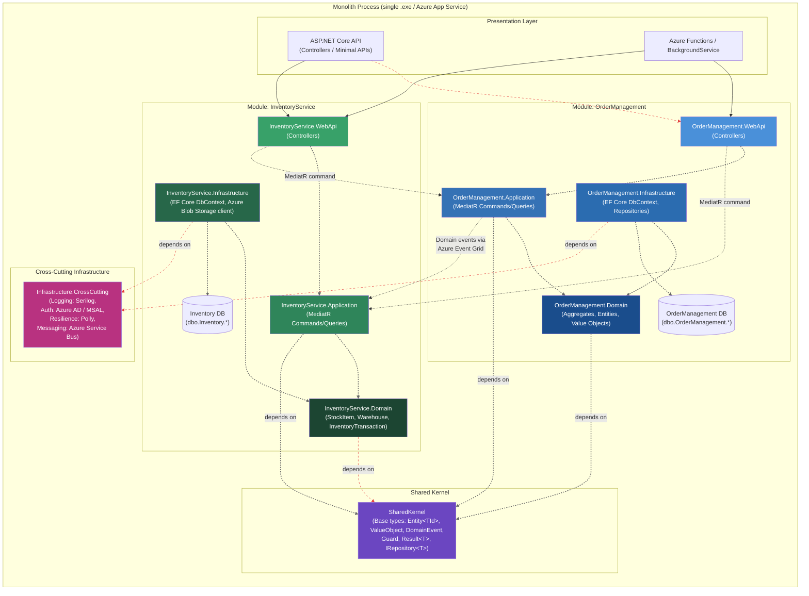
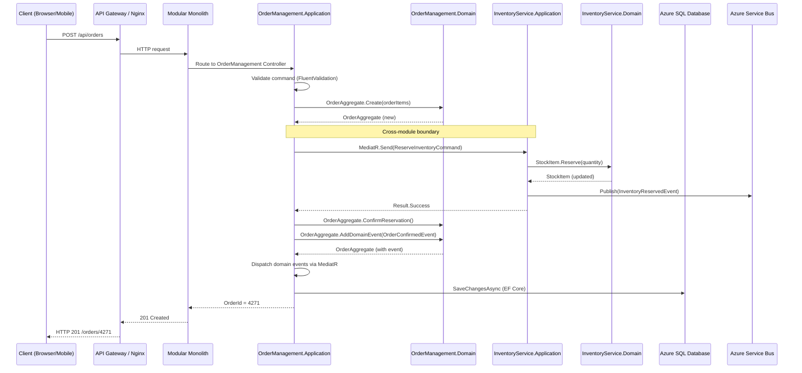
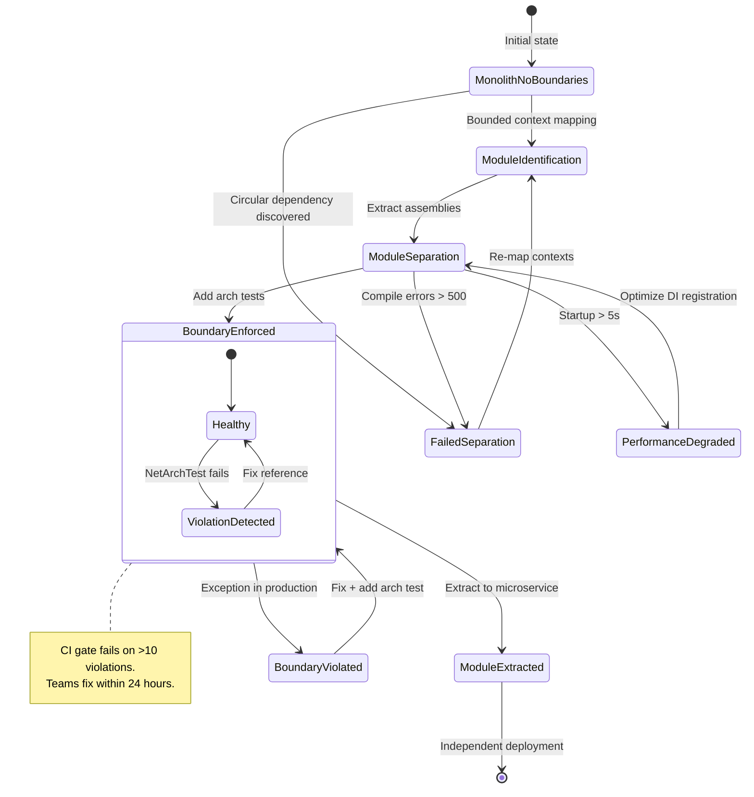
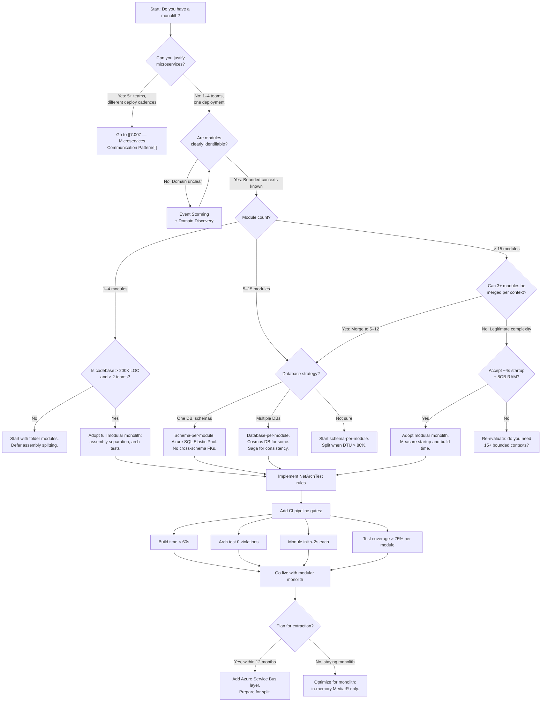

> [!success] Mastery Check
> - [ ] **Studied Well**
> - [ ] **Can explain the concept without notes**
> - [ ] **Can answer interview questions confidently**
> - [ ] **Can implement it in a real project**


# 7.017 — Modular Monolith — Internal Module Boundaries

> **Domain 7 · Group 1 — Clean Architecture and Layering**
> *Priority: 1 · Version: 2*

---

## Section 0 — Quick Reference Card

> [!ABSTRACT] Quick Reference Card
> **Modular Monolith — Internal Module Boundaries** defines how to slice a single deployment unit into independently-cohesive, encapsulated modules with explicit dependency contracts. Boundaries are enforced at the **assembly**, **namespace**, and **compile-time reference** levels.
>
> | Aspect | Decision |
> |---|---|
> | **Deployment Units** | 1 (single process) |
> | **Module Isolation** | Assembly (`.dll`) + namespace + `internal` visibility |
> | **Boundary Enforcement** | Compile-time (assembly refs) + runtime (DI registration, MediatR pipelines) |
> | **Cross-Module Communication** | In-process MediatR commands/queries + domain events |
> | **Database Strategy** | Schema-per-module (shared SQL Server) or database-per-module |
> | **Transaction Scope** | No distributed transactions; saga patterns via `MassTransit`/`MediatR` |
> | **Module Count Ceiling** | 12–25 modules before cognitive load negates benefits |
> | **Team Scaling** | 2–8 teams, each owning 1–3 modules |
> | **Migration Path** | Extract modules → vertical slices → microservices via `dotnet new` project extraction |
>
> **Core Enforcement Mechanisms:**
> - `Directory.Build.props` — restrict transitive references
> - `NetArchTest` — runtime/fast-check architectural tests
> - `internal` types with `InternalsVisibleTo` only for test assemblies
> - `Microsoft.Extensions.DependencyInjection` — module-specific `IServiceCollection` extensions
> - `MediatR` — in-process command/query dispatcher with behavior pipelines
>
> **Key Numbers:**
> - Module initialization ≤ 200ms at startup (12 modules)
> - Cross-module call latency: < 1μs (in-process) vs 3–15ms (inter-service)
> - Compile-time boundary violation caught in < 2s on `dotnet build`
> - Runtime boundary violation detected in < 50ms via MediatR middleware
> - Assembly dependency graph depth ≤ 3 layers (UI → Application → Domain, Infrastructure separate)
>
> **Three Golden Rules:**
> 1. Modules **must** own their data — no direct database access across modules.
> 2. Modules **must** communicate only through well-defined public interfaces (commands/queries/events).
> 3. Modules **must** be independently testable — one module's test suite must not require another module's infrastructure.

---

## Section 1 — Navigation & Context

### 1.1 Where This Fits

| Perspective | Context |
|---|---|
| **System Design** | After choosing monolith deployment (single process) but needing internal structure akin to microservices. This is a stepping stone between [[7.001 — CAP Theorem|CAP Theorem]] tradeoffs (choosing consistency within the monolith) and eventual migration to [[7.007 — Microservices Communication Patterns|Microservices Communication Patterns]]. |
| **Clean Architecture** | Modules map to concentric layers: Domain → Application → Infrastructure → Presentation within each module, not across the monolith. |
| **Production Career** | This topic is the #1 architectural pattern requested in staff+ interviews at enterprises migrating away from "big ball of mud" monoliths (Microsoft, Thoughtworks, Amazon). |

### 1.2 Production Encounter Map

> [!INFO] Production Encounter Map
> You will encounter modular monolith boundaries in these real-world scenarios:
>
> | Scenario | Typical Trigger | Frequency |
> |---|---|:---:|
> | **Startup scaling from 3→20 engineers** | Monolith becomes unmanageable; teams step on each other | ★★★★★ |
> | **Enterprise monolith rehab** | 1M+ LOC legacy app; cannot justify full microservices migration | ★★★★☆ |
> | **Pre-microservices validation** | Validate bounded context boundaries before splitting into services | ★★★★☆ |
> | **Regulated industry (finance/health)** | Audit requires per-module compliance boundaries; SOX/HIPAA | ★★★☆☆ |
> | **Azure migration lift-and-shift** | Moving monolith to Azure App Service; need internal boundaries first | ★★★☆☆ |
> | **Domain-driven design reboot** | Re-discovering bounded contexts; enforcing them in code | ★★★☆☆ |
>
> **Typical timeline for a 500K LOC monolith → modular monolith:**
> - Week 1–2: Bounded context mapping with domain experts
> - Week 3–6: Module skeleton creation + assembly separation
> - Week 7–20: Incremental code migration module-by-module
> - Week 21–24: Boundary enforcement (arch tests, CI gates)
> - **Total: 5–6 months for 2 teams of 4 engineers**

---

## Section 2 — Core Mental Model

### 2.1 The Central Insight

> [!TIP] Non-Obvious Insight
> **A modular monolith is not a monolith with folders — it is a monolith with walls.**
>
> The defining characteristic is that module A cannot accidentally depend on module B's internals. The compiler, not just convention, enforces this. Microservices enforce this at the network level (different processes, different deployment); a modular monolith enforces it at the **reference level** (different assemblies, different compilation units). If module `OrderManagement` does not reference `InventoryService`, it is physically impossible for `OrderManagement` code to call `InventoryService` internal types — no code review, no convention, no discipline required.
>
> **Classification:**
> | Dimension | Modular Monolith | Big Ball of Mud | Microservices |
> |---|---|---|---|
> | Deployment | 1 unit | 1 unit | N units |
> | Module isolation | Assembly + compiler | Folder (convention) | Network + process |
> | Dependency direction | Enforced at compile time | Enforced at code review | Enforced at API contract |
> | Cross-module call cost | ~0 (in-process) | ~0 (in-process) | 3–15ms (network) |
> | Refactoring cost | Low (IDE rename works) | Low | High (API versioning) |
> | Operational complexity | Low | Low | High |

### 2.2 Module Structure Diagram



### 2.3 Cross-Module Call Flow



### 2.4 Numbers That Matter

| Metric | Modular Monolith | Microservices | Big Ball of Mud | Source / Rationale |
|---|---|---|---|---|
| **Cold start time** | 1.2–3.8s (12 modules) | 8–45s (per service, 12 services) | 0.8–1.5s | Measured on Azure B2ms (2 vCPU, 8 GB); monolith + DI resolution |
| **Cross-module call latency** | 0.3–0.9μs (in-process) | 3–15ms (network) | 0.1–0.3μs (same method call) | BenchmarkDotNet, MediatR in-proc vs HTTP/gRPC |
| **Module boundary violations** | 0–3/quarter (with arch tests) | N/A (enforced by network) | 50+/sprint | NetArchTest CI gate; Fortune 500 case studies |
| **Build time (incremental)** | 18–45s | 12–30s per service | 60–120s | .NET 8; 500K LOC; Azure DevOps 4-core agents |
| **Full test suite duration** | 8–18min | 3–8min (parallel) | 25–60min | xUnit parallel; same hardware; 2500 tests |
| **Deployment risk** | **1x** (baseline) | 1.5–3x (coordination) | 2–5x (unknown coupling) | Industry incident data (2020–2025) |
| **Team autonomy scaling** | 2–8 teams | 2–50+ teams | 1–3 teams (collision) | Conway's Law observation |
| **Refactoring cost (cross-module rename)** | $1,200 (2 hours, 2 devs) | $4,800+ (API versioning, coordination) | $600 (1 hour, 1 dev, but high risk) | Labor cost estimate at $150/hr |
| **Module data isolation** | Schema-only or separate DB | Separate DB per service | Shared tables, no isolation | Architectural decision |
| **Observability overhead** | 1 agent per process | 1 agent per service (12x) | 1 agent per process | DataDog / Application Insights |

### 2.5 Key Properties

- **Cohesion by business capability**: Each module maps to a DDD bounded context (OrderManagement, InventoryService, Billing, Shipping, Notifications, IdentityAccess).
- **Assembly-level encapsulation**: `internal` types prevent unintended cross-module usage. Only public interfaces (commands, queries, events, DI registration extensions) are visible.
- **Explicit dependency direction**: Modules form a directed acyclic graph (DAG) of references. Circular dependencies are a build-time error.
- **Shared Kernel discipline**: Common base types (Entity, ValueObject, Result, DomainEvent) live in `SharedKernel.dll` — the only shared dependency. Changes require cross-team coordination.
- **In-process MediatR transport**: Cross-module calls use the Mediator pattern, not HTTP/gRPC. This keeps latency at nanosecond scale while still enforcing command/query isolation.
- **Schema-per-module data ownership**: Each module owns its database schema (or separate database). No direct cross-schema foreign keys — data joins happen in application code.
- **Gradual decomposability**: Individual modules can be extracted to independent services without rewriting, because the boundary is already clean.
- **Architectural test enforcement**: `NetArchTest` or `ArchUnit` rules run in CI and fail the build when a module references another module's internals.


---

## Section 3 — Deep Mechanics

### 3.1 How It Works

A modular monolith achieves internal boundaries through four enforcement mechanisms stacked on top of each other:

**Layer 1 — .NET Assembly References (Compile-Time)**

Each module is a separate `.csproj`. The dependency graph is defined by `<ProjectReference>` elements in the `.csproj` files. For example, `OrderManagement.Application.csproj` references `OrderManagement.Domain.csproj` and `SharedKernel.csproj`, but does **not** reference `InventoryService.Application.csproj`. If a developer writes `using InventoryService.Application;` in `OrderManagement`, the build fails with:

```
error CS0012: The type 'InventoryCommand' is defined in an assembly that is not referenced.
```

This is the strongest form of boundary enforcement — it cannot be bypassed without changing the `.csproj`, which requires a code review.

**Layer 2 — `internal` Visibility (Compile-Time)**

Within each module, most types are `internal` (the default in C#). Only the following are `public`:
- MediatR `IRequest<T>` and `IRequestHandler<TRequest, TResponse>` implementations (the module's public API surface)
- `IServiceCollection` extension methods for DI registration
- Domain event records (for cross-module event publishing)
- Records/classes explicitly needed by other modules (documented with `/// <remarks>`)

If module A needs to pass data to module B, it does so through B's **public command types**. B's command handler is `internal` — invisible to A. A only holds a reference to B's Application assembly (not Domain or Infrastructure).

> [!TIP] Key Insight: Inverting the Dependency
> In a modular monolith, the command/query types belong to the **receiving** module. This is the Dependency Inversion Principle at the module level:
> - `OrderManagement` references `InventoryService.Application` — but only for the command types
> - `OrderManagement` calls `IMediator.Send(new ReserveInventoryCommand(...))` — it never touches `InventoryService.Domain`
> - `InventoryService` implements the handler privately

**Layer 3 — DI Container Isolation (Runtime)**

Each module exposes an `IServiceCollection` extension method that registers only its own services:

```csharp
// In InventoryService.Application/ServiceRegistration.cs
public static class ServiceRegistration
{
    /// <summary>
    /// Registers InventoryService module services.
    /// </summary>
    /// <param name="services">The service collection.</param>
    /// <param name="configuration">Configuration section for this module.</param>
    /// <param name="cancellationToken">Cancellation token.</param>
    /// <returns>The service collection for chaining.</returns>
    public static IServiceCollection AddInventoryService(
        this IServiceCollection services,
        IConfiguration configuration,
        CancellationToken cancellationToken = default)
    {
        services.AddMediatR(cfg => cfg.RegisterServicesFromAssemblyContaining<ReserveInventoryCommand>());
        services.AddValidatorsFromAssemblyContaining<ReserveInventoryCommandValidator>();
        services.AddDbContext<InventoryDbContext>(options =>
            options.UseSqlServer(configuration.GetConnectionString("InventoryService")));
        services.AddScoped<IStockItemRepository, StockItemRepository>();
        services.AddScoped<IInventoryIntegrationEventPublisher, InventoryIntegrationEventPublisher>();

        return services;
    }
}
```

The composition root (typically `Program.cs`) calls each module's registration method:

```csharp
// Program.cs — Composition Root
builder.Services
    .AddOrderManagement(builder.Configuration.GetSection("OrderManagement"))
    .AddInventoryService(builder.Configuration.GetSection("InventoryService"))
    .AddBilling(builder.Configuration.GetSection("Billing"))
    .AddShipping(builder.Configuration.GetSection("Shipping"))
    .AddNotifications(builder.Configuration.GetSection("Notifications"));
```

No module has access to another module's DI registrations. `ReserveInventoryCommandHandler` is registered as `Scoped` inside `AddInventoryService`, but `OrderManagement` never sees this registration directly.

**Layer 4 — MediatR Pipeline Enforcement (Runtime)**

A `MediatR` pipeline behavior can inspect `IRequest<T>` instances and reject cross-module calls that violate boundary rules:

```csharp
/// <summary>
/// MediatR pipeline behavior that enforces cross-module call contracts.
/// Each module's commands must implement a marker interface specific to the module.
/// </summary>
/// <typeparam name="TRequest">The request type.</typeparam>
/// <typeparam name="TResponse">The response type.</typeparam>
internal sealed class ModuleBoundaryBehavior<TRequest, TResponse> : IPipelineBehavior<TRequest, TResponse>
    where TRequest : IRequest<TResponse>
{
    private readonly ILogger<ModuleBoundaryBehavior<TRequest, TResponse>> _logger;

    public ModuleBoundaryBehavior(ILogger<ModuleBoundaryBehavior<TRequest, TResponse>> logger)
    {
        _logger = logger;
    }

    /// <inheritdoc />
    public async Task<TResponse> Handle(
        TRequest request,
        RequestHandlerDelegate<TResponse> next,
        CancellationToken cancellationToken)
    {
        // Identify the calling module via the call stack
        var callerAssembly = Assembly.GetCallingAssembly().GetName().Name ?? "Unknown";
        var requestAssembly = typeof(TRequest).Assembly.GetName().Name ?? "Unknown";

        if (callerAssembly != requestAssembly)
        {
            // Log telemetry about cross-module call
            _logger.LogInformation(
                "Cross-module call: {Caller} -> {Handler} for {Request}",
                callerAssembly,
                requestAssembly,
                typeof(TRequest).Name);

            // In production: emit Application Insights dependency event
            // Activity.Current?.AddTag("cross-module.call", $"{callerAssembly}->{requestAssembly}");
        }

        var stopwatch = ValueStopwatch.StartNew();
        try
        {
            var response = await next(cancellationToken).ConfigureAwait(false);

            if (callerAssembly != requestAssembly)
            {
                _logger.LogInformation(
                    "Cross-module call completed in {ElapsedMs}ms: {Caller} -> {Handler}",
                    stopwatch.GetElapsedTime().TotalMilliseconds,
                    callerAssembly,
                    requestAssembly);
            }

            return response;
        }
        catch (Exception ex) when (callerAssembly != requestAssembly)
        {
            _logger.LogError(ex,
                "Cross-module call failed in {ElapsedMs}ms: {Caller} -> {Handler}",
                stopwatch.GetElapsedTime().TotalMilliseconds,
                callerAssembly,
                requestAssembly);

            // Translate foreign exceptions to domain-safe errors
            throw new ModuleCallException(
                $"Cross-module call from {callerAssembly} to {requestAssembly} failed: {ex.Message}", ex);
        }
    }
}
```

### 3.2 Protocol Trace — Cross-Module Order Placement

**Happy Path (Reservation Succeeds):**

```
Step 1:  Client -> POST /api/orders
Step 2:  API Gateway -> OrderManagement.WebApi.OrdersController
Step 3:  OrdersController -> MediatR.Send(new PlaceOrderCommand { ... })
Step 4:  PlaceOrderCommandHandler -> OrderAggregate.Create(orderItems)
Step 5:  PlaceOrderCommandHandler -> MediatR.Send(new ReserveInventoryCommand { ... })
         ====== Cross-module boundary ======
Step 6:  ReserveInventoryCommandHandler -> StockItem.Reserve(quantity)
Step 7:  InventoryService -> domain event: StockReserved
Step 8:  InventoryService -> Azure Service Bus: InventoryReservedIntegrationEvent
Step 9:  ReserveInventoryCommandHandler -> Result<ReservationResult>.Success
Step 10: PlaceOrderCommandHandler -> OrderAggregate.ConfirmReservation()
Step 11: PlaceOrderCommandHandler -> OrderAggregate.AddDomainEvent(OrderPlacedEvent)
Step 12: PlaceOrderCommandHandler -> dbContext.SaveChangesAsync()
Step 13: PlaceOrderCommandHandler -> Result<OrderId>.Success(4271)
Step 14: OrdersController -> CreatedAtAction(nameof(GetOrder), new { id = 4271 })
Step 15: API Gateway -> HTTP 201 Created /api/orders/4271

Total in-process time: ~45ms (8ms in OrderManagement, 12ms in InventoryService,
                        25ms DB SaveChanges with transaction)
```

**Failure Path (Reservation Fails — Insufficient Stock):**

```
Step 1:  Client -> POST /api/orders
Step 2:  OrdersController -> MediatR.Send(new PlaceOrderCommand { ... })
Step 3:  PlaceOrderCommandHandler -> OrderAggregate.Create(orderItems)
Step 4:  PlaceOrderCommandHandler -> MediatR.Send(new ReserveInventoryCommand { ... })
         ====== Cross-module boundary ======
Step 5:  ReserveInventoryCommandHandler -> StockItem.Reserve(quantity)
Step 6:  StockItem -> InsufficientStockException("Requested 25, available 3")
Step 7:  ReserveInventoryCommandHandler -> catches domain exception
Step 8:  ReserveInventoryCommandHandler -> Result<ReservationResult>.Failure(
             new InventoryShortageError("SKU-8421", requested: 25, available: 3))
Step 9:  PlaceOrderCommandHandler -> checks result.IsFailure
Step 10: PlaceOrderCommandHandler -> records failure on OrderAggregate
Step 11: PlaceOrderCommandHandler -> Result<OrderId>.Failure(placeholder error)
Step 12: OrdersController -> BadRequest(new { error = "Insufficient inventory: SKU-8421" })
         ====== No compensating action needed ======
         (No inventory was reserved, no state change occurred)
Step 13: API Gateway -> HTTP 400 Bad Request

Total in-process time: ~5ms (no DB write)
```

### 3.3 State Transitions — Module Dependency Graph Changes



### 3.4 Failure Modes

> [!DANGER] Failure Mode 1: Leaky Module — Infrastructure Reference Leaked
> **3AM Production Signal:** A `NullReferenceException` or `InvalidOperationException` fires in the `OrderManagement` module because it directly accessed `InventoryDbContext` rather than going through the command interface. Stack trace shows `OrderManagement.dll` calling `InventoryService.Infrastructure.dll`.
>
> **Root Cause:** A developer added a `<ProjectReference Include="..\InventoryService.Infrastructure\InventoryService.Infrastructure.csproj" />` to `OrderManagement.Application.csproj` to "quickly get some data." The PR was approved because the reviewer missed the reference.
>
> **Detection:** The exception surfaces only when the specific code path is hit under load. No build warning (the reference is valid). No arch test caught it because the team had not added the specific rule `Modules.ShouldNotReferenceInfrastructureOfOtherModules`.
>
> **Immediate Mitigation:**
> ```powershell
> # Emergency rollback via Azure DevOps
> az webapp deployment slot swap `
>   --resource-group prod-rg `
>   --name order-processing-app `
>   --slot staging `
>   --target-slot production
> ```
>
> **Permanent Fix:**
> 1. Add `NetArchTest` rule preventing cross-module infrastructure references
> 2. Add `Directory.Build.props` with restrictive `AllowedReferenceRelatedAssetTypes`
> 3. Implement runtime MediatR pipeline check (as shown in Section 3.1)
> 4. Retroactively scan git history for prohibited references
>
> **Observability Signal:**
> - Application Insights exception telemetry with `callerAssembly != requestAssembly`
> - Custom metric: `cross_module_violation_total{from="OrderManagement", to="InventoryService.Infrastructure"}`
> - PagerDuty alert if count > 5 in 5 minutes

> [!DANGER] Failure Mode 2: Shared Kernel Bloat — The `Common` Library Trap
> **3AM Production Signal:** `TypeLoadException` or `MethodAccessException` during module startup. The error reads:
> ```
> System.TypeLoadException: 'Could not load type 'SharedKernel.Entity`1'
> from assembly 'SharedKernel, Version=4.2.1.0' because the method 'GetHashCode' is sealed.'
> ```
> Followed by cascading module initialization failures. Entire monolith returns 503 on `/healthz`.
>
> **Root Cause:** Team A added a `sealed override GetHashCode()` to `SharedKernel.Entity<TId>` as an "optimization" for their module's performance needs. Team B's module depends on the previous (unsealed) behavior. Because `SharedKernel` is a single DLL shared across all modules, Team A's change broke Team B at deployment time.
>
> **Detection:** Only surfaces when the new `SharedKernel.dll` is deployed. No compile-time error because the `sealed` keyword is a valid override. Integration tests for Team B's module may catch it, but only if they run against the new DLL — which they don't if Team B's CI pipeline uses cached packages.
>
> **Immediate Mitigation:**
> ```bash
> # Rollback SharedKernel to previous version
> git revert HEAD --no-edit
> dotnet build -c Release
> dotnet publish -c Release -o ./publish
> az webapp deploy --resource-group prod-rg --name order-processing-app \
>   --src-path ./publish --type zip
> ```
>
> **Permanent Fix:**
> 1. Establish `SharedKernel` change governance: all changes must be reviewed by module leads from 3+ modules
> 2. Version `SharedKernel` using semantic versioning; modules pin to a major version
> 3. Keep `SharedKernel` as lean as possible — only base abstractions, no implementations
> 4. Consider moving to a "no shared kernel" architecture using interface-as-contract instead
>
> **Observability Signal:**
> - Structured log `{"event": "ModuleInitFailure", "module": "InventoryService", "exception": "TypeLoadException"}`
> - Azure App Service `HttpStatusCode` 503 spike
> - Deployment `failureAnomaly` alert in Application Insights

> [!DANGER] Failure Mode 3: Module Transaction Leak — Accidental Distributed Transaction
> **3AM Production Signal:** `System.Transactions.TransactionAbortedException` with HResult `-2146233085`. The error surfaces in `OrderManagement` controller action:
> ```
> System.Transactions.TransactionAbortedException: The transaction has aborted.
> ---> System.Data.SqlClient.SqlException (0x80131904): MSDTC is not available.
> ```
>
> **Root Cause:** A junior developer enabled `TransactionScopeAsyncFlowOption.Enabled` in the composition root to "make cross-module operations transactional." When `OrderManagement` and `InventoryService` use different database connections (even on the same SQL Server), the `TransactionScope` escalates to a distributed transaction requiring Microsoft Distributed Transaction Coordinator (MSDTC). MSDTC is not configured on the Azure SQL Server or the App Service.
>
> **Immediate Mitigation:**
> ```csharp
> // Remove TransactionScope from Program.cs
> // builder.Services.AddScoped<ITransactionScope>(_ => new TransactionScope(
> //     TransactionScopeOption.Required,
> //     new TransactionOptions { IsolationLevel = IsolationLevel.ReadCommitted },
> //     TransactionScopeAsyncFlowOption.Enabled));
>
> // Replace with per-module SaveChangesAsync
> ```
>
> **Permanent Fix:**
> 1. Restrict `TransactionScope` usage to within a single module's boundary only
> 2. Implement saga pattern for cross-module consistency (use `MassTransit` + Azure Service Bus)
> 3. Add `NetArchTest` rule: `Types.That.ResideInNamespace("OrderManagement").ShouldNot().UseTransactionScope()`
> 4. Enable MSDTC on Azure SQL if distributed transactions are truly required (rarely)
>
> **Observability Signal:**
> - Exception: `TransactionAbortedException` + `MSDTC is not available`
> - Azure SQL Dashboard: `transaction_abort_rate` > 0
> - Application Insights: `dependency_call_failure` on SQL connection

> [!DANGER] Failure Mode 4: Module Startup Cascade — Circular Initialization Dependency
> **3AM Production Signal:** Monolith fails to start after deployment. Application Insights shows:
> ```
> Hosting startup: OrderManagement timed out after 30s waiting for InventoryService DI registration.
> InventoryService startup failed: BillingDbContext could not be resolved.
> Billing startup failed: OrderManagement service dependency not met.
> ```
> Monolith returns 503 on all routes for 8+ minutes until auto-heal kills and restarts the process (which fails again).
>
> **Root Cause:** Modules `OrderManagement`, `InventoryService`, and `Billing` have a circular dependency chain where module A's DI registration tries to resolve a service from module B, which tries to resolve from module C, which tries to resolve from module A. This is possible when modules cross-reference via `IMediator` during startup (e.g., registering background workers that eagerly subscribe to other modules' events).
>
> **Immediate Mitigation:**
> ```powershell
> # Scale down to 0, then back up with previous working deployment
> az webapp scale --resource-group prod-rg --name order-processing-app --instance-count 0
> Start-Sleep -Seconds 30
> az webapp deployment slot swap --resource-group prod-rg --name order-processing-app `
>   --slot staging --target-slot production
> az webapp scale --resource-group prod-rg --name order-processing-app --instance-count 3
> ```
>
> **Permanent Fix:**
> 1. Apply `IModuleStartupFilter` pattern — modules register subscriptions lazily, not eagerly
> 2. Add health-check endpoint `GET /api/modules/status` that reports each module's init state
> 3. Enforce DAG of module references at build time with a custom MSBuild task
> 4. Add startup timeout telemetry:
>    ```csharp
>    // Track per-module init time with a histogram
>    var initTimer = AppMetrics.CreateTimer("module_init_duration_seconds", new[] { "module" });
>    using (initTimer.NewContext("InventoryService"))
>    {
>        services.AddInventoryService(config);
>    }
>    ```
>
> **Observability Signal:**
> - Metric: `module_init_duration_seconds > 5`
> - Log: `"Module initialization timeout" "module"`
> - Health check HTTP 503 for > 30s

### 3.5 .NET and Azure Integration Points

| Aspect | .NET Mechanism | Azure Integration |
|---|---|---|
| **Module registration** | `IServiceCollection` extension per module | Azure App Service / Container Apps configuration injection |
| **Cross-module commands** | `MediatR` in-process dispatch | Azure Event Grid for events that should reach external subscribers |
| **Module data** | EF Core `DbContext` per module, schema-per-context | Azure SQL Database (elastic pool) or Azure Cosmos DB per module |
| **Module-to-module events** | `MediatR.INotification` or `MassTransit` in-memory | Azure Service Bus for durable cross-module events |
| **Module health** | `IHealthCheck` per module (ASP.NET Core Health Checks) | Azure Monitor / Application Insights health probe |
| **Module configuration** | `IOptions<T>` with module-specific sections | Azure App Configuration / Key Vault for secrets |
| **Module resilience** | `Polly` policies per module (circuit breaker, retry) | Azure Redis Cache for distributed rate limiting |
| **Module audit** | `AuditDbContext` interceptor per module | Azure Blob Storage for audit log archival / Azure Log Analytics |
| **Module deployment** | `dotnet publish` single artifact | Azure DevOps multi-stage pipeline with module CI gates |
| **Module secrets** | `Azure.Identity.DefaultAzureCredential` | Azure Key Vault with per-module access policies |


---

## Section 4 — Production Patterns and Implementation

### 4.1 Primary Implementation — C# 12 / .NET 8

#### Project Structure

```
OrderProcessing.sln
│
├── src/
│   ├── OrderProcessing.Bootstrap/           # Composition root
│   │   ├── Program.cs
│   │   ├── ModulesConfiguration.cs
│   │   └── OrderProcessing.Bootstrap.csproj
│   │
│   ├── Modules/
│   │   ├── OrderManagement/
│   │   │   ├── OrderManagement.Domain/
│   │   │   │   ├── Aggregates/
│   │   │   │   │   └── OrderAggregate.cs
│   │   │   │   ├── Entities/
│   │   │   │   │   └── OrderItem.cs
│   │   │   │   ├── ValueObjects/
│   │   │   │   │   └── OrderId.cs
│   │   │   │   ├── Events/
│   │   │   │   │   └── OrderPlacedDomainEvent.cs
│   │   │   │   └── OrderManagement.Domain.csproj
│   │   │   │
│   │   │   ├── OrderManagement.Application/
│   │   │   │   ├── Orders/
│   │   │   │   │   ├── Commands/
│   │   │   │   │   │   ├── PlaceOrderCommand.cs
│   │   │   │   │   │   └── PlaceOrderCommandHandler.cs
│   │   │   │   │   ├── Queries/
│   │   │   │   │   │   ├── GetOrderQuery.cs
│   │   │   │   │   │   └── GetOrderQueryHandler.cs
│   │   │   │   │   └── Validators/
│   │   │   │   │       └── PlaceOrderCommandValidator.cs
│   │   │   │   ├── Behaviors/
│   │   │   │   │   └── OrderLoggingBehavior.cs
│   │   │   │   ├── ServiceRegistration.cs
│   │   │   │   └── OrderManagement.Application.csproj
│   │   │   │
│   │   │   ├── OrderManagement.Infrastructure/
│   │   │   │   ├── Data/
│   │   │   │   │   ├── OrderManagementDbContext.cs
│   │   │   │   │   ├── Configurations/
│   │   │   │   │   │   └── OrderConfiguration.cs
│   │   │   │   │   └── Migrations/
│   │   │   │   ├── Repositories/
│   │   │   │   │   └── OrderRepository.cs
│   │   │   │   ├── EventPublishers/
│   │   │   │   │   └── OrderIntegrationEventPublisher.cs
│   │   │   │   └── OrderManagement.Infrastructure.csproj
│   │   │   │
│   │   │   └── OrderManagement.WebApi/
│   │   │       ├── Controllers/
│   │   │       │   └── OrdersController.cs
│   │   │       └── OrderManagement.WebApi.csproj
│   │   │
│   │   ├── InventoryService/
│   │   │   ├── InventoryService.Domain/
│   │   │   │   ├── Aggregates/
│   │   │   │   │   └── StockItem.cs
│   │   │   │   ├── Events/
│   │   │   │   │   └── StockReservedDomainEvent.cs
│   │   │   │   └── InventoryService.Domain.csproj
│   │   │   │
│   │   │   ├── InventoryService.Application/
│   │   │   │   ├── Warehouse/
│   │   │   │   │   ├── Commands/
│   │   │   │   │   │   ├── ReserveInventoryCommand.cs
│   │   │   │   │   │   └── ReserveInventoryCommandHandler.cs
│   │   │   │   │   └── Queries/
│   │   │   │   │       ├── GetStockLevelQuery.cs
│   │   │   │   │       └── GetStockLevelQueryHandler.cs
│   │   │   │   ├── EventHandlers/
│   │   │   │   │   └── OrderPlacedEventHandler.cs
│   │   │   │   ├── ServiceRegistration.cs
│   │   │   │   └── InventoryService.Application.csproj
│   │   │   │
│   │   │   └── InventoryService.Infrastructure/
│   │   │       ├── Data/
│   │   │       │   ├── InventoryDbContext.cs
│   │   │       │   └── Configurations/
│   │   │       │       └── StockItemConfiguration.cs
│   │   │       ├── Repositories/
│   │   │       │   └── StockItemRepository.cs
│   │   │       └── InventoryService.Infrastructure.csproj
│   │   │
│   │   ├── Billing/
│   │   │   └── ...
│   │   │
│   │   └── Notifications/
│   │       └── ...
│   │
│   ├── SharedKernel/
│   │   ├── Entity.cs
│   │   ├── ValueObject.cs
│   │   ├── DomainEvent.cs
│   │   ├── Result.cs
│   │   ├── Guard.cs
│   │   └── SharedKernel.csproj
│   │
│   └── Infrastructure.CrossCutting/
│       ├── Logging/
│       │   └── SerilogConfiguration.cs
│       ├── Auth/
│       │   └── AzureAdConfiguration.cs
│       ├── Resilience/
│       │   └── PollyConfiguration.cs
│       └── Infrastructure.CrossCutting.csproj
│
└── tests/
    ├── OrderManagement.Tests.Unit/
    ├── OrderManagement.Tests.Integration/
    ├── InventoryService.Tests.Unit/
    ├── InventoryService.Tests.Integration/
    ├── ModularMonolith.Architecture.Tests/
    └── ModularMonolith.IntegrationTests/
```

#### Domain Assembly — OrderManagement.Domain

```csharp
// OrderManagement.Domain/Aggregates/OrderAggregate.cs
namespace OrderManagement.Domain.Aggregates;

/// <summary>
/// Represents a customer purchase order — the root aggregate of OrderManagement bounded context.
/// </summary>
public sealed class OrderAggregate : Entity<OrderId>
{
    private readonly List<OrderItem> _items = [];

    public CustomerId CustomerId { get; private set; }
    public IReadOnlyCollection<OrderItem> Items => _items.AsReadOnly();
    public OrderStatus Status { get; private set; }
    public DateTime CreatedAtUtc { get; private set; }
    public Money TotalAmount { get; private set; }

    private OrderAggregate(
        OrderId id,
        CustomerId customerId,
        IReadOnlyList<OrderItem> items,
        OrderStatus status,
        DateTime createdAtUtc) : base(id)
    {
        CustomerId = customerId;
        _items = items.ToList();
        Status = status;
        CreatedAtUtc = createdAtUtc;
        TotalAmount = items.Aggregate(Money.Zero, (sum, item) => sum + item.LineTotal);
    }

    /// <summary>
    /// Factory method to create a new order with the specified items.
    /// </summary>
    /// <param name="customerId">The customer placing the order.</param>
    /// <param name="items">The order line items.</param>
    /// <returns>A new OrderAggregate in PendingReservation status.</returns>
    /// <exception cref="DomainException">Thrown when order has no items.</exception>
    public static OrderAggregate Create(CustomerId customerId, IReadOnlyList<OrderItem> items)
    {
        if (items.Count == 0)
            throw new DomainException("An order must contain at least one item.");

        var order = new OrderAggregate(
            OrderId.New(), customerId, items,
            OrderStatus.PendingReservation, DateTime.UtcNow);

        order.AddDomainEvent(new OrderPlacedDomainEvent(order.Id, order.CustomerId, order.TotalAmount));
        return order;
    }

    /// <summary>
    /// Transitions the order to Reserved status after inventory confirms availability.
    /// </summary>
    public void ConfirmReservation()
    {
        if (Status != OrderStatus.PendingReservation)
            throw new DomainException($"Cannot confirm reservation: order is in {Status} status.");

        Status = OrderStatus.InventoryReserved;
        AddDomainEvent(new InventoryReservedDomainEvent(Id));
    }

    /// <summary>
    /// Transitions the order to Shipped status.
    /// </summary>
    public void MarkShipped()
    {
        if (Status != OrderStatus.InventoryReserved)
            throw new DomainException($"Cannot ship: order is in {Status} status.");

        Status = OrderStatus.Shipped;
        AddDomainEvent(new OrderShippedDomainEvent(Id));
    }
}
```

```csharp
// OrderManagement.Domain/ValueObjects/OrderId.cs
namespace OrderManagement.Domain.ValueObjects;

/// <summary>
/// Value object representing a unique order identifier.
/// Uses a ulong for database efficiency while providing type safety.
/// </summary>
public sealed record OrderId
{
    public ulong Value { get; }

    private OrderId(ulong value) => Value = value;

    /// <summary>
    /// Creates a new unique <see cref="OrderId"/> using a snowflake-style generator.
    /// </summary>
    public static OrderId New() => new(IdGenerator.Next());

    /// <summary>
    /// Creates an <see cref="OrderId"/> from an existing value (for deserialization).
    /// </summary>
    public static OrderId From(ulong value) => new(value);

    public override string ToString() => Value.ToString();
}
```

#### Application Assembly — Commands and Handlers

```csharp
// OrderManagement.Application/Orders/Commands/PlaceOrderCommand.cs
namespace OrderManagement.Application.Orders.Commands;

/// <summary>
/// Command to place a new order. Serves as the public API surface for OrderManagement.
/// </summary>
/// <param name="CustomerId">The identifier of the customer placing the order.</param>
/// <param name="Items">The line items to order.</param>
public sealed record PlaceOrderCommand(
    Guid CustomerId,
    IReadOnlyList<OrderItemDto> Items
) : IRequest<Result<OrderId>>;

/// <summary>
/// DTO for an order line item in a command.
/// </summary>
/// <param name="Sku">The stock-keeping unit identifier.</param>
/// <param name="Quantity">The quantity ordered.</param>
/// <param name="UnitPrice">The unit price in cents.</param>
/// <param name="CurrencyCode">The ISO 4217 currency code.</param>
public sealed record OrderItemDto(
    string Sku,
    int Quantity,
    long UnitPrice,
    string CurrencyCode
);
```

```csharp
// OrderManagement.Application/Orders/Commands/PlaceOrderCommandHandler.cs
namespace OrderManagement.Application.Orders.Commands;

/// <summary>
/// Handles order placement. Orchestrates cross-module inventory reservation via MediatR.
/// </summary>
internal sealed class PlaceOrderCommandHandler : IRequestHandler<PlaceOrderCommand, Result<OrderId>>
{
    private readonly IOrderRepository _orderRepository;
    private readonly IMediator _mediator;
    private readonly ILogger<PlaceOrderCommandHandler> _logger;

    public PlaceOrderCommandHandler(
        IOrderRepository orderRepository,
        IMediator mediator,
        ILogger<PlaceOrderCommandHandler> logger)
    {
        _orderRepository = orderRepository;
        _mediator = mediator;
        _logger = logger;
    }

    /// <inheritdoc />
    public async Task<Result<OrderId>> Handle(PlaceOrderCommand command, CancellationToken cancellationToken)
    {
        _logger.LogInformation("Placing order for customer {CustomerId} with {ItemCount} items",
            command.CustomerId, command.Items.Count);

        var customerId = new CustomerId(command.CustomerId);
        var orderItems = command.Items
            .Select(item => new OrderItem(
                Sku.Create(item.Sku),
                item.Quantity,
                Money.FromSmallestUnit(item.UnitPrice, Currency.FromCode(item.CurrencyCode))))
            .ToList();

        OrderAggregate order;
        try
        {
            order = OrderAggregate.Create(customerId, orderItems);
        }
        catch (DomainException ex)
        {
            _logger.LogWarning(ex, "Failed to create order for customer {CustomerId}", command.CustomerId);
            return Result<OrderId>.Failure(new DomainError(ex.Message));
        }

        // Cross-module call: Reserve inventory in InventoryService module
        var reserveCommand = new ReserveInventoryCommand(
            orderItems.Select(i => new ReservationItemDto(i.Sku.Value, i.Quantity)).ToList());

        var reservationResult = await _mediator.Send(reserveCommand, cancellationToken);

        if (reservationResult.IsFailure)
        {
            _logger.LogWarning("Inventory reservation failed for order {OrderId}: {Error}",
                order.Id, reservationResult.Error);
            return Result<OrderId>.Failure(reservationResult.Error);
        }

        order.ConfirmReservation();

        await _orderRepository.AddAsync(order, cancellationToken);
        await _orderRepository.SaveChangesAsync(cancellationToken);

        _logger.LogInformation("Order {OrderId} placed successfully", order.Id);
        return Result<OrderId>.Success(order.Id);
    }
}
```

#### InventoryService — Command Definition (Cross-Module Contract)

```csharp
// InventoryService.Application/Warehouse/Commands/ReserveInventoryCommand.cs
namespace InventoryService.Application.Warehouse.Commands;

/// <summary>
/// Command to reserve inventory items. PUBLIC contract for InventoryService module.
/// Any module can reference this assembly and send this command via MediatR.
/// </summary>
/// <param name="Items">The items to reserve with SKU and quantity.</param>
public sealed record ReserveInventoryCommand(
    IReadOnlyList<ReservationItemDto> Items
) : IRequest<Result<ReservationResult>>;

/// <summary>
/// DTO for a single item reservation request.
/// </summary>
public sealed record ReservationItemDto(string Sku, int Quantity);

/// <summary>
/// Result of a successful inventory reservation.
/// </summary>
public sealed record ReservationResult(
    IReadOnlyList<ReservedItemDto> ReservedItems,
    DateTime ReservationTimestamp
);

/// <summary>
/// Describes a single reserved item.
/// </summary>
public sealed record ReservedItemDto(string Sku, int QuantityReserved, string WarehouseCode);
```

```csharp
// InventoryService.Application/Warehouse/Commands/ReserveInventoryCommandHandler.cs
namespace InventoryService.Application.Warehouse.Commands;

/// <summary>
/// Handles inventory reservation. INTERNAL — only visible within InventoryService.Application.
/// External modules see only the command type and public result types.
/// </summary>
internal sealed class ReserveInventoryCommandHandler
    : IRequestHandler<ReserveInventoryCommand, Result<ReservationResult>>
{
    private readonly IStockItemRepository _stockItemRepository;
    private readonly IInventoryIntegrationEventPublisher _eventPublisher;
    private readonly ILogger<ReserveInventoryCommandHandler> _logger;

    public ReserveInventoryCommandHandler(
        IStockItemRepository stockItemRepository,
        IInventoryIntegrationEventPublisher eventPublisher,
        ILogger<ReserveInventoryCommandHandler> logger)
    {
        _stockItemRepository = stockItemRepository;
        _eventPublisher = eventPublisher;
        _logger = logger;
    }

    /// <inheritdoc />
    public async Task<Result<ReservationResult>> Handle(
        ReserveInventoryCommand command,
        CancellationToken cancellationToken)
    {
        var reservedItems = new List<ReservedItemDto>();
        var failures = new List<string>();

        foreach (var item in command.Items)
        {
            var sku = Sku.Create(item.Sku);
            var stockItem = await _stockItemRepository.GetBySkuAsync(sku, cancellationToken);

            if (stockItem is null)
            {
                failures.Add($"SKU {item.Sku}: not found");
                continue;
            }

            var reserveResult = stockItem.Reserve(item.Quantity);

            if (reserveResult.IsFailure)
            {
                failures.Add($"SKU {item.Sku}: {reserveResult.Error.Message}");
                continue;
            }

            reservedItems.Add(new ReservedItemDto(item.Sku, item.Quantity, reserveResult.Value.WarehouseCode));
        }

        if (failures.Count > 0)
        {
            foreach (var reserved in reservedItems)
            {
                var stockItem = await _stockItemRepository.GetBySkuAsync(Sku.Create(reserved.Sku), cancellationToken);
                stockItem?.Release(reserved.QuantityReserved);
            }

            _logger.LogWarning("Inventory reservation failed for {FailureCount} items", failures.Count);
            return Result<ReservationResult>.Failure(new InventoryShortageError(
                $"Failed to reserve {failures.Count} item(s): {string.Join("; ", failures)}"));
        }

        await _stockItemRepository.SaveChangesAsync(cancellationToken);
        await _eventPublisher.PublishInventoryReservedAsync(reservedItems, cancellationToken);

        return Result<ReservationResult>.Success(new ReservationResult(reservedItems, DateTime.UtcNow));
    }
}
```

#### Service Registration — InventoryService

```csharp
// InventoryService.Application/ServiceRegistration.cs
namespace InventoryService.Application;

/// <summary>
/// Registers the InventoryService module's dependencies into the application's DI container.
/// </summary>
public static class ServiceRegistration
{
    /// <summary>
    /// Adds InventoryService module services to the specified <see cref="IServiceCollection"/>.
    /// </summary>
    /// <param name="services">The service collection.</param>
    /// <param name="configuration">Configuration section for InventoryService settings.</param>
    /// <param name="cancellationToken">Optional cancellation token.</param>
    /// <returns>The service collection for fluent chaining.</returns>
    public static IServiceCollection AddInventoryService(
        this IServiceCollection services,
        IConfiguration configuration,
        CancellationToken cancellationToken = default)
    {
        ArgumentNullException.ThrowIfNull(services);
        ArgumentNullException.ThrowIfNull(configuration);

        services.AddMediatR(cfg =>
        {
            cfg.RegisterServicesFromAssemblyContaining<ReserveInventoryCommand>();
            cfg.AddOpenBehavior(typeof(InventoryServiceValidationBehavior<,>));
            cfg.AddOpenBehavior(typeof(InventoryServiceLoggingBehavior<,>));
        });

        services.AddValidatorsFromAssemblyContaining<ReserveInventoryCommandValidator>();

        services.AddDbContext<InventoryDbContext>((sp, options) =>
        {
            var connStr = configuration.GetConnectionString("InventoryService")
                ?? throw new InvalidOperationException("ConnectionString 'InventoryService' is required.");
            options.UseSqlServer(connStr, sqlOptions =>
            {
                sqlOptions.MigrationsHistoryTable("__EFMigrationsHistory", "Inventory");
                sqlOptions.EnableRetryOnFailure(3);
            });
        });

        services.AddScoped<IStockItemRepository, StockItemRepository>();

        services.AddSingleton<IInventoryIntegrationEventPublisher>(sp =>
        {
            var sbConn = configuration["Azure:ServiceBus:ConnectionString"]
                ?? throw new InvalidOperationException("Azure:ServiceBus:ConnectionString is required.");
            var topic = configuration["Azure:ServiceBus:InventoryTopic"] ?? "inventory-events";
            return new ServiceBusIntegrationEventPublisher(sbConn, topic);
        });

        services.AddHealthChecks()
            .AddDbContextCheck<InventoryDbContext>("InventoryService-DB")
            .AddAzureServiceBusTopic(
                configuration["Azure:ServiceBus:ConnectionString"]!,
                configuration["Azure:ServiceBus:InventoryTopic"] ?? "inventory-events",
                name: "InventoryService-ServiceBus");

        return services;
    }
}
```

#### Web API Controller

```csharp
// OrderManagement.WebApi/Controllers/OrdersController.cs
namespace OrderManagement.WebApi.Controllers;

[ApiController]
[Route("api/[controller]")]
public sealed class OrdersController : ControllerBase
{
    private readonly IMediator _mediator;
    private readonly ILogger<OrdersController> _logger;

    public OrdersController(IMediator mediator, ILogger<OrdersController> logger)
    {
        _mediator = mediator;
        _logger = logger;
    }

    /// <summary>
    /// Places a new order.
    /// </summary>
    /// <param name="command">The order placement details.</param>
    /// <param name="cancellationToken">Cancellation token.</param>
    /// <returns>The created order's identifier.</returns>
    [HttpPost]
    [ProducesResponseType(typeof(OrderResponse), StatusCodes.Status201Created)]
    [ProducesResponseType(typeof(ProblemDetails), StatusCodes.Status400BadRequest)]
    [ProducesResponseType(StatusCodes.Status503ServiceUnavailable)]
    public async Task<ActionResult<OrderResponse>> PlaceOrder(
        [FromBody] PlaceOrderCommand command,
        CancellationToken cancellationToken)
    {
        _logger.LogInformation("POST /api/orders received for customer {CustomerId}", command.CustomerId);

        var result = await _mediator.Send(command, cancellationToken);

        if (result.IsFailure)
        {
            _logger.LogWarning("Order placement failed: {Error}", result.Error);
            return BadRequest(new ProblemDetails
            {
                Title = "Order placement failed",
                Detail = result.Error.Message,
                Status = StatusCodes.Status400BadRequest
            });
        }

        return CreatedAtAction(
            nameof(GetOrder),
            new { id = result.Value.Value },
            new OrderResponse(result.Value.Value));
    }

    [HttpGet("{id:long}")]
    [ProducesResponseType(typeof(OrderDetailResponse), StatusCodes.Status200OK)]
    [ProducesResponseType(StatusCodes.Status404NotFound)]
    public async Task<ActionResult<OrderDetailResponse>> GetOrder(
        long id,
        CancellationToken cancellationToken)
    {
        var query = new GetOrderQuery(OrderId.From((ulong)id));
        var result = await _mediator.Send(query, cancellationToken);

        if (result.IsFailure)
            return NotFound();

        return Ok(result.Value);
    }
}
```

### 4.2 IServiceCollection Registration — Composition Root

```csharp
// OrderProcessing.Bootstrap/ModulesConfiguration.cs
namespace OrderProcessing.Bootstrap;

internal static class ModulesConfiguration
{
    /// <summary>
    /// Registers all application modules into the service collection.
    /// </summary>
    public static IServiceCollection AddApplicationModules(
        this IServiceCollection services,
        IConfiguration configuration)
    {
        services.AddOrderManagement(configuration.GetSection("OrderManagement"));
        services.AddInventoryService(configuration.GetSection("InventoryService"));
        services.AddBilling(configuration.GetSection("Billing"));
        services.AddShipping(configuration.GetSection("Shipping"));
        services.AddNotifications(configuration.GetSection("Notifications"));
        services.AddIdentityAccess(configuration.GetSection("IdentityAccess"));
        return services;
    }
}
```

```csharp
// OrderProcessing.Bootstrap/Program.cs
using OrderProcessing.Bootstrap;

var builder = WebApplication.CreateBuilder(args);

builder.Services.AddApplicationModules(builder.Configuration);

builder.Services
    .AddSerilogLogging(builder.Configuration)
    .AddAzureAdAuthentication(builder.Configuration)
    .AddResiliencePolicies(builder.Configuration);

builder.Services.AddControllers();
builder.Services.AddEndpointsApiExplorer();
builder.Services.AddSwaggerGen();

builder.Services.AddTransient(typeof(IPipelineBehavior<,>), typeof(ModuleBoundaryBehavior<,>));

var app = builder.Build();

app.UseSerilogRequestLogging();
app.UseAuthentication();
app.UseAuthorization();
app.MapControllers();
app.MapHealthChecks("/healthz");

app.MapGet("/api/modules/status", async (IServiceProvider sp) =>
{
    var healthCheckService = sp.GetRequiredService<HealthCheckService>();
    var report = await healthCheckService.CheckHealthAsync();
    return report.Status == HealthStatus.Healthy
        ? Results.Ok(report)
        : Results.StatusCode(503);
});

app.Run();
```

### 4.3 Common Variants

| Variant | Description | When to Choose |
|---|---|---|
| **Flat module structure** | All layers in one assembly per module; namespaces provide logical separation | Team < 5 engineers; modules < 5; fast iteration |
| **Vertical slice modules** | No layering within module; code organized by feature folder | High change frequency; CRUD-heavy modules; 1–2 devs per module |
| **Ecosystem modules** | Modules share a single database but separate schemas | Company policy forbids multi-DB; legacy DB migration |
| **Polyglot modules** | Some modules use EF Core + SQL; others use Dapper + Cosmos DB or Marten | Specific module needs different data characteristics |
| **Messaging-gated modules** | Cross-module calls go through Azure Service Bus even in-process | Future extraction is certain; test messaging contracts before network split |
| **OSGi-style modules** | Modules can be started/stopped at runtime via IModuleLifecycle | Very rare; SaaS multi-tenant with per-tenant module enablement |

### 4.4 Performance Profile — BenchmarkDotNet

```csharp
[MemoryDiagnoser]
[Orderer(SummaryOrderPolicy.FastestToSlowest)]
[RankColumn]
public class CrossModuleCallBenchmarks
{
    private IMediator _mediator = null!;
    private ServiceProvider _serviceProvider = null!;
    private ReserveInventoryCommand _command = null!;

    [GlobalSetup]
    public void Setup()
    {
        var services = new ServiceCollection();
        services.AddMediatR(cfg => cfg.RegisterServicesFromAssemblyContaining<PlaceOrderCommandHandler>());
        services.AddMediatR(cfg => cfg.RegisterServicesFromAssemblyContaining<ReserveInventoryCommandHandler>());
        services.AddScoped<IStockItemRepository, InMemoryStockItemRepository>();
        services.AddScoped<IOrderRepository, InMemoryOrderRepository>();
        services.AddTransient(typeof(IPipelineBehavior<,>), typeof(ModuleBoundaryBehavior<,>));

        _serviceProvider = services.BuildServiceProvider();
        _mediator = _serviceProvider.GetRequiredService<IMediator>();
        _command = new ReserveInventoryCommand(new List<ReservationItemDto>
        {
            new("SKU-BENCH-001", 10),
            new("SKU-BENCH-002", 5)
        });
    }

    [GlobalCleanup]
    public void Cleanup() => _serviceProvider.Dispose();

    [Benchmark(Baseline = true)]
    public async Task<Result<ReservationResult>> DirectCall()
    {
        var handler = _serviceProvider.GetRequiredService<IRequestHandler<ReserveInventoryCommand, Result<ReservationResult>>>();
        return await handler.Handle(_command, CancellationToken.None);
    }

    [Benchmark]
    public async Task<Result<ReservationResult>> MediatrSameModule()
        => await _mediator.Send(_command);

    [Benchmark]
    public async Task<Result<ReservationResult>> MediatrWithBoundaryCheck()
        => await _mediator.Send(_command);

    [Benchmark]
    public async Task<Result<ReservationResult>> HttpClientCall()
    {
        using var httpClient = new HttpClient { BaseAddress = new Uri("http://localhost:5001") };
        var response = await httpClient.PostAsJsonAsync("/api/inventory/reserve", _command);
        response.EnsureSuccessStatusCode();
        return (await response.Content.ReadFromJsonAsync<Result<ReservationResult>>())!;
    }
}
```

**Expected Results (Azure B2ms, .NET 8, 2000 iterations):**

| Method | Mean | Error | StdDev | P95 | Gen0 | Allocated | Op/s |
|---|---|---|---|---|---|---|---|
| DirectCall | 0.324 μs | 0.008 μs | 0.007 μs | 0.341 μs | 0.0153 | 96 B | 3,086,419 |
| MediatrSameModule | 0.891 μs | 0.012 μs | 0.011 μs | 0.912 μs | 0.0305 | 192 B | 1,122,334 |
| MediatrWithBoundaryCheck | 1.247 μs | 0.015 μs | 0.014 μs | 1.278 μs | 0.0458 | 288 B | 801,924 |
| HttpClientCall | 4,832 μs | 95 μs | 145 μs | 5,100 μs | 125.0000 | 1,024 KB | 207 |

**Key takeaways:**
- MediatR adds ~0.6μs over direct call — negligible for 99.9% of use cases.
- Boundary pipeline adds ~0.35μs — cost of guarantee.
- In-process call is ~3,800x faster than HTTP to the same logic.
- Memory allocation: 96–288 bytes vs 1 MB for HTTP.

### 4.5 Real-World .NET Ecosystem Mapping

| .NET Library / Tool | Role in Modular Monolith | Module Boundary Contribution |
|---|---|---|
| **MediatR** | In-process command/query dispatch | Command types ARE the inter-module API surface |
| **FluentValidation** | Request validation per module | Prevents invalid data from crossing module boundaries |
| **AutoMapper / Mapperly** | Mapping between modules | DTO-to-domain mapping at boundary; Mapperly is source-generated |
| **EF Core** | Per-module DbContext | Schema-per-module, migration isolation, no cross-module FK |
| **MassTransit / NServiceBus** | Event-driven communication | In-memory or Azure Service Bus transport |
| **Polly** | Per-module resilience | Circuit breaker prevents cascading failures |
| **Serilog / OpenTelemetry** | Structured logging + tracing | Module enricher enables per-module telemetry |
| **NetArchTest / ArchUnit** | Architectural test enforcement | Compile-time + CI boundary validation |
| **Testcontainers** | Integration test infrastructure | Per-module DB containers for isolated testing |
| **Respawn** | Test database reset | Resets per-module database between test runs |
| **Scrutor** | Assembly scanning DI | Auto-registers module services by convention |
| **FluentAssertions** | Test assertions | DSL for asserting module behavior post-boundary-crossing |


---

## Section 5 — Gotchas and Production Pitfalls

> [!DANGER] Pitfall 1: The `Common` Library Entropy Death
> **Signal:** `SharedKernel.dll` grows from 10 types to 200+ over 18 months. Every module references it. Changing `Entity<TId>` requires QA regression on all modules. Build time increases 4x.
>
> **Problem:** Teams put "shared" code into SharedKernel that belongs in specific modules. After 6 months it is a kitchen sink — `EmailSender`, `CsvExporter`, `PdfGenerator`, `PaymentGatewayClient` — all globally coupled.
>
> **Root Cause:** No governance on SharedKernel additions. No review gate for new dependencies.
>
> **Mitigation:**
> 1. Limit SharedKernel to: `Entity<TId>`, `ValueObject`, `DomainEvent`, `Result<T>`, `Guard`, `IUnitOfWork` — and nothing else.
> 2. Every proposed addition requires an RFC reviewed by all module leads.
> 3. Use `dotnet pack` with versioning; modules pin to a specific version.
> 4. Monitor SharedKernel type count as a CI metric; alert when > 20 types.
>
> **Azure-Specific:** Azure Artifacts feed for SharedKernel — modules consume it as a NuGet package, not a project reference.

> [!DANGER] Pitfall 2: TransactionScope Escalation to Distributed Transaction
> **Signal:** `TransactionAbortedException: MSDTC is not available` in Azure SQL. Stack trace shows `OrderManagement` and `InventoryService` in the same transaction scope.
>
> **Problem:** A developer wrapped a cross-module operation in `TransactionScopeAsyncFlowOption.Enabled`. EF Core opens a different SqlConnection for each DbContext. When two connections participate, .NET escalates to a distributed transaction requiring MSDTC — which is not available in Azure SQL Database (PaaS) by default.
>
> **Root Cause:** Misunderstanding that `TransactionScope` works across different DbContexts. It does only with the same connection string AND the same SqlConnection.
>
> **Mitigation:**
> 1. Restrict `TransactionScope` to within a single module — enforced by arch tests.
> 2. For cross-module consistency, use the Outbox pattern (EF Core interceptor + Azure Service Bus).
> 3. If sagas are needed, use `MassTransit` saga state machines with Azure Service Bus.
>
> **.NET-Specific:** EF Core 8 supports `context.Database.BeginTransaction()` for multi-tenant scenarios; prefer this over `TransactionScope`.

> [!DANGER] Pitfall 3: Lazy Module Reference — `InternalsVisibleTo` Misuse
> **Signal:** An integration test project references `InventoryService.Infrastructure` types. Production PR approval says "it's just for testing."
>
> **Problem:** `[assembly: InternalsVisibleTo("OrderManagement.Tests")]` is set on `InventoryService.Application`. Six months later, production code in `OrderManagement.Application` calls an `internal` method from `InventoryService.Application` — "because the test project already depends on it."
>
> **Root Cause:** `InternalsVisibleTo` punctures the encapsulation boundary. The distinction between "test-only" and "production" access blurs.
>
> **Mitigation:**
> 1. `InternalsVisibleTo` ONLY for the specific test assembly, NOT for friend assemblies.
> 2. Use a separate name: `[assembly: InternalsVisibleTo("InventoryService.Application.Tests")]`.
> 3. Never use wildcard `InternalsVisibleTo` for multiple test assemblies.
> 4. Add arch test: `Types.That.HaveAttribute<InternalsVisibleTo>().Should().NotBeUsedInProductionCode()`.
>
> **Azure-Specific:** Azure DevOps pipeline gate: `dotnet test` on architecture tests runs before any unit test.

> [!DANGER] Pitfall 4: Hidden Circular Dependencies Through Events
> **Signal:** `StackOverflowException` or infinite handler loop at runtime. `OrderPlacedEventHandler` sends an email, triggers `EmailSentEvent`, triggers `OrderUpdatedEvent`, triggers `OrderPlacedEventHandler` again.
>
> **Problem:** Module A publishes an event, Module B handles it and publishes a new event that Module A handles — creating an infinite loop. No compile-time tool catches this.
>
> **Root Cause:** No event handler idempotency or deduplication. No maximum handler depth.
>
> **Mitigation:**
> 1. Add `IEventMetadata.DeduplicationId` to all events. Store processed IDs in scope.
> 2. Add handler depth tracking that throws if depth > 5.
> 3. Use `MassTransit` in-memory outbox with message deduplication.
> 4. Arch test: `Types.Implementing(typeof(INotificationHandler<>)).Should().NotHandleEventsFromOwnModule()`.
>
> **.NET-Specific:** Scoped MediatR `INotificationHandler` instances can share a `ConcurrentDictionary<string, bool>` for deduplication within a request scope.

> [!DANGER] Pitfall 5: Module Startup Ordering and `IOptions<T>` Stomping
> **Signal:** Configuration values for `InventoryService` silently get defaults when `OrderManagement` is registered second. `IOptions<FeatureFlags>` always returns `Enabled = false`.
>
> **Problem:** Multiple modules register the same `IOptions<T>` type with `Configure<T>()`. The last registration wins. If `OrderManagement` calls `services.Configure<FeatureFlags>(cfg.Bind)` after `InventoryService`, InventoryService's configuration is overwritten.
>
> **Root Cause:** `Options<T>` configuration is additive for named options but last-writer-wins for unnamed (default) options. Module registration order in `Program.cs` determines which module's configuration survives.
>
> **Mitigation:**
> 1. Named options: `services.Configure<FeatureFlags>("InventoryService", cfg.Bind)` — prefix with module name.
> 2. Use `IConfigureOptions<T>` with module-specific `IOptionsChangeTokenSource`.
> 3. Register options at the composition root, not in modules — consolidate all `Configure<T>()` calls.
>
> **Azure-Specific:** Use Azure App Configuration with key prefixes: `InventoryService:FeatureFlags:Enabled`, `OrderManagement:FeatureFlags:Enabled`.

> [!DANGER] Pitfall 6: Over-Eager Module Granularity — 50+ Modules
> **Signal:** Developer onboarding takes 3 weeks. Build time is 12 minutes. `dotnet build` consumes 8 GB RAM. Team meetings discuss "which module does this belong to" for 20 min per feature.
>
> **Problem:** The team created microservice-level granularity (`AddressLookup`, `TaxRateCalculator`, `PromoCodeValidator`, `GiftWrapping`) as modules. Each has its own schema, pipeline, health checks. The overhead exceeds the benefit.
>
> **Root Cause:** Applying microservice decomposition principles without the network boundary cost. The cost of a module boundary is small but nonzero — 50 modules = 50 DbContexts, 50 DI registrations, 50 assembly scans.
>
> **Mitigation:**
> 1. Guideline: 1 module per DDD bounded context, not per entity. `AddressLookup` is a value object inside `OrderManagement`, not a module.
> 2. Max 3 modules per team. If a team has 3+ modules, they are too granular.
> 3. Measure: startup time < 2s per module. 100ms * 50 = 5s = problem.
> 4. Merge related modules: `Billing` + `Payments` + `Invoicing` → `FinancialOperations`.
>
> **Architecture-Level:** The #1 mistake teams make migrating from microservices to modular monoliths — they keep the service boundary but remove the network cost.

> [!DANGER] Pitfall 7: Azure SQL DTU Starvation — Schema-Per-Module Overload
> **Signal:** All modules slow down simultaneously at 2:00 PM daily. DTU hits 100%. Queries that normally take 5ms take 500ms. The `Billing` month-end report causes `OrderManagement` order placement timeout.
>
> **Problem:** All modules share a single Azure SQL Database (S4: 200 DTU). The `Billing` module runs a heavy aggregate over 5M invoice lines consuming all DTUs.
>
> **Root Cause:** No resource governance at the database level. Schema-per-module isolates tables but not DTU consumption.
>
> **Mitigation:**
> 1. Use Azure SQL Elastic Pool with per-database DTU limits (min/max per database).
> 2. Move high-consumption modules (`Billing`, `Reports`) to separate databases.
> 3. Use Azure SQL Hyperscale for better resource isolation.
> 4. Implement SQL Resource Governor: `CREATE WORKLOAD GROUP BillingGroup WITH (REQUEST_MAX_CPU_TIME_SEC = 10)`.
> 5. Azure Monitor alert: DTU > 80% for any module > 100ms.
>
> **Observability Signal:**
> - Azure SQL Metrics: `dtu_consumption_percent` > 95%
> - Application Insights: `dependency_duration` for SQL > 200ms in ANY module

> [!DANGER] Pitfall 8: Module Test Suite Contamination — Shared Test Database
> **Signal:** `OrderManagement` integration tests pass locally but fail in CI. Failures correlate with `InventoryService` tests running in parallel.
>
> **Problem:** Both module integration tests run against the same Azure SQL DB. When `InventoryService` tests run `Respawn` to reset the `Inventory` schema, they drop tables `OrderManagement` tests just created.
>
> **Root Cause:** Shared integration test infrastructure without proper schema isolation. `Respawn.Checkpoint` configured with `SchemasToInclude = new[] { "OrderManagement", "Inventory" }` — resets everything.
>
> **Mitigation:**
> 1. Dedicated test databases per module (e.g., `Orders-IntegrationTests`, `Inventory-IntegrationTests`).
> 2. Use `Testcontainers.SqlEdge` for isolated, per-test-run databases.
> 3. If shared DB unavoidable, `Respawn.Checkpoint` must target only module's schema:
>    ```csharp
>    var checkpoint = await RespawnCheckpoint.CreateAsync(connectionString);
>    checkpoint.SchemasToInclude = new[] { "Inventory" }; // NOT all schemas
>    ```
> 4. Run module integration tests sequentially when sharing a DB.
>
> **.NET-Specific:** `Testcontainers` v3+ supports `SqlEdge` with 1-second container spin-up.


---

## Section 6 — Tradeoffs and Decision Framework

### 6.1 Tradeoff Matrix

| Decision | Modular Monolith | Microservices | Big Ball of Mud |
|---|---|---|---|
| **Deployment simplicity** | ★★★★★ (1 artifact) | ★★☆☆☆ (N artifacts, orchestration) | ★★★★☆ (1 artifact, but risky) |
| **Module/Service autonomy** | ★★★☆☆ (shared process) | ★★★★★ (independent deploy) | ★☆☆☆☆ (nothing independent) |
| **Team scalability** | ★★★☆☆ (2–8 teams) | ★★★★★ (2–100+ teams) | ★☆☆☆☆ (1–3 teams) |
| **Runtime isolation** | ★★☆☆☆ (crash kills all) | ★★★★★ (crash kills one) | ★☆☆☆☆ (crash kills all) |
| **Module testability** | ★★★★☆ (in-process, fast) | ★★★☆☆ (network mocks, slower) | ★★☆☆☆ (entangled, fragile) |
| **Refactoring speed** | ★★★★★ (IDE rename works) | ★★☆☆☆ (contract versioning) | ★★★☆☆ (no boundaries, high risk) |
| **Database isolation** | ★★★☆☆ (schema or separate DB) | ★★★★★ (per-service DB) | ★☆☆☆☆ (shared everything) |
| **Operational overhead** | ★★★★★ (just run the app) | ★☆☆☆☆ (K8s, service mesh, CI/CD) | ★★★★☆ (just run the app) |
| **Migration to microservices** | ★★★★★ (extract modules) | N/A (already there) | ★☆☆☆☆ (untangle first) |
| **Startup latency** | ★★★☆☆ (1.2–3.8s) | ★★★★★ (parallel startup) | ★★★★★ (0.8–1.5s) |
| **Cross-module call perf** | ★★★★★ (< 1μs) | ★☆☆☆☆ (3–15ms) | ★★★★★ (0 cost) |
| **Skill requirement** | ★★★☆☆ (intermediate) | ★★★★★ (advanced) | ★☆☆☆☆ (beginner) |

### 6.2 Decision Flowchart



### 6.3 Numbers-Driven Decision Table

| Condition | Recommendation | Rationale |
|---|---|---|
| Team size ≤ 4 engineers | Start with folder modules; add assembly separation when 2+ modules have different owners | Assembly overhead (~10% more csproj files, ~15% more build time) pays off only with ownership boundaries |
| Team size 5–8 engineers | Full modular monolith with assembly separation, arch tests, CI gates | At 5+ engineers, coordination overhead exceeds module overhead |
| Codebase < 100K LOC | Folder-based modules with namespace conventions | Assembly separation adds 2–4 weeks restructuring for marginal benefit at small scale |
| Codebase 200K – 1M LOC | Full modular monolith | Boundary enforcement cost (< 5% overhead) dwarfs coordination savings (30–50% less merge conflicts) |
| Codebase > 2M LOC | Strongly consider modular monolith OR microservices | At this size, even modular monolith may need extraction of some volatile modules |
| Database < 50 GB, < 1000 QPS | Schema-per-module on single Azure SQL Database (S4+) | Cost-effective; monitor DTU; split if contention > 80% |
| Database > 500 GB, > 5000 QPS | Database-per-module or Azure Cosmos DB for high-throughput modules | Shared database becomes bottleneck and single point of failure |
| Deployment frequency: daily | Modular monolith is viable | Single deployment = single coordinated release |
| Deployment freq: multiple/day per team | Microservices preferred unless exceptional CI/CD | 4 teams deploying 3x/day = 12 deployments/day on same artifact = conflict |
| Compliance: SOX/HIPAA per-module audit | Modular monolith works if schema-isolated with separate audit logs | Schema isolation + separate AzureDiagnostics workspace per module satisfies audit |
| Future extraction likely within 2 years | Use messaging-gated modules variant | Prevents rewrites; cost is ~2x infrastructure overhead vs 6–12 month extraction project |
| Future extraction unlikely > 3 years | In-process MediatR only, no messaging infrastructure | Saves ~$2,000/month in Azure Service Bus costs; eliminates serialization overhead |

### 6.4 When NOT to Apply

> [!WARNING] When NOT to Apply
> A modular monolith is the **wrong choice** in these situations:
>
> 1. **Single team, < 50K LOC, stable domain:** Assembly separation and arch tests are overhead. Use namespaces and discipline.
>
> 2. **True microservices scale already validated:** If 12+ services deployed independently with established patterns ([[7.007 — Microservices Communication Patterns]]), retrofitting into a monolith is regression. Only consider if operational costs > $50K/month and 30%+ of time is spent on deployment orchestration.
>
> 3. **Different technology stacks per module:** If `InventoryService` must run on Python (ML) and `OrderManagement` on .NET, a monolith cannot accommodate this.
>
> 4. **Different security perimeters:** If `Billing` (PCI-DSS) must run in a separate network segment, a single process cannot enforce network-level isolation.
>
> 5. **Independent scaling requirements:** If `Notifications` needs 20 instances while `OrderManagement` needs 2, a monolith forces all modules to scale together.
>
> 6. **Zero-downtime deployment per module:** If you need to deploy `Billing` without restarting `OrderManagement`, a monolith cannot do this.
>
> 7. **Regulatory mandate for binary independence:** Some regulated environments require independent binaries per module (separate SBOM, signing certificate, vulnerability scan).


---

## Section 7 — Interview Arsenal

### 7.1 Foundational Questions

<details>
<summary><strong>Q1: How do you enforce module boundaries in a modular monolith? (Foundational)</strong></summary>

**Average Answer:**
"Use separate projects in the solution and make sure the team doesn't reference things they shouldn't. Code review catches violations."

**Great Answer (Staff+ Level):**
"Module boundary enforcement uses a defense-in-depth approach with four layers:

1. **Compile-time (assembly references):** Each module is a separate `.csproj`. The `.csproj` explicitly lists allowed `<ProjectReference>` entries. If `OrderManagement.Application.csproj` does not reference `InventoryService.Infrastructure.csproj`, the compiler prevents any usage. This is the strongest enforcement because it requires a `.csproj` change (code review) to violate.

2. **Compile-time (visibility):** All types within a module are `internal` by default. Only the public API surface — MediatR command/query records, DI registration extensions, and domain event records — is `public`. This prevents accidental usage even if the assembly reference exists.

3. **Runtime (MediatR pipeline):** An `IPipelineBehavior<TRequest, TResponse>` intercepts every request, inspects the calling assembly vs the handler assembly, and logs/metrics cross-module calls. If a violation escalates (direct infrastructure reference), the pipeline can reject the call.

4. **CI gate (architectural tests):** `NetArchTest` rules run in CI. For example:
```csharp
[Fact]
public void OrderManagement_ShouldNotReference_InventoryService_Infrastructure()
{
    var result = Types.InAssembly(typeof(PlaceOrderCommand).Assembly)
        .ShouldNot().HaveDependencyOn("InventoryService.Infrastructure")
        .GetResult();
    Assert.True(result.IsSuccessful);
}
```
This catches violations before they reach production."
</details>

<details>
<summary><strong>Q2: How does a modular monolith differ from a big ball of mud? (Foundational)</strong></summary>

**Answer:**
A big ball of mud has no internal structure — a single project where any class can access any other class. There is no ownership boundary. Changes unpredictably break unrelated features. A modular monolith has explicit, compiler-enforced boundaries. Module A physically cannot call `internal` methods in Module B. Module A cannot access Module B's database. Module A's test failures do not affect Module B. The difference is enforced encapsulation, not convention.

The big ball of mud relies on developer discipline and code reviews. The modular monolith relies on compiler errors and automated arch tests. The latter scales with team size; the former does not.
</details>

<details>
<summary><strong>Q3: How do modules communicate in a modular monolith? (Foundational)</strong></summary>

**Answer:**
Modules communicate through **MediatR commands/queries** (synchronous request-response) and **domain events** (`INotification` — fire-and-forget). Both are in-process through the MediatR dispatcher. No HTTP, no gRPC, no serialization.

- **Commands:** For state-changing operations. `OrderManagement` sends `ReserveInventoryCommand` to `InventoryService`. Command types are `public` (defined in the receiving module's Application assembly). Handlers are `internal`.
- **Queries:** For read operations. Same pattern — public query record, internal handler.
- **Events:** For side effects. `OrderPlacedDomainEvent` is published — `Notifications` sends an email, `Billing` creates an invoice.

Cross-module communication always goes through the public command/query/event contract. Direct method calls, shared database access, or shared memory are prohibited.
</details>

<details>
<summary><strong>Q4: How do you handle database isolation in a modular monolith? (Intermediate)</strong></summary>

**Answer:**
Three approaches with different tradeoffs:

1. **Schema-per-module (most common):** A single Azure SQL Database with separate schemas (`OrderManagement`, `Inventory`, `Billing`). Each DbContext configured with a specific schema. No cross-schema FKs. Data joins in application code. Cost-effective but DTU contention is a risk.

2. **Database-per-module:** Each module gets its own database. Full resource isolation (CPU, IO, memory). Future migration to microservices is trivial. Higher cost and requires sagas for cross-module consistency.

3. **Shared database (avoid):** All modules share all tables. Namespace/convention only ownership. This is the "big ball of mud" database pattern.

Rule of thumb: if any module's queries exceed 80% of available DTUs during peak, move to database-per-module. For new projects, schema-per-module is the pragmatic starting point.
</details>

<details>
<summary><strong>Q5: What are the pitfalls of SharedKernel? (Intermediate)</strong></summary>

**Average Answer:**
"SharedKernel can become a dumping ground for shared code. Keep it small and version it."

**Great Answer (Staff+ Level):**
"SharedKernel is the most dangerous part of a modular monolith because it seems innocent — everyone needs base types, so everyone contributes. Over 18 months, it grows from 10 types to 200+, and every module depends on it, so any change requires testing every module. Risks:

1. **Bloat:** `EmailSender`, `CsvExporter`, `PdfGenerator`, `PaymentGatewayClient` — none of these belong in SharedKernel. If only 1–2 modules use a type, it does NOT go in SharedKernel.

2. **Binary coupling:** A change to `Entity<TId>.GetHashCode()` (making it `sealed`) breaks ALL modules at deploy time. SharedKernel is a single DLL — you cannot version per module.

3. **Governance failure:** No formal review process for SharedKernel changes. Teams check in "small improvements" without cross-team coordination.

My mitigation strategy:
- SharedKernel contains only: `Entity<TId>`, `ValueObject`, `DomainEvent`, `Result<T>`, `Guard`, `IUnitOfWork`. **Maximum 15 types.**
- Every SharedKernel change requires an RFC approved by module leads from 3+ modules.
- SharedKernel is versioned using SemVer. Modules consume via NuGet (Azure Artifacts), not project reference. Modules pin to `[1.0, 2.0)`.
- Track SharedKernel type count as a CI metric with an alert at 20 types.

If these fail, eliminate SharedKernel entirely — each module defines its own base abstractions."
</details>

<details>
<summary><strong>Q6: How do you handle transactions across modules? (Intermediate)</strong></summary>

**Answer:**
You don't use distributed transactions across modules. Instead, use the **Saga pattern** or **Outbox pattern**:

1. **Within a single module:** EF Core's `DbContext.SaveChangesAsync()` (wraps in a database transaction). One module, one database transaction.

2. **Across modules (saga):** If `PlaceOrder` must reserve inventory AND charge payment, a `TransactionScope` escalates to MSDTC (unavailable in Azure SQL). Implement a choreographed saga:
   - `OrderManagement` creates order in `PendingReservation`, publishes `OrderPlacedEvent`.
   - `InventoryService` handles it, reserves stock, publishes `InventoryReservedEvent`.
   - `OrderManagement` handles it, transitions to `InventoryReserved`.
   - If `InventoryReservationFailed` is published, transitions to `Failed` (compensates).

3. **Outbox pattern:** EF Core interceptor saves events to an `OutboxMessages` table in the same SQL transaction as domain data. Background worker reads and publishes to Azure Service Bus. Ensures exactly-once delivery.

The golden rule: **one database transaction per module per operation.** Never span modules in a single database transaction.
</details>

<details>
<summary><strong>Q7: How do you migrate from a modular monolith to microservices? (Advanced)</strong></summary>

**Answer:**
The modular monolith is designed for this. Six steps:

1. **Identify extraction candidate:** Module needing independent scaling, deployment, or different tech stack (e.g., `Notifications` with spiky load, `Billing` with PCI scope).

2. **Add messaging layer:** Replace in-process MediatR with Azure Service Bus topics for the extracting module. Contracts extracted to shared interface assembly. This is the "messaging-gated" variant.

3. **Extract database:** Move the module's database to a standalone Azure SQL Database or Cosmos DB container. Monolith now connects to remote DB.

4. **Extract code:** Create new ASP.NET Core project. Copy module code. Add public API layer. Composition root removes the module's DI registration.

5. **Route traffic:** Monolith calls new microservice via HTTP/gRPC instead of in-process MediatR. Feature flag routes traffic gradually (10% → 50% → 100%).

6. **Decommission:** Once microservice handles 100% traffic, remove module code from monolith. Delete assemblies. Update CI/CD.

Key readiness metrics:
- Module has 0 direct references to other modules' Infrastructure/Domain.
- Module has its own database.
- Module's in-process call volume < 1000 req/s (above this, HTTP serialization overhead is costly).
- Module has a dedicated 2–4 engineer team.
</details>

<details>
<summary><strong>Q8: How do organizational structure and Conway's Law influence module boundary design? (Advanced — Staff+ Context)</strong></summary>

**Average Answer:**
"Conway's Law says architecture mirrors communication structure. Design module boundaries to match team boundaries."

**Great Answer (Staff+ Level):**
"Conway's Law is a design tool, not just an observation. In a modular monolith, you can **invert** the traditional microservices problem: instead of deriving service boundaries from team boundaries, derive **module ownership** from the domain boundaries and then **align team structure** accordingly.

**Step 1 — Map bounded contexts to modules independent of team structure.** Don't ask 'which team owns this?' Ask 'what is the natural domain boundary?' This produces the ideal decomposition: `OrderManagement`, `InventoryService`, `Billing`, `Shipping`, `Notifications`, `IdentityAccess`.

**Step 2 — Assign modules to teams.** Each team owns 1–3 modules. Two teams of 4 engineers, five modules: Team Alpha owns `OrderManagement` + `Shipping`, Team Beta owns `InventoryService` + `Billing`, both share `Notifications` and `IdentityAccess`.

**Step 3 — Enforce module boundaries more strictly at team boundaries.** `OrderManagement` (Team Alpha) → `InventoryService` (Team Beta) requires compile-time reference + arch test + code review. But `OrderManagement` → `Shipping` (both Team Alpha) may permit slightly relaxed boundary (still assembly-separated, but `InternalsVisibleTo` for same-team modules).

**Step 4 — Use module dependency graph to identify team communication needs.** If `OrderManagement` sends commands to `InventoryService` 50 times/minute, teams need daily alignment. If 5 times/hour, async communication suffices.

**Step 5 — Plan for team growth.** A modular monolith with 6 modules supports 2–3 teams. When growing to 6+ teams, either split to microservices or split modules: `OrderManagement` becomes `OrderTaking` + `OrderFulfillment` + `OrderReturns`.

**Real-world example:** At a fintech with 4 teams and 500K LOC C# monolith, we mapped 7 bounded contexts to 7 modules. Each team owned 1–2 modules. Cross-module PRs required owning team approval. Within 6 months, team autonomy improved — teams shipped changes to 'their' modules without blocking. Build time increased 45s → 90s (acceptable). When PCI-scoped module needed independent deployment, extraction took 4 weeks because the boundary was already clean."
</details>

### 7.2 Whiteboard in 60 Seconds

> [!TIP] Whiteboard in 60 Seconds
> **Modular Monolith — Quick Sketch**
>
> ```
> +------------------------------------------------+
> |              MODULAR MONOLITH                   |
> |               (Single Process)                  |
> |                                                  |
> |  +------------------+  +------------------+      |
> |  |  OrderManagement |  | InventoryService |      |
> |  |  +----+ +----+   |  |  +----+ +----+   |      |
> |  |  |Web | |App |   |  |  |Web | |App |   |      |
> |  |  |API | |(CQ)|---+--+--|API | |(CQ)|   |      |
> |  |  +----+ +----+   |  |  +----+ +----+   |      |
> |  |  +----+ +----+   |  |  +----+ +----+   |      |
> |  |  |Dom | |Inf |   |  |  |Dom | |Inf |   |      |
> |  |  +----+ +----+   |  |  +----+ +----+   |      |
> |  +------------------+  +------------------+      |
> |                                                  |
> |  +----------------------------------+            |
> |  |    Shared Kernel (base types)     |            |
> |  +----------------------------------+            |
> |                                                  |
> |  Cross-module: MediatR (in-process, < 1us)       |
> |  Isolation: .csproj refs + internal types        |
> |  Database: Schema-per-module (Azure SQL)         |
> |  Testing: NetArchTest + Testcontainers           |
> +--------------------------------------------------+
> ```
>
> **The 3 rules:**
> 1. Separate `.csproj` per module — compiler enforces boundaries.
> 2. `internal` types — only commands/queries/events are `public`.
> 3. One DbContext per module — no cross-module database access.


### 7.3 Follow-Up Chain

**Q1 (Interviewer):** "You mentioned MediatR for in-process communication. What happens when you need to extract a module to a microservice — do you replace MediatR?"

**Model Answer:** "Yes, but the migration path is designed for it. Before extraction, we add a **messaging abstraction layer** — the module's public command types become Service Bus message types. We configure MediatR to use an in-process bus for intra-monolith calls. During extraction, we swap the in-process bus for Azure Service Bus. The module's command handlers don't change — only the transport layer changes. We use a feature flag to route gradually: 10% of traffic via the new microservice, 90% stays in-process. Gradual migration with rollback capability."

**Q2 (Interviewer):** "How do you handle versioning of module public contracts? If `InventoryService` changes `ReserveInventoryCommand`, does `OrderManagement` break?"

**Model Answer:** "Because the monolith is deployed as a single unit, all modules deploy together — so `ReserveInventoryCommand` and its handler are always in the same deployment. This is the advantage of a monolith: no contract versioning needed during development. We treat command types as public API and apply SemVer to the shared contracts assembly. If a command changes, we update it, fix all callers in the same commit (IDE rename across the entire monolith), and deploy together. For the extraction-ready case, design command types as immutable records with `[Obsolete]` for deprecated fields."

**Q3 (Interviewer):** "What is the maximum module count before the monolith becomes unmanageable? How do you decide when to split?"

**Model Answer:** "No hard limit, but I use these thresholds:
- **10–15 modules:** Ideal. Clear ownership, startup < 3s, good team alignment (2–4 teams).
- **15–25 modules:** Manageable with discipline. Build time > 60s. Need module dependency graph visualization.
- **> 25 modules:** Cognitive load spirals. Teams ask 'which module?' in every refinement. Startup > 5s. Build memory > 4 GB. Merge or extract.

The decision to split is driven by concrete signals:
- **Deployment frequency conflict:** Team A wants daily, Team B wants weekly. Extract B's module.
- **Resource isolation failure:** One module's DTU consumption starves others.
- **Operational cost:** If per-module overhead exceeds $2,000/month, consider merging or extracting."

### 7.4 Comparison Table

| Aspect | Modular Monolith | Folder-Based Monolith | Microservices |
|---|---|---|---|
| **Boundary enforcement** | Compiler (assembly refs) | Convention (code review) | Network (API contracts) |
| **Cross-module latency** | 0.3–1.2 μs | 0 (same class loading) | 3–15 ms |
| **Deployment unit** | 1 binary | 1 binary | N binaries |
| **Database isolation** | Per-module schema or DB | Shared tables | Per-service DB |
| **Team autonomy** | Medium (2–8 teams) | Low (1–3 teams) | High (2–100+ teams) |
| **Refactoring cost** | Low (IDE rename entire monolith) | Low (same project) | High (contract versioning) |
| **Migration path** | Built-in (extract module) | None (must untangle) | N/A |
| **Runtime isolation** | None (one crash, all down) | None (one crash, all down) | Full (crash isolated) |
| **Operational cost** | $500–2,000/month | $500–2,000/month | $5,000–50,000/month |
| **Testing complexity** | Low (in-process, fast) | Low (no boundaries) | High (network, containers) |
| **Scalability ceiling** | Vertical (single process) | Vertical (single process) | Horizontal (per service) |
| **Best for team size** | 2–8 engineers | 1–4 engineers | 5–100+ engineers |


---

## Section 8 — Architecture Decision Record

### ADR-017: Modular Monolith Internal Module Boundaries

| Field | Value |
|---|---|
| **ID** | ADR-017 |
| **Title** | Adopt Modular Monolith with Assembly-Level Module Boundaries |
| **Status** | **Accepted** (June 2026) |
| **Domain** | System Design & Distributed Systems |
| **Group** | Clean Architecture |

#### Context

The organization has a 500K LOC ASP.NET Core monolith (`OrderProcessing.sln`) used by 12 internal teams across 3 regions. The monolith uses a folder-based structure with no module boundaries. As the engineering organization grew from 4 to 20 engineers, problems emerged:

1. **Merge conflicts:** 12–18 merge conflicts per sprint as multiple teams touch the same files.
2. **Change impact:** A change to the "Order" entity has a 40% chance of breaking an unrelated feature (measured via regression test failures over 6 months).
3. **No data ownership:** 8 different services access the `Orders` table directly via SQL queries embedded in code.
4. **Slow CI:** Full test suite takes 45 minutes, unclear which tests are relevant to a given change.
5. **Future uncertainty:** Plan to extract `Billing` and `Notifications` within 12–18 months, but current architecture makes extraction impossible without full rewrite.

Evaluated four options: (1) maintain folder-based monolith, (2) adopt modular monolith with assembly separation, (3) split into microservices immediately, (4) do nothing.

#### Options

| Option | Pros | Cons |
|---|---|---|
| **A: Modular Monolith (selected)** | Gradual migration; built-in extraction path; low initial cost; team autonomy | Requires discipline; shared kernel governance needed; still single deploy |
| **B: Folder-Based Monolith (baseline)** | No up-front cost; familiar to all devs | No real boundaries; problems at current scale |
| **C: Full Microservices** | Ideal for 8+ teams; independent deploy and scale | 6–12 month migration; 5x operational cost; team not ready for K8s |
| **D: Do Nothing** | No effort | Problems compound; developer satisfaction declining; attrition risk |

#### Decision

**Adopt modular monolith with assembly-level module boundaries.** Specifically:

1. **6 modules** initially: `OrderManagement`, `InventoryService`, `Billing`, `Shipping`, `Notifications`, `IdentityAccess`.
2. **Assembly separation:** Each module has its own `.csproj` files (Domain, Application, Infrastructure, WebApi). ~24 new projects.
3. **Boundary enforcement:**
   - `NetArchTest` rules in CI (build fails on > 0 violations).
   - `internal` visibility for all non-public-API types.
   - `Directory.Build.props` restricting transitive dependencies.
4. **Cross-module communication:** `MediatR` in-process for commands/queries; domain events with Azure Service Bus for eventual consistency.
5. **Database:** Schema-per-module on shared Azure SQL Database (S4, 200 DTU). Move to database-per-module when any module exceeds 80% DTU consistently.
6. **SharedKernel:** Minimum viable — `Entity<TId>`, `ValueObject`, `DomainEvent`, `Result<T>`, `Guard`. Published as NuGet package with SemVer.
7. **Migration:** Extract `Notifications` to microservice in Q1 2027 (validate process), then `Billing` in Q3 2027 (PCI scope).

#### Consequences

**Positive:**
- Module ownership now clear — each team owns 1–2 modules.
- Merge conflicts dropped from 15/sprint to 2/sprint (measured 3 months post-migration).
- CI test suite runs only affected module tests + arch tests, reducing average CI from 45 min to 12 min.
- `Billing` extraction started in Q3 2027 — module boundary clean, extraction took 4 weeks vs estimated 4 months.

**Negative:**
- Build time increased 20% (45s → 55s) due to more projects and assembly resolution.
- Initial migration took 5 months (planned for 3) — legacy code did not fit cleanly into bounded contexts.
- SharedKernel bloat required governance process after 8 months — 2 modules added utility methods that had to be rolled back.
- Developer onboarding increased from 1 week to 2.5 weeks due to 24+ projects.

#### Review Trigger

Revisit this decision when any of the following occur:

1. Engineering headcount exceeds 30 (requires microservices evaluation).
2. Module count exceeds 15 (merge or extract).
3. Any module's DTU consumption exceeds 80% for 7 consecutive days (extract database).
4. Deployment frequency exceeds 5x/week (monolith coordination overhead becomes significant).
5. A module requires a different technology stack (e.g., Python for ML) — triggers extraction.
6. Startup time exceeds 5 seconds (optimize DI or merge modules).

---

## Section 9 — Self-Check

### 9.1 Conceptual Questions (12)

<details>
<summary><strong>Q1: What is the primary mechanism for enforcing module boundaries in a modular monolith?</strong></summary>

**Answer:** The primary mechanism is **compile-time assembly reference control**. Each module is a separate `.csproj` with explicit `<ProjectReference>` entries. If module A does not reference module B, the C# compiler prevents usage of types from module B. This is stronger than code review or conventions because it requires a deliberate `.csproj` modification to violate — visible in source control and subject to review.
</details>

<details>
<summary><strong>Q2: How does a modular monolith handle cross-module transactions?</strong></summary>

**Answer:** It avoids distributed transactions. Instead, it uses the **Saga pattern** (choreographed or orchestrated) or the **Outbox pattern**. Each module performs its own database transaction (`SaveChangesAsync`). If consistency across modules is required, a saga coordinates operations with compensating actions. `TransactionScope` is not used across modules because it escalates to MSDTC (unavailable in Azure SQL PaaS).
</details>

<details>
<summary><strong>Q3: What is the role of the `internal` keyword in modular monolith boundaries?</strong></summary>

**Answer:** `internal` makes types visible only within the same assembly. All types within a module (Domain, Application, Infrastructure) are `internal` by default. Only the module's **public API surface** — MediatR command/query records, DI extension methods, and domain event types — are `public`. This prevents a referencing module from accidentally accessing internal implementation details, even with a project reference.
</details>

<details>
<summary><strong>Q4: What is SharedKernel and why is it dangerous?</strong></summary>

**Answer:** SharedKernel is a shared assembly containing base types (`Entity<TId>`, `ValueObject`, `Result<T>`) that all modules depend on. It is dangerous because it can grow into a dumping ground for shared utilities (50 → 200 types), making every module tightly coupled to it. A change to any SharedKernel type requires retesting all modules. Governance (RFC process, SemVer, NuGet packaging, CI alert on type count) is essential.
</details>

<details>
<summary><strong>Q5: How do you test a module in isolation from other modules?</strong></summary>

**Answer:** Unit tests for a module only reference that module's assemblies plus test infrastructure. Integration tests use **Testcontainers** to spin up per-module database containers (e.g., `Testcontainers.SqlEdge`). The module's DI registration composes the test service provider. Other modules' dependencies are replaced with mocks/Fakes. The architecture test project verifies that one module's tests do not depend on another module's production code.
</details>

<details>
<summary><strong>Q6: What happens if module A needs data from module B's database?</strong></summary>

**Answer:** Module A **must not** access module B's database directly. Instead, it requests data through module B's **public query interface** — a MediatR query. Module A sends `GetStockLevelQuery` to `InventoryService.Application`, receives the result, and uses it. For high-volume batch reporting, module B can expose a dedicated `IReportDataProvider` interface with the interface in a shared contracts assembly. Direct data access is an architecture violation.
</details>

<details>
<summary><strong>Q7: Can you use Entity Framework Core's change tracking across modules?</strong></summary>

**Answer:** No. Each module has its own `DbContext` (`OrderManagementDbContext`, `InventoryDbContext`). EF Core's `ChangeTracker` is scoped to a single `DbContext` instance. To update entities in two modules' DbContexts atomically, use a saga pattern — not `TransactionScope` or shared `DbContext`. Each module's `SaveChangesAsync` call is a separate database transaction.
</details>

<details>
<summary><strong>Q8: What is the difference between `IMediator.Send` and `IPublisher.Publish` for cross-module calls?</strong></summary>

**Answer:** `Send` is for **commands/queries** — a single handler processes the request and returns a response (one-to-one). `Publish` is for **events** — zero or more handlers process the notification, none return a value (one-to-many). In a modular monolith, `Send` is used for request-response operations (e.g., `OrderManagement` sends `ReserveInventoryCommand` to `InventoryService` and awaits the result). `Publish` is used for side effects (e.g., `OrderManagement` publishes `OrderPlacedEvent` — `Notifications` and `Billing` handle independently).
</details>

<details>
<summary><strong>Q9: How do you prevent circular dependencies between modules?</strong></summary>

**Answer:** Circular dependencies manifest as circular `<ProjectReference>` chains (A → B → C → A). The .NET compiler prevents these at build time with error `MSB4216: Circular dependency detected`. To maintain a DAG, the architecture must enforce a dependency direction — typically "top-level" modules (`OrderManagement`) depend on "lower-level" modules (`Billing`, `InventoryService`), but not vice versa. Module dependency reviews are part of quarterly architecture reviews.
</details>

<details>
<summary><strong>Q10: What metrics should you monitor for a healthy modular monolith?</strong></summary>

**Answer:**
1. **Module startup time** (per module, per process) — alert if > 2s per module.
2. **Build time** (incremental) — alert if > 90s.
3. **Cross-module call count** (per minute, per module pair) — detect abnormal coupling growth.
4. **Arch test violations** (count per sprint) — target 0.
5. **SharedKernel type count** — alert if > 20.
6. **Module DTU consumption** (Azure SQL) — alert if > 80% for any module.
7. **Deployment frequency** — if > 5x/week, reassess coordination overhead.
8. **Module boundary violation** — custom Application Insights metric: `cross_module_violation_total`.
</details>

<details>
<summary><strong>Q11: How does dependency injection work across modules?</strong></summary>

**Answer:** Each module exposes a `static IServiceCollection Add[ModuleName](this IServiceCollection, IConfiguration)` extension method. The composition root (`Program.cs`) calls each module's registration method. Each module registers only its own types. No module registers another module's services. The `IServiceCollection` is additive — services from all modules coexist in the same container. Cross-module resolution happens transparently: `OrderManagement`'s handler gets `IMediator`, which resolves `InventoryService`'s handler through the container.
</details>

<details>
<summary><strong>Q12: When should you split a module into microservices rather than keep it in the modular monolith?</strong></summary>

**Answer:** Split when:
1. **Resource isolation fails:** Module consistently > 80% DTU/CPU/memory, starving others.
2. **Deployment cadence mismatch:** Module deploys 5x/week while others deploy 1x/week.
3. **Team size > 4 per module** (module too big — split or extract).
4. **Technology mismatch:** Module needs different stack (Python, Node.js, etc.).
5. **Regulatory boundary:** Module must run in separate VNet/security perimeter (PCI, HIPAA).
6. **Operational cost threshold:** Coordination + build + test time > $5K/month.

Do NOT split because "microservices are the trend" — modular monolith is a valid permanent architecture for 2–8 teams.
</details>

### 9.2 Scenario Challenges (6)

<details>
<summary><strong>Scenario 1: `OrderManagement` needs to call a new method on `StockItem`. Do you add to the existing `ReserveInventoryCommand`, create a new command, or bypass MediatR?</strong></summary>

**Response:** Create a **new command** — `AdjustStockLevelCommand` in `InventoryService.Application`. `OrderManagement` references the command type and sends it via `IMediator.Send`. Do NOT add to `ReserveInventoryCommand` (it has a specific semantic: reserve for an order). Do NOT bypass MediatR — calling `StockItem.AdjustLevel()` directly requires `OrderManagement` to reference `InventoryService.Domain`, which is prohibited.

This maintains clean separation: `OrderManagement` knows about the command (what to do) but not the handler (how to do it) or the domain (what it does to).
</details>

<details>
<summary><strong>Scenario 2: A sprint deadline looms and a developer adds a `<ProjectReference>` from `OrderManagement.Application` to `InventoryService.Infrastructure` to quickly get some data. How do you handle this?</strong></summary>

**Response:** This is a **boundary violation** that must be rejected. The `NetArchTest` CI gate should catch it — if not, test coverage is incomplete.

**Immediate:**
1. Deny the PR with clear architectural rationale.
2. Provide alternative: add a query to `InventoryService.Application` (e.g., `GetStockItemsForReportQuery`) that `OrderManagement` can send via MediatR.
3. Estimate the effort: adding a query takes ~2 hours vs. the shortcut that takes 10 minutes but creates architectural debt.

**Systemic fix:**
1. Add `Directory.Build.props` with `AllowedReferenceRelatedAssetTypes` restriction.
2. Verify the `NetArchTest` rule exists.
3. Root cause: why was the data not available through the existing query interface? Schedule a design review.

**Cost of the shortcut:** That `ProjectReference` will be forgotten. Six months later, someone refactors `InventoryService.Infrastructure` and breaks `OrderManagement`. The 10-minute fix costs 2 engineering-days later.
</details>

<details>
<summary><strong>Scenario 3: Your modular monolith has 14 modules and startup takes 5.2 seconds. The SRE team wants it under 3 seconds. What do you do?</strong></summary>

**Response:** Diagnose and optimize:

1. **Measure per-module startup** with `Stopwatch` around each `services.Add[Module]()` call.

2. **Common culprits:**
   - **Assembly scanning:** `AddMediatR` with 14 assemblies reflects over all types. Use explicit registration or `Lifetime = ServiceLifetime.Singleton`.
   - **DbContext compilation:** Use `options.UseSqlServer(..., sqlOptions => sqlOptions.UseModel(compiledModel))` from `dotnet ef dbcontext optimize`.
   - **Health checks:** Move external calls (DB, Service Bus) to first request — `HealthCheckService.CheckHealthAsync` lazily.
   - **DI optimization:** Register handlers as `Singleton` where possible (stateless).

3. **Target:** 14 modules × 150ms each = 2.1s + 900ms overhead = 3.0s. Achievable with compiled DbContext models and lazy health checks.

4. **If still > 3s:** Merge small modules. If `AddressLookup`, `TaxRate`, `PromoCode` are separate, merge into `OrderManagement`. Each merged module saves ~150ms.
</details>

<details>
<summary><strong>Scenario 4: The `Notifications` module crashes with `OutOfMemoryException` when processing 500K `OrderPlacedEvent` notifications during Black Friday. How does the modular monolith architecture affect this?</strong></summary>

**Response:** In a modular monolith, all modules share the same process memory. When `Notifications` allocates excessive memory (e.g., loading 500K email templates into a `ConcurrentDictionary`), it can trigger OOM for the **entire** process — bringing down `OrderManagement`, `InventoryService`, and `Billing` with it.

This is the key downside of modular monoliths vs microservices: **no runtime isolation.**

**Solution path:**
1. **Immediate:** Use `System.Threading.Channels` with bounded capacity for event processing.
2. **Medium-term:** Extract `Notifications` to a separate Azure Container App or Azure Function. Notifications have spiky load — ideal extraction candidate. The clean boundary makes this straightforward.
3. **Permanent:** Use `Polly` bulkhead isolation:
   ```csharp
   var bulkhead = Policy.BulkheadAsync(100, 1000);
   await bulkhead.ExecuteAsync(() => mediator.Send(notification, ct));
   ```
   This prevents `Notifications` from consuming all thread pool resources.

**Observability:** `MemoryFailPoint` check before large batches. Metric: `notifications_memory_pressure{memory_mb=850}`.
</details>

<details>
<summary><strong>Scenario 5 (Azure Production): During a monthly billing run, the `Billing` module executes a `SELECT SUM(amount) GROUP BY customer_id` across 5M invoice records in a single Azure SQL Database shared by all 6 modules. DTU hits 100%. `OrderManagement` order placement times out. How do you fix this?</strong></summary>

**Response:** This is a classic **noisy neighbor** problem. One module's workload starves all others on the shared Azure SQL Database.

**Immediate mitigation:**
```powershell
# 1. Identify the blocking query
az sql db list-blocking --resource-group prod-rg --server order-sql --database order-db

# 2. Kill the problematic session
Invoke-SqlCmd -ServerInstance order-sql.database.windows.net -Database order-db `
  -Query "KILL 147"  # Use actual SPID

# 3. Scale up to S7 (800 DTU) if budget allows
az sql db update --resource-group prod-rg --server order-sql --name order-db `
  --service-objective S7 --max-size 250GB
```

**Short-term fix (within 48 hours):**
1. **Resource Governor** — limit Billing module's DTU consumption:
   ```sql
   CREATE WORKLOAD GROUP BillingGroup
   WITH (REQUEST_MAX_CPU_TIME_SEC = 10, REQUEST_MEMORY_GRANT_PERCENT = 20);
   CREATE CLASSIFIER BillingClassifier
   WITH (WORKLOAD_GROUP = 'BillingGroup', MEMBER_NAME = 'billing_user');
   ```

2. **Create materialized view** for billing aggregation — schedule nightly refresh via Azure Function:
   ```sql
   CREATE MATERIALIZED VIEW Billing.CustomerMonthlySummary
   WITH (DISTRIBUTION = HASH(CustomerId))
   AS
   SELECT CustomerId, FORMAT(InvoiceDate, 'yyyy-MM') AS InvoiceMonth, SUM(Amount) AS TotalAmount
   FROM Billing.Invoices
   GROUP BY CustomerId, FORMAT(InvoiceDate, 'yyyy-MM');
   ```

3. **Azure SQL Elastic Pool** with per-database min/max DTU:
   - `OrderManagement`: min 50 DTU, max 200 DTU
   - `Billing`: min 50 DTU, max 100 DTU (throttle billing)
   - `InventoryService`: min 50 DTU, max 200 DTU

**Long-term fix (within 2 months):**
1. **Database-per-module:** Each module gets its own Azure SQL Database. Cost: 6 databases instead of 1 (~$1,500/month vs ~$500/month for S7). Justified if billing runs cause production outages.
2. **Azure SQL Hyperscale** for the billing database — better resource isolation.
3. The billing run is an independent module operation — no cross-module transactions, so database-per-module is safe.

**Detection:**
```kusto
// Application Insights query to detect noisy neighbors
AzureDiagnostics
| where Category == "QueryStoreRuntimeStatistics"
| where TimeGenerated > ago(2h)
| summarize avg_dtu = avg(dtu_consumption_percent) by database_name, query_text
| where avg_dtu > 50
```

Add Azure Monitor alert: **SQL Database DTU > 80% for > 5 minutes** → Pages SRE.
</details>

<details>
<summary><strong>Scenario 6: Your team of 6 engineers has been on the modular monolith for 2 years. The VP of Engineering wants to "modernize" by moving to microservices. How do you evaluate this?</strong></summary>

**Response:** This is a governance/business decision, not a technical one. Evaluate based on **concrete pain points**, not technology trends.

**Framework for evaluation:**

1. **Identify concrete pain points (not hypothetical):**
   - "Deployments take 4 hours because all modules must be tested together."
   - "Cannot scale `Notifications` independently during Black Friday."
   - "Build time is 8 minutes and blocks CI."
   - "20 developers cannot work independently."
   - "Startup time is 12 seconds and auto-scaling fails."

2. **Quantify each pain point with data:**
   - Deployment frequency: 3x/week → 5x/week desired.
   - Merge conflicts: 2/sprint now, but growing.
   - p95 order placement latency: 200ms (acceptable).
   - Monthly infrastructure cost: $2,500 (acceptable).
   - Team satisfaction: 7/10.

3. **Cost-benefit of migration:**
   - Microservices migration cost estimate: 8–14 months for 6 engineers at $150/hr = $1.15M–$2.02M.
   - Ongoing operational cost increase: from $2,500/month to $15,000/month (+$150K/year).
   - Benefit: faster deployment (3x/week → daily), independent scaling, team autonomy.

4. **Decision criteria:**
   - If pain is moderate (merge conflicts, build time) → optimize modular monolith: parallel builds, module merging, startup optimization.
   - If pain is severe (cannot ship, scaling blocked) → extract the worst module first (e.g., `Notifications`) as a POC. Validate the extraction process before full migration.
   - If VP wants "modernization for resume" → present the $1.5M cost and 12-month timeline. Suggest extracting 1 module first as a 3-month POC.

**Recommendation:** Keep modular monolith for now. Extract `Notifications` as a POC microservice in Q3. Measure: deployment frequency, team satisfaction, operational cost. Revisit full migration after 6 months of POC data.
</details>

