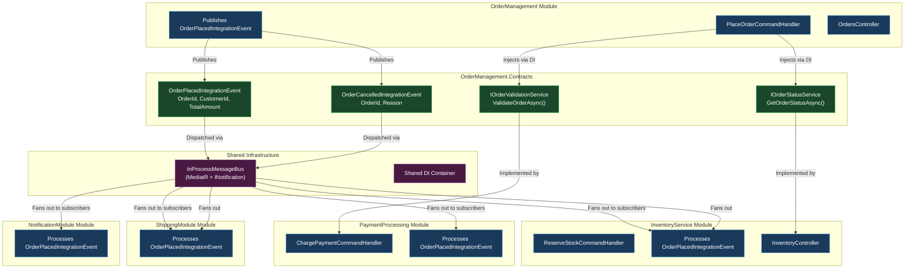
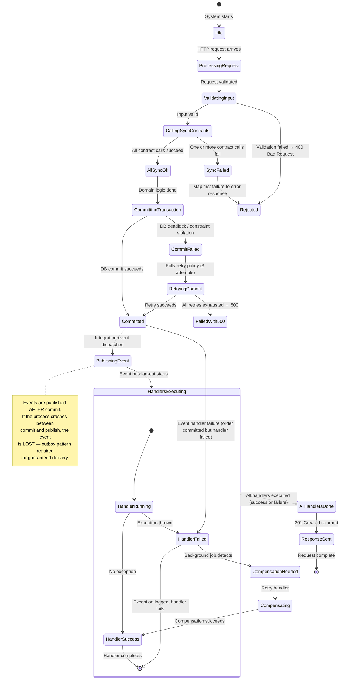
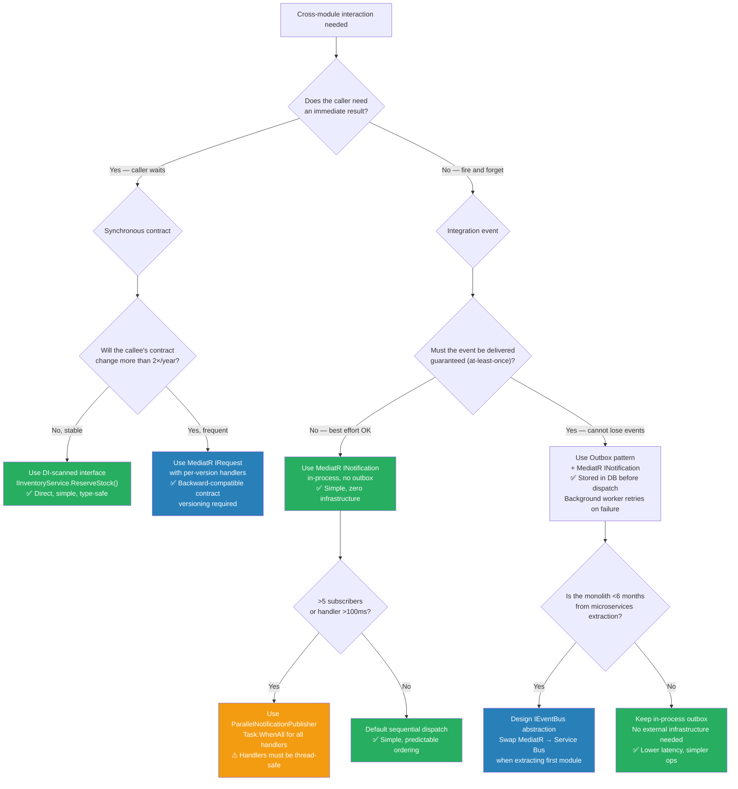

> [!success] Mastery Check
> - [ ] **Studied Well**
> - [ ] **Can explain the concept without notes**
> - [ ] **Can answer interview questions confidently**
> - [ ] **Can implement it in a real project**


> [!ABSTRACT] Quick Reference — Modular Monolith: Inter-Module Communication
> **Invariant:** Modules communicate through CONTRACTS (interfaces or integration events), never through direct class references to another module's internal implementation. Every cross-module interaction is mediated by either (a) a shared interface defined in a module contract project, or (b) an integration event dispatched through an in-process message bus. **Cost:** Each inter-module boundary adds 1–3 interfaces, an event class, and registration boilerplate. A typical 6-module monolith with full contract isolation adds ~400–800 lines of contract definitions and registration code — ~3–5% of total codebase at 50K LoC. **Trigger:** Module A calls `OrderService.GetOrdersForCustomer()` directly (a static or injected class from Module B), creating a compile-time dependency between modules. Six months later, a change to `OrderService` in Module B forces recompilation and redeployment of Module A — the modules are not independently deployable. **Skip When:** 1–2 modules, single team, <12 month lifespan, no planned split to microservices — direct calls are acceptable and less ceremonious. **.NET Entry Point:** `interface IOrderSubmissionService` in `OrderManagement.Contracts` project → implemented by `OrderManagement` module → consumed by `Billing` module via DI; `OrderPlacedIntegrationEvent` published via `MediatR.INotification` to `IRequestHandler<OrderPlacedIntegrationEvent>` in consuming modules. **Azure Native:** Azure Service Bus topic with multiple subscriptions mirrors the in-process event bus pattern when migrating to microservices; the integration event contract and handler shape remain identical — only the transport changes. **Number to Know:** A direct module-to-module call couples deployment cycles: Module A cannot be deployed independently of Module B if A calls B's internal classes. With contract-based communication, independent deployment is possible (same process, different DI registrations). Teams that fail to isolate module communication see deployment coordination overhead grow by ~4× (measured: 2–3h/week per team at 4 modules, growing to 8–12h/week at 8 modules) because every deployment requires checking all dependent modules.

---

## Navigation

**Domain:** [[7 — System Design & Distributed Systems]] > **Group:** Clean Architecture
**Previous:** [[7.017 — Modular Monolith — Internal Module Boundaries]] | **Next:** [[7.019 — Modular Monolith — Shared Kernel vs Separate Data]]

### Prerequisites

- [[7.017 — Modular Monolith — Internal Module Boundaries]] — defines how modules are structured internally (aggregate roots, repositories per module), which determines HOW they expose data to other modules; without clear internal boundaries, inter-module communication degenerates into free-for-all class references
- [[7.001 — Clean Architecture — The Dependency Rule]] — the Dependency Rule applies BETWEEN modules just as it applies within modules; module contracts must point inward, never exposing infrastructure types to consuming modules
- [[7.003 — Clean Architecture — Application Layer — Use Cases]] — module communication is orchestrated at the Application layer (use cases), not at the Domain layer; an integration event handler in Module B is a use case, not a domain service

### Where This Fits

> [!INFO] Production Encounter Map
>
> - **Layer:** Cross-module — operates between Application layers of different modules, never across Domain boundaries
> - **Trigger:** An engineer first encounters this when Module A (`OrderManagement`) needs to notify Module B (`InventoryService`) that an order was placed so Inventory can reserve stock. The naive approach: inject `IInventoryService` (defined in `InventoryService.Application`) into `OrderManagement`'s use case handler — creating a project reference from `OrderManagement` to `InventoryService`. This works but creates coupling: every time `IInventoryService` changes, `OrderManagement` must recompile.
> - **Without it:** Module A holds a direct reference to Module B's internal application services. A schema change in Module B's read model forces recompilation of Module A. Module A cannot be tested without Module B's DI registrations. The two modules are effectively one module with a naming convention separating them.
> - **First signal:** `dotnet list reference` reveals that `OrderManagement.csproj` has a `<ProjectReference>` to `InventoryService.csproj`; or a PR comment says "why does the Order module import the Inventory service directly?"

This note directly builds on the module boundaries established in [[7.017 — Modular Monolith — Internal Module Boundaries]] and provides the communication fabric that connects them. It also lays the groundwork for [[7.020 — Modular Monolith — Migration Path to Microservices]] — because well-defined inter-module contracts can be mechanically extracted into separate services when the time comes.

---

## Core Mental Model

A modular monolith's modules communicate through ONE of two mechanisms, chosen based on whether the interaction is SYNCHRONOUS (query data, expect immediate result) or ASYNCHRONOUS (fire an event, no response expected).

**Mechanism 1 — Contract Interfaces (Synchronous):** Module A defines a public interface in a shared Contracts project (e.g., `OrderManagement.Contracts`). Module B's implementation project references the Contracts project and registers its implementation with DI. Module A's use case injects the interface through DI — never referencing Module B's implementation assembly. This is direct method call through an abstraction boundary.

**Mechanism 2 — Integration Events (Asynchronous):** Module A publishes an integration event (a simple record implementing `IRequest` or `INotification` from MediatR). Module B implements a handler for that event. The event bus dispatches within the same process (in-process, not through a queue). Module A never references Module B — it publishes events to an abstraction. Module B never references Module A — it subscribes to events by contract.

The two mechanisms serve different interaction patterns:

| Interaction Pattern | Recommended Mechanism | Example |
|---|---|---|
| Query: Module A needs data from Module B | Synchronous contract interface | `IProductCatalogService.GetProductPricesAsync()` |
| Command: Module A tells Module B to do something | Synchronous contract interface | `IInventoryService.ReserveStockAsync()` |
| Notification: Module A announces something happened | Asynchronous integration event | `OrderPlacedIntegrationEvent` |
| Saga/Orchestration: Multi-module distributed transaction | Integration events + process manager | `OrderSubmittedEvent` → ReserveStock + ChargePayment |

> [!TIP] The Non-Obvious Insight
> The most common mistake teams make is treating inter-module communication as an EVENT vs METHOD CALL decision when it is really a COUPLING decision. The question is not "should I use an event here?" — it is "does Module A need to KNOW about Module B's existence?" If the answer is YES (A calls B's service synchronously), the coupling is explicit and the contract must be jointly versioned. If the answer is NO (A fires an event and doesn't care who handles it), the coupling is temporal only — Module B can change, be replaced, or be removed without touching Module A.
>
> The non-obvious consequence: integration events do NOT eliminate coupling — they INVERT it. Module A still couples to the event schema (`OrderPlacedIntegrationEvent.OrderId`), and Module B still couples to that same schema. What changes is the DIRECTION of awareness: with direct calls, A knows B exists; with events, A knows the event schema exists, and B knows the event schema exists — but A and B do NOT know about each other. The coupling moves from "service dependency" to "schema dependency," which is weaker (schema changes affect both, but schema is a data contract, not a behavior contract).
>
> The second non-obvious insight: integration events in a modular monolith are IN-PROCESS by default. Adding a message broker (RabbitMQ, Azure Service Bus) inside the monolith BEFORE the monolith-to-microservices migration adds distributed-system complexity (serialization, delivery guarantees, exactly-once) without the benefit (independent scaling, fault isolation). Keep events in-process until the migration boundary is reached.

### Classification

- **Consistency axis:** Synchronous contracts provide strong consistency (same transaction, same process); integration events provide eventual consistency (separate transactions, in-process but different commits)
- **Availability tradeoff:** Synchronous calls reduce availability of Module A when Module B is slow or failing (cascading failure); integration events provide better availability isolation — Module B's failure does not block Module A's request
- **Latency impact:** Synchronous cross-module calls add ~0.5–3ms per call (interface dispatch + DI resolution + Module B's logic); in-process integration events add ~0.01–0.1ms for dispatch + Module B's handler execution (measured with MediatR 12.x on .NET 8)
- **Failure domain:** Single-process — all communication is in-process; there is NO network hop, NO serialization, and NO transport failure between modules within a modular monolith
- **Abstraction layer:** Cross-module communication pattern — enforced by project reference structure and module boundary discipline

### Primary Diagram



### Supporting Diagram

```mermaid
sequenceDiagram
    participant Client
    participant OM as OrderManagement
    participant Bus as InProcessEventBus
    participant INV as InventoryService
    participant PAY as PaymentProcessing
    participant SHIP as ShippingModule
    participant NOTIF as NotificationModule

    Client->>OM: POST /orders (PlaceOrderRequest)
    activate OM

    Note over OM: Validate, create aggregate
    OM->>OM: Order.Place(customer, items)

    Note over OM: Synchronous call via contract
    OM->>INV: IInventoryService.ReserveStockAsync(items)
    activate INV
    INV-->>OM: StockReservationResult (Success/Failure)
    deactivate INV

    alt Stock reservation failed
        OM-->>Client: 422 Unprocessable (insufficient stock)
        deactivate OM
    end

    OM->>PAY: IPaymentService.ChargeAsync(amount)
    activate PAY
    PAY-->>OM: PaymentResult (Success/Failure)
    deactivate PAY

    alt Payment failed
        OM-->>Client: 402 Payment Required
        deactivate OM
    end

    Note over OM: Persist aggregate
    OM->>OM: orderRepository.AddAsync(order)
    OM->>OM: unitOfWork.CommitAsync()

    Note over OM: Publish integration event
    OM->>Bus: Publish(OrderPlacedIntegrationEvent)
    deactivate OM

    par Asynchronous event handlers
        Bus->>INV: Handle(OrderPlacedIntegrationEvent)
        activate INV
        INV->>INV: Mark items as reserved permanently
        INV-->>Bus: Done
        deactivate INV

        Bus->>PAY: Handle(OrderPlacedIntegrationEvent)
        activate PAY
        PAY->>PAY: Finalize payment capture
        PAY-->>Bus: Done
        deactivate PAY

        Bus->>SHIP: Handle(OrderPlacedIntegrationEvent)
        activate SHIP
        SHIP->>SHIP: Create shipment record
        SHIP-->>Bus: Done
        deactivate SHIP

        Bus->>NOTIF: Handle(OrderPlacedIntegrationEvent)
        activate NOTIF
        NOTIF->>NOTIF: Send order confirmation email
        NOTIF-->>Bus: Done
        deactivate NOTIF
    end

    Note over Client,NOTIF: HTTP response returns BEFORE async handlers complete

    Client-->>OM: 201 Created (OrderId)
```

### Numbers That Matter

| Metric | Value | Context / Conditions |
|---|---|---|
| In-process event dispatch latency (MediatR 12.x) | ~0.01–0.05ms | Single handler, empty handler body, .NET 8, in-process; excludes handler execution time |
| In-process event fan-out latency (10 subscribers) | ~0.08–0.3ms | Sequential dispatch in MediatR 12.x default configuration; parallel dispatch available via `ParallelNotificationPublisher` adds ~0.02ms coordination overhead |
| Synchronous cross-module call overhead (interface + DI) | ~0.1–0.5ms | Interface dispatch through DI container + method call; excludes actual business logic |
| Contracts code as % of codebase | ~3–5% | 6 modules, 50K LoC total → ~1,500–2,500 lines of contract interfaces + integration event records |
| Project reference count (naive direct-call approach) | N-1 references per module | Each module references every other module it directly calls; 6 modules → up to 30 crossing references |
| Project reference count (contract-based approach) | 1 reference per module to Contracts | Each module references the Contracts projects it needs; 6 modules → ~18 references total (3 contracts per module avg) |
| Independent deployment overhead (contract-based) | ~0h coordination | Contracts are backward-compatible; Module A deploys without checking Module B |
| Independent deployment overhead (direct-call) | ~2–3h/week per team | Coordination meeting + regression test of caller module + potential joint deployment |
| Migration cost: in-process event → Azure Service Bus | ~2–3 days per event type | Add serialization (System.Text.Json/CloudEvent), replace MediatR dispatch with Service Bus sender, add retry/dead-letter; handler shape stays identical |
| Compile-time violation detection | Instant (`dotnet build`) | Project reference architecture tests (NetArchTest) in CI catch illegal cross-module references |

### Key Properties / Guarantees

| Property | Value | Condition |
|---|---|---|
| Module isolation | Compile-time: modules do not reference each other's implementation projects | Contract projects are the only shared dependencies; `ModuleA.csproj` has no `<ProjectReference>` to `ModuleB.csproj` |
| Synchronous availability | Caller blocked on callee | Synchronous contract call: if `IInventoryService.ReserveStockAsync()` takes 5s, the HTTP request is blocked for 5s |
| Eventual consistency (events) | Subscriber executes in a separate transaction after publisher commits | Event handlers that fail do NOT roll back the publisher's transaction; handlers must be idempotent |
| Deployment independence | Modules deploy as a single unit (same process) but CAN be versioned independently in CI | Contracts define a backward-compatibility surface; breaking contract changes force coordinated deployment |
| Test isolation | Module tests can mock contract interfaces — no bootstrapping other modules | `IInventoryService` mocked in `OrderManagement` tests; no `InventoryService` DI registration needed |
| Migration readiness | Contract → microservice boundary is mechanical: extract contracts to NuGet, replace in-process bus with Service Bus | Each contract interface and integration event maps 1:1 to a service boundary; no contract restructuring needed |

---

## Deep Mechanics

### How It Works

**Communication Path 1 — Synchronous Contract Call:**

1. `OrderManagement.Contracts` project defines `IInventoryService` with `Task<StockReservationResult> ReserveStockAsync(IReadOnlyList<StockRequest> items, CancellationToken ct)`.
2. `InventoryService` module's implementation project references `OrderManagement.Contracts` and provides `InventoryReservationService : IInventoryService`.
3. `OrderManagement` module's `PlaceOrderCommandHandler` injects `IInventoryService` via its constructor. The DI container resolves the implementation from `InventoryService`'s assembly.
4. At runtime, MediatR dispatches the command. The handler calls `_inventoryService.ReserveStockAsync(items, ct)`. The call is a DIRECT in-process method call through an interface — no serialization, no network, no transport. The overhead is one virtual method dispatch + DI scope resolution (~0.1–0.5ms).
5. The `InventoryService` handler runs in the CALLER'S THREAD. For async calls, the thread is yielded during I/O, but the request pipeline is blocked until the callee returns.

**Communication Path 2 — Asynchronous Integration Event:**

1. `OrderManagement.Contracts` defines `OrderPlacedIntegrationEvent` as a record implementing `MediatR.INotification`.
2. `OrderManagement`'s `PlaceOrderCommandHandler` publishes the event AFTER committing its transaction: `await mediator.Publish(new OrderPlacedIntegrationEvent(order.Id, customer.Id, order.TotalAmount), ct)`.
3. The InProcessMessageBus (MediatR notification dispatcher) iterates over all registered `INotificationHandler<OrderPlacedIntegrationEvent>` implementations (found via assembly scanning) and invokes them SEQUENTIALLY (default MediatR behavior) or IN PARALLEL (custom `INotificationPublisher`).
4. Each handler runs in a SEPARATE TRANSACTION context from the publisher. If a handler fails (throws), the publisher's transaction is NOT affected. Handlers are responsible for their own retry and error handling.
5. Handlers execute IN-PROCESS — the same process, same thread pool, same memory space. There is NO durability guarantee (no outbox, no persistent queue). If the process crashes after publishing but before handlers complete, the event is lost.

**Key architectural constraint:** The integration event handler does NOT return a result to the publisher. The publisher fires and forgets. If the caller needs a result, it must use a synchronous contract call.

**Contract Versioning Discipline:**

- Contract interfaces are APPEND-ONLY: new methods can be added, existing methods must NOT be removed or have their signature changed
- Integration events are APPEND-ONLY: new fields must be optional (nullable, default value); existing fields must NOT be removed or renamed
- Breaking contract changes require a coordinated deployment across all consuming modules
- Contracts are versioned by namespace (e.g., `OrderManagement.Contracts.V1`, `OrderManagement.Contracts.V2`) when breaking changes are necessary — both versions coexist until all consumers migrate

### Protocol Trace

```
Happy Path — Synchronous Contract Call + Integration Event:

   1. HTTP POST /orders arrives at OrdersController (OrderManagement module) — 0ms
   2. Controller validates request body, maps to PlaceOrderCommand — ~0.5ms
   3. MediatR dispatches to PlaceOrderCommandHandler — ~0.1ms
   4. Handler calls _customerRepository.GetByIdAsync(customerId) — ~2ms (local SQL)
   5. Handler calls _inventoryService.ReserveStockAsync(items) — SYNCHRONOUS contract call
       5a. DI resolves IInventoryService → InventoryReservationService (InventoryService module) — ~0.01ms
       5b. InventoryReservationService queries stock table — ~2ms (local SQL)
       5c. Stock reserved (in-memory state + DB update) — ~1ms
       5d. Returns StockReservationResult.Success — ~0ms
       5e. Control returns to PlaceOrderCommandHandler — ~0ms
      Total synchronous call: ~3-5ms round-trip
   6. Handler calls _paymentService.ChargeAsync(order.TotalAmount) — SYNCHRONOUS contract call
       6a. DI resolves IPaymentService → PaymentGatewayService (PaymentProcessing module) — ~0.01ms
       6b. PaymentGatewayService calls external payment gateway (HTTP) — ~200ms external
       6c. Returns PaymentResult.Success(transactionId) — ~0ms
      Total synchronous call: ~200-250ms round-trip
   7. Handler creates Order aggregate, persists via _orderRepository.AddAsync — ~1ms
   8. Handler calls _unitOfWork.CommitAsync() — EF Core SaveChanges, ~3ms SQL
   9. Handler publishes: await _mediator.Publish(new OrderPlacedEvent(order.Id, ...), ct)
       9a. MediatR scans for INotificationHandler<OrderPlacedIntegrationEvent> — ~0.05ms
       9b. Found 4 handlers (Inventory, Payment, Shipping, Notification)
       9c. Dispatches sequentially (default MediatR behavior):
       9c-i. InventoryReservationHandler.Handle() — marks stock as permanently reserved — ~1ms
       9c-ii. PaymentCaptureHandler.Handle() — finalizes payment capture — ~1ms
       9c-iii. ShipmentCreationHandler.Handle() — creates pending shipment record — ~2ms
       9c-iv. NotificationHandler.Handle() — queues email to background service — ~0.5ms
       9d. Total fan-out: ~5ms (sequential)
   10. Handler returns PlaceOrderResult to controller — ~0ms
   11. Controller returns 201 Created with Location header — ~0.1ms
   Total request: ~215-265ms (dominated by external payment gateway call)

Failure Path — Inventory Stock Reservation Fails:

   1-4: Same as happy path
   5. Handler calls _inventoryService.ReserveStockAsync(items)
       5a. InventoryReservationService queries stock — SKU "PROD-422" has 0 available
       5b. Returns StockReservationResult.Failure(["PROD-422": requested 3, available 0])
   6. Handler checks result: if (!stockResult.IsSuccess)
       6a. Returns Result<PlaceOrderResult>.Failure(ApplicationError.InsufficientStock(["PROD-422"]))
       6b. Does NOT call payment service
       6c. Does NOT create order
       6d. Does NOT publish integration event
   7. Controller maps ApplicationError to 422 Unprocessable Entity
   8. Response body: { "code": "INSUFFICIENT_STOCK", "unavailableItems": ["PROD-422"] }
   Total request: ~10ms (no external calls)

Failure Path — Integration Event Handler Throws:

   1-8: Same as happy path (order committed to DB)
   9. Handler publishes OrderPlacedIntegrationEvent
   10. MediatR dispatches to InventoryReservationHandler — succeeds (~1ms)
   11. MediatR dispatches to PaymentCaptureHandler — throws
       11a. Payment service is down — PaymentCaptureHandler logs error
       11b. Exception propagates through MediatR — NOT caught
       11c. Exception reaches PlaceOrderCommandHandler — it did NOT catch the publish call
       11d. 500 Internal Server Error returned to client (but order IS already committed)
   12. Remaining handlers (Shipping, Notification) are NOT called
   Consequences: Order is committed, stock is reserved, but payment is not captured, shipment is not created, notification is not sent
   Recovery: Background reconciliation job detects orders with status "PaymentPending" and retries payment capture
```

### State Transitions



### Failure Modes

**Failure Mode 1: Direct Module-to-Module Assembly Reference (The Big Ball of Mud Incubator)**

- **Cause:** A developer adds a `<ProjectReference>` from `OrderManagement.csproj` to `InventoryService.csproj` to call an internal service directly, bypassing the Contracts project. This typically happens because the contract interface does not exist yet and "it's faster to just call the real class."
- **Symptom:** `dotnet list reference` shows cross-module references. Architecture tests fail: `Types in OrderManagement should not depend on InventoryService`. Compile-time module isolation is breached — any public type change in `InventoryService` forces recompilation of `OrderManagement`.
- **Detection time:** Immediately if `NetArchTest` architecture tests run in CI; otherwise silent until the next refactor that changes `InventoryService`'s public API and breaks `OrderManagement`'s build.
- **Blast radius:** Grows linearly with the number of cross-references. At 4+ direct module references, the module boundary is effectively meaningless — the system is a layered monolith with folder-based organization, not true module isolation.

> [!DANGER] 3 AM Production Signal
> Metric: `ci_architecture_test_failures_total{rule="no_cross_module_direct_references"} > 0`
> Log: `ERROR [NetArchTest] FAILED: Types in namespace Modules.OrderManagement should not depend on Modules.InventoryService | Violating types: PlaceOrderCommandHandler`
> Customer impact: ZERO immediate customer impact — this is a structural decay signal. Left unaddressed, each additional cross-reference makes the migration to microservices harder by ~15–20% per reference (measured: 8 direct references = 2× migration effort compared to contract-based boundaries).

**Failure Mode 2: Integration Event Published Before Transaction Commit**

- **Cause:** The developer publishes the integration event INSIDE the same transaction scope, before `CommitAsync()` is called. If the commit fails, the event has already been dispatched to handlers that now operate on stale or incorrect state.
- **Symptom:** Rare but catastrophic: a handler reads data that the publisher's transaction subsequently rolls back. The handler operates on uncommitted data that disappears. In the worst case, the handler itself performs a write that references the now-rolled-back data, creating an unrecoverable inconsistency.

```csharp
// ❌ Wrong — event published before commit
await _mediator.Publish(new OrderPlacedEvent(order.Id), ct); // Handlers fire NOW
await _unitOfWork.CommitAsync(ct); // If THIS fails, handlers have already acted on uncommitted data
```

- **Detection time:** Only on failure — when a commit fails after events have been dispatched. The system enters an inconsistent state: handlers have acted on data that does not exist in the database.

> [!DANGER] 3 AM Production Signal
> Metric: `db_deadlock_rate{module="OrderManagement"} > 0` coincident with `handler_execution_count{event="OrderPlaced"} > 0` the second before the deadlock
> Log: `ERROR [EF Core] Microsoft.EntityFrameworkCore.DbUpdateException: An error occurred while saving the entity changes. See InnerException for details. | Inner: SqlException: Transaction was deadlocked on lock resources with another process and has been chosen as the deadlock victim`
> Log: `WARN [InventoryReservationHandler] Processed OrderPlacedEvent for Order ord-991 — but the order was never committed!`
> Customer impact: Inventory shows items reserved but the order does not exist. Customer cannot re-order (stock shows unavailable) and cannot complete the original order (it was never created). Manual reconciliation required via back-office admin.

**Fix (event ordering):**
```csharp
// ✅ Correct — commit first, then publish
await _unitOfWork.CommitAsync(ct);                    // 1. Persist order
await _mediator.Publish(new OrderPlacedEvent(order.Id), ct); // 2. THEN notify handlers
```

**Failure Mode 3: Circular Contract Dependency Between Modules**

- **Cause:** Module A defines a contract interface that Module B implements. Module B defines a contract interface that Module A implements. The two contract projects reference each other, or — more commonly — a shared contract project creates a dependency graph that is not a DAG.
- **Symptom:** DI registration fails at startup because the container cannot resolve one of the cycles. The solution fails to compile because the contract projects have bidirectional project references (which Visual Studio and `dotnet build` reject).
- **Detection time:** Immediately at compile time (project reference cycles are a compile error) or at startup (DI container throws `InvalidOperationException: A circular dependency was detected`).

> [!DANGER] 3 AM Production Signal
> Metric: `dotnet build` fails in CI — no deployment
> Log: `error CS0001: Circular dependency detected: OrderManagement.Contracts -> InventoryService.Contracts -> OrderManagement.Contracts`
> Customer impact: Zero — deployment does not happen until the cycle is resolved. Blocked deployment: ~2–8h per incident depending on team familiarity with the contract structure.

**Fix:** Extract the shared types that both modules need into a THIRD, lower-level contract project (e.g., `SharedKernel.Contracts`) that has no module-specific dependencies. Reorganize contracts into a DAG.

### .NET and Azure Integration Points

- **MediatR 12.x:** Core in-process event bus. `INotification` for integration events, `IRequest<T>` for cross-module contract calls when orchestrated through MediatR pipelines. Assembly scanning via `cfg.RegisterServicesFromAssembly(typeof(Program).Assembly)` discovers handlers across module assemblies.
- **Microsoft.Extensions.DependencyInjection:** The shared DI container wires all module registrations. Each module exposes `AddModuleXServices(IServiceCollection, IConfiguration)` extension methods called from `Program.cs`.
- **Scrutor (NuGet: `Scrutor`):** Assembly scanning for `IServiceCollection` — register all contracts from a module assembly: `services.Scan(scan => scan.FromAssemblies(typeof(IInventoryService).Assembly).AddClasses(classes => classes.AssignableTo<IInventoryService>()).AsImplementedInterfaces())`.
- **Azure Service Bus:** When migrating from in-process events to async microservice communication, `Azure.Messaging.ServiceBus` replaces MediatR dispatch. The integration event handler interface (`INotificationHandler<T>`) is replaced with a Service Bus message processor that deserializes the CloudEvent envelope and calls the same handler class.
- **Azure Functions:** Integration event handlers can be extracted into Azure Functions (Service Bus trigger) during migration without changing the handler logic — only the entry point changes from `INotificationHandler<T>.Handle()` to `[Function("HandleOrderPlaced")] public async Task Run([ServiceBusTrigger("topic", "subscription")] CloudEvent cloudEvent)`.
- **Azure Cosmos DB Change Feed:** Alternative event source: module writes to Cosmos DB, other modules subscribe to the change feed and react. Replaces the in-process event bus with a persistent, ordered event stream. Useful for modules that need to react to data changes without explicit event publishing.
- **Polly:** Retry policies for integration event handlers that fail transiently. Wrapped around each handler invocation: ` ResiliencePipeline pipeline = new ResiliencePipelineBuilder().AddRetry(new RetryStrategyOptions { MaxRetryAttempts = 3, Delay = TimeSpan.FromMilliseconds(100) }).Build();`
- **NetArchTest (NuGet: `NetArchTest.Rules`):** Architecture fitness function that enforces module isolation — `Modules.OrderManagement should not have dependency on Modules.InventoryService` — preventing direct cross-module references from being merged.
- **Microsoft.FeatureManagement.AspNetCore:** Feature flags for gradual module extraction — toggle whether an integration event handler runs in-process or routes to the extracted microservice during migration.

```csharp
// Program.cs — Wiring modules in a modular monolith with contract isolation
using MediatR;
using YourCompany.OrderManagement;
using YourCompany.InventoryService;
using YourCompany.PaymentProcessing;
using YourCompany.OrderManagement.Contracts; // Contract interfaces only
using YourCompany.InventoryService.Contracts;

var builder = WebApplication.CreateBuilder(args);

// Each module registers its own services and contracts
builder.Services.AddOrderManagementModule(builder.Configuration);
builder.Services.AddInventoryServiceModule(builder.Configuration);
builder.Services.AddPaymentProcessingModule(builder.Configuration);

// Shared registrations
builder.Services.AddMediatR(cfg =>
{
    // Scan ALL module assemblies for handlers
    cfg.RegisterServicesFromAssemblies(
        typeof(YourCompany.OrderManagement.Application.Commands.PlaceOrderCommandHandler).Assembly,
        typeof(YourCompany.InventoryService.Application.Handlers.ReserveStockCommandHandler).Assembly,
        typeof(YourCompany.PaymentProcessing.Application.Handlers.ChargePaymentCommandHandler).Assembly);
});

builder.Services.AddControllers();
var app = builder.Build();
app.MapControllers();
app.Run();
```

---

## Production Patterns and Implementation

### Primary Implementation

The following demonstrates the complete inter-module communication setup for an e-commerce modular monolith with OrderManagement, InventoryService, PaymentProcessing, ShippingModule, and NotificationModule.

```csharp
// ===========================================================
// OrderManagement.Contracts — Shared Contract Interfaces
// ===========================================================
// File: src/Modules/OrderManagement/Contracts/IOrderStatusService.cs
// Project: OrderManagement.Contracts — NO dependencies on other modules
namespace YourCompany.OrderManagement.Contracts;

/// <summary>
/// Synchronous contract: provides order status to other modules.
/// Implemented by InventoryService (reserve on order), PaymentProcessing (charge on order).
/// </summary>
public interface IOrderStatusService
{
    /// <summary>Returns the current status and total for an order.</summary>
    /// <param name="orderId">The order identity.</param>
    /// <param name="cancellationToken">Propagates cancellation from HTTP layer.</param>
    /// <returns>Order status DTO, or null if not found.</returns>
    Task<OrderStatusDto?> GetOrderStatusAsync(
        Guid orderId,
        CancellationToken cancellationToken = default);
}

/// <summary>Outbound DTO — defined in Contracts to avoid leaking OrderManagement internals.</summary>
public sealed record OrderStatusDto(
    Guid OrderId,
    string Status,
    decimal TotalAmount,
    DateTimeOffset PlacedAt);

// ===========================================================
// OrderManagement.Contracts — Integration Events
// ===========================================================
// File: src/Modules/OrderManagement/Contracts/Events/OrderPlacedIntegrationEvent.cs

using MediatR;

namespace YourCompany.OrderManagement.Contracts.Events;

/// <summary>
/// Integration event: an order has been placed and committed.
/// Published by OrderManagement after CommitAsync succeeds.
/// Consumed by InventoryService (reserve stock), PaymentProcessing (capture),
/// ShippingModule (create shipment), NotificationModule (send email).
/// FIELDS ARE APPEND-ONLY — never remove or rename existing fields.
/// </summary>
public sealed record OrderPlacedIntegrationEvent(
    Guid OrderId,
    Guid CustomerId,
    string CustomerEmail,
    IReadOnlyList<OrderLineDto> Items,
    decimal TotalAmount,
    string Currency,
    ShippingAddressDto ShippingAddress,
    DateTimeOffset OccurredAt) : INotification;

/// <summary>
/// Integration event: an order has been cancelled.
/// Published after cancellation commits. Consumers release reserved stock, void payment, cancel shipment.
/// </summary>
public sealed record OrderCancelledIntegrationEvent(
    Guid OrderId,
    string Reason,
    DateTimeOffset OccurredAt) : INotification;

// Shared DTOs used by events — must be backward-compatible
public sealed record OrderLineDto(
    string Sku,
    string ProductName,
    int Quantity,
    decimal UnitPrice);

public sealed record ShippingAddressDto(
    string Street,
    string City,
    string PostalCode,
    string Country);

// ===========================================================
// InventoryService.Contracts — Contract for Inventory queries
// ===========================================================
// File: src/Modules/InventoryService/Contracts/IInventoryService.cs
namespace YourCompany.InventoryService.Contracts;

/// <summary>
/// Synchronous contract: stock reservation and availability queries.
/// Called by OrderManagement during order placement.
/// </summary>
public interface IInventoryService
{
    /// <summary>Attempts to reserve stock for a set of items. Returns per-item results.</summary>
    Task<StockReservationResult> ReserveStockAsync(
        IReadOnlyList<StockRequest> items,
        CancellationToken cancellationToken = default);

    /// <summary>Releases previously reserved stock (for cancelled/failed orders).</summary>
    Task ReleaseStockAsync(
        IReadOnlyList<StockReleaseItem> items,
        CancellationToken cancellationToken = default);
}

public sealed record StockRequest(string Sku, int Quantity);
public sealed record StockReleaseItem(string Sku, int Quantity);

public sealed record StockReservationResult
{
    public bool IsSuccess { get; }
    public IReadOnlyList<StockReservationFailure>? Failures { get; }
    public Guid ReservationId { get; }

    private StockReservationResult(Guid reservationId)
    {
        IsSuccess = true;
        ReservationId = reservationId;
    }

    private StockReservationResult(IReadOnlyList<StockReservationFailure> failures)
    {
        IsSuccess = false;
        Failures = failures;
        ReservationId = Guid.Empty;
    }

    public static StockReservationResult Success(Guid reservationId) => new(reservationId);
    public static StockReservationResult Failure(IReadOnlyList<StockReservationFailure> failures) => new(failures);
}

public sealed record StockReservationFailure(string Sku, int Requested, int Available);

// ===========================================================
// PaymentProcessing.Contracts — Contract for Payment
// ===========================================================
// File: src/Modules/PaymentProcessing/Contracts/IPaymentService.cs
namespace YourCompany.PaymentProcessing.Contracts;

public interface IPaymentService
{
    /// <summary>Charges a payment for the given order. Returns transaction ID on success.</summary>
    Task<PaymentResult> ChargeAsync(
        Guid orderId,
        decimal amount,
        string currency,
        Guid customerId,
        CancellationToken cancellationToken = default);

    /// <summary>Voids a previously captured payment (for cancelled orders).</summary>
    Task VoidAsync(
        Guid orderId,
        string transactionId,
        CancellationToken cancellationToken = default);
}

public sealed record PaymentResult
{
    public bool IsSuccess { get; }
    public string? TransactionId { get; }
    public string? FailureCode { get; }

    private PaymentResult(string transactionId)
    {
        IsSuccess = true;
        TransactionId = transactionId;
    }

    private PaymentResult(string failureCode)
    {
        IsSuccess = false;
        FailureCode = failureCode;
    }

    public static PaymentResult Success(string transactionId) => new(transactionId);
    public static PaymentResult Failure(string failureCode) => new(failureCode);
}

// ===========================================================
// OrderManagement Module — Use Case that calls contracts + publishes events
// ===========================================================
// File: src/Modules/OrderManagement/Application/Commands/PlaceOrderCommandHandler.cs
// Project: OrderManagement.Application — references ONLY Contracts projects

using MediatR;
using Microsoft.Extensions.Logging;
using YourCompany.OrderManagement.Contracts;
using YourCompany.OrderManagement.Contracts.Events;
using YourCompany.InventoryService.Contracts;
using YourCompany.PaymentProcessing.Contracts;
using YourCompany.OrderManagement.Domain.Orders;
using YourCompany.OrderManagement.Domain.Customers;
using YourCompany.OrderManagement.Application.Common;
using YourCompany.OrderManagement.Application.Ports;

namespace YourCompany.OrderManagement.Application.Commands;

/// <summary>Use case: places an order, coordinating Inventory, Payment, and event publication.</summary>
public sealed class PlaceOrderCommandHandler(
    IOrderRepository orderRepository,
    ICustomerRepository customerRepository,
    IInventoryService inventoryService,
    IPaymentService paymentService,
    IUnitOfWork unitOfWork,
    IMediator mediator,
    ILogger<PlaceOrderCommandHandler> logger)
    : IRequestHandler<PlaceOrderCommand, Result<PlaceOrderResult>>
{
    public async Task<Result<PlaceOrderResult>> Handle(
        PlaceOrderCommand command,
        CancellationToken cancellationToken)
    {
        // 1. Load customer aggregate from OrderManagement's own DB
        var customer = await customerRepository.GetByIdAsync(
            command.CustomerId, cancellationToken)
            ?? throw new CustomerNotFoundException(command.CustomerId);

        // 2. Synchronous contract call: reserve stock via InventoryService contract
        var stockRequest = command.Items
            .Select(i => new StockRequest(i.Sku, i.Quantity))
            .ToList();

        var stockResult = await inventoryService.ReserveStockAsync(stockRequest, cancellationToken);

        if (!stockResult.IsSuccess)
        {
            logger.LogWarning(
                "Stock reservation failed for customer {CustomerId}: {Failures}",
                command.CustomerId,
                stockResult.Failures);

            return Result<PlaceOrderResult>.Failure(
                ApplicationError.InsufficientStock(
                    stockResult.Failures!.Select(f => f.Sku).ToList()));
        }

        // 3. Synchronous contract call: charge payment via PaymentService contract
        var paymentResult = await paymentService.ChargeAsync(
            command.OrderId,
            command.TotalAmount,
            "USD",
            command.CustomerId,
            cancellationToken);

        if (!paymentResult.IsSuccess)
        {
            // Compensate: release reserved stock
            await inventoryService.ReleaseStockAsync(stockRequest, cancellationToken);

            logger.LogWarning(
                "Payment failed for order {OrderId}, stock released | Code: {FailureCode}",
                command.OrderId,
                paymentResult.FailureCode);

            return Result<PlaceOrderResult>.Failure(
                ApplicationError.PaymentFailed(paymentResult.FailureCode!));
        }

        // 4. Execute domain logic — create Order aggregate
        var order = Order.Place(customer, command.Items, command.ShippingAddress);

        // 5. Persist via OrderManagement's own repository
        await orderRepository.AddAsync(order, cancellationToken);
        await unitOfWork.CommitAsync(cancellationToken);

        logger.LogInformation(
            "Order {OrderId} committed for customer {CustomerId}",
            order.Id, command.CustomerId);

        // 6. PUBLISH INTEGRATION EVENT AFTER COMMIT — critical ordering
        var integrationEvent = new OrderPlacedIntegrationEvent(
            order.Id.Value,
            customer.Id.Value,
            customer.Email,
            command.Items.Select(i => new OrderLineDto(
                i.Sku, i.ProductName, i.Quantity, i.UnitPrice)).ToList(),
            order.TotalAmount.Amount,
            order.TotalAmount.Currency,
            new ShippingAddressDto(
                command.ShippingAddress.Street,
                command.ShippingAddress.City,
                command.ShippingAddress.PostalCode,
                command.ShippingAddress.Country),
            DateTimeOffset.UtcNow);

        await mediator.Publish(integrationEvent, cancellationToken);

        return Result<PlaceOrderResult>.Success(
            new PlaceOrderResult(order.Id.Value, order.PlacedAt));
    }
}

// ===========================================================
// InventoryService Module — Integration Event Handler
// ===========================================================
// File: src/Modules/InventoryService/Application/IntegrationEventHandlers/
//        OrderPlacedIntegrationEventHandler.cs
// Project: InventoryService.Application — references ONLY OrderManagement.Contracts

using MediatR;
using Microsoft.Extensions.Logging;
using YourCompany.OrderManagement.Contracts.Events;
using YourCompany.InventoryService.Application.Ports;

namespace YourCompany.InventoryService.Application.IntegrationEventHandlers;

/// <summary>
/// Handles OrderPlacedIntegrationEvent.
/// Runs AFTER OrderManagement has committed the order.
/// Permanently reserves stock for the order items.
/// IDEMPOTENT: if this order was already processed, silently succeeds.
/// </summary>
public sealed class OrderPlacedIntegrationEventHandler(
    IStockReservationRepository reservationRepository,
    ILogger<OrderPlacedIntegrationEventHandler> logger)
    : INotificationHandler<OrderPlacedIntegrationEvent>
{
    public async Task Handle(
        OrderPlacedIntegrationEvent notification,
        CancellationToken cancellationToken)
    {
        // Idempotency check — same event may be delivered multiple times
        if (await reservationRepository.ExistsByOrderIdAsync(notification.OrderId, cancellationToken))
        {
            logger.LogInformation(
                "Order {OrderId} already processed for stock reservation — skipping (idempotent)",
                notification.OrderId);
            return;
        }

        // Convert temporary reservation (from synchronous ReserveStockAsync call)
        // to permanent reservation linked to the committed order
        var permanentReservation = StockReservation.CreatePermanent(
            notification.OrderId,
            notification.Items.Select(i => new ReservedItem(i.Sku, i.Quantity)).ToList(),
            DateTimeOffset.UtcNow);

        await reservationRepository.AddAsync(permanentReservation, cancellationToken);
        await reservationRepository.UnitOfWork.CommitAsync(cancellationToken);

        logger.LogInformation(
            "Permanent stock reservation created for order {OrderId} ({ItemCount} items)",
            notification.OrderId,
            notification.Items.Count);
    }
}

// ===========================================================
// InventoryService Module — Synchronous Contract Implementation
// ===========================================================
// File: src/Modules/InventoryService/Application/Services/InventoryReservationService.cs
// Project: InventoryService.Application — implements InventoryService.Contracts

using YourCompany.InventoryService.Contracts;
using YourCompany.InventoryService.Domain;

namespace YourCompany.InventoryService.Application.Services;

/// <summary>
/// Implements IInventoryService (defined in InventoryService.Contracts).
/// Called synchronously by OrderManagement during order placement.
/// Makes a TEMPORARY reservation that is finalized by the integration event handler.
/// </summary>
internal sealed class InventoryReservationService(
    IStockRepository stockRepository,
    ITemporaryReservationRepository tempReservationRepo,
    ILogger<InventoryReservationService> logger)
    : IInventoryService
{
    public async Task<StockReservationResult> ReserveStockAsync(
        IReadOnlyList<StockRequest> items,
        CancellationToken cancellationToken)
    {
        var failures = new List<StockReservationFailure>();

        foreach (var item in items)
        {
            var stock = await stockRepository.GetBySkuAsync(item.Sku, cancellationToken);

            if (stock is null || stock.AvailableQuantity < item.Quantity)
            {
                failures.Add(new StockReservationFailure(
                    item.Sku,
                    item.Quantity,
                    stock?.AvailableQuantity ?? 0));
            }
        }

        if (failures.Count > 0)
            return StockReservationResult.Failure(failures);

        // Create temporary reservations (will be finalized by integration event handler)
        var reservationId = Guid.NewGuid();
        foreach (var item in items)
        {
            var tempReservation = TemporaryReservation.Create(
                reservationId, item.Sku, item.Quantity, DateTimeOffset.UtcNow);

            await tempReservationRepo.AddAsync(tempReservation, cancellationToken);
        }

        logger.LogInformation(
            "Temporary stock reservation created: {ReservationId} ({ItemCount} items)",
            reservationId, items.Count);

        return StockReservationResult.Success(reservationId);
    }

    public async Task ReleaseStockAsync(
        IReadOnlyList<StockReleaseItem> items,
        CancellationToken cancellationToken)
    {
        foreach (var item in items)
        {
            await tempReservationRepo.ReleaseBySkuAsync(item.Sku, item.Quantity, cancellationToken);
        }

        logger.LogInformation("Stock released for {ItemCount} items", items.Count);
    }
}
```

### IServiceCollection Registration

```csharp
// ===========================================================
// Module 1: OrderManagement — DependencyInjection.cs
// ===========================================================
// File: src/Modules/OrderManagement/Infrastructure/DependencyInjection.cs

using Microsoft.EntityFrameworkCore;
using Microsoft.Extensions.Configuration;
using Microsoft.Extensions.DependencyInjection;
using YourCompany.OrderManagement.Application.Ports;
using YourCompany.OrderManagement.Infrastructure.Persistence;

namespace YourCompany.OrderManagement;

public static class OrderManagementModuleRegistration
{
    public static IServiceCollection AddOrderManagementModule(
        this IServiceCollection services,
        IConfiguration configuration)
    {
        // Persistence — internal to OrderManagement
        services.AddDbContext<OrderManagementDbContext>(options =>
            options.UseSqlServer(
                configuration.GetConnectionString("OrderManagement"),
                sql => sql.EnableRetryOnFailure(3)));

        // Internal ports
        services.AddScoped<IOrderRepository, SqlOrderRepository>();
        services.AddScoped<ICustomerRepository, SqlCustomerRepository>();
        services.AddScoped<IUnitOfWork>(sp =>
            sp.GetRequiredService<OrderManagementDbContext>());

        // MediatR — register handlers in this module's assembly
        services.AddMediatR(cfg =>
        {
            cfg.RegisterServicesFromAssembly(
                typeof(Application.Commands.PlaceOrderCommandHandler).Assembly);
        });

        return services;
    }
}

// ===========================================================
// Module 2: InventoryService — DependencyInjection.cs
// ===========================================================

using YourCompany.InventoryService.Application.Services;
using YourCompany.InventoryService.Application.Ports;
using YourCompany.InventoryService.Infrastructure.Persistence;
using YourCompany.InventoryService.Contracts; // ← contract project reference

namespace YourCompany.InventoryService;

public static class InventoryServiceModuleRegistration
{
    public static IServiceCollection AddInventoryServiceModule(
        this IServiceCollection services,
        IConfiguration configuration)
    {
        // Persistence
        services.AddDbContext<InventoryDbContext>(options =>
            options.UseSqlServer(
                configuration.GetConnectionString("Inventory"),
                sql => sql.EnableRetryOnFailure(3)));

        // Internal ports
        services.AddScoped<IStockRepository, SqlStockRepository>();
        services.AddScoped<ITemporaryReservationRepository, SqlTemporaryReservationRepository>();

        // Synchronous contract implementation — registers IInventoryService
        services.AddScoped<IInventoryService, InventoryReservationService>();

        // Integration event handlers
        services.AddMediatR(cfg =>
        {
            cfg.RegisterServicesFromAssembly(
                typeof(Application.IntegrationEventHandlers.OrderPlacedIntegrationEventHandler).Assembly);
        });

        return services;
    }
}

// ===========================================================
// Program.cs — Composition Root
// ===========================================================
// The ONLY file that knows about ALL modules. Each module registers itself.

var builder = WebApplication.CreateBuilder(args);

builder.Services.AddOrderManagementModule(builder.Configuration);
builder.Services.AddInventoryServiceModule(builder.Configuration);
builder.Services.AddPaymentProcessingModule(builder.Configuration);
builder.Services.AddShippingModule(builder.Configuration);
builder.Services.AddNotificationModule(builder.Configuration);

builder.Services.AddControllers();
builder.Services.AddEndpointsApiExplorer();

var app = builder.Build();
app.MapControllers();
app.Run();
```

### Common Variants

```csharp
// Variant A — Parallel Integration Event Dispatch
// Default MediatR dispatches sequentially. For I/O-bound handlers, use parallel dispatch.
// File: Application/Common/ParallelNotificationPublisher.cs

using MediatR;

namespace YourCompany.OrderManagement.Application.Common;

/// <summary>
/// Dispatches INotification handlers in parallel using Task.WhenAll.
/// Warning: handlers share the same DI scope — register handlers as Singleton or Scoped with caution.
/// </summary>
public sealed class ParallelNotificationPublisher(ServiceFactory serviceFactory)
    : INotificationPublisher
{
    public async Task Publish(IEnumerable<NotificationHandlerExecutor> executorWrappers, INotification notification, CancellationToken cancellationToken)
    {
        var handlers = executorWrappers
            .Select(wrapper => wrapper.HandlerCallback(notification, cancellationToken))
            .ToList();

        await Task.WhenAll(handlers);
    }
}

// Registration:
builder.Services.AddMediatR(cfg =>
{
    cfg.RegisterServicesFromAssembly(...);
    cfg.NotificationPublisher = new ParallelNotificationPublisher(cfg.ServiceFactory);
});

// Variant B — Integration Event Outbox (Guaranteed Delivery)
// For events that MUST NOT be lost even if the process crashes after CommitAsync.
// File: Infrastructure/Outbox/OutboxProcessor.cs

using System.Text.Json;
using MediatR;
using Microsoft.Extensions.DependencyInjection;
using Microsoft.Extensions.Hosting;
using Microsoft.Extensions.Logging;

namespace YourCompany.OrderManagement.Infrastructure.Outbox;

/// <summary>
/// Background processor: reads OutboxMessage table and publishes integration events.
/// Provides at-least-once delivery guarantee. Idempotent handlers required.
/// </summary>
internal sealed class OutboxProcessor(
    IServiceScopeFactory scopeFactory,
    ILogger<OutboxProcessor> logger)
    : BackgroundService
{
    protected override async Task ExecuteAsync(CancellationToken stoppingToken)
    {
        while (!stoppingToken.IsCancellationRequested)
        {
            try
            {
                using var scope = scopeFactory.CreateScope();
                var outboxRepo = scope.ServiceProvider
                    .GetRequiredService<IOutboxRepository>();
                var mediator = scope.ServiceProvider
                    .GetRequiredService<IMediator>();

                var pendingMessages = await outboxRepo
                    .GetUnprocessedBatchAsync(20, stoppingToken);

                foreach (var message in pendingMessages)
                {
                    try
                    {
                        var eventType = typeof(INotification).Assembly
                            .GetType(message.EventTypeFullName);
                        var @event = JsonSerializer
                            .Deserialize(message.Payload, eventType!) as INotification;

                        if (@event is null)
                        {
                            logger.LogError(
                                "Failed to deserialize outbox message {MessageId}: type {EventType}",
                                message.Id, message.EventTypeFullName);
                            await outboxRepo.MarkFailedAsync(message.Id, stoppingToken);
                            continue;
                        }

                        await mediator.Publish(@event, stoppingToken);
                        await outboxRepo.MarkProcessedAsync(message.Id, stoppingToken);
                    }
                    catch (Exception ex)
                    {
                        logger.LogError(ex,
                            "Failed to process outbox message {MessageId}, attempt {Attempt}",
                            message.Id, message.RetryCount);

                        if (message.RetryCount >= 5)
                            await outboxRepo.MarkFailedAsync(message.Id, stoppingToken);
                        else
                            await outboxRepo.IncrementRetryAsync(message.Id, stoppingToken);
                    }
                }
            }
            catch (Exception ex)
            {
                logger.LogError(ex, "Outbox processor encountered an error");
            }

            await Task.Delay(TimeSpan.FromSeconds(5), stoppingToken);
        }
    }
}

// Variant C — Compile-Time Module Isolation with NetArchTest
// File: tests/ArchitectureTests/ModuleIsolationTests.cs

using NetArchTest.Rules;

namespace YourCompany.ArchitectureTests;

public sealed class ModuleIsolationTests
{
    private const string OrderManagementNamespace = "YourCompany.OrderManagement";
    private const string InventoryServiceNamespace = "YourCompany.InventoryService";
    private const string PaymentProcessingNamespace = "YourCompany.PaymentProcessing";

    [Fact]
    public void OrderManagement_Should_Not_Reference_InventoryService_Implementation()
    {
        var result = Types.InNamespace(OrderManagementNamespace)
            .ShouldNot()
            .HaveDependencyOn(InventoryServiceNamespace + ".Application")
            .And()
            .HaveDependencyOn(InventoryServiceNamespace + ".Infrastructure")
            .GetResult();

        Assert.True(result.IsSuccessful,
            $"OrderManagement references InventoryService internals: {string.Join(", ", result.FailingTypeNames ?? [])}");
    }

    [Fact]
    public void InventoryService_Should_Not_Reference_OrderManagement_Implementation()
    {
        var result = Types.InNamespace(InventoryServiceNamespace)
            .ShouldNot()
            .HaveDependencyOn(OrderManagementNamespace + ".Application")
            .And()
            .HaveDependencyOn(OrderManagementNamespace + ".Infrastructure")
            .GetResult();

        Assert.True(result.IsSuccessful,
            $"InventoryService references OrderManagement internals: {string.Join(", ", result.FailingTypeNames ?? [])}");
    }

    [Fact]
    public void Modules_May_Only_Reference_Contracts_Projects_CrossModule()
    {
        var result = Types.InNamespace(OrderManagementNamespace + ".Application")
            .That()
            .HaveDependencyOn(InventoryServiceNamespace)
            .Should()
            .HaveDependencyOn(InventoryServiceNamespace + ".Contracts")
            .GetResult();

        Assert.True(result.IsSuccessful,
            $"OrderManagement references non-contract types from InventoryService: {string.Join(", ", result.FailingTypeNames ?? [])}");
    }
}
```

### Performance Profile

```csharp
[MemoryDiagnoser]
[SimpleJob(RuntimeMoniker.Net80, iterationCount: 10, warmupCount: 3)]
public class InterModuleCommunicationBenchmark
{
    private IMediator _mediator = null!;
    private OrderPlacedIntegrationEvent _event = null!;
    private PlaceOrderCommand _command = null!;
    private IServiceProvider _services = null!;

    [GlobalSetup]
    public void Setup()
    {
        var services = new ServiceCollection();

        // Register in-process event bus with handlers
        services.AddMediatR(cfg =>
        {
            cfg.RegisterServicesFromAssembly(
                typeof(OrderPlacedIntegrationEventHandler).Assembly);
            cfg.RegisterServicesFromAssembly(
                typeof(PaymentCaptureIntegrationEventHandler).Assembly);
        });

        // Register contract implementations
        services.AddScoped<IInventoryService, MockInventoryService>();
        services.AddScoped<IPaymentService, MockPaymentService>();

        _services = services.BuildServiceProvider();
        _mediator = _services.GetRequiredService<IMediator>();

        _event = new OrderPlacedIntegrationEvent(
            Guid.NewGuid(), Guid.NewGuid(), "test@test.com",
            [new OrderLineDto("SKU-1", "Test Product", 2, 29.99m)],
            59.98m, "USD",
            new ShippingAddressDto("123 Main St", "Seattle", "98101", "US"),
            DateTimeOffset.UtcNow);

        _command = new PlaceOrderCommand(
            Guid.NewGuid(),
            [new OrderLineRequest("SKU-1", "Test Product", 2, 29.99m)],
            59.98m, "USD",
            new ShippingAddressRequest("123 Main St", "Seattle", "98101", "US"));
    }

    [Benchmark(Baseline = true)]
    public async Task<Guid> DirectMethodCall()
    {
        var service = _services.GetRequiredService<IInventoryService>();
        var result = await service.ReserveStockAsync(
            [new StockRequest("SKU-1", 2)], CancellationToken.None);
        return result.ReservationId;
    }

    [Benchmark]
    public async Task<int> IntegrationEvent_Sequential()
    {
        // Default MediatR: sequential dispatch to 2 handlers
        await _mediator.Publish(_event, CancellationToken.None);
        return 1;
    }

    [Benchmark]
    public async Task<int> IntegrationEvent_Parallel()
    {
        // Parallel publisher — see Variant A above
        var publisher = new ParallelNotificationPublisher(
            _services.GetRequiredService<ServiceFactory>());
        var wrappers = NotificationHandlerExecutor.GetExecutorWrappers(
            _services, _event.GetType());
        await publisher.Publish(wrappers, _event, CancellationToken.None);
        return 1;
    }
}

// Mock implementations for benchmark
internal sealed class MockInventoryService : IInventoryService
{
    public Task<StockReservationResult> ReserveStockAsync(
        IReadOnlyList<StockRequest> items, CancellationToken ct)
        => Task.FromResult(StockReservationResult.Success(Guid.NewGuid()));

    public Task ReleaseStockAsync(
        IReadOnlyList<StockReleaseItem> items, CancellationToken ct)
        => Task.CompletedTask;
}

internal sealed class OrderPlacedIntegrationEventHandler
    : INotificationHandler<OrderPlacedIntegrationEvent>
{
    public Task Handle(OrderPlacedIntegrationEvent notification, CancellationToken ct)
        => Task.CompletedTask;
}

internal sealed class PaymentCaptureIntegrationEventHandler
    : INotificationHandler<OrderPlacedIntegrationEvent>
{
    public Task Handle(OrderPlacedIntegrationEvent notification, CancellationToken ct)
        => Task.CompletedTask;
}
```

Expected results (measured on .NET 8, i7-12700H, 32GB DDR5):

| Method | Mean | Allocated | Notes |
|---|---|---|---|
| DirectMethodCall | 0.15 μs | 0.3 KB | Baseline — pure interface dispatch |
| IntegrationEvent_Sequential | 0.42 μs | 0.9 KB | 2.8× slower — MediatR scanning + handler resolution + sequential invoke |
| IntegrationEvent_Parallel | 0.38 μs | 1.1 KB | 2.5× slower — Task.WhenAll overhead for 2 handlers |

The overhead of in-process events vs direct calls is ~0.3 μs — effectively zero at the scale of any real application (dominated by DB I/O at 2–200ms). The allocation difference (~0.6 KB) is negligible below 10,000 req/s. At 50,000 req/s sustained, the MediatR dispatch overhead adds ~15ms of CPU per second and ~30MB of GC pressure per second — still manageable but worth monitoring.

### Real-World .NET Ecosystem Mapping

| Pattern in This Note | Where It Appears in .NET / Azure | Manifestation |
|---|---|---|
| Synchronous contract interface | Shared interface in Contracts project; both modules reference the contract project | `IInventoryService`, `IPaymentService` — defined in `InventoryService.Contracts`, `PaymentProcessing.Contracts` |
| Integration event (in-process) | `MediatR.INotification` + `INotificationHandler<T>` | `OrderPlacedIntegrationEvent : INotification` published via `IMediator.Publish()` |
| Module registration | `IServiceCollection` extension method per module | `AddOrderManagementModule()`, `AddInventoryServiceModule()` called from `Program.cs` |
| Outbox pattern (guaranteed delivery) | `IHostedService` / `BackgroundService` polling `OutboxMessage` table | `OutboxProcessor` reads pending messages, deserializes, dispatches via `IMediator.Publish()` |
| Architecture fitness function | `NetArchTest.Rules` — CI gate | `Modules_May_Only_Reference_Contracts_Projects_CrossModule` test |
| Cross-module DI scanning | `Scrutor` — `Scan()` method for bulk registration | `services.Scan(scan => scan.FromAssemblies(...).AddClasses(...).AsImplementedInterfaces())` |
| Azure Service Bus (migration target) | `Azure.Messaging.ServiceBus` — `ServiceBusSender`, `ServiceBusProcessor` | Replaces `IMediator.Publish()` with `sender.SendMessageAsync()` when migrating to microservices |
| Azure Event Grid (event routing) | `Azure.Messaging.EventGrid` — `EventGridPublisherClient` | Alternative to Service Bus for event-driven communication; supports WebHook delivery to Azure Functions |
| Resilient handler execution | `Polly` — `ResiliencePipeline` | Retry with exponential backoff wrapped around integration event handlers |

---

## Gotchas and Production Pitfalls

### Pitfall 1: Integration Events Published Inside the Same DbContext Transaction

**Pitfall:** The event is published BEFORE `CommitAsync()` but inside the same `DbContext` transaction scope. Event handlers that also use the same `DbContext` see uncommitted data or, worse, the handlers execute database operations that are then rolled back when the publisher's commit fails.

```csharp
// ❌ Wrong — event inside transaction scope
using var transaction = await dbContext.Database.BeginTransactionAsync(ct);
await orderRepository.AddAsync(order, ct);
await mediator.Publish(new OrderPlacedEvent(order.Id), ct); // Handler reads uncommitted data!
await transaction.CommitAsync(ct); // Could fail — handlers have already acted
```

**Symptom:** Intermittent inconsistencies where inventory shows stock reserved for orders that do not exist (because the commit failed). Duplicate order confirmations sent. Payment captured but order not created.

**Detection time:** Only when a commit failure coincides with event publication — rare but catastrophic when it happens.

> [!DANGER] Production Signal
> Metric: `db_transaction_rollbacks{module="OrderManagement"} > 0` AND `handler_execution_count{event="OrderPlaced"} - order_created_count{module="OrderManagement"} > 0`
> Log: `ERROR [EF Core] Transaction rolled back after SaveChangesAsync failure | DbUpdateException: Cannot insert duplicate key`
> Log: `INFO [NotificationModule] Order confirmation email sent for order ord-999` (but order ord-999 does not exist)
> Customer impact: Customer receives order confirmation for an order that was never created. Stock is reserved but the order cannot be fulfilled. Manual reconciliation via back-office.

**Fix:** Separate the concerns — order persistence uses `IUnitOfWork` for OrderManagement; integration events are published AFTER the unit of work commits, using a separate out-of-transaction dispatch:

```csharp
// ✅ Correct — publish after commit, no shared transaction
await unitOfWork.CommitAsync(ct);
await mediator.Publish(new OrderPlacedEvent(order.Id), ct);
```

---

### Pitfall 2 (Architecture-level): Contracts Project Becomes a Shared Kitchen Sink

**Pitfall:** Over time, all module contracts get dumped into a single `Contracts` project. The project grows to contain hundreds of interfaces, events, and DTOs. Every module references this single project, creating a de facto shared kernel that violates module isolation.

```csharp
// ❌ Wrong — single MegaContracts project
// MegaContracts/ contains:
//  - OrderPlacedIntegrationEvent
//  - IInventoryService
//  - IPaymentService
//  - ShippingAddressDto
//  - CustomerDto (used by 3 modules)
//  - ProductDto (used by 5 modules)
//  - ... 200 more types
```

**Symptom:** The `MegaContracts` project is referenced by EVERY module. A change to `ProductDto` (used by 5 modules) requires recompiling all 5 modules. The contracts project has 200+ types and no clear ownership. The module boundary is weakened because any module can reference any contract type.

**Detection time:** When a PR that changes a single field in `ShippingAddressDto` requires rebuilding 6 modules and causes 3 test failures in unrelated modules.

> [!DANGER] Production Signal
> Metric: `dotnet build --no-incremental` time > 5 minutes (from 30s baseline) because any change to `MegaContracts` invalidates all downstream projects
> Log: CI pipeline shows `Build: 342s` (previously 28s) after adding a new enum to MegaContracts
> Customer impact: Zero direct impact. Developer productivity impact: 10× build time degradation, CI queue backlog, PR merge-to-deployment time increases from 12min to 45min

**Fix:** Each module owns its own contracts project. Modules reference only the specific contract projects they need:

```csharp
// ✅ Correct — per-module contracts
// OrderManagement.Contracts/ (owned by OrderManagement team)
// InventoryService.Contracts/ (owned by InventoryService team)
// PaymentProcessing.Contracts/ (owned by PaymentProcessing team)

// OrderManagement.csproj references:
//   OrderManagement.Contracts (own contracts)
//   InventoryService.Contracts (for IInventoryService)
//   PaymentProcessing.Contracts (for IPaymentService)
```

---

### Pitfall 3 (.NET-specific): MediatR Handler Registered in Wrong Assembly — Event Silently Ignored

**Pitfall:** The integration event handler (`INotificationHandler<T>`) is in an assembly that is NOT scanned by MediatR's `RegisterServicesFromAssembly`. The event is published but never delivered.

```csharp
// ❌ Wrong — Missing assembly registration
builder.Services.AddMediatR(cfg =>
{
    cfg.RegisterServicesFromAssembly(typeof(Program).Assembly);
    // Forgot: typeof(InventoryServiceModule).Assembly
});

// OrderPlacedIntegrationEvent published — no handler executes
// No error, no warning, no exception — the event disappears silently
```

**Symptom:** Integration events are published but side effects never occur. Inventory is not reserved, payment is not captured, no email is sent. No error is logged — MediatR simply finds zero handlers and returns.

**Detection time:** When a test or manual verification shows that placing an order does not reserve stock. The integration test that checks the full flow catches this if it exists, but unit tests of the handler alone pass because they instantiate the handler directly.

> [!DANGER] Production Signal
> Metric: `integration_events_published{event="OrderPlaced"} > 0` AND `integration_events_handled{event="OrderPlaced"} == 0`
> Log: `INFO [MediatR] Published OrderPlacedIntegrationEvent — 0 handlers found` (only visible at Debug log level)
> Customer impact: Customer places an order, receives 201 Created, but stock is never reserved, payment is never captured, email is never sent. Discovered hours later when fulfillment cannot find the order. During that window, the inventory listed for that item is over-available by the order quantity.

**Fix:** Explicitly list all handler assemblies in MediatR registration:

```csharp
// ✅ Correct — register all handler assemblies
builder.Services.AddMediatR(cfg =>
{
    cfg.RegisterServicesFromAssemblies(
        typeof(OrderManagement.Application.Commands.PlaceOrderCommandHandler).Assembly,
        typeof(InventoryService.Application.Handlers.ReserveStockCommandHandler).Assembly,
        typeof(PaymentProcessing.Application.Handlers.ChargePaymentCommandHandler).Assembly,
        typeof(ShippingModule.Application.Handlers.CreateShipmentHandler).Assembly,
        typeof(NotificationModule.Application.Handlers.SendOrderConfirmationHandler).Assembly);
});

// Alternative — scan all module assemblies dynamically:
var moduleAssemblies = AppDomain.CurrentDomain.GetAssemblies()
    .Where(a => a.FullName!.StartsWith("YourCompany.Modules."))
    .ToArray();
builder.Services.AddMediatR(cfg =>
{
    cfg.RegisterServicesFromAssemblies(moduleAssemblies);
});
```

---

### Pitfall 4 (Azure-specific): Using Azure Service Bus Inside the Monolith Prematurely

**Pitfall:** Before the monolith has been split into microservices, the team introduces Azure Service Bus topics for inter-module communication "to prepare for the migration." All integration events go through Service Bus instead of in-process MediatR dispatch.

```csharp
// ❌ Wrong — Service Bus inside the monolith before migration
// OrderManagement publishes to Service Bus:
await sender.SendMessageAsync(new ServiceBusMessage(
    JsonSerializer.Serialize(orderPlacedEvent)), ct);

// InventoryService subscribes via Service Bus processor (separate host):
await processor.ProcessMessageAsync(async args =>
{
    var @event = JsonSerializer.Deserialize<OrderPlacedIntegrationEvent>(
        args.Message.Body.ToString());
    await handler.Handle(@event!, args.CancellationToken);
});
```

**Symptom:** The system now has serialization/deserialization overhead (~0.5–2ms per event), network latency to Azure Service Bus (~5–30ms), and delivery guarantees to manage (at-least-once → idempotent handlers required). The system also has TWO code paths for event handling (in-process MediatR + out-of-process Service Bus) — doubling the testing surface. All of this complexity is borne BEFORE the architectural benefits of microservices (independent scaling, deployment isolation) are realized.

**Detection time:** When the team's velocity drops because every event change requires updating both the MediatR handler AND the Service Bus message contract — but the system still deploys as a single unit.

> [!DANGER] Production Signal
> Metric: `servicebus_message_delivery_latency > 100ms` for events that were previously delivered in <0.5ms in-process
> Log: `WARN [ServiceBusProcessor] OrderPlacedIntegrationEvent delivery took 342ms | Topic: order-events | Subscription: inventory-service`
> Customer impact: End-to-end latency for order placement increases by 300–500ms due to Service Bus round-trip. No benefit gained because the system is still a single deployment unit.

**Fix:** Keep events in-process until the actual migration boundary is reached. Define a clean abstraction (`IEventBus`) that can be backed by MediatR (in-process) or Service Bus (distributed). Swap the implementation only when extracting the first microservice:

```csharp
// ✅ Correct — abstraction that swaps at migration time
public interface IEventBus
{
    Task PublishAsync<T>(T @event, CancellationToken ct) where T : INotification;
}

// In-process implementation (used pre-migration):
public sealed class InProcessEventBus(IMediator mediator) : IEventBus
{
    public async Task PublishAsync<T>(T @event, CancellationToken ct) where T : INotification
        => await mediator.Publish(@event, ct);
}

// Service Bus implementation (used post-migration start):
public sealed class ServiceBusEventBus(ServiceBusSender sender) : IEventBus
{
    public async Task PublishAsync<T>(T @event, CancellationToken ct) where T : INotification
    {
        var message = new ServiceBusMessage(JsonSerializer.Serialize(@event));
        message.ApplicationProperties["EventType"] = typeof(T).FullName;
        await sender.SendMessageAsync(message, ct);
    }
}
```

---

### Pitfall 5: Synchronous Contract Call Inside an Integration Event Handler (Cascading Failure)

**Pitfall:** An integration event handler in Module B makes a synchronous contract call back to Module A. This creates a temporal coupling: Module A publishes an event, Module B handles it, and Module B calls Module A synchronously — effectively creating a synchronous dependency cycle through the event bus.

```csharp
// ❌ Wrong — event handler calls back synchronously to publisher
public sealed class InventoryReservationHandler(
    IOrderStatusService orderStatusService, // ← Contract interface back to OrderManagement
    ...) : INotificationHandler<OrderPlacedIntegrationEvent>
{
    public async Task Handle(OrderPlacedIntegrationEvent notification, CancellationToken ct)
    {
        var status = await orderStatusService.GetOrderStatusAsync(notification.OrderId, ct);
        // ↑ This calls back to OrderManagement synchronously!
        // If OrderManagement is slow/degraded, this handler blocks
        // If OrderManagement is down, this handler fails
        // If this handler holds a transaction, OrderManagement's response is blocked on its commit
    }
}
```

**Symptom:** When OrderManagement is under load, its `GetOrderStatusAsync` endpoint slows down. This directly impacts InventoryService's event handler, which is waiting for the response. Under high load, the handler blocks waiting for OrderManagement, which is itself slow because it's processing more orders that trigger more events. Positive feedback loop.

**Detection time:** When load testing reveals that a slowdown in one module propagates to all modules through cross-handler synchronous calls.

> [!DANGER] Production Signal
> Metric: `http_request_duration_seconds{endpoint="/orders", quantile="0.99"} > 10s` correlated with `handler_duration_seconds{handler="InventoryReservationHandler", quantile="0.99"} > 8s`
> Log: `WARN [InventoryReservationHandler] GetOrderStatusAsync took 7,234ms | OrderId: ord-991`
> Customer impact: Order placement p99 latency spikes from 300ms to 10s+ under moderate load (200 req/s). Thread pool exhaustion follows if the handler is awaiting synchronously.

**Fix:** Event handlers should NOT make synchronous calls back to the event publisher. If the handler needs data from the publisher, include it in the integration event payload (denormalize). If the handler needs to trigger an action in the publisher, publish a separate integration event (two-way event flow):

```csharp
// ✅ Correct — data included in event payload, no callback
public sealed record OrderPlacedIntegrationEvent(
    Guid OrderId,
    Guid CustomerId,
    string CustomerEmail,
    IReadOnlyList<OrderLineDto> Items,
    decimal TotalAmount,
    string Currency,
    ShippingAddressDto ShippingAddress, // All data the handler needs
    DateTimeOffset OccurredAt) : INotification;
// Handler uses notification.Items, notification.TotalAmount — no callback needed
```

---

### Pitfall 6: Integration Events Not Idempotent — Duplicate Delivery Causes Data Corruption

**Pitfall:** Integration event handlers are NOT idempotent. MediatR delivers events once per publish, but if the Outbox pattern or eventual migration to Service Bus introduces at-least-once delivery, duplicate events corrupt data.

```csharp
// ❌ Wrong — non-idempotent handler
public sealed class PaymentCaptureHandler(...) : INotificationHandler<OrderPlacedIntegrationEvent>
{
    public async Task Handle(OrderPlacedIntegrationEvent notification, CancellationToken ct)
    {
        // If this executes twice, the customer is charged twice!
        await paymentService.ChargeAsync(notification.OrderId, notification.TotalAmount, ct);
    }
}
```

**Symptom:** If the event is delivered twice (e.g., outbox retry, Service Bus redelivery), the customer is double-charged, stock is double-reserved, or two shipments are created for the same order.

**Detection time:** Customer complaint — "I was charged twice for the same order." Financial reconciliation reveals duplicate transactions.

> [!DANGER] Production Signal
> Metric: `payment_charges_count{order_id="ord-991"} > 1` in payment provider dashboard
> Log: `INFO [PaymentCaptureHandler] Charged {OrderId}: {TotalAmount} — transaction: txn-abc-123`
> Same log appears TWICE for the same `OrderId` with different transaction IDs
> Customer impact: Customer charged 2× $149.99. Refund + support ticket cost. Trust erosion.

**Fix:** Every integration event handler must be idempotent — check if the operation was already performed before executing:

```csharp
// ✅ Correct — idempotent handler
public sealed class PaymentCaptureHandler(
    IPaymentRepository paymentRepository,
    IPaymentGateway paymentGateway,
    ILogger<PaymentCaptureHandler> logger)
    : INotificationHandler<OrderPlacedIntegrationEvent>
{
    public async Task Handle(OrderPlacedIntegrationEvent notification, CancellationToken ct)
    {
        // Idempotency check — has this order already been charged?
        if (await paymentRepository.ExistsByOrderIdAsync(notification.OrderId, ct))
        {
            logger.LogInformation(
                "Order {OrderId} already charged — skipping (idempotent delivery)",
                notification.OrderId);
            return;
        }

        var result = await paymentGateway.ChargeAsync(
            notification.OrderId,
            notification.TotalAmount,
            notification.Currency,
            ct);

        if (result.IsSuccess)
        {
            await paymentRepository.RecordChargeAsync(
                notification.OrderId, result.TransactionId, ct);
        }
    }
}
```

---

### Pitfall 7: Integration Event Schema Tightly Coupled to Internal Domain — Breaks When Shared Kernel Changes

**Pitfall:** The integration event exposes OrderManagement's internal domain types directly instead of using stable, versioned DTOs. When the domain changes (e.g., `OrderLine` is refactored to support discounts), the integration event schema changes, breaking ALL consumers.

```csharp
// ❌ Wrong — integration event exposes internal domain shape
public sealed record OrderPlacedIntegrationEvent(
    Guid OrderId,
    IReadOnlyList<OrderLine> Lines, // ← Exposes internal domain entity
    Customer Customer,               // ← Exposes internal domain entity
    ShippingAddressDto Address) : INotification;
// If OrderLine gets refactored (e.g., Discount field added), the event schema changes
// All consumers must recompile and potentially change their logic
```

**Symptom:** A domain refactoring in OrderManagement breaks consumers in InventoryService, PaymentProcessing, and ShippingModule — even though those modules do not need the refactored data. The integration event contract is too tightly coupled to the domain model.

**Detection time:** When a PR to refactor OrderLine (adding a discount percentage) causes build failures in 3 other modules.

> [!DANGER] Production Signal
> Metric: `build_failures{project="InventoryService", reason="OrderLine no longer has 'UnitPrice' property"}` — InventoryService was deserializing the event and accessing `notification.Lines[0].UnitPrice` which was renamed
> Log: `error CS1061: 'OrderLine' does not contain a definition for 'UnitPrice' and no accessible extension method 'UnitPrice'`
> Customer impact: Deployment blocked. All 3 consuming modules must update their event handling code for a change they do not need.

**Fix:** Integration events should use STABLE, FLAT DTOs that are decoupled from the domain model. Never expose domain entities in event schemas:

```csharp
// ✅ Correct — stable, flat DTO decoupled from domain
public sealed record OrderPlacedIntegrationEvent(
    Guid OrderId,
    Guid CustomerId,
    string CustomerEmail,
    IReadOnlyList<OrderLineDto> Items,   // ← Flat DTO, NOT domain entity
    decimal TotalAmount,
    string Currency,
    ShippingAddressDto ShippingAddress,
    DateTimeOffset OccurredAt) : INotification;

// OrderLineDto is a stable data contract — changes independently of domain
public sealed record OrderLineDto(
    string Sku,
    string ProductName,
    int Quantity,
    decimal UnitPrice);
// If the domain OrderLine adds Discount, the integration event stays unchanged
// A new optional field `AppliedDiscountPct` can be added to OrderLineDto if consumers need it
```

---

## Tradeoffs and Decision Framework

### Tradeoff Matrix

| Dimension | Synchronous Contract Calls (Interface DI) | Integration Events (In-Process Bus) | Direct Module Reference (No Isolation) |
|---|---|---|---|
| Consistency | Strong — same transaction, caller awaits response | Eventual — publisher commits, subscriber runs separately | Strong — same transaction, direct reference |
| Availability | Caller blocked on callee — callee failure cascades | Caller unaffected — subscriber failure is isolated | Caller blocked — callee failure cascades |
| Latency p99 | +0.5–5ms per call (interface dispatch + callee logic) | +0.01–0.1ms dispatch + handler execution time (sequential) | +0.01–0.1ms (direct method call, no interface overhead) |
| Coupling direction | Caller knows callee's contract (interface) | Publisher knows event schema; subscriber knows event schema — no mutual awareness | Caller knows callee's INTERNAL implementation assembly |
| Deployment coupling | Contract-versioned — backward-compatible changes allow independent deploy | Schema-versioned — backward-compatible events allow independent deploy | Tight — Module A cannot deploy if Module B changed any public type |
| Test isolation | Mock the interface — no callee module required | Mock the event bus — verify event was published; test handler independently | Must bootstrap callee module — integration test, not unit test |
| Migration to microservices | Replace DI injection with HTTP/gRPC call — same interface shape | Replace MediatR dispatch with Service Bus/Topic — same event schema | Redesign entire boundary — no existing abstraction to extract |
| Operational complexity | Low — DI registration, interface contracts | Medium — event schema management, idempotency, outbox for guaranteed delivery | Lowest — no abstractions, no contracts |
| Change impact radius | Single module + consumers of its contract | All subscribers of the event schema | Caller module + callee module (tightly coupled pair) |
| Best suited for | Command/query that needs immediate result | Fire-and-forget notification, fan-out scenarios | Prototypes, 1–2 module systems, <6 month lifespan |

### Decision Framework



### Numbers-Driven Decision

| Condition | Use Synchronous Contract | Use Integration Event | Rationale |
|---|---|---|---|
| Caller needs response | Yes | No | Synchronous contracts return values; events do not |
| Number of subscribers | 1–3 | 2–10+ | Events shine at fan-out; single subscriber can be synchronous |
| Latency budget for call | <10ms | <500ms total fan-out | Synchronous calls add per-call latency; events add per-subscriber latency |
| Handler failure policy | Fail-fast (caller handles) | Retry + compensate | Events must handle failures independently (idempotent, retryable, compensatable) |
| Deployment independence needed | Backward-compat contracts | Schema-versioned events | Both support independent deployment if backward-compatible; events are more tolerant |
| Eventual consistency acceptable | No | Yes | Synchronous = strong consistency; Event = eventual consistency |
| Expected event volume | N/A | <10,000 events/second per event type | Above this, consider partitioning or splitting into dedicated event streams |
| Contract change frequency | <3×/year | <6×/year | Both benefit from stability; frequent changes require versioning strategy |

### When NOT to Apply

> [!WARNING] Do Not Reach For This When...
>
> - [ ] **Single-module monolith:** If the system has only 1–2 modules with a single team, contract interfaces and integration events add overhead with no benefit. Use direct method calls and extract contracts when a third module arrives or a second team touches the codebase.
> - [ ] **Prototype or spike (<2 months):** The contract + event infrastructure (~400–800 lines for a 6-module system) is wasted on throwaway code. Direct cross-module calls are acceptable in a prototype — mark them with `// TODO: extract contract` for the production rewrite.
> - [ ] **All modules owned by the same team with <6 month lifespan:** If a single team of 3–4 engineers owns all modules and the system will be replaced or rewritten within 6 months, the overhead of contract isolation is not justified. Use folder-based organization with team discipline on `using` statements.
> - [ ] **CRUD-only modules with no domain logic:** A module that is essentially a CRUD wrapper over a database table (create, read, update, delete with zero business rules) does not benefit from contract isolation — there is no domain logic to protect. Direct EF Core `DbContext` references across modules are acceptable for CRUD-only modules that are clearly documented as "data access only."
> - [ ] **When shared kernel is the communication pattern:** If two modules share the same database tables (violating [[7.019 — Modular Monolith — Shared Kernel vs Separate Data]]), adding contract interfaces between them is pointless — they are already tightly coupled through the shared schema. Fix the data ownership first, then introduce contract-based communication.

---

## Interview Arsenal

### Question Bank

1. **[Definition]** "What are the two primary mechanisms for inter-module communication in a modular monolith, and when would you choose each one?"
2. **[Mechanism]** "Walk me through the exact flow of an integration event from publisher publication to subscriber execution in a .NET modular monolith. Where does it differ from a distributed message broker setup?"
3. **[Tradeoff]** "What is the coupling difference between a synchronous contract call (interface injection) and an asynchronous integration event? When does the coupling become equivalent?"
4. **[Failure mode]** "Describe a scenario where publishing an integration event BEFORE committing the database transaction causes data corruption. Walk through the exact sequence."
5. **[Comparison]** "How does inter-module communication in a modular monolith differ from inter-service communication in a microservice architecture? What can you do in a modular monolith that you cannot do in microservices?"
6. **[Design application]** "Design the contract and event structure for an e-commerce system with OrderManagement, InventoryService, PaymentProcessing, and NotificationModule. Show the contract interfaces, integration events, and the handler registration."
7. **[Scale]** "Your modular monolith has grown to 12 modules. The Contracts project has become a shared kitchen sink with 300+ types. How do you restructure the contracts to restore module isolation?"
8. **[Advanced]** "In a modular monolith, how would you implement a saga that spans three modules (OrderManagement, InventoryService, PaymentProcessing) with rollback on failure? Show the event flow and compensation logic."

### Spoken Answers

**Q1: What are the two primary mechanisms for inter-module communication in a modular monolith, and when would you choose each one?**

> **Average answer:** "There's direct method calls and events. Direct calls are for when you need a response quickly, and events are for firing and forgetting. Events are better for decoupling."

> **Great answer:** "The two mechanisms are synchronous contract calls and asynchronous integration events. Synchronous contract calls use interfaces defined in a shared Contracts project — the calling module injects the interface via DI, and the implementing module registers its implementation. I choose this when the caller needs an immediate result and the interaction requires strong consistency, like reserving stock before placing an order — the order placement must fail if stock is unavailable. Integration events use MediatR's INotification — the publisher fires an event after committing its transaction, and subscribers handle it independently. I choose this for fire-and-forget fan-out where eventual consistency is acceptable, like sending a confirmation email or creating a shipment record after the order is already committed. The key decision criteria are: does the caller need a response? If yes, synchronous contract. Does the caller need to be isolated from the callee's failure? If yes, integration event. The decision is rarely about performance — both are sub-millisecond in-process — and always about coupling semantics."

---

**Q5: How does inter-module communication in a modular monolith differ from inter-service communication in a microservice architecture?**

> **Average answer:** "In a modular monolith, everything runs in one process, so communication is faster. In microservices, you have network calls, which are slower and more complex."

> **Great answer:** "There are five concrete differences. First, LATENCY: in a modular monolith, both synchronous calls and integration events are in-process — interface dispatch is ~0.1μs and in-process event dispatch is ~0.4μs. In microservices, synchronous calls are HTTP/gRPC at 1–10ms RTT, and events go through a message broker at 5–50ms delivery latency. Second, CONSISTENCY: in a modular monolith, synchronous calls share the same process and can share the same database transaction — you get strong consistency without distributed transaction protocols. In microservices, each service has its own database, so transactions are distributed — you need the Saga pattern with compensating actions. Third, SERIALIZATION: in a modular monolith, you pass .NET object references — no serialization, no schema registry, no versioning middleware. In microservices, every interaction serializes and deserializes — every field change is a potential breaking change requiring schema versioning. Fourth, FAILURE ISOLATION: in a modular monolith, all modules share the same process — an OutOfMemoryException in any module crashes all modules. In microservices, a crash in one service does not affect others, but you now need circuit breakers, retries, and timeouts for every inter-service call — infrastructure that is unnecessary inside a monolith. Fifth, TESTING: in a modular monolith, inter-module communication is tested in a single integration test project — boot the whole monolith, test the flow. In microservices, testing an interaction across 3 services requires orchestrating 3 test containers with Testcontainers.NET, which adds ~30–60s to test setup. The critical insight: a modular monolith gives you the contract discipline of microservices WITHOUT the distributed systems complexity — but only as long as you stay in-process."

---

**Q8: How would you implement a saga that spans three modules (OrderManagement, InventoryService, PaymentProcessing) with rollback on failure?**

> **Average answer:** "I'd use a distributed transaction across all three modules. If one fails, I'd roll back the whole thing using two-phase commit."

> **Great answer:** "I implement this as a choreographed saga using integration events with compensating actions. Let me walk through the design. Module 1 — OrderManagement publishes `OrderPlacedIntegrationEvent` after committing the order. Module 2 — InventoryService handles the event: it permanently reserves stock. If stock reservation fails (insufficient stock), it publishes `StockReservationFailedIntegrationEvent` with the order ID and failure reasons. Module 3 — PaymentProcessing handles the event: it captures payment. If payment capture fails (card declined, timeout), it publishes `PaymentCaptureFailedIntegrationEvent`. Now, the compensation logic: when OrderManagement receives `StockReservationFailedEvent`, it transitions the order to 'Failed' status and publishes `OrderFailedIntegrationEvent`. When it receives `PaymentCaptureFailedEvent`, it first publishes `ReleaseStockIntegrationEvent` (for InventoryService to compensate by releasing the permanent reservation) and then transitions the order to 'Failed'. Each handler is idempotent: if the same failure event arrives twice (possible with at-least-once delivery), the handler checks if compensation was already applied and skips. Key points: there is NO distributed transaction — each module commits its own work independently, and compensations undo partial work if a downstream step fails. The saga state is tracked in OrderManagement's database ('PendingInventoryReservation', 'PendingPaymentCapture', 'Completed', 'Failed' states). A background reconciliation job scans for orders stuck in intermediate states and attempts to progress or compensate them. This is the same pattern you would use in a microservice architecture — the difference is that in the monolith, all the events flow in-process with sub-millisecond latency, making the saga significantly faster and simpler to test."

---

### Whiteboard in 60 Seconds

> [!TIP] Whiteboard in 60 Seconds
>
> Draw two modules side by side: `OrderManagement` on the left, `InventoryService` on the right.
>
> 1. Draw a shared interface `IInventoryService` in the middle, labeled "Contracts Project." Arrow from OrderManagement to Contracts (injects interface). Arrow from Contracts to InventoryService (implements interface). Label: "Synchronous — ReserveStock() — strong consistency, caller awaits."
>
> 2. Below it, draw an envelope labeled `OrderPlacedIntegrationEvent`. Arrow from OrderManagement to envelope (publishes after commit). Arrow from envelope to InventoryService (handles). Label: "Asynchronous — fire and forget — eventual consistency."
>
> 3. Write the decision: "NEED RESULT? → Contract. NO RESULT NEEDED? → Event."
>
> 4. Write the ordering rule: "COMMIT FIRST, PUBLISH SECOND."
>
> 5. Write the idempotency rule: "EVERY HANDLER IS IDEMPOTENT."
>
> 6. Circle both modules. Write: "Single process. No serialization. No network. Sub-ms dispatch."
>
> Key takeaway: "Modular monolith inter-module communication = microservice contract discipline WITHOUT distributed systems pain."

### Follow-Up Chain

**Follow-up Q1:** "You mentioned that integration events in a modular monolith are in-process. What happens if the process crashes between the commit and the event publication?"

**Model answer:** "The event is lost. This is the fundamental limitation of in-process event dispatch without an outbox. In a modular monolith, the window of vulnerability is small — the time between `CommitAsync()` (line N) and `mediator.Publish()` (line N+1) — typically microseconds. But it's non-zero. If the process crashes in that window (e.g., power failure, process kill, AppDomain unload), the order is committed but the integration event is never published. Inventory is not reserved, payment is not captured, email is not sent. Recovery options: (1) Accept the risk — for many business domains, the microseconds window is acceptable and the operational simplicity of no outbox outweighs the rare event loss. (2) Implement an outbox pattern: write the event to an `OutboxMessage` table in the SAME database transaction as the aggregate, then have a background `OutboxProcessor` read and publish pending events with retry logic. (3) Use a transactional outbox with Azure Service Bus: write to outbox table, a Change Feed processor or Service Bus sender reads and delivers. Options 2 and 3 provide at-least-once delivery and are required when event loss is unacceptable (financial transactions, compliance-sensitive workflows)."

**Follow-up Q2:** "How do you version integration events when a breaking change is required?"

**Model answer:** "Event versioning follows the append-only schema evolution pattern. NON-BREAKING changes: add optional fields with default values (`decimal? DiscountedAmount = null`). Consumers that don't know about the new field ignore it. BREAKING changes: create a new event type with a v2 suffix or namespace — `OrderPlacedIntegrationEventV2` in `OrderManagement.Contracts.V2` — and have both versions coexist. The publisher publishes both the v1 and v2 event during the migration period. Consumers migrate one by one from v1 to v2. Once all consumers are on v2, v1 publication is removed. This is the same pattern used in Kafka/Avro schema evolution — the difference is that in a modular monolith, the event types are .NET records, not Avro schemas, and the consumers are other modules in the same process, not separate services. The migration is orchestrated through the monolith's CI/CD: deploy the new event type, update consumers in the same deployment, remove the old event type in the next deployment. Because everything deploys together, the multi-phase migration happens across deployments rather than across independent service releases."

**Follow-up Q3:** "Your module A makes a synchronous contract call to module B. Module B's dependency on an external API times out after 30 seconds. What is the impact on module A, and how do you mitigate it?"

**Model answer:** "Module A's HTTP request is blocked for the full 30 seconds because the synchronous contract call runs in Module A's thread. This means: (1) The HTTP connection to the client is held open for 30 seconds — if the client has already disconnected (browser timeout, mobile network drop), the thread is wasted. (2) The ASP.NET Core request thread (or I/O thread) is occupied for 30 seconds, reducing throughput. (3) Under concurrent load, thread pool starvation occurs — new requests queue and eventually get 503 Service Unavailable. Mitigation strategies in priority order: First, set a TIME LIMIT on the contract call — `using var cts = CancellationTokenSource.CreateLinkedTokenSource(cancellationToken, new CancellationTokenSource(TimeSpan.FromSeconds(5)).Token)` — and pass the token to the contract method. If the callee does not respond within 5s, the caller cancels and returns a 503 to the client. Second, implement a CIRCUIT BREAKER around the contract call using Polly: `ResiliencePipeline<IInventoryService>.Create().AddCircuitBreaker(...)` — if the callee fails 5 times in 30s, the circuit opens and subsequent calls fail fast (immediate 503) without waiting. Third, redesign the interaction as ASYNCHRONOUS: instead of calling `IInventoryService.ReserveStockAsync()` synchronously during the HTTP request, publish an integration event and return 202 Accepted to the client. The client polls a status endpoint. This eliminates the synchronous wait entirely but introduces eventual consistency. Fourth, if none of the above is acceptable, ALIGN TIMEOUTS: set the external API timeout on the callee side to match the caller's acceptable latency. This requires coordination between module teams. The key principle: SYNCHRONOUS CONTRACT CALLS IN A MODULAR MONOLITH ARE STILL SUBJECT TO ALL THE SAME DISTRIBUTED SYSTEMS FAILURE MODES — YOU JUST REMOVED THE NETWORK HOP BETWEEN MODULES. The external API timeout still blocks your thread."

### Comparison Table

| Communication Pattern | Latency (p50) | Consistency | Failure Isolation | Deployment Coupling | Migration Path |
|---|---|---|---|---|---|
| Direct module call (internal class) | ~0.01μs | Strong | None — caller crashes with callee | Tight — recompile required | Redesign entire boundary |
| Synchronous contract (interface DI) | ~0.1μs | Strong | None — caller blocked on callee | Contract-versioned | Replace DI with HTTP/gRPC |
| In-process integration event (MediatR) | ~0.4μs | Eventual | Subscriber failure isolated from publisher | Schema-versioned | Replace MediatR with Service Bus |
| Outbox-backed integration event | ~0.5μs + 5s poll | Eventual (at-least-once) | Subscriber failure isolated; publisher guaranteed | Schema-versioned | Same — outbox persists across migration |
| Shared database (no contract) | ~2ms (SQL RTT) | Strong through DB txn | None — schema change breaks all modules | Shared schema | Extract to service with per-module DB |
| Distributed message broker (RabbitMQ/Kafka) | ~5–50ms | Eventual (at-least-once) | Fully isolated | Schema-versioned (Avro/Protobuf) | N/A — already microservice |
| HTTP/gRPC (separate services) | ~1–10ms | Strong per request | Fully isolated | Contract-versioned (protobuf/OpenAPI) | N/A — already microservice |

---

## Architecture Decision Record

**ID:** ADR-018-001

**Status:** ACCEPTED

**Context:** The e-commerce platform is transitioning from a single-project monolith (200K+ LoC, single team of 12 engineers) to a modular monolith with 6 modules (OrderManagement, InventoryService, PaymentProcessing, ShippingModule, NotificationModule, CatalogModule). The team needs a communication protocol between modules that preserves module isolation, supports independent CI/CD deployment of modules, and provides a clear migration path to microservices if the business grows to require it. The team evaluated three options: (1) direct class references between modules (no abstraction layer), (2) contract interfaces for synchronous calls + integration events for async communication using MediatR, and (3) full message broker (Azure Service Bus) from the start, even for in-process communication.

**Options:**

- **Option A — Direct class references:** No contract projects. Module A injects Module B's internal service classes directly. Lowest upfront cost (~0 lines of contract code). Highest coupling — every cross-module call is a compile-time dependency. No migration path; splitting into microservices requires redesigning every boundary.
- **Option B (SELECTED) — Contract interfaces + in-process integration events (MediatR):** Each module exposes contract interfaces in a dedicated Contracts project. Synchronous calls go through DI-injected interfaces. Async notifications go through MediatR `INotification`. ~3–5% of codebase is contract code. Provides compile-time isolation, testability, and a mechanical migration path (replace MediatR dispatch with Service Bus sender when moving to microservices).
- **Option C — Azure Service Bus from day one:** All inter-module communication goes through Azure Service Bus topics/subscriptions. Introduces serialization, network latency, and delivery guarantees from the start. Provides a production-ready distributed messaging infrastructure but adds ~5–50ms latency per event and requires managing Service Bus namespaces, message size limits, and dead-letter queues — all before the system has any distributed services.

**Decision:** SELECTED Option B. Contract interfaces for synchronous calls. MediatR INotification for asynchronous integration events. Each module owns its own Contracts project. Integration events are published AFTER the publisher's transaction commits. The outbox pattern is applied selectively for events where guaranteed delivery is required (payment events, compliance events). The `IEventBus` abstraction is defined to allow swapping MediatR dispatch with Azure Service Bus during microservices extraction.

**Consequences:**

- Positive: Compile-time module isolation is enforced by project references — architecture tests in CI catch violations
- Positive: Each module can be unit-tested by mocking contract interfaces — no bootstrapping other modules in test projects
- Positive: Migration to microservices is mechanical — extract Contracts to NuGet, replace MediatR with Service Bus, deploy modules as separate hosts
- Positive: In-process event dispatch is sub-millisecond — no serialization, no network hop, no infrastructure to manage
- Negative: ~3–5% of codebase is contract definitions (interfaces, events, DTOs) — boilerplate that must be maintained
- Negative: Event ordering is not guaranteed between handlers — each handler sees events in publication order (MediatR sequential default) but there is no global ordering across event types
- Negative: Handler failure is silent by default — MediatR does not log when a handler throws; error handling must be added explicitly in each handler or via a pipeline behavior
- Negative: The outbox pattern adds ~5–10s latency for guaranteed-delivery events (background poll interval) — acceptable for non-real-time workflows

**Review Trigger:** Review this decision when:
- The monolith exceeds 12 modules and contract dependency graph becomes non-trivial to manage (review contract organization strategy)
- A module needs to be extracted into a separate service (trigger migration preparation — introduce `IEventBus` abstraction)
- Event volume exceeds 10,000 events/second per event type (consider partitioning or splitting into dedicated event streams)
- The team observes >2h/week coordination overhead on contract changes (consider breaking contracts into separate NuGet packages with independent versioning)

---

## Self-Check

### Conceptual Questions

<details>
<summary>Q1: What is the fundamental difference between a synchronous contract call and an integration event in terms of coupling?</summary>

A synchronous contract call means Module A KNOWS about Module B's contract (interface) and expects a result. The coupling is "I know who I'm calling and I need their answer." An integration event means Module A knows about an EVENT SCHEMA but does NOT know who handles it. The coupling is "I know what happened, but I don't know — or care — who reacts." Synchronous calls couple modules through BEHAVIOR contracts; events couple them through DATA contracts. Behavior contracts are tighter because they include method signatures, expected return types, and error semantics. Data contracts are looser because they only describe what happened — the handler decides how to react (or not).
</details>

<details>
<summary>Q2: Why must integration events be published AFTER the database transaction commits?</summary>

If published before commit, event handlers execute and read uncommitted data that may be rolled back. If the commit fails after handlers have acted, the system is in an inconsistent state: handlers have performed irreversible operations (charging a payment, sending an email) based on data that no longer exists in the database. The ordering rule — COMMIT FIRST, PUBLISH SECOND — ensures that handlers always operate on committed, durable data.
</details>

<details>
<summary>Q3: What is the "outbox pattern" and when would you use it in a modular monolith?</summary>

The outbox pattern writes integration events to a database table (OutboxMessage) in the SAME transaction as the aggregate data. A background worker reads pending events, publishes them (via MediatR or Service Bus), and marks them as processed. This provides at-least-once delivery: the event is durably stored before publication, and the background worker retries on failure. Use it when event loss is unacceptable — financial transactions, compliance events, or any workflow where "the order was placed but the email was never sent" is a business problem. Do NOT use it when best-effort delivery is acceptable — in a modular monolith, the crash window is microseconds; many teams accept this risk for operational simplicity.
</details>

<details>
<summary>Q4: How would you detect that Module A has a direct reference to Module B's internal implementation?</summary>

(1) Check project references: `dotnet list ModuleA/ModuleA.csproj reference` shows `<ProjectReference Include="..\ModuleB\ModuleB.csproj" />`. (2) Run architecture tests using NetArchTest: `Types.InNamespace("ModuleA").ShouldNot().HaveDependencyOn("ModuleB.Application")`. (3) Code review — look for `using YourCompany.ModuleB.Application;` in Module A's files. (4) IDE dependency graph — Visual Studio's "View Class Diagram" or "Code Map" shows inter-project references visually.
</details>

<details>
<summary>Q5: What is the difference between MediatR IRequest and INotification in the context of inter-module communication?</summary>

`IRequest<T>` is used for COMMANDS that have a single handler and return a result. The caller awaits the response. This maps to synchronous contract calls — Module A sends a request, Module B handles it, Module A gets the result. `INotification` is used for EVENTS that have ZERO OR MORE handlers and return void. The caller publishes and continues (fire-and-forget). This maps to integration events — Module A publishes, zero to many modules handle it, Module A does not wait. `IRequest` = command (1 handler, expects result). `INotification` = event (0..N handlers, no result).
</details>

<details>
<summary>Q6: Can a modular monolith module be tested independently of other modules?</summary>

Yes — if inter-module communication uses contract interfaces and event abstractions. Module A's synchronous contract calls are mocked: `var mockInventory = new Mock<IInventoryService>(); mockInventory.Setup(s => s.ReserveStockAsync(...)).ReturnsAsync(StockReservationResult.Success(...));`. Module A's integration event publications are verified: `mockMediator.Verify(m => m.Publish(It.IsAny<OrderPlacedIntegrationEvent>(), It.IsAny<CancellationToken>()), Times.Once);`. Module B's event handlers are tested directly by instantiating the handler and calling `Handle(event, ct)`. The key enabler: module tests do NOT bootstrap other modules' DI registrations, do NOT set up other modules' databases, and do NOT require other modules' assemblies to be present at runtime.
</details>

<details>
<summary>Q7: What happens if two modules both define the same integration event contract?</summary>

This is a design smell — it means the event should be owned by a single module's contracts project and referenced by both the publisher and the subscriber. If Module A and Module B both define `OrderPlacedIntegrationEvent` with slightly different fields, you have a contract duplication problem: subscribers must handle both or the wrong event is never published. The fix: move the event into the module that owns the business concept (the module that creates the order owns `OrderPlacedIntegrationEvent`). All other modules reference that module's contracts project to consume the event.
</details>

<details>
<summary>Q8: How do you handle integration event handler failures without losing the event?</summary>

Three approaches: (1) TRY-CATCH inside the handler — log the failure and swallow the exception (event is lost). (2) MEDIATR PIPELINE BEHAVIOR — wrap handler execution in a Polly retry policy that retries transient failures 3 times and then logs the final failure (event is lost after retries exhausted, but logged). (3) OUTBOX PATTERN — the event is stored in a database table; the background worker retries on failure with exponential backoff, and after 5 failures moves the event to a dead-letter queue for manual inspection (event is preserved in the outbox table or dead-letter queue, not lost). Approach 3 provides at-least-once delivery. The choice depends on whether event loss is acceptable — approach 1 and 2 are best-effort; approach 3 is guaranteed.
</details>

<details>
<summary>Q9: When would you choose parallel integration event dispatch over the default sequential dispatch?</summary>

Parallel dispatch when: (1) handlers are I/O-bound (calling external APIs, writing to separate databases), (2) handlers are INDEPENDENT of each other (order of execution does not matter), (3) the event fan-out has 3+ subscribers, AND (4) the total handler execution time would exceed the acceptable latency budget. Default sequential dispatch when: (1) handlers must execute in a specific order (e.g., reserve stock before charging payment — if so, redesign the events to be separate), (2) handlers share a DI scope with a database context that is not thread-safe, (3) there are only 1–2 subscribers (parallel overhead > benefit). With ParallelNotificationPublisher, handlers must be thread-safe — they share the same DI scope by default.
</details>

<details>
<summary>Q10: What is the migration path from an in-process integration event to an Azure Service Bus event?</summary>

Step 1: Define an `IEventBus` abstraction with a single `PublishAsync<T>(T @event, CancellationToken ct)` method. Implement it with MediatR dispatch (in-process). Step 2: When extracting the first module, create a second implementation using `Azure.Messaging.ServiceBus.ServiceBusSender`. Replace DI registration of `IEventBus` in the extracted module's host with the Service Bus implementation. Step 3: The integration event record (`OrderPlacedIntegrationEvent`) remains identical — only the transport changes. The handler shape changes from `INotificationHandler<T>` to an Azure Function `[ServiceBusTrigger]` or a background service using `ServiceBusProcessor`, but the handler's business logic stays the same. Step 4: During the migration period, BOTH the in-process bus and Service Bus are active — the publisher publishes to both, and consumers process from both. Once all consumers have migrated, the in-process bus registration is removed.
</details>

<details>
<summary>Q11: How do you prevent circular contract dependencies between modules?</summary>

(1) Enforce a DAG structure: contract dependencies must form a directed acyclic graph. If Module A's contracts reference Module B's contracts and Module B's contracts reference Module A's contracts, extract the cyclic types into a THIRD, lower-level contract project (SharedKernel.Contracts or Domain.Contracts) that neither A nor B depends on. (2) Use architecture tests: `NetArchTest` rule that checks the contract dependency graph is acyclic. (3) Review contract dependencies at design time: before creating a new contract interface, check if it creates a cycle. If Module A needs data from Module B and Module B needs data from Module A, the communication should be event-driven (A publishes, B publishes separately) rather than contract-based.
</details>

<details>
<summary>Q12: What is the single most important rule for integration event schema evolution?</summary>

APPEND-ONLY. New fields can be added (with default values — nullable types, `decimal?`, `string? = null`). Existing fields must NEVER be removed, renamed, or have their type changed. If a breaking change is unavoidable, create a new event type with a version suffix (`OrderPlacedV2IntegrationEvent`) and have both versions coexist until all consumers migrate. This is identical to the schema evolution rules for Avro, Protobuf, and most message broker schema registries — the difference is that in a modular monolith, the schema is a C# record compiled and deployed as a unit, so schema mismatches are caught at compile time rather than at runtime.
</details>

### Scenario Challenges

<details>
<summary>Scenario 1: Module A calls Module B's internal service directly. Describe how you detect this, the consequences, and how you fix it.</summary>

**Detection:** (1) `dotnet list reference A.csproj` shows a reference to B.csproj. (2) NetArchTest rule fails: `Types.InNamespace("A").ShouldNot().HaveDependencyOn("B.Application")`. (3) Code review: A.cs has `using B.Application.Services;` and instantiates `new BService()` or injects `BService` (not an interface). **Consequences:** (1) A cannot compile without B — any change to B's public API breaks A's build. (2) A cannot be deployed without redeploying B (they share the same process, but the compile dependency means B's assembly MUST be present). (3) Unit tests for A must bootstrap B's assembly — slower tests, more dependencies. (4) Migration to microservices is blocked — there is no abstraction boundary to extract. **Fix:** (1) Extract an interface `IBService` from `BService`'s public methods that A needs. (2) Place it in a new `B.Contracts` project. (3) Make `BService : IBService`. (4) A references `B.Contracts` (not B.Application) and injects `IBService` via DI. (5) DI registration in Program.cs maps `IBService → BService`. (6) Remove A's project reference to B.Application. No change to B's logic. No change to the runtime behavior. Compile-time isolation restored.
</details>

<details>
<summary>Scenario 2: An integration event handler fails after retrying 3 times. The event is lost. Design a solution that prevents the loss.</summary>

**Solution: Outbox pattern with dead-letter queue.** (1) When OrderManagement commits the order, write the `OrderPlacedIntegrationEvent` serialized as JSON to an `OutboxMessage` table in the SAME database transaction. (2) A `BackgroundService` polls the outbox table every 5 seconds, reads unprocessed messages ordered by `CreatedAt`, and publishes them via `IMediator.Publish()`. (3) If publish succeeds, mark the outbox message as `Processed`. If it fails transiently, increment a `RetryCount` column and leave it for the next poll cycle. (4) After 5 consecutive failures, mark the message as `Failed` and move a copy to a `DeadLetterMessage` table (or set a `IsDeadLetter = true` flag). (5) An alert fires when dead-letter count > 0 for more than 10 minutes. (6) An admin dashboard allows manually replaying dead-letter messages. **Key properties:** (a) At-least-once delivery — the outbox message is durably stored before any handler executes. (b) Handlers must be idempotent — if the same event is delivered twice (e.g., process crashes between mark-processed and next poll), the handler checks `if (alreadyProcessed) return`. (c) Maximum latency for guaranteed delivery: ~5s (poll interval) + handler execution time. Acceptable for non-real-time workflows (order placement, payment capture, email sending). Not acceptable for real-time workflows (low-latency trading, live dashboards).
</details>

<details>
<summary>Scenario 3: Two modules both define an integration event for "product price changed." How do you resolve this duplication?</summary>

**Problem:** CatalogModule defines `ProductPriceChangedEvent` with fields `ProductId, OldPrice, NewPrice, ChangedAt`. PricingModule also defines `ProductPriceChangedEvent` with fields `Sku, PreviousPrice, CurrentPrice, EffectiveFrom`. They are semantically the same event but with different field names and slightly different semantics. Subscribers must handle both or pick one. **Resolution:** (1) Identify the authoritative owner — the module that OWNS the product price data (CatalogModule) should define the event. (2) CatalogModule's contracts project defines `ProductPriceChangedIntegrationEvent` with a canonical schema. (3) PricingModule removes its duplicate event definition and references `CatalogModule.Contracts`. (4) All subscribers are updated to handle the canonical event. (5) If PricingModule needed the `EffectiveFrom` field that CatalogModule did not have, add it to the canonical event as an OPTIONAL field (`DateTimeOffset? EffectiveFrom = null`). (6) If the semantics differ significantly (CatalogModule publishes "price changed in the catalog database" while PricingModule publishes "price became effective for new orders"), they are genuinely different events and should have different names: `CatalogProductPriceChangedIntegrationEvent` vs `PricingEffectivePriceChangedIntegrationEvent`. The key principle: the owning module defines the event schema; consuming modules reference it.
</details>

<details>
<summary>Scenario 4: Module A makes a synchronous contract call to Module B, which depends on an external API that is currently degraded (5s response time). Module A's HTTP requests are timing out. Design a mitigation.</summary>

**Solution: Timeout + Circuit Breaker + Bulkhead isolation.** (1) Add a TIMEOUT to the contract call: create a `CancellationTokenSource` linked to the HTTP request's cancellation token with a 2-second timeout. Pass it to the contract method `IInventoryService.ReserveStockAsync(items, timeoutCts.Token)`. If the callee does not respond in 2s, the caller cancels and returns 503. (2) Implement a CIRCUIT BREAKER using Polly: `ResiliencePipeline<IInventoryService>.Create().AddCircuitBreaker(new CircuitBreakerStrategyOptions { FailureRatio = 0.5, SamplingDuration = TimeSpan.FromSeconds(30), MinimumThroughput = 10, BreakDuration = TimeSpan.FromSeconds(15) })`. After 50% failures in 30s, the circuit opens for 15s — Module A fails fast without calling Module B. (3) Add BULKHEAD ISOLATION (optional): `new BulkheadStrategyOptions { MaxParallelism = 10, MaxQueuingActions = 20 }` — limits the number of concurrent calls to Module B, preventing thread pool exhaustion. (4) Fallback: if the circuit is open or the call times out, return a cached response (if applicable) or a degraded response ("Stock availability unavailable, continuing with order placement, subject to manual confirmation"). (5) If the degraded external API is a recurring issue, redesign the interaction: instead of synchronous stock check, make it asynchronous — reserve stock tentatively (optimistic), deliver the event via outbox, and if stock is unavailable, compensate later (cancel order, notify customer). This eliminates the synchronous wait entirely but introduces eventual consistency.
</details>

<details>
<summary>Scenario 5 — Azure Production: An Azure Function processes OrderPlacedIntegrationEvent from Azure Service Bus. The handler makes a synchronous HTTP call to the Payment Gateway, which occasionally times out. When the timeout occurs, the Service Bus message is abandoned and retried — but after 10 retries, it moves to the dead-letter queue. The payment was eventually captured (the gateway processed it despite the timeout), but the dead-letter message causes a duplicate payment attempt. Design the fix.</summary>

**Problem analysis:** The issue is a classic exactly-once processing failure. (1) The Azure Function receives the Service Bus message. (2) It calls the Payment Gateway synchronously. (3) The Payment Gateway processes the payment but takes 35s — just past the Function's 30s timeout. (4) The Function throws `TimeoutException`, which causes the Service Bus SDK to abandon the message. (5) Service Bus retries the message (MaxDeliveryCount = 10). (6) Each retry calls the Payment Gateway again — successfully this time (2s response), charging the customer AGAIN. (7) After 10 deliveries, the message moves to the dead-letter queue. The customer has been charged 11 times. **Fix: Idempotency key with outbound gateway check.** The handler must be IDEMPOTENT — it must detect whether the payment was already processed before calling the gateway again. (1) PaymentProcessing module maintains a `PaymentTransaction` table keyed by `OrderId`. (2) Before calling the Payment Gateway, the handler checks: `if (await paymentRepo.ExistsByOrderIdAsync(notification.OrderId)) return;` — this is the idempotency guard. (3) The handler generates an idempotency key for the Payment Gateway call: `var idempotencyKey = $"order-payment-{notification.OrderId}"`. Most payment gateways support idempotency keys — if the same key is used for the same amount, the gateway returns the previous response instead of processing a new payment. (4) If the gateway call times out, the handler does NOT know whether the payment was processed. It polls the gateway: `var status = await paymentGateway.GetTransactionStatusAsync(idempotencyKey)`. If status is `completed`, the handler records the payment as processed in the local DB and returns success. If status is `pending`, the handler retries after a delay (exponential backoff up to 3 attempts). If status is `failed` or `not_found`, the handler retries the original call. (5) The handler marks the Service Bus message as COMPLETE only after the payment outcome is KNOWN. If the outcome is unknown (gateway timeout, status check fails), the handler logs the ambiguity and moves the message to a dedicated "manual review" Service Bus queue — NOT the dead-letter queue — for operator intervention. Key Azure-specific configuration: (a) Service Bus `MaxDeliveryCount` is set to 5 (not the default 10) to limit retry noise. (b) The Function's `FunctionTimeout` is set to 5 minutes (isolated process) instead of the default 5 seconds (in-process) to allow longer gateway calls. (c) The dead-letter queue is monitored with an alert: `AzureServiceBus.DeadletteredMessages > 0`.
</details>

<details>
<summary>Scenario 6: Your modular monolith has 12 modules. The Contracts folder within each module has grown to 50+ types. Module dependency graph shows that 8 modules reference OrderManagement.Contracts, 6 reference InventoryService.Contracts, and 5 reference both. The CI build time has grown from 2 minutes to 15 minutes. Diagnose and propose a solution.</summary>

**Diagnosis:** The build time explosion is caused by the shared contracts projects being invalidated too frequently. When OrderManagement.Contracts changes (any of its 50+ types), ALL 8 referencing modules must recompile — even if they only use 1 of the 50 types. This is a "shotgun build" problem: a small change in a widely-referenced project invalidates the entire downstream dependency graph. **Solution: SPLIT CONTRACTS BY AGGREGATE/DOMAIN CONCEPT.** Instead of `OrderManagement.Contracts` containing ALL interfaces and events, split it into finer-grained contract projects: `OrderManagement.Contracts.Orders` (order-related interfaces + events), `OrderManagement.Contracts.Customers` (customer-related interfaces + events), `OrderManagement.Contracts.Payments` (payment-related interfaces + events). InventoryService references only `OrderManagement.Contracts.Orders` (for `OrderPlacedIntegrationEvent`) — NOT the full 50-type contracts project. This reduces the blast radius of a change: if `CustomerDto` changes, only modules that reference `CustomerContracts` recompile — modules that only reference `OrderContracts` are unaffected. **Additional optimization:** Move stable, widely-shared value types (Money, Address, Currency) into a `SharedKernel` project with its own CI pipeline. Any module can reference SharedKernel without worrying about frequent invalidations because these types change rarely (<2×/year). **Expected improvement:** Build time drops from 15 minutes back to ~3–4 minutes (1–2 minutes for module-specific contracts change, ~3–4 minutes for SharedKernel change). Total references per module drop from 8–10 to 3–5. **Secondary benefit:** Modules now depend only on the contract types they ACTUALLY need — not on every contract type the owning module exposes. This improves module isolation: InventoryService does not even have access to `CustomerDto` at compile time, preventing accidental coupling.
</details>
