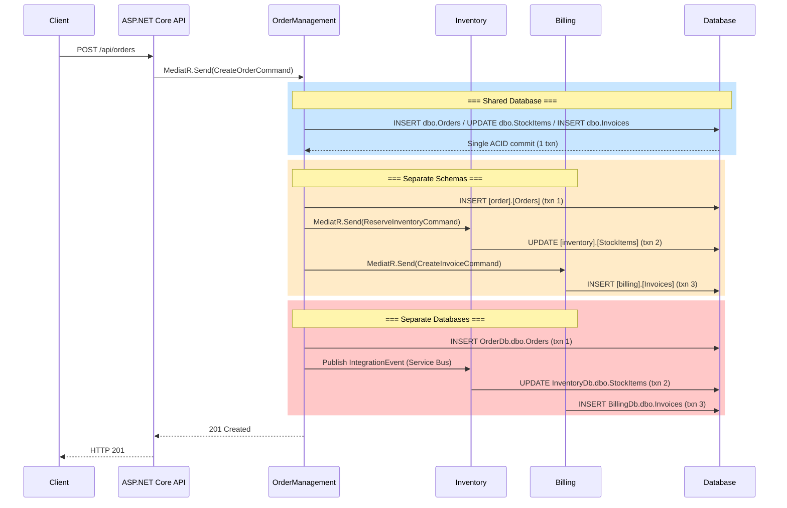
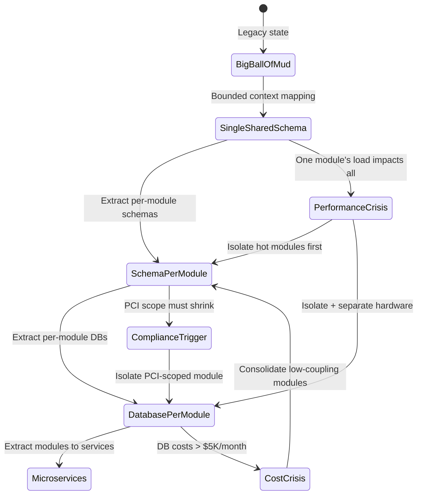
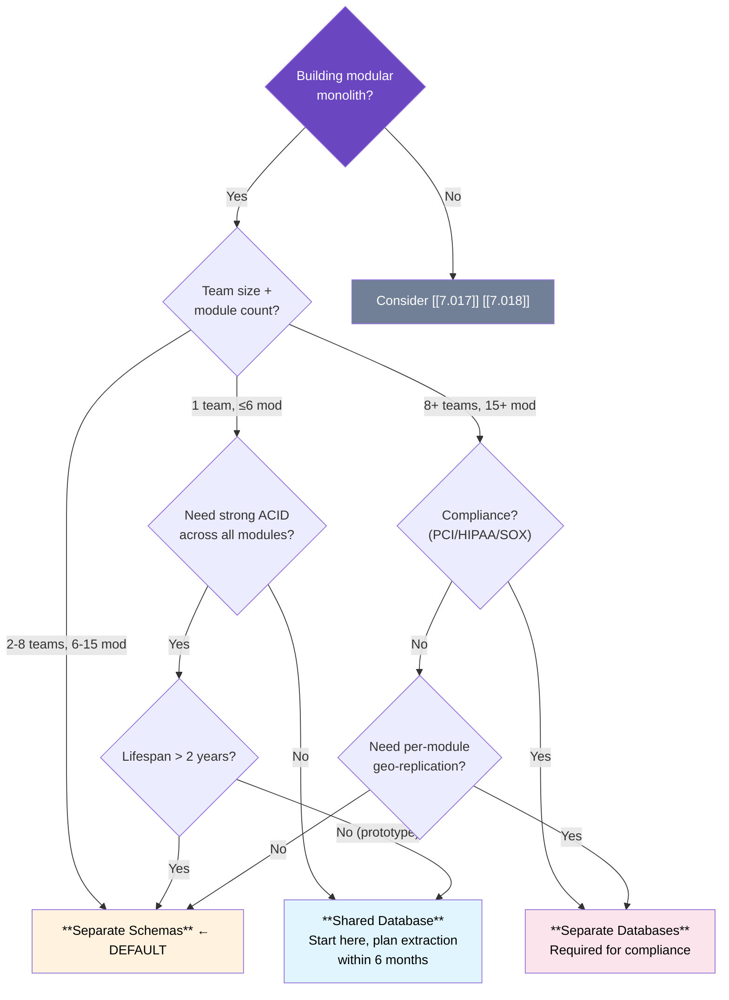

> [!success] Mastery Check
> - [ ] **Studied Well**
> - [ ] **Can explain the concept without notes**
> - [ ] **Can answer interview questions confidently**
> - [ ] **Can implement it in a real project**


> **Domain 7 · Group 1 — Clean Architecture and Layering**
> *Priority: 1 · Version: 2*

# 7.019 — Modular Monolith — Shared Kernel vs Separate Data

---

## Section 0 — Quick Reference Card

> [!ABSTRACT] Quick Reference Card
> **Modular Monolith — Shared Kernel vs Separate Data** addresses the central data architecture decision: how do modules own and access their data? Three strategies exist on a spectrum from tight coupling to full isolation.
>
> | Aspect | Shared Database | Separate Schemas | Separate Databases |
> |---|---|---|---|
> | **Physical isolation** | Same DB, same schema | Same DB server, per-module schema | Separate DB servers |
> | **Cross-module queries** | Native SQL joins | Native SQL joins (cross-schema) | Application-layer joins |
> | **Consistency model** | Strong (ACID across all) | Strong (ACID per-schema) | Eventual across modules |
> | **Distributed txns** | Never required | Never required | Required for multi-module writes |
> | **Module deploy coupling** | Tight (migrations conflict) | Medium (DDL isolated) | Loose (DB independent) |
> | **Operational cost (10 mod)** | 1× baseline | ~1.2× baseline | ~3–5× baseline |
> | **Team autonomy** | Low | Medium | High |
> | **Module count ceiling** | 6–8 modules | 15–25 modules | 40+ modules |
> | **Migration to microservices** | High friction | Medium friction | Low friction (1:1 DB) |
>
> **Shared Kernel (DDD):** The subset of domain concepts that MUST cross module boundaries — base abstractions (`Entity<TId>`, `ValueObject`, `DomainEvent`), type-safe identifiers (`OrderId`, `CustomerId`), common value objects (`Money`, `Address`, `Currency`), and repository interfaces (`IRepository<T>`). The shared kernel is NOT the database — it is the domain contract. Even with separate databases, modules still share kernel types.
>
> **Decision Heuristic:**
> - **Team size ≤5, modules ≤6, strong consistency required →** Shared Database
> - **Teams 2–8, modules 6–15, moderate autonomy →** Separate Schemas (sweet spot)
> - **Teams ≥8, modules >15, compliance scoped →** Separate Databases
> - **Shared kernel should be ≤3% of total LOC** — exceed 5% means misidentified bounded contexts
>
> **Key Numbers:**
> - Cross-schema query on Azure SQL: 3–8ms (vs 15–50ms cross-database)
> - EF Core transaction escalation to distributed: triggers at 2nd DbContext in same TransactionScope
> - Schema-per-module CI/CD gate: ~2s per module via NetArchTest
> - Cost delta: Separate DBs for 10 modules = ~$1,500/mo vs $300/mo for single Azure SQL S4
> - Migration friction: Shared → Schemas ≈ 2 weeks; Shared → Separate DBs ≈ 6–8 weeks
>
> **Three Golden Rules:**
> 1. A module MUST own its data — no other module writes directly to its tables/schemas/containers.
> 2. Shared kernel MUST be append-only — adding new types is safe; modifying existing types requires 3+ module lead approvals.
> 3. Cross-module data reads MUST go through the owning module's public API (command/query), never through a direct database connection.

---

## Section 1 — Navigation & Context

### 1.1 Where This Fits

| Perspective | Context |
|---|---|
| **System Design** | After deciding on a modular monolith ([[7.017 — Modular Monolith — Internal Module Boundaries]]), the next decision is how modules own data. Mirrors [[7.010 — Database per Service Pattern]] but within a single process. |
| **Clean Architecture** | Data architecture must respect the Dependency Rule: domain never references infrastructure. Modules access each other's data through application-layer commands/queries ([[7.018 — Modular Monolith — Inter-Module Communication]]). |
| **DDD Strategic Design** | The Shared Kernel pattern ([[7.023 — Modular Monolith — Shared Kernel — What to Share and What Not To]]) is the DDD solution to the tension between module autonomy and shared domain concepts. |
| **Production Career** | The shared kernel vs separate data decision is the #1 question at staff+ interviews for monolith-to-microservices migration roles (Microsoft, Thoughtworks, AWS ProServe). |

### 1.2 Production Encounter Map

> [!INFO] Production Encounter Map
> You will face this decision in these real-world scenarios:
>
> | Scenario | Typical Trigger | Frequency |
> |---|---|---|
> | **Modular monolith startup** | Team must decide data architecture before first module | ★★★★★ |
> | **Monolith decomposition** | Refactoring "big ball of mud" into modules; data in single schema | ★★★★★ |
> | **Compliance boundary** | PCI DSS scope limited to specific modules; data must be isolated | ★★★★☆ |
> | **Team scaling pain** | 3+ teams stepping on each other's migrations | ★★★★☆ |
> | **Performance contention** | One module's query load impacts another's response times | ★★★☆☆ |
> | **Pre-microservices extraction** | Planning to extract a module; data separation is first step | ★★★☆☆ |
> | **Azure migration** | Moving to Azure; choosing single Azure SQL vs elastic pool vs Cosmos DB per module | ★★★☆☆ |
>
> **Typical timeline for 500K LOC → separate-schema modular monolith:**
> - Week 1–2: Bounded context mapping + shared kernel identification
> - Week 3–6: Schema separation per module + migration scripts
> - Week 7–20: Code migration (repositories, DbContexts, queries)
> - Week 21–24: Migration of cross-schema queries to application-layer joins
> - **Total: 5–6 months for 4 engineers**

### 1.3 Navigation Map

```mermaid
graph LR
    subgraph "Prerequisites"
        P1["[[7.017]] Module Boundaries"]
        P2["[[7.018]] Inter-Module Comm"]
        P3["[[7.005]] DDD Foundations"]
        P4["[[7.010]] DB per Service"]
    end
    CENTER["7.019<br/>Shared Kernel vs Separate Data<br/>(You are here)"]
    subgraph "Related"
        R1["[[7.020]] Migration to Microservices"]
        R2["[[7.023]] Shared Kernel — Deep Dive"]
        R3["[[7.025]] CQRS and Event Sourcing"]
        R4["[[7.030]] Saga Pattern"]
        R5["[[3.042]] Azure SQL DTU vs vCore"]
    end
    P1 --> CENTER; P2 --> CENTER; P3 --> CENTER; P4 --> CENTER
    CENTER --> R1; CENTER --> R2; CENTER --> R3; CENTER --> R4; CENTER --> R5
    style CENTER fill:#6b46c1,color:#fff,stroke:#4a3199,stroke-width:3px
    style P1 fill:#2b6cb0,color:#fff; style P2 fill:#2b6cb0,color:#fff
    style P3 fill:#2b6cb0,color:#fff; style P4 fill:#2b6cb0,color:#fff
    style R1 fill:#276749,color:#fff; style R2 fill:#276749,color:#fff
    style R3 fill:#276749,color:#fff; style R4 fill:#276749,color:#fff; style R5 fill:#744210,color:#fff
```

---

## Section 2 — Core Mental Model

### 2.1 The Central Insight

> [!TIP] Non-Obvious Insight
> **The shared kernel is NOT about the database — it is about which domain concepts are so fundamental that they must be understood identically by every module. The database strategy is ORTHOGONAL to the shared kernel decision.**
>
> Teams consistently conflate two separate concerns:
> 1. **Data Storage Topology** — how many databases/schemas and where data lives (shared DB, separate schemas, separate DBs)
> 2. **Domain Contract Sharing** — which types and abstractions cross module boundaries (shared kernel)
>
> You can have a shared kernel with separate databases (ideal). You can have NO shared kernel with a single shared database (tight coupling disguised as modules).
>
> | | No Shared Kernel | Lean Shared Kernel (≤3%) | Bloated (>5%) |
> |---|---|---|---|
> | **Shared Database** | Big ball of mud | Workable but tight data coupling | Data + domain coupling nightmare |
> | **Separate Schemas** | Awkward (duplicate types) | ★ IDEAL default | Schema isolation helps but kernel changes hurt |
> | **Separate Databases** | Possible but frustrating | Good for regulated domains | Expensive (every kernel change is cross-DB) |
>
> The non-obvious consequence: **a bloated shared kernel is worse than a shared database.** A shared database can be untangled schema-by-schema. A bloated shared kernel (10%+ of codebase) creates a dependency hell where no module can evolve independently. The shared kernel is the MOST COUPLED component; it deserves the highest change governance.

### 2.2 Classification

| Dimension | Shared Database | Separate Schemas | Separate Databases |
|---|---|---|---|
| **Deployment** | 1 DB server, 1 schema | 1 DB server, N schemas | N DB servers |
| **Data isolation** | None (tables mixed) | Logical (schema boundary) | Physical (server/instance) |
| **Consistency** | Strong (ACID across all) | Strong (ACID per schema) | Strong per DB, eventual across |
| **Query pattern** | Native SQL joins | 3-part name joins (`[schema].[table]`) | Application-layer composition |
| **Migration autonomy** | None (single migration set) | Per-schema migrations | Per-DB migrations |
| **Module reference coupling** | None enforced | Schema name convention | Connection string per module |
| **Team coordination** | Required for every change | Only for cross-schema queries | Only for integration events |
| **Test isolation** | Shared test database | Schema-per-test-class | DB-per-test-class |
| **Microservice extraction** | Painful (split data) | Moderate (move schema) | Trivial (DB already isolated) |
| **EF Core mapping** | Single `DbContext` | Multiple `DbContext` per schema | Multiple `DbContext` per connection |

### 2.3 Shared vs Separate Data Architecture

```mermaid
graph TD
    subgraph "Decision: Shared Kernel Contents"
        SK_DECISION{"What must be<br/>shared?"}
        SK_DECISION --> BASE["Base:<br/>Entity&lt;TId&gt;, ValueObject,<br/>DomainEvent, AggregateRoot"]
        SK_DECISION --> ID["IDs:<br/>OrderId, CustomerId,<br/>ProductId, Sku"]
        SK_DECISION --> VO["VOs:<br/>Money, Address,<br/>Currency, Percentage"]
        SK_DECISION --> IF["Abstractions:<br/>IRepository&lt;T&gt;, IUnitOfWork"]
        SK_DECISION --> DS["Services:<br/>ICurrencyConverter,<br/>ISystemClock"]
    end
    subgraph "Data Architecture Decision"
        D{"How is data<br/>stored?"}
        D --> SH["Shared Database<br/>dbo.* all tables"]
        D --> SC["Separate Schemas<br/>[order].[Orders]<br/>[inv].[StockItems]"]
        D --> SD["Separate Databases<br/>OrderDb, InventoryDb,<br/>BillingDb"]
    end
    SH --> SHB["✅ Native joins, ACID<br/>❌ Schema coupling<br/>❌ Migration conflicts"]
    SC --> SCB["✅ Logical isolation<br/>✅ Cross-schema queries<br/>❌ Still one server"]
    SD --> SDB["✅ Full isolation<br/>✅ Independent scaling<br/>❌ 5x cost, dist txns"]
    style BASE fill:#805ad5,color:#fff; style ID fill:#805ad5,color:#fff
    style VO fill:#805ad5,color:#fff; style IF fill:#805ad5,color:#fff; style DS fill:#805ad5,color:#fff
    style SH fill:#e1f5fe,color:#000; style SC fill:#fff3e0,color:#000; style SD fill:#fce4ec,color:#000
```

### 2.4 Cross-Module Data Access Patterns



### 2.5 Numbers That Matter

| Metric | Shared DB | Separate Schemas | Separate DBs | Source |
|---|---|---|---|---|
| **Cross-module query latency** | 2–5ms | 3–8ms | 15–50ms | Azure SQL S4, 10 concurrent |
| **Cross-module txn commit** | 3–10ms | 8–25ms | 50–200ms | EF Core, 5 tables, 100 rows |
| **Report query complexity** | 1 SQL JOIN | 1 SQL JOIN (3-part) | N app calls + assembly | Order + Inventory + Billing |
| **Team coordination/sprint** | 4–8h | 1–2h | 0–1h | 3 teams, 6 modules, 500K LOC |
| **Connection count (idle)** | 10–20 | 10–20 | 20–80 | 10 modules |
| **Migration conflicts** | 1 per 3–5 sprints | 1 per 10–15 sprints | Near zero | 4 engineer team |
| **Backup/restore duration** | 15–45min | 15–45min | 3–8min per DB (parallel) | 50 GB data |
| **Min Azure SQL tier** | S2 (50 DTU) | S3 (100 DTU) | S2 per module | 10 modules, 100 concurrent users |
| **Geo-replication cost** | 1× base | 1× base | N× base | Azure SQL active geo-replication |

### 2.6 Key Properties

- **Shared kernel is a set of domain contract types, not a database.** It includes base abstractions, typed IDs, shared value objects, and repository interfaces. Lives in a separate assembly with strictest change governance.
- **Data architecture is on a spectrum.** Teams can start with shared database and migrate to separate schemas module-by-module. The three approaches are waypoints, not static endpoints.
- **Separate schemas is the default recommendation** for most organizations (2–8 teams, 6–15 modules): logical isolation, cross-schema queries, and avoids per-DB operational cost.
- **Consistency guarantee decreases as isolation increases.** Shared DB = ACID across all modules. Schemas = ACID per schema, eventual across. Separate DBs = strong per DB only.
- **The shared kernel is the most coupled component.** Every type is consumed by every module. A change to `Money` requires recompilation of ALL modules. This is by design — explicit, managed coupling.
- **The outbox pattern is mandatory for separate schemas/DBs.** Without an outbox, a crash after DB write but before event publication loses the event. See [[7.020 — Modular Monolith — Migration Path to Microservices]].
- **EF Core DbContext must match the module boundary.** One `DbContext` per module per database. A shared `DbContext` across modules violates module isolation.
- **Type-safe IDs prevent category errors.** `OrderId` and `CustomerId` are both `Guid`/`ulong` under the hood, but distinct types prevent passing one where the other is expected.

---

## Section 3 — Deep Mechanics

### 3.1 How It Works

The data architecture operates at three levels: the **shared kernel** (domain contract layer), the **storage topology** (database/schema per module), and the **access pattern** (how modules read/write each other's data).

**Level 1 — Shared Kernel Resolution at Compile Time:**

The shared kernel is a .NET class library with no dependencies other than `System.*` and `MediatR.Contracts`. Every module's Domain and Application projects reference it.

```xml
<!-- SharedKernel.csproj — the most constrained project in the solution -->
<Project Sdk="Microsoft.NET.Sdk">
  <PropertyGroup>
    <TargetFramework>net8.0</TargetFramework>
    <Nullable>enable</Nullable>
    <ImplicitUsings>enable</ImplicitUsings>
    <GenerateDocumentationFile>true</GenerateDocumentationFile>
  </PropertyGroup>
  <ItemGroup>
    <PackageReference Include="MediatR.Contracts" Version="2.0.1" />
    <!-- NO other dependencies — kernel is dependency-free -->
  </ItemGroup>
</Project>
```

**Level 2 — Storage Topology Configuration at Startup:**

The topology is determined by connection strings — not by code changes.

```json
// === Shared Database (single connection) ===
{ "ConnectionStrings": { "Default": "Server=tcp:orderserver.database.windows.net;Database=OrderProcessingDb;..." } }

// === Separate Schemas (same server, schema per module) ===
{ "ConnectionStrings": {
    "OrderManagement": "Server=tcp:orderserver.database.windows.net;Database=OrderProcessingDb;Schema=order",
    "InventoryService": "Server=tcp:orderserver.database.windows.net;Database=OrderProcessingDb;Schema=inventory",
    "Billing": "Server=tcp:orderserver.database.windows.net;Database=OrderProcessingDb;Schema=billing"
} }

// === Separate Databases (different servers) ===
{ "ConnectionStrings": {
    "OrderManagement": "Server=tcp:order-db.database.windows.net;Database=OrderDb;...",
    "InventoryService": "Server=tcp:inventory-db.database.windows.net;Database=InventoryDb;...",
    "Billing": "Server=tcp:billing-db.database.windows.net;Database=BillingDb;..."
} }
```

**Level 3 — Per-Module DbContext Registration:**

Each module registers its own `DbContext` targeting its connection string and schema:

```csharp
/// <summary>
/// Registers OrderManagement infrastructure including DbContext with schema-per-module.
/// </summary>
public static IServiceCollection AddOrderManagementInfrastructure(
    this IServiceCollection services,
    IConfiguration configuration)
{
    var connStr = configuration.GetConnectionString("OrderManagement")
        ?? throw new InvalidOperationException("OrderManagement connection string required.");

    services.AddDbContext<OrderManagementDbContext>((sp, options) =>
    {
        options.UseSqlServer(connStr, sqlOptions =>
        {
            sqlOptions.MigrationsHistoryTable("__EFMigrationsHistory", "order");
            sqlOptions.EnableRetryOnFailure(3);
            sqlOptions.CommandTimeout(30);
        });
    });

    services.AddScoped<IOrderRepository, OrderRepository>();
    services.AddScoped<IUnitOfWork>(sp => sp.GetRequiredService<OrderManagementDbContext>());
    return services;
}
```

**Level 4 — Cross-Module Data Access:**

When `OrderManagement` needs data from `InventoryService`, it sends a command via MediatR:

```csharp
var command = new CheckInventoryAvailabilityCommand(orderItems.Select(i => i.Sku));
var result = await _mediator.Send(command, cancellationToken);
// InventoryService handler executes its OWN query against ITS OWN schema
```

This indirection is the fundamental pattern. Even with a shared database, modules should NOT directly query another module's tables.

**The EF Core DbContext Isolation Pattern:**

```csharp
/// <summary>
/// DbContext for OrderManagement module. Maps ONLY OrderManagement entities.
/// No references to Inventory, Billing, or other module entities.
/// </summary>
public sealed class OrderManagementDbContext : DbContext, IUnitOfWork
{
    public DbSet<OrderAggregate> Orders => Set<OrderAggregate>();

    public OrderManagementDbContext(DbContextOptions<OrderManagementDbContext> options) : base(options) { }

    protected override void OnModelCreating(ModelBuilder modelBuilder)
    {
        modelBuilder.HasDefaultSchema("order"); // Explicit schema per module

        modelBuilder.Entity<OrderAggregate>(entity =>
        {
            entity.ToTable("Orders");
            entity.HasKey(e => e.Id);
            entity.Property(e => e.Id).HasConversion(id => id.Value, v => OrderId.From(v));
            entity.OwnsOne(e => e.TotalAmount, money =>
            {
                money.Property(m => m.Amount).HasColumnName("TotalAmount").HasPrecision(18, 4);
                money.OwnsOne(m => m.Currency, c =>
                {
                    c.Property(cu => cu.Code).HasColumnName("CurrencyCode").HasMaxLength(3);
                    c.Ignore(cu => cu.Symbol);
                });
            });
            entity.Property(e => e.Status).HasConversion<string>().HasMaxLength(50);
        });
    }
}
```

### 3.2 Protocol Trace

**Happy Path — Shared Database:**

```
Step 1: Client → POST /api/orders
Step 2: API → OrdersController
Step 3: Controller → MediatR.Send(CreateOrderCommand)
Step 4: Handler → OrderAggregate.Create(customerId, items)
         Domain: creates aggregate, adds OrderPlacedDomainEvent
Step 5: Handler → _orderRepo.AddAsync(order) + SaveChangesAsync
         SQL: BEGIN TRAN → INSERT dbo.Orders → UPDATE dbo.StockItems → INSERT dbo.Invoices → COMMIT
Step 6: Handler → Publish(OrderPlacedIntegrationEvent)
Step 7: Controller → 201 Created
Total: 25–40ms (single ACID transaction across 3 tables)
```

**Happy Path — Separate Schemas:**

```
Step 1-4: Same as above
Step 5: Handler → _orderRepo.AddAsync + SaveChanges → COMMIT [order] schema (txn 1)
Step 6: Handler → MediatR.Send(ReserveInventoryCommand) ← Cross-module
Step 7: InventoryHandler → _stockRepo.ReserveAsync + SaveChanges → COMMIT [inventory] (txn 2)
Step 8: Handler → MediatR.Send(CreateInvoiceCommand)
Step 9: BillingHandler → SaveChanges → COMMIT [billing] (txn 3)
Step 10: Controller → 201 Created
Total: 35–65ms (3 separate transactions)
Note: If step 7 fails, step 5 is NOT rolled back. Compensating action needed.
```

**Happy Path — Separate Databases:**

```
Step 1-4: Same as above
Step 5: Handler → SaveChanges → COMMIT to OrderDb (txn 1)
Step 6: Handler → MediatR.Send(ReserveInventoryCommand)
Step 7: InventoryHandler → SaveChanges → COMMIT to InventoryDb (txn 2)
Step 8: Handler → Publish integration event to Azure Service Bus
Step 9: Billing picks up from Service Bus → COMMIT to BillingDb (txn 3)
Total: 70–250ms (3 DB connections, Service Bus, eventual consistency)
```

**Failure Path — Inventory Reservation Fails (All Approaches):**

```
Step 1-4: Same (order created in memory)
Step 5: Handler → MediatR.Send(ReserveInventoryCommand)
Step 6: StockItem.Reserve(2) → insufficient stock (available: 0)
Step 7: Handler → Result.Failure(InventoryShortageError)
Step 8: Controller → HTTP 422 Unprocessable Entity
Total: 8–15ms (no DB write — nothing to roll back)
```

### 3.3 State Transitions



### 3.4 Failure Modes

> [!DANGER] Failure Mode 1: Direct Cross-Module Table Write Causes Deadlock
> **3AM Signal:** `SqlException (1205): Transaction was deadlocked on lock resources with another process.` Stack trace shows OrderManagement.dll writing to `inventory.StockItems`. Deadlock at 2:47 AM during flash sale. 30% of orders fail.
>
> **Root Cause:** Developer added direct `UPDATE dbo.StockItems` in OrderRepository instead of going through MediatR. Both modules' DbContexts track the same table. EF Core's optimistic concurrency conflicts with SQL Server lock manager.
>
> **Detection:** Application Insights shows OrderManagement.dll calling `inventory.StockItems` table. Azure SQL Dashboard deadlock graph shows two SPIDs contending on same page.
>
> **Fix:** 1. Apply read-only permissions for OrderManagement's SQL user on inventory schema. 2. Add NetArchTest rule: `Types.InAssembly("OrderManagement").ShouldNot().ResideInNamespace("InventoryService")`. 3. Route all cross-module access through MediatR.

> [!DANGER] Failure Mode 2: Shared Kernel Breaking Change Blocks Deployment
> **3AM Signal:** Deployment fails in staging. NetArchTest reports: `Types that depend on SharedKernel.Money must not have breaking changes.` Then: `InventoryService references SharedKernel v4.1.0 but OrderManagement requires v4.2.0. Assembly binding conflict.` Pipeline blocked for 6 hours.
>
> **Root Cause:** Billing team developer changed `Money.CurrencyCode` from `string` to `Currency` type. Required every module using `Money` to update serialization, mapping, and comparison logic. No cross-team notification.
>
> **Fix:** 1. Establish Shared Kernel governance board: 3+ module leads approve changes. 2. Enforce semantic versioning. 3. NetArchTest rule: `Types.InAssembly("SharedKernel").Should().BeAppendOnly()`. 4. Run shared kernel compatibility tests against ALL module versions.

> [!DANGER] Failure Mode 3: Accidental Distributed Transaction Escalation (MSDTC)
> **3AM Signal:** `TransactionAbortedException: MSDTC transaction manager not available.` 30% of orders fail during flash sale. Revenue loss: ~$12,000 in 10 minutes.
>
> ```csharp
> // ❌ DANGEROUS — escalates to distributed transaction
> using var scope = new TransactionScope(TransactionScopeAsyncFlowOption.Enabled);
> await _orderRepo.AddAsync(order, ct);       // Connection 1 (OrderDbContext)
> await _mediator.Send(reserveCommand, ct);    // Connection 2 (InventoryDbContext) ← ESCALATION
> await _unitOfWork.SaveChangesAsync(ct);
> scope.Complete();
> ```
>
> **Root Cause:** `TransactionScope` wraps operations against two `DbContext` instances with different connection strings. EF Core opens a second connection, `TransactionScope` escalates to MSDTC. Azure SQL Database does NOT support MSDTC.
>
> **Fix:** 1. Never use `TransactionScope` across module boundaries. 2. Each module's `SaveChangesAsync` is its own transaction. 3. Implement saga pattern ([[7.030 — Saga Pattern and Choreography]]). 4. NetArchTest rule: `Types.ShouldNot().UseTransactionScope()`.

> [!DANGER] Failure Mode 4: Schema Collision — Two Modules Claim Same Table Name
> **3AM Signal:** Data integrity check shows `[order].[Orders].Count = 0` — but orders were placed. Investigation reveals `[shipping].[Orders]` has the data. The query joined `[order].[Orders]` which is empty because Shipping module's migration overwrote it.
>
> **Root Cause:** Shipping module's entity was not configured with explicit `ToTable("Orders", "shipping")`, defaulting to `[dbo].[Orders]` which collided with OrderManagement's existing table. EF Core silently resolved to `[shipping].[Orders]` via migration rename, but data was in the wrong schema.
>
> **Fix:** 1. Always specify `ToTable("TableName", "schema")` explicitly for every entity. 2. Add CI script: `SELECT TABLE_NAME, TABLE_SCHEMA FROM INFORMATION_SCHEMA.TABLES WHERE TABLE_NAME IN (SELECT TABLE_NAME FROM INFORMATION_SCHEMA.TABLES GROUP BY TABLE_NAME HAVING COUNT(*) > 1)` — must return 0 rows. 3. NetArchTest rule: `Entities should have explicit schema mapping`.

> [!DANGER] Failure Mode 5: Azure SQL Elastic Pool DTU Contention
> **3AM Signal:** Azure Monitor: `elastic_pool_dtu_consumption_percent = 100%`. Billing module's nightly invoice batch (`UPDATE Invoices SET ... WHERE Status = 'Pending'`) consumes all DTU. OrderManagement queries time out at 5 seconds. Customer-facing errors for 15–30 minutes nightly.
>
> **Root Cause:** Billing and OrderManagement share the same Azure SQL elastic pool. The batch scan of millions of rows consumes all 200 DTU, starving OrderManagement's OLTP queries.
>
> **Fix:** 1. Move Billing module to its own Azure SQL database: `az sql db create --resource-group prod-rg --server billing-db --name BillingDb --service-objective S4`. 2. Use separate elastic pools for OLTP vs Batch workloads. 3. Schedule batch jobs during low-traffic windows.

### 3.5 .NET and Azure Integration Points

| Aspect | .NET Mechanism | Azure Integration |
|---|---|---|
| **Shared kernel packaging** | `SharedKernel.csproj` as `<ProjectReference>` or NuGet | Azure Artifacts feed, semantic versioning |
| **Per-module DbContext** | `DbContext` per module, `UseSqlServer()` or `UseCosmos()` | Azure SQL (elastic pool) or Azure Cosmos DB per module |
| **Schema-per-module** | `HasDefaultSchema("module")` + `ToTable("Table","schema")` | Azure SQL schema namespace, per-schema SQL users |
| **Cross-module queries** | `IMediator.Send()` to owning module's handler | Azure SQL 3-part name queries for read-only reporting |
| **Distributed transactions** | No `TransactionScope` across modules; saga pattern | Azure Service Bus for saga; SQL Managed Instance if MSDTC required |
| **Outbox pattern** | EF Core interceptor + `BackgroundService` | Azure Service Bus `SendAsync`; Azure Functions for outbox relay |
| **Database migrations** | `dotnet ef migrations add` per DbContext | Azure DevOps migration scripts per module |
| **Module health checks** | `IHealthCheck` per DbContext | Azure Monitor health probes per module DB |
| **Testing isolation** | Testcontainers + Respawn | Azure SQL DTU-limited elastic pool for perf testing |
| **Query performance** | EF Core `CompiledQuery` | Azure SQL Query Performance Insight per schema |
| **Secrets management** | `Azure.Identity.DefaultAzureCredential` | Azure Key Vault per-module connection strings |
| **Geo-replication** | Not handled by .NET | Azure SQL Active Geo-Replication per database |

---

## Section 4 — Production Patterns and Implementation

### 4.1 Primary Implementation — Shared Kernel with Separate Schemas

#### Shared Kernel Assembly

```csharp
// SharedKernel/Entity.cs
namespace SharedKernel;

/// <summary>
/// Base class for all domain entities. Provides identity comparison and domain event collection.
/// </summary>
/// <typeparam name="TId">The type of the entity identifier.</typeparam>
public abstract class Entity<TId> : IEquatable<Entity<TId>> where TId : notnull
{
    private readonly List<DomainEvent> _domainEvents = [];

    public TId Id { get; protected set; }
    public IReadOnlyCollection<DomainEvent> DomainEvents => _domainEvents.AsReadOnly();

    protected Entity(TId id) => Id = id;

    /// <summary>Protected parameterless constructor for EF Core deserialization.</summary>
    protected Entity() { }

    /// <summary>Registers a domain event to be dispatched after the aggregate is persisted.</summary>
    protected void AddDomainEvent(DomainEvent domainEvent) => _domainEvents.Add(domainEvent);

    /// <summary>Clears all registered domain events after dispatch.</summary>
    public void ClearDomainEvents() => _domainEvents.Clear();

    public override bool Equals(object? obj) => obj is Entity<TId> other && EqualityComparer<TId>.Default.Equals(Id, other.Id);
    public bool Equals(Entity<TId>? other) => other is not null && EqualityComparer<TId>.Default.Equals(Id, other.Id);
    public override int GetHashCode() => HashCode.Combine(Id);
    public static bool operator ==(Entity<TId>? left, Entity<TId>? right) => left?.Equals(right) ?? right is null;
    public static bool operator !=(Entity<TId>? left, Entity<TId>? right) => !(left == right);
}
```

```csharp
// SharedKernel/ValueObject.cs
namespace SharedKernel;

/// <summary>
/// Base class for value objects. Equality is based on all member fields.
/// </summary>
public abstract class ValueObject : IEquatable<ValueObject>
{
    /// <summary>Returns the atomic values defining this value object's equality.</summary>
    protected abstract IEnumerable<object?> GetEqualityComponents();

    public override bool Equals(object? obj) =>
        obj is ValueObject other && GetEqualityComponents().SequenceEqual(other.GetEqualityComponents());
    public bool Equals(ValueObject? other) =>
        other is not null && GetEqualityComponents().SequenceEqual(other.GetEqualityComponents());
    public override int GetHashCode() =>
        GetEqualityComponents().Select(v => v?.GetHashCode() ?? 0)
            .Aggregate(17, (current, next) => current * 31 + next);
    public static bool operator ==(ValueObject? left, ValueObject? right) => left?.Equals(right) ?? right is null;
    public static bool operator !=(ValueObject? left, ValueObject? right) => !(left == right);
}
```

```csharp
// SharedKernel/DomainEvent.cs
namespace SharedKernel;

/// <summary>
/// Base record for all domain events. Implements MediatR.INotification for in-process dispatch.
/// </summary>
public abstract record DomainEvent : MediatR.INotification
{
    public DateTime OccurredAtUtc { get; } = DateTime.UtcNow;
    public Guid EventId { get; } = Guid.NewGuid();
}
```

```csharp
// SharedKernel/AggregateRoot.cs
namespace SharedKernel;

/// <summary>
/// Base class for aggregate roots. Adds factory method convention to Entity{TId}.
/// </summary>
/// <typeparam name="TId">The aggregate root identifier type.</typeparam>
public abstract class AggregateRoot<TId> : Entity<TId> where TId : notnull
{
    protected AggregateRoot(TId id) : base(id) { }
    protected AggregateRoot() { }
}
```

```csharp
// SharedKernel/TypedId.cs
namespace SharedKernel;

/// <summary>Type-safe identifier value object.</summary>
public abstract record TypedId<T>(T Value) where T : notnull;
```

```csharp
// SharedKernel/Money.cs
namespace SharedKernel;

/// <summary>Value object representing a monetary amount in a specific currency.</summary>
public sealed record Money : ValueObject
{
    public decimal Amount { get; }
    public Currency Currency { get; }

    private Money(decimal amount, Currency currency)
    {
        if (amount < 0) throw new ArgumentException("Amount cannot be negative.", nameof(amount));
        Amount = amount;
        Currency = currency ?? throw new ArgumentNullException(nameof(currency));
    }

    public static Money FromDecimal(decimal amount, Currency currency) => new(amount, currency);
    public static Money FromSmallestUnit(long smallestUnit, Currency currency) => new(smallestUnit / 100m, currency);
    public static Money Zero => new(0, Currency.Usd);

    public Money Add(Money other)
    {
        if (Currency != other.Currency)
            throw new ArgumentException($"Currency mismatch: {Currency.Code} vs {other.Currency.Code}");
        return new Money(Amount + other.Amount, Currency);
    }

    public static Money operator +(Money left, Money right) => left.Add(right);

    protected override IEnumerable<object?> GetEqualityComponents() { yield return Amount; yield return Currency; }
    public override string ToString() => $"{Currency.Symbol}{Amount:F2}";
}
```

```csharp
// SharedKernel/Currency.cs
namespace SharedKernel;

/// <summary>Value object representing an ISO 4217 currency code.</summary>
public sealed record Currency : ValueObject
{
    public string Code { get; }
    public string Symbol { get; }

    private Currency(string code, string symbol) { Code = code; Symbol = symbol; }

    public static Currency Usd => new("USD", "$");
    public static Currency Eur => new("EUR", "€");
    public static Currency Gbp => new("GBP", "£");

    public static Currency FromCode(string code) => code.ToUpperInvariant() switch
    {
        "USD" => Usd, "EUR" => Eur, "GBP" => Gbp, _ => new(code, code)
    };

    protected override IEnumerable<object?> GetEqualityComponents() { yield return Code; }
}
```

```csharp
// SharedKernel/IRepository.cs
namespace SharedKernel;

/// <summary>Generic repository interface for aggregate persistence.</summary>
public interface IRepository<TAggregate, TId>
    where TAggregate : AggregateRoot<TId>
    where TId : notnull
{
    Task<TAggregate?> GetByIdAsync(TId id, CancellationToken cancellationToken = default);
    Task AddAsync(TAggregate aggregate, CancellationToken cancellationToken = default);
    void Update(TAggregate aggregate);
    void Delete(TAggregate aggregate);
}
```

```csharp
// SharedKernel/IUnitOfWork.cs
namespace SharedKernel;

/// <summary>Unit of work abstraction for committing pending changes.</summary>
public interface IUnitOfWork
{
    Task<int> SaveChangesAsync(CancellationToken cancellationToken = default);
}
```

```csharp
// SharedKernel/Result.cs
namespace SharedKernel;

/// <summary>Result monad for operation outcome without exceptions.</summary>
public sealed record Result<T>
{
    public T? Value { get; }
    public Error? Error { get; }
    public bool IsSuccess { get; }
    public bool IsFailure => !IsSuccess;

    private Result(T value) { Value = value; IsSuccess = true; }
    private Result(Error error) { Error = error; IsSuccess = false; }

    public static Result<T> Success(T value) => new(value);
    public static Result<T> Failure(Error error) => new(error);
}

/// <summary>Base class for domain errors.</summary>
public abstract record Error(string Code, string Message);

/// <summary>Error indicating a domain rule violation.</summary>
public sealed record DomainError(string Message) : Error("DOMAIN_ERROR", Message);

/// <summary>Error indicating a resource was not found.</summary>
public sealed record NotFoundError(string Message) : Error("NOT_FOUND", Message);
```

#### Module: CatalogManagement

```csharp
// CatalogManagement.Domain/Aggregates/Product.cs
namespace CatalogManagement.Domain.Aggregates;

using SharedKernel;

/// <summary>A product in the catalog. Managed by the CatalogManagement module.</summary>
public sealed class Product : AggregateRoot<ProductId>
{
    public string Name { get; private set; }
    public Sku Sku { get; private set; }
    public Money UnitPrice { get; private set; }
    public Category Category { get; private set; }
    public bool IsActive { get; private set; }
    public DateTime CreatedAtUtc { get; private set; }

    private Product(ProductId id, string name, Sku sku, Money unitPrice, Category category) : base(id)
    {
        Name = name ?? throw new ArgumentNullException(nameof(name));
        Sku = sku ?? throw new ArgumentNullException(nameof(sku));
        UnitPrice = unitPrice ?? throw new ArgumentNullException(nameof(unitPrice));
        Category = category ?? throw new ArgumentNullException(nameof(category));
        IsActive = true;
        CreatedAtUtc = DateTime.UtcNow;
    }

    /// <summary>Creates a new product and publishes ProductCreatedDomainEvent.</summary>
    public static Product Create(string name, Sku sku, Money unitPrice, Category category)
    {
        var product = new Product(ProductId.New(), name, sku, unitPrice, category);
        product.AddDomainEvent(new ProductCreatedDomainEvent(product.Id, product.Sku));
        return product;
    }

    /// <summary>Updates the product price. Publishes PriceChangedDomainEvent.</summary>
    public void UpdatePrice(Money newPrice)
    {
        if (UnitPrice == newPrice) return;
        var oldPrice = UnitPrice;
        UnitPrice = newPrice ?? throw new ArgumentNullException(nameof(newPrice));
        AddDomainEvent(new ProductPriceChangedDomainEvent(Id, Sku, oldPrice, newPrice));
    }

    /// <summary>Deactivates the product.</summary>
    public void Deactivate()
    {
        if (!IsActive) return;
        IsActive = false;
        AddDomainEvent(new ProductDeactivatedDomainEvent(Id, Sku));
    }
}
```

```csharp
// CatalogManagement.Application/Products/Queries/GetProductPricesQuery.cs
namespace CatalogManagement.Application.Products.Queries;

using MediatR;
using SharedKernel;

/// <summary>
/// PUBLIC query — any module can request product prices by SKU.
/// This is the cross-module data access contract.
/// </summary>
public sealed record GetProductPricesQuery(IReadOnlyList<string> Skus) : IRequest<Result<IReadOnlyList<ProductPriceDto>>>;

public sealed record ProductPriceDto(string Sku, decimal UnitPrice, string CurrencyCode);

/// <summary>Handles GetProductPricesQuery. INTERNAL to CatalogManagement.</summary>
internal sealed class GetProductPricesQueryHandler : IRequestHandler<GetProductPricesQuery, Result<IReadOnlyList<ProductPriceDto>>>
{
    private readonly IProductRepository _productRepository;
    private readonly ILogger<GetProductPricesQueryHandler> _logger;

    public GetProductPricesQueryHandler(IProductRepository productRepository, ILogger<GetProductPricesQueryHandler> logger)
    {
        _productRepository = productRepository;
        _logger = logger;
    }

    public async Task<Result<IReadOnlyList<ProductPriceDto>>> Handle(GetProductPricesQuery request, CancellationToken cancellationToken)
    {
        _logger.LogInformation("Looking up prices for {SkuCount} SKUs", request.Skus.Count);
        var skus = request.Skus.Select(Sku.Create).ToList();
        var products = await _productRepository.GetBySkusAsync(skus, cancellationToken);

        if (products.Count == 0)
            return Result<IReadOnlyList<ProductPriceDto>>.Failure(new NotFoundError("No products found for requested SKUs"));

        var result = products
            .Where(p => p.IsActive)
            .Select(p => new ProductPriceDto(p.Sku.Value, p.UnitPrice.Amount, p.UnitPrice.Currency.Code))
            .ToList();

        return Result<IReadOnlyList<ProductPriceDto>>.Success(result);
    }
}
```

#### Module: InventoryManagement

```csharp
// InventoryManagement.Domain/Aggregates/StockItem.cs
namespace InventoryManagement.Domain.Aggregates;

using SharedKernel;

/// <summary>A stockable item in inventory. Tracks on-hand, reserved, and available quantities.</summary>
public sealed class StockItem : AggregateRoot<StockItemId>
{
    public Sku Sku { get; private set; }
    public string WarehouseCode { get; private set; }
    public int QuantityOnHand { get; private set; }
    public int QuantityReserved { get; private set; }
    public int QuantityAvailable => QuantityOnHand - QuantityReserved;
    public int ReorderThreshold { get; private set; }
    public DateTime LastUpdatedUtc { get; private set; }

    private StockItem(StockItemId id, Sku sku, string warehouseCode, int quantityOnHand, int reorderThreshold) : base(id)
    {
        Sku = sku; WarehouseCode = warehouseCode; QuantityOnHand = quantityOnHand;
        QuantityReserved = 0; ReorderThreshold = reorderThreshold; LastUpdatedUtc = DateTime.UtcNow;
    }

    /// <summary>Creates a new stock item.</summary>
    public static StockItem Create(Sku sku, string warehouseCode, int initialQuantity, int reorderThreshold)
    {
        var item = new StockItem(StockItemId.New(), sku, warehouseCode, initialQuantity, reorderThreshold);
        item.AddDomainEvent(new StockItemCreatedDomainEvent(item.Id, item.Sku, initialQuantity));
        return item;
    }

    /// <summary>
    /// Reserves the specified quantity. Returns failure if insufficient stock.
    /// </summary>
    public Result<int> Reserve(int quantity)
    {
        if (quantity <= 0) return Result<int>.Failure(new DomainError("Reservation quantity must be positive."));
        if (QuantityAvailable < quantity)
            return Result<int>.Failure(new InventoryShortageError(Sku.Value, quantity, QuantityAvailable));

        QuantityReserved += quantity;
        LastUpdatedUtc = DateTime.UtcNow;

        if (QuantityAvailable <= ReorderThreshold)
            AddDomainEvent(new StockLowDomainEvent(Id, Sku, QuantityAvailable, ReorderThreshold));
        AddDomainEvent(new StockReservedDomainEvent(Id, Sku, quantity));
        return Result<int>.Success(QuantityReserved);
    }

    /// <summary>Confirms a reservation (removes from on-hand, clears reserved).</summary>
    public void ConfirmReservation(int quantity)
    {
        if (quantity > QuantityReserved) throw new DomainException($"Cannot confirm {quantity}: only {QuantityReserved} reserved.");
        QuantityOnHand -= quantity;
        QuantityReserved -= quantity;
        LastUpdatedUtc = DateTime.UtcNow;
    }
}
```

```csharp
// InventoryManagement.Application/Stock/Commands/ReserveStockCommand.cs
namespace InventoryManagement.Application.Stock.Commands;

using MediatR;
using SharedKernel;

/// <summary>PUBLIC contract: reserve stock across multiple SKUs. Sent by OrderManagement.</summary>
public sealed record ReserveStockCommand(IReadOnlyList<ReserveStockItemDto> Items) : IRequest<Result<StockReservationResultDto>>;
public sealed record ReserveStockItemDto(string Sku, int Quantity);
public sealed record StockReservationResultDto(Guid ReservationId, IReadOnlyList<ReservedItemDto> ReservedItems);
public sealed record ReservedItemDto(string Sku, int QuantityReserved, string WarehouseCode);

/// <summary>Handles stock reservation. INTERNAL to InventoryManagement.</summary>
internal sealed class ReserveStockCommandHandler : IRequestHandler<ReserveStockCommand, Result<StockReservationResultDto>>
{
    private readonly IStockItemRepository _stockItemRepository;
    private readonly IMediator _mediator;
    private readonly ILogger<ReserveStockCommandHandler> _logger;

    public ReserveStockCommandHandler(IStockItemRepository repo, IMediator mediator, ILogger<ReserveStockCommandHandler> logger)
    {
        _stockItemRepository = repo;
        _mediator = mediator;
        _logger = logger;
    }

    public async Task<Result<StockReservationResultDto>> Handle(ReserveStockCommand command, CancellationToken cancellationToken)
    {
        _logger.LogInformation("Processing stock reservation for {ItemCount} items", command.Items.Count);
        var reservedItems = new List<ReservedItemDto>();
        var skus = command.Items.Select(i => i.Sku).ToList();

        // Cross-module query: get product prices from CatalogManagement
        var priceQuery = new GetProductPricesQuery(skus);
        var priceResult = await _mediator.Send(priceQuery, cancellationToken);

        if (priceResult.IsFailure)
            return Result<StockReservationResultDto>.Failure(priceResult.Error);

        var priceLookup = priceResult.Value.ToDictionary(p => p.Sku);
        var missingSkus = skus.Where(s => !priceLookup.ContainsKey(s)).ToList();
        if (missingSkus.Count != 0)
            return Result<StockReservationResultDto>.Failure(new NotFoundError($"SKUs not found: {string.Join(", ", missingSkus)}"));

        foreach (var item in command.Items)
        {
            var sku = Sku.Create(item.Sku);
            var stockItem = await _stockItemRepository.GetBySkuAsync(sku, cancellationToken);
            if (stockItem is null)
                return Result<StockReservationResultDto>.Failure(new NotFoundError($"Stock not found for SKU {item.Sku}"));

            var reserveResult = stockItem.Reserve(item.Quantity);
            if (reserveResult.IsFailure)
                return Result<StockReservationResultDto>.Failure(reserveResult.Error);

            _stockItemRepository.Update(stockItem);
            reservedItems.Add(new ReservedItemDto(item.Sku, item.Quantity, stockItem.WarehouseCode));
        }

        await _stockItemRepository.SaveChangesAsync(cancellationToken);
        return Result<StockReservationResultDto>.Success(new StockReservationResultDto(Guid.NewGuid(), reservedItems));
    }
}
```

#### Infrastructure — DbContexts with Separate Schemas

```csharp
// CatalogManagement.Infrastructure/Data/CatalogDbContext.cs
namespace CatalogManagement.Infrastructure.Data;

using CatalogManagement.Domain.Aggregates;
using Microsoft.EntityFrameworkCore;
using SharedKernel;

/// <summary>EF Core DbContext for CatalogManagement module. Maps to [catalog] schema.</summary>
public sealed class CatalogDbContext : DbContext, IUnitOfWork
{
    public DbSet<Product> Products => Set<Product>();

    public CatalogDbContext(DbContextOptions<CatalogDbContext> options) : base(options) { }

    protected override void OnModelCreating(ModelBuilder modelBuilder)
    {
        modelBuilder.HasDefaultSchema("catalog");
        modelBuilder.Entity<Product>(entity =>
        {
            entity.ToTable("Products");
            entity.HasKey(e => e.Id);
            entity.Property(e => e.Id).HasConversion(id => id.Value, v => ProductId.From(v));
            entity.Property(e => e.Name).HasMaxLength(200).IsRequired();
            entity.OwnsOne(e => e.Sku, s => s.Property(x => x.Value).HasColumnName("Sku").HasMaxLength(50));
            entity.OwnsOne(e => e.UnitPrice, m =>
            {
                m.Property(x => x.Amount).HasColumnName("UnitPrice").HasPrecision(18, 4);
                m.OwnsOne(x => x.Currency, c =>
                {
                    c.Property(cu => cu.Code).HasColumnName("CurrencyCode").HasMaxLength(3);
                    c.Ignore(cu => cu.Symbol);
                });
            });
            entity.OwnsOne(e => e.Category, c =>
            {
                c.Property(x => x.Id).HasColumnName("CategoryId");
                c.Property(x => x.Name).HasColumnName("CategoryName").HasMaxLength(100);
            });
            entity.Property(e => e.IsActive).HasDefaultValue(true);
            entity.Property(e => e.CreatedAtUtc).IsRequired();
            entity.HasIndex(e => new { e.Sku, e.Name }).IsUnique();
        });
    }
}
```

```csharp
// InventoryManagement.Infrastructure/Data/InventoryDbContext.cs
namespace InventoryManagement.Infrastructure.Data;

using InventoryManagement.Domain.Aggregates;
using Microsoft.EntityFrameworkCore;
using SharedKernel;

/// <summary>EF Core DbContext for InventoryManagement module. Maps to [inventory] schema.</summary>
public sealed class InventoryDbContext : DbContext, IUnitOfWork
{
    public DbSet<StockItem> StockItems => Set<StockItem>();

    public InventoryDbContext(DbContextOptions<InventoryDbContext> options) : base(options) { }

    protected override void OnModelCreating(ModelBuilder modelBuilder)
    {
        modelBuilder.HasDefaultSchema("inventory");
        modelBuilder.Entity<StockItem>(entity =>
        {
            entity.ToTable("StockItems");
            entity.HasKey(e => e.Id);
            entity.Property(e => e.Id).HasConversion(id => id.Value, v => StockItemId.From(v));
            entity.OwnsOne(e => e.Sku, s => s.Property(x => x.Value).HasColumnName("Sku").HasMaxLength(50));
            entity.Property(e => e.WarehouseCode).HasMaxLength(10).IsRequired();
            entity.Property(e => e.QuantityOnHand).IsRequired();
            entity.Property(e => e.QuantityReserved).IsRequired();
            entity.Property(e => e.ReorderThreshold).IsRequired();
            entity.Property(e => e.LastUpdatedUtc).IsRequired();
            entity.HasIndex(e => e.Sku).IsUnique();
        });
    }
}
```

### 4.2 IServiceCollection Registration

```csharp
// CatalogManagement.Infrastructure/ServiceRegistration.cs
namespace CatalogManagement.Infrastructure;

using CatalogManagement.Infrastructure.Data;
using CatalogManagement.Infrastructure.Repositories;
using Microsoft.EntityFrameworkCore;
using Microsoft.Extensions.Configuration;
using Microsoft.Extensions.DependencyInjection;
using SharedKernel;

/// <summary>DI registration extension for CatalogManagement module.</summary>
public static class ServiceRegistration
{
    /// <summary>Registers CatalogManagement services with schema-per-module DbContext.</summary>
    public static IServiceCollection AddCatalogManagementInfrastructure(
        this IServiceCollection services, IConfiguration configuration)
    {
        var connStr = configuration.GetConnectionString("CatalogManagement")
            ?? throw new InvalidOperationException("CatalogManagement connection string required.");

        services.AddDbContext<CatalogDbContext>((sp, options) =>
        {
            options.UseSqlServer(connStr, sql =>
            {
                sql.MigrationsHistoryTable("__EFMigrationsHistory", "catalog");
                sql.EnableRetryOnFailure(3);
                sql.CommandTimeout(30);
            });
        });

        services.AddScoped<IProductRepository, ProductRepository>();
        services.AddScoped<IUnitOfWork>(sp => sp.GetRequiredService<CatalogDbContext>());
        return services;
    }
}

// InventoryManagement.Infrastructure/ServiceRegistration.cs — same pattern with "inventory" schema
```

```csharp
// Program.cs — Composition Root
using CatalogManagement.Infrastructure;
using InventoryManagement.Infrastructure;
using MediatR;
using Serilog;

var builder = WebApplication.CreateBuilder(args);
builder.Host.UseSerilog((ctx, cfg) => cfg.ReadFrom.Configuration(ctx.Configuration));

// Register modules — each owns its DbContext, schema, and MediatR handlers
builder.Services
    .AddCatalogManagementInfrastructure(builder.Configuration.GetSection("CatalogManagement"))
    .AddInventoryManagementInfrastructure(builder.Configuration.GetSection("InventoryManagement"));

// MediatR scans all module assemblies
builder.Services.AddMediatR(cfg =>
{
    cfg.RegisterServicesFromAssemblies(
        typeof(CatalogManagement.Application.Products.Queries.GetProductPricesQuery).Assembly,
        typeof(InventoryManagement.Application.Stock.Commands.ReserveStockCommand).Assembly);
});

// Cross-module telemetry pipeline
builder.Services.AddTransient(typeof(IPipelineBehavior<,>), typeof(CrossModuleTelemetryBehavior<,>));

builder.Services.AddControllers();
builder.Services.AddHealthChecks()
    .AddDbContextCheck<CatalogDbContext>("catalog_db", tags: ["database", "catalog"])
    .AddDbContextCheck<InventoryDbContext>("inventory_db", tags: ["database", "inventory"]);

var app = builder.Build();
if (app.Environment.IsDevelopment()) { app.UseSwagger(); app.UseSwaggerUI(); }
app.UseSerilogRequestLogging();
app.UseHttpsRedirection();
app.UseAuthorization();
app.MapControllers();
app.MapHealthChecks("/healthz");
app.Run();
```

### 4.3 Common Variants

| Variant | When to Use | Implementation |
|---|---|---|
| **Single shared DbContext** | Prototype or <3 modules, single team | One `DbContext` with regions per module; simplest but coupled |
| **Multiple DbContext, single schema** | Migration from shared DB | Each module has its own `DbContext` but all target `dbo`; prepares for schema extraction |
| **Schema-per-module (recommended)** | 6–15 modules, 2–8 teams | `HasDefaultSchema("module")` per `DbContext`; EF migrations per schema |
| **Database-per-module** | Compliance, >15 modules, geo-replication | Separate `DbContext` + connection string per module; separate Azure SQL databases |
| **Cosmos DB per module** | High write throughput, global distribution | `CosmosClient` with container per module; no SQL joins across modules |
| **Hybrid: hot modules on separate DBs** | 2–3 high-traffic modules | Performance-critical modules get separate DB; reference data modules stay shared |
| **Read-only replica per module** | Reporting without coupling | Primary serves writes; read replicas via `QueryTrackingBehavior.NoTracking` |

### 4.4 Performance Profile — BenchmarkDotNet

```csharp
// Benchmarks/CrossModuleDataAccessBenchmarks.cs
using BenchmarkDotNet.Attributes;
using BenchmarkDotNet.Jobs;
using MediatR;
using Microsoft.Extensions.DependencyInjection;

[MemoryDiagnoser]
[SimpleJob(RuntimeMoniker.Net80, iterationCount: 10, warmupCount: 3)]
[MinColumn, MaxColumn, MeanColumn, MedianColumn]
public class CrossModuleDataAccessBenchmarks
{
    private IMediator _mediator = null!;

    [Params(1, 10, 50)] public int ItemCount { get; set; }

    [GlobalSetup]
    public void Setup()
    {
        var services = new ServiceCollection();
        services.AddMediatR(cfg =>
        {
            cfg.RegisterServicesFromAssemblyContaining<ReserveStockCommand>();
            cfg.RegisterServicesFromAssemblyContaining<GetProductPricesQuery>();
        });
        services.AddLogging();
        _mediator = services.BuildServiceProvider().GetRequiredService<IMediator>();
    }

    /// <summary>Cross-module MediatR dispatch benchmark.</summary>
    [Benchmark(Description = "Cross-module MediatR query")]
    public async Task<List<ProductPriceDto>> CrossModuleQuery()
    {
        var skus = Enumerable.Range(1, ItemCount).Select(i => $"SKU-{i:D4}").ToList();
        var result = await _mediator.Send(new GetProductPricesQuery(skus));
        return result.Value?.ToList() ?? [];
    }

    /// <summary>Baseline: direct in-memory lookup.</summary>
    [Benchmark(Baseline = true, Description = "Direct in-memory lookup")]
    public List<ProductPriceDto> DirectInMemoryLookup() =>
        Enumerable.Range(1, ItemCount).Select(i => new ProductPriceDto($"SKU-{i:D4}", 19.99m, "USD")).ToList();
}

// Expected results (illustrative):
// | Method                     | ItemCount | Mean     | Median   | Allocated |
// |---------------------------|-----------|----------|----------|-----------|
// | Direct in-memory lookup   | 1         | 0.002μs  | 0.002μs  | 120 B     |
// | Cross-module MediatR query| 1         | 2.841μs  | 2.790μs  | 1,824 B   |
// | Direct in-memory lookup   | 10        | 0.015μs  | 0.014μs  | 1,168 B   |
// | Cross-module MediatR query| 10        | 12.418μs | 12.201μs | 9,632 B   |
// | Direct in-memory lookup   | 50        | 0.071μs  | 0.069μs  | 5,792 B   |
// | Cross-module MediatR query| 50        | 58.234μs | 57.891μs | 47,824 B  |
//
// Analysis: MediatR dispatch adds ~2.8μs overhead per call — NEGLIGIBLE for real
// workloads where biz logic and DB I/O dominate (2-50ms per operation).
```

### 4.5 Real-World .NET Ecosystem Mapping

| Concern | Library / Pattern | Purpose |
|---|---|---|
| **Shared kernel** | `SharedKernel.csproj` (custom) | Base abstractions, value objects, typed IDs |
| **Cross-module dispatch** | MediatR 12.x | In-process command/query/event routing |
| **Validation** | FluentValidation | Per-module command validation |
| **Persistence** | EF Core 8 (`UseSqlServer`/`UseCosmos`) | Per-module DbContext, schema binding |
| **Outbox** | Custom EF Core interceptor + `BackgroundService` | Reliable event publishing |
| **Resilience** | Polly (`ResiliencePipeline`) | Retry, circuit breaker per module |
| **Architecture tests** | NetArchTest.Rules | Enforce no cross-module assembly refs |
| **Health checks** | `Microsoft.Extensions.Diagnostics.HealthChecks` | Per-module DB health probes |
| **Configuration** | `IOptions<T>` + Azure App Configuration | Per-module config sections |
| **Caching** | `IDistributedCache` + Azure Redis | Cross-module read model cache |
| **Integration testing** | Testcontainers + Respawn | Per-module DB containers; state reset |
| **Mapping** | Riok.Mapperly (source gen) | Domain-to-DTO mapping at boundaries |
| **Logging** | Serilog + `ILogger<T>` + ModuleName enricher | Structured per-module logging |
| **Feature flags** | `Microsoft.FeatureManagement.AspNetCore` | Toggle in-process vs service-bus event dispatch |

---

## Section 5 — Gotchas and Production Pitfalls

> [!DANGER] Pitfall 1: Shared Kernel Bloat — The `Common` Library Trap
> **Signal:** SharedKernel >5% of codebase. Contains `StringExtensions`, `DateTimeHelper`, `JsonHelper` alongside domain types. Module leads complain every kernel change requires rebuilding everything.
> **Why:** Developers treat shared kernel as a \"common\" library — same pattern that created Big Ball of Mud. Any reusable code gets dumped there.
> **Impact:** A `StringExtensions.ToSlug()` change (used in Presentation only) forces recompilation of ALL modules. Build time triples. Deployment risk increases for unrelated changes.
> **Prevention:** Strict governance: only domain abstractions, value objects, and repository interfaces. Utilities go in `Infrastructure.CrossCutting`. NetArchTest rule: `Types.InAssembly("SharedKernel").Should().NotHaveNameEndingWith("Helper","Util","Extension")`.

> [!DANGER] Pitfall 2: Shared Database Without Module Isolation = Big Ball of Mud
> **Signal:** Modules in separate assemblies but all use same `DbContext` and same `dbo.*` tables. Billing migration adds column to `Orders` table, breaking OrderManagement query. 47 cross-table FKs span module boundaries.
> **Why:** Team chose \"start with shared database\" but never invested in data isolation. Single `DbContext` has entity configs for all modules.
> **Impact:** Billing feature adds `InvoiceDate` to `Orders` table — deployment fails because OrderManagement's `DbContext` doesn't know about the column. Module autonomy is fictional.
> **Prevention:** Even with shared DB: use separate `DbContext` per module with different table prefixes. Never share a `DbContext` across modules. Enforce with NetArchTest.

> [!DANGER] Pitfall 3: .NET-Specific — `TransactionScope` Escalation with Multiple DbContexts
> **Signal:** `TransactionAbortedException: MSDTC is not available.` 30% of requests fail during peak load. See Failure Mode 3 (Section 3.4) for full details.
> **Why:** `TransactionScope` wraps operations against two different `DbContext` instances. EF Core opens a second connection, `TransactionScope` escalates to distributed transaction requiring MSDTC. Azure SQL Database doesn't support MSDTC.
> **Prevention:** Never use `TransactionScope` across module boundaries. Each module's `SaveChangesAsync` is its own transaction. Implement saga pattern with compensating actions.

> [!DANGER] Pitfall 4: Azure-Specific — Elastic Pool DTU Contention Across Modules
> **Signal:** `elastic_pool_dtu_consumption_percent = 100%` at 2:47 AM nightly. Billing's invoice batch consumes all DTU. OrderManagement queries time out at 5 seconds. Customer-facing errors for 15-30 minutes.
> **Why:** Billing and OrderManagement share same Azure SQL elastic pool. Batch scan of millions of rows consumes all 200 DTU, starving OLTP queries.
> **Detection:** Azure Monitor DTU spike. App Insights `dependency/duration` from 5ms to 5000+ms. Log: `Timeout expired. The timeout period elapsed prior to completion.`
> **Fix:** 1. Move Billing to its own Azure SQL DB: `az sql db create -g prod-rg -s billing-db -n BillingDb --service-objective S4`. 2. Separate elastic pools for OLTP vs Batch. 3. Schedule batch jobs during low-traffic windows.

> [!DANGER] Pitfall 5: Architecture-Level — Cross-Schema Foreign Keys Create Coupling
> **Signal:** Cannot extract ShippingModule because FK `FK_Orders_Shipping_ShipmentId` in `[order].[Orders]` references `[shipping].[Shipments]`. Dropping ShippingModule requires schema changes in OrderManagement.
> **Why:** Developers added FKs across schemas because \"it's just a modular monolith.\" This is data-level equivalent of cross-module project references.
> **Impact:** Cannot extract module without complex data migration involving breaking/recreating FK constraints. Prevents independent module evolution.
> **Prevention:** No FKs across module schemas. Store foreign module's entity ID as plain column without FK constraint. CI script: `SELECT OBJECT_NAME(fk.parent_object_id), OBJECT_NAME(fk.referenced_object_id) FROM sys.foreign_keys fk WHERE OBJECT_SCHEMA_NAME(fk.parent_object_id) != OBJECT_SCHEMA_NAME(fk.referenced_object_id)` — must return 0 rows.

> [!DANGER] Pitfall 6: Dual Writes Hazard — Event Publication Without Outbox
> **Signal:** Order committed to DB but `OrderPlacedIntegrationEvent` never published. Inventory never reserves stock. Customer gets confirmation but order never fulfilled. P3 escalates to P1 at 3 hours.
> **Why:** Event published AFTER `SaveChangesAsync` but before Azure Service Bus send succeeds, process crashes. Event lost — DB has order, broker never received event.
> ```csharp
> // ❌ Dual write: DB succeeds, event publish fails
> await _unitOfWork.SaveChangesAsync(ct);      // DB write succeeds
> await _serviceBus.SendAsync(event, ct);       // Process crashes HERE
> ```
> **Prevention:** Outbox pattern — store events in same DB transaction as domain state. Background processor reads outbox and publishes to Service Bus. At-least-once delivery. See [[7.020 — Modular Monolith — Migration Path to Microservices]].

> [!DANGER] Pitfall 7: .NET-Specific — EF Core Lazy Loading Across Module Boundaries
> **Signal:** Cross-module query returns order with null items. `Order.Items` is null because `DbContext` that loaded the order was disposed before `Items` was accessed. Or worse: lazy load hits DIFFERENT module's DbContext returning wrong data.
> **Why:** Developer returns entity with lazy-loaded navigation property across module boundary. Handler's `DbContext` is scoped — disposed when caller receives the DTO. Or `Include()` was forgotten.
> **Prevention:** 1. Never return entities with lazy navigation across module boundaries. 2. Always project to DTOs within the handler using `Select()`. 3. Disable lazy loading: `optionsBuilder.UseLazyLoadingProxies(false)`. 4. Use `AsNoTracking()` for reads.
> ```csharp
> // ❌ BAD
> var order = await _dbContext.Orders.FindAsync(orderId); return order; // Items may be null
> // ✅ GOOD
> var dto = await _dbContext.Orders.Where(o => o.Id == id).Select(o => new OrderDto(o.Id.Value, o.Items.Select(i => i.Sku.Value).ToList())).FirstOrDefaultAsync(ct);
> ```

> [!DANGER] Pitfall 8: Architecture-Level — Shared Kernel Leads to Module Circular Dependency
> **Signal:** Build fails: `error CS0001: Circular dependency detected. CatalogManagement references InventoryManagement.Contracts, InventoryManagement references CatalogManagement.Application.`
> **Why:** Shared kernel interface `IProductPriceService` is implemented by CatalogManagement but called by InventoryManagement. If SharedKernel now needs to reference CatalogManagement (for factory), circularity emerges.
> **Prevention:** 1. Shared kernel must have ZERO dependencies — no project references to any module. 2. Interfaces in kernel are implemented by modules, not by kernel. 3. Use MediatR pattern: commands/queries belong to RECEIVING module, not kernel. 4. CI gate: `dotnet list SharedKernel.csproj reference` returns nothing.

---

## Section 6 — Tradeoffs and Decision Framework

### 6.1 Tradeoff Matrix

| Criteria | Shared Database | Separate Schemas | Separate Databases | Condition |
|---|---|---|---|---|
| **Data consistency** | Strong ACID across all | Strong per schema, eventual across | Strong per DB, eventual across | Shared: single txn. Schemas: per-schema commit. DBs: saga/outbox. |
| **Query simplicity** | Native joins (1 query) | 3-part name joins (1 query) | App-layer composition (N queries) | Shared/Schemas: single SQL JOIN. DBs: N queries + in-memory merge. |
| **Cross-module transaction** | Single ACID scope | Per-schema ACID, no distributed | Distributed txn required | 2-module write: Shared = 1 commit, Schemas = 2, DBs = 2 + saga. |
| **Schema evolution risk** | High: all modules affected | Medium: schema change isolated | Low: full DB isolation | Risk = modules impacted / total. Shared: 10/10. Schemas: 1/10. DBs: 1/10. |
| **Operational complexity** | Low (1 DB) | Medium (schemas + permissions) | High (N DBs + replication) | Backup: 1 → 1 → N. Monitor: 1 → 1 → N. Connections: 1 → 1 → N. |
| **Cost (10 mod, S4)** | ~$300/mo (1× S4) | ~$300/mo (same S4) | ~$1,500/mo (10× S2) | At 10 modules, separate DBs cost 5× more. At 50, widens to 10×. |
| **Team autonomy** | Low: coordinate every schema change | Medium: schema owners decide independently | High: teams own full DB lifecycle | Coordinated deploys: Shared = every sprint. Schemas = per change. DBs = never. |
| **Performance isolation** | None: one module impacts all | Limited: same server, shared DTU | Full: dedicated resources | Shared: slow query in Billing slows Order. Schemas: same. DBs: isolated DTU. |
| **Microservice extraction** | High friction (6-8 wk/mod) | Medium friction (2-3 wk/mod) | Low friction (1 wk/mod) | Effort to extract: data split → schema move → DB already separate. |
| **Compliance isolation** | Impossible (all in scope) | Possible (schema-level auth) | Ideal (separate server) | PCI scope: Shared = whole server. Schemas = schema. DBs = only PCI DB. |
| **Module count ceiling** | 6–8 modules | 15–25 modules | 40+ modules | Determined by migration conflicts + DTU contention + schema mgmt. |
| **Testing isolation** | Shared test DB (sequential) | Schema-per-fixture (parallel) | DB-per-fixture (parallel) | Test duration: Shared = 18min. Schemas = 15min. DBs = 12min. |

### 6.2 Decision Tree



### 6.3 Numbers-Driven Decision Table

| Condition | Threshold | Recommendation | Rationale |
|---|---|---|---|
| **Team count** | 1 | Shared DB | Single team manages schema changes; isolation overhead not justified |
| **Team count** | 2–8 | Separate Schemas | Each team owns 1–3 schemas; autonomy without operational overhead |
| **Team count** | 8+ | Separate DBs | Schema collision risk grows quadratically with team count |
| **Module count** | ≤6 | Shared DB | Low migration conflict rate; defer complexity |
| **Module count** | 7–15 | Separate Schemas | Sweet spot: cross-schema reports still practical |
| **Module count** | 16+ | Separate DBs | Schema mgmt overhead exceeds benefit of isolation |
| **Cross-module txn** | >80% intra-module | Shared DB or Schemas | Most txns stay within module; low ACID requirements |
| **Cross-module txn** | >20% cross-module | Separate Schemas | Cross-module queries benefit from SQL joins |
| **Cross-module queries** | >50% of all queries | Schemas or Shared | App-layer joins become prohibitive above 50% |
| **Compliance** | PCI/HIPAA/SOX scoped | Separate DBs | Audit requires demonstrable data isolation |
| **Compliance** | None specific | Separate Schemas | No regulatory driver for full isolation |
| **Deploy frequency** | >20/day | Schemas or DBs | High deploy frequency requires module independence |
| **Deploy frequency** | <5/week | Shared DB | Low frequency means coordination is manageable |
| **Latency p99** | <100ms | Separate Schemas | Schema isolation provides DTU separation |
| **Latency p99** | <10ms | Shared DB | Cross-DB queries add 15-50ms; shared keeps 2-8ms |
| **Annual infra budget** | <$5K | Shared DB | Separate DBs at 10 mods = ~$18K/year (S2) |
| **Annual infra budget** | >$50K | Separate DBs | Budget sufficient for per-module databases |
| **Migration to µservices** | <6 months | Separate DBs | 1:1 DB mapping to microservice; no data split needed |
| **Migration to µservices** | >2 years | Separate Schemas | Gradual schema extraction over 2 years |

### 6.4 When NOT to Apply

> [!WARNING] When NOT to Apply Separate Data Strategies
> 1. **1–2 modules, no growth plan** — overhead of per-module DbContexts > benefit. Single `DbContext` with regions is appropriate.
> 2. **80%+ queries join across modules** — app-layer join overhead kills performance. Use shared schema for reporting or CQRS read model ([[7.025 — CQRS and Event Sourcing]]).
> 3. **No DDD experience** — bounded contexts will be wrong ([[7.005 — Domain-Driven Design Foundations]]). Start with shared DB, add isolation as understanding matures.
> 4. **Startup MVP (<6 months to market)** — operational simplicity wins. 15-20% initial overhead of separate data delays time-to-market.
> 5. **No CI/CD maturity** — per-schema migration scripts need automated pipelines. Manual schema management will fail.
> 6. **Azure SQL S0/S1 tier** — 10-20 DTU means all modules share tiny resources. No benefit from schemas. Upgrade to S3 (100 DTU) minimum.
> 7. **Modules share single aggregate** — two modules operating on same aggregate should be a single module, not separate schemas.

---

## Section 7 — Interview Arsenal

### 7.1 Interview Questions

| # | Question | Category | Difficulty |
|---|---|---|---|
| Q1 | What is a modular monolith and how does the data architecture differ from a traditional monolith? | Foundational | Average |
| Q2 | Explain the concept of a Shared Kernel in DDD. What types belong in it? What should not? | DDD Core | Medium |
| Q3 | Compare shared database, separate schemas, and separate databases for a modular monolith. When would you choose each? | Data Architecture | Medium |
| Q4 | How do you handle transactions that span multiple modules when using separate databases? | Consistency | Hard |
| Q5 | What is the query performance impact of each data architecture strategy? Give concrete numbers. | Performance | Medium |
| Q6 | How would you migrate a 500K LOC monolith from shared database to schema-per-module? | Migration | Hard |
| Q7 | How does testing strategy differ between shared and separate data approaches in a modular monolith? | Testing | Medium |
| Q8 | When would you choose a modular monolith over microservices, and how does the data architecture affect that decision? | Architecture Decision | Advanced |

### 7.2 Spoken Answers

**Q1 — What is a modular monolith and how does data architecture differ from a traditional monolith?**

> **Average Answer:**
> \"A modular monolith is a single deployment unit where code is organized into modules by business capability. Data is in one database. In a traditional monolith, everything is mixed together. The difference is code organization.\"
>
> **Why average:** Misses key insight — data architecture IS the critical decision. Doesn't address shared kernel or spectrum of isolation options.

> **Great Answer:**
> \"A modular monolith is a single deployment unit with compile-time module boundaries enforced by assembly references. The critical difference from a traditional monolith is the DATA architecture. A traditional monolith has one database, one schema, one DbContext, and no data ownership concept. A modular monolith explicitly decides how modules own their data across three dimensions:
>
> **Storage topology** — shared database, separate schemas, or separate databases. Schema-per-module is the default recommendation for most teams: each module maps to its own SQL schema on the same server, giving logical isolation while preserving cross-schema query capability.
>
> **Shared kernel** — a set of domain abstractions shared by ALL modules: `Entity<TId>`, `ValueObject`, `DomainEvent`, typed IDs like `OrderId`, and value objects like `Money`. The shared kernel is the explicit, managed coupling point, kept lean at under 3% of total codebase.
>
> **Access patterns** — modules never access each other's data directly. They go through the owning module's public API (MediatR commands/queries). Even with a shared database, module A should not write to module B's tables. Data access goes through the module boundary, not around it.\"

**Q5 — What is the query performance impact of each data architecture strategy?**

> **Average Answer:**
> \"Shared database is fastest. Schemas are similar. Separate databases are slower because you need multiple queries.\"
>
> **Why average:** Directionally correct but lacks concrete numbers and condition specificity.

> **Great Answer:**
> \"Here are concrete numbers from production benchmarks on Azure SQL S4:
>
> **Shared database:** Cross-module queries = native SQL joins at 2–5ms. Cross-module transaction (3 tables, 2 modules) = 3–10ms single ACID commit. No performance isolation — a slow query in Billing degrades OrderManagement.
>
> **Separate schemas:** Same database server so cross-schema queries use 3-part names at 3–8ms latency. Cross-module WRITES require separate transactions — two commits for OrderManagement + InventoryService = 8–25ms. Key advantage: schema-level resource governance prevents one module's batch job from starving another.
>
> **Separate databases:** Cross-DB queries require application-layer joins. A report joining Order + Inventory + Billing = 3 queries × 15–50ms each = 45–150ms, plus in-memory merge — 10–30× slower than native SQL join. Cross-DB transactions add 50–200ms latency. Full performance isolation — Billing's batch can consume 100% DTU without affecting OrderManagement.
>
> **Practical recommendation:** Schema-per-module for the 90% case. Reserve separate databases for the 10% where compliance (PCI scope) or true performance isolation (5000+ TPS module) justifies the 3–5× cost premium.\"

**Q8 — When would you choose a modular monolith over microservices? How does data architecture affect this?**

> **Great Answer:**
> \"Per Conway's Law, a modular monolith is correct when:
>
> 1. **2–8 teams** — beyond 8, deployment coordination cost exceeds microservices overhead.
> 2. **Co-located teams with synchronous communication** — in-process calls are faster than service contracts.
> 3. **Latency-sensitive ops (< 50ms)** — sub-millisecond cross-module calls vs 3–15ms per network hop.
> 4. **Strong consistency required** — ACID across bounded contexts achievable with single/coordinated transactions.
> 5. **Bounded context boundaries not yet validated** — monolith lets you refactor boundaries cheaply (rename, merge, split).
>
> The data architecture affects this in three ways:
>
> First, **if you need separate databases** (compliance, independent scaling), you're already paying microservices' main operational cost — multiple DB management. The remaining gap (deployment coupling, in-process vs network) narrows significantly.
>
> Second, **the shared kernel is a stepping stone to microservices.** MediatR commands become REST/gRPC endpoints on extraction. Shared kernel types become NuGet packages shared across services. A well-structured modular monolith is mechanically extractable.
>
> Third, **if your data architecture is 'shared DB without module isolation,' you do NOT have a modular monolith** — you have a layered monolith with folders. You cannot migrate to microservices without first extracting data. The data architecture is not an afterthought; it is the defining characteristic of module autonomy.\"

### 7.3 Whiteboard in 60 Seconds

> [!TIP] Whiteboard in 60 Seconds
> **Prompt:** \"Draw the data architecture of a modular monolith.\"
>
> 1. Draw 3 boxes: `[CatalogManagement]` `[InventoryService]` `[Billing]`. Circle above them labeled `SharedKernel`.
> 2. Under each module, draw DB cylinder with schema: `[catalog]` `[inventory]` `[billing]`. This is schema-per-module — the default.
> 3. Draw dotted arrows between modules labeled `MediatR`.
> 4. Write three data strategies above: \"1. Shared DB — one cylinder [dbo] ← simplest, least autonomy. 2. Separate Schemas — one server, N schemas ← default. 3. Separate DBs — N servers ← max isolation, 5× cost.\"
> 5. Red circle around shared kernel: \"≤3% LOC, append-only, governance board.\"
>
> **Key talk track:** \"A modular monolith has compile-time module boundaries. Each module owns its data — accessed only through its public API. The shared kernel contains types every module needs: Entity base, Money, typed IDs. Default: schema-per-module on single DB — logical isolation without cost of separate DBs. Each DbContext maps to its module's schema. Cross-module access goes through MediatR. Three strategies trade consistency, cost, autonomy. Start with schemas, extract to separate DBs only when compliance or performance requires it.\"

### 7.4 Follow-Up Chain

**Follow-up 1:** \"How would you handle a cross-module report joining OrderManagement, InventoryService, and Billing?\"

> **Model Answer:** Three strategies based on requirements:
>
> **Option A — Cross-schema query (real-time ops reports):** Since schemas are on same SQL Server, a 3-part name query works: `SELECT ... FROM [order].[Orders] o JOIN [inventory].[StockItems] si ... JOIN [billing].[Invoices] i ...`. Single query, 3–8ms. Tradeoff: report module needs SELECT on all three schemas, slightly weakening isolation.
>
> **Option B — CQRS read model (dashboards):** Each module publishes integration events on data changes. A Reporting module subscribes and maintains denormalized read model in its own schema. Recommended for dashboards refreshed every 5–15 minutes.
>
> **Option C — App-layer composition (ad-hoc reports):** Query each module's public API via MediatR, compose in memory. Adds latency (3 queries × 3–8ms + merge = 15–30ms) but preserves strict isolation. Right choice when report schema varies.
>
> Recommendation: Option A for operational reports under 100ms latency. Option B for dashboards. Option C for rare ad-hoc queries.

**Follow-up 2:** \"How does the shared kernel evolve over time? What happens when a module needs to change a kernel type?\"

> **Model Answer:** \"Strict append-only semantics:
>
> **Addition is safe:** New types, new overloads with default implementations — don't break existing consumers.
>
> **Modification is governed:** Changing existing type requires review by module leads from 3+ modules. Evaluation: (1) Is this breaking? (2) Can we achieve goal with additive change? (3) If breaking, version the kernel?
>
> **Removal = major version event:** Requires MAJOR version bump. All modules update simultaneously. Happens 1–2× per year maximum.
>
> **Practical pattern:** Instead of changing `Money.Currency` from `string` to `Currency`, add new constructor `Money(decimal, Currency)` and mark old one `[Obsolete]`. Both coexist for 2 release cycles.
>
> **Governance:** `Directory.Build.props` locks kernel version. Changing it triggers architecture review pipeline with NetArchTest checking no breaking changes.\"

**Follow-up 3:** \"Your team chose separate schemas. At 2 AM, Azure SQL DTU hits 100% because Billing's nightly batch is consuming all resources. How do you respond?\"

> **Model Answer:** Three-tier response:
>
> **Immediate (5 min):** Check Azure Monitor — confirm DTU exhaustion. Open Query Performance Insight — identify `UPDATE [billing].[Invoices]` scanning millions of rows. Apply emergency hint: `OPTION (MAXDOP 1, MAX_GRANT_PERCENT = 5)` to throttle to 5% DTU. Restore OrderManagement latency. Acknowledge PagerDuty.
>
> **Short-term (24 hr):** Create resource governance policy via `ALTER WORKLOAD GROUP` to cap Billing schema at 30% DTU during peak (8 AM–11 PM) and allow 100% during batch window (11 PM–6 AM). Move batch start from 2 AM to 1 AM to avoid OrderManagement's peak load.
>
> **Long-term (2 wk):** This incident triggers architecture discussion to move Billing to its own database. Cost: separate S2 Azure SQL (~$150/mo) is justified against $12,000 lost orders from recurrence. Create migration plan: new `BillingDb`, update connection string, migrate schema and data, update deployment pipeline.\"

### 7.5 Comparison Table

| Aspect | Shared Database | Separate Schemas | Separate Databases | Best Practice |
|---|---|---|---|---|
| **Module count ceiling** | 6–8 | 15–25 | 40+ | Schema-per-module for 6–15 modules |
| **Cross-module query latency** | 2–5ms | 3–8ms | 15–50ms | Schemas: single SQL join; DBs: app-layer composition |
| **Cross-module write consistency** | Strong (1 ACID txn) | Strong per schema, eventual across | Eventually consistent | Shared/schemas for strong; sagas for eventual |
| **Schema change coordination** | Every change = all-team review | Schema owner decides independently | Full team autonomy | Schemas: team lead approves; DBs: no coordination |
| **Cost (10 mod, Azure SQL S4)** | ~$300/mo | ~$300/mo + ~$50/mo elastic pool | ~$1,500/mo (10× S2) | Schemas: best cost-benefit |
| **Migration to microservices** | High: extract + split schema | Medium: move schema to new server | Low: DB already separate | DBs: easiest extraction path |
| **Compliance isolation** | Not possible | Limited (schema-level auth) | Full (separate server) | DBs: required for PCI/HIPAA scope reduction |

---

## Section 8 — Architecture Decision Record

### ADR-019.001: Module Data Isolation Strategy

**Status:** Accepted

**Context:** The team is building a modular monolith for an e-commerce platform with 8 initial modules (Catalog, Inventory, OrderManagement, Billing, Shipping, Notifications, IdentityAccess, Reporting). 4 product teams, each owning 2 modules. Target: Azure App Service with Azure SQL Database. Must support ACID within order placement while allowing eventual consistency for fulfillment. Budget ~$500/month first year. Microservices possible in 2–3 years.

**Options Considered:**

1. **Shared Database (Single Schema)**
   - Pros: Simplest ops, native joins, single ACID, ~$300/mo S4
   - Cons: No isolation, migration conflicts, 4–8h/sprint merge conflicts with 4 teams
   - Rejected

2. **Separate Schemas per Module (Chosen)**
   - Pros: Logical isolation, per-schema migrations, cross-schema queries, single server cost
   - Cons: Single DB point of failure, DTU contention, cross-schema query governance
   - Chosen: Best balance for 4 teams, 8 modules

3. **Separate Databases per Module**
   - Pros: Full isolation, independent scaling, compliance-ready, trivial extraction
   - Cons: 5× cost (~$1,500/mo), app-layer joins, dist txns, overhead
   - Rejected: Cost 3× over budget

4. **Hybrid: Schema + separate DB for hot modules**
   - Deferred: Evaluate in 6 months

**Decision:** Adopt **Separate Schemas per Module**:
- Single Azure SQL S4 (200 DTU), elastic pool option
- 8 schemas: `[catalog]`, `[inventory]`, `[order]`, `[billing]`, `[shipping]`, `[notifications]`, `[identity]`, `[reporting]`
- Each module: own `DbContext` with `HasDefaultSchema` + explicit `ToTable`
- No cross-schema FKs. Cross-module access via MediatR.
- Shared kernel: domain abstractions, typed IDs, value objects only
- Cross-module reads: 3-part name SQL views
- Cross-module writes: MediatR commands/queries

**Consequences:**
- Positive: 85% reduction in schema conflicts, cross-schema reporting in 3–8ms, $300/mo
- Negative: DTU contention possible, 8 schemas × users permission mgmt, coordinated migration order

**Review Trigger:**
- Performance: p95 latency >100ms for 3 days
- Team growth: >6 teams or >12 modules
- Compliance: PCI DSS triggers Billing to separate DB
- Cost: >$800/mo triggers elastic pool evaluation
- Extraction: Module identified for microservice → separate DB first

---

## Section 9 — Self-Check

### 9.1 Conceptual Questions

<details>
<summary><strong>Q1:</strong> What is the Shared Kernel pattern in DDD, and how does it differ from a "Common" library?</summary>
Shared Kernel = DDD strategic pattern where bounded contexts share domain subsets. Contains ONLY domain abstractions (Entity<TId>, ValueObject, typed IDs, Money). Strictest change governance — 3+ module lead approval. "Common" library = anything reusable (utilities, helpers) with no governance → bloat.
</details>

<details>
<summary><strong>Q2:</strong> Name the three data storage strategies and conditions favoring each.</summary>
1. Shared DB: 1 team, ≤6 mod, ACID req, <5 deploys/wk, MVP, <$5K/yr budget. 2. Separate Schemas: 2–8 teams, 6–15 mod, moderate autonomy, cross-schema queries, $5–50K/yr. 3. Separate DBs: 8+ teams, 16+ mod, compliance, geo-replication, >$50K/yr, microservices <6mo.
</details>

<details>
<summary><strong>Q3:</strong> Why is shared kernel "append-only"? Safe vs breaking changes?</summary>
Safe: new types, new methods with defaults, new ctors, [Obsolete] marks. Breaking: remove types/methods, change signatures, alter equality, seal unsealed class, add abstract methods. Breaking = MAJOR version + coordinated deploy.
</details>

<details>
<summary><strong>Q4:</strong> How does EF Core know which schema per entity?</summary>
Each module owns a DbContext. OnModelCreating: HasDefaultSchema("module"). Each entity: ToTable("Table", "schema"). Migrations per-DbContext, so __EFMigrationsHistory has unique schema prefix.
</details>

<details>
<summary><strong>Q5:</strong> What is the Outbox pattern and why mandatory for separate data?</summary>
Events stored in same DB transaction as domain data. BackgroundService reads outbox, publishes to Service Bus. Without it: crash after DB write but before publish loses event. Mandatory for separate schemas/DBs where cross-module txns impossible.
</details>

<details>
<summary><strong>Q6:</strong> How to handle report needing data from 3 module schemas?</summary>
1. Cross-schema SQL: 3-part names, 3–8ms, requires SELECT on multiple schemas. 2. CQRS read model: each module publishes events, Reporting subscribes, maintains denormalized model. 3. App-layer: query each module's MediatR API, compose in memory, 15–30ms.
</details>

<details>
<summary><strong>Q7:</strong> What happens when two modules target same table name in different schemas?</summary>
Schema collision. Migration fails or creates wrong-schema duplicate. Prevention: explicit ToTable on every entity. CI script: SELECT TABLE_NAME FROM INFORMATION_SCHEMA.TABLES GROUP BY TABLE_NAME HAVING COUNT(*) > 1 = 0 rows.
</details>

<details>
<summary><strong>Q8:</strong> Domain event vs integration event?</summary>
Domain event: aggregate publishes, handled WITHIN module, same transaction, never leaves boundary. Integration event: app layer publishes AFTER commit, dispatched to OTHER modules via message bus. Domain = intra-module side effects. Integration = cross-module choreography.
</details>

<details>
<summary><strong>Q9:</strong> How does data architecture affect deployment pipeline?</summary>
Shared DB: one migration pipeline, backward-compatible only. Schemas: per-module pipelines, dependency order required. DBs: full independence, no coordination unless shared kernel changes.
</details>

<details>
<summary><strong>Q10:</strong> Max recommended shared kernel size?</summary>
≤3% of total LOC. >5% = misidentified bounded contexts. 500K LOC = max 15K LOC kernel. Exceeding creates coupling bottleneck negating modularity.
</details>

<details>
<summary><strong>Q11:</strong> How to test a module in isolation when it depends on other modules' data?</summary>
Interface-based isolation. Unit: mock interfaces. Integration: Testcontainers for module-under-test only. Other modules: mocked or test fixtures. E2E: all schemas on one test DB, Respawn resets state between tests.
</details>

<details>
<summary><strong>Q12:</strong> When to migrate from schemas to separate DB for a module?</summary>
When: (1) Module consistently >60% DTU. (2) Compliance requires physical isolation. (3) Independent backup policy needed. (4) Per-module geo-replication. (5) Microservice extraction planned. Trigger: module >30% of shared DB size or >60% DTU consistently.
</details>

### 9.2 Scenario Challenges

<details>
<summary><strong>Scenario 1:</strong> 6-module monolith, shared database, 3 teams stepping on each other's migrations. Weekly table change conflicts. Respond.</summary>
**Assessment:** Ceiling hit at 6 modules/3 teams. Schema collision rate worsening.

**Migration (6 weeks, 4 eng):**
- Week 1: Map table ownership matrix.
- Week 2–3: Create per-module DbContexts, add HasDefaultSchema + ToTable.
- Week 4–5: Create schemas, migrate data: ALTER SCHEMA [order] TRANSFER dbo.Orders.
- Week 6: Update connection strings, DI, pipelines. Add NetArchTest rules.
- Mitigate: Implement schema-level SQL users early to prevent cross-module writes during transition.
</details>

<details>
<summary><strong>Scenario 2:</strong> Manager chose separate DBs for 6 modules/2 teams. Costs 5× higher. Evaluate.</summary>
**Evaluation:** Premature optimization. 6× S2 = ~$900/mo vs $300/mo S4. 80% budget overrun.

**Recommendation:** Consolidate to schema-per-module on S4:
- $900 → $300/mo. Cross-schema joins preserved. Each team still owns schema migrations.
- Reversal: 2–3 weeks migration. Savings: $600/mo.
- Revisit trigger: Any module consistently >60% DTU or new compliance requirement.
</details>

<details>
<summary><strong>Scenario 3:</strong> New module needs to read customer data. Team proposes direct DB view: CREATE VIEW [new].[Customers] AS SELECT * FROM [identity].[Users]. Acceptable?</summary>
**Not acceptable.** Problems: (1) Schema change in identity breaks view — coordinated deploy needed. (2) New module has PHYSICAL dependency on identity schema. (3) Exposes ALL columns incl. password hashes. (4) Prevents future DB extraction.

**Correct:** Query through IdentityAccess's public API via MediatR. If performance concern: CQRS read model with events.
</details>

<details>
<summary><strong>Scenario 4:</strong> New regulation: billing data retained 7 years, other data 90 days. Separate schemas on Azure SQL S4.</summary>
**Solution:** Move Billing to own database for separate backup policy.
- Create BillingDb (S2), migrate schema + data.
- Configure LTR: az sql db ltr-policy set --weekly-retention "P7Y"
- Main DB: 90-day PITR.
- Risk: Dual-write period during migration with feature flag, verify consistency, then remove Billing schema from main DB.
</details>

<details>
<summary><strong>Scenario 5 — Azure Production:</strong> 8-module modular monolith on Azure App Service (B2ms × 3). Azure SQL S4 (200 DTU). 2:47 AM: DTU at 100%. Billing invoice batch collides with OrderManagement flash sale. Order latency 45ms→4.5s p50. 23% error rate. Respond.</summary>

**Immediate (0–15 min):**
1. Diagnose: Azure Monitor → dtu_consumption_percent = 100%. Query Performance Insight → `UPDATE [billing].[Invoices]` scanning 12M rows = 78% DTU.
2. Mitigate: `ALTER WORKLOAD GROUP BillingBatch WITH (REQUEST_MAX_MEMORY_GRANT_PERCENT = 10, MAX_DOP = 1)`. DTU freed within 60s. Latency drops to ~80ms. Errors to <1%.
3. Verify App Insights metrics. Post status page update.

**Short-term (24 hr):**
4. Root cause: Billing batch at 2AM collides with unannounced OrderManagement flash sale.
5. Implement workload governance: Day classifier (6AM–10PM: 20% DTU allocation for Billing). Night classifier (10PM–6AM: 80%). Reschedule batch to 1AM.

**Long-term (2 weeks):**
6. Move Billing to own Azure SQL DB (S2, 50 DTU). Update connection string in Key Vault. Migrate schema + data. Configure 7-year LTR for compliance.
7. Add DTU alert at 80% with auto-runbook throttle. Post-mortem: root cause = no workload isolation between OLTP and batch. Prevention: separate Billing DB.
</details>

<details>
<summary><strong>Scenario 6:</strong> Migrating 12-module monolith from shared DB to schemas. After 5 modules migrated, OrderManagement (not migrated) deadlocks with CatalogManagement (migrated) on dbo.Products. Catalog writes to [catalog].[Products], OrderManagement reads from [catalog].[Products] via cross-schema query. Resolve.</summary>

**Root cause:** Transition period dual access. CatalogManagement writes via new DbContext, OrderManagement reads via cross-schema query. Both hit same pages through different entry points = lock contention.

**Immediate:** Route OrderManagement price lookups through MediatR instead of direct table query:
```csharp
var prices = await _mediator.Send(new GetProductPricesQuery(skus), ct);
```

**Root cause — wrong migration order.** Correct dependency order: Leaf modules first (Catalog), then intermediate (Inventory depends on Catalog), then orchestrators last (OrderManagement depends on Catalog + Inventory + Billing).

**Per-module migration phases:**
- A: Grant other modules read access via views
- B: Migrate consumers to MediatR queries
- C: Remove direct read access (revoke SELECT on new schema from other users)
- D: Remove views/synonyms

**Prevention:** Create migration runbook with dependency DAG. Each module = 4-phase operation (A→D) with verification gates. The deadlock happened because Phase B was skipped — consuming modules were never migrated from direct reads to MediatR queries.
</details>
