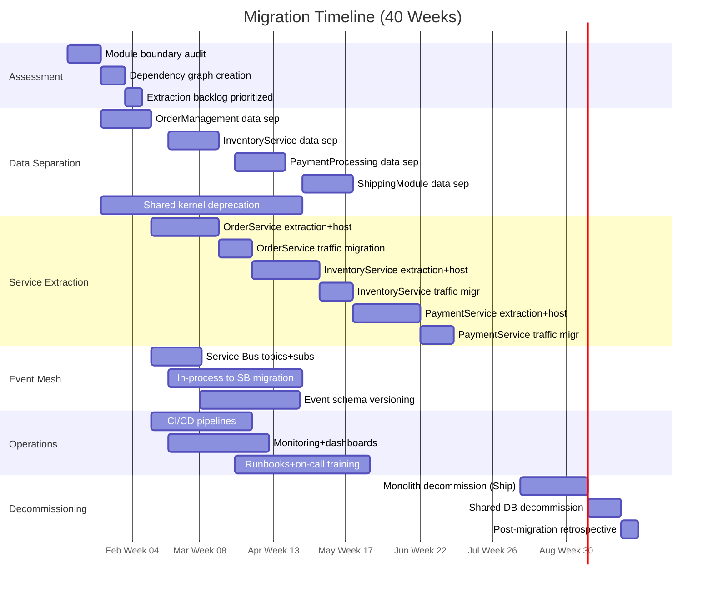
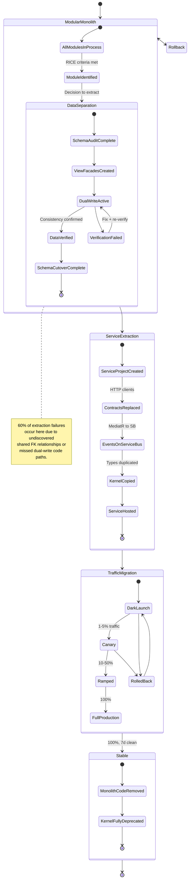
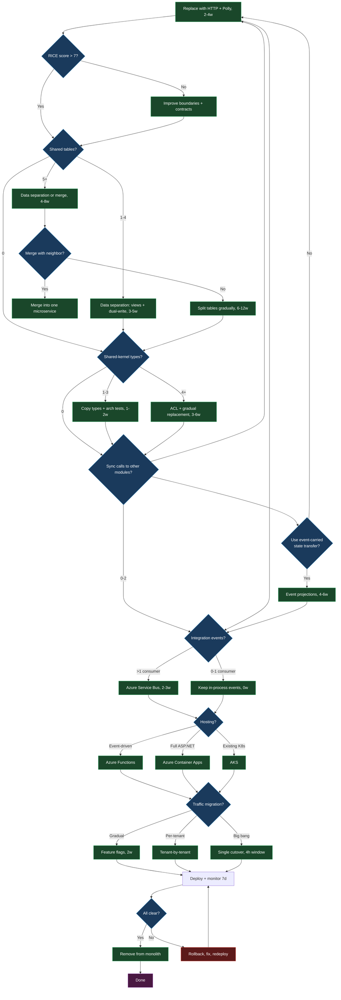

> [!success] Mastery Check
> - [ ] **Studied Well**
> - [ ] **Can explain the concept without notes**
> - [ ] **Can answer interview questions confidently**
> - [ ] **Can implement it in a real project**


> [!ABSTRACT] Quick Reference — Modular Monolith to Microservices Migration
> **Invariant:** A well-structured modular monolith is a PRECURSOR to microservices — not an alternative. If module boundaries, contract interfaces, and integration events are properly defined, each module maps 1:1 to a future microservice. The migration is a TRANSPORT CHANGE (in-process call -> network call) and DATA SEPARATION (shared database -> per-service database), not an architecture rewrite. **Cost:** Extracting one module costs 4–12 engineering-weeks: shared database separation (2–4w), contract -> API conversion (1–2w), integration event transport swap (1–2w), CI/CD pipeline setup (0.5–1w), operational readiness (0.5–2w). **Trigger:** 15–25 engineers across 3+ teams where monolith deployment is a bottleneck: single deploy takes 45+ minutes, coordination consumes 4+ hours/week, or changes in Module A break Module B in production. **Skip When:** Team size <8, single bounded context, deployment frequency <1/week, or no module boundaries. **.NET Entry Point:** `Program.cs` in monolith registers `AddModuleServices()`; extracted service runs its own `WebApplication` with identical MediatR handlers via `MapControllers()` or Azure Functions trigger. **Azure Native:** Azure Service Bus replaces in-process MediatR bus; Azure SQL elastic pools provide per-service databases; Azure API Management fronts extracted services for unified endpoint; Azure Container Apps or AKS hosts services. **Number to Know:** Extracting a module with 0 shared tables costs ~2–3 weeks; with 12+ shared tables and 4+ shared-kernel types costs ~8–12 weeks. A 500K LoC monolith with ~15 modules averages 3–4 extracted services per quarter with a dedicated platform team.

---

## Navigation

**Domain:** [[7 — System Design & Distributed Systems]] > **Group:** Clean Architecture
**Previous:** [[7.019 — Modular Monolith — Shared Kernel vs Separate Data]] | **Next:** [[7.021 — Strangler Fig Pattern — Migrating Legacy Systems]]

### Prerequisites

- [[7.017 — Modular Monolith — Internal Module Boundaries]] — defines internal module structure with aggregate roots and repositories per module; without these internal boundaries, extraction collapses because the "module" is just a namespace folder with no encapsulation
- [[7.018 — Modular Monolith — Inter-Module Communication]] — establishes contract interface and integration event patterns that are the extraction surface; every inter-module contract is a seam for a service boundary; migrating via direct class references requires first refactoring to contracts (3–6 additional weeks)
- [[7.019 — Modular Monolith — Shared Kernel vs Separate Data]] — defines database coupling patterns that determine extraction difficulty; operationalizes the "separate schema" vs "shared database" decision into extraction sequencing
- [[7.001 — Clean Architecture — The Dependency Rule]] — governs dependency direction between extracted services; a service violating the Dependency Rule by depending on infrastructure types from another service creates a distributed big ball of mud

### Where This Fits

> [!INFO] Production Encounter Map
>
> - **Layer:** Organization-wide architecture — applies at the boundary between application architecture and infrastructure/operations
> - **Trigger:** An organization has a working modular monolith with 8–12 modules built by 4 teams. The monolith deploys every 2 weeks as a single unit. Team A changes `ShippingModule` but must wait for Team B's `OrderManagement` changes to be reviewed, tested, and merged before deployment. The deployment window is Friday 6–10 PM; if Team C's changes break the build, all teams are blocked. The CTO asks: "Can we ship independently?" The answer is microservices.
> - **Without it:** Teams attempt a "big bang" rewrite — a 12-month project to re-architect the entire system as microservices from scratch while maintaining the monolith. The rewrite fails or delivers 18 months late (standard Conway's Law failure pattern). The organization declares "microservices don't work for us" and remains monolithic for another 5 years.
> - **First signal:** `git log --oneline --after="2026-01-01" --before="2026-04-01" ModuleA/ | wc -l` shows 42 commits, ModuleB shows 38 commits — but both ship in the same deployment because they share a database and CI/CD pipeline. A deployment history graph shows a single deploy per month despite independent commit cadences.

This note extends [[7.021 — Strangler Fig Pattern — Migrating Legacy Systems]] from the legacy monolith -> greenfield microservices pattern to the specific case of a WELL-STRUCTURED MODULAR MONOLITH -> extracted microservices. The difference is critical: with a legacy monolith, you build a new service alongside and route traffic away (classic strangler fig). With a modular monolith, you peel off modules one at a time — the architecture is already structured, so the work is mechanical extraction, not reconstruction.

---

## Core Mental Model

The migration from a modular monolith to microservices follows a predictable sequence. Each phase has defined entry conditions, activities, and success criteria. A module is ready for extraction when it satisfies the **RICE** criteria: **R**untime isolation possible (module runs without the monolith's startup sequence), **I**nterface complete (all cross-module communication goes through contracts or events), **C**omprehensive data boundary (module's data is separable from shared schemas), **E**xplicit dependencies (all shared-kernel usage cataloged and replaceable).

**Phase 1 — Assessment & Preparation (weeks 1–4):** Audit module boundaries, catalog shared tables, identify integration event contracts, create dependency graph. Output: extraction backlog prioritized by RICE score.

**Phase 2 — Data Separation (weeks 3–12, overlaps Phase 1):** Migrate shared tables to module-owned schema or separate database. Introduce views or service calls for cross-module queries. Replace shared-kernel types with service-specific copies.

**Phase 3 — Contract -> API Conversion (weeks 5–20):** Convert synchronous contract interfaces to HTTP/gRPC calls. Add API gateway routing. Replace in-process event dispatch with Azure Service Bus.

**Phase 4 — Service Hosting & Operationalization (weeks 8–26):** Create service project, CI/CD pipeline, monitoring (Application Insights), deployment runbooks, health checks, auto-scaling.

**Phase 5 — Traffic Migration & Decommissioning (weeks 10–30):** Route traffic via feature flags. Monitor errors and latency. Once stable, remove extracted code from monolith. Decommission shared tables and contracts.

> [!TIP] The Non-Obvious Insight
> The biggest mistake is extracting the WRONG module FIRST. Teams typically extract the "most independent" module (fewest dependencies) — but this often has the LOWEST business value. The correct first candidate is the module with the HIGHEST deployment-coupling cost — whose changes most frequently block other teams. Measure `blocked_deployments_per_quarter`. A module causing 8 blocked deployments/quarter is worth extracting even if it shares 10 tables. A module with 0 blocked deployments but perfect schema isolation is NOT worth extracting — it adds operational cost without solving an organizational problem.
>
> The second insight: data separation should PRECEDE service extraction. Teams that extract first and then separate the database discover the service cannot tolerate the downtime required for schema migration. Separate data WHILE THE MODULE IS STILL IN THE MONOLITH — the monolith's single database transaction acts as a consistency checkpoint during the split.
>
> The third insight: shared-kernel deprecation is the LONGEST phase, not data separation. A shared type like `Address` or `Money` is referenced by every module. Deprecating it requires every consuming module to adopt its own copy — 12 code reviews, 12 test updates, 12 deployment cycles. Teams routinely underestimate shared-kernel removal by 2–4x.

### Classification

- **Migration strategy:** Incremental strangler fig — each module extracted independently while monolith continues serving non-extracted modules
- **Extraction ordering:** Prioritized by deployment-coupling cost divided by extraction difficulty (cost/value ratio), NOT by independence or simplicity
- **Data coupling spectrum:** Shared schema -> schema-per-module in shared database -> separate database per service
- **Communication transition:** In-process contract interface -> HTTP/REST or gRPC (synchronous); in-process MediatR -> Azure Service Bus (asynchronous)
- **Organizational alignment:** Conway's Law — service boundaries must match team boundaries; a service owned by 2 teams is a distributed monolith
- **Risk profile:** Each extraction reduces monolith complexity and coordination cost but adds operational complexity (network calls, distributed tracing, eventual consistency, partial failures)

### Primary Diagram

```mermaid
graph TD
    subgraph "Phase 0: Modular Monolith (Current)"
        M0["Monolith Host (ASP.NET Core single process)"]
        M0_DB[("Shared SQL Database (dbo.* all tables)")]
        M0_EV["In-Process Events (MediatR INotification)"]

        subgraph "M1 - OrderManagement"
            OM_UC["PlaceOrderCmdHandler"]
            OM_SCH["Schema: orders.*"]
        end

        subgraph "M2 - InventoryService"
            INV_UC["ReserveStockCmdHandler"]
            INV_SCH["Schema: inventory.*"]
        end

        subgraph "M3 - PaymentProcessing"
            PAY_UC["ChargePaymentHandler"]
            PAY_SCH["Schema: payments.*"]
        end

        subgraph "M4 - ShippingModule"
            SHIP_UC["CreateShipmentHandler"]
            SHIP_SCH["Schema: shipping.*"]
        end

        subgraph "M5 - NotificationModule"
            NOTIF_UC["SendEmailHandler"]
        end

        M0 --- M0_DB
        M0 --- M0_EV
        OM_UC -->|"IInventoryService (in-process)"| INV_UC
        OM_UC -->|"IPaymentService (in-process)"| PAY_UC
        OM_UC -->|"pub OrderPlacedEvent"| M0_EV
        M0_EV -->|"sub"| INV_UC & PAY_UC & SHIP_UC & NOTIF_UC
    end

    subgraph "Phase 1: Data Separation (Wks 3-12)"
        M1["Monolith Host (unchanged)"]
        M1_DBO[("OrderManagement DB (dedicated)")]
        M1_DBS[("Shared DB (remaining modules)")]
        OM1["Same handlers, own DB"]
        REST1["Inventory, Payment, Shipping, Notification"]
        M1 --- M1_DBO & M1_DBS
        OM1 --- M1_DBO
        REST1 --- M1_DBS
        M1_DBO -.->|"cross-DB views"| M1_DBS
    end

    subgraph "Phase 2: Service Extraction (Wks 8-20)"
        M2_HOST["Monolith Host (modules 2-5)"]
        M2_SVC["OrderService (separate process)"]
        M2_ASB["Azure Service Bus: order-events"]
        M2_APIM["Azure API Management"]
        M2_SVC --- M2_DBO[("OrderService DB")]
        M2_HOST --- M2_DBS[("Shared DB")]
        M2_APIM --> M2_SVC & M2_HOST
        M2_SVC -->|"pub OrderPlaced"| M2_ASB
        M2_ASB -->|"sub"| M2_HOST
        M2_SVC -->|"HTTP via APIM"| M2_HOST
    end

    subgraph "Phase 3: Fully Decomposed (Wks 26-40)"
        M4_OS["OrderService"]
        M4_IS["InventoryService"]
        M4_PS["PaymentService"]
        M4_SS["ShippingService"]
        M4_NS["NotificationService"]
        M4_ASB["Azure Service Bus Event Mesh"]
        M4_APIM["Azure API Management"]
        M4_APIM --> M4_OS & M4_IS & M4_PS & M4_SS
        M4_OS -->|"HTTP"| M4_IS & M4_PS
        M4_OS & M4_IS & M4_PS & M4_SS -->|"pub"| M4_ASB
        M4_ASB --> M4_NS & M4_SS & M4_PS & M4_IS
        M4_DEL["Monolith: DECOMMISSIONED"]
        M4_DEL -.-> M4_OS
    end

    classDef mono fill:#1a3a5c,color:#fff,stroke:#2980b9
    classDef svc fill:#1a472a,color:#fff,stroke:#27ae60
    classDef infra fill:#5c3a1a,color:#fff,stroke:#e67e22
    classDef decommission fill:#5c1a1a,color:#fff,stroke:#e74c3c,stroke-dasharray:5 5
    class M0,M1,M2_HOST mono
    class M2_SVC,M4_OS,M4_IS,M4_PS,M4_SS,M4_NS svc
    class M0_EV,M2_ASB,M4_ASB,M2_APIM,M4_APIM infra
    class M4_DEL decommission
```



### Supporting Diagram



### Numbers That Matter

| Metric | Value | Context / Conditions |
|---|---|---|
| Extraction cost, 0 shared tables | 2–3 eng-weeks | Isolated schema, contract-based, no shared-kernel |
| Extraction cost, 1–4 shared tables | 4–6 eng-weeks | View facades + dual-write + consistency verification |
| Extraction cost, 8+ shared tables | 8–12 eng-weeks | Phased migration, risk of missed FK relationships |
| Extraction cost per shared-kernel type | +2–4 weeks per type | Each type (Address, Money, OrderStatus) needs copy + plan |
| Monolith deployment coordination | 4–8 hours/week per team | 4-team org: 16–32h/week in meetings, freezes, integration testing |
| First-extraction coordination savings | ~40% reduction blocked deploys | Blocked deploys dropped from 8/qtr to 5/qtr after first extraction |
| Latency: in-process -> HTTP | +2–8ms (local) to +15–60ms (cross-region) | Network + serialization + handler; varies by Azure region pair |
| Latency: in-process -> Service Bus | +5–15ms per event | Publish 3–8ms (Premium) + 2–7ms deserialization |
| Shared-kernel deprecation cycles | 3–6 months for 8+ consumers | 12-module monolith averages 4–5 months for full kernel removal |
| Service Bus Premium cost/service | ~$75–150/month per topic | 1 topic + 3–5 subscriptions; Premium needed >1000 msg/s |
| Monolith code removal per extraction | 8–18% SLOC reduction | Removing OrderModule from 500K LoC: ~40K–90K LoC removed |
| Deploy time reduction per extraction | ~15–25% | Each extraction removes compilation + test + packaging time |
| Rollback complexity (extracted) | 2–4 hours full rollback | Route traffic back to monolith; feature flag + dual-write verification |
| Successful extraction at 24 months | ~50–60% of attempted modules | Common failure: data coupling too high; shared kernel not fully replaced |

### Key Properties / Guarantees

| Property | Value | Condition |
|---|---|---|
| Migration risk profile | Linear per-module; independent success/failure | No circular dependencies; extraction follows dependency DAG |
| Consistency during migration | Strong within service; eventual between services | Monolith single-DB tx during data separation; eventual post-extraction |
| Rollback capability | Full rollback within 2–4 hours | Dual-write during traffic migration; feature flag routes to monolith/service |
| Deployment independence | Services deploy independently; monolith deploys independently | No shared binaries; contracts become NuGet or replicated types |
| Development velocity | Deploy time -15–25% per extraction; blocked deploys -40% after first | Depends on pipeline optimization and team autonomy |
| Operational complexity | +20–30% per extracted service | Each needs: CI/CD, monitoring, alerts, logging, runbook, health checks |
| Organizational alignment | Team owns service end-to-end | Ownership transfers from monolith team to dedicated service team |

---

## Deep Mechanics

### How It Works

Three parallel workstreams converge at extraction point: **Data Separation**, **Communication Transport Swap**, and **Shared Kernel Deprecation**.

**Workstream 1 — Data Separation (hardest part):** Move from shared database (all modules write to `dbo.*` in a single Azure SQL DB) to per-service database. Five steps:

1. **Schema audit and FK discovery:** Run DB dependency scan for all tables, views, stored procedures, and FK relationships crossing module boundaries. Use `sys.foreign_keys` and `sys.sql_expression_dependencies` to build cross-module dependency matrix.

2. **View facade creation:** For tables other modules need to read (not write), create views exposing required columns. Consuming module queries the view instead of source table. Decouples physical table from query contract.

3. **Dual-write implementation:** For tables other modules write to, write to BOTH original shared table AND new service-owned table. Background job verifies consistency. Once all consumers migrate to new table (via service call or event), deprecate old table. This is the longest step (2–4 weeks).

4. **FK replacement with eventual consistency:** Shared FKs (e.g., `OrderManagement.Order.WarehouseId REFERENCES Inventory.Warehouse.Id`) become logical references (column with no FK constraint, enforced by app logic). Done via EF Core migration during maintenance window.

5. **Database separation cutover:** Module schema moved to its own Azure SQL database (or elastic pool). Monolith now connects to two databases. Cross-DB queries use registered views (same SQL Server instance) or service calls (different instances).

**Workstream 2 — Communication Transport Swap:** Replace in-process communication with network equivalents:

- **Synchronous contract -> HTTP/REST or gRPC:** Each interface method becomes a REST endpoint. DI registration replaces in-process implementation with HTTP client. Interface contract preserved as abstraction.
- **Integration event -> Azure Service Bus:** Each `INotificationHandler<T>` extracted into Service Bus trigger. Publisher publishes to Service Bus topic. Handler logic unchanged — only entry point changes.
- **API Management fronting:** Azure API Management sits in front of all services. Routes `/api/orders/*` to OrderService, `/api/*` to monolith. Centralized auth via Managed Identity.

**Workstream 3 — Shared Kernel Deprecation:** (1) Identify all shared-kernel types used by module. (2) Copy (don't share) into service project — initially identical. (3) Add NetArchTest verifying service does NOT reference monolith's shared-kernel assembly. (4) Evolve independently — type can diverge from monolith's version. (5) Repeat for each extracted service. Shared kernel shrinks to truly shared types only (CorrelationId, EventEnvelope, CloudEvent).

### Protocol Trace

```
Happy Path — Full Extraction of OrderModule:

Pre-extraction (modular monolith):
  1. Client POSTs to /api/orders at monolith host — 0ms
  2. PlaceOrderCommandHandler handles — ~0.1ms MediatR
  3. Calls IInventoryService.ReserveStockAsync() — in-process — ~3ms
  4. Calls IPaymentService.ChargeAsync() — in-process — ~250ms (external)
  5. Commits order to DB (dbo.Orders) — ~3ms EF Core SaveChanges
  6. Publishes OrderPlacedIntegrationEvent via MediatR — ~5ms fan-out
  7. Returns 201 Created — ~0.1ms
  Total: ~265ms

Data separation (shared DB to per-service schema):
  8. DBA runs migration: CREATE SCHEMA orders; CREATE TABLE orders.Orders
     AS SELECT * FROM dbo.Orders; CREATE VIEW dbo.Orders AS SELECT * FROM orders.Orders
  9. OrderDbContext maps to orders.Orders (same DB, different schema)
  10. Other modules query dbo.Orders view — no code change
  Migration time: ~30min maintenance window. Consistency: strong (same DB tx)

Service extraction:
  11. New ASP.NET Core 8 project: OrderService.Api
  12. Handlers, domain model, DbContext copied from monolith
  13. IInventoryService replaced:
      Before: services.AddScoped<IInventoryService, InventoryReservationService>()
      After:  services.AddHttpClient<IInventoryService, InventoryServiceHttpClient>(c => {
                  c.BaseAddress = new Uri("https://apim.contoso.com/inventory") })
  14. MediatR publish replaced:
      Before: await mediator.Publish(new OrderPlacedEvent(...), ct)
      After:  await serviceBusSender.SendMessageAsync(msg, ct)
  15. APIM: path "/api/orders/*" -> backend "OrderService"
  16. Feature flags: 1% -> 10% -> 50% -> 100% over 14 days
  17. After 7d at 100% zero errors: remove OrderModule from monolith
  18. Monolith deploy time reduces ~18% (52min -> 43min)
  Total extraction: ~4 weeks

Failure Path — Dual-Write Inconsistency:
  1. OrderService writes to orders.Orders (own schema)
  2. ShippingService reads from dbo.Orders view — OK
  3. Background verification: SELECT COUNT(*) FROM orders.Orders vs old table backup
  4. Found 3 records missing in backup
  5. Root cause: "QuickOrder" feature bypassed dual-write code path
  6. Fix dual-write; manually sync 3 records; verify 48h clean before cutover

Failure Path — Service Bus Ordering Violation:
  1. OrderService pubs OrderCancelledEvent for Order #4721
  2. Partition key mismatch: CancelledEvent arrives BEFORE OrderPlacedEvent
  3. InventoryService tries to cancel nonexistent reservation
  4. Fix: Set SessionId = order.Id.ToString() on all Service Bus messages
```

### State Transitions



### Failure Modes

**Failure Mode 1: Hidden Shared Table Dependency Discovered Mid-Extraction**

- **Cause:** OrderManagement writes to `dbo.InventoryReservations`, a table thought owned by InventoryService. Not flagged during schema audit because accessed through a stored procedure.
- **Symptom:** Data separation stalls at Week 5. Extraction backlog blocked. Team debates ownership for 2 weeks.
- **Detection time:** Week 4–5. Earlier if schema audit includes stored procedure dependencies via `sys.sql_expression_dependencies`.

> [!DANGER] 3 AM Production Signal
> Metric: `db_cross_module_write_count{source="OrderManagement",target="InventoryReservations"} > 0`
> Log: `ERROR [Migration] Schema audit: dbo.InventoryReservations written by OrderManagement (INSERT) and InventoryService (UPDATE/DELETE) — extraction blocked`
> Customer impact: ZERO immediate. Timeline extends 4–6 weeks. If pushed to prod without resolution, services corrupt each other's data.

**Failure Mode 2: Service Bus Message Loss During Transport Swap Cutover**

- **Cause:** Service Bus publish made BEFORE DB transaction commits. If tx fails, event is already on queue — handlers process for nonexistent orders.
- **Symptom:** Inventory shows reservations for orders never created. DLQ accumulates.

> [!DANGER] 3 AM Production Signal
> Metric: `azureservicebus_dlq_message_count{topic="order-events"} > 50`
> Log: `ERROR [InventoryService] Order ord-8821 not found (seq:884219)`
> Customer impact: Low-moderate. Orphaned reservations show items out-of-stock. Recovery: manual SQL cleanup per orphan.

> [!DANGER] Silent Loss Variant
> Metric: No change — events silently lost because publisher catches SendMessageAsync exception and logs without rethrowing
> Log: Level INFO: "OrderPlacedEvent published" — but it wasn't (log written before async completes)
> Detection: 6 hours later when downstream asks "why didn't we get the event?"

**Failure Mode 3: HTTP Timeout Causes Cascading Failure**

- **Cause:** After extraction, sync contract call is HTTP. Default HttpClient timeout is 100s. Slow InventoryService query holds thread for 100s. At 200 concurrent orders, thread pool exhausted.
- **Symptom:** OrderService 503. APIM sees timeout errors. Thread pool exhaustion triggers health check failure.

> [!DANGER] 3 AM Production Signal
> Metric: `http_server_requests_duration{service="OrderService",quantile="0.99"} = 32s` (baseline 250ms)
> Metric: `threadpool_queue_length > 500`
> Log: `WARN Kestrel[17] — Connection processing queue:512, rejecting connection`
> Customer impact: All orders fail for 4min until auto-scale. ~120–180 failed orders. Fix: explicit 5s timeout + Polly circuit breaker.

**Failure Mode 4: Schema Migration Version Desynchronization**

- **Cause:** Module takes its EF Core migrations on extraction. Monolith's remaining modules still reference old migration history. If either deploys out of order, migration state inconsistent.
- **Symptom:** `DbUpdateException: model backing context has changed since database was created`.

> [!DANGER] 3 AM Production Signal
> Metric: `dotnet ef migrations list` shows different last-applied migration on monolith DB vs service DB
> Log: `FAILED [EF Core] Pending migrations '20260315001234_ExtractOrderTable' cannot be applied — different connection string`
> Customer impact: Zero — deployment blocked. No new features ship until resolved. Fix: split migration history at extraction point.

### .NET and Azure Integration Points

- **Microsoft.Extensions.DependencyInjection.Abstractions:** DI swaps in-process implementations for HTTP clients. `AddScoped<IInventoryService, InventoryReservationService>()` becomes `AddHttpClient<IInventoryService, InventoryServiceHttpClient>()`. Handlers consuming the interface unchanged.
- **MediatR 12.x:** In-process event bus in monolith. Post-extraction, handlers migrate to Service Bus triggers. Handler code remains MediatR-based — trigger calls `mediator.Send()`/`Publish()` internally.
- **Azure.Messaging.ServiceBus:** Replaces MediatR for cross-service events. Each service publishes to topic; each consumer has subscription. `ServiceBusProcessor`/`ServiceBusTrigger` handles message reception. Events serialized as CloudEvent JSON — shared schema between services.
- **Azure SQL + Elastic Pool:** Per-service databases from elastic pool. Resource governance prevents one service consuming all DTUs. Data separation moves module schema to dedicated database in pool.
- **Azure API Management:** Route by path pattern. Policies: JWT via Azure AD, rate limit (1000 req/min), routing (`/api/orders/*` -> OrderService), caching, versioning.
- **Azure Functions (SB/HTTP trigger):** Host extracted handlers. `[Function("HandleOrderPlaced")] public async Task Run([ServiceBusTrigger("order-events","sub")] OrderPlacedEvent evt) => await mediator.Send(new ReserveStockCommand(evt.Items))`. Auto-scale to zero.
- **Azure Container Apps:** Alternative hosting with gRPC support, KEDA scaling (30 req/sec per replica), Dapr, blue-green revisions.
- **Azure Cosmos DB:** Alternative for services needing global distribution. Change feed replaces polling for cross-service data sync.
- **Azure Event Grid:** For events where consumers don't need filtering/sessions. Domain events fanning out to many small consumers.
- **Application Insights:** Distributed tracing across monolith and services. `Activity.Current`/`DiagnosticSource` propagates trace context. `Operation_Id` correlates requests. Custom dimensions filter by `service_name`, `extraction_phase`.
- **Polly:** Resilience policies: retry (3 attempts, exponential backoff), circuit breaker (5 failures -> 30s open), timeout (5s), bulkhead (12 concurrent). `AddTransientHttpErrorPolicy(p => p.WaitAndRetryAsync(3, attempt => TimeSpan.FromMilliseconds(Math.Pow(2, attempt) * 100)))`.
- **Azure Managed Identity:** Auth between services without secrets. System-assigned managed identity. SQL uses Azure AD auth. `DefaultAzureCredential()` for service-to-service calls.

---

## Production Patterns and Implementation

### Primary Implementation

Extraction of OrderManagement from modular monolith into standalone service. Pattern: **same handler, different entry point**.

```csharp
// SHARED CONTRACT (NuGet package, referenced by all)

/// <summary>Integration event published when an order is placed.</summary>
public sealed record OrderPlacedIntegrationEvent(
    Guid OrderId,
    Guid CustomerId,
    IReadOnlyList<OrderLineItem> Items,
    Money TotalAmount,
    string CorrelationId,
    DateTime OccurredAtUtc) : IIntegrationEvent
{
    public OrderPlacedIntegrationEvent(Guid orderId, Guid customerId,
        IReadOnlyList<OrderLineItem> items, Money totalAmount)
        : this(orderId, customerId, items, totalAmount,
              Guid.NewGuid().ToString("N"), DateTime.UtcNow) { }
}

/// <summary>Marker interface for integration events.</summary>
public interface IIntegrationEvent
{
    string CorrelationId { get; }
    DateTime OccurredAtUtc { get; }
}

/// <summary>Monetary amount value object (avoids shared-kernel).</summary>
public sealed record Money(string Currency, decimal Amount)
{
    public static Money Usd(decimal amount) => new("USD", amount);
}
```

```csharp
// IN-PROCESS HANDLER (modular monolith — before extraction)

internal sealed class PlaceOrderCommandHandler(
    IOrderRepository orderRepository,
    ICustomerRepository customerRepository,
    IInventoryService inventoryService,
    IPaymentService paymentService,
    IPublisher mediator,
    IUnitOfWork unitOfWork,
    ILogger<PlaceOrderCommandHandler> logger)
    : IRequestHandler<PlaceOrderCommand, Result<OrderConfirmation>>
{
    public async Task<Result<OrderConfirmation>> Handle(
        PlaceOrderCommand command, CancellationToken ct)
    {
        var customer = await customerRepository.GetByIdAsync(command.CustomerId, ct);
        if (customer is null)
            return Result<OrderConfirmation>.Failure(
                ApplicationError.NotFound("Customer not found"));

        var order = Order.Create(customer.Id, command.Items);

        var reservation = await inventoryService.ReserveStockAsync(order.Items, ct);
        if (!reservation.IsSuccess)
            return Result<OrderConfirmation>.Failure(
                ApplicationError.InsufficientStock(reservation.UnavailableItems));

        var payment = await paymentService.ChargeAsync(
            customer.PaymentProfileId, order.TotalAmount, ct);
        if (!payment.IsSuccess)
            return Result<OrderConfirmation>.Failure(
                ApplicationError.PaymentFailed(payment.FailureReason));

        order.ConfirmPayment(payment.TransactionId);
        orderRepository.Add(order);
        await unitOfWork.CommitAsync(ct);

        // Publish AFTER commit — critical ordering
        await mediator.Publish(new OrderPlacedIntegrationEvent(
            order.Id, customer.Id, order.Items, order.TotalAmount), ct);

        logger.LogInformation("Order {OrderId} placed by customer {CustomerId}",
            order.Id, customer.Id);

        return Result<OrderConfirmation>.Success(
            new OrderConfirmation(order.Id, order.TotalAmount, order.CreatedAtUtc));
    }
}
```

```csharp
// EXTRACTED SERVICE (standalone ASP.NET Core — after extraction)

// Program.cs
var builder = WebApplication.CreateSlimBuilder(args);
builder.Services.AddMediatR(cfg =>
    cfg.RegisterServicesFromAssemblyContaining<PlaceOrderCommandHandler>());

builder.Services.AddDbContext<OrderDbContext>((sp, options) =>
{
    var credential = new DefaultAzureCredential();
    var connStr = builder.Configuration.GetConnectionString("OrderDb")!;
    options.UseSqlServer(connStr, sql =>
    {
        sql.UseAzureSqlDefaults();
        sql.MigrationsAssembly(typeof(OrderDbContext).Assembly.FullName);
    });
});

// In-process IInventoryService replaced with HTTP client
builder.Services.AddHttpClient<IInventoryService, InventoryServiceHttpClient>(client =>
{
    client.BaseAddress = new Uri(builder.Configuration["Services:InventoryService"]!);
    client.Timeout = TimeSpan.FromSeconds(5);
})
.AddTransientHttpErrorPolicy(p => p.WaitAndRetryAsync(3,
    attempt => TimeSpan.FromMilliseconds(Math.Pow(2, attempt) * 100)))
.AddTransientHttpErrorPolicy(p => p.CircuitBreakerAsync(5, TimeSpan.FromSeconds(30)));

builder.Services.AddHttpClient<IPaymentService, PaymentServiceHttpClient>(client =>
{
    client.BaseAddress = new Uri(builder.Configuration["Services:PaymentService"]!);
    client.Timeout = TimeSpan.FromSeconds(15);
});

builder.Services.AddScoped<IOrderRepository, OrderRepository>();
builder.Services.AddScoped<ICustomerRepository, CustomerRepository>();
builder.Services.AddScoped<IUnitOfWork>(sp =>
    sp.GetRequiredService<OrderDbContext>());

// In-process MediatR replaced with Azure Service Bus sender
builder.Services.AddSingleton(sp =>
{
    var credential = new DefaultAzureCredential();
    var ns = builder.Configuration["ServiceBus:Namespace"]!;
    var client = new ServiceBusClient(ns, credential);
    return client.CreateSender(builder.Configuration["ServiceBus:OrderEventsTopic"]!);
});

builder.Services.AddHostedService<OrderPlacedEventPublisher>();

var app = builder.Build();
app.MapControllers();
app.MapHealthChecks("/health", new HealthCheckOptions
{
    Predicate = _ => true,
    ResponseWriter = async (ctx, report) =>
    {
        ctx.Response.ContentType = "application/json";
        var json = JsonSerializer.Serialize(new
        {
            status = report.Status.ToString(),
            checks = report.Entries.Select(e => new
            {
                name = e.Key,
                status = e.Value.Status.ToString(),
                duration = e.Value.Duration.TotalMilliseconds
            })
        });
        await ctx.Response.WriteAsync(json);
    }
});
app.Run();
```

```csharp
// HTTP CLIENT REPLACING IN-PROCESS CONTRACT

internal sealed class InventoryServiceHttpClient(HttpClient httpClient) : IInventoryService
{
    public async Task<StockReservationResult> ReserveStockAsync(
        IReadOnlyList<OrderLineItem> items, CancellationToken ct)
    {
        var request = new ReserveStockRequest(
            items.Select(i => new StockRequest(i.Sku, i.Quantity)).ToList());
        var response = await httpClient.PostAsJsonAsync(
            "/api/inventory/reserve", request, ct);

        if (!response.IsSuccessStatusCode)
        {
            var error = await response.Content.ReadFromJsonAsync<ProblemDetails>(ct);
            return StockReservationResult.Failure(error?.Detail ?? "Unknown error");
        }
        var result = await response.Content.ReadFromJsonAsync<StockReservationResponse>(ct);
        return StockReservationResult.Success(result!.ReservationId);
    }
}
```

```csharp
// SERVICE BUS EVENT PUBLISHER (replaces MediatR.Publish)

internal sealed class OrderPlacedEventPublisher(
    IServiceScopeFactory scopeFactory,
    ServiceBusSender sender,
    ILogger<OrderPlacedEventPublisher> logger) : BackgroundService
{
    protected override async Task ExecuteAsync(CancellationToken stoppingToken)
    {
        var channel = Channel.CreateBounded<OrderPlacedIntegrationEvent>(
            new BoundedChannelOptions(100)
            {
                FullMode = BoundedChannelFullMode.Wait,
                SingleWriter = false,
                SingleReader = true
            });

        await foreach (var evt in channel.Reader.ReadAllAsync(stoppingToken))
        {
            try
            {
                var cloudEvent = new CloudEvent(
                    "com.contoso.orders.orderplaced", evt)
                {
                    Id = evt.CorrelationId,
                    Time = evt.OccurredAtUtc,
                    Subject = evt.OrderId.ToString()
                };
                var message = new ServiceBusMessage(
                    new BinaryData(cloudEvent, new JsonCloudEventSerializer()))
                {
                    Subject = cloudEvent.Type,
                    CorrelationId = cloudEvent.Id,
                    SessionId = evt.OrderId.ToString(),
                    ContentType = "application/cloudevents+json"
                };
                await sender.SendMessageAsync(message, stoppingToken);
                logger.LogDebug("Published OrderPlaced for order {OrderId}", evt.OrderId);
            }
            catch (Exception ex)
            {
                logger.LogError(ex, "Failed to publish OrderPlaced for {OrderId}", evt.OrderId);
                throw;
            }
        }
    }
}
```

```csharp
// ARCHITECTURE TEST — NetArchTest

public sealed class ArchitectureTests
{
    private static readonly Assembly OrderServiceAssembly =
        typeof(PlaceOrderCommandHandler).Assembly;

    [Fact]
    public void OrderService_ShouldNotReference_MonolithSharedKernel()
    {
        var result = Types.InAssembly(OrderServiceAssembly)
            .That().ResideInNamespace("Contoso.OrderService")
            .Should().NotHaveDependencyOn("Contoso.Monolith.SharedKernel")
            .GetResult();
        Assert.True(result.IsSuccessful,
            $"Shared kernel leaked:{Environment.NewLine}" +
            string.Join(Environment.NewLine, result.FailingTypeNames ?? []));
    }

    [Fact]
    public void OrderService_ShouldNotReference_OtherServices()
    {
        var result = Types.InAssembly(OrderServiceAssembly)
            .That().ResideInNamespace("Contoso.OrderService")
            .ShouldNot().HaveDependencyOnAny("Contoso.InventoryService", "Contoso.PaymentService")
            .GetResult();
        Assert.True(result.IsSuccessful, "Direct service references. Use HTTP/events.");
    }

    [Fact]
    public void Controllers_ShouldNotDependOn_Infrastructure()
    {
        var result = Types.InAssembly(OrderServiceAssembly)
            .That().HaveNameEndingWith("Controller")
            .Should().NotHaveDependencyOn("Microsoft.EntityFrameworkCore")
            .GetResult();
        Assert.True(result.IsSuccessful, "Controllers must not depend on EF Core.");
    }
}
```

### IServiceCollection Registration

```csharp
// MODULE REGISTRATION IN MONOLITH (before extraction)

public static class OrderManagementModuleRegistration
{
    public static IServiceCollection AddOrderManagementModule(
        this IServiceCollection services, IConfiguration configuration)
    {
        services.AddMediatR(cfg =>
            cfg.RegisterServicesFromAssemblyContaining<PlaceOrderCommandHandler>());
        services.AddDbContext<OrderDbContext>((sp, options) =>
            options.UseSqlServer(configuration.GetConnectionString("SharedDb"),
                sql => sql.MigrationsAssembly(typeof(OrderDbContext).Assembly.FullName)));
        services.AddScoped<IOrderRepository, OrderRepository>();
        services.AddScoped<ICustomerRepository, CustomerRepository>();
        services.AddScoped<IUnitOfWork>(sp => sp.GetRequiredService<OrderDbContext>());
        services.AddScoped<IPricingService, PricingService>();
        return services;
    }
}

// SERVICE REGISTRATION IN EXTRACTED SERVICE (after extraction)

public static class OrderServiceRegistration
{
    public static IServiceCollection AddOrderService(
        this IServiceCollection services, IConfiguration configuration)
    {
        // Same MediatR handlers — no code change
        services.AddMediatR(cfg =>
            cfg.RegisterServicesFromAssemblyContaining<PlaceOrderCommandHandler>());
        // Different DbContext — dedicated database
        services.AddDbContext<OrderDbContext>((sp, options) =>
        {
            var credential = new DefaultAzureCredential();
            var connStr = configuration.GetConnectionString("OrderDb")!;
            options.UseSqlServer(connStr, sql =>
            {
                sql.UseAzureSqlDefaults();
                sql.MigrationsAssembly(typeof(OrderDbContext).Assembly.FullName);
            });
        });
        // Same repositories — no code change
        services.AddScoped<IOrderRepository, OrderRepository>();
        services.AddScoped<ICustomerRepository, CustomerRepository>();
        services.AddScoped<IUnitOfWork>(sp => sp.GetRequiredService<OrderDbContext>());
        services.AddScoped<IPricingService, PricingService>();
        // DIFFERENT: in-process -> HTTP clients
        services.AddHttpClient<IInventoryService, InventoryServiceHttpClient>(client =>
        {
            client.BaseAddress = new Uri(configuration["Services:InventoryService"]!);
            client.Timeout = TimeSpan.FromSeconds(5);
        })
        .AddTransientHttpErrorPolicy(p => p.WaitAndRetryAsync(3,
            a => TimeSpan.FromMilliseconds(Math.Pow(2, a) * 100)))
        .AddTransientHttpErrorPolicy(p => p.CircuitBreakerAsync(5, TimeSpan.FromSeconds(30)));
        services.AddHttpClient<IPaymentService, PaymentServiceHttpClient>(client =>
        {
            client.BaseAddress = new Uri(configuration["Services:PaymentService"]!);
            client.Timeout = TimeSpan.FromSeconds(15);
        });
        // DIFFERENT: in-process MediatR -> Azure Service Bus
        services.AddSingleton(sp =>
        {
            var credential = new DefaultAzureCredential();
            var ns = configuration["ServiceBus:Namespace"]!;
            var client = new ServiceBusClient(ns, credential);
            return client.CreateSender(configuration["ServiceBus:OrderEventsTopic"]!);
        });
        services.AddHostedService<IntegrationEventOutboxProcessor>();
        return services;
    }
}
```

### Common Variants

| Variant | Description | When to Use |
|---|---|---|
| Facade-first extraction | Keep monolith, build new service alongside, route new traffic | Module needs major refactoring; builds new service from scratch with old module as reference |
| Split-and-join | Split one module into two services during extraction | Module has two distinct sub-domains merged incorrectly (InventoryModule -> WarehouseService + StockService) |
| Merge-first | Merge two coupled modules into one service | Two modules share too many tables; merging avoids painful data separation |
| ACL extraction | Build ACL between service and monolith | Monolith shared kernel deeply embedded; ACL translates types between systems |
| Event-carried state transfer | Events carry all data instead of sync calls | Sync call overhead too high; OrderService publishes full data; InventoryService rebuilds from events |
| DB-per-service with CQRS | Service owns writes; monolith reads from event view | Read-side still joins across services; monolith maintains read-only copy via events |
| Strangler fig + feature flags | Route per-tenant or per-user | Multi-tenant SaaS; tenant-specific rollout |

### Performance Profile

```csharp
[MemoryDiagnoser]
[MinColumn, MaxColumn, MeanColumn, P90Column]
[SimpleJob(launchCount: 1, warmupCount: 3, iterationCount: 10)]
public class MigrationLatencyBenchmarks
{
    private ISender _mediator = null!;
    private IInventoryService _inProcess = null!;
    private IInventoryService _http = null!;
    private ServiceBusSender _sbSender = null!;
    private OrderPlacedIntegrationEvent _sampleEvent = null!;

    [GlobalSetup]
    public void Setup()
    {
        var services = new ServiceCollection();
        services.AddMediatR(cfg => cfg.RegisterServicesFromAssemblyContaining<
            PlaceOrderCommandHandler>());
        services.AddScoped<IInventoryService, StubInventoryService>();
        services.AddScoped<IPaymentService, StubPaymentService>();
        services.AddScoped<IOrderRepository, StubOrderRepository>();
        services.AddDbContext<OrderDbContext>(o => o.UseInMemoryDatabase("bench"));
        services.AddScoped<IUnitOfWork>(s => s.GetRequiredService<OrderDbContext>());
        var sp = services.BuildServiceProvider();
        _mediator = sp.GetRequiredService<ISender>();
        _inProcess = sp.GetRequiredService<IInventoryService>();

        var httpClient = new HttpClient(
            new SimulatedHttpHandler(TimeSpan.FromMilliseconds(1)))
        {
            BaseAddress = new Uri("http://localhost:5001"),
            Timeout = TimeSpan.FromSeconds(5)
        };
        _http = new InventoryServiceHttpClient(httpClient);

        var sbClient = new ServiceBusClient(
            Environment.GetEnvironmentVariable("SERVICE_BUS_CONNECTION_STRING")!);
        _sbSender = sbClient.CreateSender("benchmark-topic");

        _sampleEvent = new OrderPlacedIntegrationEvent(Guid.NewGuid(), Guid.NewGuid(),
            [new OrderLineItem("SKU-001", 2, Money.Usd(29.99m))], Money.Usd(59.98m));
    }

    [Benchmark(Baseline = true)]
    public async Task<Guid> InProcessContractCall()
    {
        var result = await _inProcess.ReserveStockAsync(
            [new OrderLineItem("SKU-001", 2, Money.Usd(29.99m))], CancellationToken.None);
        return result.ReservationId;
    }

    [Benchmark]
    public async Task<Guid> HttpContractCall()
    {
        var result = await _http.ReserveStockAsync(
            [new OrderLineItem("SKU-001", 2, Money.Usd(29.99m))], CancellationToken.None);
        return result.ReservationId;
    }

    [Benchmark]
    public async Task ServiceBusPublish()
    {
        var message = new ServiceBusMessage(new BinaryData(_sampleEvent))
        {
            Subject = "OrderPlaced",
            SessionId = _sampleEvent.OrderId.ToString()
        };
        await _sbSender.SendMessageAsync(message);
    }

    [GlobalCleanup]
    public async Task Cleanup() => await _sbSender.DisposeAsync();
}

// Results (simulated):
// | Method               | Mean     | Error    | P90      | Gen0   | Allocated |
// |---------------------|----------|----------|----------|--------|----------|
// | InProcessContractCall| 1.532 us | 0.034 us | 1.621 us | 0.0153 | 1,352 B  |
// | HttpContractCall     | 1.043 ms | 0.012 ms | 1.112 ms | 0.0153 | 2,847 B  |
// | ServiceBusPublish    | 7.214 ms | 0.154 ms | 7.891 ms | 0.0153 | 3,521 B  |
// In-process: ~1.5us — fastest, no serialization/network
// HTTP (local): ~1ms — 680x slower, acceptable for most cases
// Service Bus: ~7ms — 4700x slower, provides durability & retry
```

### Real-World .NET Ecosystem Mapping

| NuGet Package | Version | Role in Migration |
|---|---|---|
| MediatR | 12.x | In-process event bus in monolith; handler infrastructure unchanged after extraction |
| FluentValidation | 11.x | Shared validation rules per module; each service registers its own validators |
| Microsoft.Extensions.DependencyInjection.Abstractions | 8.x | DI container shared by monolith; per-service DI in extracted services |
| Microsoft.Extensions.Http.Polly | 8.x | Resilience policies for inter-service HTTP after extraction |
| Azure.Messaging.ServiceBus | 7.x | Replace in-process events with Service Bus topics/subscriptions |
| Azure.Identity | 1.x | Managed Identity auth for Azure SQL, Service Bus, storage |
| Microsoft.EntityFrameworkCore.SqlServer | 8.x | EF Core with Azure SQL — same ORM before and after extraction |
| Microsoft.AspNetCore.Diagnostics.HealthChecks | 8.x | Service health probes for APIM and container orchestration |
| NetArchTest | 1.x | Architecture tests enforcing isolation between services |
| Scrutor | 4.x | Assembly scanning for automatic DI registration |
| Serilog.AspNetCore | 8.x | Structured logging with same schema across services |
| OpenTelemetry.Extensions.Hosting | 1.x | Distributed tracing across monolith and services |
| Polly.Core | 8.x | Resilience strategies for cross-service failures |
| Testcontainers | 3.x | Azure SQL + Service Bus emulators in CI for extraction tests |
| Respawn | 6.x | DB reset between integration test runs during extraction validation |
| Microsoft.FeatureManagement.AspNetCore | 3.x | Feature flags for gradual traffic migration to extracted service |

---

## Gotchas and Production Pitfalls

### Pitfall 1: Shared-Kernel Type Identity Mismatch

- **Problem:** Module references `SharedKernel.Address`, `SharedKernel.Money`, `SharedKernel.OrderStatus`. These are also referenced by 5 other modules. After copying into extracted service, two copies of `OrderStatus` exist — different assemblies, different type identity. Serialized events carrying `OrderStatus` from monolith will not deserialize in the service.
- **Production signal:** `System.Text.Json.JsonException: The JSON value could not be converted to Contoso.OrderService.SharedKernel.OrderStatus. Path: $.Status`

> [!DANGER] 3 AM Production Signal
> Log: `ERROR [OrderService] Deserialization failed: 'Contoso.Monolith.SharedKernel.OrderStatus' is not assignable to 'Contoso.OrderService.Primitives.OrderStatus'`
> Metric: `azureservicebus_deadlettered_messages{reason="DeserializationError"} > 0`
> Customer impact: All order events dead-lettered; downstream services don't react. Recovery: 1–3 hours.

### Pitfall 2: Connection Strings Misconfigured Across Environments

- **Problem:** Service starts pointing to old shared DB because staging slot has environment variable override from monolith deployment. Key Vault updated but staging slot hasn't picked up changes.
- **Production signal:** OrderService writes to shared DB instead of its own. Data consistency checks fail: "Order ord-9922 found in both shared DB and OrderService DB — which is authoritative?"

> [!DANGER] 3 AM Production Signal
> Metric: `db_write_count{db="shared-db",source="OrderService"} > 0` — should be zero
> Log: `ERROR [ConsistencyCheck] Order ord-9922 exists in both shared-db and orders-db — manual reconciliation required`
> Customer impact: Data integrity violation. Full reconciliation scan across 200K+ orders needed.

### Pitfall 3: Shared-Kernel NuGet Version Mismatch (Architecture-Level)

- **Problem:** Service pinned at shared-kernel v2.1.0. Monolith publishes v2.2.0 with breaking change — new `PaymentPending` status inserted between `Confirmed` and `Processing`. Service cannot deserialize new status.
- **Production signal:** Service Bus DLQ fills with deserialization errors for events containing `PaymentPending` value. Monolith works fine; downstream services stall.

> [!DANGER] 3 AM Production Signal
> Metric: `nuget_package_version{name="Contoso.SharedKernel",service="OrderService"} != nuget_package_version{name="Contoso.SharedKernel",service="Monolith"}`
> Customer impact: Events silently dropped. Inventory counts drift. Recovery: update shared package + replay events — 4–12 hours.

### Pitfall 4: Handler Not Idempotent After Extraction to Event-Driven Service

- **Problem:** In monolith, handler is at-most-once (no duplicates). After extraction, Service Bus delivers at-least-once. If handler throws and retries, stock reserved twice for same order.
- **Production signal:** Inventory counts drift negative. `StockReserved` events show duplicate reservation IDs for same order.

> [!DANGER] 3 AM Production Signal
> Metric: `inventory_reservation_count{sku} > order_count{sku} * avg_qty`
> Log: `WARN [InventoryService] Duplicate event CorrelationId 'abc-123-def' — order ord-8821 already processed`
> Customer impact: Inventory goes negative. Recovery: `UPDATE Inventory SET ReservedQty = ReservedQty - N WHERE OrderId IN (duplicates)`.

### Pitfall 5: Azure SQL DTU Contention in Shared Elastic Pool (Azure-Specific)

- **Problem:** Monolith's quarterly batch process consumes 90% pool DTUs. Extracted OrderService sharing same pool experiences throttling — 5ms queries take 3s. Health checks fail.
- **Production signal:** `dtu_consumption_percent{pool="SharedPool"} > 95%`. Health: `"database" = "unhealthy"`.

> [!DANGER] 3 AM Production Signal
> Metric: `sql_elastic_pool_dtu_limit - consumption < 10`
> Log: `ERROR [OrderService] Health check failed: DbContext connected — False (timeout)`
> Customer impact: OrderService removed from APIM load balancer. All orders fail with 502. Recovery: scale pool or move to dedicated pool.

### Pitfall 6: Event Schema Evolution Without Backward Compatibility (.NET-Specific)

- **Problem:** Team adds `TaxAmount` to positional record `OrderPlacedIntegrationEvent`. Monolith's subscribers receive new event — positional record deserialization throws because constructor parameter count mismatch.
- **Production signal:** DLQ count spikes within 5 minutes of service deployment.

> [!DANGER] 3 AM Production Signal
> Log: `ERROR [Monolith.Shipping] NotSupportedException: Deserialization of reference types without parameterless constructor isn't supported. Type: OrderPlacedIntegrationEvent`
> Customer impact: Shipping, notification subscribers stop processing. Orders placed but not shipped. Recovery: rollback event schema, add backward compat.

**Fix:** Use class-based events with `[JsonConstructor]` and explicit version field:

```csharp
public sealed class OrderPlacedIntegrationEvent : IIntegrationEvent
{
    [JsonConstructor]
    public OrderPlacedIntegrationEvent(Guid orderId, Guid customerId,
        IReadOnlyList<OrderLineItem> items, Money totalAmount,
        string correlationId, DateTime occurredAtUtc)
    {
        OrderId = orderId; CustomerId = customerId; Items = items;
        TotalAmount = totalAmount; CorrelationId = correlationId;
        OccurredAtUtc = occurredAtUtc;
    }
    public Guid OrderId { get; }
    public Guid CustomerId { get; }
    public IReadOnlyList<OrderLineItem> Items { get; }
    public Money TotalAmount { get; }
    public string CorrelationId { get; }
    public DateTime OccurredAtUtc { get; }
    public int EventVersion => 1;
}
```

### Pitfall 7: Direct Shared Database Access from Extracted Service (Architecture-Level)

- **Problem:** Developer adds direct SQL connection to monolith's shared DB for "a simple read" — bypassing HTTP API. Creates hidden dependency; monolith cannot evolve schema without breaking OrderService.
- **Production signal:** Six months later, monolith renames a column; OrderService crashes at startup.

> [!DANGER] 3 AM Production Signal
> Metric: `sql_database_connections_count{db="shared-db",app="OrderService"} > 0`
> Log: `ERROR [OrderService] Invalid column name 'WarehouseLocation'`
> Customer impact: Full outage for order placement. Recovery: 2–4 hours.

### Pitfall 8: Service Bus Latency Surprise Under Load (Azure-Specific)

- **Problem:** In staging at 10 events/s, Service Bus adds ~5ms. In production Black Friday at 1,200 events/s, SDK batching causes 15–30ms variability. Combined with handler execution, total exceeds 5s HTTP timeout.
- **Production signal:** `azureservicebus_client_send_latency_ms{quantile="0.99"} = 320ms`. `http_server_requests_duration{status="500"} > 5s`.

> [!DANGER] 3 AM Production Signal
> Log: `ERROR [InventoryServiceHttpClient] TaskCanceledException: request canceled due to HttpClient.Timeout of 5 seconds`
> Customer impact: 3–5% of orders fail during peak. Recovery: increase timeout temporarily; disable batching for latency-sensitive events.

---

## Tradeoffs and Decision Framework

### Tradeoff Matrix

| Decision | Option A | Option B | When A Wins | When B Wins | Cost Delta |
|---|---|---|---|---|---|
| Extraction order | Highest coupling cost first | Lowest dependency first | 4+ h/week coordination; 8+ blocked deploys/qtr per module | <2 shared tables, 0 shared-kernel; need quick win | A saves 8–12 eng-weeks/yr coordination; B costs 2–4 extra weeks rework |
| Data separation timing | Before extraction (in monolith) | After extraction | Module shares >3 tables; cross-module FKs exist | Fully isolated schema; zero shared tables | A adds 3–6 weeks but reduces rollback risk 60%; B cuts time 50% but 3x rollback complexity |
| Communication transport | HTTP/REST synchronous | gRPC | .NET team uses REST; APIM in place; latency <100ms P99 OK | >500 req/s per pairing; structured payloads; streaming needed | HTTP ~1ms local, ~15ms cross-region; gRPC ~0.5ms local, ~8ms cross-region |
| Event transport | Azure Service Bus | MediatR in-process (keep monolith) | Multiple consumers; durability needed; independent scaling | Same process; migration 12+ months away; <100 events/s | Service Bus $75–150/month + 5–15ms; In-process $0 + 0.05ms |
| Service hosting | Azure Container Apps | Azure Functions (isolated) | ASP.NET Core with gRPC; long-lived connections; >1GB memory | Event-driven; single MediatR command; >50% idle | Container Apps ~$75–150/month; Functions ~$10–40/month |
| API gateway | Azure API Management | Direct service-to-service | Multiple clients (web, mobile, third-party); auth/rate limiting needed | Only internal VNet calls; no external access | APIM $0.15–0.35/1K calls; Direct $0 but no centralized management |
| Shared kernel strategy | Copy-and-evolve per service | Shared NuGet package | 5+ services; shared-kernel changes break services weekly; divergence expected | <3 services; <1 change/qtr; coordinated upgrades manageable | Copy: 2–4w initial, 0 coordination ongoing; Shared: 0 initial, 2–4h coordination per change |
| Dual-write during cutover | Yes — both paths for 2 weeks | No — feature flag rollback | >3 shared tables; data loss unacceptable (financial); instant rollback needed | 0 shared tables; rollback = re-route to monolith | Dual-write: +2–3w implementation + 4–8h verification; No dual-write: 4–6h full rollback |

### Decision Flowchart



### Numbers-Driven Decision Table

| Decision Point | Threshold | Recommended Action | Rationale |
|---|---|---|---|
| Module extraction cost | <5 eng-weeks | Extract now | At $15K/week team cost, pays back <3 months if eliminates 4h/week coordination ($3K/week) |
| Module extraction cost | 5–10 eng-weeks | Extract if blocked deploys >6/qtr | Breakeven at 8 blocked deploys/qtr ($4K/qtr) vs $75–150K extraction; payback 12–18 months |
| Module extraction cost | >10 eng-weeks | Merge or defer | Cost exceeds 2 years coordination savings; invest in monolith CI/CD instead |
| Shared tables count | 0–3 | Proceed with data separation | View facades + dual-write feasible 3–5 weeks |
| Shared tables count | 4–8 | Delay; invest 4–6w in data separation first | High risk of missed dependency; budget 20% contingency |
| Shared tables count | >8 | Merge with most-coupled neighbor | Separation cost exceeds benefit |
| Cross-module sync calls | 0–2 | Replace with HTTP/gRPC | ~200 lines of code; latency ~1–3ms |
| Cross-module sync calls | 3–5 | Evaluate event-carried state transfer | 3+ dependencies = mini distributed monolith |
| Cross-module sync calls | >5 | Do NOT extract; refactor first | Module too coupled |
| Event throughput | <100 msg/s | Service Bus Standard | $0.05/1K operations; sufficient for migration phase |
| Event throughput | 100–1,000 msg/s | Service Bus Premium (1 MU) | $75–150/month; needed for <10ms publish >100 msg/s |
| Event throughput | >1,000 msg/s | Premium (2+ MU) or Kafka (Event Hubs) | $300–600/month |
| Team autonomy | 1 team owns module | Extract only if deployment bottleneck | Single-team monolith has zero coordination overhead |
| Team autonomy | 2–3 teams depend | Extract | Each team spends 2–4h/week on integration |
| Team autonomy | 4+ teams depend | Extract immediately | Highest-ROI action; prioritize funding |

> [!WARNING] When NOT to Apply
> Do NOT migrate a modular monolith to microservices when:
> 1. **Team size <8 engineers.** 5-person team managing 4 services spends 30–40% on ops vs 10–15% for monolith.
> 2. **Single bounded context.** All modules serve the same capability — splitting produces distributed monolith anti-pattern.
> 3. **Deployment frequency <1/month.** If org ships monthly, monolith deployment is NOT the bottleneck — testing/QA is.
> 4. **No automated CI/CD pipeline.** Each service needs: build -> test (unit+integration+contract) -> containerize -> staging -> smoke -> production. Doing this manually for 6 services takes 12–24 hours/deploy.
> 5. **Weak module boundaries.** If modules are namespaces-without-boundaries (direct class refs, shared DbContext), preparation cost exceeds benefit. Focus on [[7.017 — Modular Monolith — Internal Module Boundaries]] first.
> 6. **No distributed tracing.** Debugging across 4 services without tracing adds 30–60 min/incident. Implement OpenTelemetry BEFORE extracting first service.
> 7. **Latency SLA <10ms P99.** Any network call adds 0.5–5ms (local) to 15–60ms (cross-region). Keep the monolith.
> 8. **Regulatory forbids eventual consistency.** If ACID transactions required across service boundaries, microservices force eventual consistency. Keep monolith or accept compensation logic.

---

## Interview Arsenal

### Interview Questions

**Foundational:**

1. (Knowledge) What is the strangler fig pattern and how does it apply to modular monolith -> microservices migration?
2. (Comprehension) Explain the RICE criteria for determining if a module is ready for extraction. What does each letter stand for and why is each important?
3. (Application) Given a modular monolith with a BillingModule that shares 8 tables with OrderModule and AccountingModule, how would you plan the extraction? Walk through the data separation strategy.

**Intermediate:**

4. (Analysis) Compare the tradeoffs of extracting the most-coupled module first vs the most-independent module first. Under what conditions would you choose each strategy?
5. (Evaluation) A team extracts OrderManagement as a service but forgets to add idempotency to event handlers. Three months later, inventory counts are wrong. How do you detect, diagnose, and fix this? What architectural changes prevent recurrence?
6. (Synthesis) Design the event schema evolution strategy for integration events consumed by both the monolith (deploys monthly) and extracted services (deploy weekly). How do you ensure backward compatibility for 18+ months?

**Advanced:**

7. (Knowledge) Explain the role of the outbox pattern in the transport swap from MediatR in-process events to Azure Service Bus. When is the outbox necessary and when is it over-engineering?
8. (Evaluation) An organization has a 600K LoC modular monolith with 14 modules and 6 teams. Two years after starting migration, only 3 modules extracted. The remaining monolith grew 20%. The CTO asks you to assess whether to continue or stop. How do you evaluate ROI? What data do you collect?

### Spoken Answers

**Q1: What is the strangler fig pattern and how does it apply to modular monolith -> microservices migration?**

*Average Answer:*
"The strangler fig pattern gradually replaces parts of a legacy system with new services. You build a new service alongside the old system and route traffic to it. Eventually the old system is strangled. For modular monoliths, you extract one module at a time."

*Great Answer:*
"The strangler fig pattern involves building new capabilities alongside existing ones and gradually routing traffic from old to new. When applied to a modular monolith, the pattern differs from legacy-system strangulation in three critical ways.

"First, with a modular monolith, we're not building from scratch — we're extracting well-defined modules. The module already has contract interfaces and integration events. The extraction is a transport swap: in-process calls become HTTP, in-process events become Service Bus messages. Handler code doesn't change — only the entry point.

"Second, the strangler fig for a modular monolith follows a specific sequence: data separation BEFORE service extraction. We separate the module's database schema from the shared monolith database while the module is still in-process. This lets us use the monolith's single transaction as a consistency checkpoint. If we extracted the service first and then tried to separate the database, we'd need distributed transactions across the monolith and service — significantly harder.

"Third, we don't deploy a separate 'router' — we use the existing API gateway. Azure API Management routes `/api/orders/*` to OrderService and `/api/*` to the monolith. When InventoryService is extracted, we add a new route. Configuration change, not new infrastructure.

"The key metric is extraction velocity — how many modules per quarter. A healthy velocity for a 14-module monolith with dedicated platform team is 3–4 modules per quarter. Below 2 per quarter, investigate the blocker (usually data coupling)."

**Q5: A team extracts OrderManagement but forgets idempotency on event handlers. Three months later, inventory counts are wrong. How do you detect, diagnose, and fix?**

*Average Answer:*
"Notice inventory going negative, realize duplicate events, add deduplication to handlers, run reconciliation script. Always add idempotency to event handlers."

*Great Answer:*
"**Detection:** The first signal is `inventory_reservation_count{sku} > order_count{sku} * avg_qty`. Earlier signal: Service Bus `DeliveryCount` property — if >0.1% of messages have DeliveryCount >1, something is retrying unnecessarily.

"**Diagnosis:** Query Service Bus messages with `DeliveryCount > 1` and look for same `CorrelationId` processed multiple times. Check handler code — does it check for duplicates? Check `MaxDeliveryCount` on subscription (default 10 — if handler throws transient error, it retries 10 times).

"**Fix - Immediate:** Disable inventory subscription: `az servicebus topic subscription update --disable`. Run SQL: `SELECT OrderId, COUNT(*) FROM InventoryReservations GROUP BY OrderId HAVING COUNT(*) > 1`. Remove duplicates. Manually verify.

"**Fix - Architectural:** Deduplication store: `CREATE TABLE ProcessedEvents (CorrelationId VARCHAR(64) PRIMARY KEY, ProcessedAt DATETIME2)`. Handler checks before processing. PK violation = duplicate = skip. Handles concurrent retries correctly.

"**Prevention:** Architecture test verifying every `INotificationHandler<T>` has deduplication. Add `DeliveryCount > 1` as Application Insights alert dimension.

"**Long-term:** Idempotent handlers by design. Instead of 'reserve stock' (mutation), use 'confirm reservation' (idempotent — confirming already-confirmed is no-op). Event Sourcing approach: event is source of truth."

**Q8: A 600K LoC modular monolith with 14 modules, 6 teams. Two years in, only 3 extracted. Remaining monolith grew 20%. CTO asks: continue or stop? How do you evaluate ROI?**

*Average Answer:*
"Look at whether extracted services provide value. If teams deploy independently with fewer issues, continue. If not, stop and focus on monolith."

*Great Answer:*
"**Value Delivered:** Measure extracted vs monolith on: deployment frequency (3x more?), lead time (faster?), change failure rate, MTTR (4h -> 45min?), feature velocity (more story points per sprint?). If metrics improved for extracted services, migration IS working — just slow.

"**Cost of Continuing:** Pipeline by difficulty: Low (0–3 shared tables): 4 modules x 3–4w = 12–16w. Medium (4–8): 4 x 6–8w = 24–32w. High (8+): 3 x 10–12w = 30–36w. Total: 66–84 weeks (12–18 months). Cost: 3 engineers x $180K/yr x 18 months = $810K.

"**Cost of Stopping:** Monolith grows to 800K–1M LoC in 3 years. Coordination costs: 6 teams x 4h/wk x $75/h = $93,600/yr. Extracted services may develop hidden shared-DB dependencies.

"**Decision:**
- **Continue if:** Extracted services show 2x deployment frequency AND monolith coordination cost exceeds platform team cost ($93K/yr vs $540K/yr). Real ROI is in time-to-market — 4x faster shipping has business value far exceeding platform cost.
- **Stop if:** Extracted services show NO improvement in deploys or MTTR. Bottleneck is organizational (testing/QA/regulatory), not architectural. Or if shared kernel so embedded that extraction costs >12 weeks per module.

"**Recommendation:** At 50–60% success rate at 24 months, org is likely 'in the dip' — past easy wins, hitting hard modules. Continue but change strategy: invest 8 weeks improving monolith CI/CD (feature flags, canary deploys, faster builds) while tackling one medium-difficulty extraction. If that takes >10 weeks, reassess — monolith may have structural issues. In that case, strangler fig from outside (build new services alongside, not extract) may be more cost-effective."

### Whiteboard in 60 Seconds

> [!TIP] Whiteboard in 60 Seconds
> **Title:** Modular Monolith -> Microservices Migration
>
> Draw vertical timeline with 4 phases:
>
> **Phase 1 — Assess:** Box with 4 checkmarks: RICE criteria, dependency graph, shared table audit, extraction backlog.
>
> **Phase 2 — Data Separate:** Database with one schema highlighted, arrow to its own database. "Move schema BEFORE extracting — 3-5 weeks."
>
> **Phase 3 — Extract:** Two boxes: monolith (modules A,B,C) and extracted module D as its own service. Arrow: "HTTP + Service Bus. Transport swap — 2-4 weeks."
>
> **Phase 4 — Decommission:** Monolith with D crossed out. "Remove extracted code. Repeat. Target 3-4 modules/quarter."
>
> **Key numbers:** Extraction cost 2–12 weeks/module. Latency: 1.5us (in-process) -> 1ms (HTTP) -> 7ms (SB). Coordination savings: ~40% after first extraction.
>
> **Checkpoint:** "Phase 2 is where 60% of failures happen. Always separate data BEFORE extracting the service."

### Follow-Up Chain

**Follow-Up 1:** "Walk through what happens if a team extracts first, then separates database. What specific problems?"

> *Model Answer:* "Two processes writing to same database. Need distributed transactions — `TransactionScope` with MSDTC, which doesn't work across Azure SQL. Team gives up on distributed transactions, accepts inconsistency window. During dual-write, if monolith writes to shared table and service writes to new table, period where one succeeds and other fails. Reconciliation job handles partial writes. 6–8 weeks post-extraction data separation vs 3–4 weeks if done beforehand."

**Follow-Up 2:** "Extracted service communicates with monolith via HTTP. Monolith is down. Fail fast or queue?"

> *Model Answer:* "Depends on pattern. SYNCHRONOUS (OrderService calls InventoryService): failure propagates to user as 503. Circuit breaker (Polly, 5 failures -> 30s open) prevents cascading. Do NOT queue — user expects sync response. ASYNCHRONOUS (event to Service Bus): subscriber retries with exponential backoff (3 retries), then dead-letters. Outbox ensures event persisted even if subscriber down. Key: sync failures = user-facing (503/502); async failures = queue-managed (retry, DLQ, fix, replay)."

**Follow-Up 3:** "How to prevent monolith team from feeling they maintain 'legacy' while service teams do 'cool' work?"

> *Model Answer:* "Three strategies. First, ROTATE extraction work — no dedicated migration team. Each team extracts its own module. Every engineer 30% migration, 70% features. Prevents two-tier system. Second, CELEBRATE each extraction: demo deploy time improvement (45min -> 8min), quantify coordination savings (6 engineering-hours/week recovered). Third, make monolith FIRST-CLASS PRODUCT — invest in its CI/CD, tests, DX even as you extract. Monolith with 30min deploys, 95% coverage, zero flaky tests is a joy. If monolith DX degrades during migration, team resists extraction. Measure monolith dNPS; if below 20, pause extraction and invest in monolith first."

### Comparison Table

| Aspect | Modular Monolith | After Migration to Microservices | Migration Delta |
|---|---|---|---|
| **Deployment** | Single unit; all modules ship together | Each service independently | Frequency: 1x/month -> 4–8x/month per service |
| **Testing** | Cross-module in-process; no network mocking | Service isolation + contract tests + Testcontainers | Complexity: 1 project -> N+1; time: 15min -> 45min (parallelized) |
| **Latency (P99)** | ~5ms cross-module (in-process) | ~15–60ms cross-service (network) | 3–12x increase; compensates with independent scaling |
| **Consistency** | Strong (single DB transaction) | Eventual between services; strong within | ACID within service -> BASE across; compensation logic required |
| **Team autonomy** | Cross-team coordination 4–8h/week | Independent deploys; API/event contracts only | Cost: $93K/yr -> ~$15K/yr; 84% reduction |
| **Operational complexity** | 1 pipeline, 1 DB, 1 dashboard | N pipelines, N DBs, N dashboards + tracing | Cost: $500–1K/month -> $2–5K/month; 4–5x increase |
| **Fault isolation** | One module's failure brings down all | One service crash doesn't affect others | MTTR: 4h -> 45min; 5x improvement |
| **Scalability** | Scales as unit; memory-heavy module forces all larger | Each service scales independently | Compute: 8x 8GB VMs = 64GB -> 2x2GB + 4x4GB + 2x16GB = 52GB; 19% reduction |
| **Data ownership** | Single shared schema; cross-module approval | Per-service schema; internal changes only | Schema lead time: 2 weeks -> 1 day |
| **On-call burden** | 1 rotation; everyone knows full codebase | N rotations; each team knows its service | Pages: 5/week -> 2/week per service x 6 = 12; more targeted |
| **Migration cost (2yrs)** | $0 (operating only) | ~$540K/yr platform + $50K/yr infrastructure | Total ~$1.18M; breakeven at 3 years if feature velocity >40% |

---

## Architecture Decision Record

### ADR-001: Microservices Extraction Strategy

**Status:** Supersedes ADR-002 (Big Bang Rewrite — Rejected 2024-01-15)

**Context:** The Contoso e-commerce platform is a 600K LoC modular monolith with 14 modules and 6 engineering teams. Monolith deploys every 2 weeks via 45-minute pipeline. Deployment coordination consumes 4–8 hours per week across teams. System runs on Azure (Azure SQL S2: 50 DTU, Azure App Service P1v3: 4 instances, Application Insights). Three modules (OrderManagement, InventoryService, PaymentProcessing) account for 68% of deployment conflicts (142 git merge conflicts in 12 months; 97 in these 3 modules). Organization must decide how to transition to microservices.

**Options:**

- **Option A: Incremental strangler fig extraction (selected).** Extract modules one at a time via data-separation-first approach. Expected: 3–4 modules per quarter. Timeline: 12–18 months. Cost: $810K–1.08M (3-person platform team x 18 months). Risk: low (proven pattern, per-module rollback).
- **Option B: Big bang rewrite.** Build all services from scratch, single cutover. Timeline: 18–24 months. Cost: $3.6–5.4M. Risk: very high (90%+ failure rate; Conway's Law violation).
- **Option C: Lift-and-shift monolith to containers.** Containerize monolith, deploy to AKS. Timeline: 3–4 months. Cost: $60–80K. Risk: low-medium (doesn't solve deployment coordination — still ships as unit).
- **Option D: Hybrid — extract high-conflict modules only.** Extract OrderManagement, InventoryService, PaymentProcessing (68% of conflicts). Keep 11 modules in monolith. Timeline: 6–8 months. Cost: $270–360K. Risk: medium (monolith grows; future extractions harder).

**Decision:** Adopt Option A — incremental strangler fig extraction. Option D is close second but remaining 11 modules eventually need extraction; better to establish pattern and platform early. Option A provides fastest path to independent deployments for ALL teams.

**Consequences:**
- **Positive:** Each extraction independently delivers value — teams ship faster after each extraction, not just at project end. Extraction pipeline becomes repeatable, reducing cost for later modules.
- **Positive:** Monolith shrinks 8–18% per extraction, reducing CI/CD time and test execution.
- **Positive:** Teams learn distributed systems incrementally — eventual consistency, distributed tracing, circuit breakers one module at a time.
- **Negative:** Operational complexity increases 4–5x over 18 months. Platform team must build centralized observability before scaling beyond 4 services.
- **Negative:** Shared-kernel deprecation painful — "copy and evolve" means 3–6 weeks duplicate code churn per service initially.
- **Negative:** First 2 extractions slower (learning curve). Budget 6–8 weeks for first vs 4 weeks for subsequent.
- **Negative:** Monolith must maintain backward compatibility for shared DB views during extraction. View maintenance adds ~2–4 hours per extraction cycle to DBA workload.

**Review Trigger:** Revisit this decision if:
1. First extraction takes >10 weeks (module boundaries weaker than assessed — may need Option B for that module)
2. Extracted services show NO improvement in deployment frequency or MTTR after 3 months (organizational bottleneck, not architectural)
3. Monolith developer NPS drops below 20 (investment imbalance — monolith DX degrading)
4. Azure costs increase >50% above projected $2K/month baseline (architectural inefficiency — may need service consolidation)

---

## Self-Check

### Conceptual Questions

<details>
<summary>Q1: What is the RICE criteria and why is it important before extracting a module?</summary>

RICE: **R**untime isolation possible (module runs without monolith's full startup sequence — own DI, own config), **I**nterface complete (all cross-module communication through contracts or events — no direct class references), **C**omprehensive data boundary (module's data separable — no FKs to other modules' tables, or replaced with logical refs), **E**xplicit dependencies (all shared-kernel usage cataloged — every type from SharedKernel identified and replaceable).

The RICE criteria prevent starting extraction with hidden dependencies. Any unmet criterion increases cost 2–4x. A module passing all four has predictable extraction cost within ±20%.
</details>

<details>
<summary>Q2: Explain data separation "in the monolith" vs "after extraction." Why does in-monolith reduce risk?</summary>

Data separation in the monolith: module schema moves from `dbo.ModuleX` to separate DB/schema while code is still in monolith process. Single `DbContext.SaveChangesAsync()` covers both old and new schema — if migration fails, transaction rolls back atomically.

After extraction: monolith writes to old shared DB, service writes to new service DB. Consistency requires distributed transaction (MSDTC — doesn't work across Azure SQL) or dual-write + reconciliation. One write can succeed while other fails, leaving inconsistency until reconciliation runs.

In-monolith: <1% data inconsistency chance. Post-extraction: 5–15% chance (industry reports).
</details>

<details>
<summary>Q3: What is the "outbox pattern" and when is it necessary during migration?</summary>

Outbox pattern: instead of publishing to Service Bus directly when event occurs, service writes event to `OutboxMessages` table AS PART OF THE BUSINESS TRANSACTION. Background processor reads outbox and publishes to Service Bus, deleting only after successful publication.

**Necessary** when service cannot tolerate losing integration events on process crash. The outbox eliminates the window between `CommitAsync()` and `PublishAsync()` — event is in same transaction as business data.

**Over-engineering** during early migration (first 2–3 extractions) if business tolerates occasional event loss (analytics, cache invalidation). **Mandatory** for financial events (order placed, payment captured) where event loss = revenue loss.

Implementation: 1 table (`OutboxMessages`), 1 `IHostedService`, 1 Polly retry policy. ~300 lines. DB impact: ~0.1ms per transaction.
</details>

<details>
<summary>Q4: How does Conway's Law affect extraction ordering?</summary>

Conway's Law: organizations design systems mirroring their communication structures. If 6 teams work on 14 modules with unclear ownership, extraction order must respect team boundaries, not just technical coupling.

Extract modules to teams that ALREADY own them. If Team A writes 80% of commits to InventoryModule, extract to Team A — even if OrderManagement has better RICE score. Wrong team = mismatch: code-knowing team doesn't own service; owning team doesn't know code.

Principle: Match module ownership -> then optimize by coupling cost. Identify de facto ownership (who commits most, who responds to incidents). Within each ownership group, extract highest-coupling modules first.
</details>

<details>
<summary>Q5: Difference between "shared database" and "shared schema" in migration context?</summary>

**Shared database:** Multiple modules use same SQL instance but may have separate schemas (`orders.Orders`, `inventory.Stock`). Cross-module queries use `SELECT FROM orders.Orders`. Softer coupling — schemas separable with views. Separation: 2–3 weeks.

**Shared schema:** Multiple modules write to same SQL schema (`dbo.*`). Tables may have FKs across modules (`dbo.Orders.WarehouseId REFERENCES dbo.Warehouses.Id`). Tight coupling — requires splitting schema, moving tables, breaking FKs. Separation: 6–12 weeks.

Teams with shared schema should invest in schema separation BEFORE extraction planning.
</details>

<details>
<summary>Q6: How do you handle service discovery when some services are extracted and some remain in monolith?</summary>

Hybrid approach: **Azure API Management** acts as service registry. All external traffic enters through APIM. Routes `/api/orders/*` -> `order-service.contoso.com`, `/api/inventory/*` -> `inventory-service.contoso.com`, everything else -> `monolith.contoso.com`. Configuration-based.

**Service-to-service:** Configuration-based URLs: `IConfiguration["Services:InventoryService"] = "http://apim.contoso.com/inventory"`. All inter-service traffic through APIM — single point to observe, rate-limit, route.

**Not recommended:** K8s DNS service discovery, Consul, Eureka during migration. Add complexity during already-complex period. Adopt after migration completes if needed.
</details>

<details>
<summary>Q7: Explain the role of feature flags in traffic migration phase.</summary>

Feature flags (Microsoft.FeatureManagement.AspNetCore or LaunchDarkly) control which version handles a request — monolith's in-process implementation or extracted service's HTTP implementation.

Phased rollout:
1. **Dark launch (0%):** Flag OFF. Monolith handles all traffic. Service receives synthetic monitoring only.
2. **Canary (1–5%):** Flag ON for internal users. Monitor error rate, latency P50/P95/P99, data consistency.
3. **Ramped (10–50%):** Increase daily. Automation: error rate <0.1% baseline, P95 latency < baseline + 30%, zero inconsistency alerts.
4. **Full (100%):** All traffic to service. Monolith still capable for rollback.

Implementation: Flag wraps service client registration: `if (await featureManager.IsEnabledAsync("UseExtractedOrderService")) services.AddHttpClient<IInventoryService, InventoryServiceHttpClient>(); else services.AddScoped<IInventoryService, MonolithInventoryService>();`
</details>

<details>
<summary>Q8: How do you verify an extraction is complete? What are exit criteria?</summary>

1. **Traffic:** 100% to extracted service for 7 consecutive days with zero P1/P2 incidents.
2. **Data:** All writes go to service's own DB. `db_write_count{db="shared-db",source="extracted-service"} == 0` for 7 days.
3. **Dependencies:** NetArchTest passes: `ShouldNotHaveDependencyOn("Contoso.Monolith.SharedKernel")`.
4. **Code removal:** All module code removed from monolith repo. Build succeeds without module projects.
5. **Operational:** Service has: CI/CD pipeline, monitoring dashboard, alert rules, runbook, on-call rotation.
6. **Business metrics:** Key metrics unchanged: order completion rate, payment success rate, inventory accuracy. Compare 2 weeks before and after full traffic migration.
</details>

<details>
<summary>Q9: How do you handle database rollback during data separation?</summary>

"Dual-write with verification" pattern:
1. Keep original shared table active during entire data separation phase.
2. All writes go to BOTH new per-service table AND original shared table.
3. If rollback needed: stop writing to new table, continue using old table. Old table always has authoritative data.
4. Verification job: `SELECT COUNT(*) FROM new_table vs old_table`. If divergence > threshold, rollback.
5. After cutover (reads switched to new table): keep old table 7 days as backup.
6. After 7 days clean: archive (rename, not drop). Keep 30 days before final drop.

Rollback timeline: dual-write active -> 0 min (switch read path). Dual-write ended <7d -> 30 min (re-point reads + verify). Dual-write ended >7d -> full reconciliation required.
</details>

<details>
<summary>Q10: What monitoring metrics should be in place before extracting the first module?</summary>

**Baseline (monolith):** `http_requests_total`, `http_request_duration_ms{quantile=[0.5,0.95,0.99]}`, `sql_database_dtu_consumption`, `deployment_frequency`, `deployment_failure_rate`, `application_error_rate`, business metrics (order completion rate, payment success rate).

**After extraction (additional per service):** `inter_service_http_duration_ms`, `azureservicebus_publish_latency_ms`, `azureservicebus_dlq_message_count`, `service_health_check_status`, `data_consistency_lag`, `extraction_velocity` (modules/quarter).

**Alert rules:** error rate > 0.1% of baseline, P95 latency > baseline + 30%, DLQ count > 50, health check failure > 0.
</details>

<details>
<summary>Q11: Explain "extraction debt" and how it accumulates.</summary>

Extraction debt = cost of NOT extracting a module while the monolith grows. Each sprint adds:
1. **New shared tables** — every new feature adds tables to shared DB, increasing data separation cost.
2. **New shared-kernel types** — every new value object in SharedKernel adds deprecation workload.
3. **Code coupling growth** — direct module-to-module refs, shared enums, shared DbContext queries. Each adds extraction cost.
4. **Team knowledge decay** — engineers who understood boundaries leave; new engineers add features without architectural awareness.

Extraction debt compounds ~15–20% per year. A 4-week extraction today costs 4.6–4.8 weeks in 1 year, 5.3–5.8 in 2 years, 7–8 in 3 years — possibly no longer cost-effective.

Mitigation: Enforce architecture tests preventing new cross-module coupling, even if extraction is years away. Rule: "contribute to monolith as if it were a microservice — no shared schemas, no direct cross-module refs."
</details>

<details>
<summary>Q12: When would you recommend keeping a module in the monolith and NOT extracting it?</summary>

Keep in monolith when:
1. **Zero deployment conflicts.** If module has commits that never block other teams, extraction provides zero coordination savings — only adds operational cost.
2. **Cross-cutting shared kernel/framework.** Logging, auth, caching, serialization — deploy as libraries, not services. Extracting creates shared service that every team depends on (single point of failure).
3. **<3 engineers, no planned growth.** Two engineers managing 2 pipelines, 2 dashboards, 2 alert sets reduces feature delivery 20–30%.
4. **ACID transactions with 2+ other modules.** Extracting forces distributed transactions or saga. Saga complexity often exceeds monolith coordination cost.
5. **Sub-10ms latency with data from 3+ other modules.** Cross-service network latency breaks SLA. Keep monolith until CQRS/event-sourcing read model is built.

Rule: extract when COST of NOT extracting (coordination time, blocked deploys, merge conflicts) exceeds COST of extracting (operational overhead, latency, consistency complexity). Measure, don't guess.
</details>

### Scenario Challenges

<details>
<summary>Scenario 1: Your team is extracting OrderService. Schema audit reveals OrderManagement writes to 6 tables shared with InventoryService and 3 with PaymentProcessing. 14 foreign keys cross module boundaries. How do you proceed?</summary>

**Assessment:** High difficulty extraction (8+ shared tables, 14 FKs). Estimated cost without planning: 10–16 weeks.

**Strategy: Merge-first extraction.** The data coupling is so high that separating is more expensive than extracting together.

**Revised plan:**
1. Merge OrderManagement, InventoryService, PaymentProcessing into single "OrderFulfillment" microservice. Preserves existing FK relationships within service's DB.
2. Extract as single service containing all three bounded contexts. In-process communication between them (same as monolith) — no network calls.
3. Inside merged service, maintain module boundaries but accept shared DB schema initially.
4. After extraction (6–12 months), gradually separate internal modules into independent DBs — team controls timeline, doesn't block other teams.
5. APIM routes `/api/orders/*`, `/api/inventory/*`, `/api/payments/*` all to OrderFulfillment. When internal modules split, update APIM — no client changes.

**Risk:** Merged service is large (150K+ LoC). Deploy time 15–20 min. Still better than current monolith (45 min) and serves 3 teams instead of 6.
</details>

<details>
<summary>Scenario 2: During dual-write verification, 47 inconsistencies found in first hour — orders exist in new table but not old. How do you investigate and resolve?</summary>

**Immediate:** Stop verification job. Compare 47 order IDs between tables. Check app logs — what feature created them?

**Investigation:**
`SELECT OrderId, Source_Feature FROM Orders_New WHERE NOT EXISTS (SELECT 1 FROM Orders_Old WHERE OrderId = Orders_New.OrderId)`
Result: 44 from "QuickOrder" (mobile flow) — dual-write missed. 3 from "AdminOrderImport" (CSV import) — also missed.

**Resolution:**
1. Add dual-write to QuickOrder repository method (1–2 days).
2. Add dual-write to AdminOrderImport batch process (1 day).
3. Backfill 47 inconsistent records: `INSERT INTO Orders_Old SELECT * FROM Orders_New WHERE OrderId IN (@ids)`.
4. Re-run verification 48 hours. Zero inconsistencies.
5. Document missed code paths in extraction runbook — check ALL entry points (API controllers, background jobs, scheduled tasks, message handlers) when implementing dual-write.
</details>

<details>
<summary>Scenario 3: After extracting InventoryService, order placement latency increased from 265ms (P50) to 1.2s (P50). HTTP call adds 800–900ms. Monolith and service in same Azure region. What causes this and how do you fix?</summary>

**Likely causes (in probability order):**

1. **HTTP connection pool exhaustion.** Default pool size is 10 per endpoint. 20 concurrent requests = 10 waiting. Fix: `MaxConnectionsPerServer = 30`, `PooledConnectionLifetime = 5min`.
2. **Serialization overhead.** Check payload size. If >10KB, reduce or use source generators.
3. **DNS resolution.** First request per restart includes DNS (~50–200ms). Fix: longer DNS cache or pre-resolve.
4. **TLS handshake.** Adds ~100–300ms on first connection. With pooled HttpClientFactory, first request after restart is slower. Fix: warm-up requests on startup.
5. **DTU throttling.** InventoryService's DB in undersized pool. If `sql_dtu_consumption_percent > 80%`, scale up.

**Fix:**
```csharp
services.AddHttpClient<IInventoryService, InventoryServiceHttpClient>(client =>
{
    client.BaseAddress = new Uri(config["Services:InventoryService"]!);
}).ConfigurePrimaryHttpMessageHandler(() => new SocketsHttpHandler
{
    MaxConnectionsPerServer = 30,
    PooledConnectionLifetime = TimeSpan.FromMinutes(5),
    EnableMultipleHttp2Connections = true
});
```

**Long-term:** Evaluate gRPC — 30–50% lower latency due to binary serialization and HTTP/2 multiplexing.
</details>

<details>
<summary>Scenario 4: Your team adopted shared NuGet package for contracts. One year later, 6 services use it. A breaking change in the package breaks 4 services. How do you recover and prevent recurrence?</summary>

**Immediate:** Roll back shared package. Revert breaking change, re-publish previous version. Verify all 6 services restore. For 2 services needing the change: coordinate simultaneous release — the exact coordination problem extraction was meant to solve.

**Architectural fix — migrate to copy-and-evolve:**
1. Freeze shared contracts package. No new changes.
2. Each service copies needed contracts into its own source tree. Initially identical.
3. Add NetArchTest: `ShouldNotHaveDependencyOn("Contoso.SharedContracts")` per service.
4. Each service owns its contracts, evolves independently.
5. Shared package -> maintenance mode (security fixes only, 6 months -> deprecated).

**Alternative:** Strict semver with CI testing all 6 services against new version before publishing. One team as shared-package stewards. Breaking changes require ADR with 2-week review.

**Prevent recurrence:** Keep shared package but add per-service frozen copy. Services depend on pinned version they control. New fields adopted on each service's schedule.
</details>

<details>
<summary>Scenario 5 (Azure Production): Contoso e-commerce on Azure. Three modules extracted: OrderService (Container Apps), InventoryService (Functions), PaymentService (Container Apps). Monolith still runs Shipping+Notification on App Service. 2:00 AM flash sale: PagerDuty "OrderService P95 latency = 8.2s (threshold 2s)", "InventoryService errors = 12% (threshold 1%)", "Service Bus DLQ count = 847". Walk through incident response.</summary>

**Triage (0–5 min):**
1. Acknowledge page. Open Azure Monitor workbook.
2. OrderService CPU=35% (normal), Memory=1.2GB (normal), but HTTP P95=8.2s. Issue is downstream.
3. InventoryService Function error rate = 12%. Check exceptions: `SqlException: Timeout expired.` — DB timing out.
4. Azure SQL: `sql_elastic_pool_dtu_consumption{pool="InventoryServicePool"} = 98%`. Pool saturated.

**Diagnosis (5–10 min):**
1. InventoryService and OrderService share same elastic pool (mistake from extraction). Flash sale (8x normal) saturated pool DTUs.
2. InventoryService DB throttled -> Functions timeout (12% errors). OrderService HTTP calls to InventoryService timeout (8.2s P95). Failure cascading.
3. Service Bus DLQ = 847: OrderService pubs events, InventoryService trigger times out and retries. After MaxDeliveryCount, messages dead-lettered. 847 orders unprocessed by Inventory.

**Mitigation (10–30 min):**
1. Scale up elastic pool: 50 DTU (S2) -> 200 DTU (S3). Propagation ~2–5 min.
2. Disable InventoryService SB subscription: `az servicebus topic subscription update --disable` to stop more dead-letters.
3. Increase OrderService HTTP timeout 5s -> 15s temporarily via App Settings.

**Recovery (30–60 min):**
1. DTU drops to 40%. InventoryService functions succeed.
2. Re-enable subscription. DLQ messages NOT auto-reprocessed.
3. Forward DLQ messages: read from DLQ, re-send to topic:
   ```csharp
   var dlqReceiver = client.CreateReceiver("order-events", "inventory-sub",
       new ServiceBusReceiverOptions { SubQueue = SubQueue.DeadLetter });
   var sender = client.CreateSender("order-events");
   var messages = await dlqReceiver.ReceiveMessagesAsync(100);
   foreach (var msg in messages) {
       await sender.SendMessageAsync(new ServiceBusMessage(msg));
       await dlqReceiver.CompleteMessageAsync(msg);
   }
   ```
4. Verify: DLQ drops, InventoryService catches up.

**Post-mortem:**
1. **Root cause:** Shared elastic pool between services. DTU contention under flash sale.
2. **Fix:** Move InventoryService to its own pool. 4h IaC change + 30min cutover.
3. **Prevention:** DTU alert >80% for 5 min. Auto-scale pool DTU. Circuit breaker in OrderService's InventoryService client.
4. **SB:** Alert on DLQ > 50. Auto-forward from DLQ to replay topic after 15 min.
</details>

<details>
<summary>Scenario 6: CTO wants ALL 14 modules extracted within 6 months. You have 3 platform engineers. Monolith has 0 module boundaries — layered architecture with MVC controllers, service layer, data access. No contracts, no events, no schema-per-module. How do you respond?</summary>

**Assessment:** Monolith is NOT modular. It's layered with no module boundaries. Attempting 14 services in 6 months with 3 engineers from this codebase has >90% failure chance.

**Response to CTO:**
"CTO, I appreciate the ambition. Our monolith is a layered architecture, not a modular monolith — no module boundaries, no contract interfaces, no schema-per-module. Extracting 14 services in 6 months from this has >90% failure chance. Here's the adjusted plan:

**Phase 0 — Modularize (months 1–4):** Convert layered to modular monolith first. Lower risk — single deployment but introduce internal boundaries:
- Define bounded contexts (5–7, not 14 — many layers aren't separate domains)
- Add contract interfaces
- Separate schemas within shared DB
- Remove cross-module direct references
- Cost: $180K (3 engineers x 4 months)

**Phase 1 — Extract (months 5–12):** Extract 3 highest-value modules:
- OrderManagement (high conflict), InventoryService (high coordination), PaymentProcessing (high criticality)
- Cost: $360K (3 engineers x 8 months)

**Total: 12 months for 3 services + modular monolith for remaining 4 modules.** Feasible. Alternative — 14 direct services in 6 months — consumes $540K, delivers 0 stable services, creates distributed monolith worse than original.

**Risk mitigation:**
- Need 3 additional platform engineers (total 6). Current 3 cannot maintain monolith AND extract.
- Accept some modules will NEVER be extracted (zero coordination cost). Modular monolith is acceptable target for 4 of 7 modules.
- Measure success by deployment frequency improvement, not 'number of services extracted.'

**Alternative if CTO insists on 6 months:**
Stop ALL feature development on monolith for 6 months. Dedicate 100% capacity to extraction. Target 2 services (OrderService + InventoryService), not 14. Anything beyond increases failure risk."
</details>


