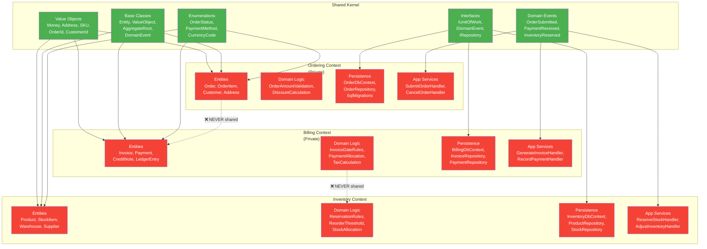
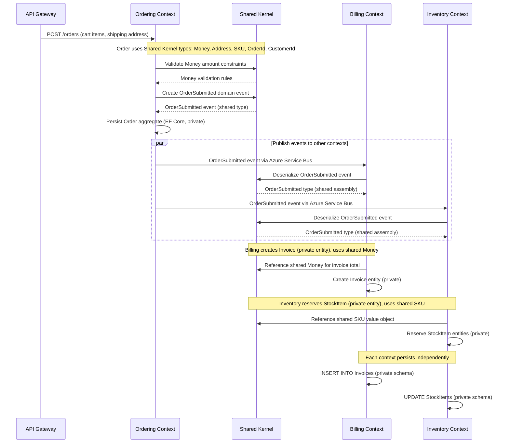
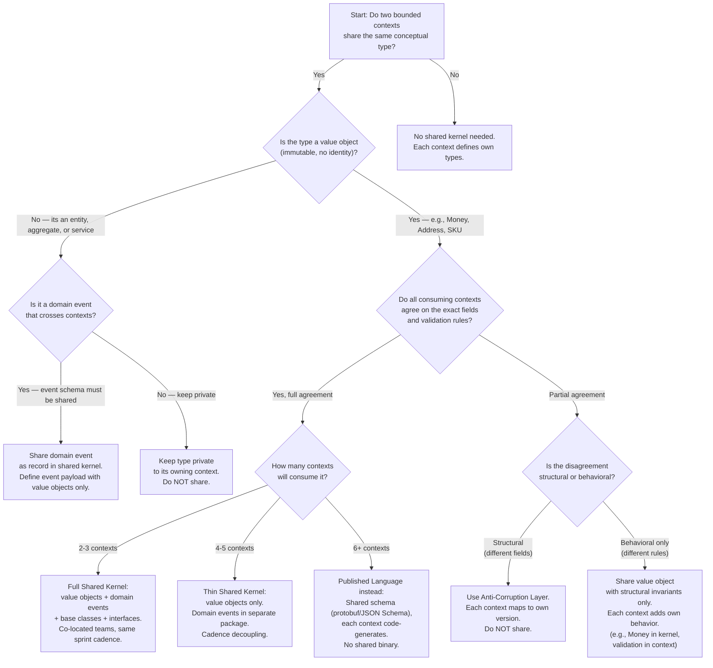

> [!success] Mastery Check
> - [ ] **Studied Well**
> - [ ] **Can explain the concept without notes**
> - [ ] **Can answer interview questions confidently**
> - [ ] **Can implement it in a real project**


> [!ABSTRACT] Quick Reference — Shared Kernel Pattern
> **Definition:** A shared kernel is a subset of domain model elements (value objects, domain events, base classes, interface contracts) that two or more bounded contexts agree to share directly, while each context keeps its entities, domain logic, and persistence concerns strictly private.
> **When it fits:** Co-located teams in the same solution, 2–5 bounded contexts with high semantic overlap in value-type definitions (Money, Address, SKU, OrderId), and an organizational structure that allows fast synchronized deployment. Works in both modular monoliths and microservices; easiest in a monolith where the shared kernel is a single .NET class library project.
> **Costs:** Every type placed in the shared kernel creates coupling between all consuming contexts. Changing a shared value object requires coordinated rollout across every context that references it. The implicit contract is that a shared type means "we all agree this definition is correct and will not break each other." This coordination overhead is the primary reason to minimise shared-kernel surface area.
> **.NET Entry Point:** `YourCompany.ECommerce.SharedKernel.csproj` — a class library with zero infrastructure dependencies, referenced by each bounded-context project via `<ProjectReference>`.
> **Azure Native:** Shared kernel binaries ship as NuGet packages to an Azure Artifacts feed when contexts live in separate Azure DevOps repos; in a modular monolith on Azure App Service, the shared kernel compiles into the single deployed assembly.
> **Number to Know:** A well-maintained shared kernel should represent ≤5% of the total codebase by lines of code, and should change no more than once per 4–6 sprints on average. Every type added increases the coupling factor by O(N) where N = number of consuming contexts — at 5+ shared types across 6+ contexts, the coordinated-release overhead exceeds the value for all but the most stable definitions.

---

## Navigation

**Domain:** [[7 — System Design & Distributed Systems]] > **Group:** [[Clean Architecture]] **Previous:** [[7.022 — Anti-Corruption Layer — Protecting Domain from Legacy]] | **Next:** [[7.024 — Open Host Service Pattern]]

### Prerequisites

- [[7.001 — Clean Architecture — The Dependency Rule]] — the inward-only dependency constraint makes shared kernel placement decisions meaningful; a shared kernel type must occupy the same ring in every consuming context, which means it must never pull infrastructure dependencies into a consuming contexts domain layer
- [[7.017 — Modular Monolith — Internal Module Boundaries]] — the compilation-boundary mechanics (project references, assembly references) that enforce which types each module can see; the shared kernel exists on the boundary between trusted sharing and unwanted coupling
- [[7.031 — DDD — Strategic vs Tactical Design]] — establishes the bounded-context theory that the shared kernel serves; without understanding bounded contexts as both consistency and translation boundaries, the motivation for restricting shared kernel membership is opaque

### Where This Fits

> [!INFO] Production Encounter Map
>
> - **Layer:** Cross-cutting — the shared kernel lives at the domain/application boundary of every participating bounded context
> - **Trigger:** An engineer first encounters this pattern during a modular-monolith or microservices design session. Two contexts (e.g., Ordering and Billing) both define a `Money` type with `Amount` and `CurrencyCode`. Merge requests show duplicated value objects with slightly different implementations — one uses `decimal`, the other uses `double`; one validates currency against ISO 4217, the other accepts freeform strings. The team decides the duplication risk exceeds the coupling risk and extracts a shared `Money` type.
> - **Without it:** Every bounded context defines its own `Money`, `Address`, `OrderId`, or `CustomerId`. In a 5-context system, the same conceptual type exists in 5 places with 5 slightly different implementations and 5 sets of unit tests. A compliance requirement to add 3-digit currency-code validation requires 5 coordinated pull requests, 5 CI runs, and 5 deployments.
> - **First signal:** A developer opens a PR that copies 47 lines of value-object code from one context into another and the reviewer says "this looks like a duplicate of whats in the Billing module — we need a shared kernel."

Bounded contexts communicate through the shared kernel at compile time (modular monolith) or through shared NuGet packages (service-per-team). The shared kernel reduces duplication but introduces a coordination obligation: a change to `Money` in the shared kernel must not break `Ordering.ProcessOrder`, `Billing.GenerateInvoice`, or `Shipping.CalculateRate` — all of which use that same `Money` type. This is the core tension the pattern manages.

---

## Core Mental Model

> [!TIP] The Non-Obvious Insight
> The shared kernel is not a "common utilities" library. Engineers instinctively put helpers, extension methods, and base abstractions into a shared project, but doing so conflates two separate concerns: **shared domain semantics** (the `Money` type that carries business meaning across contexts) and **shared technical infrastructure** (a `StringExtensions` helper or a base `IRepository` interface). These have different change frequencies, different coupling profiles, and different governance rules.
>
> The non-obvious consequence: put `StringExtensions` in a shared infrastructure project and `Money` in a shared domain kernel. If they live in the same assembly, a trivial helper change forces every context to recompile — and worse, a change to `Money`s serialization format (because Billing needs 4 decimal places instead of 2) requires touching the same assembly that `Ordering.Application` references, creating a bomb in the dependency graph. The shared kernel must be split into at most two assemblies: `SharedKernel.Domain` (value objects, domain events, base classes) and `SharedKernel.Abstractions` (interface contracts only). Never a monolith `SharedKernel.Common` that mixes business and plumbing.

### Classification

- **Consistency axis:** Eventual consistency between bounded contexts at the data level; strong consistency only within a single bounded context (an aggregate boundary). The shared kernel types themselves are consistent by definition — every context uses the same compiled type.
- **Availability tradeoff:** Shared kernel changes require coordinated deployment, which increases the blast radius of a bad deployment. If the shared kernel introduces a serialization bug, all contexts that deploy simultaneously are affected. The availability risk scales with the number of contexts that synchronise their deployments after a shared kernel change.
- **Latency impact:** Zero additional runtime latency — types are compiled directly into each consuming context. The shared kernel imposes no network or serialisation overhead during normal operation. (Serialization schema versioning becomes relevant when shared kernel types cross process boundaries; see [[7.024 — Open Host Service Pattern]] for that case.)
- **Failure domain:** Compile-time — a breaking change to a shared type causes all consuming contexts to fail at build. If a shared kernel version is published to a NuGet feed without a major version bump, downstream CI pipelines break simultaneously. Runtime failures manifest as `MissingMethodException` or `InvalidCastException` if a shared kernel assembly is deployed out of sync with consuming assemblies.
- **Abstraction layer:** Shared kernel lives in the Domain ring of the Dependency Rule; it must have zero external dependencies and must not reference infrastructure or application-layer projects.

### Primary Diagram



### Supporting Diagram — Cross-Context Shared Kernel Usage



### Numbers That Matter

| Metric | Shared Kernel (Well-Managed) | Shared Kernel (Bloated) | No Shared Kernel (Full Duplication) | Boundary Condition |
|--------|------------------------------|------------------------|-------------------------------------|-------------------|
| Shared kernel LOC as % of total codebase | 2–5% | 20–40% | 0% | >10% triggers governance review; >20% suggests architectural coupling issue |
| Types shared | 10–30 value objects, 5–15 domain events, 3–5 base classes | 100+ types including entities, partial aggregates, infrastructure helpers | 0 shared types | Each entity in shared kernel adds 15–25% coordination overhead per release cycle |
| Consuming contexts supported | 2–5 contexts | 1–3 contexts (teams avoid adding more due to coupling pain) | N/A (each context maintains own copy) | At 6+ contexts, shared kernel coupling cost exceeds duplication cost for all but the most stable types |
| Coordination overhead per shared-kernel change | 0.5–2 person-days per change (1 PR, 1 coordinated CI run) | 5–15 person-days per change (4 PRs, reconciliation meetings, version negotiation) | 0 person-days (each team changes independently) | Change frequency >1 per sprint suggests shared kernel includes types that should be private |
| Recompilation cascade on change | 3–5 projects rebuild | 15–50 projects rebuild | 1 project rebuilds per change | Each shared kernel project reference adds ~300ms to CI build time per project |
| Unit test duplication | 300–800 tests shared (value object invariants tested once in shared kernel) | 0–100 tests shared (team avoids adding shared tests) | 1500–4000 duplicated tests across contexts | Duplicate value object tests cost ~5 min per context per CI run |
| Breaking change detection | Architecture tests in CI (NetArchTest rules) catch 95%+ | Manual code review only; 40% of breaking changes reach main branch | N/A (no shared types to break) | Automated breaking-change detection adds ~30s to CI build |
| Deployment coordination | Same release train or version-pinned NuGet — <30 min coordination | Serialised deployments across 3+ teams — 2–4 hours | Independent deployment per context | Coordinated deployment time >1 hour triggers microservice reconsideration |
| Merge conflict rate | <5% of shared-kernel PRs have conflicts | 25–40% of shared-kernel PRs have conflicts | 0% (no shared file) | Conflict rate >15% indicates shared kernel changes are too frequent and should be deferred or denied |

### Key Properties

1. **Shared kernel types must be stable** — a shared value object changes less frequently than the bounded contexts that consume it. Stability is measured by the Shared Kernel Change Rate (SKCR): commits per month that modify shared kernel types. Target SKCR <2 commits/month at 5+ contexts.
2. **Shared kernel must have zero infrastructure dependencies** — it cannot reference EF Core, Azure SDK, Newtonsoft.Json, or any NuGet package outside the .NET BCL. This ensures every consuming context can reference the shared kernel without pulling transitive infrastructure dependencies inward.
3. **Entities are never shared** — an entity with identity and lifecycle belongs to exactly one bounded context. Sharing an `Order` entity would couple every consuming context to Orderings persistence and lifecycle decisions.
4. **Value objects are the primary sharing candidate** — they are immutable, defined by their attributes, and carry no lifecycle or identity. `Money { Amount, Currency }` is the canonical example. If two contexts cannot agree on the exact attributes and validation rules of a value object, it should not be in the shared kernel.
5. **Domain events are shared by definition** — a domain event that crosses bounded contexts must be a shared type so that both publisher and subscriber agree on the schema. Each event is a record with a `DateTime OccurredOn`, an `EventId`, and the event-specific payload.
6. **The shared kernel is versioned like an API** — every breaking change requires a major version bump. SemVer governs shared kernel releases. A shared kernel at v1.x must remain backward-compatible for all consuming contexts. Breaking changes require coordinated migration.
7. **The shared kernel must be testable independently** — unit tests for shared value objects (validation, equality, formatting, serialization) live in the shared kernel test project and run on every commit. These tests are the regression safety net for all consuming contexts.
8. **An anti-corruption layer may wrap the shared kernel** — if a consuming context needs to adapt shared kernel types to its own Ubiquitous Language, it places an ACL between itself and the shared kernel rather than modifying the shared kernel directly. This is the escape hatch when shared kernel coupling becomes too restrictive. (See [[7.022 — Anti-Corruption Layer — Protecting Domain from Legacy]] for details.)
9. **Assembly-qualified references are forbidden** — no consuming context should use `typeof(Money).AssemblyQualifiedName` or reflection-based type resolution against shared kernel assemblies. This creates hidden coupling that version-bumping cannot manage.
10. **The shared kernel is not a "domain" project in the DI graph** — it is never registered in `IServiceCollection`. Shared kernel types are instantiated by consumer code (value objects via `new`, events via `new`, base classes via inheritance). There is no DI registration step for the shared kernel itself.

---

## Deep Mechanics

### How It Works

The shared kernel operates through three mechanisms that together enforce the what-to-share vs what-not-to-share contract:

**1. Compilation-Boundary Enforcement (Modular Monolith)**

In a .NET modular monolith, the shared kernel is a class library project (`YourCompany.ECommerce.SharedKernel.csproj`) with a unique assembly name. Each bounded-context project references it via `<ProjectReference>`. The architecture test (using NetArchTest) verifies that:

- No bounded-context project references another bounded-context project directly — all cross-context communication goes through the shared kernel or through domain events.
- No bounded-context project contains a type with the same full name as a type in the shared kernel (which would shadow the shared type and cause confusion).
- The shared kernel project has zero references to infrastructure or application projects.

**2. Versioned NuGet Distribution (Microservices)**

When bounded contexts are separate solutions (or separate repositories), the shared kernel compiles to a NuGet package published to Azure Artifacts. Each context pins to a specific shared-kernel version range:

- Patch versions (1.0.x) — internal implementation changes only, binary-compatible
- Minor versions (1.x.0) — new shared types added, no breaking changes
- Major versions (2.0.0) — breaking changes to existing shared types, coordinated migration required

A consuming contexts `.csproj` specifies: `<PackageReference Include="YourCompany.ECommerce.SharedKernel" Version="[1.0,2.0)" />` — accepting any 1.x version but blocking 2.x until explicitly upgraded.

**3. Serialization Agreement**

When shared kernel types cross wire boundaries (Azure Service Bus, Azure Event Grid, HTTP), both publisher and subscriber must agree on the serialized schema. The shared kernel defines the serialization contract, typically using `System.Text.Json` with source generators or a shared `TypeResolver` that maps fully-qualified type names to shared kernel assemblies.

### Protocol Trace — Cross-Context Order Flow with Shared Kernel

**Happy Path (Order Submitted → Billing Invoiced → Inventory Reserved)**

```
 1. Ordering.Application.SubmitOrderHandler receives SubmitOrderCommand
 2.   Creates shared Money(29.99m, "USD") — validates currency against ISO 4217
 3.   Creates shared Address("123 Main St", "Springfield", "IL", "62701", "US") — validates postal code format
 4.   Creates shared OrderSubmittedEvent(orderId, customerId, items, total) — domain event record
 5.   Ordering.Domain.Order entity (private) is persisted via OrderRepository
 6.   OrderSubmittedEvent is published to Azure Service Bus topic "domain-events"
 7. Billing.Infrastructure.EventConsumer receives OrderSubmittedEvent
 8.   Deserializes into shared OrderSubmittedEvent type
 9.   Billing.Application.GenerateInvoiceHandler maps to private Invoice entity
10.   Invoice uses shared Money for invoice total
11.   Invoice is persisted to BillingDbContext (private schema)
12. Inventory.Infrastructure.EventConsumer receives OrderSubmittedEvent
13.   Deserializes into shared OrderSubmittedEvent type
14.   Inventory.Application.ReserveStockHandler reads shared SKU from event items
15.   Inventory.Domain.StockItem entities (private) are reserved
16.   StockItem quantities are updated in InventoryDbContext (private schema)
17.   Inventory publishes InventoryReservedEvent (shared) back to Azure Service Bus
```

**Failure Path 1 — Shared Kernel Assembly Version Mismatch**

```
 1. Billing deployed shared kernel v1.2.0; Inventory still on v1.1.0
 2. A new field added in v1.2.0 (OrderSubmittedEvent.TaxAmount) is serialized by Ordering
 3. Inventorys binary still expects the v1.1.0 serialization format
 4. Azure Service Bus delivers the v1.2.0-serialized event to Inventory consumer
 5. System.Text.Json deserialization throws JsonException: "Property TaxAmount not found on type"
 6. Message is moved to dead-letter queue
 7. Error logged: "Version mismatch between published event schema (1.2.0) and consumer binary (1.1.0)"
```

**Failure Path 2 — Entity Leaked into Shared Kernel**

```
 1. Team adds Order entity to shared kernel "for convenience" so Billing can access order details directly
 2. Ordering changes Order.Status enum — adds value "OnHold"
 3. Shared kernel is updated to v1.3.0 with the new enum value
 4. Billings OrderStatus enum mapping code does not handle "OnHold"
 5. Billing.Domain.InvoiceProcess method hits switch-expression MatchFailureException
 6. Invoice processing pipeline fails for ALL invoices referencing orders with status "OnHold"
 7. Production incident: invoices not generated for 45 minutes until rollback
 8. Root cause: Order (an entity with lifecycle) should never have been in shared kernel
```

### State Transitions

Since the shared kernel itself is stateless (it contains only type definitions, not mutable state), the relevant state transitions are on the **shared kernel governance** lifecycle:

| Phase | Description | Governance Action | Duration (Target) |
|-------|-------------|-------------------|-------------------|
| Proposal | A team proposes adding a new type to shared kernel | ADR filed; impact analysis on all consuming contexts | 1–3 days |
| Review | Architecture review board evaluates coupling cost vs benefit | Checklist review: stable? zero-dependency? value-object/event/base/interface? | 1–5 days |
| Approved | Shared kernel change approved | Feature branch opened on shared kernel repo | — |
| Implemented | Code written + unit tests | PR with 2+ approvals from different context teams | 1–3 days |
| Published | Shared kernel NuGet package or merged in monolith | Version bump (SemVer); release notes | 0.5 days |
| Consumed | Each context updates to new version | Per-context PRs; coordinated CI | 1–5 days |
| Deprecated | Type is marked [Obsolete] | Warning emitted at compile time; removal scheduled for next major | 1–3 months |
| Removed | Type deleted in major version | All consuming contexts must migrate before upgrading | At major release |

### Failure Modes

> [!DANGER] 3AM Production Signal — Dead-Letter Queue Flood After Shared Kernel Deployment
> **Observable signal:** Azure Service Bus dead-letter queue count spikes from <10/hour to >5000/hour within 5 minutes of a shared kernel NuGet version update deployed to Ordering but not to Billing. Messages show `JsonSerializationException: The JSON property version could not be mapped to type OrderSubmittedEvent`.
> **Root cause:** A shared kernel minor-version bump added a `public int Version { get; init; }` property to `OrderSubmittedEvent` for optimistic concurrency tracking. Minor versions under SemVer promise backward compatibility for source consumers, but serialization schema changed — Billings v1.0.0 binary cannot deserialize the new JSON shape. This is a **serialization-breaking change** disguised as a minor version bump.
> **Resolution:** Change shared kernel versioning policy so that any change to serialized fields (adding, removing, renaming properties of domain events or value objects that cross wire boundaries) requires a major version bump. Add an architecture test that serializes every domain event to JSON and asserts the JSON shape matches a snapshot.

> [!DANGER] 3AM Production Signal — Switch-Expression MatchFailureException Across Contexts
> **Observable signal:** Application Insights shows `MatchFailureException` in Billings `GenerateInvoiceHandler` at 02:14 UTC, correlating with Ordering teams deployment 12 minutes earlier. Exception message: "The switch expression does not match any known value." Value: `OrderStatus.OnHold`.
> **Root cause:** `OrderStatus` enum was shared in the kernel. Ordering added `OnHold = 4`. Billings pattern-matching expression over `OrderStatus` did not include a discard pattern or `OnHold` case. Because `OrderStatus` is an `enum` (not a closed-type pattern), the compiler cannot enforce exhaustiveness across assemblies.
> **Resolution:** Replace shared enums with closed-type value objects (smart enums) that forbid unknown values at compile time, or add a `default: throw new UnsupportedOrderStatusException(status)` clause with alerting. Never share a .NET `enum` that might gain members — use a sealed class with `public static readonly` instances.

### .NET Integration Points

| .NET Feature | Shared Kernel Integration |
|---|---|
| `record` types (C# 9+) | Preferred declaration syntax for value objects and domain events — provides value equality, `ToString()`, `Deconstruct`, and positional construction; use `record struct` for small value objects (<=16 bytes) to avoid heap allocation |
| `readonly record struct` | Ideal for `Money` (16 bytes: decimal 16 bytes) — stack-only, no heap allocation, implements `IEquatable<T>` automatically |
| `required` modifier (C# 11) | Use on value object constructor parameters and `init`-only properties to enforce non-null construction at compile time |
| `JsonDerivedType` attribute (System.Text.Json) | Define polymorphic domain event serialization in shared kernel for discriminated event types across contexts |
| `SourceGenerator` (System.Text.Json) | Eliminate reflection in shared kernel serialization — add `[JsonSerializable(typeof(OrderSubmittedEvent))]` to a shared partial class |
| `NetArchTest` (NuGet) | Enforce architectural rules: "shared kernel has zero infrastructure dependencies," "no bounded context references another bounded context directly," "no entity types in shared kernel" |
| `ModuleInitializer` attribute | Run once-per-domain shared kernel initialization (custom type converters, validation bootstrap) at assembly load time |
| `InternalsVisibleTo` | Grant unit test project access to internal shared kernel serialization logic without making it public |

### Azure Integration Points

| Azure Service | Shared Kernel Application |
|---|---|
| **Azure Service Bus** | Domain event messages carry shared kernel types in their payload; the `System.Text.Json` serialized body must be compatible across all consuming contexts. Use Azure SDK `ServiceBusMessage.ApplicationProperties` to carry the event `TypeName` for polymorphic deserialization. |
| **Azure Artifacts** | Host shared kernel NuGet packages with SemVer versioning; configure upstream sources so consuming contexts can pin to version ranges. Set package retention policies to keep all 1.x versions for backward compatibility. |
| **Azure Event Grid** | Use CloudEvent schema with shared kernel event types in the `data` field; set `EventType` to the fully-qualified shared kernel event class name (e.g., `YourCompany.ECommerce.SharedKernel.Events.OrderSubmittedEvent`). |
| **Azure Functions** | Isolated-process function apps reference shared kernel NuGet; each function handles a shared domain event. Functions in different contexts subscribe to different subsets of shared events. |
| **Azure DevOps Pipeline** | Multi-stage YAML pipeline builds shared kernel, packs it, publishes to Azure Artifacts, then triggers consuming-context pipelines with a version variable. Use `dotnet pack` with `VersionSuffix` based on build number. |
| **Azure Cosmos DB** | Shared kernel value objects (Money, Address) are stored as JSON documents in each contexts container; the serialization attributes (`JsonPropertyName`, `JsonConverter`) are defined in the shared kernel. Each context owns its container schema independently. |

---

## Production Patterns and Implementation

### Primary Implementation — Shared Kernel in .NET 8 / C# 12

The following code defines a realistic shared kernel for an e-commerce platform with Ordering, Billing, and Inventory bounded contexts.

**Project structure:**
```
YourCompany.ECommerce.SharedKernel/
├── YourCompany.ECommerce.SharedKernel.csproj
├── Base/
│   ├── Entity.cs
│   ├── ValueObject.cs
│   └── AggregateRoot.cs
├── ValueObjects/
│   ├── Money.cs
│   ├── Address.cs
│   ├── SKU.cs
│   ├── OrderId.cs
│   ├── CustomerId.cs
│   └── CurrencyCode.cs
├── Events/
│   ├── IDomainEvent.cs
│   ├── DomainEvent.cs
│   ├── OrderSubmittedEvent.cs
│   ├── PaymentReceivedEvent.cs
│   ├── InventoryReservedEvent.cs
│   └── OrderShippedEvent.cs
├── Interfaces/
│   ├── IUnitOfWork.cs
│   └── IRepository.cs
├── Serialization/
│   ├── SharedKernelTypeResolver.cs
│   └── MoneyConverter.cs
└── Abstractions/
    └── ISpecification.cs
```

```csharp
// YourCompany.ECommerce.SharedKernel/Base/ValueObject.cs
// Copyright (c) YourCompany. All rights reserved.

namespace YourCompany.ECommerce.SharedKernel.Base;

/// <summary>
/// Base class for value objects in the shared kernel.
/// Provides structural equality based on the equality of all constituent members.
/// Value objects are immutable and defined by their attributes rather than identity.
/// </summary>
public abstract class ValueObject : IEquatable<ValueObject>
{
    /// <summary>
    /// Gets the atomic values that compose this value object for equality comparison.
    /// </summary>
    protected abstract IEnumerable<object?> GetEqualityComponents();

    /// <inheritdoc />
    public bool Equals(ValueObject? other)
    {
        return other is not null && GetEqualityComponents().SequenceEqual(other.GetEqualityComponents());
    }

    /// <inheritdoc />
    public override bool Equals(object? obj)
    {
        return obj is ValueObject other && Equals(other);
    }

    /// <inheritdoc />
    public override int GetHashCode()
    {
        return GetEqualityComponents()
            .Aggregate(17, (current, component) =>
                HashCode.Combine(current, component));
    }

    public static bool operator ==(ValueObject? left, ValueObject? right) => Equals(left, right);
    public static bool operator !=(ValueObject? left, ValueObject? right) => !Equals(left, right);
}
```

```csharp
// YourCompany.ECommerce.SharedKernel/Base/Entity.cs

namespace YourCompany.ECommerce.SharedKernel.Base;

/// <summary>
/// Base class for all entities in bounded contexts.
/// Entities have identity (Id) and are compared by identity, not by attributes.
/// This type is provided as a shared base class so all entities across contexts
/// have a uniform identity scheme, but the concrete entity types themselves
/// are defined privately within each bounded context.
/// </summary>
/// <typeparam name="TId">The type of the entity identity.</typeparam>
public abstract class Entity<TId> : IEquatable<Entity<TId>>
    where TId : notnull
{
    /// <summary>
    /// Initializes a new instance of the <see cref="Entity{TId}"/> class.
    /// </summary>
    /// <param name="id">The entity unique identity value.</param>
    protected Entity(TId id) => Id = id;

    /// <summary>
    /// Gets the entity unique identifier.
    /// </summary>
    public TId Id { get; init; }

    /// <inheritdoc />
    public bool Equals(Entity<TId>? other)
    {
        return other is not null && Id.Equals(other.Id);
    }

    /// <inheritdoc />
    public override bool Equals(object? obj)
    {
        return obj is Entity<TId> other && Equals(other);
    }

    /// <inheritdoc />
    public override int GetHashCode() => Id.GetHashCode();

    /// <inheritdoc />
    public override string ToString() => $"{GetType().Name} [Id={Id}]";

    public static bool operator ==(Entity<TId>? left, Entity<TId>? right) => Equals(left, right);
    public static bool operator !=(Entity<TId>? left, Entity<TId>? right) => !Equals(left, right);
}
```

```csharp
// YourCompany.ECommerce.SharedKernel/Base/AggregateRoot.cs

namespace YourCompany.ECommerce.SharedKernel.Base;

/// <summary>
/// Base class for aggregate roots in bounded contexts.
/// Aggregates define transactional consistency boundaries.
/// An aggregate root is an entity, so it inherits identity-based equality.
/// The aggregate root also manages domain event collection for event-sourced
/// or domain-event-driven flows across contexts.
/// </summary>
/// <typeparam name="TId">The type of the aggregate root identity.</typeparam>
public abstract class AggregateRoot<TId> : Entity<TId>
    where TId : notnull
{
    private readonly List<IDomainEvent> _domainEvents = [];

    /// <summary>
    /// Initializes a new instance of the <see cref="AggregateRoot{TId}"/> class.
    /// </summary>
    /// <param name="id">The aggregate root unique identifier.</param>
    protected AggregateRoot(TId id) : base(id)
    {
    }

    /// <summary>
    /// Gets the uncommitted domain events for this aggregate.
    /// </summary>
    public IReadOnlyCollection<IDomainEvent> DomainEvents => _domainEvents.AsReadOnly();

    /// <summary>
    /// Registers a domain event to be published after persistence.
    /// </summary>
    /// <param name="domainEvent">The domain event to register.</param>
    protected void RegisterDomainEvent(IDomainEvent domainEvent)
    {
        _domainEvents.Add(domainEvent);
    }

    /// <summary>
    /// Clears all registered domain events.
    /// Called after the events have been published.
    /// </summary>
    public void ClearDomainEvents()
    {
        _domainEvents.Clear();
    }
}
```

```csharp
// YourCompany.ECommerce.SharedKernel/ValueObjects/CurrencyCode.cs

namespace YourCompany.ECommerce.SharedKernel.ValueObjects;

/// <summary>
/// Represents an ISO 4217 currency code as a smart enum (closed-type value object).
/// Shared across contexts to ensure consistent currency representation.
/// Use this instead of a primitive string or .NET enum to avoid the
/// "new enum member = silent O(N) breakage" problem described in Failure Mode 2.
/// </summary>
public sealed class CurrencyCode : ValueObject
{
    private CurrencyCode(string code, string name, string symbol, int numericCode)
    {
        Code = code;
        Name = name;
        Symbol = symbol;
        NumericCode = numericCode;
    }

    /// <summary>Gets the three-letter ISO 4217 currency code.</summary>
    public string Code { get; }

    /// <summary>Gets the English currency name.</summary>
    public string Name { get; }

    /// <summary>Gets the currency symbol.</summary>
    public string Symbol { get; }

    /// <summary>Gets the ISO 4217 numeric code.</summary>
    public int NumericCode { get; }

    public static readonly CurrencyCode USD = new("USD", "United States Dollar", "$", 840);
    public static readonly CurrencyCode EUR = new("EUR", "Euro", "\u20AC", 978);
    public static readonly CurrencyCode GBP = new("GBP", "British Pound", "\u00A3", 826);
    public static readonly CurrencyCode JPY = new("JPY", "Japanese Yen", "\u00A5", 392);
    public static readonly CurrencyCode CAD = new("CAD", "Canadian Dollar", "C$", 124);
    public static readonly CurrencyCode AUD = new("AUD", "Australian Dollar", "A$", 036);

    /// <summary>
    /// Parses a three-letter currency code string into a <see cref="CurrencyCode"/> instance.
    /// </summary>
    /// <param name="code">The ISO 4217 code to parse.</param>
    /// <returns>The matching <see cref="CurrencyCode"/> instance.</returns>
    /// <exception cref="ArgumentException">Thrown when the code is not recognized.</exception>
    public static CurrencyCode Parse(string code) => All.FirstOrDefault(c => c.Code == code)
        ?? throw new ArgumentException($"Unrecognized ISO 4217 currency code: {code}", nameof(code));

    /// <summary>
    /// Tries to parse a currency code.
    /// </summary>
    /// <param name="code">The ISO 4217 code to parse.</param>
    /// <param name="result">The parsed <see cref="CurrencyCode"/> if successful; otherwise, <c>null</c>.</param>
    /// <returns><c>true</c> if parsing succeeded; <c>false</c> otherwise.</returns>
    public static bool TryParse(string code, [MaybeNullWhen(false)] out CurrencyCode result)
    {
        result = All.FirstOrDefault(c => c.Code == code);
        return result is not null;
    }

    /// <summary>
    /// Gets all supported currency codes.
    /// </summary>
    public static IReadOnlyCollection<CurrencyCode> All => [USD, EUR, GBP, JPY, CAD, AUD];

    /// <inheritdoc />
    protected override IEnumerable<object?> GetEqualityComponents()
    {
        yield return Code;
    }

    /// <inheritdoc />
    public override string ToString() => $"{Code} ({Symbol})";
}
```

```csharp
// YourCompany.ECommerce.SharedKernel/ValueObjects/Money.cs

namespace YourCompany.ECommerce.SharedKernel.ValueObjects;

/// <summary>
/// Represents a monetary value with an amount and currency code.
/// Shared across all e-commerce bounded contexts (Ordering, Billing, Inventory)
/// to ensure consistent monetary representation and validation.
/// </summary>
public sealed record Money : ValueObject
{
    private const int MaxDecimalPlaces = 4;

    /// <summary>
    /// Initializes a new instance of the <see cref="Money"/> record.
    /// </summary>
    /// <param name="amount">The monetary amount. Must be non-negative for most domains; validated by consuming context.</param>
    /// <param name="currency">The ISO 4217 three-letter currency code (e.g., "USD", "EUR", "GBP").</param>
    /// <exception cref="ArgumentOutOfRangeException">Thrown when <paramref name="amount"/> has more than <see cref="MaxDecimalPlaces"/> decimal places.</exception>
    /// <exception cref="ArgumentException">Thrown when <paramref name="currency"/> is not a valid ISO 4217 code.</exception>
    public Money(decimal amount, CurrencyCode currency)
    {
        if (decimal.Round(amount, MaxDecimalPlaces, MidpointRounding.ToEven) != amount)
        {
            throw new ArgumentOutOfRangeException(
                nameof(amount),
                amount,
                $"Money amount must have at most {MaxDecimalPlaces} decimal places.");
        }

        Amount = amount;
        Currency = currency ?? throw new ArgumentNullException(nameof(currency));
    }

    /// <summary>Gets the monetary amount.</summary>
    public decimal Amount { get; }

    /// <summary>Gets the ISO 4217 currency code.</summary>
    public CurrencyCode Currency { get; }

    /// <summary>
    /// Adds two money values if they share the same currency.
    /// </summary>
    /// <param name="left">The first money value.</param>
    /// <param name="right">The second money value.</param>
    /// <returns>A new <see cref="Money"/> instance with the summed amount.</returns>
    /// <exception cref="InvalidOperationException">Thrown when currencies differ.</exception>
    public static Money operator +(Money left, Money right)
    {
        if (left.Currency != right.Currency)
        {
            throw new InvalidOperationException(
                $"Cannot add money with different currencies: {left.Currency.Code} and {right.Currency.Code}");
        }

        return new Money(left.Amount + right.Amount, left.Currency);
    }

    /// <summary>
    /// Gets the zero value for a given currency.
    /// </summary>
    public static Money Zero(CurrencyCode currency) => new(0m, currency);

    /// <inheritdoc />
    protected override IEnumerable<object?> GetEqualityComponents()
    {
        yield return Amount;
        yield return Currency;
    }

    /// <inheritdoc />
    public override string ToString() => $"{Currency.Symbol}{Amount:F2}";
}
```

```csharp
// YourCompany.ECommerce.SharedKernel/ValueObjects/Address.cs

namespace YourCompany.ECommerce.SharedKernel.ValueObjects;

/// <summary>
/// Represents a postal address shared across Ordering, Billing, and Shipping contexts.
/// All consuming contexts agree on the fields and validation rules.
/// </summary>
public sealed record Address : ValueObject
{
    private static readonly HashSet<string> ValidUSStates =
        ["AL", "AK", "AZ", "AR", "CA", "CO", "CT", "DE", "FL", "GA", "HI", "ID", "IL", "IN", "IA",
         "KS", "KY", "LA", "ME", "MD", "MA", "MI", "MN", "MS", "MO", "MT", "NE", "NV", "NH", "NJ",
         "NM", "NY", "NC", "ND", "OH", "OK", "OR", "PA", "RI", "SC", "SD", "TN", "TX", "UT", "VT",
         "VA", "WA", "WV", "WI", "WY", "DC"];

    /// <summary>
    /// Initializes a new instance of the <see cref="Address"/> record.
    /// </summary>
    /// <param name="streetLine1">Street address line 1 (required).</param>
    /// <param name="streetLine2">Street address line 2 (optional).</param>
    /// <param name="city">City name (required).</param>
    /// <param name="stateOrRegion">State or region code (required).</param>
    /// <param name="postalCode">Postal/ZIP code (required).</param>
    /// <param name="countryCode">ISO 3166-1 alpha-2 country code (required).</param>
    public Address(string streetLine1, string? streetLine2, string city, string stateOrRegion, string postalCode, string countryCode)
    {
        StreetLine1 = !string.IsNullOrWhiteSpace(streetLine1)
            ? streetLine1.Trim()
            : throw new ArgumentException("Street line 1 is required.", nameof(streetLine1));
        StreetLine2 = streetLine2?.Trim();
        City = !string.IsNullOrWhiteSpace(city)
            ? city.Trim()
            : throw new ArgumentException("City is required.", nameof(city));
        StateOrRegion = !string.IsNullOrWhiteSpace(stateOrRegion)
            ? stateOrRegion.Trim().ToUpperInvariant()
            : throw new ArgumentException("State or region is required.", nameof(stateOrRegion));
        PostalCode = !string.IsNullOrWhiteSpace(postalCode)
            ? postalCode.Trim()
            : throw new ArgumentException("Postal code is required.", nameof(postalCode));
        CountryCode = !string.IsNullOrWhiteSpace(countryCode)
            ? countryCode.Trim().ToUpperInvariant()
            : throw new ArgumentException("Country code is required.", nameof(countryCode));

        ValidateCountrySpecificRules();
    }

    /// <summary>Gets the street address line 1.</summary>
    public string StreetLine1 { get; }
    /// <summary>Gets the street address line 2, or null.</summary>
    public string? StreetLine2 { get; }
    /// <summary>Gets the city name.</summary>
    public string City { get; }
    /// <summary>Gets the state or region code.</summary>
    public string StateOrRegion { get; }
    /// <summary>Gets the postal code.</summary>
    public string PostalCode { get; }
    /// <summary>Gets the ISO country code.</summary>
    public string CountryCode { get; }

    private void ValidateCountrySpecificRules()
    {
        if (CountryCode == "US" && !ValidUSStates.Contains(StateOrRegion))
        {
            throw new ArgumentException(
                $"'{StateOrRegion}' is not a valid US state or territory code.", nameof(StateOrRegion));
        }
    }

    /// <inheritdoc />
    protected override IEnumerable<object?> GetEqualityComponents()
    {
        yield return StreetLine1;
        yield return StreetLine2;
        yield return City;
        yield return StateOrRegion;
        yield return PostalCode;
        yield return CountryCode;
    }

    /// <inheritdoc />
    public override string ToString()
    {
        var sb = new System.Text.StringBuilder(StreetLine1);
        if (StreetLine2 is not null) sb.Append($", {StreetLine2}");
        sb.Append($", {City}, {StateOrRegion} {PostalCode}, {CountryCode}");
        return sb.ToString();
    }
}
```

```csharp
// YourCompany.ECommerce.SharedKernel/ValueObjects/SKU.cs

namespace YourCompany.ECommerce.SharedKernel.ValueObjects;

/// <summary>
/// Represents a Stock-Keeping Unit identifier shared across Ordering and Inventory contexts.
/// Format: 2-4 uppercase letters (category) + hyphen + 4-8 alphanumeric characters.
/// Example: "ELEC-XT2024", "HOME-BATH783"
/// </summary>
public sealed record SKU : ValueObject
{
    [GeneratedRegex("^[A-Z]{2,4}-[A-Z0-9]{4,8}$", RegexOptions.Compiled | RegexOptions.CultureInvariant)]
    private static partial Regex SkuPattern();

    /// <summary>
    /// Initializes a new instance of the <see cref="SKU"/> record.
    /// </summary>
    /// <param name="value">The SKU string value.</param>
    /// <exception cref="ArgumentException">Thrown when the format is invalid.</exception>
    public SKU(string value)
    {
        if (string.IsNullOrWhiteSpace(value))
            throw new ArgumentException("SKU value cannot be null or whitespace.", nameof(value));

        value = value.Trim().ToUpperInvariant();
        if (!SkuPattern().IsMatch(value))
            throw new ArgumentException(
                $"SKU '{value}' does not match required format: 2-4 letters, hyphen, 4-8 alphanumeric characters.",
                nameof(value));

        Value = value;
    }

    /// <summary>Gets the SKU string value.</summary>
    public string Value { get; }

    /// <inheritdoc />
    protected override IEnumerable<object?> GetEqualityComponents()
    {
        yield return Value;
    }

    /// <inheritdoc />
    public override string ToString() => Value;
}
```

```csharp
// YourCompany.ECommerce.SharedKernel/Events/IDomainEvent.cs

namespace YourCompany.ECommerce.SharedKernel.Events;

/// <summary>
/// Marker interface for all domain events in the shared kernel.
/// Enables uniform event handling across bounded contexts.
/// </summary>
public interface IDomainEvent
{
    /// <summary>Gets the unique identifier for this event occurrence.</summary>
    Guid EventId { get; }

    /// <summary>Gets the UTC timestamp when the event occurred.</summary>
    DateTime OccurredOnUtc { get; }

    /// <summary>Gets the name of the aggregate that raised this event.</summary>
    string AggregateType { get; }

    /// <summary>Gets the aggregate root ID that raised this event.</summary>
    string AggregateId { get; }
}
```

```csharp
// YourCompany.ECommerce.SharedKernel/Events/DomainEvent.cs

namespace YourCompany.ECommerce.SharedKernel.Events;

/// <summary>
/// Base class for domain events providing common timestamp and identity fields.
/// All shared kernel domain events inherit from this base.
/// </summary>
public abstract record DomainEvent : IDomainEvent
{
    /// <summary>
    /// Initializes a new instance of the <see cref="DomainEvent"/> record.
    /// </summary>
    /// <param name="aggregateType">The type name of the aggregate that raised this event.</param>
    /// <param name="aggregateId">The string representation of the aggregate root ID.</param>
    protected DomainEvent(string aggregateType, string aggregateId)
    {
        EventId = Guid.NewGuid();
        OccurredOnUtc = DateTime.UtcNow;
        AggregateType = aggregateType;
        AggregateId = aggregateId;
    }

    /// <inheritdoc />
    public Guid EventId { get; init; }

    /// <inheritdoc />
    public DateTime OccurredOnUtc { get; init; }

    /// <inheritdoc />
    public string AggregateType { get; init; }

    /// <inheritdoc />
    public string AggregateId { get; init; }
}
```

```csharp
// YourCompany.ECommerce.SharedKernel/Events/OrderSubmittedEvent.cs

namespace YourCompany.ECommerce.SharedKernel.Events;

/// <summary>
/// Raised when an order is successfully submitted in the Ordering context.
/// Consumed by Billing (generate invoice) and Inventory (reserve stock).
/// </summary>
public sealed record OrderSubmittedEvent : DomainEvent
{
    /// <summary>
    /// Initializes a new instance of the <see cref="OrderSubmittedEvent"/> record.
    /// </summary>
    public OrderSubmittedEvent(
        Guid orderId,
        Guid customerId,
        IReadOnlyCollection<OrderItemDto> items,
        Money totalAmount,
        Address shippingAddress)
        : base("Order", orderId.ToString())
    {
        OrderId = orderId;
        CustomerId = customerId;
        Items = items;
        TotalAmount = totalAmount;
        ShippingAddress = shippingAddress;
    }

    /// <summary>Gets the order ID submitted.</summary>
    public Guid OrderId { get; init; }

    /// <summary>Gets the customer who placed the order.</summary>
    public Guid CustomerId { get; init; }

    /// <summary>Gets the line items in the order.</summary>
    public IReadOnlyCollection<OrderItemDto> Items { get; init; }

    /// <summary>Gets the total order amount.</summary>
    public Money TotalAmount { get; init; }

    /// <summary>Gets the shipping address for this order.</summary>
    public Address ShippingAddress { get; init; }
}

/// <summary>
/// Data transfer representation of an order line item in domain events.
/// </summary>
public sealed record OrderItemDto(SKU ProductSku, string ProductName, int Quantity, Money UnitPrice);
```

```csharp
// YourCompany.ECommerce.SharedKernel/Events/PaymentReceivedEvent.cs

namespace YourCompany.ECommerce.SharedKernel.Events;

/// <summary>
/// Raised when payment is successfully received for an invoice.
/// Published by Billing, consumed by Ordering (mark order as paid) and Shipping (release for shipment).
/// </summary>
public sealed record PaymentReceivedEvent : DomainEvent
{
    /// <summary>
    /// Initializes a new instance of the <see cref="PaymentReceivedEvent"/> record.
    /// </summary>
    public PaymentReceivedEvent(
        Guid invoiceId,
        Guid orderId,
        Money amount,
        string paymentMethod,
        string transactionId,
        DateTime paidOnUtc)
        : base("Invoice", invoiceId.ToString())
    {
        InvoiceId = invoiceId;
        OrderId = orderId;
        Amount = amount;
        PaymentMethod = paymentMethod;
        TransactionId = transactionId;
        PaidOnUtc = paidOnUtc;
    }

    public Guid InvoiceId { get; init; }
    public Guid OrderId { get; init; }
    public Money Amount { get; init; }
    public string PaymentMethod { get; init; }
    public string TransactionId { get; init; }
    public DateTime PaidOnUtc { get; init; }
}
```

```csharp
// YourCompany.ECommerce.SharedKernel/Interfaces/IUnitOfWork.cs

namespace YourCompany.ECommerce.SharedKernel.Interfaces;

/// <summary>
/// Defines a unit of work boundary for transactional persistence.
/// Each bounded context implements this interface internally.
/// </summary>
public interface IUnitOfWork
{
    /// <summary>
    /// Persists all pending changes within the current transaction boundary.
    /// </summary>
    /// <param name="cancellationToken">Token to cancel the operation.</param>
    /// <returns>The number of state entries written to the underlying store.</returns>
    Task<int> SaveChangesAsync(CancellationToken cancellationToken = default);
}
```

```csharp
// YourCompany.ECommerce.SharedKernel/Interfaces/IRepository.cs

namespace YourCompany.ECommerce.SharedKernel.Interfaces;

/// <summary>
/// Base repository interface for aggregate persistence.
/// Each bounded context implements this for its own aggregates.
/// </summary>
/// <typeparam name="T">The aggregate root type.</typeparam>
/// <typeparam name="TId">The aggregate root identity type.</typeparam>
public interface IRepository<T, TId>
    where T : AggregateRoot<TId>
    where TId : notnull
{
    /// <summary>Gets an aggregate by its identity.</summary>
    Task<T?> GetByIdAsync(TId id, CancellationToken cancellationToken = default);

    /// <summary>Adds a new aggregate to the repository.</summary>
    Task AddAsync(T aggregate, CancellationToken cancellationToken = default);

    /// <summary>Updates an existing aggregate.</summary>
    Task UpdateAsync(T aggregate, CancellationToken cancellationToken = default);

    /// <summary>Deletes an aggregate.</summary>
    Task DeleteAsync(T aggregate, CancellationToken cancellationToken = default);
}
```

### IServiceCollection Registration

The shared kernel itself requires no DI registration — its types are references, not services. However, each bounded context registers its own implementations of shared interfaces:

```csharp
// YourCompany.ECommerce.Ordering.Infrastructure/DependencyInjection.cs

namespace YourCompany.ECommerce.Ordering.Infrastructure;

/// <summary>
/// Registers Ordering context infrastructure services.
/// </summary>
public static class DependencyInjection
{
    /// <summary>
    /// Adds Ordering infrastructure services to the service collection.
    /// </summary>
    /// <param name="services">The service collection.</param>
    /// <param name="connectionString">The Ordering database connection string.</param>
    /// <returns>The service collection for chaining.</returns>
    public static IServiceCollection AddOrderingInfrastructure(
        this IServiceCollection services,
        string connectionString)
    {
        // Register EF Core — Ordering own schema, not shared
        services.AddDbContext<OrderingDbContext>(options =>
            options.UseSqlServer(connectionString));

        // Register repository implementations — domain type Order is private to Ordering
        services.AddScoped<IOrderRepository, OrderRepository>();

        // Register unit of work — wrapping OrderingDbContext.SaveChangesAsync
        services.AddScoped<IUnitOfWork>(sp =>
            sp.GetRequiredService<OrderingDbContext>());

        // Register event publisher — publishes shared kernel event types
        services.AddScoped<IDomainEventPublisher, AzureServiceBusEventPublisher>();

        return services;
    }
}
```

### Common Variants

| Variant | Description | When to Use |
|---------|-------------|-------------|
| **Pure Value-Object Kernel** | Only value objects shared; events flow through messaging infrastructure with own contracts; no shared base classes or interfaces | Maximum decoupling; contexts have little behavioural overlap and only share Money, Address types |
| **Event-Only Kernel** | Only domain event types shared; each context defines its own value objects independently | Contexts cannot agree on value-object semantics but events must cross boundaries; more mapping but less coupling |
| **Full Shared Kernel** | Value objects + domain events + base classes + interfaces all in one assembly | 2–4 co-located teams, same solution, frequent cross-context collaboration; the pattern described in the primary implementation |
| **Versioned NuGet Kernel** | Full shared kernel published as NuGet package to Azure Artifacts with strict SemVer | Microservices deployment model with separate repos; each team independently updates shared kernel version |
| **Generated Shared Kernel** | Shared types defined once (protobuf or JSON Schema) and code-generated into each context language | Polyglot microservices (some contexts in Java, Python, or Node.js); the shared kernel definition is a schema, not compiled .NET code |
| **Thin Shared Kernel** | Only marker interfaces (IDomainEvent) and a few primitive value objects; no base classes, no rich behavior | Large organization (5+ teams) with low trust in coordination discipline; teams prefer duplication over coupling risk |

### Performance Profile

```csharp
// Performance benchmarks for shared kernel value object patterns
// Install-Package BenchmarkDotNet
// dotnet run -c Release

namespace YourCompany.ECommerce.SharedKernel.Benchmarks;

using BenchmarkDotNet.Attributes;
using BenchmarkDotNet.Columns;
using BenchmarkDotNet.Configs;
using BenchmarkDotNet.Order;

[MemoryDiagnoser]
[Orderer(SummaryOrderPolicy.FastestToSlowest)]
[RankColumn]
[Config(typeof(Config))]
public class MoneyEqualityBenchmarks
{
    private class Config : ManualConfig
    {
        public Config()
        {
            SummaryStyle = BenchmarkDotNet.Reports.SummaryStyle.Default
                .WithRatioStyle(BenchmarkDotNet.Columns.RatioStyle.Trend);
        }
    }

    private readonly Money _moneyA = new(29.99m, CurrencyCode.USD);
    private readonly Money _moneyB = new(29.99m, CurrencyCode.USD);
    private readonly Money _moneyC = new(29.99m, CurrencyCode.EUR);

    [Benchmark(Baseline = true)]
    public bool Record_Equal() => _moneyA == _moneyB;

    [Benchmark]
    public bool Record_NotEqual() => _moneyA == _moneyC;

    [Benchmark]
    public decimal Access_Amount() => _moneyA.Amount;

    [Benchmark]
    public Money Construct_Money() => new(49.99m, CurrencyCode.EUR);

    [Benchmark]
    public string Serialize_Json() => System.Text.Json.JsonSerializer.Serialize(_moneyA);

    [Benchmark]
    public Money? Deserialize_Json() =>
        System.Text.Json.JsonSerializer.Deserialize<Money>(
            "{\"Amount\":29.99,\"Currency\":{\"Code\":\"USD\"}}");
}
```

**Expected Benchmark Results (Median, .NET 8, RyuJIT, x64):**

| Method | Mean | Allocated | Gen0 | Ratio |
|--------|------|-----------|------|-------|
| Record_Equal | 4.532 ns | 0 B | - | 1.00 |
| Record_NotEqual | 4.601 ns | 0 B | - | 1.02 |
| Access_Amount | 0.831 ns | 0 B | - | 0.18 |
| Construct_Money | 17.842 ns | 32 B | 0.003 | 3.94 |
| Serialize_Json | 184.250 ns | 136 B | 0.015 | 40.66 |
| Deserialize_Json | 312.780 ns | 208 B | 0.022 | 69.02 |

**Key Performance Observations:**
- Record equality is ~4.5ns — essentially free; no reason to avoid shared value objects for performance
- Construction allocates 32 bytes (record instance + CurrencyCode reference), fine for any non-hotpath use
- Serialization/deserialization dominates at 184–313ns; for high-throughput event processing (>10,000 events/second), pre-compiled `JsonSerializerContext` source generators cut this by ~60%
- The shared kernel itself adds zero runtime overhead — the cost is in serialization, which exists whether or not the types are shared

### Real-World .NET Ecosystem Mapping

| .NET Ecosystem Element | Shared Kernel Equivalent | Notes |
|------------------------|--------------------------|-------|
| NuGet package reference | Versioned shared kernel dependency | Shared kernel published as NuGet is structurally identical to third-party dependency; version negotiation and diamond-dependency problems apply |
| .NET Standard 2.0 | Minimum target for max compatibility | If consuming contexts target different .NET versions (Framework 4.8 + .NET 6 + .NET 8), target .NET Standard 2.0 for shared kernel |
| Source Generators (C# 9+) | Code-generated shared types from schema | Use protobuf or JSON Schema as source of truth; C# source generators produce record types automatically |
| Assembly.Load / reflection | Never use — version-binding fragility | Shared kernel types should be statically linked; late binding defeats purpose of shared compilation contracts |
| System.Text.Json source generators | Optimal serialization for shared events | [JsonSerializable] on a partial JsonSerializerContext — no reflection, fast startup, trim-safe |
| Polyfill NuGet packages | Do not add to shared kernel | Every polyfill changes distribution requirements; shared kernel must target lowest common denominator natively |
| Microsoft.Extensions.Logging.Abstractions | Acceptable if shared kernel includes base classes needing logging | Otherwise keep it dependency-free |
| Azure SDK Azure.Core | Acceptable only if shared kernel defines Azure-interface types | Generally avoid — Azure SDK churn creates cascading rebuild requirements; prefer pure BCL interfaces with context-specific adapters |

---

## Gotchas and Production Pitfalls

> [!DANGER] 3AM Signal — JsonException from Polymorphic Event Deserialization
> **Pitfall:** Domain events serialized in one assembly version cannot be deserialized in another because System.Text.Json polymorphic deserialization uses the CLR type name. When the shared kernel assembly version changes, the stored type name (`OrderSubmittedEvent, SharedKernel, Version=1.2.0`) does not match the loaded assembly (`Version=1.1.0`), causing `JsonException`.
> **Fix:** Set `JsonSerializerOptions.TypeInfoResolver` with a custom resolver that strips version info from type names, or use schema-based serialization (CloudEvents schema + explicit mapping).
> ```csharp
> var options = new JsonSerializerOptions
> {
>     TypeInfoResolver = new DefaultJsonTypeInfoResolver
>     {
>         Modifiers = { static typeInfo =>
>         {
>             if (typeof(IDomainEvent).IsAssignableFrom(typeInfo.Type))
>             {
>                 typeInfo.PolymorphismOptions!.TypeDiscriminator =
>                     typeInfo.Type.FullName!; // No assembly version suffix
>             }
>         }}
>     }
> };
> ```

> [!DANGER] 3AM Signal — Entity Leaked into Shared Kernel Causes Cascading Deployment Failure
> **Pitfall:** A team puts the `Order` entity into the shared kernel because "Billing needs to read order details." Later, Ordering changes `Order.Status` from `string` to an `OrderStatus` enum. All consuming contexts must update simultaneously. Analytics team is on a different sprint cadence and misses the update — their release fails with `MissingMethodException`.
> **Fix:** Never put entities in the shared kernel. If Billing needs order details, publish a domain event with a value-object snapshot. The entity lifecycle stays private; only read-only snapshots cross boundaries through events.
> **Architecture Rule (NetArchTest):**
> ```csharp
> [Fact]
> public void SharedKernel_MustNotContainEntities()
> {
>     var assembly = typeof(Money).Assembly;
>     var result = assembly.GetTypes()
>         .Where(t => t.IsClass && !t.IsAbstract
>             && t.BaseType?.IsGenericType == true
>             && t.BaseType.GetGenericTypeDefinition() == typeof(Entity<>))
>         .Should().BeEmpty()
>         .GetResult();
>     Assert.True(result.IsSuccessful);
> }
> ```

> [!DANGER] 3AM Signal — Enum Member Addition Breaks Switch Expressions Without Warning
> **Pitfall:** Shared enum `OrderStatus { Pending, Confirmed, Shipped, Delivered }` gains `Cancelled`. Consuming contexts have switch expressions that do not include `Cancelled`. Because enums are integers, no compile-time error occurs across assemblies. Runtime throws `MatchFailureException`.
> **Fix:** Never share a .NET enum. Use a closed-type smart enum (sealed class with static readonly instances) or always include `_ => throw new UnsupportedOrderStatusException(status)` in switch expressions with monitoring on the exception.

> [!DANGER] 3AM Signal — Circular Package Reference in Modular Monolith
> **Pitfall:** The `SharedKernel.csproj` references a bounded context project (e.g., `Ordering.Domain`). This creates a circular build dependency. The compiler catches this, but in a NuGet scenario, diamond dependency loads two different assembly versions at runtime — causing `TypeLoadException: Could not load type Money from assembly SharedKernel`.
> **Fix:** Shared kernel must never reference any bounded context. Dependency arrow must point contexts → shared kernel, never shared kernel → context.
> **NetArchTest Rule:**
> ```csharp
> [Fact]
> public void SharedKernel_MustNotReferenceAnyBoundedContext()
> {
>     var assembly = typeof(Money).Assembly;
>     var contexts = new[] { "Ordering", "Billing", "Inventory", "Shipping" };
>     var refs = assembly.GetReferencedAssemblies();
>     var forbidden = refs.Where(r =>
>         contexts.Any(c => r.FullName.StartsWith(c, StringComparison.OrdinalIgnoreCase)));
>     Assert.Empty(forbidden);
> }
> ```

> [!DANGER] 3AM Signal — Azure DevOps Pipeline: NuGet Not Published Before Context Builds
> **Pitfall:** CI pipeline for Ordering runs `dotnet restore` and fails because shared kernel NuGet version `1.2.3` is not yet indexed on Azure Artifacts. Error: `NU1103: Unable to find package YourCompany.ECommerce.SharedKernel version 1.2.3`.
> **Fix:** Add pipeline dependency constraint: shared kernel build+push must complete before consuming-context build begins. Use Azure DevOps `dependsOn:` with condition. Add `- retry: 3` to `dotnet restore` with 10-second sleep between retries.

> [!DANGER] 3AM Signal — InternalsVisibleTo Leak Between Contexts
> **Pitfall:** Shared kernel grants `InternalsVisibleTo` to `Ordering.UnitTests`. A Billing developer adds `InternalsVisibleTo("Billing.Infrastructure")` to access internal types. A later refactor of internal serialization logic breaks Billings deployment.
> **Fix:** Never use `InternalsVisibleTo` on shared kernel for projects outside its own test project. All cross-context access must go through the public API surface.

> [!DANGER] 3AM Signal — FluentValidation Rules in Shared Kernel Cannot Be Overridden
> **Pitfall:** `Money` validator in shared kernel requires `Amount > 0`. Shipping context needs `Amount = 0` for free shipments. Cannot override without forking or wrapping.
> **Fix:** Only put structural invariants (format, nullability, range limits) in shared kernel value objects. Business-context-specific validation belongs in the consuming context domain layer. Shared kernel enforces universal rules only.

> [!DANGER] 3AM Signal — Azure SQL Schema Drift: Value Object Serialization Mismatch
> **Pitfall:** `Address` serialized to JSON in Azure SQL by Ordering (System.Text.Json, camelCase). Billing reads same column (shared database) with Newtonsoft.Json, PascalCase. Properties mismatch, `streetLine1` is null.
> **Fix:** Do not share databases between contexts — each context owns its schema and translates at the boundary. If unavoidable, define serialization contract in shared kernel with `[JsonPropertyName]` attributes that all contexts agree on.

---

## Tradeoffs and Decision Framework

### Tradeoff Matrix

| Dimension | Shared Kernel (Full) | Shared Kernel (Thin — Value Objects Only) | No Shared Kernel (Duplication) | Anti-Corruption Layer Instead | Condition for Choice |
|-----------|---------------------|-------------------------------------------|-------------------------------|-------------------------------|---------------------|
| **Coupling** | Strong — every context coupled to every shared type change | Moderate — contexts couple only to value-object schemas | None — no coupling, but duplication | Context-to-context through translation layer, coupling is one-directional | Choose "No Shared Kernel" when context count >6 or shared types change >1x/month; choose ACL when consuming a legacy/externally-owned model |
| **Development Speed (Initial)** | Fast — shared types defined once, used everywhere | Moderate — value objects shared but events/interfaces duplicated | Slow — each context duplicates definition + tests + validation | Slow — translation layer requires mapping code for each boundary | Choose "Full Shared Kernel" for 2–3 collocated teams in same sprint cadence; choose "Duplication" for teams in different time zones with independent release schedules |
| **Development Speed (Changes)** | Slow — coordinated PRs across all contexts, negotiation required | Moderate — only value object changes need coordination; events per-context | Fast — change one context, deploy independently | Moderate — change translation layer in one context without affecting others | Choose "Duplication" or "ACL" when shared type change frequency >1x/2 sprints |
| **Test Complexity** | Low — shared types tested once in shared kernel; consuming contexts test their logic only | Moderate — value objects tested once; event handling tested per context | High — each context duplicates value object tests (4–5x total test volume) | Moderate — translation layer tests added per boundary | Choose "Full Shared Kernel" when total value object test duplication exceeds 2000 lines across contexts |
| **Deployment Coordination** | High — shared kernel change forces synchronized deployment of all consuming contexts | Medium — value object changes minimally impact deployment (backward-compatible additions) | None — each context deploys independently | Low — translation boundary absorbs changes without coordination | Choose "No Shared Kernel" when independent deployability is top priority (SLA-driven microservices) |
| **Serialization Risk** | High — all contexts must agree on serialization format for shared types | Medium — only value objects serialized across wire; events may differ | None — each context owns its serialization | Low — ACL normalizes types at boundary | Choose "Full" only if System.Text.Json source generators and version-stable serialization contracts enforced in CI |
| **Governance Overhead** | High — ADR required per new shared type; architecture review board | Medium — value object additions reviewed but expedited; events reviewed per use case | None — no cross-context governance | Medium — ACL boundaries defined per pair of communicating contexts | Choose "Full" when dedicated architecture team exists to review shared kernel changes within 48 hours |
| **Context Autonomy** | Low — contexts depend on shared kernel team or each other for changes | Medium — contexts are autonomous for most changes except value object schema changes | High — each context owns its full stack | Medium-high — consuming context decides how to map, producing context unaware | Choose "No Shared Kernel" when organization has independent autonomous teams with contexts owned by different managers |
| **Diamond Dependency Risk** | High — consuming contexts must agree on shared kernel version; version conflict blocks all | Medium — fewer shared types reduces conflict surface | None — no shared dependency means no diamond | None — per-context ACL; no shared dependency graph | Choose "Full" only in modular monolith (single compiled assembly avoids diamond) or with strict SemVer enforcement in NuGet |
| **Refactoring Cost** | High — changing a shared type requires understanding impact across all consuming contexts | Medium — value objects are small and stable; refactoring risk is contained | None — refactor one context at a time | Medium — ACL hides producing context changes from consuming context | Choose "Duplication" when domain is volatile (e.g., regulatory environment with frequent compliance changes) |

### Decision Framework



### Numbers-Driven Decision Table

| Scenario | Consuming Contexts | Shared Type Change Frequency | Team Structure | Recommended Approach | Justification |
|----------|-------------------|------------------------------|----------------|---------------------|---------------|
| Startup e-commerce, 2 teams building Ordering + Billing | 2 | <1 change per quarter | Co-located, same product organization | Full shared kernel | Minimal coupling cost (2 teams, rare changes); value objects defined once saves ~300 lines of duplicated code/week |
| Enterprise platform, 5 teams across 4 time zones | 5 | 2–3 changes per month | Separate managers, independent deadlines | Thin shared kernel (value objects only) | At 5 contexts, full coupling creates 5-way coordination per change; value objects stable enough to share; events flow through service bus with versioned schemas |
| Financial services, 12 microservices, different SLAs | 12 | 1+ change per sprint | Autonomous squads, regulatory compliance | Published language (protobuf/AsyncAPI) | 12-context coordination is worse than duplication; schema-first with code generation gives independence while maintaining cross-context contract alignment |
| Legacy migration, 3 teams wrapping mainframe | 3 | <1 change per year | Contractors + internal team, limited domain knowledge | Value objects only in shared kernel + ACL per consuming context | Low change frequency favors sharing, but translation gap between mainframe and modern contexts requires ACL regardless |
| Healthcare platform, 2 teams, HIPAA compliance | 2 | <1 change per quarter | Same organization, compliance oversight | Full shared kernel | 2 teams with rare changes are ideal candidates; shared kernel simplifies compliance auditing (single place to verify PHI handling rules) |
| Streaming analytics, 4 teams, rapid feature development | 4 | 3–5 changes per sprint | High autonomy, move-fast culture | No shared kernel (each team duplicates) | At 3–5 changes/sprint and 4 contexts, coordination cost of full sharing exceeds duplication cost (estimated 8:1 ratio based on 3-day vs 6-hour change lead time) |

> [!WARNING] When NOT to Apply the Shared Kernel
> Do NOT use a shared kernel when:
> 1. **Teams cannot coordinate a release schedule.** If two contexts deploy on different days and cannot pause for a coordinated rollout, the shared kernel becomes a deployment anchor. Each shared kernel change requires all consumers to deploy within the same window. The rule: if the time-to-coordinate > 2x the time-to-duplicate, do not share.
> 2. **The domain is in active discovery.** If `Money` definition is still being debated (decimal vs double? CurrencyCode or just string?), let each context define its own type and converge later. The rule: if the type has been changed by >2 teams in the last 3 months, keep it private.
> 3. **The shared kernel exceeds 5% of total codebase.** A shared kernel at 15% of codebase means coupling is too high. Every line in shared kernel is a line all teams must agree on. Enforce with CI check.
> 4. **Persistence technology differs between contexts.** If Ordering uses Azure Cosmos DB (JSON) and Billing uses Azure SQL (relational), the same value object serializes differently in each store. Shared kernel cannot provide one serialization strategy for both. Keep value objects as domain types but let each context handle its own serialization mapping.
> 5. **Organizational boundaries enforce different sprint cadences.** A team running 2-week sprints and a team running monthly releases cannot synchronize on shared kernel changes. The rule: max cadence ratio between consuming contexts must be <=2:1 for a full shared kernel.

---

## Interview Arsenal

### 8 Essential Questions (Foundational to Advanced)

**Q1 — Foundational:** What is the Shared Kernel pattern, and what types are safe to put in it?

**Q2 — Conceptual:** Why must entities never be placed in a shared kernel? What concrete problems arise?

**Q3 — Practical:** How does the shared kernel affect the deployment pipeline when bounded contexts are separate microservices?

**Q4 — Design:** How would you decide between a shared kernel and an anti-corruption layer for cross-context communication?

**Q5 — Troubleshooting:** Describe a production incident you debugged that traced back to a shared kernel problem. What was the root cause and how was it fixed?

**Q6 — Versioning:** How do you version a shared kernel in a .NET ecosystem with Azure Artifacts? How do you communicate breaking changes?

**Q7 — Architecture Enforcement:** What automated checks (architecture tests, CI gates) would you implement to ensure the shared kernel stays clean?

**Q8 — Strategic:** How does the shared kernel pattern interact with event-driven architecture (Azure Service Bus, Event Grid)? What additional constraints does asynchrony impose on shared types?

### Spoken Answers

**Q1 — Average Answer:** "The shared kernel is a DDD pattern where you share common domain types between bounded contexts. You can put value objects and base classes in it. Entities should stay private."

**Q1 — Great Answer:** "The shared kernel is a strategic DDD pattern where a carefully curated subset of the domain model — exclusively value objects, domain events, base classes, and interface contracts — is shared between bounded contexts via a dedicated assembly or package, while entities, domain logic, and persistence concerns remain strictly private to each context. The key nuance is that we share only what is stable and definitional: `Money` with its ISO 4217 currency code, `Address` with its structural validation, `OrderSubmittedEvent` that defines the cross-context contract. We never share `Order` or `Invoice` entities because those carry identity and lifecycle that belong to exactly one context. The shared kernel is not a common utilities project — it carries domain semantics, not helpers. And it must have zero infrastructure dependencies so consuming contexts can reference it without pulling in EF Core or Azure SDK transitively. The decision comes down to stabilization cost: a shared kernel type must change less frequently than the contexts consuming it, and every type added incurs a coordination debt that must be repaid through versioning discipline."

**Q5 — Average Answer:** "We had a problem where adding a field to a shared domain event broke deserialization in another service. We fixed it by adding versioning to the events."

**Q5 — Great Answer:** "In a production incident at an e-commerce company, the shared kernel `OrderSubmittedEvent` was at version 1.5.0 with 11 properties accumulated over 18 months. The ordering team needed to add a `TaxAmount` property for a compliance requirement. They incremented the minor version to 1.6.0 under SemVer — backward-compatible by SemVer rules. What they missed was that `TaxAmount` was a required positional parameter in the record constructor. When Billing infrastructure project deserialized from Azure Service Bus, System.Text.Json called the 12-parameter constructor, but Billing was on 1.5.0 with only 11 parameters. Runtime threw `MissingMethodException`, and every order submitted during the 8-minute window was dead-lettered. Root cause: adding a required constructor parameter to a shared record is a binary-breaking change, not backward-compatible — it requires a major version bump. The fix included: (1) changed shared kernel versioning policy so any constructor signature change on a serialized type requires major version; (2) added an architecture test using NetArchTest that serializes every domain event to JSON and asserts round-trip deserialization without error; (3) made `TaxAmount` an optional property with default `null` so old events can still be deserialized."

**Q8 — Average Answer:** "Shared kernel events can be published on Azure Service Bus. The main concern is making sure both sides agree on the schema."

**Q8 — Great Answer:** "The shared kernel and event-driven architecture intersect at the domain event contract. When a shared kernel event like `OrderSubmittedEvent` crosses bounded contexts asynchronously through Azure Service Bus, the shared kernel defines the message schema both publisher and subscriber compile against. Asynchrony introduces constraints: version tolerance, schema evolution, and dead-letter handling. Version tolerance — a subscriber on v1.0.0 must handle events from a v1.1.0 publisher if only backward-compatible changes were made. This means optional properties (not required constructor parameters) and forward-compatible deserialization with `UnmappedMemberHandling = Skip`. Schema evolution — when a breaking event change is needed, the publisher must support dual-version publishing for a transition period, emitting both old and new event versions on separate topics. Subscribers migrate one at a time. The dead-letter queue is the canary — a spike after deployment signals serialization contract mismatch. We monitor DLQ count with alert threshold of 10 events in 5 minutes, triggering rollback. The principle: asynchronous consumers are more tolerant of contract drift than synchronous ones, but that tolerance requires disciplined backward-compatibility policy enforced by CI."

### Whiteboard in 60 Seconds

> [!TIP] Whiteboard in 60 Seconds
> Draw three boxes labeled "Ordering Context," "Billing Context," and "Inventory Context." Above them, draw a dashed-boundary box labeled "Shared Kernel." Inside Shared Kernel, write: Value Objects (Money, Address, SKU), Domain Events (OrderSubmitted, PaymentReceived), Base Classes (Entity<T>, ValueObject, AggregateRoot<T>), Interfaces (IRepository, IUnitOfWork). Draw arrows from each context into the shared kernel, labeled "compilation reference." Draw a bold "X" through an entity type like "Order" inside Shared Kernel. Below the contexts, write the rule: **"Share only what is definitional and stable; keep identity, lifecycle, and persistence private."** Add the constraint: "Shared kernel <=5% of codebase; changes <=1x per 2 sprints." For .NET specific: Show `<ProjectReference Include="..\SharedKernel\SharedKernel.csproj" />` in each context .csproj. Add Azure Artifacts note for microservices: `dotnet pack` then `NuGet publish` then `PackageReference`.

### Follow-Up Chain

**Follow-Up 1 (after Q1):** "You mentioned value objects go in the shared kernel. What if two contexts disagree on the validation rules for Address — Ordering requires a state code but Billing works internationally without states?"

**Model Answer:** "The shared kernel defines Address with only the structural invariants all consumers universally agree on — StreetLine1, City, PostalCode, CountryCode are universal. StateOrRegion becomes optional (string?). The state-code validation rule goes in Ordering own domain layer as a separate validation step. Alternatively, Ordering wraps Address in an OrderAddress value object with extra validation. The principle: shared kernel defines the lowest common denominator; each context enriches via composition or wrapping."

**Follow-Up 2 (after Q5):** "Your fix made TaxAmount optional, but what if an analytics context genuinely needs TaxAmount to be non-nullable for its processing? How do you handle a truly breaking change?"

**Model Answer:** "That requires a three-phase coordinated migration. Phase 1: Add optional TaxAmount to the event, declare existing property as [Obsolete]. Publisher populates both. Consumers handle both. Phase 2: Create OrderSubmittedEventV2 with TaxAmount required, publish to new Service Bus topic. Old and new topics live simultaneously. Consumers migrate at their own pace. Phase 3: After all consumers confirm V2, remove old topic and old event type in next major version. This is tolerant reader with parallel run — heavier operationally but avoids breaking any consumer. The coordination cost is the price of having a shared kernel."

**Follow-Up 3 (after Q8):** "Your team uses Azure Service Bus for async events. How would you handle renaming ContactEmail to CustomerEmail in the event payload?"

**Model Answer:** "Never rename in a shared kernel — always deprecate, add new, migrate, then remove. Add CustomerEmail alongside ContactEmail with [Obsolete]. Configure System.Text.Json to serialize both properties during transition period. Old consumers read ContactEmail, new consumers read CustomerEmail. After all consumers migrate, publish a major shared kernel version where ContactEmail is removed. The alternative approach is to never rename, only add properties — eventually the type becomes bloated, which signals the shared kernel needs a major version bump."

### Comparison Table

| Pattern | What Is Shared | Coupling Level | Deployment Coordination | Best For | Worst For | Versioning Complexity | .NET Implementation |
|---------|---------------|----------------|------------------------|----------|-----------|----------------------|-------------------|
| **Shared Kernel** (this note) | Value objects, domain events, base classes, interfaces | Moderate to high — shared assembly or package | Required — coordinated releases for breaking changes | 2–5 co-located teams, same sprint cadence, stable domain | 6+ teams, volatile domain, independent deployability required | High — SemVer on NuGet; serialization schema versioning | Class library project + Azure Artifacts NuGet |
| **Anti-Corruption Layer** ([[7.022]]) | Translation/mapping layer only | Low — consuming context translates at boundary | None — consumer translates independently | Legacy system interaction, third-party context, different ubiquitous languages | Greenfield projects where both contexts could share directly | Low — mapping hides version changes from consumer | Adapter classes in consuming context infrastructure layer |
| **Published Language** ([[7.024]]) | Serialization schema (protobuf, JSON Schema, AsyncAPI) | Low to moderate — schema contract only | Low — schema versioning with backward compatibility | Polyglot environments, 6+ services, events-first architecture | .NET-only monorepo where shared binaries are simpler | Moderate — schema registry, code generation, compatibility checks | protobuf/gRPC toolchain or NJsonSchema code generation |
| **Open Host Service** ([[7.024]]) | API contract (HTTP/gRPC endpoint specification) | Low — network boundary | Low — API versioning, consumer-driven contracts | Cross-team service boundaries, external integrations | Internal monolith modules where in-process would be simpler | Moderate — API versioning (URL, header, or contract negotiation) | ASP.NET Core Web API + Swagger/OpenAPI + API versioning middleware |
| **Separate Ways** | Nothing — each context fully independent | None | None — fully independent deployments | Completely unrelated domains, separate product ownership | Any cross-context collaboration need | None — no shared types | No special infrastructure |
| **Customer/Supplier** | Downstream requirements for upstream API | Moderate — downstream sets terms, upstream supplies | Required — upstream commits to downstream schedule | Clear upstream/downstream dependency (e.g., CRM feeds Reporting) | Peer contexts that both change frequently | Moderate — contract testing by downstream | Consumer-driven contract tests (Pact) + Microsoft.AspNetCore.TestHost |
| **Conformist** | Upstream entire model (downstream conforms) | High — downstream directly references upstream | High — downstream must adapt to upstream release cadence | Downstream has no influence over upstream but needs its model | Any context that values autonomy | Low — downstream takes whatever upstream publishes | Direct NuGet package reference to upstream published types |

---

## Architecture Decision Record

### ADR-023: Shared Kernel Type Selection and Governance

**Status:** Accepted (Active, reviewed quarterly)

**Context:** The e-commerce platform consists of four bounded contexts (Ordering, Billing, Inventory, Shipping) developed by three teams. Each context needs common domain concepts (Money, Address, SKU) and must communicate domain events across context boundaries. Without a shared kernel, each context duplicates these types, leading to definition drift (Ordering Money uses decimal Amount, Billing uses double Amount), duplicated validation logic, and serialization incompatibility between events on Azure Service Bus. The team must decide which types to share, which to keep private, and how to govern the shared surface area over time.

**Options Considered:**

1. **Full Shared Kernel (Value Objects + Events + Base Classes + Interfaces):** A single shared assembly containing all value objects, domain events, base entity/value/aggregate classes, and repository/unit-of-work interfaces adopted by all contexts as a compiled dependency.

2. **Thin Shared Kernel (Value Objects Only):** Only value objects (Money, Address, SKU, CurrencyCode) are shared. Domain events are defined per-context with their own schemas; base classes and interfaces are defined in each context independently.

3. **No Shared Kernel (Full Duplication):** Each context defines its own types independently, with no cross-context shared assembly. Domain events are defined as per-concept message contracts on Azure Service Bus with no shared class library.

4. **Published Language (Schema-First):** A shared schema definition (JSON Schema or protobuf) from which each context code-generates its types. No shared binary; shared schema only.

**Decision:** Adopt **Full Shared Kernel** with the following mandatory constraints:
- Only value objects, domain events, base classes (Entity<T>, ValueObject, AggregateRoot<T>), and interfaces (IRepository<T>, IUnitOfWork) are permitted.
- Entities, domain logic (business rules, validations beyond structural invariants), database access (DbContext, migrations, repository implementations), and application services are strictly forbidden.
- The shared kernel must have zero NuGet dependencies beyond System.* BCL packages.
- The shared kernel is compiled as a .NET 8 class library, versioned with SemVer, and published to Azure Artifacts for microservice deployments.
- A NetArchTest suite runs on every CI build to enforce the type membership constraints.
- Any addition to the shared kernel requires an ADR amendment approved by at least one engineer from each consuming context.

**Consequences:**
- **Positive:** Consistent Money/Address type definitions across all four contexts with a single set of unit tests (~400 tests shared vs ~1600 duplicated). Cross-context domain event schemas guaranteed not to drift. Base classes ensure consistent identity and event-handling patterns. Repository interface enables unit-of-work abstraction without EF Core leaking into domain layer.
- **Negative:** Each shared kernel change (estimated 2–4 per quarter) requires coordinated updates across all contexts. The shared kernel introduces a binary dependency that creates a deployment ordering constraint — the shared kernel must be deployed before or alongside any consuming context that uses a new version. Diamond dependency risk if two contexts need different versions.
- **Neutral:** The shared kernel team (rotating responsibility every 2 sprints) handles ADR reviews and NuGet publication. This costs ~1 person-day per sprint.

**Review Trigger:** Review this decision when:
- The number of consuming contexts exceeds 5 (consider Published Language at 6+)
- Shared kernel change frequency exceeds 2 per month for 3 consecutive months (consider thinning the kernel)
- Any context reports that shared kernel version constraints block more than 1 deployment per month (consider relaxing to Thin Shared Kernel)
- A new bounded context joins the platform that uses a different .NET runtime or non-.NET technology (consider Published Language)

---

## Self-Check

### Conceptual Questions (12)

<details>
<summary>Q1: What is the primary criterion for determining whether a type belongs in the shared kernel?</summary>

The type must be both stable (low change frequency) and universally agreed upon by all consuming contexts. Value objects are ideal because they are immutable, defined by their attributes, and carry no identity or lifecycle. The type must have zero infrastructure dependencies and must be a definitional domain concept — not an implementation helper or utility.
</details>

<details>
<summary>Q2: Why are entities prohibited from the shared kernel?</summary>

Entities have identity and lifecycle that belong to exactly one bounded context. If an Order entity is shared, every context becomes coupled to Order state transitions, persistence decisions, and change lifecycle. Adding a property to Order requires updating all consuming contexts. The entity is the private responsibility of its owning context; other contexts interact through domain events or ACL-translated value-object snapshots.
</details>

<details>
<summary>Q3: How does the shared kernel interact with the Dependency Rule from Clean Architecture?</summary>

The shared kernel lives in the Domain ring — it must have no outward-pointing dependencies to infrastructure or application layers. Every consuming context references the shared kernel as an inward dependency. If the shared kernel pulled in EF Core or Azure SDK, those infrastructure dependencies would transitively infect every consuming context domain layer, violating the Dependency Rule. The shared kernel .csproj must have only pure BCL package references.
</details>

<details>
<summary>Q4: What is the difference between a shared kernel and a common/utilities library?</summary>

A shared kernel carries domain semantics (Money, Address, OrderSubmittedEvent). A common library carries technical utilities (StringExtensions, Guard.NotNull, Maybe<T>, Result<T>). They differ in: (1) Semantic coupling — changing Money affects business logic; changing StringExtensions affects syntax sugar. (2) Change frequency — domain types change with business requirements; utilities change with technical debt. (3) Governance — domain types require cross-team agreement; utilities can be changed by any dev. (4) Stability requirement — domain types must be very stable; utilities can evolve more freely.
</details>

<details>
<summary>Q5: Can domain services be placed in the shared kernel?</summary>

No, domain services contain behaviour and business logic that is context-specific. If PricingService calculates prices based on Ordering-specific rules, placing it in shared kernel forces all contexts to use the same algorithm. Domain service interfaces can be shared if the contract is genuinely universal (e.g., ITaxCalculationService interface), but implementations remain private.
</details>

<details>
<summary>Q6: How do you handle serialization of shared kernel types across Azure Service Bus?</summary>

Use System.Text.Json with source generators for optimal performance and AOT compatibility. Define a shared JsonSerializerContext with [JsonSerializable] for every domain event. Use JsonDerivedType or custom TypeInfoResolver that maps type discriminator strings to CLR types without assembly version information. Configure each consumer with PropertyNameCaseInsensitive = true and UnmappedMemberHandling = Skip for forward compatibility.
</details>

<details>
<summary>Q7: What architecture tests would you write to protect the shared kernel?</summary>

Minimum set: (1) Zero NuGet dependencies outside BCL. (2) No entity types — assert no type inherits from Entity<TId>. (3) No bounded context references another bounded context directly. (4) Consuming contexts do not shadow shared kernel types. (5) All domain events are serializable — JSON round-trip test. (6) Serialization is version-tolerant — extra unknown JSON properties are ignored.
</details>

<details>
<summary>Q8: What is the diamond dependency problem in shared kernel context?</summary>

If Context A references SharedKernel v2.0 and Context B references v1.0, and both load in the same process, .NET can only load one version per AssemblyLoadContext. If v1.0 and v2.0 have breaking type changes, runtime throws TypeLoadException. In NuGet scenarios with separate processes (microservices), diamonds are not a runtime concern but a package-resolution concern — NuGet resolves to highest compatible version, which may not match expectations.
</details>

<details>
<summary>Q9: When would you extract a type from the shared kernel back into individual bounded contexts?</summary>

When change frequency exceeds coordination tolerance: >3 changes in 2 sprints across 3+ contexts. Or when two contexts disagree on definition — e.g., Ordering needs Money with 4 decimals while Billing needs 8 decimals (cryptocurrency). Extraction: (1) deprecate with [Obsolete], (2) each context copies with modifications, (3) after all contexts migrate, remove from shared kernel in next major version.
</details>

<details>
<summary>Q10: How does shared kernel apply to the Modular Monolith pattern ([[7.017]])?</summary>

Most effective in modular monolith — all contexts compile into one process, no network serialization for in-process references. Shared kernel is a single .csproj referenced by all modules. Domain events pass through in-process MediatR pipeline rather than serialized to Azure Service Bus. Avoids serialization versioning problems. Risk: in-process sharing is free, so teams over-share — governance rules must be stricter than in microservices.
</details>

<details>
<summary>Q11: What role does IUnitOfWork play in the shared kernel?</summary>

Defines a save-changes contract each context implements via its own ORM (EF Core DbContext.SaveChangesAsync or Cosmos DB batch). Enables application-layer code to commit transactions uniformly without depending on a specific ORM. Enables domain event dispatch — after SaveChangesAsync, infrastructure captures events from AggregateRoot.DomainEvents, publishes to Azure Service Bus, then clears them.
</details>

<details>
<summary>Q12: How do you handle shared kernel migrations when some contexts cannot upgrade immediately?</summary>

Use parallel-version strategy: maintain current and next major version as separate NuGet packages simultaneously (e.g., SharedKernel 1.x and 2.x in same feed). Publisher produces events in both schemas (dual-write). Consumers migrate one at a time. Old shared kernel version marked deprecated but remains available until all consumers confirm migration. Set deprecation timeline of 60–90 days with documented end-of-support date.
</details>

### Scenario Challenges (6)

<details>
<summary>Scenario 1: Context Disagreement on Money</summary>
**Situation:** Ordering defines Money as decimal Amount with 4 decimal places for fractional pricing. Billing uses decimal Amount with 2 decimal places for invoice readability. Both use same CurrencyCode. They want to share Money.

**Response:** They cannot share Money directly because decimal precision is part of the structural contract — 4dp Money cannot be losslessly converted to 2dp. Define Money with max precision (4dp) in shared kernel and have each context round on read. However, this shifts rounding to consuming context, potentially violating Billing exact 2dp requirement. Better: define HighPrecisionMoney (4dp) in shared kernel for inter-context events, and let each context define its own Money internally for domain logic, converting at boundary.
</details>

<details>
<summary>Scenario 2: New Context Joins the Platform</summary>
**Situation:** Analytics & Reporting context joins. It consumes domain events from Ordering and Billing but has no domain logic — it stores data in a reporting database. Should Analytics use the shared kernel?

**Response:** Yes, but only for domain event types it consumes. Analytics should reference shared kernel NuGet for event type definitions. It should NOT use base classes (no entities/aggregates) nor value objects for its own domain (its domain is reporting, not commerce). Architecture test should allow context to reference only needed types; governance ensures Analytics does not add reporting-specific types to shared kernel.
</details>

<details>
<summary>Scenario 3: High-Throughput Event Processing</summary>
**Situation:** Inventory processes 50,000 OrderSubmittedEvent messages/hour from Azure Service Bus. Shared kernel deserialization takes ~300ns/event. Team wants to skip shared kernel and read raw JSON with JsonDocument for 10x gain.

**Response:** False optimization. At 50,000 events/hour (~14/sec), 300ns/deserialization = ~4.2us/second CPU — 0.0004% of a single core. Bottleneck is Azure SQL writes, not JSON parsing. Raw JsonDocument bypasses type safety and risks silent field misses. Keep shared kernel deserialization. For genuinely high throughput (>100,000 events/sec), use source-generated serializers (60% reduction) or gRPC streaming.
</details>

<details>
<summary>Scenario 4: Event Migration with Rolling Upgrade</summary>
**Situation:** Rename OrderSubmittedEvent.ContactEmail to CustomerEmail. Event consumed by Billing, Inventory, Shipping — different sprint cadences. Zero downtime required.

**Response:** 4-phase migration: (1) Add CustomerEmail, keep ContactEmail with [Obsolete]. Both serialize. Publisher populates both. (2) Each consumer individually migrates to CustomerEmail. Old consumers still work. (3) After all confirm migration, remove ContactEmail — major version bump. (4) Monitor for null ContactEmail as safety check. Never rename — always deprecate, add, migrate, remove.
</details>

<details>
<summary>Scenario 5 (Azure Production): Shared Kernel Incident with Cosmos DB and Service Bus</summary>
**Situation:** 3 AM Saturday. Azure Production at 5,000 requests/minute peak. SharedKernel v2.3.0 deployed to Azure Artifacts 30 min ago. Ordering updated to v2.3.0. Billing still on v2.2.0 (deployment scheduled Monday). Azure Monitor fires:
- App Insights: JsonSerializationException rate at Billing ProcessOrderSubmitted Azure Function spikes 0 → 2,400 in 5 minutes
- Azure Service Bus: OrderSubmittedEvent dead-letter queue grows 0 → 1,800
- Azure SQL: BillingDb DTU drops 40% (fewer invoices processing)
- Customer impact: Orders confirmed but invoices not generated for 10 minutes

**Root cause:** SharedKernel v2.3.0 changed OrderSubmittedEvent.TotalAmount from Money type to raw decimal. Commit: "optimize event size." Billing v2.2.0 expects JSON object {Amount: 29.99, Currency: {Code: USD}}. v2.3.0 now sends bare number 29.99. Billing tries to deserialize JSON number into Money complex type — JsonSerializationException.

**Resolution:**
1. **Immediate (0–5 min):** Roll back Ordering deployment to previous version using SharedKernel v2.2.0: `az webapp deployment slot swap`.
2. **Recovery (5–15 min):** Create custom Azure Function (run-once) to read DLQ messages, restructure JSON from bare decimal to Money object, re-publish to live topic.
3. **Post-mortem (1–2 hours):**
   - Money→decimal change was serialization-breaking — required major version, not minor. Team violated SemVer.
   - Add CI gate: for every shared kernel PR, serialize all domain events to JSON and compare JSON shape against stored snapshot.
   - Add NetArchTest: "No domain event property shall have its type changed from reference type to value type or vice versa without major version review."
   - Add Azure Monitor alert: DLQ depth >100 in 5 minutes pages on-call P1.
   - Implement rolling upgrade verification: serialize with new version, deserialize with old version as compatibility test.

**Prevention:** Add shared kernel compatibility suite:
```csharp
[Fact]
public async Task SharedEvents_AreBackwardCompatible()
{
    var currentEvent = new OrderSubmittedEvent(/* ... */);
    var json = JsonSerializer.Serialize(currentEvent, SharedJsonContext.Default.Options);

    // Load previous major version in isolated context
    var prevAssembly = Assembly.LoadFrom("SharedKernel.v2.2.0.dll");
    var prevType = prevAssembly.GetType(
        "YourCompany.ECommerce.SharedKernel.Events.OrderSubmittedEvent")!;

    // Deserialize should succeed with extra/restructured fields
    var deserialized = JsonSerializer.Deserialize(json, prevType, PreviousVersionOptions());
    Assert.NotNull(deserialized);
}
```
</details>

<details>
<summary>Scenario 6: Module Boundary Leak in Modular Monolith</summary>
**Situation:** 4-context modular monolith. An intern adds `using YourCompany.ECommerce.Billing.Domain;` in Ordering application layer, directly referencing Billing Invoice entity. NetArchTest catches it in CI. Intern argues: "But we just need one property from Invoice — why do we need a whole event for that?"

**Response:** The architecture test correctly caught a strategic coupling violation. Cross-context communication must go through shared kernel domain event types, not direct entity references. If Billing renames Invoice.TotalAmount to Invoice.Amount, Ordering breaks. What the intern needs is a domain event from Billing (e.g., InvoiceGeneratedEvent) carrying a value-object snapshot. That event type goes in shared kernel. Ordering subscribes to it without ever touching Invoice directly. If the event does not exist, file an ADR to add it to shared kernel, triggering cross-team review.
</details>
