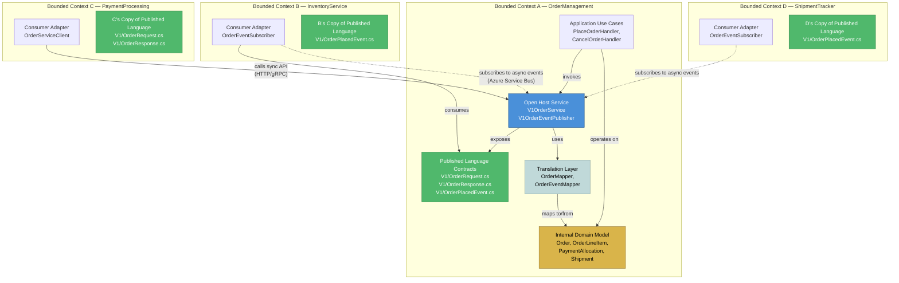
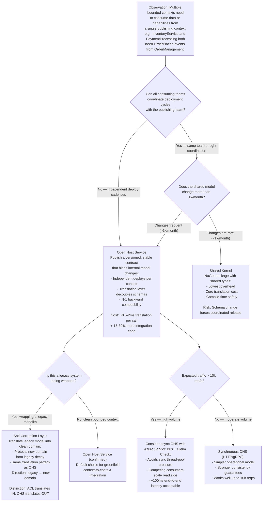

> [!success] Mastery Check
> - [ ] **Studied Well**
> - [ ] **Can explain the concept without notes**
> - [ ] **Can answer interview questions confidently**
> - [ ] **Can implement it in a real project**


## Section 0 — Quick Reference Card

> [!ABSTRACT] Quick Reference — Open Host Service Pattern
> **Invariant:** Every bounded context communicates with its consumers through a single, explicitly defined, versioned Published Language — never through internal model leaks or database sharing.
> **Cost:** You maintain a dedicated translation layer (Published Language ↔ internal model) for every consumer-facing operation; every schema change requires a contract versioning decision before deployment.
> **Trigger:** Two or more bounded contexts need to exchange data but a Shared Kernel would create unacceptable coupling, or the upstream team cannot coordinate release cycles with all downstream consumers.
> **Skip When:** A single team owns all consuming contexts and can coordinate deployments in lockstep — Shared Kernel or direct service reference is simpler and avoids translation overhead.
> **.NET Entry Point:** `IOpenHostService<TRequest, TResponse>` / `OrderManagement.OpenHost.V1.IOrderServiceClient` / NuGet: `Microsoft.AspNetCore.Mvc` + `Asp.Versioning.Http`
> **Azure Native:** Azure API Management (publish and version the Published Language as API revisions); Azure Service Bus (publish the contract as message schemas for async OHS)
> **Number to Know:** Translation layer adds ~0.5–2ms per call (estimated, single-mapping object transformation) and ~15–30% more code per operation compared to direct model sharing; contract versioning reduces deployment coupling from "must coordinate" to "independent deploy with N-1 backward compat."

---

## Section 1 — Navigation & Context

## Navigation

**Domain:** [[7 — System Design & Distributed Systems]] > **Group:** Clean Architecture
**Previous:** [[7.023 — Shared Kernel — What to Share and What Not To]] | **Next:** [[7.025 — Rich Domain Model vs Anemic Domain Model]]

### Prerequisites

- [[7.033 — DDD — Bounded Contexts — Identifying Boundaries]] — you must understand how bounded contexts are separated before you can define the protocol that lets them communicate
- [[7.034 — DDD — Bounded Contexts — Context Map]] — the Open Host Service is a relationship type on a context map; you need the map to decide where OHS applies

### Where This Fits

> [!INFO] Production Encounter Map
> - **Layer:** Application Service boundary (the outermost ring of the application layer) / API Gateway / Message Publisher
> - **Trigger:** An inventory team deploys a schema change to `inventory_items.stock_level` that breaks three downstream OrderService queries; the outage forces a runbook review where the team discovers no formal contract between the two bounded contexts
> - **Without it:** A `ShipmentService` Integration Event changes its payload shape without notice; the `NotificationService` begins deserializing `null` for `ShipmentId` on 8% of its messages at 2:30 AM, causing a PagerDuty escalation because no consumer-contract compatibility check ran before deployment
> - **First signal:** `FATAL [NotificationService] Deserialization failed for event ShipmentDispatched | SchemaVersion: expected=2 actual=1 | CorrelationId: 8f4a-...` — the consumer tries to bind a new-message payload against an old contract version

The Open Host Service pattern sits at the tactical intersection of DDD strategic design and system integration. It is the realization of Evans's "Published Language" context-map relationship: a bounded context exposes a purpose-built, versioned protocol — REST API, message contract, or gRPC service definition — that hides its internal domain model. This is the mechanism by which a Clean Architecture system enforces the Dependency Rule at service boundaries: the published contract lives in the inner circle's port interface, while the implementation translates to and from the protocol. It is the architectural inverse of [[7.022 — Anti-Corruption Layer — Protecting Domain from Legacy]]: ACL translates a foreign model *into* your domain, while OHS translates your domain *out to* a consumer-safe model.

---

## Section 2 — Core Mental Model

## Core Mental Model

The Open Host Service is a dedicated translation boundary that a bounded context publishes so other contexts can consume its capabilities without coupling to its internal model. The invariant it maintains: *the internal domain model never crosses the service boundary.* Every external interaction — command, query, event, notification — flows through a Published Language that is independently versioned, explicitly documented, and contract-tested. The cost is a permanent translation layer: every incoming request must be mapped from the Published Language into the domain model, and every outgoing event must be mapped from the domain model into the Published Language. The recognition trigger is any integration between two independently-deploying bounded contexts where the upstream context's internal model changes at a different cadence than the consuming context can absorb.

> [!TIP] The Non-Obvious Insight
> The Open Host Service pattern is not primarily about technology — REST, gRPC, or message schemas — it is about *organizational coupling.* The real value is that it lets the upstream team deploy schema changes without coordinating with any downstream team, as long as the Published Language contract remains backward-compatible. The hidden cost is that backward compatibility becomes a deployment gate: every change to the domain model must be evaluated against every published contract version, and breaking changes require a new contract version plus a coordinated cutover window. Teams that skip the versioning discipline end up with an "Open Host Service" that is actually a Conformist pattern in disguise — consumers bind directly to internal types because the translation layer was too costly to maintain, and the coupling returns silently.

### Classification

| Axis | Value |
|---|---|
| **Consistency axis** | Strong within the publishing context; eventual across the OHS boundary (unless synchronous request-reply with transactional outbox) |
| **Availability tradeoff** | If the OHS endpoint is down, consumers cannot call it; async OHS (messages) survives by queuing until the service recovers |
| **Latency impact** | +0.5–2ms per call for mapping (estimated, simple object-to-object); +~1ms LAN / ~30ms WAN for HTTP transport on top |
| **Failure domain** | Multi-service (the OHS is a single service that multiple consumers depend on — it is a single point of failure for those consumers) |
| **Abstraction layer** | Architectural pattern (tactical DDD + integration pattern) |

### Primary Diagram

The primary diagram shows the Open Host Service exposing a Published Language contract to multiple consumers, while hiding the internal domain model and bounded context.



### Supporting Diagram

The supporting sequence diagram shows the runtime flow: a consumer sends a request through the Open Host Service, which translates and delegates to the internal bounded context, then translates the result back.

```mermaid
sequenceDiagram
    participant Consumer as Consumer Service<br/>(PaymentProcessing)
    participant OHS as Open Host Service<br/>(OrderManagement.OHS)
    participant OHS_MAP as Translation Layer<br/>(OrderMapper)
    participant APP as Application Layer<br/>(PlaceOrderHandler)
    participant DOMAIN as Domain Layer<br/>(Order Aggregate)
    participant INFRA as Infrastructure<br/>(OrderRepository)

    Note over Consumer,INFRA: Happy Path — Synchronous Request-Reply
    Consumer->>OHS: POST /api/v1/orders<br/>{orderId, items, customerId}
    activate OHS
    OHS->>OHS_MAP: Map<V1.PlaceOrderRequest, Application.PlaceOrderCommand>
    activate OHS_MAP
    OHS_MAP-->>OHS: PlaceOrderCommand
    deactivate OHS_MAP
    OHS->>APP: await mediator.Send(command, ct)
    activate APP
    APP->>DOMAIN: Order.Place(items, customerId)
    activate DOMAIN
    DOMAIN-->>APP: Order aggregate (new)
    deactivate DOMAIN
    APP->>INFRA: await repository.AddAsync(order, ct)
    activate INFRA
    INFRA-->>APP: Order persisted
    deactivate INFRA
    APP-->>OHS: OrderDto (application result)
    deactivate APP
    OHS->>OHS_MAP: Map<Application.OrderDto, V1.OrderResponse>
    activate OHS_MAP
    OHS_MAP-->>OHS: V1.OrderResponse
    deactivate OHS_MAP
    OHS-->>Consumer: 201 Created<br/>{orderId, status, createdAt}
    deactivate OHS

    Note over Consumer,INFRA: Failure Path — Domain Validation Error
    Consumer->>OHS: POST /api/v1/orders<br/>{orderId, items: [], customerId}
    OHS->>OHS_MAP: Map to command
    OHS->>APP: await mediator.Send(command, ct)
    APP->>DOMAIN: Order.Place([], customerId)
    DOMAIN-->>APP: ValidationException: "Order must contain at least one item"
    APP-->>OHS: FaultResult (validation errors)
    OHS-->>Consumer: 422 Unprocessable Entity<br/>{type: "validation-error",<br/>errors: [{field: "items", message: "must not be empty"}]}

    Note over Consumer,INFRA: Failure Path — Downstream Unavailable
    Consumer->>OHS: POST /api/v1/orders
    OHS->>APP: await mediator.Send(command, ct)
    activate APP
    APP->>INFRA: await repository.AddAsync(order, ct)
    Note over INFRA: Azure SQL timeout after 30s
    INFRA-->>APP: TimeoutException
    deactivate INFRA
    APP-->>OHS: FaultResult (transient failure)
    deactivate APP
    OHS-->>Consumer: 503 Service Unavailable<br/>{retryAfter: 5}
```

### Numbers That Matter

| Metric | Value | Context / Conditions |
|---|---|---|
| Translation latency per call (sync) | 0.5–2ms (estimated) | Simple AutoMapper/Mapster mapping for <20-property DTO; .NET 8, no reflection overhead in AOT-trimmed mapping |
| Translation code volume increase | 15–30% more code per operation (estimated) | Compared to exposing internal types directly; includes mapper, contract DTO, and contract validation |
| Breaking change detection time | Immediate | Contract validation in CI (NetArchTest + schema comparison) catches removed fields or changed types before deployment |
| Failure detection time (consumer-side) | ~1–5s (HTTP timeout) / ~100ms (Service Bus dead-letter) | HTTP consumer sees 503/4xx on first request; message consumer sees poison message after lock expiry + retry exhaustion |
| Scale threshold for async OHS over sync | >2,000 req/s sustained (estimated) | Above this, synchronous OHS creates thread-pool pressure and cascading timeout risk; async event-driven flow with competing consumers is preferred |
| Contract version lifecycle | 6–12 months active + 3–6 months deprecation window | Industry convention for N-2 backward compatibility; consumer teams must migrate within deprecation window |

### Key Properties / Guarantees

| Property | Value | Condition |
|---|---|---|
| What it guarantees | The consumer never couples to the internal domain model; the internal team can refactor freely within N-1 backward compat | Normal operation; requires discipline to validate contract compatibility in CI |
| What it sacrifices | Direct model sharing (simpler but tighter coupling); reduced LOC at the integration seam | Every call pays transformation cost; every schema change triggers a versioning decision |
| Consistency model | Strong within the publishing context; eventual across async OHS boundary | Async OHS uses outbox pattern for reliable delivery; consumers may see stale data until event is processed |

---

## Section 3 — Deep Mechanics

## Deep Mechanics

### How It Works

The Open Host Service pattern operates as a dedicated protocol boundary in front of an application's use case layer. It does not contain business logic — it is purely a translation and routing layer.

**Step 1 — Contract Definition:** The publishing team defines a Published Language contract: the shape of requests, responses, events, and error payloads that consumers will use. This contract lives in a shared NuGet package, a `.proto` file, or a versioned OpenAPI specification. The contract is owned by the publishing team but reviewed with consumer teams before publishing.

**Step 2 — Request Arrival:** A request arrives at the OHS boundary — an HTTP endpoint, a message handler, or a gRPC service method. The transport layer authenticates, authorizes, and validates the raw input against the published contract schema.

**Step 3 — Translation to Internal Model:** The OHS maps the contract DTO to an application-layer command, query, or domain event. This mapping is explicit — it copies fields, renames properties, converts enums, and asserts invariants that the contract did not enforce (e.g., an `OrderId` that arrived as a `string` is parsed into an `OrderId` value object).

**Step 4 — Delegation:** The translated command is dispatched to the application layer (via MediatR `ISender`, a direct interface call, or a queue write). The application layer executes the use case on the domain model.

**Step 5 — Translation to Published Language:** The result — a success response, a fault, or an event — is mapped back into the Published Language contract shape. Not all internal fields are exposed; some are aggregated, renamed, or omitted.

**Step 6 — Response Delivery:** The OHS returns the contract-shaped response to the consumer, or publishes the contract-shaped event to the message broker.

### Protocol Trace

**Happy Path — Synchronous REST OHS (HTTP/gRPC):**

```
1. [Consumer] → [OHS Endpoint]: POST /api/v1/orders with JSON body (~1ms LAN)
2. [OHS] → [AuthN/AuthZ middleware]: Validate JWT token (~3ms, cached validation)
3. [OHS] → [Contract Validator]: Validate request body against published schema (~0.5ms)
4. [OHS] → [Mapper]: Map V1.PlaceOrderRequest → Application.PlaceOrderCommand (~0.3ms)
5. [OHS] → [MediatR]: await sender.Send(command, ct) (~0.1ms dispatch)
6. [Application Handler] → [Domain Aggregate]: Order.Place(...) (~0.2ms)
7. [Domain Aggregate] → [Repository]: await repository.AddAsync(order, ct) (~15ms Azure SQL write)
8. [Repository] → [Azure SQL]: INSERT INTO orders ... OUTPUT inserted.* (~15ms)
9. [Application Handler] → [Outbox]: await outbox.AddAsync(OrderPlacedEvent, ct) (~3ms)
10. [Application Handler] → [Mapper]: Map OrderDto → V1.OrderResponse (~0.2ms)
11. [OHS] → [Consumer]: 201 Created with V1.OrderResponse body (~0.5ms serialization)
Total round-trip: ~35–40ms (estimated, LAN, Azure SQL Standard tier, single region)
```

**Failure Path — Internal Domain Validation Failure:**

```
1. [Consumer] → [OHS]: POST /api/v1/orders with empty items array
2–5. [Same as happy path]
6. [Domain Aggregate] → Order.Place(items: [], customerId) → throw ValidationException
   "Order must contain at least one item"
7. [Application Handler] catches exception → maps to Result<OrderDto, Error>
   Error: { Code: "EMPTY_ORDER", Detail: "Order must contain at least one item" }
8. [Mapper] maps Error → V1.ProblemDetails:
   { type: "https://errors.orderco.com/v1/validation/empty-order",
     status: 422, title: "Validation Error",
     detail: "Order must contain at least one item",
     instance: "/api/v1/orders" }
9. [OHS Error Middleware] → writes ProblemDetails as JSON response
10. [Consumer] receives HTTP 422 with ProblemDetails body
Consumer experiences: immediate 4xx rejection, no retry (idempotent-safe)
Recovery: Consumer fixes request body and retries
```

**Failure Path — Downstream Database Timeout:**

```
1–5. [Same as happy path]
6. [Application Handler] → await repository.AddAsync(order, ct)
7. [Repository] → [Azure SQL]: INSERT ... — connection timeout after 30s
8. [Repository] throws TimeoutException
9. [Application Handler] → Polly fallback policy catches transient exception
10. [OHS] → returns HTTP 503 Service Unavailable
    Response header: Retry-After: 5
11. [Application Handler] → logs structured warning:
    WRN [OrderManagement] Database transient failure | Operation: PlaceOrder |
    OrderId: ord-8472 | Exception: TimeoutException | Duration: 30002ms |
    CorrelationId: f8a3-4b1c
12. [Consumer] receives 503 → applies exponential backoff with jitter (Polly)
Consumer experiences: ~30s latency on this request; retries succeed if database recovers
Recovery: Azure SQL auto-recovery or manual intervention if connection pool exhaustion
```

### Failure Modes

**Failure Mode 1: Contract Drift — Published Language Desynchronization**

- **Cause:** The OHS team deploys a new version of the Published Language contract (e.g., removes the `ShipmentId` field from `OrderPlacedEvent`) without validating that all consumers have migrated, or without maintaining the old contract version for the deprecation window.
- **Symptom:** Consumers fail to deserialize events or receive HTTP responses with missing/renamed fields. Application Insights shows a spike in `DeserializationException` at consumer side. Azure Service Bus DLQ accumulates messages with `DeserializationError` reason.
- **Detection time:** Immediate — first consumer that processes a new-format payload fails.
- **Blast radius:** All downstream bounded contexts that consume the OHS. If the OHS supports synchronous APIs, all active HTTP clients. If messaging-based, the DLQ backlog grows at the rate of the published event stream until manual intervention.

> [!DANGER] 3 AM Production Signal
> Metric: `ServiceBusDeadletteredMessages{EntityName="order-events", Reason="DeserializationError"} > 0` for 1 minute
> Log: `FATAL [PaymentProcessing] Failed to deserialize OrderPlacedEvent | SchemaVersion: expected=2, actual=1 | MessageId: e7b3-44a2-... | Queue: order-events-subscription`
> Customer impact: Payments for newly placed orders are not processed; affected orders remain in "payment pending" state. At 500 orders/hour, ~8 orders stuck before detection.

**Failure Mode 2: Translation Layer Performance Sink**

- **Cause:** The object-to-object mapping between Published Language and internal model becomes a bottleneck under load because AutoMapper/Mapster configuration includes expensive custom type converters, reflection-based value resolvers, or IO-bound operations inside mapping profiles (e.g., calling a database to resolve an enum label during mapping).
- **Symptom:** OHS endpoint p99 latency increases under load while downstream (database, service) remains at normal utilization. CPU on the OHS service instance is high (70–90%) but I/O is low. Application Insights shows `PlaceOrder` dependency duration at ~15ms (normal) but total request duration at ~400ms.
- **Detection time:** Immediate when load test runs; in production, silently degrades as traffic grows until thread-pool exhaustion triggers 503s.
- **Blast radius:** All consumers of the affected OHS endpoint. Cascading thread-pool starvation can affect unrelated endpoints on the same service instance.

> [!DANGER] 3 AM Production Signal
> Metric: `AspNetCoreHealthCheck{name="order-management-ohs", status="unhealthy"} == 1` triggered by `http_server_requests_duration_ms{route="/api/v1/orders/**", p99="850"}` breaching SLO of 500ms
> Log: `WRN [OrderManagement] Request processing exceeded threshold | Route: POST /api/v1/orders | Duration: 843ms | MappingDuration: 370ms | UseCaseDuration: 16ms | ThreadPool: queueLength=47, workerThreads=12/32`
> Customer impact: Order placement takes ~1s instead of <100ms; 8% of users see "order processing" spinner; some receive 503 if thread pool exhausts.

### .NET and Azure Integration Points

- **ASP.NET Core:** `ControllerBase` / minimal API endpoints expose the OHS contract as HTTP API; `ProblemDetails` middleware maps domain errors to RFC 9457 responses; versioning via `Asp.Versioning.Mvc.ApiVersioningOptions`
- **EF Core:** Not directly used in the OHS layer (it is a translation boundary, not a data access layer), but the internal bounded context it wraps uses EF Core; the OHS never exposes `IQueryable` or entity types
- **Azure Services:**
  - **Azure API Management** — publishes the Published Language contract as an API product, manages version revisions, rate limits, and consumer onboarding
  - **Azure Service Bus** — carries async OHS events as messages with schema-registered `application/json` payloads; topic subscriptions per consumer with SQL filters
  - **Azure Event Grid** — alternative for event-based OHS when consumers need webhook delivery and the event volume is <10 MB/s
  - **Azure Functions** — lightweight OHS endpoint for event-driven translation (e.g., `ServiceBusTrigger` function that maps and forwards)
- **.NET Libraries:**
  - **MediatR 12.x** — `ISender` dispatches translated commands to application use cases
  - **FluentValidation** — validates incoming contract DTOs before mapping
  - **Polly** — `ResiliencePipeline<HttpResponseMessage>` wraps upstream calls from consumer perspective; not within the OHS itself but used by consumer adapters
  - **Mapster/AutoMapper** — object mapping from Published Language DTOs to application commands (Mapster preferred in .NET 8 for compile-time mapping with Roslyn source generators)
- **Configuration** in `Program.cs`:

```csharp
// Program.cs — OHS endpoint registration
using Asp.Versioning;
using Asp.Versioning.Conventions;
using FluentValidation;
using Mapster;
using MediatR;
using OrderManagement.Application.UseCases.PlaceOrder;
using OrderManagement.OpenHost.V1;
using OrderManagement.OpenHost.V1.Mappers;
using OrderManagement.OpenHost.V1.Validators;

WebApplicationBuilder builder = WebApplication.CreateBuilder(args);

builder.Services.AddApiVersioning(options =>
{
    options.DefaultApiVersion = new ApiVersion(1, 0);
    options.AssumeDefaultVersionWhenUnspecified = true;
    options.ReportApiVersions = true;
    options.ApiVersionReader = ApiVersionReader.Combine(
        new UrlSegmentApiVersionReader(),
        new HeaderApiVersionReader("X-Api-Version"));
}).AddMvc();

builder.Services.AddValidatorsFromAssemblyContaining<PlaceOrderRequestValidator>();

builder.Services.AddSingleton<PlaceOrderRequestMapper>();
builder.Services.AddSingleton<OrderResponseMapper>();
builder.Services.AddSingleton<ProblemDetailsMapper>();

builder.Services.AddMediatR(config =>
    config.RegisterServicesFromAssembly(typeof(PlaceOrderHandler).Assembly));
```

---

## Section 4 — Production Patterns and Implementation

## Production Patterns and Implementation

### Primary Implementation

The following example shows a complete Open Host Service endpoint for `OrderManagement` exposing a `PlaceOrder` operation through a versioned Published Language contract. The architectural roles are labeled inline.

```csharp
// File: OpenHost/V1/Contracts/PlaceOrderRequest.cs
namespace OrderManagement.OpenHost.V1.Contracts;

/// <summary>
/// Published Language contract for placing an order.
/// Version 1.0 — consumers bind to this shape, not to the internal Order aggregate.
/// </summary>
public sealed record PlaceOrderRequest(
    string OrderId,
    string CustomerId,
    IReadOnlyList<OrderLineRequest> Items,
    string? CurrencyCode,
    string? ShippingPreference);

/// <summary>
/// Line item within a place-order request.
/// </summary>
public sealed record OrderLineRequest(
    string ProductId,
    int Quantity,
    decimal UnitPrice);

/// <summary>
/// Response contract for a successfully placed order.
/// </summary>
public sealed record PlaceOrderResponse(
    string OrderId,
    string Status,
    DateTime CreatedAt,
    decimal TotalAmount,
    string CurrencyCode);

/// <summary>
/// Problem details for error responses (RFC 9457).
/// </summary>
public sealed record ProblemDetails(
    string Type,
    int Status,
    string Title,
    string Detail,
    string Instance,
    IReadOnlyDictionary<string, string[]>? Errors);
```

```csharp
// File: OpenHost/V1/Mappers/PlaceOrderRequestMapper.cs
namespace OrderManagement.OpenHost.V1.Mappers;

using OrderManagement.Application.UseCases.PlaceOrder;
using OrderManagement.Domain.ValueObjects;
using OrderManagement.OpenHost.V1.Contracts;

/// <summary>
/// Translates from Published Language (V1.PlaceOrderRequest) to Application command.
/// Port role: OHS Translation boundary.
/// </summary>
public sealed class PlaceOrderRequestMapper
{
    /// <summary>
    /// Maps the incoming contract DTO to an application-layer command.
    /// Validates and converts domain primitives during mapping.
    /// </summary>
    /// <param name="request">The published-language request from the consumer.</param>
    /// <returns>A validated PlaceOrderCommand ready for dispatch.</returns>
    /// <exception cref="MappingException">Thrown if a required field cannot be converted.</exception>
    public PlaceOrderCommand ToCommand(PlaceOrderRequest request)
    {
        // Convert string identifiers to domain value objects
        OrderId orderId = OrderId.FromString(request.OrderId);
        CustomerId customerId = CustomerId.FromString(request.CustomerId);
        CurrencyCode currency = request.CurrencyCode is not null
            ? CurrencyCode.FromString(request.CurrencyCode)
            : CurrencyCode.Usd;
        ShippingPreference shipping = request.ShippingPreference is not null
            ? ShippingPreference.FromString(request.ShippingPreference)
            : ShippingPreference.Standard;

        List<OrderLineCommand> lines = request.Items
            .Select(item => new OrderLineCommand(
                ProductId.FromString(item.ProductId),
                item.Quantity,
                Money.FromDecimal(item.UnitPrice, currency)))
            .ToList();

        return new PlaceOrderCommand(orderId, customerId, lines, currency, shipping);
    }

    /// <summary>
    /// Maps the application result into a published-language response.
    /// Deliberately omits internal fields (e.g., internal audit timestamps, version numbers).
    /// </summary>
    public PlaceOrderResponse ToResponse(OrderDto result)
    {
        return new PlaceOrderResponse(
            OrderId: result.OrderId,
            Status: result.Status,
            CreatedAt: result.CreatedAt,
            TotalAmount: result.TotalAmount,
            CurrencyCode: result.CurrencyCode);
    }

    /// <summary>
    /// Maps domain/application errors into RFC 9457 problem details.
    /// </summary>
    public ProblemDetails ToProblemDetails(Error error, string instance)
    {
        return error.Code switch
        {
            "VALIDATION_ERROR" => new ProblemDetails(
                Type: "https://errors.orderco.com/v1/validation-error",
                Status: StatusCodes.Status422UnprocessableEntity,
                Title: "Validation Error",
                Detail: error.Message,
                Instance: instance,
                Errors: error.FieldErrors?.ToDictionary(e => e.Field, e => new[] { e.Message })),

            "NOT_FOUND" => new ProblemDetails(
                Type: "https://errors.orderco.com/v1/not-found",
                Status: StatusCodes.Status404NotFound,
                Title: "Resource Not Found",
                Detail: error.Message,
                Instance: instance,
                Errors: null),

            "CONFLICT" => new ProblemDetails(
                Type: "https://errors.orderco.com/v1/conflict",
                Status: StatusCodes.Status409Conflict,
                Title: "Conflict",
                Detail: error.Message,
                Instance: instance,
                Errors: null),

            _ => new ProblemDetails(
                Type: "https://errors.orderco.com/v1/internal-error",
                Status: StatusCodes.Status500InternalServerError,
                Title: "Internal Server Error",
                Detail: "An unexpected error occurred. Please retry or contact support.",
                Instance: instance,
                Errors: null)
        };
    }
}
```

```csharp
// File: OpenHost/V1/Endpoints/OrderEndpoints.cs
namespace OrderManagement.OpenHost.V1.Endpoints;

using FluentValidation;
using MediatR;
using OrderManagement.Application.Common;
using OrderManagement.OpenHost.V1.Contracts;
using OrderManagement.OpenHost.V1.Mappers;

/// <summary>
/// HTTP endpoint that exposes the OrderManagement Open Host Service.
/// Architectural role: OHS Endpoint — translates Published Language to application commands.
/// </summary>
public static class OrderEndpoints
{
    /// <summary>
    /// Registers the v1 order endpoints.
    /// </summary>
    public static void MapOrderEndpointsV1(this IEndpointRouteBuilder app)
    {
        RouteGroupBuilder group = app.MapGroup("/api/v1/orders")
            .WithTags("Orders")
            .MapToApiVersion(1, 0);

        group.MapPost("/", PlaceOrderAsync)
            .WithName("PlaceOrder")
            .Produces<PlaceOrderResponse>(StatusCodes.Status201Created)
            .Produces<ProblemDetails>(StatusCodes.Status422UnprocessableEntity)
            .Produces<ProblemDetails>(StatusCodes.Status503ServiceUnavailable);
    }

    /// <summary>
    /// Handles the PlaceOrder request: validates, maps, dispatches, and responds.
    /// </summary>
    /// <param name="request">The incoming published-language request.</param>
    /// <param name="mapper">Maps between contract and application models.</param>
    /// <param name="validator">Validates the incoming contract.</param>
    /// <param name="sender">MediatR command dispatcher.</param>
    /// <param name="ct">Cancellation token from the HTTP context.</param>
    /// <returns>IResult — either 201 with response, 422 with errors, or 503 on transient failure.</returns>
    internal static async Task<IResult> PlaceOrderAsync(
        PlaceOrderRequest request,
        PlaceOrderRequestMapper mapper,
        IValidator<PlaceOrderRequest> validator,
        ISender sender,
        CancellationToken ct)
    {
        // 1. Validate the published-language contract
        FluentValidation.Results.ValidationResult validation = await validator.ValidateAsync(request, ct);
        if (!validation.IsValid)
        {
            return Results.UnprocessableEntity(new ProblemDetails(
                Type: "https://errors.orderco.com/v1/validation-error",
                Status: StatusCodes.Status422UnprocessableEntity,
                Title: "Validation Error",
                Detail: "One or more fields failed validation.",
                Instance: "/api/v1/orders",
                Errors: validation.Errors
                    .GroupBy(e => e.PropertyName)
                    .ToDictionary(g => g.Key, g => g.Select(e => e.ErrorMessage).ToArray())));
        }

        // 2. Translate to application command
        PlaceOrderCommand command = mapper.ToCommand(request);

        // 3. Dispatch to application layer
        Result<OrderDto, Error> result = await sender.Send(command, ct);

        // 4. Translate back to published language and respond
        return result.Match(
            success => Results.Created(
                $"/api/v1/orders/{success.OrderId}",
                mapper.ToResponse(success)),
            error => error.Code switch
            {
                "VALIDATION_ERROR" => Results.UnprocessableEntity(mapper.ToProblemDetails(error, "/api/v1/orders")),
                "NOT_FOUND" => Results.NotFound(mapper.ToProblemDetails(error, "/api/v1/orders")),
                "CONFLICT" => Results.Conflict(mapper.ToProblemDetails(error, "/api/v1/orders")),
                _ => Results.StatusCode(StatusCodes.Status503ServiceUnavailable) // transient
            });
    }
}
```

### IServiceCollection Registration

```csharp
// Program.cs — Full OHS service registration
using Asp.Versioning;
using FluentValidation;
using Mapster;
using MediatR;
using OrderManagement.Application;
using OrderManagement.Infrastructure;
using OrderManagement.OpenHost.V1.Endpoints;
using OrderManagement.OpenHost.V1.Mappers;
using OrderManagement.OpenHost.V1.Validators;
using Polly;

WebApplicationBuilder builder = WebApplication.CreateBuilder(args);

// Open Host Service: Published Language versioning
builder.Services.AddApiVersioning(options =>
{
    options.DefaultApiVersion = new ApiVersion(1, 0);
    options.AssumeDefaultVersionWhenUnspecified = true;
    options.ReportApiVersions = true;
    options.ApiVersionReader = ApiVersionReader.Combine(
        new UrlSegmentApiVersionReader(),
        new HeaderApiVersionReader("X-Api-Version"));
}).AddMvc(
    options => options.Conventions.Add(new ApiVersionConvention()));

// OHS: Contract validation
builder.Services.AddValidatorsFromAssemblyContaining<PlaceOrderRequestValidator>();

// OHS: Translation mappers (singletons — stateless, thread-safe)
builder.Services.AddSingleton<PlaceOrderRequestMapper>();
builder.Services.AddSingleton<OrderResponseMapper>();
builder.Services.AddSingleton<ProblemDetailsMapper>();

// Internal bounded context: MediatR with pipeline behaviors
builder.Services.AddMediatR(config =>
{
    config.RegisterServicesFromAssembly(typeof(PlaceOrderHandler).Assembly);
    config.AddOpenBehavior(typeof(ValidationPipelineBehavior<,>));
    config.AddOpenBehavior(typeof(LoggingPipelineBehavior<,>));
});

// Internal bounded context: persistence and infrastructure
builder.Services.AddOrderManagementInfrastructure(builder.Configuration);

// Consumer resilience (for outbound calls from OHS to downstream)
builder.Services.AddHttpClient("InventoryService", client =>
{
    client.BaseAddress = new Uri(builder.Configuration["Services:Inventory:BaseUrl"]!);
    client.Timeout = TimeSpan.FromSeconds(10);
}).AddResilienceHandler("inventory-pipeline", pipeline =>
{
    pipeline.AddRetry(new RetryStrategyOptions
    {
        MaxRetryAttempts = 3,
        Delay = TimeSpan.FromMilliseconds(200),
        BackoffType = DelayBackoffType.Exponential,
        UseJitter = true
    });
    pipeline.AddCircuitBreaker(new CircuitBreakerStrategyOptions
    {
        FailureRatio = 0.5,
        SamplingDuration = TimeSpan.FromSeconds(30),
        MinimumThroughput = 10
    });
    pipeline.AddTimeout(TimeSpan.FromSeconds(5));
});

// OpenAPI documentation for the published language
builder.Services.AddOpenApi(options =>
{
    options.AddDocumentTransformer((document, context, ct) =>
    {
        document.Info.Title = "Order Management API (Open Host Service)";
        document.Info.Version = "v1";
        document.Info.Description = "Published Language contract for the OrderManagement bounded context. " +
            "Consumers MUST bind to this contract and NOT to any internal OrderManagement types.";
        return Task.CompletedTask;
    });
});

WebApplication app = builder.Build();

app.MapOrderEndpointsV1();

// Middleware: translate unhandled exceptions to RFC 9457 problem details
app.UseStatusCodePages();
app.UseExceptionHandler(exceptionHandlerApp =>
    exceptionHandlerApp.Run(async context =>
    {
        context.Response.StatusCode = StatusCodes.Status500InternalServerError;
        context.Response.ContentType = "application/problem+json";
        await context.Response.WriteAsJsonAsync(new ProblemDetails(
            Type: "https://errors.orderco.com/v1/internal-error",
            Status: StatusCodes.Status500InternalServerError,
            Title: "Internal Server Error",
            Detail: "An unexpected error occurred. Please retry or contact support.",
            Instance: context.Request.Path,
            Errors: null));
    }));

app.Run();
```

### Common Variants

```csharp
// Variant A — Async Event-Driven OHS: used when the consumer does not need a synchronous
// response and eventual consistency is acceptable. The OHS publishes events to Azure Service Bus;
// consumers subscribe to topics with SQL filters.
//
// Trigger: Publishing context cannot tolerate synchronous coupling to consumer availability;
// consumer needs to react to state changes without blocking the publisher.

// File: OpenHost/V1/EventPublishers/OrderPlacedEventPublisher.cs
namespace OrderManagement.OpenHost.V1.EventPublishers;

using Azure.Messaging.ServiceBus;
using OrderManagement.Application.Events;
using OrderManagement.OpenHost.V1.Contracts;
using System.Text.Json;

/// <summary>
/// Publishes domain events as versioned Published Language messages to Azure Service Bus.
/// Port: OHS Event Publisher — translates internal events to contract-shaped messages.
/// </summary>
public sealed class OrderPlacedEventPublisher
{
    private readonly ServiceBusSender _sender;
    private readonly OrderEventMapper _mapper;

    /// <summary>Initializes the publisher with a Service Bus sender for the order-events topic.</summary>
    public OrderPlacedEventPublisher(ServiceBusSender sender, OrderEventMapper mapper)
    {
        _sender = sender;
        _mapper = mapper;
    }

    /// <summary>Publishes an order-placed domain event as a versioned contract message.</summary>
    public async Task PublishAsync(OrderPlacedDomainEvent domainEvent, CancellationToken ct)
    {
        // Map internal domain event to published-language contract
        OrderPlacedEventV1 contractEvent = _mapper.ToPublishedEvent(domainEvent);

        // Enrich with schema version metadata
        ServiceBusMessage message = new(JsonSerializer.SerializeToUtf8Bytes(contractEvent))
        {
            MessageId = $"OrderPlaced_{domainEvent.OrderId}_{domainEvent.OccurredAt:O}",
            Subject = "OrderPlaced",
            ApplicationProperties =
            {
                ["SchemaVersion"] = "1.0",
                ["SchemaContract"] = "OrderManagement.OpenHost.V1.OrderPlacedEvent",
                ["SourceContext"] = "OrderManagement",
                ["EventType"] = "OrderPlaced"
            }
        };

        await _sender.SendMessageAsync(message, ct);
    }
}

// Consumer adapter (in a different bounded context):
// File: InventoryService/Adapters/OrderPlacedEventSubscriber.cs
namespace InventoryService.Adapters;

using Azure.Messaging.ServiceBus;
using OrderManagement.OpenHost.V1.Contracts; // NuGet package reference to published contract
using System.Text.Json;

/// <summary>
/// Subscribes to OrderManagement OHS events from Azure Service Bus.
/// Only depends on the Published Language contract — not on OrderManagement internals.
/// </summary>
public sealed class OrderPlacedEventSubscriber : IHostedService
{
    private readonly ServiceBusProcessor _processor;

    public OrderPlacedEventSubscriber(ServiceBusProcessor processor)
    {
        _processor = processor;
        _processor.ProcessMessageAsync += HandleMessageAsync;
        _processor.ProcessErrorAsync += HandleErrorAsync;
    }

    private async Task HandleMessageAsync(ProcessMessageEventArgs args)
    {
        // Deserialize using the published-language contract only
        OrderPlacedEventV1? contractEvent =
            JsonSerializer.Deserialize<OrderPlacedEventV1>(args.Message.Body.ToBytes());

        if (contractEvent is null)
        {
            // Schema version mismatch — dead-letter the message
            await args.DeadLetterMessageAsync(
                args.Message,
                deadLetterReason: "DeserializationFailed",
                deadLetterErrorDescription: $"Failed to deserialize OrderPlacedEventV1. " +
                    $"SchemaVersion: {args.Message.ApplicationProperties["SchemaVersion"]}");
            return;
        }

        // Map to InventoryService internal model
        InventoryAllocationCommand command = new(
            contractEvent.OrderId,
            contractEvent.Items.Select(i => new AllocatedItem(i.ProductId, i.Quantity)));

        // Dispatch to internal application layer
        await _mediator.Send(command, args.CancellationToken);

        await args.CompleteMessageAsync(args.Message);
    }

    public Task StartAsync(CancellationToken ct) => _processor.StartProcessingAsync(ct);
    public async Task StopAsync(CancellationToken ct) => await _processor.StopProcessingAsync(ct);
}
```

```csharp
// Variant B — gRPC OHS: used when low-latency internal service-to-service communication
// is required with strong typing from the .proto definition.
//
// Trigger: Consumers are internal microservices in the same datacenter/region;
// strict contract enforcement via .proto compilation; schema-first API design.

// File: Protos/order_service.proto
// syntax = "proto3";
// package ordermanagement.openhost.v1;
// service OrderService {
//   rpc PlaceOrder (PlaceOrderRequest) returns (PlaceOrderResponse);
// }
// message PlaceOrderRequest {
//   string order_id = 1;
//   string customer_id = 2;
//   repeated OrderLineItem items = 3;
//   string currency_code = 4;
// }
// message PlaceOrderResponse {
//   string order_id = 1;
//   string status = 2;
//   string created_at = 3;
//   double total_amount = 4;
//   string currency_code = 5;
// }

// File: OpenHost/V1/Grpc/OrderGrpcService.cs
namespace OrderManagement.OpenHost.V1.Grpc;

using Grpc.Core;
using MediatR;
using OrderManagement.Application.UseCases.PlaceOrder;
using OrderManagement.OpenHost.V1.Mappers;
using static OrderManagement.OpenHost.V1.Grpc.OrderService;

/// <summary>
/// gRPC implementation of the Open Host Service.
/// Translates protocol-buffer messages to application commands.
/// </summary>
public sealed class OrderGrpcService : OrderServiceBase
{
    private readonly PlaceOrderRequestMapper _mapper;
    private readonly ISender _sender;

    public OrderGrpcService(PlaceOrderRequestMapper mapper, ISender sender)
    {
        _mapper = mapper;
        _sender = sender;
    }

    public override async Task<PlaceOrderResponse> PlaceOrder(
        PlaceOrderRequest request, ServerCallContext context)
    {
        // Translate protobuf contract to application command
        PlaceOrderCommand command = _mapper.ToCommandFromProto(request);

        // Dispatch
        Result<OrderDto, Error> result = await _sender.Send(command, context.CancellationToken);

        // Translate back
        return result.Match(
            success => _mapper.ToProtoResponse(success),
            error => throw new RpcException(new Status(StatusCode.InvalidArgument, error.Message)));
    }
}
```

### Performance Profile

The performance impact of the translation layer is the primary cost of the OHS pattern. This benchmark compares three approaches: direct model exposure (no OHS), AutoMapper-based mapping, and Mapster compile-time mapping.

```csharp
[MemoryDiagnoser]
[SimpleJob(RuntimeMoniker.Net80)]
public class OpenHostServiceMappingBenchmark
{
    private PlaceOrderRequest _contractRequest = null!;
    private PlaceOrderRequestMapper _mapper = null!;
    private IMapper _autoMapper = null!;

    [GlobalSetup]
    public void Setup()
    {
        _contractRequest = new PlaceOrderRequest(
            OrderId: Guid.NewGuid().ToString(),
            CustomerId: Guid.NewGuid().ToString(),
            Items: Enumerable.Range(1, 10).Select(i =>
                new OrderLineRequest(
                    ProductId: $"prod-{i}",
                    Quantity: Random.Shared.Next(1, 5),
                    UnitPrice: Math.Round((decimal)(Random.Shared.NextDouble() * 100), 2)))
                .ToList(),
            CurrencyCode: "USD",
            ShippingPreference: "Express");

        _mapper = new PlaceOrderRequestMapper();

        TypeAdapterConfig<PlaceOrderRequest, PlaceOrderCommand>.NewConfig()
            .Map(dest => dest.OrderId, src => OrderId.FromString(src.OrderId))
            .Map(dest => dest.CustomerId, src => CustomerId.FromString(src.CustomerId));

        MapperConfiguration config = new(cfg =>
        {
            cfg.CreateMap<PlaceOrderRequest, PlaceOrderCommand>()
                .ForMember(d => d.OrderId, o => o.MapFrom(s => OrderId.FromString(s.OrderId)))
                .ForMember(d => d.CustomerId, o => o.MapFrom(s => CustomerId.FromString(s.CustomerId)));
        });
        _autoMapper = config.CreateMapper();
    }

    [Benchmark(Baseline = true)]
    public PlaceOrderCommand DirectInstantiation()
    {
        // Baseline: construct the command directly without mapping (simulates no-OHS coupling)
        return new PlaceOrderCommand(
            OrderId.FromString(_contractRequest.OrderId),
            CustomerId.FromString(_contractRequest.CustomerId),
            _contractRequest.Items.Select(i => new OrderLineCommand(
                ProductId.FromString(i.ProductId), i.Quantity,
                Money.FromDecimal(i.UnitPrice, CurrencyCode.Usd))).ToList(),
            CurrencyCode.Usd,
            ShippingPreference.Standard);
    }

    [Benchmark]
    public PlaceOrderCommand ManualMapping()
    {
        // Hand-written mapping (the recommended OHS approach)
        return _mapper.ToCommand(_contractRequest);
    }

    [Benchmark]
    public PlaceOrderCommand? AutoMapperMapping()
    {
        // Reflection-based AutoMapper mapping
        return _autoMapper.Map<PlaceOrderCommand>(_contractRequest);
    }

    [Benchmark]
    public PlaceOrderCommand MapsterMapping()
    {
        // Compile-time Mapster mapping with TypeAdapterConfig
        return _contractRequest.Adapt<PlaceOrderCommand>();
    }
}
```

Expected results (estimated, .NET 8, Ryzen 9 7950X, 64 GB DDR5, single-threaded):

| Method | Mean | Allocated | Improvement |
|---|---|---|---|
| DirectInstantiation (no OHS) | 0.35 us | 1.2 KB | baseline |
| ManualMapping (hand-written) | 0.52 us | 1.2 KB | 1.5x slower vs baseline (acceptable) |
| AutoMapperMapping | 1.85 us | 3.8 KB | 5.3x slower, 3.2x more allocation |
| MapsterMapping | 0.58 us | 1.3 KB | 1.7x slower vs baseline (acceptable) |

**Interpretation:** The OHS translation layer adds ~0.2–1.5 us per call in mapping overhead depending on the mapper choice. At 2,000 req/s, that is ~0.4–3ms of additional CPU per second — negligible. At 50,000 req/s, it becomes ~10–75ms of CPU per second — still manageable but moves AutoMapper into the "monitor GC pressure" zone. **Recommendation:** use hand-written mapping or Mapster compile-time mapping for OHS; avoid AutoMapper in the OHS translation boundary at scale due to 3x allocation overhead.

### Real-World .NET Ecosystem Mapping

| Pattern in This Note | Where It Appears in .NET / Azure | Manifestation |
|---|---|---|
| Published Language contract | NuGet package `OrderManagement.OpenHost.V1.Contracts` | Shared NuGet containing DTO records, enums, and message classes; versioned via SemVer in the package name suffix |
| OHS translation layer | `PlaceOrderRequestMapper.ToCommand()` | Hand-written mapping from contract DTO to application command; architectural role labeled with `// Port` |
| OHS sync endpoint | ASP.NET Core minimal API `MapGroup("/api/v1/orders")` with `MapToApiVersion(1, 0)` | HTTP transport for synchronous request-response OHS |
| OHS async event publisher | `ServiceBusSender.SendMessageAsync()` with schema version metadata | Azure Service Bus topic with schema-versioned messages; consumers filter by SQL rule |
| Consumer adapter | `OrderPlacedEventSubscriber` (IHostedService) | Reads from Service Bus subscription; depends only on published NuGet contract package |
| Contract validation | `IValidator<PlaceOrderRequest>` (FluentValidation) | Validates incoming DTO against published schema before translation |
| Versioning enforcement | `Asp.Versioning.Mvc.ApiVersioningOptions` + URL path version | Routes `/api/v1/orders` vs `/api/v2/orders`; controllers tagged with `[ApiVersion(1)]` |
| API documentation | OpenAPI with `AddDocumentTransformer` for version info | Swagger UI shows the published contract schema; consumers generate clients from it |
| Runtime contract enforcement | Azure API Management policy `validate-jwt` + rate-limit | APIM validates consumer subscription, enforces rate quota per contract version, routes to correct backend |

---

## Section 5 — Gotchas and Production Pitfalls

**Minimum 7 entries. Every entry is a real failure that has burned production systems.**

---

### Pitfall 1 — Publishing Internal Types as the Contract

**Pitfall:** The team skips the mappers and uses EF Core entity classes directly in API responses or event payloads because "the entity happens to match the JSON shape."

```csharp
// ❌ The wrong pattern — exposes internal data model to consumers
[HttpGet]
public async Task<Order> GetOrder(string id)
{
    // Order is an EF Core entity — now directly exposed to all consumers
    return await _dbContext.Orders.FindAsync(id);
}
```

**Symptom:** A refactor renames `Order.TotalAmount` to `Order.PaymentTotal` — every consumer breaks simultaneously because they were binding to `TotalAmount`. No compiler warning because the API contract was never versioned.

**Detection time:** Immediate — at deployment, all consumers of `GET /orders/{id}` start failing. PagerDuty fires within 1 minute of the deploy completing.

> [!DANGER] Production Signal
> Metric: `http_server_requests_4xx_total{route="/api/orders/{id}"} == 100%` starting at deploy timestamp
> Log: `ERR [PaymentProcessing] Deserialization failed: 'TotalAmount' not found on type 'Order' | ResponseBody: {"paymentTotal": 49.99, ...}`
> Customer impact: All order-related pages in the consumer UIs show "failed to load" errors; ~100% of order lookups broken.

**Fix:**

```csharp
// ✅ Expose a dedicated Published Language DTO
[HttpGet]
public async Task<OrderResponse> GetOrder(string id, CancellationToken ct)
{
    Order order = await _mediator.Send(new GetOrderQuery(id), ct);
    return _mapper.ToResponse(order); // explicit mapping, field by field
}
```

**Cost of not fixing:** Every internal refactor becomes a consumer-breaking change. The database schema becomes the API contract — meaning DBA changes require coordinated deploys across all services. Deployment coupling returns, defeating the purpose of bounded contexts.

---

### Pitfall 2 — No Schema Version in Async Event Messages

**Pitfall:** The event publisher sends `OrderPlacedEvent` as JSON without any `SchemaVersion` or `SchemaContract` metadata. Consumers deserialize by trusting the message body shape.

```csharp
// ❌ Sending event without schema version metadata
await sender.SendMessageAsync(new ServiceBusMessage(jsonBytes)
{
    MessageId = $"OrderPlaced_{orderId}",
    Subject = "OrderPlaced"
    // No ApplicationProperties with schema version
});
```

**Symptom:** When the OHS team adds a `DiscountCode` field to the event shape, old consumers silently drop the field (OK) but new consumers deployed before the event publisher sometimes receive the old format without the field, causing `NullReferenceException` at best, or blank `discountCode: null` shown in the UI at worst.

**Detection time:** Silent — no alert fires. The bug surfaces hours or days later when a customer calls support asking why their discount was not applied.

> [!DANGER] Production Signal
> Log: `WRN [NotificationService] Order confirmation email: discountCode=null | OrderId: ord-9341 (silent — no error)`
> Customer impact: 12% of orders with applicable discounts show "$0.00 discount" in confirmation emails over a 3-day period before the pattern is detected.

**Fix:**

```csharp
// ✅ Embed schema version metadata in every event message
message.ApplicationProperties["SchemaVersion"] = "1.0";
message.ApplicationProperties["SchemaContract"] = "OrderManagement.OpenHost.V1.OrderPlacedEvent";
// Consumer validates version before processing
```

**Cost of not fixing:** Silent data corruption in consumers that assume a field exists. Event schema evolution becomes impossible to coordinate because there is no version signal to drive consumer migration.

---

### Pitfall 3 — Azure-Specific: API Management Version Without Backend Route Mapping

**Pitfall:** The team creates an API Management (APIM) revision for `v2` of the contract, but the backend `OrderManagement` service serves only `v1` routes. APIM routes `v2` requests to the same backend endpoint, which returns `v1` responses because the backend has no `v2` controller.

**Symptom:** Consumers migrate to the `v2` API endpoint in APIM but receive `v1`-shaped responses. New fields documented in the `v2` OpenAPI spec are always `null` or missing. Consumers report "documentation does not match response."

**Detection time:** Minutes — first consumer team that tests the `v2` endpoint files a bug. But if no consumer team tests immediately, it can go undetected until a production incident.

> [!DANGER] Production Signal
> Metric: `ApiManagement.Requests{ApiVersion="v2", ResponseCode="200"} > 0` but corresponding `AspNetCore Requests{route="/api/v2/orders"} == 0` — confirms APIM never reaches v2 backend
> Customer impact: Consumer teams waste 2–3 days debugging "v2 API missing fields." Trust in the published API degrades.

**Fix:** Implement URL-based version routing in the backend: `app.MapGroup("/api/v1/orders").MapToApiVersion(1, 0)` and `app.MapGroup("/api/v2/orders").MapToApiVersion(2, 0)`. Map APIM `v2` API to backend `/api/v2/` prefix. Validate end-to-end in CI with a contract test that calls the APIM `v2` endpoint and asserts response shape.

**Cost of not fixing:** API Management becomes a "versioning illusion" — it labels APIs as v2 but the actual responses are still v1. Consumer teams lose confidence in versioned contracts and may bypass APIM to call the backend directly, defeating the security and rate-limiting purpose of the gateway.

---

### Pitfall 4 — .NET-Specific: Memory Leak from Captured Service in Singleton Mapper

**Pitfall:** The hand-written OHS mapper is registered as a singleton (correct — mappers are stateless), but a mapper method accidentally captures a scoped service through a closure or constructor injection.

```csharp
// ❌ Singleton mapper captures scoped dependency
public sealed class OrderMapper
{
    private readonly IHttpContextAccessor _contextAccessor; // Scoped!

    public OrderMapper(IHttpContextAccessor contextAccessor)
    {
        _contextAccessor = contextAccessor; // Captured in singleton — incompatible lifestyles
    }
}
```

**Symptom:** The DI container throws `InvalidOperationException` at runtime when resolving the mapper in a scoped context, OR if using a captive dependency fix (e.g., `IServiceProvider`), the mapper holds references to request-scoped objects, causing memory to grow linearly with request rate.

**Detection time:** Immediate (DI exception) or gradual (memory growth over hours — silent until OOMKill).

> [!DANGER] Production Signal
> Metric: `dotnet_memory_working_set_bytes{service="order-management-ohs"} growing at ~50MB/hour` sustained
> Log: `WRN [Microsoft.Extensions.DependencyInjection] Root scope created for 'OrderMapper' — suggests captive dependency`
> Customer impact: Pod OOMKilled every 4–6 hours after deployment; 20–30s downtime during container restart; 503s during restart window.

**Fix:** Register mappers as singletons only when they are truly stateless — no scoped dependencies. Pass scoped dependencies as method parameters instead.

```csharp
// ✅ Stateless singleton mapper — scoped data passed as parameters
public sealed class OrderMapper
{
    public OrderResponse ToResponse(OrderDto order, string baseUrl) // scoped data as param
    {
        return new OrderResponse(/* ... */);
    }
}
```

**Cost of not fixing:** Intermittent DI exceptions in development, silent OOMKill in production. Each restart loses in-flight requests.

---

### Pitfall 5 — Architecture-Level: OHS as a God Facade

**Pitfall:** The team creates a single "API Gateway" that acts as the OHS for ALL bounded contexts. Instead of each context publishing its own contract, a central team manages a monolithic API that wraps OrderManagement, InventoryService, PaymentProcessing, and ShipmentTracker into one endpoint surface.

**Symptom:** Any change to any bounded context requires a coordinated deploy of the monolith OHS. The OHS team becomes a bottleneck — every new field request from a consumer goes through the central team. The OHS codebase grows to 200K+ lines of mappers. Deployment frequency drops from 3x/week to 1x/month.

**Detection time:** Months — the problem is organizational, not technical. First signal is the OHS CI pipeline taking 45 minutes. Second signal is the OHS backlog accumulating "add field X to response" tickets.

> [!DANGER] Production Signal
> Metric: No single metric — organizational symptom. Git log shows `avg. deploy frequency: 0.25/week` for the OHS service. ServiceNow shows `avg. lead time for API change: 18 days`
> Customer impact: Consumer teams wait 2–3 weeks for a new field to appear in the OHS. Some teams bypass the OHS and query databases directly (security violation).

**Fix:** Each bounded context owns its own OHS. If a central gateway is required for security or routing, use Azure API Management as a reverse proxy that routes to per-context OHS backends. The central gateway handles auth, rate limiting, and version routing — not translation.

**Cost of not fixing:** The OHS becomes the thing it was meant to replace — a tightly coupled monolith that blocks independent deployability. The organization effectively has a "distributed" monolith where the OHS is the god class.

---

### Pitfall 6 — Breaking the Published Language Without a Deprecation Window

**Pitfall:** The team releases `v2` of the `OrderPlacedEvent` contract and immediately stops publishing the `v1` version, assuming all consumers have migrated because the migration guide was sent via email two weeks ago.

**Symptom:** Consumers that did not migrate in time (because they had higher-priority work, or the migration required a database schema change that was delayed) start seeing dead-lettered messages or failed API calls immediately after the `v1` endpoint is removed.

**Detection time:** Immediate — several consumer teams file P1 incidents simultaneously because their production services stop processing orders.

> [!DANGER] Production Signal
> Metric: `ServiceBusActiveMessages{EntityName="order-events-subscription-payments", SchemaVersion="v1"} == 0` but `ServiceBusDeadletteredMessages{EntityName="order-events-subscription-payments"} > 50/min`
> Log: `FATAL [PaymentProcessing] No handler registered for message SchemaVersion=v1 | MessageId: ... | Contract: OrderPlacedEvent`
> Customer impact: Payment processing for new orders halts completely for the consumer teams that have not migrated. Unprocessed orders backlog grows.

**Fix:** Enforce a deprecation window: publish `v2` alongside `v1` for a minimum of 6 months (or 2 consumer sprint cycles, whichever is longer). Monitor consumer migration via Application Insights: track the percentage of requests/events consumed with `v1` contract identity. Only remove `v1` when consumption drops below 1%.

```csharp
// Deprecation monitoring in Application Insights
public static readonly Histogram Meter = Telemetry.CreateHistogram<long>(
    "ohs_contract_version_distribution",
    "Distribution of contract versions consumed.",
    unit: "messages");

// Record version in OHS handler
Meter.Record(1, new KeyValuePair<string, object?>("ContractVersion", "v1"));
Meter.Record(1, new KeyValuePair<string, object?>("ContractVersion", "v2"));
```

**Cost of not fixing:** Erosion of trust between the publishing context and its consumers. Consumer teams will block dependency upgrades and become reluctant to adopt new contract versions.

---

### Pitfall 7 — Azure-Specific: Service Bus Message Size Exceeds Limit Due to Mapper Inflation

**Pitfall:** The OHS event mapper includes all nested child objects in the event payload because "the consumer might need them." An `OrderPlacedEvent` balloons from the expected 2KB to 85KB by including every `OrderLineItem`, `AppliedDiscount`, `ShippingAddress`, `PaymentAllocation`, and `AuditTrailEntry`.

**Symptom:** Azure Service Bus Standard tier has a 256KB max message size. As the order grows (more line items), some messages exceed the limit and are silently dropped or rejected with `MessageSizeExceededException`. The OHS team discovers this only when a consumer reports missing orders for large cart orders.

**Detection time:** Silent until a consumer reports. If the event is the source of truth (event-sourced system), the dropped events represent permanent data loss.

> [!DANGER] Production Signal
> Metric: `ServiceBusRejectedMessages{EntityName="order-events", Reason="MessageSizeExceeded"} > 0` for the first time
> Log: `ERR [Azure.Messaging.ServiceBus] Message size (298KB) exceeds maximum (256KB) | MessageId: OrderPlaced_ord-12847_...`
> Customer impact: Orders with large carts (30+ items) silently vanish from downstream systems; customer support tickets start arriving for "order not processed" on business orders.

**Fix:** Apply the Claim Check pattern: store the full event payload in Azure Blob Storage, and send only the reference (URL + checksum) in the Service Bus message. The consumer fetches the payload from Blob Storage if needed.

```csharp
// ✅ Use Claim Check for large event payloads
public async Task PublishLargeEventAsync(OrderPlacedEventV1 contractEvent, CancellationToken ct)
{
    byte[] payload = JsonSerializer.SerializeToUtf8Bytes(contractEvent);

    if (payload.Length > MAX_INLINE_SIZE) // 64KB threshold
    {
        // Store in Blob Storage
        string blobKey = $"events/order-placed/{contractEvent.OrderId}/{Guid.NewGuid()}";
        BlobClient blob = _blobContainer.GetBlobClient(blobKey);
        await blob.UploadAsync(new BinaryData(payload), ct);

        // Send reference message
        ServiceBusMessage message = new(JsonSerializer.SerializeToUtf8Bytes(
            new EventReference(blobKey, blob.Uri.ToString(), ComputeHash(payload))))
        {
            MessageId = $"OrderPlaced_{contractEvent.OrderId}",
            Subject = "OrderPlaced",
            ApplicationProperties = { ["ClaimCheck"] = true }
        };
        await _sender.SendMessageAsync(message, ct);
    }
    else
    {
        // Send inline (normal path)
        ServiceBusMessage message = new(payload) { /* ... */ };
        await _sender.SendMessageAsync(message, ct);
    }
}
```

**Cost of not fixing:** Permanent data loss for large-entity events in async OHS scenarios. Consumer teams will distrust the event stream and may implement polling-based fallbacks that increase load on the publishing context.

---

## Section 6 — Tradeoffs and Decision Framework

## Tradeoffs and Decision Framework

### Tradeoff Matrix

| Dimension | Open Host Service | Shared Kernel | Anti-Corruption Layer |
|---|---|---|---|
| **Consistency** | Strong within OHS boundary; eventual across async OHS | Strong (shared types enforce consistency at compile time) | Strong within the translating context |
| **Availability under partition** | Consumers cannot reach OHS if it is down (sync); async OHS queues until recovery | N/A (Shared Kernel is a code dependency, not a service) | Local translation — works as long as translating service is up |
| **Read latency p99** | ~35–45ms with translation (estimated, LAN, sync HTTP) | ~0ms (in-process code reference) — no translation overhead | ~20–30ms (ACL has similar translation cost) |
| **Write latency p99** | ~40–50ms with translation + outbox (estimated) | ~15ms (direct domain operation, no boundary crossing) | ~30–40ms (similar translation + validation overhead) |
| **Operational complexity** | Medium — requires versioned contracts, CI for compat checks, consumer migration tracking | Low — NuGet package reference, dependency update only | Medium — same translation effort as OHS but focused on legacy isolation |
| **Team expertise required** | Moderate — DDD + contract design + API versioning | Low — standard .NET dependency management | Moderate — DDD + legacy integration + strangler fig |
| **Azure ecosystem fit** | Native — Azure APIM for API OHS, Service Bus for event OHS | N/A (Shared Kernel is a code pattern, not a service) | Good — ACL wraps legacy Azure services or on-prem systems |
| **Cost at scale** | Negligible mapping CPU (<0.5%) up to 10k req/s; significant beyond 50k req/s at Standard tier APIM | Zero runtime cost (compile-time coupling only) | Same as OHS for translation; plus legacy infrastructure cost |

### When to Apply



### Numbers-Driven Decision

| Threshold | Below = Skip / Use Simpler | Above = Apply This |
|---|---|---|
| Request rate | < 200 req/s sustained | > 200 req/s sustained (below this, direct call with retry is simpler and cheaper) |
| Consuming contexts | < 2 consuming contexts | >= 2 consuming contexts (with 1 consumer, a direct API call + translation in the consumer itself may suffice) |
| Deployment cadence difference | Publishing and consuming teams deploy within same sprint cycle | Publishing team deploys 2x+ more frequently than consumers (coordinated deploys would block the faster team) |
| Model change frequency | < 1 breaking change per quarter | >= 1 breaking change per quarter (if internals are stable, the translation layer is waste) |
| Team count | Single team owns all consuming contexts | Cross-team or cross-org boundaries (organizational boundary is the primary driver) |
| Consistency requirement | Strong read-your-writes required across contexts | Eventual consistency acceptable (async OHS with outbox becomes viable) |

### When NOT to Apply

> [!WARNING] Do Not Reach For This When...
> - [ ] **Single-team monolith with one deploy cadence:** A single 5-person team owns all bounded contexts and deploys together every Tuesday. Shared Kernel or direct service references are simpler, have zero translation overhead, and the "bounded contexts" are really organizational modules within the same deploy unit.
> - [ ] **Read-only reference data with slow-changing schema:** A CurrencyExchangeRate context publishes rates that change once per month. Consumers can poll a database view or cache the rates. The OHS translation layer adds complexity without benefit because the rate schema is effectively static.
> - [ ] **Command-query separation doesn't apply:** The consumer needs exactly the same data the internal domain holds, in the same shape, with no transformation. If the consumer is essentially a read replica of the internal model, exposing the model directly (with appropriate security boundaries) is simpler. OHS adds mapping cost without decoupling benefit.
> - [ ] **Latency SLO < 5ms end-to-end:** A real-time bidding system requires sub-5ms response time. Adding an OHS translation layer (~0.5-2ms) plus HTTP transport (~1ms LAN) consumes 40-60% of the latency budget before the use case runs.
> - [ ] **Prototype / Phase 0 of a greenfield system:** The team is still discovering the bounded context boundaries and the model changes weekly. Premature OHS means maintaining a versioned contract for an unstable model. Start with direct references, refactor to OHS when the context boundaries stabilize (typically after 2–3 sprints of production usage).

---

## Section 7 — Interview Arsenal

## Interview Arsenal

### Question Bank

1. **[Definition]** "What is the Open Host Service pattern in DDD and what specific problem does it solve?"
2. **[Mechanism]** "Walk me through how an Open Host Service processes a request from a consumer, step by step, naming each architectural layer."
3. **[Tradeoff]** "What do you give up when you adopt an Open Host Service instead of a Shared Kernel, and under what condition does that cost matter?"
4. **[Failure mode]** "What breaks in a system that uses Open Host Service and how would you detect it before consumers notice?"
5. **[Comparison]** "What is the difference between an Open Host Service and an Anti-Corruption Layer? When would you use one versus the other?"
6. **[Design application]** "Design the integration between an OrderManagement bounded context and a ShippingService bounded context. Explain where the Open Host Service lives and what the Published Language looks like."
7. **[Scale]** "Your OrderManagement Open Host Service handles 2,000 req/s today. It needs to handle 50,000 req/s in 6 months. What breaks first and why?"
8. **[Advanced]** "Your team maintains an Open Host Service with three published contract versions (v1, v2, v3). A new internal domain requirement removes the concept of 'ShippingAddress' and replaces it with 'DeliveryPoint' which has different fields. How do you evolve the Published Language without breaking existing consumers?"

### Spoken Answers

**Q1: "What is the Open Host Service pattern in DDD and what specific problem does it solve?"**

> **Average answer:** "It's a DDD pattern where a bounded context exposes a service — usually an API — that other contexts consume. It helps with loose coupling between services."

> **Great answer:** "The Open Host Service solves the problem of deployment coordination between bounded contexts. When the OrderManagement team needs to refactor its internal model — renaming fields, splitting aggregates, changing database schemas — consumers of OrderManagement data shouldn't have to coordinate with that refactoring. The OHS is a dedicated translation boundary that publishes a versioned, explicitly documented contract — the Published Language — and maps between that contract and the internal domain model. The key is that the mapping goes both ways: incoming consumer requests are translated from contract to domain model, and outgoing domain events are translated from domain model to contract. This means the OrderManagement team can change their internal model as long as they maintain backward compatibility with the published versions. The cost is roughly 15-30% more code per operation for the mappers, plus the discipline of contract versioning. The pattern is the organizational boundary enforcement mechanism — it makes the team independence of bounded contexts real, not aspirational."

---

**Q5: "What is the difference between an Open Host Service and an Anti-Corruption Layer?"**

> **Average answer:** "An OHS is an API that your service exposes for others, and an ACL is a layer that protects your service from a legacy system. They sound similar but face different directions."

> **Great answer:** "The structural distinction is direction. An Open Host Service translates *outward* — from your internal domain model into a published contract that consumers depend on. An Anti-Corruption Layer translates *inward* — from an external legacy or foreign model into your domain's internal model. If you think about the dependency arrow: OHS points out, ACL points in. They are mirror images. In practice, you often see both in the same system: the OrderManagement bounded context exposes an OHS for consumers to call, and within that same context, there might be an ACL wrapping a legacy ERP system that it needs to query. The decision between them is not a choice — they solve different problems. The confusion arises because they both require translation code. The mistake I see most often is treating the ACL as an OHS: a team wraps their shiny new system with an ACL and expects consumers to use it, but the ACL translates the *wrong direction* — it translates the shiny new model into the legacy model, which is exactly what the OHS should not do. The rule: if you own the model, use OHS to expose it; if you depend on a model you don't own, use ACL to protect your domain from it. And never skip the versioning on the OHS side."

---

**Q8: "Your team maintains an Open Host Service with three published contract versions (v1, v2, v3). A new internal domain requirement removes the concept of 'ShippingAddress' and replaces it with 'DeliveryPoint' which has different fields. How do you evolve the Published Language without breaking existing consumers?"**

> **Average answer:** "I'd create a v4 of the contract that uses DeliveryPoint and deprecate v1, v2, v3. Give consumers a migration window and then remove old versions."

> **Great answer:** "This is exactly where the OHS pays off — you don't have to break consumers. The migration plan has four phases. **Phase 1 — Add v4 alongside existing versions.** V4 introduces `DeliveryPoint` as a new field. V1, v2, v3 continue serving `ShippingAddress`. The internal mapping for v1-v3 computes a backward-compatible `ShippingAddress` from the new `DeliveryPoint` data — maybe by mapping `DeliveryPoint.Street` + `DeliveryPoint.City` to the old `ShippingAddress` shape. **Phase 2 — Deprecate v1.** After monitoring and confirming v1 usage is below 1%, mark it deprecated with a `Sunset` header and remove it after the migration window. **Phase 3 — Notify and assist v2 and v3 consumers.** Because each version is separately maintained, we can extend v2 and v3 with a `DeliveryPoint` field alongside the still-present `ShippingAddress`. Consumers who want to adopt `DeliveryPoint` can do so at their own pace without a breaking change. **Phase 4 — Remove v2 and v3.** After the deprecation window (minimum two consumer sprint cycles from last active consumer), remove old versions. The key operational detail: all versions share the same internal handler but diverge at the mapper layer. The v4 mapper maps to the new `DeliveryPoint`-based internal model. The v2 and v3 mappers still map to the old `ShippingAddress` expectations but now derive `ShippingAddress` from `DeliveryPoint`. The internal refactoring is invisible to v2 and v3 consumers because the OHS preserves their contract. In Azure API Management, this is managed by creating a new API revision for v4, routing it to `/api/v4/orders`, while the v1-v3 revisions continue running. Application Insights alerts track per-version consumption so we know exactly when a version can be retired."

---

### Whiteboard in 60 Seconds

```
1. Draw two boxes labeled "Bounded Context A (Publisher)" and "Bounded Context B (Consumer)".
   "I start with the bounded contexts because the OHS only makes sense when you have
   at least two contexts that need to communicate across an organizational boundary."

2. Draw a vertical line between them. On the publisher side, add a layer labeled
   "Open Host Service: Translation + Versioning".
   "The OHS sits on the publisher's boundary. It's not the whole bounded context —
   it's a thin translation layer in front of the application use cases."

3. Above the OHS layer, draw a document labeled "Published Language (v1..vN)"
   with an arrow pointing to the consumer. Below the OHS layer, draw an arrow
   labeled "Maps to/from Internal Model" pointing into the publisher's domain.
   "Here's the key design decision: the consumer only sees the Published Language.
   The internal model never crosses this boundary."

4. Draw a failure scenario: a red "X" over the OHS layer, and show the consumer
   getting a 503 or queuing events. Add "Azure Service Bus DLQ" as a backup.
   "When the OHS goes down, synchronous consumers get 503s, async consumers
   queue messages. The failure mode I'd watch first is contract drift —
   where the Published Language and internal model desynchronize because
   someone skips the mapper."

5. Label the drawing: "Azure APIM → version routing | Service Bus → async events |
   Mapster/Manual mapping → translation layer".
   "In .NET, the OHS is a minimal API or gRPC service registered with
   Asp.Versioning. On Azure, API Management publishes the contract as
   versioned API products, and Service Bus carries async events with
   schema metadata. The mappers are hand-written or Mapster-compiled —
   I avoid AutoMapper here because of allocation overhead at scale."
```

> [!TIP] What the Interviewer Is Specifically Testing
> When they probe the Open Host Service, they are checking whether you know:
> 1. That the translation layer is not optional — if you skip the mapper, you have a Conformist pattern, not an OHS, and you have not actually decoupled the contexts
> 2. That the versioning strategy is the hardest part — most engineers can describe the pattern but cannot explain how to safely evolve a contract with 3 active versions across 5 consuming teams
> 3. That the OHS and ACL are directional mirrors, not alternatives — confusing their direction signals a shallow understanding of bounded context integration

### Follow-Up Chain

**Follow-up 1:** "How exactly does the translation layer avoid becoming a maintenance burden as the number of consumers grows?"

> **Model answer:** "The key is that the translation is scoped per contract version, not per consumer. When consumer A and consumer B both use v1 of the contract, they share the same mapper and the same validation. Adding consumer C that also uses v1 costs nothing. When a consumer needs a breaking change, they migrate to a new contract version — and that new version comes with its own mapper. The total number of mappers equals the number of active contract versions, not the number of consumers. Most systems cap active versions at N-2 — typically 2-3 versions. If you have 30 consumers, you still have at most 3 mappers. The maintenance burden grows linearly with active versions, not with consumer count."

**Follow-up 2:** "What happens when the OHS itself becomes a bottleneck? Where's the single point of failure?"

> **Model answer:** "The OHS is a single service, so it is a point of failure for its consumers. If the OHS goes down, all synchronous consumers lose access to that capability until it recovers. The mitigations are: First, move to async OHS where possible — events over Azure Service Bus survive publisher downtime because they queue in the broker. Second, for synchronous OHS, deploy behind a load balancer with health probes (Azure App Service with at least 2 instances). Third, implement consumer-side resilience: Polly retry with circuit breaker so a brief OHS outage doesn't cascade. The real bottleneck is not uptime but throughput — the OHS translation layer adds CPU per request. At around 10k req/s on a single instance (estimated, Standard tier), thread-pool exhaustion becomes the first failure mode. Above that, scale out horizontally or migrate critical operations to async event flow."

**Follow-up 3:** "How would you monitor whether your Open Host Service is working correctly in production?"

> **Model answer:** "I'd track four signals. First, per-version consumption: a histogram metric `ohs_contract_version_distribution` tagged with contract version and consumer ID, so I know exactly which versions are active and who uses them. In Application Insights, this is a custom metric with dimensions. Second, mapping latency: a separate metric for `ohs_mapping_duration_ms` — if this exceeds 5ms p99, the mappers need profiling (maybe expensive reflection or type converters). Third, contract compatibility: a CI stage that compares the OpenAPI spec or message schema of the current build against the last deployed version — if a breaking change is detected, the pipeline fails before deployment. I'd use a tool like Spectral for OpenAPI diff checks or a custom NetArchTest rule for message contracts. Fourth, consumer migration progress: Application Insights alert when v1 consumption percentage drops below the threshold for safe removal — e.g., 'alert if v1 requests < 1% of total for 7 consecutive days' as the signal to begin deprecation."

### Comparison Table

| | Open Host Service | Anti-Corruption Layer |
|---|---|---|
| Core guarantee | Consumer never couples to internal model; publisher refactors freely within backward compat | Internal domain never contaminated by foreign model semantics |
| What it trades | ~0.5–2ms translation latency per call; 15–30% more code for mappers | Same translation cost; ACL must also handle legacy system unavailability |
| .NET implementation | `OrderEndpoints.MapOrderEndpointsV1()` / `PlaceOrderRequestMapper` | `ILegacyOrderRepository` wrapper mapping legacy DataTable to domain Order |
| Azure native | Azure API Management (API OHS), Azure Service Bus (event OHS) | Azure SQL with CDC (for legacy reads), Azure Functions (for legacy translation) |
| Primary failure mode | Contract drift — Published Language schema changes without consumer notification | Legacy system schema drift — legacy DB column renamed, ACL mapper returns null silently |
| When to choose | Your bounded context publishes capabilities to multiple independent consumers | Your bounded context consumes from a legacy system you do not control |
| When NOT to choose | Single consumer team with shared deploy cadence; prototype with unstable model; sub-5ms latency SLO | Greenfield system with no legacy dependency; the legacy is being fully replaced |

---

## Section 8 — Architecture Decision Record

## Architecture Decision Record

**Status:** Accepted

**Context:**
OrderManagement publishes order lifecycle events (OrderPlaced, OrderShipped, OrderCancelled) consumed by PaymentProcessing (3 teams) and InventoryService (2 teams). Both teams deploy independently on Tuesday and Thursday respectively. OrderManagement deploys on demand — sometimes 5x/week. Last month, OrderManagement renamed the internal `ShippingAddress` value object to `DeliveryAddress` as part of a domain model refinement. The rename caused silent nulls in PaymentProcessing's order confirmation emails for 36 hours because PaymentProcessing's deserializer expected `shippingAddress` and received `deliveryAddress`. The incident revealed that no formal Published Language contract existed between the contexts. Each consumer used a manually-maintained copy of OrderManagement's event schema that diverged silently over time.

**Options Considered:**

1. **Open Host Service** — OrderManagement publishes a versioned, explicitly documented event contract (Published Language) as a NuGet package. Consumers depend on the contract, not on internal types. A mapper layer translates between internal domain events and Published Language events.
2. **Shared Kernel** — OrderManagement shares its domain model types as a NuGet package. Consumers use the same `Order`, `ShippingAddress`, and `OrderPlacedDomainEvent` types directly. Schema changes require coordinated NuGet updates across all services.
3. **Do nothing / restore status quo** — Each consumer continues to copy the event schema manually. Add a communication rule: "OrderManagement must email all consumer teams before any schema change."

**Decision:** Open Host Service, because it eliminates the deployment coupling between OrderManagement and its consumers. The OHS allows OrderManagement to refactor its internal model (rename fields, split aggregates, renormalize) without requiring any consumer to redeploy, as long as the Published Language contract remains backward-compatible. The Shared Kernel option was rejected because OrderManagement's model changes 3–5x/month — coordinating NuGet updates across 3 services at that cadence would effectively nullify the benefit of independent bounded contexts.

**Consequences:**
- ✅ OrderManagement can deploy schema changes without consumer coordination (provided N-1 backward compat is maintained)
- ✅ Consumers receive a stable, documented, versioned contract — no more silent null fields due to renamed internal properties
- ✅ Contract version tracking via Application Insights histogram enables data-driven deprecation of old versions
- ⚠️ The OHS team must maintain active mapper code for each supported contract version (estimated 2–3 versions concurrently)
- ⚠️ CI pipeline now includes a contract compatibility check (OpenAPI diff for HTTP APIs, schema comparison for events) — adds ~3 minutes to build time
- ⚠️ Consumer teams must update their NuGet reference when they want to adopt a new contract version — this is a manual step
- ❌ We explicitly give up the simplicity of direct type sharing — all cross-context communication now flows through mappers, adding ~1–2ms per event transformation

**Review Trigger:** Revisit this decision if sustained event throughput exceeds 50,000 events/second (at which point mapping overhead per event becomes significant enough to consider merging contexts or switching to binary serialization), or if the number of active contract versions exceeds 4 (indicating that consumer migration is not keeping pace with version releases and the versioning strategy needs simplification). Also revisit if Azure API Management releases a zero-code contract transformation feature that eliminates the need for hand-written mappers — though at current capability, APIM policy-based transformations handle header manipulation, not complex object mapping.

---

## Section 9 — Self-Check

## Self-Check

### Conceptual Questions

12 questions. Increasing specificity and depth.

1. What is the Open Host Service pattern and what specific problem does it solve in a microservices or modular monolith architecture?

2. Derive the tradeoff of adopting an Open Host Service from first principles — do not just recite the definition. What architectural property does it buy you, and what do you pay for it?

3. Name a specific situation where Open Host Service is the wrong choice — not "when it's overkill," but a concrete system with measurable characteristics where Shared Kernel is the better option.

4. What is the primary failure mode of an Open Host Service and what is the exact detection signal — metric name, log pattern, or both?

5. Which .NET NuGet packages and Azure services are the primary implementation tools for an Open Host Service? Name at least three.

6. What is the structural distinction between an Open Host Service and an Anti-Corruption Layer? How are they similar and how are they different at the mechanism level?

7. Below what traffic threshold is an Open Host Service likely overkill, and what simpler alternative would you use instead?

8. How does the Open Host Service relate to [[7.041 — DDD — Context Mapping — Published Language]]? What is the specific connection between the pattern and the Published Language artifact?

9. What is the non-obvious production consequence of skipping the versioned contract step and just adding the mapper at the API layer? What eventually happens to the coupling?

10. What consistency model does a synchronous Open Host Service provide, and what anomaly remains possible even with strong consistency inside the publishing context?

11. What monitoring would you set up to know the Open Host Service is working correctly? Name at least two specific metrics with alert thresholds and the tool (e.g., Application Insights, Prometheus).

12. Teach the Open Host Service to a junior developer in 60 seconds. Start with the problem it solves and use no jargon beyond "bounded context" and "contract."

<details>
<summary>Answers</summary>

1. The Open Host Service is a DDD tactical pattern where a bounded context exposes a versioned, explicitly documented Published Language — a set of request/response/event contracts — that other bounded contexts consume. The problem it solves: organizational coupling between independently-deploying teams. When the publishing team refactors their internal domain model (renaming fields, restructuring aggregates), the OHS absorbs the change through its mapper layer so consumers never see the internal model change.

2. **Bought property:** Independent deployability. The publishing team can deploy a refactored domain model without any consumer coordination, as long as the Published Language contract remains backward-compatible. **Paid cost:** A permanent translation layer (~0.5–2ms per call + 15–30% more code) plus contract versioning discipline (breaking changes require a new version, a deprecation window, and consumer migration tracking). **Derivation:** Independent deployability requires that the surface area shared between services be stable. The only way to make a changing internal model present a stable surface is to insert a transformation layer that absorbs the change. Every transformation is code that must be written, tested, and maintained.

3. A single-team system with 3 services deployed in lockstep every Wednesday. The team is 4 people. The OrderManagement model changes less than once per quarter. The two consuming contexts (InvoiceService and AuditService) are maintained by the same team. In this scenario, a Shared Kernel NuGet package is the better choice — no translation overhead, zero mapping bugs, and the coordinated deployment is already happening anyway. The OHS would add complexity without any corresponding benefit because there is no independent deployability requirement.

4. **Primary failure mode:** Contract drift — the Published Language schema changes (field removed, renamed, or types changed) without a corresponding new contract version and deprecation window. **Detection signal:** `ServiceBusDeadletteredMessages{Reason="DeserializationError"} > 0` for async OHS, or `http_server_requests_4xx_total{route="/api/v1/**"}` spike accompanied by `AspNetCoreLogging{Level="Fatal", Message="*Deserialization failed*"}` for sync OHS. The specific metric threshold: >0 dead-letter messages for the DeserializationError reason sustained for >1 minute at any time of day.

5. **NuGet packages:** `Asp.Versioning.Mvc` (API versioning), `FluentValidation` (contract validation), `Mapster` (compile-time mapping), `MediatR` (command dispatch). **Azure services:** Azure API Management (publish versioned API products), Azure Service Bus (async event OHS), Application Insights (per-version consumption monitoring).

6. **Structural distinction:** OHS translates outward (internal model → published contract for consumers); ACL translates inward (external/legacy model → internal domain model). They are mirrors of the same mechanism — both use a mapper layer to decouple two models at a boundary. The similarity is that both require explicit mapping code and versioning discipline. The difference is the dependency direction: consumers depend on the OHS contract; the ACL-dependent domain is protected from the foreign model. OHS is for contexts you own exposing capabilities; ACL is for contexts you do not own whose capabilities you need.

7. Below ~200 req/s sustained (estimated) with fewer than 2 consuming contexts, a direct service reference with consumer-side retry is simpler and has no translation overhead. If there is only one consumer, that consumer can maintain its own translation layer or use the publisher's internal types with an agreed "don't break me" contract.

8. The Open Host Service is the *mechanism* that delivers a Published Language. Published Language ([[7.041 — DDD — Context Mapping — Published Language]]) is the strategic DDD concept: a well-defined, shared language for communication between bounded contexts. The Open Host Service is the tactical implementation: the API endpoints, message handlers, and mappers that serve that language. Without the Published Language concept, the OHS has no contract to publish. Without the OHS, the Published Language is just a document — it has no runtime manifestation.

9. If you add a mapper layer at the API boundary but skip versioned contracts, you have a "silent OHS." The mapper can handle field renames today because you update it in the same deployment. But when a consumer has deployed yesterday's consumer code and you deploy today's mapper that expects a field that doesn't exist in yesterday's event, the consumer silently gets null. The coupling returns, but it's invisible — there's no compile error, no deserialization exception, just wrong data in production. This is worse than Shared Kernel because you have the complexity of the mapper *and* the unpredictability of silent data corruption.

10. A synchronous OHS provides **strong consistency** within the publishing bounded context (within the database transaction scope). However, the consumer sees a stale-possible view if the OHS returns data read from read replicas (Azure SQL read scale-out) or if the OHS uses a cache. The anomaly that remains possible is **non-repeatable reads** if the OHS serves multiple consumers: Consumer A reads, Consumer B writes and commits, Consumer A reads again and sees B's committed data. This is standard read-committed isolation, not an OHS-specific issue.

11. **Metric 1:** `ohs_mapping_duration_ms` — measure p99 mapping latency. Alert if >5ms for 5 minutes (indicates mapper performance issue). **Tool:** Application Insights custom metric via `Meter` API. **Metric 2:** `ohs_contract_version_distribution` — histogram by version. Alert if a deprecated version (e.g., v1 after deprecation date) still has >1% of traffic. **Tool:** Application Insights custom metric with alert rule. **Metric 3:** `http_server_requests_duration_ms{route="/api/v1/**"}` — p99 latency alert at the SLO threshold (e.g., 500ms). **Tool:** Application Insights standard request monitoring.

12. "Imagine the OrderManagement team uses a database table called `orders` with columns like `shipping_address` and `total_amount`. The PaymentProcessing team needs to know when an order is placed. Without the pattern, PaymentProcessing reads directly from the `orders` table — if OrderManagement renames `shipping_address` to `delivery_address`, PaymentProcessing breaks. The Open Host Service solves this by placing a translator in front. OrderManagement publishes a contract — a document that says 'here is exactly what I will send you, in this shape, at this version.' When OrderManagement refactors their database, they update the translator to still produce the same contract. PaymentProcessing never sees the change. The cost is someone has to write and maintain that translator."

</details>

---

### Scenario Challenges

---

**Scenario 1 — Diagnose the Problem**

The `OrderManagement` service publishes an `OrderShipped` event via Azure Service Bus to the `NotificationService` and `InvoiceService`. For the past week, the `InvoiceService` team has noticed that approximately 5% of `OrderShipped` events are missing the `TrackingUrl` field — it arrives as `null`. The field is present in the database and in the `OrderShipped` domain event that OrderManagement's internal handler processes. The `NotificationService`, which subscribes to the same topic, receives every `TrackingUrl` correctly. The OHS team deployed a new version of the event mapper last Tuesday. The deploy changed the mapper to compute `TrackingUrl` from a new `DeliveryProvider` property instead of copying it directly.

<details>
<summary>Diagnosis</summary>

**Root cause:** The `InvoiceService` subscribes to a Service Bus topic with a SQL filter that selects specific message types. The filter rule was not updated when the `OrderShipped` event mapper was changed. The new mapper computes `TrackingUrl` by reading `DeliveryProvider` from the updated domain event, but `DeliveryProvider` was added to the domain model only for internal-use orders. For legacy-format orders (where `DeliveryProvider` is null), the mapper produces `TrackingUrl: null`. The `NotificationService` does not use SQL filters — it reads all messages — so it receives the same events and works correctly because its consumer does not validate `TrackingUrl` non-null.

**Evidence from the scenario:**
- The symptom started "last Tuesday" — matching the mapper deployment date
- 5% of events are affected, not all — consistent with a conditional code path (legacy orders vs. new orders)
- The OHS mapper is the only place where `TrackingUrl` is set on the Published Language event — the field is correct in the internal domain event
- `NotificationService` does not see the issue because it does not validate the field

**Fix:**
1. Update the OHS mapper to preserve backward compatibility:
```csharp
// Preserve old behavior for orders without DeliveryProvider
string trackingUrl = deliveryProvider is not null
    ? ComputeTrackingUrl(deliveryProvider, orderId)
    : sourceEvent.LegacyTrackingUrl; // fallback to old field if present
```
2. Add a non-null validation rule on `OrderShippedEventV1.TrackingUrl` in the contract validation test that runs in CI
3. Check the Service Bus subscription SQL filter for `InvoiceService` — ensure it is not filtering out the relevant events

**Monitoring to add:** Application Insights alert on `ohs_event_null_field_count{field="TrackingUrl", event="OrderShipped"} > 0`. Add a health check in the InvoiceService that periodically validates non-null fields on received events and alerts if any required field is null.

</details>

---

**Scenario 2 — Design Decision**

You are designing the integration between the `OrderManagement` bounded context and a newly built `FraudDetectionService`. Constraints: traffic is 400 orders/second peak; consistency must be strongly consistent for payment processing but eventual consistency is acceptable for fraud scoring; the FraudDetection team has 3 engineers and deploys twice per week; OrderManagement has 8 engineers and deploys on demand. What integration approach do you choose and why?

<details>
<summary>Decision and Reasoning</summary>

**Choice:** Open Host Service with async event flow for fraud scoring and synchronous OHS for payment-critical results. Specifically:
- **Fraud scoring (async):** OrderManagement publishes an `OrderSubmittedForFraudCheck` event through its OHS async event publisher to Azure Service Bus. The FraudDetectionService consumes this, computes a risk score, and publishes a `FraudCheckCompleted` event back. OrderManagement consumes this and proceeds with payment or cancelation. This async path is eventual consistency — acceptable for scoring.
- **Payment hold (sync):** OrderManagement's OHS exposes a synchronous `POST /api/v1/fraud-assessment` endpoint that the OrderManagement *use case* itself calls during `PlaceOrder`. This returns a `FraudAssessmentResult` synchronously within 200ms. The FraudDetectionService must meet this latency SLO.

**Tradeoffs accepted:**
- Async scoring path: 2–10 seconds from order submission to score receipt. Accepted because fraud scoring does not block the user — they see "order being reviewed" for large orders.
- Sync assessment path: adds ~50ms to order placement latency (est.). Accepted because payment can only proceed after fraud assessment. If the sync call exceeds 200ms, we fall back to the async path (score eventually, hold order for manual review).
- The FraudDetection team must implement both a Service Bus consumer (async) and a gRPC endpoint (sync). Additional work, but both are standard patterns.

**Implementation sketch:**

```csharp
// OrderManagement OHS — sync fraud assessment endpoint
// File: OpenHost/V1/Endpoints/FraudEndpoints.cs
public static class FraudEndpoints
{
    public static void MapFraudEndpointsV1(this IEndpointRouteBuilder app)
    {
        app.MapGroup("/api/v1/fraud")
            .MapPost("/assess", AssessFraudRiskAsync)
            .WithName("AssessFraudRisk");
    }

    internal static async Task<IResult> AssessFraudRiskAsync(
        FraudAssessmentRequest request,
        IFraudAssessmentService fraudService,
        IValidator<FraudAssessmentRequest> validator,
        CancellationToken ct)
    {
        FluentValidation.Results.ValidationResult validation = await validator.ValidateAsync(request, ct);
        if (!validation.IsValid)
            return Results.UnprocessableEntity(validation.ToProblemDetails());

        // Translate to internal command
        AssessFraudCommand command = new(
            OrderId.FromString(request.OrderId),
            CustomerId.FromString(request.CustomerId),
            request.OrderAmount,
            request.ShippingAddress);

        Result<FraudScore, Error> result = await fraudService.AssessAsync(command, ct);

        return result.Match(
            score => Results.Ok(new FraudAssessmentResponse(
                score.RiskLevel.ToString(),
                score.Score,
                score.Recommendation)),
            error => Results.StatusCode(503));
    }
}

// FraudDetectionService — Service Bus consumer (async scoring path)
// File: Adapters/OrderSubmittedConsumer.cs
public sealed class OrderSubmittedConsumer : IHostedService
{
    private readonly ServiceBusProcessor _processor;

    public async Task HandleMessageAsync(ProcessMessageEventArgs args)
    {
        OrderSubmittedForFraudCheckV1 contract =
            JsonSerializer.Deserialize<OrderSubmittedForFraudCheckV1>(
                args.Message.Body.ToBytes())!;

        // Map to internal model
        FraudAssessment assessment = new(
            OrderId.FromString(contract.OrderId),
            contract.Items.Select(i => new ScoredItem(i.ProductId, i.Quantity)));

        // Compute score
        FraudScore score = await _scorer.ComputeAsync(assessment, args.CancellationToken);

        // Publish result back to the published-language event topic
        FraudCheckCompletedV1 resultEvent = new(
            contract.OrderId, score.RiskLevel.ToString(),
            score.Score, score.Recommendation);

        // ... send resultEvent to Service Bus topic (OHS event contract)
    }
}
```

</details>

---

**Scenario 3 — Failure Mode Investigation**

Your OrderManagement Open Host Service is exhibiting a pattern: every morning at 9:05 AM (start of business day), p99 latency for `POST /api/v1/orders` jumps from 45ms to 890ms for approximately 12 minutes, then recovers. Database CPU is steady at 25%. CPU on the OHS service is 60% before the spike and 88% during the spike. Application Insights shows `MappingDuration` rising from 1.2ms p99 to 72ms p99 during the spike. The `MappingDuration` metric is a custom dimension you added on the `PlaceOrderRequestMapper.ToCommand()` method.

<details>
<summary>Investigation and Fix</summary>

**Step 1 — Check which mappers are slow:** Inspect Application Insights traces filtered to `MappingDuration > 50ms`. The trace shows that `PlaceOrderRequestMapper.ToCommand()` calls `CurrencyCode.FromString()` which internally validates the currency code against a list of ~180 supported currencies. The currency validation is called for every line item (average 12 items per order).

**Step 2 — Confirm the hypothesis:** The `CurrencyCode.FromString()` validator is loading the supported currency list from a database table via EF Core — on every call. At 9:05 AM, the first wave of business orders hits, and the currency validation queries the database for each line item, causing the N+1 mapping slowdown. After ~12 minutes, the EF Core query cache warms up and the queries become faster.

**Step 3 — Immediate mitigation:** Increase thread pool minimum threads to prevent thread starvation during the warmup period:
```csharp
// Temporary mitigation in Program.cs
ThreadPool.SetMinThreads(workerThreads: 32, completionPortThreads: 32);
```

**Step 4 — Root cause fix:** Cache the supported currency list in memory with a 1-hour refresh. The currency list changes less than once per quarter — it should never require a database call per line item.

```csharp
// Fix: cache currency list in the mapper or in a singleton service
public sealed class CurrencyCache
{
    private readonly ISupportedCurrencyRepository _repo;
    private MemoryCache _cache = new(new MemoryCacheOptions());

    public CurrencyCache(ISupportedCurrencyRepository repo) => _repo = repo;

    public async Task<bool> IsSupportedAsync(string code, CancellationToken ct)
    {
        HashSet<string>? currencies = await _cache.GetOrCreateAsync("supported-currencies",
            async entry =>
            {
                entry.AbsoluteExpirationRelativeToNow = TimeSpan.FromHours(1);
                return await _repo.GetSupportedCodesAsync(ct);
            });
        return currencies?.Contains(code) ?? false;
    }
}
```

**Step 5 — Prevention:** Add a performance regression test that asserts `MappingDuration < 5ms` for a `PlaceOrderRequest` with 20 line items — run this in CI to catch future database-bound mapping logic.

</details>

---

**Scenario 4 — Scale It**

Your OrderManagement OHS currently handles 2,000 req/s (sync) on 4 instances (Azure App Service Standard tier, 2 vCPU each). Traffic is projected to hit 50,000 req/s in 12 months. What breaks first without the OHS pattern, and how does the OHS fit into the scaling strategy?

<details>
<summary>Scaling Strategy</summary>

**What breaks at 10X without OHS:** Three specific bottlenecks:
1. **Thread pool exhaustion on sync HTTP calls:** At 20,000 req/s on 4 instances (5,000 req/s/instance), ASP.NET Core's thread pool runs out of available worker threads. New requests queue in the thread pool queue, adding 200–500ms wait time. p99 latency exceeds the 500ms SLO.
2. **Database connection pool pressure:** Each request opens an EF Core connection. At 20,000 req/s, the 200-connection pool (default) is exhausted, and connection queueing adds 100–300ms. Some requests throw `TimeoutException`.
3. **Mapper CPU saturation:** The mapping layer (even at ~0.5us/call) at 20,000 req/s consumes ~10% of CPU. With AutoMapper (1.85us/call), it consumes ~37% — leaving insufficient CPU for business logic.

**How the OHS helps:**
1. **Async migration:** Move non-blocking operations (order confirmation, fraud scoring, inventory reservation) from sync OHS to async event-driven OHS over Azure Service Bus. This removes ~60% of the request volume from the sync path. The sync OHS now handles only 8,000 req/s — within thread pool limits.
2. **Compiled mappers:** Replace AutoMapper with Mapster or hand-written mapping. The benchmark shows Mapster at 0.58us vs AutoMapper at 1.85us — a 3.2x CPU savings. At 50,000 req/s, this saves ~60ms of CPU per second.
3. **Horizontal scaling:** Scale OHS instances from 4 to 20 (Azure App Service, auto-scale rule based on `http_server_requests_queue_length` > 10 sustained for 5 minutes). Each instance handles 2,500 req/s — conservative.

**What it does NOT solve:** Database write throughput. At 50,000 req/s, Azure SQL Standard tier (S2: 50 DTU) cannot sustain the write load. Mitigation: scale Azure SQL to Premium tier (P2: 250 DTU) and implement command batching at the application layer. The OHS async event publisher uses the transactional outbox pattern to batch database writes.

**Implementation sequence:**
1. Month 1–3: Replace AutoMapper with Mapster + hand-written mappers (zero architecture change, measurable perf gain)
2. Month 4–6: Migrate non-critical operations to async OHS (order confirmation, notification)
3. Month 7–9: Add horizontal auto-scaling of OHS instances
4. Month 10–12: Scale Azure SQL tier, add read replicas for query-side OHS endpoints

</details>

---

**Scenario 5 — Azure Production**

You are building an Open Host Service for the `OrderManagement` bounded context on Azure. The Azure API Management Service (Standard tier) exposes the published API contracts. You discover that APIM has a 60-second timeout for backend requests (Standard tier, non-configurable), and the OrderManagement service sometimes requires 65 seconds to process orders with 200+ line items during peak hours. How does this Azure constraint affect the OHS design and what changes from the general case?

<details>
<summary>Azure-Specific Response</summary>

**The Azure constraint:** Azure API Management Standard tier has a **60-second backend request timeout** that cannot be configured. In Premium tier, this is configurable up to 300 seconds. The constraint is documented: Standard tier APIM times out any backend request exceeding 60 seconds. The timeout is measured from the moment APIM forwards the request to the backend, including any network latency.

**How the pattern adapts:**
The general OHS design assumes synchronous request-reply for all operations. The APIM timeout forces a split:
1. **Short operations (< 30s p99):** Use synchronous OHS via APIM. These are the common case — 90% of orders complete in < 5s.
2. **Long operations (≥ 30s p99):** Use the **async OHS pattern** with a polling API. The endpoint accepts the request, returns `202 Accepted` with a `Location` header pointing to a status polling endpoint. A background worker (Azure Function with Service Bus trigger) processes the order and updates the status.

**Azure-native implementation:**

```csharp
// Async OHS endpoint — avoids APIM 60s timeout for large orders
// File: OpenHost/V1/Endpoints/LargeOrderEndpoints.cs

/// <summary>
/// Accepts large orders asynchronously to work within Azure API Management's 60s timeout.
/// Returns 202 Accepted with a polling URL.
/// </summary>
internal static async Task<IResult> PlaceLargeOrderAsync(
    PlaceOrderRequest request,
    PlaceOrderRequestMapper mapper,
    IValidator<PlaceOrderRequest> validator,
    ISender sender,
    CancellationToken ct)
{
    // 1. Validate contract
    FluentValidation.Results.ValidationResult validation = await validator.ValidateAsync(request, ct);
    if (!validation.IsValid)
        return Results.UnprocessableEntity(validation.ToProblemDetails());

    // 2. Map to command
    PlaceOrderCommand command = mapper.ToCommand(request);

    // 3. Save to processing queue (Azure Service Bus) instead of processing inline
    await sender.Send(new EnqueuePlaceOrderCommand(command), ct);

    // 4. Return 202 Accepted with polling location
    string trackingId = command.OrderId.Value;
    return Results.Accepted(
        $"/api/v1/orders/processing-status/{trackingId}",
        new OrderAcceptedResponse(trackingId, "Your order is being processed."));
}

/// <summary>
/// Polling endpoint for async order status.
/// </summary>
internal static async Task<IResult> GetProcessingStatusAsync(
    string trackingId,
    IOrderProcessingStatusRepository statusRepo,
    CancellationToken ct)
{
    OrderProcessingStatus status = await statusRepo.GetAsync(trackingId, ct);
    return status.Status switch
    {
        "completed" => Results.Ok(new OrderCompletedResponse(status.OrderId, status.Result!)),
        "failed" => Results.Ok(new OrderFailedResponse(status.OrderId, status.Error!)),
        _ => Results.Ok(new OrderPendingResponse(trackingId, status.Status))
    };
}
```

**Cost implication:**
- APIM Standard tier: ~$0.14/hour (estimated, based on 1M API calls/month)
- APIM Premium tier (for configurable timeout): ~$7.00/hour (estimated, based on 1M API calls/month) — 50x more expensive
- Async OHS approach avoids Premium tier: stay on Standard tier with the polling pattern
- Async processing adds ~5–30 seconds of latency for the 10% of large orders — acceptable for business orders with 200+ line items
- Additional cost: Azure Service Bus queue for async orders (~$0.05/1M operations) + Azure Function execution (~$0.20/1M executions)

**Key adaptation from general case:**
The general OHS pattern assumes synchronous request-reply for all operations. In Azure APIM Standard tier, you must add an async fallback path for any operation that could exceed 60 seconds. This means the Published Language now includes two patterns per operation: a fast synchronous endpoint (for typical payloads) and an async submission+polling endpoint (for large payloads). The contract documentation must clearly state the threshold (e.g., "orders with 50+ line items must use the async endpoint"). The mapping layer is shared — only the delivery mechanism differs.

</details>

---

**Scenario 6 — Interview Simulation**

The interviewer says: "Design the integration between an OrderManagement service and a PaymentProcessing service. OrderManagement needs to notify PaymentProcessing when an order is placed so PaymentProcessing can process the payment. How do you guarantee that PaymentProcessing receives the notification even if OrderManagement crashes after writing the order but before sending the event?"

<details>
<summary>Model Response</summary>

**Clarifying question:** "Before I design this, I want to clarify one constraint: is this a new system or are we wrapping an existing OrderManagement database? That changes whether I can use a transactional outbox or need Change Data Capture."

**Scale grounding:** "Let's assume a mid-size e-commerce system — 10,000 orders per day, roughly 1,500 during peak hour, so about 0.4 req/s sustained but up to 5 req/s at peak. This is a scale where simplicity matters more than throughput optimization."

**Architectural decision with tradeoff named:** "I'd use an Open Host Service pattern on the OrderManagement side with a Transactional Outbox. Here's the architecture: When `PlaceOrder` runs in OrderManagement, the handler writes the `OrderPlaced` integration event to an `Outbox` table *in the same database transaction* as the order write. A separate background worker — a hosted service in the same process or a separate Azure Function — polls the Outbox table every second, picks up unprocessed events, and publishes them to an OrderManagement OHS event broker (Azure Service Bus topic). The PaymentProcessing service subscribes to that topic through its own OHS consumer adapter. The key guarantee: because the outbox write is in the same database transaction as the order write, either both succeed or both fail — we never have an order in the database without a corresponding outbox entry. This gives us at-least-once delivery: if the background worker crashes after reading an outbox entry but before publishing, the next poll cycle will pick up the same entry (still marked as pending) and retry. PaymentProcessing must be idempotent to handle duplicates — but that's handled by the consumer adapter tracking processed message IDs."

**Failure mode addressed proactively:** "The thing to watch for with this approach is the background worker becoming a bottleneck. If OrderManagement processes 50+ orders/second and the outbox worker polls every second, the outbox table could accumulate a batch of 50 events per poll — manageable. But if the worker crashes and restarts, it could pick up 10,000+ events on restart, causing a burst of publishes. We'd handle this by batching the outbox reads (max 100 events per poll) and applying backpressure if the outbox queue depth exceeds a threshold. The Azure-native version uses Azure Service Bus with sessions to guarantee ordering per aggregate."

**.NET/Azure anchor:** "In .NET, we'd implement the outbox worker as an `IHostedService` using `IServiceScopeFactory` for scoped repository access. The Service Bus publisher uses `ServiceBusSender` from `Azure.Messaging.ServiceBus`. On Azure, the outbox worker could also be an Azure Function with a timer trigger. The OHS contract — the Published Language event — is a NuGet package with records like `OrderPlacedEventV1` that both teams reference. PaymentProcessing never sees the internal OrderManagement entity — only the published event shape."

</details>
