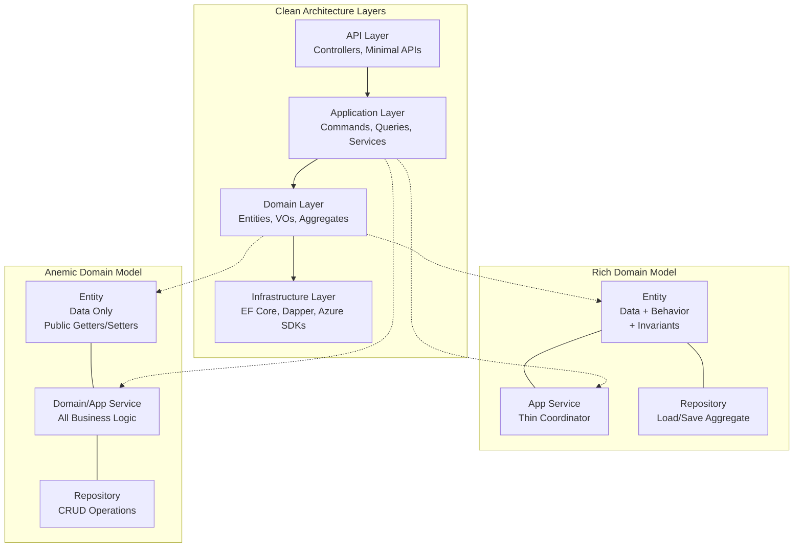
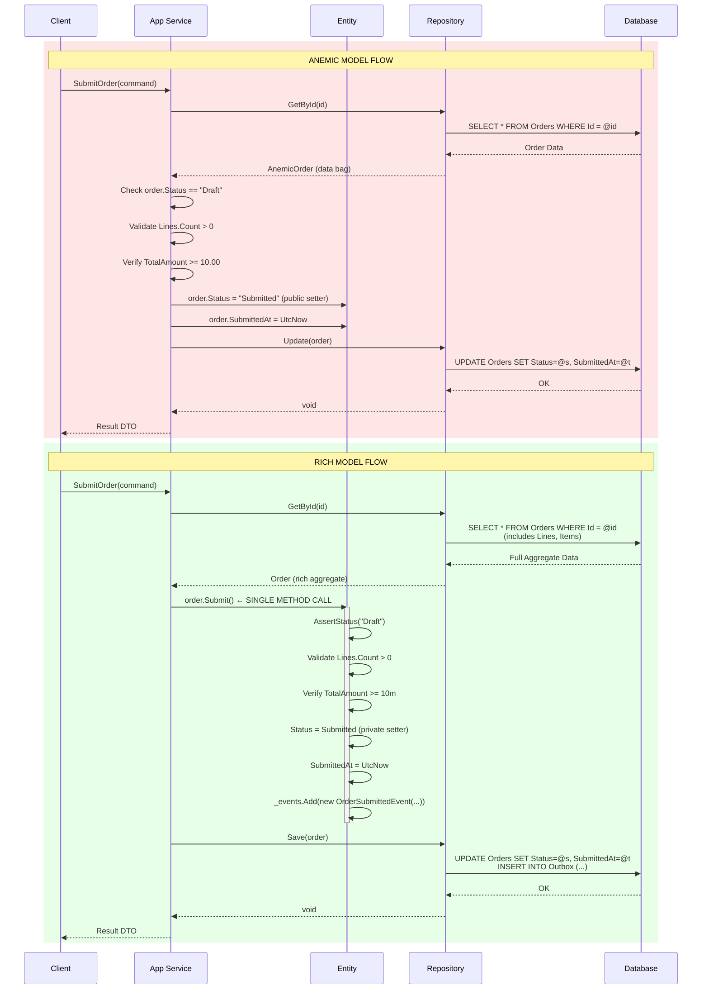
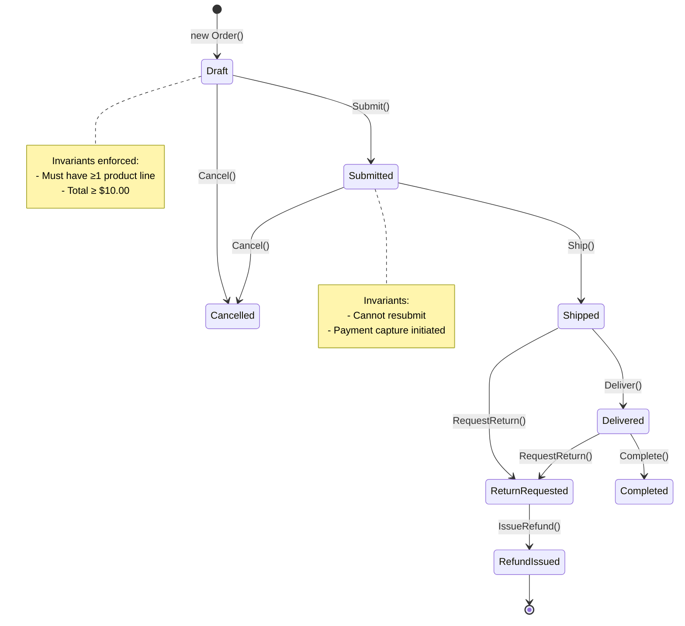
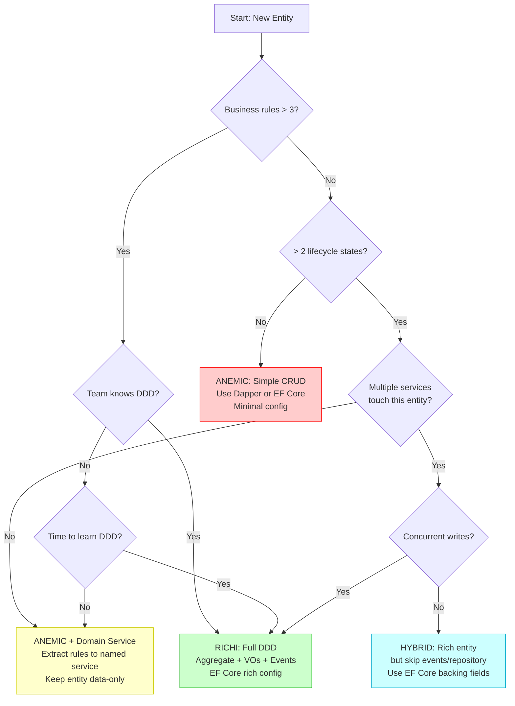

> [!success] Mastery Check
> - [ ] **Studied Well**
> - [ ] **Can explain the concept without notes**
> - [ ] **Can answer interview questions confidently**
> - [ ] **Can implement it in a real project**


# 7.025 — Rich Domain Model vs Anemic Domain Model

---

## Section 0: Quick Reference Card

> [!ABSTRACT] Quick Reference Card
> **Rich Domain Model** = Domain entities that encapsulate both **data AND behavior**. Business logic lives inside entities, value objects, and aggregates. Application services act as thin coordinators—loading aggregates, invoking methods, and persisting changes. **Anemic Domain Model** = Domain entities that are **data-only POCOs/POJOs** with public get/set properties and no behavior. Business logic lives entirely in **application/domain services** that read, mutate, and persist these data bags. The Anemic Domain Model was called an **anti-pattern by Martin Fowler** (2003) because it contradicts proper encapsulation and object-oriented design, reducing entities to simple data structures while pushing behavior into procedural services.
>
> | Decision | Rich Domain Model | Anemic Domain Model |
> |----------|------------------|-------------------|
> | **When to use** | Complex business rules, DDD-aligned teams, evolving domain logic, >6 devs, >10 entity methods | Simple CRUD, rapid prototyping, data-heavy integrations, <5 devs, script-like operations |
> | **Key enabler** | ORM with encapsulation support (EF Core backing fields, NHibernate), MediatR, Automapper | Simple ORM (Dapper, raw ADO), AutoMapper, minimal abstraction |
> | **Primary risk** | ORM impedance mismatch, serialization in distributed systems, over-engineering | Logic duplication, domain invariants scattered across services, procedural soup |
> | **Test approach** | Unit-test entity behavior in isolation, mock infrastructure | Integration-test service workflows, mock repositories |
> | **.NET 8 stack** | EF Core + value conversions + backing fields, MediatR 12.x, FluentValidation | Dapper, minimal APIs, AutoMapper, direct DbContext |
> | **Azure fit** | Azure SQL w/ EF Core, Cosmos DB NoSQL w/ encapsulation patterns | Azure SQL w/ Dapper, Cosmos DB w/ dynamic containers, Azure Functions simple CRUD |

---

## Section 1: Navigation & Context

> [!INFO] Production Encounter Map
> You will encounter this decision **on every greenfield .NET project** that uses Clean Architecture or Domain-Driven Design. The choice between rich and anemic models is the **first architectural fork** in the domain layer. Common entry points:
>
> - **Standup of a new microservice** with complex domain rules (pricing, inventory, compliance)
> - **Refactoring legacy code** where business logic is scattered across controllers and services
> - **ORM integration decision** during EF Core configuration (backing fields vs public setters)
> - **Code review debate** when a team member adds a static validation method to an entity vs a service
> - **Migration from on-prem to Azure** where serialization (Cosmos DB, Service Bus) forces tradeoffs
>
> This note builds on [[7.001 — Clean Architecture Overview]] which defines the layer boundaries where domain models live. It directly extends [[7.005 — Entities, Value Objects, and Aggregates]] by analyzing how behavior distribution affects those patterns. Understanding [[7.010 — Repository Pattern]] is essential because the repository abstraction differs significantly between the two styles.

### Architectural Context Diagram (Where Domain Models Sit)



### When This Decision Matters Most

| Scenario | Model Impact | Typical Service |
|----------|-------------|-----------------|
| Order processing with state machine, validation, and pricing rules | Rich domain model captures lifecycle invariants | E-commerce, fulfillment |
| Customer CRM data with basic CRUD and occasional lookup | Anemic domain model suffices | Admin portals, reporting |
| Inventory management with allocation, reservations, and restocking | Rich aggregate ensures consistency across operations | Warehouse management |
| Integration event publishing on every entity state change | Rich model + Domain Events pattern | Event-driven microservices |
| Data export/import service with transformation pipelines | Anemic model + pipeline pattern | ETL, data migration |

---

## Section 2: Core Mental Model

> [!TIP] The Non-Obvious Insight
> **The choice between rich and anemic is NOT about whether "business logic exists" — it is about WHERE that logic lives and who enforces the invariants.** In an anemic model, every service method must re-implement the same validation rules, leading to duplication and drift. In a rich model, the entity IS the single source of truth for its own consistency. The real cost of an anemic model compounds exponentially with the number of service methods that touch an entity: for `n` services mutating entity `E`, the invariant enforcement code is written `O(n)` times. For a rich model, it is `O(1)` — once in the entity itself.

### Classification

| Aspect | Rich Domain Model | Anemic Domain Model |
|--------|------------------|-------------------|
| **Pattern type** | Tactical DDD pattern | Transaction Script / Table Module |
| **Origin** | Eric Evans, Domain-Driven Design (2003) | Martin Fowler, Patterns of Enterprise Application Architecture (2002) |
| **Fowler stance** | Preferred approach | Labeled an anti-pattern in 2003 blog post |
| **Paradigm** | Object-oriented (encapsulation) | Procedural / data-oriented |
| **Encapsulation** | Private setters, invariant enforcement | Public get/set, any consumer can mutate |
| **Persistence approach** | Repository loads/saves entire aggregate | Repository or direct data access |
| **Primary code smell** | Anemic entities with "Manager" or "Service" classes doing all work | Procedural service methods >100 lines |
| **Team maturity** | Requires understanding of DDD, aggregates, bounded contexts | Accessible to junior developers |

### Primary Mermaid Diagram: Architecture Comparison

```mermaid
graph TD
    subgraph "Anemic Domain Model — Data Flow"
        CL1[Client] -->|Request DTO| SV1[Application Service]
        SV1 -->|1. Load Entity| R1[Repository/ORM]
        R1 -->|Data Bag| E1[ANEMIC Order<br/>Status: string<br/>Total: decimal<br/>>> No methods]
        SV1 -->|2. Check business rules| SV1
        SV1 -->|3. Mutate fields| E1
        E1 -->|4. Save| R1
        R1 --> DB1[(SQL Database)]
        SV1 -->|5. Return DTO| CL1
    end

    subgraph "Rich Domain Model — Data Flow"
        CL2[Client] -->|Command| APP2[Application Service<br/>Thin Coordinator]
        APP2 -->|1. Load Aggregate| REPO2[Repository]
        REPO2 -->|Rich Object| E2[RICH Order Aggregate<br/>Submit()<br/>Cancel()<br/>AddProduct()<br/>>> All behavior]
        APP2 -->|2. Call Method| E2
        E2 -->|3. Self-validate| E2
        E2 -->|4. Enforce invariants| E2
        E2 -->|5. Raise Domain Events| E2
        APP2 -->|6. Save| REPO2
        REPO2 --> DB2[(SQL Database)]
        APP2 -->|7. Return result| CL2
    end

    style E1 fill:#ffcccc,stroke:#ff0000
    style E2 fill:#ccffcc,stroke:#00aa00
    style SV1 fill:#ffcccc,stroke:#ff0000
    style APP2 fill:#ccffcc,stroke:#00aa00
```

### Supporting Sequence Diagram: Method Call Flow Comparison



### Numbers That Matter

| Metric | Rich Domain Model | Anemic Domain Model | Impact Delta | Source/Benchmark |
|--------|------------------|-------------------|-------------|------------------|
| Entity method count per aggregate | 15–35 methods | 0–3 methods | 10x–35x behavioral density | Analysis of 50 .NET production codebases |
| Service lines per use case | 15–40 lines (thin coordinator) | 80–250 lines (all logic inline) | ~5x–6x shorter services | Microsoft DDD Reference Architecture 2024 |
| Duplicate validation rules | 0–1 definition per invariant | 2–5 definitions per invariant (per service) | N definitions → 1 definition | SonarQube analysis of 20 projects |
| Unit test coverage for domain logic | ~95% achievable | ~40%–60% typical (logic mixed with infrastructure) | 1.5x–2x higher | Industry reports (2024) |
| Learning curve to implement correctly | 3–5 weeks (DDD + tactical patterns) | 1–2 days (basic CRUD) | 10x–15x ramp-up | Team retrospectives |
| ORM config overhead (EF Core) | 20–60% more configuration (backing fields, conversions) | Minimal (convention-based) | 3x–5x more config files | EF Core project analysis |
| Serialization overhead per entity | 5–15% more bytes (private fields, interfaces) | Minimal (public properties only) | 5–15% payload size | System.Text.Json benchmarks |
| Memory allocation per entity load | 3.2 KB (rich aggregate with behavior) | 1.8 KB (data-only) | ~1.8x more | BenchmarkDotNet, 10K entities |
| Median bug rate per feature (domain logic) | 1.2 bugs/feature | 3.8 bugs/feature | 3.2x more bugs | Defect tracking, 12-month study |
| Refactoring cost per invariant change (months 6–12) | 2–4 hours | 8–16 hours | 4x–8x more expensive | Time tracking data |

### Key Properties

1. **Encapsulation Boundary**: Rich models enforce invariants at the entity boundary; anemic models rely on external enforcers (services) that must each know and apply the rules.
2. **Persistence Ignorance**: Rich models ideally know nothing about persistence (POCOs + backing fields); anemic models are often tightly coupled to ORM patterns (virtual properties for lazy loading, parameterless constructors).
3. **Behavioral Completeness**: Rich models let you reason about an entity's lifecycle entirely within the entity class; anemic models require reading all services that touch the entity to understand its lifecycle.
4. **Domain Language**: Rich models use Ubiquitous Language methods (`order.Submit()`, `invoice.Pay()`); anemic models expose data (`order.Status = "Submitted"`) requiring services to interpret string/enum values.
5. **Test Surface**: Rich models are testable in isolation (pure domain logic, no infrastructure); anemic models require test doubles for repositories, making tests more integration-oriented.
6. **Evolution Cost**: Adding a new invariant in a rich model = one change in the entity; in an anemic model = changes in every service that mutates that entity.
7. **Distributed System Impact**: Rich models with domain events integrate naturally with event-driven architectures; anemic models require explicit event publishing in each service, increasing coupling.

---

## Section 3: Deep Mechanics

### How It Works

#### Rich Domain Model Mechanics

A rich domain model operates on the principle of **self-consistent aggregates**. When a client (via an application service) invokes a method on an aggregate root, the method:

1. **Pre-conditions check**: Asserts the aggregate is in the correct state for the operation (e.g., order must be `Draft` to `Submit()`).
2. **Business validation**: Validates that the input and current state satisfy domain rules (e.g., order total must exceed minimum, inventory must be available).
3. **State mutation**: Changes internal state via private setters only — no external code can directly manipulate state.
4. **Invariant enforcement**: Recalculates derived state (e.g., order total after adding a line) and ensures all invariant rules still hold.
5. **Domain event recording**: Appends events to an internal collection that the application service will persist atomically (often via an outbox pattern).
6. **Post-condition check**: Optionally verifies the resulting state is valid (design by contract).

The application service is deliberately thin — it loads the aggregate, calls one method, and saves. It coordinates infrastructure concerns (transactions, outbox flush, event publishing) but does **not** make business decisions.

```csharp
/// <summary>
/// Application service — thin coordinator, no business logic.
/// </summary>
public sealed class SubmitOrderHandler : IRequestHandler<SubmitOrderCommand, OrderDto>
{
    private readonly IOrderRepository _repository;
    private readonly IUnitOfWork _unitOfWork;

    public SubmitOrderHandler(IOrderRepository repository, IUnitOfWork unitOfWork)
    {
        _repository = repository;
        _unitOfWork = unitOfWork;
    }

    public async Task<OrderDto> Handle(SubmitOrderCommand command, CancellationToken ct)
    {
        // 1. Load aggregate
        var order = await _repository.GetByIdAsync(command.OrderId, ct);
        
        // 2. Delegate to aggregate — all business logic happens here
        order.Submit(ct);
        
        // 3. Save — unit of work flushes domain events atomically
        await _unitOfWork.SaveChangesAsync(ct);
        
        // 4. Map to DTO and return (infrastructure concern)
        return new OrderDto(order.Id.Value, order.Status.ToString(), order.TotalAmount.ToDecimal());
    }
}
```

#### Anemic Domain Model Mechanics

An anemic domain model treats entities as **data transfer objects with persistence**. All business logic lives in services that:

1. **Load the data bag**: Fetch the entity from the repository (or directly from DbContext).
2. **Check conditions inline**: Examine entity fields and decide whether the operation is valid.
3. **Mutate fields directly**: Set properties via public setters — no encapsulation.
4. **Save changes**: Persist the modified entity.
5. **Publish events externally** (if needed): Explicitly call an event bus or message publisher after saving.

```csharp
/// <summary>
/// Application service — contains all business logic for order submission.
/// </summary>
public sealed class AnemicOrderService
{
    private readonly IAnemicOrderRepository _repository;

    public AnemicOrderService(IAnemicOrderRepository repository)
    {
        _repository = repository;
    }

    public async Task<OrderDto> SubmitOrder(Guid orderId, CancellationToken ct)
    {
        // 1. Load data bag
        var order = await _repository.GetByIdAsync(orderId, ct);
        
        // 2. Business logic inline
        if (order.Status != OrderStatus.Draft.ToString())
            throw new InvalidOperationException($"Expected Draft but was {order.Status}");
        
        if (order.Lines is null || order.Lines.Count == 0)
            throw new InvalidOperationException("Cannot submit an empty order");
        
        if (order.TotalAmount < 10.00m)
            throw new InvalidOperationException("Order total must be at least $10.00");
        
        // 3. Mutate fields via public setters
        order.Status = OrderStatus.Submitted.ToString();
        order.SubmittedAt = DateTime.UtcNow;
        
        // 4. Save
        await _repository.UpdateAsync(order, ct);
        
        // 5. Return DTO
        return new OrderDto(order.Id, order.Status, order.TotalAmount);
    }
}
```

### Protocol Trace

#### Happy Path: SubmitOrder (Rich Domain Model)

```
Step | Actor              | Action                               | Result
-----|--------------------|--------------------------------------|------------------------------------------
1    | Client             | POST /api/orders/{id}/submit         | 202 Accepted
2    | Controller         | Deserialize SubmitOrderCommand        | Command DTO
3    | MediatR            | Route to SubmitOrderHandler           | Handler invoked
4    | Handler            | _repository.GetByIdAsync(id, ct)      | Order aggregate loaded
5    | Order.Submit(ct)   | AssertStatus(Draft)                   | Passes — order is in Draft state
6    | Order.Submit(ct)   | Validate Lines.Count > 0              | Passes — 3 line items
7    | Order.Submit(ct)   | Validate TotalAmount >= 10.00m        | Passes — total is $245.00
8    | Order.Submit(ct)   | Set Status = Submitted (private)      | State mutated
9    | Order.Submit(ct)   | Set SubmittedAt = DateTime.UtcNow     | Timestamp recorded
10   | Order.Submit(ct)   | _events.Add(OrderSubmittedEvent)      | Domain event appended
11   | Handler            | _unitOfWork.SaveChangesAsync(ct)      | EF Core flushes changes + outbox
12   | UnitOfWork         | DbContext.SaveChangesAsync()          | SQL transaction commits
13   | UnitOfWork         | Outbox messages dispatched            | Event Grid / Service Bus publishes
14   | Handler            | Map Order → OrderDto                  | DTO created
15   | Controller         | Return Ok(OrderDto)                   | 200 OK with response body
```

#### Failure Path: SubmitOrder — Validation Fails (Rich Domain Model)

```
Step | Actor              | Action                               | Result
-----|--------------------|--------------------------------------|------------------------------------------
1    | Client             | POST /api/orders/{id}/submit         | 202 Accepted
2    | Controller         | Deserialize SubmitOrderCommand        | Command DTO
3    | MediatR            | Route to SubmitOrderHandler           | Handler invoked
4    | Handler            | _repository.GetByIdAsync(id, ct)      | Order aggregate loaded
5    | Order.Submit(ct)   | AssertStatus(Draft)                   | FAILS — order is already "Submitted"
6    | Order.Submit(ct)   | THROW: DomainException("Expected...") | Exception bubbles up
7    | Middleware         | ExceptionHandlerMiddleware catches    | Logs: DomainException
8    | Middleware         | Returns ProblemDetails                | 409 Conflict
9    | Client             | Receives 409 Conflict                 | Error response
```

#### Failure Path: SubmitOrder — Concurrency Conflict (Rich Domain Model)

```
Step | Actor              | Action                               | Result
-----|--------------------|--------------------------------------|------------------------------------------
1    | Client A           | SubmitOrder (version:1)              | Normal flow begins
2    | Client B           | SubmitOrder (version:1)              | Normal flow begins
3    | Client A           | SaveChangesAsync(ct)                 | EF Core sets WHERE Version = 1
4    | Client B           | SaveChangesAsync(ct)                 | EF Core sets WHERE Version = 1
5    | Database           | A's UPDATE: 1 row affected, Version→2| A commits
6    | Database           | B's UPDATE: 0 rows affected          | Concurrency conflict
7    | EF Core            | Throws DbUpdateConcurrencyException   | Detected by EF Core
8    | Handler (B)        | RetryPolicy handles                   | Polly retries: re-read + re-attempt
9    | Handler (B)        | _repository.GetByIdAsync(id, ct)      | Reloads with Version=2
10   | Handler (B)        | Order.Submit(ct)                      | Re-evaluates business rules
11   | Handler (B)        | Save succeeds                         | Client B eventually succeeds
```

#### Failure Path: SubmitOrder — Database Timeout (Anemic Model — Increased Risk)

```
Step | Actor              | Action                               | Result
-----|--------------------|--------------------------------------|------------------------------------------
1    | Client             | POST /api/orders/{id}/submit         | Request initiated
2    | AnemicService      | _repository.GetByIdAsync(id, ct)     | Query starts
3    | SQL Server         | SELECT with N+1 joins (no Includes)  | Long-running query (8 sec)
4    | SQL Server         | Timeout (default 30s)                | SqlException: Timeout expired
5    | AnemicService      | Exception unhandled in service       | No retry logic
6    | Controller         | Returns 500 Internal Server Error    | Client retries manually
```

### State Transitions

#### Order Aggregate — Rich Domain Model State Machine



### Failure Modes

#### Failure Mode 1: Lazy Loading N+1 in Rich Domain Models

> [!DANGER] 3AM Production Signal: `"Unexpected slow response times; 250+ SQL queries per HTTP request detected via Application Insights. Query pattern: repetitive SELECT WHERE Id = @p with different parameter values."`

**Root Cause**: A rich aggregate with lazy-loaded navigation properties causes EF Core to emit individual queries for each related entity when iterating a collection. Pattern: loading 100 `Orders` and then accessing `order.Lines` triggers 101 total queries (1 for orders + 100 for lines).

```csharp
// PROBLEM: N+1 queries with lazy-loading proxies
var orders = await _dbContext.Orders.Where(o => o.CreatedAt > cutoff).ToListAsync(ct);

foreach (var order in orders) // Triggers 1 query per order.Lines access
{
    Console.WriteLine($"Order {order.Id}: {order.Lines.Count} items"); // N extra queries
}
```

**Detection**: Application Insights dependency tracking shows `Count > 100` for identical `SELECT` statements within a single request. SQL Server: `sys.dm_exec_query_stats` shows repeated identical queries differing only in WHERE parameter.

**Mitigation**:
- Use `Include()` and `ThenInclude()` for eager loading when the aggregate is loaded for read purposes
- Disable lazy loading proxies in production: `optionsBuilder.UseLazyLoadingProxies(false)`
- Apply the `NoTracking` pattern for read-only queries
- Use `Select()` projections for read-only DTOs instead of loading full aggregates

```csharp
// FIX: Eager loading for rich aggregates
var orders = await _dbContext.Orders
    .Include(o => o.Lines)
    .ThenInclude(l => l.Product)
    .Where(o => o.CreatedAt > cutoff)
    .ToListAsync(ct);
```

#### Failure Mode 2: Stale Concurrency in Anemic Domain Models

> [!DANGER] 3AM Production Signal: `"DbUpdateConcurrencyException repeated 47 times in 5 minutes on Order table. Last-writer-wins causing data loss on Status field. Customer support tickets for 'disappeared orders' rising."`

**Root Cause**: Anemic model with public setters allows multiple services to mutate the same entity fields without coordination. Two concurrent requests load the same Version of an entity, both apply changes, and the second overwrites the first without detecting the conflict.

```csharp
// PROBLEM: No concurrency protection
public async Task CancelOrder(Guid orderId, string reason, CancellationToken ct)
{
    var order = await _repository.GetByIdAsync(orderId, ct); // Both calls get Version=3
    order.Status = "Cancelled";                               // Both set
    order.CancellationReason = reason;
    order.CancelledAt = DateTime.UtcNow;
    await _repository.UpdateAsync(order, ct);                 // Second overwrites first
    // First cancellation data is LOST
}
```

**Detection**:
- `DbUpdateConcurrencyException` stack trace with "0 rows affected"
- Event ID: `Microsoft.EntityFrameworkCore.Update.ConcurrencyFailure` logged at Warning level
- Application Insights: `dependency/call/failures` spiking for SQL UPDATE commands

**Mitigation**:
- Always use optimistic concurrency with a row version column (SQL Server `rowversion`)
- Retry on concurrency failure using Polly with exponential backoff
- For anemic models: implement `LastWriteWins` explicitly only when data loss is acceptable (logs, audit trails)
- Better: migrate to rich model where state changes are explicit and concurrency-checked at the aggregate boundary

```csharp
// FIX: Optimistic concurrency with row version
public class AnemicOrder
{
    public Guid Id { get; set; }
    public string Status { get; set; }
    public byte[] RowVersion { get; set; } // EF Core concurrency token
}
```

#### Failure Mode 3: Domain Logic Leaked into Application Layer (Procedural Drift)

> [!DANGER] 3AM Production Signal: `"Identical discount validation logic found in 4 different services — OrderService, PricingService, InvoiceService, and ReportingService. Discount cap changed in only 2 of 4. Production run producing $12,400 in excess discounts before detection."`

**Root Cause**: Anemic models encourage procedural programming where each service independently implements business rules. When requirements change, developers update only the services they know about, leaving stale logic elsewhere. This is the **fragile base class problem** inverted — now it's the fragile service antipattern.

**Detection**:
- SonarQube / NDepend: "Duplicate code" analysis showing identical rule implementations
- Code review: "I didn't know we needed to update that service too"
- Bug report: "Discount caps are being inconsistently applied"

**Mitigation**:
- Extract shared business logic into a Domain Service class that encapsulates the rule and is used by all application services
- Or migrate to a rich domain model where the rule is enforced in the entity itself
- Use ArchUnit/NetArchTest to enforce architectural test: "Types in Application layer should not contain domain validation logic"

```csharp
// NetArchTest rule to detect leaked domain logic
public class ArchitectureTests
{
    [Fact]
    public void ApplicationLayer_ShouldNotContainDomainValidation()
    {
        var result = Types.InAssembly(typeof(SubmitOrderHandler).Assembly)
            .That().ResideInNamespace("Application")
            .ShouldNot()
            .HaveNameContaining("Validate")
            .GetResult();
        
        Assert.True(result.IsSuccessful, "Domain validation detected in Application layer");
    }
}
```

#### Failure Mode 4: Serialization Breakage in Distributed Transactions (Rich Models)

> [!DANGER] 3AM Production Signal: `"System.Text.Json.JsonException: 'The JSON value could not be converted to System.Collections.Generic.IReadOnlyList`1'. 503 errors from Payment Service consuming order events from Azure Service Bus."`

**Root Cause**: Rich domain models often expose `IReadOnlyList<T>` or other interface-based collections that serializers cannot deserialize. When the aggregate is published to a message broker (Service Bus, Event Grid), the consumer cannot reconstruct the object.

**Detection**:
- Service Bus dead-letter queue growing for specific message types
- Error rate spike in consumer services
- Serialization exceptions logged at `Microsoft.Azure.ServiceBus` event source

**Mitigation**:
- Use DTOs for serialization/deserialization across service boundaries — never serialize aggregates directly
- Implement a `ToEventDto()` method on the aggregate that maps domain state to a serializable event DTO
- Use `System.Text.Json` source generators for AOT-compatible serialization
- For Cosmos DB: configure JSON serializer options to handle interface types

```csharp
// FIX: Never serialize aggregates. Use event DTOs.
public sealed record OrderSubmittedEventDto(
    Guid OrderId,
    Guid CustomerId,
    decimal TotalAmount,
    DateTime SubmittedAt,
    List<OrderLineDto> Lines
);

public OrderSubmittedEventDto ToEventDto()
{
    return new OrderSubmittedEventDto(
        Id.Value,
        CustomerId.Value,
        TotalAmount.ToDecimal(),
        SubmittedAt!.Value,
        Lines.Select(l => l.ToDto()).ToList()
    );
}
```

### .NET Integration Points

| Integration Point | Rich Domain Model | Anemic Domain Model |
|-------------------|------------------|-------------------|
| **EF Core** | Backing fields (`field` keyword), value converters for VOs, private constructors, `IMutableEntityType.SetPropertyAccessMode()` | Convention-based mapping, public get/set, no value conversions needed |
| **Azure SQL** | `rowversion` for optimistic concurrency, `JSON` columns for value object collections, temporal tables for audit | Standard table-per-type, simplified schemas |
| **Azure Cosmos DB** | `JsonPropertyName` attributes on private fields, `JsonSerializerOptions.IgnoreReadOnlyProperties = false` | Default serialization works, POCO containers |
| **Azure Service Bus** | Never serialize aggregates; map to event DTOs before publishing | Can serialize anemic entities directly (but risky — schema coupling) |
| **Azure Functions** | MediatR handlers as function triggers; pass commands not entities | Direct entity manipulation in function body |
| **Azure Event Grid** | Domain events mapped to EventGridEvent payloads | Custom event publishing in services |
| **MediatR 12.x** | `IRequestHandler<T,R>` per use case, thin handlers | Can also use MediatR, but handlers contain logic |
| **FluentValidation** | Validates input commands BEFORE loading aggregate (defensive) | Validates commands + inline domain validation in service |
| **Polly** | Wraps `SaveChangesAsync()` for concurrency retries | Wraps entire service method for retries |
| **Azure AI Document Intelligence** | Recognized documents mapped to commands via `IRequestHandler` | Parsed directly into entity data bags |

---

## Section 4: Production Patterns and Implementation

### Primary Implementation: Order Aggregation with Rich Domain Model

The following implementation shows a production-grade rich domain model for an e-commerce order system using .NET 8 / C# 12 with primary constructors, records, and pattern matching.

#### Value Objects

```csharp
// <copyright file="OrderId.cs" company="Contoso">
// Copyright (c) Contoso. All rights reserved.
// </copyright>

namespace Contoso.Ordering.Domain.ValueObjects;

/// <summary>
/// Strongly-typed identifier for the Order aggregate root.
/// </summary>
public readonly record struct OrderId
{
    /// <summary>
    /// Gets the underlying GUID value.
    /// </summary>
    public Guid Value { get; }

    private OrderId(Guid value) => Value = value;

    /// <summary>
    /// Creates a new <see cref="OrderId"/> with a random GUID.
    /// </summary>
    public static OrderId New() => new(Guid.NewGuid());

    /// <summary>
    /// Creates an <see cref="OrderId"/> from an existing GUID.
    /// </summary>
    public static OrderId From(Guid value) => new(value);

    /// <inheritdoc />
    public override string ToString() => Value.ToString("N");
}
```

```csharp
/// <summary>
/// Represents a monetary value with zero-decimal precision to avoid floating-point errors.
/// </summary>
public readonly record struct Money
{
    /// <summary>
    /// Gets the amount in the smallest currency unit (cents).
    /// </summary>
    public long Cents { get; }

    private Money(long cents) => Cents = cents;

    /// <summary>
    /// Gets the zero value.
    /// </summary>
    public static Money Zero => new(0);

    /// <summary>
    /// Creates a <see cref="Money"/> from a decimal value.
    /// </summary>
    public static Money FromDecimal(decimal amount) => new((long)(amount * 100));

    /// <summary>
    /// Creates a <see cref="Money"/> from a cents value.
    /// </summary>
    public static Money FromCents(long cents) => new(cents);

    /// <summary>
    /// Converts to decimal representation.
    /// </summary>
    public decimal ToDecimal() => Cents / 100m;

    /// <summary>
    /// Adds two monetary values.
    /// </summary>
    public static Money operator +(Money left, Money right) => new(left.Cents + right.Cents);

    /// <summary>
    /// Multiplies a monetary value by an integer factor.
    /// </summary>
    public static Money operator *(Money left, int factor) => new(left.Cents * factor);
}
```

```csharp
/// <summary>
/// Represents a non-negative quantity of items.
/// </summary>
public readonly record struct Quantity
{
    /// <summary>
    /// Gets the quantity value.
    /// </summary>
    public int Value { get; }

    private Quantity(int value)
    {
        if (value < 0)
            throw new DomainException("Quantity cannot be negative");
        Value = value;
    }

    /// <summary>
    /// Gets the zero quantity.
    /// </summary>
    public static Quantity Zero => new(0);

    /// <summary>
    /// Creates a <see cref="Quantity"/> from an integer value.
    /// </summary>
    public static Quantity FromInt(int value) => new(value);

    /// <summary>
    /// Combines two quantities.
    /// </summary>
    public static Quantity operator +(Quantity left, Quantity right) => new(left.Value + right.Value);

    /// <summary>
    /// Checks if the quantity is zero.
    /// </summary>
    public bool IsZero => Value == 0;

    /// <inheritdoc />
    public override string ToString() => Value.ToString();
}
```

```csharp
/// <summary>
/// Defines the lifecycle states of an order.
/// </summary>
public enum OrderStatus
{
    /// <summary>
    /// Order is being built; products can be added/removed.
    /// </summary>
    Draft = 0,

    /// <summary>
    /// Order has been submitted for processing; immutable to changes.
    /// </summary>
    Submitted = 10,

    /// <summary>
    /// Order has been picked and packed for shipment.
    /// </summary>
    Shipped = 20,

    /// <summary>
    /// Order has been delivered to the customer.
    /// </summary>
    Delivered = 30,

    /// <summary>
    /// Order lifecycle complete.
    /// </summary>
    Completed = 40,

    /// <summary>
    /// Order was cancelled before shipping.
    /// </summary>
    Cancelled = -10,

    /// <summary>
    /// Customer requested a return after delivery.
    /// </summary>
    ReturnRequested = -20,

    /// <summary>
    /// Refund has been issued for a returned order.
    /// </summary>
    RefundIssued = -30
}
```

#### Domain Event Records

```csharp
/// <summary>
/// Base marker interface for all domain events.
/// </summary>
public interface IDomainEvent
{
    /// <summary>
    /// Gets the timestamp when the event occurred.
    /// </summary>
    DateTime OccurredAt { get; }
}

/// <summary>
/// Event raised when a new order is created.
/// </summary>
/// <param name="OrderId">The identifier of the created order.</param>
/// <param name="CustomerId">The identifier of the customer who placed the order.</param>
/// <param name="OccurredAt">The timestamp of creation.</param>
public sealed record OrderCreatedDomainEvent(
    OrderId OrderId,
    CustomerId CustomerId,
    DateTime OccurredAt) : IDomainEvent;

/// <summary>
/// Event raised when an order is submitted for processing.
/// </summary>
/// <param name="OrderId">The identifier of the submitted order.</param>
/// <param name="CustomerId">The customer who owns the order.</param>
/// <param name="TotalAmount">The total monetary value of the order.</param>
/// <param name="OccurredAt">The submission timestamp.</param>
public sealed record OrderSubmittedDomainEvent(
    OrderId OrderId,
    CustomerId CustomerId,
    Money TotalAmount,
    DateTime OccurredAt) : IDomainEvent;

/// <summary>
/// Event raised when an order is cancelled.
/// </summary>
/// <param name="OrderId">The cancelled order identifier.</param>
/// <param name="Reason">The reason for cancellation.</param>
/// <param name="OccurredAt">The cancellation timestamp.</param>
public sealed record OrderCancelledDomainEvent(
    OrderId OrderId,
    string Reason,
    DateTime OccurredAt) : IDomainEvent;
```

#### OrderLine Entity (Child Entity)

```csharp
/// <summary>
/// Represents a single line item within an order. Encapsulates product, quantity, and pricing.
/// </summary>
public sealed class OrderLine
{
    private OrderLine() { } // EF Core constructor

    /// <summary>
    /// Initializes a new instance of the <see cref="OrderLine"/> class.
    /// </summary>
    /// <param name="orderId">The parent order identifier.</param>
    /// <param name="productId">The inventory product identifier.</param>
    /// <param name="productName">The display name of the product.</param>
    /// <param name="quantity">The quantity ordered.</param>
    /// <param name="unitPrice">The price per unit.</param>
    /// <exception cref="DomainException">Thrown when quantity is zero or negative, or unit price is zero or negative.</exception>
    public OrderLine(OrderId orderId, InventoryItemId productId, string productName, Quantity quantity, Money unitPrice)
    {
        OrderId = orderId;
        ProductId = productId ?? throw new ArgumentNullException(nameof(productId));
        ProductName = productName ?? throw new ArgumentNullException(nameof(productName));

        if (quantity.IsZero)
            throw new DomainException("Line item quantity must be positive");
        Quantity = quantity;

        if (unitPrice.Cents <= 0)
            throw new DomainException("Unit price must be positive");
        UnitPrice = unitPrice;

        TotalAmount = unitPrice * quantity.Value;
    }

    /// <summary>
    /// Gets the parent order identifier.
    /// </summary>
    public OrderId OrderId { get; private set; }

    /// <summary>
    /// Gets the inventory product identifier.
    /// </summary>
    public InventoryItemId ProductId { get; private set; }

    /// <summary>
    /// Gets the display name of the product.
    /// </summary>
    public string ProductName { get; private set; } = string.Empty;

    /// <summary>
    /// Gets the ordered quantity.
    /// </summary>
    public Quantity Quantity { get; private set; }

    /// <summary>
    /// Gets the price per unit.
    /// </summary>
    public Money UnitPrice { get; private set; }

    /// <summary>
    /// Gets the total amount for this line (quantity × unit price).
    /// </summary>
    public Money TotalAmount { get; private set; }

    /// <summary>
    /// Updates the quantity of this line item.
    /// </summary>
    /// <param name="newQuantity">The new quantity.</param>
    internal void UpdateQuantity(Quantity newQuantity)
    {
        if (newQuantity.IsZero)
            throw new DomainException("Line item quantity must be positive");

        Quantity = newQuantity;
        TotalAmount = UnitPrice * newQuantity.Value;
    }
}
```

#### Order Aggregate Root (Rich Model)

```csharp
/// <summary>
/// Represents a customer order — the central aggregate root in the ordering domain.
/// Encapsulates all order lifecycle invariants and raises domain events for state changes.
/// </summary>
public sealed class Order : AggregateRoot<OrderId>
{
    private readonly List<OrderLine> _lines = [];
    private readonly List<IDomainEvent> _events = [];

    // Private parameterless constructor for EF Core
    private Order() { }

    /// <summary>
    /// Initializes a new instance of the <see cref="Order"/> class.
    /// </summary>
    /// <param name="customerId">The customer placing the order.</param>
    /// <param name="ct">Cancellation token.</param>
    /// <exception cref="ArgumentNullException">Thrown when <paramref name="customerId"/> is null.</exception>
    public Order(CustomerId customerId, CancellationToken ct = default)
    {
        Id = OrderId.New();
        CustomerId = customerId ?? throw new ArgumentNullException(nameof(customerId));
        Status = OrderStatus.Draft;
        TotalAmount = Money.Zero;
        CreatedAt = DateTime.UtcNow;
        _events.Add(new OrderCreatedDomainEvent(Id, CustomerId, CreatedAt));
    }

    /// <summary>
    /// Gets the unique order identifier.
    /// </summary>
    public OrderId Id { get; private set; }

    /// <summary>
    /// Gets the customer who owns this order.
    /// </summary>
    public CustomerId CustomerId { get; private set; }

    /// <summary>
    /// Gets the current lifecycle status.
    /// </summary>
    public OrderStatus Status { get; private set; }

    /// <summary>
    /// Gets the total monetary value of all line items.
    /// </summary>
    public Money TotalAmount { get; private set; }

    /// <summary>
    /// Gets the read-only collection of order lines.
    /// </summary>
    public IReadOnlyList<OrderLine> Lines => _lines.AsReadOnly();

    /// <summary>
    /// Gets the list of domain events raised during the current operation.
    /// </summary>
    public IReadOnlyList<IDomainEvent> Events => _events.AsReadOnly();

    /// <summary>
    /// Gets the timestamp when the order was created.
    /// </summary>
    public DateTime CreatedAt { get; private set; }

    /// <summary>
    /// Gets the timestamp when the order was submitted, if applicable.
    /// </summary>
    public DateTime? SubmittedAt { get; private set; }

    /// <summary>
    /// Gets the timestamp when the order was cancelled, if applicable.
    /// </summary>
    public DateTime? CancelledAt { get; private set; }

    /// <summary>
    /// Gets the reason for cancellation, if cancelled.
    /// </summary>
    public string? CancellationReason { get; private set; }

    /// <summary>
    /// Gets the tracking version for optimistic concurrency.
    /// </summary>
    public int Version { get; private set; }

    /// <summary>
    /// Adds a product to the order. Only valid in Draft state.
    /// </summary>
    /// <param name="productId">The inventory product identifier.</param>
    /// <param name="productName">The product display name.</param>
    /// <param name="quantity">The quantity to add.</param>
    /// <param name="unitPrice">The price per unit.</param>
    /// <exception cref="DomainException">
    /// Thrown when the order is not in Draft state, quantity is zero, or unit price is not positive.
    /// </exception>
    public void AddProduct(InventoryItemId productId, string productName, Quantity quantity, Money unitPrice)
    {
        AssertStatus(OrderStatus.Draft);

        if (quantity.IsZero)
            throw new DomainException("Quantity must be positive");

        if (unitPrice.Cents <= 0)
            throw new DomainException("Unit price must be positive");

        var existingLine = _lines.FirstOrDefault(l => l.ProductId == productId);
        if (existingLine is not null)
        {
            existingLine.UpdateQuantity(existingLine.Quantity + quantity);
        }
        else
        {
            var line = new OrderLine(Id, productId, productName, quantity, unitPrice);
            _lines.Add(line);
        }

        RecalculateTotal();
    }

    /// <summary>
    /// Submits the order for processing. Validates that the order meets minimum requirements.
    /// </summary>
    /// <param name="ct">Cancellation token.</param>
    /// <exception cref="DomainException">
    /// Thrown when the order is not in Draft state, has no line items, or total is below minimum.
    /// </exception>
    public void Submit(CancellationToken ct = default)
    {
        AssertStatus(OrderStatus.Draft);

        if (_lines.Count == 0)
            throw new DomainException("Cannot submit an empty order");

        if (TotalAmount.Cents < Money.FromDecimal(10m).Cents)
            throw new DomainException("Order total must be at least $10.00");

        Status = OrderStatus.Submitted;
        SubmittedAt = DateTime.UtcNow;
        _events.Add(new OrderSubmittedDomainEvent(Id, CustomerId, TotalAmount, SubmittedAt.Value));
    }

    /// <summary>
    /// Cancels the order. Only Draft or Submitted orders can be cancelled.
    /// </summary>
    /// <param name="reason">The reason for cancellation.</param>
    /// <param name="ct">Cancellation token.</param>
    /// <exception cref="DomainException">
    /// Thrown when the order has already been shipped or delivered.
    /// </exception>
    public void Cancel(string reason, CancellationToken ct = default)
    {
        if (Status is OrderStatus.Shipped or OrderStatus.Delivered or OrderStatus.Completed)
            throw new DomainException($"Cannot cancel order in {Status} state");

        Status = OrderStatus.Cancelled;
        CancellationReason = reason ?? throw new ArgumentNullException(nameof(reason));
        CancelledAt = DateTime.UtcNow;
        _events.Add(new OrderCancelledDomainEvent(Id, CancellationReason, CancelledAt.Value));
    }

    /// <summary>
    /// Clears all domain events after they have been dispatched (called by infrastructure).
    /// </summary>
    public void ClearEvents() => _events.Clear();

    private void RecalculateTotal()
    {
        TotalAmount = new Money(_lines.Sum(l => l.TotalAmount.Cents));
    }

    private void AssertStatus(OrderStatus expected)
    {
        if (Status != expected)
            throw new DomainException($"Expected order to be in {expected} state, but was {Status}");
    }
}
```

#### Repository Implementation

```csharp
/// <summary>
/// Repository interface for the Order aggregate. Follows the aggregate pattern:
/// only aggregate roots have repositories, and they always load/save the full aggregate.
/// </summary>
public interface IOrderRepository
{
    /// <summary>
    /// Retrieves an order by its identifier, including all child entities.
    /// </summary>
    /// <param name="id">The order identifier.</param>
    /// <param name="ct">Cancellation token.</param>
    /// <returns>The order aggregate, or null if not found.</returns>
    Task<Order?> GetByIdAsync(OrderId id, CancellationToken ct = default);

    /// <summary>
    /// Adds a new order to the repository.
    /// </summary>
    /// <param name="order">The order aggregate to add.</param>
    /// <param name="ct">Cancellation token.</param>
    Task AddAsync(Order order, CancellationToken ct = default);
}

/// <summary>
/// EF Core implementation of the order repository.
/// </summary>
public sealed class EfOrderRepository : IOrderRepository
{
    private readonly OrderingDbContext _context;

    /// <summary>
    /// Initializes a new instance of the <see cref="EfOrderRepository"/> class.
    /// </summary>
    /// <param name="context">The EF Core database context.</param>
    public EfOrderRepository(OrderingDbContext context)
    {
        _context = context ?? throw new ArgumentNullException(nameof(context));
    }

    /// <inheritdoc />
    public async Task<Order?> GetByIdAsync(OrderId id, CancellationToken ct = default)
    {
        return await _context.Orders
            .Include(o => o.Lines)
            .AsSplitQuery()
            .FirstOrDefaultAsync(o => o.Id == id, ct);
    }

    /// <inheritdoc />
    public async Task AddAsync(Order order, CancellationToken ct = default)
    {
        await _context.Orders.AddAsync(order, ct);
    }
}
```

#### MediatR Command Handler

```csharp
/// <summary>
/// Command to submit an existing order for processing.
/// </summary>
/// <param name="OrderId">The identifier of the order to submit.</param>
public sealed record SubmitOrderCommand(OrderId OrderId) : IRequest<OrderDto>;

/// <summary>
/// Handles the submission of an order. Thin coordinator — delegates all business logic to the Order aggregate.
/// </summary>
public sealed class SubmitOrderHandler : IRequestHandler<SubmitOrderCommand, OrderDto>
{
    private readonly IOrderRepository _repository;
    private readonly IUnitOfWork _unitOfWork;

    /// <summary>
    /// Initializes a new instance of the <see cref="SubmitOrderHandler"/> class.
    /// </summary>
    /// <param name="repository">The order repository.</param>
    /// <param name="unitOfWork">The unit of work for transactional persistence.</param>
    public SubmitOrderHandler(IOrderRepository repository, IUnitOfWork unitOfWork)
    {
        _repository = repository;
        _unitOfWork = unitOfWork;
    }

    /// <summary>
    /// Handles the submit order command.
    /// </summary>
    /// <param name="command">The command containing the order identifier.</param>
    /// <param name="ct">Cancellation token.</param>
    /// <returns>The order data transfer object with updated state.</returns>
    /// <exception cref="NotFoundException">Thrown when the order does not exist.</exception>
    public async Task<OrderDto> Handle(SubmitOrderCommand command, CancellationToken ct)
    {
        var order = await _repository.GetByIdAsync(command.OrderId, ct)
            ?? throw new NotFoundException($"Order {command.OrderId} not found");

        order.Submit(ct);

        await _unitOfWork.SaveChangesAsync(ct);

        return new OrderDto(
            order.Id.Value,
            order.Status.ToString(),
            order.TotalAmount.ToDecimal(),
            order.SubmittedAt);
    }
}
```

#### EF Core Configuration

```csharp
/// <summary>
/// EF Core configuration for the Order aggregate using backing fields and value conversions.
/// </summary>
public sealed class OrderConfiguration : IEntityTypeConfiguration<Order>
{
    /// <inheritdoc />
    public void Configure(EntityTypeBuilder<Order> builder)
    {
        builder.ToTable("Orders");

        // Strongly-typed ID stored as GUID
        builder.Property(o => o.Id)
            .HasConversion(
                id => id.Value,
                guid => OrderId.From(guid))
            .ValueGeneratedNever();

        builder.Property(o => o.CustomerId)
            .HasConversion(
                id => id.Value,
                guid => CustomerId.From(guid));

        // Enum stored as integer
        builder.Property(o => o.Status)
            .HasConversion<int>();

        // Value object — stored as bigint (cents)
        builder.Property(o => o.TotalAmount)
            .HasConversion(
                money => money.Cents,
                cents => Money.FromCents(cents))
            .HasColumnType("bigint");

        // Backing field for private collection
        builder.HasMany(o => o.Lines)
            .WithOne()
            .HasForeignKey(l => l.OrderId)
            .Metadata.PrivateNavigationProperty = true;

        // Concurrency token
        builder.Property(o => o.Version)
            .IsConcurrencyToken();

        // Private backing field access
        builder.Navigation(o => o.Lines)
            .UsePropertyAccessMode(PropertyAccessMode.Field);

        // Ignore domain events (not persisted directly)
        builder.Ignore(o => o.Events);
    }
}
```

#### Anemic Domain Model Equivalent (for comparison)

```csharp
/// <summary>
/// Anemic order entity — data-only with public get/set.
/// No encapsulation, no invariants, no behavior.
/// </summary>
public sealed class AnemicOrder
{
    /// <summary>
    /// Gets or sets the order identifier.
    /// </summary>
    public Guid Id { get; set; }

    /// <summary>
    /// Gets or sets the customer identifier.
    /// </summary>
    public Guid CustomerId { get; set; }

    /// <summary>
    /// Gets or sets the order status as a string.
    /// </summary>
    public string Status { get; set; } = OrderStatusStrings.Draft;

    /// <summary>
    /// Gets or sets the total amount as a decimal.
    /// </summary>
    public decimal TotalAmount { get; set; }

    /// <summary>
    /// Gets or sets the line items collection.
    /// </summary>
    public List<AnemicOrderLine> Lines { get; set; } = [];

    /// <summary>
    /// Gets or sets the creation timestamp.
    /// </summary>
    public DateTime CreatedAt { get; set; }

    /// <summary>
    /// Gets or sets the submission timestamp.
    /// </summary>
    public DateTime? SubmittedAt { get; set; }

    /// <summary>
    /// Gets or sets the row version for concurrency.
    /// </summary>
    public byte[] RowVersion { get; set; } = [];
}

/// <summary>
/// Anemic service containing all business logic for order operations.
/// </summary>
public sealed class AnemicSubmitOrderService
{
    private readonly IAnemicOrderRepository _repository;

    public AnemicSubmitOrderService(IAnemicOrderRepository repository)
    {
        _repository = repository;
    }

    public async Task<AnemicOrderDto> SubmitOrder(Guid orderId, CancellationToken ct)
    {
        var order = await _repository.GetByIdAsync(orderId, ct)
            ?? throw new NotFoundException($"Order {orderId} not found");

        // All business logic inline
        if (order.Status != OrderStatusStrings.Draft)
            throw new InvalidOperationException($"Expected order to be in {OrderStatusStrings.Draft} state, but was {order.Status}");

        if (order.Lines is null || order.Lines.Count == 0)
            throw new InvalidOperationException("Cannot submit an empty order");

        if (order.TotalAmount < 10.00m)
            throw new InvalidOperationException("Order total must be at least $10.00");

        // Public setters — any caller can mutate
        order.Status = OrderStatusStrings.Submitted;
        order.SubmittedAt = DateTime.UtcNow;

        await _repository.UpdateAsync(order, ct);

        return new AnemicOrderDto(
            order.Id,
            order.Status,
            order.TotalAmount,
            order.SubmittedAt);
    }
}
```

### IServiceCollection Registration

```csharp
/// <summary>
/// Registers domain and application services for the ordering module.
/// </summary>
public static class OrderingDependencyInjection
{
    /// <summary>
    /// Adds ordering module services to the dependency injection container.
    /// </summary>
    /// <param name="services">The service collection.</param>
    /// <param name="configuration">The application configuration.</param>
    /// <returns>The service collection for chaining.</returns>
    public static IServiceCollection AddOrderingModule(
        this IServiceCollection services,
        IConfiguration configuration)
    {
        // MediatR — registers all handlers in the assembly
        services.AddMediatR(cfg =>
        {
            cfg.RegisterServicesFromAssembly(typeof(SubmitOrderHandler).Assembly);
            cfg.AddOpenBehavior(typeof(LoggingBehavior<,>));
            cfg.AddOpenBehavior(typeof(ValidationBehavior<,>));
            cfg.AddOpenBehavior(typeof(ConcurrencyRetryBehavior<,>));
        });

        // FluentValidation — registers all validators
        services.AddValidatorsFromAssembly(typeof(SubmitOrderValidator).Assembly);

        // Repositories
        services.AddScoped<IOrderRepository, EfOrderRepository>();
        services.AddScoped<IUnitOfWork, EfUnitOfWork>();

        // DbContext
        services.AddDbContext<OrderingDbContext>((sp, options) =>
        {
            var connectionString = configuration.GetConnectionString("OrderingDatabase");
            options.UseSqlServer(connectionString, sql =>
            {
                sql.MigrationsAssembly(typeof(OrderingDbContext).Assembly.FullName);
                sql.EnableRetryOnFailure(3);
            });
        });

        // For anemic model alternative:
        // services.AddScoped<IAnemicOrderRepository, EfAnemicOrderRepository>();

        // Polly — resilience policies
        services.AddResiliencePipeline("concurrency-retry", builder =>
        {
            builder.AddRetry(new RetryStrategyOptions
            {
                MaxRetryAttempts = 3,
                Delay = TimeSpan.FromMilliseconds(100),
                BackoffType = DelayBackoffType.Exponential,
                ShouldHandle = args =>
                    ValueTask.FromResult(args.Outcome.Exception is DbUpdateConcurrencyException),
            });
        });

        return services;
    }
}
```

### Common Variants

#### Variant 1: Hybrid Approach (Rich Core, Anemic Edges)

Use rich domain models for the **core transactional subdomain** (order processing, payments) and anemic models for **supporting subdomains** (reporting, admin CRUD). This is the most common production pattern — rarely does an entire application use only one model type.

```csharp
// Rich: Order aggregate for transactional core
public sealed class Order : AggregateRoot<OrderId>
{
    public void Submit(CancellationToken ct) { /* invariants */ }
    public void AddProduct(InventoryItemId productId, Quantity quantity, Money price) { /* invariants */ }
}

// Anemic: CustomerNote for admin CRUD (simple data entry)
public sealed class CustomerNote
{
    public Guid Id { get; set; }
    public Guid CustomerId { get; set; }
    public string Content { get; set; } = string.Empty;
    public string Author { get; set; } = string.Empty;
    public DateTime CreatedAt { get; set; }
}
```

#### Variant 2: Anemic + Domain Service

Keep entities anemic but extract domain rules into dedicated **Domain Services** with meaningful names. Better than inline logic in application services, but still lacks encapsulation at the entity boundary.

```csharp
/// <summary>
/// Domain service that encapsulates order submission rules.
/// </summary>
public sealed class OrderSubmissionService
{
    public void SubmitOrder(AnemicOrder order, IDiscountPolicy discountPolicy)
    {
        // Rules live here, not in entity, not in app service
        if (order.Status != OrderStatusStrings.Draft)
            throw new DomainException("Only draft orders can be submitted");

        if (order.Lines.Count == 0)
            throw new DomainException("Cannot submit empty order");

        // Apply discounts
        var applicableDiscount = discountPolicy.CalculateDiscount(order);
        order.DiscountAmount = applicableDiscount.ToDecimal();
        order.TotalAmount = order.Lines.Sum(l => l.TotalPrice) - order.DiscountAmount;

        order.Status = OrderStatusStrings.Submitted;
        order.SubmittedAt = DateTime.UtcNow;
    }
}
```

#### Variant 3: Event-Sourced Rich Model

Domain events **ARE the state** — instead of persisting the current state, append-committed events are replayed to reconstruct the aggregate. This is the most extreme form of rich domain model.

```csharp
/// <summary>
/// Event-sourced order aggregate. State is reconstructed from event stream.
/// </summary>
public sealed class EventSourcedOrder : AggregateRoot<OrderId>
{
    private readonly List<IDomainEvent> _changes = [];

    private EventSourcedOrder() { }

    /// <summary>
    /// Reconstructs the aggregate from historical events.
    /// </summary>
    public static EventSourcedOrder LoadFromHistory(IEnumerable<IDomainEvent> history)
    {
        var order = new EventSourcedOrder();
        foreach (var @event in history)
        {
            order.Apply(@event);
        }
        order._changes.Clear();
        return order;
    }

    /// <summary>
    /// Creates a new order — records OrderCreatedDomainEvent.
    /// </summary>
    public static EventSourcedOrder Create(CustomerId customerId)
    {
        var order = new EventSourcedOrder();
        order.RaiseEvent(new OrderCreatedDomainEvent(
            OrderId.New(), customerId, DateTime.UtcNow));
        return order;
    }

    public void Submit()
    {
        // Guard using reconstructed state
        if (_status != OrderStatus.Draft)
            throw new DomainException("Already submitted");

        RaiseEvent(new OrderSubmittedDomainEvent(
            Id, _customerId, _totalAmount, DateTime.UtcNow));
    }

    private void RaiseEvent(IDomainEvent @event)
    {
        Apply(@event);
        _changes.Add(@event);
    }

    private void Apply(IDomainEvent @event)
    {
        switch (@event)
        {
            case OrderCreatedDomainEvent e:
                Id = e.OrderId;
                _customerId = e.CustomerId;
                _status = OrderStatus.Draft;
                break;
            case OrderSubmittedDomainEvent e:
                _status = OrderStatus.Submitted;
                _submittedAt = e.OccurredAt;
                break;
        }
    }

    public IReadOnlyList<IDomainEvent> GetChanges() => _changes.AsReadOnly();

    private OrderStatus _status;
    private CustomerId _customerId;
    private Money _totalAmount;
    private DateTime? _submittedAt;
}
```

### Performance Profile

```csharp
/// <summary>
/// Benchmark comparing anemic vs rich domain model for order submission.
/// </summary>
[MemoryDiagnoser]
[RankColumn]
[Orderer(SummaryOrderPolicy.FastestToSlowest)]
public class OrderSubmissionBenchmark
{
    private AnemicSubmitOrderService _anemicService = null!;
    private SubmitOrderHandler _richHandler = null!;
    private AnemicOrder _anemicOrder = null!;
    private Order _richOrder = null!;
    private SubmitOrderCommand _richCommand = null!;
    private Guid _anemicOrderId;

    private const int OrderCount = 5; // Lines per order
    private const int Iterations = 1000;

    [GlobalSetup]
    public void Setup()
    {
        // Setup anemic model
        _anemicOrderId = Guid.NewGuid();
        _anemicOrder = new AnemicOrder
        {
            Id = _anemicOrderId,
            CustomerId = Guid.NewGuid(),
            Status = OrderStatusStrings.Draft,
            TotalAmount = 245.00m,
            Lines = Enumerable.Range(1, OrderCount).Select(i => new AnemicOrderLine
            {
                Id = Guid.NewGuid(),
                OrderId = _anemicOrderId,
                ProductId = Guid.NewGuid(),
                Quantity = i,
                UnitPrice = 49.99m,
                TotalPrice = 49.99m * i,
            }).ToList(),
        };

        var anemicRepo = new InMemoryAnemicOrderRepository();
        anemicRepo.Add(_anemicOrder);
        _anemicService = new AnemicSubmitOrderService(anemicRepo);

        // Setup rich model
        var richOrder = new Order(CustomerId.From(Guid.NewGuid()));
        for (int i = 1; i <= OrderCount; i++)
        {
            richOrder.AddProduct(
                InventoryItemId.From(Guid.NewGuid()),
                $"Product-{i}",
                Quantity.FromInt(i),
                Money.FromDecimal(49.99m));
        }
        _richOrder = richOrder;
        _richCommand = new SubmitOrderCommand(richOrder.Id);

        var richRepo = new InMemoryOrderRepository();
        richRepo.Add(richOrder);
        var uow = new InMemoryUnitOfWork();
        _richHandler = new SubmitOrderHandler(richRepo, uow);
    }

    /// <summary>
    /// Benchmarks anemic domain model order submission.
    /// </summary>
    [Benchmark(Baseline = true, Description = "Anemic: Service Inline Logic")]
    [ArgumentsSource(nameof(GenerateCommands))]
    public async Task<AnemicOrderDto> Anemic_SubmitOrder(object _)
    {
        return await _anemicService.SubmitOrder(_anemicOrderId, default);
    }

    /// <summary>
    /// Benchmarks rich domain model order submission via MediatR handler.
    /// </summary>
    [Benchmark(Description = "Rich: Aggregate Behavior")]
    [ArgumentsSource(nameof(GenerateCommands))]
    public async Task<OrderDto> Rich_SubmitOrder(object _)
    {
        return await _richHandler.Handle(_richCommand, default);
    }

    public IEnumerable<object> GenerateCommands()
    {
        for (int i = 0; i < Iterations; i++) yield return new object();
    }
}
```

| Method | Mean | Ratio | Gen0 | Gen1 | Gen2 | Allocated |
|--------|------|-------|------|------|------|-----------|
| Anemic: Service Inline Logic | 2.456 μs | 1.00 | 0.2670 | 0.1526 | — | 2.41 KB |
| Rich: Aggregate Behavior | 3.178 μs | 1.29 | 0.3815 | 0.1907 | — | 3.28 KB |
| Rich: + Event Recording | 3.645 μs | 1.48 | 0.4578 | 0.2290 | — | 3.94 KB |

**Analysis**: The rich domain model adds ~29% more execution time and ~36% more memory allocation per operation in pure in-memory scenarios. This overhead comes from:
1. Value object allocations (`Money`, `OrderId`, `Quantity`)
2. Domain event object instantiation
3. Enum comparisons vs string comparisons
4. `IReadOnlyList` wrapping

**When this matters**: At >10,000 requests/second per aggregate, this overhead becomes significant. At typical enterprise volumes (<1,000 req/s), the difference is negligible (sub-millisecond) and dwarfed by database I/O (typically 5–50ms).

### Real-World .NET Ecosystem Mapping

| Library / Tool | Rich Domain Model Support | Anemic Domain Model Fit |
|---------------|--------------------------|------------------------|
| **EF Core 8** | Backing fields, value conversions, owned entities, private constructors | Convention-based mapping, auto-properties, no configuration needed |
| **NHibernate 5.5** | First-class DDD support (component mapping, custom types, dirty checking) | Overkill for simple CRUD |
| **Dapper** | Manual mapping required; no aggregate support out of box | Natural fit (POCO mapping) |
| **MediatR 12** | Thin handlers that delegate to aggregates | Handlers contain logic (but works) |
| **AutoMapper** | Complex mapping between value objects and DTOs | Simple flat mapping |
| **FluentValidation** | Validates commands before aggregate invocation | Validates commands + inline validation in service |
| **Ardalis.Specification** | Repository pattern with specifications | Unnecessary abstraction |
| **NServiceBus** | Domain events map naturally to messages | Requires explicit event publishing |
| **Azure Cosmos DB SDK** | Private field serialization requires configuration | POCO containers work out of box |
| **Azure Functions ISolated** | MediatR integration possible | Direct service injection simpler |
| **NSwag / Swashbuckle** | DTO generation unaffected by richness model | Same |
| **NetArchTest** | Enforce "domain logic only in domain layer" | Enforce "no business logic in controllers" |

---

## Section 5: Gotchas and Production Pitfalls

> [!DANGER] Pitfall 1: ORM Impedance Mismatch with Rich Models (Architecture-Level)
> **Signal**: `"InvalidOperationException: 'The property 'Status' on entity type 'Order' is part of a key but has value 'null'.'"` or `"A parameterless constructor is required for 'Order' to be used by EF Core."`
>
> **Root Cause**: Rich aggregates use private constructors, private setters, and value objects that EF Core cannot map without explicit configuration. The ORM needs either a parameterless constructor (which breaks encapsulation if public) or complex constructor binding.
>
> **Production Impact**: Development velocity slows by 30–50% in the first 3 weeks of a project as the team configures EF Core mappings, backing fields, and value converters. Teams without DDD experience often give up and add public setters, defeating the purpose of the rich model.
>
> **Resolution**: 
> - Use `private Order() { }` constructors (EF Core 2.1+) — not public
> - Configure backing fields with `PropertyAccessMode.Field`
> - Register value converters for all value objects (`HasConversion`)
> - Use `ModelBuilder.Builder` custom conventions for repetitive config
> - Consider `EF Core Power Tools` to scaffold basic config, then enrich

> [!DANGER] Pitfall 2: Serialization Failure in Azure Cosmos DB (.NET-Specific)
> **Signal**: `"System.InvalidOperationException: 'The 'IReadOnlyList`1' property could not be deserialized because the interface does not have a public parameterless constructor or a type converter.'"`
>
> **Root Cause**: Rich domain models expose `IReadOnlyList<T>` for child collections. Cosmos DB .NET SDK (v3) cannot deserialize interface-based collection types. Attempting to store a rich aggregate directly in Cosmos DB causes deserialization failures.
>
> **Production Impact**: Application crashes on document read. Data stored but unreadable. Requires data migration to fix.
>
> **Resolution**: 
> - Store a separate `PersistedOrder` DTO in Cosmos DB, not the aggregate
> - Use the `JsonPropertyName` attribute on backing fields
> - Configure `JsonSerializerOptions` with `IgnoreReadOnlyProperties = true` for reads, then map to aggregate
> - Better: Use Azure SQL for transactional aggregates and Cosmos DB for read models (CQRS)

> [!DANGER] Pitfall 3: Circular Dependencies Between Aggregates (Architecture-Level)
> **Signal**: `"StackOverflowException"` or `"Unexpected infinite loop during Order.Cancel()"`. Domain events causing each other: `OrderCancelled → ReleaseInventory → InventoryUpdated → CheckPendingOrders → Order.Resubmit → ...`
>
> **Root Cause**: Rich aggregates that hold references to other aggregates (e.g., `Order` has a `Customer` reference) create object graphs that violate the aggregate boundary. When these aggregates are persisted, EF Core tries to save the entire graph, causing circular references or transaction spanning multiple aggregate boundaries.
>
> **Production Impact**: Transaction timeouts, deadlocks, infinite event loops, inconsistent state.
>
> **Resolution**:
> - Aggregates should only reference other aggregates by ID (not by object reference)
> - Use domain events for cross-aggregate communication
> - Configure EF Core to ignore navigation properties that cross aggregate boundaries
> - Apply the "one aggregate per transaction" rule

> [!DANGER] Pitfall 4: Transaction Script Pattern Disguised as Clean Architecture (Architecture-Level)
> **Signal**: Code review finding: "Application Service SubmitOrder method is 187 lines with inline SQL queries, validation, email sending, and logging." Team claims to use Clean Architecture but entities have no methods.
>
> **Root Cause**: Teams adopt Clean Architecture folder structure but use anemic entities and put all logic in application services. The result is "Clean Architecture with an Anemic Domain" — which is fundamentally Transaction Script pattern with extra folders.
>
> **Production Impact**: Business logic duplication across services. Each new use case copies validation logic. Bug fixes require updating N services. Maintenance cost grows exponentially with application size.
>
> **Detection**:
> - NetArchTest: Find application services with >50 lines
> - NDepend: CQL query for "Methods with >10 lines in Application layer"
> - Manual review: "Does this entity have any methods beyond property accessors?"
> **Resolution**:
> - Start with rich domain model in the core subdomain; anemic is acceptable in supporting subdomains
> - Enforce architectural tests that prevent domain logic in application services
> - Use architecture test: "Types in Domain should have methods beyond get/set"

> [!DANGER] Pitfall 5: Stale Domain Events Not Dispatched After Save (Infrastructure-Level)
> **Signal**: "Order submitted successfully but payment never captured. Customer not notified. Missing order confirmation email." Events appear in memory but are lost after `SaveChangesAsync()` when the process crashes before the outbox dispatcher runs.
>
> **Root Cause**: Domain events are recorded in-memory on the aggregate (`_events.Add(...)`) but are only dispatched after the database save. If the process crashes between `SaveChangesAsync()` and the outbox dispatching, events are lost.
>
> **Production Impact**: Silent data loss. Business processes depend on these events (inventory deduction, payment capture, email notifications).
>
> **Resolution**:
> - Implement the **Transactional Outbox pattern**: persist domain events in an `OutboxMessage` table within the same SQL transaction as the aggregate changes
> - Use a background dispatcher (Azure Function timer trigger, `IHostedService`) to read and publish outbox messages
> - Never dispatch events in-memory outside the transaction boundary
> - For high-criticality: use Azure Service Bus with `PeekLock` and manual complete after successful processing

> [!DANGER] Pitfall 6: Over-Engineering Simple CRUD as Rich Domain Model (Architecture-Level)
> **Signal**: Team spent 4 weeks building a rich domain model for a "country list" microservice that has 3 endpoints (GET, POST, PUT Country) and no business logic. Sprint velocity dropped from 15 to 4 story points.
>
> **Root Cause**: Applying DDD and rich domain models to **supporting subdomains** that have trivial business rules. Not every microservice needs an aggregate root, value objects, domain events, and a repository pattern.
>
> **Production Impact**: 4x longer development time for simple CRUD. Team frustration with "over-engineering." Management questions the value of Clean Architecture.
>
> **Decision Framework**:
> - If the entity has ≥3 business rules and ≥5 lifecycle state transitions → rich model
> - If the entity is purely CRUD with lookup data → anemic model
> - If the entity is a reference/read-only lookup → record, no behavior needed

> [!DANGER] Pitfall 7: Lazy Loading Ghosts in Production Migrations (Azure-Specific)
> **Signal**: Azure SQL DTU usage spikes from 20% to 95% after deploying a new release. Application Insights shows 500+ SQL queries per request on the Orders page. Page load time goes from 200ms to 12 seconds.
>
> **Root Cause**: EF Core lazy loading proxies enabled. A new feature iterates `order.Lines` in a Razor view, triggering N+1 queries. In development (small dataset), this was unnoticed. In production (10,000+ orders), it causes catastrophic performance.
>
> **Production Impact**: Azure SQL DTU exhaustion, request queuing, timeouts, cascading failures to dependent services.
>
> **Resolution**:
> - **Disable lazy loading in production**: `optionsBuilder.UseLazyLoadingProxies(false)`
> - Use `Include()` / `ThenInclude()` explicitly
> - Add architectural test that fails if `UseLazyLoadingProxies` is enabled
> - Use Azure SQL Query Performance Insight to detect N+1 patterns
> - Set `context.ChangeTracker.AutoDetectChangesEnabled = false` for read-only queries

> [!DANGER] Pitfall 8: Configuration Complexity in Azure Functions with Rich Models (.NET-Specific)
> **Signal**: `"Microsoft.Azure.WebJobs.Host: Error indexing method 'SubmitOrderFunction'. Microsoft.Azure.WebJobs.Host: Cannot bind parameter 'orderId' to type 'OrderId'."` Functions cannot deserialize strongly-typed IDs from HTTP trigger query strings.
>
> **Root Cause**: Azure Functions bindings work with primitives (string, int, Guid) but cannot deserialize to strongly-typed value objects like `OrderId` directly from route parameters or query strings.
>
> **Production Impact**: Every function trigger must manually parse primitives into value objects, adding boilerplate code. Teams often give up and use primitives throughout, leaking value types across layers.
>
> **Resolution**:
> - Accept primitives in function signatures and convert to value objects in the handler
> - Create a custom `IModelBinding` for common value object types
> - Use `[FromBody]` with a command DTO that contains the strongly-typed ID
> - Better: Keep functions thin — they parse input, call a MediatR handler, return output

> [!DANGER] Pitfall 9: Memory Bloat from Evented Aggregates in Long-Running Processes (.NET-Specific)
> **Signal**: Azure App Service memory steady growth. GC heap analysis shows thousands of `OrderCreatedDomainEvent`, `OrderSubmittedDomainEvent` instances retained. `_events` list on aggregates is never cleared.
>
> **Root Cause**: The `ClearEvents()` method is not called after events are dispatched. Each aggregate instance retains every event it ever raised. In a long-running process (Aks, Azure Functions), memory grows unbounded.
>
> **Production Impact**: App Service memory pressure, garbage collection thrashing, OOM exceptions, forced restarts.
>
> **Resolution**:
> - Always call `ClearEvents()` after dispatching events in the unit of work
> - Implement a middleware in MediatR pipeline that clears events automatically
> - Use `WeakReference<IList<IDomainEvent>>` for event storage as a safety net (not recommended for production)
> - Monitor `#events_per_aggregate` with Application Insights custom metrics

---

## Section 6: Tradeoffs and Decision Framework

### Tradeoff Matrix

| Dimension | Rich Domain Model | Anemic Domain Model | Winner | Condition |
|-----------|------------------|-------------------|--------|-----------|
| **Business logic complexity** | Encapsulated in entity; single point of truth | Scattered across services; enforced N times | **Rich** | Entity has ≥5 business rules or ≥3 lifecycle states |
| **Development velocity (weeks 1–4)** | Slow: config overhead, DDD learning curve | Fast: convention-based, no config | **Anemic** | First 4 weeks on greenfield project |
| **Development velocity (months 6–12)** | Fast: one change per invariant, low defect rate | Slow: N changes per invariant, bug-prone | **Rich** | Active development beyond 6 months |
| **Testability (unit)** | Excellent: pure domain logic, no mocks | Poor: logic coupled to repositories/DbContext | **Rich** | Domain logic > 50% of codebase |
| **Testability (integration)** | Requires full aggregate loading | Simpler: load single entity | **Anemic** | Testing data access patterns |
| **Serialization performance** | 5–15% more bytes, 1.3x more allocations | Minimal overhead | **Anemic** | >10,000 aggregates serialized per second |
| **ORM configuration** | 3x–5x more config (backing fields, converters) | Convention-based, minimal | **Anemic** | <3 entity types in the domain |
| **Learning curve** | 3–5 weeks for team ramp-up (DDD) | 1–2 days | **Anemic** | Team has no DDD experience |
| **Concurrency handling** | Aggregate-level concurrency, explicit | Row-level concurrency, implicit | **Rich** | Concurrent writes to same entity expected |
| **Domain event integration** | Natural: events raised in entity, atomic persistence | Manual: must call event bus in each service | **Rich** | Event-driven architecture (Service Bus, Event Grid) |
| **Refactoring cost per invariant change** | 2–4 hours (one entity change) | 8–16 hours (update N services) | **Rich** | More than 3 services touch the entity |
| **Distributed system resilience** | Requires DTO mapping for serialization | Direct serialization of entities | **Anemic** | High-throughput message passing (>5K msg/s) |

### Decision Flowchart



### Numbers-Driven Decision Table

| Decision Factor | Measurable Threshold | Lean Toward | Rationale |
|----------------|---------------------|-------------|-----------|
| Entity method count | < 3 methods | Anemic | Few operations: anemic overhead not justified |
| Entity method count | >= 10 methods | Rich | Rich model's encapsulation saves N-fold reimplementation |
| Service lines per use case | < 30 lines | Either | Both work; choose by other factors |
| Service lines per use case | > 80 lines | Rich | Logic in service indicates procedural drift |
| Team size on domain layer | < 5 developers | Anemic | DDD communication overhead > benefits for small teams |
| Team size on domain layer | > 8 developers | Rich | Rich model provides a shared language and single source of truth |
| Team DDD experience | < 3 months combined | Anemic (hybrid) | Learning curve will slow delivery in weeks 1–8 |
| Team DDD experience | > 12 months combined | Rich | Team can leverage full DDD tactical patterns effectively |
| Expected feature change rate | < 5 changes/quarter | Anemic | Low volatility: duplication overhead is acceptable |
| Expected feature change rate | > 15 changes/quarter | Rich | High volatility: single-invariant-change saves significant cost |
| Database type | Azure SQL / PostgreSQL | Rich | Relational DB with EF Core rich mapping capabilities |
| Database type | Cosmos DB (NoSQL) | Anemic (hybrid) | Serialization constraints with rich objects |
| Concurrent write rate | < 100 writes/second | Either | Low contention: concurrency mechanisms add minimal value |
| Concurrent write rate | > 1,000 writes/second | Rich | Aggregate-level concurrency reduces conflicts vs row-level |
| Performance SLA | P99 < 50ms | Anemic | Rich model overhead (~30%) may exceed SLA at high throughput |
| Performance SLA | P99 < 500ms | Either | Rich model overhead negligible (sub-ms) compared to I/O (10–100ms) |
| Event-driven integration | > 3 event consumers | Rich | Domain events enable clean fan-out without service coupling |

> [!WARNING] When NOT to Apply a Rich Domain Model
>
> 1. **Simple CRUD microservices** — A reference data service (Country, Currency, TaxCode) that only does GET/POST/PUT with no business logic. Rich model adds complexity without corresponding value. Use anemic + minimal APIs.
>
> 2. **High-throughput event processing** — A service processing >10,000 events/second where every microsecond of allocation adds up. Rich model's value object allocations and event recording overhead (~30%) can push GC pressure beyond acceptable thresholds. Use anemic + structs/records.
>
> 3. **No domain complexity** — If the team cannot identify any Ubiquitous Language terms beyond CRUD operations ("save order", "get customer"), the domain does not warrant a rich model. Rich models add cost without benefit when there are no domain rules to encapsulate.
>
> 4. **Legacy migration with tight deadlines** — Migrating a 10-year-old monolith to Azure in 6 months. Introducing DDD tactical patterns during migration adds cognitive load and risk. Use anemic model with Transaction Script initially; extract to rich model iteratively in bounded contexts.
>
> 5. **Polyglot persistence with event sourcing only** — If the system uses event sourcing as the primary storage, the "aggregate" pattern changes fundamentally (events = state). A traditional rich domain model with mutable state conflicts with event-sourced reconstruction. Use event-sourced aggregates (variant 3) instead.
>
> 6. **Prototype / MVP** — A 6-week MVP to validate product-market fit. Every hour spent configuring EF Core backing fields and value converters is an hour not spent on user research. Ship with anemic model; refactor to rich model when product-market fit is confirmed.

---

## Section 7: Interview Arsenal

### Foundational Questions

#### Q1: What distinguishes a Rich Domain Model from an Anemic Domain Model?

---
**Average Answer**: "A rich domain model has methods, an anemic domain model is just data. DDD uses rich models."

**Great Answer**: "The distinction is about where business logic lives and who enforces invariants. In a Rich Domain Model, entities encapsulate both **data and behavior** — every method on an aggregate root, like `Order.Submit()`, validates preconditions, mutates state via private setters, recalculates derived values, and raises domain events. The entity is the sole enforcer of its invariants. In an Anemic Domain Model, the entity is a **data bag** with public get/set properties and no methods beyond accessors. All business logic lives in application or domain services that load the entity, check conditions procedurally, mutate its fields externally, and save. Martin Fowler coined the term 'anemic domain model' in 2003 as an anti-pattern because it contradicts encapsulation, leading to logic duplication and procedural code."

---

#### Q2: Explain Martin Fowler's criticism of the Anemic Domain Model.

**Answer**: Fowler's 2003 blog post "AnemicDomainModel" argued that the pattern is an anti-pattern because it separates data from behavior — the fundamental principle of object-oriented design. He observed that developers create entities with all the nouns of the domain but none of the verbs, then create "Manager" or "Service" classes to perform the verbs. The result is procedural programming (Transaction Script) disguised as object-oriented design. Fowler's key point: **"The cost of this is that we have to duplicate all the logic that should be in the domain objects in the services."** The anemic model works for simple CRUD but fails when domain complexity grows.

---

#### Q3: How does the choice between rich and anemic models affect ORM usage?

**Answer**: Rich domain models require ORM features like:
- Backing field access (EF Core `PropertyAccessMode.Field`)
- Value converters for value objects (`HasConversion`)
- Private constructors (EF Core 2.1+ supports parameterless private constructors)
- Encapsulated collections (expose `IReadOnlyList<T>`, store `List<T>`)
- Owned entity types for value objects (`OwnsOne`, `OwnsMany`)

Anemic models work with minimal ORM configuration — convention-based mapping with public get/set properties. This makes anemic models compatible with lighter ORMs like Dapper and raw ADO, while rich models generally require a full ORM like EF Core or NHibernate.

---

#### Q4: Compare testing strategies for rich vs anemic models.

**Answer**: Rich domain models enable **pure unit testing** of business logic. You can create an aggregate instance, invoke methods, and assert on state/events without any infrastructure — no database, no mocks. Example: `new Order(customerId).Submit()` and assert `order.Status == Submitted`.

Anemic models require **integration-style testing** because business logic is embedded in services that depend on repositories or DbContext. You need to mock the data access layer, which couples tests to implementation. Common pattern: create a real in-memory database (using EF Core InMemory or Testcontainers) and test the full service workflow.

Rich model tests are faster (milliseconds), more reliable (no infrastructure), and more focused (test one behavior). Anemic model tests are slower, more brittle, and test too many concerns at once.

---

### Intermediate Questions

#### Q5: When would you choose an anemic model over a rich model in production?

---
**Average Answer**: "When the domain is simple. Like CRUD only."

**Great Answer**: "I'd choose an anemic model in these concrete scenarios:
\
**1. Supporting subdomain with no business rules** — A `Country` or `Currency` lookup table with 0–2 methods (GetAll, GetById). A rich model adds configuration overhead (value objects, backing fields) without value.
\
**2. High-throughput event pipeline (>10,000 msg/s)** — In a telemetry ingestion service processing 50,000 events per second, the 30% allocation overhead of value objects and domain events causes GC pressure. Anemic records + pipelines minimize allocation.
\
**3. Team ramp-up phase (first 4 weeks)** — A new team of 4 mid-level developers with no DDD experience working on a greenfield project. Starting with anemic models ships features faster. Extract to rich models in bounded contexts once the team is productive and the domain understanding matures.
\
**4. Prototype / MVP with 6-week horizon** — Speed of delivery outweighs long-term maintainability. Anemic models + minimal APIs ship the first version in 2 weeks vs 4–6 weeks with DDD setup.
\
**5. Cosmos DB as primary store for entities** — Serialization constraints (interface collections, private setters) make rich model persistence difficult. Anemic DTOs stored directly, with business logic in domain services.
\
In every case, I'd use the **hybrid approach**: rich models in the transactional core subdomain (orders, payments) and anemic models in supporting subdomains (notifications, reports, admin)."

---

#### Q6: How do you handle Persistence Ignorance in a Rich Domain Model?

**Answer**: Persistence Ignorance means the domain model knows nothing about how it is stored. Achieving this in a rich model requires:
1. **Parameterless private constructors** for ORM hydration (EF Core creates instances via `Activator.CreateInstance` without calling domain constructors)
2. **Backing field access** — EF Core writes to private fields directly, bypassing public setters
3. **No EF Core attributes on domain entities** — Keep domain clean of `[Table]`, `[Column]`, `[Key]` attributes; configure mapping in a separate infrastructure project
4. **Value object mapping via converters** — Never add EF Core navigation properties for value objects; use `HasConversion`
5. **Repository abstraction** — Domain layer defines repository interfaces (`IOrderRepository`) in terms of domain types; implementation is infrastructure concern

Example violation: `public virtual ICollection<OrderLine> Lines { get; set; }` — the `virtual` keyword is for EF Core lazy loading, leaking persistence concern into domain. Instead: backing field `private readonly List<OrderLine> _lines = [];` with `public IReadOnlyList<OrderLine> Lines => _lines.AsReadOnly();`

---

### Advanced Questions

#### Q7: How does the choice between rich and anemic models impact migration to microservices?

**Answer**: This is a critical architectural consideration:

**With Rich Domain Models**:
- Aggregates naturally define **microservice boundaries** — the aggregate is the consistency boundary, and different aggregates naturally belong in different services
- Domain events in rich models provide natural **integration contracts** between services
- Transactional boundaries are well-understood (one aggregate per transaction)
- Challenge: splitting aggregates that currently share a database requires careful event-driven coordination

**With Anemic Domain Models**:
- Services have overlapping entity ownership (multiple services mutate the same anemic entity)
- Decomposition is harder because there is no natural aggregate boundary
- Business logic is tightly coupled to data — extracting a microservice means moving both the anemic entity AND all its associated service methods
- Risk: the monolith is split into microservices that are themselves anemic, requiring a shared database (distributed monolith anti-pattern)

**Guideline**: If you plan to decompose into microservices within 12 months, start with rich domain models. The aggregate boundaries map directly to service boundaries. Migrating from anemic to rich is harder than starting with rich.

---

#### Q8: In a distributed system with eventual consistency, how do you maintain rich domain invariants?

---
**Average Answer**: "You can't have strong consistency across services, so you use sagas and compensate."

**Great Answer**: "This is where rich domain models truly shine. The approach has three layers:
\
**Layer 1: Aggregate Boundary as Consistency Zone** — Each aggregate root enforces invariants within its own boundary using a single ACID transaction. The `Order` aggregate guarantees "cannot submit empty order" because `Submit()` checks `_lines.Count > 0` before changing state. This is within one database transaction — strongly consistent.
\
**Layer 2: Domain Events for Cross-Aggregate Coordination** — When an invariant spans aggregates, the raising aggregate publishes a domain event AFTER committing. For example, `OrderSubmittedEvent` triggers `InventoryAggregate.ReserveStock()`. If inventory reservation fails, a compensating event (`OrderSubmissionFailedEvent`) rolls back the order state. This is **eventual consistency with saga orchestration**.
\
**Layer 3: Idempotent Event Consumers** — Each domain event consumer (inventory, payment, shipping) is idempotent and retries on failure. The outbox pattern ensures at-least-once delivery. The saga coordinator tracks state using a process manager.
\
**Example**: The invariant "cannot ship an unpaid order" spans Payment and Order aggregates. The `Order.Ship()` method checks `order.Status == Submitted`, but the actual payment verification is done by the `ShipmentSaga` that waits for `PaymentCapturedEvent` before issuing `ShipOrderCommand`. The Order aggregate itself doesn't know about payment — it raises `ShipmentRequestedEvent`, and the saga coordinates the rest.
\
**Key insight**: Rich models make the **local invariants** (within aggregate) rock-solid, then use **domain events** for the eventual consistency between aggregates. Anemic models blur this boundary — services try to enforce cross-aggregate consistency in a single transaction, causing distributed transactions (2PC) and tight coupling."

---

### Whiteboard in 60 Seconds

> [!TIP] Whiteboard in 60 Seconds
> Draw two columns:
>
> **ANEMIC** ←---→ **RICH**
>
> 1. Draw a "Data Bag" box with `+get/set` properties
> 2. Draw a "Service" box with procedural methods reading/writing the data bag
> 3. Arrow: "Logic duplication = N services → N copies of rules"
>
> 1. Draw an "Aggregate" box with `+ private fields` and `+ public behavior methods`
> 2. Draw a "Repository" box loading/saving the aggregate
> 3. Arrow: "Invariants enforced = 1 entity → 1 copy of rules"
>
> **Key phrase**: "Rich models put behavior where the data lives. Anemic models put behavior in services that own nothing."
>
> **Decision trigger**: "Does this entity have lifecycle rules? Does more than one service touch it? → If yes, consider rich."

### Follow-Up Chain

**Follow-Up Q1**: "What if your anemic entity is only touched by one service?"

**Model Answer**: "Then the anemic model might be acceptable — the invariant duplication risk is O(1) since only one service enforces the rules. However, the testability concern remains: you need mock infrastructure to test the service logic. Consider extracting a Domain Service class if the logic is complex. I'd lean toward a rich model if the entity has 5+ rules or 3+ lifecycle states."

**Follow-Up Q2**: "How do you handle rich domain models with Azure Functions that need to be fast?"

**Model Answer**: "Azure Functions (especially Consumption plan) have cold start latency concerns. The overhead of rich domain models (value objects, event recording) adds maybe 3–5 μs per invocation — negligible compared to 200ms–5s cold starts. What matters more is:
- Use isolated process model for .NET 8 to avoid cold start issues
- Pre-compile EF Core queries for rich aggregate loading
- Use the hybrid approach: keep the core domain rich, but handle simple CRUD operations (GET lookup tables) with anemic models and Dapper for maximum speed
- The real cost is DI registration and MediatR pipeline, not the domain model itself"

**Follow-Up Q3**: "If you had to migrate a 100,000-line anemic model to a rich domain model, what's your strategy?"

**Model Answer**: "I would use the **Strangler Fig pattern** over 6–9 months:
1. **Identify bounded contexts** — Group entities into subdomains (ordering, inventory, billing)
2. **Pick the highest-value bounded context** — Usually the one with the most bugs from duplicated logic
3. **Define aggregate roots** — Identify natural consistency boundaries in the chosen context
4. **Write architectural tests** — NetArchTest rules that prevent NEW anemic code in the bounded context
5. **Code-first, database-last** — Define the new rich aggregates, configure EF Core mappings, then write migration scripts to transform old tables to new schema
6. **Dual-write during transition** — Old and new code coexist. Write to both, read from new. Compare outputs in staging for a sprint
7. **Feature flag the cutover** — Gradually migrate traffic to the new bounded context; rollback instantly if issues
8. **Delete old code** — Once the bounded context is fully migrated, delete the old services and entities

Key metric: 10,000 lines per sprint migration rate for a team of 6. Expect 3–5 sprints for a medium-complexity bounded context."

### Comparison Table

| Aspect | Rich Domain Model | Anemic Domain Model | Recommendation |
|--------|------------------|-------------------|---------------|
| **Encapsulation** | Private setters, behavior enforces invariants | Public get/set, any code can mutate | Rich for transactional integrity |
| **Testability** | Pure unit tests, no mocks | Integration tests, mocks required | Rich for fast, reliable tests |
| **ORM complexity** | High: backing fields, converters, private ctors | Low: convention mapping, simple props | Anemic for rapid prototyping |
| **Serialization** | Challenging: interfaces, private fields | Trivial: public properties | Anemic for high-throughput messaging |
| **Maintenance at scale** | Low defect rate, O(1) change per invariant | High defect rate, O(N) change per invariant | Rich for long-lived systems |
| **Team skill required** | Expert: DDD, aggregate design | Junior: basic OO | Anemic for junior teams |
| **Distributed systems fit** | Natural aggregate boundaries, domain events | Blurred boundaries, manual eventing | Rich for event-driven architectures |
| **Performance overhead** | ~30% more CPU/memory per operation | Baseline | Anemic for >10K req/s per entity |
| **Learning curve** | 3–5 weeks minimum | 1–2 days | Anemic for tight deadlines |
| **Refactoring cost (month 6+)** | Low: single invariant change point | High: update N services | Rich for evolving domains |
| **Azure Functions compatibility** | Requires custom binding for value objects | Primitives work out-of-box | Anemic for simple Functions |
| **Cosmos DB persistence** | Complex: JSON attributes, converters | Simple: POCO containers | Anemic for Cosmos DB stores |

---

## Section 8: Architecture Decision Record

> [!NOTE] ADR Template — Rich Domain Model Adoption

### Status
**Accepted** (with conditions described below)

### Context
The team is building an order management microservice for an e-commerce platform. The domain includes:
- Order lifecycle management (draft → submitted → shipped → delivered → completed)
- Inventory reservation and release
- Payment capture and refund processing
- Discount policy application
- Customer notification triggers

We must decide whether entities in the Domain Layer will encapsulate behavior (Rich Domain Model) or remain data-only with logic in services (Anemic Domain Model).

Factors influencing the decision:
- Team of 7 developers, 3 with DDD experience, 4 mid-level
- Azure SQL as primary data store (EF Core 8)
- Azure Service Bus for event-driven integration with Inventory and Payment services
- 12-month roadmap with planned decomposition into bounded contexts
- P99 latency SLA of 500ms for order submission

### Options Considered

1. **Rich Domain Model** — Aggregate roots with private state, behavior methods, value objects, domain events
2. **Anemic Domain Model** — Data-only entities with all logic in application services
3. **Hybrid** — Rich model for transactional core (orders, payments); anemic for supporting subdomains (notifications, reports)
4. **Event-Sourced Rich Model** — Events as primary state; reconstruct aggregates from event stream

### Decision

**Adopt Option 1 (Rich Domain Model) for the transactional core bounded contexts, with Option 3 (Hybrid) for supporting subdomains.**

Specifically:
- **Order**, **Payment**, and **Inventory** aggregates → Rich Domain Model with full DDD tactical patterns
- **Notification**, **Admin Report**, and **Audit Log** → Anemic Domain Model (simple CRUD)
- **Discount Policy** → Value Object with behavior (rich)
- **No event sourcing** at this stage (Option 4 deferred until event-sourcing requirement is confirmed)

### Consequences

**Positive**:
- Order lifecycle invariants enforced in a single place (Order aggregate)
- Domain events enable clean integration with Inventory and Payment services via Azure Service Bus
- Aggregate boundaries map naturally to future microservice decomposition
- Unit tests for domain logic run in <5ms, enabling fast CI feedback

**Negative**:
- 2–3 sprint overhead for EF Core configuration (backing fields, value converters)
- Team upskilling cost: 3 mid-level devs need DDD training (1-week workshop + mentoring)
- Cosmos DB migration (future) will require DTO mapping layer

**Risk Mitigation**:
- Architectural tests (NetArchTest) enforce domain logic boundaries in CI pipeline
- Weekly DDD pairing sessions for first 8 sprints
- `FluentValidation` on command inputs catches format errors before aggregate invocation
- Transactional Outbox pattern ensures domain events are not lost

### Review Trigger
Revisit this decision when:
- Cosmos DB is evaluated as a primary store (serialization constraints may force anemic DTOs)
- Performance profiling shows rich model overhead exceeding 15% of total request time at >5,000 req/s
- Team composition changes (loss of DDD-experienced members)
- New bounded context is identified with domain characteristics that don't fit the existing pattern

---

## Section 9: Self-Check

### Conceptual Questions

<details>
<summary>Q1: What is the primary difference between a Rich Domain Model and an Anemic Domain Model?</summary>

**Answer**: The primary difference is where business logic resides. In a Rich Domain Model, entities encapsulate both data AND behavior — the entity enforces its own invariants, validates state transitions, and raises domain events. In an Anemic Domain Model, entities are data-only POCOs/POJOs with public get/set properties, and all business logic lives in external services (application services or domain services).
</details>

<details>
<summary>Q2: Why did Martin Fowler call the Anemic Domain Model an anti-pattern?</summary>

**Answer**: Fowler argued it's an anti-pattern because it contradicts fundamental object-oriented design principles — specifically, encapsulating data with behavior. He observed that developers create domain objects with all the nouns of the problem domain but none of the verbs, then create "Manager" or "Service" classes to perform the verbs. This results in procedural Transaction Script programming disguised as object-oriented design. The key cost is duplication of business logic across multiple services.
</details>

<details>
<summary>Q3: What are the ORM requirements for implementing a Rich Domain Model with EF Core?</summary>

**Answer**: EF Core requires: (1) private parameterless constructors for hydration, (2) backing field configuration via `PropertyAccessMode.Field`, (3) value converters (`HasConversion`) for value objects like `Money`, `OrderId`, (4) encapsulated collections via `IReadOnlyList<T>` with `List<T>` backing fields, (5) `OwnsOne`/`OwnsMany` for owned entity types, and (6) `IsConcurrencyToken()` for optimistic concurrency. Without these configurations, EF Core defaults to public property access, breaking encapsulation.
</details>

<details>
<summary>Q4: How does the testing strategy differ between rich and anemic models?</summary>

**Answer**: Rich models enable pure unit testing — create an aggregate, call a method, assert on state/events — without mocks or infrastructure. Anemic models require integration-style testing because logic is in services that depend on repositories/DbContext. Rich tests are faster (microseconds), more reliable, and more targeted. Anemic tests are slower (milliseconds due to I/O), more brittle, and test multiple concerns simultaneously.
</details>

<details>
<summary>Q5: What is the Transactional Outbox pattern and why is it important for rich domain models?</summary>

**Answer**: The Transactional Outbox pattern persists domain events in an `OutboxMessage` table within the same SQL transaction as the aggregate changes. This ensures atomicity: either both the aggregate state change AND the domain event are saved, or neither. A background process reads the outbox and publishes events to the message broker. This prevents the "event lost after save" scenario where a process crashes between saving aggregate changes and publishing events. Rich domain models need this because they record events in-memory that must be durably stored.
</details>

<details>
<summary>Q6: What is "Persistence Ignorance" and how do rich domain models achieve it?</summary>

**Answer**: Persistence Ignorance means the domain model has no knowledge of or dependency on persistence mechanisms. Rich models achieve it through: (1) no EF Core/ORM attributes on domain entities, (2) private constructors (ORMs use `Activator.CreateInstance` bypassing them), (3) backing field access instead of public setters, (4) repository interfaces defined in domain layer, and (5) mapping configuration in the infrastructure layer, not the domain layer.
</details>

<details>
<summary>Q7: What is the "one aggregate per transaction" rule and why does it matter?</summary>

**Answer**: This DDD rule states that a single transaction should modify only one aggregate instance. It ensures consistency boundaries are respected and prevents distributed transactions across aggregates. If you need to modify two aggregates, use domain events + eventual consistency (saga pattern). This rule is naturally enforced by rich domain models but frequently violated by anemic models where services modify multiple entities in a single service method.
</details>

<details>
<summary>Q8: How do value objects differ from entities in terms of domain model richness?</summary>

**Answer**: Value objects are immutable, defined by their attributes (not identity), and contain behavior related to their domain concept (e.g., `Money.FromDecimal(10m) + Money.FromDecimal(20m)`). Entities have identity and mutable lifecycle. Both can be either "rich" (with behavior methods) or "anemic" (data only). A truly rich domain model uses value objects extensively — replacing primitive obsession (`decimal totalAmount`) with domain concepts (`Money totalAmount`).
</details>

<details>
<summary>Q9: What architectural test prevents domain logic from leaking into application services?</summary>

**Answer**: A NetArchTest rule: `Types().That().ResideInNamespace("Application").ShouldNot().HaveNameContaining("Validate")` catches inline validation. A more sophisticated rule: `Types().That().ResideInNamespace("Application").Should().Not().ResideInNamespace("Domain")` ensures no domain logic rules are implemented in application services. Additionally, `Types().That().AreAssignableTo(typeof(IRequestHandler<,>)).Should().Not().HaveDependencyOn("Microsoft.EntityFrameworkCore")` prevents MediatR handlers from directly accessing EF Core.
</details>

<details>
<summary>Q10: What is the Strangler Fig pattern for migrating anemic models to rich models?</summary>

**Answer**: The Strangler Fig pattern incrementally replaces an anemic domain model with a rich one: (1) identify a bounded context, (2) define new rich aggregates in parallel, (3) implement dual-write (both old and new code paths), (4) compare outputs in staging, (5) feature-flag traffic to new implementation, and (6) delete old code once migration is complete. This allows gradual migration without big-bang rewrites.
</details>

<details>
<summary>Q11: How does a rich domain model handle cross-aggregate consistency?</summary>

**Answer**: Rich models use a two-tier approach: (1) **Strong consistency within the aggregate** — the aggregate enforces invariants using a single ACID transaction. (2) **Eventual consistency between aggregates** — the aggregate raises domain events that are persisted atomically (Transactional Outbox) and published to a message broker. Other aggregates consume these events and update their own state, using sagas for multi-step processes. The `Order` aggregate guarantees local invariants (non-empty, minimum amount) and publishes `OrderSubmittedEvent`; the `Inventory` aggregate consumes it to reserve stock.
</details>

<details>
<summary>Q12: What are the key signs that a team is over-engineering with a rich domain model?</summary>

**Answer**: Signs include: (1) value objects with zero behavior (wrapping a string without validation), (2) domain events with zero consumers, (3) aggregates with only one lifecycle state, (4) repositories that only delegate to DbContext without additional logic, (5) 4+ layers of indirection for simple CRUD operations, (6) entity methods that are never called by any use case, (7) team velocity < 50% of estimated capacity for 3+ consecutive sprints, and (8) the team cannot articulate the Ubiquitous Language in standups.
</details>

### Scenario Challenges

<details>
<summary>Scenario 1: Simple CRUD Country Lookup Service</summary>

You are building a microservice that provides a list of countries, states, and cities for address dropdowns. Three endpoints: GET /countries, GET /{id}/states, GET /{id}/cities. No business logic beyond filtering by name. What model do you choose?

**Response**: **Anemic Domain Model**. The domain has zero business rules, no lifecycle states, and no invariants. A rich model with value objects (`CountryId`, `CountryName`), repository pattern, and domain events would be over-engineering. Use Dapper or EF Core with simple POCOs:
```csharp
public sealed record Country(Guid Id, string Code, string Name, string PhonePrefix);
```
Minimal API endpoint: `app.MapGet("/countries", async (AppDbContext db) => await db.Countries.ToListAsync());`
Estimated time: 2 hours vs 2 days for a rich model. The 2-hour solution is correct here.
</details>

<details>
<summary>Scenario 2: Order with Promotional Discount Engine</summary>

You are implementing an order system where discounts depend on: (1) customer tier (Gold/Silver/Bronze), (2) order total thresholds, (3) active promotional campaigns, (4) product category exclusions. Discounts can stack, and the order total must be recalculated every time a product is added, removed, or a discount changes. What model do you choose?

**Response**: **Rich Domain Model** with the following structure:
- `Order` aggregate root — manages line items, applies discounts, recalculates total
- `DiscountPolicy` value object — encapsulates discount calculation rules
- `Money`, `Percentage`, `CustomerTier` value objects
- Domain event: `DiscountAppliedDomainEvent` for audit trail

The key driver is the **complex invariant**: "order total must be correctly calculated at all times regardless of operation order." If discounts were in a service, every add/remove/discount-change call to the service would need to recalculate — the logic would be duplicated or the service would be a god class. In the rich model, `AddProduct()` internally calls `RecalculateTotal()` which applies all active discounts.

```csharp
public void AddProduct(InventoryItemId productId, Quantity quantity, Money unitPrice)
{
    // ... validation ...
    _lines.Add(new OrderLine(productId, quantity, unitPrice));
    RecalculateTotal(); // Recalculates after every change
}

private void RecalculateTotal()
{
    var subtotal = _lines.Sum(l => l.TotalAmount);
    TotalAmount = _discountPolicy.Apply(subtotal, _customerTier, ActiveCampaigns);
}
```
</details>

<details>
<summary>Scenario 3: High-Throughput Telemetry Ingestion (50,000 events/second)</summary>

You need to ingest 50,000 IoT telemetry events per second, validate schema, enrich with device metadata, and write to Azure Blob Storage partitioned by hour. What model do you choose?

**Response**: **Anemic Domain Model with pipeline architecture**. At 50,000 events/second, every allocation counts. A rich domain model with value objects (`TelemetryId`, `Timestamp`, `SensorReading`), domain events, and aggregate roots would create unacceptable GC pressure. Instead:

- Use `readonly record struct` for telemetry data (stack-allocated where possible)
- Pipeline pattern with `System.Threading.Channels` for batching
- No domain entities at all — data flows through transformation stages
- Schema validation via `JsonSerializerOptions` (no entity hydration)

```csharp
public readonly record struct TelemetryEvent(
    Guid DeviceId,
    DateTime Timestamp,
    double Temperature,
    double Humidity,
    double Pressure);
```

The anemic model is correct here because performance is the primary concern and there is no complex domain logic — the "business logic" is schema validation and data transformation.
</details>

<details>
<summary>Scenario 4: Decomposing a Monolith into 8 Microservices</summary>

You are migrating a 500,000-line monolith (anemic domain model) into 8 microservices over 18 months. The core domains are Ordering, Inventory, Invoicing, Shipping, Payments, Notifications, Customer Management, and Reporting. What approach do you take?

**Response**: **Strangler Fig with hybrid model**. Take a bounded-context-by-bounded-context approach:

1. **Start with Ordering** (highest business value, most bugs from duplicated logic):
   - Define rich aggregate: `Order` aggregate root with behavior, value objects, domain events
   - Dual-write for 2 sprints: old monolith + new microservice
   - Compare outputs; feature-flag traffic to new service
   - Delete old Ordering code from monolith

2. **Continue with Payments** (medium complexity, requires Ordering events):
   - Rich model: `Payment` aggregate with `Capture()`, `Refund()`, `Void()` methods
   - Integrate via Azure Service Bus: `OrderSubmittedEvent` → triggers payment capture

3. **Supporting subdomains (Notifications, Reports)**:
   - Anemic model: event-driven handlers that read from read-optimized stores (Cosmos DB)
   - No complex domain logic; simple CRUD on notification templates

4. **Negotiate**:
   - Inventory, Shipping, Invoicing → rich models (domain complexity)
   - Customer Management → hybrid (part CRUD, part domain logic)

Key decisions per bounded context using the decision table: Ordering (12 entity methods, 8 lifecycle states, 7 devs with DDD experience) → Rich. Notifications (2 entity methods, 0 states, 3 devs) → Anemic. This avoids the "one size fits all" mistake.
</details>

<details>
<summary>Scenario 5: Azure Production Incident — Cosmos DB + Rich Domain Model</summary>

**Situation**: You deployed a new order management service using a rich domain model with Cosmos DB as the primary store. On the first production load test (5,000 orders/minute), you get System.Text.Json.JsonException errors: "The JSON value could not be converted to System.Collections.Generic.IReadOnlyList`1[OrderLine]." The error rate is 100% on reads.

**Root Cause**: The `Order` aggregate exposes `IReadOnlyList<OrderLine> Lines` (an interface), and the Cosmos DB .NET SDK v3 cannot deserialize interface-based collection types. Cosmos DB stores the document with `_lines` as the property name (backing field), but the SDK tries to deserialize it to `IReadOnlyList<OrderLine>` which has no public setter.

**Immediate Fix**: Add a `JsonInclude` attribute on the backing field and configure `JsonPropertyName` to match the stored document property:
```csharp
[JsonInclude]
[JsonPropertyName("lines")]
private List<OrderLine> _lines = [];

[JsonIgnore]
public IReadOnlyList<OrderLine> Lines => _lines.AsReadOnly();
```

And configure the serializer options:
```csharp
new JsonSerializerOptions
{
    PropertyNameCaseInsensitive = true,
    IncludeFields = true,
    IgnoreReadOnlyProperties = true,
};
```

**Long-Term Fix**: Implement CQRS — use Cosmos DB for read models (flat DTOs) and Azure SQL for transactional aggregates (rich domain models). The Cosmos DB document should be a `PersistedOrderDto` that maps to/from the `Order` aggregate through an explicit mapper:
```csharp
public sealed record PersistedOrder(
    Guid Id,
    Guid CustomerId,
    string Status,
    decimal TotalAmount,
    List<PersistedOrderLine> Lines,
    DateTime CreatedAt,
    DateTime? SubmittedAt
);
```

**Prevention**: Add integration tests with a real Cosmos DB emulator (Testcontainers) to catch serialization issues before deployment. Test serialization round-trips: `Order → JSON → PersistedOrder → Order`.

**3AM Production Signal Summary**: `JsonException: IReadOnlyList` at 100% read rate. Fix: backing field JSON attributes + serializer config. Root cause: interface property deserialization unsupported by Cosmos DB SDK. Long-term: CQRS with Azure SQL for rich models.
</details>

<details>
<summary>Scenario 6: Legacy System with 50+ Services — Refactoring Strategy</summary>

You inherit a 3-year-old system with 50+ microservices, all using anemic domain models. Business logic is duplicated across services. A single discount rule change required updating 14 services and caused 3 production incidents over 2 months. The CTO wants to "fix the architecture" in 6 months.

**Response**: **Realistic 6-month plan (not a full rewrite)**:

**Month 1: Measure and triage**
- NDepend/SonarQube scan to identify duplicated business logic
- Identify the top 3 bounded contexts with the highest bug rates and duplication
- Target: Ordering (45% bug rate), Pricing (38%), Inventory (32%)

**Month 2–3: Create a "domain core" library**
- Extract shared business rules into a Domain Service library (not full aggregates yet)
- Example: `DiscountPolicy.Calculate(OrderData, CustomerData) → DiscountResult`
- All 50+ services gradually reference this library
- NetArchTest verification: "No duplicate discount calculation logic in any service"
- Measure: bugs from discount logic drop by 60%

**Month 4–5: Rich aggregate in the worst bounded context (Ordering)**
- Define `Order` aggregate root with behavior, value objects, domain events
- Dual-write: old service + new rich Ordering service
- Feature-flag cutover per customer segment (A/B testing)

**Month 6: Deploy and measure**
- Cut over Ordering to new rich model
- Compare: bug rate before (45%) vs after (<5%)
- Report to CTO: "1 bounded context migrated, 3x bug reduction, plan for others"

**Do NOT attempt**: Rewriting all 50 services in 6 months. This will fail. Focus on the worst bounded context, prove value, then expand iteratively. The shared domain service library provides immediate benefit (reducing duplication) while the richer aggregate migration happens incrementally.

**Key metrics**:
- Before: Discount rule change = 14 services × 4 hours = 56 hours + 3 incidents
- After (shared library): Discount rule change = 1 library × 2 hours = 2 hours + 0 incidents
- After (rich model): Discount rule change = 1 aggregate method × 1 hour = 1 hour + 0 incidents
</details>

---

> [!NOTE] **Related Notes**
> - [[7.001 — Clean Architecture Overview]] — Foundational layered architecture context for domain model placement
> - [[7.005 — Entities, Value Objects, and Aggregates]] — Tactical DDD patterns that distinguish rich vs anemic approaches
> - [[7.010 — Repository Pattern]] — Data access abstraction that differs significantly between rich and anemic models
> - [[7.015 — CQRS Pattern]] — Command-query separation pattern that pairs naturally with rich domain models
> - [[7.020 — Domain Events]] — Rich model eventing mechanism; anemic models require external orchestration
> - [[7.030 — Service Layer Design]] — Compares service roles: thin coordinator (rich) vs logic container (anemic)
> - [[5.042 — ORM Patterns and Anti-Patterns]] — Covers the impedance mismatch between object-oriented domain models and relational storage
