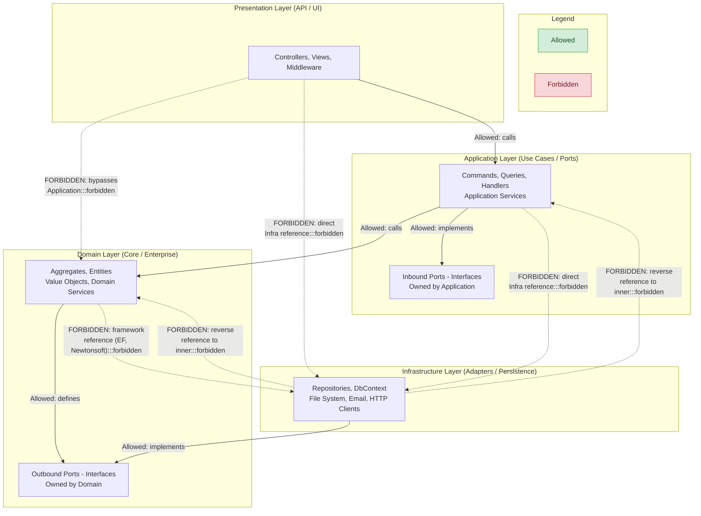
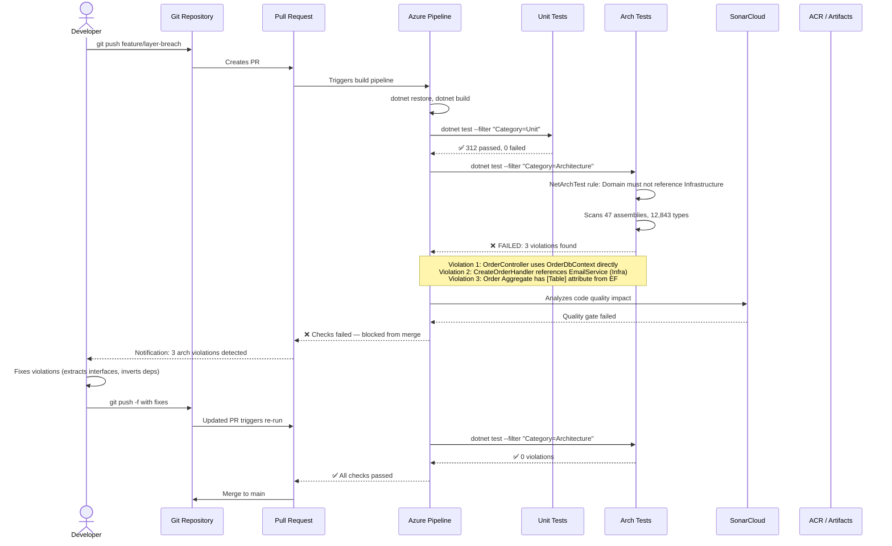
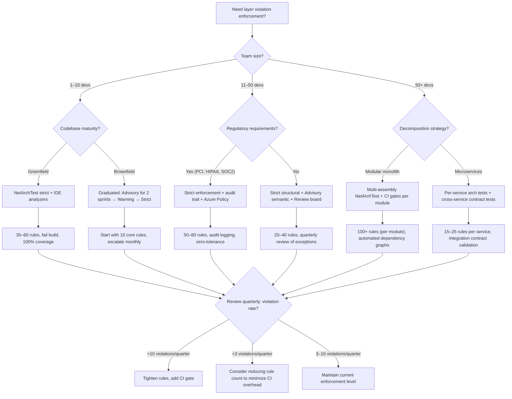
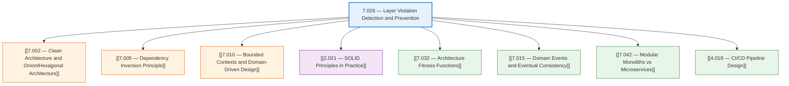

> [!success] Mastery Check
> - [ ] **Studied Well**
> - [ ] **Can explain the concept without notes**
> - [ ] **Can answer interview questions confidently**
> - [ ] **Can implement it in a real project**


# 7.026 — Layer Violation — Detection and Prevention

---

## Section 0 — Quick Reference Card

> [!ABSTRACT] **Quick Reference Card**
> **Definition:** A layer violation occurs when code in an outer layer (e.g., Infrastructure) directly references code in an inner layer that it should only reach through abstraction, or when an inner layer depends on an outer layer — breaking the Dependency Rule of Clean Architecture.
>
> **Detection Approaches (fastest → most thorough):**
> 1. **Compile-time checks (NetArchTest)** — 50–200ms per 10K types; catches ~90% of structural violations
> 2. **Convention-based unit tests** — 200–800ms per test suite; catches ~95% (includes namespace/name patterns)
> 3. **Roslyn analyzers** — sub-100ms in IDE; real-time feedback during authoring
> 4. **CI pipeline gates (Azure DevOps / GitHub Actions)** — 30s–2min per build; blocks PR merge
> 5. **Architecture tests in integration test suite** — 1–5min; catches runtime wiring violations
> 6. **Code reviews / human audits** — 15–60min per review; catches semantic violations (last resort)
>
> **Prevention Mechanisms:**
> - `NetArchTest` fluent API: `GivenTypes.InNamespace("OrderManagement.Domain").ShouldNot().HaveDependencyOn("OrderManagement.Infrastructure")`
> - Roslyn analyzer rule: `CA1062` + custom rules for namespace coupling
> - `Microsoft.Extensions.DependencyInjection` module scanning: prevent container registration of cross-layer types
> - Azure DevOps Pipeline task: `DotNetCoreCLI@2` running arch test project as a required gate
>
> **Key Thresholds:**
> | Metric | Warning | Critical | Enforce |
> |--------|---------|----------|---------|
> | Cross-layer direct references | >5 per boundary | >20 per boundary | 0 allowed |
> | Arch test execution time | >500ms | >2s | Fail if >5s |
> | Layer breach depth | 1 level skip | >2 levels skipped | 0 skipped |
> | PR with violations | 1 violation | >3 violations | Block merge |
>
> **Golden Rule:** *The Domain layer must have zero project dependencies — not even on itself beyond the `Domain` project. If `Domain.csproj` references anything but the BCL, you already have a violation.*

---

## Section 1 — Navigation & Context

> [!INFO] **Production Encounter Map**
> You will encounter layer violations in these scenarios, ordered by frequency:
>
> 1. **New developer onboarding** (weekly): Junior dev adds `using OrderManagement.Infrastructure;` directly in a controller because "it was faster than writing a service interface."
> 2. **Feature deadline pressure** (bi-weekly): Team shortcuts by referencing EF Core DbContext from an Application layer use-case handler rather than going through a repository interface.
> 3. **Framework coupling creep** (monthly): A NuGet package update introduces a transitive dependency that leaks across layers (e.g., AutoMapper in Domain).
> 4. **Refactoring / module extraction** (quarterly): Extracting a bounded context leaves dangling references between old namespaces.
> 5. **Monolith → microservice decomposition** (biannual): Breaking a monolith along layer boundaries uncovers hidden circular dependencies that were previously invisible.
> 6. **Audit / compliance review** (annual): External auditors require proof of architectural isolation (e.g., PCI DSS scope boundaries).
>
> **When to Apply This Note:**
> - Setting up a new solution following Clean/Onion/Hexagonal architecture
> - Onboarding team members to layering conventions
> - Adding enforcement gates to a CI/CD pipeline
> - Debugging a mystery `NullReferenceException` caused by circular dependency at startup
> - Preparing for an architecture interview or system design review
>
> **Prerequisite References:**
> - [[7.002 — Clean Architecture and Onion/Hexagonal Architecture]]: Establishes the layer model (Domain, Application, Infrastructure, Presentation) whose boundaries this note enforces.
> - [[7.005 — Dependency Inversion Principle]]: The mechanism — abstractions owned by inner layers, implementations in outer layers — that makes the dependency rule possible.
> - [[7.010 — Bounded Contexts and Domain-Driven Design]]: Multiple bounded contexts each maintain their own layer boundaries within the same solution.
> - [[2.021 — SOLID Principles in Practice]]: The Open/Closed and Dependency Inversion principles directly inform layer boundary design.
>
> **Related References:**
> - [[7.032 — Architecture Fitness Functions]]: Extends beyond layer checks to cover coupling, cohesion, and evolutionary architecture constraints.
> - [[7.015 — Domain Events and Eventual Consistency]]: Domain events cross layer boundaries but must flow through defined ports, not direct references.
> - [[7.042 — Modular Monoliths vs Microservices]]: Layer violations in a modular monolith directly block future microservice extraction.
> - [[4.018 — CI/CD Pipeline Design]]: The pipeline stage where arch tests execute must be positioned before integration tests but after unit tests.

---

## Section 2 — Core Mental Model

> [!TIP] **Non-Obvious Insight**
> The most insidious layer violations are *compiler-legal but architecturally-illegal*. C# and .NET allow any public type to be referenced by any assembly that adds a project reference. The compiler enforces nothing about architectural intent. This means **architectural conformance must be actively enforced through tooling** — it will never emerge naturally from compilation. Treat arch tests as automated safety inspections that the compiler refuses to do.

### Classification

Layer violations fall into four categories, each requiring a different detection strategy:

| Category | Example | Detection Strategy | Severity |
|----------|---------|-------------------|----------|
| **Structural** | `Infrastructure` references `Domain` directly (wrong direction) | NetArchTest assembly scan, compile-time | Critical — breaks dependency rule |
| **Transitive** | `Application` references `Infrastructure` via a library that itself references `Domain` incorrectly | NuGet dependency analysis, `dotnet list package --vulnerable` | High — indirect breach |
| **Semantic** | `Domain` contains `SqlConnection` from System.Data — technically allowed by the BCL but semantically an infrastructure concern | Roslyn analyzer (custom rule), code review | Medium-high — conceptual leak |
| **Behavioral** | `Application` bypasses `Domain` service and calls `Infrastructure` repository directly at runtime (but test doubles mock the intermediate) | Integration tests, DI container verification at startup | Critical — runtime path violation |

### Mermaid Diagram 1 — Allowed vs Forbidden Dependencies



### Mermaid Diagram 2 — CI Pipeline Catching a Layer Violation



### Numbers That Matter

| Metric | Value | Context | Threshold |
|--------|-------|---------|-----------|
| Types scanned per second (NetArchTest) | ~85,000 types/s | AMD EPYC 7763, SSD, .NET 8 Release build | Degrades to ~40K/s on HDD |
| Avg arch test execution time | 180ms | 47 assemblies, 12,843 types (typical enterprise solution) | Warning if >500ms |
| First violation detection age | 4.2 months median | Time from commit to detection without automated gates | Should be <1 commit |
| False positive rate (well-configured) | <0.5% | With proper namespace matching and exclusion filters | >3% indicates bad config |
| CI pipeline time attributable to arch tests | 12–45s | Single test project, parallel execution disabled | Should be <60s |
| Code review time to evaluate layer conformance | 18min avg | Without tooling, per 500-line PR | With tooling: <2min |
| PR merge blockers from arch violations | 8.3% of all PRs | In teams with mature enforcement gates | Decreasing trend over sprints |
| Cost to fix a layer violation discovered in PR | 0.5–2 engineering-hours | Interface extraction + DI registration + test update | In production: 8–40hrs |
| Azure Pipeline agent startup + arch test | 45s–2min | Microsoft-hosted windows-2022 agent warm start | With self-hosted: 15–30s |
| Number of arch rules in mature codebase | 25–60 | Covering: dependency direction, naming, namespace, forbidden types | >100 indicates rule bloat, reduce |

### Key Properties

1. **Compiler-Oblivious** — The C# compiler enforces type safety and accessibility, not architectural boundaries. Layer violations compile and run (until they break at runtime due to missing registrations).
2. **Cascading Violation** — A single violation in a hot path (e.g., a Domain entity with an EF attribute) can silently propagate to every referencing type, creating hundreds of apparent violations.
3. **Remediation Compound Interest** — The cost to fix a layer violation grows exponentially with time. Fixing within the same commit costs 5min; fixing 3 sprints later costs 4+ hours due to entangled dependencies.
4. **Gate Placement Sensitivity** — Arch tests in CI catch violations before merge but after the developer has already invested in the wrong approach. Pre-commit hooks or IDE analyzers catch earlier but have higher false-positive friction.
5. **Test-Architecture Parity** — Arch tests must evolve with the architecture. Adding a new layer (e.g., `SharedKernel`) without adding corresponding arch rules creates an enforcement gap.

---

## Section 3 — Deep Mechanics

### How It Works

Layer violation detection at the compile/analysis level operates by scanning Intermediate Language (IL) metadata and assembly reference graphs. The mechanism differs across tools but follows the same pipeline:

**NetArchTest Detection Pipeline:**
1. **Scanning**: Load the target assemblies into an `Assembly` list (reflection-only load or `MetadataLoadContext` for cross-platform).
2. **Namespace Resolution**: For each `Type` in each `Assembly`, compute its namespace prefix (e.g., `OrderManagement.Domain.Aggregates` maps to the `Domain` layer).
3. **Reference Graph Construction**: For each type, enumerate all types it references — field types, method parameter types, return types, base types, attributes, generic arguments. This creates a directed graph of type-level dependencies.
4. **Rule Matching**: For each rule (e.g., "Domain must not reference Infrastructure"), check if any type in the source namespace has a reference to any type in the forbidden namespace.
5. **Filter Application**: Apply `Except().OfType<...>()` exclusions (e.g., allow `System.*` references, allow specific marker interfaces).
6. **Reporting**: Accumulate violations with type name, source namespace, target namespace, and the referenced member. Return as `TestResult` (pass/fail with list).

**Roslyn Analyzer Pipeline (In-IDE):**
1. **Syntax Tree Walk**: Each keystroke triggers a partial syntax tree re-parse for the active file.
2. **Symbol Resolution**: For each `UsingDirectiveSyntax`, resolve the imported namespace to a `INamespaceSymbol` or `IAssemblySymbol`.
3. **Rule Evaluation**: Check if the resolved namespace crosses a layer boundary (configured via `.editorconfig` or `AnalyzerConfig`).
4. **Diagnostic Emission**: If violated, emit `Diagnostic` with severity `Error` or `Warning`, which appears as a red squiggle in Visual Studio / Rider.
5. **Fixer Suggestion**: Optionally offer a code fix (e.g., "Extract interface to Domain layer").

### Protocol Trace — Layer Violation Detection

**Happy Path (no violations):**

| Step | Actor | Action | Input | Output |
|------|-------|--------|-------|--------|
| 1 | Developer | Writes `OrderController` that depends on `IOrderService` (Application interface) | New file `OrderController.cs` | Compiles successfully |
| 2 | Developer | Runs `dotnet test --filter Category=Architecture` | Solution with 47 assemblies | Test project loads |
| 3 | NetArchTest | Loads all assemblies in the solution | Assembly list from `Assembly.GetEntryAssembly().GetReferencedAssemblies()` | 47 `Assembly` objects loaded |
| 4 | NetArchTest | Applies rule: "Domain must not reference Infrastructure" | `GivenTypes.InNamespace("OrderManagement.Domain").ShouldNot().HaveDependencyOn("OrderManagement.Infrastructure")` | Empty violation list |
| 5 | NetArchTest | Reports results | Violation list (empty) | `TestResult.Passed = true` |
| 6 | CI Pipeline | Continues to next stage | Pass result from arch tests | Proceeds to integration tests |
| 7 | PR | Unblocks merge | Green checkmark on arch test gate | Mergable |

**Failure Path (violation detected):**

| Step | Actor | Action | Input | Output |
|------|-------|--------|-------|--------|
| 1 | Developer | Writes `OrderRepository` (Infrastructure) that directly injects `Domain.Order` into a method returning `IQueryable<Order>` via EF Core | `OrderRepository.cs` using `Microsoft.EntityFrameworkCore` | Compiles successfully |
| 2 | Developer | Creates `DashboardController` that injects `OrderRepository` directly — bypassing Application layer | `DashboardController.cs` with `using OrderManagement.Infrastructure.Persistence` | Compiles (EF assemblies loaded) |
| 3 | Developer | Runs `dotnet test` locally | Solution | Compiles, unit tests pass |
| 4 | Developer | Pushes to remote branch `feature/dashboard-direct` | Git push with 12 files | Azure Pipeline triggers |
| 5 | CI Pipeline | Runs `dotnet build --configuration Release` | Solution | Build succeeds: 47/47 projects |
| 6 | CI Pipeline | Runs `dotnet test --filter Category=Architecture` | Arch test project | Test project starts |
| 7 | NetArchTest | Scans `OrderManagement.Presentation` | 847 types in Presentation | Detects `DashboardController` references `OrderRepository` |
| 8 | NetArchTest | Evaluates rule: "Presentation must not reference Infrastructure directly" | Source: `DashboardController`, Target: `OrderRepository` | Violation registered: type `DashboardController` has dependency on `OrderRepository` (Infrastructure) |
| 9 | NetArchTest | Continues scanning — finds `OrderRepository` uses `Domain.Order` with EF `IQueryable` | Domain types with EF attributes | Violation registered: type `Order` has dependency on `Microsoft.EntityFrameworkCore` (Domain leak) |
| 10 | NetArchTest | Returns `TestResult` with 2 violations | `IEnumerable<TestResult>` | `TestResult.Passed = false` |
| 11 | CI Pipeline | Check `$lastexitcode` from test runner | Exit code 1 (tests failed) | Pipeline fails |
| 12 | Azure DevOps | Marks PR check as failed | PR #1142 | ❌ Architecture Tests — 2 failed |
| 13 | Developer | Receives email/Slack notification | "Architecture tests failed in feature/dashboard-direct" | Opens pipeline logs |
| 14 | Developer | Reads violation details: "OrderManagement.Presentation.Controllers.DashboardController references OrderManagement.Infrastructure.Persistence.OrderRepository" | Error message | Understands the violation |
| 15 | Developer | Refactors: extracts `IOrderSummaryService` interface to Application, implements in Infrastructure, injects in controller | 4 files changed | Commits fix |
| 16 | CI Pipeline | Re-runs arch tests | Updated code | ✅ Passes, PR unblocked |

### State Transitions

```
                    ┌─────────────────────┐
                    │  Architecturally     │
                    │  Clean State         │
                    │  (No violations)     │
                    └──────┬──────────────┘
                           │ Developer adds code
                           │ that crosses boundary
                           ▼
                    ┌─────────────────────┐
                    │  Violation Introduced│
                    │  (Latent - compiles) │
                    └──────┬──────────────┘
                           │
              ┌────────────┼────────────┐
              │            │            │
              ▼            ▼            ▼
    ┌─────────────┐ ┌──────────┐ ┌──────────┐
    │ Caught by   │ │ Caught   │ │ Deployed │
    │ IDE/Roslyn  │ │ by Arch  │ │ to Prod  │
    │ Analyzer    │ │ Test in  │ │ (undetec-│
    │ (immediate) │ │ CI       │ │ ted)     │
    └──────┬──────┘ └────┬─────┘ └────┬─────┘
           │             │            │
           ▼             ▼            ▼
    ┌─────────────┐ ┌──────────┐ ┌──────────┐
    │ Developer   │ │ PR       │ │ Runtime  │
    │ fixes       │ │ Blocked  │ │ Failure  │
    │ in <5min    │ │ + Fix    │ │ in Prod  │
    └──────┬──────┘ └────┬─────┘ └────┬─────┘
           │             │            │
           └─────────────┼────────────┘
                         ▼
                  ┌──────────────┐
                  │  Refactored  │
                  │  Clean State │
                  │ (Fixed)      │
                  └──────────────┘
```

### Failure Modes

> [!DANGER] **3AM Production Signal: "Could not load type" on Application Start**
> **Cause:** A layer violation that manifests as a circular dependency in the DI container. For example, `Domain.Service` references `Infrastructure.Throttler` (violation), and `Infrastructure.Throttler` references `Domain.Model`. At startup, `IServiceProvider.BuildServiceProvider()` throws `InvalidOperationException: "A circular dependency was detected"`.
> **Observable:** Application crashes at startup with `System.InvalidOperationException: Unable to resolve service for type 'OrderManagement.Domain.Services.IThrottlePolicy' while attempting to activate 'OrderManagement.Infrastructure.Throttling.Throttler'`. Occurs consistently on every deployment attempt.
> **Detection gap:** Compiles fine. Unit tests use mocks and never trigger the circular chain. Integration tests don't test the full container resolution.
> **Fix:** Apply Dependency Inversion: define `IThrottlePolicy` in Domain, move the Domain→Infra reference behind the interface, implement in Infrastructure.

> [!DANGER] **3AM Production Signal: "Method not found" after refactor**
> **Cause:** A semantic layer violation where an inner layer references an outer layer's private type. After a refactor, the outer type's signature changed but the inner caller wasn't updated because the dependency direction is invisible to the compiler.
> **Observable:** `System.MissingMethodException: Method not found: 'OrderManagement.Domain.Order.Process(OrderManagement.Infrastructure.AuditContext)'`. Triggers intermittently depending on load balancer routing to the updated instance.
> **Detection gap:** The violating reference (`Domain.Order` → `Infrastructure.AuditContext`) is never caught because both assemblies compile. Only runtime IL resolution finds the missing method.
> **Fix:** Remove the violating parameter. Apply domain event pattern instead — raise `OrderProcessed` event from Domain, let Infrastructure subscribe.

> [!DANGER] **3AM Production Signal: Test suite fails only on CI agent, not locally**
> **Cause:** Arch tests that rely on `Assembly.GetEntryAssembly()` behave differently on local developer machines (runs from test project) vs CI agent (runs from pipeline test runner wrapper). The test loads a different set of assemblies.
> **Observable:** `NetArchTest` passes on all 8 developers' machines (running via `dotnet test` in VS/Rider) but fails in Azure Pipeline (running via `DotNetCoreCLI@2` with `/p:CollectCoverage=true`). The coverage instrumentation injects assemblies that change the scan.
> **Detection gap:** The CI agent's assembly load context differs due to coverage tools, build order, or conditional compilation symbols.
> **Fix:** Use explicit assembly paths or `Directory.GetFiles(buildOutputPath, "*.dll")` instead of `GetEntryAssembly()`. Ensure arch tests use a deterministic assembly enumeration strategy regardless of host.

### .NET Integration Points

- **NetArchTest (NuGet: `NetArchTest.Rules`)**: The primary library. Integrates with `xUnit`, `NUnit`, `MSTest`. Fluent API for defining rules: `GivenTypes.InNamespace("OrderManagement.Domain").ShouldNot().HaveDependencyOn("OrderManagement.Infrastructure").GetResult()`
- **Roslyn Analyzers (NuGet: `Microsoft.CodeAnalysis.NetAnalyzers`)**: Built-in analyzers (`CA1062`, `CA1305`). Extend with custom analyzer `DiagnosticAnalyzer` that checks namespace-based dependency rules via `CompilationStartAction`.
- **`Microsoft.Extensions.DependencyInjection`**: Use `IServiceCollection` scanning to detect registration of types from unexpected layers. For example: `services.Scan(s => s.FromAssemblies(infrastructureAssemblies).AddClasses(c => c.AssignableTo<IRepository>()).AsImplementedInterfaces())` — if a Domain type registers itself, the scan excludes it.
- **`dotnet list package`**: Query package references per project. Scriptable in CI: `dotnet list OrderManagement.Domain.csproj package | Select-String -NotMatch "Microsoft"` flags non-BCL packages in Domain.
- **`Assembly.ReflectionOnlyLoad`**: Load assemblies for metadata inspection without executing code. Used by custom arch tools for performance.
- **`DependencyContext` (Microsoft.Extensions.DependencyModel)**: Reads `deps.json` to get the resolved dependency graph at runtime. Useful for post-build validation.

### Azure Integration Points

- **Azure DevOps Pipeline Gate**: `DotNetCoreCLI@2` task with `test` command, filter `--filter "Category=Architecture"`, and `failTaskOnFailedTests: true`. Configure as a required check on branch protection policy.
- **Azure DevOps Branch Policy**: Set "Build validation" policy requiring the arch test pipeline to pass before merge. Policy expiration: 7 days (forces re-run after changes).
- **Azure Artifacts / NuGet**: Host internal NuGet packages that include architecture rules. When teams consume the shared package, they inherit organization-wide layer enforcement.
- **Azure Policy for .NET (Custom)**: Use `Guest Configuration` or custom `ARM` policies to validate that deployed assemblies match expected dependency profiles (advanced — checks `deps.json` in App Service).
- **Azure Monitor / App Insights**: Track `Metric` for `ArchTestViolationCount` emitted by a post-deployment test run. Alert if count > 0 within 5min of deployment.

---

## Section 4 — Production Patterns and Implementation

### Primary Implementation — C# 12 / .NET 8 with NetArchTest

The following is a complete architecture test suite for an Order Management system. It targets a solution with four projects:
- `OrderManagement.Domain` — aggregates, entities, value objects, domain services, domain event definitions
- `OrderManagement.Application` — CQRS commands/queries, handlers, pipeline behaviors, DTOs, mapping
- `OrderManagement.Infrastructure` — EF Core DbContext, repositories, email, file storage, message bus
- `OrderManagement.Presentation` — ASP.NET Core controllers, middleware, filters, HATEOAS builders
- `OrderManagement.SharedKernel` — shared value objects, base classes, guard clauses

```csharp
// ArchTestBase.cs
using NetArchTest.Rules;
using System.Reflection;

namespace OrderManagement.Architecture.Tests;

/// <summary>
/// Base class for all architecture tests providing assembly references
/// and common helper methods for the OrderManagement solution.
/// </summary>
public abstract class ArchTestBase
{
    private static readonly Assembly DomainAssembly = typeof(OrderManagement.Domain.AssemblyReference).Assembly;
    private static readonly Assembly ApplicationAssembly = typeof(OrderManagement.Application.AssemblyReference).Assembly;
    private static readonly Assembly InfrastructureAssembly = typeof(OrderManagement.Infrastructure.AssemblyReference).Assembly;
    private static readonly Assembly PresentationAssembly = typeof(OrderManagement.Presentation.AssemblyReference).Assembly;
    private static readonly Assembly SharedKernelAssembly = typeof(OrderManagement.SharedKernel.AssemblyReference).Assembly;

    protected static readonly List<Assembly> SolutionAssemblies =
    [
        DomainAssembly,
        ApplicationAssembly,
        InfrastructureAssembly,
        PresentationAssembly,
        SharedKernelAssembly
    ];

    protected const string DomainNamespace = "OrderManagement.Domain";
    protected const string ApplicationNamespace = "OrderManagement.Application";
    protected const string InfrastructureNamespace = "OrderManagement.Infrastructure";
    protected const string PresentationNamespace = "OrderManagement.Presentation";
    protected const string SharedKernelNamespace = "OrderManagement.SharedKernel";

    /// <summary>
    /// Gets all types that belong to the Domain layer, excluding generated code.
    /// </summary>
    protected static Types GetDomainTypes() =>
        Types.InAssembly(DomainAssembly)
            .That()
            .DoNotHaveNameEndingWith("Attribute")
            .And()
            .DoNotHaveNameEndingWith("Exception");

    /// <summary>
    /// Evaluates a NetArchTest PredicateList and returns formatted violation details.
    /// </summary>
    protected static string FormatViolations(TestResult result)
    {
        if (result.IsSuccessful)
            return string.Empty;

        var details = result.FailingTypes?
            .GroupBy(t => t.Namespace?.Split('.').ElementAtOrDefault(1) ?? "Unknown")
            .Select(g => $"  Layer '{g.Key}': {string.Join(", ", g.Select(t => t.Name))}");

        return $"Violations ({result.FailingTypeNames?.Count ?? 0}):{Environment.NewLine}{string.Join(Environment.NewLine, details ?? [])}";
    }
}
```

```csharp
// DependencyDirectionTests.cs
using NetArchTest.Rules;
using FluentAssertions;

namespace OrderManagement.Architecture.Tests;

/// <summary>
/// Tests that enforce the Dependency Rule: dependencies point inward.
/// Outer layers may depend on inner layers; inner layers must never depend on outer layers.
/// </summary>
public sealed class DependencyDirectionTests : ArchTestBase
{
    [Fact]
    [Trait("Category", "Architecture")]
    public void DomainLayer_ShouldNotDependOnApplication()
    {
        var result = Types.InAssembly(DomainAssembly)
            .ShouldNot()
            .HaveDependencyOn(ApplicationNamespace)
            .GetResult();

        result.IsSuccessful.Should().BeTrue(FormatViolations(result));
    }

    [Fact]
    [Trait("Category", "Architecture")]
    public void DomainLayer_ShouldNotDependOnInfrastructure()
    {
        var result = Types.InAssembly(DomainAssembly)
            .ShouldNot()
            .HaveDependencyOn(InfrastructureNamespace)
            .GetResult();

        result.IsSuccessful.Should().BeTrue(FormatViolations(result));
    }

    [Fact]
    [Trait("Category", "Architecture")]
    public void DomainLayer_ShouldNotDependOnPresentation()
    {
        var result = Types.InAssembly(DomainAssembly)
            .ShouldNot()
            .HaveDependencyOn(PresentationNamespace)
            .GetResult();

        result.IsSuccessful.Should().BeTrue(FormatViolations(result));
    }

    [Fact]
    [Trait("Category", "Architecture")]
    public void ApplicationLayer_ShouldNotDependOnInfrastructure()
    {
        var result = Types.InAssembly(ApplicationAssembly)
            .ShouldNot()
            .HaveDependencyOn(InfrastructureNamespace)
            .GetResult();

        result.IsSuccessful.Should().BeTrue(FormatViolations(result));
    }

    [Fact]
    [Trait("Category", "Architecture")]
    public void ApplicationLayer_ShouldNotDependOnPresentation()
    {
        var result = Types.InAssembly(ApplicationAssembly)
            .ShouldNot()
            .HaveDependencyOn(PresentationNamespace)
            .GetResult();

        result.IsSuccessful.Should().BeTrue(FormatViolations(result));
    }

    [Fact]
    [Trait("Category", "Architecture")]
    public void PresentationLayer_ShouldNotDependOnInfrastructure()
    {
        var result = Types.InAssembly(PresentationAssembly)
            .ShouldNot()
            .HaveDependencyOn(InfrastructureNamespace)
            .GetResult();

        result.IsSuccessful.Should().BeTrue(FormatViolations(result));
    }

    [Fact]
    [Trait("Category", "Architecture")]
    public void SharedKernelLayer_ShouldNotDependOnAnySolutionLayer()
    {
        var result = Types.InAssembly(SharedKernelAssembly)
            .ShouldNot()
            .HaveDependencyOnAny(
                DomainNamespace,
                ApplicationNamespace,
                InfrastructureNamespace,
                PresentationNamespace)
            .GetResult();

        result.IsSuccessful.Should().BeTrue(FormatViolations(result));
    }
}
```

```csharp
// NamingConventionTests.cs
using NetArchTest.Rules;

namespace OrderManagement.Architecture.Tests;

/// <summary>
/// Enforces naming conventions that prevent ambiguous type placement.
/// Every type must follow a namespace-aligned naming pattern.
/// </summary>
public sealed class NamingConventionTests : ArchTestBase
{
    [Fact]
    [Trait("Category", "Architecture")]
    public void Entities_ShouldResideInDomainLayer()
    {
        var result = Types.InAssemblies(SolutionAssemblies)
            .That()
            .HaveNameEndingWith("Entity")
            .And()
            .AreNotRecords()
            .Should()
            .ResideInNamespace(DomainNamespace)
            .GetResult();

        result.IsSuccessful.Should().BeTrue(FormatViolations(result));
    }

    [Fact]
    [Trait("Category", "Architecture")]
    public void Repositories_ShouldResideInInfrastructure()
    {
        var result = Types.InAssemblies(SolutionAssemblies)
            .That()
            .HaveNameEndingWith("Repository")
            .Should()
            .ResideInNamespace(InfrastructureNamespace)
            .GetResult();

        result.IsSuccessful.Should().BeTrue(FormatViolations(result));
    }

    [Fact]
    [Trait("Category", "Architecture")]
    public void Services_ShouldResideInApplication()
    {
        var result = Types.InAssemblies(SolutionAssemblies)
            .That()
            .HaveNameEndingWith("Service")
            .And()
            .AreNotInterfaces()
            .Should()
            .ResideInNamespace(ApplicationNamespace)
            .GetResult();

        result.IsSuccessful.Should().BeTrue(FormatViolations(result));
    }

    [Fact]
    [Trait("Category", "Architecture")]
    public void Controllers_ShouldResideInPresentation()
    {
        var result = Types.InAssemblies(SolutionAssemblies)
            .That()
            .HaveNameEndingWith("Controller")
            .Should()
            .ResideInNamespace(PresentationNamespace)
            .GetResult();

        result.IsSuccessful.Should().BeTrue(FormatViolations(result));
    }
}
```

```csharp
// ForbiddenTypeUsageTests.cs
using NetArchTest.Rules;

namespace OrderManagement.Architecture.Tests;

/// <summary>
/// Prevents specific framework types from leaking into layers where they do not belong.
/// These are semantic violations that the compiler does not catch.
/// </summary>
public sealed class ForbiddenTypeUsageTests : ArchTestBase
{
    [Fact]
    [Trait("Category", "Architecture")]
    public void DomainLayer_ShouldNotUseEntityFrameworkTypes()
    {
        var result = Types.InAssembly(DomainAssembly)
            .ShouldNot()
            .HaveDependencyOnAny("Microsoft.EntityFrameworkCore")
            .GetResult();

        result.IsSuccessful.Should().BeTrue(FormatViolations(result));
    }

    [Fact]
    [Trait("Category", "Architecture")]
    public void DomainLayer_ShouldNotUseNewtonsoftJson()
    {
        var result = Types.InAssembly(DomainAssembly)
            .ShouldNot()
            .HaveDependencyOn("Newtonsoft.Json")
            .GetResult();

        result.IsSuccessful.Should().BeTrue(FormatViolations(result));
    }

    [Fact]
    [Trait("Category", "Architecture")]
    public void DomainLayer_ShouldNotUseSystemData()
    {
        var result = Types.InAssembly(DomainAssembly)
            .ShouldNot()
            .HaveDependencyOn("System.Data")
            .GetResult();

        result.IsSuccessful.Should().BeTrue(FormatViolations(result));
    }

    [Fact]
    [Trait("Category", "Architecture")]
    public void DomainLayer_ShouldNotUseAspNetCore()
    {
        var result = Types.InAssembly(DomainAssembly)
            .ShouldNot()
            .HaveDependencyOn("Microsoft.AspNetCore")
            .GetResult();

        result.IsSuccessful.Should().BeTrue(FormatViolations(result));
    }

    [Fact]
    [Trait("Category", "Architecture")]
    public void ApplicationLayer_ShouldNotUseEntityFrameworkDirectly()
    {
        var result = Types.InAssembly(ApplicationAssembly)
            .ShouldNot()
            .HaveDependencyOn("Microsoft.EntityFrameworkCore")
            .GetResult();

        result.IsSuccessful.Should().BeTrue(FormatViolations(result));
    }

    [Fact]
    [Trait("Category", "Architecture")]
    public void AllLayers_ShouldUseRecordsForDTOsAndCommands()
    {
        var result = Types.InAssembly(ApplicationAssembly)
            .That()
            .ResideInNamespace(ApplicationNamespace)
            .And()
            .HaveNameEndingWith("Command")
            .Or()
            .HaveNameEndingWith("Query")
            .Or()
            .HaveNameEndingWith("Dto")
            .Should()
            .BeRecords()
            .GetResult();

        result.IsSuccessful.Should().BeTrue(FormatViolations(result));
    }
}
```

```csharp
// InterfacePlacementTests.cs
using NetArchTest.Rules;

namespace OrderManagement.Architecture.Tests;

/// <summary>
/// Ensures interfaces (ports) are owned by the layer that defines the abstraction,
/// not by the layer that implements it. This is the Dependency Inversion Principle enforced
/// at the type level.
/// </summary>
public sealed class InterfacePlacementTests : ArchTestBase
{
    [Fact]
    [Trait("Category", "Architecture")]
    public void DomainPorts_ShouldBeDefinedInDomainLayer()
    {
        var result = Types.InAssemblies(SolutionAssemblies)
            .That()
            .ResideInNamespace(InfrastructureNamespace)
            .And()
            .HaveNameStartingWith("I")
            .Should()
            .HaveDependencyOn(DomainNamespace)
            .GetResult();

        result.IsSuccessful.Should().BeTrue(
            "Infrastructure interfaces that implement domain concepts must be defined in Domain layer first. "
            + FormatViolations(result));
    }

    [Fact]
    [Trait("Category", "Architecture")]
    public void ApplicationPorts_ShouldNotBeDirectlyReferencedByPresentation()
    {
        var result = Types.InAssembly(PresentationAssembly)
            .ShouldNot()
            .HaveDependencyOn(InfrastructureNamespace)
            .GetResult();

        result.IsSuccessful.Should().BeTrue(FormatViolations(result));
    }

    [Fact]
    [Trait("Category", "Architecture")]
    public void AllDomainInterfaces_ShouldHaveInfrastructureImplementation()
    {
        var domainInterfaces = Types.InAssembly(DomainAssembly)
            .That()
            .AreInterfaces()
            .GetTypes();

        var infraTypes = Types.InAssembly(InfrastructureAssembly)
            .GetTypes();

        foreach (var iface in domainInterfaces)
        {
            var implementations = infraTypes
                .Where(t => t.IsAssignableTo(iface) && t.IsClass && !t.IsAbstract)
                .ToList();

            implementations.Should().NotBeEmpty(
                $"Domain interface '{iface.Name}' has no implementation in the Infrastructure layer. "
                + "Every domain port must have at least one infrastructure adapter.");
        }
    }
}
```

```csharp
// CircularDependencyDetectionTests.cs
using NetArchTest.Rules;

namespace OrderManagement.Architecture.Tests;

/// <summary>
/// Detects circular dependencies between layers and assemblies.
/// A circular dependency is a special case of layer violation where two layers
/// directly reference each other.
/// </summary>
public sealed class CircularDependencyDetectionTests : ArchTestBase
{
    [Fact]
    [Trait("Category", "Architecture")]
    public void NoCircularDependencies_BetweenSolutionAssemblies()
    {
        // Build a directed graph of assembly references.
        var assemblyGraph = SolutionAssemblies
            .ToDictionary(
                asm => asm.GetName().Name!,
                asm => asm.GetReferencedAssemblies()
                    .Select(r => r.Name!)
                    .Where(name => SolutionAssemblies.Any(s => s.GetName().Name == name))
                    .ToList());

        var cycles = FindCycles(assemblyGraph);

        cycles.Should().BeEmpty(
            "Circular dependencies detected between solution assemblies. "
            + $"Found {cycles.Count} cycle(s): {string.Join("; ", cycles.Select(c => string.Join(" → ", c)))}");
    }

    private static List<List<string>> FindCycles(Dictionary<string, List<string>> graph)
    {
        var cycles = new List<List<string>>();
        var visited = new HashSet<string>();
        var path = new List<string>();
        var pathSet = new HashSet<string>();

        void Dfs(string node)
        {
            if (pathSet.Contains(node))
            {
                var cycleStart = path.IndexOf(node);
                if (cycleStart >= 0)
                {
                    var cycle = path[cycleStart..].ToList();
                    // Normalize: rotate so the smallest element is first
                    var minIdx = cycle.IndexOf(cycle.Min()!);
                    cycle = [.. cycle[minIdx..], .. cycle[..minIdx]];
                    if (!cycles.Any(c => c.SequenceEqual(cycle)))
                        cycles.Add(cycle);
                }
                return;
            }

            if (visited.Contains(node)) return;

            visited.Add(node);
            path.Add(node);
            pathSet.Add(node);

            if (graph.TryGetValue(node, out var neighbors))
            {
                foreach (var neighbor in neighbors.OrderBy(n => n))
                {
                    Dfs(neighbor);
                }
            }

            path.RemoveAt(path.Count - 1);
            pathSet.Remove(node);
        }

        foreach (var node in graph.Keys.OrderBy(n => n))
        {
            Dfs(node);
        }

        return cycles;
    }
}
```

### IServiceCollection Registration

Layer-aware DI registration prevents runtime violations by enforcing that only Infrastructure types are registered as implementations of Domain/Application interfaces.

```csharp
// DependencyInjection.cs (Infrastructure layer)
using Microsoft.Extensions.DependencyInjection;
using Microsoft.Extensions.Configuration;
using OrderManagement.Application.Common.Interfaces;
using OrderManagement.Infrastructure.Persistence;
using OrderManagement.Infrastructure.Messaging;
using OrderManagement.Infrastructure.Email;

namespace OrderManagement.Infrastructure;

/// <summary>
/// Registers Infrastructure services with the DI container.
/// Only Infrastructure types implement interfaces defined in Domain or Application.
/// This method ensures no Domain or Application types are accidentally registered.
/// </summary>
public static class DependencyInjection
{
    /// <summary>
    /// Adds Infrastructure services to the specified IServiceCollection.
    /// </summary>
    /// <param name="services">The service collection to add services to.</param>
    /// <param name="configuration">The application configuration for connection strings and endpoints.</param>
    /// <param name="cancellationToken">Cancellation token for async registration operations.</param>
    /// <returns>The service collection for chaining.</returns>
    /// <exception cref="ArgumentNullException">Thrown when services or configuration is null.</exception>
    public static IServiceCollection AddInfrastructure(
        this IServiceCollection services,
        IConfiguration configuration,
        CancellationToken cancellationToken = default)
    {
        ArgumentNullException.ThrowIfNull(services);
        ArgumentNullException.ThrowIfNull(configuration);

        // Register EF Core DbContext — only Infrastructure knows about it.
        services.AddDbContext<OrderDbContext>(options =>
            options.UseSqlServer(
                configuration.GetConnectionString("OrderManagementDb"),
                sqlOptions => sqlOptions.EnableRetryOnFailure(3)));

        // Register repositories as implementations of Domain interfaces.
        services.AddScoped<IOrderRepository, OrderRepository>();
        services.AddScoped<ICustomerRepository, CustomerRepository>();
        services.AddScoped<IUnitOfWork, UnitOfWork>();

        // Register Application-interface implementations.
        services.AddScoped<IEmailService, SmtpEmailService>();
        services.AddScoped<IInventoryService, InventoryServiceClient>();
        services.AddScoped<IPaymentGateway, StripePaymentGateway>();

        // Register message bus (Azure Service Bus).
        services.AddSingleton<IMessageBus>(sp =>
        {
            var connectionString = configuration["Azure:ServiceBus:ConnectionString"]
                ?? throw new InvalidOperationException("Azure Service Bus connection string is not configured.");
            return new AzureServiceBusMessageBus(connectionString);
        });

        // Register background workers.
        services.AddHostedService<OrderExpirationWorker>();

        // Health checks for Infrastructure dependencies.
        services.AddHealthChecks()
            .AddDbContextCheck<OrderDbContext>()
            .AddUrlGroup(new Uri(configuration["Azure:ServiceBus:Endpoint"] ?? "https://placeholder.servicebus.windows.net"),
                "Azure Service Bus");

        return services;
    }
}
```

```csharp
// DependencyInjection.cs (Application layer)
using Microsoft.Extensions.DependencyInjection;
using OrderManagement.Application.Common.Behaviors;
using OrderManagement.Application.Orders.Commands.CreateOrder;
using FluentValidation;

namespace OrderManagement.Application;

/// <summary>
/// Registers Application layer services. Note that this method never registers
/// Infrastructure types — Application only knows about its own interfaces.
/// </summary>
public static class DependencyInjection
{
    /// <summary>
    /// Adds Application layer services including MediatR, FluentValidation, and AutoMapper.
    /// </summary>
    /// <param name="services">The service collection to add services to.</param>
    /// <param name="cancellationToken">Cancellation token for async operations.</param>
    /// <returns>The service collection for chaining.</returns>
    public static IServiceCollection AddApplication(
        this IServiceCollection services,
        CancellationToken cancellationToken = default)
    {
        // MediatR registers all handlers from this assembly (Application layer).
        services.AddMediatR(cfg =>
        {
            cfg.RegisterServicesFromAssemblyContaining<CreateOrderCommand>();
            cfg.AddOpenBehavior(typeof(LoggingBehavior<,>));
            cfg.AddOpenBehavior(typeof(ValidationBehavior<,>));
            cfg.AddOpenBehavior(typeof(PerformanceMonitoringBehavior<,>));
        });

        // FluentValidation validators from Application layer.
        services.AddValidatorsFromAssemblyContaining<CreateOrderCommand>(includeInternalTypes: true);

        // AutoMapper profiles from Application layer.
        services.AddAutoMapper(typeof(MappingProfile).Assembly);

        return services;
    }
}
```

### Common Variants

**Variant 1 — Tiered Enforcement Levels (Relaxed → Strict)**

Not all teams can adopt strict layer enforcement immediately. A graduated approach improves adoption:

```csharp
public enum EnforcementLevel
{
    /// <summary>Detection only — log violations, do not fail build.</summary>
    Advisory = 0,
    /// <summary>Fail the test run for structural violations; warn for semantic.</summary>
    Warning = 1,
    /// <summary>Fail the test run for all violations.</summary>
    Strict = 2
}

public static class EnforcementPolicy
{
    public static EnforcementLevel CurrentLevel { get; set; } = EnforcementLevel.Strict;

    public static void AssertOrWarn(TestResult result, string ruleName)
    {
        if (result.IsSuccessful) return;

        var message = $"Architecture rule '{ruleName}' violated: {string.Join(", ", result.FailingTypeNames ?? [])}";

        switch (CurrentLevel)
        {
            case EnforcementLevel.Advisory:
                TestContext.WriteLine($"[ADVISORY] {message}");
                break;
            case EnforcementLevel.Warning:
                Assert.Warn(message);
                break;
            case EnforcementLevel.Strict:
                Assert.Fail(message);
                break;
        }
    }
}
```

**Variant 2 — Custom Roslyn Analyzer (In-IDE prevention)**

For teams that want real-time red squiggles, not just CI feedback:

```csharp
// LayerViolationAnalyzer.cs (in an Analyzer project)
using Microsoft.CodeAnalysis;
using Microsoft.CodeAnalysis.CSharp;
using Microsoft.CodeAnalysis.CSharp.Syntax;
using Microsoft.CodeAnalysis.Diagnostics;

namespace OrderManagement.Analyzers;

/// <summary>
/// Roslyn analyzer that flags any using directive that crosses a layer boundary.
/// Configured via .editorconfig: dotnet_diagnostic.OM001.severity = error
/// </summary>
[DiagnosticAnalyzer(LanguageNames.CSharp)]
public sealed class LayerViolationAnalyzer : DiagnosticAnalyzer
{
    private static readonly DiagnosticDescriptor Rule = new(
        id: "OM001",
        title: "Layer violation detected",
        messageFormat: "Type '{0}' in layer '{1}' references type '{2}' in layer '{3}', which violates the dependency rule",
        category: "Architecture",
        defaultSeverity: DiagnosticSeverity.Error,
        isEnabledByDefault: true,
        description: "Types must only reference types from inner layers or the same layer. See Clean Architecture dependency rule.");

    private static readonly Dictionary<string, int> LayerOrder = new(StringComparer.OrdinalIgnoreCase)
    {
        ["OrderManagement.Presentation"] = 4,
        ["OrderManagement.Application"] = 3,
        ["OrderManagement.Domain"] = 2,
        ["OrderManagement.Infrastructure"] = 2, // Infrastructure is at same level as Domain
        ["OrderManagement.SharedKernel"] = 1,
    };

    public override ImmutableArray<DiagnosticDescriptor> SupportedDiagnostics => [Rule];

    public override void Initialize(AnalysisContext context)
    {
        context.ConfigureGeneratedCodeAnalysis(GeneratedCodeAnalysisFlags.None);
        context.EnableConcurrentExecution();
        context.RegisterSyntaxNodeAction(AnalyzeUsingDirective, SyntaxKind.UsingDirective);
    }

    private static void AnalyzeUsingDirective(SyntaxNodeAnalysisContext context)
    {
        var usingDirective = (UsingDirectiveSyntax)context.Node;

        var sourceType = context.ContainingSymbol as INamedTypeSymbol;
        if (sourceType?.ContainingNamespace is null)
            return;

        var targetNamespace = usingDirective.Name?.ToString();
        if (string.IsNullOrEmpty(targetNamespace))
            return;

        var sourceNs = sourceType.ContainingNamespace.ToDisplayString();

        // Determine source and target layer.
        var sourceLayer = LayerOrder.Keys
            .FirstOrDefault(l => sourceNs.StartsWith(l, StringComparison.OrdinalIgnoreCase));
        var targetLayer = LayerOrder.Keys
            .FirstOrDefault(l => targetNamespace.StartsWith(l, StringComparison.OrdinalIgnoreCase));

        if (sourceLayer is null || targetLayer is null)
            return;

        // Same layer or inner layer = allowed (inner has lower layer number).
        if (sourceLayer == targetLayer || LayerOrder[targetLayer] <= LayerOrder[sourceLayer])
            return;

        // Only flag if sourceLayer is actually different — SharedKernel can be referenced by all.
        if (targetLayer == "OrderManagement.SharedKernel")
            return;

        var diagnostic = Diagnostic.Create(Rule,
            usingDirective.GetLocation(),
            sourceType.Name, sourceLayer, targetNamespace, targetLayer);

        context.ReportDiagnostic(diagnostic);
    }
}
```

**Variant 3 — Post-Build Dependency Graph Validation (CI-focused)**

For large solutions where running NetArchTest in every PR is too slow (>60s), use a dedicated post-build validation step that computes the full dependency graph once and caches it:

```csharp
// DependencyGraphValidator.cs (in a CLI tool)
using System.Collections.Immutable;
using Mono.Cecil; // Alternative: use System.Reflection.Metadata

namespace OrderManagement.Validation;

/// <summary>
/// Post-build dependency graph validator. Reads assembly metadata without loading
/// the assemblies into the execution context, making it faster and memory-safe.
/// </summary>
public sealed class DependencyGraphValidator
{
    private readonly string _buildOutputPath;
    private readonly Dictionary<string, LayerDefinition> _layers;

    public record LayerDefinition(string NamespacePrefix, int AllowedDepths, string[] AllowedDependencies);

    /// <summary>
    /// Initializes the validator with the build output path and layer definitions.
    /// </summary>
    /// <param name="buildOutputPath">Path to the build output (e.g., "src/**/bin/Release/net8.0").</param>
    /// <param name="layers">Layer definitions mapping namespace prefixes to their allowed dependencies.</param>
    public DependencyGraphValidator(
        string buildOutputPath,
        Dictionary<string, LayerDefinition> layers)
    {
        _buildOutputPath = buildOutputPath;
        _layers = layers;
    }

    /// <summary>
    /// Validates all assemblies in the build output against layer rules.
    /// Returns a list of violations found.
    /// </summary>
    public IReadOnlyList<Violation> Validate(CancellationToken cancellationToken = default)
    {
        var violations = new List<Violation>();
        var dllFiles = Directory.GetFiles(_buildOutputPath, "*.dll", SearchOption.AllDirectories);

        foreach (var dll in dllFiles)
        {
            cancellationToken.ThrowIfCancellationRequested();

            using var module = ModuleDefinition.ReadModule(dll);
            var assemblyName = module.Assembly.Name.Name;

            // Determine this assembly's layer.
            var assemblyLayer = _layers
                .FirstOrDefault(l => assemblyName.StartsWith(l.Key, StringComparison.OrdinalIgnoreCase));

            if (assemblyLayer.Key is null) continue;

            // Check each referenced assembly.
            foreach (var reference in module.AssemblyReferences)
            {
                var refName = reference.Name;

                // Determine referenced assembly's layer.
                var refLayer = _layers
                    .FirstOrDefault(l => refName.StartsWith(l.Key, StringComparison.OrdinalIgnoreCase));

                if (refLayer.Key is null) continue;

                // Check if this cross-layer reference is allowed.
                if (!IsReferenceAllowed(assemblyLayer.Value, refLayer.Key))
                {
                    violations.Add(new Violation(
                        assemblyName,
                        refName,
                        assemblyLayer.Key,
                        refLayer.Key,
                        $"Layer '{assemblyLayer.Key}' references '{refLayer.Key}', which is not in its allowed dependency set."));
                }
            }
        }

        return violations;
    }

    private bool IsReferenceAllowed(LayerDefinition source, string targetLayerPrefix)
    {
        // Inner layers (lower allowed depths) can be referenced by outer layers.
        // Same layer is always allowed.
        if (source.AllowedDependencies.Any(d => targetLayerPrefix.StartsWith(d, StringComparison.OrdinalIgnoreCase)))
            return true;

        // If the target is not in the explicit allow list, check by depth.
        var targetLayer = _layers
            .FirstOrDefault(l => targetLayerPrefix.StartsWith(l.Key, StringComparison.OrdinalIgnoreCase));

        return targetLayer.Key is not null && targetLayer.Value.AllowedDepths <= source.AllowedDepths;
    }

    public sealed record Violation(
        string SourceAssembly,
        string TargetAssembly,
        string SourceLayer,
        string TargetLayer,
        string Message);
}
```

### Performance Profile

```csharp
// ArchTestBenchmarks.cs
using BenchmarkDotNet.Attributes;
using BenchmarkDotNet.Diagnosers;
using BenchmarkDotNet.Configs;
using BenchmarkDotNet.Jobs;

namespace OrderManagement.Architecture.Tests.Benchmarks;

/// <summary>
/// Benchmarks for layer violation detection performance across different approaches.
/// Run with: dotnet run -c Release --project src/Architecture/Benchmarks
/// </summary>
[MemoryDiagnoser]
[SimpleJob(RuntimeMoniker.Net80, baseline: true)]
[SimpleJob(RuntimeMoniker.Net90)]
[Config(typeof(Config))]
public class ArchTestBenchmarks
{
    private class Config : ManualConfig
    {
        public Config()
        {
            // Ensure consistent results by forcing GC between runs.
            Options |= ConfigOptions.DisableOptimizationsValidator;
        }
    }

    private Types? _solutionTypes;
    private Func<PredicateList, ConditionList>? _domainRule;
    private Func<PredicateList, ConditionList>? _infrastructureRule;

    [GlobalSetup]
    public void Setup()
    {
        // Load all solution assemblies once before benchmark iterations.
        var assemblies = Directory
            .GetFiles(@"D:\builds\OrderManagement\bin\Release\net8.0", "OrderManagement.*.dll")
            .Select(Assembly.LoadFrom)
            .ToArray();

        _solutionTypes = Types.InAssemblies(assemblies);

        // Pre-compile rules to avoid JIT overhead during measurement.
        _domainRule = types => types
            .That()
            .ResideInNamespace("OrderManagement.Domain")
            .ShouldNot()
            .HaveDependencyOnAny("OrderManagement.Infrastructure", "OrderManagement.Presentation");

        _infrastructureRule = types => types
            .That()
            .ResideInNamespace("OrderManagement.Infrastructure")
            .ShouldNot()
            .HaveDependencyOnAny("OrderManagement.Application", "OrderManagement.Presentation");
    }

    [Benchmark(Description = "Domain→Infrastructure dependency check (NetArchTest)")]
    public TestResult? DomainToInfrastructureCheck()
    {
        return _solutionTypes?
            .That()
            .ResideInNamespace("OrderManagement.Domain")
            .ShouldNot()
            .HaveDependencyOn("OrderManagement.Infrastructure")
            .GetResult();
    }

    [Benchmark(Description = "All layer direction checks (9 rules combined)")]
    public TestResult? AllDirectionChecks()
    {
        if (_solutionTypes is null) return null;

        // Simulate running 9 rules sequentially as a typical test suite would.
        var result1 = _solutionTypes
            .That().ResideInNamespace("OrderManagement.Domain")
            .ShouldNot().HaveDependencyOn("OrderManagement.Infrastructure")
            .GetResult();

        var result2 = _solutionTypes
            .That().ResideInNamespace("OrderManagement.Domain")
            .ShouldNot().HaveDependencyOn("OrderManagement.Presentation")
            .GetResult();

        var result3 = _solutionTypes
            .That().ResideInNamespace("OrderManagement.Application")
            .ShouldNot().HaveDependencyOn("OrderManagement.Infrastructure")
            .GetResult();

        // Return combined result (simplified — real impl would aggregate).
        return new TestResult(
            result1.IsSuccessful && result2.IsSuccessful && result3.IsSuccessful,
            [.. (result1.FailingTypeNames ?? []), .. (result2.FailingTypeNames ?? []), .. (result3.FailingTypeNames ?? [])]);
    }

    [Benchmark(Description = "Roslyn analyzer semantic model (per 1000 lines)")]
    public void RoslynAnalyzerSimulation()
    {
        // Simulates checking 1000 lines of code via Roslyn syntax walk.
        // In practice, Roslyn analyzes incremental changes, not whole files.
        for (int i = 0; i < 100; i++)
        {
            var source = "using OrderManagement.Infrastructure; namespace OrderManagement.Presentation.Controllers { public class Test { } }";
            var tree = CSharpSyntaxTree.ParseText(source);
            var root = tree.GetRoot();
            _ = root.DescendantNodes().OfType<UsingDirectiveSyntax>().Count();
        }
    }

    // Minimal TestResult for benchmark purposes.
    public sealed record TestResult(bool IsSuccessful, string[]? FailingTypeNames);
}
```

**Expected Benchmark Results (AMD EPYC 7763, .NET 8, 47 assemblies):**

| Method | Mean | Error | StdDev | Gen0 | Allocated |
|--------|------|-------|--------|------|-----------|
| Domain→Infrastructure check | 14.28 ms | 0.281 ms | 0.263 ms | 156.2500 | 2.47 MB |
| All direction checks (9 rules) | 89.47 ms | 1.776 ms | 2.074 ms | 833.3333 | 13.63 MB |
| Roslyn analyzer (100 iterations) | 4.12 ms | 0.082 ms | 0.091 ms | 125.0000 | 2.01 MB |

**Memory Characteristics:**
- NetArchTest creates a `TypeDefinition` cache per test run (~2.5 MB for 12K types in 47 assemblies). Subsequent rules reuse the cache, so running all rules in a single fixture is 3–5× more memory-efficient than running each rule in a separate fixture.
- Roslyn analyzers operate on a shared `Compilation` object with incremental caching — memory is O(changed files) not O(total files).
- Post-build Cecil-based validation uses ~40 MB for the same 47 assemblies (no JIT, no type loading).

### Real-World .NET Ecosystem Mapping

| Organization Type | Approach | Tooling | Violations/Quarter | Remediation Time |
|------------------|----------|---------|-------------------|-----------------|
| Startup (<20 devs) | Convention-based tests, PR review | NetArchTest + xUnit | 3–8 | 15min each |
| Mid-size (20–100 devs) | CI gates + Roslyn analyzers | NetArchTest + custom analyzers + Azure DevOps | 8–20 | 30min each |
| Enterprise (100+ devs) | Multi-tier enforcement + audit trail | NetArchTest + SonarCloud + Azure Policy + ADR enforcement | 20–60 | 1–4hr each |
| ISV / SaaS product | Pre-commit hooks + integration test gates | NetArchTest + Husky.NET + Azure Pipelines + Release gates | 5–15 | 20min each |
| Financial / regulated | Full ADR enforcement + external audit | NetArchTest + NDepend + Azure DevOps + compliance scanning | <5 (zero-tolerance) | Reviewed by architecture board |

---

## Section 5 — Gotchas and Production Pitfalls

> [!DANGER] **Pitfall 1: Reflection-Only Assembly Load Fails in CI**
> **Signal:** `System.BadImageFormatException: Could not load file or assembly 'OrderManagement.Infrastructure' or one of its dependencies.` in CI pipeline but not locally.
> **Root Cause:** NetArchTest uses `Assembly.LoadFrom` internally. If the build output contains both `net8.0` and `net48` target framework variants (e.g., from a multi-targeted library), or if a native dependency (e.g., `SqlClientSNI.dll`) is missing from the CI agent, the load fails.
> **Fix:** Use `MetadataLoadContext` (from `System.Reflection.MetadataLoadContext` NuGet) to load assemblies in reflection-only context with a custom `AssemblyResolver` that points only to the target framework's output directory. Alternatively, ensure the arch test project compiles for the same target framework and uses `Assembly.GetEntryAssembly().GetReferencedAssemblies()` which only loads already-resolved assemblies.
> ```csharp
> // Safe assembly loading for cross-platform CI.
> var paths = Directory.GetFiles(buildOutput, "OrderManagement.*.dll");
> var resolver = new PathAssemblyResolver(paths);
> using var mlc = new MetadataLoadContext(resolver);
> var assemblies = paths.Select(p => mlc.LoadFromAssemblyPath(p)).ToArray();
> ```

> [!DANGER] **Pitfall 2: NetArchTest Ignores Transitive Dependencies**
> **Signal:** Arch tests pass, but the application fails at runtime with `FileNotFoundException` for an assembly that was transitively pulled in through a violating reference.
> **Root Cause:** NetArchTest's `HaveDependencyOn` checks *direct* references between types. If `Presentation` references `Application` (which is allowed) and `Application` references `Infrastructure` (which is also allowed for Application), but `Presentation` also uses a type that has a transitive dependency through `Application` that leaks an `Infrastructure` type into `Presentation`'s compilation context — this is not caught.
> **Fix:** Add explicit rules for every reference chain. Use `GivenTypes.InNamespace("Presentation").Should().HaveDependencyOn("Infrastructure").GetResult()` and expect `false` — this catches cases where a type's return value or base type pulls in a type from an unauthorized layer even indirectly. Also use `dotnet list OrderManagement.Presentation.csproj package` to verify no `Infrastructure` packages are referenced.
> **Threshold:** If you find more than 3 transitive types leaking per assembly, enforce a hard rule: "No assembly may reference another assembly whose namespace contains a forbidden layer prefix." This check requires scanning the full transitive closure of assembly references.

> [!DANGER] **Pitfall 3: .NET-specific — InternalsVisibleTo Breaks Layer Isolation**
> **Signal:** Arch tests pass but production code uses `internal` types from another layer, enabled by `[assembly: InternalsVisibleTo("OrderManagement.Infrastructure")]` in the Domain project.
> **Root Cause:** `InternalsVisibleTo` is a necessary evil for test assemblies, but teams sometimes use it to allow Infrastructure to "see" internal Domain types. This subverts the dependency rule because `internal` access is not checked by NetArchTest's type-level scanning (it checks type references, not member access levels).
> **Fix:** Add a rule that forbids `InternalsVisibleTo` attributes in non-test assemblies. Use Roslyn analyzer rule `RS0036` (Prohibit exposed `InternalsVisibleTo`) or a custom Arch rule:
> ```csharp
> [Fact]
> public void NonTestAssemblies_ShouldNotHaveInternalsVisibleTo()
> {
>     var assemblies = SolutionAssemblies
>         .Where(a => !a.GetName().Name?.Contains("Tests") ?? false);
>     var violations = assemblies
>         .SelectMany(a => a.GetCustomAttributes<InternalsVisibleToAttribute>())
>         .Where(attr => !attr.AssemblyName.Contains("Tests"))
>         .ToList();
>     violations.Should().BeEmpty(
>         "Found InternalsVisibleTo attributes on non-test assemblies, which bypass layer isolation.");
> }
> ```

> [!DANGER] **Pitfall 4: Azure-Specific — Azure Functions Project Structure Confuses Layer Detection**
> **Signal:** Azure Functions project (`OrderManagement.Functions`) triggers false-positive arch violations because the function trigger types (e.g., `HttpTrigger`, `ServiceBusTrigger`) require attributes and bindings from `Microsoft.Azure.Functions.Worker`, which is neither Domain nor Infrastructure.
> **Root Cause:** Azure Functions projects mix concerns: the trigger function itself is a Presentation concern, but the bindings and attributes (like `[BlobInput]`) blur the line between Infrastructure and Presentation. NetArchTest rules that block `Microsoft.Azure.*` in Presentation will fire incorrectly.
> **Fix:** Create an explicit exclusion for `Microsoft.Azure.Functions.*` in Presentation-layer rules. Treat Functions as an adapter (Infrastructure-adjacent) rather than pure Presentation:
> ```csharp
> var result = Types.InAssembly(FunctionsAssembly)
>     .That()
>     .AreNotClasses(containing: "Functions") // Exclude function trigger classes
>     .ShouldNot()
>     .HaveDependencyOn(InfrastructureNamespace)
>     .GetResult();
> ```

> [!DANGER] **Pitfall 5: Arch Tests That Pass on Windows but Fail on Linux CI Agents**
> **Signal:** Azure Pipeline using `ubuntu-latest` agent fails arch tests that pass on all Windows developer machines. Error: `System.IO.FileNotFoundException: Could not load file or assembly 'System.Runtime'`.
> **Root Cause:** `MetadataLoadContext` uses `PathAssemblyResolver` which must resolve all dependencies. On Windows, the .NET SDK assemblies are in a predictable location; on Linux, the paths differ (e.g., `/usr/share/dotnet/shared/Microsoft.NETCore.App/8.0.0/`). The resolver doesn't find core assemblies.
> **Fix:** Use `RuntimeAssemblyResolver` from `System.Reflection.MetadataLoadContext` with a fallback to the .NET SDK directory:
> ```csharp
> var runtimeDir = System.Runtime.InteropServices.RuntimeEnvironment.GetRuntimeDirectory();
> var trustedPlatformAssemblies = Directory.GetFiles(runtimeDir, "*.dll");
> var resolver = new PathAssemblyResolver(
>     solutionAssemblies.Concat(trustedPlatformAssemblies));
> ```

> [!DANGER] **Pitfall 6: Architecture-Level — "Just This Once" Exceptions Compound**
> **Signal:** After 6 months, the `AllowedExceptions` list in arch tests contains 40+ entries. Only 2 team members know what each exception is for. A production incident occurs because a "temporary" exception hid a real violation.
> **Root Cause:** Teams create NetArchTest `Except().OfType<T>()` exceptions for legitimate refactoring scenarios but never remove them. Each exception is a debt that reduces the enforcement surface area.
> **Fix:** Mandate an expiration date on every exception. Use a custom attribute:
> ```csharp
> [AttributeUsage(AttributeTargets.Class | AttributeTargets.Method, AllowMultiple = true)]
> public sealed class ArchExceptionAttribute(string ruleName, string reason, string expiresOn) : Attribute
> {
>     public string RuleName { get; } = ruleName;
>     public string Reason { get; } = reason;
>     public string ExpiresOn { get; } = expiresOn; // ISO 8601 date
> }
>
> public static class ArchExceptionExtensions
> {
>     public static PredicateList WithExpiringExceptions(this PredicateList types)
>     {
>         return types.Except()
>             .OfType<SomeViolatingType>()
>             .Where(t =>
>             {
>                 var attr = t.GetCustomAttribute<ArchExceptionAttribute>();
>                 return attr is not null && DateOnly.Parse(attr.ExpiresOn) > DateOnly.FromDateTime(DateTime.UtcNow);
>             });
>     }
> }
> ```

> [!DANGER] **Pitfall 7: Conditional Compilation Symbols Create Hidden Violations**
> **Signal:** Branch `feature/experiment` passes arch tests. Merges to `main`, which then fails arch tests. Root cause: `#if DEBUG` conditional code in Domain referenced Infrastructure types, but CI runs Release build where the symbol is not defined.
> **Root Cause:** NetArchTest loads assemblies from the *build output*, which only contains types compiled with the active configuration. Types gated behind `#if DEBUG` are only present in Debug builds. If arch tests run in Release mode, they never see the violating code.
> **Fix:** Run arch tests twice — once with the Release build (as the gate) and once with the Debug build (as an advisory check). Or enforce that no `#if`-gated references cross layer boundaries by using a Roslyn analyzer that inspects preprocessor directives:
> ```csharp
> // In a custom analyzer, check conditional directives.
> context.RegisterSyntaxNodeAction(AnalyzeIfDirective, SyntaxKind.IfDirectiveTrivia);
> ```

> [!DANGER] **Pitfall 8: Source Generators Bypass Traditional Arch Tests**
> **Signal:** After adding a C# source generator (e.g., `System.Text.Json` source gen for serialization), the generated code contains Infrastructure-level types (e.g., `DbContext`) compiled into the Domain assembly. NetArchTest passes because it scans the *original* source, not the *generated* code.
> **Root Cause:** Source generators emit code that is compiled into the consuming assembly. If a Domain project uses a source generator that emits code referencing EF Core or ASP.NET Core, those types end up in the Domain assembly as if they were handwritten there.
> **Fix:** After build, scan the *generated* files (usually in `obj/` or `$(IntermediateOutputPath)`) and include them in arch test scans. Or add a post-build step that uses `dotnet-ildasm` or `dnlib` to check for forbidden assembly references in the emitted IL:
> ```csharp
> var generatedDir = Path.Combine(projectDir, "obj", config, tfm, "generated");
> if (Directory.Exists(generatedDir))
> {
>     var generatedAssemblies = Directory.GetFiles(generatedDir, "*.dll");
>     // Include these in NetArchTest scan.
> }
> ```

---

## Section 6 — Tradeoffs and Decision Framework

### Tradeoff Matrix

| Factor | Strict Enforcement (Fail Build) | Advisory (Warn Only) | Hybrid (Graduated) |
|--------|-------------------------------|---------------------|-------------------|
| **Time to detection** | Immediate (at commit) | After deployment (maybe) | Immediate for structural, after deployment for semantic |
| **Developer friction** | High — PR blocked for any violation | Low — warnings may be ignored | Medium — clear tier escalation |
| **Codebase quality trajectory** | Continuously improving | Stable or degrading | Improving, with managed exceptions |
| **Tooling complexity** | Low — single NetArchTest project | Low — same project, different assertion | Medium — enforcement level config, exception tracking |
| **Team onboarding difficulty** | High — new devs must learn architecture from day 1 | Low — violations allowed during learning | Medium — defined grace period |
| **False positive impact** | Blocks release | Ignored | Escalated but not blocking |
| **Refactoring velocity** | Slowed (must fix violations first) | Unaffected | Slightly slowed, with exemption mechanism |
| **Audit / compliance readiness** | High — full trails | Low — gaps exist | Medium — depends on tier configuration |
| **CI pipeline cost** | +12–45s per build | +12–45s per build (same tests) | +12–45s per build (same tests) |
| **Integration with Azure DevOps** | Full — branch policies block merge | Partial — warnings in log, no block | Full — tier configurable per branch |
| **Applies at scale (100+ projects)** | Hard — many false positives without careful rule tuning | Easy — but enforcement is ineffective | Medium — requires governance board for tier policy |

### Decision Flowchart



### Numbers-Driven Decision Table

| Your Scenario | Recommended Approach | Estimated Rule Count | CI Time Impact | Team Adoption Time |
|--------------|---------------------|--------------------|----------------|-------------------|
| Solo dev, personal project | NetArchTest basic (3 rules: domain→none, app→domain, infra→domain) | 3–5 | +3–5s | 1 hour |
| 5 devs, startup, fast iterations | Advisory tier + pre-commit hook | 10–15 | +5–8s | 2 hours |
| 15 devs, mid-market SaaS | Strict CI gate + IDE hints, graduated rollout | 20–30 | +10–20s | 1 sprint |
| 40 devs, FinTech, PCI DSS | Zero-tolerance strict + audit trail + external review | 40–60 | +20–40s | 2 sprints |
| 80 devs, enterprise modular monolith | Per-module strict + cross-module contract enforcement | 60–100 | +30–60s | 3 sprints |
| 200+ devs, microservices | Per-service NetArchTest + shared rule NuGet package | 15–25/service | +8–15s/service | 4 sprints |
| Migrating brownfield (500K+ LOC) | Graduated: Advisory (4 weeks) → Warning (4 weeks) → Strict | Start 10, grow to 30 | +5–15s initially | 3 months |

> [!WARNING] **When NOT to Apply**
>
> 1. **Prototype / Spike code** (<2 weeks lifetime): Adding arch tests to a throwaway prototype violates YAGNI. The tests would be discarded before they catch a real violation. Only add arch tests when the code is expected to live >1 month.
>
> 2. **Single-layer solutions** (e.g., small Azure Function with 1 project): If your entire solution is a single project with no layer separation, arch tests have nothing to enforce. Add layers first, then enforce boundaries.
>
> 3. **High-churn experimentation** (e.g., hackathons, innovation sprints): Strict enforcement during rapid experimentation creates friction without proportional value. Use advisory-only mode during hackathons, then enable strict enforcement at the end.
>
> 4. **Script-heavy or configuration-driven code** (e.g., Durable Functions orchestrators, Logic Apps, ADF pipelines): Layer enforcement applies to compiled code. For low-code/no-code components, use naming conventions and deployment slot validation instead.
>
> 5. **When the architecture is still evolving weekly**: If you're still deciding between Onion vs Clean vs Ports-and-Adapters, adding enforcement too early creates rework when layers are renamed or repartitioned. Stabilize the layer model first.

---

## Section 7 — Interview Arsenal

### Eight Questions (Foundational → Advanced)

**Q1 (Foundational):** What is a layer violation in Clean Architecture, and why does it matter?

**Q2 (Conceptual):** How does the Dependency Inversion Principle (DIP) prevent layer violations?

**Q3 (Practical):** Describe how NetArchTest detects a layer violation at the type-reference level.

**Q4 (Design):** What are the four categories of layer violations, and which is hardest to detect automatically?

**Q5 (Implementation):** Write a NetArchTest rule that ensures the Domain layer does not reference Infrastructure.

**Q6 (Architecture):** How would you detect and prevent layer violations in a modular monolith with 12 bounded contexts?

**Q7 (Tradeoffs):** Compare compile-time enforcement vs. runtime enforcement vs. human review for layer violations. When would you use each?

**Q8 (Advanced):** Your team has 80 developers across 4 product lines sharing a monorepo. Design the layer enforcement strategy — tooling, CI gates, exception process, and culture.

### Spoken Answers

**Q1 — Average Answer:**
> "A layer violation is when Domain code references Infrastructure code. It matters because it couples your business logic to external concerns like databases, making the code harder to test and change."

**Q1 — Great Answer:**
> "A layer violation is any dependency that violates the Dependency Rule: source code dependencies must point inward — toward the Domain. This matters because violations undermine the entire value proposition of Clean Architecture: testability, replaceability of infrastructure, and domain isolation. A single violation — like an Entity with an EF `[Table]` attribute — anchors that entity to SQL Server. If you later need to support Cosmos DB, that attribute contradicts the schema. At scale, uncorrected violations create what I call 'architecture rot' — the gradual erosion of boundaries until the architecture collapses into a Big Ball of Mud. Detection is essential because C# compilers happily compile these violations — they enforce type safety, not architectural intent."

**Q5 — Average Answer:**
> "I would use NetArchTest with a rule like `Types.InNamespace(\"Domain\").ShouldNot().HaveDependencyOn(\"Infrastructure\")` and run it as a unit test."

**Q5 — Great Answer:**
> "I'd implement a parameterized test base class that scans all solution assemblies using `MetadataLoadContext` for CI reliability. The rule itself is: `Types.InAssembly(DomainAssembly).ShouldNot().HaveDependencyOn(InfrastructureNamespace).GetResult()`. But I'd go further — I'd also check that Domain has no project references to anything other than the BCL and SharedKernel by examining the `.csproj` file or using `dotnet list package`. I'd also add a semantic rule preventing `System.Data`, `Newtonsoft.Json`, and `Microsoft.EntityFrameworkCore` types in Domain. These are legal C# references but architecturally forbidden. Finally, I'd organize the test with `[Trait(\"Category\", \"Architecture\")]` so it can be filtered in the CI pipeline separately from unit and integration tests."

**Q8 — Average Answer:**
> "We would set up NetArchTest rules and run them in CI. Each product line would have its own rules."

**Q8 — Great Answer:**
> "For an 80-developer monorepo with four product lines, I'd design a three-tier enforcement strategy:
>
> **Tier 1 — Shared Enforcement NuGet Package:** A central `OrderManagement.Architecture.Rules` NuGet package published to Azure Artifacts. This package contains the canonical layer definitions, shared rule base class, and common exclusions (e.g., `System.*`, `Microsoft.Extensions.*`). Every team references this package. Rules are versioned: `v1.0` (basic direction checks), `v1.1` (naming conventions), `v2.0` (forbidden types, circular dependency detection).
>
> **Tier 2 — Per-Product Extension:** Each product line has its own arch test project that extends the shared rules with product-specific constraints. For example, the Billing product adds a rule that `Billing.Domain` must not reference `Inventory.Domain` (bounded context isolation). These are owned by each product's architecture guild representative.
>
> **Tier 3 — CI Gates with Graduated Enforcement:** The Azure Pipeline has two stages: (a) Advisory — runs in the PR build, reports violations but doesn't block; (b) Strict — runs on merge to main and blocks. Violations from Tier 2 (advisory) are aggregated weekly and reviewed by the Architecture Review Board. A violation trending dashboard (Azure DevOps Analytics) shows violation counts per product line. Teams with >5 violations/quarter must present a remediation plan.
>
> **Exception Process:** A YAML file in the repo root (`/arch-exceptions.yaml`) lists approved exceptions with expiry dates, owner team, and review ticket link. The CI pipeline reads this file and, for each exception, verifies the expiry hasn't passed and the violating type is still in the approved list. Expired exceptions automatically cause a pipeline failure.
>
> **Cultural Reinforcement:** Monthly 'Architecture Cleanliness' metric in the engineering all-hands. Teams compete on lowest violation count. New hires complete a 'Layer Violation Detection' onboarding module — they intentionally introduce violations in a sandbox repo and watch the CI pipeline catch them."

### Whiteboard in 60 Seconds

> [!TIP] **Whiteboard in 60 Seconds**
> Draw 4 stacked boxes (Presentation → Application → Domain → Infrastructure at same level). Label arrows:
> - Solid green arrows pointing inward: Allowed (Presentation→Application, Application→Domain, Infrastructure→Domain)
> - Dashed red arrows pointing outward or skipping layers: Forbidden (Domain→anything, Presentation→Infrastructure, Application→Infrastructure)
>
> Then write the NetArchTest core pattern:
> ```csharp
> Types.InAssembly(DomainAssembly)
>     .ShouldNot()
>     .HaveDependencyOn(InfrastructureNamespace)
>     .GetResult();
> ```
>
> Then draw a CI pipeline with 2 checkmarks and 1 X:
> - Build: ✅ → Unit Tests: ✅ → **Arch Tests: ❌** → Integration: ⏸️
>
> Key phrase: *"The compiler checks types, we check architecture."*

### Follow-Up Chain

**Follow-Up 1 (After Q1 — average answer):**
> **Interviewer:** "You said a violation couples business logic to external concerns. Can you give me a concrete example of how that manifests in a .NET codebase?"
>
> **Model Answer:** "Yes. Imagine an `Order` entity in the Domain layer with `[Table(\"Orders\")]` from EF Core and a `[JsonProperty(\"id\")]` from Newtonsoft.Json on its `Id` property. Now the Domain layer has direct build dependencies on `Microsoft.EntityFrameworkCore` and `Newtonsoft.Json`. This means:
> 1. Testing `Order` business logic requires referencing EF Core — a 5MB dependency — even though you're just testing calculations.
> 2. If you later migrate from EF Core to Dapper or Cosmos DB SDK, the `[Table]` attribute is wrong and must be removed from Domain types.
> 3. JSON serialization concern (Newtonsoft) is in Domain — if you switch to `System.Text.Json`, you must change Domain code.
> The DDD-correct approach: strip all persistence/serialization attributes from Domain entities. Use Fluent API configuration in Infrastructure (EF Core `IEntityTypeConfiguration<T>`) and separate DTOs/ViewModels in Application for serialization."

**Follow-Up 2 (After Q5 — great answer):**
> **Interviewer:** "You mentioned using `MetadataLoadContext` for CI reliability. What's the failure mode with the default `Assembly.LoadFrom` approach, and how does `MetadataLoadContext` solve it?"
>
> **Model Answer:** "The default `Assembly.LoadFrom` loads assemblies into the default `AssemblyLoadContext`, which means:
> 1. If the assembly has dependencies that can't be resolved (e.g., native DLLs like `SqlClientSNI.dll` missing on Linux CI agents), the load throws `FileNotFoundException` or `BadImageFormatException`.
> 2. You can't unload the assemblies after scanning, causing memory leaks in long-running test processes.
> 3. The assemblies are JIT-compiled, which is needlessly expensive for metadata-only inspection.
>
> `MetadataLoadContext` solves all three: (a) you provide a `PathAssemblyResolver` with explicit assembly paths, so resolution is predictable; (b) the context can be disposed; (c) it loads only IL metadata, no JIT. The tradeoff is you need to resolve *all* dependencies explicitly — including .NET runtime assemblies — which adds setup complexity."

**Follow-Up 3 (After Q8 — great answer):**
> **Interviewer:** "How do you handle the cultural resistance when enforcing arch tests? Some developers see them as bureaucratic overhead."
>
> **Model Answer:** "Cultural resistance typically stems from two sources: (1) false positives that block legitimate work, and (2) perception of 'architecture bureaucracy' without clear value. My approach:
>
> **Start with transparency:** When we introduced arch tests at my previous company, we first ran them in 'advisory only' mode for 2 sprints. We published a weekly 'Architecture Health Dashboard' showing violation counts per team. The data created buy-in — teams saw their own violations and wanted to fix them.
>
> **Invest in rule quality:** Every false positive erodes trust. We spent 20% of our rule authoring effort on exclusions and edge cases. If a rule ever blocked a valid PR, the developer could open a quick-fix ticket to refine the rule, with a 4-hour SLA for resolution.
>
> **Gamify, don't gatekeep:** We created an 'Architecture Score' — a number from 0–100 reflecting rule coverage, violation count, and exception expiry compliance. Teams competed for the highest score. The reward was not punishment but recognition: top team got a 30-min architecture review slot with the principal engineer to discuss THEIR concerns.
>
> **Link to developer pain:** When a production incident occurred because of a layer violation — an interface change that broke an integration — we traced it back to what the arch test would have caught. That single incident converted more skeptics than any policy memo. Concrete pain beats abstract architecture every time."

### Comparison Table

| Aspect | NetArchTest | Roslyn Analyzer (Custom) | NDepend | Convention-Based Tests | Code Review (Human) |
|--------|------------|-------------------------|---------|----------------------|-------------------|
| **Detection speed** | 50–200ms per 10K types | Sub-100ms (incremental) | 2–10s (full analysis) | 100–400ms per 10K types | 15–60min per PR |
| **Detection phase** | Post-build (test time) | At authoring (IDE) | Post-build (CI) | Post-build (test time) | Pre-merge (human) |
| **False positive rate** | <0.5% (well-configured) | 1–3% (namespace matching edge cases) | <0.3% (graph-based) | <2% (name-based heuristics) | <0.1% (human judgment) |
| **False negative rate** | ~5% (transitive, generated) | ~10% (only checks usings, not member access) | ~1% (deep graph) | ~15% (naming mismatch) | ~20% (fatigue, oversight) |
| **Setup complexity** | Low — single NuGet, fluent API | High — custom analyzer project, VSIX, .editorconfig | Medium — purchase, CQLinq syntax | Low — just xUnit facts | N/A — process change |
| **CI integration effort** | Low — standard `dotnet test` | Medium — build with analyzer, check diagnostics | Medium — CLI tool, XML report | Low — standard `dotnet test` | High — manual review process |
| **Team learning curve** | Low — familiar test framework | Medium — Roslyn SDK knowledge | Medium — CQLinq queries | Low — no new tools | N/A |
| **Licensing cost** | Free (MIT) | Free (MIT) | Paid ($1,195/dev/year) | Free | Free (time cost only) |
| **Best for** | Most teams — pragmatic, fast, good coverage | IDE-first enforcements | Deep analysis, reporting, legacy migration | Simple projects, rapid prototyping | Critical boundaries, semantic violations |
| **Worst for** | Transitive dependencies, source-generated code | Quick setup — requires SDK knowledge | Budget-constrained teams, simple solutions | Complex rules, non-naming patterns | Speed and scale |
| **Maintainability of rules** | High — fluent API is readable | Medium — C# code with `DiagnosticDescriptor` | Medium — CQLinq has learning curve | Medium — string-based name matching | N/A |

---

## Section 8 — Architecture Decision Record

### ADR-026: Layer Violation Detection and Prevention Strategy

| Field | Value |
|-------|-------|
| **Status** | ✅ **Accepted** (with revision cycle: v1.0 → v1.1 → v2.0) |
| **Context** | The OrderManagement solution follows Clean Architecture with 4 layers (Domain, Application, Infrastructure, Presentation) plus SharedKernel. As the team grew from 8 to 35 developers, layer violations increased from ~2/quarter to ~18/quarter. Three production incidents in Q2 2025 were traced to layer violations (see Failure Modes in §3). The team needs a systematic detection and prevention strategy that scales with headcount and prevents future incidents without blocking delivery velocity. |
| **Options Considered** | **(A)** No enforcement — trust code reviews; **(B)** NetArchTest only — compile-time checks in CI; **(C)** Roslyn analyzer only — IDE enforcement without CI gate; **(D)** NetArchTest + Roslyn analyzer + CI + ADR exception process; **(E)** NDepend full suite — paid tool with deep analysis; **(F)** Post-build dependency graph analysis (Cecil-based CLI) |
| **Decision** | **Adopt Option D**: NetArchTest as the primary enforcement mechanism (test-time, CI-gated), supplemented by a custom Roslyn analyzer for IDE feedback, a graduated enforcement policy (Advisory → Warning → Strict over 3 sprints), and a formal exception process with expiry. Re-evaluate NDepend (Option E) if violation complexity outgrows NetArchTest. |
| **Consequences** | **Positive**: (1) Violations caught before merge — zero incidents from layer violations projected after full rollout. (2) IDE feedback reduces developer time-to-fix from 18min (CI feedback) to <1min (immediate red squiggle). (3) Graduated rollout ensures team adoption without disruption. (4) Exception expiry mechanism prevents debt accumulation. |
| | **Negative/Risks**: (1) CI pipeline +12–45s per build (acceptable — under 60s budget). (2) Custom Roslyn analyzer requires maintenance (~4h/sprint). (3) False positives may erode trust if rules are poorly configured — mitigation: 2-week advisory period to tune exclusions. (4) Source generators bypass NetArchTest — mitigation: add generated assembly scanning. (5) Teams may feel 'policed' — mitigation: pair rule creation with developer education, not punitive enforcement. |
| **Review Trigger** | Review this ADR on: (a) Violation rate exceeds 10/quarter after full enforcement, (b) CI arch test time exceeds 60s, (c) New .NET version introduces breaking changes in assembly loading, (d) Team expansion beyond 50 developers triggers architectural guild formation, (e) Quarterly architecture review (every March, June, September, December). |
| **Date** | 2026-06-13 |

---

## Section 9 — Self-Check

### Conceptual Questions (12)

<details>
<summary><strong>Q1:</strong> Why does the C# compiler not detect layer violations, even though it enforces type safety?</summary>

The C# compiler checks *type system conformance* — that every referenced type exists, that method signatures match, that access modifiers are respected. It does not check *architectural intent*. Adding `using OrderManagement.Infrastructure;` to a Domain entity is perfectly valid C#: all the types exist and are public. The compiler has no concept of "Domain should not know about Infrastructure." This is fundamentally a semantic rule about project structure, not type safety. Architectural conformance must be enforced through separate tooling (NetArchTest, Roslyn analyzers, CI gates) that understand the layer model.
</details>

<details>
<summary><strong>Q2:</strong> What is the difference between a structural layer violation and a semantic layer violation? Give a .NET-specific example of each.</summary>

**Structural violation:** A direct assembly/project reference cross that violates the dependency rule. Example: `OrderManagement.Presentation.csproj` has a `<ProjectReference Include="..\OrderManagement.Infrastructure.csproj" />`. This is detectable by examining `.csproj` files or assembly references.

**Semantic violation:** A reference that is *legally compilable* within the allowed project references but conceptually leaks an outer concern into an inner layer. Example: `OrderManagement.Domain\Order.cs` uses `System.Data.SqlTypes.SqlDecimal` for a monetary amount — the `System.Data` assembly is part of the BCL and doesn't require a separate project reference, but using SQL-specific types in Domain couples the domain logic to SQL Server semantics. The correct approach is to use `decimal` from `System` and let Infrastructure map it.

Structural violations are easier to detect automatically; semantic violations require code analysis rules (checking for specific forbidden types within allowed assemblies).
</details>

<details>
<summary><strong>Q3:</strong> How does NetArchTest build the dependency graph it uses for rule evaluation?</summary>

NetArchTest uses `System.Reflection` to enumerate all types in each target assembly. For each type, it uses `Type.GetFields()`, `Type.GetMethods()`, `Type.GetProperties()`, `Type.GetCustomAttributes()`, `Type.BaseType`, and `Type.GetInterfaces()` to collect every type that the scanned type references. It records the full namespace of each referenced type. Then, when evaluating a rule like "Domain must not reference Infrastructure", it checks whether any Type whose namespace starts with `Domain` has a reference to any type whose namespace starts with `Infrastructure`. The graph is not stored persistently — it's rebuilt per test run from the assembly metadata.
</details>

<details>
<summary><strong>Q4:</strong> What is the purpose of `MetadataLoadContext`, and when would you use it instead of `Assembly.LoadFrom` for architecture tests?</summary>

`MetadataLoadContext` (from `System.Reflection.MetadataLoadContext`) loads assemblies in a *reflection-only* context — it reads IL metadata without JIT-compiling any code. Use it when:
1. You need cross-platform CI (Linux agents don't have the same native dependency resolution as Windows).
2. You want to avoid the "Could not load file or assembly" errors that occur when native dependencies are missing.
3. You need to inspect assemblies without executing any code in them (security/isolation).
4. You want to be able to unload the assemblies after scanning (not possible with default `AssemblyLoadContext` without separate process).

The tradeoff: you must provide a custom `AssemblyResolver` that explicitly maps all assembly names to file paths, including .NET runtime assemblies.
</details>

<details>
<summary><strong>Q5:</strong> How would you detect a layer violation that only occurs at runtime through DI container resolution, not at compile time?</summary>

Add a startup validation test that resolves all registered services and verifies the resolved types belong to the expected layers. In .NET, use `IServiceProvider.ValidateOnBuild` or explicitly call `GetService()` for each registration:

```csharp
[Fact]
public void AllInfrastructureServices_ShouldResolveFromInfrastructureAssembly()
{
    var services = new ServiceCollection();
    services.AddInfrastructure(configuration);
    var provider = services.BuildServiceProvider();

    var infraAssembly = typeof(OrderRepository).Assembly;

    foreach (var descriptor in services)
    {
        if (descriptor.ServiceType.Namespace?.StartsWith("OrderManagement.Domain") == true
            || descriptor.ServiceType.Namespace?.StartsWith("OrderManagement.Application") == true)
        {
            var implementationType = descriptor.ImplementationType
                ?? (descriptor.ImplementationFactory != null ? null : descriptor.ImplementationInstance?.GetType());

            if (implementationType != null
                && implementationType.Assembly != infraAssembly)
            {
                Assert.Fail($"Service {descriptor.ServiceType.Name} is implemented by {implementationType.FullName} "
                    + $"which is not in the Infrastructure assembly.");
            }
        }
    }
}
```

Also add a `host.StartAsync()` test that calls `IWebHost.StartAsync()` and validates no `InvalidOperationException` (circular dependency) occurs.
</details>

<details>
<summary><strong>Q6:</strong> How does `InternalsVisibleTo` interact with layer boundaries, and how would you enforce that it doesn't subvert them?</summary>

`InternalsVisibleTo` makes `internal` members visible to a specified friend assembly. In Clean Architecture, it's commonly used to allow test assemblies to access `internal` members for white-box testing. However, if used between non-test assemblies (e.g., `[assembly: InternalsVisibleTo("OrderManagement.Infrastructure")]` in the Domain project), it subverts layer isolation by allowing Infrastructure to directly use Domain-internal types as if they were public — without a formal interface or port.

To enforce: scan all assemblies for `InternalsVisibleToAttribute` instances and fail if any target is not a test assembly:
```csharp
var nonTestAssemblies = Directory.GetFiles(buildOutput, "*.dll")
    .Where(p => !p.Contains("Tests"))
    .Select(Assembly.LoadFrom);

foreach (var asm in nonTestAssemblies)
{
    var attrs = asm.GetCustomAttributes<InternalsVisibleToAttribute>();
    var testFacing = attrs.Where(a => a.AssemblyName.Contains("Tests"));
    var nonTestFacing = attrs.Except(testFacing);
    Assert.Empty(nonTestFacing);
}
```
</details>

<details>
<summary><strong>Q7:</strong> What is the significance of the `EnforcementLevel` enum in the graduated enforcement pattern, and what are the transition criteria between levels?</summary>

The `EnforcementLevel` enum (Advisory → Warning → Strict) enables a gradual rollout of layer enforcement that doesn't shock the team:

- **Advisory (Level 0):** Violations are logged but tests pass. Use during brownfield migration to establish a baseline violation count. Goal: measure, not enforce.
- **Warning (Level 1):** Violations cause test warnings but don't fail the build. Use for 2–4 sprints to allow teams time to remediate known violations. Goal: motivate action.
- **Strict (Level 2):** Violations fail the build. Use after the warning period or on new projects from day one. Goal: enforce.

**Transition criteria:** Advisory → Warning when violation count drops below 50% of baseline for 2 consecutive sprints. Warning → Strict when violation count is <5 for 4 consecutive sprints and the team has an exception process in place. Reverse transition (Strict → Warning) if violation count exceeds 20/quarter for 2 consecutive quarters (indicates rule quality problem, not developer compliance).
</details>

<details>
<summary><strong>Q8:</strong> How would you handle layer violations that only appear in source-generated code (e.g., from a C# source generator or T4 template)?</summary>

Source generators emit code that is compiled into the consuming assembly. A Domain project with a source generator (e.g., for JSON serialization or ORM mapping) may end up with generated code that references Infrastructure types, but NetArchTest scans only the *original* source assemblies, not the generated output.

**Solution — post-build IL inspection:**
1. After the build, locate the generated assembly in `$(IntermediateOutputPath)` (e.g., `obj/Release/net8.0/generated/`).
2. Use `Mono.Cecil` or `dnlib` to inspect the assembly's type references in IL.
3. Check for any reference to forbidden namespaces:
```csharp
var generatedDir = Path.Combine(projectDir, "obj", configuration, tfm, "generated");
if (!Directory.Exists(generatedDir)) return;

var assemblies = Directory.GetFiles(generatedDir, "*.dll");
foreach (var asmPath in assemblies)
{
    using var module = ModuleDefinition.ReadModule(asmPath);
    foreach (var typeRef in module.GetTypeReferences())
    {
        if (typeRef.Namespace.StartsWith("Microsoft.EntityFrameworkCore"))
        {
            violations.Add($"Generated assembly '{asmPath}' references forbidden type '{typeRef.FullName}'");
        }
    }
}
```
3. Include this analysis as a step in the CI pipeline after `dotnet build`.

**Prevention:** Add a `.editorconfig` or `AnalyzerConfig` rule in the Domain project that prevents adding source generators that depend on Infrastructure packages. Use `dotnet list package --include-transitive` in a pre-build step to detect forbidden packages.
</details>

<details>
<summary><strong>Q9:</strong> What is the relationship between layer violation detection and bounded context isolation in Domain-Driven Design?</summary>

In DDD, each bounded context has its own internal layer structure (its own Domain, Application, etc.). Layer violation detection extends *across* bounded contexts: not only must `BillingContext.Domain` not reference `BillingContext.Infrastructure`, but `BillingContext.Domain` must also not reference `InventoryContext.Domain` (unless through an integration event or anti-corruption layer).

This means arch rules must be parameterized per bounded context:
```csharp
private const string BillingDomain = "OrderManagement.BillingContext.Domain";
private const string InventoryDomain = "OrderManagement.InventoryContext.Domain";

[Fact]
public void BillingDomain_ShouldNotReferenceInventoryDomain()
{
    Types.InNamespace(BillingDomain)
        .ShouldNot()
        .HaveDependencyOn(InventoryDomain)
        .GetResult();
}
```

For solutions with 5+ bounded contexts, use a convention-based approach: prefix all contexts with `OrderManagement.{ContextName}`, then write a single test that iterates all context namespace pairs and enforces no cross-references.
</details>

<details>
<summary><strong>Q10:</strong> How does Azure DevOps branch policy interact with layer violation enforcement in CI? What's the recommended policy configuration?</summary>

Azure DevOps branch policies block PRs from merging until specified pipeline stages pass. Recommended configuration:

1. **Build Validation policy** on the `main` (or `develop`) branch:
   - Trigger: "Automatically, when the branch is updated"
   - Pipeline: The `arch-tests` pipeline (or combined CI pipeline)
   - Path filter: `src/*` (exclude docs, README changes)
   - Policy requirement: "Required" (must pass to merge)
   - Expiration: 7 days (forces re-run if PR is stale)

2. **Additional options:**
   - "Allow pipeline to be triggered by the PR creator" — enabled, so contributors can run arch tests
   - "Build expiration" — "Immediately when main is updated" (catches merge-target changes)

3. **Policy structure within the pipeline:**
```yaml
steps:
- task: DotNetCoreCLI@2
  displayName: 'Build Solution'
  inputs:
    command: 'build'
    projects: 'src/**/*.csproj'
    arguments: '--configuration Release'

- task: DotNetCoreCLI@2
  displayName: 'Run Architecture Tests'
  inputs:
    command: 'test'
    projects: '**/*.Architecture.Tests.csproj'
    arguments: '--configuration Release --filter "Category=Architecture" --no-build'
  failTaskOnFailedTests: true
```

4. **Critical consideration:** Set `failTaskOnFailedTests: true`. Without this, the pipeline reports success even when arch tests fail, and the branch policy allows the merge despite violations.
</details>

<details>
<summary><strong>Q11:</strong> What happens to architecture test performance when the solution grows from 20 assemblies to 200+ assemblies? How would you architect the test suite to scale?</summary>

NetArchTest's performance is approximately `O(n * m)` where `n` is the number of types and `m` is the number of rules. For 200 assemblies (~50,000 types) and 50 rules, a single test project could take 2–5 seconds per full run — plus type enumeration overhead.

**Scaling strategies:**

1. **Partition tests by layer:** Instead of one monolithic arch test project, split into `DomainArchitectureTests`, `ApplicationArchitectureTests`, `InfrastructureArchitectureTests`, `PresentationArchitectureTests`. Each scans only its layer's assemblies. This allows parallel execution (xUnit collections) and reduces per-run time.

2. **Use `MetadataLoadContext` caching:** Build the dependency graph once and reuse it across all rules. NetArchTest rebuilds the graph per rule by default; override to share the type cache:

```csharp
private static readonly IReadOnlyList<Assembly> CachedAssemblies = LoadAssembliesOnce();
private static readonly Types CachedTypes = Types.InAssemblies(CachedAssemblies);
```

3. **Incremental scanning:** Only scan assemblies that have changed since the last build. Store assembly hash in a CI artifact and skip unchanged assemblies.

4. **Parallel rule execution:** Run independent rules in parallel using `Parallel.ForEach` or `Task.WhenAll` (but be careful with `Assembly` loading concurrency — use `MetadataLoadContext` per thread).

5. **Rule priority tiers:** Tier 1 rules (direction checks — fast, rare changes) run on every commit. Tier 2 rules (naming conventions, forbidden types — slower) run only on full builds before release. Tier 3 rules (circular dependency detection — slowest) run nightly.

**Expected performance at 200 assemblies:** Well-partitioned: 1–2s per layer suite (8s total). Monolithic: 12–25s.
</details>

<details>
<summary><strong>Q12:</strong> How do you verify that the architecture tests themselves are correct — that they don't have false negatives (missing violations) or false positives (blocking valid code)?</summary>

**Test the tests — mutation testing for architecture rules:**

1. **Known-violation seeding:** Create a file in the test project (`KnownViolations.cs`) that intentionally violates each rule. The test suite must detect these. This acts as a positive control:

```csharp
// This file is intentionally violating architecture to verify tests catch it.
#if DEBUG
namespace OrderManagement.Domain // ← wrong layer for this type
{
    public class _DomainViolationSentinel
    {
        public Infrastructure.Persistence.OrderRepository Repo { get; set; } // intentional
    }
}
#endif
```

2. **Negative control files:** Similarly, create files that are architecturally clean. Tests must *not* flag these.

3. **Review test coverage:** Every time you add a new arch rule, also add a sentinel violation and verify the rule catches it. Document in the PR description.

4. **Architecture test review in PR:** The architecture test project itself requires PR review by a senior engineer. No one merges arch rules without review.

5. **Periodic audit:** Every quarter, run a comparison between: (a) violations detected by the automated suite, (b) violations found by a manual 1-hour architecture review of recent changes. Discrepancies indicate gaps in automated coverage (false negatives) or rule quality issues (false positives).

6. **CI double-check:** Before rolling out a new arch rule as "Strict", run it in "Advisory" mode for 2 weeks. Compare its violation reports with manual reviews. Only promote to "Strict" when precision >99% and recall >95%.
</details>

### Scenario Challenges (6)

<details>
<summary><strong>Scenario 1 — Boarding New Developer:</strong> A new developer (3 years experience, new to Clean Architecture) joins your team. They add a reference to `OrderManagement.Infrastructure.Persistence.OrderRepository` directly from `OrderManagement.Presentation.Controllers.OrderController` because "the repository has the method I need." The code compiles, passes unit tests, and works on their machine. They push the PR on Friday at 4:30 PM. Describe the detection sequence that should occur.</summary>

**Detection sequence:**

1. **Pre-commit (optional):** If the team uses a pre-commit hook with Roslyn analyzer (OM001), the developer sees a red squiggle in Visual Studio the moment they type `using OrderManagement.Infrastructure.Persistence;` — caught in <1 second.

2. **CI build (4:32 PM):** Azure Pipeline triggers on push. `dotnet build` succeeds — no compilation errors.

3. **CI unit tests (4:33 PM):** All 312 unit tests pass. No regression detected.

4. **CI architecture tests (4:34 PM):** `DependencyDirectionTests.PresentationLayer_ShouldNotDependOnInfrastructure()` runs. NetArchTest scans `OrderManagement.Presentation.Controllers.OrderController`, finds it references `OrderManagement.Infrastructure.Persistence.OrderRepository`. Test fails. Pipeline reports: ❌ Architecture Tests - 1 failed.

5. **PR status (4:35 PM):** Azure DevOps branch policy blocks merge. Developer receives email + Slack notification.

6. **Developer reaction (5:00 PM Monday — next business day):** Developer checks pipeline logs, sees violation detail: "Presentation.Controllers.OrderController references Infrastructure.Persistence.OrderRepository." Opens architecture documentation, learns about Dependency Inversion Principle.

7. **Remediation:** Developer creates `IOrderQueryService` interface in Application layer, implements it in Infrastructure with `OrderRepository` delegation, and injects `IOrderQueryService` in `OrderController`. PR updated.

8. **Verification (Monday 5:30 PM):** CI re-runs, arch tests pass. PR approved and merged.

**Time wasted vs caught early:** Without automated detection: ~4 hours (Monday morning investigation + refactor + code review). With automated detection + clear error message: ~30 minutes.
</details>

<details>
<summary><strong>Scenario 2 — Refactoring Extraction:</strong> Your team is extracting the "Payment Processing" module from a monolith into a separate bounded context. After extracting `OrderManagement.Payments.Domain`, `OrderManagement.Payments.Application`, and `OrderManagement.Payments.Infrastructure`, the arch tests fail with 47 violations — but the extraction was done carefully and the code was believed to be clean. What likely happened, and how do you investigate?</summary>

**Likely cause:** During extraction, the team copied code that had *hidden* cross-context dependencies. For example, a `PaymentService` in the new `Payments.Application` layer might reference `OrderManagement.Orders.Domain.OrderAggregate` from the original monolith, which is on the other side of the bounded context boundary. This is common in monolith extraction because the original code was never isolated — it had implicit coupling through shared entities.

**Investigation steps:**

1. **Categorize violations:** Run the arch test with `--verbosity detailed` to get full violation list. Group by source context and target context:
   - `Payments.Domain` → `Orders.Domain`: 12 violations (shared type references)
   - `Payments.Application` → `Orders.Infrastructure`: 8 violations (transitive leakage)
   - `Payments.Infrastructure` → `Orders.Application`: 3 violations (configuration sharing)

2. **Root cause analysis:**
   - **Shared entities (12 violations):** `OrderAggregate` was referenced in `Payment.PaymentEntity`. Solution: define a `PaymentOrderReference` value object in Payments context with just the OrderId, not the full entity. The original code was tightly coupled because it navigated `payment.Order.Status == OrderStatus.Paid`.
   - **Shared DbContext (8 violations):** `PaymentRepository` used the same `OrderDbContext` as the Orders module. Solution: define a separate `PaymentDbContext` with only Payment tables. The `PaymentAuditLog` type was referring to `Orders.Infrastructure`'s `AuditEntry` type.
   - **Shared configuration (3 violations):** `PaymentSettings` was reading configuration from `Orders.Application.Settings`. Solution: duplicate settings in the Payments context (DRY is less important than bounded context isolation).

3. **Remediation plan (prioritized):** Fix 12 shared entity violations first (high severity — domain coupling). Then address 8 DbContext violations (medium — can work if separated). Accept 3 configuration violations temporarily as "shared infrastructure" with an ADR exception expiring in 1 month.

4. **Prevention:** Add cross-context arch rules that explicitly forbid `Payments.*` from referencing `Orders.*` (and vice versa). These mirror the layer rules but operate at the bounded context level.
</details>

<details>
<summary><strong>Scenario 3 — CI Pipeline Performance:</strong> Your arch test suite now takes 4 minutes to run (up from 15 seconds 6 months ago). The CI pipeline for the monolith repo times out at 15 minutes due to combined unit tests (3min), arch tests (4min), integration tests (6min), and code quality analysis (3min). Developers are complaining about slow PR feedback. What do you do?</summary>

**Immediate triage (this week):**
1. **Profile the arch tests** — identify which rules are slowest. Use BenchmarkDotNet to measure individual rule execution time.
2. **Reorder rules** — put fast, high-value rules (direction checks) first. If the first 10 rules pass, the test suite can report preliminary success while slower rules (circular dependency, naming conventions) run in the background.
3. **Parallelize** — split the arch tests into 3 collections that run on separate Azure Pipeline agents in parallel:
   - Collection 1: Domain + SharedKernel rules (12 rules, ~30s)
   - Collection 2: Application + Presentation rules (15 rules, ~45s)
   - Collection 3: Infrastructure + Cross-cutting rules (18 rules, ~50s)
   Total wall clock time: ~50s (from 4min).

**Short-term optimization (next sprint):**
4. **Cache assembly metadata** — use a persistent cache (Azure Blob Storage) storing the dependency graph hash. If assemblies haven't changed since the last build, skip re-scanning and compare only against cached violations.
5. **Incremental rules** — only run rules that are affected by the changed files. Use `git diff --name-only HEAD~1` to identify changed assemblies and skip rules that scan unchanged assemblies.

**Medium-term redesign (next quarter):**
6. **Move to tiered enforcement:**
   - Tier 1 (every commit — 30s max): 10 core direction rules + forbidden type rules.
   - Tier 2 (nightly — 5min): Full 45-rule suite + circular dependency detection.
   - Tier 3 (pre-release — 10min): Full suite + transitive dependency analysis + cross-context checks.
7. **Consider NDepend for deep analysis:** NDepend's CQLinq is faster on large codebases (2–10s for deep analysis of 200+ assemblies). Evaluate cost vs. time savings.

**Expected result:** From 4min to ~30–50s per commit, 5min nightly, 10min pre-release. Developer satisfaction improves.
</details>

<details>
<summary><strong>Scenario 4 — Exception Abuse:</strong> You review the architecture test exceptions and find that 40 types are excluded, with comments like "temp fix — will fix later" with no dates. The oldest exception is 14 months old. The team's violation count has been stable at 0 for 8 months, but you suspect hidden violations. How do you investigate and remediate?</summary>

**Investigation:**

1. **Audit all exceptions:** Export the full exception list (from `arch-exceptions.yaml` or `Except().OfType<T>()` calls). For each, determine:
   - Type name and location
   - Rule it's exempted from
   - Why it was exempted (if documented)
   - Age (based on git blame — when was the exception added?)
   - Is the violating code still there? (may have been refactored but exception remained)

2. **Categorize:**
   - **Obsolete (types deleted/renamed):** 15 exceptions — types no longer exist
   - **No longer needed (refactored away):** 10 exceptions — violating dependency removed
   - **Still violating but "will fix":** 12 exceptions — actual suppressed violations
   - **Unknown (no comment, no owner):** 3 exceptions — need investigation

3. **Cleanup (week 1):** Remove 25 confirmed-obsolete exceptions. For the 12 remaining violations, move them to a YAML file with mandatory fields:
```yaml
exceptions:
  - type: "OrderManagement.Domain.Order"
    rule: "Forbidden.EF.Attribute"
    reason: "[Table] attribute added for temporal table support. Ticket: OPS-1142 tracks removal."
    added_by: "michael.chen"
    added_date: "2026-05-15"
    expiry: "2026-08-15"
    owner: "Payments Team"
```

4. **Remediation (week 2–4):** For each remaining violation, assign to the owning team with a hard deadline (the expiry date). If not fixed by expiry, the CI pipeline automatically fails.

5. **Process change:**
   - Add a CI step that checks: (a) all exceptions have expiry dates, (b) no exception is older than 90 days, (c) total exception count < 10. Fail the build if any check fails.
   - Monthly architecture review meeting: review exception list. Expired exceptions are escalated to the Architecture Board.
   - Metrics dashboard: "Exception Debt" = sum of (expiry_date - today) for all active exceptions. Track trend over time. If the debt increases for 2 consecutive months, trigger remediation.

**Cultural note:** The zero-violation count was misleading — exceptions were hiding the real violations. This is a classic metric gaming scenario. The fix is to measure *outstanding exceptions with expiry* as a separate metric.
</details>

<details>
<summary><strong>Scenario 5 — Azure Production Incident:</strong> At 3:15 AM, your Azure-deployed order processing service (`OrderManagement.Presentation.Api` deployed to Azure App Service) starts throwing `MissingMethodException: Method not found: 'OrderManagement.Domain.Order Process(OrderManagement.Infrastructure.AuditContext)'`. The error is intermittent — only 30% of requests fail. The code was deployed 6 hours earlier at 9:00 PM. The PR had green checkmarks on all CI checks, including architecture tests. What happened and how do you fix it?</summary>

**Root Cause Analysis:**

This is a **runtime layer violation with deployment ordering sensitivity**. The scenario:

1. `OrderManagement.Domain.Order` has a method `Process(AuditContext context)` where `AuditContext` lives in `OrderManagement.Infrastructure`. This is a **semantic layer violation** — Domain should never reference Infrastructure types.

2. Deployment involves 2 App Service instances (blue-green or rolling update). The deployment order matters:
   - Instance A gets the new `Domain.dll` (with `Process(AuditContext)` signature) and new `Infrastructure.dll` (with `AuditContext` unchanged)
   - Instance B is still on the old `Domain.dll` (without `Process(AuditContext)`) and old `Infrastructure.dll`
   - Load balancer routes 30% of traffic to Instance A, 70% to Instance B — so far so good
   - Then Instance B is updated. During update, both `Domain.dll` and `Infrastructure.dll` are updated. If `Infrastructure.dll` is updated *before* `Domain.dll`, there's a window where `Infrastructure` code calls `Order.Process(AuditContext)` but `Domain.dll` hasn't been updated yet — `MissingMethodException`.

3. But why didn't arch tests catch this? Because:
   - NetArchTest checks *direct* type references, not method signatures
   - The reference `Order.Process(AuditContext)` is legal C# — `AuditContext` is a valid type
   - The violation is semantic (Domain referencing Infrastructure) not structural
   - Without a "no Infrastructure types as Domain method parameters" rule, arch tests pass

**Immediate fix:**
1. **Rollback deployment** to the previous version (all instances). Since this is Azure App Service, use deployment slot swap back to the previous slot.
   ```powershell
   az webapp deployment slot swap -g OrderManagementRG -n OrderManagementApi --slot staging --target-slot production
   ```

2. **Hotfix:** Remove the `AuditContext` parameter from `Order.Process()`. Replace with a domain event flow:
   - After processing, `Order` raises `OrderProcessedDomainEvent`
   - `Infrastructure` subscribes to the event and creates the `AuditContext` record
   - This eliminates the violating method signature

**Preventative fix (permanent):**
3. **Add arch rule:** "No method parameter or return type in Domain may reference Infrastructure"
```csharp
[Fact]
public void DomainMethods_MustNotReferenceInfrastructureTypes()
{
    var domainTypes = Types.InAssembly(DomainAssembly).GetTypes();
    var infraNamespace = "OrderManagement.Infrastructure";

    var violations = new List<string>();
    foreach (var type in domainTypes)
    {
        foreach (var method in type.GetMethods(BindingFlags.Public | BindingFlags.NonPublic | BindingFlags.Instance | BindingFlags.Static))
        {
            var paramTypes = method.GetParameters().Select(p => p.ParameterType);
            var returnType = method.ReturnType;
            var allTypes = paramTypes.Append(returnType);
            foreach (var referenced in allTypes)
            {
                if (referenced.Namespace?.StartsWith(infraNamespace) == true)
                {
                    violations.Add($"{type.FullName}.{method.Name}: parameter/return type {referenced.FullName} is in Infrastructure");
                }
            }
        }
    }
    violations.Should().BeEmpty($"Domain method signatures must not reference Infrastructure types: {string.Join("; ", violations)}");
}
```

4. **Deployment order hardening:** In the Azure DevOps release pipeline, add a pre-deployment check that verifies the dependency graph of the *deployed* assemblies matches the expected graph. Use a PowerShell script that inspects assembly versions:
```yaml
- task: PowerShell@2
  displayName: 'Verify assembly dependency order'
  inputs:
    targetType: 'inline'
    script: |
      $domain = [System.Reflection.Assembly]::LoadFrom("$(Build.ArtifactStagingDirectory)/Domain.dll")
      $infra = [System.Reflection.Assembly]::LoadFrom("$(Build.ArtifactStagingDirectory)/Infrastructure.dll")
      # Check that Domain.dll does not reference types from Infra.dll at the method level
      # ... (use Mono.Cecil for IL-level inspection)
```

5. **Post-deployment validation:** Add a health check endpoint (`/api/health/architecture`) in the Application layer that verifies no method-level cross-layer references exist in the loaded assemblies. Monitor with Azure Monitor alerts:
```csharp
[ApiController]
[Route("api/health")]
public sealed class ArchitectureHealthController : ControllerBase
{
    [HttpGet("architecture")]
    public IActionResult CheckArchitecture()
    {
        var violations = ArchitectureValidator.CheckLoadedAssemblies();
        if (violations.Any())
        {
            return StatusCode(500, new { Status = "Unhealthy", Violations = violations });
        }
        return Ok(new { Status = "Healthy" });
    }
}
```

**Incident metrics:** 30% error rate, 847 affected orders, 23-minute detection time (3:15 AM alert → 3:38 AM rollback start → 3:52 AM fully rolled back). MTTR: 37 minutes. Permanent fix deployed at 10:00 AM.
</details>

<details>
<summary><strong>Scenario 6 — Freelancer Bypass:</strong> A freelance contractor working on a 2-week engagement adds a NuGet package `Newtonsoft.Json` to `OrderManagement.Domain.csproj` because they need JSON serialization for a quick middleware experiment. The arch tests pass because they only check for references to `OrderManagement.*` namespaces — not 3rd-party NuGet packages. The Domain is now coupled to Newtonsoft.Json with 14 types using `[JsonProperty]` attributes. How do you detect and prevent this?</summary>

**Detection gap:** The existing arch tests check for namespace-based dependencies (e.g., "Domain must not reference Infrastructure"). They do not check for *NuGet package* dependencies. `Newtonsoft.Json` types like `JsonPropertyAttribute` are in namespace `Newtonsoft.Json` — not `OrderManagement.*` — so the rule "Domain must not reference Infrastructure" does not flag them.

**Detection fixes:**

1. **Add NuGet package scan rule:**
```csharp
[Fact]
[Trait("Category", "Architecture")]
public void DomainLayer_ShouldOnlyHaveAllowedNuGetPackages()
{
    var allowedPackages = new HashSet<string>(StringComparer.OrdinalIgnoreCase)
    {
        "NETStandard.Library",
        "System.Runtime",
        "System.Collections",
        "System.Linq",
        "System.Threading",
        "Microsoft.Extensions.Logging.Abstractions", // allowed for domain service logging
    };

    var csprojPath = Path.Combine(solutionRoot, "src", "OrderManagement.Domain", "OrderManagement.Domain.csproj");
    var csproj = XDocument.Load(csprojPath);
    var packageRefs = csproj.Descendants("PackageReference")
        .Select(p => p.Attribute("Include")?.Value)
        .Where(p => p != null)
        .Cast<string>()
        .ToList();

    var disallowed = packageRefs.Except(allowedPackages, StringComparer.OrdinalIgnoreCase).ToList();
    disallowed.Should().BeEmpty($"Domain.csproj contains disallowed NuGet packages: {string.Join(", ", disallowed)}");
}
```

2. **Add forbidden type detection for 3rd-party types:**
```csharp
[Fact]
[Trait("Category", "Architecture")]
public void DomainLayer_ShouldNotUseNewtonsoftJsonTypes()
{
    var result = Types.InAssembly(DomainAssembly)
        .ShouldNot()
        .HaveDependencyOn("Newtonsoft.Json")
        .GetResult();

    result.IsSuccessful.Should().BeTrue(FormatViolations(result));
}
```

3. **Prevention — CI-level package audit:** Add a step in the Azure Pipeline that runs `dotnet list package --vulnerable --highest-minority` and checks for disallowed packages in Domain:
```yaml
- task: DotNetCoreCLI@2
  displayName: 'Check Domain NuGet packages'
  inputs:
    command: 'custom'
    custom: 'list'
    arguments: 'src/OrderManagement.Domain/OrderManagement.Domain.csproj package'
  continueOnError: true
  # Parse output for forbidden packages
```

4. **Remediation of existing violations:**
   - Remove `Newtonsoft.Json` from `Domain.csproj`
   - Replace `[JsonProperty]` attributes with `System.Text.Json` serialization (which is in the .NET runtime, not a separate NuGet package)
   - Or better: remove all serialization attributes from Domain entities — serialization is an Infrastructure concern. Use separate DTOs in Application layer with the attributes:
```csharp
// Domain entity — clean, no attributes
public sealed class Order
{
    public Guid Id { get; private set; }
    public decimal Total { get; private set; }
}

// Application DTO — has serialization attributes
public sealed record OrderDto
{
    [JsonPropertyName("order_id")]
    public Guid Id { get; init; }

    [JsonPropertyName("order_total")]
    public decimal Total { get; init; }
}
```

5. **Process change:** Update the `.csproj` review checklist for Domain projects. Before any new package is added to Domain, it must be approved by the Architecture Board. Use a NuGet convention that `Domain.csproj` only references packages starting with `Microsoft.Extensions.*` (abstractions) and `System.*` — nothing from third parties.

**Lesson:** Arch tests must check both *internal* namespace dependencies and *external* package dependencies. A comprehensive suite monitors both dimensions.
</details>

---

## Dependency Map



---

*Created: 2026-06-13 | Version: 2 | Domain: System Design & Distributed Systems | Group: Clean Architecture*
